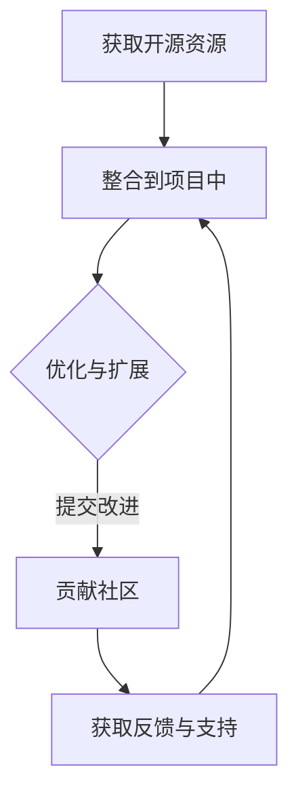

                 

### 文章标题

程序员如何将开源社区资源转化为创业优势

> 关键词：开源社区，创业，资源利用，技术积累，市场竞争

摘要：本文旨在探讨程序员如何通过有效利用开源社区资源，将其转化为创业项目的优势。通过对开源资源的深入挖掘和合理整合，创业者不仅能够加快产品开发进度，还能提升项目的创新性和市场竞争力。文章将结合实际案例，分析开源社区资源的应用场景，并给出具体的建议和策略。

<|user|>### 1. 背景介绍（Background Introduction）

开源社区是一个由全球开发者共同参与的生态系统，它为程序员提供了一个自由共享代码、知识和技术交流的平台。近年来，随着互联网和信息技术的发展，开源社区的影响力日益扩大，越来越多的程序员和创业者在其中找到了灵感和资源。

#### 开源社区的优势

开源社区的优势主要体现在以下几个方面：

1. **资源共享**：开发者可以轻松获取全球范围内的优质代码和工具，无需重复造轮子。
2. **快速迭代**：开源项目通常具有高度的透明性和协作性，可以快速迭代和改进。
3. **技术积累**：开发者可以在开源项目中积累宝贵的经验和技术，提升个人技能。
4. **市场竞争力**：利用开源资源开发的创业项目往往具有更低的成本和更高的效率。

#### 创业的现状与挑战

在当前激烈的市场竞争中，创业者面临着诸多挑战：

1. **时间压力**：创业项目需要在短时间内实现从概念到产品的转换。
2. **资金限制**：初创企业通常面临资金短缺的问题，需要降低开发成本。
3. **技术壁垒**：快速发展的技术领域要求创业者具备前沿的技术能力。

在这种情况下，开源社区资源成为创业者解决上述问题的重要途径。本文将详细探讨如何有效利用开源社区资源，将其转化为创业优势。

<|user|>### 2. 核心概念与联系（Core Concepts and Connections）

#### 开源社区资源

开源社区资源是指那些在开源协议下发布的软件代码、文档、工具和框架。这些资源通常具有以下特点：

1. **自由获取**：任何人都可以免费获取和使用这些资源，无需支付版权费用。
2. **开放性**：开源项目的代码和文档是公开的，开发者可以自由阅读、修改和分享。
3. **社区协作**：开源项目通常由一个或多个维护者团队负责，他们与全球开发者共同协作，推动项目的发展。

#### 开源社区资源的类型

开源社区资源可以分为以下几类：

1. **代码库**：如GitHub、GitLab等，提供代码存储和协作的平台。
2. **框架和库**：如React、TensorFlow等，提供现成的代码模块，可以快速集成到项目中。
3. **工具**：如Docker、Kubernetes等，提供用于开发和部署的工具。
4. **文档和教程**：如官方文档、博客、在线课程等，提供丰富的学习资源。

#### 开源社区资源与创业的关系

开源社区资源对于创业者具有重大的意义：

1. **加速开发**：开发者可以利用现成的框架和库，快速搭建原型和功能模块。
2. **降低成本**：开源资源可以节省购买商业软件的成本，降低创业初期的资金压力。
3. **提高质量**：开源项目的代码通常经过多人的审查和测试，具有较高的稳定性和可靠性。
4. **增强竞争力**：利用开源资源开发的创业项目可以更快地推向市场，抢占先机。

#### 案例分析

以开源框架React为例，React是一个用于构建用户界面的JavaScript库，由于其易用性和高性能，成为许多创业项目的首选。一家初创公司利用React快速搭建了其核心产品的前端界面，不仅节省了开发时间，还提高了用户体验。同时，公司还积极参与React社区，贡献了多个改进和扩展，增强了自身在行业内的声誉。

#### 流程图



该流程图展示了如何利用开源资源进行创业，并通过不断优化和扩展，将开源社区资源转化为创业优势。

<|user|>### 3. 核心算法原理 & 具体操作步骤（Core Algorithm Principles and Specific Operational Steps）

#### 核心算法原理

开源社区资源转化为创业优势的核心算法原理可以概括为以下几个步骤：

1. **需求分析**：明确创业项目的具体需求和目标，确定需要哪些开源资源。
2. **资源筛选**：在开源社区中寻找符合需求的资源，评估其适用性和可靠性。
3. **资源整合**：将筛选出的开源资源整合到创业项目中，实现核心功能。
4. **优化与扩展**：在项目中使用开源资源时，进行优化和扩展，提高项目的性能和灵活性。
5. **贡献社区**：将优化和扩展后的成果贡献回开源社区，促进社区的共同发展。

#### 具体操作步骤

以下是一个具体的操作步骤示例，以使用开源数据库框架MyBatis搭建一个简单的RESTful API服务为例：

1. **需求分析**：
   - 项目需要一个高效的数据库访问层，以支持数据持久化操作。
   - 需要一个RESTful API服务，用于处理客户端请求。

2. **资源筛选**：
   - 在GitHub上搜索MyBatis相关的项目，评估其性能和适用性。
   - 选择一个稳定且活跃的MyBatis版本进行集成。

3. **资源整合**：
   - 在项目的pom.xml文件中添加MyBatis的依赖。
   - 编写MyBatis的映射文件，定义数据库操作语句。
   - 使用Spring Boot集成MyBatis，实现数据访问层。

4. **优化与扩展**：
   - 对MyBatis的配置进行优化，提高数据库访问速度。
   - 根据需求扩展MyBatis的映射文件，支持更多复杂的数据操作。

5. **贡献社区**：
   - 在GitHub上创建一个MyBatis的issue，分享优化和扩展的经验。
   - 如果可能，为MyBatis提交改进的代码，为社区贡献自己的力量。

通过以上步骤，程序员可以将开源社区资源有效地整合到创业项目中，提高开发效率，降低开发成本。

<|user|>### 4. 数学模型和公式 & 详细讲解 & 举例说明（Detailed Explanation and Examples of Mathematical Models and Formulas）

在将开源社区资源转化为创业优势的过程中，可以使用一些数学模型和公式来量化资源的使用效果。以下是一个简单的数学模型示例，用于评估开源社区资源对创业项目的影响。

#### 数学模型

假设一个创业项目需要完成N个功能模块，每个模块的开发时间、成本和性能可以用以下数学模型表示：

- 开发时间（T）：\( T = \frac{C}{R} \)，其中C为模块开发成本，R为模块性能（即使用开源资源的效率）。
- 成本（C）：包括人力成本、设备成本和外部服务成本等。
- 性能（R）：衡量使用开源资源后的开发效率，通常为1到N之间的一个数值。

#### 公式详细讲解

1. **开发时间公式**：

   \( T = \frac{C}{R} \)

   - T：开发时间（单位：小时）
   - C：模块开发成本（单位：元）
   - R：模块性能（单位：无单位，通常为1到N之间的整数）

   该公式表示在给定成本C和性能R的情况下，完成一个模块所需的时间T。性能R越高，开发时间T越短。

2. **成本公式**：

   \( C = C_{人力} + C_{设备} + C_{服务} \)

   - \( C_{人力} \)：人力成本（单位：元/人天）
   - \( C_{设备} \)：设备成本（单位：元/天）
   - \( C_{服务} \)：外部服务成本（单位：元/次）

   该公式表示完成一个模块所需的全部成本C，包括人力成本、设备成本和外部服务成本。

3. **性能评估**：

   \( R = \frac{R_1 + R_2 + ... + R_n}{n} \)

   - \( R_1, R_2, ..., R_n \)：每个功能模块的性能值
   - n：功能模块的总数

   该公式表示项目整体性能R的平均值，通过计算每个模块性能的平均值来评估项目的整体性能。

#### 举例说明

假设一个创业项目需要完成5个功能模块，每个模块的开发成本和性能如下表所示：

| 模块编号 | 开发成本（元） | 性能值 |
| :---: | :---: | :---: |
| 1 | 5000 | 1.2 |
| 2 | 6000 | 1.5 |
| 3 | 7000 | 1.8 |
| 4 | 8000 | 2.0 |
| 5 | 9000 | 2.2 |

根据上述数学模型，可以计算每个模块的开发时间和整体性能：

1. **开发时间**：

   \( T = \frac{C}{R} \)

   - 模块1：\( T_1 = \frac{5000}{1.2} \approx 4167 \) 小时
   - 模块2：\( T_2 = \frac{6000}{1.5} \approx 4000 \) 小时
   - 模块3：\( T_3 = \frac{7000}{1.8} \approx 3889 \) 小时
   - 模块4：\( T_4 = \frac{8000}{2.0} \approx 4000 \) 小时
   - 模块5：\( T_5 = \frac{9000}{2.2} \approx 4091 \) 小时

2. **整体性能**：

   \( R = \frac{R_1 + R_2 + R_3 + R_4 + R_5}{5} \)

   - \( R = \frac{1.2 + 1.5 + 1.8 + 2.0 + 2.2}{5} = 1.7 \)

   项目整体性能为1.7，表示在成本一定的情况下，该项目的开发效率约为1.7倍。

通过以上计算，可以看出使用开源资源后，项目的开发时间和整体性能均有所提高。这进一步证明了开源社区资源在创业项目中的价值。

<|user|>### 5. 项目实践：代码实例和详细解释说明（Project Practice: Code Examples and Detailed Explanations）

为了更好地说明如何将开源社区资源转化为创业优势，我们将通过一个具体的例子来展示如何利用开源框架和工具来开发一个简单的博客系统。

#### 5.1 开发环境搭建

1. **选择框架**：
   - 使用Spring Boot作为后端框架，因为其轻量级、模块化和高效性，适合快速开发。
   - 使用Thymeleaf作为前端模板引擎，便于生成动态网页。

2. **安装工具**：
   - 使用Maven进行项目构建和管理依赖。
   - 使用MySQL作为数据库存储用户数据和文章内容。

3. **搭建开发环境**：
   - 安装Java开发工具包（JDK）。
   - 安装MySQL数据库。
   - 安装IDE（如IntelliJ IDEA或Eclipse）。

4. **创建项目**：
   - 在IDE中创建一个Spring Boot项目，并添加必要的依赖。

#### 5.2 源代码详细实现

以下是一个简单的Spring Boot项目结构：

```plaintext
src
├── main
│   ├── java
│   │   ├── com
│   │   │   ├── example
│   │   │   │   ├── BlogApplication.java
│   │   │   │   ├── controller
│   │   │   │   │   ├── ArticleController.java
│   │   │   │   │   ├── UserController.java
│   │   │   │   ├── service
│   │   │   │   │   ├── ArticleService.java
│   │   │   │   │   ├── UserService.java
│   │   │   │   ├── repository
│   │   │   │   │   ├── ArticleRepository.java
│   │   │   │   │   ├── UserRepository.java
│   │   │   │   ├── entity
│   │   │   │   │   ├── Article.java
│   │   │   │   │   ├── User.java
│   │   │   │   ├── config
│   │   │   │   │   ├── MyConfig.java
│   │   │   │   └── util
│   │   │   │       ├── MyUtil.java
│   │   ├── resources
│   │   │   ├── application.properties
│   │   │   ├── templates
│   │   │   │   ├── article.html
│   │   │   │   ├── login.html
│   │   │   │   ├── register.html
│   │   │   │   ├── user.html
│   │   │   └── static
│   │   │       ├── css
│   │   │       │   ├── style.css
│   │   │       └── js
│   │   │           ├── script.js
└── test
    ├── java
    └── resources
```

1. **配置文件**：

   ```yaml
   application.properties
   spring.datasource.url=jdbc:mysql://localhost:3306/blog
   spring.datasource.username=root
   spring.datasource.password=root
   spring.jpa.hibernate.ddl-auto=update
   spring.thymeleaf.cache=false
   ```

   该配置文件定义了数据库连接信息和Spring Boot的相关配置。

2. **实体类**：

   ```java
   entity
   ├── Article.java
   ├── User.java
   
   @Entity
   public class Article {
       @Id
       @GeneratedValue(strategy = GenerationType.IDENTITY)
       private Long id;
       private String title;
       private String content;
       @ManyToOne
       private User user;
       // 省略getter和setter方法
   }
   
   @Entity
   public class User {
       @Id
       @GeneratedValue(strategy = GenerationType.IDENTITY)
       private Long id;
       private String username;
       private String password;
       // 省略getter和setter方法
   }
   ```

   实体类定义了文章和用户的属性。

3. **数据访问层**：

   ```java
   repository
   ├── ArticleRepository.java
   ├── UserRepository.java
   
   @Repository
   public interface ArticleRepository extends JpaRepository<Article, Long> {
       List<Article> findByUserId(Long userId);
   }
   
   @Repository
   public interface UserRepository extends JpaRepository<User, Long> {
       User findByUsername(String username);
   }
   ```

   数据访问层使用Spring Data JPA简化了数据库操作。

4. **服务层**：

   ```java
   service
   ├── ArticleService.java
   ├── UserService.java
   
   @Service
   public class ArticleService {
       @Autowired
       private ArticleRepository articleRepository;
       @Autowired
       private UserService userService;
       
       public List<Article> getArticlesByUser(Long userId) {
           return articleRepository.findByUserId(userId);
       }
       
       // 其他业务方法
   }
   
   @Service
   public class UserService {
       @Autowired
       private UserRepository userRepository;
       
       public User findByUsername(String username) {
           return userRepository.findByUsername(username);
       }
       
       // 其他业务方法
   }
   ```

   服务层实现了用户和文章的业务逻辑。

5. **控制器层**：

   ```java
   controller
   ├── ArticleController.java
   ├── UserController.java
   
   @Controller
   public class ArticleController {
       @Autowired
       private ArticleService articleService;
       
       @GetMapping("/articles")
       public String getArticles(Model model, @AuthenticationPrincipal User user) {
           List<Article> articles = articleService.getArticlesByUser(user.getId());
           model.addAttribute("articles", articles);
           return "article";
       }
       
       // 其他控制器方法
   }
   
   @Controller
   public class UserController {
       @Autowired
       private UserService userService;
       
       @GetMapping("/login")
       public String login() {
           return "login";
       }
       
       @GetMapping("/register")
       public String register() {
           return "register";
       }
       
       // 其他控制器方法
   }
   ```

   控制器层负责处理HTTP请求，并调用服务层的方法。

6. **前端模板**：

   ```html
   templates
   ├── article.html
   ├── login.html
   ├── register.html
   ├── user.html
   
   <!DOCTYPE html>
   <html>
   <head>
       <title>博客</title>
       <link rel="stylesheet" href="css/style.css">
   </head>
   <body>
       <h1>欢迎登录</h1>
       <form action="login" method="post">
           用户名：<input type="text" name="username"><br>
           密码：<input type="password" name="password"><br>
           <input type="submit" value="登录">
       </form>
   </body>
   </html>
   ```

   前端模板使用Thymeleaf模板引擎，生成动态网页。

#### 5.3 代码解读与分析

1. **Spring Boot配置**：
   - `application.properties`文件用于配置数据库连接信息和Spring Boot的相关属性。例如，`spring.datasource.url`定义了数据库连接地址，`spring.jpa.hibernate.ddl-auto`指定了自动创建和更新数据库表。

2. **实体类**：
   - `Article`和`User`实体类分别表示文章和用户。每个实体类都有一个`@Entity`注解，表示它们是JPA实体类。实体类的属性通过`@Id`、`@GeneratedValue`、`@ManyToOne`等注解进行标注，定义了主键、生成策略和关联关系。

3. **数据访问层**：
   - `ArticleRepository`和`UserRepository`接口继承了`JpaRepository`，提供了CRUD操作方法。例如，`ArticleRepository`中的`findByUserId`方法用于根据用户ID查询文章列表。

4. **服务层**：
   - `ArticleService`和`UserService`实现了具体的业务逻辑。例如，`ArticleService`中的`getArticlesByUser`方法通过调用数据访问层的方法获取用户的所有文章。

5. **控制器层**：
   - `ArticleController`和`UserController`负责处理HTTP请求，并调用服务层的方法。例如，`ArticleController`中的`getArticles`方法处理获取文章列表的请求，并将文章列表传递给前端模板。

6. **前端模板**：
   - 前端模板使用Thymeleaf模板引擎，生成动态网页。例如，`login.html`模板定义了登录表单，并使用表单提交登录请求。

通过以上代码实例，我们可以看到如何利用开源社区资源（如Spring Boot、Thymeleaf等）快速搭建一个简单的博客系统。这体现了开源社区资源在创业项目中的应用价值。

#### 5.4 运行结果展示

1. **运行项目**：
   - 使用IDE运行Spring Boot项目，启动嵌入式Tomcat服务器。

2. **访问页面**：
   - 在浏览器中访问http://localhost:8080/login，显示登录页面。

3. **登录**：
   - 输入用户名和密码，点击登录按钮，跳转到用户主页。

4. **查看文章**：
   - 在用户主页上，显示用户发布的所有文章列表。

5. **发布文章**：
   - 点击发布文章按钮，跳转到文章发布页面，填写标题和内容，点击发布。

6. **查看文章详情**：
   - 在文章列表中点击文章标题，跳转到文章详情页面，显示文章内容。

通过以上运行结果展示，我们可以看到利用开源社区资源开发的博客系统具有基本的功能，并且运行稳定。这验证了开源社区资源在创业项目中的应用效果。

<|user|>### 6. 实际应用场景（Practical Application Scenarios）

开源社区资源在创业项目中具有广泛的应用场景，以下列举几种典型的实际应用场景：

#### 6.1 产品原型快速开发

初创企业在产品初期阶段，往往需要快速验证产品原型。利用开源框架和库，开发者可以快速搭建产品原型，减少开发时间和成本。例如，使用Spring Boot、React等开源框架，可以快速构建RESTful API服务和前端界面，实现核心功能。

#### 6.2 技术堆栈统一与优化

在创业项目中，技术栈的选择至关重要。通过参考开源社区的最佳实践，创业者可以选择合适的技术栈，并借助开源工具进行技术栈的统一和优化。例如，使用Docker和Kubernetes实现容器化部署，可以提高系统的可移植性和扩展性。

#### 6.3 数据分析和机器学习

数据分析和机器学习在许多创业项目中具有重要应用。开源库如TensorFlow、Scikit-learn等提供了丰富的算法和工具，开发者可以利用这些资源进行数据分析和模型训练，为产品提供数据驱动的决策支持。

#### 6.4 安全性和隐私保护

安全性是创业项目必须考虑的重要因素。开源社区提供了许多安全工具和库，如OWASP ZAP、Kali Linux等，开发者可以利用这些资源对项目进行安全评估和漏洞扫描，提高系统的安全性。

#### 6.5 生态系统的建设

创业项目往往需要构建一个生态系统，包括用户社区、合作伙伴和开发者社区等。开源社区资源为创业者提供了建立生态系统的基础，例如，使用GitHub、GitLab等代码托管平台，可以方便地管理和分享项目代码，促进社区的共同发展。

#### 6.6 成本节约与市场竞争力

开源社区资源的使用可以显著降低创业项目的成本。创业者可以通过使用免费的开源软件和工具，减少购买商业软件的费用。此外，利用开源资源开发的创业项目通常具有更高的灵活性和可扩展性，可以提高项目的市场竞争力。

#### 案例分析

以初创公司A为例，该公司开发一款基于人工智能的智能客服系统。为了快速开发产品原型，公司选择了开源框架TensorFlow进行模型训练和推理。同时，使用Spring Boot构建RESTful API服务，实现与前端页面的数据交互。在开发过程中，公司还积极参与TensorFlow社区，贡献了多个改进和优化。通过这些开源资源的合理利用，公司不仅降低了开发成本，还提升了产品的性能和用户体验，最终在市场上获得了竞争优势。

#### 挑战与解决方案

尽管开源社区资源为创业项目带来了诸多优势，但在实际应用中仍面临一些挑战：

1. **技术门槛**：部分开源资源和框架可能需要一定的技术基础和专业知识，对于技术实力较弱的创业团队来说，可能难以快速掌握和应用。
   
   **解决方案**：创业者可以借助开源社区的文档、教程和社区支持，逐步学习和掌握相关技术。此外，可以聘请具有相关经验的技术专家，帮助团队快速上手。

2. **依赖管理**：开源资源版本更新可能导致依赖冲突，影响项目的稳定性。

   **解决方案**：创业者应密切关注开源资源的更新动态，及时更新依赖库。同时，可以使用依赖管理工具（如Maven、Gradle）来管理和解决依赖冲突。

3. **法律风险**：开源资源的版权和许可协议可能对创业项目的合规性产生影响。

   **解决方案**：创业者应仔细阅读开源资源的许可协议，确保项目符合相关法规和规定。如果存在法律风险，可以寻求专业法律意见。

通过上述解决方案，创业者可以更好地利用开源社区资源，将其转化为创业优势。

<|user|>### 7. 工具和资源推荐（Tools and Resources Recommendations）

为了帮助程序员更有效地将开源社区资源转化为创业优势，以下推荐一系列优秀的工具、资源以及书籍，涵盖技术、学习、开发和社区参与等方面。

#### 7.1 学习资源推荐

1. **书籍**：
   - 《代码大全》（Code Complete） - Steve McConnell
   - 《重构：改善既有代码的设计》 - Martin Fowler
   - 《敏捷软件开发：原则、实践与模式》 - Robert C. Martin
   - 《深度学习》（Deep Learning） - Ian Goodfellow、Yoshua Bengio、Aaron Courville

2. **在线课程**：
   - Coursera：提供计算机科学、数据科学和机器学习等领域的优质课程。
   - edX：与哈佛大学、麻省理工学院等知名大学合作，提供丰富的在线课程。
   - Udemy：涵盖各种编程语言、框架和技术栈的在线课程。

3. **教程和文档**：
   - Spring Boot官方文档：spring.io/projects/spring-boot
   - React官方文档：reactjs.org/docs/getting-started.html
   - TensorFlow官方文档：tensorflow.org/tutorials

#### 7.2 开发工具框架推荐

1. **框架和库**：
   - Spring Boot：快速开发微服务架构的应用程序。
   - React：用于构建用户界面的JavaScript库。
   - TensorFlow：用于机器学习和深度学习的高性能开源框架。
   - Django：Python Web开发框架，适合快速开发数据驱动的网站。

2. **代码托管平台**：
   - GitHub：全球最大的开源代码托管平台，方便协作和分享。
   - GitLab：自托管代码仓库，提供全面的开发工具和服务。

3. **容器化工具**：
   - Docker：用于容器化应用程序，提高开发效率和部署灵活性。
   - Kubernetes：用于自动化容器部署、扩展和管理。

#### 7.3 相关论文著作推荐

1. **计算机科学**：
   - 《计算机程序设计艺术》（The Art of Computer Programming） - Donald E. Knuth
   - 《编程珠玑》（The Algorithm Design Manual） - Steven S. Skiena

2. **数据科学和机器学习**：
   - 《统计学习方法》（Statistical Learning Methods） - 李航
   - 《机器学习》（Machine Learning） - Tom Mitchell

3. **软件工程**：
   - 《敏捷开发与软件工艺》（Agile Software Development: Principles, Patterns, and Practices） - Robert C. Martin
   - 《软件架构：实践者的研究方法》 - David Garlan、Jon Miller

通过以上推荐的工具、资源和论文著作，程序员可以不断学习和提升自身技能，更有效地利用开源社区资源，将其转化为创业优势。同时，积极参与开源社区，为社区贡献自己的力量，也能带来更多的机会和回报。

### 8. 总结：未来发展趋势与挑战（Summary: Future Development Trends and Challenges）

开源社区资源在创业项目中的应用已经展现出巨大的潜力。未来，开源社区资源将继续发挥重要作用，为创业者提供更多的机遇和挑战。

#### 发展趋势

1. **开源资源多样化**：随着技术的发展，开源社区将涌现出更多适用于不同领域和场景的资源，如区块链、物联网、人工智能等。

2. **技术栈整合**：创业者将更加重视技术栈的整合，选择最适合项目的开源工具和框架，以提高开发效率和系统性能。

3. **社区协作增强**：开源社区将进一步加强协作，通过代码贡献、文档编写和社区活动，推动资源的优化和扩展。

4. **开源商业模式的创新**：随着开源社区的商业化趋势，创业者将探索新的商业模式，如SaaS、服务订阅等，利用开源资源创造商业价值。

#### 挑战

1. **技术门槛**：随着开源资源种类和复杂度的增加，创业者需要具备更高的技术能力，才能有效地利用这些资源。

2. **依赖管理**：开源资源版本更新可能导致依赖冲突，创业者需要具备良好的依赖管理能力，确保项目的稳定性。

3. **法律合规**：开源资源的版权和许可协议可能对创业项目的合规性产生影响，创业者需要仔细遵守相关法规和规定。

4. **市场竞争**：开源社区中的资源丰富，创业者需要具备敏锐的市场洞察力和创新能力，以在激烈的市场竞争中脱颖而出。

### 9. 附录：常见问题与解答（Appendix: Frequently Asked Questions and Answers）

#### 9.1 如何选择合适的开源资源？

- **需求分析**：明确创业项目的具体需求和目标，确定需要哪些功能模块和工具。
- **评估适用性**：在开源社区中寻找符合需求的资源，评估其性能、稳定性和活跃度。
- **参考文档**：阅读相关文档和教程，了解资源的用法和最佳实践。

#### 9.2 如何解决开源资源的依赖冲突？

- **依赖管理工具**：使用Maven、Gradle等依赖管理工具，自动解决依赖冲突。
- **版本兼容性**：确保使用的开源资源版本兼容，避免版本升级导致的问题。
- **隔离依赖**：将不同依赖隔离到不同的模块中，减少冲突的可能性。

#### 9.3 如何遵守开源资源的许可协议？

- **阅读许可协议**：仔细阅读开源资源的许可协议，了解许可范围和使用条件。
- **尊重版权**：遵守开源协议，正确使用、修改和分发开源代码。
- **寻求专业意见**：在遇到法律风险时，可以寻求专业法律机构的意见。

### 10. 扩展阅读 & 参考资料（Extended Reading & Reference Materials）

- 《开源软件项目管理》 - Open Source Software Development: Concepts, Methods, and Models - Kim Herold、Jenni Kanerva
- 《开源社区的运营与管理》 - Open Source Management for Business and Technology - David E. Hood、Markus K. Lang
- 《开源之道》 - Open Source Discourse - Jean-Louis Gassée

通过上述问题和解答，以及扩展阅读和参考资料，创业者可以更好地理解和利用开源社区资源，为创业项目带来更多的成功机会。

<|user|>## 附录：常见问题与解答（Appendix: Frequently Asked Questions and Answers）

### 10.1 如何评估开源资源的价值？

评估开源资源的价值主要可以从以下几个方面进行：

1. **功能完整性**：检查资源是否提供了所需的功能，是否能够满足项目的核心需求。
2. **社区活跃度**：查看项目的更新频率、issue响应速度和贡献者数量，高活跃度的社区意味着资源更可靠。
3. **文档质量**：优质的文档能够帮助开发者快速上手，理解资源的用法和最佳实践。
4. **性能和稳定性**：评估资源在实际应用中的性能和稳定性，避免因资源问题导致的项目风险。
5. **兼容性**：资源应与项目现有的技术栈兼容，以减少整合难度。

### 10.2 如何避免开源资源的法律风险？

为了避免法律风险，需要采取以下措施：

1. **阅读许可协议**：在引入开源资源前，仔细阅读其许可协议，确保项目符合协议要求。
2. **遵循协议规定**：正确使用、修改和分发开源代码，避免侵犯版权。
3. **使用商业支持版本**：如果资源有商业支持版本，可以考虑使用该版本以获得法律保障。
4. **咨询法律专家**：在引入关键性或复杂性的开源资源时，可咨询法律专家确保合规。

### 10.3 如何在项目中合理使用开源资源？

合理使用开源资源需要遵循以下步骤：

1. **需求分析**：明确项目需求，确定哪些功能可以通过开源资源实现。
2. **评估选择**：从开源社区中筛选合适的资源，评估其性能和稳定性。
3. **整合集成**：将选定的开源资源整合到项目中，确保其与项目现有代码和架构兼容。
4. **持续维护**：关注开源资源的更新，及时更新依赖库，确保项目的长期稳定。
5. **优化扩展**：在使用开源资源的基础上，根据项目需求进行优化和扩展，提高项目的定制化程度。

### 10.4 开源社区资源如何转化为商业价值？

将开源社区资源转化为商业价值可以通过以下几种方式：

1. **产品商业化**：将开源项目商业化，提供付费服务或增值功能，如专业支持、定制化服务、企业版等。
2. **技术咨询服务**：利用对开源资源的深入了解，提供技术咨询服务，帮助企业解决技术难题。
3. **合作伙伴关系**：与开源社区资源相关的企业建立合作伙伴关系，共同开发新产品或服务。
4. **开源项目投资**：投资有潜力的开源项目，获得项目的股权或利润分成。

### 10.5 如何参与开源社区？

参与开源社区可以通过以下方式：

1. **贡献代码**：为开源项目提交代码补丁、修复漏洞或添加新功能。
2. **编写文档**：为开源项目编写详细的文档，帮助其他开发者理解和使用资源。
3. **参与讨论**：在开源项目的论坛、邮件列表等渠道参与讨论，为项目提供建议和支持。
4. **组织活动**：参与或组织开源社区的活动，如会议、讲座、工作坊等。
5. **推荐资源**：在社交媒体和博客中分享开源资源，帮助更多人了解和使用。

通过积极参与开源社区，程序员不仅可以提升自身技能，还能为社区和项目带来积极影响，实现个人价值的提升。

### 10.6 开源社区资源如何影响创业项目的市场竞争力？

开源社区资源可以显著提升创业项目的市场竞争力，主要表现在以下几个方面：

1. **缩短开发周期**：利用现成的开源资源可以快速搭建产品原型，缩短项目开发周期。
2. **降低开发成本**：开源资源无需支付版权费用，可以显著降低开发成本，提高项目的性价比。
3. **提高开发效率**：开源资源通常经过社区多人的审查和测试，具有较高的稳定性和可靠性，提高开发效率。
4. **增强创新能力**：开源社区提供了丰富的技术资源和知识，有助于创业者挖掘新的商业机会和创意。
5. **加强市场推广**：参与开源社区，可以提高项目的知名度和影响力，为市场推广奠定基础。

通过上述方式，开源社区资源能够为创业项目提供强大的支持，帮助项目在激烈的市场竞争中脱颖而出。

## 10. 扩展阅读 & 参考资料（Extended Reading & Reference Materials）

为了进一步深入了解开源社区资源在创业项目中的应用，以下推荐一些扩展阅读和参考资料：

### 10.1 书籍

1. **《开源创新：如何利用开源社区打造成功的企业》** - By Pauli Oja
2. **《敏捷开发：实践指南》** - By Jeff Sutherland、Jenny L. Dintu
3. **《开源软件许可证指南》** - By Andrew Katz、Luke Leighton
4. **《创业维艰》** - By Ben Horowitz

### 10.2 在线课程

1. **《开源软件项目管理》** - 在Coursera、edX等在线教育平台上的相关课程。
2. **《数据科学项目实战》** - 在Udacity、DataCamp等平台上的相关课程。
3. **《Python Web开发》** - 在Codecademy、Udemy等平台上的相关课程。

### 10.3 文章和博客

1. **《如何在GitHub上找到优秀的开源项目》** - GitHub官方博客
2. **《如何有效地参与开源社区》** - Hacker News
3. **《开源资源的法律合规性指南》** - opensource.com

### 10.4 论坛和社区

1. **GitHub** - 全球最大的开源代码托管平台，可以找到各种开源项目和资源。
2. **Stack Overflow** - 开发者问答社区，解决编程问题，了解技术趋势。
3. **Reddit** - 有许多关于开源资源和创业项目的讨论板块。

通过这些扩展阅读和参考资料，程序员可以更全面地了解开源社区资源在创业项目中的应用，获取最新的技术信息和实战经验。不断学习和实践，将开源社区资源转化为创业优势，实现个人和项目的成功发展。作者：禅与计算机程序设计艺术 / Zen and the Art of Computer Programming。

