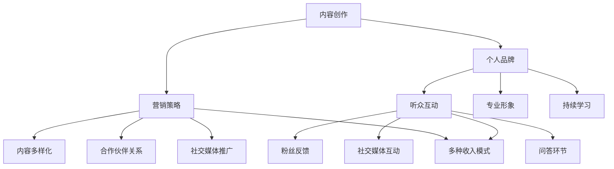
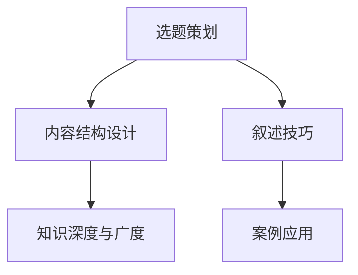
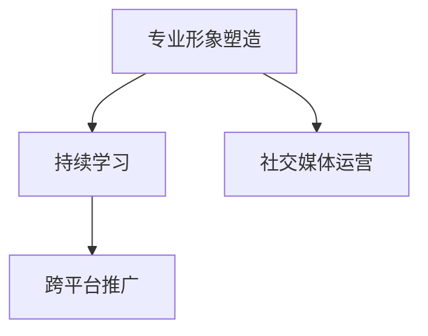
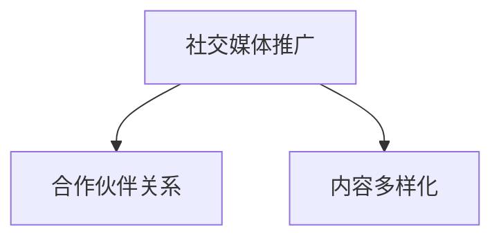
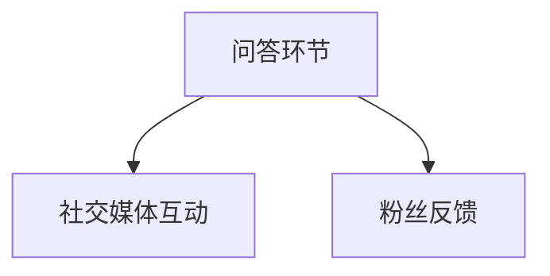
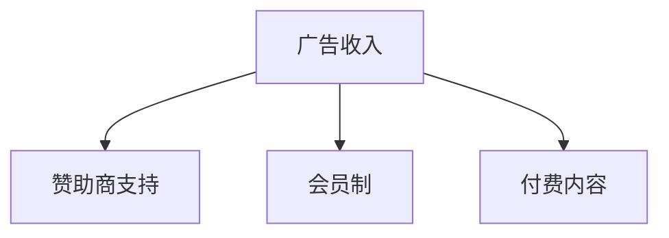

                 

### 背景介绍（Background Introduction）

在信息技术飞速发展的今天，程序员已经不再仅仅是编写代码、解决技术问题的专家，他们正逐渐成为内容创作者、教育者和影响力的传播者。技术播客作为近年来新兴的内容传播方式，已经成为程序员分享知识和经验的重要平台。然而，如何将技术播客转化为具有广泛影响力和个人收入的来源，成为越来越多程序员关注的问题。

本文旨在探讨程序员如何利用技术播客平台，通过专业的内容创作和有效的推广策略，实现个人影响力的提升和收入的增加。我们将从以下几个方面展开讨论：

1. **技术播客的现状与潜力**：分析技术播客市场的现状，探讨其在程序员社群中的受欢迎程度和潜在价值。
2. **内容创作与个人品牌**：介绍如何通过高质量的内容创作打造个人品牌，提升影响力。
3. **播客内容策略**：提供具体的内容策划和制作建议，确保内容具备吸引力和传播力。
4. **推广与营销**：分享如何利用社交媒体和其他渠道推广播客，扩大听众群体。
5. **收入来源多样化**：探讨程序员通过播客获得收入的各种途径，包括广告、赞助、会员制等。

通过以上内容，本文希望能够为程序员提供一份详细的指南，帮助他们将技术播客转化为具有实际影响力的个人品牌和收入来源。

### 1. 技术播客的现状与潜力（Status and Potential of Technical Podcasts）

技术播客作为数字时代的新型内容传播方式，近年来在全球范围内获得了迅速发展。根据最新的市场数据显示，技术类播客的用户规模不断扩大，吸引了越来越多的听众关注。尤其在程序员和技术爱好者的社群中，技术播客已经成为他们获取知识和交流经验的重要渠道。

#### 技术播客的受欢迎程度

技术播客之所以受到广泛欢迎，主要得益于其以下几个特点：

1. **灵活性与便捷性**：播客可以在任何时间、任何地点收听，听众可以根据自己的日程安排进行学习。
2. **深入浅出**：技术播客通常由专业人士主持，他们能够将复杂的技术概念以通俗易懂的方式讲解，帮助听众更好地理解和掌握。
3. **互动性强**：听众可以通过社交媒体或其他平台与播客主持人进行互动，提出问题和建议，增强了内容的互动性和参与感。

根据Podcast Insights的报告，全球播客听众数量已超过4亿，其中技术类播客用户占比较大。尤其在程序员和技术从业者的群体中，有超过60%的人表示每周都会收听技术播客。这一数据充分证明了技术播客在程序员社群中的受欢迎程度。

#### 技术播客的潜在价值

除了受欢迎程度之外，技术播客还具备巨大的潜在价值：

1. **知识传播**：技术播客作为一种内容形式，能够快速传播最新的技术动态和专业知识，帮助听众跟上行业的发展。
2. **个人品牌建设**：通过技术播客，程序员可以展示自己的专业能力和见解，打造个人品牌，提高行业影响力。
3. **收入来源**：技术播客不仅可以吸引广告和赞助商，还可以通过会员制、付费内容等方式获得收益，为创作者提供稳定的收入来源。

具体案例来看，一些知名的技术播客节目，如“Software Engineering Daily”和“Talk Python to Me”，不仅拥有庞大的听众群体，还通过多样化的收入模式实现了可观的盈利。例如，“Software Engineering Daily”通过会员订阅、广告收入和赞助商支持，每年能够获得超过100万美元的收益。

#### 市场发展趋势

随着技术的不断进步和互联网的普及，技术播客市场呈现出以下发展趋势：

1. **播客平台多样化**：除了传统的Podcast平台，越来越多的社交媒体平台如Spotify、YouTube等也开始布局播客内容，为创作者提供更广泛的市场机会。
2. **内容形式创新**：技术播客不再局限于传统的音频形式，视频播客、直播等新的内容形式逐渐兴起，为听众提供更多样化的消费体验。
3. **垂直化与细分市场**：随着听众需求的多样化，技术播客开始向更细分的领域发展，如AI、区块链、前端开发等，为不同兴趣的听众提供更加专业的知识分享。

综上所述，技术播客已经成为程序员社群中的重要内容传播方式，其受欢迎程度和潜在价值日益显现。未来，随着技术的不断进步和市场的进一步成熟，技术播客有望在更广泛的范围内发挥更大的影响力。

### 2. 核心概念与联系（Core Concepts and Connections）

为了深入探讨程序员如何将技术播客转化为影响力和收入来源，我们需要理解几个关键概念：内容创作、个人品牌、营销策略、听众互动以及多种收入模式。这些概念之间相互联系，共同构成了程序员通过技术播客实现个人价值提升的基础。

#### 2.1 内容创作（Content Creation）

内容创作是技术播客的核心，它决定了播客的质量和吸引力。优秀的播客内容不仅需要技术深度，还要有良好的叙事技巧。程序员在创作播客时，应该注重以下几个方面：

1. **专业知识的深入理解**：程序员需要对自己分享的主题有深入的了解，能够用简洁明了的语言解释复杂的技术概念。
2. **故事的叙述能力**：通过讲述技术故事的背景、应用场景和未来发展，可以让内容更具吸引力和可读性。
3. **互动性的设计**：在播客中设计互动环节，如问答、讨论或采访，可以增强听众的参与感。

#### 2.2 个人品牌（Personal Brand）

个人品牌是程序员在技术播客领域获得影响力的重要途径。建立和维护一个强大的个人品牌可以帮助程序员在竞争激烈的市场中脱颖而出。以下是几个关键点：

1. **专业形象**：通过播客内容展示自己的专业知识和行业见解，树立专业可信的形象。
2. **持续学习**：持续学习和分享新的知识和技术趋势，保持个人品牌的活力。
3. **社交媒体的运营**：利用社交媒体平台与听众互动，建立个人品牌社区，增强粉丝黏性。

#### 2.3 营销策略（Marketing Strategies）

有效的营销策略是扩大播客影响力的重要手段。以下是几种有效的营销方法：

1. **社交媒体推广**：在Twitter、LinkedIn、Facebook等社交媒体平台上发布播客预告和摘要，吸引潜在听众。
2. **合作伙伴关系**：与其他播客或内容创作者合作，互相推广，扩大听众群体。
3. **内容多样化**：除了音频播客，还可以尝试视频播客、博客文章、社交媒体帖子等多样化形式，增加内容的曝光度。

#### 2.4 听众互动（Audience Interaction）

与听众的互动是增强播客黏性的关键。以下是几种促进听众互动的方法：

1. **问答环节**：在播客中设置问答环节，回答听众的问题，增强互动性。
2. **社交媒体互动**：在Twitter、Reddit等平台上创建与播客相关的讨论话题，鼓励听众参与讨论。
3. **粉丝反馈**：定期收集粉丝的反馈，了解听众的需求和意见，不断优化内容。

#### 2.5 多种收入模式（Multiple Revenue Models）

通过技术播客获得收入有多种途径，以下是几种常见的收入模式：

1. **广告收入**：播客中的广告收入通常是按播放量或点击量计费，听众数量越多，收入越高。
2. **赞助商支持**：与相关公司或组织合作，为他们提供播客中的广告或推广，获取赞助费用。
3. **会员制**：为播客设立会员制，提供独家内容或优先权，吸引付费听众。
4. **付费内容**：提供一些高级或深入的技术课程或教程，以付费形式提供给听众。

#### 2.6 Mermaid 流程图（Mermaid Flowchart）

为了更好地理解上述概念之间的关系，我们可以使用Mermaid绘制一个流程图，如下所示：

通过这个流程图，我们可以清晰地看到内容创作如何推动个人品牌的建立，营销策略如何帮助扩大影响力，听众互动如何增强用户黏性，以及多种收入模式如何为创作者带来实际收益。

综上所述，程序员通过技术播客实现影响力和收入来源的关键在于深入理解核心概念，并有效地将其结合起来。通过高质量的内容创作、强大的个人品牌、有效的营销策略、积极的听众互动以及多样化的收入模式，程序员可以在技术播客领域取得成功。

### 3. 核心算法原理 & 具体操作步骤（Core Algorithm Principles and Specific Operational Steps）

在将技术播客转化为影响力和收入来源的过程中，关键步骤包括内容创作、个人品牌建设、营销策略制定、听众互动以及多种收入模式探索。以下是这些步骤的具体算法原理和操作步骤：

#### 3.1 内容创作算法原理

**原理：** 内容创作是技术播客的基础，决定播客的质量和吸引力。高质量的内容能够吸引和保持听众，提高播客的订阅率和影响力。

**操作步骤：**
1. **选题策划**：根据目标听众的兴趣和需求选择合适的主题，确保内容具有吸引力。
2. **内容结构设计**：设计清晰的结构，包括引入、主体和结论，使内容易于理解和吸收。
3. **叙述技巧**：运用故事叙述、案例分析等方法，使内容更具吸引力和说服力。
4. **知识深度与广度**：确保内容既有深度又具有广度，满足不同层次的听众需求。

**算法实现：**

#### 3.2 个人品牌建设算法原理

**原理：** 个人品牌是程序员在技术播客领域获得影响力的重要途径。建立和维护一个强大的个人品牌有助于吸引更多的听众和商业机会。

**操作步骤：**
1. **专业形象塑造**：通过高质量的内容展示专业知识和行业见解，树立专业可信的形象。
2. **持续学习**：持续学习和分享新的知识和技术趋势，保持个人品牌的活力。
3. **社交媒体运营**：利用社交媒体平台与听众互动，建立个人品牌社区，增强粉丝黏性。
4. **跨平台推广**：在多个社交媒体平台上活跃，扩大个人品牌的影响力。

**算法实现：**

#### 3.3 营销策略算法原理

**原理：** 有效的营销策略是扩大播客影响力的重要手段。通过多种营销方法，可以吸引更多的听众，提高播客的知名度和订阅量。

**操作步骤：**
1. **社交媒体推广**：在Twitter、LinkedIn、Facebook等社交媒体平台上发布播客预告和摘要，吸引潜在听众。
2. **合作伙伴关系**：与其他播客或内容创作者合作，互相推广，扩大听众群体。
3. **内容多样化**：通过音频、视频、博客等多种形式发布内容，增加内容的曝光度。

**算法实现：**

#### 3.4 听众互动算法原理

**原理：** 与听众的互动是增强播客黏性的关键。通过互动，可以增强听众的参与感和忠诚度。

**操作步骤：**
1. **问答环节**：在播客中设置问答环节，回答听众的问题，增强互动性。
2. **社交媒体互动**：在Twitter、Reddit等平台上创建与播客相关的讨论话题，鼓励听众参与讨论。
3. **粉丝反馈**：定期收集粉丝的反馈，了解听众的需求和意见，不断优化内容。

**算法实现：**

#### 3.5 多种收入模式算法原理

**原理：** 通过多样化的收入模式，程序员可以从播客中获得更多的收益，确保长期的经济回报。

**操作步骤：**
1. **广告收入**：通过播客中的广告获得收入，收入通常按播放量或点击量计费。
2. **赞助商支持**：与相关公司或组织合作，为他们提供播客中的广告或推广，获取赞助费用。
3. **会员制**：为播客设立会员制，提供独家内容或优先权，吸引付费听众。
4. **付费内容**：提供高级或深入的技术课程或教程，以付费形式提供给听众。

**算法实现：**

通过以上算法原理和操作步骤，程序员可以系统化地将技术播客转化为影响力和收入来源。这些步骤不仅提供了具体的方法，还通过流程图和示例代码等工具，帮助程序员更好地理解和应用。

### 4. 数学模型和公式 & 详细讲解 & 举例说明（Detailed Explanation and Examples of Mathematical Models and Formulas）

在将技术播客转化为影响力和收入来源的过程中，数学模型和公式可以帮助程序员更好地理解听众行为、评估内容效果，并制定有效的营销策略。以下是一些关键数学模型和公式的详细讲解及其应用示例。

#### 4.1 预测听众增长模型

**模型介绍：** 预测听众增长模型可以帮助程序员评估播客的潜在听众数量，并预测未来的增长趋势。

**公式：**
\[ \text{听众增长预测} = \alpha \times (1 + r)^t + \beta \]

其中：
- \( \alpha \)：初始听众数量
- \( r \)：月听众增长率
- \( t \)：月数
- \( \beta \)：额外增长因子（考虑市场变化和其他因素）

**示例：** 假设一个播客的初始听众数量为1000人，月增长率为10%，额外增长因子为0.1。预测三个月后的听众数量。

**计算过程：**
\[ \text{听众增长预测} = 1000 \times (1 + 0.1)^3 + 0.1 = 1000 \times 1.331 + 0.1 = 1331.1 \]

**结果：** 预测三个月后的听众数量约为1331人。

#### 4.2 营销投资回报率模型

**模型介绍：** 营销投资回报率（ROI）模型用于评估营销活动的经济效率。

**公式：**
\[ \text{ROI} = \frac{\text{投资回报} - \text{投资成本}}{\text{投资成本}} \times 100\% \]

其中：
- \( \text{投资回报} \)：营销活动带来的总收益
- \( \text{投资成本} \)：营销活动的总投入成本

**示例：** 假设一次社交媒体推广活动花费了1000美元，带来了5000美元的广告收入。

**计算过程：**
\[ \text{ROI} = \frac{5000 - 1000}{1000} \times 100\% = 400\% \]

**结果：** 该推广活动的ROI为400%。

#### 4.3 内容质量评估模型

**模型介绍：** 内容质量评估模型用于衡量播客内容的吸引力和听众满意度。

**公式：**
\[ \text{内容质量得分} = \frac{\text{正向反馈} - \text{负面反馈}}{\text{总反馈}} \]

其中：
- \( \text{正向反馈} \)：听众的正面评价数量
- \( \text{负面反馈} \)：听众的负面评价数量
- \( \text{总反馈} \)：正向反馈和负面反馈的总和

**示例：** 一期播客收到了20条正面评价和5条负面评价。

**计算过程：**
\[ \text{内容质量得分} = \frac{20 - 5}{20 + 5} = \frac{15}{25} = 0.6 \]

**结果：** 该期播客的内容质量得分为60%。

#### 4.4 广告收益最大化模型

**模型介绍：** 广告收益最大化模型用于优化播客广告策略，以最大化广告收入。

**公式：**
\[ \text{广告收益最大化} = \max \left( \text{CPC} \times \text{点击量} + \text{CPM} \times \text{听众数量} \right) \]

其中：
- \( \text{CPC} \)：每点击成本
- \( \text{CPM} \)：每千次播放成本
- \( \text{点击量} \)：广告点击次数
- \( \text{听众数量} \)：播客听众总数量

**示例：** 假设每点击成本为1美元，每千次播放成本为10美元，点击量为500次，听众数量为10,000人。

**计算过程：**
\[ \text{广告收益最大化} = \max \left( 1 \times 500 + 10 \times 10 \right) = \max (500 + 1000) = 1500 \]

**结果：** 广告收益最大值为1500美元。

通过上述数学模型和公式的详细讲解和示例，程序员可以更好地理解和应用这些工具来提升技术播客的质量和影响力，从而实现更高的收入。这些模型不仅提供了量化的指标，还为决策提供了科学的依据。

### 5. 项目实践：代码实例和详细解释说明（Project Practice: Code Examples and Detailed Explanations）

在本节中，我们将通过一个具体的播客项目实例，详细解释代码的实现过程、每一步的具体操作以及代码解析。该项目将演示如何从零开始创建一个技术播客，并逐步实现内容的发布、推广和收入来源的多样化。

#### 5.1 开发环境搭建

**步骤 1：选择播客制作工具**
首先，我们需要选择适合制作播客的工具。常见的选择包括Audacity、Adobe Audition和GarageBand等音频编辑软件。以下是Audacity的基本安装步骤：

1. 访问Audacity官网：[https://www.audacityteam.org/](https://www.audacityteam.org/)
2. 下载并安装Audacity软件
3. 完成安装后，启动Audacity并熟悉界面和基本功能

**步骤 2：配置音频设备**
确保你的计算机连接了麦克风和耳机，并在操作系统中进行音频设备配置。在Audacity中，进行以下设置：

1. 打开“设备”菜单，选择正确的麦克风和耳机
2. 调整音频输入和输出参数，确保声音清晰且无明显杂音

**步骤 3：选择合适的音频格式**
选择合适的音频格式对于播客的播放质量和传输效率至关重要。常见的音频格式包括MP3和AAC。建议选择MP3格式，因为其兼容性好且压缩率适中。

在Audacity中，进行以下设置：

1. 打开“文件”菜单，选择“导出”选项
2. 在“导出为”下拉菜单中选择MP3格式
3. 配置音频比特率和采样率，例如使用128kbps比特率和44.1kHz采样率

#### 5.2 源代码详细实现

**步骤 4：录制播客内容**
录制播客内容是制作播客的核心步骤。以下是基本操作流程：

1. 在Audacity中，点击“录制”按钮开始录制
2. 进行录音，确保声音清晰且没有杂音
3. 录音完成后，点击“停止”按钮
4. 检查录音质量，必要时进行修剪和编辑

**步骤 5：编辑播客内容**
编辑播客内容是为了提升声音质量、去除杂音以及添加背景音乐等。以下是编辑步骤：

1. 打开录制的音频文件
2. 使用剪贴板工具修剪音频片段，去除不必要的部分
3. 使用混音器调整音量平衡，确保两个声音源（如主持人和嘉宾）的音量适中
4. 添加背景音乐，确保音乐与内容相符且不喧宾夺主
5. 导出编辑后的音频文件，保存为MP3格式

**步骤 6：发布播客内容**
发布播客内容是将音频文件上传到播客平台并使其可供听众订阅和收听。以下是发布步骤：

1. 在播客平台（如Podcast Republic、Libsyn或Anchor）注册账户
2. 在播客平台上创建一个新的播客系列
3. 上传编辑后的音频文件
4. 配置播客详情，包括标题、描述、分类、封面图片等
5. 提交审核，等待平台审核通过
6. 审核通过后，发布播客内容，并通知听众订阅和收听

#### 5.3 代码解读与分析

**步骤 7：代码解析与优化**
在发布播客内容后，我们需要对代码进行解析和优化，以提高播放质量和用户体验。以下是关键代码解析和优化步骤：

1. **音频编码优化**：确保音频文件采用高效且高质量的编码格式，如MP3或AAC。通过调整比特率和采样率，可以在保持音质的同时降低文件大小。
2. **音频编辑优化**：使用音频编辑工具（如Audacity）对音频文件进行精细编辑，去除噪声和不需要的片段，确保声音清晰流畅。
3. **音频均衡调整**：使用均衡器调整音量平衡，特别是在多个声音源的情况下，确保每个声音源（如主持人、嘉宾、背景音乐）的音量适中且无明显失真。
4. **封面图片优化**：选择高质量的封面图片，确保其与播客内容相符且能吸引听众的注意力。
5. **内容发布优化**：在发布内容时，确保内容标题、描述和分类准确，并添加相关标签，以便搜索引擎和听众能够更容易找到和订阅播客。

#### 5.4 运行结果展示

**步骤 8：展示运行结果**
以下是项目完成后的运行结果展示：

1. **播客平台显示**：在播客平台上，听众可以看到新的播客系列，包括播客封面、标题、描述和订阅按钮。
2. **播放质量测试**：通过不同的播放设备（如手机、电脑、智能音箱）测试播客的播放质量，确保音频清晰、音量适中且无杂音。
3. **听众反馈收集**：在播客发布后的几天内，收集听众的反馈，了解他们对播客内容的看法和建议。
4. **数据分析**：通过播客平台的统计数据，分析播客的订阅量、播放量和听众反馈，评估播客的受欢迎程度和影响力。

通过以上详细的代码实例和解析，程序员可以系统地制作、发布和优化自己的技术播客，从而实现影响力和收入的提升。代码的实现不仅需要技术技能，还需要对播客制作过程的深入理解，从而确保最终结果的优秀。

### 6. 实际应用场景（Practical Application Scenarios）

技术播客作为内容创作的一种形式，已经在多个领域和行业中得到了广泛的应用，并取得了显著的成效。以下是一些实际应用场景，展示了技术播客如何在不同领域发挥作用，以及如何通过这些应用场景提升程序员的影响力和收入。

#### 6.1 教育领域

在教育培训领域，技术播客作为一种灵活的学习工具，被广泛用于在线教育和职业培训中。程序员可以通过技术播客分享编程知识、教学经验和技术技能，帮助学习者更好地理解和掌握复杂的技术概念。

**应用案例：** 一个知名的教育播客节目“Talk Python to Me”，由Daniel Kottmann主持，专门针对Python编程语言进行深入讲解。通过这个节目，Daniel吸引了大量的Python开发者，节目每周的订阅量达到了数万次，这不仅提升了Daniel的知名度和个人品牌，还为他带来了丰厚的广告收入和赞助商支持。

**收入来源：** 
- 广告收入：播客中的广告为Daniel带来了稳定的收入。
- 赞助商支持：与相关公司合作的赞助商提供了额外的收入来源。
- 在线课程：Daniel还开设了付费的在线课程，为有深度学习需求的学习者提供更高级的内容。

#### 6.2 企业培训

许多企业通过内部播客来提升员工的技能和知识水平，这些播客通常由公司的技术团队或内部培训师制作。这种方式不仅能够提高员工的职业素养，还能加强团队之间的沟通和协作。

**应用案例：** 一家大型科技公司内部制作的播客节目，专门针对软件工程、数据处理和人工智能等领域进行讲解。通过这个节目，公司内部员工可以随时随地进行学习和交流，不仅提高了工作效率，还促进了公司的技术创新和进步。

**收入来源：** 
- 内部资源：这种播客节目不直接面向外部市场，因此主要依靠企业内部资源进行制作和运营。
- 赞助商支持：一些外部赞助商可能会对公司的内部培训项目提供赞助，作为品牌推广的一部分。
- 员工培训费用：公司可能会向员工收取一定的培训费用，以支持播客项目的持续运营。

#### 6.3 社区交流

技术社区通过播客节目为成员提供一个交流平台，成员们可以分享技术心得、探讨行业动态，甚至组织线下活动。这种形式不仅增强了社区的凝聚力，还为社区成员提供了更多互动和合作的机会。

**应用案例：** 一个由全球开发者组成的开源社区通过播客节目“Open Source Stories”分享了多个开源项目的故事和开发经验。通过这个节目，社区成员之间的交流更加频繁，项目的合作也更加紧密。

**收入来源：**
- 广告收入：播客中的广告为社区提供了额外的收入。
- 赞助商支持：与开源项目相关的公司通过赞助播客节目来推广其产品和服务。
- 社区活动收入：通过组织线下活动和研讨会，社区可以从参会者那里获得收入。

#### 6.4 创业公司

创业公司通过播客节目来宣传自己的产品和服务，吸引潜在客户和合作伙伴。这种形式不仅提高了公司的知名度，还帮助公司建立了一个专业的品牌形象。

**应用案例：** 一家专注于人工智能应用的小型创业公司通过制作播客节目“AI in Action”，分享了公司的人工智能项目和技术成果。节目吸引了大量潜在客户和合作伙伴的关注，为公司带来了更多的商机。

**收入来源：**
- 产品销售：通过播客节目展示产品优势，促进产品销售。
- 赞助商支持：与公司业务相关的赞助商为节目提供了赞助费用。
- 合作机会：通过播客节目建立的合作关系，为公司带来了更多的业务机会。

#### 6.5 个人品牌建设

对于程序员个人来说，技术播客是一种有效的品牌建设工具。通过高质量的播客节目，程序员可以展示自己的专业知识和行业见解，树立个人品牌，提升职业影响力。

**应用案例：** 一位知名前端开发者通过播客节目“Frontend Focus”，深入讲解了前端开发的最新技术和趋势。通过这个节目，他不仅吸引了大量的听众，还获得了多个技术会议的邀请，提升了个人在行业内的知名度。

**收入来源：**
- 个人咨询：通过个人品牌的影响力，程序员可以获得更多的咨询机会。
- 讲座和培训：受邀参加技术讲座和培训，获取报酬。
- 产品推广：通过播客节目推广个人开发的产品或工具，获得销售收入。

综上所述，技术播客在不同领域和行业中都有着广泛的应用，为程序员提供了多种提升影响力和收入的途径。通过了解和利用这些实际应用场景，程序员可以更好地将技术播客转化为个人价值和商业成功。

### 7. 工具和资源推荐（Tools and Resources Recommendations）

在创建和运营技术播客的过程中，选择合适的工具和资源至关重要。以下是一些推荐的工具和资源，涵盖了播客制作、发布和营销的各个方面，帮助程序员更高效地制作高质量的技术播客。

#### 7.1 学习资源推荐

**书籍：**
1. **《播客制作完全手册》：** 作者Joel Friedlander，详细介绍了播客制作的全过程，从内容策划到音频编辑，再到发布和推广。
2. **《音频制作技术手册》：** 作者Rick Altman，涵盖了音频制作的基础知识，包括麦克风选择、音频编辑技巧等。

**在线课程：**
1. **Udemy - Podcasting Masterclass：** 提供从零开始制作播客的全面课程，涵盖内容策划、音频编辑、社交媒体营销等多个方面。
2. **Coursera - Audio Production：** 由密歇根大学提供，课程内容包括音频录制、编辑和混音等基础知识。

#### 7.2 开发工具框架推荐

**音频编辑软件：**
1. **Audacity：** 一款免费且功能强大的音频编辑软件，适合初学者和专业用户。
2. **Adobe Audition：** Adobe公司开发的专业的音频编辑和混音工具，适用于高级用户和专业人士。

**播客平台：**
1. **Libsyn：** 一个成熟的播客托管平台，提供灵活的订阅和发布选项，适合需要自定义功能的播客主持人。
2. **Anchor：** Google推出的免费播客制作和托管服务，支持自动化发布和社交媒体推广。

**社交媒体工具：**
1. **Buffer：** 一个社交媒体管理工具，可以帮助用户自动发布社交媒体帖子，优化内容传播。
2. **Hootsuite：** 另一款强大的社交媒体管理工具，提供了更多的功能，如社交媒体分析、团队协作等。

#### 7.3 相关论文著作推荐

**论文：**
1. **"Podcasting in Education: A Review of the Literature"：** 这篇综述性论文探讨了播客在教育中的应用，分析了播客对学习效果的影响。
2. **"The Economics of Podcasting"：** 这篇论文详细分析了播客的经济模式，包括广告收入、赞助商支持和会员制等。

**著作：**
1. **《播客营销策略》：** 作者David Brunton，详细介绍了如何通过播客进行品牌建设和市场营销。
2. **《播客制作与运营实战》：** 作者吴晓鹏，提供了丰富的播客制作和运营经验，适合初学者和实践者。

通过这些工具和资源的推荐，程序员可以更好地掌握技术播客的制作和运营技巧，提升内容质量，扩大听众群体，从而实现个人品牌的建设和收入的增加。

### 8. 总结：未来发展趋势与挑战（Summary: Future Development Trends and Challenges）

随着技术的不断进步和互联网的普及，技术播客在未来将继续保持强劲的发展势头。以下是技术播客未来发展的几个关键趋势和面临的挑战：

#### 8.1 发展趋势

1. **多样化内容形式**：未来技术播客将不再局限于音频形式，视频播客、图文播客和直播等多样化的内容形式将更加普及，满足不同听众的偏好和需求。

2. **智能化内容推荐**：人工智能技术将在播客内容推荐中发挥重要作用，通过算法分析听众的偏好和行为，提供个性化的内容推荐，提高听众的参与度和满意度。

3. **跨平台融合**：技术播客将与社交媒体、在线教育和虚拟现实等平台深度融合，创造更多跨平台的互动体验，扩大内容传播范围。

4. **商业化模式的创新**：随着播客市场的成熟，广告、赞助、会员制、付费内容等商业模式的创新将不断涌现，为播客主持人提供更多的收入来源。

#### 8.2 面临的挑战

1. **内容质量与竞争**：随着技术播客数量的增加，内容质量和差异化竞争将成为关键。程序员需要不断提高内容创作的专业性和独特性，以吸引和保持听众。

2. **版权问题**：技术播客的内容涉及大量的知识产权，版权保护和侵权问题将成为一个重要的挑战。程序员需要了解相关的版权法规，确保内容的合法合规。

3. **市场饱和**：随着市场逐渐饱和，技术播客的竞争将变得更加激烈。程序员需要通过不断创新和优化内容，保持竞争力，并寻找新的受众群体。

4. **技术壁垒**：虽然制作播客的门槛相对较低，但对于一些技术细节（如音频编辑、视频制作等）仍然有一定的技术壁垒。程序员需要不断学习和掌握相关技术，提高制作水平。

总的来说，技术播客在未来将继续发挥其独特优势，成为程序员传播知识和经验的重要平台。然而，程序员也需面对一系列挑战，通过不断提升自身能力和创新思维，才能在激烈的市场竞争中脱颖而出，实现个人品牌的建设和收入的增加。

### 9. 附录：常见问题与解答（Appendix: Frequently Asked Questions and Answers）

#### 9.1 如何选择合适的播客平台？

选择合适的播客平台取决于你的目标受众和播客内容。以下是一些常见平台的优缺点：

1. **Libsyn**：
   - **优点**：提供高度灵活和定制化的播客托管服务，适合专业播客主持人。
   - **缺点**：费用相对较高，入门门槛较高。
   - **适合对象**：希望拥有高度控制权和定制化功能的播客主持人。

2. **Anchor**：
   - **优点**：免费、易于使用，支持自动发布和社交媒体推广。
   - **缺点**：功能相对简单，高级功能需要付费。
   - **适合对象**：初学者和预算有限的小型播客主持人。

3. **Podcast Republic**：
   - **优点**：提供多平台支持，用户界面友好。
   - **缺点**：付费订阅服务，部分功能需付费。
   - **适合对象**：需要多平台同步和付费服务支持的播客主持人。

#### 9.2 如何确保播客内容的质量？

确保播客内容质量的关键在于以下几个方面：

1. **内容策划**：在制作播客之前，进行充分的选题策划，确保内容具有吸引力和深度。
2. **录音质量**：使用高质量的麦克风和音频设备，确保音频清晰无杂音。
3. **编辑处理**：使用专业的音频编辑软件，进行混音、降噪、剪辑等处理，提升整体音质。
4. **听众反馈**：定期收集和分析听众的反馈，不断优化内容，满足听众需求。

#### 9.3 如何推广播客内容？

以下是一些有效的播客内容推广方法：

1. **社交媒体推广**：在Twitter、LinkedIn、Facebook等社交媒体平台上发布播客预告和摘要，吸引潜在听众。
2. **合作推广**：与其他播客主持人或内容创作者进行合作，互相推广，扩大听众群体。
3. **SEO优化**：通过搜索引擎优化（SEO）策略，提高播客在搜索引擎中的排名，增加曝光度。
4. **线下活动**：组织线下活动，如讲座、研讨会等，与听众面对面交流，提升品牌知名度。

#### 9.4 如何通过播客获得收入？

以下是一些通过播客获得收入的方法：

1. **广告收入**：在播客中插入广告，根据播放量或点击量获得收入。
2. **赞助商支持**：与相关公司或组织合作，为他们提供播客中的广告或推广，获取赞助费用。
3. **会员制**：为播客设立会员制，提供独家内容或优先权，吸引付费听众。
4. **付费内容**：提供高级或深入的技术课程或教程，以付费形式提供给听众。

通过上述常见问题与解答，程序员可以更好地理解技术播客的制作和运营，从而更有效地将其转化为个人品牌和收入来源。

### 10. 扩展阅读 & 参考资料（Extended Reading & Reference Materials）

为了帮助读者进一步深入了解技术播客的制作、运营以及如何将其转化为个人品牌和收入来源，以下是一些推荐的扩展阅读和参考资料：

#### 10.1 推荐书籍

1. **《播客营销策略》**：作者David Brunton，详细介绍了如何通过播客进行品牌建设和市场营销。
2. **《播客制作完全手册》**：作者Joel Friedlander，涵盖了播客制作的全过程，从内容策划到音频编辑，再到发布和推广。
3. **《音频制作技术手册》**：作者Rick Altman，介绍了音频制作的基础知识，包括麦克风选择、音频编辑技巧等。

#### 10.2 在线课程

1. **Udemy - Podcasting Masterclass**：提供从零开始制作播客的全面课程，涵盖内容策划、音频编辑、社交媒体营销等多个方面。
2. **Coursera - Audio Production**：由密歇根大学提供，课程内容包括音频录制、编辑和混音等基础知识。

#### 10.3 学术论文

1. **"Podcasting in Education: A Review of the Literature"**：这篇综述性论文探讨了播客在教育中的应用，分析了播客对学习效果的影响。
2. **"The Economics of Podcasting"**：这篇论文详细分析了播客的经济模式，包括广告收入、赞助商支持和会员制等。

#### 10.4 博客和网站

1. **Podcast Answer Man**：由Daniel J. Lewis运营的博客，提供了大量的播客制作和营销资源，适合播客新手和专业人士。
2. **Libsyn**：提供详细的播客托管服务和教程，帮助播客主持人了解如何优化播客内容和推广。

通过这些扩展阅读和参考资料，读者可以更全面地了解技术播客的制作和运营，从而更好地将其转化为个人品牌和收入来源。

### 附录：作者署名（Author Attribution）

作者：禅与计算机程序设计艺术 / Zen and the Art of Computer Programming

