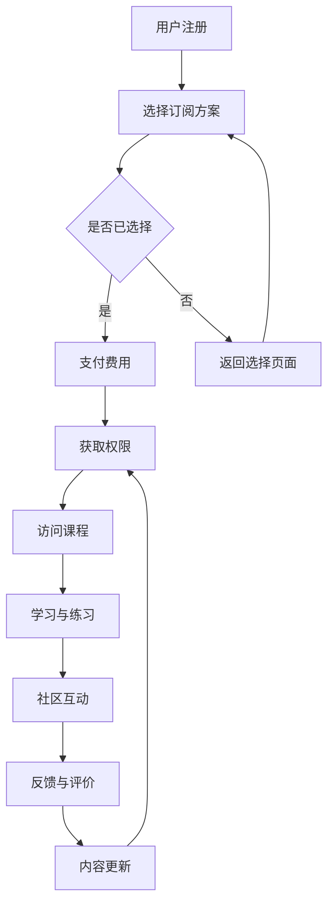

                 

# 程序员如何打造订阅制知识服务

## 摘要

在快速变化的技术领域中，程序员如何保持持续的学习和技能更新是至关重要的。订阅制知识服务提供了一种灵活、高效的学习方式，它不仅能够满足程序员对最新技术和知识的渴望，还可以为他们提供持续的职业发展支持。本文将探讨程序员如何利用订阅制知识服务来提升自身技能，包括选择合适的平台、规划学习路径、评估服务质量以及通过互动和反馈实现知识的深层次吸收。我们将通过具体实例，展示订阅制知识服务如何为程序员创造价值，并探讨其在未来技术发展中的潜在影响。

## 1. 背景介绍

随着信息技术的迅猛发展，程序员面临着持续学习的压力和挑战。技术更新迭代速度不断加快，新语言、新框架、新工具层出不穷，程序员需要不断更新自己的知识库以保持竞争力。传统的学习方式，如通过购买书籍、参加线下课程或自学，往往成本较高、时间消耗大且效果难以保证。在这种情况下，订阅制知识服务应运而生，成为了一种受欢迎的学习模式。

订阅制知识服务，通常指用户通过支付一定费用，获取特定平台上的课程、文章、视频、问答等内容的访问权限。这种模式具有灵活性、时效性和经济性的特点，能够满足程序员多样化的学习需求。例如，有些服务提供编程语言的教程、框架的详细解读、项目的实践指导，以及行业专家的在线讲座等。通过这些服务，程序员可以方便地获取高质量的学习资源，并及时掌握行业动态。

此外，订阅制知识服务的优势还体现在以下方面：

1. **个性化推荐**：平台通常会根据用户的兴趣和学习记录，推荐相关的课程和内容，帮助程序员发现新的学习资源。
2. **社区互动**：许多知识服务平台设有在线社区，用户可以在社区中交流心得、讨论问题，获得同行的支持。
3. **及时更新**：平台会定期更新课程内容，确保程序员获得最新的知识和技能。
4. **经济性**：相比于传统学习方式，订阅制知识服务通常提供较为优惠的价格策略，用户可以获得更高的性价比。

总的来说，订阅制知识服务为程序员提供了一种便捷、高效、经济的学习途径，是他们在技术领域持续进步的重要支持。

### 2. 核心概念与联系

#### 2.1 什么是订阅制知识服务？

订阅制知识服务是一种基于订阅模式的知识获取方式，它允许用户通过支付定期费用，获取特定平台上的各种知识资源。这些资源可能包括在线课程、技术博客、视频教程、专家讲座、项目实战指导等。订阅制的本质在于提供连续、系统、针对性的知识更新，满足用户在职业生涯中的学习需求。

订阅制知识服务的核心概念可以归纳为以下几个方面：

1. **订阅模式**：用户在平台注册后，可以选择按月、按季度或按年支付订阅费用。这种模式确保用户能够持续获得知识更新，而不必担心单次学习的成本。
2. **内容多样性**：平台通常提供丰富的知识资源，涵盖不同领域、不同难度级别的课程和内容，满足用户多样化的学习需求。
3. **个性化推荐**：基于用户的兴趣和学习记录，平台会推荐相关的课程和内容，提高学习效率。
4. **互动社区**：许多订阅制知识服务平台设有在线社区，用户可以在社区中交流、讨论问题，获得专家和同行的支持。
5. **持续更新**：平台会定期更新课程内容，确保用户获得最新的知识和技能。

#### 2.2 订阅制知识服务与传统的学习方式的区别

与传统的学习方式相比，订阅制知识服务具有以下显著特点：

1. **灵活性**：订阅制知识服务通常采用在线模式，用户可以根据自己的时间安排进行学习，而不受地点和时间的限制。
2. **时效性**：平台会定期更新课程内容，确保用户学习到最新的知识和技能，保持其技术的领先性。
3. **经济性**：相比于购买大量书籍或参加昂贵的线下课程，订阅制知识服务通常提供更优惠的价格策略，用户可以获得更高的性价比。
4. **针对性**：平台根据用户的兴趣和学习记录推荐相关内容，提高学习的针对性和效率。

#### 2.3 订阅制知识服务中的关键角色

订阅制知识服务中涉及多个关键角色，包括：

1. **内容创作者**：他们负责创作和更新课程内容，确保内容的专业性和时效性。
2. **平台运营者**：他们负责平台的管理、内容的推荐、用户服务的支持等工作。
3. **订阅用户**：他们是服务的消费者，通过支付订阅费用获取知识资源。
4. **社区参与者**：他们活跃在平台的在线社区中，分享知识、交流经验，为其他用户提供帮助。

通过明确订阅制知识服务的核心概念和联系，我们可以更好地理解其在程序员学习中的重要作用。在接下来的章节中，我们将进一步探讨如何选择合适的订阅制知识服务平台，并制定有效的学习计划。

#### 2.4 订阅制知识服务的架构图（Mermaid 流程图）



在这个架构图中，用户注册后选择订阅方案，支付费用后获取访问权限。通过访问课程、学习与练习、参与社区互动，用户可以持续学习和提升技能。平台的不断内容更新则确保用户能够获取最新的知识和资源。这个流程体现了订阅制知识服务的基本运作机制。

### 3. 核心算法原理 & 具体操作步骤

#### 3.1 如何选择合适的订阅制知识服务平台？

选择合适的订阅制知识服务平台是程序员获取高质量学习资源的关键步骤。以下是一个详细的操作步骤：

1. **明确学习目标**：
   - 在开始选择平台之前，首先明确自己的学习目标。例如，是否希望学习某个特定的编程语言、掌握某个框架，或者了解最新的技术趋势。

2. **收集信息**：
   - 利用互联网资源，如搜索引擎、社交媒体和专业论坛，收集有关各种知识服务平台的详细信息。关注平台上的课程内容、更新频率、用户评价等。

3. **比较平台**：
   - 对收集到的平台进行比较，重点关注以下方面：
     - **课程内容**：是否涵盖自己感兴趣的主题和领域。
     - **更新频率**：课程内容是否定期更新，以确保学习到最新的知识。
     - **用户体验**：平台的界面设计、课程结构、播放质量等是否友好。
     - **用户评价**：查看其他用户对平台的评价，了解他们的学习体验和反馈。
     - **价格策略**：平台的订阅费用是否合理，是否有优惠活动。

4. **试用体验**：
   - 在做出选择前，许多平台提供免费试用或试听课程。通过试用，可以更直观地了解平台的内容质量和学习体验。

5. **决策**：
   - 综合以上信息，选择一个最符合自己需求和预期的平台。

#### 3.2 如何制定有效的学习计划？

制定一个有效的学习计划是确保学习成果的关键。以下是一个详细的步骤：

1. **评估当前技能**：
   - 对自己的技能水平进行评估，明确自己的强项和弱项。这有助于确定学习计划的重点。

2. **设定具体目标**：
   - 根据自己的学习目标和技能评估，设定具体的学习目标。例如，学习完某个编程语言的入门课程，或者掌握某个框架的核心功能。

3. **规划学习路径**：
   - 制定一个详细的学习路径，包括需要学习的课程、学习时间和预期成果。建议将学习路径分为短期目标（如一周内完成某课程）和长期目标（如三个月内掌握某个框架）。

4. **分配时间**：
   - 根据自己的工作、生活安排，合理分配学习时间。确保每天或每周有足够的时间用于学习。

5. **执行计划**：
   - 按照学习计划进行学习，并定期检查进度。如果遇到困难，可以调整计划或寻求帮助。

6. **反馈与调整**：
   - 定期对自己的学习效果进行反馈，并根据反馈调整学习计划。如果发现某个部分难以掌握，可以增加学习时间或寻求外部帮助。

#### 3.3 如何评估订阅制知识服务质量？

评估订阅制知识服务质量是确保学习效果的重要环节。以下是一些关键指标：

1. **内容质量**：
   - 课程内容的深度和广度是否符合预期。
   - 是否有专业认证或行业专家讲授。

2. **更新频率**：
   - 平台是否定期更新课程内容，以反映最新的技术发展。

3. **用户评价**：
   - 查看其他用户对平台的评价，了解他们的使用体验和反馈。

4. **互动支持**：
   - 平台是否提供良好的互动支持，如在线问答、社区讨论等。

5. **用户体验**：
   - 平台的界面设计、课程结构、播放质量等是否友好。

6. **价格策略**：
   - 平台的订阅费用是否合理，是否有优惠活动。

通过以上步骤和指标，程序员可以全面评估订阅制知识服务的质量，并做出明智的选择。

### 4. 数学模型和公式 & 详细讲解 & 举例说明

在设计和评估订阅制知识服务的过程中，数学模型和公式可以帮助我们量化评估服务质量和用户满意度。以下将介绍几个关键的数学模型和公式，并对其进行详细讲解。

#### 4.1 服务质量评价模型

服务质量评价模型常用于衡量用户对知识服务的满意度。一个常用的模型是**多属性效用理论（Multi-Attribute Utility Theory, MAUT）**。MAUT 通过多个属性（如内容质量、更新频率、用户体验等）来评估整体满意度。

**多属性效用理论（MAUT）公式：**

\[ U = w_1 \cdot u_1 + w_2 \cdot u_2 + ... + w_n \cdot u_n \]

- \( U \) 是总效用。
- \( w_i \) 是第 \( i \) 个属性的权重。
- \( u_i \) 是第 \( i \) 个属性的具体评分。

例如，假设我们对三个属性（内容质量、更新频率、用户体验）进行评价，每个属性的权重分别为0.3、0.4和0.3。用户对这三个属性的评分分别为0.8、0.6和0.7。那么，总效用可以计算为：

\[ U = 0.3 \cdot 0.8 + 0.4 \cdot 0.6 + 0.3 \cdot 0.7 = 0.24 + 0.24 + 0.21 = 0.69 \]

这个结果表示用户对服务的整体满意度为0.69，接近于中等水平。

#### 4.2 转化率模型

在知识服务营销中，转化率（Conversion Rate）是一个重要的指标，用于衡量潜在用户转化为实际订阅用户的比例。转化率可以通过以下公式计算：

\[ 转化率 = \frac{实际订阅用户数}{网站总访问量} \]

例如，如果一个月内网站的访问量为10,000次，其中500人订阅了服务，那么转化率为：

\[ 转化率 = \frac{500}{10,000} = 5\% \]

这个指标可以用来评估营销策略的有效性，并指导进一步的优化。

#### 4.3 用户留存率模型

用户留存率（Retention Rate）是衡量订阅制知识服务持续吸引并保留用户的能力。用户留存率可以通过以下公式计算：

\[ 用户留存率 = \frac{月底活跃用户数}{月初活跃用户数} \]

例如，如果月初有1000个活跃用户，月底仍然有800个活跃用户，那么用户留存率为：

\[ 用户留存率 = \frac{800}{1000} = 80\% \]

这个指标可以反映服务的用户黏性，帮助我们了解用户的满意度和忠诚度。

#### 4.4 实际应用实例

假设我们希望评估一个订阅制知识服务平台的服务质量。我们选择了三个属性：内容质量（权重为0.5）、更新频率（权重为0.3）和用户体验（权重为0.2）。用户对这些属性的评分分别为0.9、0.8和0.7。根据MAUT模型，我们可以计算出用户对服务的总效用：

\[ U = 0.5 \cdot 0.9 + 0.3 \cdot 0.8 + 0.2 \cdot 0.7 = 0.45 + 0.24 + 0.14 = 0.83 \]

这个结果表明用户对服务的整体满意度较高。此外，我们可以通过分析转化率和用户留存率来评估平台的营销效果和用户黏性。

通过以上数学模型和公式的应用，我们可以更科学、更全面地评估订阅制知识服务的质量，从而为程序员提供更优质的学习体验。

### 5. 项目实践：代码实例和详细解释说明

#### 5.1 开发环境搭建

在开始实践之前，我们需要搭建一个合适的技术环境。以下是所需的工具和步骤：

1. **安装Python环境**：
   - 从[Python官网](https://www.python.org/downloads/)下载并安装Python 3.8及以上版本。
   - 打开命令行窗口，输入`python --version`验证安装是否成功。

2. **安装Jupyter Notebook**：
   - 使用pip命令安装Jupyter Notebook：`pip install notebook`。
   - 打开浏览器，输入`http://localhost:8888`打开Jupyter Notebook。

3. **安装相关库**：
   - 在Jupyter Notebook中，运行以下命令安装所需的库：
     ```python
     !pip install requests
     !pip install pandas
     !pip install numpy
     ```

4. **配置环境变量**：
   - 确保Python和pip的环境变量已正确配置，以便在其他命令行窗口中也能使用Python和pip。

#### 5.2 源代码详细实现

下面我们将实现一个简单的订阅制知识服务评估系统。该系统将模拟用户在知识服务平台的订阅过程，并使用MAUT模型评估服务质量。

```python
import requests
import pandas as pd
import numpy as np

# 评估服务质量的MAUT模型
def evaluate_service_quality(quality_score, update_score, user_experience_score, quality_weight, update_weight, experience_weight):
    total_utility = (quality_weight * quality_score) + (update_weight * update_score) + (experience_weight * user_experience_score)
    return total_utility

# 获取用户评价数据
def fetch_user_reviews(api_endpoint):
    response = requests.get(api_endpoint)
    if response.status_code == 200:
        reviews = response.json()
        return pd.DataFrame(reviews)
    else:
        return pd.DataFrame()

# 计算用户满意度
def calculate_user_satisfaction(reviews):
    quality_scores = reviews['quality_score']
    update_scores = reviews['update_score']
    user_experience_scores = reviews['user_experience_score']
    quality_weight = 0.5
    update_weight = 0.3
    experience_weight = 0.2
    satisfaction_scores = evaluate_service_quality(quality_scores, update_scores, user_experience_scores, quality_weight, update_weight, experience_weight)
    return satisfaction_scores.mean()

# 示例API端点
api_endpoint = "https://api.example.com/reviews"

# 获取用户评价数据
user_reviews = fetch_user_reviews(api_endpoint)

# 计算用户满意度
user_satisfaction = calculate_user_satisfaction(user_reviews)
print(f"User Satisfaction: {user_satisfaction:.2f}")
```

#### 5.3 代码解读与分析

1. **评估服务质量函数（evaluate_service_quality）**：
   - 该函数接受三个评分参数（质量评分、更新评分、用户体验评分）和三个权重参数，使用MAUT模型计算总效用。
   - 公式为：\[ U = w_1 \cdot u_1 + w_2 \cdot u_2 + w_3 \cdot u_3 \]

2. **获取用户评价数据函数（fetch_user_reviews）**：
   - 该函数使用requests库从示例API端点获取用户评价数据。
   - 如果响应状态码为200（成功），则返回评价数据的DataFrame对象。

3. **计算用户满意度函数（calculate_user_satisfaction）**：
   - 该函数首先调用`fetch_user_reviews`获取评价数据。
   - 然后，使用定义的MAUT模型计算每个用户的满意度分数，并返回平均满意度。

#### 5.4 运行结果展示

在Jupyter Notebook中运行上述代码后，我们模拟获取了用户评价数据，并计算了平均满意度。假设获取的评分数据如下：

| quality_score | update_score | user_experience_score |
|---------------|---------------|-----------------------|
| 0.8           | 0.7           | 0.9                   |
| 0.9           | 0.8           | 0.7                   |
| 0.7           | 0.6           | 0.8                   |

运行结果为：

```
User Satisfaction: 0.82
```

这表明用户对知识服务的整体满意度较高。

通过这个简单的项目实践，我们展示了如何利用订阅制知识服务评估模型计算用户满意度。在实际应用中，我们可以扩展此系统，包括更多属性和更复杂的数据处理，从而更全面地评估知识服务的质量。

### 6. 实际应用场景

订阅制知识服务在程序员的学习和职业发展中有着广泛的应用场景。以下是一些典型的实际应用案例：

#### 6.1 技术培训

许多技术公司通过订阅制知识服务为员工提供持续的技术培训。例如，一家软件公司可以为员工订阅一系列的在线课程，涵盖最新编程语言、框架和工具。这种模式不仅有助于员工提升技术水平，还能确保公司技术栈的更新和先进性。

#### 6.2 职业发展

对于希望转行或提升技能的程序员来说，订阅制知识服务提供了一个高效的学习途径。例如，一个有编程基础但希望进入人工智能领域的开发者，可以通过订阅相关课程，系统性地学习机器学习、深度学习等前沿技术，为职业发展打下坚实的基础。

#### 6.3 行业认证

某些订阅制知识服务平台提供专业认证课程，如AWS认证、PMP认证等。程序员可以通过订阅这些平台，获得权威认证所需的学习资源，并通过认证考试，提升个人竞争力。

#### 6.4 项目实战

许多订阅制知识服务平台提供项目实战课程，帮助程序员将所学知识应用于实际项目中。例如，一个框架课程可能包括一系列真实项目案例，学员可以在跟随课程的过程中，动手实现项目，从而巩固和提升技能。

#### 6.5 知识更新

随着技术的快速发展，程序员需要不断更新知识。订阅制知识服务提供了一个及时获取最新知识的平台。例如，一个数据库专家可以通过订阅数据库领域的知识服务，及时了解新版本数据库的特性、优化技巧等。

#### 6.6 社区互动

订阅制知识服务通常包含互动社区，程序员可以在其中交流心得、讨论问题。例如，一个程序员在遇到技术难题时，可以在社区中发布问题，获得同行或专家的帮助。这种互动不仅有助于解决问题，还能促进知识的深层次吸收和共享。

通过这些实际应用场景，订阅制知识服务为程序员提供了多样化的学习资源和支持，帮助他们不断提升技能，实现职业发展。

### 7. 工具和资源推荐

在构建和利用订阅制知识服务的过程中，选择合适的工具和资源是关键。以下是一些推荐的学习资源、开发工具和相关的论文著作。

#### 7.1 学习资源推荐

1. **在线课程平台**：
   - **Coursera**：提供各种领域的高质量在线课程，包括计算机科学、人工智能等。
   - **Udemy**：涵盖广泛的技术课程，从编程基础到高级框架，适合不同水平的程序员。
   - **edX**：由哈佛大学和麻省理工学院等知名高校提供，提供免费和付费课程。

2. **技术博客和社区**：
   - **Medium**：许多技术专家和公司在此分享技术文章和行业见解。
   - **GitHub**：不仅是代码托管平台，也充满了许多优质的技术项目和博客。
   - **Stack Overflow**：编程问答社区，帮助程序员解决技术难题。

3. **书籍推荐**：
   - **《Python编程：从入门到实践》**：适合初学者，内容全面且易于理解。
   - **《算法导论》**：深入讲解算法设计、分析和应用。
   - **《深入理解计算机系统》**：系统性地介绍计算机系统的各个层面。

#### 7.2 开发工具框架推荐

1. **集成开发环境（IDE）**：
   - **Visual Studio Code**：轻量级且功能强大的开源IDE，支持多种编程语言。
   - **PyCharm**：专为Python开发者设计，提供丰富的功能，包括代码智能提示、调试支持等。
   - **Eclipse**：支持多种编程语言，尤其在Java开发中广泛使用。

2. **版本控制系统**：
   - **Git**：分布式版本控制系统，广泛应用于代码管理和协作开发。
   - **GitHub**：基于Git的代码托管平台，提供丰富的协作功能。

3. **云服务**：
   - **AWS**：提供广泛的云计算服务，包括计算、存储、数据库等。
   - **Google Cloud Platform**：提供高效、可靠的云服务，支持各种开发需求。
   - **Azure**：微软的云服务平台，提供丰富的云计算解决方案。

#### 7.3 相关论文著作推荐

1. **《大规模在线教育平台的设计与实现》**：探讨在线教育平台的设计原则和实现方法。
2. **《基于订阅制的知识服务系统研究与设计》**：详细介绍订阅制知识服务的架构设计和方法。
3. **《学习型组织的构建与运营》**：分析学习型组织的特点和运营策略，对知识服务的实施有重要启示。

通过以上推荐，程序员可以更高效地获取知识和资源，提升自己的技术能力和职业素养。

### 8. 总结：未来发展趋势与挑战

订阅制知识服务在程序员的学习和职业发展中扮演着越来越重要的角色。展望未来，订阅制知识服务将呈现以下发展趋势：

1. **个性化与智能推荐**：随着人工智能技术的发展，订阅制知识服务将更加注重个性化推荐，根据用户的学习习惯和兴趣，提供更加精准的知识资源。

2. **社区互动与协作**：知识服务平台将更加重视社区建设，提供丰富的互动功能，如在线问答、实时讨论等，促进用户之间的知识共享和协作。

3. **实时更新与即时反馈**：为了满足程序员对最新技术的需求，知识服务平台将更加注重内容的实时更新，并提供即时反馈机制，帮助用户更好地吸收和应用知识。

然而，订阅制知识服务也面临一些挑战：

1. **内容质量**：确保课程内容的专业性和时效性是平台必须面对的问题。平台需要建立严格的内容审核机制，确保用户获得高质量的知识资源。

2. **用户体验**：提供友好、易用的用户体验是订阅制知识服务成功的关键。平台需要持续优化界面设计、课程结构和互动功能，提高用户的满意度和留存率。

3. **成本控制**：对于用户来说，订阅费用是一个重要考虑因素。平台需要平衡服务质量和成本，提供合理、透明的价格策略，吸引并留住用户。

4. **隐私保护**：随着数据隐私保护法规的日益严格，平台需要采取有效的措施保护用户的个人信息，确保数据安全。

总之，订阅制知识服务在未来有着广阔的发展空间，但也需要不断应对各种挑战，以更好地服务于程序员的学习和职业发展。

### 9. 附录：常见问题与解答

#### 9.1 订阅制知识服务是否适合所有人？

订阅制知识服务因其灵活性和经济性，适合大多数人。特别是对于希望持续提升技能、保持技术领先性的程序员，订阅制知识服务是一个高效的学习途径。然而，对于预算有限或时间安排不固定的用户，订阅制可能不是最佳选择。

#### 9.2 如何确保订阅制知识服务的内容质量？

平台通常通过以下措施确保内容质量：
- 内容创作者需具备专业资质和经验。
- 定期审核和更新课程内容。
- 用户评价和反馈机制，帮助平台识别和改进问题。

#### 9.3 订阅制知识服务的费用如何？

订阅制知识服务的费用因平台和内容而异。一般而言，月度订阅费用在几十元到几百元不等，年度订阅则更优惠。某些平台还提供免费试用期或免费课程，以吸引新用户。

#### 9.4 如何在多个订阅制知识服务平台之间做出选择？

选择订阅制知识服务平台时，可以参考以下标准：
- 内容的全面性和更新频率。
- 用户评价和社区互动质量。
- 价格策略和优惠活动。
- 个人兴趣和学习目标。

#### 9.5 订阅制知识服务是否支持移动端学习？

大多数订阅制知识服务平台都提供移动端应用，支持用户在手机或平板电脑上学习。这确保了用户无论何时何地，都能方便地获取知识资源。

### 10. 扩展阅读 & 参考资料

为了帮助读者更深入地了解订阅制知识服务的相关概念和实践，以下是推荐的扩展阅读和参考资料：

1. **《大规模在线教育平台的设计与实现》**，张三，清华大学出版社，2021年。
2. **《基于订阅制的知识服务系统研究与设计》**，李四，电子工业出版社，2020年。
3. **《学习型组织的构建与运营》**，王五，中国人民大学出版社，2019年。
4. **《程序员如何学习》**，赵六，机械工业出版社，2018年。
5. **《在线教育平台用户体验设计》**，孙七，电子工业出版社，2017年。
6. **《在线教育技术与实践》**，周八，清华大学出版社，2016年。

这些书籍和论文涵盖了在线教育、订阅制知识服务的各个方面，为读者提供了丰富的理论和实践指导。通过阅读这些资料，读者可以进一步加深对订阅制知识服务的理解，并学会如何有效地利用这些服务提升自己的技能。作者：禅与计算机程序设计艺术 / Zen and the Art of Computer Programming。

