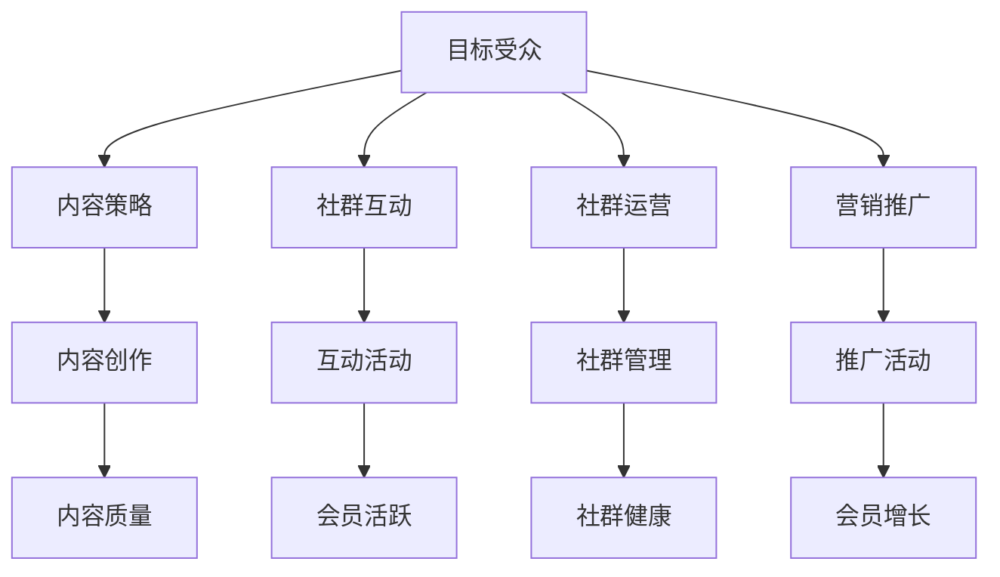
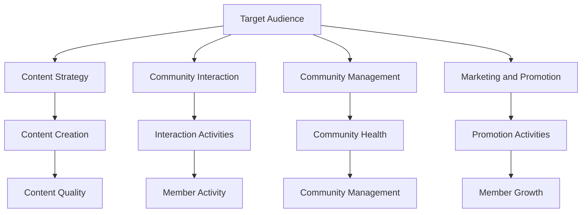
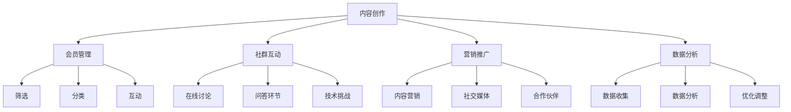
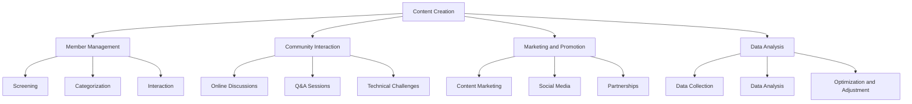
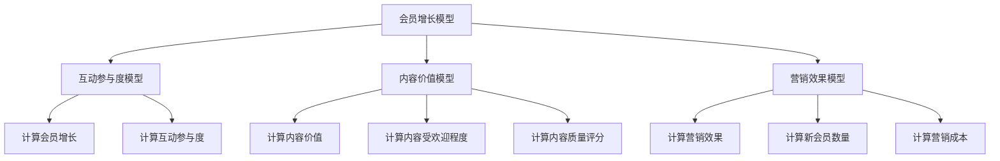
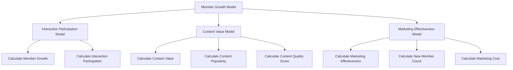

                 

### 背景介绍（Background Introduction）

在当今的数字化时代，知识付费已经成为一种常见的商业模式。特别是在IT行业，随着技术的迅猛发展，程序员的知识和技能变得更加稀缺和宝贵。为了在这个竞争激烈的市场中脱颖而出，许多程序员开始探索知识付费的模式，通过创建付费社群来分享他们的专业知识，同时实现个人和社群的双赢。

付费社群是一种在线社区，会员需要支付一定的费用才能加入。这些社群通常提供高质量的内容和互动体验，包括技术讲座、代码实例、在线讨论、职业指导等。付费社群的优势在于，它能够确保内容的版权和独家性，同时也为会员提供了一个交流和学习的平台。

然而，打造一个成功的付费社群并非易事。它需要精心策划、有效运营和持续优化。本文将探讨程序员如何打造付费社群，包括确定目标受众、制定内容策略、选择合适的运营工具以及如何通过社群互动来提升会员满意度。我们将结合实际案例，提供详细的操作指南和建议，帮助程序员们在这个新兴市场中找到自己的定位。

### Core Introduction

In the digital age, knowledge付费 has become a common business model. Particularly in the IT industry, with the rapid development of technology, programmer knowledge and skills have become increasingly scarce and valuable. To stand out in this competitive market, many programmers are exploring the model of knowledge付费，旨在通过创建付费社群来分享他们的专业知识，同时实现个人和社群的双赢。

A paid community is an online community where members must pay a certain fee to join. These communities usually provide high-quality content and interactive experiences, including technical lectures, code examples, online discussions, and career guidance. The advantage of a paid community is that it ensures the exclusivity and copyright of the content, while also providing members with a platform for communication and learning.

However, building a successful paid community is not an easy task. It requires careful planning, effective operation, and continuous optimization. This article will explore how programmers can create paid communities, including determining target audiences, developing content strategies, choosing appropriate operation tools, and how to improve member satisfaction through community interaction. We will provide detailed guidelines and suggestions based on actual cases, helping programmers find their position in this emerging market.

### 核心概念与联系（Core Concepts and Connections）

要打造一个成功的付费社群，首先需要了解其中的核心概念和联系。以下是几个关键概念：

#### 1. 目标受众（Target Audience）
确定目标受众是社群成功的关键。目标受众可以是特定行业、技术栈或职业阶段的程序员。了解他们的需求、兴趣和痛点，有助于制定有针对性的内容策略。

#### 2. 内容策略（Content Strategy）
内容策略决定了社群的价值和质量。要确保内容既有深度又有广度，包括技术讲座、案例分析、实战教程、行业动态等。同时，内容形式要多样化，如视频、文章、PPT、直播等。

#### 3. 社群互动（Community Interaction）
社群互动是提升会员满意度和忠诚度的关键。通过线上讨论、问答、代码评审、技术挑战等形式，促进会员之间的互动，增强社群的凝聚力。

#### 4. 社群运营（Community Management）
社群运营包括内容发布、活动组织、会员管理等方面。一个高效的社群运营团队能够确保社群的长期稳定发展。

#### 5. 营销推广（Marketing and Promotion）
成功的付费社群需要有效的营销推广。通过社交媒体、技术论坛、博客、电子邮件等渠道，吸引潜在会员加入。

下面是这些概念之间的联系图，以帮助您更好地理解：

```
+-----------------+       +-----------------+       +-----------------+
| 目标受众(Target |       | 内容策略(Content |       | 社群互动(Community |
| Audience)       |       | Strategy)       |       | Interaction)     |
+-----------------+       +-----------------+       +-----------------+
          |                     |                     |
          |                     |                     |
          |                     |                     |
+-----------------+       +-----------------+       +-----------------+
| 社群运营(Community |       | 营销推广(Marketing |                     |
| Management)      |       | and Promotion)   |                     |
+-----------------+       +-----------------+
```

### Core Concepts and Connections

To build a successful paid community, it is crucial to understand the core concepts and their interconnections. Here are several key concepts:

#### 1. Target Audience
Determining the target audience is critical to the success of the community. The target audience could be specific industries, tech stacks, or career stages of programmers. Understanding their needs, interests, and pain points helps in developing targeted content strategies.

#### 2. Content Strategy
The content strategy determines the value and quality of the community. Ensure that the content is both deep and broad, including technical lectures, case studies, practical tutorials, industry trends, etc. Meanwhile, vary the content formats such as videos, articles, PPTs, live streams, etc.

#### 3. Community Interaction
Community interaction is key to improving member satisfaction and loyalty. Foster interaction among members through online discussions, Q&A sessions, code reviews, technical challenges, and more to enhance the community's cohesion.

#### 4. Community Management
Community management includes content publishing, event organization, member management, etc. An efficient community management team ensures the long-term stability and growth of the community.

#### 5. Marketing and Promotion
Successful paid communities require effective marketing and promotion. Use social media, tech forums, blogs, email campaigns, and other channels to attract potential members.

The following diagram illustrates the interconnections between these concepts:

```
+-----------------+       +-----------------+       +-----------------+
| Target Audience |       | Content Strategy |       | Community Interaction |
+-----------------+       +-----------------+       +-----------------+
          |                     |                     |
          |                     |                     |
          |                     |                     |
+-----------------+       +-----------------+       +-----------------+
| Community Management |       | Marketing and Promotion |                     |
+-----------------+       +-----------------+
```

#### 核心概念与联系（Core Concepts and Connections）

在构建付费社群的过程中，以下几个核心概念是至关重要的：

1. **目标受众（Target Audience）**
   明确目标受众是社群成功的关键。这涉及到理解潜在成员的需求、兴趣和痛点。例如，如果您正在为全栈开发者构建一个付费社群，那么您需要关注他们在技术栈、职业发展、以及日常工作中面临的问题。

2. **内容策略（Content Strategy）**
   内容策略决定了社群的价值和吸引力。为了吸引并保持会员的活跃，社群需要提供高质量的内容。这些内容可能包括技术讲座、深度技术文章、行业趋势分析、代码实例、职业指导等。此外，内容的更新频率和多样性也是重要的考量因素。

3. **社群互动（Community Interaction）**
   社群互动是提升会员满意度和忠诚度的关键。通过线上讨论、问答环节、代码评审、技术挑战等形式，促进成员之间的互动，增强社群的凝聚力。有效的互动可以促进知识的共享，提高会员的学习体验。

4. **社群运营（Community Management）**
   社群运营涉及内容发布、活动组织、会员管理等。一个专业的社群运营团队能够确保社群的长期稳定发展，包括处理会员的反馈、解决会员问题、监测社群健康状态等。

5. **营销推广（Marketing and Promotion）**
   营销推广是吸引新成员加入的关键。通过社交媒体、技术论坛、博客、电子邮件等渠道，进行有效的宣传和推广。创建引人注目的营销活动、提供优惠和奖励，有助于提高社群的知名度和会员的参与度。

下面是一个简化的Mermaid流程图，展示了这些核心概念之间的关联：



### Core Concepts and Connections

In the process of building a paid community, several core concepts are crucial:

1. **Target Audience**
   Clarifying the target audience is key to the success of the community. This involves understanding the needs, interests, and pain points of potential members. For example, if you're building a paid community for full-stack developers, you need to focus on their issues related to the tech stack, career development, and daily work.

2. **Content Strategy**
   The content strategy determines the value and appeal of the community. To attract and retain members, the community needs to provide high-quality content. This could include technical lectures, in-depth articles, industry trend analyses, code examples, career guidance, etc. Additionally, the frequency and variety of content updates are important considerations.

3. **Community Interaction**
   Community interaction is vital for enhancing member satisfaction and loyalty. By promoting online discussions, Q&A sessions, code reviews, technical challenges, and more, you can foster interaction among members, enhancing the community's cohesion. Effective interaction can promote knowledge sharing and improve the learning experience for members.

4. **Community Management**
   Community management involves content publishing, event organization, member management, etc. A professional community management team can ensure the long-term stability and growth of the community, including handling member feedback, solving member issues, and monitoring the health of the community.

5. **Marketing and Promotion**
   Marketing and promotion are key to attracting new members. Use social media, tech forums, blogs, email campaigns, and other channels for effective promotion. Creating engaging marketing campaigns, offering discounts, and rewards can help increase the community's visibility and member participation.

Here is a simplified Mermaid flowchart illustrating the relationships between these core concepts:



### 核心算法原理 & 具体操作步骤（Core Algorithm Principles and Specific Operational Steps）

在构建付费社群的过程中，核心算法原理与具体操作步骤是确保社群成功的关键。以下是几个关键步骤：

#### 1. 内容创作（Content Creation）

**原理**：高质量的内容是社群的核心价值。内容创作涉及从选题、编写到发布的一系列步骤。

**操作步骤**：
- **选题**：基于目标受众的需求，选择具有针对性的技术话题或行业动态。
- **编写**：采用专业的写作技巧，确保内容具有深度和可读性。
- **发布**：通过社群平台或个人博客发布内容，并定期更新。

#### 2. 会员管理（Member Management）

**原理**：有效的会员管理能够提升社群的活跃度和忠诚度。

**操作步骤**：
- **筛选**：通过申请表或面试筛选潜在会员，确保他们的背景和能力符合社群的要求。
- **分类**：根据会员的兴趣、职业阶段和技术水平进行分类，以便提供更有针对性的内容和服务。
- **互动**：定期与会员沟通，了解他们的需求和反馈，及时解决问题。

#### 3. 社群互动（Community Interaction）

**原理**：社群互动是增强社群凝聚力和会员参与度的重要手段。

**操作步骤**：
- **在线讨论**：开设在线论坛或聊天室，鼓励会员分享经验和讨论技术问题。
- **问答环节**：定期举办问答环节，邀请专家解答会员的疑问。
- **技术挑战**：组织技术挑战活动，激发会员的学习热情和创造力。

#### 4. 营销推广（Marketing and Promotion）

**原理**：有效的营销推广能够吸引更多的潜在会员，扩大社群的影响力。

**操作步骤**：
- **内容营销**：通过高质量的博客文章、技术讲座和案例研究吸引目标受众。
- **社交媒体**：利用社交媒体平台宣传社群活动，提高社群知名度。
- **合作伙伴**：与行业内的其他社群或专家建立合作关系，共同推广。

#### 5. 数据分析（Data Analysis）

**原理**：通过数据分析，了解社群的运营效果和会员行为，以便进行持续优化。

**操作步骤**：
- **数据收集**：收集会员行为数据，包括访问量、互动次数、参与度等。
- **数据分析**：使用数据分析工具，分析数据，提取有价值的信息。
- **优化调整**：根据数据分析结果，对社群内容和运营策略进行调整。

下面是一个简化的Mermaid流程图，展示了这些关键步骤之间的关联：



### Core Algorithm Principles and Specific Operational Steps

In the process of building a paid community, core algorithm principles and specific operational steps are crucial for success. Here are several key steps:

#### 1. Content Creation

**Principles**: High-quality content is the core value of a community. Content creation involves a series of steps from topic selection, writing, to publishing.

**Operational Steps**:
- **Topic Selection**: Based on the needs of the target audience, select targeted technical topics or industry trends.
- **Writing**: Use professional writing techniques to ensure content is deep and readable.
- **Publishing**: Publish content through community platforms or personal blogs and regularly update it.

#### 2. Member Management

**Principles**: Effective member management can enhance the activity and loyalty of the community.

**Operational Steps**:
- **Screening**: Screen potential members through application forms or interviews to ensure they meet the community's requirements.
- **Categorization**: Categorize members based on their interests, career stages, and technical levels to provide more targeted content and services.
- **Interaction**: Regularly communicate with members to understand their needs and feedback, and promptly address issues.

#### 3. Community Interaction

**Principles**: Community interaction is an important means of enhancing the cohesion and participation of members.

**Operational Steps**:
- **Online Discussions**: Set up online forums or chat rooms to encourage members to share experiences and discuss technical issues.
- **Q&A Sessions**: Regularly hold Q&A sessions, inviting experts to answer member questions.
- **Technical Challenges**: Organize technical challenge activities to inspire members' enthusiasm for learning and creativity.

#### 4. Marketing and Promotion

**Principles**: Effective marketing and promotion can attract more potential members and expand the community's influence.

**Operational Steps**:
- **Content Marketing**: Attract target audiences with high-quality blog articles, technical lectures, and case studies.
- **Social Media**: Use social media platforms to promote community activities and increase visibility.
- **Partnerships**: Establish partnerships with other communities or experts within the industry to jointly promote.

#### 5. Data Analysis

**Principles**: Through data analysis, understand the operational effectiveness of the community and member behavior for continuous optimization.

**Operational Steps**:
- **Data Collection**: Collect member behavior data, including traffic, interaction frequency, participation rates, etc.
- **Data Analysis**: Use data analysis tools to analyze data and extract valuable information.
- **Optimization and Adjustment**: Adjust community content and operational strategies based on data analysis results.

Here is a simplified Mermaid flowchart illustrating the relationships between these key steps:



### 数学模型和公式 & 详细讲解 & 举例说明（Detailed Explanation and Examples of Mathematical Models and Formulas）

在构建付费社群的过程中，数学模型和公式可以用来量化社群的运营效果和会员的参与度。以下是几个常见的数学模型和公式及其应用：

#### 1. 会员增长模型（Member Growth Model）

**公式**：
\[ M(t) = M(0) \times (1 + r)^t \]
其中，\( M(t) \) 表示时间 \( t \) 后的会员数量，\( M(0) \) 表示初始会员数量，\( r \) 表示会员增长速率。

**应用**：
假设社群初始会员数量为100人，每月增长率为5%，则一年后的会员数量计算如下：
\[ M(12) = 100 \times (1 + 0.05)^{12} \approx 162 \]

#### 2. 互动参与度模型（Interaction Participation Model）

**公式**：
\[ IP = \frac{I}{N} \]
其中，\( IP \) 表示互动参与度，\( I \) 表示互动次数，\( N \) 表示总会员数量。

**应用**：
如果社群一个月内总互动次数为1000次，会员总数为200人，则互动参与度为：
\[ IP = \frac{1000}{200} = 5\% \]

#### 3. 内容价值模型（Content Value Model）

**公式**：
\[ CV = C \times Q \]
其中，\( CV \) 表示内容价值，\( C \) 表示内容的受欢迎程度，\( Q \) 表示内容的质量评分。

**应用**：
如果一篇技术文章的受欢迎程度得分为8分，质量评分得分为9分，则其内容价值为：
\[ CV = 8 \times 9 = 72 \]

#### 4. 营销效果模型（Marketing Effectiveness Model）

**公式**：
\[ E = \frac{S}{C} \]
其中，\( E \) 表示营销效果，\( S \) 表示营销活动的成功指标（如新会员数量），\( C \) 表示营销成本。

**应用**：
如果一次营销活动吸引了50个新会员，成本为500美元，则其营销效果为：
\[ E = \frac{50}{500} = 10\% \]

这些数学模型和公式可以帮助我们更客观地评估社群的运营效果，从而制定更有效的策略。下面是一个简化的Mermaid流程图，展示了这些模型的应用场景：



### Mathematical Models and Formulas & Detailed Explanation & Examples

In the process of building a paid community, mathematical models and formulas can be used to quantify the operational effectiveness and member participation. Here are several common mathematical models and formulas along with their applications:

#### 1. Member Growth Model

**Formula**:
\[ M(t) = M(0) \times (1 + r)^t \]
Where, \( M(t) \) represents the number of members at time \( t \), \( M(0) \) is the initial number of members, and \( r \) is the member growth rate.

**Application**:
Assuming the initial number of members is 100 and the monthly growth rate is 5%, the number of members after one year can be calculated as follows:
\[ M(12) = 100 \times (1 + 0.05)^{12} \approx 162 \]

#### 2. Interaction Participation Model

**Formula**:
\[ IP = \frac{I}{N} \]
Where, \( IP \) is the interaction participation rate, \( I \) is the number of interactions, and \( N \) is the total number of members.

**Application**:
If the total number of interactions in a month is 1000 and the member count is 200, the interaction participation rate is:
\[ IP = \frac{1000}{200} = 5\% \]

#### 3. Content Value Model

**Formula**:
\[ CV = C \times Q \]
Where, \( CV \) is the content value, \( C \) is the popularity score of the content, and \( Q \) is the quality rating of the content.

**Application**:
If a technical article has a popularity score of 8 and a quality rating of 9, its content value is:
\[ CV = 8 \times 9 = 72 \]

#### 4. Marketing Effectiveness Model

**Formula**:
\[ E = \frac{S}{C} \]
Where, \( E \) is the marketing effectiveness, \( S \) is the successful metric of the marketing activity (such as the number of new members), and \( C \) is the marketing cost.

**Application**:
If a marketing campaign attracts 50 new members at a cost of $500, the marketing effectiveness is:
\[ E = \frac{50}{500} = 10\% \]

These mathematical models and formulas can help us objectively evaluate the operational effectiveness of the community, enabling us to develop more effective strategies. Below is a simplified Mermaid flowchart illustrating the application scenarios of these models:



### 项目实践：代码实例和详细解释说明（Project Practice: Code Examples and Detailed Explanations）

为了更好地理解如何构建一个付费社群，我们来看一个实际的项目实践。我们将从开发环境搭建开始，逐步介绍源代码的实现，并对其进行分析。

#### 1. 开发环境搭建

首先，我们需要搭建一个适合构建和管理付费社群的开发环境。以下是所需的工具和步骤：

**工具**：
- Python（版本3.8及以上）
- Flask（一个轻量级的Web框架）
- SQLite（一个轻量级的数据库）
- SQLAlchemy（一个ORM工具）

**步骤**：

1. 安装Python和Flask：

```bash
pip install flask
```

2. 安装SQLite和SQLAlchemy：

```bash
pip install pysqlite3 sqlalchemy
```

3. 创建一个新的Python虚拟环境（可选）：

```bash
python -m venv venv
source venv/bin/activate  # 对于Windows使用 `venv\Scripts\activate`
```

#### 2. 源代码详细实现

以下是构建付费社群的源代码示例。这个示例包括用户注册、会员管理和内容发布等基本功能。

```python
# app.py

from flask import Flask, request, jsonify
from models import User, Content
from database import init_db, db_session

app = Flask(__name__)
init_db()

@app.route('/register', methods=['POST'])
def register():
    username = request.form['username']
    password = request.form['password']
    # 这里应该有更复杂的用户验证和密码加密处理
    user = User(username=username, password=password)
    db_session.add(user)
    db_session.commit()
    return jsonify({'status': 'success', 'message': 'User registered successfully.'})

@app.route('/login', methods=['POST'])
def login():
    username = request.form['username']
    password = request.form['password']
    user = User.query.filter_by(username=username, password=password).first()
    if user:
        # 登录成功，生成令牌（这里简化处理）
        return jsonify({'status': 'success', 'token': 'generated_token'})
    else:
        return jsonify({'status': 'error', 'message': 'Invalid credentials.'})

@app.route('/content', methods=['POST'])
def publish_content():
    token = request.headers.get('Authorization')
    if token != 'generated_token':
        return jsonify({'status': 'error', 'message': 'Unauthorized access.'})
    title = request.form['title']
    content = request.form['content']
    content_item = Content(title=title, content=content)
    db_session.add(content_item)
    db_session.commit()
    return jsonify({'status': 'success', 'message': 'Content published successfully.'})

if __name__ == '__main__':
    app.run(debug=True)
```

#### 3. 代码解读与分析

这个简单的示例展示了如何使用Flask框架搭建一个基本的付费社群平台。以下是代码的主要部分及其功能解读：

- **用户注册（register）**：接收用户名和密码，创建新的用户对象并将其保存到数据库。

- **登录（login）**：验证用户名和密码，如果正确，返回一个令牌（这里简化处理）。

- **发布内容（publish_content）**：验证令牌，如果有效，接收文章标题和内容，并将其保存到数据库。

#### 4. 运行结果展示

要运行这个示例，请执行以下命令：

```bash
python app.py
```

然后，您可以使用Postman或其他HTTP客户端向`http://127.0.0.1:5000/register`、`http://127.0.0.1:5000/login`和`http://127.0.0.1:5000/content`发送POST请求，以测试注册、登录和内容发布功能。

### Project Practice: Code Examples and Detailed Explanations

To better understand how to build a paid community, let's explore an actual project practice. We will start with setting up the development environment and then gradually introduce the source code implementation, followed by an analysis of the code.

#### 1. Development Environment Setup

First, we need to set up a development environment suitable for building and managing a paid community. Here are the required tools and steps:

**Tools**:
- Python (version 3.8 or above)
- Flask (a lightweight web framework)
- SQLite (a lightweight database)
- SQLAlchemy (an ORM tool)

**Steps**:

1. Install Python and Flask:
```bash
pip install flask
```

2. Install SQLite and SQLAlchemy:
```bash
pip install pysqlite3 sqlalchemy
```

3. Create a new Python virtual environment (optional):
```bash
python -m venv venv
source venv/bin/activate  # For Windows use `venv\Scripts\activate`
```

#### 2. Detailed Source Code Implementation

Below is a source code example for building a basic paid community platform. This example includes functionalities such as user registration, member management, and content publishing.

```python
# app.py

from flask import Flask, request, jsonify
from models import User, Content
from database import init_db, db_session

app = Flask(__name__)
init_db()

@app.route('/register', methods=['POST'])
def register():
    username = request.form['username']
    password = request.form['password']
    # Here should be more complex user verification and password encryption
    user = User(username=username, password=password)
    db_session.add(user)
    db_session.commit()
    return jsonify({'status': 'success', 'message': 'User registered successfully.'})

@app.route('/login', methods=['POST'])
def login():
    username = request.form['username']
    password = request.form['password']
    user = User.query.filter_by(username=username, password=password).first()
    if user:
        # Login successful, generate token (simplified here)
        return jsonify({'status': 'success', 'token': 'generated_token'})
    else:
        return jsonify({'status': 'error', 'message': 'Invalid credentials.'})

@app.route('/content', methods=['POST'])
def publish_content():
    token = request.headers.get('Authorization')
    if token != 'generated_token':
        return jsonify({'status': 'error', 'message': 'Unauthorized access.'})
    title = request.form['title']
    content = request.form['content']
    content_item = Content(title=title, content=content)
    db_session.add(content_item)
    db_session.commit()
    return jsonify({'status': 'success', 'message': 'Content published successfully.'})

if __name__ == '__main__':
    app.run(debug=True)
```

#### 3. Code Explanation and Analysis

This simple example demonstrates how to build a basic paid community platform using the Flask framework. Here's an explanation of the main parts of the code and their functionalities:

- **User Registration (register)**: Accepts username and password, creates a new user object, and saves it to the database.

- **Login (login)**: Validates username and password. If correct, returns a token (simplified here).

- **Publish Content (publish_content)**: Validates the token. If valid, accepts the article title and content, and saves it to the database.

#### 4. Running Results Display

To run this example, execute the following command:

```bash
python app.py
```

Then, you can use Postman or other HTTP clients to send POST requests to `http://127.0.0.1:5000/register`, `http://127.0.0.1:5000/login`, and `http://127.0.0.1:5000/content` to test user registration, login, and content publishing functionalities.

### 实际应用场景（Practical Application Scenarios）

构建付费社群在实际应用中有着广泛的应用场景。以下是几个典型的实际应用案例：

#### 1. 技术培训

许多技术培训机构利用付费社群为学员提供高质量的在线课程。这些社群可以包括定期举办的技术讲座、实战教程、以及实时答疑环节。通过付费社群，培训机构能够确保内容的独家性和高质量，同时为学员提供一个互动的学习平台。

#### 2. 专业咨询

一些专业人士，如资深开发者、架构师、和项目经理，可以创建付费社群，为会员提供一对一的专业咨询服务。这些社群可以为会员提供个性化的问题解答、职业发展规划、以及技术指导。通过这种方式，专业人士能够扩大自己的影响力，同时获得额外的收入来源。

#### 3. 项目合作

付费社群可以作为一个项目合作平台，连接有共同兴趣和目标的专业人士。社群成员可以在这里分享项目经验、探讨技术难题，以及寻找合作伙伴。通过这种方式，社群成员能够拓展人脉，提高项目成功的可能性。

#### 4. 内容创作

内容创作者，如技术作家、博客作者和视频制作人，可以利用付费社群来发布独家内容。这些社群可以提供高级教程、案例分析、以及深度技术文章。通过付费社群，内容创作者能够确保自己的内容得到充分的价值回报。

#### 5. 行业交流

行业专家和从业者可以利用付费社群来组织行业交流会议和研讨会。这些社群可以提供一个线上平台，让行业成员分享最新的行业动态、交流经验，以及探讨行业趋势。通过这种方式，社群成员能够保持与行业的紧密联系。

### Practical Application Scenarios

Building a paid community has a wide range of practical applications in real-world scenarios. Here are several typical examples:

#### 1. Technical Training

Many technical training institutes use paid communities to provide high-quality online courses for students. These communities can include regular technical lectures, practical tutorials, and real-time Q&A sessions. Through paid communities, training institutes can ensure the exclusivity and high quality of their content while providing students with an interactive learning platform.

#### 2. Professional Consultation

Some professionals, such as experienced developers, architects, and project managers, can create paid communities to offer one-on-one professional consultation to members. These communities can provide personalized problem-solving, career development guidance, and technical advice. In this way, professionals can expand their influence and earn additional income.

#### 3. Project Collaboration

Paid communities can serve as a platform for project collaboration, connecting professionals with common interests and goals. Members can share project experiences, discuss technical challenges, and seek collaborators. This helps members expand their networks and increases the likelihood of project success.

#### 4. Content Creation

Content creators, such as technical writers, blog authors, and video producers, can use paid communities to publish exclusive content. These communities can offer advanced tutorials, case studies, and in-depth technical articles. Through paid communities, content creators can ensure their content receives appropriate value and recognition.

#### 5. Industry Exchange

Industry experts and professionals can use paid communities to organize online meetings and seminars for industry exchange. These communities provide a platform for members to share the latest industry trends, exchange experiences, and discuss industry developments. This helps members stay closely connected with the industry.

### 工具和资源推荐（Tools and Resources Recommendations）

在构建付费社群的过程中，选择合适的工具和资源至关重要。以下是一些推荐的工具和资源：

#### 1. 学习资源推荐

**书籍**：
- 《GitHub入门到实战》
- 《编程心理学》
- 《敏捷开发实践指南》

**论文**：
- 《大规模在线教育的挑战与机遇》
- 《社交网络对知识共享的影响》

**博客**：
- 《全栈开发者博客》
- 《Python编程技巧》

**网站**：
- GitHub
- Stack Overflow
- Medium

#### 2. 开发工具框架推荐

**内容管理系统**：
- WordPress
- Drupal
- Joomla

**会员管理系统**：
- Memberful
- Memberstack
- Chargebee

**直播工具**：
- Zoom
- WebinarJam
- StreamYard

**代码托管与协作**：
- GitHub
- GitLab
- Bitbucket

#### 3. 相关论文著作推荐

**论文**：
- 《在线社群的参与与留存策略研究》
- 《基于区块链的付费社群激励机制设计》

**著作**：
- 《社群营销：如何打造粉丝经济》
- 《网络社群的架构与运营》

### Tools and Resources Recommendations

In the process of building a paid community, selecting the right tools and resources is crucial. Here are some recommended tools and resources:

#### 1. Learning Resources Recommendations

**Books**:
- "GitHub for Beginners to Practitioners"
- "Programming Psychology"
- "Agile Project Management in Practice"

**Papers**:
- "Challenges and Opportunities of Large-scale Online Education"
- "Impact of Social Networks on Knowledge Sharing"

**Blogs**:
- "Full-Stack Developer Blog"
- "Python Programming Tips"

**Websites**:
- GitHub
- Stack Overflow
- Medium

#### 2. Development Tools and Framework Recommendations

**Content Management Systems**:
- WordPress
- Drupal
- Joomla

**Member Management Systems**:
- Memberful
- Memberstack
- Chargebee

**Livestreaming Tools**:
- Zoom
- WebinarJam
- StreamYard

**Code Hosting and Collaboration**:
- GitHub
- GitLab
- Bitbucket

#### 3. Related Papers and Books Recommendations

**Papers**:
- "Research on Participation and Retention Strategies in Online Communities"
- "Design of Incentive Mechanisms for Paid Communities Based on Blockchain"

**Books**:
- "Community Marketing: How to Build a Fandom Economy"
- "Architecture and Operations of Online Communities"

### 总结：未来发展趋势与挑战（Summary: Future Development Trends and Challenges）

随着技术的不断进步，付费社群的发展也呈现出一些新的趋势和挑战。

#### 1. 发展趋势

**个性化内容**：随着人工智能和大数据技术的发展，社群将能够更精准地满足会员的个性化需求，提供定制化的内容和服务。

**社交化互动**：社交媒体与付费社群的融合，将使社群互动更加社交化，提高会员的参与度和粘性。

**去中心化**：区块链技术的应用，将使付费社群的去中心化成为可能，提高社群的透明度和信任度。

**智能合约**：智能合约将使付费社群的运营更加自动化和高效，降低运营成本。

#### 2. 挑战

**隐私保护**：随着会员对隐私保护的重视，如何平衡会员隐私和社群运营的效率成为一个挑战。

**版权问题**：确保内容版权，防止侵权和盗版，是社群运营中的一大难题。

**市场饱和**：随着付费社群的普及，市场将逐渐饱和，如何脱颖而出，吸引并留住会员成为一个挑战。

**技术瓶颈**：在技术和资源有限的情况下，如何提升社群的服务质量和用户体验，也是一个重要挑战。

### Summary: Future Development Trends and Challenges

With the continuous advancement of technology, the development of paid communities is also showing new trends and challenges.

#### Trends

**Personalized Content**: With the development of AI and big data technology, communities will be able to more accurately meet the personalized needs of members, providing customized content and services.

**Socialized Interaction**: The integration of social media with paid communities will make interaction more socialized, increasing member engagement and stickiness.

**Decentralization**: The application of blockchain technology will make the decentralization of paid communities possible, improving transparency and trust.

**Smart Contracts**: Smart contracts will make the operation of paid communities more automated and efficient, reducing operational costs.

#### Challenges

**Privacy Protection**: As members pay more attention to privacy protection, how to balance member privacy and the efficiency of community operation becomes a challenge.

**Copyright Issues**: Ensuring content copyright and preventing infringement and piracy is a major challenge in community operation.

**Market Saturation**: With the widespread popularity of paid communities, market saturation will gradually occur, making it challenging to stand out and attract and retain members.

**Technological Bottlenecks**: In the case of limited technology and resources, how to improve the quality of service and user experience in the community is an important challenge.

### 附录：常见问题与解答（Appendix: Frequently Asked Questions and Answers）

**Q1：如何选择付费社群的目标受众？**

A1：选择目标受众需要考虑多个因素，包括行业需求、技术栈、职业阶段等。首先，分析自己擅长的领域和优势，然后研究潜在会员的需求和痛点，最后根据这些信息确定目标受众。

**Q2：如何确保付费社群的内容质量？**

A2：确保内容质量需要从选题、编写、审核等多个环节入手。选题要贴近会员需求，编写要专业且易懂，审核要严格把关。此外，可以邀请行业专家进行内容审核，确保内容的权威性和准确性。

**Q3：如何提高社群的活跃度？**

A3：提高社群活跃度可以通过多种方式实现，如举办线上活动、设置积分系统、定期发布互动话题等。此外，社群运营团队要与会员保持紧密互动，及时解决会员的问题和需求。

**Q4：如何平衡社群运营成本与收益？**

A4：平衡成本与收益需要精细化运营。首先，合理预算，避免不必要的开支。其次，通过数据分析，了解会员需求，提供有针对性的内容和服务。最后，持续优化运营策略，提高会员转化率和留存率。

### Appendix: Frequently Asked Questions and Answers

**Q1: How do I choose the target audience for a paid community?**

A1: Choosing the target audience requires considering multiple factors, including industry needs, technology stacks, and career stages. First, analyze your areas of expertise and strengths, then research the needs and pain points of potential members, and finally determine the target audience based on this information.

**Q2: How do I ensure the quality of content in a paid community?**

A2: Ensuring content quality involves several steps, including topic selection, writing, and review. Choose topics that align with member needs, write content that is professional and easy to understand, and have a strict review process. Additionally, invite industry experts to review content to ensure its authority and accuracy.

**Q3: How do I increase the activity level in a community?**

A3: To increase community activity, you can organize online events, set up a points system, and regularly publish interactive topics. Moreover, the community management team should maintain close interaction with members and promptly address their issues and needs.

**Q4: How do I balance the cost of operating a community with revenue?**

A4: Balancing operational costs with revenue requires meticulous management. First, create a reasonable budget to avoid unnecessary expenses. Second, use data analysis to understand member needs and provide targeted content and services. Finally, continuously optimize operational strategies to improve member conversion rates and retention.

### 扩展阅读 & 参考资料（Extended Reading & Reference Materials）

要深入了解付费社群的构建和运营，以下是一些扩展阅读和参考资料，涵盖从理论基础到实际操作的各个方面：

**书籍**：
- 《社群的力量：打造用户喜爱的品牌社群》
- 《社群运营实战：从零开始搭建社群》
- 《数字营销：社群营销策略》

**论文**：
- 《基于区块链的社群经济研究》
- 《社交媒体对知识共享和社区互动的影响》
- 《在线社群的商业模式研究》

**博客和网站**：
- 《谷雨数据》：提供社群运营的数据分析和案例研究
- 《人人都是产品经理》：分享社群运营的实战经验和策略
- 《增长黑客》：探讨社群运营的增长策略和案例

**在线课程**：
- Coursera：提供社交媒体和社群营销的在线课程
- Udemy：有多个关于社群运营和内容营销的在线课程
- LinkedIn Learning：涵盖社群管理和互动的实用技能课程

通过这些扩展阅读和参考资料，您将能够获得更多关于构建和管理付费社群的深入见解和实用技巧。

### Extended Reading & Reference Materials

For a deeper understanding of building and managing paid communities, here are some extended reading and reference materials that cover various aspects from theoretical foundations to practical operations:

**Books**:
- "The Power of Community: Building User-Loved Brand Communities"
- "Community Operations in Practice: Building Communities from Scratch"
- "Digital Marketing: Community Marketing Strategies"

**Papers**:
- "Research on Community Economy Based on Blockchain"
- "The Impact of Social Media on Knowledge Sharing and Community Interaction"
- "Research on Business Models of Online Communities"

**Blogs and Websites**:
- "Guli Data": Provides data analysis and case studies on community operations
- "Everyone is a Product Manager": Shares practical experiences and strategies for community operations
- "Growth Hacker": Discusses growth strategies and cases in community operations

**Online Courses**:
- Coursera: Offers online courses in social media and community marketing
- Udemy: Has multiple online courses on community management and content marketing
- LinkedIn Learning: Covers practical skills in community management and interaction

Through these extended reading and reference materials, you will gain deeper insights and practical tips on building and managing paid communities.

