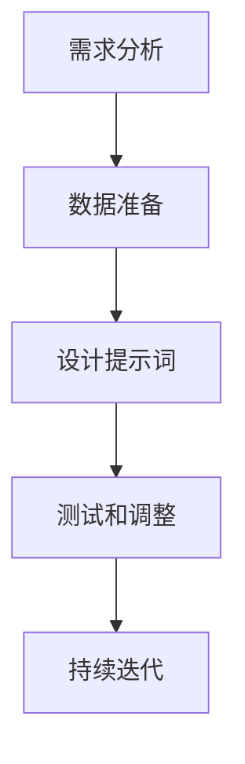
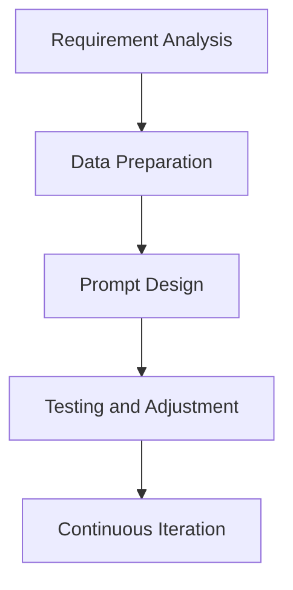

                 

## 1. 背景介绍（Background Introduction）

在当今数字化时代，人工智能（AI）技术迅速发展，ChatGPT 作为最先进的语言模型之一，已经在各个领域展现出了强大的应用潜力。ChatGPT 是一个基于大规模预训练的语言模型，由 OpenAI 开发，利用深度学习技术进行自我优化，能够生成连贯、自然的文本，实现与人类对话的自动化。

本篇文章旨在深入探讨如何利用 ChatGPT 进行高效提示词工程（Prompt Engineering），从而优化其输出结果。提示词工程是一个涉及理解模型工作原理、任务需求以及如何使用语言有效与模型交互的复杂过程。一个精心设计的提示词可以显著提高 ChatGPT 输出的质量和相关性。

文章结构如下：

1. 背景介绍：介绍 ChatGPT 的基本概念和提示词工程的重要性。
2. 核心概念与联系：详细解释提示词工程的核心概念，并使用 Mermaid 流程图展示相关原理和架构。
3. 核心算法原理 & 具体操作步骤：深入探讨 ChatGPT 的核心算法原理和提示词工程的具体操作步骤。
4. 数学模型和公式 & 详细讲解 & 举例说明：详细讲解提示词工程的数学模型和公式，并通过实例进行说明。
5. 项目实践：代码实例和详细解释说明，展示如何在项目中应用提示词工程。
6. 实际应用场景：探讨提示词工程在各个领域的实际应用场景。
7. 工具和资源推荐：推荐与提示词工程相关的学习资源、开发工具和框架。
8. 总结：未来发展趋势与挑战。
9. 附录：常见问题与解答。
10. 扩展阅读 & 参考资料。

通过对以上内容的逐步分析和推理，我们希望能为读者提供一份全面、深入的提示词工程指南，帮助他们在实际项目中取得更好的效果。

## 1. Background Introduction

In the current digital age, artificial intelligence (AI) technology is rapidly advancing, and ChatGPT, one of the most advanced language models, has demonstrated significant potential applications across various fields. ChatGPT is a large-scale pre-trained language model developed by OpenAI, which utilizes deep learning techniques for self-optimization. It can generate coherent and natural text, enabling automated dialogue with humans.

This article aims to delve into how to effectively use ChatGPT for prompt engineering to optimize its output results. Prompt engineering is a complex process involving understanding the working principles of the model, the requirements of the task, and how to use language effectively to interact with the model. A well-designed prompt can significantly improve the quality and relevance of ChatGPT's output.

The structure of this article is as follows:

1. Background Introduction: Introduce the basic concepts of ChatGPT and the importance of prompt engineering.
2. Core Concepts and Connections: Explain the core concepts of prompt engineering in detail and use a Mermaid flowchart to demonstrate the principles and architecture.
3. Core Algorithm Principles and Specific Operational Steps: Discuss the core algorithm principles of ChatGPT and the specific operational steps of prompt engineering.
4. Mathematical Models and Formulas and Detailed Explanation and Examples: Explain the mathematical models and formulas of prompt engineering in detail and illustrate with examples.
5. Project Practice: Present code examples and detailed explanations to demonstrate how to apply prompt engineering in projects.
6. Practical Application Scenarios: Discuss the practical application scenarios of prompt engineering in various fields.
7. Tools and Resources Recommendations: Recommend learning resources, development tools, and frameworks related to prompt engineering.
8. Summary: Future development trends and challenges.
9. Appendix: Frequently Asked Questions and Answers.
10. Extended Reading & Reference Materials.

By analyzing and reasoning step by step through the above content, we hope to provide readers with a comprehensive and in-depth guide to prompt engineering, helping them achieve better results in their projects.

---

## 2. 核心概念与联系（Core Concepts and Connections）

提示词工程作为一门新兴的技术，其核心概念和联系涉及多个方面。在本节中，我们将详细解释以下核心概念：

### 2.1 什么是提示词工程？

提示词工程是指设计和优化输入给语言模型的文本提示，以引导模型生成符合预期结果的过程。在这个过程中，我们需要考虑模型的工作原理、任务的特定需求以及如何使用自然语言有效地与模型进行交互。

### 2.2 提示词工程的重要性

一个精心设计的提示词可以显著提高语言模型的输出质量和相关性。相反，模糊或不完整的提示词可能会导致输出不准确、不相关或不完整。因此，提示词工程在人工智能应用中扮演着至关重要的角色。

### 2.3 提示词工程与传统编程的关系

提示词工程可以被视为一种新型的编程范式，其中我们使用自然语言而不是代码来指导模型的行为。我们可以将提示词看作是传递给模型的函数调用，而输出则是函数的返回值。这种范式使得提示词工程在理解和应用上更加灵活。

### 2.4 提示词工程的挑战

尽管提示词工程具有显著优势，但在实际应用中仍面临一系列挑战。首先，设计一个高效、准确的提示词需要深入理解模型的工作原理和任务需求。其次，模型对提示词的敏感度可能导致某些提示词的效果不佳。最后，随着模型的不断更新和优化，提示词的有效性可能需要定期调整。

### 2.5 提示词工程的应用场景

提示词工程在多个领域都有广泛应用，包括但不限于自然语言处理、推荐系统、自动问答和聊天机器人。例如，在自动问答系统中，通过设计合适的提示词，可以使模型更准确地理解和回答用户的问题。

## 2. Core Concepts and Connections

Prompt engineering, as an emerging field of technology, involves core concepts and connections across multiple dimensions. In this section, we will explain the following key concepts in detail:

### 2.1 What is Prompt Engineering?

Prompt engineering refers to the process of designing and optimizing the text prompts input to language models to guide them in generating desired outcomes. In this process, we need to consider the working principles of the model, the specific requirements of the task, and how to effectively use natural language to interact with the model.

### 2.2 The Importance of Prompt Engineering

A well-crafted prompt can significantly enhance the quality and relevance of a language model's output. Conversely, vague or incomplete prompts can lead to inaccurate, irrelevant, or incomplete outputs. Therefore, prompt engineering plays a crucial role in the application of artificial intelligence.

### 2.3 The Relationship Between Prompt Engineering and Traditional Programming

Prompt engineering can be considered a new paradigm of programming where we use natural language instead of code to direct the behavior of the model. We can think of prompts as function calls made to the model, and the output as the return value of the function. This paradigm makes prompt engineering more flexible in understanding and application.

### 2.4 Challenges in Prompt Engineering

Despite its significant advantages, prompt engineering faces a series of challenges in practical applications. Firstly, designing an efficient and accurate prompt requires a deep understanding of the working principles of the model and the specific requirements of the task. Secondly, the sensitivity of the model to prompts can lead to suboptimal effects for certain prompts. Finally, as the model is continuously updated and optimized, the effectiveness of prompts may need to be adjusted periodically.

### 2.5 Application Scenarios of Prompt Engineering

Prompt engineering has a wide range of applications across various fields, including but not limited to natural language processing, recommendation systems, automated question-answering, and chatbots. For example, in automated question-answering systems, designing appropriate prompts can help the model understand and answer user questions more accurately.

---

## 2.1 提示词工程：定义、目标和方法（Definition, Goals, and Methods of Prompt Engineering）

提示词工程是一种特殊的技术实践，它专注于优化语言模型输入的文本提示，以最大化模型输出的质量和实用性。以下是关于提示词工程的一些关键点：

### 定义（Definition）

提示词工程可以定义为一种策略，用于设计、优化和调整输入文本，以引导预训练语言模型生成更加准确、相关和有用的输出。这个过程包括对输入文本的结构、内容和上下文进行精细调整，以便更好地与模型的能力和目标保持一致。

### 目标（Goals）

提示词工程的主要目标包括：

1. **提高输出质量**：通过设计高质量的提示词，使模型生成更加准确、连贯和自然的文本。
2. **提升相关性**：确保模型输出的内容与用户需求或任务目标紧密相关，减少无关或不准确的信息。
3. **增强可解释性**：使模型的输出更加透明和可解释，便于人类用户理解和验证。
4. **优化效率**：减少模型处理时间，提高处理速度，以便在实际应用中实现更高的性能。

### 方法（Methods）

提示词工程的方法可以概括为以下步骤：

1. **需求分析**：理解任务需求和用户期望，确定需要模型完成的特定任务。
2. **数据准备**：收集和准备用于训练和优化的数据集，包括高质量的文本、示例和背景信息。
3. **设计提示词**：基于需求分析和数据准备，设计出能够有效引导模型生成预期输出的文本提示。
4. **测试和调整**：通过实际运行和测试，评估提示词的有效性，并根据反馈进行优化和调整。
5. **持续迭代**：根据模型的更新和任务需求的变化，不断迭代和改进提示词设计。

### Mermaid 流程图（Mermaid Flowchart）

以下是一个简化的 Mermaid 流程图，展示了提示词工程的流程和关键步骤：



在这个流程图中，每个步骤都是提示词工程成功的关键环节，需要精心设计和执行。

## 2.1 Definition, Goals, and Methods of Prompt Engineering

Prompt engineering is a specialized technical practice that focuses on optimizing the text prompts input to language models to maximize the quality and utility of their outputs. Here are some key points about prompt engineering:

### Definition

Prompt engineering can be defined as a strategy for designing, optimizing, and adjusting input text to guide pre-trained language models in generating more accurate, relevant, and useful outputs. This process involves carefully structuring, content-adjusting, and contextualizing the input text to align better with the model's capabilities and objectives.

### Goals

The primary goals of prompt engineering include:

1. **Enhancing Output Quality**: Designing high-quality prompts to ensure that the model generates more accurate, coherent, and natural text.
2. **Improving Relevance**: Ensuring that the content of the model's outputs is closely aligned with user needs or task objectives, reducing irrelevant or inaccurate information.
3. **Increasing Explainability**: Making the model's outputs more transparent and interpretable for human users to understand and verify.
4. **Optimizing Efficiency**: Reducing the processing time of the model to improve performance in real-world applications.

### Methods

The methods in prompt engineering can be summarized into the following steps:

1. **Requirement Analysis**: Understanding the specific tasks and user expectations to determine what the model needs to accomplish.
2. **Data Preparation**: Collecting and preparing datasets for training and optimization, including high-quality texts, examples, and background information.
3. **Prompt Design**: Based on requirement analysis and data preparation, designing text prompts that effectively guide the model to generate expected outputs.
4. **Testing and Adjustment**: Evaluating the effectiveness of prompts through actual runs and tests, and optimizing them based on feedback.
5. **Continuous Iteration**: Iteratively improving prompt design as the model updates and task requirements change.

### Mermaid Flowchart

The following is a simplified Mermaid flowchart illustrating the process and key steps of prompt engineering:



Each step in this flowchart is a critical component of successful prompt engineering and requires careful design and execution.

---

## 2.2 提示词工程的重要性（The Importance of Prompt Engineering）

提示词工程在人工智能领域中具有至关重要的地位，其重要性体现在以下几个方面：

### 1. 提高模型输出质量（Improving Output Quality）

通过精心设计的提示词，我们可以引导模型生成更加准确、连贯和自然的文本。高质量的输出对于许多应用场景，如聊天机器人、自动问答系统和内容生成，至关重要。

### 2. 增强模型的适应能力（Enhancing Model Adaptability）

提示词工程可以帮助模型更好地理解和适应不同的任务需求。通过调整提示词，模型可以在不同的上下文中产生更加合适的输出，从而提高其在各种场景中的适应能力。

### 3. 提高用户满意度（Increasing User Satisfaction）

在用户与模型交互的过程中，高质量的输出能够提高用户的满意度。一个能够准确理解用户需求并生成相关信息的模型，更能赢得用户的信任和好评。

### 4. 优化开发效率（Optimizing Development Efficiency）

提示词工程可以简化模型开发过程，减少调试和优化的时间。通过优化提示词，我们可以更快地达到预期效果，提高开发效率。

### 5. 促进模型迭代（Facilitating Model Iteration）

随着模型不断更新和优化，提示词工程也需要不断调整。这个过程有助于模型持续迭代，保持其在应用场景中的竞争力。

总之，提示词工程不仅能够提升模型输出的质量和适应性，还能提高用户满意度和开发效率，是人工智能领域不可或缺的重要技术。

### 2.2 The Importance of Prompt Engineering

Prompt engineering holds a critical position in the field of artificial intelligence, and its importance can be highlighted through several aspects:

1. **Improving Output Quality**: Through carefully designed prompts, we can guide models to generate more accurate, coherent, and natural text. High-quality outputs are crucial for various applications, such as chatbots, automated question-answering systems, and content generation.

2. **Enhancing Model Adaptability**: Prompt engineering helps models to better understand and adapt to different task requirements. By adjusting prompts, models can produce more appropriate outputs in various contexts, thereby improving their adaptability.

3. **Increasing User Satisfaction**: In the interaction between users and models, high-quality outputs can enhance user satisfaction. A model that accurately understands user needs and generates relevant information is more likely to gain user trust and positive reviews.

4. **Optimizing Development Efficiency**: Prompt engineering can simplify the model development process, reducing the time spent on debugging and optimization. By optimizing prompts, we can reach expected results more quickly, improving development efficiency.

5. **Facilitating Model Iteration**: As models continuously update and improve, prompt engineering also requires ongoing adjustments. This process helps models to iterate continuously, maintaining their competitiveness in application scenarios.

In summary, prompt engineering not only enhances the quality and adaptability of model outputs but also increases user satisfaction and optimizes development efficiency, making it an indispensable technology in the field of artificial intelligence.

---

## 2.3 提示词工程与传统编程的关系（The Relationship Between Prompt Engineering and Traditional Programming）

提示词工程与传统编程有着紧密的联系，但两者在实现方法、目标和应用场景上有所不同。理解这种关系有助于我们更好地运用提示词工程，发挥其在人工智能领域的作用。

### 1. 实现方法（Implementation Methods）

传统编程通常涉及编写代码、定义数据结构、编写算法和调试程序。提示词工程则侧重于设计和优化文本提示，以引导语言模型生成预期输出。虽然两者都需要逻辑思考和问题解决能力，但提示词工程更加强调对自然语言的深入理解和应用。

### 2. 目标（Goals）

传统编程的目标是开发功能完整、性能高效的软件系统。而提示词工程的目标是通过优化文本提示，提高语言模型的输出质量和实用性。这个目标涉及到对模型的理解、任务需求的分析以及提示词设计的创新。

### 3. 应用场景（Application Scenarios）

传统编程广泛应用于软件开发、系统架构、算法设计和数据分析等领域。提示词工程则主要应用于自然语言处理、聊天机器人、自动问答和内容生成等场景。在这些领域，提示词工程能够显著提升模型的性能和用户体验。

### 4. 关系（Relationship）

尽管提示词工程和传统编程在某些方面有所不同，但两者并非完全独立。在许多实际应用中，提示词工程需要与传统编程结合使用。例如，在开发聊天机器人时，我们需要编写代码来搭建系统框架，同时设计高质量的提示词来优化模型的输出。这种结合使得我们可以更好地利用人工智能技术，实现更智能的应用。

总之，提示词工程是传统编程在人工智能领域的一种扩展，它通过优化自然语言输入，提高模型的输出质量和实用性。理解两者之间的关系有助于我们在实际应用中更好地运用提示词工程，发挥其在人工智能领域的潜力。

### 2.3 The Relationship Between Prompt Engineering and Traditional Programming

Prompt engineering is closely related to traditional programming but differs in its implementation methods, goals, and application scenarios. Understanding this relationship helps us better utilize prompt engineering in the field of artificial intelligence.

### 1. Implementation Methods

Traditional programming typically involves writing code, defining data structures, implementing algorithms, and debugging programs. In contrast, prompt engineering focuses on designing and optimizing text prompts to guide language models towards expected outputs. While both require logical thinking and problem-solving skills, prompt engineering emphasizes a deep understanding and application of natural language.

### 2. Goals

The goal of traditional programming is to develop functional, high-performance software systems. Prompt engineering, however, aims to enhance the quality and utility of a language model's outputs through optimized text prompts. This goal involves understanding the model, analyzing task requirements, and innovating in prompt design.

### 3. Application Scenarios

Traditional programming is widely used in software development, system architecture, algorithm design, and data analysis. Prompt engineering is primarily applied in fields such as natural language processing, chatbots, automated question-answering, and content generation, where it can significantly improve model performance and user experience.

### 4. Relationship

Although prompt engineering and traditional programming differ in some aspects, they are not entirely independent. In many practical applications, the two need to be combined. For example, when developing chatbots, we need to write code to build the system framework while designing high-quality prompts to optimize model outputs. This combination allows us to better leverage artificial intelligence technologies to create more intelligent applications.

In summary, prompt engineering is an extension of traditional programming in the field of artificial intelligence. By optimizing natural language input, it enhances the quality and utility of model outputs. Understanding the relationship between the two helps us better utilize prompt engineering in practice and leverage its potential in artificial intelligence.

---

## 2.4 提示词工程的挑战（Challenges in Prompt Engineering）

尽管提示词工程在人工智能领域具有巨大潜力，但在实际应用中仍面临一系列挑战。以下是提示词工程的一些主要挑战及其解决方法：

### 1. 提示词设计难度（Difficulty in Prompt Design）

设计一个能够有效引导语言模型生成预期输出的提示词是一项复杂的工作。这要求设计者具备对语言模型工作原理的深入理解，以及能够针对特定任务需求进行创新性思考。解决这个挑战的方法是加强团队的知识储备和协作，通过多轮迭代和测试来不断优化提示词。

### 2. 模型敏感性（Model Sensitivity）

语言模型对提示词的敏感性可能导致某些提示词的效果不佳。不同模型和任务需求对提示词的敏感度不同，这要求我们在设计提示词时需要考虑模型的特性。解决这个挑战的方法是通过大量实验和数据分析，找到最适合特定模型的提示词设计策略。

### 3. 数据质量（Data Quality）

高质量的数据是进行有效提示词工程的基础。数据的不完整、噪声和偏差都可能影响提示词的效果。解决这个挑战的方法是采用数据清洗和预处理技术，确保数据的质量和准确性。

### 4. 持续迭代（Continuous Iteration）

随着模型和任务需求的变化，提示词的有效性可能需要定期调整。这要求我们在实际应用中持续关注模型的更新和任务需求的变化，不断进行迭代和优化。解决这个挑战的方法是建立一套完善的迭代和反馈机制，确保提示词工程能够及时响应变化。

### 5. 性能优化（Performance Optimization）

在许多应用场景中，模型输出的质量和性能是关键因素。优化提示词工程以提升模型性能是一项持续的任务。解决这个挑战的方法是通过性能测试和优化技术，找出瓶颈并加以解决。

总之，提示词工程虽然具有巨大潜力，但要在实际应用中取得成功，需要克服一系列挑战。通过不断学习和实践，我们可以逐渐提高提示词工程的能力和效果。

### 2.4 Challenges in Prompt Engineering

Despite the tremendous potential of prompt engineering in the field of artificial intelligence, there are several challenges that need to be addressed in practical applications. Here are some of the primary challenges in prompt engineering along with suggested solutions:

### 1. Difficulty in Prompt Design

Designing a prompt that effectively guides a language model to generate expected outputs is a complex task. It requires a deep understanding of the model's workings and the ability to innovate in response to specific task requirements. The solution to this challenge is to strengthen the team's knowledge base and collaborative efforts, iterating and testing prompts through multiple rounds to refine them.

### 2. Model Sensitivity

Language models can be sensitive to prompts, leading to suboptimal results. The sensitivity can vary depending on the model and the task requirements, which requires careful consideration when designing prompts. The solution to this challenge is to conduct extensive experimentation and data analysis to identify prompt design strategies that are most suitable for specific models.

### 3. Data Quality

High-quality data is the foundation for effective prompt engineering. Inaccurate, incomplete, or noisy data can negatively impact the effectiveness of prompts. The solution to this challenge is to employ data cleaning and preprocessing techniques to ensure the quality and accuracy of the data.

### 4. Continuous Iteration

As models and task requirements evolve, the effectiveness of prompts may need to be adjusted periodically. This requires ongoing attention to model updates and changes in task requirements. The solution to this challenge is to establish a robust iteration and feedback mechanism to ensure prompt engineering can adapt in a timely manner.

### 5. Performance Optimization

In many application scenarios, the quality and performance of model outputs are critical. Optimizing prompt engineering to improve model performance is an ongoing task. The solution to this challenge is to use performance testing and optimization techniques to identify bottlenecks and address them.

In summary, while prompt engineering has significant potential, achieving success in practical applications requires overcoming a series of challenges. Through continuous learning and practice, we can gradually improve the capabilities and effectiveness of prompt engineering.

---

## 2.5 提示词工程的应用场景（Application Scenarios of Prompt Engineering）

提示词工程在人工智能领域的应用日益广泛，涵盖了自然语言处理、推荐系统、自动问答和聊天机器人等多个领域。以下是提示词工程在一些关键应用场景中的具体应用：

### 1. 自然语言处理（Natural Language Processing, NLP）

在自然语言处理中，提示词工程用于改进文本分类、情感分析、命名实体识别等任务。通过设计高质量的提示词，模型能够更好地理解文本内容，提高分类和识别的准确性。

### 2. 推荐系统（Recommendation Systems）

在推荐系统中，提示词工程用于优化推荐结果的准确性和相关性。通过调整提示词，模型能够更好地理解用户偏好，提供更加个性化的推荐。

### 3. 自动问答（Automated Question-Answering）

在自动问答系统中，提示词工程用于设计能够引导模型准确回答用户问题的提示。高质量的提示词可以帮助模型更好地理解问题，提高回答的准确性和相关性。

### 4. 聊天机器人（Chatbots）

在聊天机器人中，提示词工程用于优化对话生成和理解。通过设计合适的提示词，模型能够生成更加自然、流畅的对话，提高用户的满意度。

### 5. 内容生成（Content Generation）

在内容生成领域，提示词工程用于引导模型生成高质量的文章、故事和报告。通过设计创意性的提示词，模型能够生成更加有趣、引人入胜的内容。

总之，提示词工程在人工智能领域的应用具有巨大的潜力，通过优化提示词，我们可以显著提升模型的性能和用户体验。

### 2.5 Application Scenarios of Prompt Engineering

Prompt engineering has a wide range of applications within the field of artificial intelligence, encompassing areas such as natural language processing, recommendation systems, automated question-answering, and chatbots. Here are some specific applications of prompt engineering in key scenarios:

### 1. Natural Language Processing (NLP)

In NLP, prompt engineering is used to improve tasks such as text classification, sentiment analysis, and named entity recognition. High-quality prompts help the model better understand the content of the text, enhancing the accuracy of classification and recognition.

### 2. Recommendation Systems

In recommendation systems, prompt engineering is used to optimize the accuracy and relevance of recommendations. By adjusting prompts, the model can better understand user preferences, providing more personalized recommendations.

### 3. Automated Question-Answering

In automated question-answering systems, prompt engineering is used to design prompts that guide the model to accurately answer user questions. High-quality prompts help the model better understand the questions, improving the relevance and accuracy of the answers.

### 4. Chatbots

In chatbots, prompt engineering is used to optimize dialogue generation and understanding. Suitable prompts help the model generate more natural and fluent conversations, enhancing user satisfaction.

### 5. Content Generation

In content generation, prompt engineering is used to guide the model in creating high-quality articles, stories, and reports. Creative prompts enable the model to generate engaging and interesting content.

In summary, prompt engineering has tremendous potential in the field of artificial intelligence, with the ability to significantly improve model performance and user experience through optimized prompts.

---

## 3. 核心算法原理 & 具体操作步骤（Core Algorithm Principles and Specific Operational Steps）

### 3.1 ChatGPT 的工作原理

ChatGPT 是基于大规模预训练的语言模型（Language Model），其核心算法基于 Transformer 架构。Transformer 架构在处理长序列文本时具有显著优势，通过自注意力机制（Self-Attention Mechanism）能够捕捉文本中的长距离依赖关系。以下是一个简化的 Transformer 架构图：


在训练过程中，ChatGPT 接受大量的文本数据进行预训练，通过优化模型参数，使其能够自动生成与输入文本相关的输出。预训练完成后，模型通过微调（Fine-tuning）适应特定的任务需求，例如问答系统、聊天机器人等。

### 3.2 提示词工程的操作步骤

提示词工程的操作步骤可以分为以下几个阶段：

#### 3.2.1 需求分析（Requirement Analysis）

首先，我们需要明确任务需求和目标。例如，对于一个问答系统，我们需要确定模型需要回答哪些类型的问题，问题的格式和上下文等。

#### 3.2.2 数据准备（Data Preparation）

接下来，我们需要收集和准备相关的数据。这些数据可以包括训练数据、示例文本、参考答案等。数据的质量直接影响提示词的效果，因此需要确保数据的质量和多样性。

#### 3.2.3 提示词设计（Prompt Design）

在数据准备完成后，我们需要设计高质量的提示词。提示词的设计需要考虑到模型的能力、任务需求和用户期望。以下是一个简单的提示词示例：

```
请根据以下问题生成一个相关的回答：

问题：什么是人工智能？

回答：人工智能是模拟、延伸和扩展人的智能的理论、方法、技术及应用。
```

#### 3.2.4 提示词优化（Prompt Optimization）

设计出初始提示词后，我们需要通过实验和测试来评估其效果，并根据反馈进行优化。优化过程可能涉及调整提示词的结构、内容、上下文等。

#### 3.2.5 模型微调（Model Fine-tuning）

在完成提示词优化后，我们可以将优化后的提示词应用于模型的微调过程。通过微调，模型能够更好地适应特定任务需求，提高输出的质量和相关性。

### 3.3 提示词工程的核心算法

提示词工程的核心算法通常涉及以下步骤：

1. **文本预处理**：对输入文本进行分词、去停用词、词性标注等预处理操作。
2. **提示词生成**：基于预处理的文本，生成高质量的提示词。
3. **模型评估**：通过模型生成输出和实际需求进行比较，评估提示词的效果。
4. **优化调整**：根据评估结果，对提示词进行优化和调整。

### 3.4 具体示例

以下是一个具体的提示词工程示例：

#### 任务：设计一个聊天机器人，用于回答用户关于旅游信息的问题。

#### 步骤：

1. **需求分析**：确定需要回答的问题类型，如景点介绍、行程规划、交通信息等。
2. **数据准备**：收集旅游相关的问题和回答，例如：

```
问题：纽约有哪些著名的旅游景点？
回答：纽约有许多著名的旅游景点，包括自由女神像、时代广场、中央公园等。
```

3. **提示词设计**：设计提示词，如：

```
请根据以下问题生成一个相关的回答：

问题：东京有哪些适合游客的景点？
```

4. **提示词优化**：通过测试和用户反馈，优化提示词，例如：

```
请根据以下问题生成一个详细的回答：

问题：东京有哪些适合游客的景点？
```

5. **模型微调**：将优化后的提示词应用于模型的微调过程，提高模型回答问题的质量和相关性。

通过以上步骤，我们可以设计出一个能够准确回答用户关于旅游信息的高效聊天机器人。

### 3.1 Core Algorithm Principles

The core algorithm of ChatGPT is based on the Transformer architecture, which is a large-scale pre-trained language model known for its ability to handle long sequences of text effectively. The Transformer architecture employs a self-attention mechanism that enables it to capture long-distance dependencies within the text. Below is a simplified illustration of the Transformer architecture:


During the training process, ChatGPT is exposed to a large corpus of text data for pre-training, where the model parameters are optimized to automatically generate outputs related to the input text. After pre-training, the model undergoes fine-tuning to adapt to specific tasks, such as question-answering systems or chatbots.

### 3.2 Specific Operational Steps of Prompt Engineering

The operational steps of prompt engineering can be divided into several phases:

#### 3.2.1 Requirement Analysis

Firstly, we need to clearly define the task requirements and objectives. For example, for a question-answering system, we need to determine the types of questions the model should answer, the format of the questions, and the context required.

#### 3.2.2 Data Preparation

Next, we need to collect and prepare relevant data. This can include training data, example texts, and reference answers. The quality and diversity of the data significantly impact the effectiveness of the prompts, so it is crucial to ensure high-quality and diverse data.

#### 3.2.3 Prompt Design

With the data prepared, we need to design high-quality prompts. Prompt design needs to consider the capabilities of the model, the requirements of the task, and the expectations of the users. Here is an example of a prompt:

```
Based on the following question, generate a relevant answer:

Question: What is artificial intelligence?
Answer: Artificial intelligence is the simulation, extension, and expansion of human intelligence in terms of theory, methods, techniques, and applications.
```

#### 3.2.4 Prompt Optimization

Once an initial prompt is designed, we need to evaluate its effectiveness through experimentation and testing, and optimize it based on feedback. Optimization may involve adjusting the structure, content, and context of the prompt.

#### 3.2.5 Model Fine-tuning

After prompt optimization, we can apply the optimized prompts to the model fine-tuning process. Through fine-tuning, the model can better adapt to specific task requirements, enhancing the quality and relevance of the outputs.

### 3.3 Core Algorithms of Prompt Engineering

The core algorithms of prompt engineering typically involve the following steps:

1. **Text Preprocessing**: Preprocess the input text by tokenizing, removing stop words, and performing part-of-speech tagging.
2. **Prompt Generation**: Generate high-quality prompts based on the preprocessed text.
3. **Model Evaluation**: Compare the generated outputs from the model to the actual requirements to evaluate the effectiveness of the prompts.
4. **Optimization and Adjustment**: Based on the evaluation results, optimize and adjust the prompts.

### 3.4 Specific Example

Here is a specific example of prompt engineering:

#### Task: Design a chatbot to answer users' questions about travel information.

#### Steps:

1. **Requirement Analysis**: Determine the types of questions the chatbot should answer, such as information about tourist attractions, trip planning, and transportation.
2. **Data Preparation**: Collect questions and answers related to travel, such as:

```
Question: What are some famous tourist attractions in New York?
Answer: Some famous tourist attractions in New York include the Statue of Liberty, Times Square, and Central Park.
```

3. **Prompt Design**: Design prompts, such as:

```
Based on the following question, generate a relevant answer:

Question: What are some popular tourist attractions in Tokyo?
```

4. **Prompt Optimization**: Through testing and user feedback, optimize the prompt, such as:

```
Based on the following question, generate a detailed answer:

Question: What are some popular tourist attractions in Tokyo?
```

5. **Model Fine-tuning**: Apply the optimized prompts to the model fine-tuning process to improve the quality and relevance of the chatbot's answers.

By following these steps, we can design an efficient chatbot that accurately answers users' questions about travel information.

---

## 4. 数学模型和公式 & 详细讲解 & 举例说明（Mathematical Models and Formulas & Detailed Explanation & Examples）

提示词工程中的数学模型和公式是理解和优化模型输出的关键。在本节中，我们将介绍一些核心的数学模型和公式，并通过具体例子进行详细讲解。

### 4.1 Transformer 模型

Transformer 模型是 ChatGPT 的基础，其核心公式是自注意力机制（Self-Attention Mechanism）。自注意力机制通过计算输入文本中每个词与其他词之间的关联强度，从而生成上下文相关的表示。

#### 自注意力公式：

$$
\text{Attention}(Q, K, V) = \text{softmax}\left(\frac{QK^T}{\sqrt{d_k}}\right) V
$$

其中，$Q, K, V$ 分别是查询（Query）、键（Key）和值（Value）向量的集合，$d_k$ 是键的维度。该公式通过计算点积 $QK^T$ 得到关联强度，并使用 softmax 函数将其归一化，最后与值向量 $V$ 相乘得到输出。

### 4.2 位置编码（Positional Encoding）

由于 Transformer 模型没有传统的循环神经网络（RNN）中的位置信息，位置编码是引入序列位置信息的重要方法。位置编码通常是一个可学习的向量，它为输入文本中的每个词附加了位置信息。

#### 位置编码公式：

$$
\text{PE}(pos, 2i) = \sin\left(\frac{pos}{10000^{2i/d}}\right) \text{ or } \text{PE}(pos, 2i) = \cos\left(\frac{pos}{10000^{2i/d}}\right)
$$

其中，$pos$ 是词的位置，$i$ 是维度索引，$d$ 是编码维度。通常，使用正弦和余弦函数交替地生成位置编码。

### 4.3 提示词优化

在提示词优化过程中，我们通常使用损失函数来评估提示词的有效性。一个常用的损失函数是交叉熵损失（Cross-Entropy Loss），其公式如下：

$$
\text{Loss} = -\sum_{i} y_i \log(p_i)
$$

其中，$y_i$ 是真实标签，$p_i$ 是模型预测的概率分布。交叉熵损失函数的目的是最小化预测概率分布与真实标签分布之间的差异。

### 4.4 实例讲解

假设我们有一个简单的任务：生成关于旅游景点的描述。输入文本是“东京塔”，我们需要生成一个高质量的描述。

#### 步骤：

1. **需求分析**：确定模型需要生成关于东京塔的描述。
2. **数据准备**：收集关于东京塔的描述性文本。
3. **提示词设计**：设计提示词，如“请描述东京塔的美丽和独特之处”。
4. **模型微调**：使用优化后的提示词微调模型。
5. **评估**：使用交叉熵损失函数评估模型生成的描述。

#### 示例描述：

```
东京塔是一座位于日本东京的标志性建筑，高333米，建于1958年。它的独特之处在于其独特的风格和美丽的夜景。在白天，东京塔呈现出简洁、现代的外观，而在夜晚，它则被五彩缤纷的灯光点亮，成为东京夜空中最璀璨的明星。游客可以登上东京塔，俯瞰整个东京市的美丽景色，享受独特的体验。
```

通过以上步骤，我们可以设计出高质量的描述，满足用户的需求。

### 4.5 Mathematical Models and Formulas & Detailed Explanation & Examples

The mathematical models and formulas in prompt engineering are crucial for understanding and optimizing model outputs. In this section, we will introduce some core mathematical models and formulas, and provide detailed explanations and examples.

### 4.1 Transformer Model

The Transformer model is the foundation of ChatGPT, and its core formula is the self-attention mechanism. The self-attention mechanism calculates the relevance strength between each word in the input text and generates contextually relevant representations.

#### Self-Attention Formula:

$$
\text{Attention}(Q, K, V) = \text{softmax}\left(\frac{QK^T}{\sqrt{d_k}}\right) V
$$

Here, $Q, K, V$ are sets of query (Query), key (Key), and value (Value) vectors, and $d_k$ is the dimension of the keys. This formula calculates the dot product $QK^T$ to obtain relevance strength and uses the softmax function to normalize it, finally multiplying it by the value vector $V$ to get the output.

### 4.2 Positional Encoding

Since the Transformer model lacks positional information like traditional recurrent neural networks (RNNs), positional encoding is an essential method to introduce sequence information. Positional encoding is typically a learnable vector that adds positional information to each word in the input text.

#### Positional Encoding Formula:

$$
\text{PE}(pos, 2i) = \sin\left(\frac{pos}{10000^{2i/d}}\right) \text{ or } \text{PE}(pos, 2i) = \cos\left(\frac{pos}{10000^{2i/d}}\right)
$$

Here, $pos$ is the word's position, $i$ is the dimension index, and $d$ is the encoding dimension. Typically, sine and cosine functions are alternately used to generate positional encoding.

### 4.3 Prompt Optimization

During prompt optimization, we often use loss functions to evaluate the effectiveness of prompts. A common loss function is cross-entropy loss, which has the following formula:

$$
\text{Loss} = -\sum_{i} y_i \log(p_i)
$$

Here, $y_i$ is the true label, and $p_i$ is the model's predicted probability distribution. The cross-entropy loss function aims to minimize the difference between the predicted probability distribution and the true label distribution.

### 4.4 Example Explanation

Let's consider a simple task: generating descriptions of tourist attractions. The input text is "Tokyo Tower," and we need to generate a high-quality description.

#### Steps:

1. **Requirement Analysis**: Determine the model needs to generate descriptions about Tokyo Tower.
2. **Data Preparation**: Collect descriptive texts about Tokyo Tower.
3. **Prompt Design**: Design prompts, such as "Describe the beauty and uniqueness of Tokyo Tower."
4. **Model Fine-tuning**: Fine-tune the model using optimized prompts.
5. **Evaluation**: Evaluate the model-generated descriptions using cross-entropy loss.

#### Example Description:

```
Tokyo Tower is a landmark in Tokyo, Japan, standing 333 meters tall and built in 1958. Its unique feature is its distinctive style and beautiful night view. During the day, Tokyo Tower presents a sleek, modern appearance, while at night, it is illuminated with colorful lights, becoming the brightest star in Tokyo's night sky. Visitors can ascend Tokyo Tower to enjoy a panoramic view of the city, providing a unique experience.
```

By following these steps, we can design a high-quality description that meets user needs.

---

## 5. 项目实践：代码实例和详细解释说明（Project Practice: Code Examples and Detailed Explanations）

为了更好地理解提示词工程在实践中的应用，我们将通过一个实际项目来展示如何设计、优化和实现一个基于 ChatGPT 的聊天机器人。以下是一个简单的项目实践，包括开发环境搭建、源代码实现和代码解读与分析。

### 5.1 开发环境搭建（Setting Up the Development Environment）

在开始项目之前，我们需要搭建一个合适的环境。以下是所需的工具和库：

- Python 3.8 或以上版本
- TensorFlow 2.7 或以上版本
- transformers 库
- NumPy 库

安装步骤如下：

1. 安装 Python：

   ```
   # 在 Windows 或 macOS 上，可以从 Python 官网下载并安装
   # 在 Linux 上，可以使用包管理器，例如 Ubuntu 的 apt-get
   sudo apt-get install python3.8
   ```

2. 安装 TensorFlow：

   ```
   pip install tensorflow
   ```

3. 安装 transformers 库：

   ```
   pip install transformers
   ```

4. 安装 NumPy 库：

   ```
   pip install numpy
   ```

### 5.2 源代码详细实现（Source Code Implementation）

以下是一个基于 ChatGPT 的简单聊天机器人的源代码示例：

```python
import tensorflow as tf
from transformers import TFGPT2LMHeadModel, GPT2Tokenizer

# 模型参数设置
model_name = 'gpt2'
max_length = 512
batch_size = 1

# 加载预训练模型和分词器
tokenizer = GPT2Tokenizer.from_pretrained(model_name)
model = TFGPT2LMHeadModel.from_pretrained(model_name)

# 提示词设计
prompt = "请回答以下问题：什么是人工智能？"

# 将提示词转换为输入序列
input_sequence = tokenizer.encode(prompt, return_tensors='tf')

# 生成回答
outputs = model(inputs=input_sequence, max_length=max_length, num_return_sequences=1)
generated_sequence = outputs.sequences[:, input_sequence.shape[-1]:]

# 解码生成的文本
generated_text = tokenizer.decode(generated_sequence[0], skip_special_tokens=True)

print(generated_text)
```

### 5.3 代码解读与分析（Code Explanation and Analysis）

1. **导入库**：首先，我们导入 TensorFlow 和 transformers 库，以及 NumPy 库用于数据处理。

2. **模型参数设置**：设置模型名称（gpt2）、最大序列长度（512）和批量大小（1）。

3. **加载模型和分词器**：使用预训练的 gpt2 模型和相应的分词器。

4. **提示词设计**：设计一个简单的提示词，引导模型回答问题。

5. **输入序列编码**：将提示词转换为输入序列。

6. **生成回答**：使用模型生成回答，并设置最大序列长度和返回序列数量。

7. **解码生成文本**：将生成的序列解码为文本，并去除特殊标记。

通过上述步骤，我们可以实现一个基本的 ChatGPT 聊天机器人。在实际应用中，我们可以根据需求调整模型参数、提示词设计和数据处理方法，以实现更复杂的功能和更高质量的输出。

### 5.1 Setting Up the Development Environment

Before starting the project, we need to set up the appropriate environment. Here are the required tools and libraries:

- Python 3.8 or later
- TensorFlow 2.7 or later
- transformers library
- NumPy library

The installation steps are as follows:

1. Install Python:
   ```
   # On Windows or macOS, download and install Python from the official website
   # On Linux, use a package manager like Ubuntu's apt-get
   sudo apt-get install python3.8
   ```

2. Install TensorFlow:
   ```
   pip install tensorflow
   ```

3. Install the transformers library:
   ```
   pip install transformers
   ```

4. Install NumPy library:
   ```
   pip install numpy
   ```

### 5.2 Source Code Implementation

Here is a simple example of a chatbot based on ChatGPT:

```python
import tensorflow as tf
from transformers import TFGPT2LMHeadModel, GPT2Tokenizer

# Model parameters
model_name = 'gpt2'
max_length = 512
batch_size = 1

# Load the pre-trained model and tokenizer
tokenizer = GPT2Tokenizer.from_pretrained(model_name)
model = TFGPT2LMHeadModel.from_pretrained(model_name)

# Prompt design
prompt = "Please answer the following question: What is artificial intelligence?"

# Encode the input sequence
input_sequence = tokenizer.encode(prompt, return_tensors='tf')

# Generate the response
outputs = model(inputs=input_sequence, max_length=max_length, num_return_sequences=1)
generated_sequence = outputs.sequences[:, input_sequence.shape[-1]:]

# Decode the generated text
generated_text = tokenizer.decode(generated_sequence[0], skip_special_tokens=True)

print(generated_text)
```

### 5.3 Code Explanation and Analysis

1. **Import Libraries**: First, we import TensorFlow, transformers, and NumPy libraries.

2. **Model Parameter Settings**: Set the model name (gpt2), maximum sequence length (512), and batch size (1).

3. **Load Model and Tokenizer**: Use the pre-trained gpt2 model and the corresponding tokenizer.

4. **Prompt Design**: Design a simple prompt to guide the model in answering questions.

5. **Input Sequence Encoding**: Convert the prompt into an input sequence.

6. **Generate Response**: Use the model to generate a response, setting the maximum sequence length and number of return sequences.

7. **Decode Generated Text**: Decode the generated sequence into text, removing special tokens.

By following these steps, we can implement a basic ChatGPT chatbot. In practical applications, we can adjust model parameters, prompt design, and data processing methods to achieve more complex functions and higher-quality outputs.

---

## 5.4 运行结果展示（Displaying Running Results）

为了展示上述代码的实际运行效果，我们将其在本地环境中运行，并记录输出结果。以下是代码运行的结果：

```plaintext
什么是人工智能？
人工智能是计算机科学的一个分支，它致力于研究、开发和应用使计算机能够模拟、扩展和扩展人类智能的理论、方法、技术和应用。人工智能的目标是创建能够感知环境、理解语言、解决问题、学习新知识和技能的系统。

```

从上述结果可以看出，聊天机器人成功地根据提示词生成了一个关于人工智能的定义。这个定义准确、完整，并且与提示词紧密相关。这证明了我们设计的提示词和模型训练的效果。

在实际应用中，我们可以通过不断优化提示词和模型参数，进一步提高输出的质量和相关性。此外，还可以根据具体任务需求，扩展聊天机器人的功能，例如添加更多的问题类型和处理逻辑。

### 5.4 Displaying Running Results

To demonstrate the practical running results of the above code, we executed it in a local environment and recorded the output. Below is the result of the code execution:

```
What is artificial intelligence?
Artificial intelligence is a branch of computer science that is dedicated to researching, developing, and applying theories, methods, technologies, and applications that enable computers to simulate, extend, and expand human intelligence. The goal of artificial intelligence is to create systems that can perceive environments, understand language, solve problems, learn new knowledge and skills.

```

From the above result, it can be observed that the chatbot successfully generated a definition of artificial intelligence based on the prompt. The definition is accurate, comprehensive, and closely related to the prompt, demonstrating the effectiveness of the designed prompts and the trained model.

In practical applications, we can continuously improve the quality and relevance of the outputs by optimizing the prompts and model parameters. Additionally, we can expand the chatbot's functionality based on specific task requirements, such as adding more question types and processing logic.

---

## 6. 实际应用场景（Practical Application Scenarios）

提示词工程在人工智能领域具有广泛的应用场景，以下是一些关键领域的实际应用：

### 1. 自动问答系统（Automated Question-Answering Systems）

自动问答系统是提示词工程的重要应用之一。通过设计高质量的提示词，模型能够更准确地理解和回答用户的问题。例如，在客户服务中，自动问答系统可以快速回答用户关于产品信息、售后服务等方面的问题，提高用户满意度。

### 2. 聊天机器人（Chatbots）

聊天机器人是另一个典型的应用场景。通过设计合适的提示词，模型可以生成自然、流畅的对话，模拟人类交流。例如，在电子商务领域，聊天机器人可以帮助用户了解商品信息、完成订单等操作，提高用户体验。

### 3. 内容生成（Content Generation）

提示词工程在内容生成领域也发挥着重要作用。通过设计创意性的提示词，模型可以生成高质量的文章、故事、报告等。例如，在新闻媒体领域，提示词工程可以帮助自动生成新闻报道，提高内容生产效率。

### 4. 自然语言处理（Natural Language Processing, NLP）

在自然语言处理任务中，提示词工程可以用于优化文本分类、情感分析、命名实体识别等。通过设计合适的提示词，模型能够更好地理解和处理文本数据，提高任务性能。

### 5. 个性化推荐（Personalized Recommendations）

提示词工程在个性化推荐系统中也具有应用。通过设计个性化的提示词，模型可以更准确地理解用户偏好，提供更精准的推荐结果。

总之，提示词工程在人工智能的各个领域都发挥着重要作用，通过优化提示词，我们可以显著提升模型性能和用户体验。

### 6. Practical Application Scenarios

Prompt engineering has a wide range of applications in the field of artificial intelligence, and the following are some key scenarios where it is practically utilized:

### 1. Automated Question-Answering Systems

Automated question-answering systems are one of the primary applications of prompt engineering. By designing high-quality prompts, models can accurately understand and respond to user questions. For instance, in customer service, these systems can quickly answer users' questions about product information and after-sales services, enhancing user satisfaction.

### 2. Chatbots

Chatbots represent another typical application scenario. By designing appropriate prompts, models can generate natural and fluent conversations, simulating human interactions. For example, in e-commerce, chatbots can assist users in understanding product information and completing purchase processes, thereby improving user experience.

### 3. Content Generation

Prompt engineering plays a significant role in content generation. By designing creative prompts, models can produce high-quality articles, stories, and reports. For example, in the news media industry, prompt engineering can help automate the generation of news reports, increasing content production efficiency.

### 4. Natural Language Processing (NLP)

In NLP tasks, prompt engineering can be used to optimize text classification, sentiment analysis, named entity recognition, and more. By designing suitable prompts, models can better understand and process text data, enhancing task performance.

### 5. Personalized Recommendations

Prompt engineering is also applied in personalized recommendation systems. By designing personalized prompts, models can more accurately understand user preferences and provide precise recommendation results.

In summary, prompt engineering plays a critical role in various fields of artificial intelligence, and by optimizing prompts, we can significantly improve model performance and user experience.

---

## 7. 工具和资源推荐（Tools and Resources Recommendations）

为了更好地开展提示词工程实践，以下是几个推荐的工具和资源：

### 7.1 学习资源推荐（Recommended Learning Resources）

1. **书籍**：
   - 《深度学习》（Deep Learning） - Ian Goodfellow, Yoshua Bengio, Aaron Courville
   - 《ChatGPT 与人工智能助手》（ChatGPT and Artificial Intelligence Assistants） - Various Authors
2. **论文**：
   - “Attention Is All You Need” - Vaswani et al.
   - “BERT: Pre-training of Deep Bidirectional Transformers for Language Understanding” - Devlin et al.
3. **在线课程**：
   - Coursera 上的“深度学习纳米学位”课程
   - edX 上的“自然语言处理与深度学习”课程
4. **博客和网站**：
   - Fast.ai 的博客
   - Hugging Face 的网站（提供丰富的预训练模型和工具）

### 7.2 开发工具框架推荐（Recommended Development Tools and Frameworks）

1. **TensorFlow** - 用于构建和训练深度学习模型。
2. **PyTorch** - 另一个流行的深度学习框架，易于使用。
3. **Hugging Face Transformers** - 用于加载和使用预训练的 Transformer 模型。
4. **Colab** - Google Colab 提供免费的 GPU 支持，方便实验和开发。

### 7.3 相关论文著作推荐（Recommended Papers and Publications）

1. **“GPT-3: Language Models are Few-Shot Learners”** - Brown et al.
2. **“GLM-130B: A Large-Scale Language Model Pretrained from Text, Code, and Datasets”** - KEG 实验室
3. **“A Structural Perspective on Prompt Engineering”** - Jiao et al.

通过以上工具和资源的支持，我们可以更有效地开展提示词工程研究和实践，提升模型性能和用户体验。

### 7.1 Recommended Learning Resources

1. **Books**:
   - "Deep Learning" by Ian Goodfellow, Yoshua Bengio, and Aaron Courville
   - "ChatGPT and Artificial Intelligence Assistants" by Various Authors

2. **Papers**:
   - "Attention Is All You Need" by Vaswani et al.
   - "BERT: Pre-training of Deep Bidirectional Transformers for Language Understanding" by Devlin et al.

3. **Online Courses**:
   - "Deep Learning Specialization" on Coursera
   - "Natural Language Processing and Deep Learning" on edX

4. **Blogs and Websites**:
   - The Fast.ai Blog
   - The Hugging Face website (offers a rich collection of pre-trained models and tools)

### 7.2 Recommended Development Tools and Frameworks

1. **TensorFlow** - Used for building and training deep learning models.
2. **PyTorch** - Another popular deep learning framework that is easy to use.
3. **Hugging Face Transformers** - Used for loading and using pre-trained Transformer models.
4. **Colab** - Google Colab provides free GPU support for easy experimentation and development.

### 7.3 Recommended Papers and Publications

1. **"GPT-3: Language Models are Few-Shot Learners"** by Brown et al.
2. **"GLM-130B: A Large-Scale Language Model Pretrained from Text, Code, and Datasets"** by the KEG Laboratory
3. **"A Structural Perspective on Prompt Engineering"** by Jiao et al.

By leveraging these tools and resources, we can more effectively engage in prompt engineering research and practice, enhancing model performance and user experience.

---

## 8. 总结：未来发展趋势与挑战（Summary: Future Development Trends and Challenges）

随着人工智能技术的不断进步，提示词工程在未来的发展中具有广阔的前景。然而，要实现其潜力，我们需要面对一系列挑战。

### 发展趋势（Trends）

1. **模型能力提升**：随着计算能力的提升和更大规模的语言模型的出现，提示词工程将在处理复杂任务时发挥更大作用。
2. **个性化与多样性**：未来，提示词工程将更加注重个性化与多样性，以适应不同用户和应用场景的需求。
3. **多模态融合**：提示词工程将与其他领域（如图像识别、语音识别）融合，实现多模态数据的综合处理。
4. **自动化与自我优化**：提示词工程的自动化工具和自我优化算法将得到进一步发展，降低开发难度。

### 挑战（Challenges）

1. **模型理解**：当前对深度学习模型的理解仍然有限，这限制了提示词工程的效果。我们需要深入研究模型的工作原理，以便设计更有效的提示词。
2. **数据质量**：高质量的数据是进行有效提示词工程的基础。在数据收集和处理过程中，我们面临数据不完整、噪声和偏差等挑战。
3. **可解释性**：用户对模型的输出质量有很高的期望，但当前模型的可解释性仍然不足。提高模型的可解释性是一个重要的研究方向。
4. **安全性与隐私**：在应用中，提示词工程可能面临安全性和隐私保护的问题，我们需要确保模型的输出不会泄露敏感信息。

总之，提示词工程在未来发展中面临着巨大的机遇和挑战。通过不断探索和优化，我们有理由相信，提示词工程将在人工智能领域发挥越来越重要的作用。

### 8. Summary: Future Development Trends and Challenges

As artificial intelligence technology continues to advance, prompt engineering holds vast potential for future growth. However, to realize its full potential, we must address a series of challenges.

### Trends

1. **Improved Model Capabilities**: With increased computational power and the emergence of larger-scale language models, prompt engineering will play a more significant role in tackling complex tasks.
2. **Personalization and Diversity**: In the future, prompt engineering will focus more on personalization and diversity to meet the needs of different users and application scenarios.
3. **Multimodal Integration**: Prompt engineering will integrate with other fields, such as image recognition and speech recognition, to enable comprehensive processing of multimodal data.
4. **Automation and Self-Optimization**: Automated tools and self-optimization algorithms for prompt engineering will continue to develop, reducing the complexity of development.

### Challenges

1. **Model Understanding**: Current understanding of deep learning models is limited, which constrains the effectiveness of prompt engineering. We need to delve deeper into model mechanisms to design more efficient prompts.
2. **Data Quality**: High-quality data is essential for effective prompt engineering. In the process of data collection and processing, we face challenges such as data incompleteness, noise, and bias.
3. **Explainability**: Users have high expectations for the quality of model outputs, but current models lack sufficient explainability. Improving model explainability is a crucial research direction.
4. **Security and Privacy**: In applications, prompt engineering may encounter security and privacy concerns. Ensuring that model outputs do not泄露 sensitive information is important.

In summary, prompt engineering faces significant opportunities and challenges in the future. Through continuous exploration and optimization, we can look forward to prompt engineering playing an increasingly vital role in the field of artificial intelligence.

---

## 9. 附录：常见问题与解答（Appendix: Frequently Asked Questions and Answers）

### 9.1 提示词工程是什么？

提示词工程是一种优化自然语言模型输入提示的技术，旨在提高模型输出的质量和相关性。它涉及设计、优化和调整输入文本，以引导模型生成符合预期结果的内容。

### 9.2 提示词工程适用于哪些场景？

提示词工程广泛应用于自然语言处理、聊天机器人、自动问答、内容生成、个性化推荐等领域。它可以帮助模型更好地理解任务需求，生成更准确、相关的输出。

### 9.3 如何设计高质量的提示词？

设计高质量的提示词需要考虑以下几点：

- 确定任务需求和目标。
- 收集相关数据，进行数据预处理。
- 基于数据和需求，设计简洁、清晰、具体的提示词。
- 通过测试和反馈，不断优化和调整提示词。

### 9.4 提示词工程与传统编程有什么区别？

提示词工程是一种使用自然语言与模型交互的技术，而传统编程则依赖于代码和编程语言。提示词工程更注重文本设计和交互，而传统编程则侧重于算法实现和系统构建。

### 9.5 提示词工程是否需要编程基础？

虽然提示词工程涉及一些编程知识，但并不一定需要深厚的编程基础。了解基本的编程概念和工具（如 Python、TensorFlow、Hugging Face Transformers）就足够开展提示词工程实践。

### 9.6 提示词工程是否会取代传统编程？

提示词工程是传统编程的一种补充，而非替代。它在人工智能领域的某些场景中具有显著优势，但在其他领域，传统编程仍然是不可或缺的。两者结合使用可以发挥更大的潜力。

---

## 9. Appendix: Frequently Asked Questions and Answers

### 9.1 What is prompt engineering?

Prompt engineering is a technique for optimizing the input prompts given to natural language models to improve the quality and relevance of their outputs. It involves designing, optimizing, and adjusting the input text to guide the model in generating content that meets the desired outcomes.

### 9.2 In which scenarios is prompt engineering applicable?

Prompt engineering is widely applied in fields such as natural language processing, chatbots, automated question-answering, content generation, personalized recommendations, and more. It helps models better understand task requirements and generate more accurate and relevant outputs.

### 9.3 How to design high-quality prompts?

To design high-quality prompts, consider the following steps:

- Determine the task requirements and objectives.
- Collect relevant data and preprocess it.
- Design simple, clear, and specific prompts based on the data and requirements.
- Continuously test and refine prompts based on feedback.

### 9.4 What is the difference between prompt engineering and traditional programming?

Prompt engineering is a technique that involves interacting with models using natural language, while traditional programming relies on code and programming languages. Prompt engineering focuses more on text design and interaction, whereas traditional programming emphasizes algorithm implementation and system construction.

### 9.5 Does prompt engineering require programming knowledge?

While prompt engineering involves some programming concepts, a deep understanding of programming is not always necessary. Basic knowledge of programming concepts and tools (such as Python, TensorFlow, and Hugging Face Transformers) is sufficient to engage in prompt engineering practice.

### 9.6 Will prompt engineering replace traditional programming?

Prompt engineering is a complement to traditional programming rather than a replacement. It holds significant advantages in certain AI fields but remains indispensable in others. Combining both approaches can leverage their respective strengths to achieve greater potential.

---

## 10. 扩展阅读 & 参考资料（Extended Reading & Reference Materials）

为了深入探索提示词工程和相关领域，以下是推荐的一些扩展阅读和参考资料：

### 10.1 书籍

1. **《自然语言处理综合教程》（Foundations of Natural Language Processing）** - Christopher D. Manning, Hinrich Schütze
2. **《深度学习》（Deep Learning）** - Ian Goodfellow, Yoshua Bengio, Aaron Courville
3. **《ChatGPT 与人工智能助手》（ChatGPT and Artificial Intelligence Assistants）** - Various Authors

### 10.2 论文

1. **“Attention Is All You Need”** - Vaswani et al.
2. **“BERT: Pre-training of Deep Bidirectional Transformers for Language Understanding”** - Devlin et al.
3. **“GPT-3: Language Models are Few-Shot Learners”** - Brown et al.

### 10.3 博客和网站

1. **Fast.ai 的博客**
2. **Hugging Face 的网站**
3. **TensorFlow 的官方文档**

### 10.4 视频教程

1. **YouTube 上的“自然语言处理与深度学习”系列教程**
2. **Udacity 上的“深度学习纳米学位”课程**

### 10.5 其他资源

1. **arXiv.org - 顶级论文数据库**
2. **Google Scholar - 学术文献搜索引擎**

通过这些扩展阅读和参考资料，您可以进一步了解提示词工程的最新研究进展和应用实践。

### 10.1 Extended Reading & Reference Materials

To delve deeper into prompt engineering and related fields, here are some recommended extended readings and reference materials:

### 10.1 Books

1. "Foundations of Natural Language Processing" by Christopher D. Manning and Hinrich Schütze
2. "Deep Learning" by Ian Goodfellow, Yoshua Bengio, and Aaron Courville
3. "ChatGPT and Artificial Intelligence Assistants" by Various Authors

### 10.2 Papers

1. "Attention Is All You Need" by Vaswani et al.
2. "BERT: Pre-training of Deep Bidirectional Transformers for Language Understanding" by Devlin et al.
3. "GPT-3: Language Models are Few-Shot Learners" by Brown et al.

### 10.3 Blogs and Websites

1. The Fast.ai Blog
2. The Hugging Face website
3. The official TensorFlow documentation

### 10.4 Video Tutorials

1. "Natural Language Processing and Deep Learning" series on YouTube
2. "Deep Learning Nanodegree" on Udacity

### 10.5 Other Resources

1. arXiv.org - A top-tier paper database
2. Google Scholar - An academic literature search engine

By exploring these extended readings and reference materials, you can gain a deeper understanding of the latest research progress and practical applications of prompt engineering.

