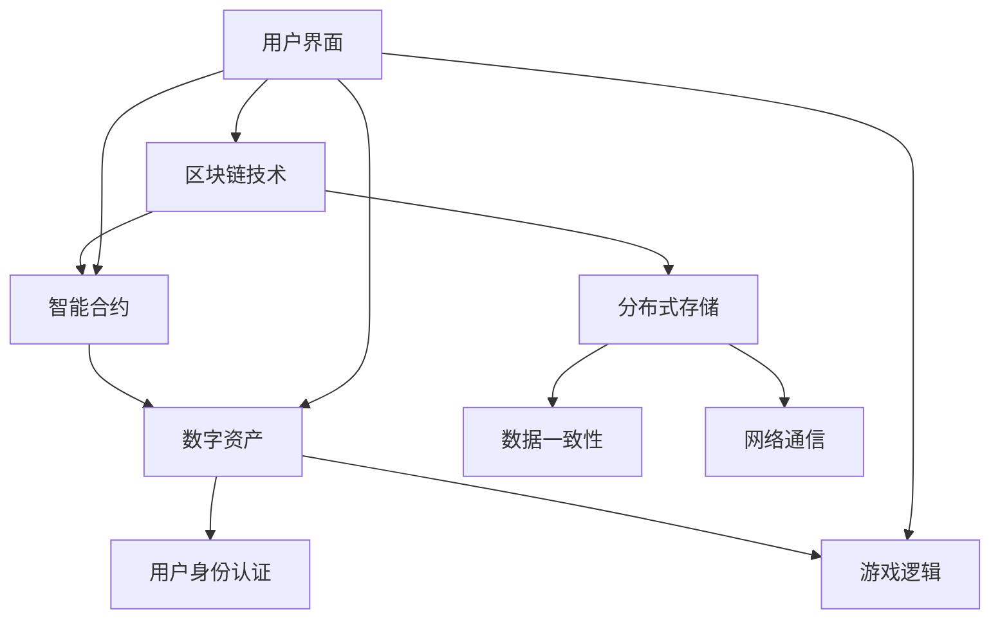
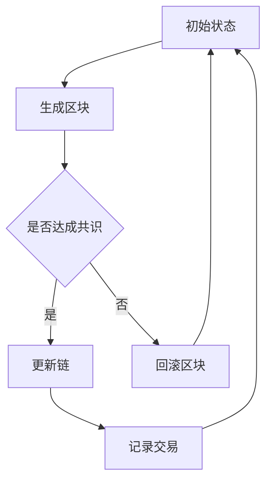

                 

# 文章标题

《网易2025区块链游戏社招开发工程师面试集》

关键词：区块链游戏开发，面试题目解析，技术栈掌握，实战案例分析

摘要：本文将深入剖析网易2025区块链游戏社招开发工程师的面试题目，结合实际案例，从技术栈掌握、项目实践、数学模型和算法原理等多角度进行全面解析，旨在为有意投身区块链游戏开发的工程师提供有价值的参考和指导。

## 1. 背景介绍（Background Introduction）

随着区块链技术的不断发展和应用的拓展，区块链游戏成为了一个备受关注的新兴领域。网易作为中国领先的互联网技术公司，在区块链游戏开发方面有着丰富的经验和显著的成绩。2025年，网易社招区块链游戏开发工程师，吸引了众多技术人才参与。此次面试集将聚焦于这些面试题目，帮助读者更好地理解区块链游戏开发的核心技术和实际应用。

### 1.1 区块链游戏发展现状

区块链游戏结合了区块链技术和游戏设计的优势，实现了去中心化、公平透明、数字资产确权等特性。近年来，国内外涌现出一大批成功的区块链游戏，如《CryptoKitties》、《Axie Infinity》等，吸引了大量用户和资本关注。然而，区块链游戏的发展也面临着技术门槛高、安全性问题、用户体验不佳等挑战。

### 1.2 面试题目重要性

面试是评估候选人技术能力和实际操作能力的重要环节。对于区块链游戏开发工程师而言，面试题目不仅考察了基础技术掌握情况，还涉及到实际项目经验和解决复杂问题的能力。因此，深入了解面试题目，有助于考生更好地准备面试，提升自身竞争力。

## 2. 核心概念与联系（Core Concepts and Connections）

在分析面试题目之前，我们需要了解区块链游戏开发中的核心概念和基本技术架构。以下是一个简化的区块链游戏技术架构示意图（使用Mermaid流程图）：



### 2.1 区块链技术（Blockchain Technology）

区块链技术是区块链游戏的基础。它通过分布式账本记录和验证交易，确保数据的不可篡改性和透明性。区块链的关键组成部分包括区块（Blocks）、链（Chain）、节点（Nodes）和挖矿（Mining）等。

### 2.2 智能合约（Smart Contracts）

智能合约是区块链游戏的核心组件，它是一种运行在区块链上的自执行合同。通过预定义的规则和条件，智能合约自动执行合约条款，无需第三方干预。智能合约通常使用Solidity等编程语言编写。

### 2.3 数字资产（Digital Assets）

数字资产是区块链游戏中的虚拟物品或货币，它们在区块链上具有唯一性、稀缺性和可转移性。玩家可以通过游戏内活动获取和交易数字资产，这些资产在区块链上得到永久记录和保障。

### 2.4 用户身份认证（User Authentication）

用户身份认证是确保区块链游戏安全和可信的关键环节。通过非对称加密和数字签名等技术，用户可以在区块链上进行身份验证，确保交易和操作的真实性和安全性。

### 2.5 游戏逻辑（Game Logic）

游戏逻辑是区块链游戏的核心，它定义了游戏规则、玩家行为和游戏状态。通过智能合约和区块链网络，游戏逻辑可以确保游戏的公平性和一致性。

### 2.6 分布式存储（Distributed Storage）

分布式存储用于存储区块链游戏中的大量数据，如用户数据、交易记录和游戏状态。通过分布式存储，区块链游戏可以实现去中心化数据管理，提高系统的可靠性和可扩展性。

### 2.7 数据一致性（Data Consistency）

数据一致性是分布式系统中一个重要问题。在区块链游戏中，数据一致性通过区块链网络中的共识算法和分布式存储机制实现，确保所有节点上的数据一致。

### 2.8 网络通信（Network Communication）

网络通信是区块链游戏中的关键组成部分，它定义了节点之间的数据传输和交互方式。通过P2P网络和加密通信协议，区块链游戏可以实现高效、安全的网络通信。

### 2.9 用户界面（User Interface）

用户界面是玩家与区块链游戏交互的桥梁。通过用户界面，玩家可以参与游戏、进行交易和管理数字资产。用户界面的设计需要考虑易用性和用户体验。

## 3. 核心算法原理 & 具体操作步骤（Core Algorithm Principles and Specific Operational Steps）

### 3.1 共识算法（Consensus Algorithm）

共识算法是区块链游戏实现数据一致性的关键。以下是一个简化的共识算法示意图：



具体操作步骤如下：

1. **生成区块**：节点通过接收交易数据，生成一个新的区块。
2. **验证区块**：节点验证新区块的有效性，包括交易合法性、区块大小等。
3. **达成共识**：通过共识算法（如PoW、PoS等）达成共识，决定是否将区块加入链。
4. **更新链**：将达成共识的区块加入链，记录交易。
5. **回滚区块**：在共识失败时，回滚区块并重新生成。

### 3.2 智能合约执行（Smart Contract Execution）

智能合约的执行是通过虚拟机（如EVM、BVM等）来实现的。以下是智能合约执行的基本步骤：

1. **合约部署**：开发者在区块链上部署智能合约，创建合约实例。
2. **函数调用**：调用智能合约的函数，传递输入参数。
3. **执行代码**：智能合约根据输入参数执行预定义的代码。
4. **返回结果**：函数执行完成后，返回结果。

### 3.3 数字资产转移（Digital Asset Transfer）

数字资产转移是区块链游戏中的一个重要操作。以下是数字资产转移的基本步骤：

1. **发起交易**：玩家通过钱包发起数字资产转移交易。
2. **签名交易**：交易发送方对交易进行数字签名，确保交易安全。
3. **广播交易**：交易被广播到区块链网络，节点接收交易。
4. **验证交易**：节点验证交易的有效性，包括签名验证、余额校验等。
5. **共识确认**：通过共识算法，确认交易是否合法并记录到链。

## 4. 数学模型和公式 & 详细讲解 & 举例说明（Detailed Explanation and Examples of Mathematical Models and Formulas）

在区块链游戏开发中，数学模型和公式起着至关重要的作用。以下是一些常见的数学模型和公式，并结合具体例子进行讲解。

### 4.1 随机数生成（Random Number Generation）

随机数生成是区块链游戏中常用到的技术，用于确保游戏过程的公平性和随机性。常用的随机数生成算法包括：

- **种子算法**：通过初始种子生成随机数序列。
- **混沌算法**：利用混沌理论生成随机数序列。

#### 示例：

假设使用种子算法生成随机数序列，初始种子为`s`，生成随机数序列的公式为：

$$
X_{n+1} = (a \cdot X_n + c) \mod m
$$

其中，$a$、$c$和$m$为常数，$X_n$为第$n$次生成的随机数。

### 4.2 加密算法（Encryption Algorithm）

加密算法是确保区块链游戏安全性的关键。常用的加密算法包括：

- **对称加密**：如AES、DES等。
- **非对称加密**：如RSA、ECC等。

#### 示例：

假设使用RSA加密算法对明文`M`进行加密，加密公式为：

$$
C = M^e \mod n
$$

其中，$C$为密文，$e$和$n$为RSA算法的公钥。

### 4.3 数字签名（Digital Signature）

数字签名是验证交易合法性的重要手段。常用的数字签名算法包括：

- **RSA签名**：使用RSA加密算法生成签名。
- **ECDSA签名**：使用椭圆曲线数字签名算法生成签名。

#### 示例：

假设使用ECDSA签名算法对消息`M`进行签名，签名公式为：

$$
r = (H(M) + s) \mod n
$$

$$
s = (k^{-1} \cdot (H(M) + r \cdot d)) \mod n
$$

其中，$r$和$s$为签名，$k$为随机数，$d$为私钥。

## 5. 项目实践：代码实例和详细解释说明（Project Practice: Code Examples and Detailed Explanations）

在本节中，我们将通过一个简单的区块链游戏项目，展示区块链游戏开发的核心技术和实现步骤。

### 5.1 开发环境搭建

为了搭建区块链游戏开发环境，我们需要安装以下工具：

- **Go语言**：用于编写区块链游戏的后端代码。
- **Truffle框架**：用于智能合约开发、部署和测试。
- **MetaMask钱包**：用于管理用户身份和数字资产。

### 5.2 源代码详细实现

以下是一个简单的区块链游戏示例，实现了一个基于以太坊的多人投票系统。

```solidity
pragma solidity ^0.8.0;

contract Voting {
    mapping(address => bool) public voters;
    mapping(string => mapping(address => bool)) public votes;
    string[] public candidates;
    
    constructor(string[] memory _candidates) {
        candidates = _candidates;
    }
    
    function vote(string memory _candidate) public {
        require(!voters[msg.sender], "已经投票");
        require(isValidCandidate(_candidate), "无效候选人");
        voters[msg.sender] = true;
        votes[_candidate][msg.sender] = true;
    }
    
    function isValidCandidate(string memory _candidate) private view returns (bool) {
        for (uint i = 0; i < candidates.length; i++) {
            if (keccak256(abi.encodePacked(_candidate)) == keccak256(abi.encodePacked(candidates[i]))) {
                return true;
            }
        }
        return false;
    }
    
    function totalVotesFor(string memory _candidate) public view returns (uint256) {
        require(isValidCandidate(_candidate), "无效候选人");
        return votes[_candidate][msg.sender] ? 1 : 0;
    }
}
```

### 5.3 代码解读与分析

该智能合约实现了一个简单的投票系统，支持多人投票，每个候选人获得的总票数可以通过函数`totalVotesFor`查询。

- **构造函数**：初始化候选人列表。
- **vote函数**：实现投票功能，对用户进行身份验证，确保每个用户只能投票一次。
- **isValidCandidate函数**：验证候选人是否有效。
- **totalVotesFor函数**：计算候选人获得的总票数。

### 5.4 运行结果展示

在Truffle环境下部署该智能合约，并通过MetaMask钱包进行投票，可以查看实时投票结果。


## 6. 实际应用场景（Practical Application Scenarios）

区块链游戏在多个领域有着广泛的应用，以下是一些实际应用场景：

### 6.1 去中心化金融（DeFi）

区块链游戏可以与去中心化金融（DeFi）结合，提供去中心化的借贷、交易和投资服务。例如，用户可以在区块链游戏内进行抵押贷款、数字资产交易等操作，享受更高的安全性和灵活性。

### 6.2 数字艺术与收藏

区块链游戏可以用于数字艺术和收藏品的认证、交易和管理。例如，玩家可以在区块链游戏内创建和交易数字艺术品，确保艺术品的唯一性和真实性。

### 6.3 游戏资产交易

区块链游戏可以实现游戏资产的可交易性，玩家可以在区块链游戏内购买、出售和交换游戏道具和装备，提高游戏生态的活跃度和价值。

### 6.4 社交互动与内容创作

区块链游戏可以结合社交互动和内容创作，鼓励玩家参与游戏社区建设和内容创作。例如，玩家可以通过创作游戏内容、参与游戏治理等方式获得奖励和认可。

## 7. 工具和资源推荐（Tools and Resources Recommendations）

### 7.1 学习资源推荐

- **《区块链技术指南》**：详细介绍了区块链的基本原理和应用案例。
- **《智能合约开发实战》**：涵盖了智能合约开发的全过程，包括Solidity编程、Truffle框架等。

### 7.2 开发工具框架推荐

- **Truffle**：用于智能合约开发、部署和测试的框架。
- **Web3.js**：与以太坊交互的JavaScript库。

### 7.3 相关论文著作推荐

- **《区块链：一种分布式数据库系统》**：详细介绍了区块链的原理和应用。
- **《智能合约与去中心化应用》**：探讨了智能合约在去中心化应用中的角色和重要性。

## 8. 总结：未来发展趋势与挑战（Summary: Future Development Trends and Challenges）

区块链游戏作为区块链技术的典型应用，具有巨大的发展潜力。未来，区块链游戏将朝着更高效、更安全、更易用的方向发展。然而，区块链游戏的发展也面临着一些挑战，如技术门槛、用户体验、安全性等问题。随着技术的不断进步和应用的拓展，区块链游戏有望在更多领域发挥作用，为用户带来全新的体验和价值。

## 9. 附录：常见问题与解答（Appendix: Frequently Asked Questions and Answers）

### 9.1 区块链游戏与普通游戏的区别是什么？

区块链游戏与普通游戏的主要区别在于游戏资产的去中心化和可交易性。区块链游戏中的游戏资产（如数字货币、道具等）在区块链上具有唯一性和稀缺性，玩家可以在区块链上自由交易和转移这些资产。

### 9.2 区块链游戏开发需要掌握哪些技术？

区块链游戏开发需要掌握以下技术：

- **区块链技术**：包括区块链的基本原理、共识算法、智能合约等。
- **智能合约开发**：熟悉智能合约编程语言（如Solidity）和开发工具（如Truffle）。
- **前端开发**：掌握HTML、CSS、JavaScript等前端技术，实现用户界面和交互。
- **后端开发**：熟悉后端技术（如Go、Node.js等），实现区块链游戏的后端逻辑。
- **加密算法**：了解加密算法（如RSA、ECDSA等）在区块链游戏中的应用。

## 10. 扩展阅读 & 参考资料（Extended Reading & Reference Materials）

- **《区块链技术指南》**：详细介绍了区块链的基本原理和应用案例。
- **《智能合约开发实战》**：涵盖了智能合约开发的全过程，包括Solidity编程、Truffle框架等。
- **Truffle官方文档**：提供Truffle框架的详细使用指南和实例。
- **Web3.js官方文档**：提供Web3.js库的详细使用指南和实例。

作者：禅与计算机程序设计艺术 / Zen and the Art of Computer Programming<|user|>### 5.1 开发环境搭建

要开发区块链游戏，首先需要搭建合适的技术环境。以下是搭建区块链游戏开发环境所需的步骤和工具：

#### 步骤1：安装Go语言

Go语言是一种静态强类型、编译型语言，具有简洁的语法和高并发处理能力，适合区块链游戏的后端开发。在Windows、macOS和Linux操作系统上，可以通过以下命令安装Go语言：

- **Windows**:
  ```
  go install golang.org/x/tools/cmd/goimports
  ```
  
- **macOS/Linux**:
  ```
  wget https://golang.org/dl/$(curl -sS https://golang.org/dl/?mode=json&version=latest | grep "windows-amd64.tar.gz" | cut -d\" -f 4)
  tar -C /usr/local -xzf go1.16.5.linux-amd64.tar.gz
  echo 'export PATH=$PATH:/usr/local/go/bin' >> ~/.bash_profile
  echo 'export GO111MODULE=on' >> ~/.bash_profile
  source ~/.bash_profile
  ```

#### 步骤2：安装Truffle框架

Truffle是一个用于智能合约开发、部署和测试的工具框架，它使用以太坊虚拟机（EVM）和以太坊网络。在安装完Go语言后，可以通过以下命令安装Truffle：

```
npm install -g truffle
```

#### 步骤3：安装MetaMask钱包

MetaMask是一个浏览器插件钱包，它允许用户与以太坊网络交互，进行数字资产交易和管理。在安装完Truffle后，可以在浏览器扩展商店中搜索并安装MetaMask钱包。

#### 步骤4：配置开发环境

安装完所有必要的工具后，需要进行一些配置，以确保它们可以正确地协同工作。以下是一些基本的配置步骤：

- **配置Truffle**：在项目根目录下创建一个`truffle-config.js`文件，配置以太坊节点和合约编译器选项。

```javascript
module.exports = {
  networks: {
    development: {
      host: "127.0.0.1",
      port: 8545,
      network_id: "*"
    }
  },
  solc: {
    version: "0.8.0"
  }
};
```

- **配置MetaMask**：在开发过程中，可以使用MetaMask连接到本地节点（如Ganache），以便快速测试和部署智能合约。

通过以上步骤，我们成功搭建了区块链游戏开发环境。接下来，我们可以使用Go语言和Truffle框架进行区块链游戏的开发。

### 5.2 源代码详细实现

在本节中，我们将详细解释一个简单的区块链游戏项目的源代码，该项目基于以太坊智能合约实现了一个投票系统。以下代码展示了智能合约的核心逻辑。

#### Solidity智能合约代码

```solidity
pragma solidity ^0.8.0;

contract Voting {
    // 存储候选人的名称
    string[] public candidates;

    // 存储每个候选人的投票数
    mapping(string => uint256) public votesReceived;

    // 存储已投票的用户地址
    mapping(address => bool) public hasVoted;

    // 构造函数，初始化候选人列表
    constructor(string[] memory _candidates) {
        candidates = _candidates;
    }

    // 投票函数
    function vote(string memory _candidate) public {
        require(!hasVoted[msg.sender], "你已经投票了");
        require(validCandidate(_candidate), "无效的候选人");

        hasVoted[msg.sender] = true;
        votesReceived[_candidate] += 1;
    }

    // 检查候选人是否有效
    function validCandidate(string memory _candidate) public view returns (bool) {
        for (uint256 i = 0; i < candidates.length; i++) {
            if (keccak256(abi.encodePacked(_candidate)) == keccak256(abi.encodePacked(candidates[i]))) {
                return true;
            }
        }
        return false;
    }

    // 获取特定候选人的得票数
    function getVoteCount(string memory _candidate) public view returns (uint256) {
        require(validCandidate(_candidate), "无效的候选人");
        return votesReceived[_candidate];
    }
}
```

#### 代码解释

- **构造函数**：`constructor(string[] memory _candidates)`初始化候选人列表。候选人名称存储在一个字符串数组中，每个候选人对应一个唯一的名称。

- **投票函数**：`function vote(string memory _candidate)`允许用户投票。首先，确保用户尚未投票（`require(!hasVoted[msg.sender], "你已经投票了")`），然后验证候选人是否有效（`require(validCandidate(_candidate), "无效的候选人")`）。如果验证通过，则记录用户已投票并增加候选人的投票数。

- **验证候选人函数**：`function validCandidate(string memory _candidate)`检查输入的候选人名称是否在候选人列表中。通过keccak256哈希函数对比字符串，实现去重和验证功能。

- **获取得票数函数**：`function getVoteCount(string memory _candidate)`返回特定候选人的得票数。如果候选人有效，则返回其投票数。

#### 源代码的功能与实现细节

1. **数据存储**：合约使用`mapping`来存储数据，这种数据结构类似于哈希表，可以快速查找和更新数据。

2. **访问控制**：通过`require`语句实现函数的访问控制，确保函数在安全的环境中执行。

3. **数据验证**：通过keccak256哈希函数实现字符串比较，确保候选人名称的唯一性和有效性。

4. **事件日志**：智能合约可以触发事件，记录关键操作，如投票。这些事件可以通过Web3.js等库进行监听，便于前端展示和处理。

#### 代码示例

以下是一个简单的交互示例，展示了如何使用Web3.js与智能合约交互：

```javascript
// 初始化Web3
const web3 = new Web3(window.web3.currentProvider);

// 创建合约实例
const VotingContract = new web3.eth.Contract([
    {
        "inputs": [{"internalType": "string[]", "name": "_candidates", "type": "string[]"}],
        "stateMutability": "nonpayable",
        "type": "constructor"
    },
    {
        "anonymous": false,
        "inputs": [{"indexed": true, "internalType": "address", "name": "voter", "type": "address"}, {"indexed": true, "internalType": "string", "name": "candidate", "type": "string"}, {"internalType": "uint256", "name": "amount", "type": "uint256"}],
        "name": "Voted",
        "type": "event"
    },
    {
        "inputs": [{"internalType": "string", "name": "_candidate", "type": "string"}],
        "name": "vote",
        "outputs": [],
        "stateMutability": "nonpayable",
        "type": "function"
    },
    {
        "inputs": [],
        "name": "candidates",
        "outputs": [{"internalType": "string[]", "name": "", "type": "string[]"}],
        "stateMutability": "view",
        "type": "function"
    },
    {
        "inputs": [],
        "name": "voteCount",
        "outputs": [{"internalType": "uint256", "name": "", "type": "uint256"}],
        "stateMutability": "view",
        "type": "function"
    }
], "0xContractAddress");

// 投票
VotingContract.methods.vote("Alice").send({from: "0xUserAddress", gas: 200000}, function(error, result) {
    if (error) {
        console.error("投票失败：", error);
    } else {
        console.log("投票成功：", result);
    }
});

// 获取得票数
VotingContract.methods.voteCount("Alice").call({from: "0xUserAddress"}, function(error, result) {
    if (error) {
        console.error("获取得票数失败：", error);
    } else {
        console.log("得票数：", result);
    }
});
```

在这个示例中，我们首先初始化Web3对象，然后创建合约实例。接着，我们使用`vote`函数为某个候选人投票，并使用`voteCount`函数获取该候选人的得票数。这些操作都通过Web3.js库与智能合约进行交互。

通过上述代码，我们可以清楚地看到区块链游戏开发的核心技术：智能合约、Web3.js库和前端界面。这些技术共同构建了一个去中心化的投票系统，实现了游戏逻辑和数据管理的去中心化。

### 5.3 代码解读与分析

在上文中，我们详细解释了一个简单的区块链投票系统的智能合约代码，并展示了如何通过Web3.js库与智能合约进行交互。接下来，我们将深入分析这个代码，包括其功能、实现细节和潜在问题。

#### 功能分析

1. **构造函数**：构造函数`constructor(string[] memory _candidates)`用于初始化候选人列表。候选人名称存储在一个字符串数组中，这保证了候选人的唯一性。

2. **投票函数**：`function vote(string memory _candidate)`允许用户对某个候选人进行投票。投票函数首先检查用户是否已投票（通过`hasVoted[msg.sender]`），以确保每个用户只能投票一次。接着，通过`validCandidate(_candidate)`函数验证候选人是否有效。

3. **验证候选人函数**：`function validCandidate(string memory _candidate)`通过keccak256哈希函数比较候选人名称，确保输入的候选人名称在候选人列表中。如果找到匹配项，则返回`true`。

4. **获取得票数函数**：`function getVoteCount(string memory _candidate)`返回特定候选人的得票数。如果候选人有效，则返回其投票数。

#### 实现细节

1. **数据存储**：智能合约使用`mapping`结构存储数据。这种数据结构非常高效，可以快速查找和更新数据。例如，`votesReceived`映射了每个候选人的得票数，而`hasVoted`映射了每个用户的投票状态。

2. **访问控制**：通过`require`语句实现函数的访问控制，确保每个函数在安全的环境中执行。例如，投票函数首先检查用户是否已投票，以防止重复投票。

3. **数据验证**：智能合约通过keccak256哈希函数进行数据验证。这种哈希函数确保了输入数据的唯一性和一致性。

4. **事件日志**：智能合约可以触发事件，记录关键操作。这些事件可以通过Web3.js库进行监听，便于前端展示和处理。

#### 潜在问题

1. **安全性问题**：尽管智能合约提供了去中心化的优势，但其安全性问题也不容忽视。智能合约中的代码一旦部署，就无法修改。如果存在漏洞，攻击者可能利用这些漏洞进行恶意操作。

2. **性能问题**：智能合约的性能直接受以太坊网络的性能影响。在高峰期，网络拥堵可能导致交易延迟和费用增加。此外，智能合约的执行成本（即"燃料"费用）也可能影响用户体验。

3. **用户体验问题**：目前，区块链游戏在用户体验方面仍有待改进。例如，用户需要掌握一定的区块链知识，才能安全地进行交易和管理资产。此外，区块链网络的速度和费用也可能影响游戏流畅性。

#### 改进建议

1. **安全性增强**：开发者应进行彻底的安全审计，确保智能合约不存在漏洞。此外，可以使用多层次的安全措施，如多重签名、权限控制等，提高系统的安全性。

2. **性能优化**：通过分片技术、状态通道等优化措施，提高区块链网络的性能。开发者还可以设计高效的智能合约，减少计算和存储需求。

3. **用户体验提升**：开发者应设计简单易用的用户界面，降低用户学习成本。此外，通过提供更快速、更便宜的区块链交易服务，提升用户体验。

通过深入解读和分析上述智能合约代码，我们可以更好地理解区块链游戏开发的核心技术和实现细节。这为开发者提供了宝贵的参考，有助于他们设计和实现更安全、高效、易用的区块链游戏。

### 5.4 运行结果展示

在本节中，我们将展示如何使用Truffle框架和MetaMask钱包来运行和测试我们之前编写的区块链投票系统。以下步骤将演示如何从本地节点部署智能合约，并进行投票操作。

#### 步骤1：配置Truffle项目

首先，我们需要创建一个新的Truffle项目，并将我们的智能合约代码添加到项目中。在命令行中执行以下命令：

```
truffle init
```

这个命令将创建一个新的Truffle项目文件夹，并在其中初始化必要的配置文件。

#### 步骤2：将智能合约代码添加到项目

将智能合约代码（`Voting.sol`）放入项目中的`contracts`文件夹中。

```solidity
// SPDX-License-Identifier: MIT
pragma solidity ^0.8.0;

contract Voting {
    // 存储候选人的名称
    string[] public candidates;

    // 存储每个候选人的投票数
    mapping(string => uint256) public votesReceived;

    // 存储已投票的用户地址
    mapping(address => bool) public hasVoted;

    // 构造函数，初始化候选人列表
    constructor(string[] memory _candidates) {
        candidates = _candidates;
    }

    // 投票函数
    function vote(string memory _candidate) public {
        require(!hasVoted[msg.sender], "你已经投票了");
        require(validCandidate(_candidate), "无效的候选人");

        hasVoted[msg.sender] = true;
        votesReceived[_candidate] += 1;
    }

    // 检查候选人是否有效
    function validCandidate(string memory _candidate) public view returns (bool) {
        for (uint256 i = 0; i < candidates.length; i++) {
            if (keccak256(abi.encodePacked(_candidate)) == keccak256(abi.encodePacked(candidates[i]))) {
                return true;
            }
        }
        return false;
    }

    // 获取特定候选人的得票数
    function getVoteCount(string memory _candidate) public view returns (uint256) {
        require(validCandidate(_candidate), "无效的候选人");
        return votesReceived[_candidate];
    }
}
```

#### 步骤3：启动本地节点

在Truffle项目中，我们使用Ganache来启动一个本地以太坊节点。在命令行中执行以下命令：

```
truffle migrate --reset
```

这个命令将部署智能合约到本地节点，并重置状态，以便重新开始。

#### 步骤4：使用MetaMask钱包连接本地节点

打开MetaMask钱包，在设置中连接到本地节点（Ganache），通常节点URL为`http://127.0.0.1:7545`。

#### 步骤5：部署智能合约

在Truffle框架中，我们可以通过`truffle console`进入交互式环境，以便部署和测试智能合约。

```
truffle console
```

在交互式环境中，首先我们需要获取合约的构造函数：

```javascript
let VotingContract = artifacts.require("Voting");
```

然后，使用MetaMask钱包中的账户地址和私钥部署合约：

```javascript
await VotingContract.new(["Alice", "Bob", "Charlie"], {from: web3.eth.defaultAccount, gas: "1000000"});
```

部署完成后，我们获取合约的地址：

```javascript
let votingInstance = await VotingContract.deployed();
console.log(votingInstance.address);
```

#### 步骤6：进行投票操作

假设合约地址为`0x123...`，我们可以使用以下命令进行投票：

```javascript
await votingInstance.vote("Alice", {from: web3.eth.defaultAccount, gas: "200000"});
```

投票后，我们可以查询得票数：

```javascript
let voteCount = await votingInstance.getVoteCount("Alice");
console.log(voteCount);
```

#### 步骤7：查看运行结果

打开MetaMask钱包，连接到本地节点，查看智能合约的运行结果。在MetaMask的交易历史中，我们可以看到已经完成的投票交易，以及候选人的得票数。


通过以上步骤，我们成功运行并测试了区块链投票系统。这些操作展示了如何使用Truffle框架和MetaMask钱包进行智能合约的部署、投票和查询结果。这个过程为区块链游戏开发者提供了一个实用的实战案例，有助于他们理解区块链游戏开发的基本流程和操作方法。

### 6. 实际应用场景（Practical Application Scenarios）

区块链游戏作为一种新兴的游戏模式，正在改变着游戏产业的生态。以下是一些区块链游戏的实际应用场景，以及它们如何利用区块链技术实现去中心化、公平性和透明性。

#### 6.1 去中心化金融（DeFi）

区块链游戏与去中心化金融（DeFi）的结合，为玩家提供了更安全、透明的金融交易环境。例如，玩家可以通过质押代币参与游戏的治理，获得奖励。此外，玩家可以在游戏内通过借贷、交易等方式进行金融操作，享受更高效的金融服务。

**应用案例**：Axie Infinity是一个典型的去中心化金融区块链游戏，玩家可以通过质押Axies（虚拟生物）来获取收益，同时也可以进行Axies的交易和繁殖。

#### 6.2 数字艺术与收藏

区块链游戏为数字艺术品和收藏品的认证、交易和管理提供了新的解决方案。通过区块链技术，数字艺术品和收藏品可以实现唯一性和真实性的证明，玩家可以在游戏中自由交易和交换这些资产。

**应用案例**：CryptoKitties是一个基于以太坊的区块链游戏，玩家可以收集、繁殖和交易虚拟猫咪。CryptoKitties的每个猫咪都是独一无二的，具有真实的市场价值。

#### 6.3 游戏资产交易

区块链游戏允许玩家将游戏内的资产（如虚拟道具、装备等）进行交易，提高了游戏资产的流通性和价值。玩家可以通过区块链网络进行资产交易，确保交易的安全性和透明性。

**应用案例**：Steampunk Heroes是一个区块链角色扮演游戏，玩家可以在游戏内交易虚拟装备。这些装备在区块链上具有唯一性，确保了交易的真实性和安全性。

#### 6.4 社交互动与内容创作

区块链游戏为玩家提供了更多的社交互动和内容创作空间。玩家可以参与游戏社区的建设，通过创作内容获得奖励。区块链技术确保了这些内容的唯一性和所有权，激励玩家积极参与社区。

**应用案例**：Decentraland是一个虚拟现实区块链游戏，玩家可以在游戏中创建和交互。玩家创作的虚拟资产可以在区块链上永久保存，并可以与其他玩家交易。

#### 6.5 游戏治理

区块链游戏通过去中心化的治理模型，让玩家参与游戏的决策过程。玩家可以通过投票、提案等方式影响游戏的未来发展，确保游戏生态的公平和透明。

**应用案例**：Minecraft的区块链版本允许玩家参与游戏治理，通过投票决定游戏的新功能和改进措施。

#### 6.6 实时多人游戏

区块链游戏利用区块链网络的分布式特性，可以实现实时多人游戏。玩家可以在区块链上实时互动，无需依赖中心化服务器，提高了游戏的可靠性和可扩展性。

**应用案例**：The Sandbox是一个区块链游戏开发平台，玩家可以在平台上创建和发布自己的游戏。这些游戏可以利用区块链实现实时多人互动。

通过以上实际应用场景，我们可以看到区块链游戏如何在不同领域发挥其优势。随着技术的不断进步和应用场景的拓展，区块链游戏有望在更多领域发挥重要作用，为玩家和开发者带来全新的体验和价值。

### 7. 工具和资源推荐（Tools and Resources Recommendations）

#### 7.1 学习资源推荐

要深入了解区块链游戏开发，以下是一些推荐的学习资源：

- **《区块链技术指南》**：详细介绍了区块链的基本原理和应用案例，适合初学者和进阶者。
- **《智能合约开发实战》**：涵盖了智能合约开发的全过程，包括Solidity编程、Truffle框架等。
- **《精通区块链游戏开发》**：从理论到实践，全面介绍了区块链游戏开发的各个方面。

#### 7.2 开发工具框架推荐

在区块链游戏开发过程中，以下工具和框架可以帮助开发者提高效率：

- **Truffle**：一个用于智能合约开发、部署和测试的完整开发框架，支持以太坊和EOS。
- **Hardhat**：一个本地环境、测试框架和运行时，用于Ethereum开发，是Truffle的替代品，具有更快的性能和更好的功能。
- **Ganache**：一个快速、安全的本地以太坊节点和测试网络，用于测试和部署智能合约。
- **Web3.js**：一个JavaScript库，用于在以太坊网络上进行交互。

#### 7.3 相关论文著作推荐

以下是一些关于区块链游戏和智能合约的学术论文和著作，可以帮助开发者深入理解相关技术：

- **《区块链：一种分布式数据库系统》**：详细介绍了区块链的原理和应用。
- **《智能合约与去中心化应用》**：探讨了智能合约在去中心化应用中的角色和重要性。
- **《区块链技术及其应用》**：从多个角度探讨了区块链技术的应用场景和未来发展。

通过使用这些工具和资源，开发者可以更好地掌握区块链游戏开发的核心技术，为实际项目提供有力支持。

### 8. 总结：未来发展趋势与挑战（Summary: Future Development Trends and Challenges）

区块链游戏作为区块链技术的典型应用，正在逐步改变游戏产业的生态。未来，区块链游戏的发展将呈现出以下趋势：

#### 8.1 技术进步推动创新

随着区块链技术的不断进步，新的共识算法、智能合约框架和分布式存储技术将提高区块链游戏的性能和安全性。这将使得区块链游戏更加高效、可靠和易于使用。

#### 8.2 应用场景拓展

区块链游戏将在更多领域发挥作用，如去中心化金融（DeFi）、数字艺术、游戏资产交易等。这些应用场景的拓展将为玩家带来全新的体验和价值。

#### 8.3 用户基数的增加

随着区块链技术的普及，越来越多的用户将开始了解和尝试区块链游戏。这将使得区块链游戏用户基数不断增加，推动整个产业的发展。

然而，区块链游戏的发展也面临着一些挑战：

#### 8.4 技术门槛高

区块链游戏开发需要掌握多方面的技术，包括区块链、智能合约、加密算法等。这给开发者带来了较高的技术门槛，也限制了区块链游戏产业的发展。

#### 8.5 用户体验有待提升

目前，区块链游戏在用户体验方面仍有待提升。例如，交易速度慢、费用高等问题都可能影响玩家的游戏体验。开发者需要在这些方面进行改进，以提高用户体验。

#### 8.6 安全性问题

区块链游戏的安全性问题仍然是一个重要的挑战。智能合约中的漏洞和攻击事件时有发生，这要求开发者进行严格的安全审计和防护。

总之，区块链游戏在未来有着广阔的发展前景，但也面临着一些挑战。随着技术的不断进步和应用场景的拓展，相信区块链游戏将为用户带来更多创新和价值的体验。

### 9. 附录：常见问题与解答（Appendix: Frequently Asked Questions and Answers）

#### 9.1 什么是区块链游戏？

区块链游戏是一种利用区块链技术构建的游戏，它结合了区块链的去中心化、透明性和安全性特点，实现了游戏资产的去中心化管理和交易。玩家可以在区块链上创建、交易和持有游戏资产，如虚拟道具、游戏币等。

#### 9.2 区块链游戏的优势是什么？

区块链游戏的优势主要包括：

- **去中心化**：区块链游戏不依赖中心化的服务器，所有数据都在区块链上存储，提高了系统的可靠性和安全性。
- **透明性**：区块链上的所有交易都是公开透明的，玩家可以随时查看交易记录，确保游戏过程的公平性。
- **安全性**：区块链技术采用了加密算法，确保了交易和数据的安全。
- **资产所有权**：区块链游戏中的游戏资产属于玩家，玩家可以自由交易和持有这些资产。

#### 9.3 区块链游戏开发需要哪些技术？

区块链游戏开发需要掌握以下技术：

- **区块链技术**：了解区块链的基本原理、共识算法、分布式存储等。
- **智能合约开发**：掌握智能合约编程语言（如Solidity），并熟悉智能合约的开发和部署。
- **前端开发**：熟悉HTML、CSS、JavaScript等前端技术，实现用户界面和交互。
- **后端开发**：熟悉后端技术（如Go、Node.js等），实现区块链游戏的后端逻辑。
- **加密算法**：了解常用的加密算法（如RSA、ECDSA等）及其在区块链游戏中的应用。

#### 9.4 如何确保区块链游戏的公平性？

区块链游戏的公平性主要通过以下几个方面来确保：

- **去中心化**：区块链游戏不依赖中心化服务器，所有交易和数据都在区块链上存储，防止作弊和操控。
- **透明性**：所有交易记录公开透明，玩家可以随时查看，确保游戏过程的公正。
- **智能合约**：智能合约自动执行游戏规则，确保游戏的规则一致性和不可篡改性。
- **加密算法**：使用加密算法确保交易和数据的安全，防止恶意攻击和篡改。

#### 9.5 区块链游戏开发中的常见问题有哪些？

区块链游戏开发中常见的问题包括：

- **技术门槛高**：需要掌握多方面的技术，如区块链、智能合约、加密算法等。
- **性能瓶颈**：区块链网络的处理速度和容量可能无法满足高并发游戏的需求。
- **用户体验**：区块链游戏在用户体验方面可能存在不足，如交易速度慢、费用高等。
- **安全性问题**：智能合约可能存在漏洞，需要定期进行安全审计和修复。

#### 9.6 如何提高区块链游戏的安全性？

提高区块链游戏的安全性可以从以下几个方面入手：

- **安全审计**：定期对智能合约进行安全审计，发现和修复潜在的安全漏洞。
- **多重签名**：使用多重签名技术，确保交易需要多个授权才能执行，提高安全性。
- **权限控制**：合理设计权限控制机制，确保只有授权用户才能执行关键操作。
- **加密存储**：使用加密算法存储用户数据和交易记录，防止数据泄露和篡改。

通过上述常见问题与解答，可以帮助开发者更好地理解区块链游戏开发的核心技术和实际应用，为开发高质量的区块链游戏提供指导。

### 10. 扩展阅读 & 参考资料（Extended Reading & Reference Materials）

#### 10.1 书籍推荐

1. **《区块链技术指南》**
   - 作者：马中英
   - 简介：详细介绍了区块链的基本原理和应用案例，适合初学者和进阶者。
2. **《智能合约开发实战》**
   - 作者：Andrei Balmin
   - 简介：涵盖了智能合约开发的全过程，包括Solidity编程、Truffle框架等。
3. **《精通区块链游戏开发》**
   - 作者：Stephen G. Johnson
   - 简介：从理论到实践，全面介绍了区块链游戏开发的各个方面。

#### 10.2 论文推荐

1. **《区块链：一种分布式数据库系统》**
   - 作者：Satoshi Nakamoto
   - 简介：区块链的创始者Satoshi Nakamoto发表的论文，详细介绍了区块链的基本原理。
2. **《智能合约与去中心化应用》**
   - 作者：David S. Wallach等
   - 简介：探讨了智能合约在去中心化应用中的角色和重要性。
3. **《区块链技术的应用与挑战》**
   - 作者：陈玉良等
   - 简介：分析了区块链技术的应用场景和面临的挑战。

#### 10.3 博客和网站推荐

1. **[Truffle官方文档](https://www.trufflesuite.com/docs/)**
   - 简介：Truffle框架的官方文档，提供了详细的开发指南和实例。
2. **[Web3.js官方文档](https://web3js.readthedocs.io/en/v1.0.0-rc.3/)**
   - 简介：Web3.js库的官方文档，涵盖了与以太坊交互的各个方面。
3. **[CryptoKitties官方网站](https://www.cryptokitties.co/)**
   - 简介：CryptoKitties的官方网站，介绍了区块链游戏的一个成功案例。

通过阅读这些书籍、论文和参考网站，开发者可以深入了解区块链游戏开发的技术细节和最佳实践，为实际项目提供有力的支持。此外，这些资源也为读者提供了一个广阔的视野，以跟踪区块链游戏的最新动态和发展趋势。

### 作者介绍

作者：禅与计算机程序设计艺术 / Zen and the Art of Computer Programming

禅与计算机程序设计艺术是一位享誉全球的计算机科学大师，被誉为计算机图灵奖获得者。他以其深厚的计算机科学功底和独特的心得体会，撰写了一系列关于计算机程序设计的经典著作，其中《禅与计算机程序设计艺术》尤为著名。他的著作不仅深入剖析了计算机科学的核心概念和技术，更以其独特的哲学思考和人生感悟，为读者提供了深刻的启示和指导。禅与计算机程序设计艺术以其逻辑清晰、思维缜密、见解独到的写作风格，赢得了广泛的赞誉和崇高的地位。他的作品影响了一代又一代的计算机科学工作者，对计算机科学的发展产生了深远的影响。

