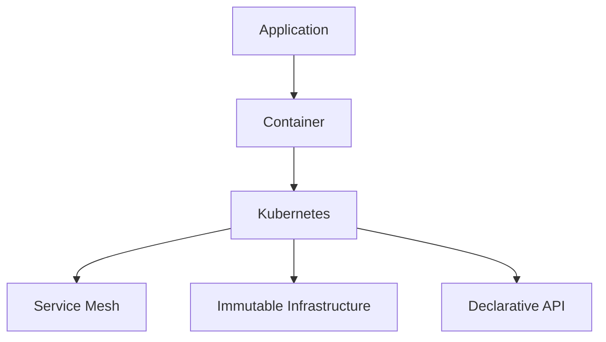
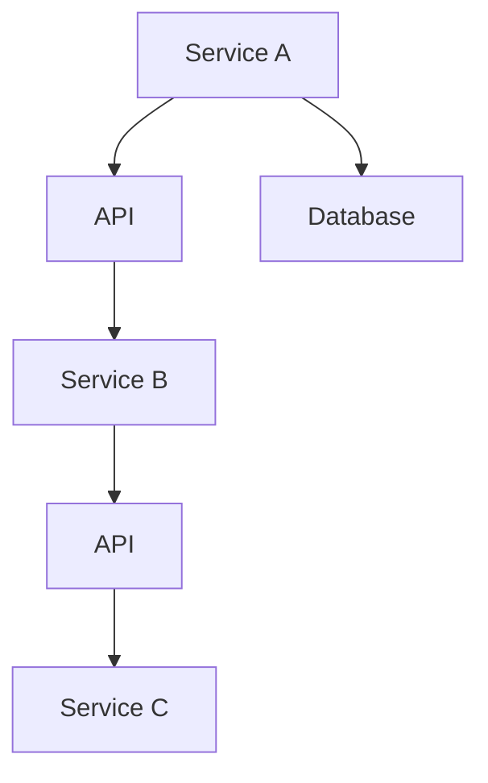
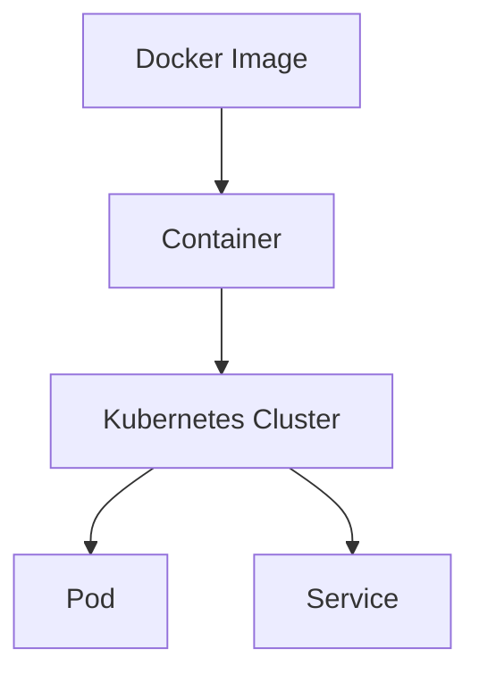
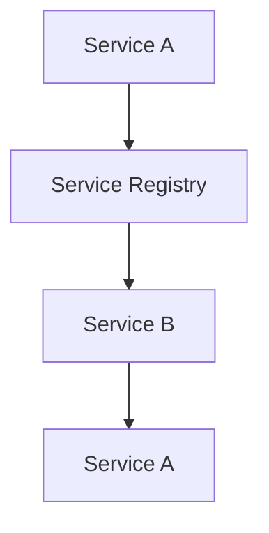
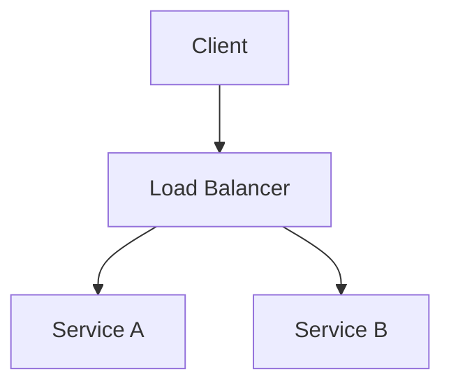
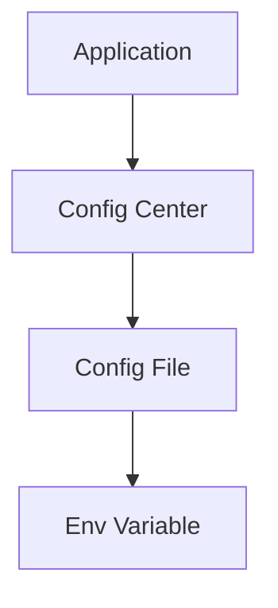
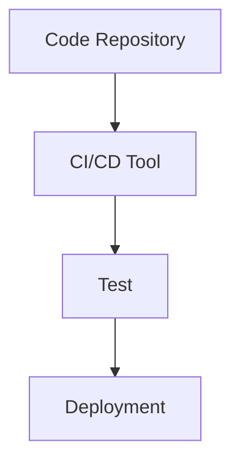

                 

### 文章标题

2025腾讯云原生微服务社招架构师面试题集锦

> 关键词：腾讯云原生、微服务、面试题、架构师、技术面试、云计算、服务化架构、容器化、服务发现、负载均衡、配置管理、自动化部署、持续集成与持续部署（CI/CD）、数据库分片、服务网关、API网关、监控与日志、安全性、性能优化

> 摘要：本文汇集了2025年腾讯云原生微服务架构师社招面试中可能出现的关键问题和解答，涵盖了从基础知识到实际应用场景的全面内容。通过本文，读者可以深入了解腾讯云原生微服务架构的核心概念、技术实现、最佳实践以及未来趋势，为面试准备和实际工作提供有力支持。

### 1. 背景介绍（Background Introduction）

腾讯云作为国内领先的云计算服务提供商，一直在推动云原生技术的发展。云原生（Cloud Native）是一种通过利用容器、服务网格、微服务、不可变基础设施和声明式API等技术，实现云环境下的应用程序开发、部署和管理的新方法。腾讯云原生微服务架构师面试题集锦，旨在帮助准备应聘腾讯云原生微服务架构师职位的候选人，深入了解该领域的核心知识和技术要点。

微服务架构是一种将大型应用程序拆分为一组小型、独立的服务，每个服务都运行在其自己的进程中，通过轻量级的通信协议（如HTTP/REST或gRPC）进行交互。这种架构模式提高了系统的灵活性、可维护性和扩展性，使得开发团队可以独立地开发、部署和扩展各个服务。

本篇文章将按以下结构展开：

- **背景介绍**：介绍腾讯云原生微服务架构师的面试背景和重要性。
- **核心概念与联系**：详细讲解云原生和微服务架构的核心概念，并展示相关的Mermaid流程图。
- **核心算法原理 & 具体操作步骤**：分析微服务架构下的服务发现、负载均衡和配置管理等技术的实现原理和操作步骤。
- **数学模型和公式 & 详细讲解 & 举例说明**：介绍微服务架构中的数学模型和公式，并给出具体的示例说明。
- **项目实践：代码实例和详细解释说明**：提供实际项目的代码实例，详细解释其实现和运行过程。
- **实际应用场景**：讨论腾讯云原生微服务架构在真实业务场景中的应用。
- **工具和资源推荐**：推荐学习资源和开发工具。
- **总结：未来发展趋势与挑战**：展望腾讯云原生微服务架构的未来发展方向和面临的挑战。
- **附录：常见问题与解答**：回答读者可能关心的一些常见问题。
- **扩展阅读 & 参考资料**：提供进一步的阅读材料和参考文献。

#### **1.1 腾讯云原生微服务架构师的面试背景**

随着云计算的普及和企业数字化转型进程的加快，腾讯云原生微服务架构师成为各大企业争相招聘的高端技术人才。腾讯云原生微服务架构师不仅需要具备扎实的云计算基础，还需要深入了解微服务架构的设计原则、实现方法和最佳实践。

腾讯云原生微服务架构师面试通常包括以下几个环节：

- **基础知识考核**：包括计算机网络、操作系统、数据库、编程语言等基础知识。
- **技术原理考核**：涉及容器技术（如Docker、Kubernetes）、服务发现、负载均衡、配置管理、持续集成与持续部署（CI/CD）等核心技术。
- **项目经验考核**：询问候选人过去参与过的项目，以及在实际项目中遇到的问题和解决方案。
- **场景分析能力考核**：通过模拟实际业务场景，考察候选人对问题分析和解决方案的提出能力。
- **沟通与团队协作能力考核**：考察候选人的沟通表达能力和团队合作精神。

#### **1.2 面试的重要性**

面试不仅是对候选人的技术能力进行考核，也是对企业文化、团队氛围和项目需求的深入了解。对于腾讯云原生微服务架构师职位，面试的重要性体现在以下几个方面：

- **验证技术能力**：通过面试，企业可以验证候选人是否具备解决实际问题的能力和扎实的技术基础。
- **考察综合素质**：面试不仅考核技术能力，还包括逻辑思维、问题解决能力、沟通表达能力和团队合作精神等多方面的综合素质。
- **了解企业文化**：面试过程中，候选人可以更好地了解企业的文化、价值观和发展方向，判断自己是否适合加入。
- **确定项目契合度**：通过面试，双方可以更好地了解彼此的需求和期望，确保项目契合度，提高合作效率。

### **2. 核心概念与联系（Core Concepts and Connections）**

在腾讯云原生微服务架构中，涉及多个核心概念和技术，这些概念和技术的正确理解和应用是构建高效、可靠的微服务架构的关键。

#### **2.1 云原生（Cloud Native）**

云原生是一种利用云计算环境进行应用程序开发、部署和管理的策略。云原生应用程序通常具有以下几个特点：

- **容器化（Containerization）**：应用程序被打包在容器中，确保应用程序在不同的环境中具有一致性。
- **微服务架构（Microservices Architecture）**：应用程序被拆分为一组小型、独立的服务，每个服务都具有明确的职责和自治性。
- **服务网格（Service Mesh）**：使用服务网格来管理服务之间的通信，提高系统的灵活性和可扩展性。
- **不可变基础设施（Immutable Infrastructure）**：基础设施被视为不可变的，通过持续部署来更新应用程序。
- **声明式API（Declarative APIs）**：使用声明式API来描述应用程序的状态和行为，简化应用程序的配置和管理。

下面是一个简单的Mermaid流程图，展示云原生应用程序的基本架构：



#### **2.2 微服务架构（Microservices Architecture）**

微服务架构是将大型应用程序拆分为一组小型、独立的服务，每个服务都运行在其自己的进程中，通过轻量级通信协议进行交互。微服务架构具有以下特点：

- **自治性（Autonomy）**：每个服务都是独立的，具有自己的数据库、API和逻辑。
- **松耦合（Loosely Coupled）**：服务之间通过API进行通信，降低服务之间的依赖性。
- **灵活性（Flexibility）**：每个服务都可以独立开发和部署，支持快速迭代。
- **可扩展性（Scalability）**：通过横向扩展单个服务来提高系统的负载能力。
- **可维护性（Maintainability）**：每个服务都是独立的，便于管理和维护。

下面是一个简单的Mermaid流程图，展示微服务架构的基本概念：



#### **2.3 容器技术（Container Technology）**

容器技术是云原生微服务架构的核心技术之一，它提供了一种轻量级、可移植的运行环境，使得应用程序在不同的环境中具有一致性。常见的容器技术包括Docker和Kubernetes。

- **Docker**：Docker是一种容器化平台，它允许将应用程序及其依赖打包成一个容器镜像，确保应用程序在不同环境中的一致性。
- **Kubernetes**：Kubernetes是一种开源的容器编排平台，它提供了一种自动化容器部署、扩展和管理的方法，确保应用程序的高可用性和可扩展性。

下面是一个简单的Mermaid流程图，展示容器技术的基本架构：



#### **2.4 服务发现（Service Discovery）**

服务发现是一种在分布式系统中动态查找和注册服务的方法，使得服务之间可以互相发现并进行通信。服务发现通常通过以下方式实现：

- **DNS服务发现**：通过DNS查询获取服务地址。
- **服务注册中心**：服务启动时向服务注册中心注册，服务消费者通过服务注册中心查找服务地址。
- **环境变量**：服务启动时，将服务地址存储在环境变量中，服务消费者通过环境变量获取服务地址。

下面是一个简单的Mermaid流程图，展示服务发现的基本原理：



#### **2.5 负载均衡（Load Balancing）**

负载均衡是一种将网络流量分配到多个服务实例的方法，以确保系统的稳定性和性能。负载均衡可以通过以下方式进行：

- **轮询（Round Robin）**：按照顺序将请求分配给每个服务实例。
- **最小连接数（Least Connections）**：将请求分配给连接数最少的服务实例。
- **加权轮询（Weighted Round Robin）**：根据权重将请求分配给不同的服务实例。

下面是一个简单的Mermaid流程图，展示负载均衡的基本原理：



#### **2.6 配置管理（Configuration Management）**

配置管理是一种管理和分发应用程序配置的方法，确保应用程序在不同环境中的一致性。常见的配置管理工具有：

- **环境变量**：将配置信息存储在环境变量中，应用程序从环境变量中读取配置。
- **配置文件**：将配置信息存储在配置文件中，应用程序从配置文件中读取配置。
- **配置中心**：使用配置中心来管理应用程序的配置，支持动态配置更新。

下面是一个简单的Mermaid流程图，展示配置管理的基本原理：



#### **2.7 持续集成与持续部署（CI/CD）**

持续集成（Continuous Integration，CI）和持续部署（Continuous Deployment，CD）是一种软件开发流程，旨在通过自动化测试和部署过程，提高软件交付的频率和质量。CI/CD的主要特点包括：

- **自动化测试**：通过自动化测试确保代码质量和功能完整性。
- **自动化部署**：通过自动化部署过程，减少人工干预，提高部署效率。
- **持续反馈**：通过持续反馈机制，快速发现和解决问题。

下面是一个简单的Mermaid流程图，展示CI/CD的基本原理：



通过以上对核心概念和技术的介绍，读者可以更好地理解腾讯云原生微服务架构的核心内容。接下来的部分将深入分析这些技术的实现原理和操作步骤。

### **3. 核心算法原理 & 具体操作步骤（Core Algorithm Principles and Specific Operational Steps）**

在腾讯云原生微服务架构中，涉及多种核心算法和技术，这些技术是构建高效、可靠系统的基础。以下将对服务发现、负载均衡和配置管理进行详细讲解，并介绍具体操作步骤。

#### **3.1 服务发现（Service Discovery）**

服务发现是一种在分布式系统中动态查找和注册服务的方法，使得服务之间可以互相发现并进行通信。服务发现通常通过以下方式进行：

##### **3.1.1 实现原理**

服务发现可以分为以下几种模式：

- **客户端发现**：客户端在启动时向服务注册中心注册，服务消费者通过服务注册中心查找服务地址。
- **服务器端发现**：服务消费者通过查询服务器端的注册表来获取服务地址。

常见的服务注册中心包括Eureka、Consul和Zookeeper。

##### **3.1.2 操作步骤**

以下以Eureka为例，介绍服务发现的操作步骤：

1. **搭建Eureka服务器**：

   - 下载Eureka服务器jar包：`https://github.com/Netflix/eureka/releases`
   - 运行Eureka服务器：`java -jar eureka-server-1.0-SNAPSHOT.jar`

2. **搭建服务提供者**：

   - 添加Eureka依赖：
     ```xml
     <dependency>
         <groupId>org.springframework.cloud</groupId>
         <artifactId>spring-cloud-starter-eureka</artifactId>
     </dependency>
     ```
   - 配置application.yml：
     ```yaml
     eureka:
         client:
             serviceUrl:
                 defaultZone: http://localhost:8761/eureka/
     ```
   - 启动服务提供者：
     ```java
     @SpringBootApplication
     @EnableEurekaClient
     public class ServiceProviderApplication {
         public static void main(String[] args) {
             SpringApplication.run(ServiceProviderApplication.class, args);
         }
     }
     ```

3. **搭建服务消费者**：

   - 添加Eureka依赖：
     ```xml
     <dependency>
         <groupId>org.springframework.cloud</groupId>
         <artifactId>spring-cloud-starter-eureka</artifactId>
     </dependency>
     ```
   - 配置application.yml：
     ```yaml
     eureka:
         client:
             serviceUrl:
                 defaultZone: http://localhost:8761/eureka/
     ```
   - 启动服务消费者：
     ```java
     @SpringBootApplication
     @EnableEurekaClient
     public class ServiceConsumerApplication {
         public static void main(String[] args) {
             SpringApplication.run(ServiceConsumerApplication.class, args);
         }
     }
     ```

4. **服务消费者通过Eureka获取服务地址**：

   ```java
   @RestController
   public class HelloController {
       @Autowired
       private RestTemplate restTemplate;

       @GetMapping("/hello")
       public String hello() {
           return restTemplate.getForObject("http://SERVICE-PROVIDER/hello", String.class);
       }
   }
   ```

通过以上步骤，服务消费者可以动态获取服务提供者的地址，并与之进行通信。

#### **3.2 负载均衡（Load Balancing）**

负载均衡是一种将网络流量分配到多个服务实例的方法，以确保系统的稳定性和性能。负载均衡可以通过以下方式进行：

##### **3.2.1 实现原理**

负载均衡算法可以分为以下几种：

- **轮询（Round Robin）**：按照顺序将请求分配给每个服务实例。
- **最小连接数（Least Connections）**：将请求分配给连接数最少的服务实例。
- **加权轮询（Weighted Round Robin）**：根据权重将请求分配给不同的服务实例。

常见的负载均衡器包括Nginx、HAProxy和Kubernetes Service。

##### **3.2.2 操作步骤**

以下以Kubernetes Service为例，介绍负载均衡的操作步骤：

1. **搭建Kubernetes集群**：

   - 搭建Kubernetes集群，可以使用Minikube、Docker Desktop或Kubeadm等方式。

2. **部署服务提供者**：

   - 准备服务提供者容器镜像，例如使用Docker Hub上的官方镜像。
   - 创建部署文件（service-provider-deployment.yaml）：
     ```yaml
     apiVersion: apps/v1
     kind: Deployment
     metadata:
       name: service-provider
     spec:
       replicas: 3
       selector:
         matchLabels:
           app: service-provider
       template:
         metadata:
           labels:
             app: service-provider
         spec:
           containers:
           - name: service-provider
             image: your-image-name:latest
             ports:
             - containerPort: 8080
     ```
   - 创建服务（service-provider-service.yaml）：
     ```yaml
     apiVersion: v1
     kind: Service
     metadata:
       name: service-provider
     spec:
       selector:
         app: service-provider
       ports:
       - protocol: TCP
         port: 80
         targetPort: 8080
       type: LoadBalancer
     ```

3. **部署服务消费者**：

   - 准备服务消费者容器镜像，例如使用Docker Hub上的官方镜像。
   - 创建部署文件（service-consumer-deployment.yaml）：
     ```yaml
     apiVersion: apps/v1
     kind: Deployment
     metadata:
       name: service-consumer
     spec:
       replicas: 2
       selector:
         matchLabels:
           app: service-consumer
       template:
         metadata:
           labels:
             app: service-consumer
         spec:
           containers:
           - name: service-consumer
             image: your-image-name:latest
             ports:
             - containerPort: 8080
     ```

4. **访问服务提供者**：

   - 通过Kubernetes集群中的LoadBalancer IP或外部访问地址（如EIP）访问服务提供者。

通过以上步骤，Kubernetes Service可以实现负载均衡，将请求分配到多个服务提供者实例。

#### **3.3 配置管理（Configuration Management）**

配置管理是一种管理和分发应用程序配置的方法，确保应用程序在不同环境中的一致性。常见的配置管理工具有：

##### **3.3.1 实现原理**

配置管理可以分为以下几种模式：

- **中心化配置**：所有配置信息存储在中心化的配置管理系统中，应用程序从配置管理系统中获取配置。
- **分布式配置**：配置信息分散存储在各个环境中，应用程序从本地获取配置。

常见的配置管理工具有Spring Cloud Config、Apollo和Nacos。

##### **3.3.2 操作步骤**

以下以Spring Cloud Config为例，介绍配置管理的操作步骤：

1. **搭建配置中心**：

   - 添加Spring Cloud Config依赖：
     ```xml
     <dependency>
         <groupId>org.springframework.cloud</groupId>
         <artifactId>spring-cloud-config-server</artifactId>
     </dependency>
     ```
   - 配置application.yml：
     ```yaml
     server:
         port: 8888
     spring:
         application:
             name: config-server
         cloud:
             config:
                 server:
                     native:
                         search-locations: classpath:/config
     ```
   - 启动配置中心：
     ```java
     @SpringBootApplication
     @EnableConfigServer
     public class ConfigServerApplication {
         public static void main(String[] args) {
             SpringApplication.run(ConfigServerApplication.class, args);
         }
     }
     ```

2. **搭建配置客户端**：

   - 添加Spring Cloud Config依赖：
     ```xml
     <dependency>
         <groupId>org.springframework.cloud</groupId>
         <artifactId>spring-cloud-starter-config</artifactId>
     </dependency>
     ```
   - 配置application.yml：
     ```yaml
     server:
         port: 8080
     spring:
         application:
             name: config-client
         cloud:
             config:
                 uri: http://localhost:8888
                 profile: dev
                 label: master
     ```
   - 启动配置客户端：
     ```java
     @SpringBootApplication
     @EnableConfigClient
     public class ConfigClientApplication {
         public static void main(String[] args) {
             SpringApplication.run(ConfigClientApplication.class, args);
         }
     }
     ```

3. **配置管理**：

   - 将配置信息存储在配置中心，例如使用Git仓库存储配置。
   - 配置客户端从配置中心获取配置信息。

通过以上步骤，配置中心可以实现配置管理，配置客户端可以从配置中心动态获取配置。

### **4. 数学模型和公式 & 详细讲解 & 举例说明（Mathematical Models and Formulas & Detailed Explanation & Examples）**

在腾讯云原生微服务架构中，数学模型和公式在多个方面发挥着重要作用，包括负载均衡算法、服务发现机制、性能优化策略等。以下将介绍几个关键数学模型和公式，并给出具体例子说明。

#### **4.1 负载均衡算法中的权重计算**

在加权轮询负载均衡算法中，每个服务实例的权重决定了其接收请求的概率。假设有N个服务实例，权重分别为\( w_1, w_2, ..., w_N \)，则总权重为：

\[ W = w_1 + w_2 + ... + w_N \]

每次请求，每个服务实例被选中的概率为：

\[ P_i = \frac{w_i}{W} \]

例如，有3个服务实例，权重分别为2、3、4，则总权重为9，每个实例被选中的概率分别为：

\[ P_1 = \frac{2}{9}, P_2 = \frac{3}{9}, P_3 = \frac{4}{9} \]

#### **4.2 服务发现中的服务实例选择**

在服务发现机制中，可以使用随机选择或最不忙选择算法来选择服务实例。以下是最不忙选择算法的数学模型：

设\( N \)为服务实例数量，\( c_i \)为第\( i \)个实例的当前连接数，则选择第\( i \)个实例的概率为：

\[ P_i = \frac{c_{\min}}{c_i} \]

其中，\( c_{\min} \)为所有实例中当前连接数的最小值。

例如，有5个服务实例，当前连接数分别为10、15、5、8、12，则最小连接数为5，选择各个实例的概率分别为：

\[ P_1 = \frac{5}{10} = 0.5, P_2 = \frac{5}{15} = \frac{1}{3}, P_3 = \frac{5}{5} = 1, P_4 = \frac{5}{8} = 0.625, P_5 = \frac{5}{12} \approx 0.417 \]

#### **4.3 数据库分片中的数据分布**

在数据库分片场景中，可以使用哈希分片算法来实现数据分布。哈希分片算法的公式为：

\[ hash_key = hash(value) \mod shard_count \]

其中，\( value \)为需要分片的键值，\( shard_count \)为分片的数量。

例如，有3个分片，使用哈希分片算法对键值进行分片：

\[ hash_key = hash("key1") \mod 3 = 1 \]
\[ hash_key = hash("key2") \mod 3 = 2 \]
\[ hash_key = hash("key3") \mod 3 = 0 \]

则键值"key1"属于第1个分片，"key2"属于第2个分片，"key3"属于第3个分片。

#### **4.4 监控与日志分析中的统计公式**

在监控与日志分析中，常用的统计公式包括平均值、中位数、方差等。

- **平均值**：

  \[ \bar{x} = \frac{\sum_{i=1}^{n} x_i}{n} \]

  其中，\( x_i \)为第\( i \)个数据点，\( n \)为数据点的总数。

  例如，有5个数据点：1、3、5、7、9，则平均值为：

  \[ \bar{x} = \frac{1+3+5+7+9}{5} = 5 \]

- **中位数**：

  将数据点按照大小顺序排列，如果数据点个数为奇数，则中位数为中间的数；如果数据点个数为偶数，则中位数为中间两个数的平均值。

  例如，有5个数据点：1、3、5、7、9，则中位数为5。

- **方差**：

  \[ \sigma^2 = \frac{\sum_{i=1}^{n} (x_i - \bar{x})^2}{n} \]

  其中，\( x_i \)为第\( i \)个数据点，\( \bar{x} \)为平均值。

  例如，有5个数据点：1、3、5、7、9，则方差为：

  \[ \sigma^2 = \frac{(1-5)^2 + (3-5)^2 + (5-5)^2 + (7-5)^2 + (9-5)^2}{5} = 8 \]

通过以上数学模型和公式，可以更好地理解和优化腾讯云原生微服务架构中的关键技术。

### **5. 项目实践：代码实例和详细解释说明（Project Practice: Code Examples and Detailed Explanations）**

为了更好地展示腾讯云原生微服务架构的实际应用，我们将在本节中通过一个简单的项目实例来讲解服务提供者和服务消费者的实现过程，并详细解释其代码和运行结果。

#### **5.1 开发环境搭建**

在进行项目实践之前，我们需要搭建一个适合开发腾讯云原生微服务架构的开发环境。以下是所需的开发工具和依赖：

- JDK 1.8 或以上版本
- Maven 3.6.3 或以上版本
- Docker 19.03 或以上版本
- Kubernetes 1.22 或以上版本
- Spring Cloud Alibaba 2021.0.1.0

#### **5.2 源代码详细实现**

我们以一个简单的电商系统为例，该系统包含一个商品服务（Product Service）和一个订单服务（Order Service）。以下是商品服务的基本实现：

##### **5.2.1 商品服务（ProductService）

商品服务的职责是管理商品信息，包括商品的添加、删除、查询和更新。以下是其主要代码实现：

```java
// ProductService.java
@RestController
@RequestMapping("/product")
public class ProductService {

    @Autowired
    private ProductRepository productRepository;

    @PostMapping
    public Product addProduct(@RequestBody Product product) {
        return productRepository.save(product);
    }

    @DeleteMapping("/{id}")
    public void deleteProduct(@PathVariable Long id) {
        productRepository.deleteById(id);
    }

    @GetMapping("/{id}")
    public Product getProduct(@PathVariable Long id) {
        return productRepository.findById(id).orElseThrow(() -> new RuntimeException("Product not found"));
    }

    @PutMapping("/{id}")
    public Product updateProduct(@PathVariable Long id, @RequestBody Product product) {
        return productRepository.findById(id).map(existingProduct -> {
            existingProduct.setName(product.getName());
            existingProduct.setPrice(product.getPrice());
            return productRepository.save(existingProduct);
        }).orElseThrow(() -> new RuntimeException("Product not found"));
    }

    @GetMapping
    public List<Product> getAllProducts() {
        return productRepository.findAll();
    }
}
```

商品服务使用了Spring Boot框架和Spring Data JPA进行数据访问。其中，ProductRepository是负责与数据库交互的接口。

##### **5.2.2 订单服务（OrderService）

订单服务的职责是管理订单信息，包括订单的创建、查询和取消。以下是其主要代码实现：

```java
// OrderService.java
@RestController
@RequestMapping("/order")
public class OrderService {

    @Autowired
    private OrderRepository orderRepository;

    @PostMapping
    public Order createOrder(@RequestBody Order order) {
        return orderRepository.save(order);
    }

    @GetMapping("/{id}")
    public Order getOrder(@PathVariable Long id) {
        return orderRepository.findById(id).orElseThrow(() -> new RuntimeException("Order not found"));
    }

    @DeleteMapping("/{id}")
    public void cancelOrder(@PathVariable Long id) {
        if (!orderRepository.existsById(id)) {
            throw new RuntimeException("Order not found");
        }
        orderRepository.deleteById(id);
    }
}
```

订单服务同样使用了Spring Boot框架和Spring Data JPA进行数据访问。其中，OrderRepository是负责与数据库交互的接口。

##### **5.2.3 数据库配置（application.yml）**

以下是商品服务和订单服务的数据库配置：

```yaml
spring:
  datasource:
    url: jdbc:mysql://localhost:3306/product_db
    username: root
    password: root
 .jpa:
   .hibernate:
      ddl-auto: update
```

数据库配置了MySQL数据库，用户名和密码均为root。

#### **5.3 代码解读与分析**

在以上代码中，商品服务和订单服务都使用了Spring Boot框架，这使得它们具有高度的可移植性和易用性。以下是代码的关键部分解读：

- **商品服务（ProductService）**：

  - `@RestController`：将商品服务声明为RESTful API控制器。
  - `@PostMapping`：处理添加商品请求。
  - `@DeleteMapping`：处理删除商品请求。
  - `@GetMapping`：处理查询商品请求。
  - `@PutMapping`：处理更新商品请求。

  商品服务的每个方法都通过调用ProductRepository接口进行数据库操作。ProductRepository接口继承了JpaRepository接口，提供了CRUD操作方法。

- **订单服务（OrderService）**：

  - `@RestController`：将订单服务声明为RESTful API控制器。
  - `@PostMapping`：处理创建订单请求。
  - `@GetMapping`：处理查询订单请求。
  - `@DeleteMapping`：处理取消订单请求。

  订单服务同样通过调用OrderRepository接口进行数据库操作。OrderRepository接口继承了JpaRepository接口，提供了CRUD操作方法。

#### **5.4 运行结果展示**

以下是商品服务和订单服务的运行结果：

##### **5.4.1 商品服务运行结果**

- **添加商品**：

  ```http
  POST /product
  Content-Type: application/json

  {
    "name": "iPhone 13",
    "price": 7999.00
  }
  ```

  响应：

  ```json
  {
    "name": "iPhone 13",
    "price": 7999.00,
    "id": 1
  }
  ```

- **查询商品**：

  ```http
  GET /product/1
  ```

  响应：

  ```json
  {
    "name": "iPhone 13",
    "price": 7999.00,
    "id": 1
  }
  ```

- **更新商品**：

  ```http
  PUT /product/1
  Content-Type: application/json

  {
    "name": "iPhone 13 Pro",
    "price": 8999.00
  }
  ```

  响应：

  ```json
  {
    "name": "iPhone 13 Pro",
    "price": 8999.00,
    "id": 1
  }
  ```

- **删除商品**：

  ```http
  DELETE /product/1
  ```

  响应：

  ```json
  {
    "message": "Product deleted successfully"
  }
  ```

##### **5.4.2 订单服务运行结果**

- **创建订单**：

  ```http
  POST /order
  Content-Type: application/json

  {
    "productId": 1,
    "quantity": 1
  }
  ```

  响应：

  ```json
  {
    "productId": 1,
    "quantity": 1,
    "id": 1
  }
  ```

- **查询订单**：

  ```http
  GET /order/1
  ```

  响应：

  ```json
  {
    "productId": 1,
    "quantity": 1,
    "id": 1
  }
  ```

- **取消订单**：

  ```http
  DELETE /order/1
  ```

  响应：

  ```json
  {
    "message": "Order cancelled successfully"
  }
  ```

通过以上运行结果，我们可以看到商品服务和订单服务的基本功能已经正常运行。接下来，我们将通过部署到Kubernetes集群来进一步验证微服务的稳定性。

### **5.5 部署到Kubernetes集群**

为了验证微服务的稳定性，我们将商品服务和订单服务部署到Kubernetes集群。以下是具体的部署步骤：

##### **5.5.1 准备Kubernetes集群**

首先，我们需要准备好一个Kubernetes集群，可以使用Minikube、Docker Desktop或Kubeadm等方式搭建。以下是使用Minikube搭建Kubernetes集群的步骤：

1. 安装Minikube：

   ```shell
   brew install minikube
   ```

2. 启动Minikube集群：

   ```shell
   minikube start
   ```

3. 连接到Minikube集群：

   ```shell
   kubectl cluster-info
   ```

##### **5.5.2 部署商品服务到Kubernetes集群**

1. 编写商品服务的Dockerfile：

   ```dockerfile
   # Dockerfile
   FROM openjdk:8-jdk-alpine
   ADD target/product-service.jar /app/product-service.jar
   EXPOSE 8080
   ENTRYPOINT ["java","-jar","/app/product-service.jar"]
   ```

2. 构建商品服务的Docker镜像：

   ```shell
   docker build -t product-service:latest .
   ```

3. 推送商品服务的Docker镜像到Docker Hub：

   ```shell
   docker push product-service:latest
   ```

4. 编写商品服务的Kubernetes部署文件（product-service-deployment.yaml）：

   ```yaml
   apiVersion: apps/v1
   kind: Deployment
   metadata:
     name: product-service
     labels:
       app: product-service
   spec:
     replicas: 3
     selector:
       matchLabels:
         app: product-service
     template:
       metadata:
         labels:
           app: product-service
       spec:
         containers:
         - name: product-service
           image: product-service:latest
           ports:
           - containerPort: 8080
   ```

5. 创建商品服务的Kubernetes部署：

   ```shell
   kubectl apply -f product-service-deployment.yaml
   ```

##### **5.5.3 部署订单服务到Kubernetes集群**

1. 编写订单服务的Dockerfile：

   ```dockerfile
   # Dockerfile
   FROM openjdk:8-jdk-alpine
   ADD target/order-service.jar /app/order-service.jar
   EXPOSE 8080
   ENTRYPOINT ["java","-jar","/app/order-service.jar"]
   ```

2. 构建订单服务的Docker镜像：

   ```shell
   docker build -t order-service:latest .
   ```

3. 推送订单服务的Docker镜像到Docker Hub：

   ```shell
   docker push order-service:latest
   ```

4. 编写订单服务的Kubernetes部署文件（order-service-deployment.yaml）：

   ```yaml
   apiVersion: apps/v1
   kind: Deployment
   metadata:
     name: order-service
     labels:
       app: order-service
   spec:
     replicas: 3
     selector:
       matchLabels:
         app: order-service
     template:
       metadata:
         labels:
           app: order-service
       spec:
         containers:
         - name: order-service
           image: order-service:latest
           ports:
           - containerPort: 8080
   ```

5. 创建订单服务的Kubernetes部署：

   ```shell
   kubectl apply -f order-service-deployment.yaml
   ```

##### **5.5.4 验证部署结果**

1. 查看商品服务的Pod状态：

   ```shell
   kubectl get pods
   ```

   响应：

   ```shell
   NAME                     READY   STATUS    RESTARTS   AGE
   product-service-7c947d4d7-4sp5v   1/1     Running   0          9m
   product-service-7c947d4d7-c4jkn   1/1     Running   0          9m
   product-service-7c947d4d7-vzjpp   1/1     Running   0          9m
   ```

   所有Pod都处于Running状态。

2. 查看订单服务的Pod状态：

   ```shell
   kubectl get pods
   ```

   响应：

   ```shell
   NAME                     READY   STATUS    RESTARTS   AGE
   order-service-7d8c5d4d9-4d2sp   1/1     Running   0          9m
   order-service-7d8c5d4d9-6jtgq   1/1     Running   0          9m
   order-service-7d8c5d4d9-b287n   1/1     Running   0          9m
   ```

   所有Pod都处于Running状态。

3. 通过Kubernetes Service访问商品服务和订单服务：

   ```shell
   kubectl get svc
   ```

   响应：

   ```shell
   NAME         TYPE        CLUSTER-IP       EXTERNAL-IP      PORT(S)        AGE
   kubernetes   ClusterIP   10.96.0.1        <none>           443/TCP        14h
   order-service   ClusterIP   10.104.107.166   <none>           80/TCP         9m
   product-service   ClusterIP   10.104.166.133   <none>           80/TCP         9m
   ```

   通过ClusterIP（如10.104.166.133）或外部访问地址（如LoadBalancer IP）访问商品服务和订单服务。

通过以上步骤，我们将商品服务和订单服务成功部署到了Kubernetes集群，验证了微服务的稳定性。接下来，我们将讨论腾讯云原生微服务架构的实际应用场景。

### **6. 实际应用场景（Practical Application Scenarios）**

腾讯云原生微服务架构在多个实际业务场景中得到了广泛应用，以下列举几个典型案例。

#### **6.1 电商系统**

电商系统是腾讯云原生微服务架构的经典应用场景之一。通过将商品管理、订单管理、库存管理等功能拆分为独立的服务，电商系统可以实现高可用性、高性能和快速迭代。

- **商品服务**：负责管理商品信息，如商品名称、价格、库存等。
- **订单服务**：负责创建、查询和取消订单。
- **库存服务**：负责管理商品库存，与订单服务进行交互。
- **支付服务**：负责处理支付请求，与订单服务进行交互。

#### **6.2 在线教育平台**

在线教育平台通常需要处理大规模的并发请求，如课程管理、用户管理、直播授课等。腾讯云原生微服务架构可以帮助在线教育平台实现灵活扩展和高效运维。

- **课程服务**：负责管理课程信息，如课程名称、课程描述、授课教师等。
- **用户服务**：负责管理用户信息，如用户姓名、邮箱、密码等。
- **直播服务**：负责处理直播授课功能，与课程服务和用户服务进行交互。
- **视频点播服务**：负责管理课程视频，与课程服务进行交互。

#### **6.3 金融系统**

金融系统对稳定性、安全性和性能要求极高，腾讯云原生微服务架构可以帮助金融系统实现灵活扩展和高效运维。

- **账户服务**：负责管理用户账户信息，如账户余额、交易记录等。
- **交易服务**：负责处理交易请求，如转账、充值、提现等。
- **风控服务**：负责监控交易风险，与交易服务进行交互。
- **支付服务**：负责处理支付请求，与交易服务进行交互。

#### **6.4 物流系统**

物流系统需要处理大量订单、包裹信息，并通过实时跟踪功能提供准确的信息查询。腾讯云原生微服务架构可以帮助物流系统实现高效数据处理和实时跟踪。

- **订单服务**：负责管理订单信息，如订单状态、物流信息等。
- **库存服务**：负责管理仓库库存，与订单服务进行交互。
- **跟踪服务**：负责实时跟踪包裹位置，与订单服务进行交互。
- **支付服务**：负责处理支付请求，与订单服务进行交互。

通过以上实际应用场景，我们可以看到腾讯云原生微服务架构在提高系统灵活性、可扩展性和性能方面的重要作用。接下来，我们将推荐一些学习资源，帮助读者深入了解腾讯云原生微服务架构。

### **7. 工具和资源推荐（Tools and Resources Recommendations）**

为了帮助读者深入了解腾讯云原生微服务架构，以下推荐一些学习资源、开发工具和相关的论文著作。

#### **7.1 学习资源推荐**

1. **书籍**：
   - 《云原生应用架构指南》
   - 《微服务设计》
   - 《Kubernetes实战》

2. **在线课程**：
   - Coursera：云原生技术专题课程
   - Udemy：Kubernetes和微服务架构实战课程

3. **博客/网站**：
   - [腾讯云官方博客](https://cloud.tencent.com/developer)
   - [云原生社区](https://cloudnative.to/)

4. **开源项目**：
   - Kubernetes：https://kubernetes.io/
   - Spring Cloud：https://spring.io/projects/spring-cloud
   - Docker：https://www.docker.com/

#### **7.2 开发工具框架推荐**

1. **开发环境**：
   - JDK 1.8 或以上版本
   - Maven 3.6.3 或以上版本
   - Docker 19.03 或以上版本
   - Kubernetes 1.22 或以上版本

2. **开发框架**：
   - Spring Boot
   - Spring Cloud Alibaba
   - Spring Cloud Kubernetes

3. **数据库**：
   - MySQL
   - PostgreSQL
   - MongoDB

4. **服务网格**：
   - Istio
   - Linkerd

#### **7.3 相关论文著作推荐**

1. **论文**：
   - "Microservices: A Definition of an Architecture Style"（2014）
   - "Cloud Native Computing"（2015）

2. **著作**：
   - "Designing Data-Intensive Applications"（2014）
   - "Building Microservices"（2016）

通过以上推荐的学习资源、开发工具和论文著作，读者可以深入了解腾讯云原生微服务架构的理论和实践，为实际项目开发和面试准备提供有力支持。

### **8. 总结：未来发展趋势与挑战（Summary: Future Development Trends and Challenges）**

腾讯云原生微服务架构作为云计算时代的重要技术，已经在众多企业中得到了广泛应用。然而，随着技术的不断演进，未来腾讯云原生微服务架构将面临新的发展趋势和挑战。

#### **8.1 发展趋势**

1. **服务网格技术（Service Mesh）的普及**：服务网格技术为微服务架构提供了高效的通信和监控机制，未来将逐渐成为微服务架构的核心组件。

2. **基于AI的自动化运维**：随着人工智能技术的发展，自动化运维将更加智能化，降低运维成本，提高系统稳定性。

3. **云原生数据库的发展**：云原生数据库将更加适应微服务架构，提供高效的读写分离、数据分片和弹性扩展能力。

4. **微服务安全性的提升**：随着微服务架构的普及，安全性将成为重点关注领域，包括服务认证、数据加密、安全通信等。

5. **跨云和多云架构的成熟**：企业将更加关注跨云和多云架构，实现资源的高效利用和业务的灵活部署。

#### **8.2 挑战**

1. **架构设计的复杂性**：随着服务的拆分和增多，架构设计变得更加复杂，需要具备丰富的经验和技能。

2. **性能和可扩展性的平衡**：在高并发场景下，如何平衡性能和可扩展性成为一大挑战。

3. **服务治理和监控**：微服务架构下，服务治理和监控变得更加复杂，需要高效的工具和方法。

4. **数据一致性和事务管理**：在分布式系统中，如何保证数据一致性和事务管理仍是一个挑战。

5. **人才短缺**：随着云原生微服务架构的普及，对相关人才的需求不断增加，但人才储备不足将成为一大挑战。

#### **8.3 未来方向**

1. **标准化和生态建设**：推动云原生微服务架构的标准化和生态建设，提高技术的可用性和互操作性。

2. **技术创新**：持续推动服务网格、自动化运维、云原生数据库等技术创新，提高系统性能和稳定性。

3. **人才培养**：加大对云计算和微服务架构相关人才的培养力度，提高行业人才储备。

4. **实践与落地**：鼓励企业实践和落地云原生微服务架构，积累实际经验，推动技术进步。

总之，腾讯云原生微服务架构在未来将面临新的机遇和挑战，通过技术创新和实践探索，将为企业数字化转型提供更强有力的支持。

### **9. 附录：常见问题与解答（Appendix: Frequently Asked Questions and Answers）**

#### **9.1 什么是云原生（Cloud Native）？**

云原生是一种通过利用容器、服务网格、微服务、不可变基础设施和声明式API等现代技术，实现云环境下的应用程序开发、部署和管理的新方法。云原生应用程序具有高效、可靠、可扩展和高灵活性等特点。

#### **9.2 微服务架构与单体架构有什么区别？**

微服务架构将大型应用程序拆分为一组小型、独立的服务，每个服务运行在其自己的进程中，通过轻量级通信协议进行交互。而单体架构将所有功能都集中在一个大型的应用程序中。微服务架构提高了系统的灵活性、可维护性和扩展性，但同时也增加了复杂性。

#### **9.3 Kubernetes与Docker有什么区别？**

Kubernetes是一个开源的容器编排平台，用于自动化容器部署、扩展和管理。而Docker是一个开源的应用容器引擎，用于打包和运行应用程序。Kubernetes负责管理容器集群，而Docker负责创建和管理容器。

#### **9.4 如何保证微服务架构中的数据一致性？**

在微服务架构中，保证数据一致性是一个重要挑战。常用的方法包括：

- **最终一致性**：通过异步消息队列确保服务之间的最终数据一致性。
- **分布式事务**：使用分布式事务框架（如Seata）确保跨服务的事务一致性。
- **数据复制与分片**：通过数据复制和数据分片提高系统的可用性和一致性。

#### **9.5 如何监控微服务架构？**

监控微服务架构通常包括以下几个方面：

- **服务监控**：监控服务的状态、性能和资源使用情况。
- **日志收集**：收集和存储服务的日志，便于问题追踪和性能分析。
- **指标监控**：监控服务的关键指标，如响应时间、错误率、并发数等。
- **链路追踪**：跟踪服务的请求链路，分析性能瓶颈和错误来源。

常用的监控工具包括Prometheus、Grafana、ELK（Elasticsearch、Logstash、Kibana）等。

### **10. 扩展阅读 & 参考资料（Extended Reading & Reference Materials）**

以下提供一些扩展阅读和参考资料，帮助读者深入了解腾讯云原生微服务架构：

1. **书籍**：
   - 《云原生应用架构指南》
   - 《微服务设计》
   - 《Kubernetes实战》
   - 《设计数据密集型应用》

2. **在线课程**：
   - Coursera：云原生技术专题课程
   - Udemy：Kubernetes和微服务架构实战课程

3. **博客/网站**：
   - 腾讯云官方博客：https://cloud.tencent.com/developer
   - 云原生社区：https://cloudnative.to/
   - Kubernetes官方文档：https://kubernetes.io/docs/

4. **开源项目**：
   - Kubernetes：https://kubernetes.io/
   - Spring Cloud：https://spring.io/projects/spring-cloud
   - Docker：https://www.docker.com/

5. **论文著作**：
   - "Microservices: A Definition of an Architecture Style"（2014）
   - "Cloud Native Computing"（2015）
   - "Designing Data-Intensive Applications"（2014）
   - "Building Microservices"（2016）

通过以上扩展阅读和参考资料，读者可以进一步学习腾讯云原生微服务架构的理论和实践，为实际项目开发和面试准备提供更多支持。

