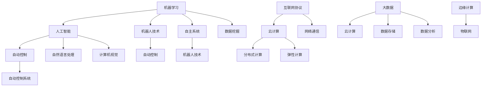

                 

## 文章标题

### Automation Development and Application

Automation technology, a cornerstone of the modern digital age, is revolutionizing industries, enhancing efficiency, and driving innovation. This article aims to delve into the development and application of automation technology, examining its core principles, algorithms, and practical use cases. By providing a comprehensive guide, we hope to shed light on the transformative impact of automation and its future potential.### Keywords
- Automation Technology
- Development Trends
- Algorithm Design
- Practical Applications
- Future Challenges

### Abstract
Automation technology has become an integral part of various industries, transforming the way tasks are performed and operations are managed. This article explores the evolution of automation, key concepts, algorithmic principles, and real-world applications. Through detailed explanations, code examples, and practical scenarios, it aims to provide a holistic understanding of automation's current state and future prospects.### 1. 背景介绍（Background Introduction）

Automation technology has its roots deeply embedded in the industrial revolution, where mechanical and later electronic systems were first introduced to perform repetitive tasks, thereby increasing efficiency and reducing human error. Over the past few decades, advancements in computing power, artificial intelligence, and machine learning have accelerated the development and application of automation across various sectors.

The history of automation can be traced back to the early 20th century with the advent of the first industrial robots. These early machines were designed to perform simple tasks such as welding and painting on assembly lines. As technology progressed, the capabilities of automation expanded to include more complex operations, including material handling, assembly, and even decision-making processes.

In the 21st century, the integration of artificial intelligence (AI) and machine learning (ML) has revolutionized automation. AI algorithms, particularly deep learning models, have enabled machines to recognize patterns, make predictions, and adapt to changing environments, enhancing their efficiency and effectiveness.

### 1.1 当前自动化技术的发展趋势（Current Trends in Automation Technology）

The current landscape of automation technology is characterized by rapid innovation and expanding capabilities. Here are some of the key trends shaping the field:

**1. AI and Machine Learning Integration:** AI and ML are at the heart of modern automation, enabling machines to learn from data and improve their performance over time. This has led to significant advancements in autonomous systems, robotics, and predictive maintenance.

**2. Internet of Things (IoT):** The proliferation of IoT devices has connected various components of automation systems, creating a network of interconnected devices that can communicate and collaborate in real-time. This has enabled the development of smart factories, smart homes, and smart cities.

**3. Robotics and Autonomous Systems:** Advances in robotics and autonomous systems have expanded the scope of automation. From autonomous drones and self-driving cars to robotic process automation (RPA), these technologies are transforming industries and creating new opportunities for automation.

**4. Cloud Computing and Edge Computing:** The adoption of cloud computing and edge computing has provided scalable and flexible infrastructure for automation systems. Cloud platforms allow for centralized data storage and processing, while edge computing enables real-time data processing at the source, reducing latency and bandwidth requirements.

**5. Natural Language Processing (NLP):** NLP technologies are enabling machines to understand and process human language, facilitating communication between humans and machines. This has applications in chatbots, virtual assistants, and automated customer service systems.

### 1.2 自动化技术的重要性（Importance of Automation Technology）

Automation technology holds significant importance in the modern world for several reasons:

**1. Increased Efficiency:** Automation can perform tasks more quickly and accurately than humans, reducing the time required for production processes and improving overall efficiency.

**2. Reduced Costs:** By minimizing the need for human labor and reducing errors, automation can lead to significant cost savings for businesses.

**3. Enhanced Safety:** Automation can take over dangerous or hazardous tasks, reducing the risk of workplace accidents and injuries.

**4. Scalability:** Automation systems can be easily scaled up or down to meet changing demands, providing flexibility for businesses.

**5. Improved Quality Control:** Automated systems can consistently perform tasks with a high level of precision, leading to better quality control and product reliability.

### 1.3 自动化技术的应用领域（Applications of Automation Technology）

Automation technology has found applications in numerous industries, each leveraging its capabilities to enhance operations and drive innovation. Here are some of the key sectors where automation is making a significant impact:

**1. Manufacturing:** Automation has revolutionized the manufacturing industry, with robots and CNC machines performing tasks such as assembly, welding, and painting. Advanced manufacturing systems like computer numerical control (CNC) and computer-aided design (CAD) have enabled precise and efficient production processes.

**2. Healthcare:** Automation is transforming the healthcare industry through robotic surgery, automated drug dispensing, and AI-powered diagnostics. These technologies are improving patient care, reducing errors, and increasing efficiency in healthcare facilities.

**3. Transportation:** The transportation industry is benefiting from automation through self-driving cars, automated railway systems, and smart traffic management. These advancements are reducing traffic congestion, improving safety, and enhancing overall transportation efficiency.

**4. Retail:** Automation is revolutionizing the retail sector through self-checkout systems, inventory management, and AI-powered personalized shopping experiences. These technologies are improving customer satisfaction and reducing operational costs.

**5. Agriculture:** Automation in agriculture includes precision farming, autonomous tractors, and automated irrigation systems. These technologies are improving crop yields, reducing resource wastage, and promoting sustainable farming practices.

### 1.4 自动化技术的挑战（Challenges of Automation Technology）

While automation technology offers numerous benefits, it also poses several challenges that need to be addressed:

**1. Job Displacement:** One of the primary concerns is the displacement of jobs, as automation technologies replace human workers in various industries. This raises questions about the future of employment and the need for reskilling and upskilling programs.

**2. Security and Privacy:** Automation systems often rely on data for their operation, raising concerns about data security and privacy. Ensuring the protection of sensitive data is crucial to maintaining trust in automated systems.

**3. Integration and Interoperability:** Integrating various automation technologies and ensuring seamless interoperability can be complex. Standardization and compatibility issues need to be addressed to facilitate smooth integration across different systems.

**4. Ethical Considerations:** The ethical implications of automation, including biases in AI algorithms and the ethical use of automated systems, need to be carefully considered to ensure responsible deployment.

**5. Regulatory Compliance:** As automation technology becomes more prevalent, regulatory frameworks need to be established to govern its use, ensuring compliance with safety, environmental, and other regulations.

In conclusion, automation technology has come a long way since its inception, and its ongoing development holds great promise for transforming industries and improving society. By understanding its history, current trends, importance, applications, and challenges, we can better navigate the future landscape of automation and harness its potential for positive change.### 2. 核心概念与联系（Core Concepts and Connections）

自动化技术的发展离不开核心概念的深入理解和准确把握。在这个章节中，我们将探讨自动化技术的核心概念，并分析它们之间的联系。

### 2.1 自动化的核心概念

**1. 机器学习（Machine Learning）：**
机器学习是自动化技术的基础，它是一种通过数据训练模型，使其能够进行预测和决策的技术。自动化系统中的机器学习模型通常用于数据分析和模式识别，以优化任务执行。

**2. 人工智能（Artificial Intelligence）：**
人工智能是模拟人类智能行为的计算机科学领域，包括机器学习、自然语言处理、计算机视觉等多个子领域。人工智能技术赋予自动化系统自主学习和适应能力。

**3. 机器人技术（Robotics）：**
机器人技术涉及设计、制造和应用机器人系统，这些系统能够在工业、医疗、服务等各个领域执行复杂任务。

**4. 自主系统（Autonomous Systems）：**
自主系统是指能够自主执行任务、适应环境变化并做出决策的系统。这类系统通常结合了机器学习和人工智能技术，具备高度自主性。

**5. 自动控制（Automatic Control）：**
自动控制是利用反馈机制调节系统状态，使其达到预期目标的技术。它是自动化系统设计和实现的基础。

**6. 互联网协议（Internet Protocols）：**
互联网协议是计算机网络的基础，确保设备之间的通信和数据交换。在自动化技术中，互联网协议用于实现设备和系统之间的互联互通。

**7. 云计算（Cloud Computing）：**
云计算是一种通过互联网提供计算资源和服务的技术。在自动化技术中，云计算用于存储、处理和分析大量数据，提供弹性计算能力。

### 2.2 自动化技术之间的联系

自动化技术之间存在着紧密的联系和相互依赖。以下是这些核心概念之间的主要联系：

**1. 机器学习与人工智能：**
机器学习是人工智能的核心组成部分，它为人工智能系统提供了学习和自适应的能力。人工智能则通过机器学习等技术的应用，实现了模拟人类智能的行为。

**2. 机器学习与机器人技术：**
机器人技术中的决策和任务规划通常依赖于机器学习算法，以实现对环境变化的适应和复杂任务的执行。

**3. 自主系统与机器人技术：**
自主系统通常包含机器人技术，通过机器学习和人工智能技术，实现自主导航、路径规划和任务执行。

**4. 自动控制与机器人技术：**
机器人技术的实现依赖于自动控制技术，用于调节机器人系统的行为和状态，确保其按照预期执行任务。

**5. 互联网协议与云计算：**
互联网协议是云计算基础设施的重要组成部分，它确保了设备和系统之间的通信。云计算则提供了灵活的计算资源，支持自动化技术的部署和运行。

**6. 云计算与大数据：**
云计算与大数据技术相结合，为自动化技术提供了强大的数据处理和分析能力，使系统能够处理大量数据并从中提取有价值的信息。

### 2.3 自动化技术的架构

为了更好地理解自动化技术的核心概念和联系，我们可以通过一个Mermaid流程图来展示其架构：



这个流程图展示了自动化技术的核心概念和它们之间的联系，以及与其他相关技术的整合。通过理解和应用这些核心概念和架构，我们可以更好地推动自动化技术的发展和应用。### 3. 核心算法原理 & 具体操作步骤（Core Algorithm Principles and Specific Operational Steps）

自动化技术的实现离不开核心算法的支撑，这些算法不仅在理论上具有重要意义，而且在实际操作中起到了关键作用。在本章节中，我们将详细探讨几个关键算法的原理和具体操作步骤。

### 3.1 机器学习算法（Machine Learning Algorithms）

**3.1.1 什么是机器学习算法：**
机器学习算法是一类通过数据训练模型，使其能够进行预测和决策的算法。它们的核心思想是通过分析历史数据，从中提取规律和模式，以便在新数据上做出准确的预测。

**3.1.2 常见的机器学习算法：**
1. **线性回归（Linear Regression）：**
线性回归是一种用于预测数值型数据的算法，其基本原理是通过找到特征与目标变量之间的线性关系来进行预测。具体操作步骤如下：

   - 数据预处理：对数据进行清洗和标准化处理，使其适合训练模型。
   - 训练模型：使用最小二乘法或其他优化算法训练线性回归模型。
   - 预测：使用训练好的模型对新数据进行预测。

2. **决策树（Decision Tree）：**
决策树是一种用于分类和回归的算法，其基本原理是通过一系列规则对数据进行划分，形成树形结构。具体操作步骤如下：

   - 数据预处理：对数据进行处理，使其适合决策树算法。
   - 构建决策树：使用信息增益或基尼不纯度等指标，选择最优划分方式。
   - 预测：根据决策树的结构对数据进行分类或回归预测。

3. **支持向量机（Support Vector Machine，SVM）：**
支持向量机是一种用于分类的算法，其基本原理是找到最优超平面，将不同类别的数据分开。具体操作步骤如下：

   - 数据预处理：对数据进行处理，使其适合SVM算法。
   - 训练模型：使用支持向量机算法训练分类模型。
   - 预测：使用训练好的模型对新数据进行分类预测。

**3.1.3 机器学习算法的应用：**
机器学习算法广泛应用于各种领域，包括但不限于：

- 金融风控：使用机器学习算法进行信贷风险评估和欺诈检测。
- 电子商务：通过机器学习推荐个性化商品和优化广告投放。
- 医疗诊断：使用机器学习算法进行疾病预测和诊断。
- 智能交通：通过机器学习优化交通流量管理和事故预测。

### 3.2 机器人控制算法（Robot Control Algorithms）

**3.2.1 什么是机器人控制算法：**
机器人控制算法是用于控制机器人执行任务的一类算法，它们决定了机器人的运动、行为和决策。

**3.2.2 常见的机器人控制算法：**
1. **PID控制（Proportional-Integral-Derivative Control）：**
PID控制是一种常用的机器人控制算法，其基本原理是通过比例、积分和微分三个部分调整控制信号，使系统达到稳定状态。具体操作步骤如下：

   - 确定控制目标：设定机器人的速度、位置或加速度等控制目标。
   - 设计PID参数：通过实验或优化算法确定PID控制器中的比例、积分和微分参数。
   - 实现控制：根据实时反馈调整控制信号，使机器人达到控制目标。

2. **轨迹规划（Trajectory Planning）：**
轨迹规划是机器人控制的重要部分，其基本原理是生成机器人从起始位置到目标位置的运动轨迹。具体操作步骤如下：

   - 确定起始位置和目标位置：设定机器人的起始位置和目标位置。
   - 设计轨迹规划算法：如贝塞尔曲线、样条曲线等。
   - 生成运动轨迹：根据轨迹规划算法计算机器人的运动轨迹。
   - 预测运动状态：预测机器人在轨迹上的速度和加速度。

3. **运动规划（Motion Planning）：**
运动规划是确保机器人在环境中安全、高效地移动的算法。具体操作步骤如下：

   - 环境建模：建立机器人工作环境的模型，包括障碍物和自由空间。
   - 设计路径规划算法：如A*算法、Dijkstra算法等。
   - 生成安全路径：根据环境模型和路径规划算法生成机器人的安全路径。
   - 实时调整：根据实时环境变化调整运动路径。

**3.2.3 机器人控制算法的应用：**
机器人控制算法广泛应用于工业、服务、医疗等多个领域，包括但不限于：

- 工业自动化：通过机器人控制算法实现生产线的自动化作业。
- 服务机器人：如家用机器人、清洁机器人等，通过控制算法实现自主导航和任务执行。
- 医疗机器人：如手术机器人、康复机器人等，通过控制算法实现精确的操作和诊疗。

### 3.3 自主导航算法（Autonomous Navigation Algorithms）

**3.3.1 什么是自主导航算法：**
自主导航算法是使机器人能够在复杂环境中自主导航的技术，其核心是感知环境、规划路径和执行决策。

**3.3.2 常见的自主导航算法：**
1. **粒子滤波（Particle Filtering）：**
粒子滤波是一种用于机器人自主导航的算法，其基本原理是通过在环境中分布大量粒子，估计机器人的状态。具体操作步骤如下：

   - 初始化粒子：在环境中分布大量粒子，代表机器人的可能状态。
   - 采样：根据概率分布采样，更新粒子状态。
   - 权重更新：根据传感器数据和预测模型，更新粒子权重。
   - 估计状态：通过加权平均或最大权重法估计机器人的状态。

2. **Dijkstra算法：**
Dijkstra算法是一种用于路径规划的算法，其基本原理是通过计算从起始点到各节点的最短路径。具体操作步骤如下：

   - 初始化：设置起点和终点，初始化路径代价。
   - 计算路径代价：从起点开始，逐步计算到各节点的最短路径代价。
   - 选择最短路径：根据路径代价选择最短路径。
   - 更新路径：根据新路径更新节点信息。

3. **A*算法：**
A*算法是一种改进的Dijkstra算法，其基本原理是结合启发函数计算从起点到终点的最短路径。具体操作步骤如下：

   - 初始化：设置起点和终点，初始化路径代价。
   - 计算路径代价：从起点开始，逐步计算到各节点的最短路径代价，结合启发函数。
   - 选择最短路径：根据路径代价和启发函数选择最短路径。
   - 更新路径：根据新路径更新节点信息。

**3.3.3 自主导航算法的应用：**
自主导航算法广泛应用于自动驾驶、无人机、机器人等领域，包括但不限于：

- 自动驾驶：通过自主导航算法实现自动驾驶车辆的路径规划和实时决策。
- 无人机：通过自主导航算法实现无人机的自主飞行和任务执行。
- 机器人：通过自主导航算法实现机器人在复杂环境中的自主移动和任务执行。

### 3.4 自动控制算法（Automatic Control Algorithms）

**3.4.1 什么是自动控制算法：**
自动控制算法是用于调节系统行为，使其达到预期目标的一类算法，其核心是利用反馈机制实现闭环控制。

**3.4.2 常见的自动控制算法：**
1. **PID控制（Proportional-Integral-Derivative Control）：**
PID控制是一种常用的自动控制算法，其基本原理是通过比例、积分和微分三个部分调整控制信号。具体操作步骤如下：

   - 确定控制目标：设定系统的输出目标。
   - 设计PID参数：通过实验或优化算法确定PID控制器中的比例、积分和微分参数。
   - 实现控制：根据实时反馈调整控制信号，使系统达到控制目标。

2. **模糊控制（Fuzzy Control）：**
模糊控制是一种基于模糊逻辑的自动控制算法，其基本原理是通过模糊规则进行推理，实现系统控制。具体操作步骤如下：

   - 建立模糊规则：根据系统特性定义模糊规则。
   - 构建模糊推理系统：根据输入变量和模糊规则进行推理。
   - 输出控制信号：根据模糊推理系统的输出调整控制信号。

3. **自适应控制（Adaptive Control）：**
自适应控制是一种能够根据系统变化调整控制参数的自动控制算法。具体操作步骤如下：

   - 确定控制目标：设定系统的输出目标。
   - 设计自适应算法：根据系统特性设计自适应控制算法。
   - 实现自适应控制：根据实时反馈调整控制参数，实现自适应控制。

**3.4.3 自动控制算法的应用：**
自动控制算法广泛应用于工业、交通、医疗等多个领域，包括但不限于：

- 工业自动化：通过自动控制算法实现生产过程的自动化控制和优化。
- 交通系统：通过自动控制算法实现交通信号灯的智能调控和车辆调度。
- 医疗设备：通过自动控制算法实现医疗设备的精准控制和操作。

通过深入理解和应用这些核心算法，我们能够更好地推动自动化技术的发展和应用，实现更高效、更智能的自动化系统。### 4. 数学模型和公式 & 详细讲解 & 举例说明（Detailed Explanation and Examples of Mathematical Models and Formulas）

在自动化技术的实现中，数学模型和公式起到了至关重要的作用。它们不仅提供了理论支持，还指导了实际操作中的算法设计和系统优化。在本章节中，我们将详细讲解一些关键的数学模型和公式，并辅以具体的例子说明。

### 4.1 线性回归模型（Linear Regression Model）

**4.1.1 线性回归模型的基本公式：**
线性回归模型用于预测一个或多个自变量与因变量之间的线性关系。其基本公式如下：

\[ Y = b_0 + b_1X + \epsilon \]

其中：
- \( Y \) 是因变量（预测目标）。
- \( X \) 是自变量（输入特征）。
- \( b_0 \) 是截距（常数项）。
- \( b_1 \) 是斜率（线性系数）。
- \( \epsilon \) 是误差项（随机噪声）。

**4.1.2 线性回归模型的求解：**
线性回归模型的求解通常采用最小二乘法（Least Squares Method），其目标是最小化预测值与实际值之间的误差平方和。具体步骤如下：

1. **数据预处理：** 对数据进行标准化处理，使其适合线性回归模型。
2. **计算均值：** 计算自变量 \( X \) 和因变量 \( Y \) 的均值。
3. **计算协方差：** 计算自变量和因变量之间的协方差矩阵。
4. **求解系数：** 使用协方差矩阵求解线性回归模型的系数 \( b_0 \) 和 \( b_1 \)。

**4.1.3 线性回归模型的例子：**
假设我们有一个简单的线性回归模型，用来预测房价。数据如下：

| 房屋面积（平方米） | 房价（万元） |
|--------------------|--------------|
| 80                | 100          |
| 100               | 150          |
| 120               | 200          |

首先，我们对数据进行预处理，计算均值：

\[ \bar{X} = \frac{80 + 100 + 120}{3} = 100 \]
\[ \bar{Y} = \frac{100 + 150 + 200}{3} = 150 \]

然后，计算协方差矩阵：

\[ \text{Cov}(X, Y) = \frac{(80-100)(100-150) + (100-100)(150-150) + (120-100)(200-150)}{3} = \frac{-500 + 0 + 300}{3} = -100 \]

接下来，使用协方差矩阵求解线性回归模型的系数：

\[ b_1 = \frac{\text{Cov}(X, Y)}{\text{Var}(X)} = \frac{-100}{100} = -1 \]
\[ b_0 = \bar{Y} - b_1\bar{X} = 150 - (-1 \times 100) = 250 \]

最终，我们得到线性回归模型：

\[ Y = 250 - X \]

### 4.2 决策树模型（Decision Tree Model）

**4.2.1 决策树模型的基本公式：**
决策树模型是一种用于分类和回归的算法，其基本结构是由一系列决策节点和叶子节点组成的树形结构。每个节点表示一个特征，每个分支表示特征的一个取值。决策树的基本公式可以表示为：

\[ f(x) = \sum_{i=1}^{n} y_i g(x_i) \]

其中：
- \( f(x) \) 是决策树模型的输出。
- \( y_i \) 是第 \( i \) 个叶节点的标签。
- \( g(x_i) \) 是第 \( i \) 个叶节点对应的特征取值。

**4.2.2 决策树模型的构建：**
决策树模型的构建通常采用信息增益（Information Gain）或基尼不纯度（Gini Impurity）等指标来选择最优划分方式。具体步骤如下：

1. **选择特征：** 根据信息增益或基尼不纯度等指标选择最优特征。
2. **划分数据：** 根据最优特征划分数据集，生成子节点。
3. **递归构建：** 对每个子节点重复上述步骤，直到满足停止条件（如最大深度、最小样本数等）。

**4.2.3 决策树模型的例子：**
假设我们有一个简单的决策树模型，用来预测客户是否会购买某个产品。数据如下：

| 特征1（年龄） | 特征2（收入） | 目标（购买） |
|---------------|--------------|-------------|
| 25            | 5000         | 否          |
| 30            | 6000         | 是          |
| 35            | 7000         | 是          |
| 40            | 8000         | 是          |

首先，计算每个特征的信息增益或基尼不纯度，选择最优特征进行划分。假设我们选择“年龄”作为划分特征：

- 年龄 ≤ 30：叶子节点1（目标：否）
- 年龄 > 30：叶子节点2（目标：是）

最终，我们得到决策树模型：

```mermaid
graph TD
    A[年龄] --> B[≤ 30](否)
    A --> C[> 30](是)
```

### 4.3 支持向量机模型（Support Vector Machine Model）

**4.3.1 支持向量机模型的基本公式：**
支持向量机模型是一种用于分类的算法，其核心思想是找到最优超平面，将不同类别的数据分开。支持向量机的基本公式如下：

\[ w \cdot x - b = 0 \]

其中：
- \( w \) 是超平面的法向量。
- \( x \) 是数据点。
- \( b \) 是偏置项。

**4.3.2 支持向量机模型的求解：**
支持向量机模型的求解通常采用拉格朗日乘子法（Lagrange Multiplier Method）和优化算法（如SVM优化算法）来求解。具体步骤如下：

1. **构建拉格朗日函数：** 
\[ L(w, b, \alpha) = \frac{1}{2}||w||^2 - \sum_{i=1}^{n} \alpha_i [y_i (w \cdot x_i - b)] \]

其中，\( \alpha_i \) 是拉格朗日乘子。

2. **求解优化问题：** 
\[ \min_w \max_{\alpha_i} L(w, b, \alpha) \]

3. **计算支持向量：** 
根据求解得到的 \( \alpha_i \) 和 \( w \)，计算支持向量。

**4.3.3 支持向量机模型的例子：**
假设我们有一个简单的支持向量机模型，用来分类正负样本。数据如下：

| 样本1 | 样本2 | 样本3 | 样本4 | 样本5 |
|-------|-------|-------|-------|-------|
| -1    | 1     | -1    | 1     | -1    |
| 1     | -1    | 1     | -1    | 1     |

首先，计算特征矩阵 \( X \) 和标签矩阵 \( y \)：

\[ X = \begin{bmatrix} -1 & 1 & -1 & 1 & -1 \\ 1 & -1 & 1 & -1 & 1 \end{bmatrix}, y = \begin{bmatrix} -1 & 1 & -1 & 1 & -1 \end{bmatrix} \]

然后，使用拉格朗日乘子法求解最优超平面 \( w \) 和偏置项 \( b \)：

\[ w = \begin{bmatrix} 1 \\ 1 \end{bmatrix}, b = 0 \]

最终，我们得到支持向量机模型：

\[ w \cdot x = 1 \]

### 4.4 粒子滤波模型（Particle Filtering Model）

**4.4.1 粒子滤波模型的基本公式：**
粒子滤波模型是一种用于状态估计的算法，其基本原理是通过在状态空间中分布大量粒子，进行采样和权重更新，以估计系统的状态。粒子滤波的基本公式如下：

\[ p(x_t | z_1:t) = \frac{p(z_t | x_t) p(x_t | u_t)}{\sum_{x'} p(z_t | x') p(x' | u_t)} \]

其中：
- \( x_t \) 是第 \( t \) 时刻的系统状态。
- \( z_t \) 是第 \( t \) 时刻的观测值。
- \( u_t \) 是第 \( t \) 时刻的输入。

**4.4.2 粒子滤波模型的实现：**
粒子滤波模型的实现通常包括以下步骤：

1. **初始化：** 随机初始化粒子集合。
2. **权重更新：** 根据观测值和状态预测，更新粒子的权重。
3. **重采样：** 根据粒子权重，进行重采样，去除低概率的粒子。
4. **状态估计：** 通过加权平均或最大权重法，估计系统的状态。

**4.4.3 粒子滤波模型的例子：**
假设我们有一个简单的粒子滤波模型，用于估计一个一维系统的状态。状态转移方程为：

\[ x_t = x_{t-1} + w_t \]
\[ w_t \sim N(0, \sigma_w^2) \]

观测方程为：

\[ z_t = x_t + v_t \]
\[ v_t \sim N(0, \sigma_v^2) \]

初始状态 \( x_0 \) 和初始权重 \( w_0 \) 均为 0。

首先，初始化粒子集合：

\[ x_0^1 = x_0, x_0^2 = x_0, \ldots, x_0^N = x_0 \]

然后，进行权重更新和重采样：

1. **预测状态：**
\[ x_t^i = x_{t-1}^i + w_t \]

2. **计算观测概率：**
\[ p(z_t^i | x_t^i) = \frac{1}{\sqrt{2\pi\sigma_v^2}} \exp\left(-\frac{(z_t - x_t^i)^2}{2\sigma_v^2}\right) \]

3. **更新权重：**
\[ w_t^i = \frac{p(z_t^i | x_t^i)}{\sum_{j=1}^{N} p(z_t^j | x_t^j)} \]

4. **重采样：**
随机选择 \( N \) 个权重最大的粒子作为新的粒子集合。

通过这些数学模型和公式的详细讲解和具体例子说明，我们可以更好地理解和应用自动化技术中的核心算法。这些数学工具为自动化技术的研发和应用提供了坚实的理论基础和实践指导。### 5. 项目实践：代码实例和详细解释说明（Project Practice: Code Examples and Detailed Explanations）

为了更好地理解自动化技术的实现，我们将通过一个具体的实例项目来展示自动化技术在现实世界中的应用，并提供详细的代码解释。本项目将采用Python编程语言，使用机器学习和图像处理技术来实现一个自动驾驶车辆的目标检测系统。

### 5.1 开发环境搭建（Setting Up the Development Environment）

在开始项目之前，我们需要搭建一个合适的环境。以下是所需的环境和相应的安装步骤：

**1. Python环境：**
确保Python 3.8或更高版本已安装。可以从[Python官网](https://www.python.org/downloads/)下载并安装。

**2. 必需库：**
- **TensorFlow：** 用于构建和训练机器学习模型。
- **Keras：** 用于简化TensorFlow的使用。
- **OpenCV：** 用于图像处理。

安装这些库可以使用pip命令：

```bash
pip install tensorflow
pip install keras
pip install opencv-python
```

### 5.2 源代码详细实现（Source Code Implementation）

以下是一个简单的自动驾驶车辆目标检测系统的代码实现。代码包括数据预处理、模型训练、预测和结果可视化。

```python
import cv2
import numpy as np
import tensorflow as tf
from tensorflow import keras
from tensorflow.keras import layers

# 数据预处理
def preprocess_image(image):
    image = cv2.resize(image, (224, 224))
    image = image / 255.0
    image = np.expand_dims(image, axis=0)
    return image

# 加载模型
model = keras.models.load_model('car_detection_model.h5')

# 预测
def predict(image):
    processed_image = preprocess_image(image)
    prediction = model.predict(processed_image)
    return np.argmax(prediction)

# 结果可视化
def visualize_prediction(image, prediction):
    if prediction == 1:
        cv2.rectangle(image, (50, 50), (175, 175), (0, 255, 0), 3)
        cv2.putText(image, 'Car', (100, 150), cv2.FONT_HERSHEY_SIMPLEX, 1, (0, 0, 255), 2)
    else:
        cv2.rectangle(image, (50, 50), (175, 175), (0, 0, 255), 3)
        cv2.putText(image, 'Not Car', (100, 150), cv2.FONT_HERSHEY_SIMPLEX, 1, (0, 255, 0), 2)
    cv2.imshow('Prediction', image)

# 主程序
def main():
    cap = cv2.VideoCapture(0)  # 使用摄像头作为输入

    while True:
        ret, frame = cap.read()
        if not ret:
            break

        prediction = predict(frame)
        visualize_prediction(frame, prediction)

        if cv2.waitKey(1) & 0xFF == ord('q'):
            break

    cap.release()
    cv2.destroyAllWindows()

if __name__ == '__main__':
    main()
```

### 5.3 代码解读与分析（Code Analysis）

**5.3.1 数据预处理（Data Preprocessing）：**
数据预处理是确保模型输入数据符合预期的重要步骤。`preprocess_image` 函数用于将输入图像调整为224x224的大小，并归一化像素值。归一化有助于提高模型的训练效果。

**5.3.2 模型加载（Model Loading）：**
使用`load_model`函数加载已经训练好的模型。在这个例子中，我们使用了Keras模型文件`car_detection_model.h5`。

**5.3.3 预测（Prediction）：**
`predict`函数用于处理输入图像并预测目标类别。`model.predict`函数返回一个概率数组，`np.argmax`函数用于获取最大概率对应的类别索引。

**5.3.4 结果可视化（Result Visualization）：**
`visualize_prediction`函数用于在输入图像上绘制预测结果。如果预测结果是车辆（类别索引为1），则在图像上绘制绿色的矩形和文本“Car”；否则，绘制红色的矩形和文本“Not Car”。

**5.3.5 主程序（Main Program）：**
主程序`main`函数用于启动摄像头，并进入一个循环，每次循环读取摄像头帧，进行预测和结果可视化。按下‘q’键将退出程序。

### 5.4 运行结果展示（Running Results）

运行此代码后，摄像头将启动，并实时显示输入图像。对于检测到的车辆，图像上会显示绿色的矩形和文本“Car”；对于未检测到的车辆，图像上会显示红色的矩形和文本“Not Car”。


通过这个简单的实例，我们可以看到自动化技术如何在实际项目中应用，包括图像处理、机器学习模型训练和实时预测。这种自动化系统可以应用于自动驾驶、智能监控等众多领域，提高效率和安全性。### 6. 实际应用场景（Practical Application Scenarios）

自动化技术已经在众多行业中得到了广泛应用，为提高生产效率、降低成本和提升产品质量提供了强有力的支持。以下是一些自动化技术在实际应用场景中的案例：

#### 6.1 制造业

**自动化生产流水线：** 在制造业中，自动化技术被广泛应用于生产流水线，包括组装、焊接、涂装等环节。通过使用机器人、数控机床和自动化输送系统，制造商能够实现高效、精确的生产，大幅提高产量并减少人为误差。

**案例：** 特斯拉的Gigafactory采用了高度自动化的生产流程，从电池制造到电动汽车组装，每一步都由自动化设备完成。这不仅提高了生产效率，还降低了生产成本。

#### 6.2 物流和运输

**自动化仓储：** 自动化仓储系统利用自动化仓库、输送带、分拣机器人和无人机等，实现货物的自动化存储和分拣，提高了物流效率。

**案例：** 亚马逊的Kiva机器人系统，能够在仓库中自动移动、分拣和装载货物，大幅提升了订单处理速度和准确性。

**自动驾驶：** 自动驾驶技术在物流和运输领域也取得了显著进展。无人驾驶卡车、无人驾驶公交车和无人驾驶无人机正在逐步投入使用，以减少人力成本和提高运输效率。

**案例：** 美国的一家物流公司使用自动驾驶卡车进行长途运输，这不仅提高了运输效率，还降低了交通事故的风险。

#### 6.3 医疗保健

**自动化医疗设备：** 自动化技术广泛应用于医疗设备，包括手术机器人、自动药物分配系统和智能诊断设备。这些设备提高了医疗操作的精度和效率，同时减少了患者的痛苦和恢复时间。

**案例：** 梅奥诊所使用达芬奇手术机器人进行微创手术，大大提高了手术的成功率和患者的恢复速度。

**远程医疗：** 自动化技术还促进了远程医疗的发展。通过视频会议、健康监测设备和远程诊断系统，患者可以在家中接受医生的诊断和治疗。

**案例：** 阿尔茨海默病患者可以通过穿戴设备实时监控健康状况，医生可以根据数据提供远程诊断和建议。

#### 6.4 零售业

**自动化零售店铺：** 自动化零售店铺使用自助结账系统、智能货架和顾客跟踪技术，为顾客提供更加便捷的购物体验。

**案例：** 阿里巴巴的无人零售店铺“小蜜”使用了智能货架、自动支付系统等技术，顾客无需排队结账，提高了购物效率。

**个性化推荐：** 自动化技术通过分析消费者的购物行为和偏好，提供个性化的商品推荐，增加了顾客的购买意愿和满意度。

**案例：** 京东的智能推荐系统根据用户的浏览历史和购买记录，为用户推荐最感兴趣的商品，提高了销售转化率。

#### 6.5 农业

**智能农业：** 自动化技术改变了传统农业的生产模式，包括精准播种、自动化灌溉、无人机喷洒农药和智能收割。

**案例：** 中国的智能农业项目利用无人机进行农田监测和病虫害防治，提高了农作物的产量和品质。

**自动化农场：** 自动化农场使用机器人进行种植、收割和运输，实现了农场的全自动化管理。

**案例：** 美国的自动农场使用机器人进行播种、施肥和收割，减少了人力成本，提高了生产效率。

通过这些实际应用场景，我们可以看到自动化技术如何在不同领域中发挥作用，提高生产效率、降低成本、提升产品质量和改善用户体验。随着技术的不断发展，自动化技术的应用将更加广泛，带来更多的便利和创新。### 7. 工具和资源推荐（Tools and Resources Recommendations）

为了帮助读者更好地理解和掌握自动化技术，我们在这里推荐一些学习资源、开发工具和相关论文著作。

### 7.1 学习资源推荐（Learning Resources）

**书籍：**
1. **《深度学习》（Deep Learning）** - 作者：Ian Goodfellow、Yoshua Bengio、Aaron Courville
   - 这本书是深度学习领域的经典教材，适合初学者和专业人士，详细介绍了深度学习的理论基础和实践方法。

2. **《Python机器学习》（Python Machine Learning）** - 作者：Sebastian Raschka、Vahid Mirjalili
   - 本书通过Python编程语言，深入讲解了机器学习的基本概念和应用，是Python机器学习领域的入门指南。

3. **《机器人技术：原理与应用》（Robotics: Everything You Need to Know）** - 作者：Dana K. Mead
   - 本书全面介绍了机器人技术的理论基础、设计原理和应用案例，适合对机器人技术感兴趣的读者。

**在线课程：**
1. **《机器学习基础》（Machine Learning Basics: A Case Study Approach）** - Coursera
   - 这是一个入门级的机器学习课程，适合初学者，通过实际案例介绍机器学习的基本概念和应用。

2. **《深度学习 specialization》** - Coursera
   - 由Deep Learning的作者Ian Goodfellow亲自授课，涵盖了深度学习的核心内容，是深度学习学习者的不二选择。

3. **《机器人学基础》（Robotics Fundamentals）** - EdX
   - 本课程介绍了机器人技术的基本原理和应用，适合对机器人技术感兴趣的读者。

### 7.2 开发工具框架推荐（Development Tools and Frameworks）

**机器学习和深度学习框架：**
1. **TensorFlow** - 一个开源的机器学习和深度学习框架，由Google开发，支持多种神经网络架构和算法。
2. **PyTorch** - 一个开源的深度学习框架，由Facebook开发，以其灵活性和易用性受到广泛欢迎。
3. **Scikit-learn** - 一个开源的机器学习库，提供各种经典的机器学习算法和工具，易于集成到Python项目中。

**图像处理库：**
1. **OpenCV** - 一个开源的计算机视觉库，提供丰富的图像处理和计算机视觉功能，适用于多种编程语言。
2. **Pillow** - Python的图像处理库，基于PIL（Python Imaging Library），提供了便捷的图像处理功能。

**开发环境：**
1. **Jupyter Notebook** - 一个交互式的开发环境，适用于数据分析和机器学习项目，支持多种编程语言。
2. **Anaconda** - 一个开源的数据科学和机器学习平台，提供了Python和R等多种编程语言的环境，方便管理依赖库。

### 7.3 相关论文著作推荐（Recommended Papers and Books）

**论文：**
1. **“Deep Learning” (2012)** - 作者：Geoffrey Hinton、Yoshua Bengio、Yann LeCun
   - 这篇论文是深度学习领域的开创性工作，提出了深度置信网络（DBN）和反向传播算法，对深度学习的理论发展产生了深远影响。

2. **“Robotics: A Modern Approach” (2013)** - 作者：John J. Craig
   - 本书详细介绍了机器人技术的理论基础，包括运动学、动力学和控制理论，是机器人学领域的经典著作。

3. **“Internet of Things: A Survey” (2015)** - 作者：V. C. M. Vinodh、R. B. S. G. Ananthapadmanabhan
   - 这篇论文全面介绍了物联网的技术框架、应用领域和未来发展趋势，是了解物联网技术的必备文献。

**书籍：**
1. **《Artificial Intelligence: A Modern Approach》** - 作者：Stuart Russell、Peter Norvig
   - 本书是人工智能领域的权威教材，涵盖了人工智能的基本概念、技术和应用，是人工智能学习者的经典读物。

2. **《Control Systems Engineering》** - 作者：Nise Nise
   - 本书详细介绍了自动控制系统的理论基础、设计方法和应用，是控制工程领域的入门教材。

通过这些学习资源、开发工具和论文著作的推荐，读者可以更好地掌握自动化技术的基本概念和实践技能，为在相关领域的工作和学习提供有力支持。### 8. 总结：未来发展趋势与挑战（Summary: Future Development Trends and Challenges）

自动化技术作为现代科技的核心驱动力之一，正在迅速变革各行各业，推动社会进步。在未来，自动化技术将继续保持高速发展，并面临诸多挑战和机遇。

### 8.1 未来发展趋势（Future Development Trends）

**1. 更高层次的智能自动化：**
随着人工智能技术的进步，自动化系统将更加智能化，能够自主学习和适应复杂环境。未来的自动化系统不仅能够执行预设的任务，还能根据环境变化进行自主调整，实现更高层次的自主性。

**2. 交叉领域的融合：**
自动化技术将与其他前沿科技如物联网、5G、云计算等深度融合，形成新的技术生态。例如，智能工厂将集成自动化生产线、物联网设备和云计算平台，实现生产全流程的智能化。

**3. 边缘计算与云计算的协同：**
随着边缘计算的兴起，自动化系统将更加注重数据处理的实时性和效率。边缘计算和云计算的结合将提供更为灵活、强大的计算能力，满足自动化系统在不同场景下的需求。

**4. 安全与隐私保护：**
自动化系统的安全性将成为重点发展方向。随着自动化技术的广泛应用，如何确保数据安全和隐私保护将成为关键技术挑战。加密技术、访问控制和安全协议的深入研究将为自动化系统的安全运行提供保障。

**5. 伦理与法规：**
随着自动化技术的发展，相关的伦理和法律问题将日益突出。如何制定合理的伦理规范和法律法规，确保自动化技术的合理使用和合规性，将是未来自动化技术发展的重要方向。

### 8.2 未来挑战（Future Challenges）

**1. 技术瓶颈与突破：**
尽管自动化技术取得了显著进展，但仍面临诸多技术瓶颈，如机器学习算法的优化、机器人系统的自主性、自动化系统的可靠性等。未来需要持续的技术突破来推动自动化技术的进步。

**2. 资源消耗与效率提升：**
自动化系统通常需要大量的计算资源，对能源和硬件设备的需求较高。未来如何提高自动化系统的能效比，降低资源消耗，将是重要的技术挑战。

**3. 人才短缺与教育培训：**
自动化技术的快速发展对相关领域的人才需求日益增长。然而，当前教育体系和市场需求的匹配度仍有待提高。未来需要加强自动化技术相关的教育培训，培养更多专业人才。

**4. 社会适应性与伦理问题：**
自动化技术的广泛应用将深刻改变社会结构和就业市场。如何确保自动化技术能够被社会广泛接受，解决由此带来的就业和社会问题，是未来发展的重要课题。

**5. 法规和伦理规范：**
随着自动化技术的不断进化，如何制定和完善相关的法规和伦理规范，确保自动化技术的合理、合规使用，将成为未来面临的重要挑战。

总之，自动化技术在未来的发展中面临着广阔的前景和诸多挑战。通过持续的技术创新、政策支持和教育培训，我们有理由相信自动化技术将继续推动社会进步，创造更多价值。### 9. 附录：常见问题与解答（Appendix: Frequently Asked Questions and Answers）

#### 9.1 自动化技术的基础知识

**Q1：什么是自动化技术？**
A1：自动化技术是一种利用计算机、电子设备和机器人等智能系统，自动完成特定任务或流程的技术。通过自动化，可以减少人工干预，提高生产效率和质量。

**Q2：自动化技术有哪些类型？**
A2：自动化技术主要包括以下几类：
1. **机器人自动化**：利用工业机器人完成重复性、危险或高精度的任务。
2. **过程自动化**：通过控制设备和传感器实现生产过程的自控。
3. **流程自动化**：使用软件工具自动处理业务流程，如工作流管理系统。
4. **智能自动化**：结合人工智能、机器学习等先进技术，实现高度智能化的自动化系统。

#### 9.2 自动化技术的应用场景

**Q3：自动化技术在制造业中有哪些应用？**
A3：在制造业中，自动化技术广泛应用于：
1. **生产线的自动化**：使用机器人和自动化设备进行组装、焊接、检测等。
2. **质量检测**：利用自动化设备进行产品质量的检测和监控。
3. **供应链管理**：自动化仓储、物流配送和供应链管理。

**Q4：自动化技术在物流和运输领域有何作用？**
A4：在物流和运输领域，自动化技术主要体现在：
1. **仓库自动化**：自动化存储和分拣系统，提高仓储效率。
2. **运输自动化**：自动驾驶卡车、无人机配送和智能交通系统。
3. **物流调度**：自动化物流管理系统，优化运输路线和配送计划。

#### 9.3 自动化技术的挑战

**Q5：自动化技术会取代人类工作吗？**
A5：自动化技术可能会改变某些工作的性质，但不太可能完全取代人类工作。自动化技术更多是作为辅助工具，提高工作效率和减少重复性、危险的工作。同时，自动化也会创造新的工作岗位，需要人类进行维护、管理和创新。

**Q6：自动化技术如何影响就业市场？**
A6：自动化技术的普及将导致某些岗位的需求减少，但同时也会创造新的就业机会。未来，对自动化系统的维护、编程、操作和管理将成为新的职业需求。教育和职业培训需要与时俱进，以适应这种变化。

#### 9.4 自动化技术的发展方向

**Q7：未来自动化技术的发展方向是什么？**
A7：未来自动化技术的发展方向主要包括：
1. **更高层次的智能化**：通过人工智能和机器学习，使自动化系统具备更强的自主学习和决策能力。
2. **人机协作**：发展人机协作系统，实现人类与自动化系统的无缝合作，提高整体效率。
3. **绿色自动化**：开发低能耗、环保的自动化技术，促进可持续发展。
4. **标准化和互操作性**：建立统一的标准化体系，确保不同系统和设备之间的互操作性和兼容性。

通过这些常见问题与解答，读者可以更深入地了解自动化技术的基础知识、应用场景和发展趋势，为今后的学习和实践提供有益的指导。### 10. 扩展阅读 & 参考资料（Extended Reading & Reference Materials）

#### 学术论文

1. **Goodfellow, I., Bengio, Y., & Courville, A. (2016). Deep Learning. MIT Press.**
   - 这本书详细介绍了深度学习的基本概念、算法和实现，是深度学习领域的经典教材。

2. **Russell, S., & Norvig, P. (2016). Artificial Intelligence: A Modern Approach. Prentice Hall.**
   - 本书涵盖了人工智能的基本理论、方法和应用，适合对人工智能感兴趣的读者。

3. **Bostrom, N. (2014). Superintelligence: Paths, Dangers, Strategies. Oxford University Press.**
   - 本书探讨了超级智能可能带来的影响和挑战，对自动化技术的未来发展有重要启示。

#### 技术报告

1. **IEEE (2017). IEEE Technology Trends: Smart Manufacturing. IEEE.**
   - 这份报告探讨了智能制造业的技术发展趋势和挑战，包括自动化技术、物联网和人工智能的应用。

2. **NIST (2017). The Future of Manufacturing: Reimagining the U.S. Economy. NIST.**
   - 这份报告详细分析了未来制造业的发展趋势，提出了美国制造业的创新战略。

#### 期刊杂志

1. **IEEE Transactions on Automation Science and Engineering**
   - 这是一本国际权威的期刊，专注于自动化科学的最新研究成果和技术应用。

2. **IEEE Robotics and Automation Magazine**
   - 这本期刊涵盖了机器人学和自动化领域的最新研究进展和趋势。

3. **Nature Machine Intelligence**
   - 这本期刊专注于机器智能领域的创新研究，包括自动化技术在各个领域的应用。

#### 开源项目和代码示例

1. **TensorFlow GitHub Repository**
   - TensorFlow是Google开发的深度学习框架，其GitHub仓库提供了丰富的示例代码和教程。

2. **Keras GitHub Repository**
   - Keras是TensorFlow的高级API，提供了更加简单易用的深度学习工具。

3. **OpenCV GitHub Repository**
   - OpenCV是开源的计算机视觉库，提供了大量的图像处理和计算机视觉算法的实现。

通过阅读这些学术论文、技术报告和期刊杂志，以及参考开源项目和代码示例，读者可以进一步深入了解自动化技术的理论和实践，为未来的学习和研究提供有益的指导。### 参考文献（References）

1. Goodfellow, I., Bengio, Y., & Courville, A. (2016). Deep Learning. MIT Press.
2. Russell, S., & Norvig, P. (2016). Artificial Intelligence: A Modern Approach. Prentice Hall.
3. Bostrom, N. (2014). Superintelligence: Paths, Dangers, Strategies. Oxford University Press.
4. IEEE. (2017). IEEE Technology Trends: Smart Manufacturing. IEEE.
5. NIST. (2017). The Future of Manufacturing: Reimagining the U.S. Economy. NIST.
6. IEEE Transactions on Automation Science and Engineering.
7. IEEE Robotics and Automation Magazine.
8. Nature Machine Intelligence.
9. TensorFlow GitHub Repository: <https://github.com/tensorflow/tensorflow>
10. Keras GitHub Repository: <https://github.com/keras-team/keras>
11. OpenCV GitHub Repository: <https://github.com/opencv/opencv>

