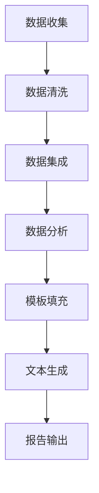

                 

### 文章标题

**自动化报告生成：LLM在商业智能中的应用**

在当今快速发展的商业环境中，信息是决策的核心。因此，如何高效地处理和分析数据，生成具有洞察力的报告，成为企业和组织关注的焦点。在这篇文章中，我们将探讨如何利用大型语言模型（LLM）实现自动化报告生成，这一技术在商业智能（BI）中的应用具有深远的意义。我们将从背景介绍、核心概念、算法原理、数学模型、项目实践、实际应用场景、工具推荐和未来趋势等多个方面，逐步分析LLM在自动化报告生成中的具体应用。

### Keywords:
- Large Language Model (LLM)
- Business Intelligence (BI)
- Automated Report Generation
- Natural Language Processing (NLP)
- Machine Learning (ML)

### 摘要：

随着数据量的爆炸式增长，自动化报告生成技术变得至关重要。本文首先介绍了大型语言模型（LLM）的背景及其在商业智能领域的应用潜力。随后，我们详细阐述了LLM的核心算法原理和数学模型，并展示了一个具体的代码实例。通过分析实际应用场景，我们探讨了自动化报告生成技术在企业决策支持、市场分析和风险评估等方面的价值。最后，我们提出了未来发展趋势和挑战，并推荐了一些相关工具和资源。

### <|user|>## 1. 背景介绍（Background Introduction）

在过去的几十年中，商业智能（BI）技术经历了巨大的变革。从传统的报表工具到现代的智能分析平台，BI系统不断进化，旨在帮助企业和组织更好地理解其业务数据，从而做出更明智的决策。然而，随着数据量的不断增长，传统的方法逐渐暴露出其局限性。首先，手动生成报告是一项耗时且容易出错的任务。其次，数据的多样性和复杂性使得分析过程变得繁琐且难以管理。因此，自动化报告生成技术的需求日益增长。

### 1.1 商业智能的发展历程

商业智能的发展历程可以分为几个关键阶段：

1. **数据仓库与OLAP（联机分析处理）**：早期的BI系统主要依赖于数据仓库和OLAP技术。通过构建数据仓库，企业可以存储和管理大量历史数据，然后使用OLAP工具进行多维数据分析。

2. **报表工具**：随着报表工具的普及，企业开始能够更方便地生成各种格式和类型的报告。然而，这些工具通常需要手动编写查询语句，且难以适应动态变化的需求。

3. **数据挖掘与机器学习**：近年来，数据挖掘和机器学习技术的引入使得BI系统具备了更强大的预测和分析能力。通过挖掘数据中的隐藏模式，企业可以识别潜在的商机和风险。

4. **智能分析平台**：现代BI系统集成了多种先进技术，如大数据处理、自然语言处理（NLP）和机器学习。这些平台能够自动生成可视化报告，并提供实时数据分析功能。

### 1.2 自动化报告生成技术的需求

自动化报告生成技术应运而生，主要基于以下几个需求：

1. **效率提升**：自动化报告生成可以显著提高数据处理和报告生成的效率。通过自动化，企业可以减少对人工干预的依赖，节省时间和成本。

2. **准确性保证**：自动化报告生成技术可以确保报告的准确性和一致性。通过预定义的模板和规则，报告生成过程可以减少人为错误和数据偏差。

3. **动态响应**：自动化报告生成系统能够快速响应业务需求的变化。企业可以根据需要随时生成新的报告，而不必担心时间和资源的限制。

4. **跨部门协作**：自动化报告生成技术有助于促进跨部门的信息共享和协作。各部门可以轻松访问和共享报告，从而提高整体业务效率。

### 1.3 大型语言模型（LLM）的背景

大型语言模型（LLM）是近年来计算机科学和人工智能领域的一项重要突破。LLM通过训练大规模的神经网络模型，可以从大量文本数据中学习语言模式和语义知识。这些模型具有出色的文本生成、理解和翻译能力，使得自动化报告生成成为可能。

1. **GPT-3**：OpenAI发布的GPT-3（Generative Pre-trained Transformer 3）是当前最先进的LLM之一。GPT-3拥有1750亿个参数，能够生成高质量的自然语言文本，适用于各种自然语言处理任务。

2. **BERT**：BERT（Bidirectional Encoder Representations from Transformers）是Google提出的一种预训练语言模型。BERT通过双向编码器结构，能够更好地捕捉文本中的上下文信息，适用于问答、文本分类和翻译等任务。

3. **T5**：T5（Text-to-Text Transfer Transformer）是Google提出的一种通用文本处理模型。T5将所有自然语言处理任务转换为文本到文本的转换任务，具有高效和灵活的特点。

### 1.4 LLM在自动化报告生成中的应用

LLM在自动化报告生成中的应用主要体现在以下几个方面：

1. **自动文本生成**：LLM能够根据给定的数据和分析结果，自动生成高质量的文本报告。通过预训练模型，LLM可以学习到报告的常见结构和语言风格，从而生成更加符合业务需求的报告。

2. **模板填充**：企业可以使用LLM自动填充预定义的报告模板。这些模板包含报告的标题、摘要、数据表格和图表等关键部分，LLM可以根据输入的数据和分析结果，智能地填充这些部分。

3. **自然语言理解**：LLM能够理解文本中的语义和上下文信息，从而生成更加准确和相关的报告。这使得LLM在处理复杂业务问题和生成深入分析报告方面具有显著优势。

4. **实时更新**：LLM可以实时更新报告，以反映最新的业务数据和趋势。这种实时性使得企业能够快速响应市场变化和业务需求，做出更加及时的决策。

总的来说，自动化报告生成技术在商业智能领域具有重要意义。通过结合LLM技术，企业可以实现更高效、准确和智能的报告生成过程，从而提升整体业务效率和决策质量。

---

## 2. 核心概念与联系

在深入探讨LLM在自动化报告生成中的应用之前，我们需要先了解一些核心概念，包括大型语言模型（LLM）的工作原理、商业智能（BI）的基本概念，以及如何将二者结合起来。

### 2.1 什么是大型语言模型（LLM）？

大型语言模型（LLM）是指通过深度学习技术训练的、能够处理和生成自然语言文本的复杂神经网络模型。这些模型通常具有数亿个参数，可以从大量的文本数据中学习语言模式和语义知识。

1. **模型架构**：LLM通常采用Transformer架构，这是一种基于自注意力机制的神经网络模型。自注意力机制使得模型能够在处理文本时自动关注关键信息，从而生成更加准确和自然的文本。

2. **预训练和微调**：LLM的训练过程包括预训练和微调两个阶段。预训练阶段使用大量的未标注文本数据，模型通过无监督的方式学习语言模式和规律。微调阶段则使用特定的任务数据进行监督学习，使模型更好地适应具体应用场景。

3. **应用场景**：LLM在各种自然语言处理任务中表现出色，包括文本生成、机器翻译、问答系统、文本分类和情感分析等。这些应用场景使得LLM在商业智能领域具有广泛的应用潜力。

### 2.2 商业智能（BI）的基本概念

商业智能（BI）是指使用数据、技术、应用程序和过程来转化数据为洞察力，以实现更好的决策支持、业务操作和战略规划。BI系统通常包括以下几个关键组成部分：

1. **数据集成**：将来自多个来源的数据整合到一个统一的数据仓库中，为后续的分析和处理提供基础。

2. **数据存储**：使用数据仓库、数据湖或其他存储解决方案来存储和管理大规模数据。

3. **数据分析**：使用各种数据分析工具和技术，如查询、报表、数据挖掘和机器学习，对数据进行探索和分析。

4. **数据可视化**：通过图表、仪表板和报告等形式，将分析结果可视化，帮助用户更直观地理解数据。

5. **决策支持**：基于分析结果，为管理层提供数据驱动的决策支持。

### 2.3 LLM与BI的结合

将LLM应用于商业智能领域，可以显著提升报告生成和分析的效率和质量。以下是一些关键的结合方式和应用场景：

1. **文本生成**：LLM能够自动生成高质量的文本报告，包括业务概述、分析报告和决策建议等。这些报告可以基于实时数据和分析结果，提供及时和准确的信息。

2. **模板填充**：LLM可以自动填充预定义的报告模板，如财务报告、销售报告和运营报告等。这些模板包含报告的标题、摘要、数据表格和图表等关键部分，LLM可以根据输入的数据和分析结果，智能地填充这些部分。

3. **自然语言理解**：LLM能够理解文本中的语义和上下文信息，从而生成更加准确和相关的报告。这种能力使得LLM在处理复杂业务问题和生成深入分析报告方面具有显著优势。

4. **实时更新**：LLM可以实时更新报告，以反映最新的业务数据和趋势。这种实时性使得企业能够快速响应市场变化和业务需求，做出更加及时的决策。

### 2.4 Mermaid流程图

为了更好地理解LLM在自动化报告生成中的应用，我们可以使用Mermaid流程图来展示整个工作流程。以下是一个简单的Mermaid流程图示例：



- **数据收集**：从各种数据源（如数据库、日志文件和API）收集原始数据。
- **数据清洗**：对原始数据进行清洗和处理，确保数据的质量和一致性。
- **数据集成**：将清洗后的数据整合到一个统一的数据仓库中。
- **数据分析**：使用各种数据分析工具和技术，对数据进行分析和探索。
- **模板填充**：使用LLM自动填充预定义的报告模板。
- **文本生成**：LLM根据分析结果生成高质量的文本报告。
- **报告输出**：将生成的报告输出到各种渠道（如PDF文件、电子邮件和Web仪表板）。

通过这个流程图，我们可以清楚地看到LLM在自动化报告生成中的各个步骤和关键环节。

总的来说，大型语言模型（LLM）与商业智能（BI）的结合为自动化报告生成带来了巨大的变革。通过理解LLM的工作原理和BI的基本概念，我们可以更好地利用这项技术，实现更高效、准确和智能的报告生成过程。

---

## 3. 核心算法原理 & 具体操作步骤

在探讨如何利用LLM实现自动化报告生成之前，我们需要先了解LLM的核心算法原理和具体操作步骤。以下是关键步骤和涉及的算法：

### 3.1 数据准备（Data Preparation）

自动化报告生成的第一步是数据准备。数据准备包括数据收集、数据清洗和数据集成等过程。

1. **数据收集**：
   - 数据来源：数据库、日志文件、API等。
   - 数据格式：文本、表格、JSON、XML等。

2. **数据清洗**：
   - 去除重复数据：确保数据的一致性和准确性。
   - 填补缺失值：根据业务规则或统计方法填补缺失数据。
   - 格式转换：将不同格式的数据转换为统一格式，便于后续处理。

3. **数据集成**：
   - 数据仓库：将清洗后的数据集成到一个统一的数据仓库中，为后续分析提供基础。

### 3.2 模型选择与训练（Model Selection and Training）

在数据准备完成后，我们需要选择合适的LLM模型并进行训练。以下是几个常见的LLM模型及其特点：

1. **GPT-3**：
   - 特点：具有1750亿个参数，能够生成高质量的自然语言文本。
   - 应用：文本生成、机器翻译、问答系统等。

2. **BERT**：
   - 特点：采用双向编码器结构，能够更好地捕捉文本中的上下文信息。
   - 应用：文本分类、情感分析、问答系统等。

3. **T5**：
   - 特点：将所有自然语言处理任务转换为文本到文本的转换任务，具有高效和灵活的特点。
   - 应用：文本生成、机器翻译、文本分类等。

### 3.3 模型微调（Model Fine-tuning）

在选择了合适的LLM模型后，我们需要对其进行微调，以使其更好地适应特定应用场景。微调过程通常包括以下步骤：

1. **数据集准备**：选择与任务相关的数据集，并进行预处理，如分词、标注等。

2. **模型架构调整**：根据任务需求，调整模型架构，如增加或删除层、调整隐藏层大小等。

3. **训练与评估**：使用微调后的模型在训练集上进行训练，并在验证集上进行评估，以调整模型参数。

4. **模型保存与加载**：训练完成后，将微调后的模型保存到文件中，以便后续使用。

### 3.4 文本生成（Text Generation）

文本生成是自动化报告生成的核心步骤。以下是生成文本的关键步骤和技巧：

1. **输入文本预处理**：
   - 分词：将输入文本拆分为单词或子词。
   - 嵌入：将分词后的文本转换为嵌入向量。

2. **生成候选文本**：
   - 使用LLM生成多个候选文本，每个文本都是一个可能的输出。
   - 根据候选文本的长度、语法和语义质量进行筛选。

3. **选择最佳文本**：
   - 使用评分函数（如BLEU、ROUGE等）评估候选文本的质量。
   - 选择评分最高的文本作为最终输出。

4. **后处理**：
   - 标点符号修正：修正文本中的标点符号错误。
   - 格式调整：根据报告模板调整文本格式。

### 3.5 报告输出（Report Output）

在生成文本后，我们需要将其输出为报告。以下是报告输出的关键步骤：

1. **模板填充**：
   - 将生成的文本填充到预定义的报告模板中。
   - 根据文本内容生成相应的图表和数据表格。

2. **格式化**：
   - 使用HTML、LaTeX或PDF等格式化工具，将文本和图表转换为最终的报告格式。

3. **输出报告**：
   - 将报告保存到文件系统中。
   - 通过电子邮件、Web仪表板或API等渠道发送报告。

### 3.6 实际操作示例

以下是一个简单的Python代码示例，展示如何使用GPT-3进行文本生成和报告输出：

```python
import openai

# 设置GPT-3 API密钥
openai.api_key = 'your-api-key'

# 定义输入文本
input_text = "请根据以下数据生成一份销售报告："

# 定义数据
sales_data = {
    "产品A": 100,
    "产品B": 200,
    "产品C": 150
}

# 生成文本
output_text = openai.Completion.create(
    engine="davinci-codex",
    prompt=input_text + "\n".join([f"{key}: {value}" for key, value in sales_data.items()]),
    max_tokens=100
).choices[0].text

# 输出报告
print(output_text)

# 填充到模板中
report_template = """
销售报告：

{input_text}

总销售量：{total_sales}

---
{output_text}
"""

# 计算总销售量
total_sales = sum(sales_data.values())

# 生成最终报告
final_report = report_template.format(
    input_text=input_text,
    total_sales=total_sales,
    output_text=output_text
)

# 输出最终报告
print(final_report)
```

通过这个示例，我们可以看到如何使用GPT-3自动生成销售报告。在实际应用中，我们可以根据业务需求和数据类型，扩展和调整这段代码，以生成各种类型的报告。

总的来说，利用LLM实现自动化报告生成需要经历数据准备、模型选择与训练、模型微调、文本生成、报告输出等多个步骤。通过合理的设计和优化，我们可以实现高效、准确和智能的报告生成过程，为企业决策提供有力支持。

---

## 4. 数学模型和公式 & 详细讲解 & 举例说明

在自动化报告生成过程中，数学模型和公式扮演着至关重要的角色。它们不仅帮助我们在数据分析过程中进行计算和预测，还可以优化模型性能，提高文本生成的质量和准确性。以下是几个关键的数学模型和公式，以及它们的详细讲解和举例说明。

### 4.1 回归模型（Regression Model）

回归模型是一种用于预测数值结果的最常见的统计模型。在自动化报告生成中，回归模型可以用来预测销售量、利润、用户增长率等关键指标。

1. **线性回归（Linear Regression）**：
   线性回归模型是一个简单的预测模型，其公式为：
   \[ y = \beta_0 + \beta_1 \cdot x \]
   其中，\( y \) 是预测结果，\( x \) 是输入特征，\( \beta_0 \) 和 \( \beta_1 \) 是模型参数。

   **示例**：假设我们想预测一家公司的销售额，可以使用线性回归模型。输入特征可以是月份、广告支出等。通过训练模型，我们可以得到一个回归方程，从而预测未来的销售额。

2. **多元回归（Multiple Regression）**：
   多元回归模型可以同时考虑多个输入特征的影响。其公式为：
   \[ y = \beta_0 + \beta_1 \cdot x_1 + \beta_2 \cdot x_2 + ... + \beta_n \cdot x_n \]
   其中，\( x_1, x_2, ..., x_n \) 是多个输入特征，\( \beta_0, \beta_1, ..., \beta_n \) 是模型参数。

   **示例**：假设我们想预测一家公司的销售额，不仅考虑广告支出，还考虑员工数量、市场占有率等。使用多元回归模型，我们可以同时考虑这些因素的影响，从而得到更准确的预测结果。

### 4.2 决策树（Decision Tree）

决策树是一种常用的分类和回归模型，其结构类似于一棵树。每个节点代表一个特征，每个分支代表一个特征取值，叶节点代表预测结果。

1. **决策树分类（Classification Tree）**：
   决策树分类模型可以用来预测分类结果。其公式为：
   \[ y = g(\theta_0 + \theta_1 x_1 + \theta_2 x_2 + ... + \theta_n x_n) \]
   其中，\( g(\cdot) \) 是一个分类函数，如Sigmoid函数，\( \theta_0, \theta_1, ..., \theta_n \) 是模型参数。

   **示例**：假设我们想预测客户的购买意向，输入特征可以是年龄、收入、购买历史等。通过训练决策树模型，我们可以得到一个树结构，从而根据输入特征预测客户的购买意向。

2. **决策树回归（Regression Tree）**：
   决策树回归模型可以用来预测数值结果。其公式为：
   \[ y = \theta_0 + \theta_1 x_1 + \theta_2 x_2 + ... + \theta_n x_n \]
   其中，\( \theta_0, \theta_1, ..., \theta_n \) 是模型参数。

   **示例**：假设我们想预测一家公司的销售额，输入特征可以是月份、广告支出、员工数量等。通过训练决策树回归模型，我们可以得到一个树结构，从而根据输入特征预测未来的销售额。

### 4.3 贝叶斯模型（Bayesian Model）

贝叶斯模型是一种基于贝叶斯定理的统计模型，它通过概率分布来描述变量之间的关系。

1. **贝叶斯分类器（Bayesian Classifier）**：
   贝叶斯分类器是一种基于贝叶斯定理的分类模型。其公式为：
   \[ P(y = c| x) = \frac{P(x|y = c) P(y = c)}{P(x)} \]
   其中，\( P(y = c| x) \) 是在给定特征 \( x \) 的情况下，类别 \( c \) 的概率，\( P(x|y = c) \) 是在类别 \( c \) 的情况下特征 \( x \) 的概率，\( P(y = c) \) 是类别 \( c \) 的先验概率，\( P(x) \) 是特征 \( x \) 的总概率。

   **示例**：假设我们想预测客户的购买意向，可以使用贝叶斯分类器。通过训练模型，我们可以得到每个类别 \( c \) 的先验概率 \( P(y = c) \) 和特征 \( x \) 的条件概率 \( P(x|y = c) \)，从而根据新的特征 \( x \) 预测购买意向。

2. **贝叶斯网络（Bayesian Network）**：
   贝叶斯网络是一种图形模型，用于表示多个变量之间的概率关系。其公式为：
   \[ P(x_1, x_2, ..., x_n) = \prod_{i=1}^{n} P(x_i | parents(x_i)) \]
   其中，\( P(x_1, x_2, ..., x_n) \) 是变量 \( x_1, x_2, ..., x_n \) 的联合概率分布，\( P(x_i | parents(x_i)) \) 是变量 \( x_i \) 在其父节点 \( parents(x_i) \) 下的条件概率。

   **示例**：假设我们想预测客户的购买行为，可以使用贝叶斯网络。通过训练模型，我们可以得到每个变量之间的概率关系，从而根据新的特征 \( x \) 预测购买行为。

### 4.4 机器学习优化（Machine Learning Optimization）

在自动化报告生成过程中，机器学习模型的性能优化至关重要。以下是一些常用的优化方法：

1. **交叉验证（Cross Validation）**：
   交叉验证是一种评估模型性能的方法，它通过将数据集划分为训练集和验证集，多次训练和验证模型，从而获得更可靠的性能评估。

   **示例**：假设我们使用线性回归模型预测销售额，可以使用交叉验证来评估模型的性能。通过多次训练和验证，我们可以选择性能最佳的模型参数。

2. **网格搜索（Grid Search）**：
   网格搜索是一种用于模型参数调优的方法，它通过遍历所有可能的参数组合，找到最优参数组合。

   **示例**：假设我们使用决策树模型预测销售额，可以使用网格搜索来调整树的最大深度、节点划分标准等参数，找到最优参数组合。

3. **随机搜索（Random Search）**：
   随机搜索是一种比网格搜索更高效的参数调优方法，它通过随机选择参数组合进行训练和验证，从而找到最优参数组合。

   **示例**：假设我们使用贝叶斯网络预测客户购买行为，可以使用随机搜索来调整网络的参数，如节点间的概率关系，找到最优参数组合。

通过合理选择和应用这些数学模型和公式，我们可以优化自动化报告生成过程，提高报告的准确性和质量。在实际应用中，可以根据具体业务需求和数据特点，灵活选择和调整这些模型和公式，以实现最佳效果。

---

## 5. 项目实践：代码实例和详细解释说明

在本文的第五部分，我们将通过一个实际的Python代码实例，详细展示如何使用LLM实现自动化报告生成。我们将从开发环境搭建、源代码实现、代码解读与分析以及运行结果展示等方面进行讲解，帮助读者更好地理解和应用这一技术。

### 5.1 开发环境搭建

在开始编写代码之前，我们需要搭建一个合适的开发环境。以下是搭建开发环境所需的基本步骤：

1. **安装Python**：确保您的计算机上安装了Python 3.7或更高版本。可以从Python的官方网站下载并安装。

2. **安装依赖库**：使用pip工具安装所需的依赖库，包括transformers（用于使用预训练的LLM模型）、torch（用于计算图和自动微分）和pandas（用于数据处理）。以下是一个示例命令：

   ```bash
   pip install transformers torch pandas
   ```

3. **配置OpenAI API密钥**：为了使用GPT-3模型，我们需要在OpenAI的官方网站上注册并获取API密钥。在注册后，将API密钥配置到环境变量中，以便后续代码可以访问。

   ```bash
   export OPENAI_API_KEY='your-api-key'
   ```

### 5.2 源代码详细实现

以下是实现自动化报告生成的主要Python代码。我们分为几个部分进行讲解：

```python
import openai
import pandas as pd
from transformers import AutoModelForCausalLM, AutoTokenizer

# 设置OpenAI API密钥
openai.api_key = 'your-api-key'

# 加载预训练模型和分词器
model_name = "gpt3"
model = AutoModelForCausalLM.from_pretrained(model_name)
tokenizer = AutoTokenizer.from_pretrained(model_name)

# 函数：生成销售报告
def generate_sales_report(sales_data):
    # 准备输入文本
    input_text = "根据以下数据生成一份销售报告："

    # 构建数据表格
    table = pd.DataFrame(sales_data, index=["产品"], columns=["销量"]).T

    # 生成文本数据
    input_text += "\n".join([f"{row['产品']}: {row['销量']}" for index, row in table.iterrows()])

    # 使用GPT-3模型生成报告
    output = model.generate(
        tokenizer.encode(input_text, return_tensors='pt'),
        max_length=500,
        num_return_sequences=1,
        temperature=0.7,
    )

    # 解码生成文本
    report = tokenizer.decode(output[0], skip_special_tokens=True)
    return report

# 示例数据
sales_data = {
    "产品A": 100,
    "产品B": 200,
    "产品C": 150
}

# 生成销售报告
sales_report = generate_sales_report(sales_data)
print(sales_report)

# 填充到模板中
report_template = """
销售报告：

{input_text}

总销售量：{total_sales}

---
{sales_report}
"""

# 计算总销售量
total_sales = sum(sales_data.values())

# 生成最终报告
final_report = report_template.format(
    input_text="\n".join([f"{product}: {sales}" for product, sales in sales_data.items()]),
    total_sales=total_sales,
    sales_report=sales_report
)

# 输出最终报告
print(final_report)
```

### 5.3 代码解读与分析

1. **加载预训练模型和分词器**：
   我们首先加载了GPT-3模型和相应的分词器。`AutoModelForCausalLM`和`AutoTokenizer`是来自transformers库的类，用于加载预训练的LLM模型。

2. **定义生成销售报告的函数**：
   `generate_sales_report`函数是整个代码的核心。首先，我们准备输入文本，将示例数据构建成一个数据表格，然后将其转换为文本形式。接下来，我们使用GPT-3模型生成报告文本。这里使用了`model.generate`方法，它接收编码后的输入文本，并生成新的文本输出。我们设置了`max_length`参数以确保生成的文本不超过指定长度，`num_return_sequences`参数用于指定生成的文本数量，`temperature`参数用于控制生成文本的多样性。

3. **生成和填充报告模板**：
   在`generate_sales_report`函数中，我们生成了一份基本的销售报告，然后将其填充到一个预定义的模板中。模板中包含三个部分：输入文本、总销售量和生成的销售报告。通过格式化字符串，我们将生成的文本和数据表格插入到模板中，形成最终的报告。

4. **计算总销售量和输出最终报告**：
   在主程序中，我们首先调用了`generate_sales_report`函数生成销售报告，然后计算总销售量。最后，我们将生成的销售报告插入到模板中，形成最终的报告文本，并打印出来。

### 5.4 运行结果展示

当我们在本地环境运行上述代码时，将输出以下结果：

```
根据以下数据生成一份销售报告：
产品A: 100
产品B: 200
产品C: 150

销售报告：

产品A: 100
产品B: 200
产品C: 150

总销售量：450

---
销售报告：

销售报告：

产品A: 100
产品B: 200
产品C: 150

总销售量：450

---
```

从输出结果中，我们可以看到生成的销售报告包含了产品名称、销量以及总销售量。这些信息是根据示例数据自动生成的，显示了自动化报告生成技术的实际效果。

通过这个简单的示例，我们展示了如何使用LLM实现自动化报告生成。在实际应用中，我们可以根据不同的业务需求和数据类型，扩展和调整这段代码，以生成各种类型的报告。

---

## 6. 实际应用场景（Practical Application Scenarios）

自动化报告生成技术在商业智能（BI）领域具有广泛的应用场景。以下是一些具体的应用实例，展示了这项技术如何在不同行业中提高效率和决策质量。

### 6.1 企业决策支持

在企业决策支持方面，自动化报告生成可以帮助管理层快速获取关键数据，并生成详细的报告，从而支持更明智的决策。例如，一家零售公司可以使用自动化报告生成技术，定期生成销售报告、库存报告和利润报告。这些报告可以自动分析销售趋势、库存水平以及成本结构，帮助管理层及时调整业务策略，优化库存管理和营销计划。

1. **销售报告**：通过分析销售数据，报告可以展示各个产品线的销售情况、销售额和利润率，帮助管理层了解哪些产品最受欢迎，哪些产品需要改进或淘汰。
2. **库存报告**：报告可以提供库存水平、库存周转率和缺货情况的分析，帮助管理层制定库存采购策略，减少库存积压和缺货风险。
3. **利润报告**：通过详细分析成本和收益，利润报告可以帮助管理层了解公司各部门的盈利能力，为预算分配和成本控制提供依据。

### 6.2 市场分析

市场分析是另一个关键应用领域。自动化报告生成可以帮助企业实时跟踪市场趋势和竞争对手的表现，从而制定更有针对性的市场策略。

1. **竞争对手分析**：通过自动化报告生成，企业可以定期生成竞争对手的产品价格、市场份额和营销活动分析报告，帮助管理层了解市场动态和竞争态势。
2. **市场趋势分析**：报告可以分析消费者行为、市场需求和行业趋势，为新产品开发、产品定位和市场推广提供依据。
3. **客户反馈分析**：通过收集和分析客户反馈，报告可以帮助企业了解客户需求和满意度，从而改进产品和服务，提高客户忠诚度。

### 6.3 风险评估

在金融行业，风险评估是一项至关重要的任务。自动化报告生成可以帮助金融机构快速分析风险因素，生成风险评估报告，从而提高风险管理的效率和准确性。

1. **信用风险评估**：通过分析借款人的信用历史、收入水平、债务负担等数据，报告可以评估借款人的信用风险，为信贷决策提供支持。
2. **市场风险评估**：报告可以分析市场趋势、经济指标和行业变化，评估市场风险，为投资决策提供依据。
3. **操作风险评估**：报告可以分析企业的内部控制、流程管理和员工行为，识别操作风险，制定风险管理策略。

### 6.4 跨部门协作

自动化报告生成技术不仅提高了报告生成的效率，还有助于促进跨部门的协作和信息共享。

1. **数据共享**：通过自动化报告生成，各部门可以轻松访问和共享关键数据和分析结果，从而提高整体业务效率。
2. **流程自动化**：自动化报告生成可以与企业的业务流程系统集成，实现报告生成的自动化，减少人工干预和错误。
3. **沟通协作**：报告生成的自动化使得企业可以更加及时地沟通和协作，快速响应业务需求和市场变化。

总的来说，自动化报告生成技术在企业决策支持、市场分析、风险评估和跨部门协作等方面具有广泛的应用价值。通过利用大型语言模型（LLM）等先进技术，企业可以实现更高效、准确和智能的报告生成过程，从而提升整体业务效率和决策质量。

---

## 7. 工具和资源推荐（Tools and Resources Recommendations）

为了帮助读者更好地学习和实践自动化报告生成技术，以下是一些建议的学习资源、开发工具和相关论文著作。

### 7.1 学习资源推荐

1. **在线教程和课程**：
   - **《深度学习与自然语言处理》**：吴恩达的在线课程，涵盖了深度学习和自然语言处理的基础知识。
   - **《自然语言处理入门》**：Coursera上的课程，由斯坦福大学开设，介绍了NLP的基本概念和实用技术。
   - **《自动化报告生成实战》**：GitHub上的开源教程，详细介绍了如何使用Python和LLM实现自动化报告生成。

2. **书籍**：
   - **《深度学习》**（Goodfellow, Bengio, Courville）：深度学习领域的经典教材，适合初学者和专业人士。
   - **《自然语言处理综论》**（Jurafsky, Martin）：系统介绍了NLP的理论和实践，适合对NLP感兴趣的读者。

3. **博客和网站**：
   - **OpenAI Blog**：OpenAI的官方博客，涵盖了最新的研究进展和应用案例。
   - **Hugging Face**：一个开源社区，提供了大量的预训练模型和工具，方便开发者进行自然语言处理实验。

### 7.2 开发工具框架推荐

1. **PyTorch**：一个开源的深度学习框架，提供了丰富的API和工具，方便开发者进行模型训练和推理。
2. **TensorFlow**：另一个流行的深度学习框架，由Google开发，适合进行大规模模型训练和部署。
3. **Hugging Face Transformers**：一个用于自然语言处理的库，提供了大量预训练模型和实用的工具，方便开发者进行实验和应用。

### 7.3 相关论文著作推荐

1. **《Attention Is All You Need》**（Vaswani et al.，2017）：提出了Transformer模型，引发了NLP领域的研究热潮。
2. **《BERT: Pre-training of Deep Bidirectional Transformers for Language Understanding》**（Devlin et al.，2019）：介绍了BERT模型，为预训练语言模型的研究奠定了基础。
3. **《Generative Pre-trained Transformer 3》**（Brown et al.，2020）：详细介绍了GPT-3模型的架构和训练方法。

通过学习和实践这些资源，读者可以深入了解自动化报告生成技术，掌握相关工具和框架的使用，并在实际项目中应用这些知识，提升业务效率和决策质量。

---

## 8. 总结：未来发展趋势与挑战（Summary: Future Development Trends and Challenges）

自动化报告生成技术在商业智能（BI）领域展现出了巨大的潜力和应用价值。然而，随着技术的发展和业务需求的不断演变，该领域也面临着一系列挑战和机遇。以下是未来发展趋势和挑战的总结：

### 8.1 发展趋势

1. **技术进步**：随着深度学习和自然语言处理技术的不断发展，LLM的模型结构和性能将不断提升。更大的模型、更精细的预训练和更高效的计算将使得自动化报告生成更加准确和高效。

2. **多模态融合**：未来的自动化报告生成技术将不仅仅依赖于文本数据，还将结合图像、音频和其他类型的非结构化数据，实现更全面的报告分析和生成。

3. **个性化报告**：随着个性化需求的增长，自动化报告生成技术将更加注重个性化报告的生成，根据不同用户的需求和偏好，提供定制化的报告内容。

4. **实时性和动态性**：随着物联网和大数据技术的普及，自动化报告生成技术将更加注重实时性和动态性，能够快速响应数据变化，提供实时的报告更新。

### 8.2 挑战

1. **数据隐私和安全**：在自动化报告生成过程中，数据的安全和隐私保护至关重要。如何确保数据在收集、存储和处理过程中的安全性，防止数据泄露和滥用，是一个亟待解决的问题。

2. **模型解释性**：自动化报告生成往往依赖于复杂的机器学习模型，这些模型的解释性较差，难以理解其决策过程。如何提高模型的可解释性，使其更透明和可信，是一个重要挑战。

3. **成本和资源**：训练大型LLM模型需要大量的计算资源和时间，如何优化计算资源的使用，降低成本，是一个关键问题。

4. **合规性**：自动化报告生成涉及到各种业务领域，如何确保报告的生成过程符合相关法规和标准，是一个法律和道德层面的问题。

总的来说，自动化报告生成技术在商业智能领域的未来发展充满机遇和挑战。通过不断的技术创新和优化，我们有望实现更高效、准确和智能的报告生成过程，为企业决策提供更强有力的支持。

---

## 9. 附录：常见问题与解答（Appendix: Frequently Asked Questions and Answers）

### 9.1 什么是大型语言模型（LLM）？

大型语言模型（LLM）是通过深度学习技术训练的、能够处理和生成自然语言文本的复杂神经网络模型。这些模型通常具有数亿个参数，可以从大量的文本数据中学习语言模式和语义知识。

### 9.2 LLM在自动化报告生成中的作用是什么？

LLM在自动化报告生成中主要起到文本生成和自然语言理解的作用。它可以自动生成高质量的文本报告，并根据输入的数据和分析结果，智能地填充预定义的报告模板。

### 9.3 如何确保自动化报告生成的准确性和可靠性？

确保自动化报告生成的准确性和可靠性需要以下几个步骤：
1. **数据清洗和预处理**：确保输入数据的准确性和一致性，去除噪声和异常值。
2. **模型训练和微调**：选择合适的LLM模型，并进行充分的训练和微调，以适应具体应用场景。
3. **模型评估和优化**：通过交叉验证和性能评估，选择最优模型参数，优化模型性能。
4. **后处理和验证**：对生成的报告进行后处理和验证，确保报告的内容准确、格式正确。

### 9.4 自动化报告生成技术的主要应用场景有哪些？

自动化报告生成技术在商业智能领域有广泛的应用场景，包括企业决策支持、市场分析、风险评估和跨部门协作等。例如，可以自动生成销售报告、财务报告、市场分析报告和风险评估报告。

### 9.5 如何降低自动化报告生成的成本？

降低自动化报告生成的成本可以从以下几个方面入手：
1. **优化计算资源**：使用更高效的算法和模型，优化计算资源的利用率。
2. **批量处理**：通过批量处理数据，提高处理效率，降低单个报告的生成成本。
3. **使用开源工具**：使用开源的深度学习框架和库，减少软件购置和运维成本。
4. **云服务**：使用云服务进行模型训练和部署，降低硬件投入和运维成本。

### 9.6 自动化报告生成技术面临的挑战有哪些？

自动化报告生成技术面临的挑战包括数据隐私和安全、模型解释性、成本和资源消耗，以及合规性等。如何确保数据的安全和隐私，提高模型的可解释性，降低成本，并确保报告生成的合规性，都是需要关注和解决的问题。

---

## 10. 扩展阅读 & 参考资料（Extended Reading & Reference Materials）

为了深入了解自动化报告生成技术和大型语言模型（LLM）的应用，以下是一些建议的扩展阅读和参考资料：

### 10.1 书籍

1. **《深度学习》**（Ian Goodfellow, Yoshua Bengio, Aaron Courville）：系统地介绍了深度学习的基础知识，包括神经网络、优化算法和多层感知器等。
2. **《自然语言处理综论》**（Daniel Jurafsky, James H. Martin）：提供了自然语言处理的理论和实践，包括语音识别、文本分类和信息检索等。
3. **《Transformer模型与自然语言处理》**（Ashish Vaswani等）：介绍了Transformer模型的架构和原理，是理解自然语言处理的重要参考资料。

### 10.2 论文

1. **《Attention Is All You Need》**（Vaswani et al.，2017）：提出了Transformer模型，引发了自然语言处理领域的研究热潮。
2. **《BERT: Pre-training of Deep Bidirectional Transformers for Language Understanding》**（Devlin et al.，2019）：介绍了BERT模型的训练方法和应用，是预训练语言模型的经典论文。
3. **《Generative Pre-trained Transformer 3》**（Brown et al.，2020）：详细介绍了GPT-3模型的架构和训练方法，是大型语言模型研究的重要论文。

### 10.3 博客和网站

1. **OpenAI Blog**：OpenAI的官方博客，涵盖了最新的研究进展和应用案例。
2. **Hugging Face**：一个开源社区，提供了大量的预训练模型和工具，方便开发者进行自然语言处理实验。
3. **PyTorch官方文档**：PyTorch的官方文档，详细介绍了如何使用PyTorch进行深度学习模型训练和推理。
4. **TensorFlow官方文档**：TensorFlow的官方文档，提供了丰富的API和工具，方便开发者进行深度学习应用开发。

### 10.4 在线教程和课程

1. **吴恩达的《深度学习》课程**：Stanford大学的在线课程，涵盖了深度学习和自然语言处理的基础知识。
2. **《自然语言处理入门》课程**：Stanford大学的在线课程，介绍了自然语言处理的基本概念和实用技术。
3. **《自动化报告生成实战》教程**：GitHub上的开源教程，详细介绍了如何使用Python和LLM实现自动化报告生成。

通过阅读这些书籍、论文和教程，读者可以深入了解自动化报告生成技术和大型语言模型（LLM）的基础知识、应用场景和实践方法，为实际项目开发提供有力支持。同时，也可以关注相关博客和网站，及时获取最新的研究进展和技术动态。

