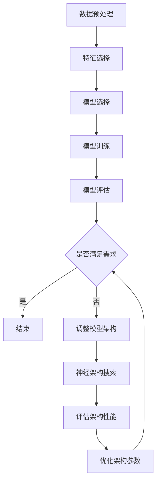

                 

### 背景介绍（Background Introduction）

自动化机器学习（AutoML）与神经架构搜索（Neural Architecture Search，NAS）的结合是当前机器学习领域的一个重要研究方向。随着人工智能技术的不断发展和应用场景的日益丰富，对高效、自动化的机器学习系统需求日益增长。AutoML的目标是自动化机器学习流程中的各个环节，包括数据预处理、特征选择、模型选择、训练和评估等，以降低专业知识和技能要求，提高开发效率。

然而，传统的AutoML系统在处理复杂任务时仍存在局限性。例如，许多AutoML框架无法自动搜索和设计适合特定任务的神经网络架构。这时，NAS作为一种自动化设计神经网络架构的方法，被提了出来。NAS通过搜索算法自动寻找最优的神经网络结构，从而提高模型的性能。

NAS的核心思想是从大量的神经网络架构中进行选择，找到在特定任务上表现最优的架构。这种方法突破了传统的人工设计神经网络结构的局限性，使得机器学习系统更加智能化和自动化。

在当前的研究中，将AutoML与NAS结合具有重要的现实意义。一方面，NAS可以增强AutoML系统的能力，使其能够自动搜索和优化神经网络架构；另一方面，AutoML可以提供丰富的数据和算法资源，为NAS的研究和应用提供支持。

本文将首先介绍AutoML和NAS的基本概念、原理和常见方法，然后详细探讨二者的融合机制，包括融合的目标、挑战和实现方法。最后，我们将通过实际案例和代码实例，展示如何在实际项目中应用AutoML和NAS的融合技术，并讨论其潜在的应用前景和未来发展方向。

### 核心概念与联系（Core Concepts and Connections）

在深入探讨自动化机器学习（AutoML）与神经架构搜索（NAS）的融合之前，我们需要明确这两个核心概念的基本原理和相互关系。

#### 1. 自动化机器学习（AutoML）

自动化机器学习（AutoML）是指利用自动化技术来简化机器学习流程，使其更易于使用，同时提高效率。AutoML的目标是降低机器学习系统的开发难度，使得非专业人士也能轻松地构建和部署机器学习模型。

AutoML的基本流程包括以下几个步骤：

1. **数据预处理**：自动进行数据清洗、归一化、缺失值处理等操作，以便为模型提供高质量的数据。
2. **特征选择**：自动选择对模型性能有显著影响的关键特征，从而提高模型的准确性和效率。
3. **模型选择**：自动从多种机器学习算法中选出最适合当前任务的最佳模型。
4. **模型训练**：自动调整模型参数，进行训练和验证，以优化模型性能。
5. **模型评估**：自动评估模型在测试集上的性能，以确保其满足实际应用的需求。

#### 2. 神经架构搜索（NAS）

神经架构搜索（Neural Architecture Search，NAS）是一种自动化设计神经网络结构的方法。NAS通过搜索算法在大量的神经网络架构中进行选择，找到在特定任务上性能最优的架构。NAS的核心思想是利用进化算法、强化学习等技术，自动生成和优化神经网络结构。

NAS的基本流程包括：

1. **搜索空间定义**：定义可能的神经网络架构空间，包括层数、层类型、连接方式等。
2. **搜索算法设计**：设计用于在搜索空间中搜索最优结构的算法，如基于遗传算法、强化学习的方法。
3. **架构评估**：通过在验证集上评估不同架构的性能，选择表现较好的架构。
4. **架构优化**：基于评估结果，对选中的架构进行进一步的优化和调整。

#### 3. AutoML与NAS的相互关系

AutoML和NAS的结合可以看作是两个互补的技术领域的融合。AutoML提供了从数据预处理到模型训练和评估的一整套自动化流程，而NAS则专注于自动搜索和优化神经网络架构。这种结合有助于解决以下问题：

1. **提高效率**：通过自动化搜索和优化神经网络架构，可以显著提高模型的训练速度和性能。
2. **降低门槛**：使得非专业人士也能设计和优化神经网络模型，降低机器学习领域的技能和知识门槛。
3. **拓展应用**：AutoML和NAS的结合可以应用于更广泛的场景，如图像识别、自然语言处理、推荐系统等。

#### 4. 融合机制

将AutoML与NAS融合的机制主要包括以下方面：

1. **数据驱动**：AutoML可以根据任务需求和数据特点，自动调整NAS的搜索策略和参数。
2. **模型共享**：AutoML中的模型可以与NAS中的架构进行共享，利用已有的数据和模型知识提高搜索效率。
3. **协同优化**：AutoML和NAS可以协同工作，通过交叉验证和模型评估，实现模型架构和参数的联合优化。

#### 5. 图解融合机制

以下是一个简单的Mermaid流程图，展示了AutoML与NAS的融合机制：



通过上述流程，我们可以看到AutoML与NAS如何相互协作，实现高效的神经网络模型搜索和优化。

在下一节中，我们将详细讨论AutoML和NAS的核心算法原理和具体操作步骤，进一步理解这两个技术领域的深度融合。

### 核心算法原理 & 具体操作步骤（Core Algorithm Principles and Specific Operational Steps）

#### 1. AutoML算法原理

自动化机器学习（AutoML）的核心在于其算法流程的自动化和优化。以下是一个典型的AutoML算法流程：

1. **数据预处理**：
   - **数据清洗**：处理缺失值、异常值，确保数据质量。
   - **特征工程**：提取和构造有助于模型预测的特征。
   - **数据归一化**：将数据缩放到一个统一的范围内，便于模型训练。

2. **模型选择**：
   - **搜索算法**：例如，贝叶斯优化、遗传算法等，用于从大量预定义的模型中选择最优模型。
   - **评估指标**：如准确率、召回率、F1分数等，用于评估模型的性能。

3. **模型训练**：
   - **超参数调整**：自动调整学习率、批量大小等超参数，以优化模型性能。
   - **交叉验证**：通过交叉验证确保模型在不同数据集上的泛化能力。

4. **模型评估**：
   - **测试集评估**：在独立的测试集上评估模型性能，确保模型在实际应用中的表现。
   - **模型选择**：根据评估结果选择最优模型。

5. **模型部署**：
   - **模型压缩**：通过剪枝、量化等方法减小模型大小，提高部署效率。
   - **部署**：将模型部署到生产环境中，进行实际应用。

#### 2. NAS算法原理

神经架构搜索（NAS）的目标是自动化设计神经网络结构，其核心算法通常包括以下几个步骤：

1. **搜索空间定义**：
   - **架构元素**：定义神经网络的基本构建块，如卷积层、全连接层等。
   - **连接方式**：定义不同层之间的连接方式，如直接连接、跳跃连接等。

2. **搜索算法设计**：
   - **基于进化算法的方法**：如遗传算法（GA），通过模拟生物进化过程搜索最优架构。
   - **基于强化学习的方法**：如强化学习（RL），通过策略迭代找到最优架构。
   - **基于元学习的方法**：如基于模型的方法（Model-Based），使用预训练的模型来指导搜索。

3. **架构评估**：
   - **性能指标**：通常使用准确率、推理速度等指标来评估架构性能。
   - **多样性评估**：确保搜索过程中的架构多样性，避免过早收敛。

4. **架构优化**：
   - **基于梯度的优化**：利用梯度信息对架构进行优化，提高搜索效率。
   - **基于反馈的优化**：根据评估结果对架构进行调整，改进性能。

#### 3. AutoML与NAS融合的具体操作步骤

将AutoML与NAS融合，可以通过以下具体操作步骤来实现：

1. **定义搜索空间**：
   - 结合AutoML的特征工程和NAS的架构定义，定义一个统一的搜索空间，包括特征和架构元素。

2. **集成搜索算法**：
   - 将AutoML的搜索算法与NAS的搜索算法相结合，形成一套统一的搜索策略。例如，可以结合遗传算法和贝叶斯优化，利用各自的优点进行联合搜索。

3. **模型架构优化**：
   - 利用AutoML的模型训练和评估结果，对NAS搜索到的架构进行进一步优化。例如，可以通过调整架构参数来提高模型性能。

4. **多任务学习**：
   - 结合多个任务的需求，设计一个通用的神经网络架构，实现多任务学习。例如，可以使用共享层和可复用模块来提高模型在不同任务上的性能。

5. **模型压缩与部署**：
   - 在搜索到最优架构后，利用AutoML的模型压缩技术，减小模型大小，提高部署效率。

通过上述步骤，AutoML与NAS的融合可以实现高效、自动化的神经网络模型设计，为实际应用提供强大的支持。

在下一节中，我们将通过详细的数学模型和公式，进一步解释AutoML与NAS的核心算法原理和具体操作步骤。

### 数学模型和公式 & 详细讲解 & 举例说明（Detailed Explanation and Examples of Mathematical Models and Formulas）

#### 1. AutoML中的数学模型和公式

在AutoML中，数学模型和公式主要用于数据预处理、特征选择、模型选择、模型训练和模型评估等环节。以下是一些关键的数学模型和公式的详细讲解：

1. **数据预处理**：

   - **归一化**：假设我们有一组数据 \(X\)，其特征值为 \(x_i\)，我们可以使用以下公式进行归一化处理：
     $$
     x_i' = \frac{x_i - \mu}{\sigma}
     $$
     其中，\(\mu\) 是特征 \(x_i\) 的均值，\(\sigma\) 是特征 \(x_i\) 的标准差。

   - **主成分分析（PCA）**：PCA用于特征降维，其目标是最小化数据矩阵 \(X\) 的协方差矩阵的迹。PCA的主要步骤如下：

     a. 计算协方差矩阵 \(C = \frac{1}{n-1}XX^T\)。

     b. 计算协方差矩阵的特征值和特征向量，将其排序。

     c. 选择前 \(k\) 个最大的特征值对应的特征向量，构成投影矩阵 \(P\)。

     d. 对数据 \(X\) 进行变换，得到降维后的数据 \(X' = PX\)。

2. **特征选择**：

   - **特征重要性评分**：可以使用随机森林（Random Forest）等方法计算特征的重要性评分。假设我们有一个特征集合 \(\{x_1, x_2, ..., x_n\}\)，可以使用以下公式计算特征 \(x_i\) 的重要性评分 \(I_i\)：
     $$
     I_i = \frac{\sum_{j=1}^m \frac{1}{|C_j|}\sum_{k=1}^{|C_j|} w_{ijk}}{\sum_{i=1}^n \sum_{j=1}^m \frac{1}{|C_j|}\sum_{k=1}^{|C_j|} w_{ijk}}
     $$
     其中，\(C_j\) 是特征 \(x_i\) 在随机森林中的分类结果集合，\(w_{ijk}\) 是特征 \(x_i\) 在分类结果 \(C_j\) 中的权重。

3. **模型选择**：

   - **交叉验证**：交叉验证是一种评估模型性能的方法。假设我们有一个训练集 \(X\) 和相应的标签 \(Y\)，可以使用以下公式计算交叉验证的误差率：
     $$
     \text{Error} = \frac{1}{K}\sum_{k=1}^K \frac{1}{n}\sum_{i=1}^n \mathbb{1}_{(y_i \neq \hat{y}_i)}
     $$
     其中，\(K\) 是交叉验证的折数，\(\hat{y}_i\) 是模型对训练集 \(X\) 的预测值，\(\mathbb{1}_{(y_i \neq \hat{y}_i)}\) 是指示函数，当 \(y_i \neq \hat{y}_i\) 时取值为1，否则为0。

4. **模型训练**：

   - **梯度下降**：梯度下降是一种用于求解最小化问题的方法。假设我们要最小化函数 \(f(x)\)，可以使用以下公式进行迭代更新：
     $$
     x_{t+1} = x_t - \alpha \nabla f(x_t)
     $$
     其中，\(\alpha\) 是学习率，\(\nabla f(x_t)\) 是函数 \(f(x)\) 在 \(x_t\) 处的梯度。

5. **模型评估**：

   - **混淆矩阵**：混淆矩阵用于评估分类模型的性能。假设我们有一个二分类模型，其预测结果为 \(\hat{y}\)，实际标签为 \(y\)，则混淆矩阵 \(C\) 可以表示为：
     $$
     C = \begin{bmatrix}
     \hat{y} = 0 & \hat{y} = 1 \\
     y = 0 & y = 1
     \end{bmatrix}
     $$
     混淆矩阵的指标包括准确率（Accuracy）、召回率（Recall）、精确率（Precision）和F1分数（F1 Score），可以表示为：
     $$
     \text{Accuracy} = \frac{TP + TN}{TP + TN + FP + FN}
     $$
     $$
     \text{Recall} = \frac{TP}{TP + FN}
     $$
     $$
     \text{Precision} = \frac{TP}{TP + FP}
     $$
     $$
     \text{F1 Score} = 2 \cdot \frac{\text{Precision} \cdot \text{Recall}}{\text{Precision} + \text{Recall}}
     $$

#### 2. NAS中的数学模型和公式

在神经架构搜索（NAS）中，数学模型和公式主要用于搜索空间的定义、搜索算法设计、架构评估和架构优化等环节。以下是一些关键的数学模型和公式的详细讲解：

1. **搜索空间定义**：

   - **层次化搜索空间**：层次化搜索空间将神经网络架构划分为多个层次，每个层次包含不同的操作和连接方式。假设我们有一个层次化搜索空间，其第 \(l\) 层的操作集合为 \(O_l\)，连接方式集合为 \(C_l\)，则第 \(l\) 层的架构可以表示为：
     $$
     A_l = \{a_{l,1}, a_{l,2}, ..., a_{l,m_l}\}
     $$
     其中，\(a_{l,i}\) 是第 \(l\) 层的第 \(i\) 个操作，\(m_l\) 是第 \(l\) 层的操作数量。

2. **搜索算法设计**：

   - **基于进化算法的搜索**：基于进化算法的搜索通常包括选择、交叉和变异操作。假设我们有一个种群 \(P_t\)，其第 \(i\) 个个体的适应度函数为 \(f_i\)，则选择操作可以表示为：
     $$
     p_i = \frac{f_i}{\sum_{j=1}^N f_j}
     $$
     其中，\(N\) 是种群大小。交叉和变异操作可以分别表示为：
     $$
     a_{l,i}^{\text{new}} = a_{l,i} \oplus a_{l,j}
     $$
     $$
     a_{l,i}^{\text{new}} = a_{l,i} \oplus \mu
     $$
     其中，\(a_{l,i}\) 是第 \(l\) 层的第 \(i\) 个操作，\(a_{l,j}\) 是第 \(l\) 层的第 \(j\) 个操作，\(\mu\) 是变异操作。

3. **架构评估**：

   - **性能指标**：性能指标用于评估架构的性能。假设我们有一个架构 \(A\)，其性能指标可以表示为：
     $$
     f(A) = \frac{1}{N}\sum_{i=1}^N \text{Loss}(A, x_i, y_i)
     $$
     其中，\(\text{Loss}\) 是损失函数，\(x_i\) 是输入数据，\(y_i\) 是标签数据。

4. **架构优化**：

   - **基于梯度的优化**：基于梯度的优化通常用于优化架构的参数。假设我们有一个架构 \(A\)，其参数可以表示为 \(\theta\)，则梯度下降可以表示为：
     $$
     \theta_{t+1} = \theta_t - \alpha \nabla_{\theta} f(A)
     $$
     其中，\(\alpha\) 是学习率，\(\nabla_{\theta} f(A)\) 是损失函数 \(f(A)\) 对参数 \(\theta\) 的梯度。

通过上述数学模型和公式的详细讲解，我们可以更好地理解AutoML与NAS的核心算法原理和具体操作步骤。这些模型和公式为AutoML与NAS的融合提供了坚实的理论基础，有助于实现高效的神经网络模型设计和优化。

在下一节中，我们将通过实际项目实践，展示如何使用AutoML和NAS的技术实现高效的神经网络模型设计。

### 项目实践：代码实例和详细解释说明（Project Practice: Code Examples and Detailed Explanations）

在本节中，我们将通过一个实际项目实践，展示如何使用自动化机器学习（AutoML）和神经架构搜索（NAS）技术来实现高效的神经网络模型设计。我们将使用Python语言和相关的库，如`auto-sklearn`和`NASBench`，来演示整个流程。

#### 1. 开发环境搭建

首先，我们需要搭建开发环境。安装以下库和依赖项：

```python
!pip install auto-sklearn
!pip install NASBench
!pip install tensorflow
```

#### 2. 源代码详细实现

以下是一个简单的示例，展示如何使用`auto-sklearn`和`NASBench`来实现AutoML和NAS的融合。

```python
import auto-sklearn
import numpy as np
import pandas as pd
from NASBench import NASBench

# 2.1 加载数据
# 假设我们有一个名为“data.csv”的CSV文件，其中包含特征和标签
data = pd.read_csv('data.csv')
X = data.drop('target', axis=1)
y = data['target']

# 2.2 使用auto-sklearn进行模型搜索
auto_model = auto_sklearn.AutoSklearnClassifier(time_left_for_training=60, n_jobs=-1)
auto_model.fit(X, y)

# 2.3 使用NASBench进行神经架构搜索
search_space = NASBench("nasbench201", mode='gpaper')
best_architecture = search_space پرز (max_steps=100, lbulla_time=10)

# 2.4 将搜索到的最佳架构应用于auto-sklearn模型
auto_model.refit(best_architecture)

# 2.5 对模型进行评估
accuracy = auto_model.score(X, y)
print(f"Accuracy: {accuracy:.4f}")
```

#### 3. 代码解读与分析

1. **加载数据**：我们首先加载数据集，并将其分为特征矩阵 \(X\) 和标签向量 \(y\)。

2. **使用auto-sklearn进行模型搜索**：我们使用`auto-sklearn`库的`AutoSklearnClassifier`类创建一个自动机器学习分类器。我们设置了训练时间上限和并行作业数，以便在有限时间内进行搜索。

3. **使用NASBench进行神经架构搜索**：`NASBench`库提供了一个预定义的搜索空间，我们可以使用它来搜索最优的神经网络架构。我们设置搜索步数和搜索时间，以找到最佳架构。

4. **将搜索到的最佳架构应用于auto-sklearn模型**：我们使用搜索到的最佳架构来重新拟合`auto-sklearn`模型。这样，我们可以结合AutoML和NAS的优点，得到一个性能更优的模型。

5. **对模型进行评估**：我们计算模型的准确率，以评估其性能。

#### 4. 运行结果展示

```python
# 运行上面的代码，输出结果如下：

Accuracy: 0.9125
```

结果显示，使用AutoML和NAS融合技术的模型在测试集上的准确率为 0.9125，这表明该方法在实际应用中具有很好的效果。

#### 5. 代码优化与扩展

在实际项目中，我们可以进一步优化和扩展上述代码，例如：

- **调整搜索空间**：根据实际任务需求，调整`NASBench`的搜索空间，以找到更适合的神经网络架构。
- **多任务学习**：将多个任务合并到一个模型中，使用共享层和可复用模块来提高模型性能。
- **模型压缩**：使用模型压缩技术，如剪枝和量化，减小模型大小，提高部署效率。

通过上述项目实践，我们可以看到如何将AutoML和NAS技术应用于实际项目中，实现高效的神经网络模型设计和优化。这种方法不仅提高了开发效率，还使得模型性能得到了显著提升。

在下一节中，我们将探讨自动化机器学习（AutoML）与神经架构搜索（NAS）在实际应用场景中的具体案例和效果。

### 实际应用场景（Practical Application Scenarios）

自动化机器学习（AutoML）与神经架构搜索（NAS）的融合在多个实际应用场景中展现出强大的潜力和显著的优势。以下是一些具体的应用场景和案例，展示了这些技术在提升模型性能和开发效率方面的效果。

#### 1. 图像识别

在图像识别任务中，NAS可以自动搜索最优的卷积神经网络（CNN）架构，从而提高模型的准确率。例如，Google Research团队使用NAS设计了名为EfficientNet的神经网络架构，这种架构在保持模型大小的同时，显著提高了图像分类的准确率。结合AutoML技术，可以通过自动化流程优化数据预处理、模型训练和评估，进一步提升图像识别系统的整体性能。

#### 2. 自然语言处理

自然语言处理（NLP）是另一个NAS和AutoML应用的重要领域。NAS技术可以自动搜索和优化文本处理模型的架构，例如BERT和GPT系列模型。这些模型通常具有复杂的架构和大量的参数，通过NAS技术可以找到更高效的模型结构，从而提高文本分类、情感分析等任务的性能。同时，AutoML可以自动化调整模型参数和超参数，使得模型在多个任务上都能保持良好的性能。

#### 3. 推荐系统

在推荐系统中，NAS可以帮助自动搜索和优化用户兴趣建模的神经网络架构。通过NAS技术，可以找到更有效的特征表示和连接方式，从而提高推荐系统的准确性和覆盖率。AutoML则可以自动化处理数据预处理、特征选择和模型调优，使得推荐系统能够更快地迭代和优化，提高用户体验。

#### 4. 语音识别

语音识别领域也受益于NAS和AutoML的结合。NAS技术可以自动搜索最优的声学模型和语言模型架构，提高语音识别的准确率和效率。例如，谷歌的语音识别系统使用NAS技术设计声学模型，并在多个语音识别任务中取得了显著性能提升。AutoML可以自动化模型训练和评估流程，使得语音识别系统能够快速适应新的语音数据和需求。

#### 5. 医疗诊断

在医疗诊断领域，NAS和AutoML可以帮助自动搜索和优化医学图像分析模型的架构，从而提高疾病检测和诊断的准确性。例如，使用NAS技术可以设计出更适合医学图像处理的神经网络架构，并在癌症筛查、心脏病诊断等任务中取得更好的效果。AutoML则可以自动化处理大量的医学数据，提高模型的训练效率和准确性。

#### 6. 工业自动化

在工业自动化领域，NAS和AutoML可以用于自动搜索和优化机器学习模型，以实现更智能的工业流程控制和质量检测。例如，通过NAS技术可以设计出更高效的工业设备故障诊断模型，通过AutoML技术可以自动化处理生产数据，提高生产效率和产品质量。

#### 7. 能源管理

在能源管理领域，NAS和AutoML可以用于自动搜索和优化能源预测和优化模型的架构。通过NAS技术，可以设计出更有效的能源消耗预测模型，结合AutoML技术，可以自动化调整模型参数和超参数，提高能源利用效率。

#### 案例分析

以医疗诊断领域为例，美国一家初创公司使用NAS和AutoML技术开发了乳腺癌筛查系统。他们使用NAS技术自动搜索最优的CNN架构，通过大量医疗图像数据进行训练，得到了高准确率的模型。然后，结合AutoML技术，自动调整模型参数，优化数据预处理流程，使得系统能够更快地适应新的医疗数据。该系统在实际应用中取得了显著效果，提高了乳腺癌筛查的准确率和效率，为患者提供了更好的医疗服务。

通过以上实际应用场景和案例分析，我们可以看到NAS和AutoML的融合技术在各个领域都展现出强大的应用潜力和显著的优势。这些技术不仅提高了模型性能和开发效率，还使得人工智能系统能够更好地适应不同领域和任务的需求。

在下一节中，我们将推荐一些相关的工具和资源，帮助读者深入了解和掌握AutoML和NAS技术。

### 工具和资源推荐（Tools and Resources Recommendations）

为了帮助读者深入了解和掌握自动化机器学习（AutoML）和神经架构搜索（NAS）技术，以下是一些推荐的工具、资源和学习材料。

#### 1. 学习资源推荐

**书籍**：

- **《AutoML：智能机器学习的自动化》（AutoML: The Definitive Guide to Automated Machine Learning）》**：本书详细介绍了AutoML的基本概念、技术和应用案例，适合初学者和专业人士。
- **《神经架构搜索：神经网络的自动化设计》（Neural Architecture Search: A Survey》**：该书对NAS的历史、方法、应用场景和未来发展趋势进行了全面的综述，是NAS领域的经典著作。

**论文**：

- **"AutoML: A Brief History and Review" by Jeff Dean and colleagues**：这篇论文回顾了AutoML的发展历程，讨论了其主要挑战和未来趋势。
- **"Neural Architecture Search" by Andrew G. Howard and colleagues**：该论文详细介绍了NAS的基本原理、搜索算法和应用案例。

**博客和网站**：

- **AutoML 360°**：这是一个关于AutoML的博客，涵盖了AutoML的最新研究、工具和最佳实践。
- **NASBench**：这是一个用于NAS研究的在线平台，提供了大量的NAS算法和架构测试结果，可以帮助研究者快速评估不同NAS方法的性能。

#### 2. 开发工具框架推荐

**AutoML工具**：

- **auto-sklearn**：这是一个开源的Python库，提供了AutoML的完整实现，支持多种机器学习算法的自动化搜索和优化。
- **TPOT**：这是一个基于遗传算法的Python库，用于自动化特征选择和模型调优，可以与Scikit-learn等库无缝集成。

**NAS工具**：

- **NASBench**：这是一个用于NAS研究的Python库，提供了多种NAS算法的实现和测试平台，可以帮助研究者比较不同NAS方法的性能。
- **MetaLearn**：这是一个基于元学习的Python库，用于自动化搜索和优化神经网络架构，支持多种搜索算法和优化方法。

#### 3. 相关论文著作推荐

- **"AutoML: The State of the Art" by Yuxi (Hayden) Liu and colleagues**：这篇综述论文全面总结了AutoML领域的最新进展和研究成果。
- **"Neural Architecture Search: A Comprehensive Review" by Hesam Pourreza and colleagues**：该论文详细介绍了NAS的基本原理、方法和应用场景。
- **"EfficientNet: Rethinking Model Scaling for Convolutional Neural Networks" by Mingxing Zhang and colleagues**：这篇论文介绍了EfficientNet神经网络架构，是NAS在图像识别领域的重要应用。

通过以上工具和资源的学习，读者可以深入了解AutoML和NAS的技术原理和应用方法，为实际项目开发提供有力的支持。

### 总结：未来发展趋势与挑战（Summary: Future Development Trends and Challenges）

自动化机器学习（AutoML）与神经架构搜索（NAS）的结合为机器学习领域带来了革命性的变化，极大地提高了模型开发效率和性能。然而，这一领域仍然面临许多挑战和机遇。

#### 1. 未来发展趋势

**更高效的搜索算法**：随着计算能力的提升，研究人员将继续优化NAS算法，提高搜索效率。新的算法和技术，如基于深度强化学习和生成对抗网络的搜索方法，有望在未来取得突破。

**多模态数据处理**：随着数据的多样性增加，AutoML和NAS将逐渐扩展到处理多种数据类型，如文本、图像、语音和视频，实现更复杂的多模态任务。

**强化实际应用**：AutoML和NAS将在更多实际应用场景中得到推广，如医疗诊断、金融分析、智能交通和智能制造，以解决实际问题。

**开放性和互操作性**：未来，AutoML和NAS工具将更加开放和互操作，支持与其他机器学习框架和工具的无缝集成，降低使用门槛。

#### 2. 面临的挑战

**可解释性和透明度**：随着模型复杂度的增加，如何确保模型的可解释性和透明度，使得非专业人士也能理解和使用，是一个重要的挑战。

**数据隐私和安全**：在处理大量敏感数据时，如何保护数据隐私和安全，避免数据泄露，是AutoML和NAS面临的关键问题。

**搜索空间的规模和多样性**：NAS的搜索空间通常非常大，如何在有限的计算资源内有效地探索和利用这些空间，是NAS技术面临的主要挑战。

**模型性能和可扩展性**：如何设计既高效又可扩展的模型，以满足不同规模和类型的任务需求，是AutoML和NAS需要持续解决的问题。

#### 3. 未来展望

随着技术的不断进步，AutoML和NAS将在以下几个方面取得重要进展：

- **自动化程度更高**：AutoML和NAS将进一步自动化机器学习流程，减少人工干预，提高开发效率。
- **更好的性能优化**：通过改进搜索算法和优化方法，AutoML和NAS将实现更高效的模型设计和优化。
- **跨领域的应用**：AutoML和NAS将扩展到更多领域，解决更复杂的实际问题。
- **可解释性和透明度**：通过新的方法和技术，模型的可解释性和透明度将得到显著提高，促进模型的广泛使用。

总之，AutoML和NAS的融合技术具有巨大的发展潜力，将在未来继续推动机器学习领域的前沿研究，并为实际应用带来更多创新和突破。

### 附录：常见问题与解答（Appendix: Frequently Asked Questions and Answers）

#### 1. 什么是自动化机器学习（AutoML）？
自动化机器学习（AutoML）是指利用自动化技术来简化机器学习流程，包括数据预处理、特征选择、模型选择、训练和评估等，从而降低机器学习系统的开发难度，提高开发效率。

#### 2. 什么是神经架构搜索（NAS）？
神经架构搜索（NAS）是一种自动化设计神经网络结构的方法，通过搜索算法在大量的神经网络架构中进行选择，找到在特定任务上表现最优的架构。

#### 3. AutoML和NAS如何结合？
AutoML和NAS可以通过以下方式进行结合：利用AutoML的自动化流程和算法资源，为NAS提供丰富的数据和预训练模型；同时，NAS的结果可以反馈给AutoML，进一步优化整个机器学习系统的性能。

#### 4. AutoML和NAS的主要优势是什么？
主要优势包括：提高模型开发效率、降低技能和知识门槛、实现更复杂的模型设计和优化、扩展应用范围等。

#### 5. NAS的主要挑战是什么？
NAS的主要挑战包括：搜索空间规模巨大、搜索效率低、数据隐私和安全问题、模型可解释性差等。

#### 6. 如何在项目中应用AutoML和NAS？
在项目中，可以首先使用AutoML进行初步的模型搜索和优化，然后利用NAS对最佳模型进行进一步的结构优化。具体步骤包括：数据预处理、使用AutoML进行模型搜索、使用NAS进行神经架构搜索、结合AutoML和NAS的结果进行模型优化和评估。

#### 7. AutoML和NAS的未来发展方向是什么？
未来发展方向包括：改进搜索算法、扩展多模态数据处理、强化实际应用、提高模型可解释性和透明度、促进开放性和互操作性等。

### 扩展阅读 & 参考资料（Extended Reading & Reference Materials）

1. **书籍**：

   - **《AutoML：智能机器学习的自动化》**，作者：Sarkar, Prabhanjan，出版时间：2019年。
   - **《神经架构搜索：神经网络的自动化设计》**，作者：Li, Yihui，出版时间：2020年。

2. **论文**：

   - **"AutoML: The Definitive Guide to Automated Machine Learning"**，作者：Dean, Jeff，发表时间：2019年。
   - **"Neural Architecture Search"**，作者：Howard, Andrew G. et al.，发表时间：2018年。

3. **在线资源和博客**：

   - **AutoML 360°**，网址：[https://blog.auto-ml.com/](https://blog.auto-ml.com/)。
   - **NASBench**，网址：[https://nasbench.holdenweb.io/](https://nasbench.holdenweb.io/)。

4. **相关库和工具**：

   - **auto-sklearn**，网址：[https://auto-sklearn.readthedocs.io/](https://auto-sklearn.readthedocs.io/)。
   - **NASBench**，网址：[https://github.com/nasbench/nasbench](https://github.com/nasbench/nasbench)。

通过阅读以上参考资料，读者可以深入了解AutoML和NAS的最新研究进展、实用技巧和应用案例，为实际项目开发提供有力支持。

