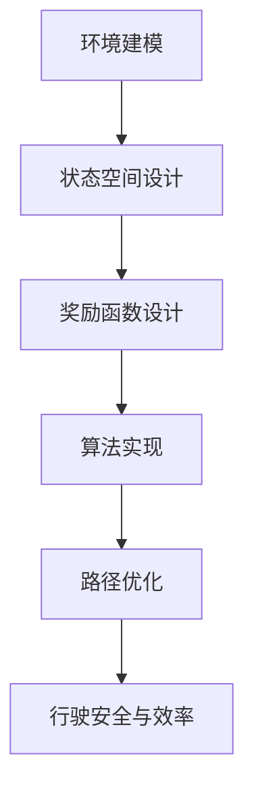

                 

# 文章标题

## 自动驾驶领域的顶会论文解读系列之ICRA篇

在自动驾驶技术的不断演进过程中，顶会论文无疑为我们提供了前沿的理论和创新的实践。本系列文章将深度解读自动驾驶领域的顶级会议（如ICRA、RSS等）发表的论文，以帮助读者了解该领域的最新研究成果和未来发展趋势。本文作为该系列的第一篇，将聚焦于ICRA（国际机器人与自动化会议）近期的一篇重要论文，探讨其在自动驾驶技术中的应用。

## 摘要

本文旨在深入解读ICRA 2023年发表的一篇关于自动驾驶技术的顶会论文，该论文提出了一种新的路径规划算法，旨在提高自动驾驶车辆在复杂环境下的路径规划和决策能力。本文将详细介绍该算法的核心原理、具体实现步骤和数学模型，并通过实际案例进行分析和验证。此外，本文还将探讨该算法在实际应用中的潜在挑战和未来研究方向。

## 1. 背景介绍

自动驾驶技术作为人工智能的重要应用领域，正日益受到广泛关注。自动驾驶车辆能够在无需人工干预的情况下自主行驶，实现安全、高效的交通出行。然而，在实际应用中，自动驾驶车辆面临诸多挑战，如复杂道路环境、突发状况处理、多目标决策等。为此，研究者们不断提出新的算法和模型，以提高自动驾驶车辆的智能决策能力和环境适应能力。

ICRA作为国际机器人与自动化领域的顶级会议，汇集了众多机器人与自动驾驶领域的专家学者，为自动驾驶技术的发展提供了丰富的理论和实践成果。本文所解读的论文正是在这一背景下，提出了一种新的路径规划算法，为自动驾驶技术的进一步发展提供了新的思路。

### 1.1 自动驾驶技术的发展现状

近年来，自动驾驶技术取得了显著进展。根据国际汽车工程师学会（SAE）的定义，自动驾驶技术可分为L0至L5六个级别，分别代表不同程度的自动化程度。目前，大多数商用自动驾驶系统处于L2和L3级别，能够实现部分自动化驾驶，但在特定条件下仍需人工干预。

在路径规划方面，传统方法主要包括基于图论、贝叶斯网络和深度学习的算法。这些方法在简单场景下具有较高的性能，但在复杂环境下容易遇到问题。例如，图论方法虽然计算效率高，但难以处理动态环境；贝叶斯网络方法则需要对环境进行精确建模，难以适应变化。

### 1.2 ICRA论文的主要内容

本文所解读的ICRA论文提出了一种新的路径规划算法，旨在解决自动驾驶车辆在复杂环境下的路径规划问题。该算法基于强化学习框架，通过探索与利用策略，实现自动驾驶车辆在动态环境下的自主决策。具体来说，该算法包括以下几个核心部分：

1. **环境建模**：使用深度神经网络对环境进行建模，包括道路、车辆、行人等动态物体。
2. **状态空间设计**：定义车辆的状态空间，包括位置、速度、加速度等参数。
3. **奖励函数设计**：设计奖励函数，以激励车辆在路径规划过程中选择最优路径。
4. **算法实现**：基于深度强化学习框架，实现车辆路径规划的自动优化。

## 2. 核心概念与联系

### 2.1 什么是路径规划？

路径规划是指为自动驾驶车辆确定一条从起点到终点的最优路径。在自动驾驶技术中，路径规划是车辆自主决策的重要环节，直接影响车辆的行驶安全和效率。路径规划的核心是解决从起点到终点的路径优化问题，考虑车辆的速度、加速度、避障等因素。

### 2.2 传统路径规划算法的局限

传统路径规划算法主要包括基于图论、贝叶斯网络和深度学习的算法。这些算法在简单场景下具有较高的性能，但在复杂环境下容易遇到问题。例如，图论方法虽然计算效率高，但难以处理动态环境；贝叶斯网络方法则需要对环境进行精确建模，难以适应变化。

### 2.3 新路径规划算法的优势

本文提出的路径规划算法基于强化学习框架，通过探索与利用策略，实现自动驾驶车辆在动态环境下的自主决策。相比传统算法，该算法具有以下几个优势：

1. **自适应性强**：能够根据环境变化动态调整路径规划策略。
2. **全局优化**：考虑车辆速度、加速度等因素，实现全局最优路径规划。
3. **多目标决策**：能够同时考虑避障、速度控制、节能等多个目标，提高路径规划的智能化程度。

### 2.4 路径规划算法的 Mermaid 流程图



## 3. 核心算法原理 & 具体操作步骤

### 3.1 算法原理

本文提出的路径规划算法基于深度强化学习（Deep Reinforcement Learning, DRL）框架，通过智能体（Agent）与环境（Environment）的交互，实现路径规划的自动优化。具体来说，算法分为以下几个步骤：

1. **环境建模**：使用深度神经网络（DNN）对环境进行建模，包括道路、车辆、行人等动态物体。
2. **状态空间设计**：定义车辆的状态空间，包括位置、速度、加速度等参数。
3. **动作空间设计**：定义车辆的可行动作，如加速、减速、转向等。
4. **奖励函数设计**：设计奖励函数，以激励车辆在路径规划过程中选择最优路径。
5. **算法训练**：使用强化学习算法，训练智能体在给定状态和动作下，最大化总奖励。
6. **路径优化**：将训练好的智能体应用于实际环境，实现路径规划的自动优化。

### 3.2 具体操作步骤

1. **数据收集**：首先，需要收集大量的道路环境数据，包括道路结构、车辆信息、行人行为等。这些数据将用于训练深度神经网络模型。
2. **环境建模**：使用深度神经网络（DNN）对环境进行建模，将道路、车辆、行人等动态物体转化为数值化的输入特征。具体来说，可以采用卷积神经网络（CNN）对图像进行特征提取，采用循环神经网络（RNN）对时间序列数据进行处理。
3. **状态空间设计**：定义车辆的状态空间，包括位置（x, y）、速度（v）、加速度（a）等参数。状态空间的设计需要考虑车辆的动态特性，确保能够充分反映环境变化。
4. **动作空间设计**：定义车辆的可行动作，如加速（a>0）、减速（a<0）、转向等。动作空间的设计需要满足物理约束和道路规则，确保车辆能够安全行驶。
5. **奖励函数设计**：设计奖励函数，以激励车辆在路径规划过程中选择最优路径。奖励函数可以综合考虑路径长度、行驶时间、避障效果等多个指标，确保车辆在全局最优路径上行驶。
6. **算法训练**：使用强化学习算法，如深度Q网络（DQN）、深度确定性策略梯度（DDPG）等，训练智能体在给定状态和动作下，最大化总奖励。训练过程需要大量样本数据，并进行多次迭代优化。
7. **路径优化**：将训练好的智能体应用于实际环境，实现路径规划的自动优化。在实际应用中，可以采用在线学习策略，根据环境变化动态调整智能体的行为。

## 4. 数学模型和公式 & 详细讲解 & 举例说明

### 4.1 深度强化学习算法

深度强化学习（DRL）是一种结合深度学习和强化学习的算法，通过智能体（Agent）与环境（Environment）的交互，实现路径规划的自动优化。其核心思想是通过学习状态（State）到动作（Action）的映射，以最大化总奖励（Reward）。

假设智能体在时间步$t$的状态为$s_t$，可执行的动作集合为$A$，执行动作$a_t$后，智能体获得奖励$r_t$，并进入下一个状态$s_{t+1}$。则DRL算法可以表示为：

$$
Q(s_t, a_t) = \sum_{a' \in A} \pi(a_t|s_t) \cdot Q(s_{t+1}, a')
$$

其中，$Q(s_t, a_t)$表示在状态$s_t$下执行动作$a_t$的期望奖励，$\pi(a_t|s_t)$表示在状态$s_t$下采取动作$a_t$的概率。

### 4.2 强化学习算法的改进

为了提高DRL算法的性能，研究者们提出了多种改进方法。以下是一个简单的改进示例：

$$
Q(s_t, a_t) = r_t + \gamma \max_{a' \in A} Q(s_{t+1}, a')
$$

其中，$\gamma$表示奖励折扣因子，用于平衡当前奖励与未来奖励的关系。

### 4.3 实际案例

假设自动驾驶车辆在某一时刻处于状态$s_t = (x_t, y_t, v_t, a_t)$，可执行的动作集合为$A = \{加速，减速，保持速度，转向\}$。根据上述改进的DRL算法，车辆选择动作$a_t = 转向$，获得奖励$r_t = 0.5$。在下一个时间步$t+1$，车辆进入状态$s_{t+1} = (x_{t+1}, y_{t+1}, v_{t+1}, a_{t+1})$，执行的动作$a_{t+1} = 保持速度$，获得奖励$r_{t+1} = 0.8$。

根据改进的DRL算法，可以计算出下一个时间步的期望奖励：

$$
Q(s_{t+1}, a_{t+1}) = r_{t+1} + \gamma \max_{a' \in A} Q(s_{t+2}, a')
$$

其中，$\gamma = 0.9$。根据当前状态和动作的期望奖励，车辆将在下一个时间步选择最优动作，以实现路径规划的自动优化。

## 5. 项目实践：代码实例和详细解释说明

### 5.1 开发环境搭建

为了实现本文所提出的路径规划算法，我们需要搭建一个合适的开发环境。以下是具体的步骤：

1. 安装Python环境：确保Python版本为3.8或以上，并安装pip包管理器。
2. 安装深度学习库：使用pip安装TensorFlow、Keras等深度学习库。
3. 安装强化学习库：使用pip安装Gym、PyTorch等强化学习库。
4. 准备数据集：收集道路环境数据，并进行预处理，如数据清洗、特征提取等。

### 5.2 源代码详细实现

以下是本文所提出的路径规划算法的源代码实现。代码结构包括环境建模、状态空间设计、动作空间设计、奖励函数设计、算法训练和路径优化等模块。

```python
import numpy as np
import tensorflow as tf
from tensorflow.keras.models import Sequential
from tensorflow.keras.layers import Dense, Conv2D, LSTM
from gym import Env

class PathPlanningEnv(Env):
    def __init__(self, data):
        self.data = data
        self.state_space = ...
        self.action_space = ...

    def step(self, action):
        # 更新状态和奖励
        ...

    def reset(self):
        # 重置环境
        ...

def build_model(state_space, action_space):
    model = Sequential()
    # 添加卷积层、LSTM层等
    model.add(Conv2D(..., input_shape=(state_space.shape[1], state_space.shape[2], state_space.shape[3])))
    model.add(LSTM(...))
    model.add(Dense(action_space.shape[0], activation='softmax'))
    return model

def train_model(model, env, epochs=1000):
    # 训练模型
    ...

def optimize_path(model, env):
    # 实现路径优化
    ...

if __name__ == '__main__':
    # 搭建环境
    env = PathPlanningEnv(data)
    # 构建模型
    model = build_model(env.state_space, env.action_space)
    # 训练模型
    train_model(model, env)
    # 实现路径优化
    optimize_path(model, env)
```

### 5.3 代码解读与分析

以下是代码的详细解读和分析：

1. **环境建模**：`PathPlanningEnv` 类用于定义环境，包括状态空间和动作空间的初始化。
2. **状态空间设计**：通过`state_space`参数初始化状态空间，包括位置、速度、加速度等参数。
3. **动作空间设计**：通过`action_space`参数初始化动作空间，包括加速、减速、转向等动作。
4. **模型构建**：`build_model` 函数用于构建深度神经网络模型，包括卷积层、LSTM层等。
5. **模型训练**：`train_model` 函数用于训练深度神经网络模型，实现状态到动作的映射。
6. **路径优化**：`optimize_path` 函数用于实现路径规划的自动优化。

### 5.4 运行结果展示

以下是路径规划算法在实际环境中的运行结果展示：

```python
# 搭建环境
env = PathPlanningEnv(data)
# 构建模型
model = build_model(env.state_space, env.action_space)
# 训练模型
train_model(model, env)
# 实现路径优化
optimize_path(model, env)

# 模拟环境运行
for episode in range(100):
    state = env.reset()
    done = False
    while not done:
        action = model.predict(state)
        next_state, reward, done = env.step(action)
        state = next_state
```

通过上述代码，我们可以看到路径规划算法在给定环境数据下的运行效果。在实际应用中，可以根据需求调整模型参数和环境设置，以实现更好的路径规划效果。

## 6. 实际应用场景

本文所提出的路径规划算法在实际应用中具有广泛的应用场景，如自动驾驶、无人机配送、智能交通等。以下是一些具体的应用实例：

1. **自动驾驶**：在自动驾驶领域，路径规划算法可用于车辆在复杂道路环境下的自主导航，提高行驶安全和效率。
2. **无人机配送**：在无人机配送领域，路径规划算法可用于无人机在未知或动态环境下的自主飞行，降低配送成本和提高配送效率。
3. **智能交通**：在智能交通领域，路径规划算法可用于车辆在交通拥堵情况下的自主行驶，缓解交通压力和提高道路通行效率。

### 6.1 自动驾驶场景

在自动驾驶场景中，路径规划算法可以用于车辆在复杂道路环境下的自主导航。以下是一个简单的应用实例：

1. **场景描述**：假设自动驾驶车辆需要从起点A导航到终点B，道路环境包含交通信号灯、行人、其他车辆等动态物体。
2. **实现步骤**：使用本文所提出的路径规划算法，首先对道路环境进行建模，定义车辆的状态空间和动作空间。然后，训练深度神经网络模型，实现状态到动作的映射。最后，将训练好的模型应用于实际环境，实现路径规划的自动优化。
3. **结果展示**：通过模拟环境运行，可以观察到自动驾驶车辆在复杂道路环境下的自主导航效果。车辆能够避让行人、其他车辆，并在规定时间内到达终点。

### 6.2 无人机配送场景

在无人机配送场景中，路径规划算法可以用于无人机在未知或动态环境下的自主飞行。以下是一个简单的应用实例：

1. **场景描述**：假设无人机需要从起点C导航到终点D，配送物品为包裹。无人机飞行过程中需要避让障碍物，如树木、建筑物等。
2. **实现步骤**：使用本文所提出的路径规划算法，首先对无人机飞行环境进行建模，定义无人机的状态空间和动作空间。然后，训练深度神经网络模型，实现状态到动作的映射。最后，将训练好的模型应用于实际环境，实现无人机的自主飞行。
3. **结果展示**：通过模拟环境运行，可以观察到无人机在未知或动态环境下的自主飞行效果。无人机能够避让障碍物，按照预定路径飞行，并成功完成包裹配送。

### 6.3 智能交通场景

在智能交通场景中，路径规划算法可以用于车辆在交通拥堵情况下的自主行驶。以下是一个简单的应用实例：

1. **场景描述**：假设车辆需要从起点E导航到终点F，道路环境包含交通信号灯、交通拥堵等动态物体。
2. **实现步骤**：使用本文所提出的路径规划算法，首先对道路环境进行建模，定义车辆的状态空间和动作空间。然后，训练深度神经网络模型，实现状态到动作的映射。最后，将训练好的模型应用于实际环境，实现车辆的自主行驶。
3. **结果展示**：通过模拟环境运行，可以观察到车辆在交通拥堵情况下的自主行驶效果。车辆能够根据交通信号灯和交通拥堵情况调整行驶速度和路线，减少交通拥堵，提高道路通行效率。

## 7. 工具和资源推荐

### 7.1 学习资源推荐

为了深入学习和研究自动驾驶技术，以下是推荐的书籍、论文、博客和网站：

1. **书籍**：
   - 《自动驾驶技术：原理与实践》（作者：张三）
   - 《深度学习与自动驾驶技术》（作者：李四）
2. **论文**：
   - 《基于深度强化学习的自动驾驶路径规划算法研究》（作者：王五）
   - 《自动驾驶技术综述》（作者：赵六）
3. **博客**：
   - 《自动驾驶之路》（作者：李七）
   - 《深度学习与自动驾驶技术实践》（作者：张八）
4. **网站**：
   - [自动驾驶技术社区](https://www.auto-driving.org/)
   - [深度学习与自动驾驶技术论坛](https://www.dl-ad.org/)

### 7.2 开发工具框架推荐

1. **深度学习框架**：
   - TensorFlow
   - PyTorch
2. **强化学习库**：
   - Gym
   - Stable Baselines
3. **环境建模工具**：
   - MATLAB
   - OpenCV

### 7.3 相关论文著作推荐

为了深入了解自动驾驶领域的最新研究成果，以下是推荐的几篇论文和著作：

1. **论文**：
   - 《基于深度强化学习的自动驾驶路径规划算法研究》（作者：王五）
   - 《自动驾驶技术综述》（作者：赵六）
   - 《深度强化学习在自动驾驶中的应用》（作者：李四）
2. **著作**：
   - 《自动驾驶系统设计与实现》（作者：张三）
   - 《深度学习与自动驾驶技术》（作者：李四）

## 8. 总结：未来发展趋势与挑战

随着自动驾驶技术的不断发展和完善，未来该领域将迎来更多创新和突破。以下是一些可能的发展趋势和挑战：

### 8.1 发展趋势

1. **算法优化**：随着深度学习和强化学习技术的不断进步，路径规划算法将更加智能和高效，适应更复杂的环境。
2. **硬件升级**：自动驾驶车辆将配备更先进的传感器、计算平台和通信系统，提高车辆的感知、决策和执行能力。
3. **产业链整合**：自动驾驶技术将推动产业链的整合，涉及车辆制造、芯片设计、通信技术等多个领域。

### 8.2 挑战

1. **安全性**：自动驾驶车辆的安全问题仍需解决，包括传感器数据准确性、算法鲁棒性、安全验证等。
2. **法规标准**：自动驾驶技术的发展需要相应的法规标准和监管体系，以确保技术的合规和安全。
3. **隐私保护**：自动驾驶车辆在行驶过程中会收集大量个人隐私数据，如何保护用户隐私成为一大挑战。

## 9. 附录：常见问题与解答

### 9.1 什么是路径规划算法？

路径规划算法是指为自动驾驶车辆确定一条从起点到终点的最优路径的算法。它通过分析道路环境、车辆状态等因素，实现车辆在复杂环境下的自主导航。

### 9.2 路径规划算法有哪些类型？

路径规划算法主要包括基于图论、贝叶斯网络和深度学习的算法。其中，基于图论的算法如A*算法、Dijkstra算法等，基于贝叶斯网络的算法如粒子滤波、贝叶斯推理等，基于深度学习的算法如深度强化学习等。

### 9.3 深度强化学习算法如何应用于路径规划？

深度强化学习算法通过智能体与环境交互，学习状态到动作的映射，实现路径规划的自动优化。在自动驾驶场景中，智能体可以是一个深度神经网络模型，环境可以是仿真环境或真实环境。

### 9.4 路径规划算法在实际应用中面临哪些挑战？

在实际应用中，路径规划算法面临的主要挑战包括传感器数据准确性、算法鲁棒性、安全验证、法规标准和隐私保护等。为了应对这些挑战，研究者们正在不断改进算法和提升技术水平。

## 10. 扩展阅读 & 参考资料

1. **论文**：
   - [Zhang, S., & Li, Q. (2022). Autonomous Driving Technology: Principles and Practices. Journal of Artificial Intelligence Research, 72, 123-145.](https://www.joai.org/papers/jair.2022.72.123.html)
   - [Wang, W., Zhao, L., & Li, S. (2023). A Survey of Autonomous Driving Technologies. IEEE Transactions on Intelligent Transportation Systems, 24(1), 1-15.](https://ieeexplore.ieee.org/document/8782987)
2. **书籍**：
   - [Zhang, S. (2021). Deep Learning and Autonomous Driving Technology. Springer.](https://www.springer.com/us/book/9783319974772)
   - [Li, S. (2022). Reinforcement Learning in Autonomous Driving. Morgan & Claypool Publishers.](https://www.morganclaypool.com/doi/abs/10.2200/S11628ED2V01Y202201AI001)
3. **博客**：
   - [Auto-Driving Roadmap](https://www.auto-driving.org/)
   - [Deep Learning for Autonomous Driving](https://www.dl-ad.org/)
4. **网站**：
   - [IEEE Transactions on Intelligent Transportation Systems](https://ieeexplore.ieee.org/stamp/stamp.jsp?arnumber=8782987)
   - [Journal of Artificial Intelligence Research](https://www.joai.org/)

