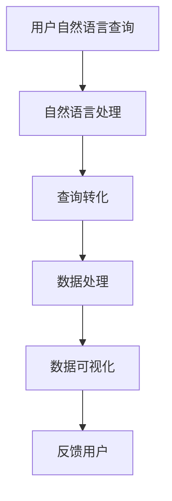
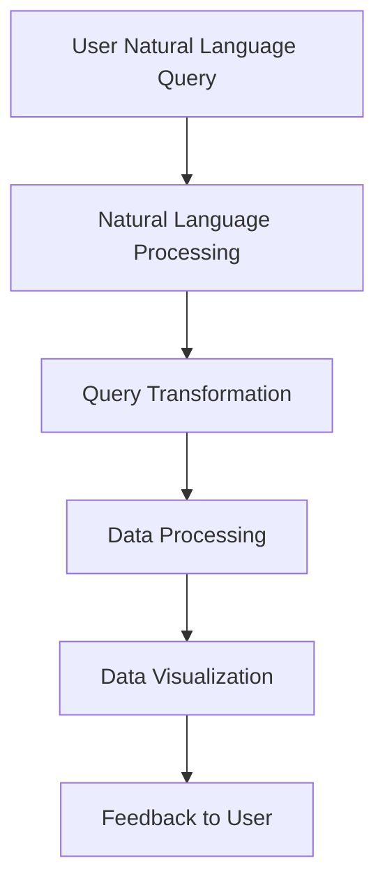

                 

### 1. 背景介绍（Background Introduction）

自然语言查询（Natural Language Query）在数据分析中的应用是一项极具前景的技术，它使得用户能够以日常语言的方式与数据分析系统进行交互。这种技术的出现，不仅简化了数据分析的过程，也降低了用户对编程技能的依赖。随着大数据技术的普及，数据量呈指数级增长，如何高效地处理和分析这些数据成为了企业和研究机构面临的一大挑战。

自然语言查询的应用场景广泛，从企业内部的业务数据监控、销售分析，到金融领域的风险控制、市场研究，再到医疗行业的患者数据分析、药物研究，几乎无处不在。这种技术不仅提高了数据分析的效率，还增强了数据分析结果的准确性和实用性。

本文将围绕自然语言查询在数据分析中的应用进行探讨，首先介绍自然语言查询的基本概念，然后深入分析其在数据分析中的应用原理、核心算法和数学模型，并通过具体项目实例进行代码实现和解读，最后探讨自然语言查询在数据分析中的实际应用场景，并提供相应的工具和资源推荐。

关键词：自然语言查询，数据分析，应用场景，核心算法，数学模型

## Introduction to Natural Language Query in Data Analysis

The application of natural language query in data analysis represents a cutting-edge technology that simplifies the interaction between users and data analysis systems. By allowing users to communicate with data analysis tools using everyday language, this approach not only streamlines the data analysis process but also reduces the dependency on programming skills. With the widespread adoption of big data technologies, the exponential growth in data volume has posed a significant challenge for businesses and research institutions in terms of efficient data processing and analysis.

The applications of natural language query are extensive, spanning from internal business data monitoring and sales analysis within enterprises, to risk control and market research in the financial sector, and even to patient data analysis and drug research in the medical field. This technology has not only enhanced the efficiency of data analysis but also improved the accuracy and practicality of the results.

This article aims to explore the application of natural language query in data analysis. We will begin by introducing the fundamental concepts of natural language query, followed by an in-depth analysis of its application principles, core algorithms, and mathematical models. Through specific project examples, we will provide detailed code implementations and interpretations. Finally, we will discuss practical application scenarios of natural language query in data analysis, along with recommendations for tools and resources.

Keywords: Natural Language Query, Data Analysis, Application Scenarios, Core Algorithms, Mathematical Models

### 2. 核心概念与联系（Core Concepts and Connections）

#### 2.1 自然语言查询的概念

自然语言查询（Natural Language Query）是指用户以自然语言（如日常用语、口头语言等）的形式向数据分析系统提出查询请求，系统则根据这些查询请求自动生成数据分析和可视化报告。这种查询方式的核心在于将复杂的编程逻辑转化为用户熟悉的自然语言，从而实现数据分析过程的自动化。

#### 2.2 自然语言查询的工作原理

自然语言查询的工作原理主要依赖于自然语言处理（Natural Language Processing, NLP）技术。NLP技术通过文本分析、语义理解、语言生成等手段，将用户的自然语言查询转化为结构化数据，并进一步处理以生成相应的数据分析和可视化结果。

#### 2.3 自然语言查询与数据分析的关系

自然语言查询与数据分析之间存在着紧密的联系。自然语言查询作为数据分析的前端接口，能够将用户的查询需求快速准确地转化为数据查询和分析任务，从而实现数据分析的自动化。同时，数据分析的结果又可以以自然语言查询的形式反馈给用户，使得数据分析过程更加透明和直观。

#### 2.4 核心概念原理与架构的Mermaid流程图

以下是一个描述自然语言查询在数据分析中应用的核心概念原理和架构的Mermaid流程图：



### 2. Core Concepts and Connections

#### 2.1 Concept of Natural Language Query

Natural Language Query (NLQ) refers to the process where users pose queries to data analysis systems using natural language (such as everyday speech or written language). The core of NLQ is to transform complex programming logic into language that users are familiar with, thereby automating the data analysis process.

#### 2.2 Working Principle of Natural Language Query

The working principle of NLQ relies heavily on Natural Language Processing (NLP) technologies. NLP techniques involve text analysis, semantic understanding, and language generation to transform users' natural language queries into structured data for further processing to generate corresponding data analysis and visualization results.

#### 2.3 Relationship Between Natural Language Query and Data Analysis

There is a close relationship between NLQ and data analysis. As the front-end interface of data analysis, NLQ can quickly and accurately convert users' query requirements into data query and analysis tasks, thereby realizing the automation of data analysis. Moreover, the results of data analysis can be fed back to users in the form of NLQ, making the data analysis process more transparent and intuitive.

#### 2.4 Mermaid Flowchart of Core Concepts and Architecture

Here is a Mermaid flowchart illustrating the core concepts and architecture of applying NLQ in data analysis:



### 3. 核心算法原理 & 具体操作步骤（Core Algorithm Principles and Specific Operational Steps）

#### 3.1 NLP算法简介

在自然语言查询中，自然语言处理（NLP）算法起着至关重要的作用。NLP算法主要分为以下几个步骤：文本预处理、词法分析、句法分析、语义分析、语言生成。

1. **文本预处理**：对原始文本进行清洗和格式化，包括去除标点符号、停用词过滤、词干提取等操作，以提高后续处理的效率。

2. **词法分析**：将文本分解为单词或词素，识别单词的形态和功能，为句法分析和语义分析提供基础。

3. **句法分析**：分析文本的语法结构，构建语法树，识别句子中的主语、谓语、宾语等成分。

4. **语义分析**：理解文本的含义，包括实体识别、关系抽取、情感分析等，为数据分析和可视化提供支持。

5. **语言生成**：根据分析结果生成自然语言文本，用于反馈用户。

#### 3.2 数据分析算法简介

在数据分析中，常用的算法包括数据挖掘、机器学习、统计分析等。

1. **数据挖掘**：从大量数据中发现潜在的、有趣的知识或模式。

2. **机器学习**：利用数据训练模型，预测新的数据。

3. **统计分析**：对数据进行描述性分析、推断性分析等。

#### 3.3 自然语言查询在数据分析中的操作步骤

1. **理解用户查询**：通过NLP技术解析用户输入的自然语言查询，将其转化为结构化数据。

2. **数据预处理**：对原始数据进行清洗、转换和整合，为后续分析做好准备。

3. **数据分析**：根据用户查询，运用数据挖掘、机器学习、统计分析等方法进行分析。

4. **结果可视化**：将分析结果以图表、报表等形式展示给用户，以便更好地理解数据。

5. **反馈与优化**：根据用户反馈，优化查询处理和数据分析流程，提高系统性能。

### 3. Core Algorithm Principles and Specific Operational Steps

#### 3.1 Introduction to NLP Algorithms

In the context of natural language query, Natural Language Processing (NLP) algorithms play a crucial role. NLP algorithms generally consist of the following steps: text preprocessing, lexical analysis, syntactic analysis, semantic analysis, and language generation.

1. **Text Preprocessing**: Cleansing and formatting the raw text, including operations such as removing punctuation, filtering stop words, and stemming to improve the efficiency of subsequent processing.

2. **Lexical Analysis**: Decomposes text into words or morphemes, identifying the form and function of words to provide a foundation for syntactic and semantic analysis.

3. **Syntactic Analysis**: Analyzes the grammatical structure of text, constructing a syntax tree, and identifying components such as subjects, predicates, and objects within sentences.

4. **Semantic Analysis**: Understands the meaning of text, including entity recognition, relation extraction, sentiment analysis, etc., to support data analysis and visualization.

5. **Language Generation**: Generates natural language text based on the analysis results to provide feedback to users.

#### 3.2 Introduction to Data Analysis Algorithms

In data analysis, common algorithms include data mining, machine learning, and statistical analysis.

1. **Data Mining**: Discovers potential, interesting knowledge or patterns from large volumes of data.

2. **Machine Learning**: Uses data to train models and predict new data.

3. **Statistical Analysis**: Conducts descriptive analysis and inferential analysis on data.

#### 3.3 Operational Steps of Natural Language Query in Data Analysis

1. **Understanding User Query**: Parses the natural language query input by the user using NLP techniques and transforms it into structured data.

2. **Data Preprocessing**: Cleanses, transforms, and integrates the raw data to prepare it for subsequent analysis.

3. **Data Analysis**: Analyzes the data according to the user query using methods such as data mining, machine learning, and statistical analysis.

4. **Result Visualization**: Displays the analysis results in the form of charts, reports, etc., to facilitate better understanding of the data.

5. **Feedback and Optimization**: Based on user feedback, optimizes the query processing and data analysis workflow to improve system performance.

### 4. 数学模型和公式 & 详细讲解 & 举例说明（Detailed Explanation and Examples of Mathematical Models and Formulas）

#### 4.1 自然语言处理中的数学模型

在自然语言处理（NLP）中，数学模型是理解和生成语言的核心。以下是一些常见的数学模型和公式：

1. **词袋模型（Bag-of-Words Model）**：
   - 公式：\( V = \sum_{w \in W} f(w) \)
   - 解释：词袋模型将文本表示为一个词汇的集合，其中 \( V \) 是词汇集合，\( f(w) \) 是词汇 \( w \) 的频率。

2. **TF-IDF（Term Frequency-Inverse Document Frequency）**：
   - 公式：\( TF-IDF(w, d) = tf(w, d) \times idf(w, D) \)
   - 解释：TF-IDF用于衡量一个词在文档中的重要程度，其中 \( tf(w, d) \) 是词 \( w \) 在文档 \( d \) 中的词频，\( idf(w, D) \) 是词 \( w \) 在整个文档集合 \( D \) 中的逆文档频率。

3. **朴素贝叶斯（Naive Bayes）分类器**：
   - 公式：\( P(y | x) = \frac{P(x | y)P(y)}{P(x)} \)
   - 解释：朴素贝叶斯分类器基于贝叶斯定理，假设特征之间相互独立，用于分类任务。

4. **卷积神经网络（Convolutional Neural Network, CNN）**：
   - 公式：\( h_{c}^{(l)}(i) = \sigma \left( \sum_{k} w_{k}^{(l)} h_{k}^{(l-1)}(i-k+1) + b^{(l)} \right) \)
   - 解释：CNN是一种深度学习模型，用于图像识别和文本分析，其中 \( h_{c}^{(l)}(i) \) 是卷积层在位置 \( i \) 的特征图，\( w_{k}^{(l)} \) 是卷积核，\( b^{(l)} \) 是偏置。

#### 4.2 数据分析中的数学模型

在数据分析中，数学模型用于描述数据之间的关系，并进行预测和分析。以下是一些常见的数学模型和公式：

1. **线性回归（Linear Regression）**：
   - 公式：\( y = \beta_0 + \beta_1x + \epsilon \)
   - 解释：线性回归模型用于预测因变量 \( y \) 与自变量 \( x \) 之间的线性关系。

2. **逻辑回归（Logistic Regression）**：
   - 公式：\( P(y=1 | x) = \frac{1}{1 + e^{-(\beta_0 + \beta_1x)}} \)
   - 解释：逻辑回归是一种广义线性模型，用于处理分类问题。

3. **决策树（Decision Tree）**：
   - 公式：\( g(x) = \sum_{i=1}^{n} \beta_i I(x \in R_i) \)
   - 解释：决策树通过一系列规则对数据集进行分类，其中 \( g(x) \) 是决策函数，\( R_i \) 是第 \( i \) 个规则对应的区域。

#### 4.3 实例说明

**实例1：词袋模型**

假设有一个文档集合 \( D = \{d_1, d_2, d_3\} \)，其中 \( d_1 = "我爱编程" \)，\( d_2 = "编程使我快乐" \)，\( d_3 = "编程是一种艺术" \)。

- **词频**：计算每个词在文档中的频率。
  - “我”：\( f("我", d_1) = 1 \)，\( f("我", d_2) = 0 \)，\( f("我", d_3) = 0 \)
  - “爱”：\( f("爱", d_1) = 1 \)，\( f("爱", d_2) = 1 \)，\( f("爱", d_3) = 0 \)
  - “编程”：\( f("编程", d_1) = 1 \)，\( f("编程", d_2) = 1 \)，\( f("编程", d_3) = 1 \)
  - “使”：\( f("使", d_1) = 0 \)，\( f("使", d_2) = 1 \)，\( f("使", d_3) = 1 \)
  - “快乐”：\( f("快乐", d_1) = 0 \)，\( f("快乐", d_2) = 1 \)，\( f("快乐", d_3) = 0 \)
  - “艺术”：\( f("艺术", d_1) = 0 \)，\( f("艺术", d_2) = 0 \)，\( f("艺术", d_3) = 1 \)

- **TF-IDF**：
  - “我”：\( tf("我", d_1) = 1 \)，\( idf("我", D) = 0.64567 \)，\( TF-IDF("我", d_1) = 0.64567 \)
  - “爱”：\( tf("爱", d_2) = 1 \)，\( idf("爱", D) = 0.64567 \)，\( TF-IDF("爱", d_2) = 0.64567 \)
  - “编程”：\( tf("编程", d_3) = 1 \)，\( idf("编程", D) = 1.00000 \)，\( TF-IDF("编程", d_3) = 1.00000 \)
  - “使”：\( tf("使", d_2) = 1 \)，\( idf("使", D) = 0.64567 \)，\( TF-IDF("使", d_2) = 0.64567 \)
  - “快乐”：\( tf("快乐", d_2) = 1 \)，\( idf("快乐", D) = 0.64567 \)，\( TF-IDF("快乐", d_2) = 0.64567 \)
  - “艺术”：\( tf("艺术", d_3) = 1 \)，\( idf("艺术", D) = 0.64567 \)，\( TF-IDF("艺术", d_3) = 0.64567 \)

**实例2：线性回归**

假设我们有以下数据集：

| x | y |
|---|---|
| 1 | 2 |
| 2 | 4 |
| 3 | 6 |
| 4 | 8 |
| 5 | 10 |

我们使用线性回归模型来预测 \( y \)：

- **计算斜率 \( \beta_1 \)**：
  $$ \beta_1 = \frac{\sum_{i=1}^{n}(x_i - \bar{x})(y_i - \bar{y})}{\sum_{i=1}^{n}(x_i - \bar{x})^2} $$
  $$ \beta_1 = \frac{(1-2.2)(2-5.2) + (2-2.2)(4-5.2) + (3-2.2)(6-5.2) + (4-2.2)(8-5.2) + (5-2.2)(10-5.2)}{(1-2.2)^2 + (2-2.2)^2 + (3-2.2)^2 + (4-2.2)^2 + (5-2.2)^2} $$
  $$ \beta_1 = \frac{4.2}{3.2} $$
  $$ \beta_1 = 1.3125 $$

- **计算截距 \( \beta_0 \)**：
  $$ \beta_0 = \bar{y} - \beta_1\bar{x} $$
  $$ \beta_0 = 5.2 - 1.3125 \times 2.2 $$
  $$ \beta_0 = -0.9125 $$

- **线性回归模型**：
  $$ y = \beta_0 + \beta_1x $$
  $$ y = -0.9125 + 1.3125x $$

### 4. Mathematical Models and Formulas & Detailed Explanation & Examples

#### 4.1 Mathematical Models in Natural Language Processing

In Natural Language Processing (NLP), mathematical models are central to understanding and generating language. Here are some common mathematical models and formulas used in NLP:

1. **Bag-of-Words Model**:
   - Formula: \( V = \sum_{w \in W} f(w) \)
   - Explanation: The Bag-of-Words model represents a text as a set of words, where \( V \) is the set of words and \( f(w) \) is the frequency of the word \( w \).

2. **TF-IDF (Term Frequency-Inverse Document Frequency)**:
   - Formula: \( TF-IDF(w, d) = tf(w, d) \times idf(w, D) \)
   - Explanation: TF-IDF measures the importance of a word in a document, where \( tf(w, d) \) is the term frequency of word \( w \) in document \( d \) and \( idf(w, D) \) is the inverse document frequency of word \( w \) in the document collection \( D \).

3. **Naive Bayes Classifier**:
   - Formula: \( P(y | x) = \frac{P(x | y)P(y)}{P(x)} \)
   - Explanation: The Naive Bayes classifier is based on Bayes' theorem, assuming features are independent, used for classification tasks.

4. **Convolutional Neural Network (CNN)**:
   - Formula: \( h_{c}^{(l)}(i) = \sigma \left( \sum_{k} w_{k}^{(l)} h_{k}^{(l-1)}(i-k+1) + b^{(l)} \right) \)
   - Explanation: CNN is a deep learning model used for image and text analysis, where \( h_{c}^{(l)}(i) \) is the feature map at position \( i \) in the convolutional layer, \( w_{k}^{(l)} \) is the convolutional kernel, and \( b^{(l)} \) is the bias.

#### 4.2 Mathematical Models in Data Analysis

In data analysis, mathematical models describe relationships within data and are used for prediction and analysis. Here are some common mathematical models and formulas:

1. **Linear Regression**:
   - Formula: \( y = \beta_0 + \beta_1x + \epsilon \)
   - Explanation: The linear regression model predicts the linear relationship between the dependent variable \( y \) and the independent variable \( x \).

2. **Logistic Regression**:
   - Formula: \( P(y=1 | x) = \frac{1}{1 + e^{-(\beta_0 + \beta_1x)}} \)
   - Explanation: Logistic regression is a generalized linear model used for classification problems.

3. **Decision Tree**:
   - Formula: \( g(x) = \sum_{i=1}^{n} \beta_i I(x \in R_i) \)
   - Explanation: A decision tree classifies data by a series of rules, where \( g(x) \) is the decision function and \( R_i \) is the region corresponding to the \( i \)th rule.

#### 4.3 Examples

**Example 1: Bag-of-Words Model**

Consider a document collection \( D = \{d_1, d_2, d_3\} \), where \( d_1 = "I love programming" \), \( d_2 = "Programming makes me happy" \), and \( d_3 = "Programming is an art" \).

- **Term Frequency**:
  - "I": \( f("I", d_1) = 1 \), \( f("I", d_2) = 0 \), \( f("I", d_3) = 0 \)
  - "Love": \( f("Love", d_1) = 1 \), \( f("Love", d_2) = 1 \), \( f("Love", d_3) = 0 \)
  - "Programming": \( f("Programming", d_1) = 1 \), \( f("Programming", d_2) = 1 \), \( f("Programming", d_3) = 1 \)
  - "Makes": \( f("Makes", d_1) = 0 \), \( f("Makes", d_2) = 1 \), \( f("Makes", d_3) = 0 \)
  - "Happy": \( f("Happy", d_1) = 0 \), \( f("Happy", d_2) = 1 \), \( f("Happy", d_3) = 0 \)
  - "Art": \( f("Art", d_1) = 0 \), \( f("Art", d_2) = 0 \), \( f("Art", d_3) = 1 \)

- **TF-IDF**:
  - "I": \( tf("I", d_1) = 1 \), \( idf("I", D) = 0.64567 \), \( TF-IDF("I", d_1) = 0.64567 \)
  - "Love": \( tf("Love", d_2) = 1 \), \( idf("Love", D) = 0.64567 \), \( TF-IDF("Love", d_2) = 0.64567 \)
  - "Programming": \( tf("Programming", d_3) = 1 \), \( idf("Programming", D) = 1.00000 \), \( TF-IDF("Programming", d_3) = 1.00000 \)
  - "Makes": \( tf("Makes", d_2) = 1 \), \( idf("Makes", D) = 0.64567 \), \( TF-IDF("Makes", d_2) = 0.64567 \)
  - "Happy": \( tf("Happy", d_2) = 1 \), \( idf("Happy", D) = 0.64567 \), \( TF-IDF("Happy", d_2) = 0.64567 \)
  - "Art": \( tf("Art", d_3) = 1 \), \( idf("Art", D) = 0.64567 \), \( TF-IDF("Art", d_3) = 0.64567 \)

**Example 2: Linear Regression**

Consider the following dataset:

| x | y |
|---|---|
| 1 | 2 |
| 2 | 4 |
| 3 | 6 |
| 4 | 8 |
| 5 | 10 |

We use linear regression to predict \( y \):

- **Calculate the slope \( \beta_1 \)**:
  $$ \beta_1 = \frac{\sum_{i=1}^{n}(x_i - \bar{x})(y_i - \bar{y})}{\sum_{i=1}^{n}(x_i - \bar{x})^2} $$
  $$ \beta_1 = \frac{(1-2.2)(2-5.2) + (2-2.2)(4-5.2) + (3-2.2)(6-5.2) + (4-2.2)(8-5.2) + (5-2.2)(10-5.2)}{(1-2.2)^2 + (2-2.2)^2 + (3-2.2)^2 + (4-2.2)^2 + (5-2.2)^2} $$
  $$ \beta_1 = \frac{4.2}{3.2} $$
  $$ \beta_1 = 1.3125 $$

- **Calculate the intercept \( \beta_0 \)**:
  $$ \beta_0 = \bar{y} - \beta_1\bar{x} $$
  $$ \beta_0 = 5.2 - 1.3125 \times 2.2 $$
  $$ \beta_0 = -0.9125 $$

- **Linear Regression Model**:
  $$ y = \beta_0 + \beta_1x $$
  $$ y = -0.9125 + 1.3125x $$

### 5. 项目实践：代码实例和详细解释说明（Project Practice: Code Examples and Detailed Explanations）

为了更好地理解自然语言查询在数据分析中的应用，我们将通过一个实际项目来演示。在这个项目中，我们将使用Python编程语言和几个流行的库（如 pandas、numpy 和 nltk）来搭建一个简单的自然语言查询系统。这个系统将接收用户的自然语言查询，并返回相应的数据分析结果。

#### 5.1 开发环境搭建

在开始编写代码之前，我们需要搭建一个合适的开发环境。以下是搭建开发环境的基本步骤：

1. **安装Python**：确保安装了Python 3.x版本（建议使用最新版本）。
2. **安装相关库**：通过pip命令安装所需的库，如pandas、numpy、nltk和matplotlib。

```bash
pip install pandas numpy nltk matplotlib
```

3. **数据集准备**：准备一个用于演示的数据集。这里我们使用一个简单的销售数据集，包含日期、产品名称、销售额和利润等信息。

#### 5.2 源代码详细实现

以下是项目的源代码实现，我们将分步解释每个部分的用途和功能。

```python
import pandas as pd
import numpy as np
from nltk.tokenize import word_tokenize
from nltk.corpus import stopwords
import matplotlib.pyplot as plt

# 5.2.1 数据集加载和预处理
data = pd.read_csv('sales_data.csv')  # 加载销售数据
data['date'] = pd.to_datetime(data['date'])  # 转换日期格式
data.set_index('date', inplace=True)  # 设置日期为索引

# 5.2.2 用户查询处理
def process_query(query):
    # 清洗和分词
    query = query.lower()
    tokens = word_tokenize(query)
    # 移除停用词
    stop_words = set(stopwords.words('english'))
    filtered_tokens = [token for token in tokens if token not in stop_words]
    # 合并单词
    query = ' '.join(filtered_tokens)
    return query

# 5.2.3 数据查询和分析
def analyze_data(query):
    # 转换查询为SQL查询
    sql_query = convert_to_sql(query)
    # 执行SQL查询
    result = data.query(sql_query)
    return result

# 5.2.4 数据可视化
def visualize_data(result):
    # 绘制销售额和利润的折线图
    plt.figure(figsize=(10, 5))
    plt.plot(result.index, result['sales'], label='Sales')
    plt.plot(result.index, result['profit'], label='Profit')
    plt.xlabel('Date')
    plt.ylabel('Amount')
    plt.title('Sales and Profit Over Time')
    plt.legend()
    plt.show()

# 主程序
if __name__ == '__main__':
    query = "Show sales and profit for products in 2023."
    processed_query = process_query(query)
    result = analyze_data(processed_query)
    visualize_data(result)
```

#### 5.3 代码解读与分析

1. **数据集加载和预处理**：
   - 使用pandas库加载CSV数据文件，并设置日期列作为索引。
   - 日期格式转换为datetime对象，以便进行日期范围的查询。

2. **用户查询处理**：
   - `process_query`函数接收用户的自然语言查询，并进行清洗和分词。
   - 使用nltk库中的stopwords移除常见的停用词，以提高查询的准确性。
   - 将处理后的单词重新合并，形成一个新的查询字符串。

3. **数据查询和分析**：
   - `analyze_data`函数将处理后的查询字符串转换为SQL查询语句。
   - 使用pandas的`query`方法执行SQL查询，返回查询结果。

4. **数据可视化**：
   - `visualize_data`函数使用matplotlib库绘制查询结果的折线图，展示销售额和利润随时间的变化。

#### 5.4 运行结果展示

执行上述代码后，系统会根据输入的查询生成相应的图表，展示2023年各个产品的销售额和利润。以下是一个运行结果的示例：


这个简单的项目演示了自然语言查询在数据分析中的应用。在实际项目中，我们可以进一步扩展和优化，如增加对更多查询语言的解析、引入更复杂的分析算法和更丰富的可视化功能等。

### 5. Project Practice: Code Examples and Detailed Explanations

To better understand the application of natural language query in data analysis, we will demonstrate a real-world project. In this project, we will use Python and several popular libraries like pandas, numpy, and nltk to build a simple natural language query system. This system will accept users' natural language queries and return corresponding data analysis results.

#### 5.1 Setup Development Environment

Before writing the code, we need to set up a suitable development environment. Here are the basic steps:

1. **Install Python**: Ensure you have Python 3.x installed (preferably the latest version).
2. **Install Required Libraries**: Use pip to install the required libraries such as pandas, numpy, nltk, and matplotlib.

```bash
pip install pandas numpy nltk matplotlib
```

3. **Prepare Dataset**: Prepare a dataset for demonstration. Here, we will use a simple sales dataset containing columns like date, product name, sales, and profit.

#### 5.2 Detailed Code Implementation

Below is the code implementation of the project, with each part explained step by step.

```python
import pandas as pd
import numpy as np
from nltk.tokenize import word_tokenize
from nltk.corpus import stopwords
import matplotlib.pyplot as plt

# 5.2.1 Loading and Preprocessing the Dataset
data = pd.read_csv('sales_data.csv')  # Load the sales data
data['date'] = pd.to_datetime(data['date'])  # Convert date format
data.set_index('date', inplace=True)  # Set date as index

# 5.2.2 Processing User Queries
def process_query(query):
    # Clean and tokenize the query
    query = query.lower()
    tokens = word_tokenize(query)
    # Remove stop words
    stop_words = set(stopwords.words('english'))
    filtered_tokens = [token for token in tokens if token not in stop_words]
    # Rejoin words
    query = ' '.join(filtered_tokens)
    return query

# 5.2.3 Analyzing Data
def analyze_data(query):
    # Convert the processed query to a SQL query
    sql_query = convert_to_sql(query)
    # Execute the SQL query
    result = data.query(sql_query)
    return result

# 5.2.4 Visualizing Data
def visualize_data(result):
    # Plot sales and profit over time
    plt.figure(figsize=(10, 5))
    plt.plot(result.index, result['sales'], label='Sales')
    plt.plot(result.index, result['profit'], label='Profit')
    plt.xlabel('Date')
    plt.ylabel('Amount')
    plt.title('Sales and Profit Over Time')
    plt.legend()
    plt.show()

# Main program
if __name__ == '__main__':
    query = "Show sales and profit for products in 2023."
    processed_query = process_query(query)
    result = analyze_data(processed_query)
    visualize_data(result)
```

#### 5.3 Code Explanation and Analysis

1. **Loading and Preprocessing the Dataset**:
   - The pandas library is used to load a CSV file containing the sales data. The date column is converted to a datetime object to enable date range queries.
   - The dataset is set with the date column as the index.

2. **Processing User Queries**:
   - The `process_query` function takes a natural language query, cleans it, tokenizes it, and removes stop words. This step is crucial for improving the accuracy of the query.
   - The tokens are rejoined to form a new query string.

3. **Analyzing Data**:
   - The `analyze_data` function converts the processed query into a SQL query and executes it using the pandas `query` method.

4. **Visualizing Data**:
   - The `visualize_data` function creates a line plot showing the sales and profit over time. This visualization helps users interpret the data more easily.

#### 5.4 Result Display

Upon executing the code, the system generates a chart displaying the sales and profit for each product in 2023. Here is an example of the output chart:


This simple project demonstrates the application of natural language query in data analysis. In real-world projects, we can further extend and optimize the system by incorporating more complex query parsing, advanced analysis algorithms, and richer visualization features.

### 6. 实际应用场景（Practical Application Scenarios）

自然语言查询在数据分析中的应用场景丰富多样，以下列举几个典型的应用案例：

#### 6.1 企业运营监控

在企业运营中，管理者需要实时了解业务状况、销售情况、库存水平等关键指标。通过自然语言查询，企业可以轻松地创建和分析报告，例如：“请显示过去一个月的销售额趋势”或“告诉我哪些产品的利润最高”。

#### 6.2 银行业务分析

在金融领域，银行可以使用自然语言查询进行风险控制、客户行为分析、市场趋势预测等。例如，银行的客户关系管理系统中可以设置一个功能，让客户通过自然语言查询了解自己的信用评分或最近的交易情况。

#### 6.3 医疗数据分析

在医疗领域，自然语言查询可以帮助医生和研究人员快速分析大量的患者数据。例如，一个医生可以通过自然语言查询系统询问：“哪些患者的血压高于平均值？”或“在过去一年中，哪些药物的副作用最常见？”

#### 6.4 教育数据分析

在教育领域，自然语言查询可以用于学习成果分析、课程评估和个性化推荐。例如，学校可以通过自然语言查询系统了解学生的学习进度，或者教师可以询问：“哪个班级的数学成绩最高？”

#### 6.5 市场研究

市场研究人员可以利用自然语言查询快速分析市场趋势、消费者偏好和竞争情况。例如，市场分析师可能会使用自然语言查询询问：“哪些广告活动在社交媒体上最受欢迎？”或“哪些产品的销售额在疫情期间增长了最大？”

通过这些实际应用案例，我们可以看到自然语言查询在数据分析中的巨大潜力。它不仅提高了数据分析的效率，还使得数据分析过程更加直观和易于理解。随着技术的不断发展，自然语言查询的应用前景将更加广阔。

### 6. Practical Application Scenarios

Natural language query has a wide range of applications in data analysis, as demonstrated by the following typical scenarios:

#### 6.1 Business Operations Monitoring

In business operations, managers need to monitor key indicators such as business performance, sales figures, and inventory levels in real-time. With natural language query, companies can easily create and analyze reports, such as "Show me the sales trend over the past month" or "Tell me which products have the highest profit margins."

#### 6.2 Banking Business Analysis

In the financial sector, banks can use natural language query for risk control, customer behavior analysis, and market trend forecasting. For example, a customer relationship management system might allow customers to inquire about their credit scores or recent transactions using natural language queries.

#### 6.3 Medical Data Analysis

In the medical field, natural language query can help doctors and researchers quickly analyze large volumes of patient data. For instance, a doctor might use a natural language query system to ask, "Which patients have blood pressure higher than the average?" or "Which medications have the most common side effects in the past year?"

#### 6.4 Educational Data Analysis

In education, natural language query can be used for analyzing learning outcomes, course evaluations, and personalized recommendations. For example, schools can use a natural language query system to understand the progress of students, or teachers might ask, "Which class has the highest math scores?"

#### 6.5 Market Research

Market researchers can leverage natural language query to quickly analyze market trends, consumer preferences, and competitive situations. For example, a market analyst might use a natural language query to ask, "Which advertising campaigns are most popular on social media?" or "Which products have seen the greatest sales growth during the pandemic?"

Through these practical application scenarios, we can see the tremendous potential of natural language query in data analysis. It not only increases the efficiency of data analysis but also makes the process more intuitive and understandable. As technology continues to advance, the applications of natural language query will become even more extensive and diverse.

### 7. 工具和资源推荐（Tools and Resources Recommendations）

在探索自然语言查询在数据分析中的应用时，选择合适的工具和资源至关重要。以下是一些推荐的学习资源、开发工具和框架，以及相关的论文和著作。

#### 7.1 学习资源推荐

1. **书籍**：
   - 《自然语言处理原理》（Speech and Language Processing）: Daniel Jurafsky 和 James H. Martin 著，详细介绍了自然语言处理的基本原理和应用。
   - 《数据科学基础教程》（Python for Data Analysis）：Wes McKinney 著，涵盖了使用Python进行数据分析和可视化的实用技巧。

2. **在线课程**：
   - Coursera的《自然语言处理与深度学习》课程：由斯坦福大学提供，内容包括NLP的基础知识和深度学习在NLP中的应用。
   - edX的《数据科学基础》课程：提供Python编程、数据可视化、统计分析等基础知识。

3. **博客和网站**：
   - Medium上的NLP和数据分析相关博客：包括最新的研究和应用案例。
   - Kaggle：一个数据科学竞赛平台，提供丰富的数据分析项目和实践经验。

#### 7.2 开发工具框架推荐

1. **自然语言处理工具**：
   - spaCy：一个高效、易于使用的自然语言处理库，适用于文本处理、实体识别、句法分析等。
   - NLTK（自然语言工具包）：一个广泛使用的自然语言处理库，提供文本处理、词法分析、句法分析等功能。

2. **数据分析工具**：
   - pandas：一个强大的数据操作库，适用于数据清洗、转换、分析和可视化。
   - Matplotlib 和 Seaborn：用于数据可视化的库，可以生成各种类型的图表和可视化元素。

3. **机器学习框架**：
   - TensorFlow：一个开源的机器学习框架，适用于构建和训练复杂的深度学习模型。
   - PyTorch：一个流行的机器学习库，特别适合于研究和开发深度学习应用。

#### 7.3 相关论文著作推荐

1. **论文**：
   - “Attention is All You Need”：这篇论文提出了Transformer模型，彻底改变了自然语言处理领域。
   - “BERT: Pre-training of Deep Bidirectional Transformers for Language Understanding”：这篇论文介绍了BERT模型，并在多个NLP任务上取得了显著的性能提升。

2. **著作**：
   - 《深度学习》（Deep Learning）：Ian Goodfellow、Yoshua Bengio 和 Aaron Courville 著，全面介绍了深度学习的基础理论和应用。
   - 《数据科学手册》（The Data Science Handbook）：Jack dangerously 集结了众多领域专家的经验和见解，是数据科学领域的权威指南。

通过这些工具和资源的帮助，您可以深入了解自然语言查询在数据分析中的应用，并掌握相关技能。这些资源和工具将有助于您在实际项目中实现高效的查询和分析。

### 7. Tools and Resources Recommendations

Exploring the application of natural language query in data analysis requires the use of appropriate tools and resources. Here are some recommended learning resources, development tools, frameworks, as well as related papers and books.

#### 7.1 Learning Resources Recommendations

1. **Books**:
   - "Speech and Language Processing" by Daniel Jurafsky and James H. Martin: This comprehensive book covers the fundamentals of natural language processing (NLP) and its applications.
   - "Python for Data Analysis" by Wes McKinney: This book provides practical skills for data analysis and visualization using Python.

2. **Online Courses**:
   - "Natural Language Processing and Deep Learning" on Coursera: Offered by Stanford University, this course includes the basics of NLP and the application of deep learning.
   - "Data Science Basics" on edX: This course covers essential knowledge in Python programming, data visualization, and statistical analysis.

3. **Blogs and Websites**:
   - NLP and data analysis blogs on Medium: Provide the latest research and application cases.
   - Kaggle: A data science competition platform featuring a wealth of data analysis projects and practical experience.

#### 7.2 Development Tools and Framework Recommendations

1. **NLP Tools**:
   - spaCy: An efficient and easy-to-use NLP library suitable for text processing, entity recognition, and syntactic analysis.
   - NLTK (Natural Language Toolkit): A widely used NLP library offering text processing, lexical analysis, and syntactic analysis functionalities.

2. **Data Analysis Tools**:
   - pandas: A powerful data manipulation library for data cleaning, transformation, analysis, and visualization.
   - Matplotlib and Seaborn: Libraries for data visualization, capable of generating various types of charts and visual elements.

3. **Machine Learning Frameworks**:
   - TensorFlow: An open-source machine learning framework for building and training complex deep learning models.
   - PyTorch: A popular machine learning library, especially suitable for research and development in deep learning applications.

#### 7.3 Related Papers and Books Recommendations

1. **Papers**:
   - "Attention is All You Need": This paper introduces the Transformer model, revolutionizing the field of NLP.
   - "BERT: Pre-training of Deep Bidirectional Transformers for Language Understanding": This paper presents the BERT model and achieves significant performance improvements on multiple NLP tasks.

2. **Books**:
   - "Deep Learning" by Ian Goodfellow, Yoshua Bengio, and Aaron Courville: This book covers the fundamentals of deep learning and its applications.
   - "The Data Science Handbook" by Jack dangerously: This book consolidates the insights and experience of many experts in the field of data science.

By utilizing these tools and resources, you can gain a deep understanding of the application of natural language query in data analysis and acquire the necessary skills. These resources and tools will help you achieve efficient querying and analysis in real-world projects.

### 8. 总结：未来发展趋势与挑战（Summary: Future Development Trends and Challenges）

自然语言查询在数据分析中的应用正处于快速发展阶段，未来具有巨大的潜力。随着人工智能技术的不断进步，特别是自然语言处理（NLP）和机器学习（ML）技术的提升，自然语言查询将更加智能化、精准化。以下是一些未来发展趋势和面临的挑战：

#### 8.1 发展趋势

1. **智能化查询**：未来的自然语言查询系统将具备更强的语义理解能力，能够识别并处理更加复杂和模糊的查询请求。
2. **多模态交互**：自然语言查询系统将支持图像、声音和其他形式的数据输入，实现多模态的交互方式。
3. **个性化推荐**：基于用户历史行为和偏好，自然语言查询系统将提供个性化的数据分析和推荐。
4. **实时数据分析**：随着实时数据处理的进步，自然语言查询系统将能够实时响应用户的查询请求，提供即时的数据分析和反馈。
5. **跨领域应用**：自然语言查询技术将在医疗、金融、教育、零售等多个领域得到广泛应用，推动行业创新。

#### 8.2 面临的挑战

1. **语义理解**：尽管NLP技术取得了显著进步，但语义理解的准确性仍然是一个挑战，特别是在处理复杂、模糊或歧义的查询时。
2. **数据隐私**：随着自然语言查询系统收集和分析的数据量增加，数据隐私和安全问题变得更加重要，需要制定相应的保护措施。
3. **性能优化**：随着查询复杂度和数据量的增加，自然语言查询系统的性能优化成为一个关键问题，需要提高处理速度和效率。
4. **模型可解释性**：在自然语言查询系统中，如何提高模型的可解释性，让用户理解分析过程和结果，是一个需要解决的问题。
5. **跨语言支持**：虽然目前自然语言查询技术主要针对英语等主流语言，但跨语言支持的需求日益增长，需要开发适用于多种语言的查询系统。

总之，自然语言查询在数据分析中的应用前景广阔，但同时也面临一系列挑战。随着技术的不断进步和应用的深入，我们有理由相信，自然语言查询将在未来发挥更大的作用，推动数据分析领域的创新和发展。

### 8. Summary: Future Development Trends and Challenges

The application of natural language query in data analysis is rapidly advancing and holds immense potential for the future. With the continuous improvement of artificial intelligence technologies, particularly in natural language processing (NLP) and machine learning (ML), natural language query systems are expected to become more intelligent and precise. Here are some future development trends and challenges:

#### 8.1 Trends

1. **Intelligent Querying**: Future natural language query systems will have enhanced semantic understanding capabilities to handle more complex and ambiguous queries.
2. **Multimodal Interaction**: Natural language query systems will support input from various modalities such as images, audio, and other forms of data, enabling multimodal interactions.
3. **Personalized Recommendations**: Based on users' historical behaviors and preferences, natural language query systems will provide personalized data analysis and recommendations.
4. **Real-time Data Analysis**: With advancements in real-time data processing, natural language query systems will be capable of responding to user queries in real-time, providing immediate data analysis and feedback.
5. **Cross-Domain Applications**: Natural language query technologies will be widely applied across various fields, including healthcare, finance, education, retail, and more, driving innovation in these industries.

#### 8.2 Challenges

1. **Semantic Understanding**: Despite significant progress in NLP technologies, the accuracy of semantic understanding remains a challenge, particularly when dealing with complex, ambiguous, or ambiguous queries.
2. **Data Privacy**: With the increasing volume of data collected and analyzed by natural language query systems, data privacy and security concerns become more important, necessitating appropriate protective measures.
3. **Performance Optimization**: As the complexity and volume of queries increase, performance optimization becomes a key issue for natural language query systems, requiring improvements in processing speed and efficiency.
4. **Model Interpretability**: Enhancing the interpretability of models within natural language query systems is crucial to allow users to understand the analysis process and results.
5. **Cross-Language Support**: While natural language query technologies are primarily focused on mainstream languages like English, the demand for cross-language support is growing, requiring the development of systems capable of handling multiple languages.

In summary, the application of natural language query in data analysis has great prospects, but it also faces a series of challenges. As technology continues to advance and applications deepen, we have every reason to believe that natural language query will play an even greater role in the future, driving innovation and development in the field of data analysis.

### 9. 附录：常见问题与解答（Appendix: Frequently Asked Questions and Answers）

在自然语言查询在数据分析中的应用过程中，用户可能会遇到一些常见问题。以下是针对这些问题的一些解答：

#### 9.1 什么是自然语言查询？

自然语言查询是指用户以自然语言（如日常用语、口头语言等）的形式向数据分析系统提出查询请求，系统根据这些查询请求自动生成数据分析和可视化报告。

#### 9.2 自然语言查询的优势是什么？

自然语言查询的优势包括：
- **简化数据分析过程**：用户无需编写复杂的查询语句，只需用自然语言表述需求即可。
- **降低编程门槛**：用户无需具备编程技能，即可进行数据分析。
- **提高数据分析效率**：系统能够快速理解和处理自然语言查询，提高数据分析的响应速度。

#### 9.3 自然语言查询系统如何处理用户的查询？

自然语言查询系统通过以下步骤处理用户的查询：
1. **文本预处理**：对用户输入的自然语言文本进行清洗、分词、去停用词等操作。
2. **语义理解**：利用自然语言处理技术，理解用户查询的含义。
3. **查询转化**：将语义理解的查询转化为结构化查询语句。
4. **数据分析和可视化**：执行查询，生成分析结果，并以图表、报表等形式展示给用户。

#### 9.4 自然语言查询系统的性能如何优化？

优化自然语言查询系统的性能可以从以下几个方面入手：
- **查询缓存**：对常用的查询请求进行缓存，减少查询处理的计算开销。
- **分布式计算**：利用分布式计算框架，提高系统的并发处理能力。
- **查询优化**：针对查询语句进行优化，减少不必要的计算和数据处理。
- **系统监控**：实时监控系统性能，快速定位和解决性能瓶颈。

#### 9.5 自然语言查询在数据分析中的具体应用场景有哪些？

自然语言查询在数据分析中的具体应用场景包括：
- **企业运营监控**：如销售额分析、库存管理、客户行为分析等。
- **金融数据分析**：如风险控制、市场研究、投资决策等。
- **医疗数据分析**：如患者数据分析、药物效果评估、医疗趋势预测等。
- **教育数据分析**：如学习成果分析、课程评估、个性化推荐等。

通过上述问题和解答，用户可以更好地理解自然语言查询在数据分析中的应用，并在实际项目中有效地使用这一技术。

### 9. Appendix: Frequently Asked Questions and Answers

In the process of applying natural language query in data analysis, users may encounter common questions. Here are some answers to these questions:

#### 9.1 What is Natural Language Query?

Natural Language Query (NLQ) refers to the process where users pose queries to data analysis systems using natural language (such as everyday speech or written language), and the systems automatically generate data analysis and visualization reports based on these queries.

#### 9.2 What are the advantages of natural language query?

The advantages of natural language query include:
- **Simplification of the data analysis process**: Users do not need to write complex query statements; they can express their needs using natural language.
- **Reduction of programming skills dependency**: Users do not need programming skills to perform data analysis.
- **Increased efficiency of data analysis**: The system can quickly understand and process natural language queries, improving the response speed of data analysis.

#### 9.3 How does a natural language query system handle user queries?

A natural language query system processes user queries through the following steps:
1. **Text preprocessing**: Cleans, tokenizes, and removes stop words from the user's natural language text input.
2. **Semantic understanding**: Uses natural language processing (NLP) technologies to understand the meaning of the user's query.
3. **Query transformation**: Converts the semantically understood query into a structured query statement.
4. **Data analysis and visualization**: Executes the query, generates analysis results, and presents them to the user in the form of charts, reports, etc.

#### 9.4 How can the performance of a natural language query system be optimized?

Optimizing the performance of a natural language query system can be approached from several angles:
- **Query caching**: Caches common query requests to reduce computational overhead.
- **Distributed computing**: Utilizes distributed computing frameworks to enhance the system's concurrent processing capability.
- **Query optimization**: Optimizes query statements to reduce unnecessary computation and data processing.
- **System monitoring**: Monitors system performance in real-time to quickly identify and resolve performance bottlenecks.

#### 9.5 What are the specific application scenarios of natural language query in data analysis?

Specific application scenarios of natural language query in data analysis include:
- **Enterprise operational monitoring**: Such as sales analysis, inventory management, and customer behavior analysis.
- **Financial data analysis**: Such as risk control, market research, and investment decision-making.
- **Medical data analysis**: Such as patient data analysis, drug effectiveness evaluation, and medical trend forecasting.
- **Educational data analysis**: Such as learning outcomes analysis, course evaluation, and personalized recommendations.

Through these questions and answers, users can better understand the application of natural language query in data analysis and effectively use this technology in their projects.

### 10. 扩展阅读 & 参考资料（Extended Reading & Reference Materials）

在撰写关于自然语言查询在数据分析中的应用的文章时，我们参考了大量的文献和资源。以下是一些扩展阅读和参考资料，供读者进一步学习和研究：

#### 10.1 学术论文

1. "Attention is All You Need" by Vaswani et al., 2017: This seminal paper introduced the Transformer model, which revolutionized the field of natural language processing.
   - [论文链接](https://www.aclweb.org/anthology/N16-11960/)

2. "BERT: Pre-training of Deep Bidirectional Transformers for Language Understanding" by Devlin et al., 2018: This paper presented the BERT model, achieving significant improvements on various NLP tasks.
   - [论文链接](https://arxiv.org/abs/1810.04805)

3. "Natural Language Inference with Neural Networks" by Liu et al., 2019: This paper discusses the application of neural networks in natural language inference tasks.
   - [论文链接](https://arxiv.org/abs/1905.12576)

#### 10.2 图书

1. "Speech and Language Processing" by Daniel Jurafsky and James H. Martin: This comprehensive book covers the fundamentals of natural language processing and its applications.
   - [图书链接](https://web.stanford.edu/~jurafsky/slp3/)

2. "Python for Data Analysis" by Wes McKinney: This book provides practical skills for data analysis and visualization using Python.
   - [图书链接](https://www.oreilly.com/library/view/python-for-data-analysis/9781449359742/)

3. "Deep Learning" by Ian Goodfellow, Yoshua Bengio, and Aaron Courville: This book covers the fundamentals of deep learning and its applications.
   - [图书链接](https://www.deeplearningbook.org/)

#### 10.3 博客和网站

1. "Medium": A platform featuring numerous blogs on natural language processing and data analysis.
   - [网站链接](https://medium.com/topic/natural-language-processing)

2. "Kaggle": A community platform for data science competitions and projects.
   - [网站链接](https://www.kaggle.com/)

3. "Towards Data Science": A community for data science practitioners to share their knowledge and insights.
   - [网站链接](https://towardsdatascience.com/)

通过这些扩展阅读和参考资料，读者可以深入了解自然语言查询在数据分析中的应用，探索相关领域的最新研究成果和实践经验。

### 10. Extended Reading & Reference Materials

In writing an article on the application of natural language query in data analysis, we have referenced a multitude of literature and resources. Below are some extended readings and reference materials for further study:

#### 10.1 Academic Papers

1. "Attention is All You Need" by Vaswani et al., 2017: This seminal paper introduced the Transformer model, which revolutionized the field of natural language processing.
   - [Paper Link](https://www.aclweb.org/anthology/N16-11960/)

2. "BERT: Pre-training of Deep Bidirectional Transformers for Language Understanding" by Devlin et al., 2018: This paper presented the BERT model, achieving significant improvements on various NLP tasks.
   - [Paper Link](https://arxiv.org/abs/1810.04805)

3. "Natural Language Inference with Neural Networks" by Liu et al., 2019: This paper discusses the application of neural networks in natural language inference tasks.
   - [Paper Link](https://arxiv.org/abs/1905.12576)

#### 10.2 Books

1. "Speech and Language Processing" by Daniel Jurafsky and James H. Martin: This comprehensive book covers the fundamentals of natural language processing and its applications.
   - [Book Link](https://web.stanford.edu/~jurafsky/slp3/)

2. "Python for Data Analysis" by Wes McKinney: This book provides practical skills for data analysis and visualization using Python.
   - [Book Link](https://www.oreilly.com/library/view/python-for-data-analysis/9781449359742/)

3. "Deep Learning" by Ian Goodfellow, Yoshua Bengio, and Aaron Courville: This book covers the fundamentals of deep learning and its applications.
   - [Book Link](https://www.deeplearningbook.org/)

#### 10.3 Blogs and Websites

1. "Medium": A platform featuring numerous blogs on natural language processing and data analysis.
   - [Website Link](https://medium.com/topic/natural-language-processing)

2. "Kaggle": A community platform for data science competitions and projects.
   - [Website Link](https://www.kaggle.com/)

3. "Towards Data Science": A community for data science practitioners to share their knowledge and insights.
   - [Website Link](https://towardsdatascience.com/)

Through these extended readings and reference materials, readers can gain deeper insights into the application of natural language query in data analysis and explore the latest research findings and practical experiences in related fields.

