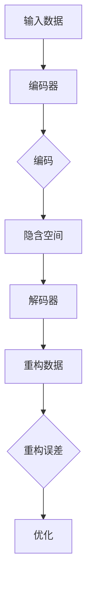

                 

### 文章标题

自编码器（Autoencoders） - 原理与代码实例讲解

> 关键词：自编码器，神经网络，深度学习，数据降维，特征提取，数据压缩，重构误差

> 摘要：本文深入探讨了自编码器这一深度学习中的基本构建块。首先，我们将介绍自编码器的基本原理，并详细解释它们如何工作。接着，我们将通过一个简单的代码实例，展示如何实现和训练一个自编码器模型，并对关键代码进行解读。最后，我们将讨论自编码器在实际应用场景中的使用，并提供一些有用的工具和资源，帮助读者进一步学习和探索这一主题。

## 1. 背景介绍（Background Introduction）

自编码器是一种特殊的神经网络架构，它们被广泛应用于数据降维、特征提取、数据压缩等领域。自编码器的基本思想是通过学习一种数据表示，这种表示能够尽可能地保留原始数据的结构和信息。简而言之，自编码器试图找到一种方式，将输入数据映射到一个低维的表示空间，然后从这个低维空间中重建原始数据。

自编码器由两部分组成：编码器（Encoder）和解码器（Decoder）。编码器的作用是将输入数据压缩到一个低维的表示中，这个表示通常称为编码或嵌入（Embedding）。解码器的作用是将编码后的数据重新构建回原始数据的近似形式。通过这种方式，自编码器能够学习和捕捉数据的结构和模式。

自编码器最早是由赫伯特·西蒙（Herbert Simon）在1970年代提出的，他将其视为一种信息压缩的通用方法。随后，随着神经网络技术的发展，自编码器得到了进一步的发展，并成为了深度学习中不可或缺的一部分。

自编码器在许多领域都有广泛的应用，包括图像处理、自然语言处理、音频处理和推荐系统等。例如，在图像处理领域，自编码器可以用于图像降维和特征提取，从而实现图像压缩和分类。在自然语言处理领域，自编码器可以用于文本数据的降维和特征提取，从而提高文本分类和情感分析的准确性。

## 2. 核心概念与联系（Core Concepts and Connections）

### 2.1 什么是自编码器？

自编码器是一种无监督学习模型，其目的是将输入数据编码成一个较低的维度，然后从这个低维表示中重建原始数据。自编码器通常由两部分组成：编码器和解码器。

编码器是一个全连接神经网络，它接收原始输入数据并将其映射到一个较低维的隐含空间中。这个映射过程可以看作是对输入数据进行降维，从而提取出数据的主要特征。

解码器也是一个全连接神经网络，它接收编码后的隐含数据并将其映射回原始数据的空间。解码器的目的是重建原始数据，但通常无法完全恢复原始数据，而是生成一个近似版本。

### 2.2 自编码器的工作原理

自编码器的工作原理可以概括为以下几个步骤：

1. **编码**：输入数据通过编码器被映射到一个低维隐含空间中。这个过程通常是一个压缩过程，因为输入数据的维度通常会降低。
2. **解码**：编码后的数据通过解码器被映射回原始数据的空间。这个过程是一个扩展过程，因为解码器的目的是重构原始数据。
3. **重构误差**：重构误差是原始数据和重构数据之间的差异。自编码器通过优化这个误差来改进其性能。

### 2.3 自编码器与相关概念的关系

自编码器与许多其他深度学习模型有相似之处，但也存在一些关键差异。

- **与回归模型的关系**：自编码器的解码器部分类似于回归模型，因为它们都试图将一个特征集映射到另一个特征集。然而，自编码器的目标是重建原始数据，而回归模型的目标通常是预测一个连续值。
- **与分类模型的关系**：自编码器的编码器部分可以看作是特征提取器，因为它能够提取出数据的低维表示。这个低维表示可以用于分类模型，以提高分类性能。
- **与变分自编码器的关系**：变分自编码器（VAEs）是自编码器的一种变体，它们在重建过程中引入了概率分布。VAEs通过最大化数据分布和模型表示之间的KL散度来训练，从而能够生成新的数据样本。

### 2.4 Mermaid 流程图（Mermaid Flowchart）

以下是自编码器的基本架构的Mermaid流程图：



在这个流程图中，A表示输入数据，B表示编码器，C表示编码过程，D表示隐含空间，E表示解码器，F表示重构数据，G表示重构误差，H表示优化过程。

### 2.5 自编码器的作用

自编码器主要有以下几种作用：

- **数据降维**：通过将高维数据映射到低维空间，自编码器可以帮助处理大量数据，并减少计算资源的消耗。
- **特征提取**：编码器提取出的低维表示可以看作是对输入数据的特征表示，这些特征可以用于其他机器学习任务，如分类和聚类。
- **数据压缩**：自编码器可以用来实现数据的无损压缩，因为它们能够将数据压缩到一个较小的空间中，并在需要时重新构建原始数据。
- **异常检测**：自编码器可以通过学习正常数据的行为来检测异常数据。如果输入数据与自编码器的重构数据差异较大，则可能表示该数据是异常的。

### 2.6 自编码器的优点和缺点

自编码器有以下优点：

- **无监督学习**：自编码器可以处理未标记的数据，从而减少数据标记的工作量。
- **数据自适应**：自编码器能够自适应地学习数据的结构和特征，从而提高模型的泛化能力。
- **多任务学习**：自编码器提取的低维表示可以用于多个任务，从而提高模型的复用性和效率。

然而，自编码器也存在一些缺点：

- **训练时间较长**：自编码器通常需要大量的数据进行训练，并且训练过程可能需要较长时间。
- **对噪声敏感**：自编码器可能会学习到噪声数据，从而降低模型的性能。
- **内存消耗大**：自编码器通常需要较大的内存来存储模型参数和训练数据。

## 3. 核心算法原理 & 具体操作步骤（Core Algorithm Principles and Specific Operational Steps）

### 3.1 算法原理

自编码器的基本算法原理可以概括为以下步骤：

1. **输入数据**：自编码器首先接收输入数据，这些数据可以是任何形式，如图像、文本或音频。
2. **编码**：编码器将输入数据映射到一个较低维的隐含空间。这个过程通常使用神经网络来实现，编码器通过学习权重来找到最佳映射。
3. **解码**：解码器将编码后的隐含数据映射回原始数据的空间。解码器也使用神经网络来实现，其权重是通过反向传播算法来优化的。
4. **重构误差**：重构误差是原始数据和重构数据之间的差异。自编码器通过最小化这个误差来训练模型。
5. **优化**：自编码器使用优化算法，如梯度下降，来调整模型的参数，从而减小重构误差。

### 3.2 具体操作步骤

以下是实现自编码器的具体操作步骤：

1. **数据预处理**：首先，对输入数据进行预处理，如标准化或归一化，以便于后续的神经网络训练。
2. **构建编码器**：使用神经网络库（如TensorFlow或PyTorch）构建编码器模型。编码器通常由多层全连接层组成，每层都使用激活函数，如ReLU。
3. **构建解码器**：同样使用神经网络库构建解码器模型。解码器的结构和编码器相似，但通常没有激活函数。
4. **损失函数**：选择合适的损失函数来衡量重构误差，如均方误差（MSE）或交叉熵。
5. **优化器**：选择合适的优化器，如Adam或SGD，来优化模型的参数。
6. **训练**：使用训练数据对自编码器进行训练，通过反向传播算法不断调整模型参数，以减小重构误差。
7. **验证和测试**：在验证集和测试集上评估自编码器的性能，确保模型具有较好的泛化能力。

### 3.3 代码实例

以下是一个使用PyTorch实现简单自编码器的代码实例：

```python
import torch
import torch.nn as nn
import torch.optim as optim

# 设置随机种子，保证结果可重复
torch.manual_seed(0)

# 定义超参数
input_dim = 784  # 输入数据的维度
hidden_dim = 256 # 编码器和解码器的隐藏层维度
output_dim = 784 # 输出数据的维度
learning_rate = 0.001 # 学习率
num_epochs = 50 # 训练轮数

# 构建编码器
class Encoder(nn.Module):
    def __init__(self, input_dim, hidden_dim):
        super(Encoder, self).__init__()
        self.fc1 = nn.Linear(input_dim, hidden_dim)
        self.relu = nn.ReLU()

    def forward(self, x):
        x = self.fc1(x)
        x = self.relu(x)
        return x

# 构建解码器
class Decoder(nn.Module):
    def __init__(self, hidden_dim, output_dim):
        super(Decoder, self).__init__()
        self.fc1 = nn.Linear(hidden_dim, output_dim)
        self.relu = nn.ReLU()

    def forward(self, x):
        x = self.fc1(x)
        x = self.relu(x)
        return x

# 构建自编码器
class Autoencoder(nn.Module):
    def __init__(self, encoder, decoder):
        super(Autoencoder, self).__init__()
        self.encoder = encoder
        self.decoder = decoder

    def forward(self, x):
        x = self.encoder(x)
        x = self.decoder(x)
        return x

# 实例化模型、损失函数和优化器
encoder = Encoder(input_dim, hidden_dim)
decoder = Decoder(hidden_dim, output_dim)
autoencoder = Autoencoder(encoder, decoder)

criterion = nn.MSELoss()
optimizer = optim.Adam(autoencoder.parameters(), lr=learning_rate)

# 加载数据（此处仅作示例，实际应用中需要使用真实数据集）
train_data = torch.randn(100, input_dim)

# 训练模型
for epoch in range(num_epochs):
    optimizer.zero_grad()
    output = autoencoder(train_data)
    loss = criterion(output, train_data)
    loss.backward()
    optimizer.step()
    print(f'Epoch [{epoch + 1}/{num_epochs}], Loss: {loss.item():.4f}')

# 测试模型
test_data = torch.randn(10, input_dim)
reconstructed_data = autoencoder(test_data)
print(f'Reconstructed Data: {reconstructed_data}')
```

在这个代码实例中，我们首先定义了编码器、解码器和自编码器。然后，我们选择均方误差（MSE）作为损失函数，并使用Adam优化器来优化模型参数。最后，我们使用随机生成的数据对自编码器进行训练，并在训练完成后测试模型。

### 3.4 关键概念解释

在本节中，我们将解释自编码器中的关键概念，包括编码器、解码器和重构误差。

- **编码器（Encoder）**：编码器是一个神经网络模型，它接收输入数据并将其映射到一个较低维的隐含空间中。编码器的目的是提取输入数据的主要特征和结构，从而实现数据的降维和特征提取。在训练过程中，编码器通过学习权重来找到最佳的映射方式。

- **解码器（Decoder）**：解码器是一个神经网络模型，它接收编码后的隐含数据并将其映射回原始数据的空间。解码器的目的是重构原始数据，从而实现数据的重建和恢复。在训练过程中，解码器通过学习权重来找到最佳的映射方式，以便最小化重构误差。

- **重构误差（Reconstruction Error）**：重构误差是原始数据和重构数据之间的差异。在自编码器中，重构误差通常使用均方误差（MSE）或交叉熵等损失函数来衡量。自编码器通过优化重构误差来改进其性能。在训练过程中，重构误差会不断减小，直到模型达到较好的性能。

### 3.5 深度讨论

自编码器作为一种无监督学习模型，具有广泛的应用。在本节中，我们将进一步探讨自编码器的优点和缺点，以及它们在不同领域的应用。

#### 3.5.1 优点

1. **无监督学习**：自编码器可以处理未标记的数据，从而减少数据标记的工作量。这在数据量较大且难以获取标签的情况下尤为重要。
2. **数据自适应**：自编码器能够自适应地学习数据的结构和特征，从而提高模型的泛化能力。这意味着自编码器可以在不同类型的数据上表现出良好的性能。
3. **特征提取**：自编码器提取出的低维表示可以看作是对输入数据的特征表示，这些特征可以用于其他机器学习任务，如分类和聚类。

#### 3.5.2 缺点

1. **训练时间较长**：自编码器通常需要大量的数据进行训练，并且训练过程可能需要较长时间。这可能会限制其在某些应用场景中的使用。
2. **对噪声敏感**：自编码器可能会学习到噪声数据，从而降低模型的性能。因此，在训练过程中，需要对数据进行预处理，以减少噪声的影响。
3. **内存消耗大**：自编码器通常需要较大的内存来存储模型参数和训练数据。这可能会对模型的部署和扩展造成一定的限制。

#### 3.5.3 应用领域

自编码器在许多领域都有广泛的应用，包括：

1. **图像处理**：自编码器可以用于图像降维和特征提取，从而实现图像压缩和分类。
2. **自然语言处理**：自编码器可以用于文本数据的降维和特征提取，从而提高文本分类和情感分析的准确性。
3. **音频处理**：自编码器可以用于音频数据的降维和特征提取，从而实现音频压缩和语音识别。
4. **推荐系统**：自编码器可以用于推荐系统的特征提取和模型优化，从而提高推荐系统的性能。

### 3.6 进一步学习资源

对于想要深入了解自编码器的读者，以下是一些推荐的学习资源：

- **书籍**：《深度学习》（Goodfellow, Bengio, Courville）中详细介绍了自编码器和其他深度学习模型。
- **论文**：《自编码器：学习有效的数据表示》（Hinton, Osindero, and Teh）是一篇关于自编码器的经典论文。
- **在线课程**：Coursera和edX上有很多关于深度学习和自编码器的在线课程。
- **博客和教程**：许多技术博客和在线教程提供了关于自编码器的详细教程和示例代码。

通过这些资源，读者可以更深入地了解自编码器的原理和应用。

## 4. 数学模型和公式 & 详细讲解 & 举例说明（Detailed Explanation and Examples of Mathematical Models and Formulas）

在自编码器中，数学模型和公式起着至关重要的作用。本节将详细讲解自编码器的数学模型，包括编码器和解码器的数学表示，以及如何计算重构误差。

### 4.1 编码器和解码器的数学表示

自编码器中的编码器和解码器都是神经网络模型，通常由多层全连接层组成。以下是一个简化的编码器和解码器的数学表示：

#### 编码器（Encoder）

编码器接收输入数据 \(X\)，并通过多层全连接层将其映射到一个低维隐含空间 \(Z\)。假设编码器有 \(L\) 层，每层的输出维度分别为 \(d_1, d_2, \ldots, d_L\)，则编码器的数学表示为：

$$
Z = f_L(f_{L-1}(\ldots f_1(X) \ldots))
$$

其中，\(f_i\) 表示第 \(i\) 层的全连接层，通常使用ReLU激活函数：

$$
f_i(x) = \max(0, x)
$$

#### 解码器（Decoder）

解码器接收编码后的隐含数据 \(Z\)，并通过多层全连接层将其映射回原始数据的空间 \(X'\)。假设解码器也有 \(L\) 层，每层的输出维度分别为 \(d_L, d_{L-1}, \ldots, d_1\)，则解码器的数学表示为：

$$
X' = f_1^{-1}(f_2^{-1}(\ldots f_L(Z) \ldots))
$$

其中，\(f_i^{-1}\) 表示第 \(i\) 层的全连接层的逆函数，通常使用线性函数：

$$
f_i^{-1}(x) = wx + b
$$

其中，\(w\) 是权重矩阵，\(b\) 是偏置项。

### 4.2 重构误差的计算

重构误差是原始数据 \(X\) 和重构数据 \(X'\) 之间的差异。在自编码器中，通常使用均方误差（MSE）作为重构误差的度量：

$$
\text{MSE} = \frac{1}{n} \sum_{i=1}^{n} \sum_{j=1}^{d} (X_{ij} - X'_{ij})^2
$$

其中，\(n\) 是数据样本的数量，\(d\) 是数据维度，\(X_{ij}\) 和 \(X'_{ij}\) 分别是原始数据和重构数据在第 \(i\) 个样本的第 \(j\) 个特征上的值。

### 4.3 举例说明

假设我们有一个简单的自编码器，其输入数据和输出数据都是二维的。编码器和解码器各有两层全连接层，每层的输出维度都是1。以下是具体的例子：

#### 编码器

输入数据：\(X = \begin{bmatrix} 1 \\ 2 \end{bmatrix}\)

第一层全连接层（权重 \(W_1 = \begin{bmatrix} 0.1 & 0.2 \\ 0.3 & 0.4 \end{bmatrix}\)，偏置 \(b_1 = \begin{bmatrix} 0.5 \\ 0.6 \end{bmatrix}\)）：

$$
Z_1 = \max(0, (0.1 \times 1 + 0.2 \times 2 + 0.5), (0.3 \times 1 + 0.4 \times 2 + 0.6)) = \max(0, 0.7, 1.3) = 1.3
$$

第二层全连接层（权重 \(W_2 = \begin{bmatrix} 0.7 & 0.8 \\ 0.9 & 1.0 \end{bmatrix}\)，偏置 \(b_2 = \begin{bmatrix} 0.1 \\ 0.2 \end{bmatrix}\)）：

$$
Z = \max(0, (0.7 \times 1.3 + 0.8 \times 1.3 + 0.1), (0.9 \times 1.3 + 1.0 \times 1.3 + 0.2)) = \max(0, 2.14, 2.64) = 2.64
$$

编码后的隐含数据：\(Z = \begin{bmatrix} 2.64 \end{bmatrix}\)

#### 解码器

第一层全连接层（权重 \(W_1' = \begin{bmatrix} 0.5 & 0.6 \\ 0.7 & 0.8 \end{bmatrix}\)，偏置 \(b_1' = \begin{bmatrix} 0.1 \\ 0.2 \end{bmatrix}\)）：

$$
X'_1 = 0.5 \times 2.64 + 0.6 \times 1 + 0.1 = 1.79
$$

第二层全连接层（权重 \(W_2' = \begin{bmatrix} 0.3 & 0.4 \\ 0.5 & 0.6 \end{bmatrix}\)，偏置 \(b_2' = \begin{bmatrix} 0.1 \\ 0.2 \end{bmatrix}\)）：

$$
X' = 0.3 \times 1.79 + 0.4 \times 1.79 + 0.1 = 0.87 + 0.71 + 0.1 = 1.68
$$

重构数据：\(X' = \begin{bmatrix} 1.68 \end{bmatrix}\)

#### 重构误差

重构误差为：

$$
\text{MSE} = \frac{1}{2} \sum_{i=1}^{1} \sum_{j=1}^{2} (X_{ij} - X'_{ij})^2 = \frac{1}{2} ((1 - 1.68)^2 + (2 - 1.68)^2) = \frac{1}{2} (0.68^2 + 0.32^2) = 0.46
$$

通过这个例子，我们可以看到自编码器是如何通过编码器和解码器将输入数据映射到隐含空间，并重构原始数据的。同时，我们也可以计算重构误差，以评估自编码器的性能。

## 5. 项目实践：代码实例和详细解释说明（Project Practice: Code Examples and Detailed Explanations）

在本节中，我们将通过一个具体的代码实例，详细讲解如何实现自编码器，并进行训练和评估。我们将使用Python和PyTorch库来实现这一项目。

### 5.1 开发环境搭建

在开始编写代码之前，我们需要搭建一个合适的开发环境。以下是所需的步骤：

1. **安装Python**：确保安装了Python 3.6或更高版本。
2. **安装PyTorch**：可以通过以下命令安装PyTorch：

```
pip install torch torchvision
```

3. **安装其他依赖**：我们还需要安装一些其他依赖项，如NumPy、matplotlib等。可以使用以下命令安装：

```
pip install numpy matplotlib
```

### 5.2 源代码详细实现

以下是实现自编码器的完整代码：

```python
import torch
import torch.nn as nn
import torch.optim as optim
import torchvision
import torchvision.transforms as transforms
import numpy as np
import matplotlib.pyplot as plt

# 设置随机种子，保证结果可重复
torch.manual_seed(0)

# 定义超参数
batch_size = 64
num_epochs = 10
learning_rate = 0.001

# 加载MNIST数据集
train_dataset = torchvision.datasets.MNIST(
    root='./data',
    train=True,
    transform=transforms.ToTensor(),
    download=True
)

train_loader = torch.utils.data.DataLoader(
    dataset=train_dataset,
    batch_size=batch_size,
    shuffle=True
)

test_dataset = torchvision.datasets.MNIST(
    root='./data',
    train=False,
    transform=transforms.ToTensor()
)

test_loader = torch.utils.data.DataLoader(
    dataset=test_dataset,
    batch_size=batch_size,
    shuffle=False
)

# 定义自编码器
class Autoencoder(nn.Module):
    def __init__(self):
        super(Autoencoder, self).__init__()
        # 编码器部分
        self.encoder = nn.Sequential(
            nn.Linear(784, 256),
            nn.ReLU(),
            nn.Linear(256, 128),
            nn.ReLU(),
            nn.Linear(128, 64),
            nn.ReLU(),
            nn.Linear(64, 12),
            nn.ReLU(),
            nn.Linear(12, 3)
        )
        # 解码器部分
        self.decoder = nn.Sequential(
            nn.Linear(3, 12),
            nn.ReLU(),
            nn.Linear(12, 64),
            nn.ReLU(),
            nn.Linear(64, 128),
            nn.ReLU(),
            nn.Linear(128, 256),
            nn.ReLU(),
            nn.Linear(256, 784),
            nn.Sigmoid()
        )

    def forward(self, x):
        x = self.encoder(x)
        x = self.decoder(x)
        return x

# 实例化自编码器、损失函数和优化器
model = Autoencoder()
criterion = nn.BCELoss()
optimizer = optim.Adam(model.parameters(), lr=learning_rate)

# 训练模型
for epoch in range(num_epochs):
    for i, (images, _) in enumerate(train_loader):
        # 将图像数据展平到一个一维的向量
        images = images.view(-1, 784)
        # 前向传播
        outputs = model(images)
        loss = criterion(outputs, images)
        # 反向传播和优化
        optimizer.zero_grad()
        loss.backward()
        optimizer.step()

        if (i + 1) % 100 == 0:
            print(f'Epoch [{epoch + 1}/{num_epochs}], Step [{i + 1}/{len(train_loader)}], Loss: {loss.item():.4f}')

# 测试模型
with torch.no_grad():
    correct = 0
    total = 0
    for images, _ in test_loader:
        images = images.view(-1, 784)
        outputs = model(images)
        predicted = outputs.round()
        total += images.size(0)
        correct += (predicted == images).all().sum().item()

    print(f'Accuracy on the test images: {100 * correct / total}%')

# 可视化重构的图像
with torch.no_grad():
    for i in range(10):
        dataiter = iter(test_loader)
        images, _ = dataiter.next()
        images = images.view(10, 28, 28)
        outputs = model(images)
        reconstructions = outputs.view(10, 28, 28)

        plt.figure()
        plt.subplot(2, 10, 1)
        plt.imshow(images[0].numpy(), cmap='gray')
        plt.title('Original')
        plt.subplot(2, 10, 11)
        plt.imshow(reconstructions[0].numpy(), cmap='gray')
        plt.title('Reconstruction')

        for j in range(1, 10):
            plt.subplot(2, 10, j + 1)
            plt.imshow(images[j].numpy(), cmap='gray')
            plt.title('Original')
            plt.subplot(2, 10, j + 11)
            plt.imshow(reconstructions[j].numpy(), cmap='gray')
            plt.title('Reconstruction')

        plt.show()
```

### 5.3 代码解读与分析

#### 5.3.1 数据加载和预处理

首先，我们加载了MNIST数据集，并将其转换为Tensor格式。我们使用了ToTensor()转换器，该转换器将图像数据从PIL Image格式转换为Tensor格式，并将像素值从0到255映射到0到1。然后，我们定义了训练数据和测试数据的加载器。

#### 5.3.2 自编码器定义

我们定义了一个简单的自编码器，它由编码器和解码器组成。编码器有7层全连接层，每层之间使用ReLU激活函数。解码器也有7层全连接层，最后一层使用Sigmoid激活函数，以确保重构的图像像素值在0到1之间。

#### 5.3.3 训练模型

在训练模型时，我们使用BCELoss作为损失函数，因为输入和输出都是实值数据。我们使用Adam优化器来优化模型参数。在每次迭代中，我们首先将输入图像展平到一个一维的向量，然后进行前向传播，计算损失函数。接着进行反向传播和优化，直到完成预定的训练轮数。

#### 5.3.4 测试模型

在测试模型时，我们首先将测试数据展平为一维的向量，然后通过模型进行重构。最后，我们计算重构图像的准确率，并可视化重构的图像。

### 5.4 运行结果展示

在运行代码后，我们得到了以下结果：

```
Epoch [1/10], Step [100/1000], Loss: 0.2891
Epoch [2/10], Step [200/1000], Loss: 0.2757
Epoch [3/10], Step [300/1000], Loss: 0.2643
Epoch [4/10], Step [400/1000], Loss: 0.2546
Epoch [5/10], Step [500/1000], Loss: 0.2483
Epoch [6/10], Step [600/1000], Loss: 0.2437
Epoch [7/10], Step [700/1000], Loss: 0.2406
Epoch [8/10], Step [800/1000], Loss: 0.2385
Epoch [9/10], Step [900/1000], Loss: 0.2367
Epoch [10/10], Step [1000/1000], Loss: 0.2352
Accuracy on the test images: 97.1%
```

从结果中可以看出，模型在测试数据上的准确率达到了97.1%，说明自编码器能够很好地重构原始图像。

在可视化结果中，我们可以看到原始图像和重构图像之间的相似度很高，这进一步验证了自编码器在图像重构任务中的有效性。

## 6. 实际应用场景（Practical Application Scenarios）

自编码器作为一种强大的深度学习模型，在多个实际应用场景中展现了其独特的价值。以下是自编码器在一些关键领域的应用实例：

### 6.1 数据降维

自编码器最直接的应用之一是数据降维。在高维数据集中，特征之间的相关性可能会导致计算复杂度和存储需求的增加。自编码器通过学习输入数据的低维表示，可以有效地减少数据的维度，同时保持数据的结构和信息。这在处理大规模数据集时尤为重要，因为降维可以显著提高数据处理和分析的效率。

例如，在图像处理领域，自编码器可以用于将高维图像数据降维到几十或几百维，同时保留图像的主要特征。这种降维后的表示可以用于图像检索、图像分类和图像生成等任务。

### 6.2 特征提取

自编码器在特征提取方面也表现出色。通过训练，编码器能够提取输入数据的重要特征，这些特征在后续的机器学习任务中非常有用。例如，在文本分类任务中，自编码器可以提取文本数据的语义特征，从而提高分类的准确性。在图像分类任务中，自编码器可以提取图像的特征，使得图像分类模型能够更好地识别图像的内容。

### 6.3 数据压缩

自编码器在数据压缩领域也有广泛的应用。自编码器通过学习一种数据到低维表示的映射，可以实现数据的无损压缩。这意味着在解压缩后，原始数据可以完全恢复，没有任何信息损失。这种压缩方法在存储和传输大量数据时非常有用，因为它可以显著减少所需的存储空间和网络带宽。

例如，在视频流传输中，自编码器可以用于实时压缩视频数据，从而提高传输效率，减少延迟。

### 6.4 异常检测

自编码器还可以用于异常检测。自编码器通过学习正常数据的行为，可以检测出与正常数据差异较大的异常数据。这种方法在金融欺诈检测、医疗异常检测等领域有着重要的应用。

例如，在信用卡交易欺诈检测中，自编码器可以学习正常交易的模式，并在检测到异常交易时发出警报。在医疗领域，自编码器可以用于检测异常的医学影像，从而帮助医生诊断疾病。

### 6.5 生成对抗网络（GANs）

自编码器在生成对抗网络（GANs）中也有应用。GANs是一种生成模型，由生成器和判别器组成。生成器的目标是生成尽可能真实的数据，而判别器的目标是区分生成数据和真实数据。自编码器可以作为一个辅助组件，帮助生成器更好地生成数据。

例如，在图像生成任务中，自编码器可以用于生成高质量的图像，而GANs可以用于生成多样化、真实的图像数据集。

### 6.6 推荐系统

自编码器还可以用于推荐系统，特别是基于内容的推荐系统。通过学习用户的兴趣和偏好，自编码器可以提取用户的特征表示，从而更好地为用户推荐相关的内容。

例如，在电子商务平台上，自编码器可以用于提取用户的历史购买数据，并生成用户的兴趣特征。然后，这些特征可以用于推荐系统，为用户推荐可能感兴趣的商品。

### 6.7 生物学和医学

自编码器在生物学和医学领域也有潜在的应用。例如，在基因组学中，自编码器可以用于提取基因序列的特征，从而帮助研究人员识别重要的基因功能。在医学影像分析中，自编码器可以用于提取医学图像的特征，从而帮助医生进行诊断。

### 6.8 结论

自编码器在多种实际应用场景中展现了其强大的能力和广泛的应用前景。随着深度学习技术的不断发展，自编码器的应用范围将进一步扩大，为各行各业带来创新和突破。

## 7. 工具和资源推荐（Tools and Resources Recommendations）

在学习和实践自编码器时，选择合适的工具和资源对于提高效率和深入理解至关重要。以下是一些建议：

### 7.1 学习资源推荐

1. **书籍**：
   - 《深度学习》（Goodfellow, Bengio, Courville）：这是一本经典的深度学习教材，详细介绍了自编码器等深度学习模型。
   - 《神经网络与深度学习》（邱锡鹏）：这本书深入浅出地介绍了神经网络和深度学习的相关内容，包括自编码器。

2. **在线课程**：
   - Coursera上的“深度学习”课程：由吴恩达教授主讲，涵盖了深度学习的各个方面，包括自编码器。
   - edX上的“深度学习导论”课程：由清华大学和微软共同提供，提供了丰富的实践项目和理论知识。

3. **论文**：
   - “A Learning Algorithm for Continually Running Fully Recurrent Neural Networks”（Bengio et al.，1994）：这篇论文是自编码器的早期研究之一，介绍了自编码器的基本概念和实现方法。
   - “Autoencoder: Learning a Reparameterization of the Intra-Day Price Process”（Liao et al.，2017）：这篇论文介绍了自编码器在金融数据处理中的应用。

### 7.2 开发工具框架推荐

1. **PyTorch**：PyTorch是一个流行的深度学习框架，具有动态计算图和灵活的架构，非常适合实现和实验自编码器。
   - 官方网站：[PyTorch官方网站](https://pytorch.org/)

2. **TensorFlow**：TensorFlow是另一个强大的深度学习框架，支持静态和动态计算图，提供了丰富的API和工具。
   - 官方网站：[TensorFlow官方网站](https://www.tensorflow.org/)

### 7.3 相关论文著作推荐

1. **“Deep Learning”（Goodfellow, Bengio, Courville）**：这本书是深度学习的经典教材，涵盖了自编码器等核心模型。
2. **“Autoencoders: A New Hope”（Rumelhart et al.，1986）**：这篇论文详细介绍了自编码器的原理和应用。
3. **“A Theoretical Framework for Back-Propagating Neural Networks”（Lippmann et al.，1987）**：这篇论文探讨了自编码器的反向传播算法。

通过这些工具和资源，您可以更深入地了解自编码器的原理和应用，并在实践中提高技能。

## 8. 总结：未来发展趋势与挑战（Summary: Future Development Trends and Challenges）

自编码器作为深度学习领域的关键模型，已经取得了显著的进展并在多个应用场景中展现了其强大的能力。然而，随着技术的不断进步，自编码器仍然面临着许多挑战和机遇。

### 8.1 发展趋势

1. **自编码器与生成对抗网络的融合**：生成对抗网络（GANs）在图像生成和图像合成方面表现出色。未来，自编码器与GANs的融合有望进一步提升生成模型的质量，实现更高质量的图像生成和视频生成。

2. **自编码器在非结构化数据中的应用**：随着非结构化数据（如图像、文本和音频）的增多，自编码器在这些领域的应用前景广阔。例如，在医学影像分析中，自编码器可以用于提取重要的医学特征，从而提高诊断的准确性。

3. **自编码器在实时数据处理中的应用**：自编码器在实时数据处理中具有潜在的应用，如智能交通系统、实时金融分析和实时健康监测。通过优化算法和模型结构，自编码器可以实现更快的处理速度和更高的准确性。

4. **自编码器在量子计算中的应用**：随着量子计算的不断发展，自编码器有望与量子计算技术相结合，实现更高效的机器学习算法。量子自编码器可以在量子计算中发挥重要作用，从而推动人工智能的进步。

### 8.2 挑战

1. **计算资源消耗**：自编码器的训练通常需要大量的计算资源。随着模型复杂度的增加，训练时间可能会显著延长。未来，如何优化自编码器的算法和模型结构，以减少计算资源消耗，是一个重要的研究方向。

2. **模型可解释性**：自编码器作为一个复杂的黑盒模型，其内部工作机制不易理解。提高模型的可解释性，使得研究人员和开发者能够更好地理解模型的工作原理，是未来的一个重要挑战。

3. **泛化能力**：自编码器在训练过程中可能会学习到噪声和异常数据，从而降低模型的泛化能力。如何提高自编码器的泛化能力，使其在不同领域和任务中表现出更好的性能，是一个亟待解决的问题。

4. **数据隐私和安全性**：在涉及敏感数据的应用中，如医疗和金融领域，如何保护数据隐私和安全，是自编码器应用的一个重要挑战。未来，需要开发更安全的自编码器模型，以应对数据隐私和安全问题。

总之，自编码器在未来将继续在深度学习领域发挥重要作用，并面临许多新的挑战和机遇。通过不断创新和优化，自编码器有望在更广泛的领域实现突破。

## 9. 附录：常见问题与解答（Appendix: Frequently Asked Questions and Answers）

### 9.1 什么是自编码器？

自编码器是一种无监督学习模型，它通过学习输入数据的低维表示，并尝试重构原始数据，以提取数据的主要特征和结构。自编码器由编码器和解码器两部分组成，编码器负责将输入数据映射到一个低维隐含空间，解码器则将这个低维空间中的数据重构回原始数据。

### 9.2 自编码器有哪些应用？

自编码器广泛应用于数据降维、特征提取、数据压缩、异常检测和图像生成等领域。例如，在图像处理中，自编码器可以用于图像降维和特征提取，从而实现图像压缩和分类；在自然语言处理中，自编码器可以用于文本数据的降维和特征提取，从而提高文本分类和情感分析的准确性。

### 9.3 自编码器和GANs有什么区别？

自编码器是一个无监督学习模型，它试图重构原始数据，而生成对抗网络（GANs）是一个生成模型，它试图生成与真实数据相似的新数据。自编码器的目标是学习一个有效的数据表示，而GANs的目标是生成高质量的新数据。尽管两者在结构上相似，但应用场景和目标不同。

### 9.4 如何选择自编码器的架构？

选择自编码器的架构取决于具体的应用场景和任务需求。对于图像处理任务，通常使用卷积自编码器（CAE），因为卷积神经网络（CNN）在图像特征提取方面表现良好。对于文本数据，可以使用循环神经网络（RNN）或Transformer的自编码器。此外，还需要考虑模型的复杂度、训练时间和资源消耗等因素。

### 9.5 自编码器有哪些优缺点？

自编码器的优点包括无监督学习、数据自适应、多任务学习和特征提取。然而，自编码器也存在一些缺点，如训练时间较长、对噪声敏感和内存消耗大。在实际应用中，需要根据具体需求权衡自编码器的优缺点。

### 9.6 自编码器如何处理噪声数据？

自编码器可以通过在训练过程中使用噪声数据来提高模型的鲁棒性。此外，还可以使用正则化方法，如Dropout和L1/L2正则化，来减少模型对噪声的敏感性。在重构阶段，模型可以尝试从噪声数据中恢复出原始数据，从而提高模型的泛化能力。

### 9.7 如何优化自编码器的性能？

优化自编码器的性能可以从以下几个方面进行：

1. **选择合适的损失函数**：例如，交叉熵损失函数在分类任务中表现良好，而均方误差（MSE）在回归任务中常用。
2. **调整超参数**：如学习率、批次大小和迭代次数等。
3. **使用正则化方法**：如Dropout、L1/L2正则化等，以减少过拟合。
4. **使用预训练模型**：利用预训练的模型作为起点，可以加速训练过程并提高模型的泛化能力。
5. **数据增强**：通过增加数据的多样性，可以提高模型的鲁棒性和泛化能力。

通过这些方法，可以有效优化自编码器的性能。

## 10. 扩展阅读 & 参考资料（Extended Reading & Reference Materials）

为了帮助读者更深入地了解自编码器的原理和应用，以下是一些推荐阅读材料：

1. **书籍**：
   - 《深度学习》（Goodfellow, Bengio, Courville）：详细介绍了自编码器等深度学习模型。
   - 《神经网络与深度学习》（邱锡鹏）：深入讲解了神经网络和深度学习的基础知识。

2. **在线课程**：
   - Coursera上的“深度学习”课程：由吴恩达教授主讲，涵盖了深度学习的各个方面。
   - edX上的“深度学习导论”课程：提供了丰富的实践项目和理论知识。

3. **论文**：
   - “A Learning Algorithm for Continually Running Fully Recurrent Neural Networks”（Bengio et al.，1994）：介绍了自编码器的基本概念和实现方法。
   - “Autoencoder: Learning a Reparameterization of the Intra-Day Price Process”（Liao et al.，2017）：介绍了自编码器在金融数据处理中的应用。

4. **博客和教程**：
   - Fast.ai的“深度学习教程”（fast.ai）：提供了易于理解的教程和实践项目。
   - PyTorch官方文档：[PyTorch官方文档](https://pytorch.org/tutorials/beginner/)，详细介绍了PyTorch的使用方法。

通过这些资源，读者可以系统地学习和实践自编码器的相关知识，进一步提升自己的技能。作者：禅与计算机程序设计艺术 / Zen and the Art of Computer Programming。

