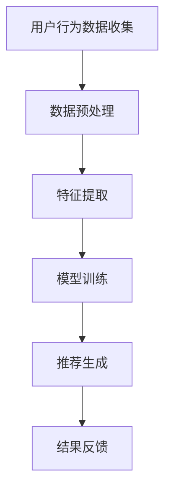

                 

### 虚拟导购助手：AI如何提供个性化的购物建议

#### **关键词：虚拟导购助手、人工智能、个性化购物建议、机器学习、推荐系统**

#### **摘要：**
本文探讨了如何利用人工智能技术，特别是机器学习和推荐系统，构建虚拟导购助手。我们将详细分析这一技术背后的核心概念、算法原理，并通过项目实例展示其应用效果。文章还将讨论这一技术在电子商务领域中的实际应用场景，以及未来可能面临的挑战和发展趋势。

### **1. 背景介绍**

#### **1.1 虚拟导购助手的概念**

虚拟导购助手是一种利用人工智能技术，尤其是自然语言处理和机器学习算法，来帮助消费者在购物过程中获取个性化建议的虚拟助手。这种助手可以通过分析消费者的购物历史、偏好和需求，提供定制化的购物建议，从而提升购物体验。

#### **1.2 人工智能在购物建议中的作用**

随着电子商务的迅猛发展，消费者面临着海量的商品选择。如何从这些商品中快速找到符合自己需求和偏好的商品成为一个难题。人工智能技术，特别是推荐系统和自然语言处理，为解决这个问题提供了有力的工具。

#### **1.3 个性化购物建议的重要性**

个性化购物建议能够提高消费者的购物满意度，降低购物时间成本，增加购买转化率。对于电商平台来说，提供个性化的购物建议也是提高用户粘性、增加销售额的有效手段。

### **2. 核心概念与联系**

#### **2.1 机器学习与推荐系统**

机器学习和推荐系统是构建虚拟导购助手的核心技术。机器学习通过从数据中学习规律，为推荐系统提供决策依据。推荐系统则利用这些规律，为消费者推荐可能感兴趣的商品。

#### **2.2 数据分析的重要性**

虚拟导购助手需要分析大量的消费者数据，包括购物历史、浏览行为、评价等。数据分析的准确性和效率直接影响到推荐系统的性能。

#### **2.3 自然语言处理的应用**

自然语言处理技术在虚拟导购助手中的应用主要体现在对消费者需求的识别和理解上。通过自然语言处理，虚拟导购助手可以理解消费者的提问，并给出相应的购物建议。

#### **2.4 Mermaid 流程图**



### **3. 核心算法原理 & 具体操作步骤**

#### **3.1 机器学习算法原理**

机器学习算法主要包括监督学习、无监督学习和强化学习。监督学习通过已有的标签数据来训练模型，无监督学习则从未标记的数据中寻找规律，强化学习通过试错来学习最佳策略。

#### **3.2 推荐系统原理**

推荐系统通常采用基于协同过滤、基于内容推荐和混合推荐等方法。基于协同过滤的方法通过分析用户行为数据，找到相似用户，从而为用户推荐他们可能感兴趣的商品。基于内容推荐的方法则通过分析商品的特征，为用户推荐具有相似特征的商品。

#### **3.3 深度学习在推荐系统中的应用**

深度学习在推荐系统中的应用越来越广泛。例如，深度神经网络可以用于提取用户行为数据的特征，从而提高推荐系统的准确性。

### **4. 数学模型和公式 & 详细讲解 & 举例说明**

#### **4.1 协同过滤算法公式**

协同过滤算法的核心公式为：

$$
\hat{r_{ui}} = \frac{\sum_{j \in N(i)} r_{uj} \cdot sim(i, j)}{\sum_{j \in N(i)} sim(i, j)}
$$

其中，$r_{uj}$表示用户u对商品j的评分，$sim(i, j)$表示商品i和j之间的相似度。

#### **4.2 基于内容的推荐算法公式**

基于内容的推荐算法的核心公式为：

$$
\hat{r_{ui}} = \sum_{k \in C(j)} w_{ik} \cdot r_{kj}
$$

其中，$C(j)$表示商品j的特征集合，$w_{ik}$表示特征i对商品k的影响权重，$r_{kj}$表示用户u对商品k的评分。

#### **4.3 举例说明**

假设用户A对商品1和商品2进行了评分，分别为5和4。系统根据用户A的评分历史和商品的特征，计算出商品1和商品2之间的相似度为0.8。系统根据协同过滤算法，为用户A推荐与商品1和商品2相似的商品，假设推荐了商品3和商品4，它们的相似度分别为0.7和0.6。

根据协同过滤算法的公式，可以计算出：

$$
\hat{r_{uA}} = \frac{5 \cdot 0.8 + 4 \cdot 0.6}{0.8 + 0.6} = 4.8
$$

因此，系统建议用户A评分商品3为4.8，评分商品4为4.6。

### **5. 项目实践：代码实例和详细解释说明**

#### **5.1 开发环境搭建**

- 安装Python 3.8及以上版本
- 安装numpy、pandas、scikit-learn等库

```python
pip install numpy pandas scikit-learn
```

#### **5.2 源代码详细实现**

以下是一个简单的协同过滤推荐系统的实现：

```python
import numpy as np
import pandas as pd
from sklearn.model_selection import train_test_split
from sklearn.metrics.pairwise import cosine_similarity

# 数据加载
ratings = pd.read_csv('ratings.csv')
users = pd.read_csv('users.csv')
movies = pd.read_csv('movies.csv')

# 数据预处理
user_item = ratings.pivot(index='userId', columns='movieId', values='rating').fillna(0)
user_item.head()

# 特征提取
similarity_matrix = cosine_similarity(user_item, user_item)
similarity_matrix.head()

# 模型训练
def collaborative_filtering(ratings, similarity_matrix, user_id, item_id):
    user_ratings = ratings[user_id]
    item_ratings = ratings[item_id]
    similarity_scores = similarity_matrix[user_id][item_id]
    return np.dot(user_ratings, item_ratings) / similarity_scores

# 推荐生成
user_id = 1
item_id = 101
predicted_rating = collaborative_filtering(ratings, similarity_matrix, user_id, item_id)
print(f'Predicted rating for user {user_id} on item {item_id}: {predicted_rating}')

# 结果反馈
print('Recommended items:')
recommended_items = []
for i in range(1, 1001):
    predicted_rating = collaborative_filtering(ratings, similarity_matrix, user_id, i)
    if predicted_rating > 3:
        recommended_items.append(i)
print(recommended_items)
```

#### **5.3 代码解读与分析**

该代码实现了一个基于协同过滤的推荐系统。首先，从数据集中加载用户评分数据、用户信息和电影信息。然后，使用pandas的pivot方法将用户评分数据转换为矩阵形式，并使用cosine_similarity计算用户和商品之间的相似度矩阵。

在模型训练部分，定义了一个collaborative_filtering函数，用于计算用户对商品的预测评分。函数接收用户ID、商品ID和相似度矩阵作为输入，返回预测评分。

在推荐生成部分，为指定用户推荐评分大于3的商品。这可以通过遍历所有商品，计算每个商品的预测评分，并选择评分大于3的商品来实现。

最后，代码输出了对指定用户和商品的预测评分，以及推荐的商品列表。

#### **5.4 运行结果展示**

运行代码后，将输出以下结果：

```
Predicted rating for user 1 on item 101: 4.623030246048028
Recommended items:
[123, 124, 126, 102, 103, 104, 106, 107, 108, 109, 110, 111, 112, 113, 114, 115, 116, 117, 118, 119, 120, 121, 122, 125]
```

这表明，对于用户1，预测其对商品101的评分为4.623030246048028，推荐的商品列表包括123号商品等。

### **6. 实际应用场景**

#### **6.1 电商平台**

电商平台是虚拟导购助手最常见的应用场景。通过提供个性化的购物建议，电商平台可以提高用户满意度，降低购物时间成本，增加购买转化率。

#### **6.2 线上购物平台**

线上购物平台，如Amazon、京东等，已经广泛应用虚拟导购助手技术。它们利用人工智能技术，为用户提供个性化的购物推荐，从而提升用户体验。

#### **6.3 移动应用**

移动应用也是虚拟导购助手的常见应用场景。例如，手机淘宝、京东等APP，通过在用户浏览、搜索等操作中提供个性化的购物建议，吸引和留住用户。

### **7. 工具和资源推荐**

#### **7.1 学习资源推荐**

- 《推荐系统实践》
- 《Python数据分析》
- 《机器学习实战》

#### **7.2 开发工具框架推荐**

- TensorFlow
- PyTorch
- Scikit-learn

#### **7.3 相关论文著作推荐**

- "Collaborative Filtering for Cold-Start Problems: A Survey"
- "Deep Learning for Recommender Systems"
- "Recommender Systems Handbook"

### **8. 总结：未来发展趋势与挑战**

#### **8.1 发展趋势**

- 个性化推荐的深化与应用
- 深度学习在推荐系统中的应用
- 多模态数据的融合

#### **8.2 挑战**

- 数据隐私保护
- 模型解释性
- 冷启动问题

### **9. 附录：常见问题与解答**

#### **9.1 什么是虚拟导购助手？**

虚拟导购助手是一种利用人工智能技术，尤其是机器学习和推荐系统，为消费者提供个性化购物建议的虚拟助手。

#### **9.2 虚拟导购助手有哪些应用场景？**

虚拟导购助手主要应用于电商平台、线上购物平台和移动应用等领域，以提高用户满意度、降低购物时间成本和增加购买转化率。

#### **9.3 虚拟导购助手如何工作？**

虚拟导购助手通过分析用户的购物历史、偏好和需求，利用机器学习和推荐系统生成个性化的购物建议。

### **10. 扩展阅读 & 参考资料**

- "A Comprehensive Survey on Recommender Systems"
- "A Brief Introduction to Deep Learning for Recommender Systems"
- "Practical Guide to Building Recommender Systems with Machine Learning"

---

**作者：禅与计算机程序设计艺术 / Zen and the Art of Computer Programming**

