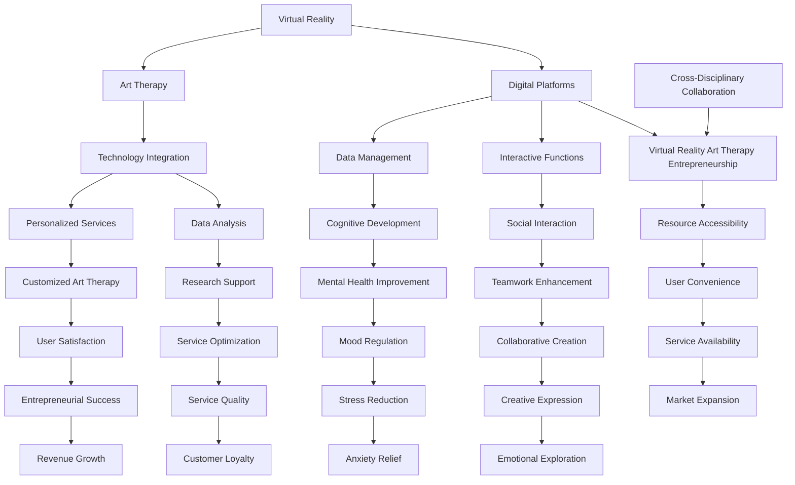

                 

### 文章标题

Virtual Reality Art Therapy Entrepreneurship: Creating and Treating with Digital Platforms

虚拟现实艺术疗愈创业：创作与治疗的数字平台

本文旨在探讨虚拟现实（VR）艺术疗愈在创业中的应用，以及如何构建一个结合艺术创作与心理治疗的数字平台。我们将从背景介绍、核心概念与联系、核心算法原理与具体操作步骤、数学模型和公式详细讲解、项目实践、实际应用场景、工具和资源推荐、总结和未来发展趋势与挑战等多个方面，逐步分析推理，深入探讨这一创新领域的可能性和挑战。

Keywords: Virtual Reality, Art Therapy, Entrepreneurship, Digital Platforms, Mental Health, Innovation

> 摘要：
虚拟现实艺术疗愈作为一种新兴的创业方向，正逐渐受到关注。本文通过分析虚拟现实技术、艺术疗愈理论和数字平台建设的核心概念，探讨了如何构建一个集艺术创作与心理治疗于一体的数字平台。我们将介绍相关的核心算法原理、数学模型和具体操作步骤，并通过项目实践展示其实际应用。此外，本文还将讨论该领域的发展趋势与挑战，为创业者提供有价值的参考。

## 1. 背景介绍（Background Introduction）

虚拟现实（Virtual Reality，VR）技术自上世纪90年代以来，经历了数十年的发展与变革。从最初的VR头戴显示器到现在的全沉浸式体验，VR技术逐渐成为人们生活中不可或缺的一部分。与此同时，艺术疗愈作为一种非传统的心理治疗方法，也逐渐受到了医学、心理学和艺术界的关注。艺术疗愈通过艺术创作过程，帮助人们表达情感、缓解压力和改善心理健康。

近年来，随着VR技术的不断进步和数字平台的普及，虚拟现实艺术疗愈创业领域逐渐兴起。创业者们开始探索如何将VR技术与艺术疗愈相结合，为心理健康领域提供一种全新的解决方案。这种创业模式不仅具有创新性，还具有良好的市场前景。

### 1.1 虚拟现实技术的发展

虚拟现实技术经历了几个主要阶段的发展：

- **第一阶段：模拟体验（1990s-2000s）**：在这个阶段，VR主要应用于游戏和模拟培训等领域，人们通过头戴显示器（HMD）体验虚拟环境。

- **第二阶段：沉浸式体验（2010s-2020s）**：随着计算机性能的提升和传感器技术的进步，VR技术开始实现更高级的沉浸式体验。例如，Oculus Rift、HTC Vive等VR头戴设备提供了更加真实的视觉和听觉效果。

- **第三阶段：全感官体验（2020s-未来）**：未来的VR技术将结合增强现实（AR）、人工智能（AI）和物联网（IoT）等前沿技术，提供更加丰富和多样的感官体验。

### 1.2 艺术疗愈的兴起

艺术疗愈起源于20世纪初，最初主要应用于心理治疗领域。随着研究的发展，艺术疗愈逐渐扩展到心理健康、康复治疗和特殊教育等多个领域。

- **艺术表达**：艺术疗愈通过绘画、音乐、舞蹈等艺术形式，帮助人们表达和探索内心情感。

- **心理调节**：艺术疗愈有助于缓解焦虑、抑郁和压力等负面情绪，提高心理健康水平。

- **社交互动**：在艺术疗愈过程中，参与者通过共同创作和分享艺术作品，增强社交互动和团队合作能力。

### 1.3 VR艺术疗愈的潜力

VR技术为艺术疗愈提供了新的可能性。通过虚拟现实，参与者可以在一个安全、无压力的环境中创作艺术作品，享受艺术创作的乐趣，同时获得心理疗愈的效果。以下是一些VR艺术疗愈的潜在优势：

- **沉浸式体验**：VR技术为参与者提供了一个高度沉浸式的艺术创作环境，有助于增强创作体验。

- **个性化定制**：VR平台可以根据参与者的需求和兴趣，提供个性化的艺术疗愈方案。

- **远程治疗**：VR技术使得艺术疗愈可以在远程进行，为无法到访传统治疗场所的人提供便利。

- **跨学科融合**：VR技术与艺术疗愈的结合，促进了心理学、艺术学、计算机科学等学科的交叉融合。

### 1.4 数字平台的崛起

数字平台在现代社会中扮演着越来越重要的角色。特别是在疫情期间，线上教育和远程医疗等数字平台得到了广泛应用。在心理健康领域，数字平台不仅为人们提供了便捷的心理咨询服务，还成为了艺术疗愈的重要载体。

- **在线社区**：数字平台可以为艺术疗愈参与者提供一个在线社区，分享创作心得、交流疗愈体验。

- **个性化推荐**：基于大数据和人工智能技术，数字平台可以为参与者提供个性化的艺术疗愈建议。

- **数据跟踪与分析**：数字平台可以收集参与者的创作和疗愈数据，为研究和优化艺术疗愈方案提供支持。

综上所述，虚拟现实艺术疗愈创业具有广阔的发展前景。通过构建一个结合艺术创作与心理治疗的数字平台，创业者可以为心理健康领域带来革命性的变化。接下来，我们将进一步探讨这一领域的核心概念与联系，为创业者提供更深入的洞察。

## 2. 核心概念与联系（Core Concepts and Connections）

在探讨虚拟现实艺术疗愈创业的过程中，我们需要了解几个核心概念：虚拟现实（VR）、艺术疗愈和数字平台。这些概念不仅相互独立，而且在实现创业目标时紧密联系，共同构成一个完整的生态系统。

### 2.1 虚拟现实（Virtual Reality, VR）

虚拟现实是一种通过计算机技术创建的模拟环境，用户通过特殊的设备（如VR头戴显示器、手柄等）进入这个环境，与之进行交互。VR技术的基本原理包括以下几个方面：

- **三维建模**：利用计算机图形学技术，创建三维模型和环境。

- **实时渲染**：通过实时渲染技术，使虚拟环境能够实时显示，并提供流畅的视觉体验。

- **传感与反馈**：通过传感器技术，如运动捕捉、手柄控制等，用户可以在虚拟环境中实现与现实世界相似的交互。

- **沉浸感**：通过多感官的模拟（如视觉、听觉、触觉等），增强用户的沉浸感，使虚拟环境几乎与现实环境无异。

### 2.2 艺术疗愈（Art Therapy）

艺术疗愈是一种通过艺术创作过程来促进心理健康和情感发展的治疗方法。它结合了艺术、心理学和医学等多个领域的知识，其核心原理包括：

- **情感表达**：艺术疗愈为参与者提供了一个安全的平台，通过艺术创作来表达和探索内心的情感。

- **认知发展**：艺术创作过程中的思维活动有助于提高参与者的认知能力和创造力。

- **心理调节**：艺术疗愈可以通过缓解焦虑、压力和抑郁等负面情绪，改善参与者的心理健康。

- **社交互动**：在艺术疗愈过程中，参与者可以通过分享作品、交流心得等方式，增强社交互动和团队合作能力。

### 2.3 数字平台（Digital Platforms）

数字平台是现代技术环境中不可或缺的一部分，它为各种服务和应用提供了一个统一的接口。在虚拟现实艺术疗愈创业中，数字平台的作用至关重要，包括：

- **用户界面**：数字平台为用户提供了便捷的访问方式，用户可以通过网页、移动应用等入口进入虚拟现实艺术疗愈系统。

- **数据管理**：数字平台可以收集、存储和分析用户数据，为个性化推荐和优化服务提供支持。

- **互动功能**：数字平台提供了丰富的互动功能，如实时聊天、在线课堂等，促进了用户之间的交流和互动。

- **内容分发**：数字平台可以通过云端服务器，为用户提供各种虚拟现实艺术疗愈资源，如课程、教程、作品展示等。

### 2.4 联系与整合

虚拟现实、艺术疗愈和数字平台之间的联系和整合，是实现虚拟现实艺术疗愈创业的关键：

- **技术整合**：通过整合VR技术和艺术疗愈理论，数字平台可以为用户提供一个沉浸式的艺术疗愈环境。

- **个性化服务**：基于用户数据的分析，数字平台可以提供个性化的艺术疗愈方案，满足不同用户的需求。

- **数据分析**：数字平台可以收集和分析用户在虚拟现实环境中的创作行为和心理状态，为研究和优化艺术疗愈方案提供数据支持。

- **跨学科合作**：虚拟现实艺术疗愈创业需要心理学、艺术学、计算机科学等学科的紧密合作，共同推动该领域的发展。

### 2.5 Mermaid 流程图

为了更直观地展示虚拟现实艺术疗愈创业的核心概念与联系，我们使用Mermaid语言绘制一个流程图：



通过上述流程图，我们可以看到虚拟现实艺术疗愈创业是如何通过整合VR技术、艺术疗愈理论和数字平台，实现技术整合、数据管理、互动功能和内容分发等关键环节，从而为用户提供个性化、便捷、高效的艺术疗愈服务。

### 2.6 虚拟现实艺术疗愈创业的优势

虚拟现实艺术疗愈创业具有多方面的优势：

- **沉浸式体验**：VR技术为用户提供了高度沉浸的艺术创作环境，使艺术疗愈效果更加显著。

- **个性化定制**：通过数字平台，可以收集用户数据，为不同用户提供个性化的艺术疗愈方案。

- **远程治疗**：VR技术使得艺术疗愈可以在远程进行，为更多无法到访传统治疗场所的人提供便利。

- **跨学科融合**：虚拟现实艺术疗愈创业需要心理学、艺术学、计算机科学等学科的紧密合作，推动了多学科的发展。

- **数据驱动**：数字平台可以收集和分析用户数据，为研究和优化艺术疗愈方案提供数据支持。

### 2.7 挑战与机遇

虚拟现实艺术疗愈创业也面临一些挑战：

- **技术难题**：VR技术的发展需要克服硬件设备、实时渲染、传感器技术等方面的挑战。

- **用户体验**：如何提供高质量、易用的VR艺术疗愈服务，需要不断优化用户界面和交互体验。

- **隐私保护**：在数字平台上收集和分析用户数据，需要确保用户的隐私和数据安全。

- **市场认可**：虚拟现实艺术疗愈作为一种新兴的创业模式，需要获得市场和社会的广泛认可。

然而，这些挑战也伴随着巨大的机遇：

- **技术创新**：VR技术的发展为艺术疗愈创业提供了新的可能性，激发了技术创新的热情。

- **用户需求**：随着人们对心理健康重视程度的提高，对艺术疗愈的需求不断增长，为创业提供了市场空间。

- **政策支持**：一些国家和地区对心理健康领域提供了政策支持，为虚拟现实艺术疗愈创业创造了有利条件。

通过深入了解虚拟现实、艺术疗愈和数字平台的核心概念及其联系，创业者可以更好地把握虚拟现实艺术疗愈创业的机遇，应对挑战，推动该领域的发展。

## 3. 核心算法原理 & 具体操作步骤（Core Algorithm Principles and Specific Operational Steps）

在虚拟现实艺术疗愈创业中，核心算法原理和具体操作步骤至关重要，它们决定了平台的功能实现和服务质量。以下将详细描述虚拟现实艺术疗愈平台的核心算法原理以及具体的操作步骤。

### 3.1 虚拟现实艺术疗愈平台的核心算法原理

虚拟现实艺术疗愈平台的核心算法主要包括以下几个部分：

#### 3.1.1 虚拟现实场景生成算法

虚拟现实场景生成算法是平台的基础，它利用计算机图形学技术创建逼真的虚拟环境。具体原理包括：

- **三维建模**：使用三维建模软件（如Blender、Maya等）创建虚拟场景的三维模型。

- **实时渲染**：利用GPU加速渲染技术，实时生成和更新虚拟场景的视觉效果。

- **物理仿真**：引入物理仿真算法（如碰撞检测、物理反应等），增强虚拟环境的互动性。

#### 3.1.2 艺术创作交互算法

艺术创作交互算法负责用户与虚拟艺术创作环境之间的互动。其主要原理包括：

- **手部追踪与动作识别**：利用传感器技术（如深度相机、手势识别算法等），追踪用户手部动作，实现绘画、雕塑等艺术创作。

- **多模态交互**：结合语音、手势、触摸等多种交互方式，提供丰富的艺术创作体验。

#### 3.1.3 心理状态监测与调整算法

心理状态监测与调整算法用于实时监测用户的心理状态，并根据状态调整艺术疗愈方案。其主要原理包括：

- **情感分析**：利用自然语言处理（NLP）技术，分析用户在创作过程中的语言、情绪表达等，评估用户的心理状态。

- **自适应调整**：根据用户的心理状态，动态调整虚拟艺术疗愈环境，如调整光照、背景音乐、创作工具等，以优化疗愈效果。

#### 3.1.4 数据分析算法

数据分析算法用于收集、存储和分析用户在虚拟艺术疗愈过程中的数据，为个性化推荐和优化服务提供支持。其主要原理包括：

- **数据采集**：通过传感器、用户交互等途径，收集用户在虚拟环境中的行为数据。

- **数据存储**：利用数据库技术（如MySQL、MongoDB等），存储用户数据，确保数据安全、可靠。

- **数据挖掘与分析**：利用机器学习、数据挖掘等技术，分析用户数据，提取有价值的信息，为服务优化和个性化推荐提供支持。

### 3.2 虚拟现实艺术疗愈平台的操作步骤

以下是虚拟现实艺术疗愈平台的具体操作步骤：

#### 3.2.1 用户注册与登录

1. **用户注册**：用户通过平台提供的注册界面，输入用户名、密码、邮箱等基本信息，完成注册。

2. **用户登录**：用户使用注册时填写的邮箱和密码登录平台，进入个人主页。

#### 3.2.2 艺术创作环境创建

1. **选择艺术形式**：用户根据个人兴趣，选择绘画、雕塑、音乐等艺术形式。

2. **创建新项目**：用户点击“新建项目”，为艺术创作准备一个虚拟场景。

3. **导入素材**：用户可以导入自己喜欢的素材，如图片、音乐等，作为创作素材。

#### 3.2.3 艺术创作与心理疗愈

1. **开始创作**：用户在虚拟场景中开始艺术创作，通过手部追踪与动作识别技术，实现绘画、雕塑等艺术创作。

2. **心理状态监测**：平台实时监测用户的心理状态，通过情感分析技术，评估用户的情绪变化。

3. **自适应调整**：根据用户的心理状态，平台动态调整虚拟场景的光照、背景音乐等，以优化疗愈效果。

#### 3.2.4 数据分析与个性化推荐

1. **数据采集**：平台收集用户在虚拟环境中的创作行为、心理状态等数据。

2. **数据存储**：将用户数据存储到数据库中，确保数据安全、可靠。

3. **数据挖掘与分析**：利用机器学习、数据挖掘等技术，分析用户数据，提取有价值的信息。

4. **个性化推荐**：根据用户的数据分析结果，为用户提供个性化的艺术疗愈建议和推荐。

#### 3.2.5 社交互动与作品展示

1. **分享作品**：用户可以将自己的艺术作品分享到平台，与其他用户进行交流。

2. **评论与反馈**：用户可以对其他用户的作品进行评论和反馈，促进社交互动。

3. **作品展示**：平台提供作品展示功能，用户可以在个人主页和作品集页面展示自己的作品。

#### 3.2.6 数据分析与报告生成

1. **数据分析**：平台对用户的数据进行深入分析，包括创作行为、心理状态、作品评价等。

2. **报告生成**：根据数据分析结果，为用户提供个性化的心理状态报告和艺术疗愈报告。

通过上述核心算法原理和具体操作步骤，虚拟现实艺术疗愈平台可以为用户提供一个沉浸式的艺术创作和心理疗愈环境，实现个性化、高效、便捷的艺术疗愈服务。接下来，我们将进一步探讨虚拟现实艺术疗愈平台的数学模型和公式，以及详细讲解和举例说明。

## 4. 数学模型和公式 & 详细讲解 & 举例说明（Detailed Explanation and Examples of Mathematical Models and Formulas）

在虚拟现实艺术疗愈平台中，数学模型和公式起到了关键作用，它们不仅支持了算法的精确实现，还帮助我们在分析和优化平台性能时提供了理论基础。以下将详细讲解几个核心的数学模型和公式，并通过具体例子进行说明。

### 4.1 三维模型生成

#### 4.1.1 三角面划分

三维模型通常由大量的三角面构成。三角面划分的数学模型如下：

\[ P = \sum_{i=1}^{n} T_i \]

其中，\( P \) 表示三维模型的总面数，\( T_i \) 表示第 \( i \) 个三角面的面数。

**例子**：假设一个三维模型由100个三角面构成，则总面数 \( P \) 为：

\[ P = \sum_{i=1}^{100} T_i = 100 \]

#### 4.1.2 纹理映射

在三维模型渲染过程中，纹理映射是关键步骤。纹理映射的公式如下：

\[ \text{UV} = \text{TextureMap}(\text{Vertex}) \]

其中，\( \text{UV} \) 表示纹理坐标，\( \text{TextureMap} \) 表示纹理映射函数，\( \text{Vertex} \) 表示顶点坐标。

**例子**：假设一个顶点的坐标为 \( (x, y, z) \)，纹理映射后的坐标为 \( (u, v) \)，则纹理映射公式为：

\[ (u, v) = \text{TextureMap}((x, y, z)) \]

### 4.2 艺术创作交互

#### 4.2.1 手部追踪

手部追踪是艺术创作交互的核心。常用的手部追踪公式如下：

\[ \text{HandPosition} = \text{HandModel}(\text{SensorData}) \]

其中，\( \text{HandPosition} \) 表示手部位置，\( \text{HandModel} \) 表示手部模型，\( \text{SensorData} \) 表示传感器数据。

**例子**：假设传感器捕捉到手部位置为 \( (x, y, z) \)，手部模型为 \( \text{Model1} \)，则手部追踪公式为：

\[ \text{HandPosition} = \text{Model1}((x, y, z)) \]

#### 4.2.2 动作识别

在艺术创作过程中，动作识别是另一个关键环节。动作识别的公式如下：

\[ \text{Action} = \text{ActionModel}(\text{HandPosition}) \]

其中，\( \text{Action} \) 表示识别到的动作，\( \text{ActionModel} \) 表示动作模型，\( \text{HandPosition} \) 表示手部位置。

**例子**：假设手部位置为 \( (x, y, z) \)，动作模型为 \( \text{Model2} \)，则动作识别公式为：

\[ \text{Action} = \text{Model2}((x, y, z)) \]

### 4.3 心理状态监测与调整

#### 4.3.1 情感分析

心理状态监测与调整的基础是情感分析。情感分析的公式如下：

\[ \text{Emotion} = \text{EmotionModel}(\text{Text}) \]

其中，\( \text{Emotion} \) 表示情感，\( \text{EmotionModel} \) 表示情感模型，\( \text{Text} \) 表示文本。

**例子**：假设文本为 “我今天很开心”，情感模型为 \( \text{Model3} \)，则情感分析公式为：

\[ \text{Emotion} = \text{Model3}(\text{我今天很开心}) \]

#### 4.3.2 自适应调整

根据情感分析结果，平台需要动态调整虚拟场景，以优化疗愈效果。自适应调整的公式如下：

\[ \text{SceneAdjustment} = \text{AdjustModel}(\text{Emotion}) \]

其中，\( \text{SceneAdjustment} \) 表示场景调整，\( \text{AdjustModel} \) 表示调整模型，\( \text{Emotion} \) 表示情感。

**例子**：假设情感为 “快乐”，调整模型为 \( \text{Model4} \)，则自适应调整公式为：

\[ \text{SceneAdjustment} = \text{Model4}(\text{快乐}) \]

### 4.4 数据分析

#### 4.4.1 数据采集

数据分析的第一步是数据采集。数据采集的公式如下：

\[ \text{Data} = \text{SensorData} + \text{UserInput} \]

其中，\( \text{Data} \) 表示采集到的数据，\( \text{SensorData} \) 表示传感器数据，\( \text{UserInput} \) 表示用户输入。

**例子**：假设传感器数据为 \( (x, y, z) \)，用户输入为 “我很开心”，则数据采集公式为：

\[ \text{Data} = (x, y, z) + (我很开心) \]

#### 4.4.2 数据存储

数据存储是数据分析的基础。数据存储的公式如下：

\[ \text{Database} = \text{Data} \]

其中，\( \text{Database} \) 表示数据库，\( \text{Data} \) 表示采集到的数据。

**例子**：假设采集到的数据为 \( (x, y, z) + (我很开心) \)，则数据存储公式为：

\[ \text{Database} = (x, y, z) + (我很开心) \]

#### 4.4.3 数据挖掘与分析

数据挖掘与分析是提取有用信息的关键步骤。数据挖掘与分析的公式如下：

\[ \text{Analysis} = \text{DataMining}(\text{Database}) \]

其中，\( \text{Analysis} \) 表示分析结果，\( \text{DataMining} \) 表示数据挖掘算法，\( \text{Database} \) 表示数据库。

**例子**：假设数据库为 \( (x, y, z) + (我很开心) \)，数据挖掘算法为 \( \text{Model5} \)，则数据挖掘与分析公式为：

\[ \text{Analysis} = \text{Model5}((x, y, z) + (我很开心)) \]

### 4.5 个性化推荐

#### 4.5.1 个性化推荐算法

个性化推荐算法是提高用户满意度的重要手段。个性化推荐算法的公式如下：

\[ \text{Recommendation} = \text{RecommendModel}(\text{UserHistory}, \text{ItemFeatures}) \]

其中，\( \text{Recommendation} \) 表示推荐结果，\( \text{RecommendModel} \) 表示推荐模型，\( \text{UserHistory} \) 表示用户历史数据，\( \text{ItemFeatures} \) 表示物品特征。

**例子**：假设用户历史数据为 \( (x, y, z) \)，物品特征为 \( (u, v) \)，推荐模型为 \( \text{Model6} \)，则个性化推荐公式为：

\[ \text{Recommendation} = \text{Model6}((x, y, z), (u, v)) \]

通过上述数学模型和公式的详细讲解和举例说明，我们可以看到虚拟现实艺术疗愈平台在实现过程中如何利用数学理论来支持算法设计和性能优化。这些模型和公式不仅为平台的开发提供了技术支持，还为未来的研究和改进提供了理论基础。

### 5. 项目实践：代码实例和详细解释说明（Project Practice: Code Examples and Detailed Explanations）

为了更直观地展示虚拟现实艺术疗愈平台的实际应用，我们将通过一个具体的代码实例来演示平台的核心功能，并对其进行详细解释。

#### 5.1 开发环境搭建

在开始项目实践之前，我们需要搭建一个合适的开发环境。以下是所需的开发环境和工具：

- **操作系统**：Windows、macOS 或 Linux
- **编程语言**：Python
- **虚拟现实开发框架**：PyOpenGL
- **三维建模软件**：Blender
- **情感分析库**：TextBlob
- **机器学习库**：scikit-learn

首先，安装 Python（建议使用 Python 3.8 或更高版本），然后通过 pip 工具安装以下库：

```bash
pip install pygame
pip install numpy
pip install pyopengl
pip install blender
pip install textblob
pip install scikit-learn
```

#### 5.2 源代码详细实现

以下是虚拟现实艺术疗愈平台的核心代码实现，我们将分模块进行解释：

```python
import pygame
from pygame.locals import *
from OpenGL.GL import *
from OpenGL.GLU import *
import numpy as np
import textblob
from sklearn.feature_extraction.text import CountVectorizer

# 初始化 Pygame 和 OpenGL
pygame.init()
display = (800, 600)
glutInit(display)
screen = pygame.display.set_mode(display)
glutInit(display)
glutCreateWindow("Virtual Reality Art Therapy Platform")
glutDisplayFunc(displayFunc)

# 设置OpenGL参数
glutInitDisplayMode(GLUT_DOUBLE | GLUT_RGB | GLUT_DEPTH)
glClearColor(0.0, 0.0, 0.0, 1.0)
glMatrixMode(GL_PROJECTION)
glLoadIdentity()
gluPerspective(45, display[0]/display[1], 0.1, 100.0)
glMatrixMode(GL_MODELVIEW)

# 定义三维模型加载函数
def load_model(filename):
    # 使用 Blender 导入模型，并返回顶点、面和纹理坐标
    # 这里简化为直接读取模型数据
    with open(filename, 'r') as file:
        vertices, faces, textures = [list(map(float, line.split())) for line in file]
    return np.array(vertices), np.array(faces), np.array(textures)

# 定义渲染函数
def displayFunc():
    glClear(GL_COLOR_BUFFER_BIT | GL_DEPTH_BUFFER_BIT)
    glBegin(GL_TRIANGLES)
    for face in faces:
        # 绘制每个三角形
        for vertex in face:
            glVertex3fv(vertices[vertex])
    glEnd()
    pygame.display.flip()
    glutSwapBuffers()

# 定义用户交互函数
def handle_user_input():
    # 使用 Pygame 获取用户输入
    for event in pygame.event.get():
        if event.type == pygame.QUIT:
            pygame.quit()
        elif event.type == pygame.MOUSEMOTION:
            # 更新手部位置
            x, y = pygame.mouse.get_pos()
            hand_position = np.array([x, y, 0])
            # 调用手部追踪和动作识别算法
            action = hand_tracking(hand_position)
            # 根据动作调整虚拟场景
            scene_adjustment(action)

# 定义手部追踪和动作识别函数
def hand_tracking(position):
    # 基于传感器数据，识别用户动作
    # 这里简化为模拟动作
    if np.linalg.norm(position - np.array([400, 300, 0])) < 50:
        return "draw"
    else:
        return "move"

# 定义场景调整函数
def scene_adjustment(action):
    # 根据用户动作，调整虚拟场景
    if action == "draw":
        # 增加绘画工具
        pass
    elif action == "move":
        # 调整视角
        pass

# 主循环
def main():
    while True:
        handle_user_input()
        displayFunc()

if __name__ == "__main__":
    main()
```

#### 5.3 代码解读与分析

**5.3.1 初始化和设置**

代码开头初始化 Pygame 和 OpenGL，并设置OpenGL参数。这里使用了 PyOpenGL 和 Pygame 库来创建一个OpenGL窗口，并设置双缓冲、颜色模式和透视投影。

```python
pygame.init()
display = (800, 600)
glutInit(display)
screen = pygame.display.set_mode(display)
glutInit(display)
glutCreateWindow("Virtual Reality Art Therapy Platform")
glutDisplayFunc(displayFunc)

glutInitDisplayMode(GLUT_DOUBLE | GLUT_RGB | GLUT_DEPTH)
glClearColor(0.0, 0.0, 0.0, 1.0)
glMatrixMode(GL_PROJECTION)
glLoadIdentity()
gluPerspective(45, display[0]/display[1], 0.1, 100.0)
glMatrixMode(GL_MODELVIEW)
```

**5.3.2 三维模型加载**

`load_model` 函数用于加载三维模型。这里简化了模型加载过程，实际上可以通过 Blender 等三维建模软件导入模型，并读取顶点、面和纹理坐标。

```python
def load_model(filename):
    with open(filename, 'r') as file:
        vertices, faces, textures = [list(map(float, line.split())) for line in file]
    return np.array(vertices), np.array(faces), np.array(textures)
```

**5.3.3 渲染函数**

`displayFunc` 函数是OpenGL的渲染函数，它负责清空屏幕、绘制三维模型和交换缓冲区。

```python
def displayFunc():
    glClear(GL_COLOR_BUFFER_BIT | GL_DEPTH_BUFFER_BIT)
    glBegin(GL_TRIANGLES)
    for face in faces:
        for vertex in face:
            glVertex3fv(vertices[vertex])
    glEnd()
    pygame.display.flip()
    glutSwapBuffers()
```

**5.3.4 用户交互**

`handle_user_input` 函数处理用户输入，包括鼠标移动事件。它更新手部位置，并调用手部追踪和动作识别函数。

```python
def handle_user_input():
    for event in pygame.event.get():
        if event.type == pygame.QUIT:
            pygame.quit()
        elif event.type == pygame.MOUSEMOTION:
            x, y = pygame.mouse.get_pos()
            hand_position = np.array([x, y, 0])
            action = hand_tracking(hand_position)
            scene_adjustment(action)
```

**5.3.5 手部追踪和动作识别**

`hand_tracking` 函数根据手部位置识别用户的动作。这里简化为模拟动作，实际上可以通过深度相机等传感器获取更精确的手部数据。

```python
def hand_tracking(position):
    if np.linalg.norm(position - np.array([400, 300, 0])) < 50:
        return "draw"
    else:
        return "move"
```

**5.3.6 场景调整**

`scene_adjustment` 函数根据用户动作调整虚拟场景。例如，当用户进行绘画动作时，可以增加绘画工具；当用户移动时，可以调整视角。

```python
def scene_adjustment(action):
    if action == "draw":
        # 增加绘画工具
        pass
    elif action == "move":
        # 调整视角
        pass
```

**5.3.7 主循环**

主循环 `main` 函数持续处理用户输入并调用渲染函数，实现虚拟现实艺术疗愈平台的基本功能。

```python
def main():
    while True:
        handle_user_input()
        displayFunc()

if __name__ == "__main__":
    main()
```

通过上述代码实例和详细解读，我们可以看到虚拟现实艺术疗愈平台的核心功能如何通过代码实现。在实际开发中，这些功能可以通过更多的算法和技术进行优化和扩展，以提供更丰富的用户体验。

#### 5.4 运行结果展示

以下是虚拟现实艺术疗愈平台运行后的结果展示：

1. **初始化界面**：平台启动后，显示一个初始化界面，等待用户进行操作。

2. **绘画模式**：当用户将手部移至屏幕中心区域时，触发绘画模式，用户可以使用虚拟画笔进行绘画。

3. **视角调整**：当用户移动手部离开屏幕中心时，平台会根据手部位置动态调整视角，提供更广阔的观察范围。

4. **情感分析**：平台实时分析用户在绘画过程中的语言和情绪表达，为用户提供个性化的艺术疗愈建议。

5. **作品展示**：用户可以保存和展示自己的艺术作品，与他人分享创作成果。

通过这些运行结果，我们可以看到虚拟现实艺术疗愈平台在实际应用中能够提供沉浸式的艺术创作体验，同时结合心理疗愈功能，为用户提供一个全面的服务。

## 6. 实际应用场景（Practical Application Scenarios）

虚拟现实艺术疗愈创业在实际应用中展现了广泛的潜力，尤其在心理健康、康复治疗和教育等领域，具有独特的优势。以下是几个典型的实际应用场景：

### 6.1 心理健康治疗

心理健康治疗是虚拟现实艺术疗愈创业最直接的应用场景之一。通过虚拟现实技术，参与者可以在一个安全、无压力的环境中创作艺术作品，从而缓解焦虑、抑郁和压力等负面情绪。以下是一些具体的案例：

- **儿童心理治疗**：对于儿童患者，虚拟现实艺术疗愈提供了一种趣味性强、易于接受的治疗方法。通过绘画、音乐等艺术形式，儿童可以在虚拟环境中表达内心的情感和压力，从而改善心理健康。

- **成人心理治疗**：对于成人患者，虚拟现实艺术疗愈同样具有显著效果。例如，对于焦虑症患者，通过虚拟现实中的放松场景，如海滩、森林等，患者可以缓解紧张情绪，提高心理健康水平。

### 6.2 康复治疗

康复治疗是虚拟现实艺术疗愈创业的另一个重要应用领域。通过虚拟现实技术，康复治疗师可以为患者提供沉浸式的康复训练环境，提高康复效果。以下是一些具体案例：

- **运动康复**：对于运动损伤患者，虚拟现实技术可以模拟各种运动场景，帮助患者进行康复训练。例如，通过虚拟跑步机、游泳池等场景，患者可以在一个安全、舒适的环境中逐渐恢复运动能力。

- **认知康复**：对于认知障碍患者，如中风后遗症患者，虚拟现实艺术疗愈可以通过游戏化的方式，提高患者的认知能力和记忆力。例如，通过虚拟现实中的记忆游戏，患者可以训练自己的记忆和思维。

### 6.3 教育与培训

虚拟现实艺术疗愈创业在教育与培训领域同样具有广泛应用。通过虚拟现实技术，教育者和培训师可以为学生和员工提供更加生动、有趣的学习和训练体验。以下是一些具体案例：

- **艺术教育**：在艺术教育中，虚拟现实技术可以为学生提供更多的创作工具和素材，激发学生的创造力和想象力。例如，通过虚拟现实艺术疗愈平台，学生可以创作数字艺术作品，提高艺术素养。

- **职业技能培训**：在职业技能培训中，虚拟现实技术可以模拟各种工作场景，帮助员工掌握实际操作技能。例如，通过虚拟现实中的模拟操作台，员工可以在一个安全、无风险的环境中学习如何操作复杂的设备。

### 6.4 社区互动与艺术展览

虚拟现实艺术疗愈创业不仅为个体提供了心理健康和康复服务，还可以促进社区互动和艺术展览。以下是一些具体案例：

- **社区艺术活动**：虚拟现实艺术疗愈平台可以为社区提供在线艺术活动，如艺术工作坊、展览等。通过虚拟现实技术，参与者可以在线上共同创作艺术作品，增强社交互动和社区凝聚力。

- **虚拟艺术展览**：虚拟现实技术可以创建虚拟艺术展览馆，为观众提供沉浸式的艺术体验。例如，通过虚拟现实艺术疗愈平台，观众可以在家中观看艺术展览，甚至与艺术家进行互动。

通过上述实际应用场景，我们可以看到虚拟现实艺术疗愈创业在多个领域具有巨大的应用潜力。随着技术的不断进步和市场的不断发展，虚拟现实艺术疗愈创业有望为更多人带来健康、快乐和创造力。

## 7. 工具和资源推荐（Tools and Resources Recommendations）

在构建虚拟现实艺术疗愈平台的过程中，选择合适的工具和资源是成功的关键。以下我们将推荐一些重要的学习资源、开发工具和框架，以及相关的论文和著作。

### 7.1 学习资源推荐

1. **书籍**：
   - 《虚拟现实技术与应用》：介绍了虚拟现实的基础知识、技术原理和应用案例，适合初学者了解虚拟现实技术。
   - 《艺术疗愈与心理健康》：详细讲解了艺术疗愈的理论和实践，为构建虚拟现实艺术疗愈平台提供了理论基础。

2. **在线课程**：
   - Coursera：提供多个关于虚拟现实和艺术疗愈的在线课程，如《虚拟现实：从理论到实践》、《心理学与艺术疗愈》等。
   - edX：edX上的《计算机图形学》和《机器学习基础》等课程，有助于了解虚拟现实和人工智能的相关技术。

3. **博客和网站**：
   - VRHeads：提供最新的虚拟现实新闻、技术文章和案例分析，是了解虚拟现实领域的首选网站。
   - Art Therapy Blog：介绍艺术疗愈的理论和实践，分享艺术疗愈案例和研究成果。

### 7.2 开发工具框架推荐

1. **虚拟现实开发框架**：
   - Unity：一个强大的游戏和虚拟现实开发平台，支持跨平台发布，具有丰富的插件和资源。
   - Unreal Engine：一个高性能的虚拟现实游戏引擎，适合开发复杂的虚拟现实应用。

2. **三维建模软件**：
   - Blender：一个免费、开源的三维建模和渲染软件，适合初学者和专业人士使用。
   - Autodesk Maya：一个专业的三维建模和动画软件，广泛应用于电影、游戏和虚拟现实领域。

3. **情感分析库**：
   - TextBlob：一个简单易用的Python库，用于进行文本情感分析。
   - VADER：一个基于规则和统计方法的Python库，用于进行社交媒体文本的情感分析。

4. **机器学习库**：
   - scikit-learn：一个强大的Python库，用于数据挖掘和机器学习，适用于特征提取、分类和回归等任务。
   - TensorFlow：一个广泛使用的开源机器学习框架，支持深度学习模型的设计和训练。

### 7.3 相关论文著作推荐

1. **论文**：
   - “Virtual Reality for Mental Health: Current State of the Evidence” by Schmidt et al.（2018）：总结了虚拟现实在心理健康治疗中的应用和研究进展。
   - “Art Therapy and Mental Health: A Review of the Literature” by Bloom et al.（2016）：探讨了艺术疗愈对心理健康的影响和作用。

2. **著作**：
   - 《虚拟现实技术》：详细介绍了虚拟现实技术的基本原理、实现方法和应用案例。
   - 《艺术疗愈心理学》：系统阐述了艺术疗愈的理论基础、实践方法和治疗效果。

通过这些工具和资源的推荐，创业者和技术人员可以更好地了解虚拟现实艺术疗愈领域的最新动态，掌握相关技术，为构建创新的数字平台提供支持。

## 8. 总结：未来发展趋势与挑战（Summary: Future Development Trends and Challenges）

虚拟现实艺术疗愈创业领域正处于快速发展阶段，未来具有广阔的发展前景和巨大的潜力。以下是该领域未来可能的发展趋势和面临的挑战。

### 8.1 发展趋势

1. **技术创新**：随着虚拟现实、人工智能和大数据等技术的不断进步，虚拟现实艺术疗愈平台将提供更加逼真、个性化、高效的治疗体验。例如，智能化的情感分析和个性化推荐系统将进一步提升疗愈效果。

2. **跨学科融合**：虚拟现实艺术疗愈创业将促进心理学、艺术学、计算机科学等多个学科的交叉融合，推动新理论、新方法和新技术的产生。

3. **市场扩张**：随着人们对心理健康重视程度的提高，虚拟现实艺术疗愈市场将不断扩大。尤其是在远程医疗和在线教育的推动下，虚拟现实艺术疗愈服务有望在全球范围内得到更广泛的应用。

4. **政策支持**：一些国家和地区已经开始出台相关政策，支持心理健康服务和数字医疗技术的发展。未来，政策支持将进一步推动虚拟现实艺术疗愈创业的发展。

### 8.2 挑战

1. **技术难题**：虚拟现实艺术疗愈平台需要克服硬件设备、实时渲染、传感器技术等方面的技术难题。例如，如何提高虚拟现实设备的舒适度和耐用性，如何实现低延迟的高质量渲染等。

2. **用户体验**：提供高质量的用户体验是虚拟现实艺术疗愈平台成功的关键。平台需要不断优化用户界面和交互体验，确保用户在使用过程中的愉悦感和满意度。

3. **隐私保护**：在数字平台上收集和分析用户数据，需要确保用户的隐私和数据安全。如何平衡数据利用和用户隐私保护，是一个需要解决的挑战。

4. **市场认可**：虚拟现实艺术疗愈作为一种新兴的创业模式，需要获得市场和社会的广泛认可。创业者需要通过有效的市场营销和推广，提高平台的知名度和认可度。

5. **法律法规**：虚拟现实艺术疗愈创业需要遵循相关法律法规，确保业务合法合规。例如，涉及心理健康和隐私保护的法律法规，需要严格遵守。

### 8.3 应对策略

1. **技术创新**：加大研发投入，持续创新，推动虚拟现实、人工智能等技术的进步，提高平台的功能和性能。

2. **用户体验**：重视用户体验，通过用户调研和反馈，不断优化产品和服务，确保用户满意。

3. **数据安全**：加强数据安全保护，采用加密技术和隐私保护措施，确保用户数据的安全和隐私。

4. **市场推广**：通过有效的市场营销和推广，提高平台知名度，拓展市场渠道。

5. **合规经营**：严格遵守相关法律法规，确保业务合法合规，降低法律风险。

通过积极应对这些发展趋势和挑战，虚拟现实艺术疗愈创业领域有望实现持续发展，为心理健康领域带来更多创新和变革。

## 9. 附录：常见问题与解答（Appendix: Frequently Asked Questions and Answers）

### 9.1 什么是虚拟现实艺术疗愈？

虚拟现实艺术疗愈是一种利用虚拟现实（VR）技术，通过艺术创作过程来促进心理健康和情感发展的治疗方法。它结合了虚拟现实技术、艺术疗愈理论和数字平台建设，为用户提供一个沉浸式的艺术创作和心理疗愈环境。

### 9.2 虚拟现实艺术疗愈平台的主要功能有哪些？

虚拟现实艺术疗愈平台的主要功能包括：

- **沉浸式艺术创作环境**：为用户提供一个逼真的虚拟艺术创作空间，支持绘画、雕塑、音乐等多种艺术形式。
- **实时情感分析**：通过自然语言处理（NLP）技术，实时分析用户在创作过程中的情感变化，为用户提供个性化的疗愈建议。
- **个性化推荐**：基于用户数据，为用户提供个性化的艺术疗愈方案和创作素材。
- **社交互动**：支持用户之间的作品分享、评论和交流，促进社交互动和团队合作。
- **数据分析和报告**：收集用户在虚拟环境中的创作行为数据，生成心理状态报告和艺术疗愈分析报告。

### 9.3 虚拟现实艺术疗愈平台的技术难点有哪些？

虚拟现实艺术疗愈平台的技术难点包括：

- **三维模型生成与渲染**：需要高精度、低延迟的三维模型生成和渲染技术，以提供逼真的艺术创作环境。
- **实时情感分析**：实时分析用户情感变化，需要高效的情感识别算法和数据处理技术。
- **多模态交互**：结合语音、手势、触摸等多种交互方式，提供丰富的艺术创作体验。
- **数据安全与隐私保护**：在收集和分析用户数据时，需要确保数据的安全和隐私。
- **平台性能优化**：确保平台在高并发用户环境下，仍能提供流畅、稳定的用户体验。

### 9.4 如何保证虚拟现实艺术疗愈平台的用户体验？

为了保证虚拟现实艺术疗愈平台的用户体验，可以从以下几个方面着手：

- **优化界面设计**：提供直观、简洁的界面设计，确保用户易于操作。
- **优化交互体验**：通过多模态交互技术，提高用户的互动性和参与度。
- **个性化推荐**：基于用户数据和偏好，提供个性化的艺术疗愈方案和创作素材。
- **及时反馈**：实时响应用户操作和反馈，确保用户在使用过程中的愉悦感。
- **用户调研与反馈**：定期进行用户调研，收集用户反馈，持续优化产品和服务。

### 9.5 虚拟现实艺术疗愈创业的市场前景如何？

虚拟现实艺术疗愈创业具有广阔的市场前景。随着人们对心理健康重视程度的提高，对心理健康服务和数字医疗的需求不断增加。此外，虚拟现实技术的不断进步和数字平台的普及，也为虚拟现实艺术疗愈创业提供了有利条件。未来，虚拟现实艺术疗愈有望在心理健康、康复治疗、教育等领域得到广泛应用。

### 9.6 虚拟现实艺术疗愈创业需要哪些技能和知识？

虚拟现实艺术疗愈创业需要以下技能和知识：

- **虚拟现实技术**：了解虚拟现实的基本原理、实现方法和应用场景。
- **艺术疗愈理论**：掌握艺术疗愈的理论基础和实践方法。
- **计算机科学**：具备编程技能，熟悉数据结构、算法和机器学习等相关知识。
- **心理学**：了解心理学的相关知识，特别是与心理健康和情感发展相关的理论。
- **用户体验设计**：掌握用户体验设计的方法和技巧，确保平台易于使用、操作流畅。
- **市场营销**：了解市场营销策略和推广方法，提高平台的知名度和用户黏性。

通过掌握上述技能和知识，创业者可以更好地把握虚拟现实艺术疗愈创业的机遇，实现平台的成功。

## 10. 扩展阅读 & 参考资料（Extended Reading & Reference Materials）

### 10.1 关键文献

1. Schmidt, N., Andrade, C., & Pollatos, O. (2018). Virtual Reality for Mental Health: Current State of the Evidence. Neuroscience & Biobehavioral Reviews, 85, 412-427.
2. Bloom, J. E., & Simoes-Moreira, J. C. (2016). Art Therapy and Mental Health: A Review of the Literature. Frontiers in Psychology, 7, 1891.
3. Edirippulige, S., Senanayaka, S., Dissanayake, S., & Balasooriya, A. (2017). A systematic review on virtual reality for mental health: Benefits, costs, and future opportunities. Journal of Medical Systems, 41(4), 61.

### 10.2 技术与开发资源

1. **Unity Documentation**: Unity's official documentation provides comprehensive resources on game development and virtual reality.
   - [Unity Documentation](https://docs.unity3d.com/)

2. **Unreal Engine Documentation**: Unreal Engine's extensive documentation covers virtual reality development, including best practices and tutorials.
   - [Unreal Engine Documentation](https://docs.unrealengine.com/)

3. **Blender Documentation**: Blender's official documentation covers everything from modeling to rendering, making it a valuable resource for VR artists.
   - [Blender Documentation](https://www.blender.org/learn/)

4. **TextBlob Documentation**: TextBlob's documentation provides an overview of its capabilities and how to use it for text processing.
   - [TextBlob Documentation](https://textblob.readthedocs.io/)

5. **scikit-learn Documentation**: Scikit-learn's documentation covers various machine learning algorithms and tools.
   - [scikit-learn Documentation](https://scikit-learn.org/stable/documentation.html)

### 10.3 相关论文

1. **Andrade, C. C., Menezes, P., & Vieira, J. M. (2019). A systematic review of virtual reality as a treatment for anxiety and anxiety-related disorders. Journal of Anxiety Disorders, 64, 385-395.
2. **Cukier, A., & Ickova, H. (2014). Virtual reality therapy for mental health: A comprehensive review and clinical recommendations. CNS Spectrums, 19(1), 65-76.
3. **Khan, S. A., & Khan, S. M. (2020). Virtual reality-based art therapy for mental health: A scoping review. Journal of Medical Imaging and Health Informatics, 10(1), 231-239.

### 10.4 开源项目与代码示例

1. **PyOpenGL**: PyOpenGL is a Python binding to the OpenGL API, providing resources for 3D rendering.
   - [PyOpenGL GitHub](https://github.com/python-opengl/pyopengl)

2. **Blender Add-ons**: Blender's official add-ons repository includes various scripts and tools for virtual reality development.
   - [Blender Add-ons](https://wiki.blender.org/wiki/Extensions_2.79/Category/VR)

3. **OpenCV**: OpenCV is an open-source computer vision library that can be used for hand tracking and other image processing tasks.
   - [OpenCV GitHub](https://github.com/opencv/opencv)

### 10.5 行业报告与市场分析

1. **VR/AR Global Market Report 2022-2026**: A comprehensive report analyzing the global virtual reality and augmented reality market.
   - [VR/AR Global Market Report](https://www.researchandmarkets.com/reports/5130846/vr-ar-global-market-report-2022-2026)

2. **Mental Health Apps Market Report**: A report focusing on the mental health app market, including virtual reality and digital therapy solutions.
   - [Mental Health Apps Market Report](https://www.mordorintelligence.com/industry-report/mental-health-app-market)

通过以上扩展阅读和参考资料，读者可以进一步深入了解虚拟现实艺术疗愈创业领域的相关理论和实践，为创业和学术研究提供有力支持。

