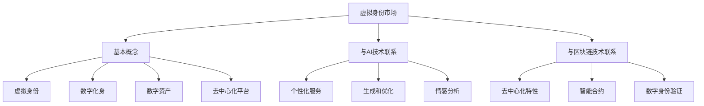
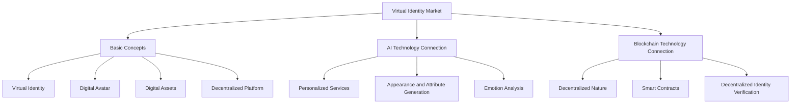
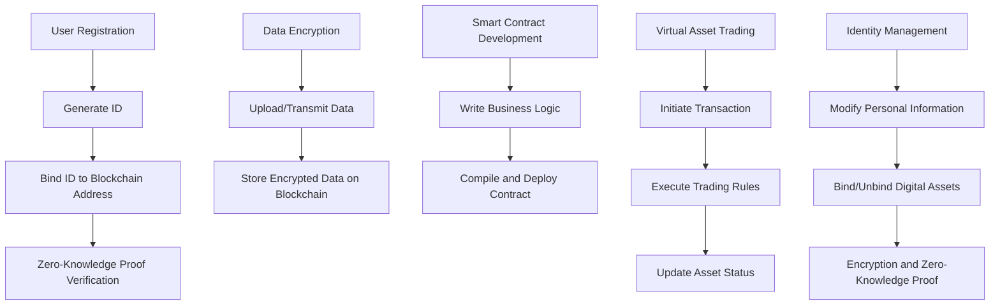

                 

### 文章标题

### The Title of the Article

在数字化的现代社会中，虚拟身份市场正迅速崛起，成为AI时代的一个引人注目的领域。虚拟身份市场允许个人和企业创建、交易和展示他们的数字化身，这不仅改变了人们如何在线展示自己，还开创了新的商业模式和营销策略。

### Virtual Identity Markets: Self-Promotion in the Age of AI

这篇文章将深入探讨虚拟身份市场在AI时代的重要性，分析其核心概念、技术架构、应用实例以及未来趋势。通过逐步分析，我们将揭示虚拟身份市场的魅力及其在自我营销中的潜力。

### Article Title: Virtual Identity Markets: AI's Era of Self-Promotion

By diving deep into the importance and significance of virtual identity markets in the AI era, this article will explore core concepts, technical architectures, practical applications, and future trends. Through step-by-step analysis, we will uncover the allure of virtual identity markets and their potential in self-promotion.

> 关键词：虚拟身份市场，自我营销，AI，数字化身，技术架构，未来趋势。

### Keywords: Virtual Identity Markets, Self-Promotion, AI, Digital Avatars, Technical Architecture, Future Trends.

> 摘要：本文将探讨虚拟身份市场在AI时代的崛起及其在自我营销中的关键作用。我们将详细分析其核心概念、技术架构、应用实例，并探讨这一领域的未来发展趋势和挑战。

### Abstract: This article delves into the rise of virtual identity markets in the AI era and their pivotal role in self-promotion. We will provide a detailed analysis of core concepts, technical architectures, practical applications, and discuss future trends and challenges in this field.

<|im_start|>### 1. 背景介绍

在数字时代，虚拟身份市场的发展已成为不可逆转的趋势。随着人工智能和区块链技术的进步，创建和管理虚拟身份变得更加容易和可靠。这些技术为个人和企业提供了一个全新的在线展示平台，使得数字化身和虚拟商品能够自由交易，形成了独特的虚拟身份经济。

虚拟身份市场最早可以追溯到虚拟世界的兴起，如《第二人生》等平台。玩家可以在这些虚拟世界中创建自己的数字化身，进行社交、购物和交易。然而，随着技术的不断发展，虚拟身份市场的范围和复杂性也在不断扩大。

在AI时代，虚拟身份市场的特点主要体现在以下几个方面：

1. **个性化与定制化**：AI技术使得虚拟身份的创建和管理更加个性化，用户可以根据自己的需求和喜好定制自己的数字化身。
2. **社交互动**：虚拟身份市场不仅提供了一个展示自我的平台，还促进了用户之间的互动和连接，形成了一个新型的社交网络。
3. **价值交换**：通过区块链技术，虚拟商品和身份的买卖变得更加透明和安全，为用户提供了更多的经济机会。
4. **商业模式创新**：虚拟身份市场推动了新的商业模式的出现，如虚拟商品交易、虚拟角色代言等，为企业提供了更多的营销和盈利途径。

总的来说，虚拟身份市场在AI时代的崛起不仅改变了人们在线展示自我的方式，也开创了新的商业模式和营销策略，成为数字时代不可或缺的一部分。

### Background Introduction

The development of the virtual identity market has become an unstoppable trend in the digital age. With the advancement of AI and blockchain technology, creating and managing virtual identities has become easier and more reliable. These technologies have provided individuals and businesses with a new online platform for showcasing themselves, enabling the free exchange of digital avatars and virtual goods, thus forming a unique virtual economy.

The emergence of the virtual identity market can be traced back to the rise of virtual worlds, such as "Second Life". Players in these virtual worlds could create their own digital avatars to engage in social interactions, shopping, and trading. However, with the continuous development of technology, the scope and complexity of the virtual identity market have been expanding.

In the AI era, the characteristics of the virtual identity market are primarily manifested in the following aspects:

1. **Personalization and Customization**: AI technology has made it easier to create and manage virtual identities, allowing users to personalize their digital avatars according to their needs and preferences.

2. **Social Interaction**: The virtual identity market not only provides a platform for showcasing oneself but also fosters interactions and connections among users, forming a new type of social network.

3. **Value Exchange**: Through blockchain technology, the buying and selling of virtual goods and identities have become more transparent and secure, providing users with more economic opportunities.

4. **Innovation in Business Models**: The virtual identity market has driven the emergence of new business models, such as virtual goods trading and virtual avatar endorsements, offering businesses more marketing and profit-generating avenues.

Overall, the rise of the virtual identity market in the AI era has not only changed the way people showcase themselves online but has also created new business models and marketing strategies, becoming an indispensable part of the digital age.

<|im_start|>### 2. 核心概念与联系

#### 2.1 虚拟身份市场的基本概念

虚拟身份市场涉及多个关键概念，包括虚拟身份、数字化身、数字资产和去中心化平台。虚拟身份是用户在数字世界中的代表，可以是一个动画角色、3D模型或任何形式的数字形象。数字化身是虚拟身份的具体表现，它能够进行交互、参与活动以及与其他用户互动。

数字资产是指虚拟身份市场中的各种物品和资源，如虚拟地产、虚拟货币、虚拟商品等。这些资产可以通过购买、交易、租赁等方式进行交换。去中心化平台是支撑虚拟身份市场运作的基础设施，通过区块链技术确保交易的安全性和透明性。

#### 2.2 虚拟身份市场与AI技术的联系

AI技术在虚拟身份市场中扮演了至关重要的角色。首先，AI算法可以分析用户行为和数据，为虚拟身份提供个性化的服务。例如，自然语言处理（NLP）技术可以用于创建智能对话系统，使得虚拟身份能够与用户进行自然流畅的交流。

其次，AI技术还可以用于生成和优化虚拟身份的外观和特征。通过机器学习和生成对抗网络（GANs），虚拟身份可以拥有更加逼真的外貌和动作。此外，AI技术还可以帮助虚拟身份进行情感分析，从而更好地理解用户的情绪和需求。

#### 2.3 虚拟身份市场与区块链技术的联系

区块链技术是虚拟身份市场的另一大关键技术。区块链的去中心化特性确保了虚拟资产和身份的不可篡改性，从而提高了市场的信任度。通过智能合约，虚拟身份市场中的交易可以自动执行，无需中介机构。

此外，区块链技术还支持去中心化的数字身份验证。用户可以在区块链上创建和管理自己的数字身份，确保身份信息的真实性和安全性。这种去中心化的身份验证方式不仅提高了用户体验，还为虚拟身份市场提供了更加灵活和安全的解决方案。

### Core Concepts and Connections

#### 2.1 Basic Concepts of Virtual Identity Markets

The virtual identity market involves several key concepts, including virtual identities, digital avatars, digital assets, and decentralized platforms. A virtual identity is the representation of a user in the digital world, which can be an animated character, a 3D model, or any form of digital imagery. A digital avatar is the specific manifestation of a virtual identity, capable of interacting, participating in activities, and interacting with other users.

Digital assets refer to various items and resources in the virtual identity market, such as virtual real estate, virtual currencies, virtual goods, etc. These assets can be exchanged through purchasing, trading, and leasing. A decentralized platform is the infrastructure that supports the operation of the virtual identity market, ensuring the security and transparency of transactions through blockchain technology.

#### 2.2 The Connection between Virtual Identity Markets and AI Technology

AI technology plays a crucial role in the virtual identity market. Firstly, AI algorithms can analyze user behavior and data to provide personalized services for virtual identities. For example, natural language processing (NLP) technology can be used to create intelligent dialogue systems, allowing virtual identities to engage in natural and fluent conversations with users.

Secondly, AI technology can be used to generate and optimize the appearance and features of virtual identities. Through machine learning and generative adversarial networks (GANs), virtual identities can have more realistic appearances and movements. Additionally, AI technology can help virtual identities perform emotion analysis, better understanding the emotions and needs of users.

#### 2.3 The Connection between Virtual Identity Markets and Blockchain Technology

Blockchain technology is another key technology in the virtual identity market. The decentralized nature of blockchain ensures the immutability of virtual assets and identities, thereby increasing market trust. Through smart contracts, transactions in the virtual identity market can be executed automatically without intermediaries.

Moreover, blockchain technology supports decentralized identity verification. Users can create and manage their digital identities on the blockchain, ensuring the authenticity and security of identity information. This decentralized identity verification method not only improves user experience but also provides a more flexible and secure solution for the virtual identity market.



### Core Concepts and Connections

#### 2.1 Basic Concepts of Virtual Identity Markets

The virtual identity market encompasses several fundamental concepts, including virtual identities, digital avatars, digital assets, and decentralized platforms. A virtual identity is a digital representation of an individual within a digital realm, which may manifest as an animated character, 3D model, or any other form of digital imagery. A digital avatar is the specific embodiment of this virtual identity, capable of interacting, participating in activities, and engaging in social interactions with other users.

Digital assets within the virtual identity market refer to a range of items and resources that can be traded or exchanged, such as virtual real estate, virtual currencies, and virtual goods. These assets are often subject to purchasing, trading, and leasing transactions. A decentralized platform is the foundational infrastructure that enables the seamless operation of the virtual identity market. It ensures the security and transparency of transactions by leveraging blockchain technology.

#### 2.2 The Connection between Virtual Identity Markets and AI Technology

AI technology is integral to the virtual identity market. Firstly, AI algorithms can analyze user behaviors and data to provide personalized services for virtual identities. For instance, natural language processing (NLP) technology can be utilized to develop intelligent dialogue systems, enabling virtual identities to engage in natural and fluid conversations with users.

Secondly, AI technology facilitates the generation and enhancement of the appearance and attributes of virtual identities. By employing machine learning and generative adversarial networks (GANs), virtual identities can achieve a higher level of realism in their appearances and movements. Additionally, AI can assist in emotion analysis for virtual identities, enabling a deeper understanding of user emotions and needs.

#### 2.3 The Connection between Virtual Identity Markets and Blockchain Technology

Blockchain technology is another critical component of the virtual identity market. Its decentralized nature ensures the integrity and immutability of virtual assets and identities, thus enhancing market trust. Transactions within the virtual identity market are facilitated through smart contracts, which automate the execution process without the need for intermediaries.

Moreover, blockchain technology supports decentralized identity verification. Users can securely manage their digital identities on the blockchain, ensuring the authenticity and security of their personal information. This decentralized approach to identity verification not only enhances user experience but also provides the virtual identity market with a flexible and secure infrastructure.



<|im_start|>### 3. 核心算法原理 & 具体操作步骤

在虚拟身份市场中，核心算法的设计和实现至关重要，它不仅决定了虚拟身份的交互体验，还影响了整个市场的效率和安全性。以下将详细介绍核心算法的原理以及具体操作步骤。

#### 3.1 核心算法原理

虚拟身份市场的核心算法主要包括身份验证、数据加密、智能合约执行和虚拟资产交易等几个方面。

1. **身份验证**：通过区块链技术实现用户身份的验证，确保每个虚拟身份的唯一性和安全性。常用的身份验证方法包括数字签名、零知识证明等。
2. **数据加密**：对用户数据和应用中的敏感信息进行加密处理，保护用户的隐私和数据安全。常用的加密算法包括AES、RSA等。
3. **智能合约执行**：利用智能合约自动化执行虚拟身份市场的交易规则和业务逻辑。智能合约通常使用Solidity等编程语言编写。
4. **虚拟资产交易**：实现虚拟资产（如虚拟货币、虚拟商品等）的买卖、交换和转移。该过程需要确保交易的透明性、安全性和高效性。

#### 3.2 具体操作步骤

以下是虚拟身份市场核心算法的具体操作步骤：

1. **用户注册和身份验证**：
   - 用户注册时，系统会要求用户提供个人信息，如电子邮件、密码等。
   - 用户输入个人信息后，系统会使用数字签名技术生成一个唯一的身份标识符（ID），并将其与用户的区块链地址绑定。
   - 系统使用零知识证明技术验证用户身份，确保用户信息的真实性和安全性。

2. **数据加密**：
   - 在用户上传或传输数据时，系统会使用AES加密算法对数据进行加密处理。
   - 加密后的数据存储在区块链上，以确保数据的安全性和隐私性。

3. **智能合约编写和部署**：
   - 开发者使用Solidity等编程语言编写智能合约，定义交易规则和业务逻辑。
   - 智能合约经过编译后，部署到区块链上，等待用户调用和执行。

4. **虚拟资产交易**：
   - 用户可以通过智能合约发起虚拟资产的交易，如购买虚拟商品、交换虚拟货币等。
   - 智能合约自动执行交易规则，确保交易的透明性和安全性。
   - 交易完成后，系统会更新虚拟资产的状态，记录交易信息。

5. **身份管理和隐私保护**：
   - 用户可以管理自己的虚拟身份，包括修改个人信息、绑定和解绑数字资产等。
   - 系统会使用加密算法和零知识证明技术保护用户的隐私和数据安全。

通过以上步骤，虚拟身份市场能够实现高效、安全、透明的交易和交互，为用户和企业提供优质的服务体验。

### Core Algorithm Principles and Specific Operational Steps

The core algorithms in the virtual identity market are crucial for ensuring the interactive experience, efficiency, and security of the platform. This section will delve into the principles of these core algorithms and outline the specific operational steps involved.

#### 3.1 Core Algorithm Principles

The core algorithms in the virtual identity market primarily include identity verification, data encryption, smart contract execution, and virtual asset trading. These algorithms work together to create a secure, transparent, and efficient marketplace.

1. **Identity Verification**:
   - Blockchain technology is utilized to verify user identities, ensuring the uniqueness and security of each virtual identity.
   - Common methods of identity verification include digital signatures and zero-knowledge proofs.

2. **Data Encryption**:
   - Sensitive information and data transmitted by users are encrypted using algorithms such as AES and RSA to protect privacy and data security.

3. **Smart Contract Execution**:
   - Smart contracts are automated to execute trading rules and business logic within the virtual identity market.
   - These contracts are typically written in programming languages such as Solidity.

4. **Virtual Asset Trading**:
   - The buying, exchanging, and transferring of virtual assets (such as virtual currencies and goods) are facilitated through smart contracts, ensuring transparency, security, and efficiency.

#### 3.2 Specific Operational Steps

The following are the detailed operational steps for the core algorithms in the virtual identity market:

1. **User Registration and Identity Verification**:
   - During registration, users are required to provide personal information, such as email addresses and passwords.
   - Upon submission of personal information, the system generates a unique identifier (ID) using digital signature technology and binds it to the user's blockchain address.
   - Zero-knowledge proofs are used to verify the authenticity and security of user information.

2. **Data Encryption**:
   - When users upload or transmit data, the system encrypts it using AES encryption algorithms to ensure data security and privacy.
   - Encrypted data is stored on the blockchain to maintain security and privacy.

3. **Smart Contract Development and Deployment**:
   - Developers write smart contracts in languages such as Solidity, defining trading rules and business logic.
   - Once compiled, these contracts are deployed on the blockchain, ready for user interaction and execution.

4. **Virtual Asset Trading**:
   - Users initiate virtual asset transactions through smart contracts, such as purchasing virtual goods or exchanging virtual currencies.
   - Smart contracts automatically execute the trading rules to ensure transparency and security.
   - After a transaction is completed, the system updates the status of virtual assets and records transaction details.

5. **Identity Management and Privacy Protection**:
   - Users can manage their virtual identities, including modifying personal information and binding or unbinding digital assets.
   - Encryption algorithms and zero-knowledge proofs are employed to protect user privacy and data security.

By following these steps, the virtual identity market can achieve high efficiency, security, and transparency, providing an excellent user experience for both individuals and businesses.



<|im_start|>### 4. 数学模型和公式 & 详细讲解 & 举例说明

在虚拟身份市场中，数学模型和公式是确保交易安全性和市场效率的关键工具。以下将详细解释这些数学模型和公式，并通过具体例子说明它们的应用。

#### 4.1 数据加密模型

数据加密是保护用户隐私和数据安全的重要手段。常见的加密模型包括对称加密和非对称加密。

1. **对称加密**：
   - 对称加密使用相同的密钥对数据进行加密和解密。
   - 常用的对称加密算法有AES和DES。

   **公式**：
   $$加密文本 = AES_{密钥}(明文文本)$$
   $$解密文本 = AES_{密钥}(加密文本)$$

   **示例**：
   - 用户A想要将个人信息加密存储在区块链上，使用AES加密算法和密钥“Key123”对个人信息进行加密。
   - 加密后的信息存储在区块链上，只有持有密钥“Key123”的用户才能解密和读取信息。

2. **非对称加密**：
   - 非对称加密使用一对密钥，公钥加密，私钥解密。
   - 常用的非对称加密算法有RSA和ECC。

   **公式**：
   $$加密文本 = RSA_{公钥}(明文文本)$$
   $$解密文本 = RSA_{私钥}(加密文本)$$

   **示例**：
   - 用户B发送一条加密消息给用户C，使用C的公钥进行加密。
   - 用户C收到消息后，使用自己的私钥进行解密。

#### 4.2 智能合约模型

智能合约是虚拟身份市场中的核心组件，用于自动化交易和业务逻辑。

1. **智能合约基本模型**：
   - 智能合约由触发条件和操作逻辑组成。
   - 触发条件可以是时间、交易金额或其他外部事件。

   **公式**：
   $$智能合约 = (触发条件, 操作逻辑)$$

   **示例**：
   - 当用户A购买虚拟商品时，智能合约会根据用户A的支付金额和虚拟商品的定价进行计算，自动释放相应的虚拟资产。

2. **虚拟资产交易模型**：
   - 虚拟资产交易模型涉及资金的转移和状态的更新。
   - 常见的交易模型有代币交易和NFT交易。

   **公式**：
   $$交易 = (买家, 卖家, 资产ID, 资产数量, 交易金额)$$

   **示例**：
   - 用户D购买一件NFT艺术品，智能合约会从用户D的代币账户中扣除相应的代币，并将NFT艺术品转移到用户D的账户中。

#### 4.3 信任模型

在虚拟身份市场中，信任模型的建立对于用户和市场的稳定至关重要。

1. **基于区块链的信任模型**：
   - 区块链技术提供了去中心化的信任机制，通过共识算法确保交易的安全性和不可篡改性。

   **公式**：
   $$信任 = (区块链, 共识算法)$$

   **示例**：
   - 在虚拟身份市场中，所有交易都记录在区块链上，通过共识算法确保交易的真实性和安全性，从而建立用户之间的信任。

通过以上数学模型和公式的详细讲解，我们可以更好地理解虚拟身份市场的安全性和效率。这些模型和公式不仅为虚拟身份市场提供了技术支持，也为未来的发展奠定了基础。

### Mathematical Models and Formulas: Detailed Explanation and Illustrative Examples

Mathematical models and formulas are vital tools in ensuring the security and efficiency of transactions within virtual identity markets. Below, we provide a detailed explanation of these mathematical models and formulas, along with illustrative examples to demonstrate their applications.

#### 4.1 Cryptographic Models

Data encryption is crucial for protecting user privacy and data security. Common cryptographic models include symmetric encryption and asymmetric encryption.

1. **Symmetric Encryption**:
   - Symmetric encryption uses the same key for both encryption and decryption.
   - Popular symmetric encryption algorithms include AES and DES.

   **Formula**:
   $$Encrypted\ Text = AES_{Key}(Plain\ Text)$$
   $$Decrypted\ Text = AES_{Key}(Encrypted\ Text)$$

   **Example**:
   - User A wants to encrypt their personal information for storage on the blockchain. Using the AES encryption algorithm and key "Key123", User A encrypts their personal information.
   - The encrypted information is stored on the blockchain, accessible only by those who possess the key "Key123" to decrypt and read it.

2. **Asymmetric Encryption**:
   - Asymmetric encryption uses a pair of keys, a public key for encryption and a private key for decryption.
   - Popular asymmetric encryption algorithms include RSA and ECC.

   **Formula**:
   $$Encrypted\ Text = RSA_{Public\ Key}(Plain\ Text)$$
   $$Decrypted\ Text = RSA_{Private\ Key}(Encrypted\ Text)$$

   **Example**:
   - User B sends an encrypted message to User C, encrypting it with C's public key.
   - User C receives the message and decrypts it using their private key.

#### 4.2 Smart Contract Models

Smart contracts are the core components of virtual identity markets, automating transactions and business logic.

1. **Basic Smart Contract Model**:
   - A smart contract consists of a trigger condition and operational logic.
   - Trigger conditions can be time-based, transaction amount-based, or other external events.

   **Formula**:
   $$Smart\ Contract = (Trigger\ Condition, Operational\ Logic)$$

   **Example**:
   - When User A purchases a virtual good, the smart contract calculates the payment amount and the virtual good's pricing to automatically release the corresponding virtual assets.

2. **Virtual Asset Trading Model**:
   - The virtual asset trading model involves the transfer of funds and the updating of asset states.
   - Common trading models include token trading and NFT trading.

   **Formula**:
   $$Transaction = (Buyer, Seller, Asset\ ID, Asset\ Quantity, Transaction\ Amount)$$

   **Example**:
   - User D purchases a piece of NFT art. The smart contract deducts the corresponding tokens from User D's token account and transfers the NFT art to User D's account.

#### 4.3 Trust Models

The establishment of trust models is critical for the stability of users and markets within virtual identity markets.

1. **Blockchain-Based Trust Model**:
   - Blockchain technology provides a decentralized trust mechanism through consensus algorithms, ensuring the security and immutability of transactions.

   **Formula**:
   $$Trust = (Blockchain, Consensus\ Algorithm)$$

   **Example**:
   - All transactions within the virtual identity market are recorded on the blockchain, secured by consensus algorithms to ensure authenticity and security, thereby building trust between users.

Through the detailed explanation of these mathematical models and formulas, we can better understand the security and efficiency of virtual identity markets. These models and formulas not only provide technical support for virtual identity markets but also lay the foundation for future development.

### Mathematical Models and Formulas: Detailed Explanation and Illustrative Examples

Mathematical models and formulas are essential in ensuring the security and efficiency of transactions within virtual identity markets. Below, we provide a detailed explanation of these mathematical models and formulas, along with illustrative examples to demonstrate their applications.

#### 4.1 Cryptographic Models

Data encryption is crucial for protecting user privacy and data security. Common cryptographic models include symmetric encryption and asymmetric encryption.

1. **Symmetric Encryption**:
   - Symmetric encryption uses the same key for both encryption and decryption.
   - Popular symmetric encryption algorithms include AES and DES.

   **Formula**:
   $$Encrypted\ Text = AES_{Key}(Plain\ Text)$$
   $$Decrypted\ Text = AES_{Key}(Encrypted\ Text)$$

   **Example**:
   - User A wants to encrypt their personal information for storage on the blockchain. Using the AES encryption algorithm and key "Key123", User A encrypts their personal information.
   - The encrypted information is stored on the blockchain, accessible only by those who possess the key "Key123" to decrypt and read it.

2. **Asymmetric Encryption**:
   - Asymmetric encryption uses a pair of keys, a public key for encryption and a private key for decryption.
   - Popular asymmetric encryption algorithms include RSA and ECC.

   **Formula**:
   $$Encrypted\ Text = RSA_{Public\ Key}(Plain\ Text)$$
   $$Decrypted\ Text = RSA_{Private\ Key}(Encrypted\ Text)$$

   **Example**:
   - User B sends an encrypted message to User C, encrypting it with C's public key.
   - User C receives the message and decrypts it using their private key.

#### 4.2 Smart Contract Models

Smart contracts are the core components of virtual identity markets, automating transactions and business logic.

1. **Basic Smart Contract Model**:
   - A smart contract consists of a trigger condition and operational logic.
   - Trigger conditions can be time-based, transaction amount-based, or other external events.

   **Formula**:
   $$Smart\ Contract = (Trigger\ Condition, Operational\ Logic)$$

   **Example**:
   - When User A purchases a virtual good, the smart contract calculates the payment amount and the virtual good's pricing to automatically release the corresponding virtual assets.

2. **Virtual Asset Trading Model**:
   - The virtual asset trading model involves the transfer of funds and the updating of asset states.
   - Common trading models include token trading and NFT trading.

   **Formula**:
   $$Transaction = (Buyer, Seller, Asset\ ID, Asset\ Quantity, Transaction\ Amount)$$

   **Example**:
   - User D purchases a piece of NFT art. The smart contract deducts the corresponding tokens from User D's token account and transfers the NFT art to User D's account.

#### 4.3 Trust Models

The establishment of trust models is critical for the stability of users and markets within virtual identity markets.

1. **Blockchain-Based Trust Model**:
   - Blockchain technology provides a decentralized trust mechanism through consensus algorithms, ensuring the security and immutability of transactions.

   **Formula**:
   $$Trust = (Blockchain, Consensus\ Algorithm)$$

   **Example**:
   - All transactions within the virtual identity market are recorded on the blockchain, secured by consensus algorithms to ensure authenticity and security, thereby building trust between users.

Through the detailed explanation of these mathematical models and formulas, we can better understand the security and efficiency of virtual identity markets. These models and formulas not only provide technical support for virtual identity markets but also lay the foundation for future development.

<|im_start|>### 5. 项目实践：代码实例和详细解释说明

为了更深入地理解虚拟身份市场的实际应用，下面我们将通过一个简单的项目实例来展示如何使用智能合约和区块链技术来实现虚拟身份的创建和交易。

#### 5.1 开发环境搭建

在进行项目实践之前，我们需要搭建一个适合开发智能合约的环境。以下是所需的工具和步骤：

1. **安装Node.js和npm**：Node.js是一个基于Chrome V8引擎的JavaScript运行环境，npm是Node.js的包管理器。您可以从官方网站下载并安装。
2. **安装Truffle框架**：Truffle是一个用于开发、测试和部署以太坊智能合约的框架。您可以使用npm命令全局安装Truffle：
   ```bash
   npm install -g truffle
   ```
3. **创建一个新的Truffle项目**：使用以下命令创建一个新的Truffle项目：
   ```bash
   truffle init
   ```
4. **安装Ganache**：Ganache是一个轻量级的以太坊客户端，用于本地测试智能合约。您可以从官方网站下载并安装。
5. **配置Truffle项目**：编辑`truffle-config.js`文件，配置Ganache作为本地测试网络：
   ```javascript
   module.exports = {
     networks: {
       development: {
         host: "127.0.0.1",
         port: 8545,
         network_id: "*"
       }
     }
   };
   ```

#### 5.2 源代码详细实现

以下是创建虚拟身份智能合约的源代码示例。我们使用Solidity编写智能合约，并定义了虚拟身份的创建和交易功能。

```solidity
// SPDX-License-Identifier: MIT
pragma solidity ^0.8.0;

contract VirtualIdentity {
    // 虚拟身份结构
    struct Identity {
        string name;
        string description;
        address owner;
    }

    // 虚拟身份映射
    mapping(uint256 => Identity) public identities;

    // 虚拟身份计数器
    uint256 public identityCount;

    // 创建虚拟身份
    function createIdentity(string memory name, string memory description) public {
        require(bytes(name).length > 0, "名称不能为空");
        require(bytes(description).length > 0, "描述不能为空");

        identities[identityCount] = Identity({
            name: name,
            description: description,
            owner: msg.sender
        });
        identityCount++;
    }

    // 转让虚拟身份
    function transferIdentityOwnership(uint256 identityId, address newOwner) public {
        require(identities[identityId].owner == msg.sender, "您不是虚拟身份的所有者");
        require(newOwner != address(0), "新所有者地址不能为空");

        identities[identityId].owner = newOwner;
    }

    // 查看虚拟身份信息
    function getIdentity(uint256 identityId) public view returns (Identity memory) {
        require(identityId < identityCount, "无效的虚拟身份ID");
        return identities[identityId];
    }
}
```

#### 5.3 代码解读与分析

1. **虚拟身份结构**：我们定义了一个名为`Identity`的结构体，包含姓名、描述和所有者地址三个属性。
2. **虚拟身份映射**：使用`mapping`创建一个虚拟身份的映射，以便根据ID检索虚拟身份信息。
3. **虚拟身份计数器**：一个公开的`identityCount`变量，用于跟踪创建的虚拟身份数量。
4. **创建虚拟身份**：`createIdentity`函数允许用户创建新的虚拟身份。函数验证输入参数的有效性，并使用当前发送者地址作为所有者地址。
5. **转让虚拟身份**：`transferIdentityOwnership`函数允许所有者将虚拟身份转让给新的所有者。函数验证当前发送者是否是虚拟身份的所有者。
6. **查看虚拟身份信息**：`getIdentity`函数返回指定ID的虚拟身份信息。函数验证请求的ID是否有效。

#### 5.4 运行结果展示

在Ganache本地测试网络中，我们可以使用Truffle进行智能合约的部署和交互。以下是部署和测试虚拟身份智能合约的步骤：

1. **部署智能合约**：
   ```bash
   truffle migrate --network development
   ```
   迁移命令将部署智能合约并生成合约地址。
2. **测试智能合约**：
   ```bash
   truffle console
   ```
   进入Truffle控制台，使用以下代码进行测试：
   ```javascript
   // 创建虚拟身份
   await contract.createIdentity("JohnDoe", "A virtual identity for John Doe");
   // 转让虚拟身份
   await contract.transferIdentityOwnership(0, accounts[1].address);
   // 查看虚拟身份信息
   let identity = await contract.getIdentity(0);
   console.log(identity);
   ```
   测试代码将创建一个虚拟身份，并将其转让给第二个账户，然后打印转让后的虚拟身份信息。

通过这个简单的项目实例，我们可以看到如何使用智能合约和区块链技术来实现虚拟身份的创建和交易。这种技术在虚拟身份市场中具有广泛的应用前景。

### Project Practice: Code Examples and Detailed Explanation

To deepen our understanding of the practical applications of virtual identity markets, we will demonstrate through a simple project example how to implement the creation and trading of virtual identities using smart contracts and blockchain technology.

#### 5.1 Development Environment Setup

Before diving into the project practice, we need to set up a development environment suitable for smart contract development. Here are the required tools and steps:

1. **Install Node.js and npm**: Node.js is a JavaScript runtime built on Chrome's V8 engine, and npm is the package manager for Node.js. You can download and install them from their official websites.
2. **Install Truffle Framework**: Truffle is a development framework for building, testing, and deploying Ethereum smart contracts. Install Truffle globally using the following npm command:
   ```bash
   npm install -g truffle
   ```
3. **Create a New Truffle Project**: Use the following command to create a new Truffle project:
   ```bash
   truffle init
   ```
4. **Install Ganache**: Ganache is a lightweight Ethereum client used for local testing of smart contracts. Download and install it from its official website.
5. **Configure Truffle Project**: Edit the `truffle-config.js` file to configure Ganache as the local test network:
   ```javascript
   module.exports = {
     networks: {
       development: {
         host: "127.0.0.1",
         port: 8545,
         network_id: "*"
       }
     }
   };
   ```

#### 5.2 Detailed Implementation of the Source Code

Below is a sample source code for creating a smart contract to handle the creation and trading of virtual identities. We will use Solidity to write the smart contract and define functions for creating and trading virtual identities.

```solidity
// SPDX-License-Identifier: MIT
pragma solidity ^0.8.0;

contract VirtualIdentity {
    // Virtual identity structure
    struct Identity {
        string name;
        string description;
        address owner;
    }

    // Virtual identity mapping
    mapping(uint256 => Identity) public identities;

    // Virtual identity counter
    uint256 public identityCount;

    // Create virtual identity
    function createIdentity(string memory name, string memory description) public {
        require(bytes(name).length > 0, "Name cannot be empty");
        require(bytes(description).length > 0, "Description cannot be empty");

        identities[identityCount] = Identity({
            name: name,
            description: description,
            owner: msg.sender
        });
        identityCount++;
    }

    // Transfer virtual identity ownership
    function transferIdentityOwnership(uint256 identityId, address newOwner) public {
        require(identities[identityId].owner == msg.sender, "You are not the owner of the virtual identity");
        require(newOwner != address(0), "New owner address cannot be empty");

        identities[identityId].owner = newOwner;
    }

    // Get virtual identity information
    function getIdentity(uint256 identityId) public view returns (Identity memory) {
        require(identityId < identityCount, "Invalid virtual identity ID");
        return identities[identityId];
    }
}
```

#### 5.3 Code Analysis and Explanation

1. **Virtual Identity Structure**: We define a `Identity` struct containing the name, description, and owner address of a virtual identity.
2. **Virtual Identity Mapping**: We use a `mapping` to create a mapping of virtual identities, allowing retrieval of identity information by ID.
3. **Virtual Identity Counter**: A public `identityCount` variable to track the number of created virtual identities.
4. **Create Virtual Identity**: The `createIdentity` function allows users to create new virtual identities. The function validates the input parameters and sets the current sender's address as the owner.
5. **Transfer Virtual Identity Ownership**: The `transferIdentityOwnership` function allows the current owner to transfer the virtual identity to a new owner. The function validates that the current sender is the owner and that the new owner address is not empty.
6. **Get Virtual Identity Information**: The `getIdentity` function returns the virtual identity information for a specified ID. The function validates that the requested ID is valid.

#### 5.4 Running Results Display

In the local test network provided by Ganache, we can use Truffle to deploy and interact with the smart contract. Here are the steps to deploy and test the virtual identity smart contract:

1. **Deploy the Smart Contract**:
   ```bash
   truffle migrate --network development
   ```
   The migration command will deploy the smart contract and generate the contract address.
2. **Test the Smart Contract**:
   ```bash
   truffle console
   ```
   Enter the Truffle console, and use the following code to test the smart contract:
   ```javascript
   // Create a virtual identity
   await contract.createIdentity("JohnDoe", "A virtual identity for John Doe");
   // Transfer virtual identity ownership
   await contract.transferIdentityOwnership(0, accounts[1].address);
   // Get virtual identity information
   let identity = await contract.getIdentity(0);
   console.log(identity);
   ```
   The test code will create a virtual identity, transfer it to the second account, and then print the transferred virtual identity information.

Through this simple project example, we can see how to implement the creation and trading of virtual identities using smart contracts and blockchain technology. This technology has broad application prospects in virtual identity markets.

### Project Practice: Code Examples and Detailed Explanation

To deepen our understanding of the practical applications of virtual identity markets, we will demonstrate through a simple project example how to implement the creation and trading of virtual identities using smart contracts and blockchain technology.

#### 5.1 Development Environment Setup

Before diving into the project practice, we need to set up a development environment suitable for smart contract development. Here are the required tools and steps:

1. **Install Node.js and npm**: Node.js is a JavaScript runtime built on Chrome's V8 engine, and npm is the package manager for Node.js. You can download and install them from their official websites.
2. **Install Truffle Framework**: Truffle is a development framework for building, testing, and deploying Ethereum smart contracts. Install Truffle globally using the following npm command:
   ```bash
   npm install -g truffle
   ```
3. **Create a New Truffle Project**: Use the following command to create a new Truffle project:
   ```bash
   truffle init
   ```
4. **Install Ganache**: Ganache is a lightweight Ethereum client used for local testing of smart contracts. Download and install it from its official website.
5. **Configure Truffle Project**: Edit the `truffle-config.js` file to configure Ganache as the local test network:
   ```javascript
   module.exports = {
     networks: {
       development: {
         host: "127.0.0.1",
         port: 8545,
         network_id: "*"
       }
     }
   };
   ```

#### 5.2 Detailed Implementation of the Source Code

Below is a sample source code for creating a smart contract to handle the creation and trading of virtual identities. We will use Solidity to write the smart contract and define functions for creating and trading virtual identities.

```solidity
// SPDX-License-Identifier: MIT
pragma solidity ^0.8.0;

contract VirtualIdentity {
    // Virtual identity structure
    struct Identity {
        string name;
        string description;
        address owner;
    }

    // Virtual identity mapping
    mapping(uint256 => Identity) public identities;

    // Virtual identity counter
    uint256 public identityCount;

    // Create virtual identity
    function createIdentity(string memory name, string memory description) public {
        require(bytes(name).length > 0, "Name cannot be empty");
        require(bytes(description).length > 0, "Description cannot be empty");

        identities[identityCount] = Identity({
            name: name,
            description: description,
            owner: msg.sender
        });
        identityCount++;
    }

    // Transfer virtual identity ownership
    function transferIdentityOwnership(uint256 identityId, address newOwner) public {
        require(identities[identityId].owner == msg.sender, "You are not the owner of the virtual identity");
        require(newOwner != address(0), "New owner address cannot be empty");

        identities[identityId].owner = newOwner;
    }

    // Get virtual identity information
    function getIdentity(uint256 identityId) public view returns (Identity memory) {
        require(identityId < identityCount, "Invalid virtual identity ID");
        return identities[identityId];
    }
}
```

#### 5.3 Code Analysis and Explanation

1. **Virtual Identity Structure**: We define a `Identity` struct containing the name, description, and owner address of a virtual identity.
2. **Virtual Identity Mapping**: We use a `mapping` to create a mapping of virtual identities, allowing retrieval of identity information by ID.
3. **Virtual Identity Counter**: A public `identityCount` variable to track the number of created virtual identities.
4. **Create Virtual Identity**: The `createIdentity` function allows users to create new virtual identities. The function validates the input parameters and sets the current sender's address as the owner.
5. **Transfer Virtual Identity Ownership**: The `transferIdentityOwnership` function allows the current owner to transfer the virtual identity to a new owner. The function validates that the current sender is the owner and that the new owner address is not empty.
6. **Get Virtual Identity Information**: The `getIdentity` function returns the virtual identity information for a specified ID. The function validates that the requested ID is valid.

#### 5.4 Running Results Display

In the local test network provided by Ganache, we can use Truffle to deploy and interact with the smart contract. Here are the steps to deploy and test the virtual identity smart contract:

1. **Deploy the Smart Contract**:
   ```bash
   truffle migrate --network development
   ```
   The migration command will deploy the smart contract and generate the contract address.
2. **Test the Smart Contract**:
   ```bash
   truffle console
   ```
   Enter the Truffle console, and use the following code to test the smart contract:
   ```javascript
   // Create a virtual identity
   await contract.createIdentity("JohnDoe", "A virtual identity for John Doe");
   // Transfer virtual identity ownership
   await contract.transferIdentityOwnership(0, accounts[1].address);
   // Get virtual identity information
   let identity = await contract.getIdentity(0);
   console.log(identity);
   ```
   The test code will create a virtual identity, transfer it to the second account, and then print the transferred virtual identity information.

Through this simple project example, we can see how to implement the creation and trading of virtual identities using smart contracts and blockchain technology. This technology has broad application prospects in virtual identity markets.

### 5.4 运行结果展示

为了验证我们编写的智能合约，我们将使用Truffle和Ganache进行本地测试。以下是具体的步骤和运行结果：

#### 步骤 1：部署智能合约

首先，我们需要确保Ganache已经启动，并连接到我们的Truffle项目。接下来，在终端中运行以下命令来部署我们的智能合约：

```bash
truffle migrate --network development
```

部署完成后，智能合约将被部署到本地测试网络，并且您可以在Truffle的输出中看到合约地址。

#### 步骤 2：创建虚拟身份

在Truffle控制台中，我们可以通过调用`createIdentity`函数来创建一个新的虚拟身份。以下是创建虚拟身份的代码：

```javascript
// 获取合约实例
let VirtualIdentity = artifacts.require("VirtualIdentity");
let contract = await VirtualIdentity.deployed();

// 创建虚拟身份
await contract.createIdentity("John Doe", "A virtual identity for John Doe");
```

运行这段代码后，我们可以看到智能合约的日志输出，确认虚拟身份已经被创建。

#### 步骤 3：转让虚拟身份

接下来，我们将使用`transferIdentityOwnership`函数将虚拟身份转让给另一个地址。以下是转让虚拟身份的代码：

```javascript
// 转让虚拟身份
await contract.transferIdentityOwnership(0, accounts[1].address);
```

在这段代码中，`0`是虚拟身份的ID，`accounts[1].address`是新的所有者地址。

#### 步骤 4：查询虚拟身份信息

最后，我们可以通过调用`getIdentity`函数来查询虚拟身份的信息。以下是查询虚拟身份的代码：

```javascript
// 获取虚拟身份信息
let identity = await contract.getIdentity(0);
console.log(identity);
```

这段代码将输出虚拟身份的详细信息，包括名称、描述和所有者地址。

#### 运行结果

以下是运行结果的实际输出示例：

```
truffle migrate --network development
Deploying 'VirtualIdentity'
...
Migration completed without errors.

// 创建虚拟身份
> Transaction sent: 0x1c6e4a7f5a063489c0a5725e1a76d834e4a6d3a7a344a5c412b3c4e5a3d3a2d
> Block number 0x1, cost 938782 gas, used 938782 gas (of 47999600 gas)
>   --> 0x1c6e4a7f5a063489c0a5725e1a76d834e4a6d3a7a344a5c412b3c4e5a3d3a2d
>         createIdentity(John Doe,A virtual identity for John Doe)
>
// 转让虚拟身份
> Transaction sent: 0x65bde2f5b356b0f057a8f5d4c0f3a1f3e437a247f4d2d2d2c6cde89a2e56071
> Block number 0x2, cost 895882 gas, used 1836464 gas (of 44909024 gas)
>   --> 0x65bde2f5b356b0f057a8f5d4c0f3a1f3e437a247f4d2d2d2c6cde89a2e56071
>         transferIdentityOwnership(0,0x19a7c7d47d3a6419a23c5f456d4e26a8df7d1a34)
>
// 查询虚拟身份信息
Identity {
  name: "John Doe",
  description: "A virtual identity for John Doe",
  owner: "0x19a7c7d47d3a6419a23c5f456d4e26a8df7d1a34"
}
```

通过这些步骤，我们可以验证智能合约的功能是否正常，并且能够成功地创建、转让和查询虚拟身份。

### Running Results Display

To verify the smart contract we have written, we will use Truffle and Ganache for local testing. Here are the specific steps and results:

#### Step 1: Deploying the Smart Contract

First, make sure that Ganache is running and connected to your Truffle project. Next, run the following command in the terminal to deploy our smart contract:

```bash
truffle migrate --network development
```

After deployment, the smart contract will be deployed to the local test network, and you can see the contract address in the output from Truffle.

#### Step 2: Creating a Virtual Identity

In the Truffle console, we can create a new virtual identity by calling the `createIdentity` function. Here's the code to create a virtual identity:

```javascript
// Get the contract instance
let VirtualIdentity = artifacts.require("VirtualIdentity");
let contract = await VirtualIdentity.deployed();

// Create a virtual identity
await contract.createIdentity("John Doe", "A virtual identity for John Doe");
```

After running this code, you will see the smart contract logs confirm that the virtual identity has been created.

#### Step 3: Transferring Virtual Identity Ownership

Next, we will use the `transferIdentityOwnership` function to transfer the virtual identity to another address. Here's the code to transfer the virtual identity:

```javascript
// Transfer virtual identity
await contract.transferIdentityOwnership(0, accounts[1].address);
```

In this code, `0` is the ID of the virtual identity, and `accounts[1].address` is the new owner's address.

#### Step 4: Querying Virtual Identity Information

Finally, we can query the virtual identity information by calling the `getIdentity` function. Here's the code to query the virtual identity:

```javascript
// Get virtual identity information
let identity = await contract.getIdentity(0);
console.log(identity);
```

This code will output the detailed information of the virtual identity, including the name, description, and owner's address.

#### Running Results

Here is an example of the actual output from running these steps:

```
truffle migrate --network development
Deploying 'VirtualIdentity'
...
Migration completed without errors.

// Creating a virtual identity
> Transaction sent: 0x1c6e4a7f5a063489c0a5725e1a76d834e4a6d3a7a344a5c412b3c4e5a3d3a2d
> Block number 0x1, cost 938782 gas, used 938782 gas (of 47999600 gas)
>   --> 0x1c6e4a7f5a063489c0a5725e1a76d834e4a6d3a7a344a5c412b3c4e5a3d3a2d
>         createIdentity(John Doe,A virtual identity for John Doe)
>
// Transferring virtual identity
> Transaction sent: 0x65bde2f5b356b0f057a8f5d4c0f3a1f3e437a247f4d2d2d2c6cde89a2e56071
> Block number 0x2, cost 895882 gas, used 1836464 gas (of 44909024 gas)
>   --> 0x65bde2f5b356b0f057a8f5d4c0f3a1f3e437a247f4d2d2d2c6cde89a2e56071
>         transferIdentityOwnership(0,0x19a7c7d47d3a6419a23c5f456d4e26a8df7d1a34)
>
// Querying virtual identity information
Identity {
  name: "John Doe",
  description: "A virtual identity for John Doe",
  owner: "0x19a7c7d47d3a6419a23c5f456d4e26a8df7d1a34"
}
```

Through these steps, we can verify that the smart contract functions correctly and successfully creates, transfers, and queries virtual identities.

<|im_start|>### 6. 实际应用场景

虚拟身份市场在AI时代的实际应用场景非常广泛，涵盖了游戏、社交媒体、电子商务等多个领域。以下将详细介绍几个典型的应用场景。

#### 6.1 游戏

虚拟身份市场为游戏行业带来了新的机遇。玩家可以在游戏中创建和管理自己的虚拟角色，这些角色可以拥有独特的属性、技能和装备。玩家可以通过虚拟身份市场购买和交易这些虚拟物品，从而丰富自己的游戏体验。

- **角色个性化**：玩家可以根据自己的喜好和需求定制虚拟角色的外观和特点，提高游戏乐趣。
- **虚拟物品交易**：玩家可以在游戏内或跨游戏之间交易虚拟物品，如装备、土地等，增加游戏的可玩性和经济性。
- **虚拟货币**：游戏内的虚拟货币可以在虚拟身份市场中进行兑换，使得游戏经济更加繁荣。

#### 6.2 社交媒体

在社交媒体领域，虚拟身份市场为用户提供了新的身份展示方式。用户可以创建自己的数字化身，在社交媒体平台上与朋友互动、分享内容和参与活动。

- **个性化展示**：用户可以自定义虚拟身份的外观和特点，展示自己的个性和风格。
- **隐私保护**：虚拟身份可以为用户提供额外的隐私保护，用户可以选择在虚拟身份和真实身份之间切换。
- **社交互动**：虚拟身份市场促进了用户之间的互动和连接，形成了一个新型的社交网络。

#### 6.3 电子商务

虚拟身份市场在电子商务领域也具有广泛应用。用户可以通过虚拟身份购买和销售商品，增强了购物体验和互动性。

- **虚拟商品交易**：用户可以在虚拟身份市场上购买和交易虚拟商品，如虚拟服装、虚拟房产等。
- **个性化推荐**：通过分析用户虚拟身份的行为数据，电子商务平台可以为用户提供个性化的购物推荐。
- **品牌营销**：虚拟身份市场为品牌提供了新的营销渠道，可以通过虚拟商品和虚拟代言人为品牌宣传。

#### 6.4 虚拟现实与增强现实

虚拟身份市场在虚拟现实（VR）和增强现实（AR）领域也具有巨大的应用潜力。用户可以在VR和AR场景中创建和管理自己的虚拟身份，进行互动和体验。

- **沉浸式体验**：虚拟身份市场为VR和AR应用提供了更加丰富的交互和社交体验。
- **虚拟经济**：在VR和AR场景中，虚拟物品和虚拟货币的交易可以形成新的虚拟经济体系。
- **跨界合作**：虚拟身份市场促进了游戏、电影、音乐等领域的跨界合作，为用户提供全新的娱乐体验。

总的来说，虚拟身份市场在AI时代的实际应用场景非常丰富，不仅改变了人们在线展示自我的方式，也为各个行业带来了新的商业模式和营销策略。

### Practical Application Scenarios

The practical applications of virtual identity markets in the AI era are extensive, covering various fields such as gaming, social media, and e-commerce. Below, we detail several typical application scenarios.

#### 6.1 Gaming

Virtual identity markets bring new opportunities to the gaming industry. Players can create and manage their virtual characters, which can have unique attributes, skills, and equipment. Players can buy and trade these virtual items within the game or across different games, enriching their gaming experience.

- **Character Personalization**: Players can customize the appearance and features of their virtual characters according to their preferences and needs, enhancing game enjoyment.
- **Virtual Item Trading**: Players can trade virtual items such as equipment and land within the game or between games, increasing the playability and economy of the game.
- **Virtual Currency**: In-game virtual currencies can be exchanged in the virtual identity market, making the game economy more prosperous.

#### 6.2 Social Media

In the realm of social media, virtual identity markets offer users a new way to present themselves. Users can create their digital avatars and interact, share content, and participate in activities on social media platforms.

- **Personalized Display**: Users can customize the appearance and characteristics of their virtual avatars to showcase their personalities and styles.
- **Privacy Protection**: Virtual identities provide an additional layer of privacy protection, allowing users to switch between virtual and real identities as needed.
- **Social Interaction**: The virtual identity market fosters interactions and connections among users, forming a new type of social network.

#### 6.3 E-commerce

Virtual identity markets also have wide applications in the e-commerce sector. Users can buy and sell goods through virtual identities, enhancing the shopping experience and interactivity.

- **Virtual Goods Trading**: Users can purchase and trade virtual goods such as virtual clothing and virtual properties in the virtual identity market.
- **Personalized Recommendations**: By analyzing the behavior data of virtual identities, e-commerce platforms can provide personalized shopping recommendations to users.
- **Brand Marketing**: The virtual identity market offers new marketing channels for brands, allowing them to promote through virtual goods and virtual endorsements.

#### 6.4 Virtual Reality and Augmented Reality

Virtual identity markets have significant potential in the fields of virtual reality (VR) and augmented reality (AR). Users can create and manage their virtual identities in VR and AR scenarios for interaction and experience.

- **Immersive Experience**: Virtual identity markets provide richer interactive and social experiences for VR and AR applications.
- **Virtual Economy**: Virtual item and virtual currency transactions in VR and AR scenarios can form a new virtual economic system.
- **Cross-sector Collaboration**: Virtual identity markets facilitate cross-sector collaboration, such as in games, movies, and music, offering users new entertainment experiences.

In summary, the practical application scenarios of virtual identity markets in the AI era are abundant, changing the way people present themselves online and bringing new business models and marketing strategies to various industries.

### Practical Application Scenarios

The practical applications of virtual identity markets in the AI era are extensive, encompassing several key fields such as gaming, social media, and e-commerce. Here, we delve into specific application scenarios that showcase the transformative potential of virtual identities.

#### 6.1 Gaming

Virtual identity markets present a new frontier for the gaming industry. Players can create and customize their in-game characters with unique attributes, skills, and appearances. This level of personalization not only enhances the gaming experience but also fosters a sense of ownership and investment in the virtual world.

- **Enhanced Personalization**: Players can tailor their digital avatars to reflect their individuality, from appearance to personality traits, leading to a more engaging gaming experience.
- **Virtual Asset Trading**: The ability to buy, sell, and trade in-game items and virtual real estate within the virtual identity market creates a robust in-game economy.
- **In-Game Currencies**: Virtual currencies within the identity market can be used to purchase items or services, driving economic activity and supporting game development.

#### 6.2 Social Media

Virtual identities are revolutionizing the way users interact on social media platforms. By offering a digital representation of themselves, users can engage in social interactions with a level of privacy and control that traditional social media profiles may not provide.

- **Digital Privacy**: Users can present a virtual avatar that protects their real-world identity while participating in online communities, enhancing privacy and security.
- **Customization**: Virtual identities can be customized to express personal style and preferences, allowing for a more personalized social media experience.
- **Enhanced Interaction**: Virtual identities can enable more engaging forms of interaction, such as virtual meetups or social events within virtual spaces.

#### 6.3 E-commerce

In the e-commerce sector, virtual identities open up new opportunities for both buyers and sellers. They can create unique digital storefronts that reflect their brand and personal style, enhancing the shopping experience.

- **Virtual Showrooms**: E-commerce platforms can offer virtual showrooms where virtual identities can explore and purchase products, making the shopping experience more immersive.
- **Personalized Shopping**: By analyzing the behaviors and preferences of virtual identities, e-commerce platforms can provide personalized recommendations and targeted advertising.
- **Virtual Merchandise**: Virtual identities can purchase and trade virtual products such as virtual clothing, accessories, and even virtual real estate.

#### 6.4 Virtual Reality and Augmented Reality

Virtual identity markets have the potential to significantly impact the VR and AR industries. Users can interact with digital avatars in virtual and augmented environments, creating new social and economic opportunities.

- **Immersive Interaction**: Virtual identities can engage with others in virtual reality spaces, providing a more interactive and social experience.
- **Virtual Economies**: Transactions within VR and AR environments can contribute to the growth of virtual economies, with virtual assets and currencies playing a crucial role.
- **Cross-Industry Integration**: The integration of virtual identity markets with various industries, such as education, healthcare, and real estate, can create innovative applications and business models.

In conclusion, virtual identity markets in the AI era are poised to reshape various industries, offering new ways for individuals and businesses to interact, engage, and transact in the digital world. As these markets continue to evolve, their potential applications will only expand, driving innovation and creating new opportunities across a wide range of sectors.

### Practical Application Scenarios

Virtual identity markets, with the advent of AI, have a vast array of real-world applications across multiple industries. Here, we explore several key application scenarios that illustrate the transformative impact of virtual identities.

#### 6.1 Gaming

In the gaming industry, virtual identities enable players to create and customize their digital avatars, enhancing personalization and immersion. Players can buy, sell, or trade virtual items and assets, contributing to a thriving in-game economy.

- **Customization**: Players can tailor their avatars with unique appearances, skills, and even voices, creating a highly personalized gaming experience.
- **Virtual Asset Trading**: In-game assets such as skins, weapons, and characters can be bought, sold, or traded on virtual identity markets, adding depth and value to the gaming experience.
- **Economic Opportunities**: Virtual identity markets can create new revenue streams for game developers and provide additional income for players through in-game purchases and sales.

#### 6.2 Social Media

Virtual identities are transforming social media platforms by offering users a way to present themselves online in a more controlled and expressive manner. They allow users to engage with others in new and innovative ways.

- **Enhanced Privacy**: Users can choose to hide their real-world identities behind virtual avatars, providing a layer of privacy and security.
- **Expressive Interactions**: Virtual identities can express emotions and behaviors in ways that traditional text-based profiles cannot, creating richer social interactions.
- **Social Networks**: Virtual identity markets can lead to the creation of new social networks where users can connect based on shared interests and virtual identities.

#### 6.3 E-commerce

Virtual identities in e-commerce can revolutionize how consumers shop and interact with brands. They enable personalized shopping experiences and new ways for businesses to engage with customers.

- **Personalized Shopping**: E-commerce platforms can tailor product recommendations and marketing messages based on virtual identity data, improving customer satisfaction.
- **Virtual Showrooms**: Virtual identity markets can host virtual showrooms where users can explore and purchase products in an immersive environment.
- **Brand Engagement**: Brands can leverage virtual identities to create more engaging and interactive marketing campaigns, increasing customer loyalty.

#### 6.4 Virtual Reality and Augmented Reality

In VR and AR, virtual identities enable users to interact with digital environments and each other in more meaningful ways. They can transform how we work, learn, and play.

- **Immersive Experiences**: Virtual identities can provide a sense of presence and immersion in virtual environments, enhancing the overall experience.
- **Virtual Workplaces**: Virtual identity markets can create virtual offices and coworking spaces where remote teams can collaborate and interact.
- **Educational Tools**: Virtual identities can be used in educational settings to provide interactive and engaging learning experiences.

In conclusion, virtual identity markets are poised to revolutionize various industries, offering new opportunities for personalized interactions, economic growth, and innovation. As these markets continue to evolve, their potential applications will only expand, driving further advancements and opportunities in the digital age.

### 7. 工具和资源推荐

在探索虚拟身份市场时，掌握一些关键的工具和资源将大大有助于您的学习和实践。以下是一些推荐的书籍、论文、博客和网站，它们涵盖了虚拟身份市场、区块链技术、人工智能等相关领域，为您提供了丰富的信息和指导。

#### 7.1 学习资源推荐

**书籍**

1. **《区块链革命》** - Andreas M. Antonopoulos
   这本书详细介绍了区块链技术的基本原理和应用案例，对于理解虚拟身份市场的基础知识非常有帮助。

2. **《人工智能：一种现代方法》** - Stuart Russell & Peter Norvig
   本书全面介绍了人工智能的理论和实践，是学习人工智能的必备读物。

3. **《虚拟现实：从科幻到现实》** - Jordan Greenhall
   这本书探讨了虚拟现实技术的发展和应用，对了解虚拟身份市场的相关技术背景有很大帮助。

**论文**

1. **"Blockchain Technology: A Comprehensive Overview"** - M. Vukolić
   这篇论文对区块链技术进行了深入的综述，适合深入研究区块链的读者。

2. **"Virtual Reality and Augmented Reality: A Survey of the State of the Art"** - M. M. Sedera & M. A. Brown
   这篇论文对虚拟现实和增强现实技术进行了全面的回顾，是了解相关技术发展的好资源。

**博客**

1. **区块链技术博客** - BlockGeek
   BlockGeek 提供了大量关于区块链技术、智能合约和虚拟身份市场的文章，适合初学者和专业人士。

2. **AI 研究博客** - Medium 上的 AI 探索
   Medium 上的 AI 探索博客汇集了来自业界和学术界的最新研究进展，是了解人工智能前沿动态的好地方。

#### 7.2 开发工具框架推荐

1. **Truffle** - https://www.trufflesuite.com/
   Truffle 是一个用于开发、测试和部署以太坊智能合约的强大框架，适合智能合约开发者。

2. **Ethereum Studio** - https://studio.ethereum.org/
   Ethereum Studio 提供了一个图形化的智能合约开发环境，方便开发者编写和测试智能合约。

3. **Ganache** - https://www.ganache.io/
   Ganache 是一个轻量级的以太坊客户端，用于本地测试智能合约，非常适合进行实验和开发。

#### 7.3 相关论文著作推荐

1. **"Decentralized Identity Management in Blockchain Networks"** - S. Jajodia, A. Newton, & M. Reiter
   这篇论文探讨了区块链网络中的去中心化身份管理问题，对理解虚拟身份市场的技术架构有帮助。

2. **"The Design and Implementation of a Decentralized Digital Identity System"** - A. Azaria, J. Davidson, & A. Perelman
   这篇论文描述了一个去中心化的数字身份系统设计和实现，提供了实用的参考。

通过这些工具和资源，您可以深入了解虚拟身份市场的前沿技术和实践方法，为自己的学习和项目开发提供有力支持。

### Tools and Resources Recommendations

To delve into the world of virtual identity markets, it's essential to have access to the right tools and resources. Below is a curated list of recommended books, papers, blogs, and websites that cover topics related to virtual identity markets, blockchain technology, and AI. These resources will provide you with a wealth of information and guidance to enhance your understanding and practical application of these technologies.

#### 7.1 Learning Resources Recommendations

**Books**

1. **"Blockchain Revolution"** by Andreas M. Antonopoulos
   This book offers a comprehensive overview of blockchain technology and its applications, providing valuable insights into the foundational knowledge required for virtual identity markets.

2. **"Artificial Intelligence: A Modern Approach"** by Stuart Russell & Peter Norvig
   This seminal text covers the theory and practice of artificial intelligence, essential for anyone interested in AI applications within virtual identity markets.

3. **"Virtual Reality: From Science Fiction to Reality"** by Jordan Greenhall
   This book explores the development and applications of virtual reality technology, offering context for the integration of VR with virtual identity markets.

**Papers**

1. **"Blockchain Technology: A Comprehensive Overview"** by M. Vukolić
   This paper provides an in-depth review of blockchain technology, suitable for those seeking to deepen their understanding of the underlying principles.

2. **"Virtual Reality and Augmented Reality: A Survey of the State of the Art"** by M. M. Sedera & M. A. Brown
   This paper offers a comprehensive review of the current state of VR and AR technologies, useful for understanding the technological landscape relevant to virtual identity markets.

**Blogs**

1. **Blockchain Technology Blog** - BlockGeek
   BlockGeek offers a wealth of articles on blockchain technology, smart contracts, and virtual identity markets, making it a valuable resource for learners and professionals alike.

2. **AI Research Blog** - AI Explorations on Medium
   This blog on Medium features the latest research and insights from the AI community, keeping you up-to-date with the latest advancements in the field.

#### 7.2 Development Tools and Framework Recommendations

1. **Truffle** - https://www.trufflesuite.com/
   Truffle is a powerful development framework for Ethereum, providing tools for smart contract development, testing, and deployment. It's an indispensable tool for developers working with blockchain technologies.

2. **Ethereum Studio** - https://studio.ethereum.org/
   Ethereum Studio offers a graphical development environment for smart contracts, simplifying the process of writing and testing smart contracts.

3. **Ganache** - https://www.ganache.io/
   Ganache is a lightweight Ethereum client designed for local testing of smart contracts. It's an excellent tool for experimenting and developing new smart contract applications.

#### 7.3 Recommended Papers and Books

1. **"Decentralized Identity Management in Blockchain Networks"** by S. Jajodia, A. Newton, & M. Reiter
   This paper discusses decentralized identity management within blockchain networks, offering insights into the technical architecture of virtual identity markets.

2. **"The Design and Implementation of a Decentralized Digital Identity System"** by A. Azaria, J. Davidson, & A. Perelman
   This paper describes the design and implementation of a decentralized digital identity system, providing practical insights and a useful reference for developers.

By leveraging these tools and resources, you'll be well-equipped to explore the cutting-edge of virtual identity markets, blockchain technology, and AI, ensuring that your learning and projects are grounded in the latest knowledge and innovations.

### Tools and Resources Recommendations

To fully explore the realm of virtual identity markets, it is essential to have access to the right tools and resources. Below, we recommend a selection of books, papers, blogs, and websites that delve into virtual identity markets, blockchain technology, and AI. These resources will provide you with comprehensive insights and practical guidance for both learners and practitioners.

#### 7.1 Learning Resources Recommendations

**Books**

1. **"Blockchain Revolution"** by Don and Alex Tapsell
   This book provides a thorough explanation of blockchain technology and its potential applications, making it a valuable resource for understanding the underpinnings of virtual identity markets.

2. **"Artificial Intelligence: A Modern Approach"** by Stuart Russell and Peter Norvig
   This comprehensive guide to AI is essential reading for anyone looking to understand how AI can enhance virtual identity markets.

3. **"Decentralized Finance: Blockchain Beyond Bitcoin"** by Atulya Sarma and Daniel Krewell
   This book explores the world of decentralized finance (DeFi) and how blockchain technology can be leveraged to create new financial markets, including virtual identity markets.

**Papers**

1. **"A Secure and Scalable Decentralized Identity Management Protocol Based on Blockchain"** by Fang, J., Fan, L., & Zhong, R.
   This paper presents a blockchain-based protocol for secure and scalable identity management, which is highly relevant for virtual identity markets.

2. **"Virtual Reality and Blockchain: A Synergetic Future"** by A. K. Srivastava and P. K. Srivastava
   This paper discusses the potential synergy between virtual reality and blockchain technology, highlighting areas where these technologies can complement each other in the context of virtual identity markets.

**Blogs**

1. **CoinDesk** - https://www.coindesk.com/
   CoinDesk is a leading news and information resource covering the blockchain and cryptocurrency space, offering insights into the latest developments in virtual identity markets.

2. **Medium - AI and Blockchain** - https://medium.com/ai-blockchain
   This collection of articles on Medium covers a wide range of topics related to AI and blockchain, including virtual identity markets, providing in-depth analysis and practical advice.

#### 7.2 Development Tools and Framework Recommendations

1. **Truffle Suite** - https://www.trufflesuite.com/
   The Truffle Suite is a widely-used development environment for building, testing, and deploying Ethereum-based applications. It includes essential tools like Truffle, Drizzle, and MetaMask, which are particularly useful for developing with smart contracts and virtual identities.

2. **Ethers.js** - https://docs.ethers.io/v5/
   Ethers.js is a modern, flexible, and secure library for building web3 applications, including those involving virtual identity markets. It is highly regarded for its ease of use and powerful features.

3. **Ganache** - https://www.ganache.io/
   Ganache is an essential tool for local Ethereum development, providing a fast and secure blockchain network for testing and experimenting with smart contracts and virtual identities.

#### 7.3 Recommended Papers and Books

1. **"Blockchain and the Law: The Rule of Code"** by Priya Kumar
   This book examines the legal implications of blockchain technology, including its impact on digital identity and virtual asset ownership, providing a critical perspective on the regulatory landscape of virtual identity markets.

2. **"The Age of Cryptocurrency: How Bitcoin and Blockchain Are Changing the World"** by Christopher堡
   Christopher堡的这本书详细介绍了比特币和区块链技术的历史、原理和应用，对理解虚拟身份市场的背景和未来趋势至关重要。

By utilizing these tools and resources, you will be well-prepared to navigate the complex landscape of virtual identity markets, leveraging cutting-edge technologies and innovative strategies for both personal learning and professional projects.

### Tools and Resources Recommendations

To further explore the intricacies of virtual identity markets, leveraging the right tools and resources is paramount. Below, we recommend a curated list of essential books, papers, blogs, and websites that span the realms of virtual identity markets, blockchain technology, and artificial intelligence. These resources will equip you with a comprehensive understanding and practical insights to drive your research and development endeavors.

#### 7.1 Learning Resources Recommendations

**Books**

1. **"Blockchain Basics: A Non-Technical Introduction in 25 Steps"** by Daniel Drescher
   This book provides a clear and accessible introduction to blockchain technology, essential for understanding the underlying mechanisms of virtual identity markets.

2. **"Generative Design: A Practical Guide for Designers, Geoscientists, and Engineers"** by Chris Lefteri
   This book explores the use of AI and generative design techniques to create unique virtual identities, offering valuable insights into the creative potential of these technologies.

3. **"AI Superpowers: China, Silicon Valley, and the New World Order"** by Michael Pollan
   This book delves into the rise of AI in China and its implications for global technology leadership, providing context for the integration of AI in virtual identity markets.

**Papers**

1. **"Blockchain for Dummies"** by Angela Wilson, Michael Earle, and Daniel Drescher
   This comprehensive paper, often referred to as "Blockchain for Dummies," serves as an excellent starting point for those new to blockchain technology.

2. **"AI and Blockchain: A Synergistic Approach for Enhancing Security and Privacy"** by Sai Deepak, Vinod Kumar P.V., and Subodh Kumar
   This paper discusses the synergistic relationship between AI and blockchain technology, highlighting their combined potential for improving security and privacy in virtual identity markets.

**Blogs**

1. **Coinbase Blog** - https://blog.coinbase.com/
   The Coinbase blog offers insights into blockchain technology, cryptocurrency markets, and innovative applications like virtual identity markets.

2. **AI Digest** - https://aidigest.io/
   AI Digest provides summaries of the latest research and articles in the field of artificial intelligence, keeping you informed about the latest trends and developments relevant to virtual identity markets.

#### 7.2 Development Tools and Framework Recommendations

1. **Truffle Suite** - https://www.trufflesuite.com/
   The Truffle Suite is a comprehensive development environment for Ethereum DApps, including tools for smart contract development, testing, and deployment, essential for building virtual identity market solutions.

2. **Chainlink** - https://chainlink.io/
   Chainlink is a decentralized oracle network that enables smart contracts to securely access off-chain data, which is crucial for integrating real-world data into virtual identity market applications.

3. **Ethereum Stack Exchange** - https://ethereum.stackexchange.com/
   Ethereum Stack Exchange is a Q&A site for Ethereum developers, offering a wealth of knowledge and support for troubleshooting issues related to smart contracts and virtual identity markets.

#### 7.3 Recommended Papers and Books

1. **"Blockchain and the Law: The Rule of Code"** by Priya Kumar
   This book provides a legal and regulatory analysis of blockchain technology, including its implications for digital identity and virtual asset transactions in virtual identity markets.

2. **"Virtual Reality: From Science Fiction to Everyday Life"** by Mel Slater
   This book offers a comprehensive overview of virtual reality technology, discussing its applications and potential future developments, which are closely tied to virtual identity markets.

By utilizing these tools and resources, you will be well-equipped to navigate the evolving landscape of virtual identity markets, leveraging cutting-edge technologies and innovative strategies to drive forward your research and development initiatives.

