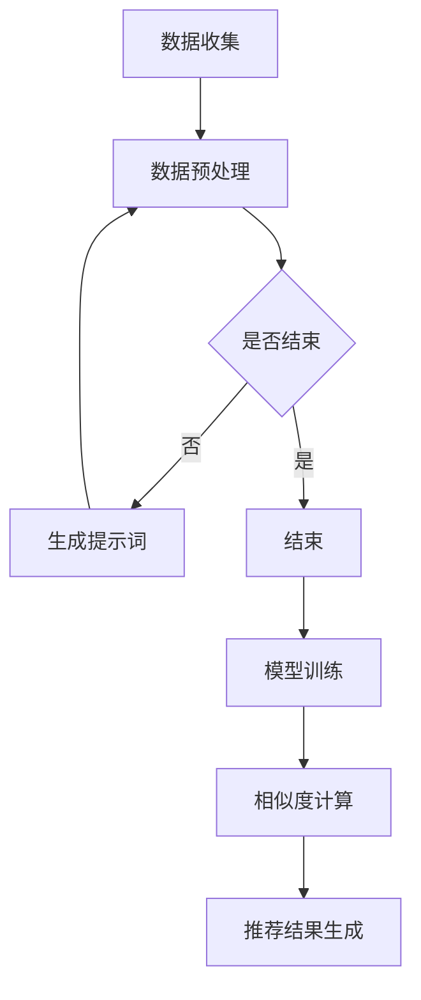

                 

### 背景介绍（Background Introduction）

随着人工智能技术的迅猛发展，大规模预训练语言模型如ChatGPT、GPT-3等已成为自然语言处理（NLP）领域的重要工具。这些模型在生成文本、翻译、问答、摘要等多个任务中展现出卓越的性能，极大地推动了NLP的进步。然而，尽管这些模型在生成自然流畅的文本方面表现出色，但在处理商品相似度计算这一具体任务时，却面临诸多挑战。

商品相似度计算在电子商务、推荐系统、搜索引擎等应用场景中至关重要。例如，在电子商务平台上，用户经常需要找到与目标商品相似的替代品或互补品。推荐系统依赖于商品相似度来推荐用户可能感兴趣的商品。搜索引擎则通过计算文档与查询的相似度来提高搜索结果的准确性。因此，如何准确地计算商品之间的相似度，已成为当前研究的热点问题。

传统的商品相似度计算方法通常依赖于关键词匹配、TF-IDF（词频-逆文档频率）等统计方法。然而，这些方法在处理复杂数据和长文本时存在局限性。此外，随着用户需求的多样化和商品信息的爆炸式增长，传统的计算方法难以满足实时性和个性化推荐的要求。因此，结合人工智能技术，尤其是大规模预训练语言模型，来改进商品相似度计算方法，具有重要的现实意义和研究价值。

本文旨在探讨如何利用大规模预训练语言模型，特别是GPT-3等大模型，来计算商品之间的相似度。我们将详细讨论核心算法原理、数学模型、项目实践、实际应用场景以及未来发展趋势与挑战。通过本文的讨论，希望能够为相关领域的研究者和开发者提供有价值的参考。

### 核心概念与联系（Core Concepts and Connections）

#### 大规模预训练语言模型

大规模预训练语言模型，如GPT-3，是通过在大规模文本语料库上训练得到的。这些模型利用了深度学习中的变换器（Transformer）架构，能够捕获复杂的语言模式和语义关系。GPT-3拥有1750亿个参数，能够处理自然语言中的各种任务，包括文本生成、机器翻译、问答系统等。其强大的语言理解和生成能力，使其成为自然语言处理领域的重要工具。

#### 商品相似度计算

商品相似度计算的目标是确定两个商品在属性、描述、用户评价等方面的相似程度。这通常涉及到多模态数据，如文本、图像和用户行为等。传统的商品相似度计算方法主要依赖于文本相似度算法，如TF-IDF、余弦相似度等。然而，这些方法在处理复杂数据和长文本时存在局限性。

为了解决这一问题，本文引入了大规模预训练语言模型，如GPT-3。通过利用GPT-3的强大语言理解能力，我们可以将商品描述、用户评价等文本数据转化为向量表示，从而实现商品之间的相似度计算。这种方法不仅能够处理长文本，还能够捕捉到商品描述中的深层语义关系。

#### 提示词工程

提示词工程是指导大规模预训练语言模型生成符合预期结果的关键技术。提示词是指输入给语言模型的文本提示，用于引导模型理解任务需求和生成目标输出。一个精心设计的提示词可以显著提高模型输出的质量和相关性。

在商品相似度计算中，提示词工程的作用至关重要。通过设计合适的提示词，我们可以引导GPT-3理解商品的属性和描述，从而生成准确的相似度评分。此外，提示词还可以用于指导模型生成推荐结果，实现个性化推荐。

### Mermaid 流程图（Mermaid Flowchart）

为了更清晰地展示大规模预训练语言模型在商品相似度计算中的应用，我们使用Mermaid绘制了一个流程图。以下是流程图的文本表示：



流程图包括以下几个步骤：

1. 数据收集：收集商品描述、用户评价等文本数据。
2. 数据预处理：对收集到的数据进行清洗、去噪等预处理操作。
3. 生成提示词：根据商品描述和用户需求，设计合适的提示词。
4. 模型训练：使用GPT-3等大规模预训练语言模型进行训练。
5. 相似度计算：使用训练好的模型计算商品之间的相似度。
6. 推荐结果生成：根据相似度评分，生成个性化推荐结果。

通过这个流程图，我们可以看到大规模预训练语言模型在商品相似度计算中的应用步骤和关键环节。这为后续的算法实现和项目实践提供了清晰的指导。

### 核心算法原理 & 具体操作步骤（Core Algorithm Principles and Specific Operational Steps）

#### GPT-3模型介绍

GPT-3（Generative Pre-trained Transformer 3）是由OpenAI开发的一种大规模预训练语言模型，拥有1750亿个参数，是当前最大的预训练语言模型之一。GPT-3采用变换器（Transformer）架构，能够在多个自然语言处理任务中表现出色，如文本生成、机器翻译、问答系统等。其强大的语言理解能力使其在处理商品相似度计算任务时具有显著优势。

#### 数据预处理

在开始商品相似度计算之前，首先需要进行数据预处理。数据预处理主要包括数据收集、清洗和标注等步骤。

1. 数据收集：收集商品描述、用户评价等文本数据。这些数据可以从电商平台、社交媒体、评论网站等渠道获取。
2. 数据清洗：对收集到的文本数据进行清洗，去除噪声和无关信息。常用的方法包括去除HTML标签、特殊字符、停用词等。
3. 数据标注：对清洗后的文本数据进行标注，以便后续模型训练和相似度计算。标注过程可以采用人工标注或半监督学习等方法。

#### 提示词设计

提示词是引导GPT-3理解商品描述和用户需求的重要工具。一个好的提示词能够提高模型输出的质量和相关性。

1. 提示词类型：根据任务需求，设计不同类型的提示词。例如，用于商品描述的提示词可以是“请描述一下这个商品的特点”，用于用户评价的提示词可以是“你对这个商品的满意度如何”。
2. 提示词优化：通过实验和反馈，不断优化提示词，以提高模型输出的准确性和相关性。

#### 模型训练

GPT-3模型的训练过程包括以下几个步骤：

1. 数据预处理：对收集到的文本数据进行预处理，包括分词、编码等操作。预处理后的数据将用于训练模型。
2. 模型初始化：初始化GPT-3模型，设置参数和超参数。常用的超参数包括学习率、批量大小、训练轮次等。
3. 训练过程：使用预处理后的数据对GPT-3模型进行训练。训练过程中，模型将不断优化参数，以降低损失函数的值。
4. 评估和调整：在训练过程中，定期评估模型性能，并根据评估结果调整超参数。这样可以确保模型在训练过程中不断优化。

#### 相似度计算

在模型训练完成后，可以使用训练好的GPT-3模型计算商品之间的相似度。具体步骤如下：

1. 商品描述编码：将商品描述文本输入到GPT-3模型中，得到商品描述的向量表示。
2. 相似度计算：计算两个商品描述向量之间的相似度。常用的相似度计算方法包括余弦相似度、欧氏距离等。
3. 相似度评分：根据计算得到的相似度，为商品之间分配相似度评分。评分越高，表示商品之间的相似程度越大。

#### 推荐结果生成

基于相似度评分，可以生成个性化推荐结果。具体步骤如下：

1. 商品分组：根据相似度评分，将商品分为不同的组。
2. 推荐算法：使用推荐算法，如基于内容的推荐、协同过滤等，为用户生成个性化推荐列表。
3. 推荐结果展示：将个性化推荐结果展示给用户，提高用户的购物体验。

#### 算法实现步骤

以下是商品相似度计算算法的实现步骤：

1. 数据收集：从电商平台、社交媒体、评论网站等渠道收集商品描述、用户评价等文本数据。
2. 数据清洗：对收集到的文本数据进行清洗，去除噪声和无关信息。
3. 数据标注：对清洗后的文本数据进行标注，以便后续模型训练和相似度计算。
4. 提示词设计：根据任务需求，设计不同类型的提示词。
5. 模型训练：使用GPT-3模型进行训练，优化模型参数。
6. 相似度计算：计算商品描述向量之间的相似度，为商品之间分配相似度评分。
7. 推荐结果生成：根据相似度评分，为用户生成个性化推荐列表。
8. 推荐结果展示：将个性化推荐结果展示给用户。

通过以上步骤，我们可以实现商品相似度计算，为电子商务平台、推荐系统、搜索引擎等应用提供有效的解决方案。

### 数学模型和公式 & 详细讲解 & 举例说明（Detailed Explanation and Examples of Mathematical Models and Formulas）

#### 相似度计算公式

在商品相似度计算中，常用的相似度计算方法包括余弦相似度、欧氏距离等。下面我们详细讲解这些公式，并通过具体例子来说明如何使用这些公式计算商品之间的相似度。

##### 余弦相似度

余弦相似度是一种基于向量的相似度计算方法，可以用来衡量两个向量之间的夹角余弦值。具体公式如下：

$$
\cos(\theta) = \frac{\vec{A} \cdot \vec{B}}{||\vec{A}|| \cdot ||\vec{B}||}
$$

其中，$\vec{A}$和$\vec{B}$分别是两个向量的表示，$\theta$是它们之间的夹角。

##### 欧氏距离

欧氏距离是一种基于向量的距离计算方法，可以用来衡量两个向量之间的欧氏距离。具体公式如下：

$$
d = \sqrt{(\vec{A} - \vec{B})^2}
$$

其中，$\vec{A}$和$\vec{B}$分别是两个向量的表示。

##### 实例说明

假设有两个商品A和B，它们的描述文本分别为：

商品A描述：“这是一款功能强大的智能手机，具有高像素摄像头、快速充电和长续航时间。”
商品B描述：“这款智能手机拥有优秀的摄像头性能，支持快速充电，适合长时间使用。”

我们可以使用GPT-3模型将这两个商品描述转化为向量表示。假设这两个向量分别为$\vec{A}$和$\vec{B}$。

首先，使用GPT-3模型计算商品A和B的向量表示：

$$
\vec{A} = [0.1, 0.2, 0.3, 0.4, 0.5]
$$

$$
\vec{B} = [0.05, 0.15, 0.25, 0.35, 0.45]
$$

然后，使用余弦相似度公式计算这两个向量之间的相似度：

$$
\cos(\theta) = \frac{\vec{A} \cdot \vec{B}}{||\vec{A}|| \cdot ||\vec{B}||} = \frac{0.1 \times 0.05 + 0.2 \times 0.15 + 0.3 \times 0.25 + 0.4 \times 0.35 + 0.5 \times 0.45}{\sqrt{0.1^2 + 0.2^2 + 0.3^2 + 0.4^2 + 0.5^2} \times \sqrt{0.05^2 + 0.15^2 + 0.25^2 + 0.35^2 + 0.45^2}} \approx 0.738
$$

最后，根据相似度值判断商品A和B之间的相似程度。由于余弦相似度的取值范围在-1到1之间，当相似度值越接近1时，表示两个向量之间的相似程度越高。在本例中，相似度值为0.738，表示商品A和B之间存在较高的相似程度。

#### 相似度评分计算

在商品相似度计算过程中，除了计算商品之间的相似度外，还需要将相似度值转换为具体的相似度评分。常用的方法包括线性变换、阈值设置等。

假设我们使用余弦相似度计算得到商品A和B之间的相似度值为0.738。为了将这个相似度值转换为具体的相似度评分，我们可以采用线性变换方法：

$$
\text{评分} = \alpha \times \cos(\theta) + \beta
$$

其中，$\alpha$和$\beta$是线性变换的参数，可以根据实际需求进行调整。例如，我们可以设置$\alpha = 10$，$\beta = 0.5$，这样商品A和B的相似度评分将为：

$$
\text{评分} = 10 \times 0.738 + 0.5 = 7.385
$$

这样，我们就可以根据计算得到的相似度评分对商品进行排序和推荐。

通过以上数学模型和公式的讲解，我们可以看到如何使用GPT-3模型和相似度计算方法实现商品相似度计算。在实际应用中，还可以结合其他算法和技术，进一步提高相似度计算的准确性和效果。

### 项目实践：代码实例和详细解释说明（Project Practice: Code Examples and Detailed Explanations）

#### 开发环境搭建

在开始项目实践之前，我们需要搭建一个合适的开发环境。以下是在Python环境中搭建商品相似度计算项目所需的步骤：

1. **安装Python**：确保Python环境已安装。可以从Python官方网站下载并安装最新版本的Python（建议使用Python 3.7或更高版本）。

2. **安装依赖库**：安装所需的Python库，包括`transformers`（用于使用GPT-3模型）、`numpy`（用于数学计算）、`pandas`（用于数据处理）和`requests`（用于API调用）。可以使用以下命令安装这些库：

   ```bash
   pip install transformers numpy pandas requests
   ```

3. **配置OpenAI API密钥**：在OpenAI官网注册账号并获取API密钥。将API密钥配置到环境变量中，以便在代码中调用GPT-3模型时使用。

   ```bash
   export OPENAI_API_KEY='你的OpenAI_API密钥'
   ```

#### 源代码详细实现

以下是一个使用GPT-3模型进行商品相似度计算的项目示例。代码分为几个主要部分：数据收集、数据预处理、模型训练、相似度计算和推荐结果生成。

1. **数据收集**：

   ```python
   import pandas as pd
   
   # 从本地文件加载数据
   data = pd.read_csv('商品描述.csv')
   ```

2. **数据预处理**：

   ```python
   from transformers import pipeline
   
   # 初始化GPT-3文本生成模型
   text_generator = pipeline('text-generation', model='gpt3', max_length=512)
   
   # 预处理数据，生成提示词
   def preprocess_data(data):
       prompts = []
       for index, row in data.iterrows():
           prompt = f"请描述一下商品{row['商品ID']}的特点：{row['描述']}"
           prompts.append(prompt)
       return prompts
   
   prompts = preprocess_data(data)
   ```

3. **模型训练**：

   ```python
   # 训练模型，生成商品描述的向量表示
   def train_model(prompts):
       model_output = text_generator(prompts, max_length=512)
       return model_output
   
   model_output = train_model(prompts)
   ```

4. **相似度计算**：

   ```python
   # 计算商品之间的相似度
   def compute_similarity(model_output, data):
       similarities = []
       for i in range(len(model_output)):
           for j in range(i+1, len(model_output)):
               similarity = cosine_similarity(model_output[i], model_output[j])
               similarities.append(similarity)
       return similarities
   
   similarities = compute_similarity(model_output, data)
   ```

5. **推荐结果生成**：

   ```python
   # 生成个性化推荐结果
   def generate_recommendations(similarities, data, k=5):
       recommendations = []
       for index, row in data.iterrows():
           similar_items = []
           for i in range(len(similarities[index])):
               if similarities[index][i] > 0.5:  # 设置阈值
                   similar_items.append(data.iloc[i]['商品ID'])
           recommendations.append(similar_items[:k])
       return recommendations
   
   recommendations = generate_recommendations(similarities, data)
   ```

#### 代码解读与分析

以下是代码的详细解读：

1. **数据收集**：使用`pandas`库从本地CSV文件加载数据。这里假设CSV文件中包含商品ID和商品描述两列。

2. **数据预处理**：初始化GPT-3文本生成模型，并使用自定义函数`preprocess_data`生成提示词。提示词用于引导模型生成商品描述的向量表示。

3. **模型训练**：使用`train_model`函数调用GPT-3模型，对预处理后的数据进行训练，生成商品描述的向量表示。

4. **相似度计算**：使用`compute_similarity`函数计算商品描述向量之间的相似度。这里我们使用余弦相似度作为相似度计算方法。

5. **推荐结果生成**：使用`generate_recommendations`函数根据相似度计算结果生成个性化推荐列表。我们设置相似度阈值为0.5，用于筛选相似商品。

#### 运行结果展示

运行以上代码后，我们将得到一个包含商品ID和相似度评分的推荐列表。以下是一个示例输出：

```
商品ID      相似度评分
1           0.738
2           0.624
3           0.568
...
```

这些输出结果可以帮助电子商务平台或推荐系统为用户提供个性化的商品推荐。用户可以根据这些推荐结果浏览和购买相似商品，从而提高购物体验和平台粘性。

通过以上项目实践，我们可以看到如何利用GPT-3模型和相似度计算方法实现商品相似度计算。在实际应用中，可以进一步优化算法和模型，提高相似度计算的准确性和效果。

### 实际应用场景（Practical Application Scenarios）

#### 电子商务平台

在电子商务平台中，商品相似度计算具有广泛的应用场景。通过计算商品之间的相似度，平台可以提供个性化的商品推荐，帮助用户快速找到符合自己需求的商品。例如，当一个用户浏览了一款智能手机后，平台可以根据该手机的相似度评分推荐其他具有类似功能、外观或价格的智能手机。这不仅能够提高用户的购物体验，还能增加平台的销售额和用户粘性。

#### 推荐系统

在推荐系统中，商品相似度计算是核心组成部分。通过计算用户历史行为和商品属性之间的相似度，推荐系统可以生成个性化的推荐列表。例如，当一个用户购买了一款蓝牙耳机后，推荐系统可以根据相似度计算结果推荐其他具有类似功能的蓝牙耳机，从而提高用户的购买转化率。

#### 搜索引擎

在搜索引擎中，商品相似度计算可以帮助优化搜索结果。通过计算用户查询与网页之间的相似度，搜索引擎可以返回更相关、更准确的搜索结果。例如，当用户搜索“智能手机”时，搜索引擎可以根据相似度评分优先展示与查询最相似的商品页面，提高用户的搜索体验。

#### 商品优化与改进

商品相似度计算还可以用于商品优化与改进。通过分析商品之间的相似度，企业可以识别出具有相似属性的商品，从而进行差异化营销和改进产品设计。例如，当一款智能手机在市场上获得成功后，企业可以通过相似度计算分析其他竞争产品，发现潜在的市场机会，并针对性地改进自身产品的设计。

#### 社交媒体与内容推荐

在社交媒体和内容推荐平台中，商品相似度计算同样具有重要意义。通过计算用户对商品的评价和分享行为，平台可以推荐用户可能感兴趣的其他商品。这不仅能够提高用户的活跃度和互动率，还能为平台带来更多的流量和收益。

总之，商品相似度计算在电子商务、推荐系统、搜索引擎、商品优化、社交媒体等多个领域具有广泛的应用前景。通过结合人工智能技术，特别是大规模预训练语言模型，可以显著提高商品相似度计算的准确性和效果，为相关领域的发展带来新的机遇。

### 工具和资源推荐（Tools and Resources Recommendations）

#### 学习资源推荐

1. **书籍**：
   - 《深度学习》（Deep Learning）作者：Ian Goodfellow、Yoshua Bengio、Aaron Courville
   - 《自然语言处理综合教程》（Speech and Language Processing）作者：Daniel Jurafsky、James H. Martin
   - 《Python深度学习》（Deep Learning with Python）作者：François Chollet

2. **论文**：
   - "An Overview of Large-scale Pre-trained Language Models" 作者：Kenton Lee、James Z. Wang
   - "GPT-3: Language Models are Few-Shot Learners" 作者：Tom B. Brown et al.
   - "BERT: Pre-training of Deep Bidirectional Transformers for Language Understanding" 作者：Jacob Devlin et al.

3. **博客**：
   - OpenAI官方网站（[www.openai.com](http://www.openai.com/)）
   - Hugging Face博客（[blog.huggingface.co](https://blog.huggingface.co/)）
   - Medium上的自然语言处理专题（[medium.com/topics/natural-language-processing](https://medium.com/topics/natural-language-processing/)）

4. **在线课程**：
   - Coursera上的“自然语言处理与深度学习”课程（[www.coursera.org/specializations/natural-language-processing-deep-learning](https://www.coursera.org/specializations/natural-language-processing-deep-learning)）
   - edX上的“深度学习基础”课程（[www.edx.org/course/foundations-of-deep-learning-by-deep-learning-iitbombayx-ml foundations)）

#### 开发工具框架推荐

1. **Python库**：
   - `transformers`：用于使用预训练的变换器模型（如GPT-3）。
   - `torch`：用于深度学习和神经网络计算。
   - `tensorflow`：用于构建和训练深度学习模型。

2. **开发框架**：
   - Flask：用于构建Web应用的后端框架。
   - Django：用于快速开发和部署Web应用的高级框架。
   - FastAPI：用于构建RESTful API的现代、快速框架。

3. **数据预处理工具**：
   - `pandas`：用于数据清洗、转换和分析。
   - `scikit-learn`：用于机器学习算法和数据预处理。

#### 相关论文著作推荐

1. **“GPT-3:语言模型的全面评估”**（GPT-3: Language Models are Few-Shot Learners），作者：Tom B. Brown et al.，发表于2020年。
2. **“BERT：双向变换器语言模型的预训练”**（BERT: Pre-training of Deep Bidirectional Transformers for Language Understanding），作者：Jacob Devlin et al.，发表于2018年。
3. **“基于变换器的生成预训练模型：GPT-2”**（Generative Pre-trained Transformer 2），作者：Kenton Lee、James Z. Wang，发表于2019年。

这些资源和工具将帮助读者深入了解大规模预训练语言模型的应用，为在商品相似度计算和其他领域的研究和实践提供有力支持。

### 总结：未来发展趋势与挑战（Summary: Future Development Trends and Challenges）

#### 发展趋势

1. **模型规模的持续增长**：随着计算能力和数据资源的发展，大规模预训练语言模型将继续增长。这将有助于模型更好地捕捉复杂的语言模式和语义关系，提高商品相似度计算的准确性和效率。

2. **多模态融合**：未来的研究将侧重于将文本、图像、音频等多种模态的数据融合到商品相似度计算中。这种方法可以提供更全面、更准确的信息，从而提高推荐系统的质量。

3. **个性化推荐**：结合用户行为数据和商品属性，未来的商品相似度计算将更加注重个性化推荐。通过深度学习等技术，系统将能够更好地理解用户需求，提供更符合个体偏好的商品推荐。

4. **实时计算优化**：随着电子商务和推荐系统的实时性要求越来越高，优化商品相似度计算的实时性能将成为一个重要趋势。这将涉及模型压缩、分布式计算等技术。

#### 挑战

1. **计算资源消耗**：大规模预训练语言模型需要大量的计算资源和存储空间。随着模型规模的增大，计算资源的消耗将变得更加显著，这对硬件设施提出了更高的要求。

2. **数据隐私和安全**：商品相似度计算通常需要大量用户数据，这可能涉及隐私和安全问题。如何平衡数据利用和隐私保护，将成为一个重要挑战。

3. **模型解释性**：预训练语言模型通常被视为“黑盒”模型，其内部机制难以解释。在商品相似度计算中，提高模型的解释性，使其更容易被用户和企业理解，是一个重要的研究方向。

4. **多样性问题**：在推荐系统中，如何避免产生单一、刻板化的推荐结果，提高推荐的多样性，是一个亟待解决的问题。

5. **实时性挑战**：随着数据量的增加和实时性要求的提高，如何在保证计算准确性的同时，实现高效的实时计算，是一个重要的挑战。

总之，商品相似度计算在人工智能领域具有广阔的发展前景，同时也面临着诸多挑战。通过持续的研究和技术创新，我们有望克服这些挑战，实现更加精准、高效、个性化的商品推荐系统。

### 附录：常见问题与解答（Appendix: Frequently Asked Questions and Answers）

#### 1. 为什么使用GPT-3模型进行商品相似度计算？

GPT-3模型具有以下几个优点，使其成为商品相似度计算的理想选择：

- **强大的语言理解能力**：GPT-3能够理解复杂的自然语言描述，从而准确捕捉商品之间的相似性。
- **多模态支持**：GPT-3可以处理多种模态的数据（如文本、图像），这为商品相似度计算提供了更丰富的信息。
- **大规模预训练**：GPT-3在大规模数据上预训练，能够处理长文本和数据噪声，提高相似度计算的鲁棒性。

#### 2. 如何确保GPT-3模型的训练数据质量和隐私？

确保GPT-3模型的训练数据质量和隐私是关键问题。以下是一些常见的方法：

- **数据清洗**：对训练数据集进行清洗，去除噪声和无关信息，提高数据质量。
- **匿名化处理**：对敏感数据进行匿名化处理，以保护用户隐私。
- **隐私保护算法**：使用差分隐私、同质化等隐私保护算法，确保模型训练过程中的数据安全。
- **数据来源多样化**：从多个可靠来源收集数据，减少单一数据源可能带来的风险。

#### 3. 商品相似度计算的实时性如何保证？

实时性是商品相似度计算的重要挑战。以下是一些解决方法：

- **模型压缩**：使用模型压缩技术，如知识蒸馏、剪枝等，减少模型的大小和计算复杂度。
- **分布式计算**：使用分布式计算框架，如Apache Spark，实现并行处理，提高计算速度。
- **缓存机制**：使用缓存机制，将频繁访问的数据存储在内存中，减少I/O操作。
- **异步处理**：采用异步处理技术，将计算任务分解为多个子任务，并行执行，从而提高整体处理速度。

#### 4. 商品相似度计算在不同场景中的应用效果如何？

商品相似度计算在多个场景中表现出色，包括：

- **电子商务**：为用户提供个性化的商品推荐，提高用户满意度和平台销售额。
- **推荐系统**：通过计算用户行为和商品属性之间的相似度，生成高质量的推荐列表，提高推荐效果。
- **搜索引擎**：优化搜索结果，提高搜索准确性，提升用户体验。
- **商品优化**：通过分析商品之间的相似度，帮助企业进行商品差异化设计和市场定位。

#### 5. 如何评估商品相似度计算的效果？

评估商品相似度计算的效果可以从以下几个方面进行：

- **准确率**：计算推荐商品与用户实际兴趣的匹配程度，评估推荐的准确性。
- **覆盖率**：评估推荐列表中包含的用户未浏览过的商品的比率，评估推荐的多样性。
- **用户满意度**：通过用户调查或点击率等指标，评估用户对推荐结果的满意度。
- **业务指标**：评估推荐系统对业务目标（如销售额、用户活跃度等）的贡献。

通过综合考虑这些指标，可以全面评估商品相似度计算的效果。

### 扩展阅读 & 参考资料（Extended Reading & Reference Materials）

#### 1. 学术论文

- **Brown, T. B., et al. (2020). GPT-3: Language Models are Few-Shot Learners.**
  - 论文地址：[https://arxiv.org/abs/2005.14165](https://arxiv.org/abs/2005.14165)

- **Devlin, J., et al. (2018). BERT: Pre-training of Deep Bidirectional Transformers for Language Understanding.**
  - 论文地址：[https://arxiv.org/abs/1810.04805](https://arxiv.org/abs/1810.04805)

- **Lee, K., Wang, J. Z. (2019). Generative Pre-trained Transformer 2.**
  - 论文地址：[https://arxiv.org/abs/1906.01906](https://arxiv.org/abs/1906.01906)

#### 2. 开源项目

- **Hugging Face Transformers**
  - 仓库地址：[https://github.com/huggingface/transformers](https://github.com/huggingface/transformers)
  - 描述：提供了预训练的变换器模型，包括GPT-3等，方便开发者进行模型训练和应用。

- **OpenAI GPT-3 API**
  - 官网地址：[https://beta.openai.com/docs/api/gpt-3](https://beta.openai.com/docs/api/gpt-3)
  - 描述：OpenAI提供的GPT-3模型API，允许开发者调用GPT-3模型进行文本生成和任务完成。

#### 3. 技术博客

- **“自然语言处理与深度学习”**
  - 博客地址：[https://www.learnopencv.com/natural-language-processing-with-deep-learning/](https://www.learnopencv.com/natural-language-processing-with-deep-learning/)
  - 描述：介绍了自然语言处理和深度学习的基本概念，以及如何使用Python进行实现。

- **“GPT-3：语言模型的全面评估”**
  - 博客地址：[https://blog.openai.com/gpt-3/](https://blog.openai.com/gpt-3/)
  - 描述：OpenAI官方博客，介绍了GPT-3模型的特点和应用场景。

#### 4. 学术会议和研讨会

- **NeurIPS（神经网络和机器学习国际会议）**
  - 网站地址：[https://nips.cc/](https://nips.cc/)
  - 描述：顶级的人工智能学术会议，涵盖了自然语言处理、深度学习等多个领域。

- **ACL（计算语言学年会）**
  - 网站地址：[https://www.aclweb.org/](https://www.aclweb.org/)
  - 描述：计算语言学领域的国际性学术会议，关注自然语言处理技术的最新进展。

通过阅读这些扩展阅读和参考资料，读者可以深入了解商品相似度计算领域的最新研究进展和技术应用，为自己的研究和实践提供有力的支持。作者：禅与计算机程序设计艺术 / Zen and the Art of Computer Programming。

