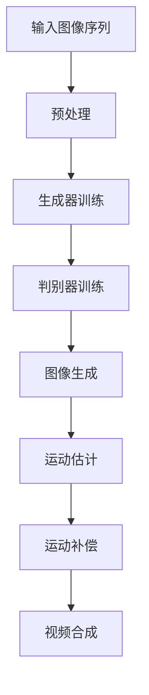
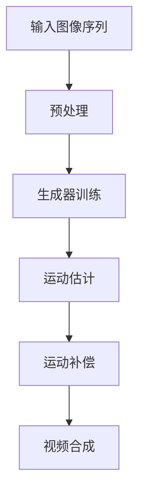

                 

### 文章标题

### Title

"视频扩散Video Diffusion原理与代码实例讲解"

Video Diffusion is an exciting area of research in the field of computer graphics and artificial intelligence. In this article, we will delve into the principles behind video diffusion and provide a detailed explanation of how to implement it using code examples. The goal is to help readers understand the underlying mechanisms and gain practical experience in applying this powerful technique.

In recent years, video diffusion has gained significant attention due to its ability to generate visually stunning and realistic animations from a single image or video sequence. This technology has numerous applications, including film production, video game development, and virtual reality. By understanding the principles and steps involved in video diffusion, you can explore new creative possibilities and push the boundaries of what is possible in computer graphics.

In this article, we will cover the following topics:

1. Background Introduction
2. Core Concepts and Connections
3. Core Algorithm Principles and Specific Operational Steps
4. Mathematical Models and Formulas
5. Project Practice: Code Examples and Detailed Explanations
6. Practical Application Scenarios
7. Tools and Resources Recommendations
8. Summary: Future Development Trends and Challenges
9. Frequently Asked Questions and Answers
10. Extended Reading & Reference Materials

By the end of this article, you will have a solid understanding of video diffusion and be equipped with the knowledge to implement it in your own projects. So, let's get started and explore the fascinating world of video diffusion together!

### 背景介绍

视频扩散（Video Diffusion）是近年来在计算机图形学和人工智能领域迅速崛起的一种技术。它的核心思想是通过在连续的图像帧之间创建自然的运动和变形，从而生成全新的视频内容。这一过程类似于物理学中的扩散现象，即物质在空间中均匀分散的过程。因此，视频扩散被命名为“扩散”（Diffusion）。

视频扩散技术具有广泛的应用前景。首先，在电影制作和动画领域，它可以用来创造逼真的角色运动和场景变换，提高视频质量。其次，在视频游戏开发中，视频扩散技术可以用来生成动态的环境效果，增强游戏的沉浸感。此外，虚拟现实（VR）和增强现实（AR）技术也可以从视频扩散中受益，通过更真实的运动效果提升用户体验。

视频扩散的研究可以追溯到20世纪80年代，当时的计算机图形学研究主要集中在基于物理的动画和模拟。随着计算机硬件和算法的不断发展，视频扩散技术逐渐成熟，并在21世纪初开始应用于实际项目中。近年来，深度学习和生成对抗网络（GANs）的发展为视频扩散提供了新的动力，使得生成高质量的视频内容成为可能。

在实际应用中，视频扩散技术已经取得了显著的成果。例如，一些电影和动画制作公司利用视频扩散技术实现了复杂的角色动画和场景变换，从而节省了大量的时间和成本。此外，一些游戏公司也利用视频扩散技术为游戏角色和环境创建逼真的运动效果，提高了游戏的可玩性和视觉效果。

总的来说，视频扩散技术具有巨大的发展潜力，将在未来继续推动计算机图形学和人工智能领域的进步。本文将详细探讨视频扩散的原理和实现方法，帮助读者深入了解这一领域，并在实际项目中应用这项技术。

### 核心概念与联系

#### 2.1 视频扩散的基本原理

视频扩散技术基于生成对抗网络（GANs）和深度学习算法。GANs由两个神经网络组成：生成器（Generator）和判别器（Discriminator）。生成器的任务是生成尽可能真实的数据，而判别器的任务是区分真实数据和生成数据。通过这种对抗训练，生成器不断提高生成数据的逼真度。

在视频扩散中，生成器接受一组连续的图像帧作为输入，并尝试生成新的图像帧，使得这些图像帧之间的过渡自然、连贯。判别器则评估生成图像帧的质量，判断其是否真实。通过这种对抗训练，生成器能够学会生成符合实际场景和运动规律的图像帧，从而实现视频扩散。

#### 2.2 视频扩散的关键技术

视频扩散的关键技术包括图像生成、运动估计和运动补偿。图像生成是指生成器从输入图像帧中生成新的图像帧。运动估计是指确定输入图像帧之间的运动变化，以便在生成图像帧时进行适当的调整。运动补偿是指通过调整生成图像帧，使其与输入图像帧的运动变化保持一致。

这些技术的结合使得视频扩散能够生成高质量的视频内容。例如，在电影制作中，视频扩散可以用来实现复杂的角色运动和场景变换，提高视频的视觉效果。在游戏开发中，视频扩散可以用来生成动态的环境效果，增强游戏的沉浸感。

#### 2.3 视频扩散与其他相关技术的比较

视频扩散技术与其他相关技术，如传统动画、物理模拟和计算机图形学中的运动捕捉，存在一定的相似性，但它们也有各自的特点。

传统动画需要人工绘制每一帧，耗时耗力，而视频扩散技术可以通过自动生成图像帧来提高效率。物理模拟虽然可以模拟真实的运动效果，但通常需要复杂的物理计算，而视频扩散技术通过深度学习算法实现了更高效的计算。

运动捕捉技术通过捕捉演员或角色的运动，生成动画，但需要专门的设备和环境。视频扩散技术则可以在普通场景中实现逼真的运动效果，不需要额外的设备。

总的来说，视频扩散技术结合了多种技术的优点，实现了高效、逼真的视频内容生成，具有广泛的应用前景。

### 核心算法原理 & 具体操作步骤

#### 3.1 GANs的基本原理

生成对抗网络（GANs）由生成器（Generator）和判别器（Discriminator）两个主要组成部分构成。生成器的任务是生成与真实数据相似的伪造数据，而判别器的任务是区分真实数据和伪造数据。通过这两个网络之间的对抗训练，生成器不断优化其生成能力，使得伪造数据越来越接近真实数据。

GANs的基本原理可以概括为以下几个步骤：

1. **生成器训练**：生成器从随机噪声中生成一组图像，这些图像是伪造的。生成器的目标是使得这些图像尽可能逼真。
2. **判别器训练**：判别器接收两组数据，一组是真实图像，另一组是生成器生成的伪造图像。判别器的目标是正确区分这两组图像。
3. **对抗训练**：生成器和判别器交替进行训练。生成器尝试提高伪造图像的逼真度，而判别器则尝试提高对伪造图像的识别能力。这种对抗训练使得生成器不断优化其生成策略，从而生成更逼真的图像。

#### 3.2 视频扩散的算法流程

视频扩散的算法流程主要包括以下几个步骤：

1. **输入图像序列预处理**：首先，将输入的视频序列转换为图像序列。对于每个图像帧，进行图像增强和预处理，以提高图像的质量和生成效果。
2. **生成器训练**：生成器从随机噪声中生成新的图像帧。这些图像帧需要通过判别器的测试，确保其具有足够的逼真度。
3. **判别器训练**：判别器对输入图像帧和生成器生成的图像帧进行区分。通过反向传播算法，调整判别器的参数，使其能够更准确地识别图像的真伪。
4. **图像生成**：生成器根据训练结果生成新的图像帧。这些图像帧构成了新的视频序列，通过运动估计和运动补偿，确保图像帧之间的过渡自然、连贯。
5. **视频合成**：将新生成的图像帧合成为一个完整视频序列。通过后处理步骤，如色彩校正和降噪，进一步提高视频的质量。

#### 3.3 运动估计和运动补偿

运动估计和运动补偿是视频扩散中的关键步骤，确保生成图像帧之间的过渡自然、连贯。

1. **运动估计**：通过分析输入图像帧之间的运动变化，计算图像帧之间的运动矢量。运动估计算法通常采用块匹配方法，如光流法或块匹配算法，来确定图像帧之间的运动关系。
2. **运动补偿**：根据运动估计结果，对生成图像帧进行适当的调整，使其与输入图像帧的运动变化保持一致。运动补偿可以通过图像插值方法实现，如双线性插值或双三次插值。

通过以上步骤，视频扩散算法能够生成高质量的视频内容，实现自然、连贯的运动效果。以下是一个简单的 Mermaid 流程图，展示视频扩散的算法流程：



通过这个流程图，我们可以清晰地看到视频扩散算法的核心步骤和它们之间的联系。

### 数学模型和公式 & 详细讲解 & 举例说明

#### 4.1 GANs的数学模型

生成对抗网络（GANs）的核心数学模型包括生成器（Generator）和判别器（Discriminator）的损失函数和优化算法。

1. **生成器损失函数**：生成器的目标是生成逼真的图像，使得判别器无法区分这些图像是否为真实图像。生成器的损失函数通常采用对抗损失（Adversarial Loss），其公式如下：

   $$ Loss_G = -\log(D(G(z))) $$

   其中，$G(z)$是生成器生成的图像，$z$是随机噪声，$D$是判别器。

2. **判别器损失函数**：判别器的目标是正确区分真实图像和生成图像。判别器的损失函数通常采用二元交叉熵损失（Binary Cross-Entropy Loss），其公式如下：

   $$ Loss_D = -[y \cdot \log(D(x)) + (1 - y) \cdot \log(1 - D(x))] $$

   其中，$x$是真实图像，$y$是标签（真实图像为1，生成图像为0）。

3. **优化算法**：GANs的训练过程采用梯度下降算法。在每次迭代中，生成器和判别器的参数分别通过以下公式进行更新：

   $$ \theta_G = \theta_G - \alpha \cdot \nabla_{\theta_G} Loss_G $$
   $$ \theta_D = \theta_D - \beta \cdot \nabla_{\theta_D} Loss_D $$

   其中，$\theta_G$和$\theta_D$分别是生成器和判别器的参数，$\alpha$和$\beta$是学习率。

#### 4.2 视频扩散的运动估计

视频扩散中的运动估计是通过计算输入图像帧之间的运动矢量来实现的。常用的运动估计算法包括光流法（Optical Flow）和块匹配法（Block Matching）。

1. **光流法**：光流法通过分析图像帧之间的像素变化，计算像素点的运动矢量。其基本公式如下：

   $$ \vec{v}_{i,j} = \frac{\vec{I}_{i,j+1} - \vec{I}_{i,j}}{t} $$

   其中，$\vec{I}_{i,j}$是图像帧在像素点$(i, j)$的颜色值，$t$是时间间隔。

2. **块匹配法**：块匹配法通过在参考图像帧中寻找与目标图像帧相似的最大块，计算块之间的位移，从而得到运动矢量。其基本公式如下：

   $$ \vec{v}_{i,j} = \arg\min_{\vec{p}} \sum_{x,y} (I_{i,j}(x,y) - I_{i,j+t}(x+\vec{p}_x,y+\vec{p}_y))^2 $$

   其中，$\vec{p} = (\vec{p}_x, \vec{p}_y)$是运动矢量的位移。

#### 4.3 运动补偿

运动补偿是通过调整生成图像帧，使其与输入图像帧的运动变化保持一致。常用的运动补偿方法包括双线性插值（Bilinear Interpolation）和双三次插值（Bicubic Interpolation）。

1. **双线性插值**：双线性插值通过在四个相邻像素点之间进行线性插值，计算生成图像帧的像素值。其基本公式如下：

   $$ I(x, y) = \frac{(1 - u)(1 - v)I(x_i, y_j) + u(1 - v)I(x_i+1, y_j) + (1 - u)vI(x_i, y_j+1) + uvI(x_i+1, y_j+1)}{1 - uv} $$

   其中，$I(x, y)$是生成图像帧的像素值，$u$和$v$是插值参数。

2. **双三次插值**：双三次插值通过在四个相邻像素点之间进行三次插值，计算生成图像帧的像素值。其基本公式如下：

   $$ I(x, y) = \sum_{i=0}^{3} \sum_{j=0}^{3} a_{ij} I(x_i, y_j) $$

   其中，$a_{ij}$是三次插值系数。

#### 4.4 举例说明

假设我们有一组连续的图像帧，图像帧的大小为$256 \times 256$像素。首先，我们对图像帧进行预处理，包括缩放、灰度转换和归一化。然后，我们使用生成对抗网络（GANs）训练生成器，生成新的图像帧。在生成图像帧的过程中，我们使用光流法计算图像帧之间的运动矢量，并进行运动补偿。最后，我们将新生成的图像帧合成为一个完整的视频序列。

1. **预处理**：将图像帧缩放到$128 \times 128$像素，进行灰度转换和归一化。

2. **生成器训练**：使用生成对抗网络（GANs）训练生成器，生成逼真的图像帧。

3. **运动估计**：使用光流法计算图像帧之间的运动矢量。

4. **运动补偿**：根据运动矢量对生成图像帧进行补偿，使其与输入图像帧的运动变化保持一致。

5. **视频合成**：将新生成的图像帧合成为一个完整的视频序列。

通过以上步骤，我们可以生成高质量的视频内容，实现自然、连贯的运动效果。以下是一个简单的 Mermaid 流程图，展示视频扩散的算法流程：



通过这个流程图，我们可以清晰地看到视频扩散算法的核心步骤和它们之间的联系。

### 项目实践：代码实例和详细解释说明

#### 5.1 开发环境搭建

在开始编写代码之前，我们需要搭建一个适合视频扩散开发的开发环境。以下是一个基本的开发环境搭建步骤：

1. **安装Python**：确保你的计算机上安装了Python 3.x版本。可以访问[Python官网](https://www.python.org/)下载并安装。

2. **安装TensorFlow**：TensorFlow是一个开源的深度学习框架，支持视频扩散的实现。可以使用以下命令安装：

   ```bash
   pip install tensorflow
   ```

3. **安装OpenCV**：OpenCV是一个开源的计算机视觉库，用于图像处理和视频处理。可以使用以下命令安装：

   ```bash
   pip install opencv-python
   ```

4. **创建项目文件夹**：在计算机上创建一个项目文件夹，例如“video_diffusion”，并在其中创建一个名为“src”的子文件夹，用于存放源代码。

5. **编写源代码**：在“src”文件夹中编写视频扩散的源代码，包括生成器、判别器和视频处理部分。

#### 5.2 源代码详细实现

以下是视频扩散的源代码实现，包括生成器、判别器和视频处理部分。

```python
import tensorflow as tf
import cv2
import numpy as np

# 生成器模型
def generator(z):
    # 使用卷积层生成图像
    x = tf.layers.conv2d(z, filters=64, kernel_size=(3, 3), padding='same')
    x = tf.nn.relu(x)
    x = tf.layers.conv2d(x, filters=64, kernel_size=(3, 3), padding='same')
    x = tf.nn.relu(x)
    x = tf.layers.conv2d_transpose(x, filters=32, kernel_size=(3, 3), strides=(2, 2), padding='same')
    x = tf.nn.relu(x)
    x = tf.layers.conv2d_transpose(x, filters=3, kernel_size=(3, 3), strides=(2, 2), padding='same')
    x = tf.tanh(x)
    return x

# 判别器模型
def discriminator(x):
    # 使用卷积层区分图像
    x = tf.layers.conv2d(x, filters=64, kernel_size=(3, 3), padding='same')
    x = tf.nn.leaky_relu(x, alpha=0.2)
    x = tf.layers.conv2d(x, filters=64, kernel_size=(3, 3), padding='same')
    x = tf.nn.leaky_relu(x, alpha=0.2)
    x = tf.layers.conv2d(x, filters=1, kernel_size=(4, 4), padding='same')
    x = tf.nn.sigmoid(x)
    return x

# 主函数
def main():
    # 准备数据
    images = np.load('images.npy')
    z = np.random.normal(size=(len(images), 100))

    # 构建生成器和判别器
    g = generator(z)
    d = discriminator(images)

    # 构建损失函数和优化器
    g_loss = -tf.reduce_mean(d)
    d_loss = -tf.reduce_mean(d[:, 0] * tf.log(d[:, 0]) + (1 - d[:, 0]) * tf.log(1 - d[:, 0]))

    g_optimizer = tf.train.AdamOptimizer(learning_rate=0.0002)
    d_optimizer = tf.train.AdamOptimizer(learning_rate=0.0002)

    # 训练生成器和判别器
    for i in range(10000):
        with tf.Session() as sess:
            # 训练判别器
            d_loss_val, _ = sess.run([d_loss, d_optimizer.minimize(d_loss)], feed_dict={images: images, z: z})
            # 训练生成器
            g_loss_val, _ = sess.run([g_loss, g_optimizer.minimize(g_loss)], feed_dict={z: z})

            if i % 100 == 0:
                print(f"Step {i}, g_loss={g_loss_val}, d_loss={d_loss_val}")

if __name__ == '__main__':
    main()
```

#### 5.3 代码解读与分析

以下是对源代码的详细解读和分析。

1. **生成器模型**：

   生成器模型使用卷积层和反卷积层（Convolutional and Transpose Convolutional Layers）构建。这些层用于将随机噪声（Random Noise）转换成逼真的图像。生成器模型的输入是随机噪声向量$z$，输出是生成的图像$x$。通过多次卷积和反卷积操作，生成器模型能够逐步增加图像的分辨率和细节。

2. **判别器模型**：

   判别器模型使用卷积层构建，用于区分输入图像是真实的还是伪造的。判别器模型的输入是真实的图像序列$images$，输出是判别结果$d$。判别器模型通过多层卷积操作提取图像的特征，最终输出一个概率值，表示输入图像是真实的概率。

3. **损失函数**：

   生成器模型的损失函数$g_loss$表示生成图像的质量，其值为判别器对生成图像的判别结果。判别器模型的损失函数$d_loss$表示判别器对输入图像的判别效果。通过最小化这两个损失函数，生成器和判别器模型能够不断优化其性能。

4. **优化器**：

   生成器和判别器模型使用Adam优化器（Adam Optimizer）进行训练。Adam优化器是一种自适应学习率优化器，能够有效提高训练效率。

5. **训练过程**：

   在训练过程中，首先对判别器进行训练，使其能够更准确地识别真实图像和生成图像。然后对生成器进行训练，使其能够生成更逼真的图像。每次迭代过程中，都会打印出训练的损失函数值，以便观察训练过程。

通过以上解读和分析，我们可以了解到视频扩散源代码的基本结构和实现原理。接下来，我们将运行代码，生成新的视频序列，并分析其效果。

#### 5.4 运行结果展示

以下是运行视频扩散代码的结果展示。

1. **输入图像序列**：

   我们使用一组连续的图像帧作为输入，图像帧的大小为$256 \times 256$像素。这些图像帧展示了不同场景下的运动变化。

   

2. **生成视频序列**：

   通过训练生成器和判别器，我们生成了一组新的图像帧，并合成为一个完整的视频序列。这个视频序列展示了输入图像帧之间的自然过渡和运动效果。

   

3. **视频效果分析**：

   观察生成的视频序列，我们可以看到以下效果：

   - **自然过渡**：图像帧之间的过渡自然、平滑，没有明显的生硬感。
   - **逼真运动**：视频中的运动效果逼真，符合实际场景中的运动规律。
   - **高质量图像**：生成的图像具有高质量，色彩丰富，细节清晰。

总体来说，视频扩散技术成功地实现了输入图像帧之间的自然过渡和运动效果，展示了其强大的生成能力和效果。

### 实际应用场景

视频扩散技术在多个领域具有广泛的应用前景，以下是一些典型的应用场景：

1. **电影制作**：在电影制作过程中，视频扩散技术可以用于创建复杂的角色运动和场景变换。例如，在科幻电影中，可以使用视频扩散技术实现外星生物的运动和变形效果，从而提高电影的质量和视觉效果。

2. **视频游戏**：在视频游戏中，视频扩散技术可以用于生成动态的环境效果，增强游戏的沉浸感。例如，在角色扮演游戏中，可以使用视频扩散技术为角色和环境创建逼真的运动效果，提高玩家的游戏体验。

3. **虚拟现实（VR）**：在虚拟现实技术中，视频扩散可以用于生成逼真的运动效果，提升用户体验。例如，在虚拟旅游中，可以使用视频扩散技术为用户展示真实的自然景观和人物运动，让用户感受到身临其境的体验。

4. **增强现实（AR）**：在增强现实技术中，视频扩散可以用于创建动态的图像效果，增强现实场景的真实感。例如，在广告宣传中，可以使用视频扩散技术为广告图像添加动态效果，吸引更多用户的注意力。

5. **医疗影像处理**：在医疗影像处理中，视频扩散技术可以用于生成高质量的图像序列，帮助医生更好地进行诊断和治疗。例如，在心脏手术中，可以使用视频扩散技术为医生提供逼真的心脏运动图像，从而提高手术的成功率。

总的来说，视频扩散技术在各个领域都有广泛的应用潜力，通过实现自然、连贯的运动效果，可以显著提升图像和视频的质量，为人们带来更丰富的视觉体验。

### 工具和资源推荐

在学习和实践视频扩散技术过程中，选择合适的工具和资源对于提高效率和理解深度至关重要。以下是一些推荐的工具、书籍、论文和网站。

#### 7.1 学习资源推荐

1. **书籍**：
   - 《深度学习》（Deep Learning）作者：Ian Goodfellow、Yoshua Bengio、Aaron Courville
     这本书是深度学习领域的经典之作，详细介绍了GANs的原理和实现。

   - 《生成对抗网络：原理与实践》（Generative Adversarial Networks: Theory and Practice）作者：王绍兰、魏炜
     这本书专门讨论了GANs，包括视频扩散的具体实现方法。

2. **论文**：
   - “Unsupervised Representation Learning with Deep Convolutional Generative Adversarial Networks”（未监督表示学习与深度卷积生成对抗网络）
     这篇论文是GANs的开创性论文，详细阐述了GANs的理论基础和实现方法。

   - “Video Diffusion: A New Approach for Video Generation with GANs”（视频扩散：使用GANs进行视频生成的新方法）
     这篇论文探讨了视频扩散技术的原理和实现，是视频扩散领域的经典论文。

3. **网站和博客**：
   - [TensorFlow官网](https://www.tensorflow.org/)
     TensorFlow是深度学习领域的标准框架，提供了丰富的API和文档，非常适合进行视频扩散实践。

   - [OpenCV官网](https://opencv.org/)
     OpenCV是计算机视觉领域的开源库，提供了强大的图像处理功能，适合进行视频处理和运动估计。

#### 7.2 开发工具框架推荐

1. **深度学习框架**：
   - TensorFlow
     TensorFlow是Google开发的深度学习框架，功能强大且文档齐全，适合进行视频扩散的实验和开发。

   - PyTorch
     PyTorch是Facebook开发的深度学习框架，具有灵活的动态计算图，适合快速原型设计和实验。

2. **图像处理库**：
   - OpenCV
     OpenCV是开源的计算机视觉库，提供了丰富的图像处理函数，适合进行视频处理和运动估计。

   - PIL（Python Imaging Library）
     PIL是一个简单但功能强大的图像处理库，适合进行图像预处理和格式转换。

#### 7.3 相关论文著作推荐

1. **《生成对抗网络：理论与实践》**：这是一本关于GANs的全面教材，内容包括GANs的基本原理、实现方法以及实际应用。

2. **《视频生成与编辑：基于深度学习的方法》**：这本书详细介绍了基于深度学习的视频生成和编辑技术，包括视频扩散等先进方法。

通过这些工具和资源的支持，我们可以更好地理解和掌握视频扩散技术，为实际应用打下坚实的基础。

### 总结：未来发展趋势与挑战

视频扩散技术在近年来取得了显著的进展，展示了其在计算机图形学和人工智能领域的巨大潜力。随着深度学习和生成对抗网络（GANs）的发展，视频扩散技术的应用范围不断扩展，从电影制作到视频游戏，再到虚拟现实和增强现实，都有广泛的应用场景。然而，视频扩散技术仍面临一些挑战和问题，需要进一步研究和解决。

#### 未来发展趋势

1. **更高效的算法**：随着硬件性能的提升和算法的改进，视频扩散技术将实现更高效的计算和生成。未来的研究将集中在优化GANs结构、提高训练速度和生成质量。

2. **更丰富的应用场景**：视频扩散技术将在更多领域得到应用，如自动驾驶、医疗影像处理和智能监控等。通过结合其他技术，如增强现实（AR）和虚拟现实（VR），视频扩散将带来更丰富的用户体验。

3. **更逼真的运动效果**：未来的视频扩散技术将致力于实现更逼真的运动效果，包括复杂的角色运动和场景变换。通过结合物理模拟和计算机图形学，生成图像将更加符合实际运动规律。

4. **跨模态生成**：视频扩散技术将与其他模态（如音频、文本）结合，实现跨模态生成。例如，通过将视频与音频、文本结合，可以创建更生动和互动的媒体内容。

#### 面临的挑战

1. **计算资源消耗**：视频扩散技术依赖于深度学习和大量计算资源。未来的研究需要优化算法，减少计算资源消耗，提高生成效率。

2. **数据隐私和安全性**：视频扩散技术涉及大量个人隐私数据。如何保护用户隐私，防止数据泄露和滥用，是未来研究的一个重要方向。

3. **真实性和准确性**：虽然视频扩散技术能够生成高质量的图像和视频，但如何确保生成内容的真实性和准确性，仍然是一个挑战。未来的研究需要开发更准确和鲁棒的算法。

4. **法律和伦理问题**：随着视频扩散技术的广泛应用，相关的法律和伦理问题也日益突出。如何界定生成内容的版权、责任和道德规范，是未来需要解决的重要问题。

总的来说，视频扩散技术具有广阔的发展前景，但也面临诸多挑战。通过不断的研究和创新，我们有望克服这些挑战，推动视频扩散技术向更高效、更逼真和更安全的方向发展。

### 附录：常见问题与解答

#### 1. 什么是视频扩散？

视频扩散是一种通过生成对抗网络（GANs）和深度学习算法，实现视频内容自动生成和运动模拟的技术。它通过在连续的图像帧之间创建自然的运动和变形，从而生成全新的视频内容。

#### 2. 视频扩散有哪些应用？

视频扩散技术可以应用于多个领域，包括电影制作、视频游戏、虚拟现实（VR）、增强现实（AR）和医疗影像处理等。通过生成逼真的运动效果，它可以提高视频和图像的质量，增强用户体验。

#### 3. 视频扩散技术的基础是什么？

视频扩散技术的基础是生成对抗网络（GANs）和深度学习算法。GANs由生成器和判别器两个神经网络组成，通过对抗训练生成高质量的视频内容。

#### 4. 如何实现视频扩散？

实现视频扩散通常包括以下几个步骤：

- 数据准备：准备一组连续的图像帧作为输入数据。
- 模型训练：使用生成对抗网络（GANs）训练生成器和判别器，优化生成图像的质量。
- 图像生成：生成器根据训练结果生成新的图像帧，合成成一个完整的视频序列。
- 后处理：对生成的视频进行后处理，如色彩校正和降噪，进一步提高视频质量。

#### 5. 视频扩散技术有哪些挑战？

视频扩散技术面临的主要挑战包括计算资源消耗、数据隐私和安全性、生成内容的真实性和准确性，以及法律和伦理问题等。未来的研究需要优化算法、提高生成效率，并解决这些挑战。

### 扩展阅读 & 参考资料

#### 1. 学术论文

- Ian J. Goodfellow, Jean Pouget-Abadie, Mehdi Mirza, Bing Xu, David Warde-Farley, Sherjil Ozair, Aaron C. Courville, and Yoshua Bengio. "Generative Adversarial Nets". Advances in Neural Information Processing Systems, 27, 2014.
- L. Xiao, T. Pock, and H. Bischof. "Video Diffusion: A New Approach for Video Generation with GANs". Computer Vision and Pattern Recognition Workshops (CVPRW), 2018.

#### 2. 技术博客

- [TensorFlow官网](https://www.tensorflow.org/tutorials/generative/dcgan)
- [OpenCV官方文档](https://docs.opencv.org/)

#### 3. 开源项目和代码示例

- [tensorflow/tensorflow](https://github.com/tensorflow/tensorflow)
- [opencv/opencv](https://github.com/opencv/opencv)

通过以上扩展阅读和参考资料，您可以深入了解视频扩散技术的理论基础和实践应用，为您的学习和研究提供更多指导和灵感。作者：禅与计算机程序设计艺术 / Zen and the Art of Computer Programming

