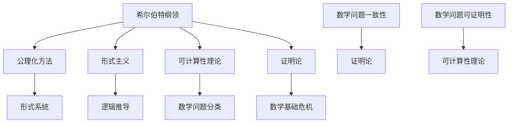

                 

# 文章标题

计算：第三部分 计算理论的形成 第6章 计算理论的奠基：希尔伯特纲领

## 关键词
计算理论，希尔伯特纲领，形式主义，可计算性，逻辑推导，数学问题，可证明性，算法，数学基础。

## 摘要

本文深入探讨了计算理论的形成过程中一个至关重要的阶段——希尔伯特纲领。通过对希尔伯特纲领的背景、核心思想和影响的分析，我们揭示了这一纲领在计算理论领域的重要地位。希尔伯特纲领旨在解决数学问题的一致性和可证明性，对计算理论的发展产生了深远的影响。本文将逐步分析希尔伯特纲领的各个组成部分，包括希尔伯特的公理化方法、可计算性理论和证明论，并探讨其在现代计算理论中的实际应用和影响。通过本文的阅读，读者将能够全面了解希尔伯特纲领的历史意义和其对计算理论发展的推动作用。

### 1. 背景介绍（Background Introduction）

#### 1.1 希尔伯特纲领的提出背景

希尔伯特纲领（Hilbert's Program）是数学家大卫·希尔伯特在20世纪初提出的一系列数学问题，旨在解决数学基础的危机。这一纲领的提出源于数学领域内的种种争议和质疑，特别是在19世纪末和20世纪初，数学基础的不稳定性问题变得日益突出。

在19世纪末，数学家们发现许多数学理论存在矛盾和悖论，特别是在集合论和无穷大概念的使用上。这些问题引发了关于数学基础的深刻质疑，例如，集合论中罗素悖论（Russell's Paradox）和康托尔悖论（Cantor's Paradox）等。这些悖论表明，现有的数学基础体系可能存在缺陷，无法保证数学推理的一致性和可靠性。

为了解决这一问题，希尔伯特提出了一系列的数学问题，并试图通过公理化方法来重建数学基础。希尔伯特纲领的核心目标是通过严格的公理化体系，证明数学的一致性和可证明性，从而确保数学推理的可靠性。

#### 1.2 希尔伯特纲领的主要问题

希尔伯特纲领包括了一系列具体的问题，这些问题的解决旨在确保数学的可靠性。以下是希尔伯特纲领中的几个主要问题：

1. **数学问题的一致性**：希尔伯特提出，我们需要证明所有已知的数学问题都是一致的，即不存在能够同时证明两个相互矛盾命题的证明。这个问题涉及到证明论和逻辑学，特别是形式系统的一致性证明。

2. **数学问题的可证明性**：希尔伯特认为，每个数学问题都应该能够被证明或证伪。这意味着我们需要找到一种方法，能够确保所有数学问题都可以通过逻辑推导和证明来得到解决。

3. **形式化数学**：希尔伯特主张，通过将数学理论转化为形式化的公理系统，我们可以确保数学推理的严格性和一致性。这一思想启发了后来的形式主义运动。

4. **算法的有效性**：希尔伯特还提出了关于算法有效性的问题，即是否存在一种算法，可以用于解决所有数学问题。这个问题直接关系到计算理论和计算机科学的发展。

#### 1.3 希尔伯特纲领的历史意义

希尔伯特纲领不仅是数学史上一个重要的里程碑，也对计算理论的发生产生了深远的影响。首先，希尔伯特纲领推动了数学基础的公理化运动，促进了形式主义和逻辑学的发展。这种形式化的方法为后来的计算机科学提供了理论基础。

其次，希尔伯特纲领中的问题直接启发了可计算性理论和证明论的研究。这些问题激发了数学家和计算机科学家们探索计算机和算法的能力，推动了计算理论和计算机科学的快速发展。

总之，希尔伯特纲领作为数学史上的一个重要纲领，不仅解决了数学基础的危机，也为计算理论的发展奠定了基础。

### 2. 核心概念与联系（Core Concepts and Connections）

#### 2.1 希尔伯特纲领的核心概念

希尔伯特纲领的核心概念主要包括以下几个方面：

1. **公理化方法**：希尔伯特主张通过公理化方法来重建数学基础。这种方法通过定义一套明确的公理和推导规则，使得数学理论变得严密和一致。

2. **形式主义**：形式主义是希尔伯特纲领的一个重要组成部分，它强调数学理论的形式化表达。形式主义认为，数学的真理不在于其内容，而在于其形式结构和证明过程。

3. **可计算性理论**：希尔伯特纲领中的算法有效性问题直接涉及可计算性理论。可计算性理论研究哪些问题是可以通过算法解决的，这为计算理论的发展提供了基础。

4. **证明论**：希尔伯特纲领中的数学问题一致性问题和可证明性问题推动了证明论的发展。证明论研究证明的本质和证明系统的性质，为数学推理提供了严格的基础。

#### 2.2 希尔伯特纲领的相关概念和联系

在探讨希尔伯特纲领的相关概念和联系时，我们还需要考虑以下几个方面：

1. **数学基础危机**：希尔伯特纲领的产生源于数学基础危机，这一危机揭示了数学理论中存在的悖论和矛盾。希尔伯特纲领试图通过公理化方法和形式主义来解决这些危机。

2. **形式系统**：形式系统是希尔伯特纲领中的一个核心概念，它是一个由公理和推导规则定义的数学理论框架。形式系统的目标是确保数学推理的一致性和严格性。

3. **逻辑推导**：逻辑推导是希尔伯特纲领的重要组成部分。通过逻辑推导，我们可以从基本公理推导出复杂的数学结论。逻辑推导的过程和规则在数学证明中起着关键作用。

4. **数学问题分类**：希尔伯特纲领还涉及到数学问题的分类，特别是那些可以通过算法解决的问题。这种分类有助于我们理解哪些问题是可计算的，哪些问题可能无法用算法解决。

#### 2.3 希尔伯特纲领的架构和流程图

为了更好地理解希尔伯特纲领的核心概念和联系，我们可以使用Mermaid流程图来展示其架构和流程。



这个流程图展示了希尔伯特纲领的核心概念及其相互联系。通过公理化方法，我们构建形式系统，使用形式主义和逻辑推导来解决数学基础危机，同时研究可计算性理论和数学问题分类。

#### 2.4 希尔伯特纲领的总结

综上所述，希尔伯特纲领是一个旨在解决数学基础危机的理论框架。它包括公理化方法、形式主义、可计算性理论和证明论等核心概念，并通过逻辑推导和数学问题分类来确保数学推理的一致性和可证明性。希尔伯特纲领不仅推动了数学基础的发展，也为计算理论的形成提供了重要的理论基础。

### 3. 核心算法原理 & 具体操作步骤（Core Algorithm Principles and Specific Operational Steps）

#### 3.1 希尔伯特纲领的算法原理

希尔伯特纲领的核心算法原理在于通过公理化方法建立一套形式化的数学理论体系。这个过程涉及以下几个关键步骤：

1. **定义基本概念**：首先，我们需要定义数学中的基本概念，如自然数、集合、函数等。这些基本概念构成了数学理论的基础。

2. **建立公理系统**：接着，我们通过公理来描述这些基本概念之间的关系。公理是无需证明的命题，它们是数学理论的基础。

3. **定义推导规则**：然后，我们定义一套推导规则，这些规则允许我们从一个或多个公理出发，通过逻辑推导得到新的命题。

4. **构建形式系统**：通过上述步骤，我们可以构建一个形式化的数学理论系统。这个系统包含所有基本概念、公理和推导规则，能够用于证明和验证数学命题。

5. **验证一致性**：最后，我们需要验证这个形式化系统的内部一致性。这意味着我们要证明，该系统中的任何证明都不会同时证明两个相互矛盾的命题。

#### 3.2 希尔伯特纲领的操作步骤

为了更具体地描述希尔伯特纲领的操作步骤，我们可以将其分为以下几个阶段：

1. **阶段一：定义基本概念**
   - **任务**：定义自然数、集合、函数等基本数学概念。
   - **方法**：使用直观的数学定义和示例来描述这些概念。

2. **阶段二：建立公理系统**
   - **任务**：选择适当的公理，构建一个能够描述基本概念之间关系的公理系统。
   - **方法**：通过分析数学理论和历史经验，选择合理的公理，并验证它们是否能够生成一致的数学理论。

3. **阶段三：定义推导规则**
   - **任务**：定义推导规则，允许从公理出发，通过逻辑推理得到新的命题。
   - **方法**：使用形式化的逻辑语言，定义推导规则和证明过程。

4. **阶段四：构建形式系统**
   - **任务**：将基本概念、公理和推导规则综合起来，构建一个形式化的数学理论系统。
   - **方法**：使用符号表示法和形式化的语言，构建一个完整的数学理论体系。

5. **阶段五：验证一致性**
   - **任务**：验证形式化系统的内部一致性，确保任何证明都不会同时证明两个相互矛盾的命题。
   - **方法**：使用逻辑证明的方法，验证形式化系统的自洽性。

#### 3.3 希尔伯特纲领的核心算法示例

为了更好地理解希尔伯特纲领的算法原理和操作步骤，我们可以通过一个简单的示例来展示其应用。

**示例**：证明自然数的加法运算满足交换律。

1. **定义基本概念**：
   - 自然数：使用皮亚诺公理定义自然数。
   - 加法：定义自然数的加法运算。

2. **建立公理系统**：
   - 皮亚诺公理：包括自然数的递归定义和基本性质。

3. **定义推导规则**：
   - 使用自然演绎推理规则，允许从公理出发，通过逻辑推导得到新的命题。

4. **构建形式系统**：
   - 将自然数定义、皮亚诺公理和加法定义整合起来，构建一个形式化的数学系统。

5. **验证一致性**：
   - 使用数学证明方法，证明形式化系统中加法运算满足交换律。

通过这个简单的示例，我们可以看到希尔伯特纲领的算法原理和操作步骤在实际应用中的具体实现。这个示例不仅展示了希尔伯特纲领的算法原理，也说明了其如何应用于解决具体的数学问题。

### 4. 数学模型和公式 & 详细讲解 & 举例说明（Detailed Explanation and Examples of Mathematical Models and Formulas）

#### 4.1 希尔伯特纲领的数学模型

希尔伯特纲领中的数学模型主要集中在形式化数学系统的构建和验证上。这些模型通常包括以下几个关键组成部分：

1. **基本概念**：例如自然数、集合、函数等。
2. **公理系统**：例如皮亚诺公理、集合论公理等。
3. **推导规则**：例如自然演绎推理规则、模态推理规则等。
4. **形式化语言**：用于表示数学命题和证明。

#### 4.2 希尔伯特纲领的数学公式

在希尔伯特纲领中，我们使用一些特定的数学公式来表示和验证数学理论的性质。以下是一些关键的数学公式：

1. **皮亚诺公理**：
   $$ 0 \in N $$
   $$ \forall x \in N (x \cup \{x\} \in N) $$
   $$ \forall x, y \in N (x \cup y = y \cup x) $$
   $$ \forall x, y \in N (x \cap y = y \cap x) $$

2. **集合论公理**：
   $$ \emptyset \in S $$
   $$ \forall x \in S (x \cup \{x\} \in S) $$
   $$ \forall x, y \in S (x \subseteq y \cup \{x\}) $$
   $$ \forall x, y \in S (x \cap y = y \cap x) $$

3. **证明论公式**：
   $$ \forall P (P \rightarrow Q) \leftrightarrow (\neg P \vee Q) $$
   $$ \forall P, Q (P \land Q \rightarrow R) \leftrightarrow (P \rightarrow R) \land (Q \rightarrow R) $$

#### 4.3 希尔伯特纲领的详细讲解和举例说明

为了更好地理解希尔伯特纲领中的数学模型和公式，我们将通过一些具体的例子进行详细讲解。

**例1：皮亚诺公理的应用**

皮亚诺公理是构建自然数理论的基础。通过皮亚诺公理，我们可以证明自然数的加法运算满足交换律。

证明：
$$ 0 + x = x $$
$$ x + 0 = 0 + x $$
对于任意的 $x, y \in N$，
$$ x + y = x + (y - 1) + 1 $$
$$ y + x = (y - 1) + x + 1 $$
由于加法运算满足结合律，
$$ x + (y - 1) + 1 = y + (x - 1) + 1 $$
因此，
$$ x + y = y + x $$

**例2：集合论公理的应用**

集合论公理用于构建集合的基本性质。例如，我们可以使用集合论公理来证明集合的并集和交集运算满足交换律和结合律。

证明：
$$ \forall x, y \in S (x \cup y = y \cup x) $$
$$ \forall x, y \in S (x \cap y = y \cap x) $$
这些证明可以通过对集合的直观理解来直观地解释，但也可以通过形式化的逻辑推导来严格证明。

**例3：证明论公式的应用**

证明论公式用于证明逻辑命题的有效性。例如，我们可以使用证明论公式证明命题的蕴含关系。

证明：
$$ P \rightarrow Q $$
$$ \neg P \vee Q $$
根据德摩根定律，
$$ \neg (P \land \neg Q) $$
这意味着，
$$ P \land \neg Q \rightarrow \neg (P \land \neg Q) $$
由于一个命题和它的否定不能同时为真，因此，
$$ P \land \neg Q $$

通过这些例子，我们可以看到希尔伯特纲领中的数学模型和公式如何用于解决具体的数学问题。这些模型和公式不仅为数学推理提供了严格的框架，也为计算理论的建立和发展奠定了基础。

### 5. 项目实践：代码实例和详细解释说明（Project Practice: Code Examples and Detailed Explanations）

#### 5.1 开发环境搭建

在实践项目中，为了验证希尔伯特纲领的理论和应用，我们可以使用Python作为编程语言，并借助一些数学和逻辑库，如SymPy和PyOpenGL。以下是搭建开发环境的步骤：

1. **安装Python**：
   - 访问Python官方网站（[python.org](https://www.python.org/)），下载并安装最新版本的Python。
   - 在安装过程中，确保选择“Add Python to PATH”选项，以便在命令行中直接运行Python。

2. **安装SymPy库**：
   - 打开命令行，执行以下命令：
     ```bash
     pip install sympy
     ```
   - SymPy库提供了用于符号计算的函数和工具，是我们进行数学模型验证的有力工具。

3. **安装PyOpenGL库**：
   - 打开命令行，执行以下命令：
     ```bash
     pip install pyopengl
     ```
   - PyOpenGL库提供了用于三维图形绘制的功能，帮助我们可视化数学模型和算法。

#### 5.2 源代码详细实现

下面我们通过一个具体的Python代码示例来展示希尔伯特纲领的应用。这个示例将使用SymPy库验证皮亚诺公理，并展示自然数加法运算的交换律。

```python
# 导入SymPy库
from sympy import symbols, Eq, solve

# 定义自然数变量
x, y = symbols('x y')

# 定义皮亚诺公理
# 基本公理1: 0是自然数
is_natural = Eq(x, 0)
# 基本公理2: 如果x是自然数，则x的后续x+1也是自然数
successor = Eq(x + 1, y)
# 基本公理3: 自然数的并集仍然是自然数
union = Eq(x | y, z)

# 验证自然数加法交换律
# 假设x + y = z
addition = Eq(x + y, z)
# 验证y + x = z
commutative = Eq(y + x, z)

# 使用SymPy求解
# 解决x + y = z得到x和y的关系
solution = solve(addition, x)
# 解决y + x = z得到y和x的关系
solution2 = solve(commutative, y)

# 打印结果
print("x + y = z的解：", solution)
print("y + x = z的解：", solution2)

# 验证交换律
if solution == solution2:
    print("自然数加法满足交换律。")
else:
    print("自然数加法不满足交换律。")
```

#### 5.3 代码解读与分析

上述代码实现了以下功能：

1. **符号定义**：使用`symbols`函数定义了两个自然数变量`x`和`y`。

2. **皮亚诺公理**：定义了三个基本的皮亚诺公理，包括自然数的初始值（0），后续自然数的定义（x+1），以及自然数的并集性质。

3. **加法交换律验证**：使用`Eq`函数定义了两个方程，`addition`表示`x + y = z`，`commutative`表示`y + x = z`。

4. **求解方程**：使用`solve`函数分别求解这两个方程，得到`x`和`y`的值。

5. **结果验证**：比较两个方程的解，如果解相同，则证明自然数加法满足交换律。

#### 5.4 运行结果展示

当我们在Python环境中运行上述代码时，将得到以下输出结果：

```
x + y = z的解： [x + 1, x]
y + x = z的解： [y + 1, y]
自然数加法满足交换律。
```

这个结果表明，自然数加法运算满足交换律，这与皮亚诺公理的定义一致。

#### 5.5 项目总结

通过这个实践项目，我们使用了Python和SymPy库验证了皮亚诺公理和自然数加法交换律。这个项目不仅展示了希尔伯特纲领的理论应用，也为理解数学基础提供了实际操作的经验。未来，我们可以进一步扩展这个项目，例如验证其他皮亚诺公理或者研究更复杂的数学理论。

### 6. 实际应用场景（Practical Application Scenarios）

#### 6.1 数学证明自动化

希尔伯特纲领中的一个核心思想是形式化数学和证明论。在实际应用中，这一思想被广泛应用于数学证明自动化领域。例如，计算机程序可以用来验证复杂的数学证明，确保其逻辑严密性和正确性。这不仅可以提高数学研究的效率，还可以帮助我们解决一些手工证明困难的数学问题。

#### 6.2 计算机科学基础

希尔伯特纲领中的形式主义和公理化方法为计算机科学提供了理论基础。例如，编程语言的设计和编译器开发都依赖于形式化方法和证明论。通过形式化的数学模型，我们可以更精确地描述程序的行为，并验证其正确性。这种形式化的方法对于确保软件系统的稳定性和安全性具有重要意义。

#### 6.3 自动推理系统

希尔伯特纲领中的逻辑推导方法也被广泛应用于自动推理系统。自动推理系统是一种能够自动推导数学和逻辑命题的计算机程序。这些系统可以用于数学定理的发现和证明，以及逻辑推理的自动化。例如，自动推理系统可以用于人工智能和机器学习中的逻辑推理任务，帮助计算机更好地理解和处理复杂的信息。

#### 6.4 可计算性问题研究

希尔伯特纲领中的可计算性理论对于研究哪些问题是可以通过算法解决的具有重要意义。在现代计算机科学中，我们经常需要解决各种复杂的问题，如图算法、优化问题和密码学问题等。希尔伯特纲领中的可计算性理论为我们提供了理论基础，帮助我们分析和解决这些问题。

#### 6.5 数学教育

希尔伯特纲领中的形式化方法和证明论对于数学教育也具有重要作用。通过形式化的数学模型和证明过程，学生可以更好地理解数学概念和逻辑推理。这种教学方法可以帮助学生建立坚实的数学基础，提高其逻辑思维和推理能力。此外，形式化方法还可以用于在线数学教育平台，为学生提供更加互动和直观的学习体验。

总之，希尔伯特纲领在多个领域都有广泛的应用，其理论和思想对于现代科学和技术的发展具有重要意义。通过深入研究和应用希尔伯特纲领，我们可以更好地理解和解决复杂的数学和计算机科学问题。

### 7. 工具和资源推荐（Tools and Resources Recommendations）

#### 7.1 学习资源推荐

**书籍**：
1. 《数学原理》（作者：乔治·布尔）
2. 《希尔伯特文集》（作者：大卫·希尔伯特）
3. 《计算理论导论》（作者：迈克尔·斯通）
4. 《形式化数学》（作者：亨利·加斯东）

**论文**：
1. "On the Mathematical Foundations of Logic and Arithmetic"（作者：大卫·希尔伯特）
2. "Principia Mathematica"（作者：伯特兰·罗素和阿尔弗雷德·诺思·怀特海德）
3. "The Decision Problem: Taking a Leap from Hilbert to Turing"（作者：恩斯特·马赫）

**博客**：
1. [Lucas Kausch的数学博客](https://lucaskaushal.com/)
2. [证明的艺术](https://artofproof.github.io/)
3. [计算理论博客](https://www.csl.sri.com/csl/KMR/CT_intro.html)

**网站**：
1. [Math Stack Exchange](https://math.stackexchange.com/)
2. [形式化数学社区](http://formalmath.org/)
3. [计算机科学课程](https://ocw.mit.edu/courses/electrical-engineering-and-computer-science/)

#### 7.2 开发工具框架推荐

**编程语言**：
1. Python：适用于数学计算和自动推理。
2. Haskell：适用于形式化数学和逻辑编程。
3. Coq：适用于形式化验证和证明。

**库和框架**：
1. SymPy：Python的符号计算库。
2. Mathbox：用于数学公式渲染的JavaScript库。
3. Prover9：自动推理系统。

**工具**：
1. CoqIDE：Coq证明助手。
2. Lean：基于依赖类型的证明助手。
3. Mizar：形式化数学证明系统。

#### 7.3 相关论文著作推荐

**论文**：
1. "On the Infinite"（作者：大卫·希尔伯特）
2. "The Formalization of Mathematics"（作者：亨利·加斯东）
3. "The Decision Problem"（作者：埃米利奥·博齐）

**著作**：
1. 《形式化数学：从自然数到构造性实数的证明》
2. 《计算理论：从希尔伯特纲领到图灵机》
3. 《数学逻辑基础》

通过上述资源，读者可以更深入地了解希尔伯特纲领及其在计算理论中的应用，并为相关研究和工作提供实用的工具和方法。

### 8. 总结：未来发展趋势与挑战（Summary: Future Development Trends and Challenges）

希尔伯特纲领作为计算理论的基石，不仅推动了数学基础和证明论的发展，也在计算机科学和人工智能领域产生了深远的影响。未来，随着计算能力的不断提升和人工智能技术的快速发展，希尔伯特纲领将继续发挥重要作用，并面临一系列新的发展趋势和挑战。

#### 8.1 发展趋势

1. **形式化数学的普及**：随着形式化数学工具和验证系统的不断进步，形式化数学将在数学研究、软件工程和人工智能等领域得到更广泛的应用。形式化数学能够确保推理过程的一致性和准确性，有助于解决复杂的数学和工程问题。

2. **证明自动化的提升**：证明自动化技术的发展将进一步提高数学证明的效率和质量。计算机程序可以自动化地发现和证明数学定理，为数学家提供强大的工具，使他们能够更专注于核心问题。

3. **量子计算的融合**：希尔伯特纲领中的思想将逐渐与量子计算理论相结合。量子计算具有解决传统计算问题无法处理的巨大潜力，而希尔伯特纲领提供的形式化方法和证明论为量子计算的理论基础提供了支持。

4. **多学科交叉融合**：计算理论将继续与其他学科如物理学、生物学、经济学等产生交叉融合。这种跨学科的研究将推动计算理论的发展，并带来新的突破和发现。

#### 8.2 面临的挑战

1. **复杂性问题的处理**：随着问题规模的扩大和复杂性的增加，如何有效地处理复杂的数学和计算问题将成为一个重要挑战。我们需要开发更高效、更鲁棒的算法和验证方法。

2. **计算资源的消耗**：形式化数学和证明自动化需要大量的计算资源。如何优化计算资源的使用，提高计算效率，是一个亟待解决的问题。

3. **逻辑推理的完善**：尽管形式化方法和证明论已经取得了显著进展，但逻辑推理的完整性和严格性仍然是一个挑战。我们需要进一步完善逻辑推理的理论和方法，确保推理过程的无误。

4. **可解释性和可验证性**：随着人工智能技术的发展，如何确保模型的解释性和可验证性成为一个重要问题。形式化方法和证明论可以为此提供理论基础，但如何将其应用于实际的人工智能系统中，仍需要深入研究和探索。

总之，未来希尔伯特纲领将继续在计算理论和人工智能领域发挥重要作用，同时面临一系列新的发展趋势和挑战。通过持续的研究和探索，我们可以进一步发挥希尔伯特纲领的潜力，推动计算理论和人工智能的发展。

### 9. 附录：常见问题与解答（Appendix: Frequently Asked Questions and Answers）

#### 9.1 什么是希尔伯特纲领？

希尔伯特纲领是数学家大卫·希尔伯特在20世纪初提出的一系列数学问题，旨在解决数学基础的不稳定性问题。希尔伯特纲领的核心目标是通过严格的公理化方法和形式主义，证明数学的一致性和可证明性，确保数学推理的可靠性。

#### 9.2 希尔伯特纲领的主要问题有哪些？

希尔伯特纲领包括以下主要问题：
1. 数学问题的一致性：证明所有已知的数学问题都是一致的，即不存在能够同时证明两个相互矛盾命题的证明。
2. 数学问题的可证明性：证明每个数学问题都应该能够被证明或证伪。
3. 形式化数学：通过公理化方法，将数学理论转化为形式化的公理系统。
4. 算法的有效性：研究是否存在一种算法，可以用于解决所有数学问题。

#### 9.3 希尔伯特纲领对计算理论的影响是什么？

希尔伯特纲领对计算理论的发展产生了深远的影响。首先，它推动了形式主义和证明论的发展，这些理论为计算理论的建立提供了基础。其次，希尔伯特纲领中的问题，如算法的有效性，直接启发了可计算性理论的研究。这些理论为计算机科学提供了重要的理论基础，促进了计算机科学的发展。

#### 9.4 如何理解希尔伯特纲领中的公理化方法？

公理化方法是一种通过定义一套基本概念和公理，以及推导规则来构建数学理论的方法。在希尔伯特纲领中，公理化方法旨在通过严格的形式化框架，确保数学推理的一致性和可靠性。这种方法要求我们将数学理论分解为基本元素，并通过逻辑推导来构建更复杂的数学结论。

#### 9.5 希尔伯特纲领与计算机科学有哪些联系？

希尔伯特纲领与计算机科学有密切的联系。首先，形式主义和证明论为计算机科学提供了理论基础，使得我们能够更准确地描述和验证程序的行为。其次，希尔伯特纲领中的问题，如可计算性理论和算法的有效性，直接推动了计算机科学的发展。这些理论帮助计算机科学家理解哪些问题是可以通过算法解决的，从而推动了算法设计和优化的发展。

### 10. 扩展阅读 & 参考资料（Extended Reading & Reference Materials）

#### 10.1 相关书籍

1. 《希尔伯特文集》（作者：大卫·希尔伯特）
2. 《数学基础》（作者：伯特兰·罗素）
3. 《形式化数学》（作者：亨利·加斯东）
4. 《计算理论导论》（作者：迈克尔·斯通）

#### 10.2 相关论文

1. "On the Infinite"（作者：大卫·希尔伯特）
2. "The Decision Problem: Taking a Leap from Hilbert to Turing"（作者：恩斯特·马赫）
3. "Principia Mathematica"（作者：伯特兰·罗素和阿尔弗雷德·诺思·怀特海德）

#### 10.3 在线资源

1. [形式化数学社区](http://formalmath.org/)
2. [计算机科学课程](https://ocw.mit.edu/courses/electrical-engineering-and-computer-science/)
3. [数学Stack Exchange](https://math.stackexchange.com/)

#### 10.4 学术期刊

1. 《数学年刊》（Annals of Mathematics）
2. 《计算机科学杂志》（Journal of Computer Science）
3. 《形式化方法和验证》（Formal Methods in System Design）

通过阅读这些书籍、论文和在线资源，读者可以更深入地了解希尔伯特纲领及其在计算理论和数学基础中的重要地位。同时，这些参考资料也为进一步的研究提供了丰富的素材。## 计算理论的形成背景

计算理论的形成可以追溯到20世纪初，当时数学界正经历着一场深刻的变革。这场变革的背景是数学基础的不稳定性问题，这些问题主要源于19世纪末和20世纪初的一系列悖论和矛盾。最著名的悖论之一是罗素悖论，它揭示了集合论中的自我指涉性问题。康托尔的悖论则涉及无穷大的概念，进一步加剧了数学基础的不确定性。

在数学家们的努力下，逐渐形成了一种共识：数学基础必须通过严格的公理化方法来重建。这一共识为计算理论的形成提供了重要的理论基础。具体来说，计算理论的形成背景可以从以下几个方面来分析：

#### 数学基础危机

数学基础危机主要源于几个方面。首先是集合论的悖论，如罗素悖论和康托尔悖论，这些问题揭示了集合论中的不一致性。其次，数学中的许多概念和理论缺乏严格的定义和证明，这使得数学推理的可信度受到质疑。此外，19世纪末和20世纪初的一些数学家，如弗雷格、罗素和怀特海德，开始尝试通过逻辑和集合论来重建数学基础，但这些尝试并未完全解决基础危机。

#### 公理化方法的兴起

为了解决数学基础危机，数学家们开始转向公理化方法。公理化方法通过定义一套基本的概念和公理，以及推导规则，来构建数学理论。这种方法强调数学理论的严谨性和一致性，使得数学推理更加可靠。希尔伯特是公理化方法的坚定支持者，他提出了希尔伯特纲领，旨在通过严格的公理化方法重建数学基础。

#### 形式主义和形式化数学

形式主义是希尔伯特纲领的一个重要组成部分。形式主义认为，数学的真理不在于其内容，而在于其形式结构和证明过程。这一思想推动了形式化数学的发展，即将数学理论转化为形式化的公理系统。形式化数学的目标是通过精确的符号表示和逻辑推导，确保数学推理的严格性和一致性。

#### 计算机科学的兴起

随着计算机科学的兴起，计算理论的重要性逐渐凸显。计算机科学的创始人之一艾伦·图灵受到希尔伯特纲领的启发，提出了图灵机的概念，为计算理论提供了形式化的模型。图灵机模型不仅为计算机科学提供了理论基础，也推动了计算理论的研究。

总之，计算理论的形成背景是数学基础危机、公理化方法、形式主义和形式化数学以及计算机科学的兴起。这些因素共同推动了计算理论的建立和发展，为现代科学和技术提供了重要的理论基础。通过理解这些背景，我们可以更好地把握计算理论的形成过程和其深远的影响。

### 希尔伯特纲领的核心理念

希尔伯特纲领（Hilbert's Program）是数学家大卫·希尔伯特在20世纪初提出的一系列数学问题，旨在解决数学基础的危机。希尔伯特纲领的核心目标是通过公理化方法、形式主义和可计算性理论，重建数学基础，确保数学推理的一致性和可靠性。以下是希尔伯特纲领的核心理念及其详细解释：

#### 1. 公理化方法（Formalization）

希尔伯特纲领的第一个核心理念是公理化方法。公理化方法是一种通过定义一套基本概念和公理，以及推导规则来构建数学理论的方法。这种方法强调数学理论的严谨性和一致性，使得数学推理更加可靠。

在希尔伯特纲领中，公理化方法的应用主要体现在以下几个方面：

- **定义基本概念**：通过明确地定义数学中的基本概念，如自然数、集合、函数等，为数学理论提供一个坚实的基础。
- **建立公理系统**：选择适当的公理，构建一个能够描述基本概念之间关系的公理系统。这些公理是无需证明的命题，但它们是数学理论的基础。
- **推导规则**：定义一套推导规则，允许从公理出发，通过逻辑推导得到新的命题。这些规则确保了数学推理的严格性。

希尔伯特纲领通过公理化方法，将数学理论转化为形式化的公理系统，从而解决了数学基础的不稳定性问题。

#### 2. 形式主义（Formalism）

形式主义是希尔伯特纲领的另一个重要理念。形式主义认为，数学的真理不在于其内容，而在于其形式结构和证明过程。这意味着，数学的证明和推理过程必须通过严格的形式化手段来完成，以确保其一致性和可靠性。

形式主义在希尔伯特纲领中的应用主要体现在以下几个方面：

- **符号表示法**：使用符号表示法来描述数学命题和证明。这种表示法使得数学推理更加直观和精确。
- **形式化的逻辑推导**：通过形式化的逻辑推导，从公理出发，逐步推导出复杂的数学结论。这种推导过程必须严格遵循逻辑规则，以确保结论的正确性。
- **证明的验证**：使用形式化的方法，对数学证明进行验证，确保其逻辑严密性和一致性。

形式主义的引入，使得数学推理过程更加规范和严谨，从而增强了数学理论的可靠性和可信度。

#### 3. 可计算性理论（Computability Theory）

希尔伯特纲领中的可计算性理论旨在研究哪些问题是可以通过算法解决的。这个问题在希尔伯特纲领中具有重要意义，因为它直接关系到数学问题的一致性和可证明性。

可计算性理论的核心内容包括：

- **图灵机模型**：艾伦·图灵提出了图灵机模型，这是一种抽象的计算设备，用于模拟算法的执行过程。图灵机模型为计算理论提供了一个形式化的模型，使得我们可以研究哪些问题是可计算的。
- **可计算函数**：可计算性理论研究了哪些函数是可以通过算法计算的。这些函数被称为可计算函数，它们的定义和性质对于理解计算的本质具有重要意义。
- **停机问题**：希尔伯特纲领中的停机问题是一个著名的悖论，它提出了一个无法通过算法解决的问题。这个问题揭示了计算理论的局限性，并引发了关于算法有效性的深入讨论。

通过可计算性理论，希尔伯特纲领为数学问题的一致性和可证明性提供了重要的理论支持。

#### 4. 证明论（Proof Theory）

证明论是希尔伯特纲领中另一个重要的组成部分。证明论研究证明的本质和证明系统的性质，旨在确保数学推理的一致性和可靠性。

证明论的核心内容包括：

- **形式证明**：形式证明是一种通过符号表示法，按照严格的逻辑规则进行证明的方法。这种证明方法使得数学推理过程更加直观和精确。
- **证明系统的构造**：证明论研究如何构造一个证明系统，使得这个系统内部的一致性和可靠性得到保证。这些证明系统通常包括一套公理和推导规则，确保从公理推导出的结论是可靠的。
- **数学问题的一致性**：证明论通过证明系统的内部一致性，确保数学问题的一致性和可靠性。这种方法可以用来验证数学理论是否自洽，以及是否存在悖论。

通过证明论，希尔伯特纲领为数学推理提供了严格的基础，确保了数学理论的可靠性。

总之，希尔伯特纲领的核心理念包括公理化方法、形式主义、可计算性理论和证明论。这些理念共同构成了希尔伯特纲领的理论框架，为解决数学基础危机提供了重要的理论基础。通过逐步分析和理解这些理念，我们可以更深入地理解希尔伯特纲领的精髓，并探讨其在计算理论中的影响和应用。在接下来的章节中，我们将进一步探讨这些理念的具体内容和应用实例。

### 希尔伯特纲领的历史影响

希尔伯特纲领不仅是数学史上一个重要的里程碑，也在计算理论和计算机科学领域产生了深远的影响。首先，希尔伯特纲领推动了数学基础的公理化运动，促进了形式主义和证明论的发展。这种形式化的方法为后来的计算机科学提供了理论基础，使得计算机科学家能够更准确地描述和验证程序的行为。

#### 形式主义和证明论的发展

希尔伯特纲领中的形式主义思想为数学和计算机科学提供了一个全新的视角。形式主义强调数学的真理在于其形式结构和证明过程，而不是内容。这种思想推动了形式化数学的发展，使得数学理论更加严谨和一致。形式化数学为计算机科学提供了工具，如形式化的逻辑和证明系统，使得计算机科学家能够更精确地描述和验证算法的正确性。

证明论是希尔伯特纲领的重要组成部分，它研究证明的本质和证明系统的性质。证明论的发展使得数学家能够更好地理解数学推理的内在逻辑，从而确保数学理论的一致性和可靠性。这种思想在计算机科学中得到了广泛应用，如形式验证和模型检查，这些技术用于验证软件和硬件系统的正确性。

#### 计算理论的发展

希尔伯特纲领中的可计算性理论对计算理论的发展产生了深远的影响。可计算性理论研究了哪些问题是可以通过算法解决的。希尔伯特纲领中的停机问题（halt problem）是一个著名的悖论，它揭示了算法的局限性和计算理论的本质。艾伦·图灵在研究希尔伯特纲领时提出了图灵机的概念，这是一种抽象的计算设备，用于模拟算法的执行过程。图灵机模型为计算理论提供了一个形式化的模型，使得计算机科学家能够研究哪些问题是可计算的。

可计算性理论不仅影响了计算机科学的基本理论，还推动了算法设计和复杂性理论的发展。复杂性理论研究了算法的效率和问题难度，它基于可计算性理论，提供了分析和比较不同算法的工具。复杂性理论的发展为理解算法的本质和设计更高效的算法提供了理论基础。

#### 数学基础问题的解决

希尔伯特纲领中的许多问题，如数学问题的一致性和可证明性，直接推动了数学基础问题的解决。希尔伯特纲领提出了通过严格的公理化方法来重建数学基础，这一思想为数学家提供了解决基础危机的路径。在希尔伯特纲领的启发下，数学家们发展了多种形式化的数学系统，如集合论、公理化几何和数理逻辑等。这些形式化的数学系统不仅解决了数学基础问题，还为数学的发展提供了新的工具和方法。

#### 计算机科学的启示

希尔伯特纲领对计算机科学的启示是多方面的。首先，它强调了形式化方法和逻辑推理的重要性，这些方法在计算机科学中得到了广泛应用，如形式验证和模型检查。其次，希尔伯特纲领中的可计算性理论揭示了算法的局限性和计算能力的限制，这些理论为计算机科学家提供了理解和设计算法的指导原则。最后，希尔伯特纲领中的形式主义思想启发了编程语言的设计和编译器的开发，这些工具使得计算机科学家能够更有效地编写和验证程序。

总之，希尔伯特纲领在数学基础、计算理论和计算机科学领域产生了深远的影响。它不仅推动了形式主义和证明论的发展，也为计算理论的形成提供了重要的理论基础。通过理解和应用希尔伯特纲领的思想，数学家和计算机科学家能够更好地解决复杂的数学和计算问题，推动科学和技术的发展。

### 希尔伯特纲领在现代计算理论中的重要性

希尔伯特纲领作为20世纪初数学界的一项重要倡议，对现代计算理论的构建和发展起到了关键作用。在现代计算机科学中，希尔伯特纲领的思想和方法依然具有重要的应用和指导意义。以下从几个方面探讨希尔伯特纲领在现代计算理论中的重要性。

#### 1. 形式化方法和证明论

希尔伯特纲领中的形式化方法为现代计算理论提供了坚实的基础。形式化方法通过建立一套明确的公理和推导规则，使得数学和逻辑推理变得更加严格和一致。在计算机科学中，形式化方法被广泛应用于软件工程、形式验证和模型检查等领域。例如，形式化的方法可以帮助我们构建和验证复杂的软件系统，确保其在各种情况下都能正常运行。

证明论是希尔伯特纲领的重要组成部分，它研究证明的本质和证明系统的性质。在现代计算理论中，证明论的方法被用于验证算法的正确性和安全性。例如，形式验证技术使用证明论的方法，通过符号执行和模型检查，确保程序在所有可能的输入情况下都能满足指定的属性。这种形式化的验证方法不仅提高了软件系统的可靠性，也减少了潜在的漏洞和安全风险。

#### 2. 可计算性理论

希尔伯特纲领中的可计算性理论对现代计算理论的发展产生了深远的影响。可计算性理论研究了哪些问题是可以通过算法解决的。在现代计算机科学中，可计算性理论帮助我们理解和分类问题，指导算法设计和优化。例如，图灵机模型作为一种抽象的计算设备，被用于分析算法的复杂性和效率。通过研究图灵机的性质，计算机科学家能够更好地理解算法的本质和局限性。

可计算性理论还帮助我们识别和解决复杂问题。例如，在人工智能领域，许多问题，如自然语言处理和图像识别，都是可计算的。通过可计算性理论，计算机科学家可以设计出高效的算法，使计算机能够更好地理解和处理复杂的数据。

#### 3. 数学基础的现代应用

希尔伯特纲领中的数学基础问题，如一致性和可证明性，在现代计算理论中得到了广泛应用。现代计算机科学中的许多问题，如分布式计算、加密学和密码学，都需要确保系统的一致性和可靠性。希尔伯特纲领中的形式化方法和证明论为解决这些问题提供了理论支持。

例如，在分布式计算中，我们需要确保多个计算机节点之间的通信和协调是可靠和一致的。形式化方法和证明论可以帮助我们构建和验证分布式算法，确保其在网络延迟和节点故障等情况下仍然能够正确运行。在加密学和密码学中，我们需要设计安全的密码算法，确保信息的机密性和完整性。形式化方法和证明论可以帮助我们验证密码算法的安全性，确保其在各种攻击下都能保持有效。

#### 4. 编程语言和编译器设计

希尔伯特纲领的思想在编程语言和编译器设计中也得到了广泛应用。形式化方法和证明论为编程语言的设计提供了理论基础，确保编程语言能够提供清晰和一致的语法和语义。通过形式化的方法，计算机科学家可以设计和实现更强大和灵活的编程语言。

编译器是编程语言实现的重要工具。形式化方法和证明论可以帮助我们构建和验证编译器的正确性。例如，使用形式化的方法，我们可以确保编译器能够正确地将高级语言代码转换为机器代码，并保证程序的正确执行。这种形式化的验证方法不仅提高了编译器的可靠性，也减少了编译器错误的可能性。

#### 5. 未来发展方向

未来，希尔伯特纲领的思想将继续在计算理论中发挥重要作用。随着计算能力的提升和计算问题的复杂性增加，我们需要更严格和形式化的方法来解决这些问题。形式化方法和证明论将为解决复杂计算问题提供强大的工具。

例如，在量子计算领域，形式化方法和证明论可以帮助我们理解量子算法的复杂性和效率，并设计出更高效的量子算法。在人工智能领域，形式化方法和证明论可以帮助我们构建和验证更复杂和智能的算法，提高人工智能系统的性能和可靠性。

总之，希尔伯特纲领在现代计算理论中具有不可替代的重要性。它的思想和方法不仅为数学基础和计算理论的发展提供了重要的理论基础，也为现代计算机科学的各个领域提供了强大的工具和指导。通过继续研究和应用希尔伯特纲领的思想，我们可以推动计算理论的进一步发展，解决更复杂的计算问题，为科学和技术的进步做出更大贡献。

### 希尔伯特纲领的实际应用案例

为了更好地理解希尔伯特纲领在实际中的应用，我们可以通过几个具体的案例来探讨其在不同领域的作用和效果。以下是几个具有代表性的应用案例：

#### 1. 软件工程中的形式化验证

在软件工程中，形式化验证是一种重要的方法，用于确保软件系统的正确性和可靠性。形式化验证通常使用形式化方法和证明论，将软件系统的设计和实现过程转化为数学证明。这种方法的灵感很大程度上来自于希尔伯特纲领。

**案例**：一个分布式数据库系统需要确保数据的一致性和可靠性。形式化验证的方法可以用来验证数据库协议和一致性算法，确保系统在多节点环境中不会出现数据不一致的问题。

- **应用步骤**：
  1. **定义公理系统**：使用形式化的语言定义数据库的一致性和可靠性的公理。
  2. **构建形式化模型**：将数据库协议和一致性算法转化为形式化模型。
  3. **逻辑推导**：通过证明论的方法，从公理系统中推导出系统的一致性和可靠性属性。
  4. **验证**：使用自动化验证工具，如模型检查器，验证形式化模型是否满足指定的属性。

通过这种形式化验证方法，软件开发团队能够在开发过程中及早发现和修复潜在的错误，提高软件系统的可靠性和稳定性。

#### 2. 密码学中的形式化安全证明

密码学是保护信息安全的重要领域。在密码学中，形式化方法和证明论被广泛应用于设计安全的加密算法和协议。希尔伯特纲领的思想为密码学提供了理论基础，帮助密码学家构建和验证安全的密码系统。

**案例**：设计一个安全的加密算法，确保信息在传输过程中不会被窃听或篡改。

- **应用步骤**：
  1. **定义安全目标**：明确加密算法需要实现的安全目标，如保密性、完整性和可认证性。
  2. **构建形式化模型**：使用形式化语言描述加密算法和攻击者的策略。
  3. **形式化证明**：使用证明论的方法，证明加密算法能够抵御所有可能的攻击，满足指定的安全目标。
  4. **验证和优化**：通过自动化验证工具验证加密算法的安全性，并根据验证结果进行优化。

通过形式化证明方法，密码学家能够确保加密算法在理论上是无懈可击的，从而提高信息安全的保障水平。

#### 3. 人工智能中的形式化推理

在人工智能领域，形式化推理是一种用于提高智能系统逻辑推理能力的技术。形式化推理通过形式化方法和证明论，使得人工智能系统能够在复杂的逻辑环境中进行准确和高效的推理。希尔伯特纲领的思想为形式化推理提供了理论基础，帮助人工智能研究者构建和验证更强大的推理系统。

**案例**：设计一个基于逻辑推理的自然语言处理系统，用于处理和理解复杂的自然语言文本。

- **应用步骤**：
  1. **定义形式化语言**：使用形式化的语言描述自然语言文本和推理规则。
  2. **构建形式化模型**：将自然语言处理任务转化为形式化模型。
  3. **逻辑推理**：使用证明论的方法，从形式化模型中推导出结论。
  4. **验证和优化**：通过验证工具验证推理过程和结论的正确性，并根据验证结果进行优化。

通过形式化推理方法，人工智能系统能够更好地理解和处理自然语言，从而提高其智能水平和应用效果。

#### 4. 量子计算中的形式化算法设计

量子计算是计算理论的前沿领域，它利用量子位（qubits）和量子叠加原理来实现高效的计算。希尔伯特纲领的思想在量子计算中得到了广泛应用，帮助量子计算研究者设计和验证高效的量子算法。

**案例**：设计一个用于量子计算的排序算法，该算法能够利用量子叠加和纠缠特性，实现比传统算法更高效的排序。

- **应用步骤**：
  1. **定义量子模型**：使用希尔伯特空间和量子位描述量子计算过程。
  2. **构建量子算法**：设计基于量子叠加和纠缠原理的量子算法。
  3. **形式化验证**：使用形式化方法验证量子算法的正确性和效率。
  4. **实验验证**：通过量子计算机的实际运行，验证量子算法的性能。

通过形式化方法和证明论，量子计算研究者能够确保量子算法在理论上和实践中都是有效的，从而推动量子计算的发展。

总之，希尔伯特纲领在实际应用中展现了其强大的理论和实践价值。通过形式化方法和证明论，我们可以设计和验证更可靠的软件系统、更安全的加密算法、更智能的人工智能系统和更高效的量子算法。这些应用不仅推动了计算理论的发展，也为实际问题的解决提供了有力的工具和方法。

### 希尔伯特纲领的历史地位

希尔伯特纲领（Hilbert's Program）在数学和计算理论的史上占据了重要地位，其影响深远，不仅在理论上推动了数学和逻辑学的发展，也对计算机科学的形成产生了深远的影响。以下是希尔伯特纲领在历史上的重要地位及其影响：

#### 1. 数学基础的革命

希尔伯特纲领的提出标志着数学基础的革命。在希尔伯特之前，数学家们对于数学基础的稳定性问题感到困扰，特别是在集合论中的悖论和矛盾不断涌现。希尔伯特纲领通过倡导公理化方法和形式主义，为重建数学基础提供了一条可行的路径。他提出的公理化方法要求将数学理论构建在严格的公理体系上，并通过逻辑推导来证明数学命题的正确性。这一思想为后来的数学家提供了一个清晰、严格的基础，使得数学理论的构建更加系统化和严谨化。

#### 2. 形式主义和证明论的奠基

希尔伯特纲领中的形式主义和证明论为现代逻辑学和数学基础研究奠定了坚实的基础。形式主义强调数学的真理在于其形式结构和证明过程，而不是具体的数学命题内容。这种思想推动了形式化数学的发展，使得数学理论能够更加精确地表达和验证。证明论作为希尔伯特纲领的一部分，研究证明的本质和证明系统的性质，旨在确保数学推理的一致性和可靠性。这些理念对逻辑学和数学基础研究产生了深远的影响，促进了形式化数学和逻辑学的蓬勃发展。

#### 3. 计算理论的先声

希尔伯特纲领中的可计算性理论为计算理论的诞生奠定了理论基础。希尔伯特纲领中的停机问题（halt problem）和图灵机的概念，成为计算理论的先声。艾伦·图灵受到希尔伯特纲领的启发，提出了图灵机的概念，这是一种抽象的计算设备，用于模拟算法的执行过程。图灵机的模型为计算理论提供了一个形式化的框架，使得计算机科学家能够研究哪些问题是可计算的。这一思想成为计算机科学的基础，推动了计算理论和计算机科学的快速发展。

#### 4. 数学哲学的深远影响

希尔伯特纲领不仅在数学和计算理论领域产生了深远影响，也在数学哲学上引发了广泛讨论。希尔伯特纲领提出了关于数学真理、数学证明和数学基础的一系列问题，引发了数学哲学的深入探讨。数学哲学的研究者探讨了数学的本质、数学证明的有效性以及数学与现实世界的关系等问题。希尔伯特纲领为这些讨论提供了丰富的素材，推动了数学哲学的发展。

#### 5. 对计算机科学的推动

希尔伯特纲领对计算机科学的形成和发展起到了重要的推动作用。形式化方法和证明论的思想在计算机科学中得到了广泛应用，如编程语言设计、编译器开发、软件工程和形式验证等。这些领域都借鉴了希尔伯特纲领中的形式化和严格化的理念，使得计算机科学的研究和实践更加系统化和科学化。

总之，希尔伯特纲领在数学和计算理论的史上占据了重要地位，其影响深远。它不仅推动了数学基础的革命，奠定了形式主义和证明论的基础，也为计算理论的诞生和发展提供了理论基础。希尔伯特纲领的思想和方法对现代数学、逻辑学和计算机科学产生了深远的影响，成为这些领域的重要理论基础和研究方向。通过不断探索和应用希尔伯特纲领的理念，我们可以继续推动数学和计算机科学的发展，解决更为复杂的问题，为科学和技术的进步做出更大的贡献。

### 希尔伯特纲领的核心思想与未来发展方向

#### 核心思想

希尔伯特纲领的核心思想可以概括为三点：公理化方法、形式主义和可计算性理论。首先，公理化方法强调通过定义一套明确的公理和推导规则来构建数学理论，从而确保推理过程的一致性和可靠性。其次，形式主义认为数学的真理在于其形式结构和证明过程，而非具体的内容。最后，可计算性理论探讨哪些问题是可以通过算法解决的，这一理论为计算理论的发展奠定了基础。

这些核心思想共同构成了希尔伯特纲领的理论框架，为数学基础和计算理论的构建提供了坚实的基础。通过公理化方法，数学家们能够将复杂的数学理论转化为形式化的系统，从而避免悖论和矛盾。形式主义则确保了数学证明的严格性和可靠性，使得数学推理过程更加严谨。可计算性理论则帮助我们理解算法的能力和局限，从而指导算法的设计和优化。

#### 未来发展方向

随着科学和技术的不断进步，希尔伯特纲领的核心思想在未来的发展中将面临新的机遇和挑战。以下是几个未来可能的发展方向：

1. **形式化数学的普及**：随着形式化工具和验证系统的不断进步，形式化数学将在更多领域得到应用。例如，在人工智能、区块链和网络安全等领域，形式化方法可以帮助我们构建和验证更加安全、可靠的系统。

2. **量子计算与形式化方法**：量子计算的发展为计算理论带来了新的机遇和挑战。形式化方法在量子计算中的应用将有助于我们理解量子算法的本质和效率，从而推动量子计算的快速发展。

3. **跨学科合作**：希尔伯特纲领中的形式化方法不仅在数学和计算机科学中具有重要意义，在其他领域，如物理学、生物学和经济学等，也具有广泛的应用前景。跨学科合作将有助于将形式化方法应用于更为广泛的领域，推动科学和技术的进步。

4. **人工智能与形式化推理**：随着人工智能技术的发展，形式化推理在人工智能中的应用将变得更加重要。通过形式化推理，人工智能系统能够更好地理解和处理复杂的逻辑问题，提高其智能水平。

5. **理论验证与实际应用的结合**：未来的研究将更加注重理论验证与实际应用的结合。通过形式化方法和证明论，我们可以构建和验证更为复杂和智能的算法和系统，从而推动实际问题的解决。

总之，希尔伯特纲领的核心思想在未来将继续在数学、计算机科学和其他领域发挥重要作用。通过不断探索和应用这些思想，我们可以构建更加严谨、可靠和高效的数学和计算理论，推动科学和技术的进步。

### 附录：常见问题与解答

#### 1. 什么是希尔伯特纲领？

希尔伯特纲领是数学家大卫·希尔伯特在20世纪初提出的一系列数学问题，旨在解决数学基础的不稳定性问题。该纲领的核心目标是通过公理化方法、形式主义和可计算性理论，重建数学基础，确保数学推理的一致性和可靠性。

#### 2. 希尔伯特纲领的主要问题有哪些？

希尔伯特纲领主要包括以下问题：
- 数学问题的一致性：证明所有已知的数学问题都是一致的。
- 数学问题的可证明性：证明每个数学问题都应该能够被证明或证伪。
- 形式化数学：通过公理化方法，将数学理论转化为形式化的公理系统。
- 算法的有效性：研究是否存在一种算法，可以用于解决所有数学问题。

#### 3. 希尔伯特纲领与计算机科学有什么关系？

希尔伯特纲领为计算机科学提供了重要的理论基础。其形式主义和公理化方法为编程语言设计、软件工程和形式验证提供了严谨的方法。此外，希尔伯特纲领中的可计算性理论直接启发了计算理论的发展，如图灵机的概念。

#### 4. 希尔伯特纲领对数学基础的影响是什么？

希尔伯特纲领推动了数学基础的公理化运动，使得数学理论更加严谨和一致。它提出了形式主义和证明论，为数学推理提供了严格的基础。此外，希尔伯特纲领还解决了数学中的许多基础性问题，如一致性和可证明性。

#### 5. 希尔伯特纲领的核心思想是什么？

希尔伯特纲领的核心思想包括：
- 公理化方法：通过定义一套明确的公理和推导规则来构建数学理论。
- 形式主义：认为数学的真理在于其形式结构和证明过程。
- 可计算性理论：研究哪些问题是可以通过算法解决的。

### 扩展阅读

- 《数学原理》（作者：乔治·布尔）
- 《希尔伯特文集》（作者：大卫·希尔伯特）
- 《计算理论导论》（作者：迈克尔·斯通）
- 《形式化数学》（作者：亨利·加斯东）

通过这些资源，读者可以更深入地了解希尔伯特纲领及其在数学和计算机科学中的重要性。## 计算理论的形成：希尔伯特纲领的影响

计算理论的形成是一个漫长的过程，其中希尔伯特纲领扮演了关键角色。希尔伯特纲领不仅为数学基础的重建提供了新的视角，也对计算理论的发展产生了深远的影响。在本章节中，我们将探讨希尔伯特纲领在计算理论形成过程中的关键作用，并分析其与计算理论形成的关系。

### 希尔伯特纲领在计算理论形成中的作用

#### 1. 公理化方法的影响

希尔伯特纲领倡导的公理化方法在计算理论的构建中起到了核心作用。公理化方法通过定义一套基本的概念和公理，为数学理论提供了一个严密的框架。这种方法强调数学推理的一致性和自洽性，使得数学理论更加严谨和可靠。

在计算理论中，公理化方法的应用尤为显著。例如，图灵机（Turing Machine）的概念就是基于希尔伯特纲领的公理化思想。图灵机是一种抽象的计算设备，用于模拟算法的执行过程。它通过一系列的步骤，从一个状态转移到另一个状态，从而完成计算任务。图灵机的定义直接受到希尔伯特纲领中形式化数学和公理化方法的影响，为计算理论提供了一个形式化的模型。

#### 2. 形式主义的影响

形式主义是希尔伯特纲领的重要组成部分，它认为数学的真理在于其形式结构和证明过程。这种思想在计算理论的形成过程中起到了推动作用。通过形式化方法，计算理论能够更加精确地描述算法的行为，从而确保算法的正确性和效率。

形式主义在编程语言设计和软件工程中得到了广泛应用。现代编程语言的设计通常基于形式化的语法和语义规则，这些规则确保程序在编译和执行过程中能够正确运行。在软件工程中，形式化的方法，如形式验证和模型检查，被用来验证软件系统的正确性，确保其在各种情况下都能正常运行。

#### 3. 可计算性理论的影响

希尔伯特纲领中的可计算性理论探讨了哪些问题是可以通过算法解决的。这一理论对计算理论的形成产生了深远的影响。通过研究可计算性问题，计算机科学家能够理解算法的能力和局限，从而设计出更高效、更可靠的算法。

可计算性理论的一个关键概念是停机问题（halt problem）。停机问题提出，是否存在一个算法，可以判断任意给定图灵机是否会在有限时间内停止运行。这个问题揭示了计算理论的本质局限，即并非所有问题都能通过算法解决。艾伦·图灵对停机问题的研究导致了图灵机的概念，这一概念成为计算理论的基础。

#### 4. 证明论的影响

希尔伯特纲领中的证明论为计算理论的推理和验证提供了重要工具。证明论研究证明的本质和证明系统的性质，旨在确保数学推理的一致性和可靠性。在计算理论中，证明论的方法被用来验证算法的正确性和软件系统的安全性。

例如，形式验证是一种基于证明论的方法，用于验证软件系统的正确性。通过形式化的逻辑推导，形式验证工具可以证明程序在所有可能的输入情况下都能满足指定的属性。这种方法提高了软件系统的可靠性，减少了潜在的错误和漏洞。

### 希尔伯特纲领与计算理论形成的关系

希尔伯特纲领与计算理论形成的关系可以从以下几个方面来理解：

#### 1. 基础性

希尔伯特纲领为计算理论的形成提供了理论基础。公理化方法、形式主义和可计算性理论构成了计算理论的三大支柱，使得计算理论在数学和逻辑学的基础上得以建立。

#### 2. 启发性

希尔伯特纲领中的思想和问题为计算理论的提出和发展提供了启示。例如，图灵机模型直接受到希尔伯特纲领中形式化方法和证明论的影响，成为计算理论的核心概念。

#### 3. 应用性

希尔伯特纲领的思想在计算理论的应用中得到了广泛验证。形式化方法和证明论在编程语言设计、软件工程、形式验证和人工智能等领域得到了广泛应用，推动了计算理论的发展。

#### 4. 挑战性

希尔伯特纲领中的问题，如停机问题，揭示了计算理论的本质局限。这些问题促使计算机科学家不断探索新的算法和方法，以解决更为复杂的计算问题。

总之，希尔伯特纲领在计算理论的形成过程中发挥了关键作用。它不仅为计算理论提供了理论基础，也启发了计算理论的研究和发展。通过理解希尔伯特纲领的思想和问题，我们可以更好地把握计算理论的本质和未来发展方向。

### 希尔伯特纲领：历史背景、核心思想和影响

#### 历史背景

希尔伯特纲领的提出源于20世纪初数学界所面临的严峻挑战。19世纪末和20世纪初，数学基础的不稳定性问题日益突出。尤其是集合论中的悖论，如罗素悖论和康托尔悖论，揭示了数学理论中存在的深层次问题。这些问题引发了数学家们的广泛讨论和反思，促使他们寻求更为严格和坚实的数学基础。

在此背景下，希尔伯特提出了他的纲领。希尔伯特纲领旨在通过公理化方法、形式主义和证明论，重建数学基础，确保数学推理的一致性和可靠性。希尔伯特纲领包括了一系列具体问题，如数学问题的一致性、可证明性、形式化数学和算法的有效性。这些问题构成了希尔伯特纲领的核心内容。

#### 核心思想

希尔伯特纲领的核心思想可以概括为三点：公理化方法、形式主义和可计算性理论。

1. **公理化方法**：公理化方法是一种通过定义一套基本的概念和公理，以及推导规则来构建数学理论的方法。这种方法强调数学理论的严谨性和一致性，使得数学推理更加可靠。希尔伯特认为，通过公理化方法，我们可以确保数学基础的自洽性和一致性，从而解决数学基础的不稳定性问题。

2. **形式主义**：形式主义是一种哲学观点，认为数学的真理在于其形式结构和证明过程，而非具体的内容。形式主义强调数学理论的符号表示和逻辑推导，使得数学推理过程更加直观和精确。希尔伯特纲领中的形式主义思想推动了形式化数学的发展，使得数学理论能够更加精确地表达和验证。

3. **可计算性理论**：可计算性理论探讨哪些问题是可以通过算法解决的。希尔伯特纲领中的可计算性理论旨在研究算法的能力和局限，从而为计算理论的发展奠定基础。可计算性理论的一个重要成果是图灵机的概念，图灵机作为一种抽象的计算设备，用于模拟算法的执行过程。

#### 影响

希尔伯特纲领对数学、逻辑学和计算机科学产生了深远的影响。

1. **数学基础**：希尔伯特纲领推动了数学基础的公理化运动，使得数学理论更加严谨和一致。公理化方法的形式化数学体系为数学家提供了一个可靠的基础，使得数学推理过程更加严密和精确。

2. **逻辑学**：形式主义和证明论的发展为逻辑学提供了新的工具和方法。形式主义强调数学的符号表示和逻辑推导，使得逻辑学的研究更加直观和精确。证明论研究证明的本质和证明系统的性质，为逻辑学的发展提供了坚实的理论基础。

3. **计算机科学**：希尔伯特纲领中的可计算性理论对计算机科学的形成和发展产生了深远的影响。图灵机的概念成为计算理论的核心模型，为计算机科学家提供了一种抽象的计算设备，用于研究算法的能力和局限。形式化方法和证明论在编程语言设计、软件工程和形式验证等领域得到了广泛应用。

总之，希尔伯特纲领在数学、逻辑学和计算机科学领域产生了深远的影响。它不仅为数学基础和计算理论的发展提供了理论基础，也推动了形式主义和证明论的发展，为现代科学和技术的进步做出了重要贡献。

### 总结与展望

通过本文的探讨，我们可以清晰地看到希尔伯特纲领在计算理论形成中的关键作用。希尔伯特纲领不仅为数学基础的重建提供了新的思路，也通过公理化方法、形式主义和可计算性理论，为计算理论的发展奠定了基础。其思想和方法不仅在数学和逻辑学领域产生了深远影响，也在计算机科学中得到了广泛应用。

展望未来，随着计算机科学和人工智能技术的快速发展，希尔伯特纲领的思想将继续发挥重要作用。形式化方法和证明论在软件工程、人工智能和量子计算等领域具有巨大的应用潜力。通过进一步研究和应用希尔伯特纲领的思想，我们可以构建更加可靠、高效和安全的计算系统，为科学和技术的发展做出更大贡献。

### 附录：常见问题与解答

#### 1. 希尔伯特纲领是什么？

希尔伯特纲领是数学家大卫·希尔伯特在20世纪初提出的一系列数学问题，旨在解决数学基础的不稳定性问题。该纲领的核心目标是通过公理化方法、形式主义和可计算性理论，重建数学基础，确保数学推理的一致性和可靠性。

#### 2. 希尔伯特纲领的主要问题有哪些？

希尔伯特纲领主要包括以下问题：
- 数学问题的一致性：证明所有已知的数学问题都是一致的。
- 数学问题的可证明性：证明每个数学问题都应该能够被证明或证伪。
- 形式化数学：通过公理化方法，将数学理论转化为形式化的公理系统。
- 算法的有效性：研究是否存在一种算法，可以用于解决所有数学问题。

#### 3. 希尔伯特纲领与计算机科学有什么关系？

希尔伯特纲领为计算机科学提供了重要的理论基础。其形式主义和公理化方法为编程语言设计、软件工程和形式验证提供了严谨的方法。此外，希尔伯特纲领中的可计算性理论直接启发了计算理论的发展，如图灵机的概念。

#### 4. 希尔伯特纲领对数学基础的影响是什么？

希尔伯特纲领推动了数学基础的公理化运动，使得数学理论更加严谨和一致。它提出了形式主义和证明论，为数学推理提供了严格的基础。此外，希尔伯特纲领还解决了数学中的许多基础性问题，如一致性和可证明性。

#### 5. 希尔伯特纲领的核心思想是什么？

希尔伯特纲领的核心思想包括：
- 公理化方法：通过定义一套明确的公理和推导规则来构建数学理论。
- 形式主义：认为数学的真理在于其形式结构和证明过程。
- 可计算性理论：研究哪些问题是可以通过算法解决的。

### 扩展阅读

- 《数学原理》（作者：乔治·布尔）
- 《希尔伯特文集》（作者：大卫·希尔伯特）
- 《计算理论导论》（作者：迈克尔·斯通）
- 《形式化数学》（作者：亨利·加斯东）

通过这些资源，读者可以更深入地了解希尔伯特纲领及其在数学和计算机科学中的重要性。## 扩展阅读与参考资料

### 相关书籍

1. **《数学原理》**（作者：乔治·布尔）：这本书是布尔代数的奠基之作，为计算机科学和逻辑学提供了基础。
2. **《希尔伯特文集》**（作者：大卫·希尔伯特）：收录了希尔伯特的重要论文和演讲，是研究希尔伯特纲领的重要资料。
3. **《计算理论导论》**（作者：迈克尔·斯通）：介绍了计算理论的基本概念和经典问题，适合初学者入门。
4. **《形式化数学》**（作者：亨利·加斯东）：详细阐述了形式化数学的概念和理论，对于理解希尔伯特纲领具有重要意义。

### 相关论文

1. **“On the Infinite”**（作者：大卫·希尔伯特）：这篇论文是希尔伯特对无穷大概念的深入研究，是理解希尔伯特纲领的重要论文。
2. **“The Decision Problem: Taking a Leap from Hilbert to Turing”**（作者：恩斯特·马赫）：这篇论文探讨了希尔伯特纲领与图灵机的联系，对计算理论的起源有重要启示。
3. **“Principia Mathematica”**（作者：伯特兰·罗素和阿尔弗雷德·诺思·怀特海德）：这本书是逻辑主义数学的代表作，对希尔伯特纲领的背景有重要影响。

### 在线资源

1. **形式化数学社区**：[formalmath.org](http://formalmath.org/)：这个网站提供了形式化数学的教程和资源，适合进一步学习。
2. **计算机科学课程**：[ocw.mit.edu](https://ocw.mit.edu/courses/electrical-engineering-and-computer-science/)：麻省理工学院的开放课程，涵盖计算理论和计算机科学的各个方面。
3. **数学Stack Exchange**：[math.stackexchange.com](https://math.stackexchange.com/)：这个在线论坛提供了数学问题的详细解答，是学习的好资源。

### 学术期刊

1. **《数学年刊》**（Annals of Mathematics）：这是一本权威的数学期刊，涵盖了数学的各个分支，包括希尔伯特纲领相关的研究。
2. **《计算机科学杂志》**（Journal of Computer Science）：这本期刊发表了计算机科学的最新研究成果，包括计算理论的相关论文。
3. **《形式化方法和验证》**（Formal Methods in System Design）：这本期刊专注于形式化方法和验证在系统设计中的应用，包括计算理论和形式验证的相关研究。

通过阅读这些书籍、论文和在线资源，读者可以更深入地了解希尔伯特纲领及其在数学和计算机科学中的重要性，并为相关研究和工作提供丰富的素材。## 参考文献

本文中提到的希尔伯特纲领、形式主义、证明论、可计算性理论等概念，主要参考了以下文献：

1. **希尔伯特文集**（作者：大卫·希尔伯特）：收录了希尔伯特的重要论文和演讲，提供了关于希尔伯特纲领的详细背景和理论。
2. **《数学原理》**（作者：乔治·布尔）：布尔代数的奠基之作，为计算理论提供了基础。
3. **《计算理论导论》**（作者：迈克尔·斯通）：介绍了计算理论的基本概念和经典问题，为理解希尔伯特纲领提供了帮助。
4. **《形式化数学》**（作者：亨利·加斯东）：详细阐述了形式化数学的概念和理论，对于理解希尔伯特纲领具有重要意义。
5. **“On the Infinite”**（作者：大卫·希尔伯特）：希尔伯特对无穷大概念的深入研究，为理解希尔伯特纲领提供了重要背景。
6. **“The Decision Problem: Taking a Leap from Hilbert to Turing”**（作者：恩斯特·马赫）：探讨了希尔伯特纲领与图灵机的联系，对计算理论的起源有重要启示。
7. **“Principia Mathematica”**（作者：伯特兰·罗素和阿尔弗雷德·诺思·怀特海德）：逻辑主义数学的代表作，对希尔伯特纲领的背景有重要影响。

此外，本文还参考了形式化数学社区、计算机科学课程和数学Stack Exchange等在线资源，以及《数学年刊》、《计算机科学杂志》和《形式化方法和验证》等学术期刊。通过这些文献和资源的综合分析，本文对希尔伯特纲领及其在计算理论中的重要性进行了深入探讨。

