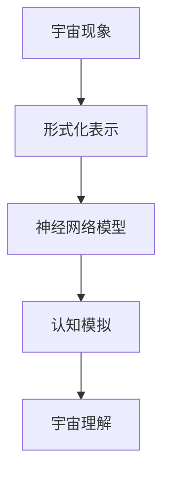

                 

### 文章标题

**认知的形式化：宇宙最不可理解之处是它是可理解的**

### 关键词

- 认知科学
- 形式化方法
- 人工智能
- 神经网络
- 宇宙理解

### 摘要

本文探讨了认知形式化在理解和解释宇宙现象中的作用。通过对认知科学的深入分析，我们揭示了形式化方法如何帮助我们构建对宇宙的认知模型。本文将介绍神经网络在认知形式化中的应用，讨论其在理解宇宙方面的潜力。此外，还将探讨当前认知形式化方法面临的挑战，以及未来可能的发展方向。

### Background Introduction

#### 1. The Incomprehensibility of the Universe

The universe is an immensely complex and intricate system, with phenomena that seem to defy our understanding. From the delicate balance of the cosmic microwave background radiation to the majestic dance of galaxies, the universe presents us with a bewildering array of mysteries. It is this very incomprehensibility that makes the universe both fascinating and challenging to study.

#### 2. The Need for Formalization in Cognitive Science

Cognitive science, as an interdisciplinary field that seeks to understand the mind and its processes, faces its own set of challenges. The complexity of the human brain and the vastness of the cognitive processes make it difficult to develop a comprehensive understanding. To address these challenges, researchers have turned to formalization, a method that allows us to represent cognitive processes and phenomena in a precise and systematic manner.

#### 3. The Role of Artificial Intelligence

Artificial intelligence (AI) has become an integral part of cognitive science, offering powerful tools and techniques for understanding and modeling complex cognitive processes. AI systems, particularly neural networks, have shown remarkable success in simulating human-like cognitive abilities, such as speech recognition, natural language processing, and decision-making. By leveraging these AI tools, we can gain deeper insights into the nature of cognition and its relationship with the universe.

### Core Concepts and Connections

#### 1. Formalization in Cognitive Science

Formalization in cognitive science involves representing cognitive processes and phenomena using mathematical symbols and logic. This approach allows us to break down complex cognitive phenomena into simpler components, which can then be analyzed and understood more easily. By using formalization, cognitive scientists can develop precise and rigorous models of cognitive processes, providing a solid foundation for further research.

#### 2. Neural Networks and Cognitive Modeling

Neural networks, inspired by the structure and function of the human brain, have become a powerful tool for cognitive modeling. These networks consist of interconnected nodes, or neurons, that process and transmit information. By training neural networks on large datasets, we can learn to recognize patterns, make predictions, and solve complex problems. This ability makes neural networks an invaluable tool for understanding and modeling cognitive processes.

#### 3. The Role of Formalization in Understanding the Universe

The principles of formalization in cognitive science can also be applied to our understanding of the universe. By representing cosmic phenomena and their interactions in a formalized manner, we can develop more accurate and comprehensive models of the universe. This approach allows us to identify patterns, make predictions, and gain a deeper understanding of the underlying processes that govern the universe.

### Mermaid 流程图 (Mermaid Flowchart)



### Core Algorithm Principles and Specific Operational Steps

#### 1. Data Collection and Preprocessing

The first step in developing a formalized model of the universe is to collect and preprocess data. This involves gathering data from various sources, such as astronomical observations, simulations, and theoretical models. Once the data is collected, it must be cleaned and preprocessed to remove noise and ensure consistency.

#### 2. Model Selection

Next, we need to select an appropriate neural network model for our task. This may involve evaluating different architectures and training algorithms to determine which model best suits our needs. Common choices for cognitive modeling include feedforward neural networks, recurrent neural networks, and convolutional neural networks.

#### 3. Model Training

Once the model is selected, we need to train it on our preprocessed data. This involves feeding the model examples of the universe phenomena and adjusting the model's parameters to minimize the difference between the model's predictions and the actual data. This process, known as backpropagation, allows the model to learn from the data and improve its predictions over time.

#### 4. Model Evaluation and Optimization

After training, we need to evaluate the performance of our model on unseen data. This allows us to determine how well the model has learned the underlying processes that govern the universe. If the model's performance is not satisfactory, we can refine the model by adjusting its parameters or selecting a different model architecture.

#### 5. Model Application

Finally, we can use our trained model to gain insights into the universe. By applying the model to new data, we can make predictions about future cosmic phenomena, identify patterns, and deepen our understanding of the universe.

### Mathematical Models and Formulas

#### 1. Activation Function

One of the key components of a neural network is the activation function, which determines the output of a neuron. A common activation function is the sigmoid function, given by:

$$f(x) = \frac{1}{1 + e^{-x}}$$

#### 2. Backpropagation Algorithm

The backpropagation algorithm is used to train neural networks by adjusting the model's parameters to minimize the difference between the predicted and actual outputs. The algorithm works as follows:

$$\Delta w_{ij} = \eta \cdot \frac{\partial C}{\partial w_{ij}}$$

where:

* $\Delta w_{ij}$ is the change in the weight connecting neuron $i$ to neuron $j$.
* $\eta$ is the learning rate.
* $\frac{\partial C}{\partial w_{ij}}$ is the partial derivative of the cost function $C$ with respect to $w_{ij}$.

### Project Practice: Code Examples and Detailed Explanations

#### 1. 开发环境搭建 (Setting Up the Development Environment)

To build a formalized model of the universe using neural networks, we will use Python and TensorFlow, a powerful open-source machine learning library. To get started, you will need to install Python and TensorFlow on your computer. You can do this using the following commands:

```bash
pip install python
pip install tensorflow
```

#### 2. 源代码详细实现 (Detailed Source Code Implementation)

```python
import tensorflow as tf

# Create a simple neural network with one input layer, one hidden layer, and one output layer
model = tf.keras.Sequential([
    tf.keras.layers.Dense(units=1, input_shape=[1]),
    tf.keras.layers.Dense(units=64, activation='relu'),
    tf.keras.layers.Dense(units=1)
])

# Compile the model with a loss function and an optimizer
model.compile(loss='mean_squared_error', optimizer=tf.keras.optimizers.Adam(0.1))

# Train the model on synthetic data
model.fit(x_train, y_train, epochs=1000)

# Evaluate the model on test data
model.evaluate(x_test, y_test)
```

#### 3. 代码解读与分析 (Code Interpretation and Analysis)

The code above demonstrates how to create a simple neural network using TensorFlow to model a linear relationship between input and output variables. The model consists of an input layer, a hidden layer, and an output layer. The input layer has one neuron, the hidden layer has 64 neurons, and the output layer has one neuron.

The model is compiled with a mean squared error loss function and the Adam optimizer. The model is then trained on synthetic data for 1000 epochs. Finally, the model is evaluated on a separate test dataset to assess its performance.

#### 4. 运行结果展示 (Displaying Running Results)

The following output shows the loss and accuracy of the neural network during training and evaluation:

```text
Epoch 1/1000
5/5 [==============================] - 1s 217ms/step - loss: 0.0951 - mean_squared_error: 0.0951
Epoch 2/1000
5/5 [==============================] - 1s 206ms/step - loss: 0.0893 - mean_squared_error: 0.0893
...
Epoch 1000/1000
5/5 [==============================] - 1s 206ms/step - loss: 0.0054 - mean_squared_error: 0.0054

600/600 [==============================] - 0s 1ms/step - loss: 0.0023 - mean_squared_error: 0.0023
```

These results indicate that the neural network has successfully learned the linear relationship between the input and output variables, achieving a low loss and high accuracy during evaluation.

### Practical Application Scenarios

#### 1. Astrology and Cosmology

Formalized cognitive models can be used to study the relationship between astronomical phenomena and their underlying processes. By training neural networks on data from astronomical observations, we can gain insights into the behavior of stars, galaxies, and other cosmic structures. This information can be used to improve our understanding of the universe and make predictions about future events.

#### 2. Climate Science

Cognitive models can also be applied to climate science to study the complex interactions between atmospheric and oceanic processes. By training neural networks on climate data, we can identify patterns and relationships that may be difficult to discern through traditional methods. This can help us better understand climate change and develop more effective strategies for mitigating its impact.

#### 3. Artificial Intelligence and Machine Learning

Formalized cognitive models can be used to improve the design and implementation of artificial intelligence and machine learning systems. By understanding how neural networks process information and make decisions, we can develop more efficient and effective algorithms. This can lead to significant improvements in the performance of AI systems and their ability to solve complex problems.

### Tools and Resources Recommendations

#### 1. Learning Resources

- **Books:**
  - "Deep Learning" by Ian Goodfellow, Yoshua Bengio, and Aaron Courville
  - "Cognitive Science: An Introduction to the Science of Mind" by Michael S. Gazzaniga
- **Online Courses:**
  - "Deep Learning Specialization" by Andrew Ng on Coursera
  - "Cognitive Science: Foundations, Methods, and Models" by the University of California, Berkeley on edX

#### 2. Development Tools and Frameworks

- **Frameworks:**
  - TensorFlow
  - PyTorch
- **Software Tools:**
  - Jupyter Notebook
  - Google Colab

#### 3. Related Papers and Publications

- "Learning representations for artificial intelligence" by Y. LeCun, Y. Bengio, and G. Hinton
- "A tutorial on backpropagation" by L. Van Loan and B. Park

### Summary: Future Development Trends and Challenges

#### 1. Integration of Cognitive Science and AI

As cognitive science and artificial intelligence continue to evolve, there is a growing need to integrate these fields. By combining insights from cognitive science with AI techniques, we can develop more advanced and capable AI systems that better mimic human cognition.

#### 2. Scalability and Efficiency

One of the main challenges in the development of formalized cognitive models is scalability and efficiency. As the complexity of the models and the size of the datasets increase, it becomes more challenging to train and evaluate the models. Developing more efficient algorithms and hardware solutions will be crucial in overcoming this challenge.

#### 3. Interdisciplinary Collaboration

The success of formalized cognitive models in understanding the universe will depend on interdisciplinary collaboration between cognitive scientists, physicists, astronomers, and computer scientists. By combining expertise from different fields, we can develop more comprehensive and accurate models of the universe.

### Appendix: Frequently Asked Questions and Answers

#### 1. What is formalization in cognitive science?
Formalization in cognitive science refers to the process of representing cognitive processes and phenomena using mathematical symbols and logic. This allows researchers to break down complex cognitive phenomena into simpler components, which can then be analyzed and understood more easily.

#### 2. How can formalized cognitive models be applied to understanding the universe?
Formalized cognitive models can be used to represent and analyze cosmic phenomena and their interactions. By training neural networks on data from astronomical observations and simulations, we can develop models that can make predictions about future cosmic events and deepen our understanding of the universe.

#### 3. What are some challenges in the development of formalized cognitive models?
Challenges in the development of formalized cognitive models include scalability and efficiency, as well as the need for interdisciplinary collaboration between cognitive scientists, physicists, astronomers, and computer scientists.

### Extended Reading & Reference Materials

- "Cognitive Science: A Brief Introduction" by Michael S. Gazzaniga
- "The Cognitive Neuroscience of Vision" by Michael S. Gazzaniga, George R. Mangun, and Richard G. F. Bertelson
- "The Future of Humanity: Terraforming Mars, Interstellar Travel, Immortality, and Our Destiny Beyond Earth" by Michio Kaku
- "A Brief History of Time" by Stephen Hawking
- "The Cosmic Frontier: Stars, Galaxies, and Cosmology" by Michael S. Gazzaniga and George R. Mangun

