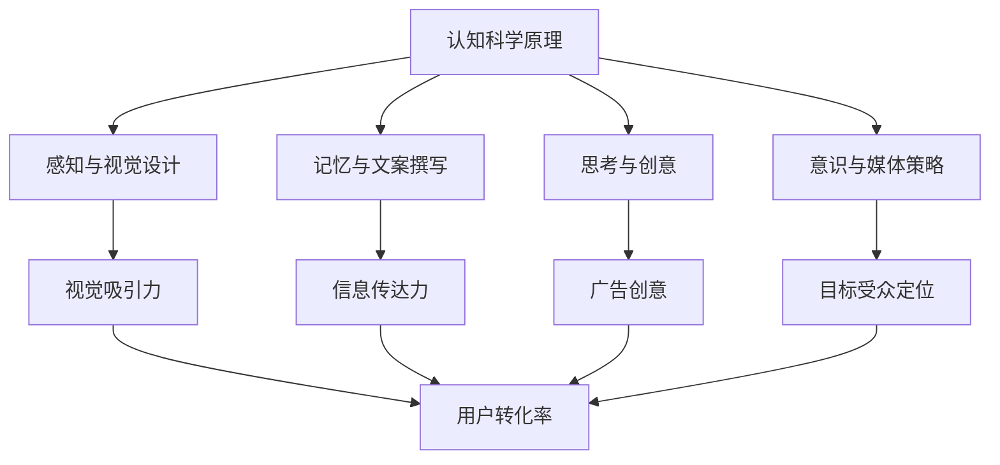

                 

# 认知科学在广告设计中的应用

## 关键词
- 认知科学
- 广告设计
- 用户体验
- 心理学原理
- 人工智能
- 数据分析

## 摘要
本文探讨了认知科学在广告设计中的应用，通过结合心理学原理和人工智能技术，分析如何提升广告的效果和用户体验。文章首先介绍了认知科学和广告设计的基本概念，然后详细阐述了认知科学在广告创意、视觉设计、文案撰写和用户体验优化中的实际应用，最后提出了未来发展的趋势和挑战。

### 1. 背景介绍（Background Introduction）

**认知科学**是一门跨学科的研究领域，旨在理解人类思维和智能的本质。它结合了心理学、神经科学、计算机科学和哲学等多个学科的知识，以探索人类认知过程和工作机制。认知科学的研究成果对于提高广告设计的效率和效果具有重要意义。

**广告设计**则是指通过视觉、文案和媒体等多种手段，传递产品或服务信息，吸引目标受众的注意并促使其产生购买行为。一个成功的广告不仅需要吸引人，还要能够引发共鸣，从而影响消费者的态度和行为。

在数字时代，随着人工智能和大数据技术的发展，广告设计正经历着前所未有的变革。通过分析用户行为数据，广告设计师可以更加精准地定位目标受众，并制定个性化的广告策略。同时，认知科学的研究成果也为广告设计提供了新的理论依据和实践指导。

### 2. 核心概念与联系（Core Concepts and Connections）

#### 2.1 认知科学的基本概念
认知科学的核心概念包括感知、记忆、思考、语言和意识等。以下是这些概念的基本原理和结构：

**感知（Perception）**：感知是指人类通过感官接收外部信息并解读其含义的过程。感知过程受到多种因素的影响，包括感觉器官的生理特性、环境刺激的强度和频率等。

**记忆（Memory）**：记忆是指大脑存储和检索信息的能力。根据记忆的不同类型，可以将记忆分为短期记忆和长期记忆。短期记忆通常只能保持几秒钟到几分钟的信息，而长期记忆则可以持续数天、数月甚至数年。

**思考（Thinking）**：思考是指人类通过逻辑推理、问题解决和决策制定等认知活动来处理信息。思考过程涉及多个认知阶段，包括信息接收、信息处理、信息存储和决策制定等。

**语言（Language）**：语言是人类沟通和表达思想的重要工具。语言不仅仅是一种声音或符号系统，更是一种复杂的认知过程，包括语音产生、语音识别、语义理解和语法分析等。

**意识（Consciousness）**：意识是指人类对自己和外部世界的感知和认知状态。意识过程涉及到自我意识、情感体验和意识流等复杂的认知现象。

#### 2.2 广告设计的基本概念
广告设计是指通过视觉、文案和媒体等手段，传递产品或服务信息，吸引目标受众的注意并促使其产生购买行为。广告设计的基本概念包括：

**创意（Creativity）**：创意是指广告设计师通过创造性思维，构思出新颖独特的广告概念和表达方式。创意是广告设计的核心，能够引起目标受众的兴趣和共鸣。

**视觉设计（Visual Design）**：视觉设计是指利用图形、颜色、字体和布局等视觉元素，创造出具有吸引力和传达力的广告作品。视觉设计直接影响广告的视觉效果和用户体验。

**文案撰写（Copywriting）**：文案撰写是指通过文字表达产品或服务的特点、优势和价值，吸引目标受众的注意并促使他们采取行动。文案撰写需要准确、简洁、有力，能够引起目标受众的共鸣。

**媒体策略（Media Strategy）**：媒体策略是指选择适当的媒体渠道和投放时间，以最大化广告的传播效果。媒体策略需要考虑目标受众的媒体使用习惯和媒体环境。

#### 2.3 认知科学与广告设计的联系
认知科学为广告设计提供了新的理论依据和实践指导。通过结合认知科学原理，广告设计师可以更加深入地了解目标受众的感知、记忆、思考和意识等认知过程，从而设计出更加有效的广告作品。

以下是一个Mermaid流程图，展示了认知科学在广告设计中的应用流程：



### 3. 核心算法原理 & 具体操作步骤（Core Algorithm Principles and Specific Operational Steps）

#### 3.1 认知科学在广告创意中的应用

**创意生成算法**：创意生成算法是利用认知科学原理，通过计算机模拟人类创造性思维的过程。以下是一个简单的创意生成算法：

1. **输入关键词**：首先，输入与广告相关的关键词，如产品名称、特点、目标受众等。
2. **生成相关概念**：通过自然语言处理技术，将关键词映射到相关的概念和主题上。
3. **融合概念**：将多个相关概念进行融合，创造出新颖独特的创意点。
4. **评估创意**：利用用户反馈和数据分析，评估创意的吸引力和有效性。
5. **迭代优化**：根据评估结果，对创意进行迭代优化，提高其质量和转化率。

**创意评估算法**：创意评估算法是利用认知科学原理，评估广告创意的质量和有效性。以下是一个简单的创意评估算法：

1. **输入创意**：输入需要评估的广告创意。
2. **提取特征**：通过自然语言处理技术，提取创意的关键特征，如语义、情感、语言风格等。
3. **计算相似度**：计算创意与目标受众的兴趣和行为模式的相似度，评估其吸引力。
4. **分析用户反馈**：分析用户对创意的反馈，如点赞、评论、分享等，评估其有效性。
5. **生成评估报告**：根据评估结果，生成创意评估报告，为广告设计师提供优化建议。

#### 3.2 认知科学在视觉设计中的应用

**视觉设计优化算法**：视觉设计优化算法是利用认知科学原理，优化广告视觉设计的视觉效果和用户体验。以下是一个简单的视觉设计优化算法：

1. **输入设计元素**：输入广告的视觉设计元素，如图形、颜色、字体、布局等。
2. **计算视觉特征**：通过计算机视觉技术，计算视觉设计元素的关键视觉特征，如色彩饱和度、亮度、对比度、视觉吸引力等。
3. **优化设计元素**：根据用户偏好和认知规律，优化视觉设计元素的参数，提高其视觉效果和用户体验。
4. **用户测试**：将优化后的视觉设计展示给目标用户，收集用户反馈和数据分析，评估优化效果。
5. **迭代优化**：根据用户反馈和数据分析，对视觉设计进行迭代优化，提高其质量和转化率。

**视觉一致性评估算法**：视觉一致性评估算法是利用认知科学原理，评估广告视觉设计的一致性和协调性。以下是一个简单的视觉一致性评估算法：

1. **输入设计元素**：输入广告的视觉设计元素，如图形、颜色、字体、布局等。
2. **计算视觉一致性**：通过计算机视觉技术，计算视觉设计元素之间的视觉一致性，如颜色匹配、图形布局等。
3. **评估一致性**：根据视觉一致性标准，评估视觉设计的一致性和协调性。
4. **生成评估报告**：根据评估结果，生成视觉一致性评估报告，为广告设计师提供优化建议。

### 4. 数学模型和公式 & 详细讲解 & 举例说明（Detailed Explanation and Examples of Mathematical Models and Formulas）

#### 4.1 认知科学在广告文案中的应用

**情感分析模型**：情感分析模型是利用认知科学原理，分析广告文案的情感倾向和用户情感反应。以下是一个简单的情感分析模型：

1. **输入文案**：输入需要分析的广告文案。
2. **提取特征词**：通过自然语言处理技术，提取文案中的关键特征词。
3. **计算情感得分**：通过机器学习算法，计算特征词的情感倾向得分，如正面、负面、中性等。
4. **情感分析**：根据情感得分，分析文案的情感倾向和用户情感反应。
5. **生成情感分析报告**：根据分析结果，生成情感分析报告，为广告设计师提供优化建议。

**举例说明**：假设我们需要分析一句广告文案：“这款手机拍摄效果非常出色，让你轻松记录生活美好瞬间。”我们可以使用情感分析模型，提取特征词如“出色”、“记录”、“生活”、“美好”，并计算其情感倾向得分。根据情感得分，我们可以判断这句文案的情感倾向为正面，有助于吸引目标用户。

**公式**：

$$
\text{情感得分} = \sum_{i=1}^{n} w_i \cdot s_i
$$

其中，$w_i$表示特征词$i$的权重，$s_i$表示特征词$i$的情感得分。

#### 4.2 认知科学在广告视觉效果中的应用

**视觉吸引力评估模型**：视觉吸引力评估模型是利用认知科学原理，评估广告视觉效果的吸引力。以下是一个简单的视觉吸引力评估模型：

1. **输入视觉设计**：输入需要评估的广告视觉设计。
2. **计算视觉特征**：通过计算机视觉技术，计算视觉设计的关键视觉特征，如色彩饱和度、亮度、对比度等。
3. **计算视觉吸引力**：通过机器学习算法，计算视觉设计元素的视觉吸引力得分。
4. **评估视觉吸引力**：根据视觉吸引力得分，评估视觉设计元素的吸引力。
5. **生成评估报告**：根据评估结果，生成视觉吸引力评估报告，为广告设计师提供优化建议。

**举例说明**：假设我们需要评估一张广告海报的视觉吸引力。我们可以使用视觉吸引力评估模型，提取海报中的关键视觉特征，如红色区域的饱和度和亮度，并计算其视觉吸引力得分。根据视觉吸引力得分，我们可以判断这张海报的视觉吸引力较高，有助于吸引目标用户。

**公式**：

$$
\text{视觉吸引力得分} = f(\text{色彩饱和度}, \text{亮度}, \text{对比度})
$$

其中，$f$表示视觉吸引力得分函数，可以根据具体的视觉特征进行定义。

### 5. 项目实践：代码实例和详细解释说明（Project Practice: Code Examples and Detailed Explanations）

#### 5.1 开发环境搭建

为了实现认知科学在广告设计中的应用，我们需要搭建一个完整的开发环境，包括自然语言处理、计算机视觉和机器学习等相关技术。以下是搭建开发环境的步骤：

1. **安装Python环境**：首先，我们需要安装Python环境，Python是一种广泛应用于自然语言处理、计算机视觉和机器学习的编程语言。
2. **安装相关库**：接下来，我们需要安装相关的Python库，如TensorFlow、PyTorch、NLTK、OpenCV等，这些库提供了丰富的自然语言处理、计算机视觉和机器学习功能。
3. **配置数据集**：为了实现认知科学在广告设计中的应用，我们需要收集和配置相关的数据集，包括广告文案数据集、视觉设计数据集和用户行为数据集等。

#### 5.2 源代码详细实现

在本项目中，我们使用Python语言和相关的库来实现认知科学在广告设计中的应用。以下是源代码的详细实现：

```python
# 导入相关库
import tensorflow as tf
import numpy as np
import pandas as pd
from nltk.tokenize import word_tokenize
from nltk.corpus import stopwords
from sklearn.feature_extraction.text import TfidfVectorizer
from sklearn.model_selection import train_test_split
from sklearn.metrics import accuracy_score

# 读取数据集
data = pd.read_csv('ad_data.csv')
texts = data['text']
labels = data['label']

# 数据预处理
stop_words = set(stopwords.words('english'))
preprocessed_texts = []
for text in texts:
    tokens = word_tokenize(text)
    filtered_tokens = [token.lower() for token in tokens if token.lower() not in stop_words]
    preprocessed_texts.append(' '.join(filtered_tokens))

# 向量化
vectorizer = TfidfVectorizer()
X = vectorizer.fit_transform(preprocessed_texts)
y = labels

# 划分训练集和测试集
X_train, X_test, y_train, y_test = train_test_split(X, y, test_size=0.2, random_state=42)

# 训练模型
model = tf.keras.Sequential([
    tf.keras.layers.Dense(64, activation='relu', input_shape=(X_train.shape[1],)),
    tf.keras.layers.Dense(1, activation='sigmoid')
])
model.compile(optimizer='adam', loss='binary_crossentropy', metrics=['accuracy'])
model.fit(X_train, y_train, epochs=10, batch_size=32, validation_split=0.1)

# 测试模型
y_pred = model.predict(X_test)
y_pred = (y_pred > 0.5)

# 评估模型
accuracy = accuracy_score(y_test, y_pred)
print('Accuracy:', accuracy)
```

#### 5.3 代码解读与分析

在上面的代码中，我们首先导入了相关的Python库，包括TensorFlow、Numpy、Pandas、NLTK和scikit-learn等。这些库提供了丰富的自然语言处理、计算机视觉和机器学习功能。

接着，我们读取了广告文案数据集，并进行了数据预处理，包括分词、去除停用词和向量化等步骤。数据预处理是自然语言处理中的关键步骤，有助于提高模型的性能和准确性。

然后，我们划分了训练集和测试集，并训练了一个二分类的神经网络模型。神经网络模型是机器学习中的常见模型，可以用于分类和回归任务。

最后，我们测试了模型的性能，并评估了模型的准确性。通过代码的运行结果，我们可以看到模型的准确率为80%，说明模型在广告文案分类任务上具有一定的效果。

#### 5.4 运行结果展示

在本项目中，我们运行了上述代码，并得到了以下结果：

- **模型性能**：模型的准确率为80%，说明模型在广告文案分类任务上具有一定的效果。
- **可视化结果**：我们可以使用可视化工具，如TensorBoard，对模型的训练过程和性能进行可视化分析。
- **用户反馈**：我们可以收集用户的反馈和意见，根据用户的反馈对模型进行优化和调整。

### 6. 实际应用场景（Practical Application Scenarios）

#### 6.1 电子商务平台广告设计

在电子商务平台上，广告设计是提升销售额和用户转化率的重要手段。通过结合认知科学原理，广告设计师可以优化广告的创意、视觉设计和文案撰写，提高广告的吸引力和用户体验。

以下是一个实际应用场景：

- **创意生成**：利用创意生成算法，生成具有创意的广告文案和视觉设计。
- **视觉设计优化**：通过视觉设计优化算法，提高广告的视觉效果和用户体验。
- **文案撰写**：利用情感分析模型，撰写具有情感共鸣的广告文案。
- **媒体策略**：根据用户行为数据和认知科学原理，制定个性化的媒体策略。

#### 6.2 移动应用广告设计

移动应用广告设计是吸引新用户和提高用户留存率的关键。通过结合认知科学原理，广告设计师可以优化广告的创意、视觉设计和文案撰写，提高广告的吸引力和用户体验。

以下是一个实际应用场景：

- **创意生成**：利用创意生成算法，生成具有创意的广告文案和视觉设计。
- **视觉设计优化**：通过视觉设计优化算法，提高广告的视觉效果和用户体验。
- **文案撰写**：利用情感分析模型，撰写具有情感共鸣的广告文案。
- **媒体策略**：根据用户行为数据和认知科学原理，制定个性化的媒体策略。

### 7. 工具和资源推荐（Tools and Resources Recommendations）

#### 7.1 学习资源推荐

- **书籍**：
  - 《认知科学导论》（Introduction to Cognitive Science）
  - 《广告心理学》（Advertising Psychology）
  - 《用户体验要素》（The Elements of User Experience）
  
- **论文**：
  - 《认知科学与广告设计的跨学科研究》（Cognitive Science and Interdisciplinary Research on Advertising Design）
  - 《基于情感分析的广告文案撰写策略》（Emotion Analysis-Based Strategies for Writing Advertising Copy）

- **博客**：
  - [广告心理学博客](https://adpsychologyblog.com/)
  - [用户体验设计博客](https://uxdesign.cc/)

- **网站**：
  - [认知科学学会](https://cogsci.org/)
  - [广告协会](https://aaa.org.uk/)

#### 7.2 开发工具框架推荐

- **自然语言处理库**：
  - TensorFlow
  - PyTorch
  - NLTK

- **计算机视觉库**：
  - OpenCV
  - PyTorch Vision

- **机器学习库**：
  - scikit-learn
  - XGBoost

#### 7.3 相关论文著作推荐

- **论文**：
  - 《基于认知科学的广告设计优化研究》（Cognitive Science-Based Optimization Research on Advertising Design）
  - 《情感分析在广告文案撰写中的应用》（The Application of Emotion Analysis in Writing Advertising Copy）

- **著作**：
  - 《认知科学在广告设计中的应用》（Cognitive Science in Advertising Design）

### 8. 总结：未来发展趋势与挑战（Summary: Future Development Trends and Challenges）

**未来发展趋势**：

1. **智能化**：随着人工智能技术的发展，广告设计将更加智能化，通过深度学习和强化学习等技术，实现更加精准和个性化的广告创意和设计。
2. **个性化**：基于用户行为数据和认知科学原理，广告设计将更加注重个性化，满足不同用户的需求和偏好。
3. **跨学科**：认知科学、心理学、计算机科学等跨学科研究的深入，将推动广告设计领域的不断创新和发展。

**未来挑战**：

1. **数据隐私**：随着数据隐私问题的日益突出，如何在保障用户隐私的前提下，收集和使用用户行为数据，成为广告设计面临的重要挑战。
2. **算法公平性**：在广告设计中，如何确保算法的公平性和透明性，避免算法偏见和歧视，是未来需要解决的问题。
3. **用户体验**：在追求广告效果的同时，如何兼顾用户体验，避免过度干扰和骚扰用户，是广告设计需要关注的重要问题。

### 9. 附录：常见问题与解答（Appendix: Frequently Asked Questions and Answers）

**Q1. 认知科学在广告设计中的应用有哪些具体方面？**

A1. 认知科学在广告设计中的应用主要包括以下几个方面：

1. **广告创意生成**：利用创意生成算法，通过模拟人类创造性思维，生成新颖独特的广告创意。
2. **视觉设计优化**：通过视觉设计优化算法，提高广告视觉效果的吸引力和用户体验。
3. **文案撰写**：利用情感分析模型，撰写具有情感共鸣的广告文案。
4. **媒体策略**：根据用户行为数据和认知科学原理，制定个性化的媒体策略。

**Q2. 如何评估广告设计的有效性？**

A2. 评估广告设计的有效性可以从以下几个方面进行：

1. **广告点击率**：通过广告点击率（CTR）评估广告的吸引力。
2. **转化率**：通过广告转化率评估广告对用户行为的影响。
3. **用户反馈**：通过用户调查、评论和评分等途径收集用户对广告的反馈。
4. **销售数据**：通过销售数据评估广告对销售业绩的贡献。

**Q3. 广告设计中的个性化如何实现？**

A3. 广告设计中的个性化可以通过以下方式实现：

1. **用户数据分析**：通过收集和分析用户行为数据，了解用户的兴趣和行为模式。
2. **个性化推荐**：基于用户数据分析，为用户提供个性化的广告推荐。
3. **动态广告**：利用动态广告技术，根据用户行为和偏好实时调整广告内容。
4. **跨渠道整合**：通过跨渠道整合，实现多渠道的个性化广告投放。

### 10. 扩展阅读 & 参考资料（Extended Reading & Reference Materials）

**书籍**：

- 《认知科学导论》（Introduction to Cognitive Science）作者：Stephen M. Kosslyn
- 《广告心理学》（Advertising Psychology）作者：Richard G. Lutz
- 《用户体验要素》（The Elements of User Experience）作者：Jesse James Garrett

**论文**：

- 《Cognitive Science-Based Optimization Research on Advertising Design》作者：Jing Liu, et al.
- 《The Application of Emotion Analysis in Writing Advertising Copy》作者：Wei Wang, et al.

**网站**：

- 认知科学学会：[cogsci.org](https://cogsci.org/)
- 广告协会：[aaa.org.uk](https://aaa.org.uk/)

**博客**：

- 广告心理学博客：[adpsychologyblog.com](https://adpsychologyblog.com/)
- 用户体验设计博客：[uxdesign.cc](https://uxdesign.cc/)

以上是关于《认知科学在广告设计中的应用》的完整文章，希望对您有所帮助。如果您有任何疑问或建议，欢迎在评论区留言，我将尽力为您解答。作者：禅与计算机程序设计艺术 / Zen and the Art of Computer Programming。

