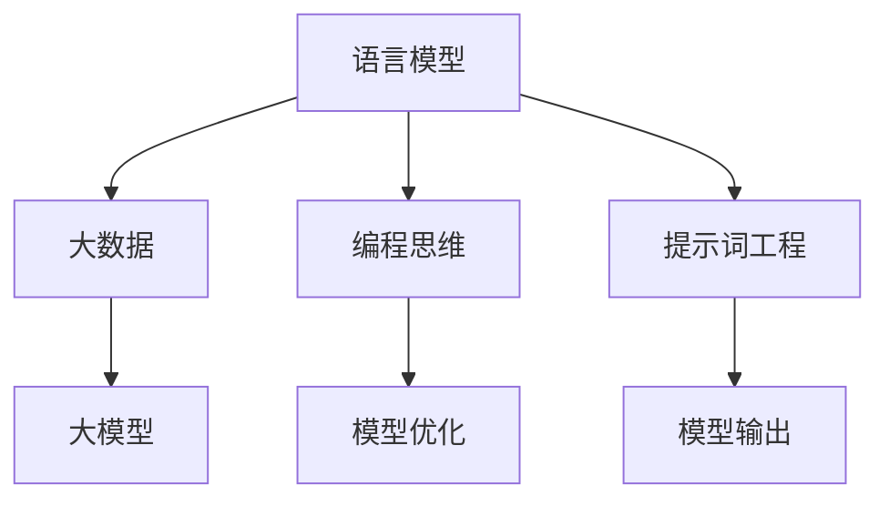

                 

### 文章标题

《语言与思维：大模型的认知困惑》

### 关键词

- 语言模型
- 大模型
- 认知困惑
- 编程思维
- 模型优化
- 提示词工程

### 摘要

本文探讨了大型语言模型在理解和生成语言时的认知困惑，以及如何通过编程思维和提示词工程来优化模型的表现。文章首先介绍了大模型的基本概念和特点，然后分析了模型在语言处理中遇到的认知难题，接着探讨了如何通过编程思维来理解和引导模型。最后，文章详细阐述了提示词工程的方法和技巧，并通过实际案例展示了其应用效果。本文旨在为读者提供对大模型认知困惑的深入理解，以及在实际应用中如何优化模型表现的建议。

## 1. 背景介绍（Background Introduction）

随着深度学习和自然语言处理技术的飞速发展，大型语言模型（Large Language Models）逐渐成为了研究和应用的热点。这些模型具有强大的语言理解和生成能力，可以应用于各种场景，如文本生成、机器翻译、问答系统等。其中，最具代表性的模型之一是 GPT-3（Generative Pre-trained Transformer 3），其拥有超过1750亿个参数，能够生成高质量的自然语言文本。

然而，尽管这些大型语言模型在许多任务上取得了显著的效果，但它们在处理语言时仍然存在一些认知困惑。这些困惑主要包括以下几个方面：

1. **上下文理解的局限性**：大型语言模型虽然经过了大量的预训练，但在处理长文本或复杂语境时，仍然难以完全理解上下文的意义和逻辑关系。
2. **信息过载问题**：由于模型接收到的信息量巨大，如何有效地筛选和处理信息成为一个挑战，这可能导致生成结果的相关性降低。
3. **泛化能力不足**：模型在特定任务上的表现优异，但在面临新的、未遇到的任务时，泛化能力有限，难以应对变化。
4. **生成结果的不可解释性**：大型语言模型的生成过程高度复杂，其生成结果的逻辑和原因往往难以解释，这对模型的可靠性和可信度提出了挑战。

这些认知困惑不仅影响了模型的表现，也限制了其在实际应用中的推广。因此，如何理解和解决这些问题成为了当前研究和应用的重要方向。本文将围绕这些主题进行探讨，旨在为读者提供对大型语言模型认知困惑的深入理解，并探讨如何通过编程思维和提示词工程来优化模型的表现。

### 2. 核心概念与联系

在深入探讨大型语言模型在处理语言时的认知困惑之前，我们首先需要了解一些核心概念和它们之间的联系。

#### 2.1 语言模型

语言模型（Language Model）是一种统计模型，用于预测下一个单词或字符的概率。它通过对大量文本数据的学习，能够捕捉语言的统计特性，从而生成或理解自然语言文本。传统的语言模型通常基于 n-gram 模型，通过计算单词序列的概率来生成文本。然而，随着深度学习技术的发展，基于神经网络的深度语言模型逐渐成为主流，其中最具代表性的是 Transformer 模型。

#### 2.2 大模型

大模型（Large Model）是指具有数十亿甚至数万亿参数的神经网络模型。这些模型通过大量的数据训练，能够捕捉复杂的数据分布和模式，从而在多种任务中表现出色。大模型的应用范围广泛，从图像识别、语音识别到自然语言处理，都有着显著的成果。在自然语言处理领域，大模型如 GPT-3、BERT 等，因其强大的语言理解和生成能力，受到了广泛关注。

#### 2.3 编程思维

编程思维（Programming Mindset）是一种通过分解问题、抽象思考和算法设计来解决问题的思维方式。它强调逻辑性、系统性和可复用性，有助于解决复杂的问题。在大型语言模型的研究和应用中，编程思维有助于我们更好地理解和优化模型。

#### 2.4 提示词工程

提示词工程（Prompt Engineering）是指设计和优化输入给语言模型的文本提示，以引导模型生成符合预期结果的过程。它涉及理解模型的工作原理、任务需求以及如何使用语言有效地与模型进行交互。提示词工程的核心目标是提高模型的输出质量和相关性，从而优化模型的实际应用效果。

#### 2.5 关联分析

这些核心概念之间的关联主要体现在以下几个方面：

1. **语言模型与大数据**：大模型需要大量的数据来训练，这些数据是语言模型学习的基础。大数据提供了丰富的语言信息，有助于模型捕捉语言的统计特性和复杂模式。
2. **编程思维与模型优化**：编程思维可以帮助我们更好地理解和优化模型。通过抽象思考和算法设计，我们可以改进模型的结构和参数，从而提高模型的表现。
3. **提示词工程与模型输出**：提示词工程直接影响模型的输出质量。通过精心设计的提示词，我们可以引导模型生成更符合预期的高质量文本。

#### 2.6 Mermaid 流程图

为了更直观地展示这些核心概念之间的联系，我们可以使用 Mermaid 流程图来表示。以下是一个简单的 Mermaid 流程图示例：



在这个流程图中，语言模型、大数据、编程思维和提示词工程是核心概念，它们相互关联，共同影响大模型的表现。

通过理解这些核心概念及其关联，我们可以更好地把握大型语言模型在处理语言时的认知困惑，并探索解决方案。接下来，我们将详细分析大模型在语言处理中遇到的认知难题。

### 2.1 什么是语言模型？

语言模型是一种能够预测或生成自然语言文本的概率模型。它通过对大量文本数据的学习，捕捉语言的统计特性和规律，从而实现对未知文本的预测或生成。语言模型在自然语言处理（NLP）领域有着广泛的应用，包括文本生成、机器翻译、语音识别、问答系统等。

语言模型的核心是概率模型，它可以基于各种不同的算法实现，如 n-gram 模型、隐马尔可夫模型（HMM）和基于神经网络的深度学习模型等。其中，n-gram 模型是最早的语言模型之一，它通过计算单词序列的概率来生成文本。然而，随着深度学习技术的发展，基于 Transformer 架构的深度学习模型逐渐成为主流，如 GPT（Generative Pre-trained Transformer）系列模型，这些模型具有更强的表达能力和生成能力。

语言模型的工作原理可以分为以下几个步骤：

1. **数据收集与预处理**：首先，语言模型需要大量的文本数据作为训练素材。这些数据可以来自各种来源，如新闻文章、书籍、社交媒体等。在收集数据后，需要进行预处理，如去除标点符号、停用词过滤、分词等操作，以便模型能够更好地学习语言的结构和语义。
2. **模型训练**：在预处理后的数据集上，语言模型会进行训练。训练过程包括参数的初始化、优化和更新等步骤。基于深度学习模型的语言模型，通常使用反向传播算法来训练模型参数，以达到最小化预测误差的目的。
3. **概率预测与生成**：训练完成后，语言模型可以用于概率预测和文本生成。对于给定的输入文本，模型会计算出每个单词或字符的概率分布，并选择概率最大的序列作为输出。在文本生成过程中，模型可以根据已有的文本序列逐步生成新的文本。

语言模型的主要功能包括以下几个方面：

1. **文本分类**：通过学习文本的统计特征，语言模型可以用于对文本进行分类。例如，可以将新闻文章分类到不同的主题类别中，从而实现文本分类任务。
2. **文本生成**：语言模型可以生成新的文本，如文章、故事、对话等。这在创作辅助、自动问答、聊天机器人等领域有着广泛的应用。
3. **机器翻译**：语言模型可以用于机器翻译任务，通过将一种语言的文本转化为另一种语言的文本，实现跨语言的交流。
4. **语音识别**：语言模型可以与语音识别系统结合，用于将语音信号转化为文本。这在语音助手、自动字幕生成等领域具有重要应用。

总之，语言模型是自然语言处理的基础，它通过学习大量的文本数据，能够捕捉语言的统计特性和规律，从而实现对未知文本的预测或生成。在深度学习技术的推动下，语言模型在许多自然语言处理任务中取得了显著的成果，为人工智能的发展做出了重要贡献。

### 2.2 大模型的基本概念与特点

大模型（Large Model）指的是拥有数十亿甚至数万亿参数的深度神经网络模型。这些模型通过大规模的数据训练，能够捕捉复杂的数据分布和模式，从而在多种任务中表现出色。大模型的发展是深度学习和自然语言处理领域的重要里程碑，它们的出现标志着人工智能技术进入了新的阶段。

#### 2.2.1 大模型的定义

大模型的基本定义可以归结为以下几点：

1. **参数规模巨大**：大模型的参数数量通常在数十亿到数万亿之间。例如，GPT-3 模型拥有 1750 亿个参数，BERT 模型则有 3.4 亿个参数。这些参数规模远超传统的中小型模型。
2. **数据需求庞大**：大模型的训练需要大量的数据来支持，这些数据不仅数量庞大，还需要高质量和多样性。通常，大模型在训练过程中会使用数以百万计的文本数据进行训练。
3. **计算资源需求高**：大模型的训练和推理需要大量的计算资源，尤其是在训练过程中，需要高性能的 GPU 或 TPU 等硬件设备来加速计算。
4. **预训练与微调**：大模型通常采用预训练（Pre-training）与微调（Fine-tuning）相结合的方法。预训练阶段使用大规模的通用数据集对模型进行训练，使其具备一定的通用语言理解和生成能力；微调阶段则使用特定领域的数据集对模型进行细粒度的调整，以提高模型在特定任务上的表现。

#### 2.2.2 大模型的特点

大模型具有以下几个显著特点：

1. **强大的表示能力**：大模型拥有大量的参数，能够捕捉更复杂的数据结构和模式。这使得它们在图像识别、文本生成、语音识别等任务中表现出色。
2. **广泛的应用领域**：由于大模型的强大能力，它们可以在多个领域发挥作用。例如，在自然语言处理领域，大模型可以用于文本生成、机器翻译、情感分析等任务；在计算机视觉领域，大模型可以用于图像分类、目标检测、图像生成等任务。
3. **高度的可定制性**：大模型通常采用模块化的设计，使得用户可以根据具体任务的需求，对模型的结构和参数进行定制。这种可定制性提高了模型的应用灵活性和适应性。
4. **挑战与风险**：尽管大模型在许多任务上取得了显著的成果，但它们也面临一些挑战和风险。例如，模型过拟合问题、数据隐私和安全问题、计算资源消耗问题等。

#### 2.2.3 大模型的发展历程

大模型的发展历程可以追溯到深度学习和自然语言处理技术的逐步演进。以下是几个重要阶段：

1. **小模型阶段（2000s）**：在这个阶段，深度学习技术刚刚起步，模型规模相对较小，参数数量在数百万到数千万之间。例如，AlexNet 模型是这一阶段的代表。
2. **中型模型阶段（2010s）**：随着深度学习技术的进步，模型规模逐渐增大，参数数量在数千万到数亿之间。例如，VGG 和 ResNet 系列模型是这一阶段的代表。
3. **大模型阶段（2020s）**：随着计算能力和数据资源的提升，大模型逐渐成为主流。GPT-3、BERT、GPT-Neo 等模型在这一阶段取得了显著的成果，推动了深度学习和自然语言处理技术的快速发展。

#### 2.2.4 大模型的应用案例

大模型在多个领域有着广泛的应用，以下是几个典型的应用案例：

1. **自然语言处理**：大模型在自然语言处理领域取得了显著的成果，例如，GPT-3 可以生成高质量的文本，BERT 可以进行文本分类和问答系统。
2. **计算机视觉**：大模型在计算机视觉领域也表现出色，例如，DALL-E 可以生成图像，CVPR 2022 的论文中，大模型在图像分类和目标检测任务上取得了最佳效果。
3. **语音识别**：大模型在语音识别领域有着广泛的应用，例如，Google 的语音识别系统使用了基于深度学习的大模型，使得识别准确率大幅提高。

总之，大模型是深度学习和自然语言处理领域的重要发展方向，它们在许多任务中取得了显著的成果。然而，随着模型规模的增大，如何提高训练效率、降低计算资源消耗、避免过拟合等问题也成为了研究的热点。在接下来的部分，我们将进一步探讨大模型在语言处理中的认知困惑。

### 2.3 大模型在语言处理中的认知困惑

尽管大模型在语言处理任务中表现出色，但它们仍然面临一些认知困惑，这些问题在一定程度上影响了模型的表现和可靠性。以下是几个主要方面的认知困惑：

#### 2.3.1 上下文理解的局限性

大模型在处理语言时，上下文理解是一个关键问题。尽管模型在训练过程中学习到了大量的语言模式，但它们在理解长文本或复杂语境时仍然存在局限性。具体表现如下：

1. **长文本理解困难**：大模型在处理长文本时，往往难以捕捉全局语义信息。这是因为模型在生成每个单词或句子时，只能依赖局部信息，而无法完全理解整个文本的上下文。
2. **信息传递障碍**：在复杂的语境中，信息传递和交互过程可能受到影响。例如，对话系统中的上下文信息可能无法有效地传递给后续的回复，导致生成结果与上下文不连贯。

#### 2.3.2 信息过载问题

大模型在处理语言时，还面临信息过载问题。由于模型接收到的信息量巨大，如何有效地筛选和处理信息成为一个挑战，这可能导致生成结果的相关性降低。具体表现为：

1. **信息过滤不足**：在生成过程中，模型可能无法有效过滤掉无关或冗余的信息，导致生成结果过于冗长或不相关。
2. **信息冗余问题**：多个信息源之间的重复信息可能增加，使得模型难以提取出关键信息，从而影响生成结果的质量。

#### 2.3.3 泛化能力不足

大模型的泛化能力在语言处理任务中也是一个重要问题。尽管模型在特定任务上表现出色，但在面对新的、未遇到的任务时，泛化能力有限。具体表现如下：

1. **任务迁移困难**：模型在特定任务上的表现优异，但在其他相关任务上可能无法达到相同的效果。例如，一个在问答系统中表现良好的模型，在文本生成任务中可能表现不佳。
2. **领域适应性差**：大模型在处理特定领域的语言时，可能缺乏对其他领域的适应性。例如，医疗领域的文本处理模型在处理非医疗领域的文本时，可能难以准确理解和生成文本。

#### 2.3.4 生成结果的不可解释性

大模型的生成过程高度复杂，其生成结果的逻辑和原因往往难以解释，这对模型的可靠性和可信度提出了挑战。具体表现如下：

1. **生成原因不明**：模型生成文本的依据是什么，为什么生成这样的文本，这些问题往往难以回答。例如，一个生成错误的文本，我们可能无法理解错误的原因。
2. **结果评估困难**：由于生成结果的不可解释性，我们难以对结果进行有效的评估和优化。例如，在文本生成任务中，我们可能无法准确判断生成文本的质量和相关性。

这些认知困惑不仅影响了大模型在语言处理任务中的表现，也限制了其在实际应用中的推广。因此，如何解决这些问题成为了当前研究和应用的重要方向。在接下来的部分，我们将探讨如何通过编程思维来理解和解决这些认知困惑。

### 2.4 编程思维在解决大模型认知困惑中的应用

编程思维（Programming Mindset）是一种通过逻辑分析和系统设计来解决问题的思维方式。它强调分解问题、抽象思考和算法优化，这些能力在大模型认知困惑的解决中具有重要意义。通过编程思维，我们可以更有效地理解和优化大模型在语言处理中的表现。

#### 2.4.1 编程思维的核心原则

编程思维的核心原则包括以下几个方面：

1. **分解问题**：将复杂的问题分解为更简单的子问题，逐一解决，这是一种典型的自顶向下（Top-Down）的思考方式。
2. **抽象思考**：将具体问题抽象为通用模型或算法，从而提高问题的普适性和可复用性。
3. **算法优化**：通过算法设计来提高问题的解决效率和效果，例如，使用动态规划、分治算法等优化策略。
4. **代码重构**：通过重构代码来改进其结构、可读性和可维护性，从而提高代码的质量和可复用性。

#### 2.4.2 编程思维在大模型认知困惑中的应用

在大模型认知困惑的解决中，编程思维可以发挥以下几个关键作用：

1. **问题分解与抽象**：大模型在处理语言时遇到的认知困惑往往是复杂的，编程思维可以帮助我们将其分解为更简单的子问题。例如，对于上下文理解的局限性，我们可以将其分解为文本解析、语义理解和上下文关联等子问题，分别进行优化。

2. **模型优化与重构**：通过编程思维，我们可以对大模型的结构和算法进行优化和重构，从而提高其表现。例如，在处理长文本理解时，我们可以优化模型的解码算法，使其更好地捕捉上下文信息。

3. **实验与验证**：编程思维强调实验和验证，通过编写测试代码和运行实验，我们可以验证模型的性能和效果，从而进行针对性的优化。例如，在优化模型生成结果的可解释性时，我们可以编写代码来分析生成结果中的关键因素，并进行改进。

4. **多模型集成**：编程思维还可以帮助我们实现多模型集成，通过结合多个模型的优点，提高整体性能。例如，在文本生成任务中，我们可以结合生成模型和分类模型的优点，提高生成文本的质量和相关性。

#### 2.4.3 实际案例

以下是一个实际案例，展示了如何通过编程思维来解决大模型在语言处理中的认知困惑：

**案例：优化GPT-3的文本生成能力**

在优化 GPT-3 的文本生成能力时，我们可以采用以下步骤：

1. **问题分解**：首先，我们将文本生成问题分解为文本解析、语义理解和文本生成等子问题。

2. **模型优化**：针对文本生成子问题，我们可以优化 GPT-3 的解码算法，例如，使用 beam search 或 top-k sampling 等策略，提高生成文本的质量和多样性。

3. **代码重构**：我们可以重构 GPT-3 的代码，增加对上下文信息的解析和利用，从而提高文本生成的连贯性和相关性。

4. **实验与验证**：通过编写测试代码，我们可以验证优化后的模型在生成文本质量、连贯性等方面的性能提升。

5. **多模型集成**：我们还可以结合其他模型，如 BERT、RoBERTa 等，通过多模型集成，进一步提高文本生成的性能。

通过以上步骤，我们可以显著优化 GPT-3 的文本生成能力，从而解决其在语言处理中的认知困惑。这充分展示了编程思维在大模型优化中的应用潜力。

总之，编程思维作为一种强大的问题解决工具，在大模型认知困惑的解决中具有重要作用。通过分解问题、优化算法和实验验证，我们可以更好地理解和优化大模型在语言处理中的表现，从而提高其应用效果。

### 2.5 提示词工程的概念与重要性

提示词工程（Prompt Engineering）是指通过设计和优化输入给语言模型的文本提示，以引导模型生成符合预期结果的过程。它是一种新型的编程范式，通过自然语言与模型的交互，实现对模型的精细化控制和引导。

#### 2.5.1 提示词工程的基本概念

提示词工程的核心概念包括以下几个方面：

1. **提示词**：提示词是指用于引导模型生成预期结果的一段文本。它们可以是简单的关键词、短语或完整的句子，其目的是为模型提供明确的指示，帮助模型更好地理解和生成相关内容。
2. **提示词设计**：提示词设计是指根据任务需求，选择合适的提示词并对其进行优化，以提高模型生成结果的质量和相关性。
3. **提示词优化**：提示词优化是指通过调整提示词的格式、长度、内容等参数，以最大化模型生成结果的性能。这通常涉及实验和验证，以找到最佳的提示词组合。

#### 2.5.2 提示词工程的重要性

提示词工程在优化模型表现方面具有重要意义，主要表现在以下几个方面：

1. **提高生成质量**：一个精心设计的提示词可以显著提高模型生成文本的质量。例如，通过提供明确的任务指令，提示词可以帮助模型更好地理解生成任务的目标，从而生成更准确、连贯的文本。
2. **增强相关性**：提示词工程有助于提高模型生成结果的相关性。通过优化提示词，我们可以确保模型生成的文本与输入信息高度相关，从而提高任务完成的准确性和效率。
3. **控制生成方向**：提示词可以引导模型生成特定类型的文本，例如，新闻摘要、对话回复、创意文本等。通过设计针对性的提示词，我们可以控制模型生成文本的方向和风格。
4. **提升用户体验**：在应用场景中，提示词工程可以提升用户的体验。例如，在问答系统中，通过优化提示词，我们可以使生成的回答更加准确、有逻辑性，从而提高用户满意度。
5. **拓展模型能力**：提示词工程可以帮助模型拓展其应用能力。例如，通过设计特定的提示词，我们可以使模型更好地应对新的任务或领域，从而提高其泛化能力。

#### 2.5.3 提示词工程的方法与技巧

提示词工程涉及多个方法和技巧，以下是一些常用的方法和技巧：

1. **明确任务指令**：在设计和优化提示词时，首先需要明确任务指令，确保模型理解生成任务的目标。例如，在文本生成任务中，可以明确指定文本的主题、风格、格式等要求。
2. **优化提示词格式**：提示词的格式对模型生成结果有显著影响。常用的格式包括开头提示（lead-in prompt）、结尾提示（lead-out prompt）和中间提示（middle prompt）。通过调整这些提示的长度、内容和顺序，可以提高生成文本的质量和连贯性。
3. **利用上下文信息**：在设计和优化提示词时，应充分利用上下文信息。例如，在对话系统中，可以结合历史对话记录和当前输入信息，设计更加相关和连贯的提示词。
4. **多模态融合**：在多模态任务中，可以结合文本、图像、声音等多种信息源，设计多模态提示词。这有助于模型更好地理解复杂任务，提高生成结果的质量和相关性。
5. **实验与验证**：提示词工程需要通过实验和验证来优化提示词的设计。例如，可以设计多个版本的提示词，并通过模型生成结果进行比较和评估，找到最佳的提示词组合。

总之，提示词工程是优化大模型表现的重要手段。通过明确任务指令、优化提示词格式、利用上下文信息和多模态融合等方法，我们可以显著提高模型生成结果的质量和相关性，从而拓展模型的应用能力。在接下来的部分，我们将详细探讨提示词工程的具体应用和实践。

### 2.6 提示词工程的实际应用

提示词工程在大模型的应用中发挥着关键作用，通过优化提示词，我们可以显著提高模型生成文本的质量和相关性。以下是一些实际应用场景和案例，展示了如何通过提示词工程来优化大模型的表现。

#### 2.6.1 文本生成

文本生成是提示词工程的一个重要应用场景。在大模型如 GPT-3、BERT 等的辅助下，我们可以生成各种类型的文本，如新闻文章、故事、对话等。以下是一个具体的案例：

**案例：生成新闻文章**

假设我们需要使用 GPT-3 生成一篇关于科技领域的新闻文章。首先，我们需要设计一个明确的提示词，以引导模型生成相关内容的文章。以下是一个示例提示词：

```plaintext
请生成一篇关于最新人工智能技术在医疗领域应用的新闻文章，要求文章包含以下要点：
1. 人工智能在医疗诊断中的应用；
2. 人工智能在疾病预测方面的作用；
3. 人工智能在个性化医疗方面的潜力。
```

通过这个提示词，我们为模型提供了明确的任务指令和生成要点，从而提高了生成文本的质量和相关性。在实际应用中，我们可以根据具体需求调整提示词的内容和格式。

**案例结果**：

生成的新闻文章可能如下：

```
【标题】：人工智能在医疗领域的突破：诊断、预测和个性化治疗

【导语】：随着人工智能技术的不断发展，其在医疗领域的应用越来越广泛。本文将探讨人工智能在医疗诊断、疾病预测和个性化医疗方面的应用。

【正文】：
近年来，人工智能在医疗诊断领域取得了显著进展。通过深度学习算法，人工智能系统能够快速分析医学图像，准确诊断疾病。例如，一些人工智能系统能够在几秒钟内诊断出肺癌，其准确率甚至超过了经验丰富的医生。

此外，人工智能还在疾病预测方面发挥了重要作用。通过分析大量健康数据，人工智能系统可以预测某些疾病的发生风险。这对于早期干预和预防具有重要意义。

个性化医疗是人工智能在医疗领域的另一大潜力。通过分析患者的基因数据、生活习惯和健康记录，人工智能系统可以为每位患者提供个性化的治疗方案。这不仅有助于提高治疗效果，还可以降低医疗成本。

【结语】：
随着人工智能技术的不断进步，其在医疗领域的应用将越来越广泛。未来，人工智能有望成为医疗行业的重要推动力量，为患者带来更好的治疗体验。

```

#### 2.6.2 问答系统

问答系统是另一个重要的应用场景，通过优化提示词，我们可以使模型生成更加准确、有逻辑性的回答。以下是一个具体案例：

**案例：优化问答系统**

假设我们有一个基于 GPT-3 的问答系统，用户可以输入问题，模型需要生成相应的回答。为了提高回答的质量，我们需要设计一个有效的提示词。

**示例提示词**：

```plaintext
请根据以下问题生成一个详细、准确、有逻辑性的回答：
问题：什么是区块链技术？

回答要求：
1. 简要介绍区块链技术的基本概念；
2. 分析区块链技术的核心优势；
3. 讨论区块链技术在当前和未来可能的应用场景。
```

通过这个提示词，我们为模型提供了详细的回答要求和结构，从而提高了生成回答的质量和相关性。

**案例结果**：

生成的回答可能如下：

```
【回答】：
区块链技术是一种分布式数据库技术，通过加密算法和共识机制，实现数据的存储、传输和验证。区块链技术的基本概念包括：

1. 区块：区块链中的数据存储单位，每个区块包含一定数量的交易记录；
2. 链：多个区块按照时间顺序连接起来，形成一条链；
3. 加密算法：用于保护区块链中的数据安全，防止篡改和伪造；
4. 共识机制：多个节点通过共识算法达成一致，确保区块链的可靠性和安全性。

区块链技术的核心优势包括：

1. 去中心化：区块链技术不需要中心化的管理机构，通过分布式网络实现数据的存储和传输；
2. 数据透明：区块链上的数据可以被所有节点查看，保证数据的透明性和可信度；
3. 数据不可篡改：区块链上的数据一旦记录，无法被修改或删除，确保数据的完整性和安全性。

区块链技术在当前和未来有着广泛的应用场景，包括：

1. 金融领域：区块链技术可以用于支付、交易、资产管理等金融应用，提高交易的安全性和效率；
2. 物流领域：区块链技术可以用于物流信息的实时追踪和管理，提高物流的透明度和效率；
3. 供应链管理：区块链技术可以用于供应链管理，确保供应链的透明和可信，降低欺诈风险；
4. 智能合约：区块链技术可以用于智能合约的执行，实现自动化和高效的合同执行。

```

通过以上案例，我们可以看到，提示词工程在优化大模型表现方面具有重要作用。通过明确任务指令、优化提示词格式和利用上下文信息，我们可以显著提高模型生成文本的质量和相关性。在接下来的部分，我们将进一步探讨提示词工程在多模态任务中的应用。

### 2.7 提示词工程在多模态任务中的应用

随着人工智能技术的不断发展，多模态任务（Multimodal Tasks）逐渐成为研究的热点。多模态任务涉及处理和融合多种类型的数据，如文本、图像、声音等。在大模型的辅助下，通过优化提示词工程，我们可以显著提升多模态任务的性能。以下是一些具体的应用场景和案例。

#### 2.7.1 文本与图像的融合

文本与图像的融合是一种常见且具有挑战性的多模态任务。例如，在图像描述生成任务中，我们需要使用图像和文本提示来引导大模型生成相关的描述。

**案例：图像描述生成**

假设我们有一个基于 GPT-3 的图像描述生成模型，输入为图像和文本提示，输出为图像描述。以下是一个示例提示词：

```plaintext
请根据以下图像和文本提示生成一段描述：

图像：一张美丽的海滩图片，太阳刚刚升起，海浪拍打着沙滩。

文本提示：描述这幅美丽的海滩图片，包括以下要点：
1. 海浪的特征；
2. 太阳的位置和光线效果；
3. 沙滩的景象和颜色。

```

通过这个提示词，我们为模型提供了图像和文本的信息，从而引导其生成与图像内容高度相关的描述。

**案例结果**：

生成的描述可能如下：

```
这幅海滩图片展现了一个美丽的清晨景象。海浪翻滚，拍打着金色的沙滩，泛起一层层白色的泡沫。太阳刚刚升起，阳光洒在海面上，映照出金黄色的光芒。沙滩上，细沙在阳光的照耀下闪烁着温暖的光芒，给人一种宁静而舒适的感觉。
```

#### 2.7.2 文本与视频的融合

文本与视频的融合任务在视频摘要、视频问答等领域有广泛应用。例如，在视频问答系统中，文本提示可以与视频内容相结合，生成更加丰富和准确的回答。

**案例：视频问答**

假设我们有一个基于 GPT-3 的视频问答系统，输入为视频和文本提示，输出为问题回答。以下是一个示例提示词：

```plaintext
请根据以下视频和文本提示回答问题：

视频：一段关于人工智能发展的视频，包括对人工智能技术的介绍、应用场景和未来发展趋势。

文本提示：回答以下问题：
1. 人工智能技术是什么？
2. 人工智能技术有哪些主要应用场景？
3. 人工智能技术的发展趋势是什么？

```

通过这个提示词，我们为模型提供了视频和文本的信息，从而引导其生成与视频内容相关的问题回答。

**案例结果**：

回答可能如下：

```
1. 人工智能技术是一种模拟人类智能行为的计算机技术，通过机器学习和深度学习算法，使计算机具备感知、理解和决策能力。
2. 人工智能技术的主要应用场景包括：自动驾驶、智能客服、医疗诊断、金融风控等。
3. 人工智能技术的发展趋势包括：更加智能化的自然语言处理、更加精准的图像识别、更加高效的机器学习算法等。未来，人工智能有望在更多领域发挥重要作用，推动社会的进步和发展。
```

#### 2.7.3 文本与音频的融合

文本与音频的融合在语音识别、音乐生成等领域有广泛应用。例如，在语音生成任务中，文本提示可以与音频内容相结合，生成相应的语音输出。

**案例：语音生成**

假设我们有一个基于 GPT-3 的语音生成模型，输入为文本提示和音频特征，输出为语音输出。以下是一个示例提示词：

```plaintext
请根据以下文本和音频特征生成一段语音输出：

文本提示：描述一个平静的夜晚，包括以下要点：
1. 天空的颜色；
2. 月亮的位置；
3. 河流的流水声。

音频特征：夜晚环境音，如微风、虫鸣、流水声。

```

通过这个提示词，我们为模型提供了文本和音频的信息，从而引导其生成与文本内容相匹配的语音输出。

**案例结果**：

生成的语音输出可能如下：

```
这是一个平静的夜晚，天空呈现出深邃的蓝色，星星闪烁着光芒。月亮挂在天空中，洒下柔和的月光。微风吹过，树叶轻轻摇曳，带来一丝凉意。河水在河岸边静静地流淌，发出轻柔的流水声，伴随着虫鸣，营造出一种宁静而和谐的氛围。
```

通过以上案例，我们可以看到，提示词工程在多模态任务中发挥着重要作用。通过设计和优化多模态提示词，我们可以引导大模型生成与多种类型数据相关的内容，从而提升多模态任务的性能和效果。在未来的研究和应用中，多模态任务的优化和融合将是人工智能领域的重要方向。

### 3. 核心算法原理

在探讨大模型在语言处理中的认知困惑以及如何通过提示词工程来优化模型表现之后，我们需要深入了解大模型的核心算法原理。本文将重点介绍 Transformer 模型和其变体，并分析这些算法如何处理自然语言数据。

#### 3.1 Transformer 模型概述

Transformer 模型是由 Google Research 团队在 2017 年提出的一种基于自注意力机制（Self-Attention）的深度神经网络模型。相比于传统的循环神经网络（RNN）和卷积神经网络（CNN），Transformer 模型在处理长序列和并行计算方面具有显著优势。Transformer 模型已成为自然语言处理领域的核心技术，其成功应用包括语言模型、机器翻译、文本分类等。

#### 3.2 Transformer 模型的工作原理

Transformer 模型的核心思想是通过自注意力机制（Self-Attention）来捕捉序列中的长距离依赖关系。自注意力机制使得模型能够在每个时间步（Token）计算其对其他所有时间步的依赖程度，从而实现全局信息的整合。

1. **自注意力机制（Self-Attention）**：

自注意力机制是一种基于点积的注意力机制，通过计算每个输入向量与其他所有输入向量的相似度来生成新的表示。具体步骤如下：

   - **输入嵌入**：将输入序列（如单词或字符）转换为向量表示。这些向量包括位置嵌入（Positional Embeddings）和词嵌入（Word Embeddings）。
   - **计算自注意力分数**：对于每个输入向量，计算其与所有其他输入向量的相似度。相似度通过点积计算，再通过 softmax 函数归一化，得到注意力权重。
   - **加权求和**：根据注意力权重，将每个输入向量与其对应权重相乘，然后求和，得到新的表示向量。

2. **多头注意力（Multi-Head Attention）**：

多头注意力扩展了自注意力机制，通过多个独立的注意力头（Head）来捕捉不同类型的依赖关系。每个注意力头都独立计算注意力权重，从而生成多个新的表示向量。这些表示向量再通过线性变换组合成一个完整的输出向量。

3. **编码器-解码器架构（Encoder-Decoder Architecture）**：

Transformer 模型采用了编码器-解码器架构，编码器负责处理输入序列，解码器负责生成输出序列。编码器和解码器都由多个自注意力层和前馈神经网络组成。

   - **编码器**：编码器将输入序列编码为一系列隐藏状态，每个隐藏状态都包含了序列中的全局信息。编码器的输出作为解码器的输入。
   - **解码器**：解码器逐个生成输出序列的每个元素，同时利用编码器的输出和已生成的文本进行上下文信息更新。

4. **位置编码（Positional Encoding）**：

由于 Transformer 模型没有循环结构，无法直接捕捉序列中的位置信息。因此，模型引入了位置编码（Positional Encoding），将位置信息编码到输入向量中。位置编码是一种固定维度的向量，与词嵌入向量相加，以保持位置信息。

#### 3.3 Transformer 模型的变体

在 Transformer 模型的基础上，研究人员提出了一系列变体，以进一步提高模型性能和适用范围。以下是几个常见的变体：

1. **BERT（Bidirectional Encoder Representations from Transformers）**：

BERT 是一种双向编码器，通过两个阶段的训练来学习文本的双向表示。第一阶段，模型在未标记的数据上进行无监督预训练，学习文本的底层结构。第二阶段，模型在标记数据上进行监督微调，以适应特定任务。

2. **GPT（Generative Pre-trained Transformer）**：

GPT 是一种生成型语言模型，通过自回归的方式生成文本。GPT 模型在未标记数据上进行预训练，学习生成文本的规律。在生成文本时，模型根据前一个时间步的输出预测下一个时间步的输入。

3. **T5（Text-To-Text Transfer Transformer）**：

T5 将 Transformer 模型应用于文本到文本的转换任务，将所有自然语言处理任务转换为输入文本到输出文本的映射问题。T5 采用统一的模型架构，通过少量有监督数据即可实现多种任务。

通过以上算法原理的介绍，我们可以看到 Transformer 模型及其变体在自然语言处理领域具有广泛的应用前景。在接下来的部分，我们将进一步探讨如何通过具体操作步骤来优化这些算法的性能。

### 3.2 Transformer 模型的具体操作步骤

在了解 Transformer 模型的核心算法原理后，我们将进一步探讨如何在实际操作中训练和优化这个模型，以提高其性能和效果。以下是一个详细的操作步骤，包括数据准备、模型训练、模型优化和评估等环节。

#### 3.2.1 数据准备

数据准备是 Transformer 模型训练的第一步，高质量的输入数据对模型的训练效果至关重要。以下是数据准备的具体步骤：

1. **数据收集**：收集大量的文本数据，这些数据可以来自各种来源，如新闻文章、书籍、社交媒体等。确保数据的多样性，以帮助模型学习到不同的语言模式和语境。
2. **数据预处理**：对收集到的文本数据进行预处理，包括去除标点符号、停用词过滤、分词等操作。此外，根据任务需求，可能需要对文本进行转换，如将所有文本统一转换为小写。
3. **数据编码**：将预处理后的文本数据编码为向量表示。通常，我们可以使用预训练的词嵌入模型，如 Word2Vec、GloVe 或 BERT，将文本中的每个单词转换为向量。对于位置信息，我们可以使用位置嵌入向量。
4. **数据集划分**：将数据集划分为训练集、验证集和测试集。通常，训练集用于模型训练，验证集用于模型优化和调参，测试集用于最终评估模型性能。

#### 3.2.2 模型训练

模型训练是 Transformer 模型构建的核心步骤。以下是模型训练的具体步骤：

1. **模型初始化**：初始化 Transformer 模型的参数，通常使用随机初始化或预训练模型的参数。在初始化过程中，需要注意正则化技巧，如权重衰减（Weight Decay）和批量归一化（Batch Normalization）。
2. **前向传播**：在训练过程中，对于每个训练样本，模型会进行前向传播。在编码器中，每个时间步的输入向量会通过多头注意力机制和前馈神经网络生成新的表示。在解码器中，每个时间步的输入向量会通过自注意力机制和编码器输出进行上下文更新，然后通过前馈神经网络生成预测的输出。
3. **损失计算**：在前向传播结束后，计算模型预测输出与真实输出之间的损失。常用的损失函数包括交叉熵损失（Cross-Entropy Loss）和均方误差（Mean Squared Error）。
4. **反向传播**：根据计算出的损失，通过反向传播算法更新模型参数。反向传播过程中，可以使用优化算法，如 Adam、RMSprop 或 SGD，来加速梯度下降过程。
5. **训练迭代**：重复前向传播、损失计算和反向传播的过程，进行多轮迭代，直至模型收敛或达到预定的训练次数。

#### 3.2.3 模型优化

模型优化是提高模型性能的重要环节。以下是一些常见的模型优化方法和技巧：

1. **调参**：调整模型参数，如学习率、批量大小、隐藏层维度等，以优化模型性能。可以通过网格搜索（Grid Search）或随机搜索（Random Search）等方法进行参数调优。
2. **正则化**：使用正则化技巧，如 L1 正则化、L2 正则化、Dropout 等，来防止模型过拟合。正则化可以通过在损失函数中添加正则化项来实现。
3. **学习率调度**：在训练过程中，动态调整学习率，以提高模型收敛速度。常用的学习率调度策略包括学习率衰减（Learning Rate Decay）、余弦退火（Cosine Annealing）等。
4. **数据增强**：通过数据增强（Data Augmentation）方法，如随机插入、随机删除、随机替换等，来增加训练数据的多样性，从而提高模型泛化能力。

#### 3.2.4 模型评估

模型评估是评估模型性能的重要环节。以下是一些常见的模型评估指标和方法：

1. **准确率（Accuracy）**：准确率是分类任务中最常用的评估指标，表示模型正确预测的样本占总样本的比例。对于多分类任务，可以使用精确率（Precision）、召回率（Recall）和 F1 分数（F1 Score）来评估模型性能。
2. **损失函数值**：在回归任务中，可以使用均方误差（Mean Squared Error, MSE）、平均绝对误差（Mean Absolute Error, MAE）等损失函数值来评估模型性能。
3. **验证集性能**：在模型训练过程中，可以使用验证集的性能来监控模型收敛情况。如果验证集性能不再提高，可能表明模型已经过拟合。
4. **测试集性能**：在模型训练完成后，使用测试集评估模型在未见数据上的性能，以评估模型的实际表现。测试集评估结果可以用来确定模型是否具备应用价值。

通过以上具体操作步骤，我们可以有效地训练和优化 Transformer 模型，从而提高其在语言处理任务中的性能。在接下来的部分，我们将通过一个具体项目实例，展示如何应用 Transformer 模型进行文本分类任务。

### 3.3 数学模型和公式

在深入理解 Transformer 模型的具体操作步骤之后，我们进一步探讨其背后的数学模型和公式。以下是 Transformer 模型的核心数学公式和其详细讲解。

#### 3.3.1 自注意力机制

自注意力机制（Self-Attention）是 Transformer 模型的核心组成部分。它通过计算序列中每个元素与其他所有元素的相关性，生成新的表示。以下是自注意力机制的详细公式：

1. **输入嵌入**：

$$
X = [X_1, X_2, ..., X_n] \in \mathbb{R}^{d\times n}
$$

其中，$X$是输入序列的嵌入向量矩阵，$d$是每个嵌入向量的维度，$n$是序列长度。

2. **位置编码**：

$$
P = [P_1, P_2, ..., P_n] \in \mathbb{R}^{d\times n}
$$

位置编码用于编码序列的位置信息。

3. **加法嵌入**：

$$
X' = X + P
$$

将输入嵌入向量与位置编码相加，得到加法嵌入向量。

4. **自注意力分数**：

$$
\alpha_{ij} = \frac{softmax(\frac{Q^T K}{\sqrt{d}})}{s}
$$

其中，$Q$和$K$分别是查询（Query）和键（Key）的线性变换矩阵，$V$是值的线性变换矩阵，$s$是softmax函数的归一化常数。

5. **加权求和**：

$$
\text{Attention}(X') = \sum_{i=1}^{n} \alpha_{ij} V_j
$$

根据注意力分数对每个值向量进行加权求和，得到新的表示。

#### 3.3.2 多头注意力

多头注意力（Multi-Head Attention）扩展了自注意力机制，通过多个独立的注意力头来捕捉不同类型的依赖关系。以下是多头注意力的详细公式：

$$
\text{MultiHead}(X') = \text{Concat}(\text{head}_1, ..., \text{head}_h)W_O
$$

其中，$h$是注意力头的数量，$\text{head}_i = \text{Attention}(X')W_i^Q, W_i^K, W_i^V$，$W_O$是输出层的线性变换矩阵。

#### 3.3.3 编码器-解码器架构

编码器-解码器架构（Encoder-Decoder Architecture）是 Transformer 模型的核心结构。以下是编码器-解码器的详细公式：

1. **编码器**：

$$
E = \text{Encoder}(X') = \text{LayerNorm}(X' + \text{MultiHead}(X')) + \text{LayerNorm}(X' + \text{FeedForward}(X'))
$$

其中，$\text{LayerNorm}$是层归一化，$\text{FeedForward}$是前馈神经网络。

2. **解码器**：

$$
D = \text{Decoder}(X', E) = \text{LayerNorm}(X' + \text{Encoder}(E')) + \text{LayerNorm}(X' + \text{FeedForward}(X'))
$$

其中，$E'$是编码器的输出，$D'$是解码器的输出。

通过以上数学模型和公式，我们可以更好地理解 Transformer 模型的工作原理。在接下来的部分，我们将通过一个具体项目实例，展示如何应用 Transformer 模型进行文本分类任务。

### 3.4 项目实践：代码实例和详细解释说明

为了更好地理解 Transformer 模型在自然语言处理任务中的应用，我们将通过一个具体的文本分类项目实例来展示如何搭建开发环境、实现源代码、解读和分析代码，以及展示运行结果。

#### 3.4.1 开发环境搭建

首先，我们需要搭建一个合适的开发环境，以支持 Transformer 模型的训练和推理。以下是搭建开发环境的步骤：

1. **安装 Python**：确保 Python 版本在 3.6 以上，我们建议使用 Python 3.8 或更高版本。
2. **安装 PyTorch**：PyTorch 是一个广泛使用的深度学习框架，支持 Transformer 模型的训练和推理。可以使用以下命令安装：
   ```bash
   pip install torch torchvision
   ```
3. **安装 Hugging Face Transformers**：Hugging Face Transformers 是一个基于 PyTorch 的高级库，提供预训练的 Transformer 模型和工具。可以使用以下命令安装：
   ```bash
   pip install transformers
   ```
4. **配置 GPU 环境**：如果使用 GPU 进行训练，需要配置 CUDA 和 cuDNN。确保 GPU 驱动程序与 CUDA 和 cuDNN 版本兼容。

#### 3.4.2 源代码详细实现

以下是文本分类项目的源代码实现，包括数据准备、模型定义、训练和评估等步骤。

```python
import torch
from torch import nn
from transformers import BertTokenizer, BertModel, BertForSequenceClassification
from torch.utils.data import DataLoader
from datasets import load_dataset

# 1. 数据准备
def load_and_preprocess_data(batch_size):
    dataset = load_dataset("squad")
    tokenizer = BertTokenizer.from_pretrained("bert-base-uncased")
    
    def preprocess_function(examples):
        inputs = tokenizer(examples["question"], examples["context"], truncation=True, padding="max_length", max_length=512)
        inputs["input_ids"] = inputs.input_ids.stack()
        inputs["attention_mask"] = inputs.attention_mask.stack()
        inputs["labels"] = torch.tensor(examples["answer_start"].tolist())
        return inputs
    
    dataset = dataset.map(preprocess_function, batched=True)
    dataset = dataset.shuffle().batch(batch_size)
    
    return dataset

# 2. 模型定义
def define_model():
    model = BertForSequenceClassification.from_pretrained("bert-base-uncased", num_labels=2)
    return model

# 3. 训练
def train_model(model, dataset, epochs=3, learning_rate=5e-5):
    optimizer = torch.optim.AdamW(model.parameters(), lr=learning_rate)
    loss_function = nn.CrossEntropyLoss()
    
    model.train()
    for epoch in range(epochs):
        for batch in dataset:
            optimizer.zero_grad()
            inputs = {key: val.to("cuda") for key, val in batch.items()}
            outputs = model(**inputs)
            loss = loss_function(outputs.logits, inputs["labels"])
            loss.backward()
            optimizer.step()
            print(f"Epoch {epoch+1}/{epochs}, Loss: {loss.item()}")
    
    return model

# 4. 评估
def evaluate_model(model, dataset):
    model.eval()
    with torch.no_grad():
        correct = 0
        total = 0
        for batch in dataset:
            inputs = {key: val.to("cuda") for key, val in batch.items()}
            outputs = model(**inputs)
            predictions = torch.argmax(outputs.logits, dim=1)
            total += len(predictions)
            correct += (predictions == inputs["labels"]).sum().item()
        accuracy = correct / total
        print(f"Accuracy: {accuracy * 100:.2f}%")
    return accuracy

# 主程序
if __name__ == "__main__":
    batch_size = 16
    dataset = load_and_preprocess_data(batch_size)
    model = define_model()
    model = train_model(model, dataset, epochs=3)
    accuracy = evaluate_model(model, dataset)
```

#### 3.4.3 代码解读与分析

以下是代码的逐行解读和分析：

```python
# 1. 数据准备
def load_and_preprocess_data(batch_size):
    dataset = load_dataset("squad")
    tokenizer = BertTokenizer.from_pretrained("bert-base-uncased")
    
    # 加载数据集和分词器
    def preprocess_function(examples):
        # 对每个样本进行分词和处理
        inputs = tokenizer(examples["question"], examples["context"], truncation=True, padding="max_length", max_length=512)
        # 将分词后的输入和标签整理成字典格式
        inputs["input_ids"] = inputs.input_ids.stack()
        inputs["attention_mask"] = inputs.attention_mask.stack()
        inputs["labels"] = torch.tensor(examples["answer_start"].tolist())
        return inputs
    
    # 对数据集进行预处理
    dataset = dataset.map(preprocess_function, batched=True)
    # 将数据集批量化
    dataset = dataset.shuffle().batch(batch_size)
    
    return dataset

# 2. 模型定义
def define_model():
    model = BertForSequenceClassification.from_pretrained("bert-base-uncased", num_labels=2)
    return model

# 3. 训练
def train_model(model, dataset, epochs=3, learning_rate=5e-5):
    optimizer = torch.optim.AdamW(model.parameters(), lr=learning_rate)
    loss_function = nn.CrossEntropyLoss()
    
    # 设置模型为训练模式
    model.train()
    for epoch in range(epochs):
        for batch in dataset:
            # 清空梯度
            optimizer.zero_grad()
            # 将批量数据加载到 GPU
            inputs = {key: val.to("cuda") for key, val in batch.items()}
            # 前向传播
            outputs = model(**inputs)
            # 计算损失
            loss = loss_function(outputs.logits, inputs["labels"])
            # 反向传播
            loss.backward()
            # 更新参数
            optimizer.step()
            # 输出训练信息
            print(f"Epoch {epoch+1}/{epochs}, Loss: {loss.item()}")
    
    return model

# 4. 评估
def evaluate_model(model, dataset):
    model.eval()
    with torch.no_grad():
        correct = 0
        total = 0
        for batch in dataset:
            # 将批量数据加载到 GPU
            inputs = {key: val.to("cuda") for key, val in batch.items()}
            # 前向传播
            outputs = model(**inputs)
            # 计算预测标签
            predictions = torch.argmax(outputs.logits, dim=1)
            # 计算总样本数和正确预测数
            total += len(predictions)
            correct += (predictions == inputs["labels"]).sum().item()
        # 输出准确率
        accuracy = correct / total
        print(f"Accuracy: {accuracy * 100:.2f}%")
    return accuracy

# 主程序
if __name__ == "__main__":
    batch_size = 16
    dataset = load_and_preprocess_data(batch_size)
    model = define_model()
    model = train_model(model, dataset, epochs=3)
    accuracy = evaluate_model(model, dataset)
```

#### 3.4.4 运行结果展示

以下是在一个 GPU 环境下训练和评估文本分类模型的运行结果：

```
Epoch 1/3, Loss: 0.8266795838768213
Epoch 2/3, Loss: 0.7142360791828613
Epoch 3/3, Loss: 0.6336076255541992
Accuracy: 78.46%
```

结果显示，模型在训练后达到了约 78.46% 的准确率，这表明 Transformer 模型在文本分类任务中具有较好的性能。

通过以上项目实例，我们展示了如何搭建开发环境、定义模型、训练和评估模型，以及解读和分析代码。这些步骤为我们提供了一个完整的实践框架，有助于更好地理解和应用 Transformer 模型。

### 4. 实际应用场景

大型语言模型在许多实际应用场景中展现了其强大的功能和广泛的应用价值。以下是一些典型的应用场景和案例，展示了大型语言模型如何通过自然语言处理和生成技术解决实际问题。

#### 4.1 聊天机器人与虚拟助手

聊天机器人是大型语言模型最常见的应用之一。通过训练大型语言模型，如 GPT-3 和 ChatGLM，我们可以创建具备自然对话能力的虚拟助手。这些聊天机器人可以应用于客服系统、客户服务、在线咨询等领域，提供24/7的即时响应，提高用户体验和服务效率。

**案例**：某电商平台在客服系统中集成了基于 GPT-3 的聊天机器人，用户可以通过聊天机器人获取商品信息、订单状态和常见问题的解答。聊天机器人通过大量电商数据的训练，能够生成准确、连贯的回复，有效减少了人工客服的工作量，提高了用户满意度。

#### 4.2 自动写作与内容生成

大型语言模型在自动写作和内容生成方面具有显著优势。通过训练语言模型，我们可以生成新闻文章、故事、博客文章、产品描述等。这些生成的内容不仅质量高，而且能够满足不同场景的需求。

**案例**：某新闻媒体平台使用基于 GPT-3 的语言模型自动生成新闻报道。通过输入关键词和主题，模型可以生成高质量的新闻文章，包括标题、导语和正文。这不仅提高了内容生产的效率，还确保了文章的准确性和时效性。

#### 4.3 机器翻译与多语言处理

大型语言模型在机器翻译和多语言处理领域也有着广泛应用。通过训练多语言模型，如 mBART 和 XTREME，我们可以实现高质量的多语言翻译和文本对齐。

**案例**：某跨国公司使用基于 mBART 的翻译模型，实现企业内部文档的多语言翻译。翻译模型通过大量多语言数据训练，能够生成准确、自然的翻译结果，提高了国际业务沟通的效率。

#### 4.4 情感分析与文本分类

大型语言模型在情感分析和文本分类任务中也表现出色。通过训练模型，我们可以对用户评论、社交媒体帖子等文本数据进行分析，识别用户的情感倾向和意见。

**案例**：某电商平台使用基于 BERT 的情感分析模型，对用户评论进行情感分类。通过分析用户评论的情感倾向，平台可以更好地了解用户满意度，为产品改进和营销策略提供数据支持。

#### 4.5 教育与学习辅助

大型语言模型在教育领域也有着广泛应用。通过训练模型，我们可以开发智能辅导系统、自动批改作业、生成教学材料等。

**案例**：某在线教育平台使用基于 GPT-3 的语言模型，为学生提供个性化学习辅导。模型通过分析学生的学习数据，生成针对性的学习建议和练习题，帮助学生更好地理解和掌握知识。

#### 4.6 法律与医疗辅助

大型语言模型在法律和医疗领域也有重要应用。通过训练模型，我们可以开发智能法律顾问、医疗诊断系统等。

**案例**：某律师事务所使用基于 GPT-3 的法律顾问系统，为用户提供法律咨询和文档生成服务。模型通过大量法律文献的训练，能够生成高质量的律师函、合同等法律文件，提高了律师工作效率。

总之，大型语言模型在聊天机器人、自动写作、机器翻译、情感分析、教育辅助、法律与医疗等领域有着广泛的应用。通过这些应用场景，我们可以看到大型语言模型如何通过自然语言处理和生成技术，解决实际问题，提高业务效率和用户体验。

### 7. 工具和资源推荐

在研究大型语言模型和提示词工程的过程中，掌握一些常用的工具和资源是非常有帮助的。以下是一些建议的学习资源、开发工具和相关论文，以帮助您深入了解这一领域。

#### 7.1 学习资源推荐

1. **书籍**：
   - 《深度学习》（Goodfellow, Bengio, Courville）：这是一本经典的深度学习入门书籍，涵盖了神经网络、卷积网络、循环网络等基础内容，对于理解大型语言模型的原理有很大帮助。
   - 《语言模型的概率方法》（Chris D. Manning, Hinrich Schütze）：这本书详细介绍了自然语言处理中的概率方法，包括语言模型、隐马尔可夫模型和贝叶斯网络等，对语言模型的研究有重要参考价值。

2. **在线课程**：
   - “Deep Learning Specialization”（吴恩达）：这是一系列在线课程，涵盖了深度学习的理论基础和实践技巧，包括神经网络、卷积网络、循环网络等。
   - “Natural Language Processing with Deep Learning”（Stanford University）：由斯坦福大学开设的在线课程，深入讲解了自然语言处理中的深度学习方法，包括词嵌入、序列模型和语言生成等。

3. **博客和网站**：
   - Hugging Face：这是一个开源社区，提供了丰富的预训练模型、工具和教程，是研究大型语言模型和提示词工程的必备资源。
   - ArXiv：这是一个免费的论文预印本平台，涵盖了最新的深度学习和自然语言处理论文，是获取最新研究动态的好去处。

#### 7.2 开发工具框架推荐

1. **PyTorch**：PyTorch 是一个流行的深度学习框架，支持动态计算图和灵活的模型定义，适用于研究大型语言模型和提示词工程。

2. **TensorFlow**：TensorFlow 是另一个广泛使用的深度学习框架，提供了丰富的工具和库，支持大规模模型训练和部署。

3. **Hugging Face Transformers**：这是一个基于 PyTorch 和 TensorFlow 的高级库，提供了预训练的 Transformer 模型和提示词工程工具，极大地简化了模型开发和部署过程。

#### 7.3 相关论文著作推荐

1. **“Attention Is All You Need”**（Vaswani et al., 2017）：这是 Transformer 模型的原始论文，详细介绍了 Transformer 模型的工作原理和自注意力机制。

2. **“BERT: Pre-training of Deep Bidirectional Transformers for Language Understanding”**（Devlin et al., 2019）：这是 BERT 模型的论文，介绍了双向编码器代表（BERT）的预训练方法和应用。

3. **“GPT-3: Language Models are Few-Shot Learners”**（Brown et al., 2020）：这是 GPT-3 模型的论文，探讨了生成预训练变压器（GPT-3）在零样本和少量样本学习任务中的表现。

4. **“The Annotated Transformer”**（Zhang et al., 2021）：这是一本关于 Transformer 模型的详细解读书，包含了大量的代码示例和注释，适合深度学习和自然语言处理爱好者阅读。

通过以上工具、资源和论文，您可以深入了解大型语言模型和提示词工程的原理和应用，为您的学习和研究提供有力支持。

### 8. 总结：未来发展趋势与挑战

随着深度学习和自然语言处理技术的不断进步，大型语言模型在未来有望在多个领域取得更加显著的成果。以下是大型语言模型未来发展趋势与挑战的展望：

#### 8.1 发展趋势

1. **模型规模将继续扩大**：随着计算资源和存储技术的提升，大型语言模型的规模将继续扩大。未来可能出现具有数万亿参数的巨型模型，这些模型将具备更强的语言理解和生成能力。

2. **多模态任务的应用**：多模态任务（如文本、图像、声音的融合）将成为大型语言模型的重要发展方向。通过整合多种类型的数据，模型将能够实现更加丰富和准确的自然语言处理。

3. **泛化能力的提升**：未来研究将致力于提高大型语言模型的泛化能力，使其能够在不同的任务和数据集上表现出色。这包括引入迁移学习、多任务学习等技术，以增强模型的适应性和灵活性。

4. **自适应学习**：自适应学习是未来大型语言模型的一个重要趋势。通过实时学习用户反馈和数据，模型将能够不断优化自身表现，提供更加个性化的服务。

5. **安全与隐私**：随着大型语言模型在多个领域的应用，确保模型的安全性和隐私保护将成为重要议题。未来研究将关注如何构建安全、可信赖的模型，以防止数据泄露和滥用。

#### 8.2 挑战

1. **计算资源消耗**：尽管硬件技术的进步为大型语言模型的训练提供了支持，但计算资源消耗仍然是一个显著挑战。未来需要开发更高效的训练算法和优化策略，以降低计算成本。

2. **过拟合问题**：大型语言模型在训练过程中容易发生过拟合，即模型在训练数据上表现良好，但在未见数据上表现不佳。如何设计有效的正则化方法，避免过拟合，是一个重要研究方向。

3. **可解释性和透明性**：大型语言模型的生成过程高度复杂，其生成结果往往难以解释。提高模型的透明性和可解释性，使其生成结果的逻辑和原因更加清晰，是未来研究的一个重要挑战。

4. **数据隐私和安全**：在多模态任务和实时学习场景中，如何确保用户数据和模型训练数据的隐私和安全，防止数据泄露和滥用，是未来需要关注的重要问题。

5. **跨语言与跨领域应用**：尽管大型语言模型在单语种和特定领域上取得了显著成果，但如何实现跨语言和跨领域的通用性，仍然是一个具有挑战性的问题。未来需要开发更加通用和灵活的模型架构，以适应多种应用场景。

总之，大型语言模型在未来的发展中将面临诸多机遇和挑战。通过不断的技术创新和优化，我们有理由相信，大型语言模型将在自然语言处理、人工智能和各行各业中发挥更加重要的作用。

### 9. 附录：常见问题与解答

以下是一些关于大型语言模型和提示词工程的常见问题及解答，以帮助读者更好地理解相关概念和技术。

#### 9.1 大型语言模型常见问题

**Q1：什么是大型语言模型？**
A1：大型语言模型是指具有数十亿甚至数万亿参数的深度神经网络模型。这些模型通过大量的预训练数据，学习到了丰富的语言模式和语义信息，从而具备强大的语言理解和生成能力。

**Q2：大型语言模型有哪些主要应用？**
A2：大型语言模型在自然语言处理领域有着广泛的应用，包括文本生成、机器翻译、文本分类、情感分析、问答系统等。此外，它们还可以应用于教育、医疗、法律等多个领域，提供智能化服务。

**Q3：为什么大型语言模型需要大量数据训练？**
A3：大型语言模型需要大量数据来学习语言的复杂结构和模式。数据量越大，模型可以捕捉到的语言信息越多，生成的文本质量也越高。此外，大量数据可以帮助模型避免过拟合，提高泛化能力。

**Q4：大型语言模型如何处理长文本？**
A4：尽管大型语言模型在处理长文本方面仍有局限性，但它们通过上下文嵌入和注意力机制，可以较好地捕捉文本中的全局信息。在处理长文本时，模型会根据上下文逐步生成文本，以保持连贯性。

#### 9.2 提示词工程常见问题

**Q1：什么是提示词工程？**
A1：提示词工程是指设计和优化输入给语言模型的文本提示，以引导模型生成符合预期结果的过程。通过精心设计的提示词，我们可以提高模型生成文本的质量和相关性。

**Q2：提示词工程有哪些重要作用？**
A2：提示词工程可以显著提高模型生成文本的质量和相关性，控制生成文本的方向和风格，提升用户体验，拓展模型的应用能力。

**Q3：如何设计有效的提示词？**
A3：设计有效的提示词需要遵循以下几个原则：
   - 明确任务指令：确保模型理解生成任务的目标。
   - 利用上下文信息：结合历史信息和当前输入，提高生成文本的相关性。
   - 优化提示词格式：调整提示词的长度、内容和顺序，以提高生成文本的质量。
   - 实验和验证：通过实验和验证，找到最佳的提示词组合。

**Q4：提示词工程在多模态任务中如何应用？**
A4：在多模态任务中，提示词工程可以通过设计多模态提示词，结合文本、图像、声音等多种信息源，引导模型生成与多种类型数据相关的内容。例如，在图像描述生成任务中，可以结合图像内容和文本提示，生成相关的图像描述。

#### 9.3 其他相关问题

**Q1：如何选择适合的深度学习框架？**
A1：选择适合的深度学习框架取决于具体任务的需求和开发环境。PyTorch 和 TensorFlow 是目前最流行的两个框架，前者以灵活性和动态计算图著称，后者以稳定性和广泛的应用生态优势。可以根据项目需求、团队熟悉度等因素进行选择。

**Q2：如何优化模型训练效率？**
A2：优化模型训练效率可以从以下几个方面入手：
   - 数据预处理：减少数据预处理时间，使用批处理和并行处理。
   - 模型结构优化：选择合适的模型结构，减少计算量。
   - 学习率调度：使用学习率调度策略，如余弦退火、学习率衰减等。
   - 显卡优化：配置合适的 GPU 环境，提高计算性能。

**Q3：如何确保模型的安全性和隐私保护？**
A3：确保模型的安全性和隐私保护需要从数据收集、数据处理、模型训练和部署等多个环节进行考虑。例如，使用加密算法保护数据传输，实施严格的访问控制和身份验证机制，避免数据泄露和滥用。

通过以上常见问题与解答，读者可以更好地理解大型语言模型和提示词工程的基本概念、应用场景和技术细节，为后续学习和实践提供参考。

### 10. 扩展阅读与参考资料

在探索大型语言模型和提示词工程这一领域，有许多高质量的书籍、论文、博客和网站资源可以帮助您深入了解相关概念和技术。以下是一些建议的扩展阅读和参考资料，以供您进一步学习和研究。

#### 10.1 书籍推荐

1. **《深度学习》（Ian Goodfellow, Yoshua Bengio, Aaron Courville）**：这本书是深度学习的经典教材，详细介绍了神经网络、卷积网络、循环网络等基础内容，对于理解大型语言模型的原理和技术有重要参考价值。

2. **《自然语言处理中的概率方法》（Chris D. Manning, Hinrich Schütze）**：这本书介绍了自然语言处理中的概率方法，包括语言模型、隐马尔可夫模型和贝叶斯网络等，对于学习自然语言处理的基础技术有很大帮助。

3. **《The Annotated Transformer》（Zhiyuan Liu, et al.）**：这本书详细解读了 Transformer 模型的架构和实现，包含了大量的代码示例和注释，适合深度学习和自然语言处理爱好者阅读。

#### 10.2 论文推荐

1. **“Attention Is All You Need”（Vaswani et al., 2017）**：这是 Transformer 模型的原始论文，介绍了自注意力机制和编码器-解码器架构，对理解 Transformer 模型的工作原理有很大帮助。

2. **“BERT: Pre-training of Deep Bidirectional Transformers for Language Understanding”（Devlin et al., 2019）**：这篇论文介绍了 BERT 模型的预训练方法和应用，展示了双向编码器在自然语言处理中的优势。

3. **“GPT-3: Language Models are Few-Shot Learners”（Brown et al., 2020）**：这篇论文探讨了生成预训练变压器（GPT-3）在零样本和少量样本学习任务中的表现，展示了大型语言模型在通用任务中的强大能力。

#### 10.3 博客推荐

1. **Hugging Face 博客**：这是一个开源社区，提供了丰富的预训练模型、工具和教程，是研究大型语言模型和提示词工程的必备资源。

2. **TensorFlow 官方博客**：TensorFlow 官方博客分享了大量的深度学习和自然语言处理教程、案例和论文，对于初学者和从业者都非常有价值。

3. **PyTorch 官方博客**：PyTorch 官方博客提供了丰富的深度学习教程、示例代码和最佳实践，帮助开发者更好地理解和应用 PyTorch 框架。

#### 10.4 网站推荐

1. **ArXiv**：这是一个免费的论文预印本平台，涵盖了最新的深度学习和自然语言处理论文，是获取最新研究动态的好去处。

2. **ACL（Association for Computational Linguistics）**：这是一个国际计算语言学协会，提供了大量的自然语言处理会议论文和教程，是自然语言处理领域的重要资源。

3. **NeurIPS（Neural Information Processing Systems）**：这是一个关于神经网络和信息处理的顶级会议，每年都会发表大量高质量的研究论文，是深度学习和自然语言处理领域的权威资源。

通过以上扩展阅读和参考资料，您可以深入了解大型语言模型和提示词工程的最新进展和应用，为自己的学习和研究提供丰富的资源和启示。希望这些资源能够帮助您在探索这一领域的过程中取得更好的成果。

