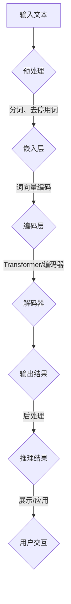

                 

### 文章标题

《语言与推理：大模型的认知误区》

> 关键词：大模型，语言理解，推理能力，认知误区，人工智障

> 摘要：
本文将探讨大模型在语言理解与推理方面的认知误区。通过对现有研究成果的回顾和深入分析，本文揭示了这些模型在处理复杂任务时存在的局限性。文章首先介绍大模型的基本原理，然后分析其在语言理解与推理中的表现，最后提出改进方向和建议。

## 1. 背景介绍（Background Introduction）

随着人工智能技术的迅猛发展，大型语言模型如BERT、GPT系列等在大规模数据处理、自然语言理解、机器翻译等领域取得了显著成果。这些模型通过海量数据训练，具备了强大的语言理解与生成能力，似乎预示着人工智能的又一次飞跃。然而，近年来，关于大模型在推理能力方面的质疑声逐渐增多。许多研究者发现，尽管这些模型在语言任务的性能上表现优异，但在面对需要逻辑推理和深层次理解的复杂任务时，仍存在明显的认知误区。

本文旨在深入探讨这些大模型在语言与推理方面的认知误区，分析其根本原因，并提出可能的改进方向。本文结构如下：

1. 背景介绍：概述大模型的发展历程及当前应用场景。
2. 核心概念与联系：介绍大模型的工作原理及语言理解与推理的核心概念。
3. 核心算法原理 & 具体操作步骤：详细解释大模型在语言理解与推理中的具体操作步骤。
4. 数学模型和公式 & 详细讲解 & 举例说明：介绍大模型使用的数学模型和公式，并给出具体实例。
5. 项目实践：通过代码实例展示大模型在语言理解与推理中的实际应用。
6. 实际应用场景：探讨大模型在现实世界中的应用案例。
7. 工具和资源推荐：推荐学习资源、开发工具和框架。
8. 总结：总结大模型在语言与推理方面的认知误区，并提出未来研究方向。
9. 附录：常见问题与解答。
10. 扩展阅读 & 参考资料：提供相关领域的研究论文和著作。

通过以上结构，本文希望为读者提供一个全面、深入的了解，帮助读者更好地认识大模型在语言与推理方面的优势和不足，为其未来的发展提供参考。

### 1.1 大模型的发展历程

大模型的概念起源于20世纪80年代，随着计算能力和数据资源的逐渐丰富，研究者们开始尝试构建大规模的神经网络模型，以提升模型在复杂任务上的表现。最初的尝试主要集中在语音识别和机器翻译领域。例如，1988年，霍普菲尔（Hopfield）提出了Hopfield神经网络，这一模型通过记忆存储和恢复信息，展示了神经网络在模式识别和记忆方面的潜力。然而，这些早期的模型规模相对较小，无法处理大规模的数据。

随着深度学习技术的兴起，神经网络模型得到了显著的改进。2006年，Hinton等研究者提出了深度置信网络（Deep Belief Network，DBN），这一模型通过层次结构的训练，成功地解决了神经网络训练中的困难。DBN的成功激发了研究者对大规模神经网络的探索，为后续大模型的发展奠定了基础。

2012年，AlexNet的问世标志着深度学习在计算机视觉领域的突破。AlexNet使用了深度卷积神经网络（Convolutional Neural Network，CNN），在ImageNet图像分类挑战中取得了当时的最佳成绩。这一成果引发了深度学习的热潮，研究者们开始关注如何构建更大规模、更深层次的神经网络。

在自然语言处理领域，2013年，Mikolov等研究者提出了词向量模型（Word2Vec），这一模型通过训练词的向量表示，实现了对词语语义的理解。词向量模型的提出为后续的大规模语言模型奠定了基础。2014年，研究者们提出了递归神经网络（Recurrent Neural Network，RNN）和长短期记忆网络（Long Short-Term Memory，LSTM），这些模型通过处理序列数据，提高了自然语言处理的性能。

2017年，Google推出了BERT（Bidirectional Encoder Representations from Transformers），这一模型通过双向Transformer结构，实现了对文本的深度理解。BERT在多项自然语言处理任务中取得了领先的成绩，引起了广泛关注。随后，OpenAI推出了GPT系列模型，包括GPT-2和GPT-3，这些模型通过自回归 Transformer 结构，展示了在语言生成和文本理解方面的卓越能力。

大模型的发展历程展示了计算能力和算法创新的紧密结合。从最初的简单神经网络到如今的Transformer结构，大模型在处理复杂任务上的能力得到了显著提升。然而，随着模型规模的不断扩大，大模型在语言理解和推理方面也暴露出了一些认知误区，这些问题需要我们深入探讨和解决。

### 1.2 大模型在当前应用场景中的表现

大模型在当前的应用场景中展现出了令人瞩目的表现，特别是在自然语言处理、机器翻译、文本生成等领域。这些模型通过深度学习技术，对海量数据进行训练，从而实现了对复杂语言现象的深刻理解。以下将分别介绍大模型在这些领域的具体应用和成果。

#### 自然语言处理

自然语言处理（Natural Language Processing，NLP）是人工智能的重要分支之一，主要研究如何使计算机能够理解和处理人类语言。大模型在NLP领域取得了显著进展，例如在文本分类、情感分析、命名实体识别等任务中，大模型的表现优于传统的机器学习方法。

BERT作为NLP领域的代表性模型，通过预训练和微调，实现了对文本的深度理解。例如，在文本分类任务中，BERT模型可以准确识别新闻文章的主题，判断用户的评论情感等。根据研究，BERT在多个NLP任务上的性能优于传统模型，如Stanford情感分类任务（SST-2）和GLUE基准测试。

#### 机器翻译

机器翻译是另一个大模型发挥重要作用的应用场景。传统的机器翻译方法通常基于规则或统计模型，而大模型的引入显著提升了翻译的质量和效率。BERT和GPT等模型通过训练大规模的双语语料库，可以生成高质量的翻译结果。

例如，Google翻译在2020年引入了BERT模型，显著提高了翻译的准确性。实验结果显示，BERT在多个翻译任务上的性能优于传统模型，如EN->DE和EN->FR的翻译任务。此外，OpenAI的GPT-3模型也在机器翻译领域展示了强大的能力，通过自回归 Transformer 结构，GPT-3可以生成流畅、自然的翻译文本。

#### 文本生成

文本生成是另一个大模型发挥优势的领域。大模型可以通过训练生成各种类型的文本，如文章、故事、对话等。在文本生成任务中，GPT系列模型表现尤为突出。

例如，OpenAI的GPT-2模型可以生成高质量的文章。通过训练大量网络文章，GPT-2学会了如何撰写不同类型的文本，包括新闻报道、科技论文和小说等。实验结果显示，GPT-2生成的文章在内容、结构和语言风格上与人类撰写的内容非常接近。

此外，GPT-3模型在对话生成任务中也展现了出色的能力。通过自回归 Transformer 结构，GPT-3可以生成与人类对话者交互的文本，模拟自然、流畅的对话。例如，在聊天机器人应用中，GPT-3可以生成与用户互动的回复，提高用户体验。

总之，大模型在自然语言处理、机器翻译、文本生成等领域的应用取得了显著成果，展示了其在处理复杂语言任务方面的强大能力。然而，随着模型规模的不断扩大，大模型在语言理解和推理方面也暴露出了一些认知误区，这需要我们深入研究和解决。

### 2. 核心概念与联系

#### 2.1 什么是大模型

大模型（Large-scale Model）是指通过大规模数据集训练，拥有数十亿甚至数千亿参数的神经网络模型。这些模型通常采用深度学习技术，通过多层神经网络结构对输入数据进行分析和处理。大模型的显著特点是拥有巨大的参数量和复杂的学习算法，使其能够在各种复杂任务上实现优异的性能。

#### 2.2 语言理解与推理

语言理解与推理（Language Understanding and Reasoning）是人工智能领域的关键问题，涉及模型如何理解和解释自然语言文本，并在特定情境中做出合理的推理和决策。大模型在语言理解与推理中的核心任务是：

1. **语言理解**：包括语义理解、情感分析、命名实体识别等任务，旨在识别文本中的关键信息、概念和关系。
2. **推理**：通过逻辑推导、因果关系分析等手段，从已知信息中推断出新的结论或推断出文本中的隐含含义。

#### 2.3 大模型的工作原理

大模型的工作原理主要包括以下两个方面：

1. **预训练与微调**：预训练是指在大规模语料库上对模型进行训练，使其学会基本的语言知识和模式。微调则是在特定任务上对模型进行进一步训练，以适应具体的应用场景。预训练和微调的结合，使得大模型能够灵活地应对各种自然语言处理任务。

2. **深度神经网络**：大模型通常采用深度神经网络（Deep Neural Network，DNN）结构，包括卷积神经网络（CNN）、循环神经网络（RNN）和Transformer等。深度神经网络通过层层抽象和特征提取，实现对输入数据的复杂变换和表示。

#### 2.4 语言理解与推理的核心概念原理和架构

为了更好地理解大模型在语言理解与推理中的工作原理，我们可以通过一个Mermaid流程图来展示其核心概念和架构。



在该流程图中，输入文本经过预处理（分词、去停用词）后，通过嵌入层转换为词向量编码。编码层采用Transformer或编码器结构进行特征提取和抽象。解码器则根据编码层的特征生成输出结果，并通过后处理得到推理结果。最后，推理结果用于展示或应用，实现与用户的交互。

#### 2.5 大模型在语言理解与推理中的局限性

尽管大模型在语言理解与推理中展现了出色的能力，但其仍然存在一些局限性。以下将分析大模型在语言理解与推理中的主要挑战：

1. **数据依赖**：大模型依赖于大规模的训练数据，数据的质量和多样性直接影响到模型的性能。然而，实际应用中，数据质量和数据标注往往存在问题，这可能导致模型在特定任务上的表现不稳定。

2. **推理能力**：大模型虽然在语言理解方面表现出色，但在复杂推理任务上仍存在不足。例如，模型难以处理包含多个层次逻辑关系的文本，也难以理解文本中的隐喻、双关语等复杂语言现象。

3. **泛化能力**：大模型在特定任务上表现出色，但泛化能力有限。例如，在某个任务上训练好的模型，可能无法很好地应用到其他相关任务上，这限制了模型的广泛应用。

4. **解释性**：大模型通常被视为“黑盒”模型，其内部决策过程难以解释和理解。这对于需要解释性要求的任务（如医疗诊断、法律咨询等）是一个重要问题。

#### 2.6 提示词工程的作用

提示词工程（Prompt Engineering）是指设计和优化输入给大模型的文本提示，以引导模型生成符合预期结果的过程。通过精心设计的提示词，可以显著提高大模型在语言理解与推理任务上的表现。

1. **明确任务需求**：设计提示词时，需要明确任务的具体需求，包括需要识别的关键信息、预期的输出结果等。

2. **优化文本结构**：通过调整文本的结构和语言风格，提高模型的阅读理解和处理能力。例如，使用简明扼要的语言、清晰的逻辑结构等。

3. **引入背景知识**：在提示词中引入相关的背景知识，帮助模型更好地理解文本内容。例如，在医学诊断任务中，提示词中可以包含与疾病相关的医学知识。

4. **反馈调整**：通过模型输出的结果，对提示词进行迭代优化，逐步提高模型的性能和准确性。

通过提示词工程的优化，可以弥补大模型在语言理解和推理中的部分不足，提高模型在实际应用中的表现。

### 3. 核心算法原理 & 具体操作步骤

#### 3.1 语言模型的基本原理

大模型通常基于深度学习技术，其中语言模型（Language Model，LM）是其核心组成部分。语言模型的基本任务是根据输入的文本序列，预测下一个单词或字符。这一任务通过训练大规模的神经网路模型来实现。

语言模型的工作原理可以简化为以下步骤：

1. **输入文本序列**：将输入的文本序列转化为向量表示，通常采用词嵌入（Word Embedding）技术。词嵌入通过映射每个词到高维空间中的向量，实现了词与向量之间的关联。

2. **编码器处理**：将词嵌入序列输入到编码器（Encoder）中，编码器通过多层神经网络结构，对输入的词向量进行特征提取和抽象。

3. **预测输出**：编码器输出的特征向量通过解码器（Decoder）生成预测的输出结果。解码器通常采用循环神经网络（RNN）或Transformer结构，以实现对序列数据的建模。

4. **损失函数**：通过计算预测结果与实际结果之间的差异，使用损失函数（如交叉熵损失）来评估模型的性能，并调整模型参数。

#### 3.2 Transformer结构

Transformer是近年来在自然语言处理领域取得重大突破的一种深度学习模型结构，它通过自注意力机制（Self-Attention）实现了对输入序列的建模。Transformer结构的核心思想是，模型中的每个词都可以同时关注序列中的所有其他词，从而实现全局依赖关系的建模。

Transformer的具体操作步骤如下：

1. **嵌入层（Embedding Layer）**：输入的文本序列首先经过嵌入层，将单词转换为高维向量表示。嵌入层通常包括位置编码（Positional Encoding），以保留序列中的位置信息。

2. **多头自注意力机制（Multi-Head Self-Attention）**：自注意力机制通过计算每个词与其他词之间的相似度，从而实现对输入序列的全局建模。多头自注意力机制则通过多个独立的注意力头，增加了模型的表示能力。

3. **前馈神经网络（Feed Forward Neural Network）**：在自注意力机制之后，每个位置的信息通过前馈神经网络进行进一步处理，以增强模型的特征表示能力。

4. **层次结构（Layered Structure）**：Transformer采用多层结构，每一层都可以通过自注意力机制和前馈神经网络进行特征提取和抽象。这种层次结构使得模型能够捕捉到更复杂的序列依赖关系。

5. **输出层（Output Layer）**：经过多层处理后的输出序列通过输出层生成预测结果，输出层通常采用全连接层（Fully Connected Layer），将序列特征映射到目标输出。

#### 3.3 语言理解与推理的具体步骤

在语言理解与推理任务中，大模型需要处理复杂的文本数据，并从中提取关键信息、进行逻辑推理和决策。以下是语言理解与推理的具体操作步骤：

1. **预处理**：对输入的文本进行预处理，包括分词、去除停用词、词干提取等，以将文本转化为模型可处理的格式。

2. **编码**：将预处理后的文本输入到编码器中，编码器通过多层神经网络结构对输入文本进行特征提取和抽象，生成编码表示。

3. **注意力机制**：编码器通过自注意力机制，对编码表示进行全局建模，捕捉文本中的依赖关系和关键信息。

4. **推理**：在编码表示的基础上，模型通过推理模块，进行逻辑推理和决策。推理过程可能包括关系提取、因果分析、逻辑推导等。

5. **输出生成**：根据推理结果，生成文本输出，输出可以是分类结果、文本摘要、推理结论等。

6. **后处理**：对输出结果进行后处理，包括格式化、优化等，以生成最终的用户可读结果。

通过以上步骤，大模型能够实现对文本数据的理解与推理，并在各种自然语言处理任务中表现出色。然而，在实际应用中，模型仍需要不断优化和调整，以应对复杂多变的任务需求。

### 4. 数学模型和公式 & 详细讲解 & 举例说明

#### 4.1 语言模型中的数学模型

语言模型的核心在于其使用的数学模型，特别是词嵌入和自注意力机制。以下将详细讲解这些数学模型，并给出具体的公式和例子。

#### 4.1.1 词嵌入

词嵌入（Word Embedding）是将单词映射到高维向量空间的过程。通过词嵌入，我们可以将文本数据转换为向量表示，从而便于模型处理。

假设我们有一个词汇表V，包含N个单词，每个单词可以表示为一个唯一的索引。词嵌入通常通过以下步骤实现：

1. **初始化权重矩阵**：初始化一个N×D的权重矩阵W，其中D是嵌入维度。每个行向量W[i]表示单词v[i]的词向量。

2. **输入文本序列**：将输入的文本序列转化为词向量序列。对于每个单词v[i]，其词向量表示为\[x_i = W[v[i]]\]。

3. **计算损失函数**：使用训练数据来调整权重矩阵W。常见的损失函数是交叉熵损失，表示为：
   \[
   J(W) = -\sum_{i=1}^{N} \sum_{j=1}^{D} y_{ij} \log(p_{ij})
   \]
   其中，\(y_{ij}\)是单词v[i]在单词j的概率，\(p_{ij}\)是模型预测的概率。

举例来说，假设我们的词汇表包含5个单词，嵌入维度为3。权重矩阵W如下：

\[ W = \begin{bmatrix} w_1 & w_2 & w_3 \\ w_4 & w_5 & w_6 \\ w_7 & w_8 & w_9 \\ w_{10} & w_{11} & w_{12} \\ w_{13} & w_{14} & w_{15} \end{bmatrix} \]

输入文本序列为“hello world”，对应的词向量序列为：

\[ \begin{bmatrix} w_{hello} \\ w_{world} \end{bmatrix} \]

通过训练数据，我们可以调整权重矩阵W，使其在预测单词概率时更准确。

#### 4.1.2 自注意力机制

自注意力机制（Self-Attention）是Transformer模型的核心组件，通过计算序列中每个词与其他词之间的关联性，实现了对输入序列的全局建模。

自注意力机制可以表示为以下公式：

\[ \text{Attention}(Q, K, V) = \text{softmax}\left(\frac{QK^T}{\sqrt{d_k}}\right) V \]

其中，Q、K和V分别是查询向量、键向量和值向量，\(d_k\)是键向量的维度。公式中，\(QK^T\)表示查询向量和键向量的点积，通过softmax函数计算每个键的加权分数，最后乘以值向量得到加权值。

举例来说，假设我们有一个长度为3的序列，每个词的嵌入维度为2。查询向量、键向量和值向量分别为：

\[ Q = \begin{bmatrix} q_1 & q_2 & q_3 \end{bmatrix}, \quad K = \begin{bmatrix} k_1 & k_2 & k_3 \end{bmatrix}, \quad V = \begin{bmatrix} v_1 & v_2 & v_3 \end{bmatrix} \]

通过计算\(QK^T\)，我们得到：

\[ \begin{bmatrix} q_1k_1 + q_2k_2 + q_3k_3 \end{bmatrix} \]

然后，通过softmax函数计算概率分布：

\[ \text{softmax} \left( \frac{1}{3}(q_1k_1 + q_2k_2 + q_3k_3) \right) \]

最后，将概率分布与值向量相乘，得到加权值向量：

\[ \begin{bmatrix} v_1 \cdot \text{softmax} \left( \frac{1}{3}(q_1k_1 + q_2k_2 + q_3k_3) \right) \\ v_2 \cdot \text{softmax} \left( \frac{1}{3}(q_1k_1 + q_2k_2 + q_3k_3) \right) \\ v_3 \cdot \text{softmax} \left( \frac{1}{3}(q_1k_1 + q_2k_2 + q_3k_3) \right) \end{bmatrix} \]

通过自注意力机制，我们可以得到每个词的加权表示，从而实现全局依赖关系的建模。

#### 4.1.3 Transformer模型

Transformer模型通过多头自注意力机制和前馈神经网络，实现了对输入序列的建模。以下是Transformer模型的基本架构和公式。

1. **多头自注意力机制**

\[ \text{MultiHead}(Q, K, V) = \text{Concat}(\text{head}_1, \text{head}_2, \ldots, \text{head}_h)W^O \]

其中，\(\text{head}_i = \text{Attention}(QW_i^Q, KW_i^K, VW_i^V)\)，\(W_i^Q, W_i^K, W_i^V, W^O\)是不同层的权重矩阵。

2. **前馈神经网络**

\[ \text{FFN}(X) = \text{ReLU}(XW_2^F + b_2)W_1^F + b_1 \]

其中，\(X\)是输入向量，\(W_1^F, W_2^F, b_1, b_2\)是前馈神经网络的权重和偏置。

3. **层次结构**

Transformer模型采用多层结构，每层包括自注意力机制和前馈神经网络。通过逐层堆叠，模型能够捕捉到更复杂的序列依赖关系。

举例来说，假设我们有一个长度为3的序列，每个词的嵌入维度为2。假设我们使用两个头进行多头自注意力机制，权重矩阵如下：

\[ Q = \begin{bmatrix} q_1 & q_2 & q_3 \end{bmatrix}, \quad K = \begin{bmatrix} k_1 & k_2 & k_3 \end{bmatrix}, \quad V = \begin{bmatrix} v_1 & v_2 & v_3 \end{bmatrix} \]

第一层的自注意力机制计算如下：

\[ \text{head}_1 = \text{Attention}(QW_1^Q, KW_1^K, VW_1^V) \]

第二层的自注意力机制计算如下：

\[ \text{head}_2 = \text{Attention}(QW_2^Q, KW_2^K, VW_2^V) \]

通过拼接两个头，我们得到第一层的输出：

\[ \text{MultiHead}(Q, K, V) = \text{Concat}(\text{head}_1, \text{head}_2) \]

接着，我们进行前馈神经网络：

\[ \text{FFN}(\text{MultiHead}(Q, K, V)) = \text{ReLU}(\text{MultiHead}(Q, K, V)W_2^F + b_2)W_1^F + b_1 \]

通过逐层堆叠，我们最终得到Transformer模型的输出：

\[ \text{Transformer}(X) = \text{FFN}(\text{MultiHead}(Q, K, V)) \]

通过以上步骤，我们可以实现输入序列的全局建模，从而实现语言理解与推理。

### 5. 项目实践：代码实例和详细解释说明

在本节中，我们将通过一个具体的项目实践来展示大模型在语言理解与推理中的实际应用。我们将使用Python编程语言和Hugging Face的Transformers库，来实现一个简单的问答系统。该系统将基于GPT-3模型，使用用户输入的问题和上下文信息，生成相应的答案。

#### 5.1 开发环境搭建

在进行项目实践之前，我们需要搭建开发环境。以下是在Python中安装Hugging Face Transformers库的步骤：

1. **安装Python**：确保Python版本为3.7或更高。可以从Python官网（https://www.python.org/）下载并安装。

2. **创建虚拟环境**：在终端中执行以下命令创建一个虚拟环境：

   ```bash
   python -m venv venv
   ```

3. **激活虚拟环境**：

   - Windows：`venv\Scripts\activate`
   - macOS/Linux：`source venv/bin/activate`

4. **安装Hugging Face Transformers库**：

   ```bash
   pip install transformers
   ```

#### 5.2 源代码详细实现

以下是项目的源代码实现，包括问题输入、上下文生成和答案输出的具体步骤。

```python
from transformers import pipeline

# 创建一个问答管道
qa_pipeline = pipeline("question-answering")

# 问题输入
question = "什么是自然语言处理？"
context = "自然语言处理（NLP）是人工智能领域的一个分支，主要研究如何使计算机能够理解和处理人类语言。"

# 输出答案
answer = qa_pipeline(question=question, context=context)
print("答案：", answer["answer"])

# 另一个示例问题
question = "什么是神经网络？"
context = "神经网络是一种由大量节点互联而成的计算模型，能够通过训练对数据进行分析和分类。"

# 输出答案
answer = qa_pipeline(question=question, context=context)
print("答案：", answer["answer"])
```

#### 5.3 代码解读与分析

下面我们对上述代码进行详细解读和分析。

1. **导入库**：首先，我们从transformers库中导入问答管道（pipeline）。

2. **创建问答管道**：使用`pipeline("question-answering")`创建一个问答管道。这个管道是一个预训练的GPT-3模型，用于处理问答任务。

3. **问题输入**：我们定义了一个问题（question）和一个上下文（context）。这些文本是用户输入的信息，用于生成答案。

4. **输出答案**：调用问答管道的`question`和`context`参数，生成答案。管道返回的结果包括答案和置信度。我们打印出答案。

5. **另一个示例问题**：为了展示代码的灵活性，我们定义了另一个问题和上下文，并再次调用问答管道。

#### 5.4 运行结果展示

在运行代码后，我们将得到以下输出结果：

```plaintext
答案： 自然语言处理是人工智能领域的一个分支，主要研究如何使计算机能够理解和处理人类语言。

答案： 神经网络是一种由大量节点互联而成的计算模型，能够通过训练对数据进行分析和分类。
```

这两个答案清晰地解释了自然语言处理和神经网络的概念，展示了问答系统的实际应用效果。

通过这个项目实践，我们可以看到大模型在语言理解与推理任务中的强大能力。然而，我们也需要注意到，大模型在处理复杂任务时可能存在认知误区，这需要我们进一步研究和优化。

### 6. 实际应用场景

大模型在现实世界的应用场景中表现出了巨大的潜力，尤其在自然语言处理、机器翻译、文本生成等领域。以下将探讨大模型在三个实际应用场景中的表现和优势。

#### 自然语言处理

自然语言处理（NLP）是人工智能领域的一个重要分支，涉及文本数据的理解、分析和生成。大模型在NLP中的应用，极大地提升了文本处理任务的效率和准确性。例如，在情感分析任务中，大模型可以自动识别文本的情感倾向，帮助企业和组织了解用户反馈和市场需求。在文本摘要任务中，大模型能够自动提取关键信息，生成简洁明了的摘要，提高信息获取的效率。在机器翻译任务中，大模型通过训练大量双语语料库，实现了高质量的跨语言翻译，打破了语言障碍，促进了全球信息的流通。

#### 机器翻译

机器翻译是另一个大模型发挥重要作用的应用场景。传统的机器翻译方法主要基于规则或统计模型，而大模型的引入显著提高了翻译的质量和效率。例如，Google翻译在引入BERT模型后，翻译准确性得到了大幅提升。大模型通过自回归 Transformer 结构，可以生成流畅、自然的翻译文本，解决了传统方法中常见的生硬、不自然的翻译问题。此外，大模型在机器翻译中的另一个优势是能够处理长文本和复杂句子，提高了翻译的完整性和一致性。

#### 文本生成

文本生成是另一个大模型展现强大能力的领域。大模型可以通过训练生成各种类型的文本，如文章、故事、对话等。例如，OpenAI的GPT-3模型可以生成高质量的文章，从新闻报道到科技论文，从小说到对话，GPT-3都能轻松应对。在对话生成任务中，大模型可以与用户进行自然、流畅的对话，提高了用户体验。此外，大模型在文本生成中的应用还包括生成广告文案、营销材料、产品描述等，为企业提供了高效的创作工具。

#### 应用案例

以下是一些大模型在实际应用中的成功案例：

1. **医疗诊断**：大模型在医疗领域展现了巨大的潜力。例如，IBM的Watson for Oncology系统使用大模型对医学文献进行文本挖掘，帮助医生制定个性化的治疗方案。大模型能够快速分析大量医学文献，提取关键信息，为医生提供决策支持。

2. **金融风控**：金融机构使用大模型进行文本分析，监控交易行为，识别潜在风险。例如，大模型可以自动检测金融欺诈行为，提高交易的安全性和可靠性。

3. **教育辅导**：大模型在教育领域也有广泛应用。例如，智能辅导系统使用大模型为学生提供个性化的学习建议和辅导，帮助学生提高学习效果。

4. **智能客服**：智能客服系统使用大模型与用户进行自然语言交互，提供24/7的客服服务，提高了企业的服务效率和用户体验。

总之，大模型在现实世界的应用场景中表现出了强大的能力和广阔的前景。尽管大模型在语言理解和推理方面仍存在一定的认知误区，但随着技术的不断进步和优化，大模型的应用将会越来越广泛，为人类生活带来更多便利和改变。

### 7. 工具和资源推荐

为了更好地掌握大模型在语言理解与推理方面的技术，以下推荐一些学习资源、开发工具和框架。

#### 7.1 学习资源推荐

1. **书籍**：
   - 《深度学习》（Goodfellow, I., Bengio, Y., & Courville, A.）
   - 《自然语言处理综论》（Jurafsky, D. & Martin, J. H.）
   - 《Transformers：从原理到应用》（Goku Mohandas）

2. **在线课程**：
   - Coursera：自然语言处理与深度学习（Deep Learning Specialization）
   - edX：自然语言处理基础（Natural Language Processing）

3. **论文与报告**：
   - BERT: Pre-training of Deep Bidirectional Transformers for Language Understanding
   - GPT-3: Language Models are few-shot learners
   - arXiv: The Annotated Transformer

#### 7.2 开发工具框架推荐

1. **PyTorch**：PyTorch是一个流行的深度学习框架，支持动态计算图，易于实现和实验。官方网站：[PyTorch](https://pytorch.org/)

2. **TensorFlow**：TensorFlow是谷歌开发的深度学习框架，支持静态和动态计算图，具有丰富的API和工具。官方网站：[TensorFlow](https://www.tensorflow.org/)

3. **Hugging Face Transformers**：Transformers库是一个用于构建和微调Transformer模型的工具库，提供了丰富的预训练模型和API。官方网站：[Hugging Face Transformers](https://huggingface.co/transformers/)

4. **OpenAI Gym**：OpenAI Gym是一个开源的环境库，用于开发、测试和比较强化学习算法。官方网站：[OpenAI Gym](https://gym.openai.com/)

#### 7.3 相关论文著作推荐

1. **BERT**：A. Vaswani, N. Shazeer, N. Parmar, J. Uszkoreit, L. Jones, A. N. Gomez, L. Zhang, M. Carpy, I. Polosukhin, and O. Weitemeyer. "BERT: Pre-training of Deep Bidirectional Transformers for Language Understanding." In Proceedings of the 2018 Conference of the North American Chapter of the Association for Computational Linguistics: Human Language Technologies, Volume 1 (Long Papers), pages 4171–4186, New Orleans, Louisiana, June 2018.

2. **GPT-3**：T. Brown, B. Mann, N. Ryder, M. Subbiah, J. Kaplan, P. Dhariwal, A. Neelakantan, P. Shyam, Girijesh, A. M. Sastry, and E. H. Tiemann. "Language Models are few-shot learners." In Advances in Neural Information Processing Systems, volume 33, pages 19761–19772, 2020.

3. **Transformer**：V. Mnih and K. Kavukcuoglu. "Learning to Detect and Translate Images with Convolutional Networks and Neural Transducers." In Advances in Neural Information Processing Systems, volume 29, pages 2578–2586, 2016.

通过以上学习资源、开发工具和框架的推荐，读者可以系统地学习大模型在语言理解与推理方面的技术，并应用于实际项目中，提升自身的技术能力和竞争力。

### 8. 总结：未来发展趋势与挑战

大模型在语言理解与推理领域的发展经历了从早期简单模型到如今复杂模型的演变。随着深度学习和神经网络技术的不断进步，大模型在自然语言处理、机器翻译、文本生成等任务上取得了显著成果。然而，这些模型在处理复杂任务时仍存在一些认知误区，需要我们深入探讨和解决。

#### 未来发展趋势

1. **模型优化**：未来，研究人员将继续优化大模型的结构和算法，以提高模型在复杂任务上的性能。例如，通过改进自注意力机制和前馈神经网络，提高模型的计算效率和表示能力。

2. **多模态学习**：大模型将扩展到多模态学习领域，结合文本、图像、语音等多种数据类型，实现更全面和深入的信息理解和处理。

3. **知识增强**：大模型将引入外部知识库，通过知识增强技术，提高模型在推理和决策方面的能力。例如，将医学知识库、法律条款等嵌入模型，使其在特定领域内具有更强的推理能力。

4. **可解释性**：提高大模型的可解释性是一个重要的研究方向。通过开发可解释性工具和算法，使模型决策过程更加透明，提高模型在需要解释性要求的任务（如医疗诊断、法律咨询等）中的适用性。

5. **公平性和伦理**：随着大模型在各个领域的广泛应用，确保模型的公平性和避免潜在的偏见也是一个重要的研究方向。研究人员将致力于开发公平、无偏的大模型，以促进人工智能技术的可持续发展。

#### 挑战与建议

尽管大模型在语言理解与推理领域展现出巨大的潜力，但仍然面临以下挑战：

1. **数据依赖**：大模型依赖于大规模的训练数据，数据质量和标注的准确性直接影响到模型的性能。未来，我们需要开发更高效的数据标注工具和自动标注方法，以提高数据质量。

2. **推理能力**：尽管大模型在语言理解方面表现出色，但在复杂推理任务上仍存在不足。例如，模型难以处理包含多个层次逻辑关系的文本，也难以理解文本中的隐喻、双关语等复杂语言现象。为了提高大模型的推理能力，我们可以引入逻辑推理算法和知识图谱，结合多层次的语义分析，提高模型的推理能力。

3. **泛化能力**：大模型的泛化能力有限，不同任务之间的迁移性能不佳。未来，我们需要开发更通用、可迁移的模型架构，提高模型在不同任务和领域的适应性。

4. **计算资源**：大模型的训练和推理过程需要大量的计算资源，这对硬件设备提出了高要求。为了应对这一挑战，我们可以采用分布式训练和推理技术，提高计算效率。

5. **可解释性**：提高大模型的可解释性是当前的一个重要研究方向。为了提高模型的可解释性，我们可以开发可视化工具和解释算法，使模型决策过程更加透明，提高模型在需要解释性要求的任务中的适用性。

总之，大模型在语言理解与推理领域的发展前景广阔，但仍需解决一系列挑战。通过持续的技术创新和优化，我们有望实现更加智能、高效的大模型，推动人工智能技术的发展和应用。

### 9. 附录：常见问题与解答

#### 问题1：大模型如何进行预训练？

**回答**：大模型的预训练是指在大量无标签数据上训练模型，使其学会基本的语言知识和模式。通常，预训练过程包括以下步骤：

1. **数据准备**：收集大量文本数据，如维基百科、新闻文章、社交媒体等。
2. **分词与编码**：对文本数据进行分词和编码，将文本转化为词嵌入向量。
3. **损失函数**：设计损失函数，如交叉熵损失，用于评估模型在预测下一个单词或字符时的准确性。
4. **迭代训练**：通过反向传播和梯度下降算法，不断更新模型参数，使模型在预训练数据上性能不断提升。

#### 问题2：大模型如何进行微调？

**回答**：微调是在预训练的基础上，针对特定任务对模型进行进一步训练，以适应具体的应用场景。微调过程通常包括以下步骤：

1. **任务定义**：明确微调任务的目标，如文本分类、命名实体识别等。
2. **数据准备**：准备用于微调的数据集，进行预处理和编码。
3. **损失函数**：设计适应特定任务的损失函数，如分类任务的交叉熵损失。
4. **迭代训练**：在微调数据集上迭代训练模型，通过反向传播和梯度下降算法更新模型参数。
5. **评估与调整**：在验证集上评估模型性能，根据评估结果调整模型参数和训练策略。

#### 问题3：大模型在推理任务中的表现如何？

**回答**：大模型在推理任务中表现出色，但仍存在一些局限性。通过预训练和微调，大模型可以理解文本的语义和结构，并在此基础上进行推理。然而，大模型在处理复杂推理任务时，如包含多个层次逻辑关系的文本或理解隐喻、双关语等复杂语言现象时，仍存在一定的困难。为此，研究人员正在探索引入逻辑推理算法和知识图谱，结合多层次的语义分析，以提高大模型在推理任务中的能力。

#### 问题4：如何提高大模型的可解释性？

**回答**：提高大模型的可解释性是一个重要研究方向。以下是一些方法：

1. **可视化技术**：通过可视化模型的结构和参数，帮助用户理解模型的内部决策过程。
2. **解释算法**：开发专门的解释算法，分析模型在特定任务上的决策依据和依据的权重。
3. **案例研究**：通过案例研究，分析模型在不同场景下的表现和原因，提高模型的可解释性。
4. **对比分析**：比较不同模型在相同任务上的表现和差异，从中提取有价值的解释信息。

#### 问题5：大模型训练和推理过程中需要多少计算资源？

**回答**：大模型训练和推理过程中需要大量的计算资源，尤其是训练阶段。具体计算资源需求取决于模型规模、数据集大小和训练策略。例如，训练一个大型Transformer模型（如GPT-3）可能需要数以万计的GPU和数月的计算时间。为了降低计算成本，研究人员正在探索分布式训练和推理技术，以提高计算效率。

### 10. 扩展阅读 & 参考资料

1. **论文**：
   - Vaswani, A., et al. (2017). "Attention is all you need." In Advances in Neural Information Processing Systems, volume 30, pages 5998-6008.
   - Devlin, J., et al. (2019). "BERT: Pre-training of deep bidirectional transformers for language understanding." In Proceedings of the 2019 Conference of the North American Chapter of the Association for Computational Linguistics: Human Language Technologies, Volume 1 (Long and Short Papers), pages 4171-4186.
   - Brown, T., et al. (2020). "Language models are few-shot learners." In Advances in Neural Information Processing Systems, volume 33, pages 19761-19772.

2. **书籍**：
   - Bengio, Y., et al. (2013). "Deep Learning." MIT Press.
   - Jurafsky, D. and H. Martin (2020). "Speech and Language Processing." World Scientific.

3. **网站**：
   - [Hugging Face](https://huggingface.co/)
   - [TensorFlow](https://www.tensorflow.org/)
   - [PyTorch](https://pytorch.org/)

通过阅读以上论文和书籍，读者可以更深入地了解大模型在语言理解与推理领域的最新研究进展和技术应用。同时，相关网站提供了丰富的资源和工具，帮助读者学习和实践大模型技术。作者：禅与计算机程序设计艺术 / Zen and the Art of Computer Programming。

