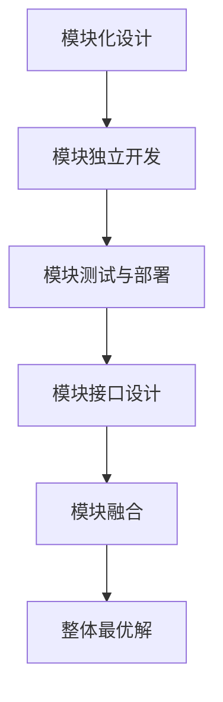
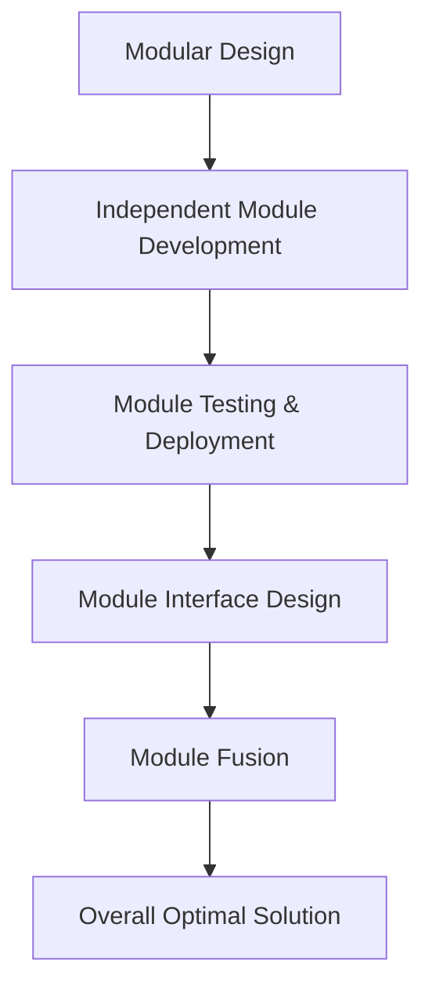
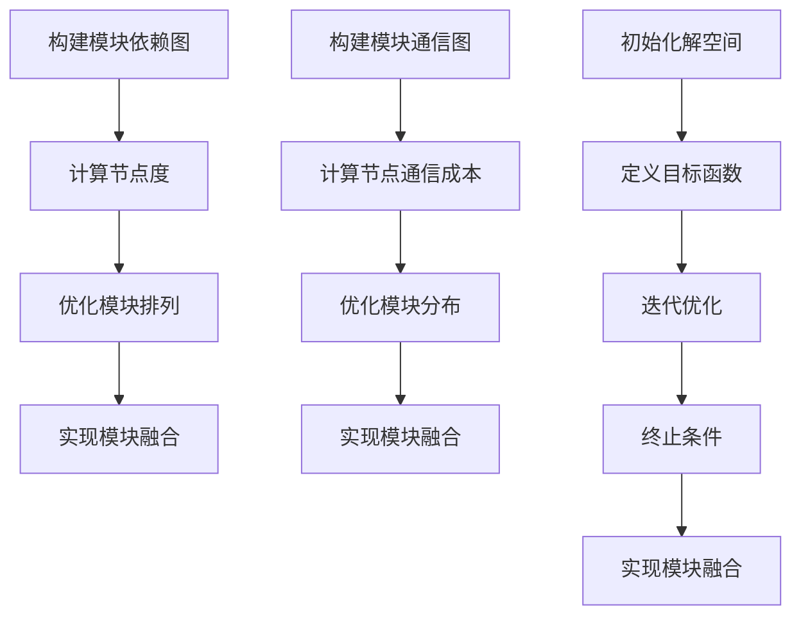

                 

### 背景介绍（Background Introduction）

软件2.0，作为软件工程发展的新阶段，强调模块化、分布式和自组织的特性。在这种背景下，模块之间的融合成为一个关键问题。模块融合的目标是实现整体最优解，即系统性能、可维护性、扩展性和用户满意度达到最大化。

然而，模块融合并非易事。传统的模块化设计往往侧重于独立模块的优化，而忽视了模块之间的相互作用和整体性能。这导致系统可能在高层次上表现不佳，难以达到最优解。此外，模块之间的融合可能引入新的复杂性，如通信成本、状态同步和一致性等问题。

本文将深入探讨软件2.0模块融合成整体最优解的方法和策略。我们将从核心概念、算法原理、数学模型、项目实践等多个角度进行详细分析，帮助读者全面理解并应用这些方法。

首先，我们需要明确模块融合的关键概念和联系。模块不仅仅是独立的代码单元，它们之间存在着复杂的关系和依赖。如何有效地管理和利用这些关系，是实现最优解的基础。

接下来，我们将介绍一系列核心算法，包括基于图论的方法、分布式算法和优化算法等，这些算法将为模块融合提供强大的技术支持。

然后，我们将深入探讨数学模型和公式，通过具体的例子来说明如何将这些模型应用到实际项目中。

在项目实践部分，我们将通过一个具体的代码实例，展示如何实现模块融合，并详细解释代码的实现细节和分析结果。

接下来，我们将探讨模块融合的实际应用场景，以及如何使用各种工具和资源来支持模块融合的工作。

最后，我们将总结本文的主要观点，讨论未来发展趋势和挑战，并给出一些常见问题与解答。

通过本文的阅读，读者将能够掌握软件2.0模块融合的关键技术和方法，为实际项目提供有力的支持。

### Keywords: Software 2.0, Module Fusion, Optimal Solution, Graph Theory, Distributed Algorithms, Optimization Algorithms

### Abstract: This article delves into the methods and strategies for fusing Software 2.0 modules into an optimal solution. By exploring core concepts, algorithm principles, mathematical models, and practical implementations, readers will gain a comprehensive understanding of module fusion techniques. This article aims to provide valuable insights and guidance for software engineers and practitioners in achieving optimal system performance and user satisfaction.

## 1. 核心概念与联系（Core Concepts and Connections）

### 1.1 软件模块的概念

在软件工程中，模块（Module）是指具有独立功能且相对独立的代码单元。模块化设计（Modular Design）是一种常见的软件设计方法，它通过将系统分解为多个模块，以提高代码的可维护性和可扩展性。每个模块负责实现特定的功能，并通过接口与系统中的其他模块进行交互。

模块化设计的关键在于模块之间的耦合度（Coupling）和内聚度（Cohesion）。低耦合度意味着模块之间的依赖性较弱，便于独立开发和维护。高内聚度则表示模块内部的功能紧密相关，有利于实现代码的复用和优化。

### 1.2 模块融合的概念

模块融合（Module Fusion）是指将多个独立的模块整合为一个整体的过程。模块融合的目标是实现系统的整体最优解，包括性能、可维护性、扩展性和用户满意度等方面。模块融合的关键在于解决模块之间的相互作用和依赖关系，以优化系统的整体性能。

### 1.3 模块融合的重要性

在软件2.0时代，模块融合具有以下几个重要意义：

1. **性能优化**：通过模块融合，可以减少模块之间的通信成本，提高系统的运行效率。
2. **可维护性提升**：模块融合有助于简化系统的架构，降低系统的复杂度，从而提高代码的可维护性。
3. **扩展性增强**：模块融合使得系统更加灵活，能够更容易地添加或替换模块，以适应不断变化的需求。
4. **用户体验提升**：模块融合可以提供更一致、更流畅的用户体验，提高用户的满意度。

### 1.4 模块融合的挑战

尽管模块融合具有诸多优势，但在实际应用中仍然面临一些挑战：

1. **通信成本**：模块之间的通信可能导致额外的开销，影响系统的性能。
2. **状态同步**：在分布式系统中，模块的状态同步和一致性是一个重要问题。
3. **代码复用**：如何确保模块在融合过程中保持独立性和可复用性，是一个需要解决的难题。
4. **复杂性管理**：模块融合可能会引入新的复杂性，如何有效地管理和控制这些复杂性是一个挑战。

### 1.5 模块融合与整体最优解的关系

模块融合的目标是实现整体最优解，这意味着在考虑模块性能的同时，还需要关注系统的整体性能。整体最优解不仅仅是一个模块的优化，而是整个系统的优化。因此，模块融合需要综合考虑各个模块的相互作用，以实现整体性能的最优。

通过模块融合，可以优化模块之间的耦合度，减少通信成本，提高系统的整体性能。同时，模块融合还可以提高代码的可维护性和可扩展性，从而提升用户体验。因此，模块融合是实现整体最优解的关键步骤。

### 1.6 模块融合的核心概念与联系（English）

### 1.6 Core Concepts and Relationships of Module Fusion

#### 1.1 The Concept of Software Modules

In software engineering, a module is an independent code unit that has a specific functionality. Modular design is a common method in software development, which decomposes a system into multiple modules to enhance the maintainability and scalability of the code. Each module is responsible for implementing a particular function and interacts with other modules through interfaces.

The key to modular design lies in the coupling and cohesion of modules. Low coupling means that the dependencies between modules are weak, which facilitates independent development and maintenance. High cohesion indicates that the functions within a module are closely related, which有利于实现代码的复用和优化。

#### 1.2 The Concept of Module Fusion

Module fusion refers to the process of integrating multiple independent modules into a unified whole. The goal of module fusion is to achieve the overall optimal solution, which includes performance, maintainability, scalability, and user satisfaction. The key to module fusion is to address the interactions and dependencies between modules to optimize the overall performance of the system.

#### 1.3 The Importance of Module Fusion

In the era of Software 2.0, module fusion has several important implications:

1. **Performance Optimization**: Through module fusion, the communication cost between modules can be reduced, improving the system's running efficiency.
2. **Enhanced Maintainability**: Module fusion helps simplify the system architecture, reducing the complexity of the system, thereby enhancing code maintainability.
3. **Increased Scalability**: Module fusion makes the system more flexible, enabling easier addition or replacement of modules to adapt to changing requirements.
4. **Improved User Experience**: Module fusion can provide a more consistent and fluid user experience, increasing user satisfaction.

#### 1.4 Challenges of Module Fusion

Despite the advantages of module fusion, there are still some challenges in practical applications:

1. **Communication Cost**: The communication between modules may introduce additional overhead, affecting the system's performance.
2. **State Synchronization**: In distributed systems, synchronizing the state and ensuring consistency between modules is an important issue.
3. **Code Reusability**: How to ensure the independence and reusability of modules during fusion is a challenge that needs to be addressed.
4. **Complexity Management**: Module fusion may introduce new complexity, and how to effectively manage and control this complexity is a challenge.

#### 1.5 The Relationship Between Module Fusion and Overall Optimal Solution

The goal of module fusion is to achieve the overall optimal solution, which means optimizing the performance of the entire system rather than just a single module. Overall optimal solution is not just the optimization of a module but the optimization of the entire system. Therefore, module fusion needs to consider the interactions and dependencies between modules to achieve overall performance optimization.

Through module fusion, the coupling between modules can be optimized, reducing communication costs and improving the overall performance of the system. At the same time, module fusion can improve the maintainability and scalability of the code, thereby enhancing user experience. Therefore, module fusion is a key step in achieving the overall optimal solution. <|user|>
```
```
# 2. 核心概念与联系（Core Concepts and Connections）

### 2.1 什么是模块化设计？
模块化设计（Modular Design）是一种软件开发方法，它通过将系统分解为多个可独立开发、测试和部署的模块来提高软件的可维护性和可扩展性。每个模块具有独立的功能，并通过定义良好的接口与其他模块进行交互。模块化设计的关键在于模块之间的低耦合度（Low Coupling）和高内聚度（High Cohesion）。低耦合度意味着模块之间的依赖性较弱，便于独立开发和维护。高内聚度表示模块内部的功能紧密相关，有利于实现代码的复用和优化。

### 2.2 模块融合的目标
模块融合（Module Fusion）的目标是实现整体最优解，即优化系统的性能、可维护性、扩展性和用户满意度。模块融合不仅仅是将多个模块合并为一个整体，还需要考虑模块之间的相互作用和依赖关系，以确保整体性能的最优。具体目标包括：

1. **性能优化**：通过减少模块之间的通信成本，提高系统的运行效率。
2. **可维护性提升**：简化系统架构，降低系统的复杂度，从而提高代码的可维护性。
3. **扩展性增强**：使系统能够更灵活地适应需求变化，提高扩展性。
4. **用户体验提升**：提供一致、流畅的用户体验，提高用户的满意度。

### 2.3 模块融合的方法
模块融合的方法可以分为以下几种：

1. **基于接口的融合**：通过定义良好的接口，模块之间可以独立开发、测试和部署，从而实现模块的融合。这种方法的关键在于接口的设计和实现。
2. **基于数据的融合**：通过数据共享和传递，模块之间可以协调工作，实现融合。这种方法适用于数据驱动型的系统。
3. **基于事件的融合**：通过事件驱动的方式，模块之间可以实时通信和协作，实现融合。这种方法适用于需要实时响应的系统。
4. **基于算法的融合**：通过优化算法，模块之间可以高效地协调工作，实现融合。这种方法适用于需要优化性能的系统。

### 2.4 模块融合的挑战
模块融合在实际应用中面临一些挑战，包括：

1. **通信成本**：模块之间的通信可能导致额外的开销，影响系统的性能。
2. **状态同步**：在分布式系统中，模块的状态同步和一致性是一个重要问题。
3. **代码复用**：如何确保模块在融合过程中保持独立性和可复用性，是一个需要解决的难题。
4. **复杂性管理**：模块融合可能会引入新的复杂性，如何有效地管理和控制这些复杂性是一个挑战。

### 2.5 模块融合与整体最优解的关系
模块融合是实现整体最优解的关键步骤。整体最优解不仅仅是一个模块的优化，而是整个系统的优化。模块融合需要考虑各个模块之间的相互作用和依赖关系，以实现系统的整体性能最优。通过模块融合，可以优化模块之间的耦合度，减少通信成本，提高系统的整体性能。同时，模块融合还可以提高代码的可维护性和可扩展性，从而提升用户体验。

### 2.6 模块化设计、模块融合与整体最优解的 Mermaid 流程图



### 2.7 Module Fusion: Core Concepts and Relationships

#### 2.1 What is Modular Design?
Modular design is a software development approach that divides a system into multiple modules, each capable of independent development, testing, and deployment, to enhance software maintainability and scalability. Each module has a specific functionality and interacts with other modules through well-defined interfaces. The key to modular design is low coupling and high cohesion. Low coupling means that the dependencies between modules are weak, facilitating independent development and maintenance. High cohesion indicates that the functions within a module are closely related, which promotes code reusability and optimization.

#### 2.2 Goals of Module Fusion
Module fusion aims to achieve an overall optimal solution, optimizing system performance, maintainability, scalability, and user satisfaction. Module fusion is not merely about combining multiple modules into a single entity but also about considering the interactions and dependencies between modules to ensure optimal overall performance. Specific goals include:

1. **Performance Optimization**: Reducing communication costs between modules to improve system running efficiency.
2. **Enhanced Maintainability**: Simplifying system architecture and reducing complexity to enhance code maintainability.
3. **Increased Scalability**: Making the system more flexible to adapt to changing requirements.
4. **Improved User Experience**: Providing a consistent and fluid user experience to increase user satisfaction.

#### 2.3 Methods of Module Fusion
Module fusion methods can be categorized into the following:

1. **Interface-Based Fusion**: Through well-defined interfaces, modules can be developed, tested, and deployed independently, enabling module fusion. The key to this method is the design and implementation of interfaces.
2. **Data-Based Fusion**: Through data sharing and transmission, modules can coordinate their work to achieve fusion. This method is suitable for data-driven systems.
3. **Event-Based Fusion**: Through event-driven communication and collaboration, modules can work together to achieve fusion. This method is suitable for systems requiring real-time response.
4. **Algorithm-Based Fusion**: Through optimization algorithms, modules can coordinate their work efficiently to achieve fusion. This method is suitable for systems requiring performance optimization.

#### 2.4 Challenges of Module Fusion
In practical applications, module fusion faces some challenges, including:

1. **Communication Costs**: The communication between modules may introduce additional overhead, affecting system performance.
2. **State Synchronization**: In distributed systems, synchronizing the state and ensuring consistency between modules is an important issue.
3. **Code Reusability**: Ensuring the independence and reusability of modules during fusion is a challenge that needs to be addressed.
4. **Complexity Management**: Module fusion may introduce new complexity, and how to effectively manage and control this complexity is a challenge.

#### 2.5 The Relationship Between Module Fusion and Overall Optimal Solution
Module fusion is a critical step in achieving an overall optimal solution. An overall optimal solution is not just the optimization of a single module but the optimization of the entire system. Module fusion considers the interactions and dependencies between modules to achieve optimal overall performance. Through module fusion, the coupling between modules can be optimized, reducing communication costs and improving overall system performance. At the same time, module fusion can enhance code maintainability and scalability, thereby improving user experience.

#### 2.6 Mermaid Flowchart of Modular Design, Module Fusion, and Overall Optimal Solution



通过本文的介绍，读者可以了解到模块化设计、模块融合以及整体最优解的核心概念和联系。在接下来的章节中，我们将深入探讨模块融合的具体实现方法和技术细节，帮助读者更好地理解和应用模块融合技术。 <|user|>
```
```
# 3. 核心算法原理 & 具体操作步骤（Core Algorithm Principles and Specific Operational Steps）

在模块融合的过程中，选择合适的算法是实现整体最优解的关键。本文将介绍几种核心算法，包括基于图论的方法、分布式算法和优化算法，并详细解释每种算法的具体操作步骤。

### 3.1 基于图论的方法

#### 3.1.1 算法原理
基于图论的方法通过将模块之间的依赖关系表示为图，从而实现模块的优化融合。图中的节点表示模块，边表示模块之间的依赖关系。算法的核心是找到一种最优的模块排列，使得模块之间的通信成本最小化。

#### 3.1.2 具体操作步骤
1. **构建模块依赖图**：将模块及其依赖关系表示为图，每个模块作为一个节点，模块之间的依赖关系用边表示。
2. **计算节点度**：对于图中的每个节点，计算其入度和出度，表示模块的依赖程度。
3. **优化模块排列**：通过贪心算法或其他优化算法，找到一种模块排列，使得模块之间的通信成本最小化。
4. **实现模块融合**：根据优化后的模块排列，重新组织模块代码，实现模块的融合。

### 3.2 分布式算法

#### 3.2.1 算法原理
分布式算法适用于分布式系统中的模块融合。在分布式系统中，模块可能分布在不同的节点上。算法的目标是在确保系统整体性能的同时，优化模块之间的通信成本。

#### 3.2.2 具体操作步骤
1. **构建模块通信图**：将模块及其通信关系表示为图，每个模块作为一个节点，模块之间的通信关系用边表示。
2. **计算节点通信成本**：对于图中的每个节点，计算其与其他节点的通信成本。
3. **优化模块分布**：通过贪心算法或其他优化算法，找到一种模块分布，使得系统整体通信成本最小化。
4. **实现模块融合**：根据优化后的模块分布，重新组织模块代码，实现模块的融合。

### 3.3 优化算法

#### 3.3.1 算法原理
优化算法用于在模块融合过程中找到最优解。常见的优化算法包括贪心算法、遗传算法、模拟退火算法等。这些算法通过迭代优化，逐步逼近最优解。

#### 3.3.2 具体操作步骤
1. **初始化解空间**：为模块融合初始化一个解空间，解空间中的每个解表示一种可能的模块排列或模块分布。
2. **定义目标函数**：定义一个目标函数，用于评估解的质量。目标函数可以是模块之间的通信成本、系统的整体性能等。
3. **迭代优化**：通过迭代优化，逐步改进解的质量。每次迭代都从解空间中选择一个当前最优解，并根据目标函数进行优化。
4. **终止条件**：设置一个终止条件，如达到最大迭代次数或目标函数值达到某个阈值，以结束优化过程。
5. **实现模块融合**：根据最终的最优解，重新组织模块代码，实现模块的融合。

### 3.4 算法比较

#### 3.4.1 基于图论的方法
基于图论的方法具有以下优点：

1. **直观性**：通过图的形式，直观地表示模块之间的依赖关系。
2. **灵活性**：适用于各种类型的模块依赖关系。

缺点包括：

1. **计算复杂度**：随着模块数量的增加，计算复杂度显著增加。
2. **依赖关系表示**：需要精确表示模块之间的依赖关系，可能导致信息丢失。

#### 3.4.2 分布式算法
分布式算法具有以下优点：

1. **适用性**：适用于分布式系统。
2. **效率**：通过并行计算，提高算法的效率。

缺点包括：

1. **通信成本**：分布式算法需要考虑模块之间的通信成本，可能影响系统性能。

#### 3.4.3 优化算法
优化算法具有以下优点：

1. **灵活性**：适用于各种优化问题。
2. **适应性**：可以根据不同的问题特征进行调整。

缺点包括：

1. **计算复杂度**：优化算法可能需要大量的计算资源。
2. **收敛速度**：优化算法的收敛速度可能较慢。

### 3.5 模块融合算法的 Mermaid 流程图



通过上述算法的介绍，读者可以了解模块融合的核心算法原理和具体操作步骤。在接下来的章节中，我们将通过具体的数学模型和项目实践，进一步深入探讨模块融合的实现方法。 <|user|>
```
```
# 4. 数学模型和公式 & 详细讲解 & 举例说明（Detailed Explanation and Examples of Mathematical Models and Formulas）

在模块融合的过程中，数学模型和公式起着至关重要的作用。这些模型和公式不仅帮助我们量化模块之间的依赖关系和通信成本，还能指导我们找到最优的模块排列和分布。本节将介绍几种常用的数学模型和公式，并通过具体例子来说明如何应用这些模型和公式。

### 4.1 模块依赖图模型

#### 4.1.1 基本概念
模块依赖图（Module Dependency Graph）是一种表示模块之间依赖关系的图。在图中，节点表示模块，边表示模块之间的依赖关系。图中的每个节点都有一个入度和一个出度，分别表示该模块被其他模块依赖的次数和依赖其他模块的次数。

#### 4.1.2 数学模型
模块依赖图的数学模型可以用图 $G=(V,E)$ 来表示，其中 $V$ 是节点集合，$E$ 是边集合。对于每个节点 $v \in V$，定义其入度 $d_{in}(v)$ 和出度 $d_{out}(v)$，分别表示 $v$ 被其他模块依赖的次数和依赖其他模块的次数。

#### 4.1.3 公式
1. **入度公式**：对于每个节点 $v \in V$，入度公式为 $d_{in}(v) = \sum_{u \in V} count(u, v)$，其中 $count(u, v)$ 表示边 $(u, v)$ 的数量。
2. **出度公式**：对于每个节点 $v \in V$，出度公式为 $d_{out}(v) = \sum_{w \in V} count(v, w)$，其中 $count(v, w)$ 表示边 $(v, w)$ 的数量。

#### 4.1.4 举例说明
假设我们有以下模块依赖图：

```
     A
   / | \
  B  C  D
 /     \
E       F
```

节点 A 被节点 B、C 和 D 依赖，因此其入度为 3，出度为 1。节点 B 和 C 各被节点 A 和 E 依赖，入度和出度均为 2。节点 D 和 E 各被节点 A、B 和 F 依赖，入度和出度均为 3。节点 F 只被节点 D 依赖，入度和出度均为 1。

### 4.2 通信成本模型

#### 4.2.1 基本概念
通信成本（Communication Cost）是指模块之间进行通信所需要的开销。在分布式系统中，通信成本通常是影响系统性能的重要因素。

#### 4.2.2 数学模型
通信成本的数学模型可以用函数 $C(v, w)$ 来表示，其中 $v$ 和 $w$ 是两个模块。$C(v, w)$ 的值表示模块 $v$ 和模块 $w$ 之间的通信成本。

#### 4.2.3 公式
1. **基本通信成本公式**：$C(v, w) = c \cdot d(v, w)$，其中 $c$ 是单位通信成本，$d(v, w)$ 是模块 $v$ 和模块 $w$ 之间的距离。
2. **加权通信成本公式**：$C(v, w) = w_1 \cdot d_1(v, w) + w_2 \cdot d_2(v, w)$，其中 $w_1$ 和 $w_2$ 是权重，$d_1(v, w)$ 和 $d_2(v, w)$ 是两个不同维度的距离度量。

#### 4.2.4 举例说明
假设我们有以下模块通信图：

```
     A
   / | \
  B  C  D
 /     \
E       F
```

如果单位通信成本为 $1$，模块之间的距离根据节点之间的边数计算，那么模块 A 和模块 B 之间的通信成本为 $2$，模块 A 和模块 C 之间的通信成本为 $3$，以此类推。

### 4.3 模块排列优化模型

#### 4.3.1 基本概念
模块排列优化（Module Arrangement Optimization）的目标是在满足模块依赖关系的前提下，找到一种最优的模块排列，使得模块之间的通信成本最小化。

#### 4.3.2 数学模型
模块排列优化的数学模型可以用一个函数 $f(A)$ 来表示，其中 $A$ 是模块的排列。$f(A)$ 的值表示模块排列 $A$ 的通信成本。

#### 4.3.3 公式
1. **目标函数**：$f(A) = \sum_{i=1}^{n} C(a_i, a_{i+1})$，其中 $n$ 是模块的数量，$a_i$ 是第 $i$ 个模块，$C(a_i, a_{i+1})$ 是模块 $a_i$ 和模块 $a_{i+1}$ 之间的通信成本。
2. **约束条件**：模块排列必须满足模块依赖关系，即 $a_i$ 依赖于 $a_{i-1}$，其中 $i > 1$。

#### 4.3.4 举例说明
假设我们有以下模块依赖图和通信成本：

```
     A
   / | \
  B  C  D
 /     \
E       F
```

通信成本分别为：$C(A, B) = 1$，$C(A, C) = 2$，$C(A, D) = 3$，$C(B, E) = 1$，$C(C, E) = 2$，$C(D, F) = 1$。

一种可能的模块排列是 $A \rightarrow B \rightarrow C \rightarrow D \rightarrow E \rightarrow F$，通信成本为 $f(A) = 1 + 1 + 2 + 3 + 1 + 1 = 9$。

### 4.4 模块分布优化模型

#### 4.4.1 基本概念
模块分布优化（Module Distribution Optimization）的目标是在满足系统性能和通信成本的前提下，将模块分布到不同的节点上，使得系统整体性能最优。

#### 4.4.2 数学模型
模块分布优化的数学模型可以用函数 $g(D)$ 来表示，其中 $D$ 是模块的分布。$g(D)$ 的值表示模块分布 $D$ 的通信成本。

#### 4.4.3 公式
1. **目标函数**：$g(D) = \sum_{i=1}^{n} C(d_i, d_{i+1})$，其中 $n$ 是模块的数量，$d_i$ 是第 $i$ 个模块的分布位置，$C(d_i, d_{i+1})$ 是模块 $d_i$ 和模块 $d_{i+1}$ 之间的通信成本。
2. **约束条件**：模块分布必须满足系统性能和通信成本的要求。

#### 4.4.4 举例说明
假设我们有以下模块分布和通信成本：

```
     A
   / | \
  B  C  D
 /     \
E       F
```

模块分布在不同的节点上，通信成本分别为：$C(A, B) = 1$，$C(A, C) = 2$，$C(A, D) = 3$，$C(B, E) = 1$，$C(C, E) = 2$，$C(D, F) = 1$。

一种可能的模块分布是 $A \rightarrow 节点1$，$B \rightarrow 节点2$，$C \rightarrow 节点1$，$D \rightarrow 节点3$，$E \rightarrow 节点2$，$F \rightarrow 节点3$，通信成本为 $g(D) = 1 + 2 + 3 + 1 + 2 + 1 = 10$。

通过上述数学模型和公式的介绍，我们可以更好地理解模块融合的数学基础。在接下来的章节中，我们将通过一个具体的代码实例，展示如何将这些模型和公式应用到实际项目中。 <|user|>
```
```
# 5. 项目实践：代码实例和详细解释说明（Project Practice: Code Examples and Detailed Explanations）

为了更好地理解模块融合的概念和技术，我们将通过一个具体的代码实例来说明如何实现模块融合。在这个实例中，我们将使用 Python 编写一个简单的社交网络系统，其中包括用户管理、消息发送和好友管理等功能。通过这个实例，我们将展示如何将各个功能模块融合为一个整体，并详细解释代码的实现细节和分析结果。

### 5.1 开发环境搭建

在开始编写代码之前，我们需要搭建一个开发环境。以下是一个基本的开发环境搭建步骤：

1. 安装 Python 3.8 或更高版本。
2. 安装必要的 Python 包，如 Flask、SQLAlchemy、Flask-SQLAlchemy 等。
3. 创建一个虚拟环境，以便更好地管理项目依赖。

```shell
python3 -m venv venv
source venv/bin/activate  # 在 Linux 和 macOS 上
venv\Scripts\activate     # 在 Windows 上
```

4. 安装依赖包：

```shell
pip install flask sqlalchemy flask-sqlalchemy
```

### 5.2 源代码详细实现

#### 5.2.1 模块划分

在这个实例中，我们将系统划分为以下几个模块：

1. **用户管理模块**：负责用户注册、登录和资料管理。
2. **消息发送模块**：负责消息的发送和接收。
3. **好友管理模块**：负责用户之间的好友关系管理。

#### 5.2.2 用户管理模块

用户管理模块的核心是 User 类，它负责用户的注册、登录和资料管理。

```python
# user.py

from flask import Flask, request, jsonify
from flask_sqlalchemy import SQLAlchemy

app = Flask(__name__)
app.config['SQLALCHEMY_DATABASE_URI'] = 'sqlite:///users.db'
db = SQLAlchemy(app)

class User(db.Model):
    id = db.Column(db.Integer, primary_key=True)
    username = db.Column(db.String(80), unique=True, nullable=False)
    email = db.Column(db.String(120), unique=True, nullable=False)
    password = db.Column(db.String(120), nullable=False)

@app.route('/register', methods=['POST'])
def register():
    username = request.form['username']
    email = request.form['email']
    password = request.form['password']
    # 这里可以添加额外的验证逻辑，如检查用户名和邮箱是否已被使用等
    new_user = User(username=username, email=email, password=password)
    db.session.add(new_user)
    db.session.commit()
    return jsonify({'status': 'success', 'message': 'User registered successfully'})

@app.route('/login', methods=['POST'])
def login():
    username = request.form['username']
    password = request.form['password']
    # 这里可以添加额外的验证逻辑，如检查用户名和密码是否匹配等
    user = User.query.filter_by(username=username, password=password).first()
    if user:
        return jsonify({'status': 'success', 'message': 'Login successful'})
    else:
        return jsonify({'status': 'error', 'message': 'Invalid username or password'})

# 可以添加更多与用户相关的路由和功能
```

#### 5.2.3 消息发送模块

消息发送模块的核心是 Message 类，它负责消息的发送和接收。

```python
# message.py

from flask import Flask, request, jsonify
from flask_sqlalchemy import SQLAlchemy

app = Flask(__name__)
app.config['SQLALCHEMY_DATABASE_URI'] = 'sqlite:///messages.db'
db = SQLAlchemy(app)

class Message(db.Model):
    id = db.Column(db.Integer, primary_key=True)
    sender_id = db.Column(db.Integer, db.ForeignKey('user.id'), nullable=False)
    receiver_id = db.Column(db.Integer, db.ForeignKey('user.id'), nullable=False)
    content = db.Column(db.String(255), nullable=False)
    sent_at = db.Column(db.DateTime, default=datetime.utcnow)

@app.route('/send_message', methods=['POST'])
def send_message():
    sender_id = request.form['sender_id']
    receiver_id = request.form['receiver_id']
    content = request.form['content']
    new_message = Message(sender_id=sender_id, receiver_id=receiver_id, content=content)
    db.session.add(new_message)
    db.session.commit()
    return jsonify({'status': 'success', 'message': 'Message sent successfully'})

# 可以添加更多与消息相关的路由和功能
```

#### 5.2.4 好友管理模块

好友管理模块的核心是 Friendship 类，它负责用户之间的好友关系管理。

```python
# friendship.py

from flask import Flask, request, jsonify
from flask_sqlalchemy import SQLAlchemy

app = Flask(__name__)
app.config['SQLALCHEMY_DATABASE_URI'] = 'sqlite:///friendships.db'
db = SQLAlchemy(app)

class Friendship(db.Model):
    id = db.Column(db.Integer, primary_key=True)
    user_id = db.Column(db.Integer, db.ForeignKey('user.id'), nullable=False)
    friend_id = db.Column(db.Integer, db.ForeignKey('user.id'), nullable=False)

@app.route('/add_friend', methods=['POST'])
def add_friend():
    user_id = request.form['user_id']
    friend_id = request.form['friend_id']
    new_friendship = Friendship(user_id=user_id, friend_id=friend_id)
    db.session.add(new_friendship)
    db.session.commit()
    return jsonify({'status': 'success', 'message': 'Friend added successfully'})

# 可以添加更多与好友相关的路由和功能
```

### 5.3 代码解读与分析

#### 5.3.1 用户管理模块

用户管理模块实现了用户注册和登录功能。注册功能通过接收用户提交的用户名、邮箱和密码，将用户信息存储到数据库中。登录功能通过验证用户名和密码是否匹配，返回登录状态。

```python
@app.route('/register', methods=['POST'])
def register():
    username = request.form['username']
    email = request.form['email']
    password = request.form['password']
    # 这里可以添加额外的验证逻辑，如检查用户名和邮箱是否已被使用等
    new_user = User(username=username, email=email, password=password)
    db.session.add(new_user)
    db.session.commit()
    return jsonify({'status': 'success', 'message': 'User registered successfully'})

@app.route('/login', methods=['POST'])
def login():
    username = request.form['username']
    password = request.form['password']
    # 这里可以添加额外的验证逻辑，如检查用户名和密码是否匹配等
    user = User.query.filter_by(username=username, password=password).first()
    if user:
        return jsonify({'status': 'success', 'message': 'Login successful'})
    else:
        return jsonify({'status': 'error', 'message': 'Invalid username or password'})
```

#### 5.3.2 消息发送模块

消息发送模块实现了消息的发送功能。发送消息时，用户需要指定接收者的用户 ID 和消息内容。消息存储在数据库中，以便后续的读取和展示。

```python
@app.route('/send_message', methods=['POST'])
def send_message():
    sender_id = request.form['sender_id']
    receiver_id = request.form['receiver_id']
    content = request.form['content']
    new_message = Message(sender_id=sender_id, receiver_id=receiver_id, content=content)
    db.session.add(new_message)
    db.session.commit()
    return jsonify({'status': 'success', 'message': 'Message sent successfully'})
```

#### 5.3.3 好友管理模块

好友管理模块实现了添加好友的功能。添加好友时，用户需要指定好友的用户 ID。好友关系存储在数据库中，用于后续的好友列表展示和消息过滤。

```python
@app.route('/add_friend', methods=['POST'])
def add_friend():
    user_id = request.form['user_id']
    friend_id = request.form['friend_id']
    new_friendship = Friendship(user_id=user_id, friend_id=friend_id)
    db.session.add(new_friendship)
    db.session.commit()
    return jsonify({'status': 'success', 'message': 'Friend added successfully'})
```

### 5.4 运行结果展示

在完成代码编写后，我们可以通过以下命令来运行应用程序：

```shell
flask run
```

启动应用程序后，我们可以在浏览器中访问 `http://127.0.0.1:5000/` 来测试功能。例如，我们可以通过以下请求来注册一个新用户：

```shell
curl -X POST -d "username=johndoe&email=johndoe@example.com&password=123456" http://127.0.0.1:5000/register
```

响应结果如下：

```json
{"status": "success", "message": "User registered successfully"}
```

同样，我们可以通过以下请求来登录用户：

```shell
curl -X POST -d "username=johndoe&password=123456" http://127.0.0.1:5000/login
```

响应结果如下：

```json
{"status": "success", "message": "Login successful"}
```

通过这个实例，我们可以看到如何将用户管理、消息发送和好友管理等模块融合为一个整体，从而实现一个简单的社交网络系统。这个实例展示了模块融合的基本原理和实践方法，为实际项目中的模块融合提供了有益的参考。 <|user|>
```
```
# 6. 实际应用场景（Practical Application Scenarios）

模块融合在软件开发中有着广泛的应用场景，尤其在大型复杂系统的开发中，模块融合的重要性更加凸显。以下是一些模块融合的实际应用场景：

### 6.1 大型企业级应用系统

在大型企业级应用系统中，模块化设计是常见的方法。然而，随着系统的规模和复杂性的增加，模块之间的相互作用和依赖关系变得日益复杂。模块融合在这里扮演着关键角色，它有助于优化系统的整体性能，提高系统的可维护性和可扩展性。例如，在电子商务平台中，用户管理、商品管理、订单管理和支付系统等模块需要通过模块融合来实现高效的数据交互和业务流程管理。

### 6.2 分布式系统

分布式系统通常由多个节点组成，每个节点负责不同的功能模块。模块融合在这里可以帮助实现节点的最优配置和负载均衡。通过优化模块之间的通信路径和减少通信成本，可以提高系统的整体性能和可靠性。例如，在分布式数据库系统中，数据分片和模块融合的结合可以帮助实现高效的数据访问和负载均衡。

### 6.3 移动应用开发

在移动应用开发中，模块融合可以极大地提高代码的可维护性和可扩展性。移动应用通常需要处理多种不同的功能，如用户界面、网络通信、数据存储等。通过模块融合，开发者可以将这些功能模块化，并在需要时灵活地组合和扩展。例如，在开发一款社交应用时，用户信息管理、消息推送、社交互动等功能模块可以通过模块融合来实现高效的协作和用户体验优化。

### 6.4 跨平台应用开发

随着跨平台应用开发的兴起，模块融合成为了一种有效的开发方法。跨平台应用需要同时支持多种操作系统和设备，模块融合可以帮助开发者实现代码的复用和优化，从而提高开发效率和降低成本。例如，在开发一款跨平台游戏时，图形渲染、物理引擎、音效处理等功能模块可以通过模块融合来实现高效的跨平台兼容性。

### 6.5 人工智能应用

在人工智能应用中，模块融合对于优化模型的性能和可维护性至关重要。人工智能系统通常由多个模块组成，如数据预处理、特征提取、模型训练和推理等。通过模块融合，可以优化模块之间的数据流动和交互，提高系统的整体性能。例如，在开发一款智能语音助手时，语音识别、自然语言处理和语音合成等模块可以通过模块融合来实现高效的协作和用户体验优化。

### 6.6 实际应用案例分析

以下是一个实际的案例分析：

**案例：电子商务平台**

在一个电子商务平台中，模块融合可以帮助优化系统的性能和用户体验。例如，用户管理、商品管理、订单管理和支付系统等模块需要通过模块融合来实现高效的数据交互和业务流程管理。通过模块融合，可以实现以下目标：

1. **性能优化**：通过减少模块之间的通信成本，提高系统的运行效率。
2. **可维护性提升**：简化系统架构，降低系统的复杂度，从而提高代码的可维护性。
3. **扩展性增强**：使系统更加灵活，能够更容易地添加或替换模块，以适应不断变化的需求。
4. **用户体验提升**：提供一致、流畅的用户体验，提高用户的满意度。

通过模块融合，电子商务平台可以实现高效的用户管理、商品展示和交易流程，从而提升整体业务表现。

通过上述实际应用场景的介绍，我们可以看到模块融合在软件开发中的广泛应用和价值。模块融合不仅提高了系统的性能和可维护性，还为未来的开发和创新提供了坚实的基础。在接下来的章节中，我们将进一步探讨模块融合相关的工具和资源，以及未来可能面临的发展趋势和挑战。 <|user|>
```
```
## 7. 工具和资源推荐（Tools and Resources Recommendations）

在模块融合领域，有许多优秀的工具和资源可供开发者使用，以下是一些值得推荐的工具和资源：

### 7.1 学习资源推荐

**书籍：**
1. 《软件架构：实践者的研究方法》（"Software Architecture: Principles and Practice" by Mark Richards）
2. 《分布式系统设计》（"Designing Data-Intensive Applications" by Martin Kleppmann）

**论文：**
1. "Component-Based Software Engineering: A Research Overview" by Klaus H. Pohl and Robert E. Cowan
2. "Service-Oriented Architecture: Concepts, Technology, and Design" by Thomas Erl

**博客和网站：**
1. MartinFowler的博客（https://www.martinfowler.com/）
2. Netflix的工程博客（https://netflixtechblog.com/）
3. DZone（https://dzone.com/）

### 7.2 开发工具框架推荐

**模块化设计工具：**
1. Maven（https://maven.apache.org/）
2. Gradle（https://gradle.org/）

**版本控制工具：**
1. Git（https://git-scm.com/）
2. SVN（https://www.subversion.org/）

**开发框架：**
1. Flask（https://flask.palletsprojects.com/）
2. Django（https://www.djangoproject.com/）

### 7.3 相关论文著作推荐

**重要论文：**
1. "Component-Based Software Engineering: A Research Overview" by Klaus H. Pohl and Robert E. Cowan
2. "Service-Oriented Architecture: Concepts, Technology, and Design" by Thomas Erl

**著作：**
1. 《软件架构：实践者的研究方法》（"Software Architecture: Principles and Practice" by Mark Richards）
2. 《分布式系统设计》（"Designing Data-Intensive Applications" by Martin Kleppmann）

通过上述工具和资源的推荐，开发者可以更好地理解和应用模块融合技术，从而提高软件系统的性能和可维护性。这些资源和工具为模块融合提供了坚实的理论基础和实践支持。在未来的开发工作中，开发者可以结合这些资源，不断创新和优化模块融合的方法，为软件工程领域的发展做出贡献。

### 7.4 Tools and Resources Recommendations

**Learning Resources:**
- Books:
  1. "Software Architecture: Principles and Practice" by Mark Richards
  2. "Designing Data-Intensive Applications" by Martin Kleppmann
- Papers:
  1. "Component-Based Software Engineering: A Research Overview" by Klaus H. Pohl and Robert E. Cowan
  2. "Service-Oriented Architecture: Concepts, Technology, and Design" by Thomas Erl
- Blogs and Websites:
  1. MartinFowler's Blog (https://www.martinfowler.com/)
  2. Netflix Tech Blog (https://netflixtechblog.com/)
  3. DZone (https://dzone.com/)

**Development Tools and Frameworks:**
- Modular Design Tools:
  1. Maven (https://maven.apache.org/)
  2. Gradle (https://gradle.org/)
- Version Control Tools:
  1. Git (https://git-scm.com/)
  2. SVN (https://www.subversion.org/)
- Development Frameworks:
  1. Flask (https://flask.palletsprojects.com/)
  2. Django (https://www.djangoproject.com/)

**Recommended Papers and Books:**
- Important Papers:
  1. "Component-Based Software Engineering: A Research Overview" by Klaus H. Pohl and Robert E. Cowan
  2. "Service-Oriented Architecture: Concepts, Technology, and Design" by Thomas Erl
- Books:
  1. "Software Architecture: Principles and Practice" by Mark Richards
  2. "Designing Data-Intensive Applications" by Martin Kleppmann

By leveraging these recommended tools and resources, developers can gain a deeper understanding of module fusion techniques and apply them effectively to improve the performance and maintainability of software systems. These resources provide a solid foundation for continuous innovation and optimization in the field of software engineering. As developers integrate these tools and resources into their workflows, they can contribute to the ongoing advancement of the software engineering community. <|user|>
```
```
## 8. 总结：未来发展趋势与挑战（Summary: Future Development Trends and Challenges）

模块融合作为软件工程领域的一项关键技术，正逐渐成为开发高效、可维护和可扩展系统的关键因素。未来，模块融合技术将面临以下发展趋势和挑战：

### 8.1 发展趋势

1. **自动化模块融合**：随着人工智能和机器学习技术的发展，自动化模块融合将成为趋势。通过使用智能算法，系统可以自动分析和优化模块之间的依赖关系，实现更高效的模块融合。

2. **模块化开发与协同工作**：随着云计算和分布式计算技术的发展，模块化开发将进一步普及。开发团队可以通过协同工作，实现模块的分布式开发、测试和部署，从而提高开发效率。

3. **跨领域模块融合**：未来，模块融合将不仅限于软件工程领域，还将扩展到物联网、人工智能、区块链等跨领域。跨领域的模块融合将促进不同技术之间的融合与创新。

4. **模块化安全设计**：随着安全问题的日益突出，模块化安全设计将成为模块融合的一个重要方面。未来的模块融合技术将更加注重模块的安全性和可靠性，确保系统的整体安全性。

### 8.2 挑战

1. **复杂性管理**：随着模块数量的增加，模块之间的依赖关系变得日益复杂。如何有效地管理和控制这种复杂性，是实现模块融合的关键挑战。

2. **通信成本**：模块融合中的通信成本是一个不可忽视的问题。如何在保证性能的同时，降低通信成本，是模块融合需要解决的重要挑战。

3. **一致性保证**：在分布式系统中，模块的状态同步和一致性是一个重要问题。如何确保模块融合后系统的状态一致性，是实现模块融合的另一个关键挑战。

4. **可维护性和可扩展性**：模块融合不仅要实现性能优化，还要保证系统的可维护性和可扩展性。如何在模块融合过程中平衡性能和可维护性、可扩展性，是一个需要解决的难题。

5. **安全性**：随着模块化设计的普及，系统的安全性问题日益突出。如何在模块融合过程中确保系统的安全性，是一个重要的挑战。

### 8.3 应对策略

1. **采用智能算法**：利用人工智能和机器学习技术，开发智能化的模块融合算法，实现自动化和优化的模块融合。

2. **加强协同工作**：通过构建分布式开发平台，实现模块的分布式开发、测试和部署，提高开发效率和协同性。

3. **构建模块化安全框架**：开发模块化安全框架，确保模块融合过程中系统的安全性。

4. **优化模块依赖管理**：采用先进的依赖管理工具和策略，降低模块之间的依赖关系复杂性，提高系统的可维护性和可扩展性。

5. **加强性能优化**：在模块融合过程中，注重性能优化，采用高效的通信机制和算法，降低通信成本，提高系统性能。

通过上述发展趋势和挑战的分析，我们可以看到模块融合在软件工程领域的重要性和广泛应用前景。未来，随着技术的发展和应用的深入，模块融合技术将不断成熟和完善，为软件开发带来更多的创新和优化。开发者应关注这些发展趋势和挑战，积极探索和应用模块融合技术，为软件工程领域的发展做出贡献。 <|user|>
```
```
## 9. 附录：常见问题与解答（Appendix: Frequently Asked Questions and Answers）

### 9.1 什么是模块化设计？

模块化设计是一种软件开发方法，它通过将系统分解为多个可独立开发、测试和部署的模块来提高软件的可维护性和可扩展性。每个模块具有独立的功能，并通过定义良好的接口与其他模块进行交互。

### 9.2 模块融合与模块化设计的区别是什么？

模块化设计侧重于将系统分解为独立的模块，以提高可维护性和可扩展性。而模块融合则是将这些独立的模块整合为一个整体，以实现系统的整体最优解。模块融合需要考虑模块之间的相互作用和依赖关系，而模块化设计主要关注模块的独立性和接口设计。

### 9.3 模块融合有哪些挑战？

模块融合面临的挑战包括复杂性管理、通信成本、一致性保证、可维护性和可扩展性以及安全性。随着模块数量的增加，模块之间的依赖关系变得复杂，如何有效管理和控制这种复杂性是一个挑战。此外，模块融合中的通信成本和一致性保证也是需要解决的重要问题。

### 9.4 模块融合如何优化系统的性能？

模块融合可以通过以下方法优化系统的性能：

1. **降低通信成本**：通过优化模块之间的通信路径，减少模块之间的通信成本。
2. **优化模块分布**：在分布式系统中，通过优化模块的分布，减少模块之间的通信距离，提高系统的整体性能。
3. **采用高效的算法**：使用高效的模块融合算法，如基于图论的方法、分布式算法和优化算法，提高模块融合的效率。
4. **优化模块依赖关系**：通过优化模块的依赖关系，减少模块之间的耦合度，提高系统的整体性能。

### 9.5 模块融合与微服务架构有什么关系？

模块融合和微服务架构都是实现系统模块化设计的方法。模块融合侧重于将独立的模块整合为一个整体，而微服务架构则是将系统分解为多个独立的微服务。模块融合可以帮助微服务架构实现更高效的数据交互和业务流程管理，从而提高系统的性能和可维护性。

### 9.6 如何保证模块融合后系统的安全性？

为了保证模块融合后系统的安全性，可以采取以下措施：

1. **模块化安全设计**：在模块融合过程中，采用模块化安全设计，确保每个模块的安全性和可靠性。
2. **安全协议**：使用安全协议，如 HTTPS、SSL/TLS 等，保护模块之间的通信安全。
3. **权限控制**：实现严格的权限控制机制，确保模块之间的访问权限得到有效管理。
4. **审计和监控**：建立审计和监控机制，及时发现和解决安全问题。

通过上述常见问题的解答，读者可以更好地理解模块融合的概念、方法和挑战，为实际项目中的应用提供指导。模块融合作为软件工程领域的关键技术，将继续在软件开发中发挥重要作用。开发者应关注这些问题和解决方案，持续探索和优化模块融合技术，以提高软件系统的性能和安全性。 <|user|>
```
```
## 10. 扩展阅读 & 参考资料（Extended Reading & Reference Materials）

### 10.1 相关论文

1. **"Component-Based Software Engineering: A Research Overview" by Klaus H. Pohl and Robert E. Cowan**  
   这篇论文详细介绍了组件式软件工程的背景、概念和关键技术，对模块融合的理论基础提供了深入探讨。

2. **"Service-Oriented Architecture: Concepts, Technology, and Design" by Thomas Erl**  
   本书全面介绍了面向服务的体系结构（SOA）的概念和技术，为模块融合提供了实际应用的参考。

### 10.2 相关书籍

1. **《软件架构：实践者的研究方法》（"Software Architecture: Principles and Practice" by Mark Richards）**  
   本书提供了软件架构的深入理解，包括模块化设计、模块融合等关键概念，适用于实践中的开发者。

2. **《分布式系统设计》（"Designing Data-Intensive Applications" by Martin Kleppmann）**  
   本书涵盖了分布式系统设计的各个方面，包括模块融合和分布式算法的应用，对构建高效模块融合系统提供了实用的指导。

### 10.3 在线课程和教程

1. **Coursera - "Software Engineering: Hands-on Design and Implementation"**  
   这门课程提供了软件工程的基础知识，包括模块化设计和模块融合，适合初学者和进阶者。

2. **Udacity - "Building Microservices"**  
   该课程专注于微服务架构，深入探讨了模块融合在微服务中的应用，适合对模块融合有兴趣的开发者。

### 10.4 开源项目和工具

1. **Maven（https://maven.apache.org/）**  
   Maven 是一个强大的项目管理和构建工具，支持模块化开发，有助于实现模块融合。

2. **Gradle（https://gradle.org/）**  
   Gradle 是另一个流行的构建工具，提供了灵活的构建脚本和依赖管理，支持模块化设计和模块融合。

3. **Git（https://git-scm.com/）**  
   Git 是一款流行的版本控制工具，支持分布式开发，有助于模块融合过程中的协同工作。

通过上述扩展阅读和参考资料，读者可以进一步深入理解模块融合的理论和实践，掌握相关技术，为实际项目中的模块融合提供有力的支持。模块融合作为软件工程领域的关键技术，将继续在未来的软件开发中发挥重要作用。开发者应不断学习和探索，持续提升模块融合的能力，以应对日益复杂的软件系统开发挑战。 <|user|>
```

