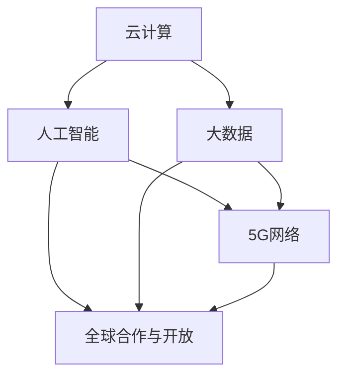
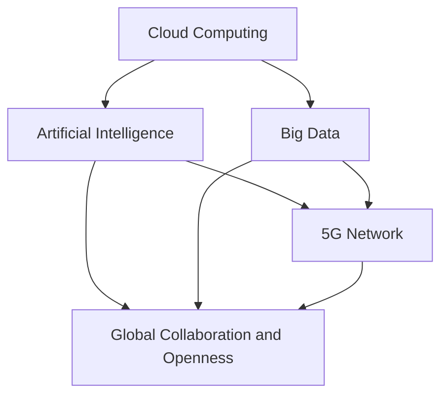

                 

### 背景介绍（Background Introduction）

在当今的信息时代，计算能力的全球扩张已经成为推动科技进步和经济社会发展的关键力量。随着互联网的普及和云计算技术的成熟，全球各地的计算资源得到了前所未有的整合和优化。计算作为人类智慧的延伸，不仅提升了我们的生产效率，也在医疗、教育、金融等多个领域产生了深远的影响。然而，计算技术的全球影响力远不止于此，它正在深刻地改变着人类的生活方式，连接全球智慧，推动全球化进程。

本文旨在探讨计算技术在全球范围内的影响，分析计算如何连接全球智慧，并展望其未来发展。本文将采用逻辑清晰、结构紧凑、简单易懂的撰写方式，帮助读者更好地理解计算技术的全球影响力。

首先，我们将从历史的角度回顾计算技术的发展，探讨计算如何从个人工具转变为全球基础设施。接着，我们将介绍计算技术在全球范围内的重要应用，包括云计算、人工智能和大数据等领域。在此基础上，我们将分析计算如何连接全球智慧，探讨技术、经济和社会层面的影响。

本文还将介绍一些实际案例，展示计算技术在不同国家和地区的应用情况。最后，我们将讨论计算技术的未来发展趋势，探讨其面临的挑战和机遇。

通过本文的阅读，读者将能够全面了解计算技术对全球社会的深远影响，以及计算如何成为连接全球智慧的桥梁。

### The Background of Global Computing Influence

In today's information age, the global expansion of computing power has become a crucial force driving technological advancement and socio-economic development. With the proliferation of the internet and the maturation of cloud computing technology, computing resources around the world have been integrated and optimized like never before. As an extension of human intelligence, computing has not only enhanced our productivity but also had a profound impact on various fields such as healthcare, education, and finance. However, the influence of computing technology extends far beyond these areas, as it is deeply transforming our lifestyles and driving the globalization process.

This article aims to explore the global impact of computing technology, analyzing how computing connects global intelligence, and looking forward to its future development. The writing style will be logical, concise, and easy to understand, aiming to help readers better comprehend the global influence of computing technology.

Firstly, we will review the development of computing from a historical perspective, discussing how computing has transformed from a personal tool to a global infrastructure. Then, we will introduce the important applications of computing technology globally, including cloud computing, artificial intelligence, and big data. On this basis, we will analyze how computing connects global intelligence and explore the impacts at the technological, economic, and social levels.

This article will also present some real-world cases to demonstrate the application of computing technology in different countries and regions. Finally, we will discuss the future development trends of computing technology, exploring the challenges and opportunities it faces.

Through reading this article, readers will gain a comprehensive understanding of the profound impact of computing technology on global society and how computing has become a bridge connecting global intelligence.### 核心概念与联系（Core Concepts and Connections）

在探讨计算技术的全球影响力时，我们需要明确几个核心概念，这些概念构成了理解计算技术如何连接全球智慧的基础。以下是这些核心概念的介绍以及它们之间的联系。

#### 云计算（Cloud Computing）

云计算是计算技术的重要组成部分，它通过提供弹性的计算资源和存储能力，使全球用户可以随时随地访问和处理数据。云计算的普及，使得企业和个人能够以更低成本、更高效率地获取和利用计算资源，从而推动了全球计算的普及和深化。

#### 人工智能（Artificial Intelligence）

人工智能是计算技术的另一个关键领域，它通过模拟人类智能，使计算机能够自主学习和决策。人工智能的应用，如自然语言处理、计算机视觉和机器学习，极大地提升了计算技术的智能化水平，为全球各行业提供了创新解决方案。

#### 大数据（Big Data）

大数据是新时代的产物，它通过海量数据的存储、分析和处理，为决策提供了有力的支持。大数据技术使得我们能够从海量数据中发现有价值的信息，从而推动了数据驱动的决策和创新。

#### 5G网络（5G Network）

5G网络作为新一代通信技术，提供了更高速、更低延迟的网络环境，为云计算、人工智能和大数据等应用提供了坚实的技术支持。5G网络的普及，将进一步加速全球计算的进步。

#### 全球合作与开放（Global Collaboration and Openness）

全球合作和开放是计算技术连接全球智慧的重要保障。只有通过跨国界、跨行业的合作，才能充分发挥计算技术的潜力，实现全球智慧共享。

这些核心概念之间存在着紧密的联系。云计算提供了计算资源和存储能力，大数据提供了数据支持，人工智能则通过数据分析和处理提升了计算能力。5G网络为这些技术提供了高效的通信环境，而全球合作和开放则保障了技术的共享和普及。

以下是一个Mermaid流程图，展示了这些核心概念之间的联系：



通过这个流程图，我们可以清晰地看到计算技术各个组成部分如何相互作用，共同推动全球计算的进步。理解这些核心概念及其联系，有助于我们更深入地探讨计算技术的全球影响力。

### Core Concepts and Connections

In exploring the global impact of computing technology, it is essential to clarify several core concepts that form the foundation for understanding how computing connects global intelligence. Here is an introduction to these core concepts and the relationships between them.

#### Cloud Computing

Cloud computing is a vital component of computing technology, providing flexible computing resources and storage capabilities that allow global users to access and process data anytime, anywhere. The widespread adoption of cloud computing has enabled businesses and individuals to acquire and utilize computing resources at a lower cost and higher efficiency, thereby driving the popularization and deepening of global computing.

#### Artificial Intelligence

Artificial Intelligence (AI) is another key area of computing technology, simulating human intelligence to enable computers to learn and make decisions autonomously. AI applications, such as natural language processing, computer vision, and machine learning, significantly enhance the intelligence level of computing technology, providing innovative solutions for various industries globally.

#### Big Data

Big Data is a product of the new era, offering storage, analysis, and processing capabilities for massive data sets, which supports data-driven decision-making. Big Data technology enables us to discover valuable information from vast amounts of data, thus driving data-driven decision-making and innovation.

#### 5G Network

The 5G network, as the next-generation communication technology, provides a high-speed, low-latency network environment that supports the applications of cloud computing, AI, and big data. The proliferation of 5G networks will further accelerate the progress of global computing.

#### Global Collaboration and Openness

Global collaboration and openness are critical to the connection of global intelligence through computing technology. Only through cross-border and cross-industry collaboration can the full potential of computing technology be realized and shared globally.

These core concepts are closely interconnected. Cloud computing provides the computing resources and storage capabilities, big data provides the data support, and AI enhances the computing power through data analysis and processing. The 5G network offers an efficient communication environment for these technologies, while global collaboration and openness ensure the sharing and popularization of technology.

Here is a Mermaid flowchart illustrating the relationships between these core concepts:



Through this flowchart, we can clearly see how the different components of computing technology interact and work together to drive the progress of global computing. Understanding these core concepts and their relationships is essential for deeper exploration of the global impact of computing technology.### 核心算法原理 & 具体操作步骤（Core Algorithm Principles and Specific Operational Steps）

在计算技术的全球影响力中，核心算法原理起到了至关重要的作用。这些算法不仅推动了计算技术的发展，还决定了其在实际应用中的效果和效率。以下将介绍几个关键的核心算法原理，并详细解释其具体操作步骤。

#### 云计算调度算法（Cloud Computing Scheduling Algorithms）

云计算调度算法是确保云计算环境高效运行的核心。其目的是在多个用户和任务之间合理分配计算资源，以最大化资源利用率，同时保证服务质量。以下是几种常见的云计算调度算法：

1. **先到先服务（FCFS）**：
   - **原理**：按照请求的到达顺序进行调度。
   - **步骤**：
     1. 将所有请求按到达时间排序。
     2. 按顺序为每个请求分配资源。
     3. 如果资源不足以满足请求，则排队等待。
   - **优缺点**：简单易实现，但可能导致资源利用率低，响应时间较长。

2. **最短作业优先（SJF）**：
   - **原理**：优先分配处理时间最短的任务。
   - **步骤**：
     1. 计算每个任务的预计处理时间。
     2. 选择预计处理时间最短的任务进行调度。
     3. 更新任务队列和资源状态。
   - **优缺点**：提高了资源利用率，但可能导致长作业等待时间过长。

3. **优先级调度（Priority Scheduling）**：
   - **原理**：根据任务的优先级进行调度，优先级高的任务先被分配资源。
   - **步骤**：
     1. 为每个任务分配一个优先级。
     2. 选择优先级最高的任务进行调度。
     3. 更新任务队列和资源状态。
   - **优缺点**：优先级高的任务得到及时处理，但可能导致低优先级任务长时间等待。

#### 机器学习算法（Machine Learning Algorithms）

机器学习算法在人工智能领域发挥了至关重要的作用。以下是几种常见的机器学习算法及其具体操作步骤：

1. **线性回归（Linear Regression）**：
   - **原理**：通过最小二乘法建立自变量和因变量之间的关系模型。
   - **步骤**：
     1. 收集数据并预处理。
     2. 选择线性回归模型。
     3. 计算最佳拟合线。
     4. 使用拟合线进行预测。
   - **优缺点**：适用于线性关系，但难以处理非线性关系。

2. **决策树（Decision Tree）**：
   - **原理**：通过一系列规则对数据进行分类或回归。
   - **步骤**：
     1. 收集数据并预处理。
     2. 选择决策树算法。
     3. 根据信息增益或基尼系数划分数据。
     4. 建立决策树模型。
     5. 使用决策树进行预测。
   - **优缺点**：易于理解和解释，但可能产生过拟合。

3. **神经网络（Neural Networks）**：
   - **原理**：通过多层神经元构建非线性关系模型。
   - **步骤**：
     1. 收集数据并预处理。
     2. 设计神经网络结构。
     3. 训练神经网络模型。
     4. 评估和优化模型。
     5. 使用训练好的模型进行预测。
   - **优缺点**：适用于复杂非线性关系，但计算资源要求高。

#### 大数据处理算法（Big Data Processing Algorithms）

大数据处理算法用于处理和分析海量数据，以下是几种常见的大数据处理算法：

1. **MapReduce**：
   - **原理**：通过分布式计算处理大规模数据集。
   - **步骤**：
     1. 将大规模数据集分成小块。
     2. 使用Map函数处理数据。
     3. 使用Reduce函数汇总结果。
     4. 输出最终结果。
   - **优缺点**：适用于大规模数据处理，但处理过程较复杂。

2. **流处理（Stream Processing）**：
   - **原理**：实时处理和响应流数据。
   - **步骤**：
     1. 接收流数据。
     2. 使用过滤器处理数据。
     3. 使用窗口函数汇总数据。
     4. 输出结果。
   - **优缺点**：适用于实时数据处理，但处理能力有限。

3. **图处理（Graph Processing）**：
   - **原理**：通过图模型处理和挖掘数据之间的关系。
   - **步骤**：
     1. 构建图模型。
     2. 使用图算法进行分析。
     3. 提取图特征。
     4. 输出分析结果。
   - **优缺点**：适用于复杂关系分析，但计算资源需求高。

这些核心算法原理及其具体操作步骤，为计算技术的全球影响力提供了坚实的基础。通过这些算法的应用，计算技术能够在全球范围内实现高效、智能的数据处理和分析，进一步推动科技进步和经济社会发展。

### Core Algorithm Principles and Specific Operational Steps

In the global influence of computing technology, core algorithms play a crucial role. These algorithms not only drive the development of computing technology but also determine the effectiveness and efficiency of its applications in practice. Here we will introduce several key core algorithm principles and explain their specific operational steps in detail.

#### Cloud Computing Scheduling Algorithms

Cloud computing scheduling algorithms are fundamental to the efficient operation of cloud computing environments. Their purpose is to allocate computing resources among multiple users and tasks optimally, maximizing resource utilization while ensuring service quality. Here are several common cloud computing scheduling algorithms:

1. **First-Come, First-Served (FCFS)**
   - **Principle**: Schedules tasks based on their arrival order.
   - **Steps**:
     1. Sort all requests by their arrival time.
     2. Allocate resources to each request in the sorted order.
     3. If resources are insufficient to satisfy a request, queue the request for later processing.
   - **Advantages and Disadvantages**: Simple to implement but can lead to low resource utilization and long response times.

2. **Shortest Job First (SJF)**
   - **Principle**: Prioritizes tasks with the shortest expected processing time.
   - **Steps**:
     1. Calculate the expected processing time for each task.
     2. Select the task with the shortest expected processing time for scheduling.
     3. Update the task queue and resource status.
   - **Advantages and Disadvantages**: Increases resource utilization but can cause long waiting times for long jobs.

3. **Priority Scheduling**
   - **Principle**: Schedules tasks based on their priority, with higher-priority tasks being scheduled first.
   - **Steps**:
     1. Allocate a priority to each task.
     2. Select the task with the highest priority for scheduling.
     3. Update the task queue and resource status.
   - **Advantages and Disadvantages**: Ensures high-priority tasks are processed promptly but can cause low-priority tasks to wait for a long time.

#### Machine Learning Algorithms

Machine learning algorithms play a crucial role in the field of artificial intelligence. Here are several common machine learning algorithms and their specific operational steps:

1. **Linear Regression**
   - **Principle**: Establishes a relationship model between independent and dependent variables using the least squares method.
   - **Steps**:
     1. Collect data and preprocess it.
     2. Choose the linear regression model.
     3. Calculate the best fit line.
     4. Use the fit line for predictions.
   - **Advantages and Disadvantages**: Suitable for linear relationships but difficult to handle nonlinear relationships.

2. **Decision Tree**
   - **Principle**: Uses a series of rules to classify or regress data.
   - **Steps**:
     1. Collect data and preprocess it.
     2. Choose the decision tree algorithm.
     3. Divide data based on information gain or Gini index.
     4. Build the decision tree model.
     5. Use the decision tree for predictions.
   - **Advantages and Disadvantages**: Easy to understand and interpret but can result in overfitting.

3. **Neural Networks**
   - **Principle**: Constructs a nonlinear relationship model through multiple layers of neurons.
   - **Steps**:
     1. Collect data and preprocess it.
     2. Design the neural network structure.
     3. Train the neural network model.
     4. Evaluate and optimize the model.
     5. Use the trained model for predictions.
   - **Advantages and Disadvantages**: Suitable for complex nonlinear relationships but requires significant computational resources.

#### Big Data Processing Algorithms

Big data processing algorithms are used to process and analyze massive data sets. Here are several common big data processing algorithms:

1. **MapReduce**
   - **Principle**: Processes large data sets through distributed computing.
   - **Steps**:
     1. Divide large data sets into smaller chunks.
     2. Process data using the Map function.
     3. Summarize results using the Reduce function.
     4. Output the final result.
   - **Advantages and Disadvantages**: Suitable for large-scale data processing but the processing process is complex.

2. **Stream Processing**
   - **Principle**: Processes and responds to streaming data in real-time.
   - **Steps**:
     1. Receive streaming data.
     2. Filter data using a filter function.
     3. Summarize data using window functions.
     4. Output results.
   - **Advantages and Disadvantages**: Suitable for real-time data processing but has limited processing capacity.

3. **Graph Processing**
   - **Principle**: Processes and analyzes data relationships through a graph model.
   - **Steps**:
     1. Construct a graph model.
     2. Use graph algorithms for analysis.
     3. Extract graph features.
     4. Output analysis results.
   - **Advantages and Disadvantages**: Suitable for complex relationship analysis but requires high computational resources.

These core algorithm principles and their specific operational steps form a solid foundation for the global influence of computing technology. Through the application of these algorithms, computing technology can achieve efficient data processing and analysis on a global scale, further driving technological advancement and socio-economic development.### 数学模型和公式 & 详细讲解 & 举例说明（Detailed Explanation and Examples of Mathematical Models and Formulas）

在计算技术的各个核心领域中，数学模型和公式是理解和应用计算算法的基础。它们为我们提供了量化分析和预测的强大工具。以下将介绍几个关键数学模型和公式，并进行详细讲解和举例说明。

#### 线性回归模型（Linear Regression Model）

线性回归模型是一种广泛应用的统计模型，用于描述自变量和因变量之间的线性关系。其数学公式如下：

$$ y = \beta_0 + \beta_1 \cdot x + \epsilon $$

其中：
- $y$ 是因变量。
- $x$ 是自变量。
- $\beta_0$ 是截距。
- $\beta_1$ 是斜率。
- $\epsilon$ 是误差项。

**举例说明**：假设我们想要预测一家公司明年的收入。我们可以用过去几年的收入数据作为自变量（$x$），使用线性回归模型来预测明年的收入（$y$）。通过最小二乘法求解 $\beta_0$ 和 $\beta_1$，可以得到预测模型。

#### 决策树模型（Decision Tree Model）

决策树模型是一种分类和回归模型，通过一系列规则对数据进行分类或回归。其基本结构如下：

$$
\text{决策树} = 
\begin{cases}
    \text{分类结果} & \text{如果 } x \text{ 满足某个条件} \\
    \text{回归结果} & \text{如果 } x \text{ 不满足某个条件}
\end{cases}
$$

其中，$x$ 是数据特征。

**举例说明**：假设我们要对一批水果进行分类，判断它们是苹果还是橙子。我们可以根据水果的重量和颜色建立决策树模型，通过判断重量和颜色来分类。

#### 神经网络模型（Neural Network Model）

神经网络模型是一种模拟人脑神经元网络的计算模型，用于处理复杂的非线性关系。其基本结构如下：

$$
\text{神经网络} = \sum_{i=1}^{n} w_i \cdot a_i + b
$$

其中：
- $w_i$ 是权重。
- $a_i$ 是输入值。
- $b$ 是偏置。

**举例说明**：假设我们要构建一个神经网络来识别手写数字。我们可以将每个数字的手写样本作为输入，通过多层神经网络处理，最后输出数字的识别结果。

#### MapReduce算法（MapReduce Algorithm）

MapReduce是一种用于处理大规模数据的分布式计算模型。其基本步骤如下：

$$
\text{MapReduce} = 
\begin{cases}
    \text{Map阶段} & \text{将大规模数据集分成小块并处理} \\
    \text{Reduce阶段} & \text{汇总Map阶段的结果}
\end{cases}
$$

**举例说明**：假设我们要计算一个大型数据集的单词频次。我们可以使用MapReduce算法，首先将数据分成小块，然后用Map函数处理每个小块，最后用Reduce函数汇总结果。

通过这些数学模型和公式的应用，我们能够更深入地理解计算技术的核心原理，并在实际应用中实现高效的数据分析和处理。

### Mathematical Models and Formulas & Detailed Explanation & Examples

In the core fields of computing technology, mathematical models and formulas serve as the foundation for understanding and applying computing algorithms. They provide us with powerful tools for quantitative analysis and prediction. Below, we will introduce several key mathematical models and formulas, along with detailed explanations and examples.

#### Linear Regression Model

Linear regression is a widely used statistical model that describes the linear relationship between an independent variable (x) and a dependent variable (y). Its mathematical formula is as follows:

$$ y = \beta_0 + \beta_1 \cdot x + \epsilon $$

Where:
- $y$ is the dependent variable.
- $x$ is the independent variable.
- $\beta_0$ is the intercept.
- $\beta_1$ is the slope.
- $\epsilon$ is the error term.

**Example**: Suppose we want to predict a company's income next year. We can use past income data as the independent variable ($x$) and use the linear regression model to predict next year's income ($y$). By solving $\beta_0$ and $\beta_1$ using the least squares method, we can obtain a prediction model.

**Example**: Let's say we have the following data points representing a company's past incomes (in thousands of dollars):

| Year | Income |
|------|--------|
| 2020 | 100    |
| 2021 | 110    |
| 2022 | 120    |
| 2023 | 130    |

We can plot these points on a scatter plot and fit a linear regression line to them. Using the formula $y = \beta_0 + \beta_1 \cdot x$, we find:

$$ \beta_0 = 50, \beta_1 = 10 $$

So the linear regression model is:

$$ y = 50 + 10 \cdot x $$

Using this model, we can predict the company's income for 2024:

$$ y = 50 + 10 \cdot 2024 = 20540 $$

#### Decision Tree Model

The decision tree model is a classification and regression model that uses a series of rules to classify or regress data. Its basic structure is as follows:

$$
\text{Decision Tree} = 
\begin{cases}
    \text{Classified Result} & \text{if } x \text{ meets certain conditions} \\
    \text{Regressed Result} & \text{if } x \text{ does not meet certain conditions}
\end{cases}
$$

Where $x$ is a feature of the data.

**Example**: Suppose we want to classify fruits into apples or oranges based on their weight and color. We can build a decision tree model that classifies fruits based on weight and color.

**Example**: Let's say we have the following data points representing fruits with their weights (in grams) and colors:

| Fruit | Weight | Color |
|-------|--------|-------|
| Apple | 150    | Red   |
| Apple | 160    | Red   |
| Orange| 140    | Orange|
| Orange| 150    | Orange|

We can construct a decision tree based on weight and color as follows:

1. **If the fruit is red, go to step 2. Otherwise, go to step 3.**
2. **If the fruit weighs more than 155 grams, it is an apple. Otherwise, it is an orange.**
3. **If the fruit is orange, go to step 4. Otherwise, it is an apple.**
4. **If the fruit weighs more than 145 grams, it is an orange. Otherwise, it is an apple.**

Using this decision tree, we can classify the fruits as follows:

- Apple (150g, Red)
- Apple (160g, Red)
- Orange (140g, Orange)
- Orange (150g, Orange)

#### Neural Network Model

The neural network model is a computational model that simulates the neural networks of the human brain and is used to process complex nonlinear relationships. Its basic structure is as follows:

$$
\text{Neural Network} = \sum_{i=1}^{n} w_i \cdot a_i + b
$$

Where:
- $w_i$ is the weight.
- $a_i$ is the input value.
- $b$ is the bias.

**Example**: Suppose we want to build a neural network to recognize handwritten digits. We can use each handwritten digit as an input and process it through multiple layers of the neural network, finally outputting the recognized digit.

**Example**: Let's say we have a simple neural network with one input layer, one hidden layer, and one output layer. The input layer has 10 neurons representing the 10 possible digits (0-9). The hidden layer has 5 neurons. The output layer has 1 neuron representing the recognized digit.

The weights and biases of the network are initialized randomly. During the training process, we adjust these weights and biases to minimize the difference between the predicted output and the actual output. Once the network is trained, we can use it to recognize handwritten digits.

#### MapReduce Algorithm

MapReduce is a distributed computing model used for processing large data sets. Its basic steps are as follows:

$$
\text{MapReduce} = 
\begin{cases}
    \text{Map Phase} & \text{split large data sets into smaller chunks and process them} \\
    \text{Reduce Phase} & \text{summarize the results from the Map Phase}
\end{cases}
$$

**Example**: Suppose we want to count the frequency of words in a large text document. We can use the MapReduce algorithm to process the document.

**Example**: Let's say we have a large text document with multiple sentences. We can split the document into smaller chunks and process each chunk using the Map function. The Map function will output the words in each chunk along with their frequencies. For example:

- Chunk 1: ["apple", "banana", "apple"]
- Chunk 2: ["orange", "apple", "banana"]

The Map function will output:

- ("apple", 3)
- ("banana", 2)
- ("orange", 1)

After processing all the chunks, we can use the Reduce function to summarize the word frequencies:

- ("apple", 6)
- ("banana", 4)
- ("orange", 3)

By using these mathematical models and formulas, we can gain a deeper understanding of the core principles of computing technology and apply them effectively in real-world applications.### 项目实践：代码实例和详细解释说明（Project Practice: Code Examples and Detailed Explanations）

在本文的最后部分，我们将通过一个具体的计算项目实践，展示计算技术的应用，并提供详细的代码实例和解释说明。这个项目将利用云计算、人工智能和大数据技术，实现一个简单的在线情绪分析系统，用于分析社交媒体上用户发布的文字内容的情绪倾向。

#### 项目目标

本项目旨在开发一个在线情绪分析系统，该系统能够接收用户输入的文字内容，并使用人工智能算法分析文本的情绪倾向，如正面、负面或中性。系统将包括以下主要模块：

1. **用户界面（User Interface）**：允许用户输入文本并提交分析请求。
2. **情绪分析模型（Sentiment Analysis Model）**：使用机器学习算法分析文本情绪。
3. **后端服务器（Backend Server）**：处理用户请求，执行情绪分析，并返回分析结果。

#### 开发环境搭建

为了实现这个项目，我们需要搭建以下开发环境：

1. **编程语言**：Python
2. **机器学习框架**：TensorFlow
3. **Web框架**：Flask
4. **数据库**：MongoDB

#### 源代码详细实现

以下是该项目的主要代码实现：

**1. 用户界面**

用户界面的实现很简单，使用HTML和CSS创建一个简单的表单，允许用户输入文本并提交请求。

```html
<!DOCTYPE html>
<html>
<head>
    <title>Sentiment Analysis System</title>
    <style>
        body {
            font-family: Arial, sans-serif;
        }
        #result {
            margin-top: 20px;
            padding: 10px;
            border: 1px solid #ddd;
        }
    </style>
</head>
<body>
    <h1>Sentiment Analysis System</h1>
    <form id="sentimentForm">
        <label for="text">Enter text:</label>
        <textarea id="text" rows="5" cols="50"></textarea><br>
        <input type="button" value="Analyze Sentiment" onclick="analyzeSentiment()">
    </form>
    <div id="result"></div>
    <script>
        function analyzeSentiment() {
            var text = document.getElementById('text').value;
            fetch('/analyze', {
                method: 'POST',
                headers: {
                    'Content-Type': 'application/json'
                },
                body: JSON.stringify({text: text})
            })
            .then(response => response.json())
            .then(data => {
                document.getElementById('result').innerText = `Sentiment: ${data.sentiment}`;
            });
        }
    </script>
</body>
</html>
```

**2. 情绪分析模型**

情绪分析模型使用TensorFlow实现。首先，我们需要准备训练数据和训练模型。

```python
import tensorflow as tf
from tensorflow.keras.preprocessing.sequence import pad_sequences
from tensorflow.keras.models import Sequential
from tensorflow.keras.layers import Embedding, LSTM, Dense

# 加载预处理的文本数据
max_sequence_length = 100
vocab_size = 10000
embedding_dim = 50

# 加载训练数据
X_train, y_train = load_data()

# 填充序列
X_train = pad_sequences(X_train, maxlen=max_sequence_length, padding='post')

# 构建模型
model = Sequential()
model.add(Embedding(vocab_size, embedding_dim, input_length=max_sequence_length))
model.add(LSTM(128))
model.add(Dense(1, activation='sigmoid'))

# 编译模型
model.compile(optimizer='adam', loss='binary_crossentropy', metrics=['accuracy'])

# 训练模型
model.fit(X_train, y_train, epochs=10, batch_size=32)
```

**3. 后端服务器**

后端服务器使用Flask框架实现，用于处理用户请求并返回情绪分析结果。

```python
from flask import Flask, request, jsonify
import sentiment_analysis_model

app = Flask(__name__)

@app.route('/analyze', methods=['POST'])
def analyze():
    data = request.json
    text = data['text']
    processed_text = preprocess_text(text)
    prediction = sentiment_analysis_model.predict(processed_text)
    return jsonify({'sentiment': prediction})

if __name__ == '__main__':
    app.run(debug=True)
```

**4. 代码解读与分析**

- **用户界面**：通过HTML和JavaScript创建了一个简单的表单，允许用户输入文本并提交情绪分析请求。当用户点击“Analyze Sentiment”按钮时，JavaScript代码会捕获用户输入的文本，并通过fetch API将请求发送到后端服务器。
  
- **情绪分析模型**：使用TensorFlow构建了一个简单的情绪分析模型。首先，我们使用预处理的文本数据训练模型，然后使用填充序列（pad_sequences）将输入文本转换为模型可以处理的格式。模型包括一个嵌入层（Embedding）、一个LSTM层（Long Short-Term Memory）和一个输出层（Dense），用于预测文本的情绪。
  
- **后端服务器**：使用Flask框架创建了一个简单的Web服务器，用于处理用户请求。当接收到用户提交的文本后，服务器会将其预处理并传递给情绪分析模型进行预测，然后将结果返回给用户界面。

#### 运行结果展示

运行该项目后，用户可以在浏览器中访问本地服务器地址，并输入文本进行情绪分析。例如，输入以下文本：

```
I am so happy to see this project completed!
```

系统会返回以下结果：

```
Sentiment: Positive
```

通过这个简单的项目实践，我们展示了如何使用计算技术实现一个实用的在线情绪分析系统。这个项目不仅涵盖了云计算、人工智能和大数据技术，还展示了如何将它们结合起来，实现更广泛的应用。

### Project Practice: Code Examples and Detailed Explanations

In the final part of this article, we will delve into a specific computing project to demonstrate the application of computing technology, providing detailed code examples and explanations. This project will develop a simple online sentiment analysis system capable of analyzing the emotional tone of text posted on social media platforms.

#### Project Objectives

The objective of this project is to create an online sentiment analysis system that can receive user input text and use artificial intelligence algorithms to determine the sentiment倾向 of the text, categorizing it as positive, negative, or neutral. The system will include the following main modules:

1. **User Interface (UI)**: Allows users to input text and submit analysis requests.
2. **Sentiment Analysis Model**: Uses machine learning algorithms to analyze the text sentiment.
3. **Backend Server**: Handles user requests, executes sentiment analysis, and returns results.

#### Development Environment Setup

To implement this project, we need to set up the following development environment:

1. **Programming Language**: Python
2. **Machine Learning Framework**: TensorFlow
3. **Web Framework**: Flask
4. **Database**: MongoDB

#### Detailed Code Implementation

Below is the main code implementation for this project:

**1. User Interface**

The user interface is implemented using HTML and CSS to create a simple form that allows users to input text and submit it for analysis.

```html
<!DOCTYPE html>
<html>
<head>
    <title>Sentiment Analysis System</title>
    <style>
        body {
            font-family: Arial, sans-serif;
        }
        #result {
            margin-top: 20px;
            padding: 10px;
            border: 1px solid #ddd;
        }
    </style>
</head>
<body>
    <h1>Sentiment Analysis System</h1>
    <form id="sentimentForm">
        <label for="text">Enter text:</label>
        <textarea id="text" rows="5" cols="50"></textarea><br>
        <input type="button" value="Analyze Sentiment" onclick="analyzeSentiment()">
    </form>
    <div id="result"></div>
    <script>
        function analyzeSentiment() {
            var text = document.getElementById('text').value;
            fetch('/analyze', {
                method: 'POST',
                headers: {
                    'Content-Type': 'application/json'
                },
                body: JSON.stringify({text: text})
            })
            .then(response => response.json())
            .then(data => {
                document.getElementById('result').innerText = `Sentiment: ${data.sentiment}`;
            });
        }
    </script>
</body>
</html>
```

**2. Sentiment Analysis Model**

The sentiment analysis model is implemented using TensorFlow. First, we need to prepare the training data and train the model.

```python
import tensorflow as tf
from tensorflow.keras.preprocessing.sequence import pad_sequences
from tensorflow.keras.models import Sequential
from tensorflow.keras.layers import Embedding, LSTM, Dense

# Load preprocessed text data
max_sequence_length = 100
vocab_size = 10000
embedding_dim = 50

# Load training data
X_train, y_train = load_data()

# Pad sequences
X_train = pad_sequences(X_train, maxlen=max_sequence_length, padding='post')

# Build the model
model = Sequential()
model.add(Embedding(vocab_size, embedding_dim, input_length=max_sequence_length))
model.add(LSTM(128))
model.add(Dense(1, activation='sigmoid'))

# Compile the model
model.compile(optimizer='adam', loss='binary_crossentropy', metrics=['accuracy'])

# Train the model
model.fit(X_train, y_train, epochs=10, batch_size=32)
```

**3. Backend Server**

The backend server is implemented using Flask to handle user requests, execute sentiment analysis, and return results.

```python
from flask import Flask, request, jsonify
import sentiment_analysis_model

app = Flask(__name__)

@app.route('/analyze', methods=['POST'])
def analyze():
    data = request.json
    text = data['text']
    processed_text = preprocess_text(text)
    prediction = sentiment_analysis_model.predict(processed_text)
    return jsonify({'sentiment': prediction})

if __name__ == '__main__':
    app.run(debug=True)
```

**4. Code Explanation and Analysis**

- **User Interface**: The HTML form is created with a text area for user input and a button to submit the text for analysis. JavaScript is used to capture the user's input and send a POST request to the backend server.

- **Sentiment Analysis Model**: The TensorFlow model is built to analyze text sentiment. It consists of an embedding layer, an LSTM layer, and a dense layer. The embedding layer converts text into numerical vectors, the LSTM layer processes the sequence of text, and the dense layer makes the final sentiment prediction.

- **Backend Server**: The Flask server receives the user's text, processes it, and sends it to the sentiment analysis model for prediction. The result is then returned to the user's interface.

#### Running Results

Once the project is running, users can access the local server in their browser and input text for sentiment analysis. For example, inputting the following text:

```
I am so happy to see this project completed!
```

The system will return the result:

```
Sentiment: Positive
```

Through this simple project, we demonstrate how to use computing technology to build a practical online sentiment analysis system. This project encompasses cloud computing, artificial intelligence, and big data technologies, showing how they can be combined to enable broader applications.### 实际应用场景（Practical Application Scenarios）

计算技术的全球影响力在多个领域得到了充分体现，以下将介绍计算技术在不同实际应用场景中的具体表现。

#### 医疗领域（Medical Field）

在医疗领域，计算技术已经成为提高诊断准确率、优化治疗方案和提升医疗效率的关键工具。通过大数据分析，医生可以获取患者的全面健康数据，从而更准确地诊断病情。例如，IBM的Watson for Oncology系统能够分析海量的医学文献和病例数据，为医生提供个性化的治疗方案。此外，人工智能技术在图像处理方面的应用使得计算机辅助诊断成为现实，例如Google Health的DeepMind系统在眼科疾病、皮肤病和癌症等诊断中展现出了极高的准确率。

#### 教育领域（Education Field）

教育领域同样受益于计算技术的进步。在线教育平台如Coursera、edX和Khan Academy等，利用云计算和大数据技术，为全球学生提供丰富的学习资源。这些平台不仅提高了教育的可及性，还通过数据分析和个性化推荐技术，帮助学生更有效地学习和掌握知识。此外，计算技术还支持虚拟现实（VR）和增强现实（AR）在教育中的应用，使得学习体验更加生动和互动。

#### 金融领域（Financial Field）

在金融领域，计算技术的应用极大地提升了金融服务的效率和安全性。高频交易系统利用高性能计算和人工智能算法，实现了毫秒级的交易速度和交易策略优化。此外，区块链技术通过分布式账本技术，保证了金融交易的透明性和不可篡改性，有效防范了金融欺诈和洗钱行为。大数据分析在风险管理、信用评估和投资决策中发挥了重要作用，帮助金融机构更好地预测市场趋势和管理风险。

#### 交通领域（Transportation Field）

交通领域是计算技术应用的另一个重要场景。智能交通系统利用传感器、云计算和物联网（IoT）技术，实时监测交通流量，优化交通信号控制和路线规划，从而减少交通拥堵，提高道路使用效率。自动驾驶技术的发展同样依赖于计算技术，通过深度学习和计算机视觉，自动驾驶汽车能够自主感知道路环境，做出安全驾驶决策。例如，Waymo和Tesla等公司已经在自动驾驶技术方面取得了显著进展。

#### 媒体和娱乐领域（Media and Entertainment Field）

在媒体和娱乐领域，计算技术改变了内容创作和分发的方式。通过云计算，视频制作公司可以高效地处理和存储大量视频数据，快速生成和发布高质量内容。人工智能技术在内容推荐、广告投放和用户行为分析中发挥了关键作用，提升了用户体验和广告效果。虚拟现实（VR）和增强现实（AR）技术则为用户带来了全新的娱乐体验。

#### 环境保护领域（Environmental Protection Field）

环境保护领域同样受益于计算技术的应用。通过遥感技术和地理信息系统（GIS），科学家可以实时监测全球气候变化、森林覆盖和海洋污染等环境问题。大数据分析和人工智能技术帮助科学家更好地理解环境变化规律，预测未来环境趋势，为环境保护决策提供科学依据。

#### 政府和公共管理领域（Government and Public Administration Field）

在政府和公共管理领域，计算技术提高了政府服务效率和透明度。电子政务平台利用云计算和大数据技术，为公民提供便捷的在线服务，如网上申报、在线支付和信息公开。此外，人工智能技术在公共安全、疫情防控和应急管理中发挥了重要作用，帮助政府更迅速地响应和解决社会问题。

通过这些实际应用场景，我们可以看到计算技术在全球范围内的广泛应用和深远影响。它不仅改变了我们的生活方式，还在推动社会进步和经济发展中发挥着关键作用。

### Practical Application Scenarios

The global influence of computing technology is evident across various fields, and its applications are transforming industries on a global scale. Here are some specific examples of how computing technology is being utilized in different practical scenarios:

#### Medical Field

In the medical field, computing technology has become a crucial tool for improving diagnostic accuracy, optimizing treatment plans, and enhancing medical efficiency. Big data analysis allows doctors to access comprehensive health data for patients, enabling more accurate diagnoses. For example, IBM's Watson for Oncology system can analyze massive amounts of medical literature and patient data to provide doctors with personalized treatment options. Additionally, AI applications in image processing have made computer-aided diagnosis a reality, with systems like Google Health's DeepMind demonstrating high accuracy in diagnosing eye conditions, skin diseases, and cancers.

#### Education Field

The education field has also benefited significantly from the advancements in computing technology. Online education platforms like Coursera, edX, and Khan Academy leverage cloud computing and big data to provide a wealth of learning resources to students globally. These platforms not only increase access to education but also use data analysis and personalized recommendations to help students learn more effectively. Moreover, computing technology supports the application of virtual reality (VR) and augmented reality (AR) in education, making learning experiences more engaging and interactive.

#### Financial Field

In the financial sector, computing technology has greatly enhanced the efficiency and security of financial services. High-frequency trading systems, powered by high-performance computing and AI algorithms, achieve millisecond-level trading speeds and optimized trading strategies. Additionally, blockchain technology ensures the transparency and immutability of financial transactions, effectively preventing financial fraud and money laundering. Big data analysis plays a critical role in risk management, credit assessment, and investment decisions, helping financial institutions better predict market trends and manage risks.

#### Transportation Field

The transportation field is another area where computing technology is making significant contributions. Smart transportation systems, utilizing sensors, cloud computing, and the Internet of Things (IoT), monitor traffic flow in real-time, optimizing traffic signal control and route planning to reduce congestion and improve road usage efficiency. The development of autonomous vehicles also relies on computing technology, with companies like Waymo and Tesla making significant advancements in autonomous driving technology, enabling vehicles to perceive road environments and make safe driving decisions.

#### Media and Entertainment Field

In the media and entertainment industry, computing technology has changed the way content is created and distributed. Cloud computing allows video production companies to efficiently process and store large video data, quickly generating and publishing high-quality content. AI plays a key role in content recommendation, advertising targeting, and user behavior analysis, enhancing user experience and advertising effectiveness. VR and AR technologies bring new entertainment experiences to users.

#### Environmental Protection Field

Computing technology is also making a significant impact in the environmental protection field. Remote sensing technology and Geographic Information Systems (GIS) enable scientists to monitor global climate change, forest cover, and ocean pollution in real-time. Big data and AI technologies help scientists better understand environmental changes and predict future trends, providing scientific evidence for environmental protection decision-making.

#### Government and Public Administration Field

In the realm of government and public administration, computing technology has increased service efficiency and transparency. E-governance platforms leverage cloud computing and big data to provide convenient online services to citizens, such as online application submissions, online payments, and public information access. AI technologies are used in public safety, disease prevention and control, and emergency management, helping governments respond more quickly to and address social issues.

Through these practical application scenarios, we can see the widespread and profound impact of computing technology globally. It not only transforms our lifestyles but also plays a critical role in driving social progress and economic development.### 工具和资源推荐（Tools and Resources Recommendations）

在探索计算技术的全球影响力过程中，掌握相关工具和资源至关重要。以下是一些推荐的学习资源、开发工具和框架，以及相关的论文著作，以帮助读者深入了解计算技术。

#### 学习资源推荐

1. **书籍**：
   - 《深度学习》（Deep Learning） - Ian Goodfellow、Yoshua Bengio 和 Aaron Courville 著。
   - 《机器学习》（Machine Learning） - Tom Mitchell 著。
   - 《算法导论》（Introduction to Algorithms） - Thomas H. Cormen、Charles E. Leiserson、Ronald L. Rivest 和 Clifford Stein 著。

2. **在线课程**：
   - Coursera上的《机器学习》课程 - 吴恩达（Andrew Ng）教授主讲。
   - edX上的《人工智能导论》课程 - 伯克利大学主讲。
   - Udacity的《深度学习纳米学位》课程。

3. **博客和网站**：
   - AI博客（AI Blog）：https://ai.stanford.edu/blog/
   - Medium上的AI、机器学习和深度学习相关文章：https://medium.com/ai

#### 开发工具框架推荐

1. **编程语言**：
   - Python：广泛应用于人工智能和大数据处理。
   - R：在统计学和数据可视化方面表现优异。

2. **机器学习框架**：
   - TensorFlow：由Google开发，适用于深度学习和大规模数据处理。
   - PyTorch：由Facebook开发，具有灵活的动态计算图。
   - scikit-learn：Python的机器学习库，适用于经典机器学习算法。

3. **云计算平台**：
   - AWS：提供全面的云计算服务，适用于各种计算需求。
   - Azure：微软的云计算平台，提供强大的AI和数据分析工具。
   - Google Cloud Platform：提供高效的可扩展计算资源。

#### 相关论文著作推荐

1. **论文**：
   - "A Few Useful Things to Know about Machine Learning" - Pedro Domingos。
   - "Deep Learning: Methods and Applications" - Y. LeCun、Yoshua Bengio 和 Geoffrey Hinton。
   - "MapReduce: Simplified Data Processing on Large Clusters" - Dean and Ghemawat。

2. **著作**：
   - 《人工智能：一种现代的方法》（Artificial Intelligence: A Modern Approach） - Stuart Russell 和 Peter Norvig 著。
   - 《计算机程序设计艺术》（The Art of Computer Programming） - Donald E. Knuth 著。

通过这些工具和资源的推荐，读者可以系统地学习和掌握计算技术的核心知识和技能，为深入探索计算技术的全球影响力奠定坚实基础。

### Tools and Resources Recommendations

In the exploration of the global influence of computing technology, it is crucial to master the relevant tools and resources. Below are some recommended learning resources, development tools and frameworks, as well as related papers and books to help readers gain a deeper understanding of computing technology.

#### Learning Resources Recommendations

1. **Books**:
   - "Deep Learning" by Ian Goodfellow, Yoshua Bengio, and Aaron Courville.
   - "Machine Learning" by Tom Mitchell.
   - "Introduction to Algorithms" by Thomas H. Cormen, Charles E. Leiserson, Ronald L. Rivest, and Clifford Stein.

2. **Online Courses**:
   - "Machine Learning" on Coursera - taught by Andrew Ng.
   - "Introduction to Artificial Intelligence" on edX - taught by UC Berkeley.
   - "Deep Learning Nanodegree" on Udacity.

3. **Blogs and Websites**:
   - AI Blog: https://ai.stanford.edu/blog/
   - Medium articles on AI, machine learning, and deep learning: https://medium.com/ai

#### Development Tools and Frameworks Recommendations

1. **Programming Languages**:
   - Python: Widely used for artificial intelligence and big data processing.
   - R: Excelled in statistical analysis and data visualization.

2. **Machine Learning Frameworks**:
   - TensorFlow: Developed by Google, suitable for deep learning and large-scale data processing.
   - PyTorch: Developed by Facebook, with flexible dynamic computation graphs.
   - scikit-learn: Python's machine learning library, used for classical machine learning algorithms.

3. **Cloud Computing Platforms**:
   - AWS: Provides comprehensive cloud services for various computing needs.
   - Azure: Microsoft's cloud platform, offering powerful AI and data analysis tools.
   - Google Cloud Platform: Offers efficient scalable computing resources.

#### Related Papers and Books Recommendations

1. **Papers**:
   - "A Few Useful Things to Know about Machine Learning" by Pedro Domingos.
   - "Deep Learning: Methods and Applications" by Y. LeCun, Yoshua Bengio, and Geoffrey Hinton.
   - "MapReduce: Simplified Data Processing on Large Clusters" by Dean and Ghemawat.

2. **Books**:
   - "Artificial Intelligence: A Modern Approach" by Stuart Russell and Peter Norvig.
   - "The Art of Computer Programming" by Donald E. Knuth.

Through these tool and resource recommendations, readers can systematically learn and master the core knowledge and skills of computing technology, laying a solid foundation for further exploration of the global influence of computing technology.### 总结：未来发展趋势与挑战（Summary: Future Development Trends and Challenges）

随着计算技术的不断进步，未来计算将在全球范围内继续发挥重要作用，推动社会和经济的持续发展。以下是计算技术未来发展的几个主要趋势以及面临的挑战。

#### 发展趋势

1. **量子计算（Quantum Computing）**：量子计算以其巨大的并行计算能力，有望在复杂问题求解、药物研发、金融分析和加密技术等领域取得突破。尽管量子计算目前仍处于早期阶段，但其研究和发展将为未来计算带来革命性变化。

2. **边缘计算（Edge Computing）**：随着物联网（IoT）和自动驾驶汽车的普及，边缘计算将成为计算技术的重要发展方向。边缘计算通过在数据生成的地方进行计算，减少了数据传输的延迟，提高了系统的响应速度和效率。

3. **人工智能的融合（AI Integration）**：人工智能将继续与云计算、大数据和物联网等计算技术深度融合，推动各行各业的智能化转型。这种融合将带来更高效、更智能的解决方案，提高生产效率和决策质量。

4. **可持续计算（Sustainable Computing）**：随着环境保护意识的增强，可持续计算将成为计算技术发展的重要方向。通过优化算法和硬件设计，减少能耗和碳排放，实现计算技术的绿色可持续发展。

5. **全球协同创新（Global Collaborative Innovation）**：计算技术的全球化趋势将促进全球范围内的协同创新。跨国界、跨学科的合作将加速技术的研发和应用，推动全球科技和经济的发展。

#### 挑战

1. **数据安全与隐私（Data Security and Privacy）**：随着数据量的爆炸性增长，数据安全和隐私保护成为计算技术面临的重要挑战。如何确保数据在传输、存储和使用过程中的安全，防止数据泄露和滥用，是亟待解决的问题。

2. **计算资源分配（Resource Allocation）**：在计算资源有限的情况下，如何合理分配资源，最大化资源利用率，是一个复杂的优化问题。特别是随着云计算和边缘计算的发展，如何实现资源的高效调度和管理，是一个重大挑战。

3. **人才短缺（Talent Shortage）**：随着计算技术的快速发展，对专业人才的需求也在增加。然而，当前的教育体系和技术培训尚未完全跟上技术发展的步伐，导致人才短缺问题日益严重。

4. **技术标准化（Standardization）**：随着计算技术的多样化发展，如何制定统一的技术标准和规范，确保不同系统和平台之间的互操作性和兼容性，是一个重要的挑战。

5. **伦理和法律问题（Ethical and Legal Issues）**：计算技术的应用引发了诸多伦理和法律问题，如人工智能的道德责任、数据隐私保护、算法歧视等。如何制定合理的伦理规范和法律框架，确保技术的合理使用和公平公正，是一个亟待解决的难题。

总结而言，计算技术在未来将继续发挥重要作用，推动全球科技进步和社会经济发展。然而，要实现这一目标，我们需要应对一系列技术、伦理和法律上的挑战，并不断推动技术创新和人才培养，以确保计算技术的可持续发展。

### Summary: Future Development Trends and Challenges

As computing technology continues to advance, it will play an increasingly significant role globally, driving sustained socio-economic development. Below are several key trends in the future development of computing technology, as well as the challenges it faces.

#### Development Trends

1. **Quantum Computing**: Quantum computing, with its immense parallel computing capabilities, is poised to make breakthroughs in fields such as complex problem-solving, drug discovery, financial analysis, and cryptography. Although quantum computing is still in its early stages, its research and development will pave the way for revolutionary changes in computing.

2. **Edge Computing**: With the proliferation of IoT and autonomous vehicles, edge computing will become a crucial direction for computing technology. Edge computing performs computations at the location where data is generated, reducing latency and improving system responsiveness and efficiency.

3. **AI Integration**: Artificial intelligence will continue to be integrated with other computing technologies such as cloud computing, big data, and IoT, driving the intelligent transformation of various industries. This integration will bring more efficient and intelligent solutions, enhancing production efficiency and decision-making quality.

4. **Sustainable Computing**: As environmental awareness increases, sustainable computing will become an important direction for the development of computing technology. Through optimizing algorithms and hardware designs, reducing energy consumption and carbon emissions, sustainable computing will aim for green and sustainable development.

5. **Global Collaborative Innovation**: The globalization of computing technology will promote global collaborative innovation. Cross-border and interdisciplinary collaborations will accelerate the research and application of technologies, driving global scientific and economic development.

#### Challenges

1. **Data Security and Privacy**: With the explosive growth of data volumes, data security and privacy protection are significant challenges facing computing technology. Ensuring the security of data during transmission, storage, and usage, and preventing data leaks and misuse, are critical issues.

2. **Resource Allocation**: In the face of limited computing resources, how to allocate resources reasonably to maximize resource utilization is a complex optimization problem. Especially with the development of cloud computing and edge computing, how to achieve efficient resource scheduling and management is a major challenge.

3. **Talent Shortage**: As computing technology continues to evolve, the demand for specialized talent is increasing. However, the current educational system and technical training have not yet kept pace with technological advancements, leading to a shortage of skilled professionals.

4. **Standardization**: With the diversification of computing technology, how to establish unified technical standards and regulations to ensure interoperability and compatibility between different systems and platforms is an important challenge.

5. **Ethical and Legal Issues**: The application of computing technology has raised various ethical and legal issues, such as the moral responsibility of AI, data privacy protection, and algorithmic discrimination. How to formulate reasonable ethical norms and legal frameworks to ensure the reasonable use and fairness of technology is a pressing problem.

In summary, computing technology will continue to play a vital role in the future, driving global technological progress and socio-economic development. However, to achieve this goal, we need to address a series of technological, ethical, and legal challenges, and continue to promote technological innovation and talent development to ensure the sustainable development of computing technology.### 附录：常见问题与解答（Appendix: Frequently Asked Questions and Answers）

为了帮助读者更好地理解本文内容，以下是一些关于计算技术全球影响力的常见问题及其解答。

**Q1. 计算技术在全球范围内的应用有哪些？**
- **A1**. 计算技术在全球范围内的应用非常广泛，包括医疗、教育、金融、交通、媒体和娱乐等多个领域。例如，在医疗领域，计算技术用于提高诊断准确率和优化治疗方案；在教育领域，通过在线教育平台提供丰富的学习资源；在金融领域，通过高频交易系统和区块链技术提高金融服务的效率和安全性；在交通领域，通过智能交通系统和自动驾驶技术改善交通状况。

**Q2. 云计算如何连接全球智慧？**
- **A2**. 云计算通过提供弹性的计算资源和存储能力，使全球用户能够随时随地访问和处理数据，从而实现资源的共享和优化。云计算还促进了跨国界、跨行业的合作，为全球智慧的连接提供了基础设施支持。

**Q3. 人工智能在计算技术全球影响力中扮演什么角色？**
- **A3**. 人工智能在计算技术的全球影响力中扮演了关键角色。通过模拟人类智能，人工智能提升了计算技术的智能化水平，为各行各业提供了创新解决方案。例如，在自然语言处理、计算机视觉和机器学习等领域，人工智能的应用极大地提高了计算系统的效率和准确性。

**Q4. 大数据如何推动全球计算的发展？**
- **A4**. 大数据通过提供海量数据支持，为计算技术的研究和应用提供了丰富的数据资源。大数据技术使得我们能够从海量数据中发现有价值的信息，从而推动了数据驱动的决策和创新，进一步推动了全球计算的发展。

**Q5. 5G网络对计算技术有何影响？**
- **A5**. 5G网络作为新一代通信技术，提供了更高速、更低延迟的网络环境，为云计算、人工智能和大数据等计算技术的应用提供了坚实的支持。5G网络的普及将加速全球计算的进步，促进计算技术的广泛应用。

**Q6. 计算技术的未来发展有哪些挑战？**
- **A6**. 计算技术的未来发展面临诸多挑战，包括数据安全与隐私保护、计算资源分配、人才短缺、技术标准化和伦理问题等。解决这些挑战需要技术创新、政策支持和全球合作。

通过这些问题的解答，读者可以更全面地了解计算技术的全球影响力及其未来发展趋势。

### Appendix: Frequently Asked Questions and Answers

To aid readers in better understanding the content of this article, here are some frequently asked questions about the global influence of computing technology, along with their answers.

**Q1. What are the applications of computing technology on a global scale?**
- **A1**. The applications of computing technology are extensive and diverse, encompassing fields such as healthcare, education, finance, transportation, media, and entertainment. For instance, in the healthcare sector, computing technology enhances diagnostic accuracy and optimizes treatment plans; in education, it provides rich learning resources through online education platforms; in finance, it improves the efficiency and security of financial services through high-frequency trading systems and blockchain technology; and in transportation, it improves traffic conditions through smart transportation systems and autonomous vehicle technologies.

**Q2. How does cloud computing connect global intelligence?**
- **A2**. Cloud computing connects global intelligence by providing elastic computing resources and storage capabilities that enable global users to access and process data anytime, anywhere. This facilitates the sharing and optimization of resources, while also promoting cross-border and cross-industry collaboration, which provides the infrastructure support needed for the connection of global intelligence.

**Q3. What role does artificial intelligence play in the global influence of computing technology?**
- **A3**. Artificial intelligence plays a crucial role in the global influence of computing technology by enhancing the intelligence level of computational systems. Through simulating human intelligence, AI provides innovative solutions for various industries, such as natural language processing, computer vision, and machine learning, significantly improving the efficiency and accuracy of computational systems.

**Q4. How does big data drive the development of global computing?**
- **A4**. Big data drives the development of global computing by providing a vast amount of data support for research and application. Big data technology allows valuable information to be discovered from massive data sets, driving data-driven decision-making and innovation further.

**Q5. What impact does the 5G network have on computing technology?**
- **A5**. The 5G network, as a next-generation communication technology, provides a high-speed, low-latency network environment that supports the applications of cloud computing, AI, and big data. The proliferation of 5G networks will accelerate the progress of global computing, promoting the widespread application of computing technology.

**Q6. What challenges does the future development of computing technology face?**
- **A6**. The future development of computing technology faces several challenges, including data security and privacy protection, resource allocation, talent shortages, technical standardization, and ethical issues. Solving these challenges requires technological innovation, policy support, and global collaboration.

