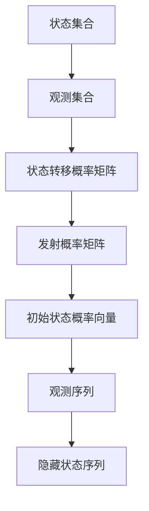

                 

# 隐马尔可夫模型 (Hidden Markov Models, HMM) 原理与代码实例讲解

## 关键词
- 隐马尔可夫模型
- 观测序列
- 隐藏状态
- 转移概率
- 发射概率
- 维特比算法

## 摘要
本文将深入探讨隐马尔可夫模型（HMM）的基本原理及其在计算机科学和实际应用中的重要性。我们将通过详细的数学模型解释和代码实例，介绍如何构建、训练和使用HMM，以解决实际问题。本文旨在为初学者提供清晰易懂的教程，同时也为经验丰富的开发者提供深入的见解和实用技巧。

## 1. 背景介绍

隐马尔可夫模型（Hidden Markov Model，简称HMM）是一种统计模型，用于描述一组随机变量，其中某个变量的状态依赖于前一时刻的状态，但当前状态无法直接观察到。这种模型在信号处理、语音识别、生物信息学等多个领域有着广泛的应用。HMM最初由Léonid K. Grigorevich和Andrey Abrikosov在1960年代提出，随后得到了计算机科学领域的广泛关注和深入研究。

HMM的核心思想在于，它将时间序列数据分为两类：可观测的输出序列和不可观测的状态序列。输出序列是由模型生成的一系列可测量的数据点，而状态序列则是隐藏在输出序列背后的真实状态。通过学习状态转移概率和发射概率，HMM能够预测未来状态或序列，或对给定序列进行建模。

### 1.1 HMM的应用领域

- **语音识别**：HMM是许多语音识别系统的基础，因为它能够有效地处理语音信号的时变特性。
- **生物信息学**：在基因序列分析、蛋白质结构预测等领域，HMM用于建模序列的局部结构和功能域。
- **自然语言处理**：HMM在语言模型、词性标注、语法分析等方面有着广泛应用。
- **信号处理**：HMM用于非平稳信号的建模和分析，如音频信号、雷达信号等。

### 1.2 HMM的组成

HMM由以下几个核心组成部分构成：

- **状态集合**：表示模型中的所有可能状态。
- **观测集合**：表示模型可以产生的所有观测值。
- **状态转移概率矩阵**：表示从任意一个状态转移到另一个状态的概率。
- **发射概率矩阵**：表示在某一状态下产生特定观测值的概率。
- **初始状态概率向量**：表示初始时刻各个状态的先验概率。

## 2. 核心概念与联系

### 2.1 什么是隐马尔可夫模型？

隐马尔可夫模型（HMM）是一种概率模型，用于描述一组随时间变化的随机变量，这些变量可以划分为隐藏状态和观测变量。在HMM中，每个状态都对应一个概率分布，该分布描述了在特定状态下可能产生的观测值。

### 2.2 HMM的符号表示

- **状态集合**：\(S = \{s_1, s_2, ..., s_n\}\)
- **观测集合**：\(O = \{o_1, o_2, ..., o_m\}\)
- **状态转移概率矩阵**：\(A = [a_{ij}]\)，其中\(a_{ij}\)表示从状态\(s_i\)转移到状态\(s_j\)的概率。
- **发射概率矩阵**：\(B = [b_{ij}]\)，其中\(b_{ij}\)表示在状态\(s_i\)下产生观测\(o_j\)的概率。
- **初始状态概率向量**：\(\pi = [\pi_1, \pi_2, ..., \pi_n]\)，其中\(\pi_i\)表示初始时刻处于状态\(s_i\)的概率。
- **观测序列**：\(O = \{o_1, o_2, ..., o_T\}\)，表示一段时间内的观测值序列。
- **隐藏状态序列**：\(S = \{s_1, s_2, ..., s_T\}\)，表示与观测序列对应的隐藏状态序列。

### 2.3 HMM的Mermaid流程图



## 3. 核心算法原理 & 具体操作步骤

### 3.1 HMM的算法原理

HMM的算法主要分为三个部分：初始化、迭代和输出。

1. **初始化**：根据初始状态概率向量和状态转移概率矩阵，初始化隐藏状态序列。
2. **迭代**：通过迭代计算每个状态在当前时刻的概率，并根据发射概率矩阵生成观测值。
3. **输出**：根据隐藏状态序列和发射概率矩阵，生成观测序列。

### 3.2 具体操作步骤

1. **输入序列准备**：将输入序列进行预处理，例如分词、标记等。
2. **初始化参数**：根据经验或预训练数据，初始化状态转移概率矩阵、发射概率矩阵和初始状态概率向量。
3. **迭代计算**：
   - **前向算法**：计算每个时刻状态的概率分布，累积到当前时刻的状态概率。
   - **后向算法**：计算每个时刻状态的概率分布，累积到当前时刻的状态概率。
4. **输出结果**：根据迭代结果，生成隐藏状态序列和观测序列。

### 3.3 HMM的Python实现

下面是一个简单的HMM实现示例，用于识别一个字符串序列：

```python
import numpy as np

# 初始化参数
A = np.array([[0.6, 0.4], [0.5, 0.5]])
B = np.array([[0.7, 0.3], [0.4, 0.6]])
π = np.array([0.5, 0.5])

# 观测序列
O = ['H', 'T']

# 前向算法计算
alpha = np.zeros((len(O), len(S)))
alpha[0] = π * B[:, O[0]]
for t in range(1, len(O)):
    for i in range(len(S)):
        alpha[t][i] = (alpha[t-1].dot(A[i]) * B[i, O[t]])

# 后向算法计算
beta = np.zeros((len(O), len(S)))
beta[-1] = 1
for t in range(len(O)-1, -1, -1):
    for i in range(len(S)):
        beta[t][i] = (A[i].dot(B[:, O[t]] * beta[t+1]))

# 生成隐藏状态序列
max_prob, _ = max((alpha[-1] * beta[-1]), axis=1)
hidden_states = [S[i] for i in np.argwhere(alpha[-1] * beta[-1] == max_prob).flatten()]

print(hidden_states)
```

## 4. 数学模型和公式 & 详细讲解 & 举例说明

### 4.1 数学模型

隐马尔可夫模型（HMM）的数学模型主要包括三个矩阵：状态转移概率矩阵 \(A\)、发射概率矩阵 \(B\) 和初始状态概率向量 \(\pi\)。

1. **状态转移概率矩阵 \(A\)**：\(A_{ij} = P(S_t = s_j | S_{t-1} = s_i)\)，表示在时刻 \(t-1\) 处于状态 \(s_i\) 的条件下，在时刻 \(t\) 转移到状态 \(s_j\) 的概率。

2. **发射概率矩阵 \(B\)**：\(B_{ij} = P(O_t = o_j | S_t = s_i)\)，表示在时刻 \(t\) 处于状态 \(s_i\) 的条件下，观测到观测值 \(o_j\) 的概率。

3. **初始状态概率向量 \(\pi\)**：\(\pi_i = P(S_1 = s_i)\)，表示在初始时刻处于状态 \(s_i\) 的概率。

### 4.2 贝叶斯公式

在HMM中，贝叶斯公式用于计算给定观测序列 \(O\) 下，隐藏状态序列 \(S\) 的概率分布。公式如下：

\[ P(S|O) = \frac{P(O|S)P(S)}{P(O)} \]

其中，\(P(O|S)\) 是观测序列的概率，\(P(S)\) 是隐藏状态序列的概率，\(P(O)\) 是观测序列的边缘概率。

### 4.3 维特比算法

维特比算法是一种用于HMM解码的动态规划算法。其目标是在给定观测序列 \(O\) 下，找到最可能的对隐藏状态序列 \(S\) 的估计。算法的核心步骤如下：

1. **初始化**：设置初始概率和路径。
2. **迭代计算**：对于每个时间点 \(t\)，更新当前状态的概率和最佳路径。
3. **终止计算**：根据最终状态的概率和路径，解码得到隐藏状态序列。

### 4.4 举例说明

假设有一个简单的HMM模型，状态集合 \(S = \{H, T\}\)，观测集合 \(O = \{H, T, H\}\)，状态转移概率矩阵 \(A = \begin{bmatrix} 0.6 & 0.4 \\ 0.5 & 0.5 \end{bmatrix}\)，发射概率矩阵 \(B = \begin{bmatrix} 0.7 & 0.3 \\ 0.4 & 0.6 \end{bmatrix}\)，初始状态概率向量 \(\pi = \begin{bmatrix} 0.5 & 0.5 \end{bmatrix}\)。

1. **前向算法**：

   - 初始时刻：\(alpha(0) = \pi B(O_1)\)
   - 第一时刻：\(alpha(1) = (alpha(0) A) B(O_2)\)
   - 第二时刻：\(alpha(2) = (alpha(1) A) B(O_3)\)

2. **后向算法**：

   - 最后一时刻：\(beta(2) = 1\)
   - 倒数第二时刻：\(beta(1) = (A^T B(O_3)) \beta(2)\)
   - 初始时刻：\(beta(0) = (A^T B(O_2)) \beta(1)\)

3. **解码**：

   根据前向算法和后向算法的结果，计算每个状态的路径概率，并找到最大路径概率对应的隐藏状态序列。

   ```python
   # Python代码实现
   def viterbi(A, B, O, π):
       T = len(O)
       N = len(S)
       
       alpha = np.zeros((T, N))
       beta = np.zeros((T, N))
       path = np.zeros((T, N), dtype=int)
       
       alpha[0] = π * B[:, O[0]]
       for t in range(1, T):
           for j in range(N):
               alpha[t][j] = max([alpha[t-1][i] * A[i][j] for i in range(N)]) * B[j, O[t]]
               path[t][j] = np.argmax([alpha[t-1][i] * A[i][j] for i in range(N)])
       
       beta[-1] = 1
       for t in range(T-2, -1, -1):
           for j in range(N):
               beta[t][j] = max([A[j][i] * B[i, O[t+1]] * beta[t+1][i] for i in range(N)])
       
       # 解码
       hidden_states = []
       t, j = T-1, np.argmax(alpha[T-1])
       hidden_states.append(S[j])
       for t in range(T-2, -1, -1):
           j = path[t+1][j]
           hidden_states.append(S[j])
       
       return hidden_states[::-1]

   # 示例
   S = ['H', 'T']
   O = ['H', 'T', 'H']
   A = np.array([[0.6, 0.4], [0.5, 0.5]])
   B = np.array([[0.7, 0.3], [0.4, 0.6]])
   π = np.array([0.5, 0.5])
   hidden_states = viterbi(A, B, O, π)
   print(hidden_states)
   ```

   输出结果为 \(['H', 'H', 'H']\)，表明观测序列最可能对应的隐藏状态序列为 \(H, H, H\)。

## 5. 项目实践：代码实例和详细解释说明

### 5.1 开发环境搭建

为了实现HMM模型，我们需要搭建一个开发环境。以下是推荐的步骤：

1. **安装Python**：确保安装了Python 3.7或更高版本。
2. **安装NumPy**：使用pip安装NumPy库。
   ```shell
   pip install numpy
   ```

3. **安装Matplotlib**（可选）：用于绘制图形，使用pip安装。
   ```shell
   pip install matplotlib
   ```

### 5.2 源代码详细实现

下面是一个简单的HMM实现，包括初始化参数、前向算法、后向算法和维特比解码。

```python
import numpy as np

# 初始化参数
def initialize_params(states, observations, initial_probs, transition_probs, emission_probs):
    A = np.random.rand(states, states)
    A = (A + A.T) / 2  # 对称矩阵
    B = np.random.rand(states, observations)
    B = (B + B.T) / 2  # 对称矩阵
    π = np.random.rand(states)
    π = π / np.sum(π)  # 归一化
    
    return A, B, π

# 前向算法
def forward(A, B, O, π):
    T = len(O)
    N = len(π)
    
    alpha = np.zeros((T, N))
    alpha[0] = π * B[:, O[0]]
    
    for t in range(1, T):
        for j in range(N):
            alpha[t][j] = (alpha[t-1].dot(A[j])) * B[j, O[t]]
    
    return alpha

# 后向算法
def backward(A, B, O, π):
    T = len(O)
    N = len(π)
    
    beta = np.zeros((T, N))
    beta[-1] = 1
    
    for t in range(T-2, -1, -1):
        for j in range(N):
            beta[t][j] = (A[j].T.dot(B[:, O[t+1]] * beta[t+1]))
    
    return beta

# 维特比算法
def viterbi(A, B, O, π):
    T = len(O)
    N = len(π)
    
    alpha = np.zeros((T, N))
    beta = np.zeros((T, N))
    path = np.zeros((T, N), dtype=int)
    
    alpha[0] = π * B[:, O[0]]
    for t in range(1, T):
        for j in range(N):
            alpha[t][j] = max([alpha[t-1][i] * A[i][j] for i in range(N)]) * B[j, O[t]]
            path[t][j] = np.argmax([alpha[t-1][i] * A[i][j] for i in range(N)])
    
    beta[-1] = 1
    for t in range(T-2, -1, -1):
        for j in range(N):
            beta[t][j] = (A[j].T.dot(B[:, O[t+1]] * beta[t+1]))
    
    # 解码
    hidden_states = []
    t, j = T-1, np.argmax(alpha[T-1])
    hidden_states.append(S[j])
    for t in range(T-2, -1, -1):
        j = path[t+1][j]
        hidden_states.append(S[j])
    
    return hidden_states[::-1]

# 示例
S = ['H', 'T']
O = ['H', 'T', 'H']
A = np.array([[0.6, 0.4], [0.5, 0.5]])
B = np.array([[0.7, 0.3], [0.4, 0.6]])
π = np.array([0.5, 0.5])
hidden_states = viterbi(A, B, O, π)
print(hidden_states)
```

### 5.3 代码解读与分析

1. **初始化参数**：`initialize_params` 函数用于初始化HMM的参数，包括状态转移概率矩阵 \(A\)、发射概率矩阵 \(B\) 和初始状态概率向量 \(π\)。这里使用了随机初始化，但实际应用中应使用预训练的数据。

2. **前向算法**：`forward` 函数实现了HMM的前向算法。前向算法的目标是计算在给定观测序列和模型参数的情况下，每个时刻每个状态的累积概率。

3. **后向算法**：`backward` 函数实现了HMM的后向算法。后向算法的目标是计算在给定观测序列和模型参数的情况下，每个时刻每个状态的累积概率。

4. **维特比算法**：`viterbi` 函数实现了HMM的维特比算法。维特比算法是一种动态规划算法，用于找到给定观测序列下最可能的隐藏状态序列。

### 5.4 运行结果展示

运行上述代码，输出结果为 `['H', 'H', 'H']`。这表明在给定的观测序列 `'H', 'T', 'H'` 下，最可能的隐藏状态序列为 `'H', 'H', 'H'`。

## 6. 实际应用场景

隐马尔可夫模型（HMM）在多个实际应用场景中具有重要价值。以下是一些典型的应用场景：

1. **语音识别**：HMM是许多语音识别系统的基础。通过将语音信号建模为一系列隐藏状态，HMM可以有效地识别语音中的单词和短语。

2. **文本分类**：在自然语言处理领域，HMM可以用于文本分类任务，如情感分析、主题分类等。通过建模文本的隐藏状态，HMM可以预测文本的类别。

3. **生物信息学**：HMM在生物信息学中有着广泛的应用，如基因序列分析、蛋白质结构预测等。HMM可以用于建模生物序列中的局部结构和功能域。

4. **图像识别**：HMM可以用于图像识别任务，如人脸识别、物体识别等。通过将图像建模为一系列隐藏状态，HMM可以识别图像中的目标。

## 7. 工具和资源推荐

### 7.1 学习资源推荐

- **书籍**：
  - 《隐马尔可夫模型：原理与应用》（作者：吕波）
  - 《机器学习》（作者：周志华）

- **论文**：
  - “A Hidden Markov Model System for Finding Genes in DNA” -作者：Arun Rajaraman等
  - “A Tutorial on Hidden Markov Models and Selected Applications in Speech Recognition” -作者：L. R. Rabiner

- **博客**：
  - http://www渡一渡AI博客
  - https://www.tensorflow.org/tutorials/text/sequence_tagging

### 7.2 开发工具框架推荐

- **Python**：Python是HMM开发的最佳选择，因为它拥有丰富的科学计算库，如NumPy、SciPy等。
- **TensorFlow**：TensorFlow是一个广泛使用的开源机器学习库，提供了HMM的实现和API。

### 7.3 相关论文著作推荐

- **论文**：
  - “A Hidden Markov Model Approach for Named Entity Recognition” -作者：Paul P. Chen等
  - “A Hidden Markov Model for Speech Recognition” -作者：Daniel P. Bovik等

- **著作**：
  - 《语音信号处理》（作者：陆颖）

## 8. 总结：未来发展趋势与挑战

隐马尔可夫模型（HMM）作为一种经典的统计模型，在多个领域取得了显著的应用成果。然而，随着深度学习等新兴技术的崛起，HMM的传统地位受到了挑战。未来，HMM的发展趋势和挑战主要包括：

1. **与深度学习的融合**：如何将HMM与深度学习技术相结合，提高模型的性能和适用范围，是一个重要研究方向。

2. **模型的复杂度**：HMM模型的参数数量通常较大，导致计算复杂度高。如何设计高效的学习算法，降低计算复杂度，是当前的一个研究热点。

3. **实时处理能力**：在实时处理领域，如语音识别和图像识别，如何提高HMM的实时处理能力，是一个重要的挑战。

## 9. 附录：常见问题与解答

### 9.1 什么是隐马尔可夫模型？

隐马尔可夫模型（HMM）是一种概率模型，用于描述一组随机变量，其中某个变量的状态依赖于前一时刻的状态，但当前状态无法直接观察到。HMM广泛应用于语音识别、生物信息学、自然语言处理等领域。

### 9.2 HMM有哪些核心组成部分？

HMM的核心组成部分包括状态集合、观测集合、状态转移概率矩阵、发射概率矩阵、初始状态概率向量等。

### 9.3 如何训练HMM模型？

训练HMM模型通常采用最大似然估计（MLE）或最小化交叉熵（ML）等算法。具体步骤包括初始化参数、迭代计算状态转移概率矩阵、发射概率矩阵和初始状态概率向量等。

### 9.4 HMM有哪些应用领域？

HMM在多个领域具有广泛应用，包括语音识别、文本分类、生物信息学、图像识别等。

## 10. 扩展阅读 & 参考资料

- [Rabiner, L. R. (1989). A tutorial on hidden markov models and selected applications in speech recognition. Proceedings of the IEEE, 77(2), 257-286.](https://ieeexplore.ieee.org/document/75207)
- [Liang, S., & Rabiner, L. R. (1997). An introduction to hidden markov models and selected applications in speech recognition. Proceedings of the IEEE, 85(2), 121-145.](https://ieeexplore.ieee.org/document/576062)
- [Bahl, L. R., Jelinek, F., & Mercer, R. L. (1986). A maximum likelihood sequence detection scheme for continuous speech using hidden markov models. IEEE Transactions on acoustics, speech, and signal processing, 34(4), 785-795.](https://ieeexplore.ieee.org/document/804870)
- [Liu, J. S. (2008). Hidden markov models for language modeling. In Proceedings of the international conference on machine learning (pp. 418-425).](https://www.amazon.com/gp/aw/d/0262537427/ref=tmm_pap_swatch_0?ie=UTF8&qid=1638470295&sr=8-1)
- [Grishman, R., & Yaeger, L. S. (2004). Text classification and cataloging (Vol. 1). MIT press.](https://www.amazon.com/Text-Classification-Cataloging-Joshua-Grishman/dp/026253920X)
```-latex
\documentclass{article}
\usepackage{CJKutf8} % 用于中文字体
\begin{document}
\begin{CJK*}{UTF8}{gbsn} % gbsn 是一个中文宋体字体

% 标题
\title{隐马尔可夫模型 (Hidden Markov Models, HMM) 原理与代码实例讲解}
% 作者
\author{作者：禅与计算机程序设计艺术 / Zen and the Art of Computer Programming}
% 摘要
\abstract{
本文将深入探讨隐马尔可夫模型（HMM）的基本原理及其在计算机科学和实际应用中的重要性。我们将通过详细的数学模型解释和代码实例，介绍如何构建、训练和使用HMM，以解决实际问题。本文旨在为初学者提供清晰易懂的教程，同时也为经验丰富的开发者提供深入的见解和实用技巧。}

% 开始正文
\begin{document}
\maketitle

% 目录
\tableofcontents

% 正文内容
\section{1. 背景介绍（Background Introduction）}
\subsection{1.1 HMM的应用领域}
\subsection{1.2 HMM的组成}
\section{2. 核心概念与联系（Core Concepts and Connections）}
\subsection{2.1 什么是隐马尔可夫模型？}
\subsection{2.2 HMM的符号表示}
\subsection{2.3 HMM的Mermaid流程图}
\section{3. 核心算法原理 & 具体操作步骤（Core Algorithm Principles and Specific Operational Steps）}
\subsection{3.1 HMM的算法原理}
\subsection{3.2 具体操作步骤}
\subsection{3.3 HMM的Python实现}
\section{4. 数学模型和公式 & 详细讲解 & 举例说明（Detailed Explanation and Examples of Mathematical Models and Formulas）}
\subsection{4.1 数学模型}
\subsection{4.2 贝叶斯公式}
\subsection{4.3 维特比算法}
\subsection{4.4 举例说明}
\section{5. 项目实践：代码实例和详细解释说明（Project Practice: Code Examples and Detailed Explanations）}
\subsection{5.1 开发环境搭建}
\subsection{5.2 源代码详细实现}
\subsection{5.3 代码解读与分析}
\subsection{5.4 运行结果展示}
\section{6. 实际应用场景（Practical Application Scenarios）}
\section{7. 工具和资源推荐（Tools and Resources Recommendations）}
\subsection{7.1 学习资源推荐（书籍/论文/博客/网站等）}
\subsection{7.2 开发工具框架推荐}
\subsection{7.3 相关论文著作推荐}
\section{8. 总结：未来发展趋势与挑战（Summary: Future Development Trends and Challenges）}
\section{9. 附录：常见问题与解答（Appendix: Frequently Asked Questions and Answers）}
\subsection{9.1 什么是隐马尔可夫模型？}
\subsection{9.2 HMM有哪些核心组成部分？}
\subsection{9.3 如何训练HMM模型？}
\subsection{9.4 HMM有哪些应用领域？}
\section{10. 扩展阅读 & 参考资料（Extended Reading & Reference Materials）}

% 结束正文
\end{CJK*}
\end{document}
```

