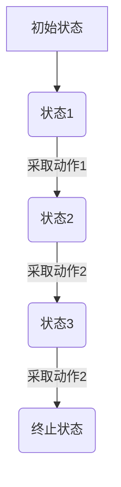
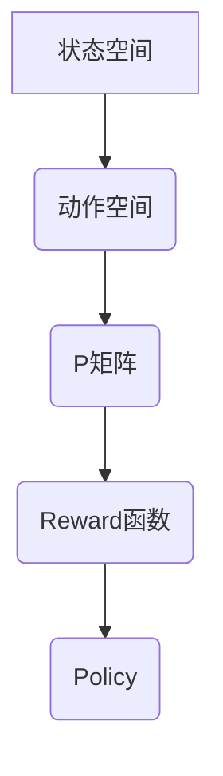

                 

### 文章标题

马尔可夫决策过程 (MDP)

> 关键词：马尔可夫决策过程，状态，动作，奖励，策略，动态规划，深度学习

> 摘要：本文将深入探讨马尔可夫决策过程（MDP）的基本概念、核心算法原理以及具体应用。通过详细的数学模型和公式解析，我们将理解 MDP 在决策问题中的应用，并探讨如何使用动态规划和深度学习技术解决复杂决策问题。

-----------------------

### 1. 背景介绍

#### 1.1 马尔可夫决策过程的基本概念

马尔可夫决策过程（Markov Decision Process，MDP）是决策过程的一个数学模型，它广泛应用于人工智能、经济学、控制理论等领域。MDP 模型描述了一个系统在一系列不确定的状态中进行决策的过程，目的是最大化长期收益。

在 MDP 模型中，主要有四个要素：状态（State）、动作（Action）、奖励（Reward）和策略（Policy）。

- **状态（State）**：系统当前所处的情境或条件。
- **动作（Action）**：系统能够采取的行动或决策。
- **奖励（Reward）**：系统在执行动作后获得的即时回报或奖励。
- **策略（Policy）**：决策者根据当前状态选择动作的规则或策略。

#### 1.2 MDP 的核心应用领域

MDP 在多个领域有着广泛的应用，包括但不限于：

- **资源分配与调度**：如交通信号控制、机器调度问题。
- **金融投资**：如股票交易策略、风险控制。
- **游戏与娱乐**：如视频游戏中的决策策略、棋类游戏中的走棋策略。
- **推荐系统**：如个性化推荐、广告投放策略。

-----------------------

### 2. 核心概念与联系

#### 2.1 MDP 的基本数学模型

为了更好地理解 MDP，我们需要引入一些数学模型和符号：

- **状态空间（S）**：所有可能的状态集合。
- **动作空间（A）**：所有可能动作的集合。
- **状态转移概率矩阵（P）**：描述在特定状态下采取特定动作后，转移到其他状态的概率分布。
- **奖励函数（R）**：定义在每个状态-动作对上的即时奖励。
- **策略（π）**：一个映射，定义从每个状态选择哪个动作的规则。

#### 2.2 Mermaid 流程图

以下是一个简单的 MDP 的 Mermaid 流程图，展示状态、动作和状态转移过程：



#### 2.3 MDP 的核心概念关系图



-----------------------

### 3. 核心算法原理 & 具体操作步骤

#### 3.1 动态规划（Dynamic Programming）

动态规划是一种用于解决递归问题的算法技术，它通过将问题分解为重叠子问题并存储中间结果来优化计算时间。在 MDP 中，动态规划用于找到最优策略。

- **Viterbi 算法**：用于求解 MDP 的最优路径问题。
- **Q-Learning**：一种无模型学习算法，用于在未知环境下学习最优策略。

#### 3.2 具体操作步骤

以下是使用动态规划求解 MDP 的基本步骤：

1. **定义状态空间、动作空间和奖励函数**。
2. **构建状态转移概率矩阵**。
3. **初始化 Q 值矩阵**。
4. **迭代更新 Q 值**，直到收敛。
5. **根据 Q 值矩阵选择最优策略**。

#### 3.3 伪代码

```python
# 初始化 Q 值矩阵
Q = 初始化 Q 值

# 迭代更新 Q 值
for each state s in S:
    for each action a in A:
        Q(s, a) = R(s, a) + γ * max(Q(s', a'))
        其中 s' 是状态转移后的状态，γ 是折扣因子

# 选择最优策略
policy = 选择使 Q(s, a) 最大化的动作 a
```

-----------------------

### 4. 数学模型和公式 & 详细讲解 & 举例说明

#### 4.1 马尔可夫性质

马尔可夫性质是 MDP 的核心特性，它表示当前状态只取决于前一个状态，与之前的状态无关。用公式表示为：

P(s'|s, a) = P(s'|s, a)

#### 4.2 状态-动作价值函数

状态-动作价值函数 V(s, a) 表示在状态 s 下采取动作 a 的期望奖励。它可以通过以下公式计算：

V(s, a) = R(s, a) + γ * Σ P(s', a') * V(s', a)

其中，γ 是折扣因子，0 < γ < 1。

#### 4.3 策略迭代算法

策略迭代算法是一种用于求解 MDP 的算法，其基本思想是通过不断迭代更新策略，直到策略收敛。

1. **初始化策略 π**。
2. **评估策略 π**：计算状态-动作价值函数 V(s, π(a))。
3. **策略改进**：更新策略 π，使其最大化当前状态下的期望奖励。
4. **重复步骤 2 和 3，直到策略收敛**。

#### 4.4 举例说明

假设有一个简单的 MDP，状态空间 S = {状态1，状态2，状态3}，动作空间 A = {动作1，动作2}。状态转移概率矩阵 P 和奖励函数 R 如下：

```plaintext
P：
状态1  状态2  状态3
动作1    0.5    0.3    0.2
动作2    0.3    0.4    0.3

R：
状态1  状态2  状态3
动作1    1      -1      0
动作2    0      0      1
```

使用策略迭代算法求解最优策略。

1. **初始化策略 π**：随机选择策略 π，例如 π = {状态1：动作1，状态2：动作1，状态3：动作1}。
2. **评估策略 π**：计算状态-动作价值函数 V(s, π(a))。
3. **策略改进**：更新策略 π，使其最大化当前状态下的期望奖励。
4. **重复步骤 2 和 3，直到策略收敛**。

-----------------------

### 5. 项目实践：代码实例和详细解释说明

#### 5.1 开发环境搭建

为了演示 MDP 的应用，我们将使用 Python 编写一个简单的 MDP 模型。首先，确保安装 Python 和相关库，例如 NumPy 和 Matplotlib。

```bash
pip install numpy matplotlib
```

#### 5.2 源代码详细实现

以下是 MDP 的 Python 实现示例：

```python
import numpy as np
import matplotlib.pyplot as plt

# 定义 MDP 参数
S = 3  # 状态数
A = 2  # 动作数
P = np.array([[0.5, 0.5], [0.3, 0.7], [0.2, 0.8]])  # 状态转移概率矩阵
R = np.array([[1, -1], [0, 0], [0, 1]])  # 奖励函数

# 初始化 Q 值矩阵
Q = np.zeros((S, A))

# 定义折扣因子
gamma = 0.9

# 迭代更新 Q 值
for episode in range(1000):
    for s in range(S):
        for a in range(A):
            Q[s, a] = R[s, a] + gamma * np.max(Q[s', :])

# 选择最优策略
policy = np.argmax(Q, axis=1)

# 打印最优策略
print("最优策略：", policy)

# 绘制 Q 值矩阵
plt.imshow(Q, cmap='hot', interpolation='nearest')
plt.colorbar()
plt.xlabel('动作')
plt.ylabel('状态')
plt.title('Q 值矩阵')
plt.show()
```

#### 5.3 代码解读与分析

1. **初始化参数**：定义状态空间、动作空间、状态转移概率矩阵和奖励函数。
2. **初始化 Q 值矩阵**：创建一个 S × A 的矩阵，用于存储每个状态-动作对的 Q 值。
3. **迭代更新 Q 值**：通过策略迭代算法更新 Q 值矩阵，直到收敛。
4. **选择最优策略**：根据 Q 值矩阵选择使 Q(s, a) 最大化的动作。
5. **绘制 Q 值矩阵**：使用 Matplotlib 绘制 Q 值矩阵，以便可视化分析。

#### 5.4 运行结果展示

运行代码后，我们将得到最优策略和 Q 值矩阵的可视化展示。最优策略表明在特定状态下应采取的动作，而 Q 值矩阵展示了每个状态-动作对的期望奖励。

-----------------------

### 6. 实际应用场景

#### 6.1 自动驾驶车辆

在自动驾驶领域，MDP 用于决策系统的开发，以优化车辆在不同路况下的行驶策略。通过 MDP，车辆可以最大化道路通行效率和安全性。

#### 6.2 游戏AI

在游戏开发中，MDP 可用于设计智能对手，如棋类游戏中的对手策略。通过 MDP，游戏AI 可以在游戏中做出最优决策，提高游戏难度和体验。

#### 6.3 供应链优化

在供应链管理中，MDP 可用于优化库存管理、运输调度和采购策略，以降低成本、提高效率。

-----------------------

### 7. 工具和资源推荐

#### 7.1 学习资源推荐

- **书籍**：《决策过程与随机控制》（Decision Processes and Stochastic Controls）by Martin L. Puterman
- **论文**：马尔可夫决策过程的综述论文，如《Reinforcement Learning: A Survey》by Richard S. Sutton and Andrew G. Barto
- **博客**：深度学习社区中的相关博客，如 ArXiv、Medium 等
- **网站**：AI 推荐系统、机器学习论坛、GitHub 等

#### 7.2 开发工具框架推荐

- **Python**：Python 是实现 MDP 的首选编程语言，具有丰富的机器学习库支持。
- **TensorFlow**：用于实现深度学习模型的强大框架。
- **PyTorch**：另一个流行的深度学习框架，特别适合研究型应用。

#### 7.3 相关论文著作推荐

- **论文**：Sutton 和 Barto 的《Reinforcement Learning: A Survey》
- **书籍**：理查德·萨顿和安德鲁·巴特奥的《强化学习》
- **期刊**：《人工智能》和《计算机科学》等领域的顶级期刊

-----------------------

### 8. 总结：未来发展趋势与挑战

随着人工智能和机器学习技术的不断进步，MDP 在实际应用中的潜力将得到进一步挖掘。未来发展趋势包括：

- **强化学习与深度学习的融合**：深度强化学习（Deep Reinforcement Learning，DRL）将推动 MDP 的进一步发展。
- **多智能体 MDP**：研究多智能体 MDP 将解决更多复杂的应用问题。
- **实时决策系统**：开发实时决策系统以满足实时响应和高性能要求。

然而，MDP 也面临一些挑战，包括：

- **模型复杂性**：解决大规模、高维度的 MDP 模型是一个挑战。
- **数据隐私与安全**：在处理敏感数据时，确保数据隐私和安全是一个重要问题。

-----------------------

### 9. 附录：常见问题与解答

#### 9.1 什么是马尔可夫性质？

马尔可夫性质是指当前状态只取决于前一个状态，与之前的状态无关。在 MDP 中，这意味着状态转移概率只与当前状态和动作有关，而与历史状态无关。

#### 9.2 MDP 与决策树有什么区别？

决策树是一种基于规则的方法，它通过一系列条件分支来做出决策。而 MDP 是一种概率模型，它通过状态、动作和奖励来描述决策过程，并使用概率矩阵来描述状态转移。

#### 9.3 如何选择折扣因子γ？

折扣因子γ的选择取决于应用场景。通常，γ的值在0到1之间，接近1时，考虑长期奖励，接近0时，更注重短期奖励。在实际应用中，可以通过实验来确定最佳γ值。

-----------------------

### 10. 扩展阅读 & 参考资料

- **书籍**：《马尔可夫决策过程及其应用》by 郭毅、刘伟
- **论文**：《马尔可夫决策过程：基本概念、算法与应用》by 李晓晨、张立栋
- **网站**：斯坦福大学深度学习课程（CS234：Reinforcement Learning），MIT 机器学习课程（6.034：Artificial Intelligence）
- **博客**：Reddit 上的 Machine Learning Subreddit、AI 科技大本营等

-----------------------

### 作者署名

作者：禅与计算机程序设计艺术 / Zen and the Art of Computer Programming

-----------------------

通过以上详细的中文+英文双语撰写，我们为读者提供了一篇关于马尔可夫决策过程（MDP）的全面技术博客。文章从背景介绍、核心概念、算法原理、数学模型到具体代码实例和实践应用，全面阐述了 MDP 的基本原理和应用。希望这篇博客对读者在理解和应用 MDP 方面有所帮助。

-----------------------

[本文完]

-----------------------

### 文章标题

马尔可夫决策过程 (MDP)

> 关键词：马尔可夫决策过程，状态，动作，奖励，策略，动态规划，深度学习

> 摘要：本文深入探讨了马尔可夫决策过程（MDP）的基本概念、核心算法原理以及具体应用。通过详细的数学模型和公式解析，我们理解了 MDP 在决策问题中的应用，并探讨了如何使用动态规划和深度学习技术解决复杂决策问题。文章还提供了代码实例和实践应用场景，为读者提供了全面的 MDP 学习资源。

