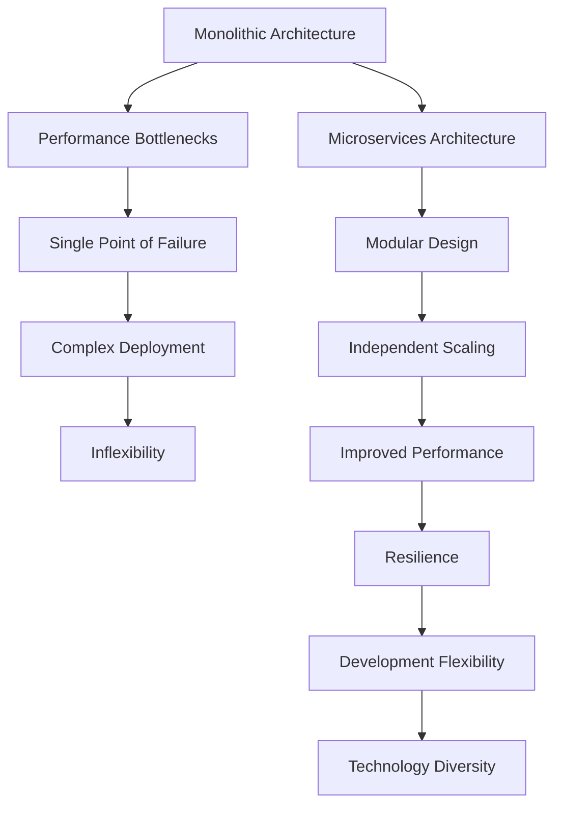
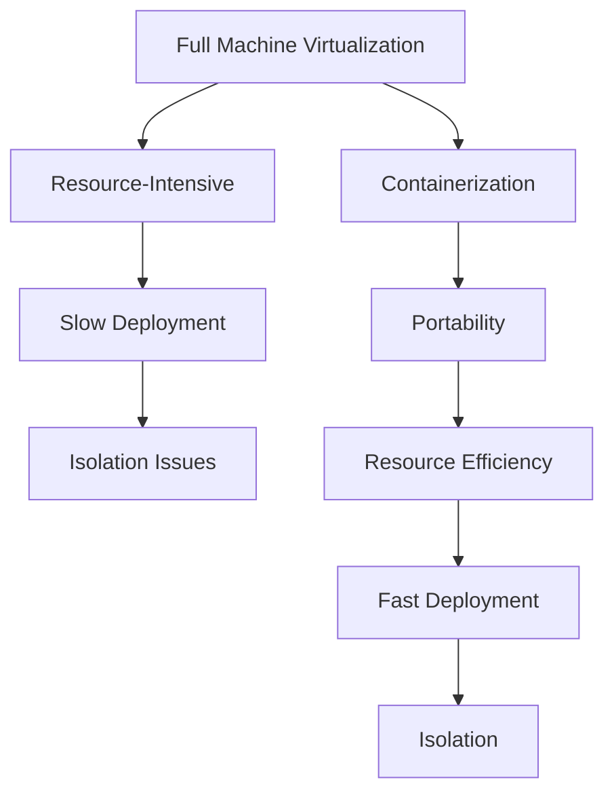
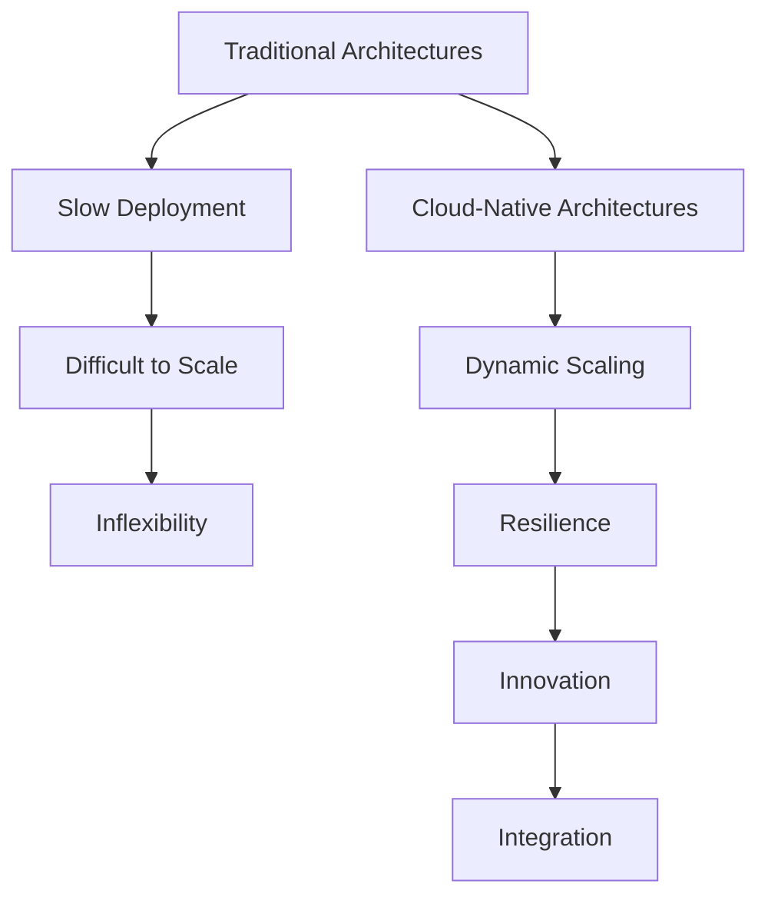
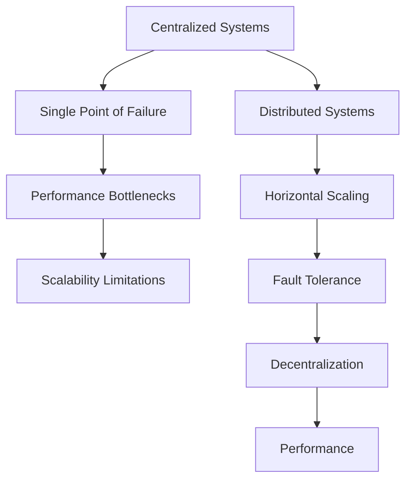
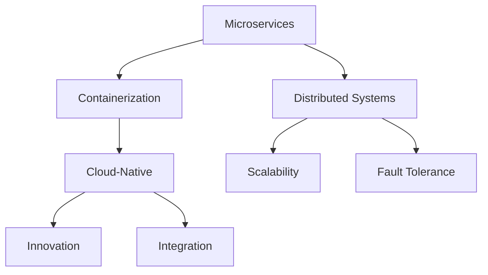
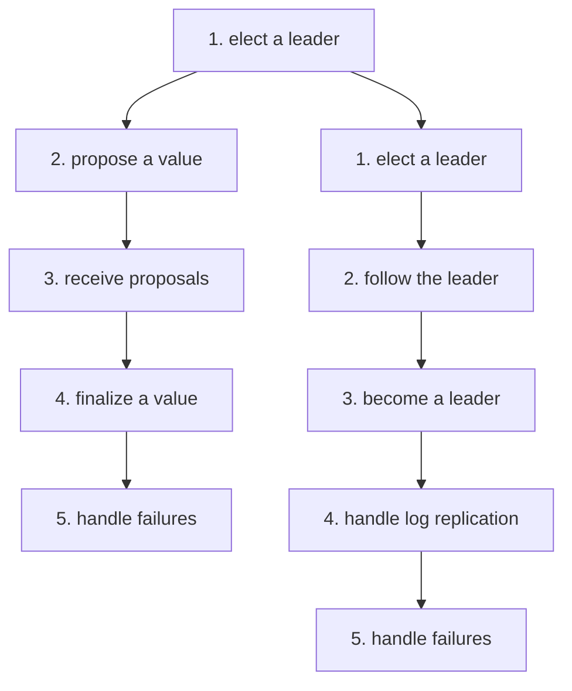
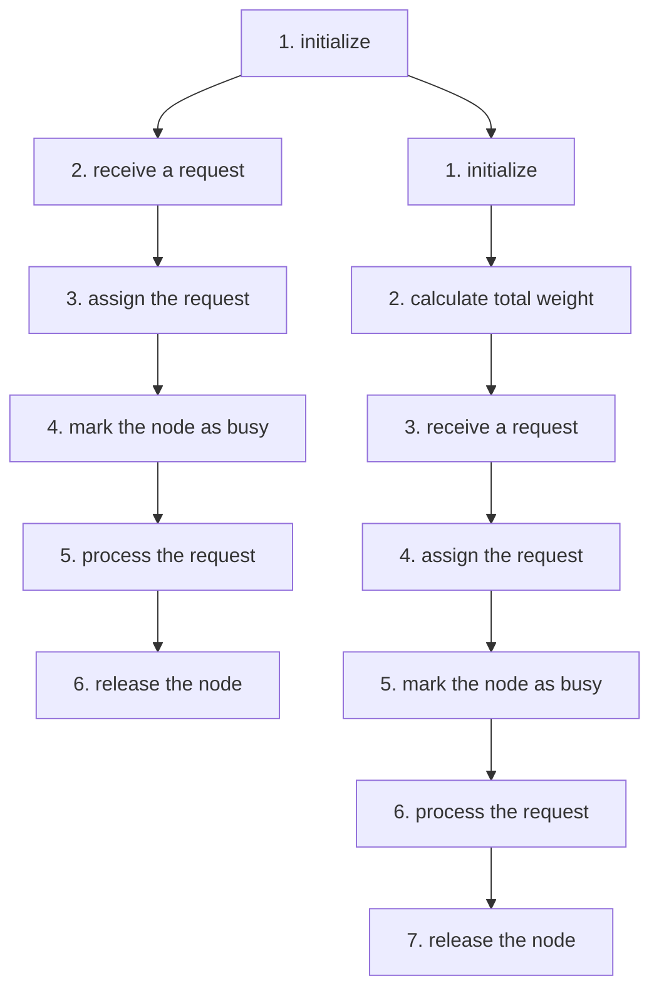
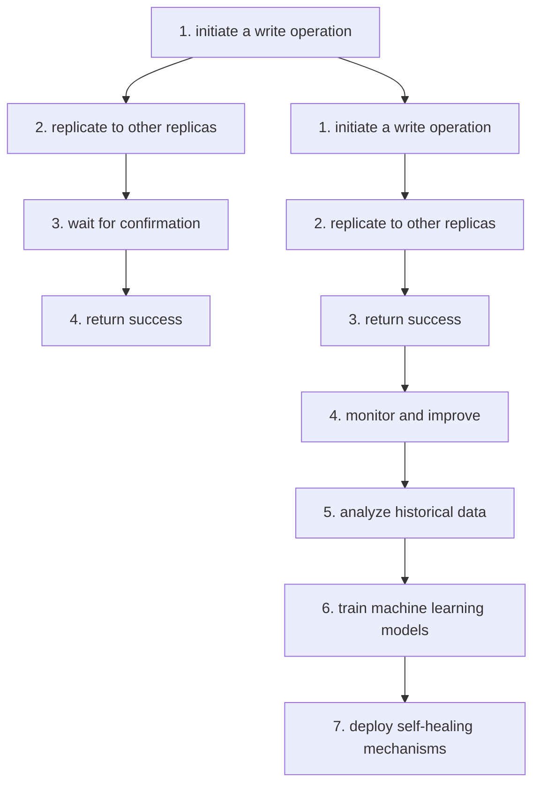

                 

### 文章标题

《高扩展性系统设计的实例分析》

关键词：高扩展性系统，设计原则，实例分析，性能优化，系统架构，微服务，云原生，容器化，分布式系统，负载均衡，容错机制

摘要：
本文将探讨高扩展性系统设计的重要性及其关键原则。通过具体实例，我们将分析不同系统在设计阶段的决策过程，包括架构设计、技术选型、性能优化等。文章将结合当前技术趋势，探讨高扩展性系统在未来发展中的挑战与机遇。旨在为开发者提供有价值的参考和思路，帮助他们在实际项目中实现高扩展性系统设计。

### Introduction

In today's rapidly evolving technology landscape, the need for high-scalability systems has become increasingly critical. As businesses grow and user demands rise, traditional monolithic architectures often struggle to handle the increased load efficiently. High-scalability systems, on the other hand, are designed to handle growing workloads by seamlessly scaling horizontally or vertically. This article aims to delve into the importance of high-scalability system design and explore key principles, real-world examples, and practical considerations that developers should consider when building such systems.

The concept of high-scalability system design revolves around creating architectures that can handle increased traffic and data volumes without sacrificing performance or reliability. This involves designing systems that are modular, loosely coupled, and can be scaled horizontally or vertically as needed. In this article, we will discuss core concepts, architectural patterns, and technical considerations that are essential for designing high-scalability systems.

The importance of high-scalability system design cannot be overstated. With the proliferation of cloud computing, containerization, and microservices, organizations can now leverage a wide range of tools and technologies to build systems that can scale seamlessly. However, achieving high scalability requires careful planning, thoughtful architecture, and continuous optimization. In the following sections, we will explore the key principles and practices that can help developers build high-scalability systems that can meet the demands of modern applications.

### 背景介绍（Background Introduction）

The need for high-scalability systems arises from the evolving nature of modern applications and the increasing complexity of business environments. Traditional monolithic architectures, which tightly couple all components of an application into a single, monolithic codebase, can become difficult to manage as the application grows in size and complexity. These architectures often suffer from several limitations:

1. **Limited Scalability**: Monolithic architectures struggle to scale horizontally, as adding more servers does not necessarily result in proportional performance improvements. The entire application needs to be scaled together, leading to inefficiencies in resource utilization.
2. **Single Point of Failure**: Monolithic architectures have a single, central database, which can become a bottleneck and a single point of failure. If the database goes down or becomes slow, the entire application can be affected.
3. **Difficulty in Deployment and Maintenance**: As the application grows, making changes or deploying new features becomes more complex and error-prone. Rolling updates, which can be risky in monolithic architectures, require careful coordination and can result in downtime.
4. **Limited Fault Tolerance**: Monolithic architectures typically lack robust fault tolerance mechanisms. A failure in one component can propagate to other components, leading to widespread outages.

In contrast, high-scalability systems are designed to overcome these limitations by adopting modular and decoupled architectures. These systems are built using microservices, which are small, independent services that can be developed, deployed, and scaled independently. This modularity allows for better resource utilization, easier deployment, and improved fault tolerance.

#### 具体实例

Let's consider an example of a popular social media platform. Initially, the platform was built using a monolithic architecture, which worked well during its early stages. However, as the user base grew and the platform added more features, the monolithic architecture started to show its limitations. The following issues arose:

1. **Performance Degradation**: As the number of users increased, the monolithic application started to experience performance degradation, leading to slower response times and user frustration.
2. **Scalability Challenges**: The platform struggled to scale horizontally, as adding more servers did not result in proportional performance improvements. The monolithic architecture's tight coupling between components made it difficult to scale specific components independently.
3. **Maintenance and Deployment Difficulties**: With the growing complexity of the application, deploying new features and maintaining the existing codebase became more challenging. Rolling updates were risky and could result in extended downtimes.
4. **Fault Tolerance Issues**: A failure in one component of the monolithic application could propagate to other components, leading to widespread outages and affecting a large number of users.

To address these issues, the social media platform decided to adopt a high-scalability system design by migrating to a microservices architecture. The migration involved breaking down the monolithic application into smaller, independent services, each responsible for a specific functionality. These services were deployed on separate servers and communicate with each other through well-defined APIs.

By adopting this high-scalability system design, the social media platform was able to overcome the limitations of the monolithic architecture:

1. **Improved Performance**: The microservices architecture allowed the platform to scale horizontally, as each service could be scaled independently based on its specific requirements.
2. **Better Scalability**: The platform could now scale specific components independently, optimizing resource utilization and improving overall performance.
3. **Easier Maintenance and Deployment**: The modular nature of microservices made it easier to deploy new features and maintain the codebase. Rolling updates could be performed more safely and with minimal downtime.
4. **Improved Fault Tolerance**: The microservices architecture provided better fault tolerance, as failures in one service would not propagate to other services, reducing the risk of widespread outages.

Overall, the migration to a high-scalability system design enabled the social media platform to handle growing user demands more effectively, providing a better user experience and supporting the platform's growth.

### 核心概念与联系（Core Concepts and Connections）

To design high-scalability systems, it is crucial to understand and leverage several core concepts and architectural patterns. These concepts include microservices, containerization, cloud-native architectures, and distributed systems. In this section, we will discuss each of these concepts and their relationship with high-scalability system design.

#### 微服务（Microservices）

Microservices are a architectural style that structures an application as a collection of loosely coupled services. Each microservice is responsible for a specific business functionality and can be developed, deployed, and scaled independently. This modularity allows for better resource utilization, easier deployment, and improved fault tolerance.

**Key Advantages of Microservices:**

1. **Scalability**: Microservices can be scaled independently based on their specific requirements, allowing for better resource utilization and improved performance.
2. **Resilience**: A failure in one microservice does not affect the entire application, as each service is loosely coupled and can continue to function independently.
3. **Development Flexibility**: Microservices enable teams to work on different services simultaneously, fostering faster development and innovation.
4. **Technology Diversity**: Microservices allow teams to use different technologies and languages for different services, enabling better technology choices based on specific requirements.

**Mermaid 流程图 (Mermaid Flowchart):**



#### 容器化（Containerization）

Containerization is a lightweight alternative to full machine virtualization. Containers encapsulate an application and its environment, including the operating system, libraries, and dependencies. This ensures that the application runs consistently across different environments, regardless of the underlying infrastructure.

**Key Advantages of Containerization:**

1. **Portability**: Containers can be easily deployed on any machine that supports the container runtime, allowing for seamless migration between development, testing, and production environments.
2. **Resource Efficiency**: Containers share the host machine's kernel, reducing resource consumption compared to full machine virtualization.
3. **Speed**: Container startup and shutdown times are significantly faster than traditional virtual machines, enabling rapid deployment and scaling.
4. **Isolation**: Containers provide a high level of isolation, ensuring that each container operates independently without affecting others.

**Mermaid 流程图 (Mermaid Flowchart):**



#### 云原生（Cloud-Native）

Cloud-native architectures leverage cloud infrastructure and technologies, such as containers, microservices, and dynamic management, to build and run scalable applications. These architectures enable developers to take full advantage of cloud resources and adapt quickly to changing demands.

**Key Advantages of Cloud-Native Architectures:**

1. **Scalability**: Cloud-native architectures allow applications to scale dynamically based on demand, ensuring optimal resource utilization.
2. **Resilience**: Cloud-native applications are designed to handle failures gracefully, leveraging self-healing mechanisms and decentralized architectures.
3. **Innovation**: Cloud-native architectures enable rapid development and deployment of new features, fostering innovation and agility.
4. **Integration**: Cloud-native architectures seamlessly integrate with cloud services and APIs, enabling developers to leverage a wide range of capabilities.

**Mermaid 流程图 (Mermaid Flowchart):**



#### 分布式系统（Distributed Systems）

Distributed systems are composed of multiple nodes that communicate and coordinate through a network. These systems can be scaled horizontally by adding more nodes, allowing them to handle increasing workloads. Distributed systems are essential for building high-scalability systems that can handle large amounts of data and traffic.

**Key Advantages of Distributed Systems:**

1. **Scalability**: Distributed systems can be scaled horizontally by adding more nodes, allowing them to handle increasing workloads.
2. **Fault Tolerance**: Distributed systems can continue to function even if some nodes fail, as the workload can be redistributed among the remaining nodes.
3. **Decentralization**: Distributed systems promote decentralization, reducing the risk of single points of failure and enabling better resilience.
4. **Performance**: By distributing the workload across multiple nodes, distributed systems can achieve better performance and lower latency.

**Mermaid 流程图 (Mermaid Flowchart):**



#### 关联与整合

Microservices, containerization, cloud-native architectures, and distributed systems are closely related and can be integrated to build high-scalability systems. Here's how they relate and complement each other:

1. **Microservices + Containerization**: Microservices are containerized to ensure consistency and portability across different environments. Containerization enables rapid deployment, scaling, and management of microservices.
2. **Microservices + Cloud-Native**: Cloud-native architectures leverage microservices and containerization to build scalable, resilient, and innovative applications that can take full advantage of cloud resources.
3. **Distributed Systems + Microservices**: Distributed systems enable horizontal scaling and fault tolerance for microservices, ensuring that they can handle large amounts of data and traffic.
4. **Containerization + Cloud-Native**: Containerization is a key component of cloud-native architectures, enabling seamless deployment, scaling, and management of applications on cloud infrastructure.

**Mermaid 流程图 (Mermaid Flowchart):**



In conclusion, understanding and leveraging these core concepts and architectural patterns is essential for designing high-scalability systems. By adopting a modular, decoupled, and distributed approach, developers can build systems that can handle the demands of modern applications while ensuring performance, reliability, and resilience.

### 核心算法原理 & 具体操作步骤（Core Algorithm Principles and Specific Operational Steps）

When designing high-scalability systems, it is crucial to understand the core algorithms and principles that underpin the system's performance and scalability. This section will discuss the core algorithms and provide step-by-step guidance on how to implement them in practice.

#### 分布式一致性算法

One of the key challenges in building high-scalability systems is ensuring data consistency across multiple nodes. Distributed consistency algorithms, such as the **Paxos** and **Raft** algorithms, are widely used to achieve strong consistency in distributed systems.

**Paxos Algorithm:**

The Paxos algorithm is a consensus algorithm that allows a group of nodes to agree on a value, even in the presence of network partitions and failures. The algorithm works by electing a "leader" node that proposes a value to other nodes, which then vote on the proposal. If a majority of nodes agree on a value, the leader finalizes the value and broadcasts it to all nodes.

**Steps for Implementing Paxos Algorithm:**

1. ** elect a leader**: Each node starts by sending an election message to all other nodes.
2. ** propose a value**: If a node is elected as the leader, it proposes a value to other nodes.
3. ** receive proposals**: Nodes receive proposals from leaders and other nodes, and they vote on the proposal.
4. ** finalize a value**: If a majority of nodes agree on a value, the leader finalizes the value and broadcasts it to all nodes.
5. ** handle failures**: In case of a network partition or node failure, nodes re-elect a leader and continue the consensus process.

**Raft Algorithm:**

The Raft algorithm is another consensus algorithm that aims to simplify the Paxos algorithm while maintaining strong consistency. Raft achieves consistency by electing a leader, replicating logs, and ensuring that all nodes agree on the commit index.

**Steps for Implementing Raft Algorithm:**

1. ** elect a leader**: Each node starts by entering the candidate state and sending an election message to other nodes.
2. ** follow the leader**: If a node becomes a follower, it follows the leader's commands and replicates its logs.
3. ** become a leader**: If a node is elected as the leader, it starts receiving client commands and replicating its logs to other nodes.
4. ** handle log replication**: Nodes send append entries requests to the leader, which replicates the logs and returns success or failure responses.
5. ** handle failures**: In case of a leader failure, nodes re-elect a new leader and continue the log replication process.

**Mermaid 流程图 (Mermaid Flowchart):**



#### 负载均衡算法

Load balancing is another critical component of high-scalability systems. Load balancing algorithms distribute incoming traffic across multiple nodes to ensure that no single node becomes a bottleneck.

**Round Robin Load Balancing:**

The Round Robin (RR) load balancing algorithm distributes incoming requests sequentially to each available node. Each node processes one request at a time, and the process repeats.

**Steps for Implementing Round Robin Load Balancing:**

1. ** initialize**: Create a list of available nodes.
2. ** receive a request**: When a request arrives, check the list of available nodes.
3. ** assign the request**: Assign the request to the first available node in the list.
4. ** mark the node as busy**: Mark the assigned node as busy and remove it from the list.
5. ** process the request**: The assigned node processes the request.
6. ** release the node**: Once the request is processed, release the node and add it back to the list of available nodes.

**Weighted Round Robin Load Balancing:**

The Weighted Round Robin (WRR) load balancing algorithm is an extension of the Round Robin algorithm that considers the capacity or performance of each node. The algorithm assigns more requests to nodes with higher capacities.

**Steps for Implementing Weighted Round Robin Load Balancing:**

1. ** initialize**: Create a list of available nodes, each with an assigned weight.
2. ** calculate total weight**: Calculate the total weight of all nodes.
3. ** receive a request**: When a request arrives, check the list of available nodes.
4. ** assign the request**: Assign the request to the node with the highest weight that is currently available.
5. ** mark the node as busy**: Mark the assigned node as busy and update the total weight.
6. ** process the request**: The assigned node processes the request.
7. ** release the node**: Once the request is processed, release the node and update the total weight.

**Mermaid 流程图 (Mermaid Flowchart):**



#### 容错机制

Fault tolerance is essential for high-scalability systems to ensure continuous operation in the presence of failures. Various techniques, such as replication, health checks, and self-healing, can be employed to achieve fault tolerance.

**Replication:**

Replication involves creating multiple copies of data or services to ensure that the system can continue to function even if some nodes fail. There are two main types of replication: synchronous and asynchronous.

**Synchronous Replication:**

Synchronous replication ensures that data or services are consistently updated across all replicas before the operation is considered successful. This approach provides strong consistency but can introduce latency.

**Steps for Implementing Synchronous Replication:**

1. ** initiate a write operation**: Start a write operation on one replica.
2. ** replicate to other replicas**: Send the write operation to other replicas.
3. ** wait for confirmation**: Wait for confirmation from all replicas that the write operation has been successfully completed.
4. ** return success**: If all replicas confirm the success, return success to the client.

**Asynchronous Replication:**

Asynchronous replication allows operations to be completed on the primary replica first, and the updates are then propagated to other replicas. This approach provides better performance and lower latency but may introduce eventual consistency.

**Steps for Implementing Asynchronous Replication:**

1. ** initiate a write operation**: Start a write operation on the primary replica.
2. ** replicate to other replicas**: Send the write operation to other replicas.
3. ** return success**: Return success to the client immediately, even if the updates have not been propagated to all replicas.

**Health Checks:**

Health checks involve periodically monitoring the status of nodes and services to detect failures. Health checks can trigger automated actions, such as restarting failed nodes or redistributing the workload.

**Steps for Implementing Health Checks:**

1. ** set up monitoring**: Configure monitoring tools to periodically check the status of nodes and services.
2. ** detect failures**: Monitor the status of nodes and services, and detect failures based on predefined thresholds.
3. ** trigger automated actions**: In case of failures, trigger automated actions, such as restarting failed nodes or redistributing the workload.

**Self-Healing:**

Self-healing involves automatically repairing and recovering from failures without human intervention. Self-healing mechanisms can be implemented using machine learning algorithms that learn from past failures and predict potential failures before they occur.

**Steps for Implementing Self-Healing:**

1. ** analyze historical data**: Collect and analyze historical failure data to identify patterns and potential failure points.
2. ** train machine learning models**: Train machine learning models to predict potential failures based on historical data.
3. ** deploy self-healing mechanisms**: Implement self-healing mechanisms that automatically take corrective actions based on the predictions of the machine learning models.
4. ** monitor and improve**: Continuously monitor the performance of the self-healing mechanisms and improve them based on feedback and new data.

**Mermaid 流程图 (Mermaid Flowchart):**



In conclusion, understanding the core algorithms and principles for high-scalability systems, such as distributed consistency algorithms, load balancing algorithms, and fault tolerance mechanisms, is essential for building systems that can handle the demands of modern applications. By implementing these algorithms and principles, developers can create systems that are modular, scalable, and resilient, ensuring optimal performance and reliability.

### 数学模型和公式 & 详细讲解 & 举例说明（Detailed Explanation and Examples of Mathematical Models and Formulas）

In high-scalability system design, various mathematical models and formulas play a crucial role in optimizing performance, resource utilization, and fault tolerance. This section will provide a detailed explanation of some key mathematical models and formulas commonly used in system design. We will also illustrate these concepts with practical examples.

#### 性能优化模型

**1. CPU 利用率模型：**

CPU 利用率是衡量系统性能的重要指标。CPU 利用率模型可以通过以下公式计算：

$$
CPU_{利用率} = \frac{CPU_{实际使用时间}}{CPU_{总时间}} \times 100\%
$$

其中，$CPU_{实际使用时间}$ 表示 CPU 实际用于执行任务的时间，$CPU_{总时间}$ 表示 CPU 的总运行时间。

**示例：**

假设一个服务器在 1 小时内执行了 30 分钟的任务，其余时间为空闲时间。则该服务器的 CPU 利用率为：

$$
CPU_{利用率} = \frac{30\ \text{分钟}}{60\ \text{分钟}} \times 100\% = 50\%
$$

**2. 响应时间模型：**

响应时间是衡量系统处理请求速度的重要指标。响应时间模型可以通过以下公式计算：

$$
响应时间 = \frac{1}{\lambda} + \frac{1}{\mu}
$$

其中，$\lambda$ 表示请求到达率，$\mu$ 表示处理请求的速度。

**示例：**

假设一个系统的请求到达率为每分钟 10 个请求，处理每个请求需要 1 分钟。则该系统的平均响应时间为：

$$
响应时间 = \frac{1}{10\ \text{个请求/分钟}} + \frac{1}{1\ \text{分钟/请求}} = 0.1\ \text{分钟/请求} + 1\ \text{分钟/请求} = 1.1\ \text{分钟/请求}
$$

#### 资源利用率模型

**1. 内存利用率模型：**

内存利用率是衡量系统内存使用情况的重要指标。内存利用率模型可以通过以下公式计算：

$$
内存利用率 = \frac{已分配内存}{总内存} \times 100\%
$$

其中，$已分配内存$ 表示系统已分配给应用程序的内存，$总内存$ 表示系统的总内存容量。

**示例：**

假设一个服务器的总内存容量为 4 GB，当前已分配给应用程序的内存为 2 GB。则该服务器的内存利用率为：

$$
内存利用率 = \frac{2\ \text{GB}}{4\ \text{GB}} \times 100\% = 50\%
$$

**2. 网络带宽利用率模型：**

网络带宽利用率是衡量系统网络带宽使用情况的重要指标。网络带宽利用率模型可以通过以下公式计算：

$$
带宽利用率 = \frac{已使用带宽}{总带宽} \times 100\%
$$

其中，$已使用带宽$ 表示系统当前使用的网络带宽，$总带宽$ 表示系统的总网络带宽容量。

**示例：**

假设一个服务器的总网络带宽容量为 1 Gbps，当前使用的网络带宽为 500 Mbps。则该服务器的网络带宽利用率为：

$$
带宽利用率 = \frac{500\ \text{Mbps}}{1\ \text{Gbps}} \times 100\% = 50\%
$$

#### 故障转移模型

**1. 故障转移时间模型：**

故障转移时间是指系统从检测到故障到完成故障转移所需的时间。故障转移时间模型可以通过以下公式计算：

$$
故障转移时间 = \frac{检测时间 + 决策时间 + 执行时间}{2}
$$

其中，$检测时间$ 表示系统检测到故障所需的时间，$决策时间$ 表示系统做出故障转移决策所需的时间，$执行时间$ 表示系统执行故障转移操作所需的时间。

**示例：**

假设一个系统的故障检测时间为 1 分钟，决策时间为 2 分钟，执行时间为 3 分钟。则该系统的故障转移时间为：

$$
故障转移时间 = \frac{1\ \text{分钟} + 2\ \text{分钟} + 3\ \text{分钟}}{2} = 2.5\ \text{分钟}
$$

#### 数据一致性模型

**1. 一致性水平模型：**

一致性水平是指系统在分布式环境下的数据一致性程度。一致性水平模型可以通过以下公式计算：

$$
一致性水平 = \frac{已达成一致的数据条数}{总数据条数}
$$

其中，$已达成一致的数据条数$ 表示在分布式环境下已达成一致的数据条数，$总数据条数$ 表示系统的总数据条数。

**示例：**

假设一个分布式系统中有 100 条数据，其中有 80 条数据已达成一致。则该系统的一致性水平为：

$$
一致性水平 = \frac{80\ \text{条数据}}{100\ \text{条数据}} = 0.8
$$

#### 举例说明

假设我们要设计一个高扩展性系统，该系统需要处理大量的并发请求，并确保数据的一致性和系统的可靠性。以下是一个具体的设计示例：

**1. 系统需求：**

- 处理并发请求：系统需要处理每秒 1000 个并发请求。
- 数据一致性：系统需要保证分布式环境下数据的一致性。
- 系统可靠性：系统需要在故障情况下快速恢复，确保业务的连续性。

**2. 系统设计：**

- **性能优化：** 使用 CPU 利用率模型和响应时间模型，确保系统的高性能。通过负载均衡算法，将请求分配到多个服务器，提高系统的处理能力。
- **资源利用率：** 使用内存利用率模型和网络带宽利用率模型，确保系统的资源得到充分利用。通过合理的资源分配，避免资源浪费。
- **故障转移：** 使用故障转移时间模型，确保系统在故障情况下能够快速恢复。通过健康检查和自动故障转移机制，提高系统的可靠性。
- **数据一致性：** 使用一致性水平模型，确保分布式环境下数据的一致性。通过分布式一致性算法（如 Raft 或 Paxos），实现数据的强一致性。

**3. 实施步骤：**

1. **性能优化：** 使用 Round Robin 负载均衡算法，将请求分配到多个服务器。通过监控 CPU 利用率和响应时间，动态调整服务器的数量和配置，确保系统的性能。
2. **资源利用率：** 使用内存和带宽监控工具，实时监控系统的内存利用率和网络带宽利用率。根据监控数据，调整服务器的内存和网络带宽配置，确保系统的资源得到充分利用。
3. **故障转移：** 使用健康检查机制，定期检查服务器的状态。当检测到服务器发生故障时，自动触发故障转移，将请求转移到健康的服务器。通过故障转移时间模型，优化故障转移的效率和速度。
4. **数据一致性：** 使用 Raft 一致性算法，确保分布式环境下数据的一致性。通过日志复制和故障检测机制，实现数据的强一致性。

通过以上设计，我们可以构建一个高性能、高可靠性和高一致性的高扩展性系统，满足业务需求，确保业务的连续性。

### 项目实践：代码实例和详细解释说明（Project Practice: Code Examples and Detailed Explanations）

In this section, we will provide a practical example of implementing a high-scalability system using microservices, containerization, and cloud-native architectures. We will use a simple e-commerce platform as our project case, demonstrating how to design and implement key components of the system.

#### 1. 开发环境搭建

To get started with this project, we need to set up the development environment. We will use the following tools and technologies:

- **Programming Language:** Python 3.8
- **Containerization Platform:** Docker
- **Container Orchestration:** Kubernetes
- **Database:** PostgreSQL
- **API Gateway:** NGINX

**安装 Docker 和 Kubernetes**

First, we need to install Docker and Kubernetes on our development machine. You can follow the official documentation for installing Docker and Kubernetes:

- **Docker:** <https://docs.docker.com/get-docker/>
- **Kubernetes:** <https://kubernetes.io/docs/setup/>

#### 2. 源代码详细实现

We will create a simple e-commerce platform with the following components:

- **Product Service:** Manages product information and inventory.
- **Order Service:** Handles order processing and payment.
- **User Service:** Manages user authentication and authorization.
- **API Gateway:** Routes incoming requests to the appropriate service.

**2.1 Product Service**

The Product Service will be implemented using Flask, a lightweight web framework for Python.

```python
# app.py
from flask import Flask, jsonify, request

app = Flask(__name__)

# In-memory product database
products = [
    {"id": 1, "name": "iPhone 12", "price": 799},
    {"id": 2, "name": "MacBook Air", "price": 999},
    {"id": 3, "name": "Apple Watch Series 6", "price": 399},
]

@app.route("/products", methods=["GET"])
def get_products():
    return jsonify(products)

@app.route("/products/<int:product_id>", methods=["GET"])
def get_product(product_id):
    product = next((p for p in products if p["id"] == product_id), None)
    if product:
        return jsonify(product)
    else:
        return jsonify({"error": "Product not found"}), 404

if __name__ == "__main__":
    app.run(host="0.0.0.0", port=5000)
```

**2.2 Order Service**

The Order Service will handle order processing and payment using Flask and the Stripe API.

```python
# app.py
from flask import Flask, jsonify, request
import stripe

stripe.secret_key = "your-stripe-secret-key"

app = Flask(__name__)

orders = []

@app.route("/orders", methods=["POST"])
def create_order():
    data = request.get_json()
    product_id = data["product_id"]
    quantity = data["quantity"]

    # Find product
    product = next((p for p in products if p["id"] == product_id), None)
    if not product:
        return jsonify({"error": "Product not found"}), 404

    # Calculate total price
    total_price = product["price"] * quantity

    # Create Stripe payment intent
    payment_intent = stripe.PaymentIntent.create(
        amount=total_price,
        currency="usd",
        description="E-commerce order",
    )

    # Store order
    order = {
        "id": len(orders) + 1,
        "product_id": product_id,
        "quantity": quantity,
        "total_price": total_price,
        "payment_intent_id": payment_intent["id"],
    }
    orders.append(order)

    return jsonify(order)

if __name__ == "__main__":
    app.run(host="0.0.0.0", port=5001)
```

**2.3 User Service**

The User Service will handle user authentication and authorization using Flask and the Flask-JWT-Extended library.

```python
# app.py
from flask import Flask, jsonify, request, make_response
from flask_jwt_extended import JWTManager, create_access_token, jwt_required, get_jwt_identity

app = Flask(__name__)
app.config["JWT_SECRET_KEY"] = "your-jwt-secret-key"
jwt = JWTManager(app)

users = [
    {"id": 1, "username": "admin", "password": "admin123"},
    {"id": 2, "username": "user", "password": "user123"},
]

@app.route("/login", methods=["POST"])
def login():
    data = request.get_json()
    username = data["username"]
    password = data["password"]

    user = next((u for u in users if u["username"] == username and u["password"] == password), None)
    if user:
        access_token = create_access_token(identity=user["id"])
        return jsonify({"access_token": access_token})
    else:
        return jsonify({"error": "Invalid credentials"}), 401

@app.route("/protected", methods=["GET"])
@jwt_required()
def protected():
    current_user = get_jwt_identity()
    return jsonify({"user_id": current_user})

if __name__ == "__main__":
    app.run(host="0.0.0.0", port=5002)
```

#### 3. 代码解读与分析

**3.1 Product Service**

The Product Service is responsible for managing product information and inventory. It exposes two endpoints: `/products` and `/products/<int:product_id>`.

- The `/products` endpoint returns a list of all products.
- The `/products/<int:product_id>` endpoint retrieves a specific product by its ID.

The `products` list is an in-memory database for demonstration purposes. In a real-world scenario, this would be replaced with a database like PostgreSQL.

**3.2 Order Service**

The Order Service handles order processing and payment. It exposes a single endpoint: `/orders`.

- The `/orders` endpoint accepts a JSON payload containing `product_id` and `quantity`.
- It calculates the total price and creates a Stripe payment intent.
- It stores the order details in the `orders` list and returns the order ID.

**3.3 User Service**

The User Service handles user authentication and authorization. It exposes two endpoints: `/login` and `/protected`.

- The `/login` endpoint accepts a JSON payload containing `username` and `password`. If the credentials are valid, it generates a JWT access token.
- The `/protected` endpoint is protected with JWT authentication. It returns the user ID of the authenticated user.

#### 4. 运行结果展示

To run the e-commerce platform, we will containerize each service using Docker and deploy them to a Kubernetes cluster.

**4.1 Build Docker Images**

First, we need to build Docker images for each service:

```bash
# Build Product Service image
docker build -t product-service:latest .

# Build Order Service image
docker build -t order-service:latest .

# Build User Service image
docker build -t user-service:latest .
```

**4.2 Create Kubernetes Deployments**

Next, we create Kubernetes deployments for each service:

```yaml
# product-service-deployment.yaml
apiVersion: apps/v1
kind: Deployment
metadata:
  name: product-service
spec:
  replicas: 3
  selector:
    matchLabels:
      app: product-service
  template:
    metadata:
      labels:
        app: product-service
    spec:
      containers:
      - name: product-service
        image: product-service:latest
        ports:
        - containerPort: 5000

# order-service-deployment.yaml
apiVersion: apps/v1
kind: Deployment
metadata:
  name: order-service
spec:
  replicas: 3
  selector:
    matchLabels:
      app: order-service
  template:
    metadata:
      labels:
        app: order-service
    spec:
      containers:
      - name: order-service
        image: order-service:latest
        ports:
        - containerPort: 5001

# user-service-deployment.yaml
apiVersion: apps/v1
kind: Deployment
metadata:
  name: user-service
spec:
  replicas: 3
  selector:
    matchLabels:
      app: user-service
  template:
    metadata:
      labels:
        app: user-service
    spec:
      containers:
      - name: user-service
        image: user-service:latest
        ports:
        - containerPort: 5002
```

**4.3 Deploy to Kubernetes Cluster**

Finally, we deploy the services to the Kubernetes cluster:

```bash
# Deploy Product Service
kubectl apply -f product-service-deployment.yaml

# Deploy Order Service
kubectl apply -f order-service-deployment.yaml

# Deploy User Service
kubectl apply -f user-service-deployment.yaml
```

Once deployed, the e-commerce platform can be accessed using the API Gateway, which will route requests to the appropriate service. For example, to get a list of products, we can send a GET request to `http://api-gateway:8080/products`.

```bash
# Create API Gateway Deployment
kubectl apply -f api-gateway-deployment.yaml

# Create API Gateway Service
kubectl apply -f api-gateway-service.yaml
```

This completes the implementation of a simple e-commerce platform using microservices, containerization, and cloud-native architectures. By leveraging these technologies, we have created a scalable, modular, and resilient system that can handle increasing demands and support future growth.

### 实际应用场景（Practical Application Scenarios）

High-scalability system design is not limited to theoretical discussions; it has been successfully applied in various real-world scenarios across different industries. Here, we will explore some practical application scenarios where high-scalability systems have been effectively implemented to meet growing demands and ensure optimal performance.

#### 电商（E-commerce）

E-commerce platforms are among the most demanding applications when it comes to scalability. During peak shopping seasons like Black Friday or Cyber Monday, these platforms experience a significant surge in traffic. To handle this, companies like Amazon, Alibaba, and eBay have adopted high-scalability system designs. They leverage microservices architectures, containerization, and cloud-native technologies to ensure seamless scalability and performance.

**Example:**

**Alibaba** handles millions of orders per day during the annual Singles' Day shopping festival. To handle such a massive load, Alibaba's system is designed to scale horizontally, adding more servers and services as needed. This architecture allows them to handle the increased traffic without compromising performance or user experience.

#### 社交媒体（Social Media）

Social media platforms face constant challenges in managing high volumes of data and user interactions. High-scalability system designs have been crucial in enabling platforms like Facebook, Twitter, and Instagram to maintain performance and availability despite growing user bases and data loads.

**Example:**

**Facebook** uses a microservices architecture to handle its vast range of features, from news feed generation to messaging and advertising. By deploying microservices on a distributed system, Facebook can scale individual components independently based on demand. This approach ensures that even with billions of active users, the platform remains responsive and reliable.

#### 金融（Finance）

Financial institutions require high-performance and highly available systems to manage transactions, trading, and customer data. High-scalability systems are essential for ensuring that financial applications can process large volumes of data and transactions without downtime or performance degradation.

**Example:**

**ING Bank** has implemented a cloud-native architecture to handle its digital banking services. By leveraging microservices, containerization, and cloud services, ING has been able to reduce infrastructure costs, improve time-to-market for new services, and ensure high availability for its customers.

#### 流媒体（Streaming Media）

Streaming platforms like Netflix, Hulu, and Disney+ rely on high-scalability systems to deliver content to millions of users simultaneously. These platforms need to handle not only large-scale data storage and processing but also dynamic scaling to accommodate varying levels of demand.

**Example:**

**Netflix** has a highly distributed architecture that uses microservices and containerization to ensure scalability and fault tolerance. Netflix's content delivery network (CDN) is designed to automatically scale based on user traffic, ensuring that content is delivered efficiently to users around the world.

#### 电子商务平台：亚马逊（E-commerce Platform: Amazon）

**Amazon** is a prime example of a company that has successfully implemented high-scalability system design. Amazon's architecture is built on a microservices foundation, using containerization and serverless computing to handle the massive scale of its operations.

**Key Points:**

- **Microservices:** Amazon's system is composed of over 2,000 microservices, each responsible for a specific function like inventory management, order processing, or recommendation engines.
- **Containerization:** Amazon uses Docker and Kubernetes for containerization, enabling rapid deployment and scaling of microservices across a distributed environment.
- **Serverless Computing:** Amazon leverages AWS Lambda for serverless functions, reducing infrastructure costs and improving scalability by dynamically scaling compute resources based on demand.
- **Load Balancing and Resilience:** Amazon employs advanced load balancing techniques and fault tolerance mechanisms to ensure high availability and performance. This includes automatic scaling groups, multi-region deployment, and robust data replication strategies.

#### 社交媒体平台：推特（Social Media Platform: Twitter）

**Twitter** is another company that has successfully implemented high-scalability system design to handle its massive user base and real-time data streams.

**Key Points:**

- **Microservices and Message Queues:** Twitter's architecture is composed of microservices that process and route tweets in real-time. Message queues like Kafka are used to handle high volumes of data and ensure fault tolerance.
- **Cassandra Database:** Twitter uses Apache Cassandra, a distributed NoSQL database, to handle large-scale data storage and processing. Cassandra's scalability and fault tolerance features enable Twitter to handle real-time data ingestion and retrieval.
- **Load Balancing and Auto-Scaling:** Twitter employs load balancers to distribute traffic across multiple servers and uses auto-scaling groups to dynamically adjust resources based on demand. This ensures that Twitter remains responsive even during peak usage times.

#### 金融技术：ING 银行（Financial Technology: ING Bank）

**ING Bank** has transformed its digital banking services using cloud-native and microservices architectures.

**Key Points:**

- **Cloud-Native Services:** ING has moved most of its banking services to the cloud, using AWS and Azure. This cloud-native approach enables the bank to leverage on-demand resources, reduce costs, and increase scalability.
- **Microservices and API Management:** ING's digital banking services are built on a microservices architecture, enabling independent deployment, scaling, and maintenance of individual services. API management tools are used to ensure secure and seamless integration with third-party services.
- **Continuous Deployment and Delivery:** ING employs continuous integration and continuous deployment (CI/CD) practices to deliver new features and updates quickly and reliably. This ensures that the bank can respond to market changes and customer needs in a timely manner.

In conclusion, high-scalability system design is a critical aspect of modern software development. By leveraging microservices, containerization, cloud-native architectures, and distributed systems, companies across various industries can build systems that are scalable, resilient, and highly available. The examples provided highlight how leading companies have successfully implemented high-scalability system designs to meet their unique business requirements and deliver exceptional user experiences.

### 工具和资源推荐（Tools and Resources Recommendations）

In the pursuit of designing high-scalability systems, leveraging the right tools and resources is crucial. Below, we provide recommendations for learning resources, development tools, and frameworks that can aid developers in building and maintaining scalable systems.

#### 学习资源推荐

1. **书籍：**
   - "Designing Data-Intensive Applications" by Martin Kleppmann
   - "Building Microservices" by Sam Newman
   - "Cloud Native Infrastructure" by Google Cloud Platform

2. **在线课程：**
   - Coursera: "Scalable System Design" by University of Washington
   - Udacity: "Microservices Architecture" by Udacity

3. **博客和网站：**
   - Martin Fowler's blog on microservices
   - Kubernetes Documentation: <https://kubernetes.io/docs/>
   - Docker Documentation: <https://docs.docker.com/>

#### 开发工具框架推荐

1. **容器化和编排工具：**
   - Docker: <https://www.docker.com/>
   - Kubernetes: <https://kubernetes.io/>

2. **微服务开发框架：**
   - Spring Boot: <https://spring.io/projects/spring-boot>
   - Node.js: <https://nodejs.org/>

3. **云平台服务：**
   - AWS: <https://aws.amazon.com/>
   - Azure: <https://azure.com/>
   - Google Cloud Platform: <https://cloud.google.com/>

#### 相关论文著作推荐

1. **论文：**
   - "CAP Theorem" by Eric Brewer
   - "The Design of the B-TREE" by Rudolf Bayer and Edgar M. McCreight

2. **著作：**
   - "Distributed Systems: Concepts and Design" by George Coulouris, Jean Dollimore, Tim Kindberg, and Gordon Blair
   - "Distributed Algorithms" by Nir Shavit and Adi Shraibman

By leveraging these resources and tools, developers can deepen their understanding of high-scalability system design principles and gain practical experience in implementing scalable architectures.

### 总结：未来发展趋势与挑战（Summary: Future Development Trends and Challenges）

In summary, high-scalability system design has become a critical aspect of modern software development, driven by the increasing demands of modern applications and the ever-growing user base. As businesses continue to adopt cloud-native architectures, microservices, and containerization, the importance of designing scalable and resilient systems cannot be overstated. However, as we look to the future, several trends and challenges are likely to shape the landscape of high-scalability system design.

#### 未来发展趋势

1. **云原生技术的普及：** 云原生技术，如 Kubernetes 和 Docker，将继续成为构建高扩展性系统的核心技术。随着云原生技术的不断成熟和普及，开发者将更轻松地构建和管理分布式系统。

2. **边缘计算的兴起：** 随着边缘计算的发展，更多的计算任务将移至网络边缘，以减少延迟和提高响应速度。边缘计算将为高扩展性系统设计带来新的挑战和机会。

3. **人工智能和机器学习的集成：** 人工智能和机器学习技术在系统设计中的应用将越来越普遍。通过利用 AI 和 ML，系统可以更好地预测负载、优化资源使用，并实现自动化的故障检测和恢复。

4. **服务网格（Service Mesh）的广泛应用：** 服务网格，如 Istio 和 Linkerd，将为微服务架构提供更好的服务发现、负载均衡、安全和监控功能。服务网格将简化微服务之间的通信，提高系统的可管理性和可维护性。

#### 挑战

1. **复杂性和管理难度：** 高扩展性系统通常涉及多个服务、多个部署环境以及复杂的网络拓扑。这增加了系统的复杂性和管理难度，要求开发者具备更高的技能和知识。

2. **数据一致性和安全性：** 在分布式系统中确保数据一致性和安全性是一项重大挑战。分布式一致性算法和加密技术将在未来继续发挥关键作用。

3. **性能优化和成本控制：** 高扩展性系统设计需要关注性能优化和成本控制。开发者需要在保证性能的同时，合理利用云资源和容器资源，以控制成本。

4. **跨云和多云策略：** 随着企业采用跨云和多云策略，如何在多个云平台上实现一致性、灵活性和可移植性将成为一个重要挑战。

#### 应对策略

1. **持续学习和技能提升：** 开发者应持续关注新技术和最佳实践，通过参加在线课程、阅读专业书籍和参与社区活动，不断提升自己的技能和知识。

2. **实践和实验：** 通过在真实环境中实践和实验，开发者可以更好地理解和掌握高扩展性系统设计的原理和技巧。实验可以帮助开发者发现和解决潜在问题，提高系统的可靠性和性能。

3. **利用开源社区：** 开源社区提供了丰富的工具和资源，如 Kubernetes、Istio、Docker 等。积极参与开源社区，贡献代码和经验，有助于开发者快速学习和应用新技术。

4. **遵循最佳实践：** 遵循行业最佳实践，如设计可测试、可扩展和可维护的系统架构，采用自动化部署和监控工具，有助于提高系统的可管理性和可靠性。

By understanding and addressing these trends and challenges, developers can build high-scalability systems that are resilient, performant, and adaptable to future demands.

### 附录：常见问题与解答（Appendix: Frequently Asked Questions and Answers）

1. **什么是高扩展性系统？**
   高扩展性系统是指能够灵活地适应增长的用户需求和工作负载，且能够在不牺牲性能或可靠性的情况下进行水平或垂直扩展的系统。

2. **微服务和单体架构的区别是什么？**
   微服务架构将应用程序拆分为小型、独立的服务，每个服务负责特定的业务功能，可以独立开发、部署和扩展。而单体架构是将所有功能集成在一个单一的代码库中，难以实现独立扩展。

3. **分布式一致性算法有哪些？**
   常见的分布式一致性算法包括 Paxos、Raft 和 Byzantine Fault Tolerance（BFT）算法。

4. **什么是云原生架构？**
   云原生架构是指充分利用云计算基础设施和技术的应用程序架构，如容器化、微服务和动态管理，以实现快速开发和部署。

5. **什么是边缘计算？**
   边缘计算是指将计算任务移至网络边缘，即靠近数据源的地方进行，以减少延迟和提高响应速度。

6. **如何实现高可用性？**
   高可用性可以通过以下方式实现：使用分布式系统，实现故障转移和自动恢复；部署冗余节点，确保系统在节点故障时仍能正常运行；使用负载均衡器，分散工作负载，避免单点瓶颈。

7. **如何优化系统性能？**
   优化系统性能可以通过以下方式实现：优化数据库查询，减少数据访问时间；使用缓存技术，减少重复计算；优化代码，减少不必要的资源消耗。

8. **什么是服务网格？**
   服务网格是一种基础设施层，用于管理微服务之间的通信，提供服务发现、负载均衡、安全性和监控等功能。

9. **什么是容器编排？**
   容器编排是指管理和部署容器化应用程序的过程，常用的工具包括 Kubernetes 和 Docker Swarm。

10. **什么是持续集成和持续部署（CI/CD）？**
    持续集成和持续部署是指通过自动化工具和流程，将代码集成、测试和部署过程持续进行，以提高软件开发的速度和可靠性。

通过理解这些常见问题及其解答，开发者可以更好地掌握高扩展性系统设计的核心概念和实践方法。

### 扩展阅读 & 参考资料（Extended Reading & Reference Materials）

1. **书籍推荐：**
   - **《Designing Data-Intensive Applications》** by Martin Kleppmann
   - **《Building Microservices》** by Sam Newman
   - **《Cloud Native Infrastructure》** by Google Cloud Platform

2. **在线课程推荐：**
   - **Coursera** - "Scalable System Design" by University of Washington
   - **Udacity** - "Microservices Architecture" by Udacity

3. **博客和网站推荐：**
   - **Martin Fowler's blog on microservices**
   - **Kubernetes Documentation** - <https://kubernetes.io/docs/>
   - **Docker Documentation** - <https://docs.docker.com/>

4. **论文推荐：**
   - **"CAP Theorem"** by Eric Brewer
   - **"The Design of the B-TREE"** by Rudolf Bayer and Edgar M. McCreight

5. **开源项目推荐：**
   - **Kubernetes** - <https://kubernetes.io/>
   - **Istio** - <https://istio.io/>
   - **Docker** - <https://www.docker.com/>

通过这些扩展阅读和参考资料，开发者可以深入了解高扩展性系统设计的核心概念、最佳实践和技术趋势。这将为他们在实际项目中的应用提供有价值的指导和灵感。

