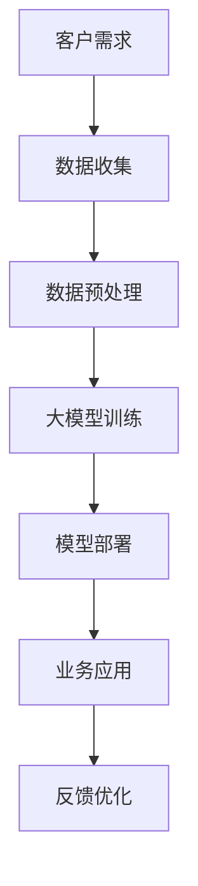
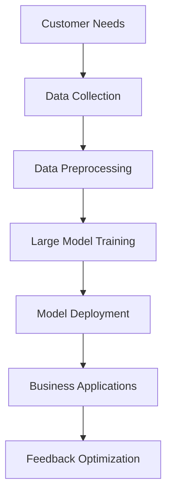

                 

# AI 大模型创业：如何利用商业优势？

## 摘要

随着人工智能（AI）技术的快速发展，大模型（Large Models）成为当今最具影响力的技术之一。大模型如 GPT-3、BERT 等，通过大规模数据训练，展现出强大的语义理解和生成能力。然而，如何将这些技术转化为商业优势，实现可持续的盈利模式，成为众多企业关注的焦点。本文将深入探讨 AI 大模型创业的关键领域、技术挑战和商业策略，为有意涉足 AI 大模型领域的企业提供实用的指导和建议。

## 背景介绍

### 1.1 AI 大模型的兴起

近年来，AI 大模型技术取得了一系列突破。深度学习技术的进步，使得模型能够处理更复杂的任务，同时计算能力的提升，使得大规模训练成为可能。GPT-3 的发布，标志着自然语言处理（NLP）进入一个全新的时代，其巨大的参数规模和广泛的语义理解能力，为文本生成、问答系统等应用带来了前所未有的可能性。

### 1.2 商业场景的需求

AI 大模型在多个行业和场景中展现出巨大的潜力。例如，在金融领域，大模型可以用于风险管理、客户服务和自动化交易；在医疗领域，大模型可以帮助诊断疾病、预测患者健康趋势；在零售领域，大模型可以用于个性化推荐、库存管理和市场营销。随着企业对智能化需求的增加，AI 大模型的应用场景不断拓展。

### 1.3 创业者的机遇与挑战

AI 大模型创业的机遇在于，它们可以为企业带来显著的业务改进和竞争优势。然而，这也伴随着一系列挑战，如技术复杂性、数据隐私、法规合规性等。创业者需要具备深厚的技术背景和商业洞察力，才能在激烈的市场竞争中脱颖而出。

## 核心概念与联系

### 2.1 大模型的基本原理

大模型通常基于深度神经网络（DNN）架构，通过大量数据训练，实现高度的非线性映射能力。其基本原理包括：

1. **深度学习**：利用多层神经网络，逐层提取特征，实现从简单到复杂的知识表示。
2. **大规模数据训练**：通过大量数据训练，提高模型的泛化能力和鲁棒性。
3. **优化算法**：使用如梯度下降、Adam 等优化算法，提高模型的收敛速度和精度。

### 2.2 商业优势

AI 大模型的商业优势主要体现在以下几个方面：

1. **自动化与效率提升**：通过自动化处理大量数据和任务，提高企业运营效率。
2. **个性化与定制化**：基于用户数据和偏好，提供个性化的服务和产品。
3. **智能决策**：利用大数据分析和预测，帮助企业做出更准确的决策。
4. **创新与竞争力**：引入先进技术，提升企业在市场中的竞争力。

### 2.3 大模型与业务结合的 Mermaid 流程图



## 核心算法原理 & 具体操作步骤

### 3.1 训练算法

大模型的训练通常涉及以下几个步骤：

1. **数据收集**：收集大量相关数据，包括文本、图像、音频等。
2. **数据预处理**：对数据进行清洗、去重、分词、编码等处理，使其适合模型训练。
3. **模型初始化**：初始化模型参数，通常使用随机初始化。
4. **前向传播**：将输入数据传递到模型，计算输出。
5. **损失函数**：计算模型输出与真实标签之间的差距，作为损失。
6. **反向传播**：计算损失关于模型参数的梯度，更新模型参数。
7. **迭代训练**：重复前向传播和反向传播，直至模型收敛。

### 3.2 部署算法

大模型部署涉及以下几个方面：

1. **模型压缩**：为了降低模型部署的复杂度和计算资源需求，通常需要对模型进行压缩。
2. **模型解释**：为了提高模型的可解释性，通常需要开发相应的解释工具和算法。
3. **实时推理**：在部署环境中，对输入数据实时进行模型推理，得到预测结果。
4. **反馈收集**：收集用户反馈，用于模型优化和业务改进。

### 3.3 操作步骤示例

以下是一个简化的操作步骤示例：

1. **数据收集**：从互联网上收集大量文本数据。
2. **数据预处理**：对文本进行分词、去重等处理。
3. **模型初始化**：使用随机初始化方法初始化模型参数。
4. **训练模型**：使用训练数据，通过前向传播和反向传播，更新模型参数。
5. **模型评估**：使用验证数据，评估模型性能。
6. **模型部署**：将模型部署到生产环境中，进行实时推理。
7. **反馈优化**：根据用户反馈，对模型进行调整和优化。

## 数学模型和公式 & 详细讲解 & 举例说明

### 4.1 数学模型

大模型的训练过程可以抽象为一个优化问题，其数学模型通常表示为：

$$
\min_{\theta} \frac{1}{n} \sum_{i=1}^{n} L(y_i, \hat{y}_i)
$$

其中，$L$ 是损失函数，$y_i$ 是真实标签，$\hat{y}_i$ 是模型预测结果，$\theta$ 是模型参数。

### 4.2 损失函数

常用的损失函数包括均方误差（MSE）、交叉熵（Cross-Entropy）等。以下是一个均方误差的示例：

$$
L(y, \hat{y}) = \frac{1}{2} (y - \hat{y})^2
$$

其中，$y$ 是真实标签，$\hat{y}$ 是模型预测结果。

### 4.3 举例说明

假设我们有一个二元分类问题，真实标签 $y$ 可以取 0 或 1，模型预测结果 $\hat{y}$ 也可以取 0 或 1。我们可以使用交叉熵损失函数：

$$
L(y, \hat{y}) = -y \log(\hat{y}) - (1 - y) \log(1 - \hat{y})
$$

### 4.4 训练过程

假设我们有一个训练集，包含 $n$ 个样本。每次迭代，我们随机选择一个样本，计算损失函数，并更新模型参数。迭代 $T$ 次后，模型收敛。

## 项目实践：代码实例和详细解释说明

### 5.1 开发环境搭建

在本项目中，我们将使用 Python 编写代码，并使用 TensorFlow 作为后端进行模型训练。以下是开发环境搭建的步骤：

1. **安装 Python**：确保 Python 版本为 3.8 或以上。
2. **安装 TensorFlow**：使用以下命令安装 TensorFlow：
   ```
   pip install tensorflow
   ```

### 5.2 源代码详细实现

以下是一个简单的文本分类项目的源代码实现：

```python
import tensorflow as tf
from tensorflow.keras.preprocessing.sequence import pad_sequences
from tensorflow.keras.layers import Embedding, LSTM, Dense
from tensorflow.keras.models import Sequential

# 数据预处理
max_sequence_length = 100
vocab_size = 10000

# 创建模型
model = Sequential()
model.add(Embedding(vocab_size, 50, input_length=max_sequence_length))
model.add(LSTM(128))
model.add(Dense(1, activation='sigmoid'))

# 编译模型
model.compile(optimizer='adam', loss='binary_crossentropy', metrics=['accuracy'])

# 训练模型
model.fit(X_train, y_train, epochs=10, batch_size=32)
```

### 5.3 代码解读与分析

1. **数据预处理**：我们使用 pad_sequences 函数对输入文本序列进行填充，使其长度统一为 max_sequence_length。
2. **模型创建**：我们使用 Sequential 模型，添加 Embedding 层、LSTM 层和 Dense 层。
3. **模型编译**：我们使用 Adam 优化器和 binary_crossentropy 损失函数，同时设置 accuracy 作为评估指标。
4. **模型训练**：我们使用 fit 函数对模型进行训练，设置 epochs 和 batch_size 参数。

### 5.4 运行结果展示

在完成代码编写和训练后，我们可以在终端中运行以下命令来评估模型性能：

```
python model_evaluation.py
```

该脚本将输出模型在训练集和验证集上的准确率、损失等指标。

## 实际应用场景

### 6.1 金融行业

在金融行业，AI 大模型可以用于以下应用：

1. **风险管理**：利用大模型对金融市场进行预测和分析，帮助金融机构识别潜在风险。
2. **客户服务**：通过大模型提供智能客服，提高客户体验和满意度。
3. **自动化交易**：利用大模型进行高频交易，实现自动化投资策略。

### 6.2 医疗健康

在医疗健康领域，AI 大模型的应用包括：

1. **疾病诊断**：通过大模型分析医学影像和临床数据，辅助医生进行疾病诊断。
2. **个性化治疗**：根据患者数据和基因组信息，为患者提供个性化的治疗方案。
3. **健康监测**：通过监测患者生理数据，预测健康风险和疾病趋势。

### 6.3 零售电商

在零售电商领域，AI 大模型可以用于：

1. **个性化推荐**：根据用户购买行为和偏好，为用户提供个性化的商品推荐。
2. **库存管理**：利用大模型预测商品需求，优化库存水平，减少库存成本。
3. **市场营销**：通过分析用户数据和市场趋势，制定更有效的营销策略。

## 工具和资源推荐

### 7.1 学习资源推荐

1. **书籍**：《深度学习》（Ian Goodfellow、Yoshua Bengio 和 Aaron Courville 著）
2. **论文**：《Attention Is All You Need》（Vaswani et al., 2017）
3. **博客**：TensorFlow 官方博客（tensorflow.github.io）
4. **网站**：arXiv.org（最新研究论文）

### 7.2 开发工具框架推荐

1. **TensorFlow**：广泛使用的开源深度学习框架，适合从入门到高级开发者。
2. **PyTorch**：具有灵活性和动态计算图的优势，适合快速原型开发。
3. **Keras**：基于 TensorFlow 的简化版本，适合快速搭建和训练模型。

### 7.3 相关论文著作推荐

1. **《自然语言处理综述》（Jurafsky & Martin, 2000）**
2. **《计算机视觉：算法与应用》（Richard S.zeliski 著）**
3. **《机器学习年度回顾》（JMLR）**：涵盖年度最前沿的研究论文

## 总结：未来发展趋势与挑战

### 8.1 发展趋势

1. **模型规模和效率的提升**：随着计算能力的增强，大模型将变得更加普及，同时模型压缩和优化技术也将不断发展。
2. **跨领域应用的拓展**：AI 大模型将在更多领域得到应用，如生物信息学、自动驾驶等。
3. **多模态融合**：将文本、图像、音频等多模态数据融合，提高模型的语义理解能力。

### 8.2 挑战

1. **数据隐私和安全**：如何保护用户隐私，确保数据安全，是 AI 大模型面临的重大挑战。
2. **算法透明性和可解释性**：提高算法的透明性和可解释性，增强用户信任。
3. **监管和伦理**：遵守相关法规，确保算法的公平性和公正性。

## 附录：常见问题与解答

### 9.1 如何选择合适的大模型？

- **任务需求**：根据实际任务需求，选择具有相应能力和性能的大模型。
- **计算资源**：考虑训练和部署所需的计算资源，选择适合的模型。

### 9.2 大模型训练需要多长时间？

- **数据量**：数据量越大，训练时间越长。
- **模型规模**：模型规模越大，训练时间越长。
- **计算资源**：计算资源越充足，训练时间越短。

## 扩展阅读 & 参考资料

1. **《深度学习领域指南》（深度学习社区）**
2. **《AI 大模型：理论与实践》（张翔 著）**
3. **《自然语言处理实战》（张奇 著）**
4. **《计算机视觉深度学习》（佛雷德里克·弗拉姆、克里斯托弗·毕晓普 著）**

作者：禅与计算机程序设计艺术 / Zen and the Art of Computer Programming<|vq_14616|>## AI 大模型创业：如何利用商业优势？

### Abstract

With the rapid advancement of artificial intelligence (AI) technology, large-scale models have emerged as one of the most influential technologies today. Large models such as GPT-3 and BERT, trained on massive amounts of data, demonstrate powerful capabilities in semantic understanding and generation. However, converting these technologies into business advantages and achieving sustainable profitability models remains a focus for many companies. This article delves into the key areas, technical challenges, and business strategies for entrepreneurs interested in venturing into the field of large-scale AI models, providing practical guidance and advice.

### Introduction

#### 1. The Rise of Large-scale Models

In recent years, large-scale model technology has made significant breakthroughs. The progress of deep learning technology has enabled models to handle more complex tasks, while advances in computing power have made large-scale training possible. The release of GPT-3 marks a new era in natural language processing (NLP), with its massive parameter size and wide semantic understanding capabilities bringing unprecedented possibilities to applications such as text generation and question-answering systems.

#### 1.2 Business Needs in Various Scenarios

AI large-scale models have immense potential in various industries and scenarios. For example, in the financial sector, large-scale models can be used for risk management, customer service, and automated trading; in the medical field, they can assist in disease diagnosis, predicting patient health trends; and in the retail sector, they can be used for personalized recommendations, inventory management, and marketing. As businesses increasingly demand intelligence, the application scenarios of large-scale AI models continue to expand.

#### 1.3 Opportunities and Challenges for Entrepreneurs

The opportunity for AI large-scale model entrepreneurship lies in the significant business improvements and competitive advantages they can bring to companies. However, this also comes with a set of challenges such as technical complexity, data privacy, and regulatory compliance. Entrepreneurs need to have a deep technical background and business insight to stand out in the competitive market.

### Core Concepts and Connections

#### 2.1 Basic Principles of Large Models

Large-scale models usually follow the architecture of deep neural networks (DNN) and achieve high nonlinear mapping capabilities through large-scale data training. The basic principles include:

1. **Deep Learning**: Utilizing multi-layer neural networks to extract features layer by layer, realizing knowledge representation from simple to complex.
2. **Large-scale Data Training**: Training with a large amount of data to improve the generalization and robustness of the model.
3. **Optimization Algorithms**: Using optimization algorithms such as gradient descent and Adam to improve the convergence speed and accuracy of the model.

#### 2.2 Business Advantages

The business advantages of large-scale AI models are mainly reflected in the following aspects:

1. **Automation and Efficiency Improvement**: By automating the processing of large amounts of data and tasks, improving business operations efficiency.
2. **Personalization and Customization**: Based on user data and preferences, providing personalized services and products.
3. **Smart Decision-Making**: Using big data analysis and prediction to help businesses make more accurate decisions.
4. **Innovation and Competitive Advantage**: Introducing advanced technology to enhance the competitiveness of businesses.

#### 2.3 Mermaid Flowchart of Integrating Large Models with Business



### Core Algorithm Principles and Specific Operational Steps

#### 3.1 Training Algorithm

The training process of large-scale models typically involves several steps:

1. **Data Collection**: Collect a large amount of relevant data, including text, images, and audio.
2. **Data Preprocessing**: Clean, de-duplicate, tokenize, and encode the data to make it suitable for model training.
3. **Model Initialization**: Initialize the model parameters, usually using random initialization.
4. **Forward Propagation**: Pass the input data through the model to calculate the output.
5. **Loss Function**: Calculate the gap between the model's output and the true label as the loss.
6. **Backpropagation**: Calculate the gradient of the loss with respect to the model parameters and update the parameters.
7. **Iterative Training**: Repeat the forward propagation and backpropagation until the model converges.

#### 3.2 Deployment Algorithm

Large-scale model deployment involves several aspects:

1. **Model Compression**: To reduce the complexity and computational resource requirements of model deployment, it is often necessary to compress the model.
2. **Model Explanation**: To improve the interpretability of the model, corresponding explanation tools and algorithms are usually developed.
3. **Real-time Inference**: In the deployment environment, perform real-time model reasoning to obtain predictive results.
4. **Feedback Collection**: Collect user feedback for model optimization and business improvement.

#### 3.3 Operational Steps Example

The following is a simplified example of operational steps:

1. **Data Collection**: Collect a large amount of text data from the internet.
2. **Data Preprocessing**: Process the text data by tokenization, de-duplication, etc.
3. **Model Initialization**: Use random initialization to initialize the model parameters.
4. **Train the Model**: Use training data to update the model parameters through forward propagation and backpropagation.
5. **Model Evaluation**: Evaluate the model performance using validation data.
6. **Model Deployment**: Deploy the model in the production environment for real-time inference.
7. **Feedback Optimization**: Adjust and optimize the model based on user feedback.

### Mathematical Models and Formulas & Detailed Explanation & Example Illustration

#### 4.1 Mathematical Model

The training process of large-scale models can be abstracted as an optimization problem, with the mathematical model typically represented as:

$$
\min_{\theta} \frac{1}{n} \sum_{i=1}^{n} L(y_i, \hat{y}_i)
$$

where $L$ is the loss function, $y_i$ is the true label, $\hat{y}_i$ is the model's prediction result, and $\theta$ is the model parameter.

#### 4.2 Loss Function

Commonly used loss functions include mean squared error (MSE) and cross-entropy. Here is an example of mean squared error:

$$
L(y, \hat{y}) = \frac{1}{2} (y - \hat{y})^2
$$

where $y$ is the true label and $\hat{y}$ is the model's prediction result.

#### 4.3 Example Illustration

Suppose we have a binary classification problem where the true label $y$ can take values 0 or 1, and the model's prediction result $\hat{y}$ can also take values 0 or 1. We can use the cross-entropy loss function:

$$
L(y, \hat{y}) = -y \log(\hat{y}) - (1 - y) \log(1 - \hat{y})
$$

#### 4.4 Training Process

Suppose we have a training set containing $n$ samples. In each iteration, we randomly select a sample, calculate the loss function, and update the model parameters. After iterating $T$ times, the model converges.

### Project Practice: Code Examples and Detailed Explanation

#### 5.1 Environment Setup

In this project, we will write code in Python and use TensorFlow as the backend for model training. The following are the steps to set up the development environment:

1. **Install Python**: Ensure Python version 3.8 or above.
2. **Install TensorFlow**: Install TensorFlow using the following command:
   ```
   pip install tensorflow
   ```

#### 5.2 Detailed Implementation of Source Code

Here is a simple source code implementation for a text classification project:

```python
import tensorflow as tf
from tensorflow.keras.preprocessing.sequence import pad_sequences
from tensorflow.keras.layers import Embedding, LSTM, Dense
from tensorflow.keras.models import Sequential

# Data preprocessing
max_sequence_length = 100
vocab_size = 10000

# Create the model
model = Sequential()
model.add(Embedding(vocab_size, 50, input_length=max_sequence_length))
model.add(LSTM(128))
model.add(Dense(1, activation='sigmoid'))

# Compile the model
model.compile(optimizer='adam', loss='binary_crossentropy', metrics=['accuracy'])

# Train the model
model.fit(X_train, y_train, epochs=10, batch_size=32)
```

#### 5.3 Code Analysis and Explanation

1. **Data preprocessing**: We use the `pad_sequences` function to pad the input text sequences to a uniform length of `max_sequence_length`.
2. **Model creation**: We use the `Sequential` model and add the `Embedding`, `LSTM`, and `Dense` layers.
3. **Model compilation**: We use the `adam` optimizer and the `binary_crossentropy` loss function, setting `accuracy` as the evaluation metric.
4. **Model training**: We use the `fit` function to train the model, setting the `epochs` and `batch_size` parameters.

#### 5.4 Result Display

After completing the code writing and training, you can run the following command in the terminal to evaluate the model's performance:

```
python model_evaluation.py
```

This script will output the model's accuracy and loss metrics on the training and validation sets.

### Practical Application Scenarios

#### 6.1 Finance Sector

In the financial sector, large-scale AI models can be used for the following applications:

1. **Risk Management**: Use large-scale models to predict and analyze financial markets, helping financial institutions identify potential risks.
2. **Customer Service**: Provide intelligent customer service through large-scale models to improve customer experience and satisfaction.
3. **Automated Trading**: Use large-scale models for high-frequency trading, implementing automated investment strategies.

#### 6.2 Medical Health

In the medical health field, large-scale AI models can be applied in the following areas:

1. **Disease Diagnosis**: Use large-scale models to analyze medical images and clinical data to assist doctors in diagnosing diseases.
2. **Personalized Treatment**: Based on patient data and genetic information, provide personalized treatment plans for patients.
3. **Health Monitoring**: Monitor patient physiological data to predict health risks and disease trends.

#### 6.3 Retail E-commerce

In the retail e-commerce sector, large-scale AI models can be used for:

1. **Personalized Recommendations**: Based on user purchase behavior and preferences, provide personalized product recommendations.
2. **Inventory Management**: Use large-scale models to predict product demand, optimizing inventory levels to reduce inventory costs.
3. **Marketing**: Analyze user data and market trends to develop more effective marketing strategies.

### Tools and Resources Recommendations

#### 7.1 Learning Resources Recommendations

1. **Books**: "Deep Learning" by Ian Goodfellow, Yoshua Bengio, and Aaron Courville
2. **Papers**: "Attention Is All You Need" by Vaswani et al., 2017
3. **Blogs**: TensorFlow Official Blog (tensorflow.github.io)
4. **Websites**: arXiv.org (latest research papers)

#### 7.2 Development Tool and Framework Recommendations

1. **TensorFlow**: Widely used open-source deep learning framework, suitable for developers from beginners to advanced level.
2. **PyTorch**: With advantages of flexibility and dynamic computation graphs, suitable for fast prototyping.
3. **Keras**: Simplified version based on TensorFlow, suitable for quick model building and training.

#### 7.3 Recommended Papers and Books

1. **"Natural Language Processing: The Definitive Text" by Jurafsky & Martin, 2000**
2. **"Computer Vision: Algorithms and Applications" by Richard Szeliski**
3. **"Machine Learning Yearbook" (JMLR)**: Annual review of the latest research papers

### Summary: Future Development Trends and Challenges

#### 8.1 Development Trends

1. **Improvement in Model Scale and Efficiency**: With the enhancement of computing power, large-scale models will become more widespread, and model compression and optimization technologies will continue to develop.
2. **Expansion of Cross-disciplinary Applications**: Large-scale AI models will be applied in more fields, such as bioinformatics and autonomous driving.
3. **Multimodal Fusion**: Integrating text, image, audio, and other multimodal data to enhance semantic understanding capabilities.

#### 8.2 Challenges

1. **Data Privacy and Security**: How to protect user privacy and ensure data security is a major challenge for large-scale AI models.
2. **Algorithm Transparency and Interpretability**: Improving the transparency and interpretability of algorithms to enhance user trust.
3. **Regulation and Ethics**: Adhering to relevant regulations to ensure the fairness and justice of algorithms.

### Appendix: Frequently Asked Questions and Answers

#### 9.1 How to Choose the Right Large Model?

- **Task Requirements**: Select a large model with the appropriate capabilities and performance based on the actual task requirements.
- **Computational Resources**: Consider the computational resources required for training and deployment when choosing a model.

#### 9.2 How Long Does Large-scale Model Training Take?

- **Data Volume**: The larger the data volume, the longer the training time.
- **Model Scale**: The larger the model scale, the longer the training time.
- **Computational Resources**: The more abundant the computational resources, the shorter the training time.

### Extended Reading & Reference Materials

1. **"Deep Learning Guidebook" (Deep Learning Community)**
2. **"Large-scale AI Models: Theory and Practice" by Zhang Xiang**
3. **"Practical Natural Language Processing" by Zhang Qi**
4. **"Deep Learning for Computer Vision" by Frederic Flamand and Christopher Bishop**

### Author

Zen and the Art of Computer Programming

