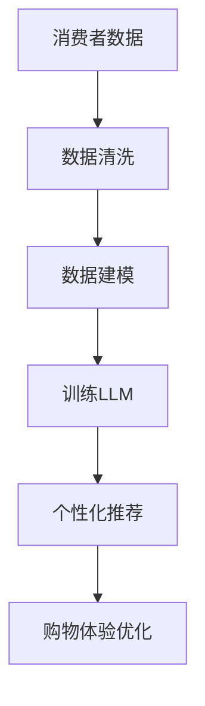
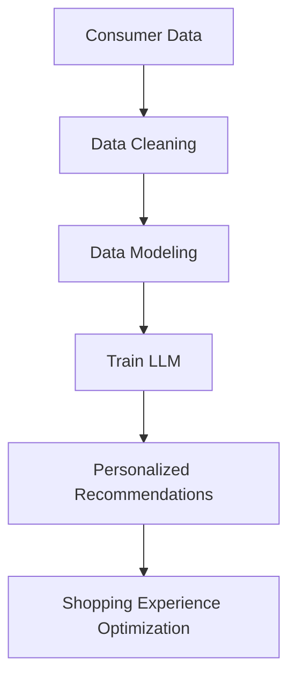

                 

### 背景介绍（Background Introduction）

随着人工智能技术的迅速发展，尤其是大型语言模型（LLM）的兴起，个性化购物体验成为了零售行业的重要发展方向。零售行业正面临着前所未有的挑战和机遇。一方面，消费者对购物体验的要求越来越高，他们期望在购物过程中得到个性化、即时和无缝的体验。另一方面，随着大数据、云计算和物联网技术的普及，零售商能够获取并分析大量的消费者数据，从而更好地了解消费者需求，提高营销效果。

本篇文章将深入探讨零售行业与LLM的结合，如何通过个性化购物体验提升消费者满意度和忠诚度。我们将首先介绍LLM的基本原理和架构，然后分析其如何应用于零售行业，最后探讨未来的发展趋势和面临的挑战。

### Background Introduction

With the rapid development of artificial intelligence technology, especially the rise of large language models (LLM), personalized shopping experiences have become a key direction in the retail industry. The retail industry is facing unprecedented challenges and opportunities. On the one hand, consumers' requirements for shopping experiences are increasing, and they expect to receive personalized, instant, and seamless experiences during their shopping process. On the other hand, with the widespread adoption of big data, cloud computing, and the Internet of Things (IoT), retailers can collect and analyze massive amounts of consumer data, thus better understanding consumer needs and improving marketing effectiveness.

This article will delve into the integration of LLM and the retail industry, exploring how personalized shopping experiences can enhance consumer satisfaction and loyalty. We will first introduce the basic principles and architecture of LLM, then analyze how it can be applied in the retail industry, and finally discuss future development trends and challenges.

----------------------

## 2. 核心概念与联系（Core Concepts and Connections）

在讨论零售与LLM的结合时，理解以下几个核心概念是至关重要的：

### 2.1 大型语言模型（Large Language Models，LLM）

大型语言模型（LLM）是一种深度学习模型，能够理解和生成人类语言。它们通过分析大量的文本数据来学习语言的语法、语义和上下文关系。LLM的一个典型代表是GPT（Generative Pre-trained Transformer）系列模型。这些模型经过大规模训练，能够生成连贯、相关且有时甚至创造性的文本输出。

### 2.2 个性化购物体验（Personalized Shopping Experience）

个性化购物体验是指零售商通过利用消费者的购买历史、偏好和行为数据，为他们提供定制化的产品推荐、营销信息和购物建议。这种体验旨在提高消费者的满意度、忠诚度和转化率。

### 2.3 数据隐私（Data Privacy）

在零售和LLM的应用中，数据隐私是一个关键问题。消费者担心他们的个人数据会被滥用或泄露。因此，零售商必须确保严格遵守数据保护法规，如通用数据保护条例（GDPR）。

### 2.4 客户体验（Customer Experience）

客户体验是零售商的核心关注点。通过使用LLM，零售商可以提供更加个性化、即时和无缝的购物体验，从而提高客户满意度和忠诚度。

### 2.5 人工智能与零售的融合（AI and Retail Integration）

人工智能与零售的融合意味着将AI技术应用于零售业务中的各个方面，包括库存管理、供应链优化、市场营销和客户服务。LLM在此过程中发挥着重要作用，特别是在个性化营销和客户体验方面。

### 2.6 Mermaid 流程图（Mermaid Flowchart）

为了更好地理解LLM在零售中的应用，我们可以使用Mermaid流程图来展示其核心概念和架构。以下是一个简化的Mermaid流程图示例：

在这个流程图中，消费者数据首先经过数据清洗，然后用于构建数据模型。接下来，这些模型被训练以理解消费者行为和偏好。最后，通过这些模型生成的个性化推荐用于优化购物体验。

----------------------

## 2. Core Concepts and Connections

When discussing the integration of retail with LLM, it is crucial to understand several core concepts:

### 2.1 Large Language Models (LLM)

Large language models (LLM) are deep learning models that can understand and generate human language. They learn the grammar, semantics, and contextual relationships of language by analyzing large amounts of textual data. A typical representative of LLM is the GPT (Generative Pre-trained Transformer) series models. These models are trained on a massive scale, enabling them to generate coherent, relevant, and sometimes even creative textual outputs.

### 2.2 Personalized Shopping Experience

A personalized shopping experience refers to retailers using consumer purchase history, preferences, and behavior data to provide customized product recommendations, marketing information, and shopping advice. This experience aims to enhance consumer satisfaction, loyalty, and conversion rates.

### 2.3 Data Privacy

Data privacy is a key issue in the application of retail and LLM. Consumers are concerned that their personal data may be misused or leaked. Therefore, retailers must ensure strict compliance with data protection regulations, such as the General Data Protection Regulation (GDPR).

### 2.4 Customer Experience

Customer experience is a core focus for retailers. By using LLM, retailers can provide more personalized, instant, and seamless shopping experiences, thereby improving customer satisfaction and loyalty.

### 2.5 AI and Retail Integration

The integration of AI and retail means applying AI technologies to various aspects of retail business, including inventory management, supply chain optimization, marketing, and customer service. LLM plays a crucial role in this process, particularly in personalized marketing and customer experience.

### 2.6 Mermaid Flowchart

To better understand the application of LLM in retail, we can use a Mermaid flowchart to illustrate its core concepts and architecture. Here is a simplified Mermaid flowchart example:

In this flowchart, consumer data first goes through data cleaning, then is used to construct data models. Next, these models are trained to understand consumer behavior and preferences. Finally, personalized recommendations generated by these models are used to optimize the shopping experience.

