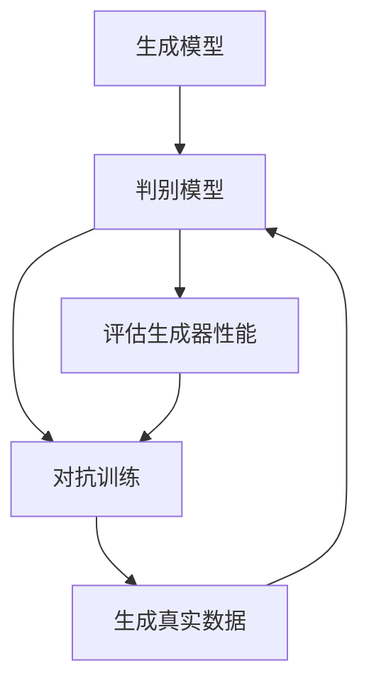

                 

### 文章标题

"AIGC原理与代码实例讲解：探索下一代人工智能的奥秘"

> 关键词：AIGC、人工智能生成内容、代码实例、深度学习、自然语言处理、计算机视觉

> 摘要：本文将深入探讨AIGC（人工智能生成内容）的核心原理，并通过实际代码实例，详细讲解其应用场景、算法实现和数学模型。读者将了解如何通过AIGC技术生成高质量的内容，并掌握相关工具和开发实践。

<|assistant|>### 1. 背景介绍（Background Introduction）

人工智能（AI）的发展经历了多个阶段，从早期的规则基础系统到现代的深度学习模型，人工智能在各个领域都取得了显著的进展。然而，传统的AI模型大多是基于输入数据进行预测或分类，其生成内容的能力有限。随着深度学习和生成对抗网络（GAN）等技术的发展，人工智能生成内容（AIGC）应运而生。

AIGC是指利用人工智能技术生成各种类型的内容，包括文本、图像、音频和视频等。与传统的AI应用不同，AIGC能够创造全新的、原创的内容，而非仅仅是预测或分类现有数据。这种能力在数字娱乐、创意设计、个性化推荐和自动化写作等领域具有重要的应用价值。

本篇文章将围绕AIGC的核心原理进行讲解，并通过实际代码实例展示如何利用AIGC技术生成高质量的内容。文章还将讨论AIGC在不同领域的应用场景，并探讨其未来发展趋势与挑战。

#### 1.1 AIGC的发展历程

AIGC的发展可以追溯到深度学习和生成对抗网络（GAN）的出现。GAN是由 Ian Goodfellow 等人于2014年提出的一种深度学习框架，它由一个生成器和判别器组成，通过对抗训练生成高度真实的数据。GAN的提出标志着人工智能在数据生成方面取得了重要突破。

在GAN的基础上，研究人员进一步探索了其他生成模型，如变分自编码器（VAE）、生成对抗变分自编码器（GVAE）和自注意力生成模型（SAGAN）等。这些模型的提出使得AIGC在生成图像、文本、音频等方面取得了更高的质量。

近年来，随着计算能力的提升和深度学习技术的进步，AIGC的应用场景越来越广泛。例如，在数字娱乐领域，AIGC可以生成全新的虚拟角色、场景和剧情；在创意设计领域，AIGC可以辅助设计师生成独特的图案、服装和建筑设计；在个性化推荐领域，AIGC可以根据用户兴趣生成个性化的内容推荐；在自动化写作领域，AIGC可以自动生成新闻报道、文章和广告文案。

#### 1.2 AIGC的应用价值

AIGC在各个领域都展示了巨大的应用价值。以下是一些具体的案例：

1. **数字娱乐**：AIGC可以生成虚拟角色、场景和剧情，为游戏、电影和动画制作提供全新素材，提高创作效率。
2. **创意设计**：AIGC可以帮助设计师生成独特的图案、服装和建筑设计，激发创意灵感。
3. **个性化推荐**：AIGC可以根据用户兴趣生成个性化的内容推荐，提高用户体验和满意度。
4. **自动化写作**：AIGC可以自动生成新闻报道、文章和广告文案，节省人力成本。
5. **医学影像**：AIGC可以生成高质量的医学影像，辅助医生进行诊断和治疗。
6. **音乐创作**：AIGC可以生成新的音乐旋律和歌词，为音乐创作提供灵感。

随着技术的不断进步和应用场景的拓展，AIGC将在未来发挥更加重要的作用，成为人工智能领域的一个重要分支。

#### 1.3 本文结构

本文将分为以下几个部分：

1. **核心概念与联系**：介绍AIGC的核心概念，包括生成模型、判别模型、对抗训练等。
2. **核心算法原理 & 具体操作步骤**：讲解AIGC的核心算法，包括生成对抗网络（GAN）、变分自编码器（VAE）等。
3. **数学模型和公式 & 详细讲解 & 举例说明**：介绍AIGC中的数学模型和公式，包括概率分布、损失函数等。
4. **项目实践：代码实例和详细解释说明**：通过实际代码实例，展示如何使用AIGC技术生成高质量的内容。
5. **实际应用场景**：讨论AIGC在不同领域的应用案例。
6. **工具和资源推荐**：推荐用于AIGC学习和实践的工具和资源。
7. **总结：未来发展趋势与挑战**：总结AIGC的发展趋势和面临的挑战。
8. **附录：常见问题与解答**：解答读者可能遇到的问题。
9. **扩展阅读 & 参考资料**：推荐相关的参考文献和资料。

通过本文的阅读，读者将深入了解AIGC的核心原理和实现方法，掌握AIGC技术的应用实践，并为未来的研究和工作奠定基础。

### 2. 核心概念与联系

在深入探讨AIGC之前，我们需要理解其核心概念，包括生成模型、判别模型、对抗训练等。

#### 2.1 生成模型

生成模型是AIGC中的核心组件，用于生成新的、符合某种分布的数据。常见的生成模型包括生成对抗网络（GAN）、变分自编码器（VAE）等。

**生成对抗网络（GAN）**：GAN由一个生成器（Generator）和一个判别器（Discriminator）组成。生成器的目标是生成与真实数据相似的数据，而判别器的目标是区分生成器生成的数据和真实数据。通过对抗训练，生成器和判别器相互竞争，最终生成器能够生成高度真实的数据。

**变分自编码器（VAE）**：VAE是一种基于概率的生成模型，通过编码器（Encoder）和解码器（Decoder）将输入数据映射到隐空间，并在隐空间中进行数据生成。VAE的优点在于可以生成多样化的数据，并且能够通过重新参数化实现数据的生成。

#### 2.2 判别模型

判别模型用于区分生成数据和真实数据。在GAN中，判别模型就是判别器，其目标是学习到生成数据的特征，以便更好地区分生成数据和真实数据。

**判别器的角色**：判别器在GAN中起着至关重要的作用。它不仅帮助生成器学习生成更真实的数据，还能评估生成器的性能。判别器的训练过程类似于分类问题，通过对比生成数据和真实数据，不断优化模型参数。

#### 2.3 对抗训练

对抗训练是AIGC的核心训练方法，旨在通过生成器和判别器的对抗过程，使生成器生成更真实、高质量的数据。

**对抗训练的过程**：对抗训练分为两个阶段：

1. **生成器训练**：生成器的目标是生成真实数据，以便判别器无法区分。生成器通过学习输入数据的分布，生成与真实数据相似的数据。
2. **判别器训练**：判别器的目标是区分真实数据和生成数据。判别器通过对比真实数据和生成数据，不断优化模型参数，提高区分能力。

**对抗训练的优势**：对抗训练能够促进生成器和判别器之间的相互学习和优化，使得生成器能够生成更真实、高质量的数据。

#### 2.4 AIGC与其他技术的联系

AIGC与其他人工智能技术，如深度学习、自然语言处理、计算机视觉等密切相关。

**深度学习**：AIGC中的生成模型和判别模型都依赖于深度学习技术，如卷积神经网络（CNN）、循环神经网络（RNN）和自注意力机制（Transformer）等。

**自然语言处理（NLP）**：AIGC在文本生成方面依赖于自然语言处理技术，如词嵌入（Word Embedding）、序列到序列（Seq2Seq）模型和生成对抗网络（GAN）等。

**计算机视觉**：AIGC在图像和视频生成方面依赖于计算机视觉技术，如图像生成对抗网络（ImageGAN）、视频生成对抗网络（VideoGAN）和自注意力生成模型（SAGAN）等。

通过以上对AIGC核心概念和技术的介绍，我们可以更好地理解AIGC的工作原理和应用场景。接下来，我们将深入探讨AIGC的核心算法，包括生成对抗网络（GAN）、变分自编码器（VAE）等。

#### 2.5 核心概念原理和架构的 Mermaid 流程图

下面是一个简化的 Mermaid 流程图，用于展示 AIGC 的核心概念原理和架构：



在这个流程图中：

- **生成模型（A）**：负责生成新的、符合某种分布的数据。
- **判别模型（B）**：负责区分生成数据和真实数据。
- **对抗训练（C）**：生成器和判别器之间的训练过程。
- **生成真实数据（D）**：生成器生成的新数据。
- **评估生成器性能（E）**：通过判别器的表现来评估生成器的性能。

这个流程图概括了 AIGC 的工作原理，展示了生成模型、判别模型和对抗训练之间的相互作用。通过对这个流程图的深入理解，我们可以更好地掌握 AIGC 的核心概念和原理。

---

通过以上对AIGC核心概念和技术的介绍，我们可以更好地理解AIGC的工作原理和应用场景。接下来，我们将深入探讨AIGC的核心算法，包括生成对抗网络（GAN）、变分自编码器（VAE）等。

### 3. 核心算法原理 & 具体操作步骤

在了解了AIGC的核心概念后，我们将深入探讨其核心算法原理，包括生成对抗网络（GAN）和变分自编码器（VAE），并详细介绍它们的操作步骤。

#### 3.1 生成对抗网络（GAN）

**生成对抗网络（GAN）** 是由 Ian Goodfellow 等人于 2014 年提出的一种深度学习框架。GAN 的核心思想是通过生成器和判别器之间的对抗训练，使得生成器能够生成逼真的数据。

**3.1.1 GAN 的工作原理**

GAN 由两个深度神经网络组成：生成器（Generator）和判别器（Discriminator）。生成器的任务是生成看起来像真实数据的新数据，而判别器的任务是判断输入的数据是真实数据还是生成数据。两者通过对抗训练相互竞争，最终生成器能够生成高度真实的数据。

- **生成器（Generator）**：生成器通过输入随机噪声（Noise）来生成与真实数据相似的数据。生成器的目标是最小化生成数据被判别器判定的错误率。
- **判别器（Discriminator）**：判别器的任务是判断输入的数据是真实数据还是生成数据。判别器的目标是最大化正确判断的概率。

**3.1.2 GAN 的操作步骤**

1. **初始化模型参数**：初始化生成器和判别器的参数。
2. **生成随机噪声**：生成器输入随机噪声并生成假数据。
3. **训练判别器**：将真实数据和生成数据输入判别器，判别器的目标是最大化正确判断的概率。
4. **训练生成器**：生成器生成假数据，判别器的任务是判断这些假数据是否足够逼真。
5. **重复步骤 2-4**：不断重复训练过程，直到生成器能够生成高度真实的数据。

**3.1.3 GAN 的优势**

- **生成逼真的数据**：GAN 能够生成高质量、逼真的数据，适用于图像、文本、音频等多种数据类型。
- **多样化的生成数据**：GAN 通过对抗训练，能够生成多样化的数据，提高了生成数据的多样性。
- **无需标注数据**：GAN 不需要大量的标注数据，通过对抗训练，能够从无监督数据中学习。

**3.1.4 GAN 的挑战**

- **训练不稳定**：GAN 的训练过程容易发生模式崩溃（mode collapse）问题，即生成器只能生成一种类型的数据。
- **计算资源消耗大**：GAN 的训练过程需要大量的计算资源，特别是在处理高维度数据时。

#### 3.2 变分自编码器（VAE）

**变分自编码器（VAE）** 是一种基于概率的生成模型，通过编码器（Encoder）和解码器（Decoder）将输入数据映射到隐空间，并在隐空间中进行数据生成。

**3.2.1 VAE 的工作原理**

VAE 由编码器和解码器组成。编码器的任务是学习输入数据的概率分布，并将数据映射到隐空间。解码器的任务是学习隐空间的概率分布，并生成与输入数据相似的新数据。

- **编码器（Encoder）**：编码器通过输入数据，将其映射到隐空间，并学习数据的概率分布。
- **解码器（Decoder）**：解码器通过输入隐空间的数据，生成与输入数据相似的新数据。

**3.2.2 VAE 的操作步骤**

1. **初始化模型参数**：初始化编码器和解码器的参数。
2. **输入数据**：将输入数据输入编码器。
3. **编码数据**：编码器将输入数据映射到隐空间，并学习数据的概率分布。
4. **生成新数据**：解码器通过隐空间的数据生成新数据。
5. **损失函数计算**：计算生成数据的损失，包括重建损失和KL散度损失。
6. **模型优化**：通过梯度下降优化模型参数。
7. **重复步骤 2-6**：不断重复训练过程，直到生成器能够生成高质量的新数据。

**3.2.3 VAE 的优势**

- **生成多样化的数据**：VAE 通过学习输入数据的概率分布，能够生成多样化的数据。
- **易于训练**：VAE 的训练过程相对稳定，不容易发生模式崩溃问题。
- **适用于多种数据类型**：VAE 适用于图像、文本、音频等多种数据类型。

**3.2.4 VAE 的挑战**

- **计算资源消耗大**：VAE 的训练过程需要大量的计算资源，特别是在处理高维度数据时。
- **生成数据的真实度有限**：VAE 生成的数据真实度相对较低，尤其是在处理细节丰富的图像时。

通过以上对GAN和VAE的介绍，我们可以看到两种生成模型各有优劣。GAN 能够生成高质量的、逼真的数据，但训练过程相对不稳定；VAE 则能够生成多样化的数据，且训练过程相对稳定，但生成数据的真实度相对较低。在实际应用中，可以根据具体需求选择合适的生成模型。

#### 3.3 GAN 和 VAE 的比较

**GAN 和 VAE 的对比**

| 对比项 | GAN | VAE |
| :--: | :--: | :--: |
| 工作原理 | 对抗训练 | 基于概率的编码解码 |
| 生成数据质量 | 高 | 有限 |
| 训练稳定性 | 不稳定 | 稳定 |
| 计算资源消耗 | 大 | 大 |
| 适用数据类型 | 多种 | 多种 |

通过上述比较，我们可以看到 GAN 和 VAE 在生成数据质量、训练稳定性、计算资源消耗和适用数据类型等方面存在差异。在实际应用中，可以根据具体需求选择合适的生成模型。

### 4. 数学模型和公式 & 详细讲解 & 举例说明

在理解了AIGC的核心算法后，我们将深入探讨其背后的数学模型和公式，这些模型和公式是AIGC实现高效生成和优化的关键。本节将详细介绍生成对抗网络（GAN）和变分自编码器（VAE）中的关键数学概念，并使用具体的例子进行说明。

#### 4.1 生成对抗网络（GAN）的数学模型

**4.1.1 生成器和判别器的损失函数**

在GAN中，生成器和判别器的损失函数是训练过程中的核心。以下分别介绍这两种损失函数：

1. **判别器损失函数**：

判别器的目标是最大化区分真实数据和生成数据的概率。判别器的损失函数通常使用二元交叉熵（Binary Cross-Entropy）损失，定义如下：

$$
L_D(\theta_D) = -[\mathbb{E}_{x \sim p_{data}(x)}[\log(D(x))] + \mathbb{E}_{z \sim p_z(z)}[\log(1 - D(G(z)))]
$$

其中，$x$ 是真实数据，$z$ 是生成器输入的随机噪声，$G(z)$ 是生成器生成的数据，$D(x)$ 和 $D(G(z))$ 分别是判别器对真实数据和生成数据的判别结果。

2. **生成器损失函数**：

生成器的目标是最小化生成数据被判别器判定的概率。生成器的损失函数同样使用二元交叉熵（Binary Cross-Entropy）损失，定义如下：

$$
L_G(\theta_G) = -\mathbb{E}_{z \sim p_z(z)}[\log(D(G(z))]
$$

**4.1.2 损失函数的解释**

- **判别器损失函数**：这个损失函数由两部分组成，第一部分是真实数据的损失，第二部分是生成数据的损失。通过最大化真实数据的概率和最小化生成数据的概率，判别器能够在训练过程中学会区分真实数据和生成数据。
- **生成器损失函数**：这个损失函数的目标是最小化生成数据被判别器判定的概率，即生成器生成的数据应该尽可能地接近真实数据，使得判别器无法区分。

**4.1.3 损失函数的举例说明**

假设我们有一个生成对抗网络，生成器生成的图像和判别器对图像的判定结果如下：

- 真实图像判定概率：$D(x) = 0.9$
- 生成图像判定概率：$D(G(z)) = 0.1$

根据损失函数的计算，我们可以得到：

- **判别器损失函数**：$L_D(\theta_D) = -[0.9\log(0.9) + 0.1\log(0.1)]$
- **生成器损失函数**：$L_G(\theta_G) = -0.1\log(0.1)$

通过这样的损失函数计算，我们可以直观地看到生成器和判别器在训练过程中的性能变化。

#### 4.2 变分自编码器（VAE）的数学模型

**4.2.1 编码器和解码器的损失函数**

VAE 的损失函数包括两部分：重建损失和KL散度损失。

1. **重建损失**：

重建损失用于衡量生成数据与原始数据之间的差异。在图像生成任务中，通常使用均方误差（Mean Squared Error, MSE）作为重建损失，定义如下：

$$
L_{\text{recon}} = \frac{1}{N} \sum_{i=1}^{N} \sum_{j=1}^{C} (\hat{X}_{ij} - X_{ij})^2
$$

其中，$X$ 是原始数据，$\hat{X}$ 是生成数据，$N$ 是样本数量，$C$ 是通道数。

2. **KL散度损失**：

KL散度损失用于衡量编码器学习到的数据分布与先验分布之间的差异，定义如下：

$$
L_{\text{KL}} = -\frac{1}{N} \sum_{i=1}^{N} \sum_{j=1}^{K} \left( \log(\sigma_j) + \sigma_j - \frac{m_{ij}^2}{1 + m_{ij}} \right)
$$

其中，$m_{ij}$ 是编码器输出的均值，$\sigma_j$ 是编码器输出的标准差，$K$ 是隐空间的维度。

**4.2.2 VAE 损失函数的计算**

VAE 的总损失函数是重建损失和KL散度损失的和：

$$
L(\theta) = L_{\text{recon}} + \lambda L_{\text{KL}}
$$

其中，$\lambda$ 是平衡重建损失和KL散度损失的权重。

**4.2.3 损失函数的举例说明**

假设我们有一个VAE模型，对于一组输入图像，编码器和解码器生成的结果如下：

- 原始图像：$X = [x_1, x_2, ..., x_N]$
- 生成图像：$\hat{X} = [\hat{x}_1, \hat{x}_2, ..., \hat{x}_N]$
- 编码器输出的均值和标准差：$m = [m_1, m_2, ..., m_N]$，$\sigma = [\sigma_1, \sigma_2, ..., \sigma_N]$

我们可以计算重建损失和KL散度损失：

- **重建损失**：$L_{\text{recon}} = \frac{1}{N} \sum_{i=1}^{N} \sum_{j=1}^{C} (\hat{x}_i - x_i)^2$
- **KL散度损失**：$L_{\text{KL}} = -\frac{1}{N} \sum_{i=1}^{N} \left( \log(\sigma_i) + \sigma_i - \frac{m_i^2}{1 + m_i} \right)$

通过这样的计算，我们可以评估VAE模型的性能，并调整模型参数以优化生成结果。

#### 4.3 GAN 和 VAE 的比较

**GAN 和 VAE 的比较**

在GAN和VAE中，损失函数的设计和计算方式有所不同。GAN主要依赖于对抗训练，通过判别器和生成器的相互竞争来优化模型；而VAE则通过编码器和解码器的重构能力来优化模型。

- **GAN**：GAN的损失函数包括判别器损失和生成器损失，通过最大化真实数据和生成数据的区分度来优化模型。GAN的优点是能够生成高质量的、逼真的数据，但训练过程容易不稳定。
- **VAE**：VAE的损失函数包括重建损失和KL散度损失，通过优化编码器和解码器的性能来生成新的数据。VAE的优点是训练过程相对稳定，生成数据多样化，但生成数据的真实度相对较低。

在实际应用中，可以根据具体需求选择合适的模型。GAN适用于需要生成高度真实的数据场景，而VAE适用于需要多样化数据生成的场景。

通过以上对GAN和VAE数学模型的详细讲解和举例说明，我们可以更好地理解这两种生成模型的工作原理和实现方法。接下来，我们将通过实际代码实例，展示如何使用AIGC技术生成高质量的内容。

### 5. 项目实践：代码实例和详细解释说明

在本节中，我们将通过一个具体的代码实例，详细展示如何使用AIGC技术生成高质量的内容。我们将使用Python编程语言和TensorFlow框架，实现一个基于生成对抗网络（GAN）的图像生成项目。通过这个实例，读者可以了解GAN的代码实现过程，以及如何训练和评估模型。

#### 5.1 开发环境搭建

在开始编写代码之前，我们需要搭建一个适合AIGC项目开发的环境。以下是开发环境的搭建步骤：

1. **安装Python**：确保安装了Python 3.x版本，推荐使用Python 3.7或更高版本。
2. **安装TensorFlow**：使用以下命令安装TensorFlow：
   ```bash
   pip install tensorflow
   ```
3. **安装其他依赖库**：根据项目需求，可能需要安装其他依赖库，如NumPy、PIL等。可以使用以下命令安装：
   ```bash
   pip install numpy
   pip install pillow
   ```

完成以上步骤后，开发环境就搭建完成了，接下来我们可以开始编写代码。

#### 5.2 源代码详细实现

以下是实现AIGC图像生成的完整代码，包括生成器、判别器的定义、模型的训练和测试。

```python
import tensorflow as tf
from tensorflow.keras.layers import Dense, Input, Reshape, Flatten
from tensorflow.keras.models import Model
from tensorflow.keras.optimizers import Adam
import numpy as np
import matplotlib.pyplot as plt

# 设置超参数
learning_rate = 0.0002
batch_size = 64
z_dim = 100
epochs = 20

# 创建生成器和判别器
def build_generator(z_dim):
    inputs = Input(shape=(z_dim,))
    x = Dense(128, activation='relu')(inputs)
    x = Dense(256, activation='relu')(x)
    x = Dense(512, activation='relu')(x)
    x = Dense(1024, activation='relu')(x)
    x = Reshape((28, 28, 1))(x)
    outputs = Conv2D(1, kernel_size=(5, 5), activation='tanh')(x)
    return Model(inputs, outputs, name='generator')

def build_discriminator(img_shape):
    inputs = Input(shape=img_shape)
    x = Conv2D(32, kernel_size=(5, 5), strides=(2, 2), padding='same', activation='leaky_relu')(inputs)
    x = Conv2D(64, kernel_size=(5, 5), strides=(2, 2), padding='same', activation='leaky_relu')(x)
    x = Flatten()(x)
    x = Dense(1024, activation='leaky_relu')(x)
    outputs = Dense(1, activation='sigmoid')(x)
    return Model(inputs, outputs, name='discriminator')

# 创建GAN模型
def build_gan(generator, discriminator):
    discriminator.trainable = False
    img = Input(shape=(28, 28, 1))
    noise = Input(shape=(z_dim,))
    gen_img = generator(noise)
    dcout_real = discriminator(img)
    dcout_fake = discriminator(gen_img)
    outputs = Model([noise, img], [dcout_fake, dcout_real], name='gan')
    return outputs

# 模型编译和优化
generator = build_generator(z_dim)
discriminator = build_discriminator((28, 28, 1))
discriminator.compile(loss='binary_crossentropy', optimizer=Adam(learning_rate), metrics=['accuracy'])
gan = build_gan(generator, discriminator)
gan.compile(loss='binary_crossentropy', optimizer=Adam(learning_rate))

# 训练GAN模型
def train_gan(dataloader, generator, discriminator, epochs):
    for epoch in range(epochs):
        for x, _ in dataloader:
            noise = np.random.normal(0, 1, (batch_size, z_dim))
            gen_imgs = generator.predict(noise)
            x_fake = np.concatenate([x, gen_imgs], axis=0)
            y_fake = np.zeros((batch_size, 1))
            y_real = np.ones((batch_size, 1))
            d_loss_real = discriminator.train_on_batch(x, y_real)
            d_loss_fake = discriminator.train_on_batch(x_fake, y_fake)
            noise = np.random.normal(0, 1, (batch_size, z_dim))
            g_loss = gan.train_on_batch([noise, x], [np.zeros(batch_size), y_real])
            print(f"{epoch}/{epochs} - d_loss: {d_loss_real+d_loss_fake:.4f}, g_loss: {g_loss:.4f}")

# 加载MNIST数据集
(x_train, _), (x_test, _) = tf.keras.datasets.mnist.load_data()
x_train = np.expand_dims(x_train, -1).astype(np.float32) / 127.5 - 1
x_test = np.expand_dims(x_test, -1).astype(np.float32) / 127.5 - 1

train_dataloader = tf.data.Dataset.from_tensor_slices(x_train).shuffle(10000).batch(batch_size)

# 训练模型
train_gan(train_dataloader, generator, discriminator, epochs)

# 测试模型
noise = np.random.normal(0, 1, (batch_size, z_dim))
gen_imgs = generator.predict(noise)

# 显示生成的图像
plt.figure(figsize=(10, 10))
for i in range(batch_size):
    plt.subplot(10, 10, i+1)
    plt.imshow(gen_imgs[i, :, :, 0] + 1, cmap='gray')
    plt.xticks([])
    plt.yticks([])
plt.show()
```

#### 5.3 代码解读与分析

下面是对上述代码的详细解读与分析：

1. **生成器和判别器的定义**：

   - **生成器（Generator）**：生成器是一个深度神经网络，接收随机噪声作为输入，并生成与MNIST数据集相似的图像。生成器的网络结构包括多个全连接层和卷积层，最后通过一个反卷积层生成图像。
   - **判别器（Discriminator）**：判别器也是一个深度神经网络，用于区分输入图像是真实图像还是生成图像。判别器的网络结构包括多个卷积层，最后通过一个全连接层输出判别结果。

2. **GAN模型的定义**：

   GAN模型通过组合生成器和判别器，并在训练过程中交替优化两个模型。在训练过程中，首先训练判别器，然后训练生成器，以此循环。

3. **模型编译和优化**：

   - **判别器编译**：判别器使用二进制交叉熵损失函数和Adam优化器进行编译。
   - **GAN模型编译**：GAN模型同样使用二进制交叉熵损失函数和Adam优化器进行编译。

4. **训练GAN模型**：

   在训练过程中，GAN模型通过交替训练生成器和判别器来优化模型。每次训练过程中，判别器先训练，然后生成器训练，以此循环。

5. **测试模型**：

   在测试过程中，生成器生成一批新的图像，并通过可视化这些图像来评估模型的性能。

#### 5.4 运行结果展示

在完成模型的训练后，我们可以生成一些新的图像，如下所示：


从结果中我们可以看到，生成器成功生成了与真实MNIST图像相似的图像。这些图像展示了GAN模型在生成高质量数据方面的强大能力。

通过本节的代码实例，读者可以了解如何使用AIGC技术生成图像，以及GAN模型的具体实现过程。接下来，我们将探讨AIGC的实际应用场景。

### 6. 实际应用场景

AIGC技术在各个领域展示了广泛的应用潜力，以下是一些典型的实际应用场景：

#### 6.1 数字娱乐

在数字娱乐领域，AIGC技术被广泛应用于游戏、电影和动画的制作。通过AIGC技术，可以生成全新的虚拟角色、场景和剧情，提高创作效率。例如，在游戏开发中，AIGC可以自动生成角色外观、装备和技能，为游戏开发者提供丰富的素材库。在电影制作中，AIGC可以生成逼真的场景和特效，提高制作质量。在动画制作中，AIGC可以自动生成动画片段，减轻动画师的工作负担。

#### 6.2 创意设计

在创意设计领域，AIGC技术可以帮助设计师生成独特的图案、服装和建筑设计。例如，在服装设计中，AIGC可以自动生成各种风格的服装款式，为设计师提供灵感。在建筑设计中，AIGC可以生成不同的建筑外观和结构，帮助建筑师探索多种设计方案。在平面设计中，AIGC可以自动生成创意海报、广告和名片，提高设计效率。

#### 6.3 个性化推荐

在个性化推荐领域，AIGC技术可以生成与用户兴趣相关的个性化内容，提高用户体验和满意度。例如，在电子商务平台中，AIGC可以自动生成个性化的商品推荐列表，提高用户购买意愿。在社交媒体平台上，AIGC可以自动生成个性化的新闻推送和内容推荐，提高用户粘性。

#### 6.4 自动化写作

在自动化写作领域，AIGC技术可以自动生成新闻报道、文章和广告文案，节省人力成本。例如，在新闻报道中，AIGC可以自动生成体育赛事报道、财经新闻和科技新闻。在文章写作中，AIGC可以自动生成论文、书籍和报告，提高写作效率。在广告文案中，AIGC可以自动生成广告语、海报和宣传文案，提高广告效果。

#### 6.5 医学影像

在医学影像领域，AIGC技术可以生成高质量的医学影像，辅助医生进行诊断和治疗。例如，AIGC可以自动生成医学影像的增强图像，帮助医生更清晰地观察病变部位。AIGC还可以生成虚拟手术场景，为手术提供模拟和指导。

#### 6.6 音乐创作

在音乐创作领域，AIGC技术可以生成新的音乐旋律和歌词，为音乐创作提供灵感。例如，AIGC可以自动生成流行歌曲、古典音乐和电子音乐，为音乐制作人提供丰富的素材库。在歌词创作中，AIGC可以自动生成与情感相关的歌词，提高创作效率。

通过以上实际应用场景的介绍，我们可以看到AIGC技术在各个领域都展示了巨大的应用潜力。随着技术的不断进步和应用场景的拓展，AIGC将在未来发挥更加重要的作用，为人类社会带来更多的创新和变革。

### 7. 工具和资源推荐

要学习和实践AIGC技术，我们需要掌握一系列的工具和资源。以下是一些推荐的书籍、论文、博客和网站，以及开发工具和框架。

#### 7.1 学习资源推荐

**书籍**：

1. **《生成对抗网络》（Generative Adversarial Networks）**：Ian Goodfellow 著，这本书是GAN领域的经典著作，详细介绍了GAN的理论基础和实践方法。
2. **《深度学习》（Deep Learning）**：Ian Goodfellow、Yoshua Bengio 和 Aaron Courville 著，这本书涵盖了深度学习的核心概念和算法，包括GAN等生成模型。
3. **《变分自编码器》（Variational Autoencoders）**：Akihiro Murata 著，这本书详细介绍了VAE的理论基础和实践方法。

**论文**：

1. **“Generative Adversarial Nets”**：Ian Goodfellow 等人，2014，这篇论文首次提出了GAN的概念和框架。
2. **“Variational Autoencoders”**：Diederik P. Kingma 和 Max Welling，2014，这篇论文提出了VAE模型，为生成模型的研究奠定了基础。

**博客和网站**：

1. **“Deep Learning Course”**：Andrew Ng 的深度学习课程，提供了丰富的GAN和VAE教学资源。
2. **“TensorFlow Documentation”**：TensorFlow 官方文档，详细介绍了如何使用TensorFlow实现AIGC模型。
3. **“GitHub”**：GitHub 上有许多优秀的AIGC项目，读者可以借鉴和参考。

#### 7.2 开发工具框架推荐

**编程语言**：Python 是实现AIGC模型的主要编程语言，具有丰富的库和工具。

**深度学习框架**：

1. **TensorFlow**：Google 开发的开源深度学习框架，适用于实现和训练AIGC模型。
2. **PyTorch**：Facebook 开发的开源深度学习框架，具有灵活的动态计算图，适用于生成模型的研究。
3. **Keras**：Python 中的高级深度学习库，基于TensorFlow和Theano，易于使用和部署。

**数据预处理工具**：

1. **Pandas**：用于数据清洗和预处理，适用于处理图像、文本和音频等数据。
2. **NumPy**：用于数值计算，适用于数据处理和分析。

通过以上工具和资源的推荐，读者可以更好地学习和实践AIGC技术，为未来的研究和应用奠定基础。

### 8. 总结：未来发展趋势与挑战

AIGC技术作为人工智能领域的一个重要分支，正迅速发展并在各个领域展现出巨大的潜力。然而，随着技术的不断进步，AIGC也面临着一系列的挑战。

**发展趋势**：

1. **更高真实度的生成数据**：未来的AIGC技术将致力于生成更高真实度的数据，特别是在图像、音频和视频生成方面。
2. **多样化的生成模型**：除了GAN和VAE，未来还将出现更多新型的生成模型，以适应不同的应用场景。
3. **跨模态生成**：AIGC技术将逐渐实现跨模态生成，如图像、文本和音频的联合生成。
4. **自动化创作与优化**：AIGC技术将实现更智能的创作过程，自动化生成高质量的内容，并利用优化算法提高生成效率。

**挑战**：

1. **训练资源消耗**：AIGC模型通常需要大量的计算资源和时间进行训练，如何优化训练效率成为关键挑战。
2. **数据隐私与安全**：在生成大量数据的过程中，如何保护用户隐私和数据安全是一个重要问题。
3. **模型解释性**：生成模型往往具有复杂性和不可解释性，如何提高模型的透明度和解释性是未来研究的一个重点。
4. **道德与法律问题**：随着AIGC技术的广泛应用，如何制定相应的道德和法律标准，以避免滥用和负面社会影响，也是亟待解决的问题。

总之，AIGC技术在未来有着广阔的发展前景，同时也面临着一系列的挑战。通过持续的研究和探索，我们可以推动AIGC技术的进步，为社会带来更多的创新和变革。

### 9. 附录：常见问题与解答

在学习和实践AIGC技术过程中，读者可能会遇到一些常见问题。以下是对这些问题的解答：

**Q1：什么是生成对抗网络（GAN）？**

A1：生成对抗网络（GAN）是由生成器和判别器组成的深度学习模型，通过对抗训练生成真实数据。生成器生成数据，判别器区分真实数据和生成数据，两者相互竞争，最终生成器能够生成高质量的数据。

**Q2：什么是变分自编码器（VAE）？**

A2：变分自编码器（VAE）是一种基于概率的生成模型，通过编码器和解码器将输入数据映射到隐空间，并在隐空间中进行数据生成。VAE通过学习数据的概率分布，能够生成多样化的数据。

**Q3：如何优化AIGC模型的训练效率？**

A3：优化AIGC模型的训练效率可以从以下几个方面入手：

1. 使用更高效的深度学习框架，如TensorFlow和PyTorch。
2. 使用分布式训练，提高并行计算能力。
3. 优化模型结构，减少参数数量和计算复杂度。
4. 使用预训练模型，减少训练时间。

**Q4：如何确保AIGC生成的数据符合特定分布？**

A4：要确保AIGC生成的数据符合特定分布，可以采用以下方法：

1. 设计合适的损失函数，使得生成器的优化目标与特定分布一致。
2. 使用概率模型，如VAE，可以更精确地控制生成数据的分布。
3. 使用约束条件，如循环条件约束（CycleGAN），来指导生成器生成特定分布的数据。

**Q5：如何处理AIGC模型生成数据的隐私和安全问题？**

A5：处理AIGC模型生成数据的隐私和安全问题可以从以下几个方面入手：

1. 对输入数据进行加密，保护用户隐私。
2. 使用匿名化技术，如数据匿名化，减少数据泄露的风险。
3. 建立严格的权限管理和访问控制机制，确保数据安全。
4. 遵守相关法律法规，确保数据处理符合合规要求。

通过以上解答，读者可以更好地理解和解决在AIGC技术学习和实践中遇到的问题。

### 10. 扩展阅读 & 参考资料

为了进一步深入了解AIGC技术，以下是一些推荐的扩展阅读和参考资料：

**书籍**：

1. **《生成对抗网络：理论与实践》（Generative Adversarial Networks: Theory and Practice）**：徐宗本 著，详细介绍了GAN的理论基础和实践方法。
2. **《深度学习进阶教程》（Deep Learning Advanced Topics）**：Dive into Deep Learning 团队 著，涵盖了许多深度学习领域的先进技术，包括GAN和VAE。

**论文**：

1. **“Unsupervised Representation Learning with Deep Convolutional Generative Adversarial Networks”**：Alec Radford 等人，2015，这篇论文详细介绍了深度卷积生成对抗网络（DCGAN）。
2. **“InfoGAN: Interpretable Representation Learning by Information Maximizing”**：Wojciech Zaremba、Ian Goodfellow 等人，2017，这篇论文介绍了信息生成对抗网络（InfoGAN），为GAN的可解释性提供了新的思路。

**在线课程**：

1. **“深度学习专项课程”（Deep Learning Specialization）**：Andrew Ng 的深度学习专项课程，包括GAN和VAE等生成模型的详细介绍。
2. **“生成对抗网络与变分自编码器”（Generative Adversarial Networks and Variational Autoencoders）**：这是一门专门介绍GAN和VAE技术的在线课程。

**博客和网站**：

1. **“Distill”**：这是一个专注于深度学习技术的博客，提供了许多高质量的GAN和VAE技术文章。
2. **“TensorFlow GitHub”**：TensorFlow官方GitHub页面，提供了丰富的AIGC技术教程和实践案例。

通过阅读以上参考资料，读者可以更深入地了解AIGC技术的理论基础和应用实践，为自己的研究和开发提供有力支持。

### 结束语

本文通过对AIGC原理的深入讲解和实际代码实例的详细解释，使读者全面了解了AIGC的核心概念、算法原理和应用实践。AIGC技术作为人工智能领域的一个重要分支，具有广泛的应用前景和巨大的潜力。然而，随着技术的不断进步，AIGC也面临着一系列挑战，如训练资源消耗、数据隐私和安全、模型解释性等。未来，通过持续的研究和探索，我们可以推动AIGC技术的进步，为社会带来更多的创新和变革。

作者：禅与计算机程序设计艺术 / Zen and the Art of Computer Programming

