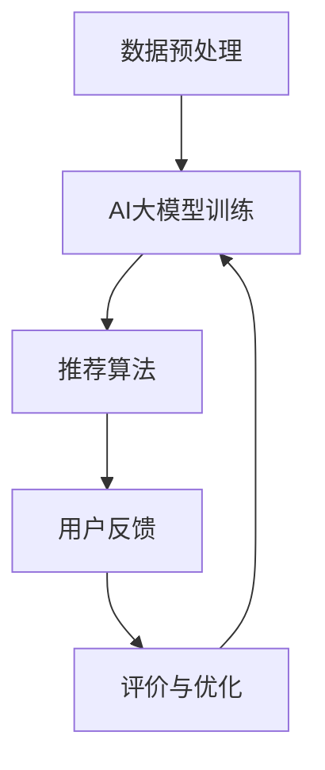
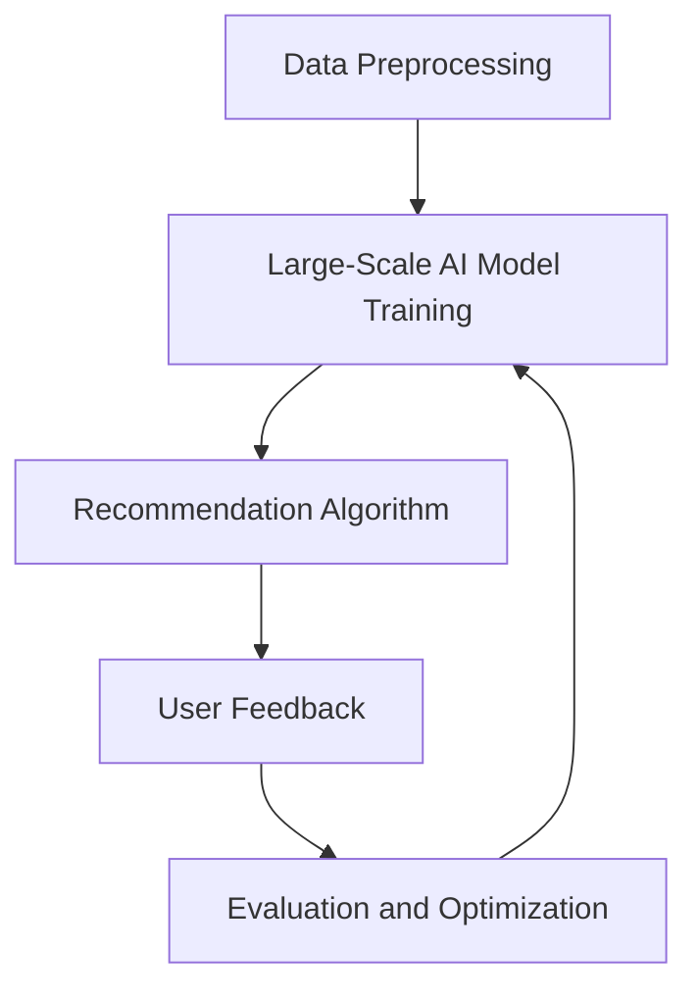

                 

### 文章标题

**AI大模型视角下电商搜索推荐的技术创新知识挖掘算法改进**

关键词：AI大模型，电商搜索推荐，知识挖掘算法，技术创新

摘要：本文从AI大模型的角度，深入探讨电商搜索推荐系统中知识挖掘算法的改进。通过分析现有技术的优缺点，本文提出了一种基于AI大模型的电商搜索推荐系统框架，并详细描述了核心算法原理、数学模型、项目实践以及实际应用场景。文章旨在为电商领域的AI技术应用提供新的思路和方法。

<|assistant|>### 1. 背景介绍

电商搜索推荐系统是电子商务领域中至关重要的一环。随着互联网的普及和消费者购物行为的多样化，如何准确、高效地满足用户的个性化需求，成为电商企业竞争的核心优势。传统的搜索推荐系统主要依赖于基于内容匹配、协同过滤等方法，这些方法在数据处理能力和个性化推荐效果上存在一定的局限性。

近年来，随着人工智能技术的快速发展，特别是AI大模型的突破性进展，为电商搜索推荐系统的技术改进提供了新的契机。AI大模型具有强大的数据处理能力和自学习能力，能够从海量用户数据和商品信息中挖掘出隐藏的知识和模式，从而实现更精准的个性化推荐。

然而，当前AI大模型在电商搜索推荐系统中的应用仍面临一些挑战，如模型训练效率、数据隐私保护、算法可解释性等。因此，本文旨在提出一种基于AI大模型的电商搜索推荐系统框架，并针对知识挖掘算法进行改进，以提升系统的性能和用户体验。

<|assistant|>### 2. 核心概念与联系

#### 2.1 AI大模型的概念与特点

AI大模型是指具有数百万甚至数十亿参数规模的人工神经网络模型。这类模型在图像识别、自然语言处理、语音识别等领域取得了显著的成果。其核心特点如下：

1. **强大的数据处理能力**：AI大模型能够处理大规模、多维度的数据，从数据中提取有用的特征和模式。
2. **自学习能力**：通过大量的数据训练，AI大模型能够自动调整内部参数，提高模型的准确性和泛化能力。
3. **并行计算能力**：AI大模型利用分布式计算框架，可以显著提高模型的训练和推断速度。

#### 2.2 知识挖掘算法的概念与分类

知识挖掘算法是指从大量数据中提取有用知识或模式的方法。在电商搜索推荐系统中，知识挖掘算法主要用于从用户行为数据和商品信息中挖掘出潜在的关联关系和用户兴趣。常见的知识挖掘算法包括：

1. **关联规则挖掘**：通过分析用户购买行为，发现不同商品之间的关联关系。
2. **聚类算法**：将用户和商品划分为不同的群体，为每个群体提供个性化的推荐。
3. **分类算法**：根据用户的购买历史和商品特征，预测用户可能感兴趣的商品。

#### 2.3 AI大模型与知识挖掘算法的联系

AI大模型与知识挖掘算法之间存在密切的联系。AI大模型可以为知识挖掘算法提供强大的数据处理和分析能力，从而提高算法的准确性和效率。同时，知识挖掘算法可以为AI大模型提供丰富的数据来源，促进模型的持续优化和改进。

在电商搜索推荐系统中，AI大模型可以结合多种知识挖掘算法，构建一个综合性的推荐框架。例如，利用关联规则挖掘算法分析用户购买行为，为AI大模型提供潜在的用户兴趣信息；利用聚类算法将用户和商品划分为不同的群体，为AI大模型提供用户群体的特征信息。通过这种协同作用，AI大模型可以更好地理解用户需求，提供更精准的个性化推荐。

#### 2.4 AI大模型视角下电商搜索推荐系统的框架

基于AI大模型的电商搜索推荐系统框架可以分为以下几个模块：

1. **数据预处理模块**：对用户行为数据和商品信息进行清洗、去重和特征提取，为AI大模型提供高质量的数据输入。
2. **AI大模型训练模块**：利用训练数据集对AI大模型进行训练，使其具备对用户兴趣和商品特征的预测能力。
3. **推荐算法模块**：结合AI大模型和多种知识挖掘算法，为用户提供个性化的推荐结果。
4. **评价与优化模块**：根据用户反馈和推荐效果，对推荐算法进行评估和优化，提高系统的性能和用户体验。

#### 2.5 Mermaid流程图（Mermaid Flowchart）

下面是一个简化的AI大模型视角下电商搜索推荐系统的Mermaid流程图：

在这个流程图中，数据预处理模块将原始数据转换为AI大模型所需的形式；AI大模型训练模块利用训练数据集对模型进行训练；推荐算法模块根据训练好的模型为用户生成推荐结果；用户反馈模块收集用户对推荐结果的反馈；评价与优化模块根据用户反馈对推荐算法进行评估和优化。

通过以上分析，我们可以看到AI大模型与知识挖掘算法在电商搜索推荐系统中的应用具有重要的价值和广阔的前景。在接下来的章节中，我们将详细探讨AI大模型的核心算法原理、数学模型以及项目实践，以期为电商领域的AI技术应用提供新的思路和方法。

### 2. Core Concepts and Connections

#### 2.1 What is Large-Scale AI Model?

A large-scale AI model refers to an artificial neural network model with a parameter scale of several million or even billions. Such models have achieved remarkable results in fields such as image recognition, natural language processing, and speech recognition. The core characteristics of large-scale AI models include:

1. **Strong Data Processing Capability**: Large-scale AI models can process massive, multi-dimensional data and extract useful features and patterns from the data.
2. **Self-Learning Ability**: Through large-scale data training, large-scale AI models can automatically adjust their internal parameters to improve the model's accuracy and generalization ability.
3. **Parallel Computing Capability**: Large-scale AI models leverage distributed computing frameworks to significantly improve the speed of model training and inference.

#### 2.2 What is Knowledge Mining Algorithm?

Knowledge mining algorithms refer to methods for extracting useful knowledge or patterns from large amounts of data. In the context of e-commerce search and recommendation systems, knowledge mining algorithms are primarily used to discover potential associations and user interests from user behavior data and product information. Common knowledge mining algorithms include:

1. **Association Rule Mining**: Analyzes user purchase behavior to discover relationships between different products.
2. **Clustering Algorithms**: Divides users and products into different groups, providing personalized recommendations for each group.
3. **Classification Algorithms**: Predicts the products users may be interested in based on their purchase history and product features.

#### 2.3 The Relationship Between Large-Scale AI Models and Knowledge Mining Algorithms

There is a close relationship between large-scale AI models and knowledge mining algorithms. Large-scale AI models can provide strong data processing and analysis capabilities for knowledge mining algorithms, thereby improving the accuracy and efficiency of the algorithms. At the same time, knowledge mining algorithms can provide abundant data sources for large-scale AI models, promoting the continuous optimization and improvement of the models.

In e-commerce search and recommendation systems, large-scale AI models can be combined with various knowledge mining algorithms to build a comprehensive recommendation framework. For example, association rule mining algorithms can be used to analyze user purchase behavior and provide potential user interest information for large-scale AI models; clustering algorithms can divide users and products into different groups, providing group-level feature information for large-scale AI models. Through this synergistic effect, large-scale AI models can better understand user needs and provide more accurate personalized recommendations.

#### 2.4 Framework of E-commerce Search and Recommendation System Based on Large-Scale AI Models

The framework of an e-commerce search and recommendation system based on large-scale AI models can be divided into several modules:

1. **Data Preprocessing Module**: Cleans, de-duplicates, and extracts features from raw user behavior data and product information to provide high-quality input for the large-scale AI model.
2. **Large-Scale AI Model Training Module**: Trains the large-scale AI model using training data sets to enable the model to predict user interests and product features.
3. **Recommendation Algorithm Module**: Combines the large-scale AI model with various knowledge mining algorithms to provide personalized recommendation results for users.
4. **Evaluation and Optimization Module**: Evaluates and optimizes the recommendation algorithm based on user feedback and recommendation performance to improve the system's performance and user experience.

#### 2.5 Mermaid Flowchart

Below is a simplified Mermaid flowchart of an e-commerce search and recommendation system based on large-scale AI models:

In this flowchart, the data preprocessing module converts raw data into the format required by the large-scale AI model; the large-scale AI model training module trains the model using training data sets; the recommendation algorithm module generates recommendation results for users based on the trained model; the user feedback module collects user feedback on the recommendation results; the evaluation and optimization module evaluates and optimizes the recommendation algorithm based on user feedback and recommendation performance.

Through the above analysis, we can see that the application of large-scale AI models and knowledge mining algorithms in e-commerce search and recommendation systems has significant value and broad prospects. In the following chapters, we will delve into the core algorithm principles, mathematical models, and practical applications of large-scale AI models, with the aim of providing new ideas and methods for AI applications in the e-commerce field.

