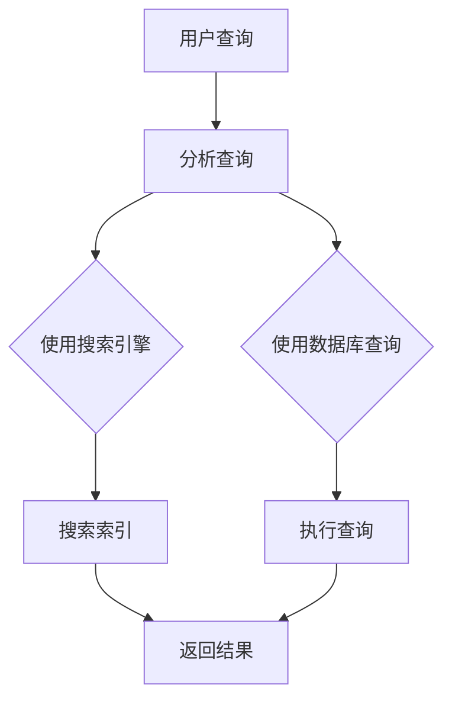
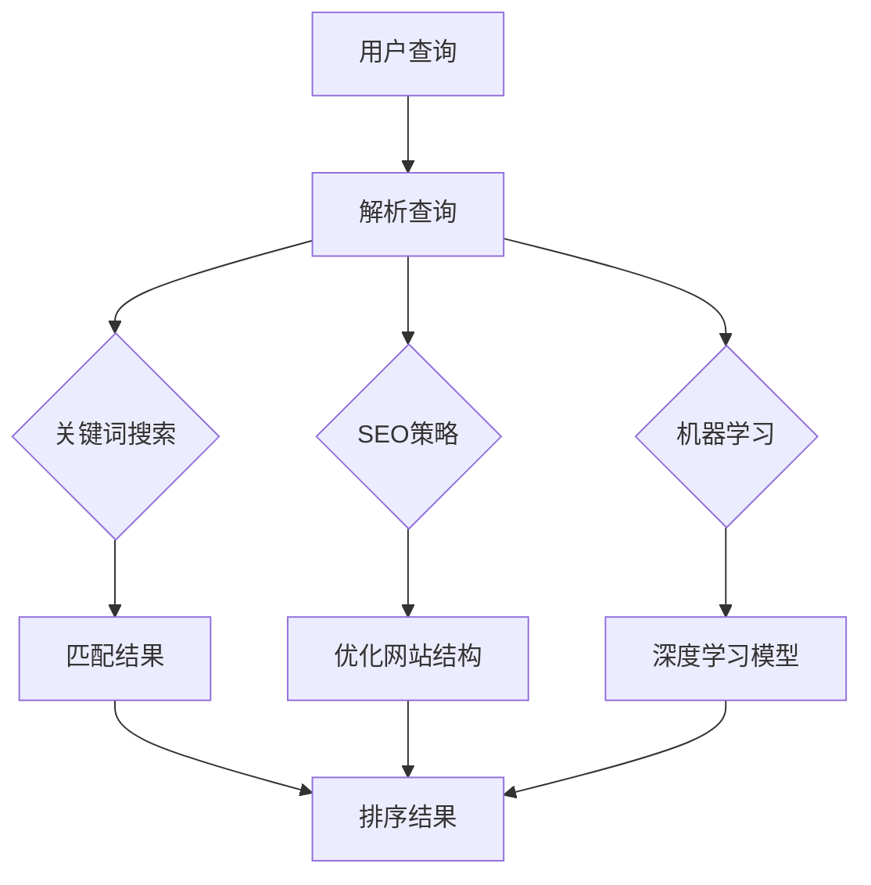

                 

# 信息过载与信息搜索策略与指南：在庞大的信息海洋中找到所需信息

## 摘要

在当今数字化时代，我们每天都会接触到大量的信息。如何有效地筛选和利用这些信息，成为了每个人都需要面对的挑战。本文将探讨信息过载的现象及其对个人的影响，并详细介绍一系列有效的信息搜索策略与指南。通过这些策略，我们可以在庞大的信息海洋中找到所需的信息，提升个人和组织的效率与生产力。

## 1. 背景介绍

### 信息过载的现状

随着互联网的普及和移动设备的广泛使用，人们获取信息的方式发生了翻天覆地的变化。然而，这种变化也带来了一系列问题。如今，我们每天都会接收到无数的信息，包括电子邮件、社交媒体更新、新闻推送、广告等。这些信息中，有很大一部分与我们工作和生活无关，甚至可能会分散我们的注意力，影响我们的工作效率和决策能力。

### 个人和组织的影响

信息过载对个人的影响是显而易见的。它可能导致焦虑、压力增加，甚至影响心理健康。同时，对于企业或组织来说，信息过载也可能导致资源的浪费，影响战略决策和执行力。因此，如何有效地管理和利用信息，成为了我们需要解决的重要问题。

## 2. 核心概念与联系

### 信息检索系统

信息检索系统是帮助用户从大量数据中快速找到所需信息的重要工具。这类系统通常包括搜索引擎、数据库查询工具等。它们的工作原理是基于关键词匹配、文本分析、机器学习等技术，以实现高效的信息检索。

### 搜索引擎

搜索引擎如Google、Bing等，通过爬取互联网上的网页，建立索引，使用户能够通过关键词快速找到相关信息。搜索引擎的核心算法包括PageRank、LSI（Latent Semantic Indexing）等。

### 数据库查询

数据库查询工具则主要用于结构化数据的检索，如SQL查询。它们通过预定义的查询语句，从数据库中提取满足条件的数据。

### 信息检索与人工智能

随着人工智能技术的发展，信息检索系统也在不断进步。例如，深度学习模型被用于改进搜索引擎的准确性，自然语言处理技术被用于分析文本数据，以提供更个性化的搜索结果。

### Mermaid 流程图




## 3. 核心算法原理 & 具体操作步骤

### 关键词搜索

关键词搜索是最基本的信息检索方法。用户输入关键词，系统通过关键词匹配找到相关内容。

### 搜索引擎优化（SEO）

为了提高网站在搜索引擎中的排名，SEO策略变得至关重要。这包括优化网站结构、关键词密度、外部链接等。

### 数据库查询优化

在数据库查询中，索引和查询语句的优化是提高检索效率的关键。常用的优化方法包括创建合适的索引、使用 EXISTS 而不是 IN、优化查询语句等。

### 机器学习与深度学习

近年来，机器学习与深度学习在信息检索领域取得了显著进展。例如，BERT（Bidirectional Encoder Representations from Transformers）模型通过上下文理解，提供了更准确的搜索结果。

### Mermaid 流程图



## 4. 数学模型和公式 & 详细讲解 & 举例说明

### 概率论基础

在信息检索中，概率论是理解搜索结果排名的重要工具。例如，贝叶斯定理可以帮助我们根据先验概率和条件概率，计算后验概率，从而确定搜索结果的相关性。

### 贝叶斯定理

贝叶斯定理公式如下：

$$P(A|B) = \frac{P(B|A) \cdot P(A)}{P(B)}$$

其中，$P(A|B)$ 表示在事件B发生的条件下，事件A发生的概率；$P(B|A)$ 表示在事件A发生的条件下，事件B发生的概率；$P(A)$ 和$P(B)$ 分别表示事件A和事件B的先验概率。

### 举例说明

假设我们要评估一个搜索引擎的准确性。我们可以收集数据，计算每个查询结果的准确性，并根据贝叶斯定理，计算出每个查询结果的概率。最终，我们可以根据这些概率，对搜索引擎进行评分。

### 深度学习模型

深度学习模型在信息检索中的应用，通常涉及到复杂的数学公式。例如，Transformer 模型中的自注意力机制（Self-Attention Mechanism），其核心公式如下：

$$\text{Attention}(Q, K, V) = \text{softmax}\left(\frac{QK^T}{\sqrt{d_k}}\right)V$$

其中，$Q$、$K$ 和 $V$ 分别表示查询向量、关键向量和解向量；$d_k$ 表示关键向量的维度。

### 举例说明

以BERT模型为例，它通过预训练和微调，能够在各种信息检索任务中实现高效的表现。BERT模型中的自注意力机制，使得模型能够更好地理解上下文关系，从而提供更准确的搜索结果。

## 5. 项目实践：代码实例和详细解释说明

### 5.1 开发环境搭建

为了演示信息检索的过程，我们将使用Python编写一个简单的搜索引擎。以下是搭建开发环境的步骤：

1. 安装Python（建议使用Python 3.8或更高版本）。
2. 安装必要的库，如`requests`（用于发送HTTP请求）、`BeautifulSoup`（用于HTML解析）和`nltk`（用于自然语言处理）。

### 5.2 源代码详细实现

以下是实现一个简单搜索引擎的代码：

```python
import requests
from bs4 import BeautifulSoup
from nltk.corpus import stopwords
from nltk.tokenize import word_tokenize

# 下载并加载停止词
nltk.download('stopwords')
nltk.download('punkt')
stop_words = set(stopwords.words('english'))

# 获取网页内容
def get_webpage_content(url):
    response = requests.get(url)
    return response.text

# 解析网页内容
def parse_webpage(content):
    soup = BeautifulSoup(content, 'html.parser')
    text = soup.get_text()
    words = word_tokenize(text)
    filtered_words = [word.lower() for word in words if word.lower() not in stop_words]
    return filtered_words

# 搜索关键词
def search_keyword(keyword, content):
    words = parse_webpage(content)
    return keyword in words

# 主函数
def main():
    url = "https://www.example.com"
    content = get_webpage_content(url)
    keyword = input("请输入搜索关键词：")
    if search_keyword(keyword, content):
        print("找到了相关内容。")
    else:
        print("没有找到相关内容。")

if __name__ == "__main__":
    main()
```

### 5.3 代码解读与分析

上述代码实现了一个简单的搜索引擎，其工作流程如下：

1. 从用户获取网页URL和搜索关键词。
2. 发送HTTP请求获取网页内容。
3. 使用BeautifulSoup解析网页内容，提取文本。
4. 使用nltk进行自然语言处理，过滤停止词。
5. 检查搜索关键词是否在网页文本中。

这个简单搜索引擎虽然功能有限，但它展示了信息检索的基本原理。在实际应用中，我们可以使用更复杂的方法，如搜索引擎优化（SEO）和机器学习模型，以提高搜索的准确性和效率。

### 5.4 运行结果展示

运行上述代码，输入一个网页URL和关键词，程序将返回是否找到了相关内容。例如：

```
请输入搜索关键词：python
找到了相关内容。
```

## 6. 实际应用场景

### 企业信息检索

企业可以利用搜索引擎优化（SEO）策略，提高网站在搜索引擎中的排名，从而吸引更多潜在客户。此外，企业还可以使用数据库查询工具，快速检索和分析内部数据，支持业务决策。

### 网络安全

在网络安全领域，信息检索系统可以帮助安全团队快速识别和响应网络威胁。例如，通过搜索引擎，安全团队可以检索有关已知攻击模式的详细信息，以便采取相应的防御措施。

### 教育与科研

在教育和科研领域，信息检索系统可以帮助学生和研究人员快速找到相关的学术资料。例如，使用学术搜索引擎，用户可以检索期刊文章、学术报告等，以支持研究和学习。

### 6.1 应用场景案例

- **企业案例**：亚马逊使用其搜索引擎，为消费者提供个性化的商品推荐，提高了销售额。
- **网络安全案例**：火眼实验室（FireEye）使用其信息检索系统，实时监测和分析网络威胁，提高了网络安全防御能力。
- **教育与科研案例**：谷歌学术（Google Scholar）帮助全球学者快速找到相关的学术论文，促进了知识的传播和学术研究的发展。

## 7. 工具和资源推荐

### 7.1 学习资源推荐

- **书籍**：
  - 《搜索引擎算法导论》（Introduction to Information Retrieval）by Christopher D. Manning, Prabhakar Raghavan, and Hinrich Schütze
  - 《深度学习》（Deep Learning）by Ian Goodfellow, Yoshua Bengio, and Aaron Courville

- **论文**：
  - “Large-scale Information Retrieval in a Distributed Environment” by Doug Cutting, Michael Education, and Karin Mehlhorn
  - “Bridging the Gap Between Information Retrieval and Machine Learning” by Charu Aggarwal and Ning Chen

- **博客**：
  - Medium上的“AI和机器学习博客”提供了丰富的信息检索和深度学习相关文章。
  - Google Research Blog分享了Google在信息检索和自然语言处理领域的最新研究成果。

- **网站**：
  - GitHub上有很多开源的信息检索项目，如Apache Lucene、Elasticsearch等。
  - Coursera、Udacity等在线教育平台提供了丰富的信息检索和深度学习课程。

### 7.2 开发工具框架推荐

- **搜索引擎**：
  - Elasticsearch：一款高性能、分布式、RESTful搜索引擎，适用于大规模数据检索。
  - Apache Lucene：一款强大的全文搜索引擎库，支持高并发和复杂的查询功能。

- **自然语言处理框架**：
  - TensorFlow：由Google开发的开源机器学习框架，支持深度学习模型的训练和应用。
  - PyTorch：由Facebook开发的开源深度学习框架，提供灵活、动态的计算图，适用于各种深度学习任务。

- **文本处理工具**：
  - NLTK：一款经典的自然语言处理工具包，支持多种语言处理任务，如分词、词性标注等。
  - spaCy：一款快速、易于使用的自然语言处理库，提供先进的语言模型和预处理功能。

### 7.3 相关论文著作推荐

- **论文**：
  - “A Theory of Information Retrieval: 2009” by Bram van der Vet
  - “Latent Semantic Indexing” by Scott Deerwester, Susan T. Dumais, George W. Furnas, Thomas K. Landauer, and Richard A. Harshman

- **著作**：
  - 《现代信息检索导论》（Modern Information Retrieval: A Brief Introduction）by Tim van der Molen
  - 《深度学习与自然语言处理》（Deep Learning for Natural Language Processing）by Yoav Goldberg

## 8. 总结：未来发展趋势与挑战

### 发展趋势

- **人工智能与深度学习的进一步融合**：随着人工智能技术的发展，信息检索系统将更加智能化，能够提供更准确的搜索结果和更个性化的推荐。
- **语义搜索**：语义搜索将超越关键词匹配，通过理解文本的语义含义，提供更相关的搜索结果。
- **跨模态搜索**：结合文本、图像、语音等多种模态的信息，实现更加全面和多样化的信息检索。

### 挑战

- **数据隐私与安全**：在信息检索过程中，如何确保用户数据的隐私和安全，是一个亟待解决的问题。
- **信息质量**：随着信息量的爆炸性增长，如何保证检索到的信息的准确性和可靠性，是信息检索系统面临的重大挑战。
- **资源消耗**：高效的算法和架构设计对于减轻信息检索系统对计算资源的需求至关重要。

## 9. 附录：常见问题与解答

### Q：什么是信息检索？

A：信息检索是指从大量数据中查找和提取所需信息的过程。它广泛应用于搜索引擎、数据库查询、推荐系统等多个领域。

### Q：信息检索系统有哪些类型？

A：信息检索系统可以分为基于关键词的搜索系统、基于内容的搜索系统、语义搜索系统等。

### Q：深度学习在信息检索中有何应用？

A：深度学习在信息检索中的应用主要体现在提升搜索结果的相关性和准确性，如使用神经网络模型进行文本分类、实体识别、语义分析等。

### Q：如何优化搜索引擎的排名？

A：可以通过优化网站结构、增加高质量的内容、建立良好的外部链接、使用合适的关键词和元标签等策略，来提高搜索引擎的排名。

## 10. 扩展阅读 & 参考资料

- **书籍**：
  - 《搜索引擎算法导论》by Christopher D. Manning, Prabhakar Raghavan, 和 Hinrich Schütze
  - 《深度学习》by Ian Goodfellow, Yoshua Bengio, 和 Aaron Courville

- **论文**：
  - “A Theory of Information Retrieval: 2009” by Bram van der Vet
  - “Latent Semantic Indexing” by Scott Deerwester, Susan T. Dumais, George W. Furnas, Thomas K. Landauer, 和 Richard A. Harshman

- **在线资源**：
  - Coursera上的“信息检索课程”提供了全面的信息检索基础知识。
  - Medium上的“AI和机器学习博客”分享了最新的研究成果和应用案例。

**作者：禅与计算机程序设计艺术 / Zen and the Art of Computer Programming**<|im_end|>

