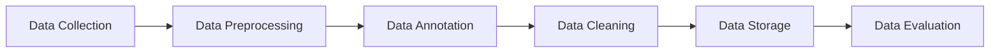

                 

### 背景介绍（Background Introduction）

**数据集构建：软件2.0开发的第一公民**

在当今数字化时代，数据已成为新的石油，被认为是企业和组织创新和增长的关键驱动力。而数据集构建，作为数据科学的基石，正日益成为软件开发过程中不可或缺的一环。随着人工智能和机器学习的飞速发展，高质量数据集的重要性日益凸显。本文旨在探讨数据集构建在软件2.0开发中的核心地位，揭示其背后的原理和关键步骤，并展望其未来的发展趋势与挑战。

首先，让我们回顾一下软件2.0的概念。与传统的软件1.0（以代码为主）不同，软件2.0强调数据的中心地位，将数据视为软件的重要组成部分，甚至视为软件的灵魂。在软件2.0时代，数据驱动决策，数据驱动创新，数据驱动用户体验，数据驱动业务增长。因此，构建高质量的数据集成为软件开发的关键步骤。

数据集构建不仅仅是简单的数据收集，而是一个复杂的工程过程，涉及数据收集、预处理、标注、清洗、存储等多个环节。本文将围绕这些环节，深入探讨数据集构建的原理、方法和技术，以帮助开发者更好地理解和掌握这一领域。

本文结构如下：

1. 背景介绍
2. 核心概念与联系
   - 数据集定义
   - 数据质量的重要性
   - 数据集构建的关键步骤
3. 核心算法原理 & 具体操作步骤
   - 数据收集方法
   - 数据预处理技术
   - 数据标注与清洗
4. 数学模型和公式 & 详细讲解 & 举例说明
   - 数据分布
   - 数据相关性
   - 数据压缩
5. 项目实践：代码实例和详细解释说明
6. 实际应用场景
7. 工具和资源推荐
8. 总结：未来发展趋势与挑战
9. 附录：常见问题与解答
10. 扩展阅读 & 参考资料

通过本文的阅读，您将了解数据集构建的全方位知识，掌握构建高质量数据集的核心技巧，并能够将其应用到实际的软件开发项目中。

> **Keywords:** Dataset Construction, Software 2.0, Data Quality, Data Collection, Data Preprocessing, Data Annotation, Data Cleaning, Data Distribution, Data Correlation, Data Compression

### 2. 核心概念与联系（Core Concepts and Connections）

#### 2.1 数据集定义

数据集（Dataset）是指一组相关数据的集合，用于训练、测试或评估机器学习模型。数据集的质量直接影响模型的学习效果和应用价值。一个高质量的数据集应具备代表性、完整性和一致性。代表性意味着数据集能够反映实际应用场景；完整性意味着数据集中不存在缺失值；一致性意味着数据集中的数据格式、属性和标签应保持一致。

#### 2.2 数据质量的重要性

数据质量是数据集构建的核心要素。高质量的数据集有助于提高模型的准确性、鲁棒性和泛化能力。相反，低质量的数据集可能导致模型过拟合、泛化能力差，甚至无法应用。因此，在数据集构建过程中，必须严格把控数据质量，确保数据的真实性和可靠性。

数据质量的关键指标包括准确性、完整性、一致性、时效性和安全性。准确性是指数据真实地反映了现实世界的状况；完整性是指数据不存在缺失或错误；一致性是指数据格式和属性保持一致；时效性是指数据具有最新的信息；安全性是指数据在收集、存储和使用过程中得到充分保护。

#### 2.3 数据集构建的关键步骤

数据集构建是一个复杂的工程过程，通常包括以下关键步骤：

1. 数据收集：从各种来源收集原始数据，如数据库、API、网络爬虫等。
2. 数据预处理：对原始数据进行清洗、归一化、转换等操作，以提高数据质量。
3. 数据标注：对数据进行分类、标注等操作，以构建监督学习模型。
4. 数据清洗：删除重复数据、处理缺失值、修正错误数据等。
5. 数据存储：将处理后的数据存储到数据库或其他数据存储系统，以便后续使用。
6. 数据评估：评估数据集的质量、代表性、多样性等，确保数据集满足应用需求。

下面是一个简化的 Mermaid 流程图，展示了数据集构建的关键步骤和流程：

通过以上步骤，我们可以构建一个高质量的数据集，为机器学习模型提供可靠的训练数据。接下来，我们将深入探讨数据收集、数据预处理、数据标注和清洗等核心算法原理和具体操作步骤。

---

## 2. Core Concepts and Connections

#### 2.1 Definition of Dataset

A dataset is a collection of related data used for training, testing, or evaluating machine learning models. The quality of a dataset significantly impacts the learning performance and application value of the models. A high-quality dataset should possess characteristics such as representativeness, completeness, and consistency. Representativeness means that the dataset can reflect the real-world scenarios; completeness means that there are no missing values in the dataset; and consistency means that the data format, attributes, and labels are consistent.

#### 2.2 Importance of Data Quality

Data quality is a core element in the process of dataset construction. High-quality datasets can improve the accuracy, robustness, and generalization ability of the models. Conversely, low-quality datasets may lead to overfitting, poor generalization ability, or even non-applicability of the models. Therefore, strict control of data quality is essential during the process of dataset construction.

The key indicators of data quality include accuracy, completeness, consistency, timeliness, and security. Accuracy means that the data truly reflects the real-world situation; completeness means that there are no missing or erroneous data; consistency means that the data format and attributes are consistent; timeliness means that the data contains the latest information; and security means that the data is adequately protected during the collection, storage, and usage process.

#### 2.3 Key Steps in Dataset Construction

Dataset construction is a complex engineering process, typically including the following key steps:

1. Data collection: Collect raw data from various sources, such as databases, APIs, web crawlers, etc.
2. Data preprocessing: Clean, normalize, and transform the raw data to improve data quality.
3. Data annotation: Categorize and annotate the data to construct supervised learning models.
4. Data cleaning: Remove duplicate data, handle missing values, and correct erroneous data.
5. Data storage: Store the processed data in databases or other data storage systems for subsequent usage.
6. Data evaluation: Assess the quality, representativeness, and diversity of the dataset to ensure that it meets the application requirements.

The following is a simplified Mermaid flowchart illustrating the key steps and processes in dataset construction:

Through these steps, we can construct a high-quality dataset that provides reliable training data for machine learning models. In the next section, we will delve into the core principles and specific operational steps of data collection, data preprocessing, data annotation, and cleaning.

