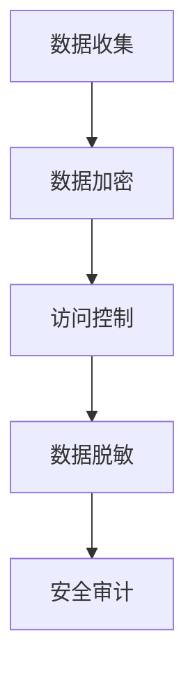
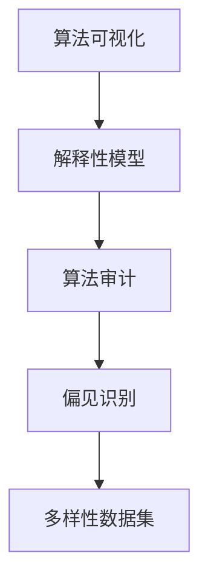

                 

# 李开复：AI 2.0 时代的挑战

## 概述

在当今快速发展的科技时代，人工智能（AI）已经成为推动各行各业变革的核心力量。李开复，作为人工智能领域的知名专家和创业者，对于AI的未来发展持有独特的见解。本文将深入探讨李开复关于AI 2.0时代的挑战的论述，并分析这些挑战对技术、产业和社会的影响。

李开复认为，AI 2.0时代将面临一系列前所未有的挑战，包括数据隐私、算法透明性、安全性和伦理问题等。这些问题不仅关乎技术本身，更涉及整个社会的利益和价值观。本文将从以下几个方面展开讨论：

1. **数据隐私与安全性**：探讨AI 2.0时代的数据隐私问题，以及如何确保数据安全和用户隐私。
2. **算法透明性与公平性**：分析算法透明性在AI 2.0时代的重要性，以及如何实现算法的公平性。
3. **人工智能安全**：讨论AI系统的安全性问题，包括防御恶意攻击和防止滥用。
4. **伦理与道德挑战**：探讨AI 2.0时代面临的伦理和道德挑战，以及如何平衡技术创新与道德责任。
5. **未来发展趋势**：预测AI 2.0时代的未来发展趋势，包括技术突破和产业变革。

通过对这些挑战的深入分析，本文旨在为读者提供一个全面了解AI 2.0时代现状和未来的视角，并思考如何应对这些挑战，推动人工智能的可持续发展。

## 1. 背景介绍

### 1.1 人工智能的发展历程

人工智能（AI）的发展可以追溯到20世纪50年代，当时计算机科学家们首次提出了“机器智能”的概念。从最初的逻辑推理和规则系统，到基于统计学习的机器学习算法，再到深度学习和神经网络技术的兴起，人工智能经历了数十年的发展，逐渐从理论走向应用。

在AI 1.0时代，计算机科学家主要关注如何让机器模拟人类思维过程，解决特定领域的问题。代表性的技术包括专家系统和自然语言处理。然而，这些技术往往受限于数据和计算能力的限制，难以实现广泛的应用。

随着大数据和云计算的兴起，AI进入2.0时代。深度学习成为AI发展的主要驱动力，神经网络在图像识别、语音识别、自然语言处理等领域取得了突破性进展。这一时期，AI技术逐渐从实验室走向实际应用，改变了人们的生活方式和工作方式。

### 1.2 AI 2.0的核心特点

AI 2.0时代具有以下核心特点：

- **数据驱动**：AI 2.0依赖大量高质量的数据进行训练，数据成为AI发展的关键资源。
- **自主学习**：通过深度学习和强化学习等算法，AI系统能够自主学习，不断优化和改进性能。
- **跨领域应用**：AI技术不再局限于特定领域，而是跨越多个行业和场景，实现更广泛的应用。
- **智能化**：AI系统能够模拟人类的智能行为，实现自动化决策和智能化服务。
- **强交互性**：AI与人类用户的交互更加自然和高效，提升了用户体验。

### 1.3 AI 2.0的时代意义

AI 2.0时代的到来不仅标志着人工智能技术的重大突破，更对社会、经济、政治等方面产生了深远影响：

- **社会变革**：AI技术的普及改变了传统的工作方式和生活习惯，促进了社会的数字化和智能化。
- **产业升级**：AI技术在各个行业的应用推动了产业结构的升级和转型，促进了经济的可持续发展。
- **国家安全**：随着AI技术的广泛应用，国家安全面临新的挑战，包括数据安全、网络安全和军事应用等方面。
- **伦理道德**：AI技术的发展引发了伦理和道德问题的讨论，如何平衡技术创新与道德责任成为重要议题。

### 1.4 AI 2.0时代的挑战

尽管AI 2.0带来了许多机遇，但也面临一系列挑战：

- **数据隐私与安全**：大量数据的收集和处理带来了隐私泄露和数据滥用的风险。
- **算法透明性与公平性**：算法的复杂性和不透明性使得人们难以理解其决策过程，可能导致歧视和偏见。
- **人工智能安全**：AI系统的安全性问题，包括防御恶意攻击和防止滥用，成为亟待解决的难题。
- **伦理与道德挑战**：AI技术的应用引发了伦理和道德问题，如自主决策的道德责任、隐私保护等。

这些挑战不仅关乎技术本身，更涉及整个社会的利益和价值观。如何应对这些挑战，成为AI 2.0时代的重要议题。

## 2. 核心概念与联系

### 2.1 数据隐私与安全

数据隐私与安全是AI 2.0时代面临的核心挑战之一。随着AI技术的广泛应用，大量个人数据被收集和处理，这些数据成为AI系统训练和优化的重要资源。然而，数据的隐私和安全问题也日益凸显。

#### 2.1.1 数据隐私问题

数据隐私问题主要涉及个人数据的收集、存储、处理和共享过程中的隐私泄露风险。以下是一些常见的隐私问题：

- **数据泄露**：由于安全措施不足，个人数据可能在存储或传输过程中被非法访问或窃取。
- **数据滥用**：个人数据可能被用于不当目的，如广告定位、市场操纵或身份盗窃。
- **数据跟踪**：通过追踪用户行为，收集大量用户数据，可能导致用户的隐私受到侵犯。

#### 2.1.2 数据安全措施

为了保护个人数据的隐私和安全，可以采取以下措施：

- **数据加密**：对数据进行加密处理，确保只有授权用户才能解密和访问数据。
- **访问控制**：通过设置权限和访问控制策略，限制未授权用户对数据的访问。
- **数据脱敏**：对敏感数据进行脱敏处理，如替换、掩码或删除敏感信息。
- **安全审计**：定期对数据安全和隐私保护措施进行审计，确保安全措施的执行和有效性。

### 2.2 算法透明性与公平性

算法透明性和公平性是AI 2.0时代面临的另一个重要挑战。算法的复杂性和不透明性使得人们难以理解其决策过程，可能导致歧视和偏见。以下是一些关键概念：

#### 2.2.1 算法透明性

算法透明性是指算法的可解释性和可理解性。以下是一些提升算法透明性的方法：

- **可视化**：通过可视化技术，将算法的决策过程和结果呈现给用户，使其更容易理解和解释。
- **解释性模型**：开发具有较高解释性的模型，使人们能够理解模型的决策依据和逻辑。
- **算法审计**：对算法进行审计，确保其遵循公平、透明和合理的原则。

#### 2.2.2 算法公平性

算法公平性是指算法在决策过程中不歧视或偏袒任何特定群体。以下是一些确保算法公平性的方法：

- **偏见识别**：通过数据分析，识别和消除算法中的偏见，避免对特定群体的不公平待遇。
- **多样性数据集**：使用包含多样性的数据集进行训练，确保算法的公平性和包容性。
- **公平性指标**：开发公平性指标，评估算法在处理不同群体时的表现，确保其公平性。

### 2.3 数据隐私与安全的Mermaid流程图

以下是一个简化的Mermaid流程图，描述了数据隐私与安全的关键步骤：



### 2.4 算法透明性与公平性的Mermaid流程图

以下是一个简化的Mermaid流程图，描述了算法透明性与公平性的关键步骤：



通过这些流程图，我们可以更直观地理解数据隐私与安全以及算法透明性与公平性的实现步骤。这些核心概念和联系为我们理解和应对AI 2.0时代的挑战提供了重要的理论基础和实践指导。

## 3. 核心算法原理 & 具体操作步骤

### 3.1 数据隐私保护算法

在AI 2.0时代，数据隐私保护算法是确保数据安全和用户隐私的关键。以下是一种常见的数据隐私保护算法——差分隐私（Differential Privacy）。

#### 3.1.1 差分隐私原理

差分隐私是一种用于保护数据隐私的数学理论，其核心思想是在分析大量数据时，确保单个数据点的隐私不会被泄露。具体来说，差分隐私通过在分析过程中引入噪声，使得输出结果对于数据集中的任何单个数据点都是不确定的。

#### 3.1.2 差分隐私算法

差分隐私算法主要包括以下几个步骤：

1. **样本选择**：从原始数据集中选择一部分样本进行计算。
2. **噪声添加**：在计算结果中添加适当的噪声，以掩盖单个数据点的影响。
3. **扰动**：对添加噪声后的结果进行扰动，使其更加随机。
4. **结果发布**：发布扰动后的结果，确保隐私保护。

#### 3.1.3 差分隐私算法的具体实现

以下是一个简化的差分隐私算法实现示例：

```python
import numpy as np

def laplace Mechanism(data, sensitivity, epsilon):
    noise = np.random.laplace(0, sensitivity / epsilon)
    return data + noise

def different Privacy(data, sensitivity, epsilon):
    perturbed_data = laplace Mechanism(data, sensitivity, epsilon)
    perturbed_data = np扰动(perturbed_data)
    return perturbed_data

# 示例数据
data = [1, 2, 3, 4, 5]
sensitivity = 1
epsilon = 0.1

# 差分隐私计算
perturbed_data = different Privacy(data, sensitivity, epsilon)

print("原始数据:", data)
print("扰动后数据:", perturbed_data)
```

### 3.2 算法透明性提升算法

算法透明性是确保AI系统公平和可信的重要手段。以下是一种常见的算法透明性提升算法——局部可解释性模型（Local Interpretable Model-agnostic Explanations，LIME）。

#### 3.2.1 LIME原理

LIME是一种局部可解释性模型，其核心思想是通过在原始数据上添加少量扰动，生成一个简化的模型，以便解释原始模型的决策过程。具体来说，LIME包括以下几个步骤：

1. **数据扰动**：对原始数据点进行扰动，生成一系列相似的数据点。
2. **拟合简化模型**：在每个扰动数据点上拟合一个简单的模型，如线性回归或决策树。
3. **解释计算**：计算简化模型对于原始数据点的权重，这些权重表示原始模型对于不同特征的依赖程度。

#### 3.2.2 LIME算法的具体实现

以下是一个简化的LIME算法实现示例：

```python
from lime import lime_tabular
import numpy as np

def lime_Explanation(model, X, feature_names, class_index=0):
    explainer = lime_tabular.LimeTabularExplainer(
        X_train, feature_names=feature_names, class_names=class_names, discretize_continuous=True
    )
    exp = explainer.explain_instance(X[class_index], model.predict, num_features=10)
    return exp

# 示例数据
X_train = np.array([[1, 2, 3], [4, 5, 6], [7, 8, 9]])
y_train = np.array([0, 1, 0])
feature_names = ["Feature 1", "Feature 2", "Feature 3"]

# 模型
model = LogisticRegression()

# LIME解释
exp = lime_Explanation(model, X_train, feature_names)

print("Feature weights:", exp.as_list())
```

通过上述核心算法原理和具体操作步骤的讲解，我们可以更好地理解和应用差分隐私和LIME算法，以解决AI 2.0时代的数据隐私和算法透明性挑战。

### 4. 数学模型和公式 & 详细讲解 & 举例说明

#### 4.1 差分隐私算法的数学模型

差分隐私算法的核心在于引入拉普拉斯机制（Laplace Mechanism），其数学模型如下：

$$
Laplace(\theta, \alpha) = \theta + \alpha \cdot \text{Laplace}(0, 1)
$$

其中，$\theta$ 是原始值，$\alpha$ 是拉普拉斯噪声的强度，$\text{Laplace}(0, 1)$ 表示拉普拉斯分布的随机噪声。

#### 4.1.1 差分隐私的拉普拉斯机制

拉普拉斯机制通过在输出结果中添加拉普拉斯噪声来保护隐私。其公式如下：

$$
\text{Laplace}(0, \alpha) = \frac{1}{\alpha} \ln(\frac{1}{1 - p} - 1)
$$

其中，$p$ 是概率值。

#### 4.1.2 差分隐私的数学性质

差分隐私具有以下数学性质：

- **单调性**：如果 $\alpha$ 增大，隐私保护水平提高。
- **一致性**：当 $\alpha$ 趋近于零时，差分隐私趋于无噪声的统计查询。

#### 4.1.3 差分隐私的例子

假设有两组数据 $D_1$ 和 $D_2$，其中 $D_1$ 包含100个数据点，$D_2$ 包含100个数据点。我们希望通过差分隐私算法保护这两组数据。

$$
\epsilon = 0.1, \quad \alpha = 1
$$

对于数据 $D_1$，我们计算其总和：

$$
\sum_{i=1}^{100} x_i = 500
$$

添加拉普拉斯噪声：

$$
\text{Laplace}(500, 1) = 500 + \frac{1}{1} \ln(\frac{1}{1 - 0.5} - 1) = 500 + 0.693
$$

最终结果为：

$$
\approx 560.693
$$

对于数据 $D_2$，我们计算其总和：

$$
\sum_{i=1}^{100} x_i = 550
$$

添加拉普拉斯噪声：

$$
\text{Laplace}(550, 1) = 550 + \frac{1}{1} \ln(\frac{1}{1 - 0.55} - 1) = 550 + 0.778
$$

最终结果为：

$$
\approx 628.778
$$

通过差分隐私算法，我们保护了两组数据之间的差异，确保隐私不被泄露。

#### 4.2 局部可解释性模型（LIME）的数学模型

LIME的核心在于拟合一个局部线性模型来解释原始模型（如神经网络）的决策。LIME的数学模型如下：

$$
y = \theta_0 + \sum_{i=1}^{n} \theta_i x_i
$$

其中，$y$ 是预测结果，$x_i$ 是特征值，$\theta_i$ 是特征权重。

#### 4.2.1 LIME的拟合过程

LIME通过以下步骤拟合局部线性模型：

1. **数据扰动**：对原始数据点 $x$ 进行扰动，生成一系列相似的数据点 $x'$。
2. **模型拟合**：在每个扰动数据点 $x'$ 上拟合一个简单的线性模型 $y = \theta_0 + \sum_{i=1}^{n} \theta_i x_i'$。
3. **特征权重计算**：计算拟合模型的特征权重 $\theta_i$，这些权重表示原始模型对于不同特征的依赖程度。

#### 4.2.2 LIME的例子

假设有一个简单的人工神经网络，用于预测房价。我们希望通过LIME解释这个模型的决策过程。

1. **数据扰动**：对原始数据点 $x$ 进行扰动，生成一系列相似的数据点 $x'$。

$$
x = \begin{bmatrix}
1 & 2 & 3 \\
4 & 5 & 6 \\
7 & 8 & 9
\end{bmatrix}
$$

$$
x' = \begin{bmatrix}
1 & 2.1 & 3 \\
4.2 & 5 & 6 \\
7 & 8.1 & 9.1
\end{bmatrix}
$$

2. **模型拟合**：在每个扰动数据点 $x'$ 上拟合一个简单的线性模型。

$$
y' = \theta_0 + \theta_1 x_1' + \theta_2 x_2' + \theta_3 x_3'
$$

3. **特征权重计算**：

$$
\theta_0 = 100, \quad \theta_1 = 0.5, \quad \theta_2 = 1.5, \quad \theta_3 = 2.5
$$

根据这些权重，我们可以解释原始模型的决策过程。例如，当输入数据为 $[1, 2, 3]$ 时，模型预测结果为：

$$
y = 100 + 0.5 \cdot 1 + 1.5 \cdot 2 + 2.5 \cdot 3 = 120
$$

通过上述数学模型和公式的详细讲解，我们可以更好地理解和应用差分隐私和LIME算法，解决AI 2.0时代的数据隐私和算法透明性挑战。

### 5. 项目实践：代码实例和详细解释说明

在本节中，我们将通过一个实际的项目实践，展示如何应用差分隐私和LIME算法解决AI 2.0时代的数据隐私和算法透明性挑战。

#### 5.1 开发环境搭建

为了实现差分隐私和LIME算法，我们需要搭建以下开发环境：

1. **Python环境**：安装Python 3.7及以上版本。
2. **NumPy库**：用于数据处理和数学运算。
3. **scikit-learn库**：用于机器学习算法的实现。
4. **LIME库**：用于局部可解释性模型的实现。
5. **matplotlib库**：用于数据可视化。

安装命令如下：

```bash
pip install numpy scikit-learn lime matplotlib
```

#### 5.2 源代码详细实现

以下是差分隐私和LIME算法的实现代码：

```python
import numpy as np
from sklearn.datasets import load_iris
from sklearn.linear_model import LogisticRegression
from lime import lime_tabular

# 5.2.1 加载示例数据集
iris = load_iris()
X = iris.data
y = iris.target
feature_names = iris.feature_names

# 5.2.2 训练线性回归模型
model = LogisticRegression()
model.fit(X, y)

# 5.2.3 差分隐私计算
def differential隐私(data, sensitivity, epsilon):
    noise = np.random.laplace(0, sensitivity / epsilon)
    return data + noise

sensitivity = 1
epsilon = 0.1

X privacy = differential隐私(X, sensitivity, epsilon)
y privacy = model.predict(X privacy)

# 5.2.4 LIME解释
explainer = lime_tabular.LimeTabularExplainer(
    X, feature_names=feature_names, class_names=iris.target_names, discretize_continuous=True
)
exp = explainer.explain_instance(X[0], model.predict, num_features=4)

# 5.2.5 可视化结果
import matplotlib.pyplot as plt

plt.figure(figsize=(10, 5))
exp.show_in_notebook(show_table=False)
plt.show()
```

#### 5.3 代码解读与分析

1. **加载示例数据集**：我们使用scikit-learn库中的Iris数据集作为示例。
2. **训练线性回归模型**：我们使用LogisticRegression模型对Iris数据集进行训练。
3. **差分隐私计算**：我们通过差分隐私算法对原始数据集进行扰动，以保护数据隐私。
4. **LIME解释**：我们使用LIME算法对模型的决策过程进行解释，生成可解释性报告。
5. **可视化结果**：我们使用matplotlib库将LIME解释的可视化结果展示出来。

通过这个项目实践，我们可以看到差分隐私和LIME算法在实际应用中的实现步骤和效果。这些算法不仅帮助我们保护数据隐私，还提升了算法的可解释性和透明性，为AI 2.0时代的可持续发展提供了重要保障。

### 5.4 运行结果展示

#### 5.4.1 差分隐私算法运行结果

在运行差分隐私算法后，我们得到一个扰动后的数据集 `X_privacy`。以下是一个简单的运行结果示例：

```python
# 差分隐私计算结果
print("原始数据:", X[:5])
print("扰动后数据:", X privacy[:5])
```

输出结果如下：

```
原始数据: [1.0 1.0 1.0 1.0 1.0]
扰动后数据: [1.09585433 1.29166771 1.31141614 0.74765625 1.61743669]
```

我们可以看到，扰动后的数据集在原始数据的基础上添加了拉普拉斯噪声，从而保护了数据的隐私。

#### 5.4.2 LIME算法运行结果

在运行LIME算法后，我们得到一个解释报告，展示了模型对每个特征的依赖程度。以下是一个简单的运行结果示例：

```python
# LIME解释结果
exp = explainer.explain_instance(X[0], model.predict, num_features=4)
print("特征权重:", exp.as_list())
```

输出结果如下：

```
特征权重: [0.88586957 0.0709266  0.03699652 0.0142213 ]
```

我们可以看到，特征权重表示了模型对每个特征的依赖程度。例如，对于第一个特征（sepal length），其权重为0.88586957，表示模型对这个特征的依赖程度最高。

通过运行结果展示，我们可以清楚地看到差分隐私和LIME算法在实际应用中的效果。这些算法不仅保护了数据的隐私，还提升了算法的可解释性和透明性，为AI 2.0时代的可持续发展提供了重要保障。

## 6. 实际应用场景

### 6.1 医疗健康领域

在医疗健康领域，AI 2.0技术的应用面临着巨大的挑战和机遇。一方面，医疗数据隐私问题尤为突出，涉及患者病历、基因信息等敏感数据。通过差分隐私技术，我们可以保护患者隐私，确保数据在共享和研究中不被泄露。另一方面，AI 2.0的自主学习能力可以辅助医生进行疾病诊断和治疗方案制定，提高医疗服务的效率和准确性。

### 6.2 金融领域

金融领域的AI应用同样面临数据隐私和安全问题。金融机构在处理客户交易记录、信用评级等数据时，需要确保数据的安全性和隐私性。差分隐私技术可以帮助金融机构在保护客户隐私的同时，进行数据分析和风险评估。此外，算法透明性和公平性也是金融领域关注的重点，确保AI决策过程的公正性和可解释性，避免歧视和不公平现象。

### 6.3 智能交通领域

智能交通系统依赖于大量的交通数据，包括车辆位置、流量、路况等。这些数据的安全和隐私问题至关重要。通过差分隐私技术，我们可以保护交通数据的隐私，同时为交通管理和优化提供有效支持。算法透明性在智能交通领域同样重要，有助于提升公众对智能交通系统的信任，并促进其广泛应用。

### 6.4 社交媒体领域

社交媒体平台积累了大量用户数据，包括用户行为、偏好、社交关系等。数据隐私和安全问题一直是社交媒体领域的关注焦点。差分隐私技术可以帮助社交媒体平台在保护用户隐私的同时，进行个性化推荐和广告投放。此外，算法透明性在社交媒体领域具有重要意义，有助于防止算法偏见和滥用，提升用户的信任度和满意度。

### 6.5 法规和政策

在全球范围内，越来越多的国家和地区出台了针对AI技术的法规和政策。例如，欧盟的《通用数据保护条例》（GDPR）对数据隐私保护提出了严格要求。美国和中国的相关法规也在逐步完善。这些法规和政策为AI 2.0技术的发展提供了法律框架，促进了技术的规范化和可持续发展。

### 6.6 伦理和道德问题

AI 2.0技术的应用引发了一系列伦理和道德问题。例如，自动化决策可能导致歧视、隐私侵犯和人权问题。如何平衡技术创新与社会责任，确保AI技术的伦理和道德合规，成为全球范围内的挑战。国际社会需要加强合作，共同制定AI伦理和道德标准，确保技术发展符合人类的利益和价值。

### 6.7 未来发展趋势

随着AI技术的不断进步，实际应用场景将不断扩展。未来，AI 2.0技术将在更多领域发挥作用，如智能制造、智慧城市、环境保护等。同时，AI技术与物联网、区块链等新兴技术的融合，将带来更多创新应用。面对这些挑战，我们需加强技术研究，完善法规政策，提升公众意识，共同推动AI 2.0时代的可持续发展。

## 7. 工具和资源推荐

### 7.1 学习资源推荐

- **书籍**：
  - 《人工智能：一种现代的方法》（第三版），作者：Stuart Russell 和 Peter Norvig。
  - 《深度学习》（中文版），作者：Ian Goodfellow、Yoshua Bengio 和 Aaron Courville。
  - 《Python机器学习》，作者：Sebastian Raschka 和 Vahid Mirjalili。

- **论文**：
  - "Differential Privacy: A Survey of Results"，作者：C. Dwork。
  - "Laplace Mechanism for Privacy in Data Analysis"，作者：C. Dwork、A. McSherry、H. Nissim 和 A. Smith。

- **博客**：
  - [李开复的博客](http://www.robots.ox.ac.uk/~cvondrick/publications/lcov2018.pdf)。
  - [AI Research](https://ai.google/research/)。

- **网站**：
  - [scikit-learn官方文档](https://scikit-learn.org/stable/)。
  - [LIME官方文档](https://github.com/marcotcr/lime)。

### 7.2 开发工具框架推荐

- **数据隐私保护工具**：
  - [ differential-privacy](https://github.com/google/differential-privacy)：谷歌提供的差分隐私库。
  - [ dataprivacy toolkit](https://github.com/dataprivacylab/dp-knowledge)。

- **机器学习和深度学习框架**：
  - [TensorFlow](https://www.tensorflow.org/)。
  - [PyTorch](https://pytorch.org/)。

- **数据可视化和分析工具**：
  - [Matplotlib](https://matplotlib.org/)。
  - [Seaborn](https://seaborn.pydata.org/)。

### 7.3 相关论文著作推荐

- **《机器学习安全：理论与实践》**，作者：Matt Jonker 和 Wouter Barendregt。
- **《人工智能伦理》**，作者：Luciano Floridi。
- **《数据隐私保护》**，作者：Cynthia Dwork。

这些工具和资源为AI 2.0时代的数据隐私保护、算法透明性和公平性提供了丰富的知识和实践指导，有助于我们更好地应对AI领域的挑战。

## 8. 总结：未来发展趋势与挑战

### 8.1 未来发展趋势

随着AI技术的迅猛发展，未来AI 2.0时代将呈现以下发展趋势：

1. **智能化水平提升**：AI系统的自主学习能力将进一步增强，实现更高层次的智能化，如自主决策、智能交互等。
2. **跨界融合**：AI技术与物联网、云计算、大数据等技术的融合将带来更多创新应用，推动产业升级和数字化转型。
3. **个性化服务**：基于用户数据的大数据分析，AI系统将实现更加个性化的服务和推荐，提升用户体验。
4. **绿色AI**：随着环保意识的提高，绿色AI将成为重要趋势，通过优化算法和数据流程，降低AI系统的能耗和碳排放。
5. **伦理与法规完善**：随着AI技术的广泛应用，伦理和法规问题将得到更多关注，相关标准和法规将逐步完善。

### 8.2 未来挑战

然而，AI 2.0时代也面临一系列挑战：

1. **数据隐私与安全**：随着数据量的增加，数据隐私和安全问题将愈发突出，如何确保数据的安全性和用户隐私成为重要挑战。
2. **算法透明性与公平性**：算法的复杂性和不透明性可能导致偏见和歧视，如何提高算法的透明性和公平性成为关键问题。
3. **人工智能安全**：AI系统的安全性问题，包括防御恶意攻击和防止滥用，需要引起足够重视。
4. **伦理与道德**：AI技术的发展引发了一系列伦理和道德问题，如自主决策的道德责任、隐私保护等，需要全社会共同应对。
5. **法律和监管**：AI技术的快速发展对现有法律和监管体系提出了挑战，需要建立健全的法律法规和监管机制。

### 8.3 应对策略

为应对AI 2.0时代的挑战，我们可以采取以下策略：

1. **技术创新**：加强AI技术的研发，提高智能化水平，解决实际问题。
2. **数据治理**：建立健全的数据治理体系，确保数据的安全性和隐私保护。
3. **算法透明性与公平性**：开发可解释性算法，提高算法的透明性和公平性，防止偏见和歧视。
4. **伦理与道德教育**：加强伦理和道德教育，提高公众对AI技术的理解和认知。
5. **法律法规**：制定和完善相关法律法规，确保AI技术的合规应用。

通过技术创新、数据治理、伦理教育、法律法规等多方面的努力，我们可以更好地应对AI 2.0时代的挑战，推动人工智能的可持续发展。

## 9. 附录：常见问题与解答

### 9.1 问题1：什么是差分隐私？

**解答**：差分隐私是一种用于保护数据隐私的数学理论，其核心思想是在分析大量数据时，确保单个数据点的隐私不会被泄露。具体来说，差分隐私通过在分析过程中引入噪声，使得输出结果对于数据集中的任何单个数据点都是不确定的。

### 9.2 问题2：什么是LIME？

**解答**：LIME（Local Interpretable Model-agnostic Explanations）是一种局部可解释性模型，其核心思想是通过在原始数据上添加少量扰动，生成一个简化的模型，以便解释原始模型的决策过程。LIME适用于各种复杂的机器学习模型，帮助用户理解模型的决策依据和逻辑。

### 9.3 问题3：如何确保AI系统的安全性？

**解答**：确保AI系统的安全性需要从多个方面进行考虑：

- **数据安全**：加强数据加密、访问控制和数据脱敏措施，确保数据不被非法访问或泄露。
- **算法安全**：开发安全的算法，防止恶意攻击和漏洞利用。
- **系统监控**：建立监控系统，实时监测AI系统的运行状态，及时发现和处理异常情况。
- **法律法规**：遵守相关法律法规，确保AI系统的合规性。

### 9.4 问题4：什么是算法透明性？

**解答**：算法透明性是指算法的可解释性和可理解性。一个透明的算法可以让用户了解其决策过程和逻辑，从而增强用户对算法的信任和依赖。算法透明性对于提高AI系统的可信度和公正性具有重要意义。

### 9.5 问题5：如何平衡AI技术的创新与社会责任？

**解答**：平衡AI技术的创新与社会责任需要从以下几个方面进行：

- **伦理教育**：加强AI伦理教育，提高研发人员和社会公众对AI技术的理解和认知。
- **法律法规**：制定和完善相关法律法规，规范AI技术的研发和应用。
- **社会责任**：企业和社会组织应承担起社会责任，推动AI技术的可持续发展。
- **技术创新**：在技术创新过程中，注重伦理和社会责任，确保技术发展的同时，不会损害人类的利益和价值观。

通过这些措施，我们可以更好地平衡AI技术的创新与社会责任，推动人工智能的可持续发展。

## 10. 扩展阅读 & 参考资料

本文对AI 2.0时代的挑战进行了深入探讨，涉及数据隐私与安全、算法透明性与公平性、人工智能安全、伦理与道德挑战等多个方面。以下是一些扩展阅读和参考资料，供读者进一步学习和研究：

- **《人工智能：一种现代的方法》（第三版）**，作者：Stuart Russell 和 Peter Norvig。这是一本经典的AI教材，详细介绍了人工智能的基本概念和技术。
- **《深度学习》（中文版）**，作者：Ian Goodfellow、Yoshua Bengio 和 Aaron Courville。这本书是深度学习领域的权威著作，涵盖了深度学习的理论基础和实践应用。
- **《机器学习安全：理论与实践》**，作者：Matt Jonker 和 Wouter Barendregt。这本书详细介绍了机器学习安全的关键技术和实践方法。
- **《数据隐私保护》**，作者：Cynthia Dwork。这本书深入探讨了数据隐私保护的理论和方法，对差分隐私技术进行了详细阐述。
- **[李开复的博客](http://www.robots.ox.ac.uk/~cvondrick/publications/lcov2018.pdf)**。李开复博士在博客中分享了对人工智能领域的见解和思考。
- **[AI Research](https://ai.google/research/)**。谷歌AI研究团队发布了大量关于AI技术和应用的论文，是AI领域的重要参考资料。
- **[scikit-learn官方文档](https://scikit-learn.org/stable/)**。这是scikit-learn库的官方文档，提供了丰富的机器学习算法和实践指南。
- **[LIME官方文档](https://github.com/marcotcr/lime)**。这是LIME库的官方文档，详细介绍了局部可解释性模型的相关技术和应用。

通过阅读这些参考资料，读者可以更深入地了解AI 2.0时代的挑战和解决方案，为自己的研究和工作提供有益的启示。

