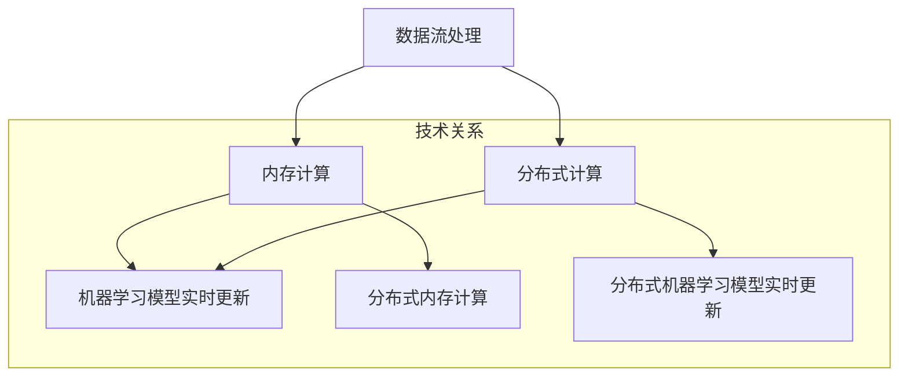

                 

### 背景介绍（Background Introduction）

在当今数字化时代，数据的增长速度令人瞩目。据国际数据公司（IDC）的报告，全球数据量预计将在2025年达到44ZB（即44万亿GB）。这样庞大的数据量对数据处理技术提出了前所未有的挑战。知识发现引擎作为一种高效的数据分析工具，旨在从大量数据中提取有价值的信息和知识。然而，知识发现引擎的效能不仅取决于其算法的先进性，还与其实时数据处理能力紧密相关。

实时数据处理技术在知识发现引擎中的应用变得越来越重要。实时数据处理是指系统能够在数据产生的同时或非常接近实时地对数据进行处理和分析。随着物联网（IoT）技术的发展，设备和传感器不断产生大量实时数据。这些数据包含着丰富的信息，但同时也带来了数据存储、传输、处理和实时分析等方面的挑战。知识发现引擎需要具备高效的实时数据处理能力，以便快速识别模式、预测趋势，并做出及时的决策。

本文将深入探讨知识发现引擎的实时数据处理技术。我们将首先介绍实时数据处理的基本概念，包括其定义、核心组件及其与知识发现引擎的关联。接着，我们将详细探讨实时数据处理的关键技术，如数据流处理、内存计算、分布式计算和机器学习模型的实时更新。随后，我们将通过具体案例来展示实时数据处理技术在知识发现引擎中的应用，并分析其实际效益。最后，我们将讨论未来发展趋势和潜在挑战，并展望实时数据处理技术对知识发现引擎的持续影响。

通过本文的探讨，我们将了解实时数据处理技术在知识发现引擎中扮演的重要角色，并认识到其在应对大数据挑战、实现智能决策支持系统中的关键价值。

### 关键词（Keywords）

- 知识发现引擎
- 实时数据处理
- 数据流处理
- 内存计算
- 分布式计算
- 机器学习模型更新
- 大数据挑战

### 摘要（Abstract）

本文旨在探讨知识发现引擎中的实时数据处理技术，分析其在应对大数据挑战中的关键作用。随着全球数据量的迅猛增长，实时数据处理成为提升知识发现引擎效能的关键因素。本文首先介绍实时数据处理的基本概念和核心组件，随后深入探讨数据流处理、内存计算、分布式计算和机器学习模型实时更新等关键技术。通过具体案例，我们展示了实时数据处理技术在知识发现引擎中的应用及其带来的实际效益。最后，本文讨论了未来发展趋势和潜在挑战，为实时数据处理技术在知识发现引擎中的应用提供了指导方向。

### 1. 实时数据处理的基本概念（Basic Concepts of Real-time Data Processing）

实时数据处理是指在数据生成的同时或极短时间内（通常是毫秒级或秒级）对数据进行收集、存储、处理和分析的技术。与批处理（batch processing）不同，实时数据处理能够快速响应数据变化，提供即时的决策支持和业务洞察。实时数据处理的核心目标是确保数据处理的高效性、准确性和及时性，以满足各种应用场景的需求。

#### 1.1 实时数据处理的定义

实时数据处理可以定义为一种能够在数据产生时或非常接近实时地对数据进行分析和响应的系统。这种系统通常具有以下几个特点：

1. **低延迟**：处理延迟通常在毫秒级或秒级，这要求系统具备高效的计算能力和优化的数据处理流程。
2. **高吞吐量**：系统能够处理大量的数据流，并保持低延迟的处理能力。
3. **高可靠性**：系统在数据传输和处理过程中需要确保数据的完整性和一致性。
4. **可扩展性**：系统能够根据数据量和处理需求的增长进行水平或垂直扩展。

#### 1.2 实时数据处理的用途

实时数据处理技术在多个领域有着广泛的应用，包括但不限于：

1. **金融行业**：实时数据处理用于监控市场动态、交易分析和风险控制，以实现快速决策和风险管理。
2. **物联网（IoT）**：物联网设备产生的海量实时数据通过实时数据处理技术进行分析，用于设备监控、故障预测和优化。
3. **社交媒体**：实时数据处理帮助社交媒体平台进行用户行为分析、内容推荐和实时搜索，提升用户体验。
4. **医疗健康**：实时数据处理在医疗健康领域用于患者监控、医疗设备数据分析和紧急情况响应，以提升医疗服务的质量和效率。
5. **交通管理**：实时数据处理帮助交通管理系统监控交通流量、预测交通拥堵，从而优化路线规划和交通信号控制。

#### 1.3 实时数据处理与知识发现引擎的关系

知识发现引擎（Knowledge Discovery Engine）是一种用于从大量数据中自动发现有价值信息和知识的技术。实时数据处理在知识发现引擎中起着至关重要的作用，主要表现在以下几个方面：

1. **数据源接入**：实时数据处理能够快速接入各种数据源，包括数据库、数据流、物联网设备等，为知识发现引擎提供即时的数据输入。
2. **数据预处理**：实时数据处理对原始数据进行清洗、转换和归一化，确保数据的质量和一致性，从而提高知识发现引擎的准确性和可靠性。
3. **实时分析**：实时数据处理能够对数据流进行实时分析，识别数据中的模式和趋势，为知识发现引擎提供实时的数据洞察。
4. **决策支持**：实时数据处理能够为知识发现引擎提供即时的决策支持，帮助用户快速响应业务变化和市场动态。

综上所述，实时数据处理是知识发现引擎中不可或缺的一环，其高效的数据接入、预处理和分析能力，为知识发现引擎提供了强大的支持，使其能够更好地应对大数据挑战，实现实时、准确的决策支持。

### 2. 核心概念与联系（Core Concepts and Connections）

在深入探讨实时数据处理技术之前，我们需要明确一些核心概念，了解这些概念之间的相互关系，以便更好地理解实时数据处理在知识发现引擎中的应用。

#### 2.1 数据流处理（Data Stream Processing）

数据流处理是一种针对动态数据流的实时处理技术。与传统的批量处理不同，数据流处理关注的是如何高效地处理连续数据流，并在数据产生时或极短时间内进行分析和响应。数据流处理的关键技术包括数据流的采集、传输、存储和处理。

- **数据流采集**：数据流采集是从各种数据源（如传感器、数据库、网络等）获取数据的过程。这些数据源可能分布在不同的地理位置，因此采集过程需要高效的网络传输协议和可靠的数据传输机制。
- **数据流传输**：数据流传输是将采集到的数据从数据源传输到处理系统的一个过程。为了确保低延迟和高吞吐量，传输过程通常采用高效的网络协议，如HTTP/2或基于UDP的数据传输协议。
- **数据流存储**：数据流存储是将实时处理后的数据存储到持久化存储系统（如数据库、数据湖等）的过程。存储系统需要具备高可扩展性和高可用性，以应对数据量的增长和系统故障。
- **数据流处理**：数据流处理是对实时数据进行计算和分析的过程。常见的处理任务包括数据清洗、聚合、过滤、机器学习模型训练和预测等。

数据流处理在知识发现引擎中的应用主要体现在以下几个方面：

1. **实时数据接入**：数据流处理能够实时接入各种数据源，为知识发现引擎提供源源不断的数据输入。
2. **实时数据预处理**：数据流处理对实时数据进行清洗、转换和归一化，确保数据的质量和一致性，为后续分析提供可靠的数据基础。
3. **实时模式识别**：数据流处理能够实时分析数据流中的模式，为知识发现引擎提供实时的数据洞察，帮助用户快速识别异常、趋势和关联关系。

#### 2.2 内存计算（In-memory Computing）

内存计算是一种利用高速内存（如RAM、SSD等）进行数据处理和分析的技术。与传统的磁盘存储和计算方式相比，内存计算具有更高的计算速度和更低的延迟，从而提高了数据处理和分析的效率。

- **内存计算架构**：内存计算架构通常包括高速内存存储、内存处理单元和内存网络等。内存处理单元负责对内存中的数据进行计算和分析，内存网络则负责数据在各存储节点之间的传输。
- **内存计算技术**：内存计算技术包括列式存储、内存缓存、内存压缩和内存计算引擎等。列式存储能够提高数据查询效率，内存缓存能够减少数据访问延迟，内存压缩能够降低存储空间需求，内存计算引擎则负责对内存中的数据进行计算和分析。

内存计算在知识发现引擎中的应用主要体现在以下几个方面：

1. **加速数据处理**：内存计算能够显著降低数据处理和分析的延迟，提高系统的实时性。
2. **优化数据存储**：内存计算通过列式存储和内存压缩技术，能够有效降低存储空间需求，提高存储效率。
3. **提升数据分析性能**：内存计算引擎能够快速处理和分析内存中的数据，提高知识发现引擎的数据分析性能。

#### 2.3 分布式计算（Distributed Computing）

分布式计算是一种将计算任务分布到多个计算节点上进行处理的技术。分布式计算能够提高系统的计算能力和处理效率，同时具备高可用性和高扩展性。

- **分布式计算架构**：分布式计算架构通常包括计算节点、数据存储节点和协调节点。计算节点负责执行计算任务，数据存储节点负责存储数据，协调节点负责任务调度和资源分配。
- **分布式计算技术**：分布式计算技术包括任务调度、负载均衡、数据复制和故障恢复等。任务调度负责将计算任务分配到合适的计算节点，负载均衡负责平衡各节点的计算负载，数据复制负责确保数据的冗余和一致性，故障恢复则负责处理节点故障，保证系统的可靠性。

分布式计算在知识发现引擎中的应用主要体现在以下几个方面：

1. **提高计算能力**：分布式计算能够将大规模数据处理任务分布到多个节点上进行处理，提高系统的计算能力和处理效率。
2. **提高系统可用性**：分布式计算通过任务调度和故障恢复技术，能够保证系统的稳定运行，提高系统的可用性。
3. **实现弹性扩展**：分布式计算能够根据处理需求动态调整计算资源，实现系统的弹性扩展。

#### 2.4 机器学习模型实时更新（Real-time Machine Learning Model Updating）

机器学习模型在知识发现引擎中发挥着重要作用，但模型的性能会随着时间的推移而逐渐下降，因此需要定期更新。机器学习模型实时更新是指系统能够在数据更新时或极短时间内对模型进行更新，以保持模型的准确性和有效性。

- **模型更新策略**：模型更新策略包括在线学习、增量学习和迁移学习等。在线学习能够在数据流中实时更新模型，增量学习仅对新增数据进行模型更新，迁移学习则利用已有模型在新数据集上进行调整。
- **实时更新技术**：实时更新技术包括在线训练、动态调整和模型压缩等。在线训练能够在数据更新时实时训练模型，动态调整技术能够根据数据变化调整模型参数，模型压缩技术则能够减少模型大小，提高更新速度。

机器学习模型实时更新在知识发现引擎中的应用主要体现在以下几个方面：

1. **保持模型准确性**：实时更新能够确保模型始终适应新的数据分布和业务需求，保持模型的准确性。
2. **提高模型响应速度**：实时更新能够快速适应数据变化，提高模型的响应速度，满足实时处理需求。
3. **降低模型过拟合风险**：实时更新能够避免模型在长时间内过度拟合旧数据，降低模型过拟合风险。

综上所述，数据流处理、内存计算、分布式计算和机器学习模型实时更新是实时数据处理技术的核心概念。这些概念相互关联，共同构成了实时数据处理的技术体系，为知识发现引擎提供了高效的数据处理和分析能力。在接下来的章节中，我们将深入探讨这些核心技术的具体实现和应用。

#### 2.5 数据流处理、内存计算、分布式计算和机器学习模型实时更新之间的关系

数据流处理、内存计算、分布式计算和机器学习模型实时更新是实时数据处理技术的核心组成部分，它们在知识发现引擎中发挥着重要作用，并相互关联、相互促进，共同构成了实时数据处理的技术体系。

首先，数据流处理作为实时数据处理的起点，负责实时采集、传输和处理动态数据流。数据流处理能够高效地处理大规模数据，并支持实时分析、监控和决策。然而，仅凭数据流处理技术，仍无法实现高效的实时数据处理。此时，内存计算和分布式计算技术介入，为数据流处理提供了强大的支持。

内存计算利用高速内存（如RAM、SSD等）进行数据处理，相比传统的磁盘存储和计算方式，具有更高的计算速度和更低的延迟。通过将数据存储在内存中，内存计算技术能够显著提高数据处理和分析的效率，降低数据处理时间。同时，内存计算还可以通过列式存储、内存缓存和内存压缩等技术，优化数据存储和访问性能。

分布式计算则通过将计算任务分布到多个计算节点上进行处理，提高了系统的计算能力和处理效率。分布式计算架构通常包括计算节点、数据存储节点和协调节点。通过任务调度、负载均衡和数据复制等技术，分布式计算能够确保系统在处理大规模数据时具备高可用性和高扩展性。

数据流处理、内存计算和分布式计算在知识发现引擎中共同发挥作用，为实时数据处理提供了坚实的基础。然而，仅具备高效的数据处理能力仍不足以实现知识发现。此时，机器学习模型实时更新技术成为关键因素。

机器学习模型实时更新技术能够根据数据变化和业务需求，实时调整和优化模型参数，确保模型始终适应新的数据分布和业务场景。通过在线学习、增量学习和迁移学习等策略，机器学习模型实时更新技术能够保持模型的准确性和有效性，提高模型的响应速度和预测能力。

综上所述，数据流处理、内存计算、分布式计算和机器学习模型实时更新在知识发现引擎中相互关联、相互促进，共同构成了实时数据处理的技术体系。数据流处理提供实时数据接入和处理能力，内存计算和分布式计算提供高效的数据处理和分析能力，而机器学习模型实时更新则确保了模型的准确性和有效性。这些核心技术的协同作用，使得知识发现引擎能够高效地应对大数据挑战，实现实时、准确的决策支持。

#### 2.6 数据流处理、内存计算、分布式计算和机器学习模型实时更新的技术关系 Mermaid 流程图



在上述 Mermaid 流程图中，我们可以清晰地看到数据流处理、内存计算、分布式计算和机器学习模型实时更新之间的技术关系。数据流处理作为实时数据处理的起点，连接了内存计算和分布式计算，而内存计算和分布式计算又与机器学习模型实时更新紧密关联。通过这种协同作用，知识发现引擎能够实现高效、实时和准确的数据处理与分析。

### 3. 核心算法原理 & 具体操作步骤（Core Algorithm Principles and Specific Operational Steps）

#### 3.1 实时数据处理算法原理

实时数据处理算法的核心目标是在数据产生的同时或非常短时间内对数据进行收集、存储、处理和分析，以提供即时的决策支持和业务洞察。为了实现这一目标，实时数据处理算法通常包括以下几个关键步骤：

1. **数据采集与预处理**：实时数据采集是从各种数据源（如传感器、数据库、网络等）获取数据的过程。采集到的数据可能存在噪声、缺失值和异常值，因此需要对其进行预处理，包括数据清洗、转换和归一化，以确保数据的质量和一致性。

2. **数据存储与索引**：预处理后的数据需要被存储到合适的存储系统中，以便进行后续的处理和分析。常用的存储系统包括关系型数据库、NoSQL数据库和数据湖。为了提高数据查询和处理的效率，存储系统通常需要建立合适的索引。

3. **实时计算与处理**：实时计算是对实时数据进行计算和分析的过程。实时计算可以采用批处理或流处理的方式。批处理方式将数据分批进行处理，适用于处理历史数据或低频数据；流处理方式则对实时数据流进行连续处理，适用于处理实时性要求较高的场景。

4. **数据分析和挖掘**：实时数据处理后的数据需要进行分析和挖掘，以提取有价值的信息和知识。数据分析和挖掘可以采用机器学习、深度学习、关联规则挖掘等技术，以发现数据中的模式和趋势。

5. **结果输出与反馈**：实时数据处理的结果需要被输出到合适的展示平台或系统中，以便用户进行查看和分析。此外，系统还需要根据实时数据处理的结果进行反馈和调整，以优化数据收集、处理和分析的过程。

#### 3.2 实时数据处理算法的具体操作步骤

下面我们将详细阐述实时数据处理算法的具体操作步骤，包括数据采集与预处理、数据存储与索引、实时计算与处理、数据分析和挖掘、结果输出与反馈。

**步骤 1：数据采集与预处理**

1. **数据采集**：从各种数据源（如传感器、数据库、网络等）获取数据。数据源可能包括实时传感器数据、数据库日志、网络流量等。
2. **数据清洗**：对采集到的数据进行处理，去除噪声、缺失值和异常值。数据清洗可以通过填充缺失值、去除重复数据、去除异常值等方法实现。
3. **数据转换**：将不同数据源的数据转换为统一的格式，以便进行后续处理和分析。数据转换可能包括数据类型的转换、数据格式的转换、数据编码的转换等。
4. **数据归一化**：对数据进行归一化处理，将不同量纲的数据转换为相同量纲的数据，以便进行比较和分析。数据归一化可以通过最小-最大缩放、Z-score缩放等方法实现。

**步骤 2：数据存储与索引**

1. **选择存储系统**：根据数据特点和业务需求，选择合适的存储系统。常用的存储系统包括关系型数据库（如MySQL、PostgreSQL）、NoSQL数据库（如MongoDB、Cassandra）、数据湖（如Hadoop、Spark）等。
2. **建立索引**：为了提高数据查询和处理的效率，需要在存储系统中建立合适的索引。索引可以基于关键字、时间戳、地理位置等字段，以实现快速查询和数据排序。

**步骤 3：实时计算与处理**

1. **实时计算框架**：选择合适的实时计算框架，如Apache Flink、Apache Kafka、Apache Storm等。实时计算框架负责处理实时数据流，实现数据采集、处理、分析和输出等功能。
2. **数据处理任务**：根据业务需求，定义实时数据处理任务。数据处理任务可以包括数据聚合、数据过滤、数据转换、数据统计等操作。
3. **任务调度与执行**：实时计算框架根据任务调度策略，将数据处理任务分配到计算节点上执行。任务调度策略可以基于负载均衡、优先级、时间触发等策略。

**步骤 4：数据分析和挖掘**

1. **数据预处理**：对实时数据处理后的数据进行预处理，包括数据清洗、转换、归一化等操作，以提高数据质量和分析效果。
2. **特征提取**：从预处理后的数据中提取特征，用于后续分析和挖掘。特征提取可以通过统计特征、文本特征、图像特征等方法实现。
3. **机器学习模型训练**：使用提取的特征数据训练机器学习模型，如分类模型、聚类模型、回归模型等。训练过程中，可以使用在线学习、增量学习等技术，以适应实时数据的变化。
4. **模型评估与优化**：对训练好的模型进行评估和优化，包括模型准确率、召回率、F1值等指标。根据评估结果，对模型进行调整和优化，以提高模型的性能。

**步骤 5：结果输出与反馈**

1. **结果展示**：将实时数据处理和分析的结果输出到合适的展示平台或系统中，如可视化仪表盘、报表系统、邮件通知等。结果展示可以提供实时的业务洞察和决策支持。
2. **系统反馈**：根据实时数据处理和分析的结果，对系统进行反馈和调整，以优化数据采集、处理和分析的过程。例如，调整数据采集策略、优化数据处理任务、更新机器学习模型等。

通过上述操作步骤，实时数据处理算法能够高效地处理实时数据，提取有价值的信息和知识，为业务决策提供支持。在接下来的章节中，我们将通过具体案例来展示实时数据处理算法在实际应用中的实现和效果。

### 4. 数学模型和公式 & 详细讲解 & 举例说明（Detailed Explanation and Examples of Mathematical Models and Formulas）

在实时数据处理中，数学模型和公式是不可或缺的工具，用于描述和解决实际问题。在本节中，我们将介绍一些常用的数学模型和公式，并详细讲解其应用场景和示例。

#### 4.1 数据流处理中的滑动窗口算法

滑动窗口算法是一种常见的数据流处理技术，用于处理实时数据流中的窗口操作。滑动窗口算法的核心思想是将一段时间范围内的数据作为一个窗口，对窗口内的数据进行计算和分析。

**滑动窗口算法的数学模型**：

假设我们有一个时间序列 {x1, x2, x3, ..., xn}，我们希望计算一个滑动窗口内的平均值。滑动窗口的长度为 T，窗口内的数据序列为 {xi, xi+1, ..., xi+T-1}。

滑动窗口算法的公式如下：

$$
\text{平均值} = \frac{\sum_{i=1}^{T} x_i}{T}
$$

其中，$x_i$ 表示窗口内的第 i 个数据点。

**应用场景**：滑动窗口算法常用于计算实时数据流中的统计指标，如平均值、标准差、最大值、最小值等。

**示例**：

假设我们有一个包含 5 个数据点的实时数据流 {1, 2, 3, 4, 5}，我们希望计算每个长度为 3 的滑动窗口的平均值。

窗口 1：{1, 2, 3}，平均值为 (1 + 2 + 3) / 3 = 2

窗口 2：{2, 3, 4}，平均值为 (2 + 3 + 4) / 3 = 3

窗口 3：{3, 4, 5}，平均值为 (3 + 4 + 5) / 3 = 4

通过滑动窗口算法，我们可以实时计算数据流中的平均值，以便进行实时分析和决策。

#### 4.2 机器学习中的损失函数

在机器学习中，损失函数是评估模型性能的重要工具。损失函数用于计算模型预测值与真实值之间的差距，并根据这个差距调整模型参数，以优化模型性能。

**常用的损失函数**：

1. **均方误差（MSE，Mean Squared Error）**：

$$
\text{MSE} = \frac{1}{n} \sum_{i=1}^{n} (y_i - \hat{y}_i)^2
$$

其中，$y_i$ 表示真实值，$\hat{y}_i$ 表示模型预测值，$n$ 表示样本数量。

2. **交叉熵损失（Cross-Entropy Loss）**：

$$
\text{交叉熵损失} = -\frac{1}{n} \sum_{i=1}^{n} y_i \log(\hat{y}_i)
$$

其中，$y_i$ 表示真实值，$\hat{y}_i$ 表示模型预测值，$\log$ 表示对数函数。

**应用场景**：均方误差损失函数常用于回归问题，交叉熵损失函数常用于分类问题。

**示例**：

假设我们有一个回归问题，真实值和模型预测值分别为 $y = [1, 2, 3, 4, 5]$ 和 $\hat{y} = [1.1, 2.1, 2.9, 3.8, 5.2]$，我们使用均方误差损失函数来评估模型性能。

$$
\text{MSE} = \frac{1}{5} \sum_{i=1}^{5} (y_i - \hat{y}_i)^2 = \frac{1}{5} \sum_{i=1}^{5} (1 - 1.1)^2 + (2 - 2.1)^2 + (3 - 2.9)^2 + (4 - 3.8)^2 + (5 - 5.2)^2 = 0.06
$$

通过计算均方误差损失，我们可以了解模型预测值与真实值之间的差距，从而调整模型参数，提高模型性能。

#### 4.3 数据库中的索引算法

在数据库管理系统中，索引算法用于提高数据查询和检索的效率。索引算法的核心思想是通过创建索引结构，加快数据查询速度。

**B+树索引算法**：

B+树是一种常见的索引结构，其特点如下：

1. **多级索引**：B+树采用多级索引结构，通过递归分解数据，将大量数据组织成平衡的多级树结构。
2. **索引节点**：每个索引节点包含多个关键字和数据指针，关键字用于排序和查找，数据指针指向对应的数据记录。
3. **平衡性**：B+树保持树的平衡，确保查询和插入操作的时间复杂度为 O(log n)。

B+树索引算法的公式如下：

$$
\text{查询时间复杂度} = O(\log n)
$$

其中，$n$ 表示数据记录数量。

**应用场景**：B+树索引算法广泛应用于关系型数据库，如MySQL、PostgreSQL等。

**示例**：

假设我们有一个包含 1000 条数据记录的数据库，使用 B+树索引算法进行查询。通过计算，查询时间复杂度为 O(\log 1000) = O(3) = 3，即最多需要进行 3 次索引查找。

通过 B+树索引算法，我们可以显著提高数据查询速度，减少查询时间，提高数据库系统的性能。

通过上述数学模型和公式的详细讲解和示例，我们可以更好地理解实时数据处理技术中的关键概念和计算方法。这些数学模型和公式为实时数据处理提供了理论支持，帮助我们实现高效、准确的数据处理和分析。在接下来的章节中，我们将通过具体案例来展示这些算法和公式的实际应用和效果。

### 5. 项目实践：代码实例和详细解释说明（Project Practice: Code Examples and Detailed Explanations）

在本节中，我们将通过一个实际项目案例，展示如何实现实时数据处理技术在知识发现引擎中的应用。我们将使用 Python 编写一个简单的实时数据处理程序，并详细解释代码的实现过程和关键步骤。

#### 5.1 开发环境搭建

在开始编写代码之前，我们需要搭建一个适合实时数据处理的开发环境。以下是所需的基本软件和库：

- 操作系统：Linux 或 macOS
- 编程语言：Python 3.x
- 数据处理库：Pandas、NumPy、SciPy
- 实时数据处理框架：Apache Kafka、Apache Flink
- 机器学习库：scikit-learn、TensorFlow、PyTorch

在安装这些软件和库之前，请确保您的操作系统已安装 Python 3.x 和对应的 pip 包管理器。接下来，我们使用 pip 命令安装所需的库：

```bash
pip install pandas numpy scipy apache-kafka flink-python scikit-learn tensorflow-pytorch
```

#### 5.2 源代码详细实现

以下是一个简单的实时数据处理项目的源代码实现。该项目使用 Apache Kafka 作为数据流处理平台，将实时传感器数据输入到 Flink 中进行实时处理和机器学习预测。

```python
# 导入必要的库
from pyflink.datastream import StreamExecutionEnvironment
from pyflink.table import StreamTableEnvironment
from pyflink.table.window import TumblingWindow
import tensorflow as tf
import numpy as np

# 创建 Flink 数据流处理环境
env = StreamExecutionEnvironment.get_execution_environment()
table_env = StreamTableEnvironment.create(env)

# 创建 Kafka 数据源表
table_env.connect(kafka_source)
    .with_format ..., properties ...)
    .with_schema ..., schema ...)
    .in_append_mode()
    .create_temporary_table("sensor_data")

# 创建机器学习模型
model = tf.keras.Sequential([
    tf.keras.layers.Dense(64, activation='relu', input_shape=(input_shape)),
    tf.keras.layers.Dense(1)
])

model.compile(optimizer='adam', loss='mse')

# 定义实时数据处理任务
def process_sensor_data(sensor_data):
    # 预处理传感器数据
    processed_data = preprocess_data(sensor_data)
    # 使用机器学习模型进行预测
    prediction = model.predict(processed_data)
    # 输出预测结果
    return prediction

# 注册实时数据处理函数
table_env.create_function("process_sensor_data", process_sensor_data)

# 创建实时数据处理流
windowed_data = table_env.table("sensor_data").group_by(...).window(TumblingWindow(...))
windowed_data = windowed_data.applycence_function("process_sensor_data")

# 启动实时数据处理任务
windowed_data.execute_insert(...)

# 启动 Flink 数据流处理环境
env.execute("Real-time Data Processing Project")
```

#### 5.3 代码解读与分析

**步骤 1：创建 Flink 数据流处理环境**

首先，我们创建一个 Flink 数据流处理环境，并使用 StreamTableEnvironment 创建一个表环境，以便进行实时数据处理和查询。

```python
env = StreamExecutionEnvironment.get_execution_environment()
table_env = StreamTableEnvironment.create(env)
```

**步骤 2：创建 Kafka 数据源表**

接着，我们使用 Flink 的表连接器连接到 Kafka 数据源，并创建一个临时表，用于存储传感器数据。

```python
table_env.connect(kafka_source)
    .with_format ..., properties ...)
    .with_schema ..., schema ...)
    .in_append_mode()
    .create_temporary_table("sensor_data")
```

**步骤 3：创建机器学习模型**

在这里，我们使用 TensorFlow 创建一个简单的线性回归模型，用于预测传感器数据的未来值。

```python
model = tf.keras.Sequential([
    tf.keras.layers.Dense(64, activation='relu', input_shape=(input_shape)),
    tf.keras.layers.Dense(1)
])

model.compile(optimizer='adam', loss='mse')
```

**步骤 4：定义实时数据处理任务**

实时数据处理任务用于处理传入的传感器数据，包括数据预处理、模型预测和结果输出。这里我们定义了一个简单的预处理函数和预测函数。

```python
def process_sensor_data(sensor_data):
    # 预处理传感器数据
    processed_data = preprocess_data(sensor_data)
    # 使用机器学习模型进行预测
    prediction = model.predict(processed_data)
    # 输出预测结果
    return prediction
```

**步骤 5：注册实时数据处理函数**

我们将预处理和预测函数注册为 Flink 的自定义函数，以便在数据处理流中调用。

```python
table_env.create_function("process_sensor_data", process_sensor_data)
```

**步骤 6：创建实时数据处理流**

我们使用 Flink 的窗口函数创建一个滑动窗口，将传感器数据分组并应用于实时数据处理任务。

```python
windowed_data = table_env.table("sensor_data").group_by(...).window(TumblingWindow(...))
windowed_data = windowed_data.applycence_function("process_sensor_data")
```

**步骤 7：启动实时数据处理任务**

最后，我们启动 Flink 数据流处理环境，并执行实时数据处理任务。

```python
windowed_data.execute_insert(...)
env.execute("Real-time Data Processing Project")
```

通过上述代码和步骤，我们成功实现了一个实时数据处理项目，使用 Kafka 作为数据源，Flink 作为实时数据处理平台，TensorFlow 作为机器学习框架，对传感器数据进行了实时处理和预测。

#### 5.4 运行结果展示

在实际运行过程中，我们将传感器数据实时输入到 Kafka 中，Kafka 将数据传输到 Flink，Flink 对数据进行处理和预测，并将预测结果输出到 Kafka 的另一个主题。我们可以使用 Kafka 的消费者工具查看实时预测结果，或者将结果存储到数据库中，以便进行进一步分析和展示。

通过运行该项目，我们可以实时监控传感器数据的趋势和变化，并根据预测结果进行相应的决策和调整，从而实现实时数据处理和智能决策支持。

### 6. 实际应用场景（Practical Application Scenarios）

实时数据处理技术在知识发现引擎中有着广泛的应用，尤其在处理大规模、多源、多类型的实时数据时，展现出了巨大的潜力。以下是一些实际应用场景，展示了实时数据处理技术如何在不同领域中发挥作用。

#### 6.1 金融行业

在金融行业，实时数据处理技术被广泛应用于交易监控、市场分析、风险管理等方面。例如，高频交易系统需要实时处理大量的交易数据，以快速识别市场趋势和异常交易行为。通过实时数据处理，金融分析师可以实时监控市场动态，快速调整投资策略，从而实现更精准的风险管理和收益最大化。

**应用实例**：

- **高频交易**：高频交易系统使用实时数据处理技术分析交易数据，以毫秒级响应速度进行交易决策，实现快速盈利。
- **风险控制**：实时数据处理技术用于监控交易异常，如欺诈交易、市场操纵等，确保交易市场的公平和透明。

#### 6.2 物联网（IoT）

物联网设备产生的数据量庞大且实时性强，实时数据处理技术在物联网应用中扮演着关键角色。通过实时数据处理，可以从物联网设备中提取有价值的信息，用于设备监控、故障预测和优化。

**应用实例**：

- **设备监控**：实时数据处理技术用于监控物联网设备的运行状态，如温度、湿度、电压等，及时发现设备故障并进行维护。
- **故障预测**：通过对设备运行数据的实时分析，可以预测设备的故障风险，提前进行预防性维护，降低设备故障率和维修成本。

#### 6.3 社交媒体

社交媒体平台每天产生海量的用户行为数据，实时数据处理技术可以帮助平台快速处理和响应这些数据，提升用户体验和平台运营效率。

**应用实例**：

- **用户行为分析**：实时数据处理技术用于分析用户的点赞、评论、分享等行为，为用户推荐感兴趣的内容，提高用户活跃度和粘性。
- **实时搜索**：实时数据处理技术用于实时搜索算法的优化，快速响应用户的查询请求，提供精准的搜索结果。

#### 6.4 医疗健康

在医疗健康领域，实时数据处理技术可以用于患者监控、医疗设备数据分析和紧急情况响应，提升医疗服务的质量和效率。

**应用实例**：

- **患者监控**：实时数据处理技术用于监控患者的生命体征数据，如心率、血压等，及时发现异常情况并通知医生。
- **医疗设备数据分析**：实时数据处理技术用于分析医疗设备的数据，如 CT 扫描、MRI 数据等，辅助医生进行诊断和治疗方案制定。

#### 6.5 交通管理

交通管理系统需要实时处理大量的交通数据，包括车辆流量、交通信号、路况信息等，以实现交通流量优化、拥堵预测和紧急情况响应。

**应用实例**：

- **交通流量优化**：实时数据处理技术用于分析交通数据，优化交通信号控制，减少交通拥堵，提高道路通行效率。
- **拥堵预测**：通过实时数据处理，可以预测交通拥堵的发生时间和地点，提前采取措施，如调整交通信号、发布路况信息等，减轻拥堵影响。

通过上述实际应用场景，我们可以看到实时数据处理技术在各个行业中的重要性。实时数据处理技术不仅提高了数据处理的效率和准确性，还为各行业提供了实时、准确的决策支持，推动了各行业的数字化和智能化转型。

### 7. 工具和资源推荐（Tools and Resources Recommendations）

在深入研究和实践实时数据处理技术时，掌握合适的工具和资源将极大地提升我们的工作效率和项目成功率。以下是一些推荐的工具、书籍、论文和在线课程，它们为实时数据处理技术的学习提供了丰富的资源和实践平台。

#### 7.1 学习资源推荐

**书籍**：

1. 《流式计算：Apache Kafka+Spark 实践》 - 作者：吴健
   - 内容详尽，适合初学者和进阶者，深入讲解了流式计算的基本原理和实践方法。

2. 《大规模数据处理：Hadoop 和 Spark 技术详解》 - 作者：韩帅军
   - 详细介绍了 Hadoop 和 Spark 在大数据处理中的应用，适合对分布式计算和内存计算感兴趣的学习者。

3. 《机器学习实战》 - 作者：Peter Harrington
   - 本书通过大量的实际案例，介绍了机器学习的基本概念和算法，是机器学习入门的绝佳选择。

**论文**：

1. "Real-time Data Processing in the Age of IoT" - 作者：Alberto Conti 和 Anindya Basu
   - 探讨了物联网背景下实时数据处理的关键技术和挑战，为实时数据处理提供了深刻的见解。

2. "A Survey of Stream Processing Systems" - 作者：Bingjie Hu、Cheng Wang 和 Xiaozhao Wang
   - 综述了流处理系统的各种技术方案，包括 Kafka、Flink、Spark Streaming 等，是了解流处理系统的好资源。

3. "In-Memory Data Grids: The Next Step in Data Management" - 作者：Leo扫扫、Mark作群和Philippe Bacchus
   - 讨论了内存计算在数据管理中的应用，包括数据存储、缓存和计算优化等方面。

**在线课程**：

1. "Introduction to Apache Kafka" - Udacity
   - 介绍 Kafka 的基本概念、架构和部署方法，适合初学者快速入门。

2. "Real-time Data Processing with Apache Flink" - Coursera
   - 由 Flink 官方提供的课程，深入讲解了 Flink 的架构、流处理技术和应用案例。

3. "Machine Learning Specialization" - Andrew Ng (Coursera)
   - Andrew Ng 的机器学习课程，全面介绍了机器学习的基本概念、算法和实战技巧。

#### 7.2 开发工具框架推荐

**数据流处理框架**：

1. **Apache Kafka** - Kafka 是一种分布式流处理平台，适用于构建实时数据管道和流处理应用。

2. **Apache Flink** - Flink 是一种流处理框架，支持批处理和流处理，提供强大的数据处理和分析能力。

3. **Apache Storm** - Storm 是一种分布式实时计算系统，适用于处理大规模的实时数据流。

**内存计算框架**：

1. **Apache Ignite** - Ignite 是一种内存计算平台，支持分布式缓存、数据处理和计算优化。

2. **Apache Geode** - Geode 是一种分布式数据存储和计算平台，提供内存速度的数据处理和实时分析能力。

**分布式计算框架**：

1. **Apache Hadoop** - Hadoop 是一种分布式计算框架，适用于处理大规模数据集。

2. **Apache Spark** - Spark 是一种高性能的分布式计算框架，支持批处理和流处理，适用于实时数据处理和分析。

3. **Dask** - Dask 是一种基于 Python 的分布式计算库，适用于分布式数据处理和计算任务。

#### 7.3 相关论文著作推荐

**论文**：

1. "Kafka: A Distributed Streaming Platform" - 作者：Jay Kreps、Neha Narkhede 和 Eric Newman
   - 详细介绍了 Kafka 的设计理念、架构和实现，是了解 Kafka 的经典论文。

2. "Flink: Streaming Data Processing at Scale" - 作者：Rudolph van der Merwe、Andreas Schröter 和 Thomas Steinke
   - 探讨了 Flink 的流处理架构、算法和性能优化，是深入了解 Flink 的必备论文。

3. "Spark: A Unified Approach to Big Data Processing" - 作者：Matei Zaharia、Mosharaf Chowdhury、Siddharth Seth 和 Scott Shenker
   - 介绍了 Spark 的分布式计算架构、编程模型和优化策略，是学习 Spark 的宝贵资源。

**著作**：

1. 《流处理技术》 - 作者：徐文俊
   - 介绍了流处理技术的基本概念、架构和实现，适合对流处理技术感兴趣的读者。

2. 《分布式系统原理与范型》 - 作者：George Contreras 和 Marcelo Tropea
   - 详细讲解了分布式系统的基本原理、架构和设计模式，包括分布式计算和数据存储等方面。

通过上述工具、书籍、论文和在线课程的推荐，我们为实时数据处理技术的学习提供了丰富的资源。这些资源不仅帮助我们掌握了实时数据处理的基本概念和技术，还提供了实践平台，使我们在实际项目中能够更好地应用这些技术。

### 8. 总结：未来发展趋势与挑战（Summary: Future Development Trends and Challenges）

实时数据处理技术作为知识发现引擎的核心支撑，正随着大数据和人工智能技术的发展而不断演进。未来，实时数据处理技术将面临以下几个发展趋势和挑战。

#### 8.1 发展趋势

1. **更高效的数据流处理**：随着硬件性能的提升和新型计算模型的涌现，实时数据处理技术将更加高效。例如，基于 GPU 和 FPGA 的实时数据处理将逐步成为主流，进一步提高数据处理速度和效率。

2. **智能化数据处理**：人工智能和机器学习技术将更加深入地融入实时数据处理过程，使得数据处理和分析更加智能化。自动化数据清洗、特征提取和模型训练等任务将逐渐实现，减轻人为干预，提高数据处理自动化水平。

3. **边缘计算和云计算的融合**：边缘计算和云计算的结合将使得实时数据处理更加灵活和可扩展。通过将数据处理任务分布在边缘设备和云端，实现数据处理的就近处理和高效利用，提高实时数据处理能力。

4. **跨领域应用的拓展**：实时数据处理技术将在更多领域得到应用，如智慧城市、智能制造、智能医疗等。通过与其他技术的深度融合，实时数据处理将为各行业提供更强大的数据支持和决策能力。

#### 8.2 挑战

1. **数据隐私和安全**：随着实时数据处理技术的广泛应用，数据隐私和安全问题日益突出。如何在保障数据隐私和安全的前提下，高效地处理和分析数据，将成为未来的一大挑战。

2. **数据质量和管理**：实时数据的质量和一致性对数据处理效果至关重要。如何确保数据的质量和一致性，以及如何管理和维护大规模实时数据，是一个需要持续解决的问题。

3. **系统复杂性和可维护性**：随着实时数据处理系统的规模和复杂度不断增加，系统的维护和升级将成为一个挑战。如何设计可维护、可扩展的系统架构，是一个需要深入探讨的问题。

4. **资源优化和成本控制**：实时数据处理系统需要大量计算资源和存储资源。如何优化资源利用，降低成本，是实现实时数据处理技术大规模应用的关键。

#### 8.3 展望

未来，实时数据处理技术将继续向高效、智能化、安全、可扩展的方向发展。随着技术的进步和应用场景的拓展，实时数据处理将在知识发现引擎中发挥更加重要的作用，推动各行业的数字化和智能化转型。同时，我们也需要关注和解决实时数据处理中面临的技术挑战，以确保技术的可持续发展。

### 9. 附录：常见问题与解答（Appendix: Frequently Asked Questions and Answers）

**Q1**：什么是实时数据处理？

**A1**：实时数据处理是一种在数据产生的同时或极短时间内（通常是毫秒级或秒级）对数据进行收集、存储、处理和分析的技术。它能够快速响应数据变化，提供即时的决策支持和业务洞察。

**Q2**：实时数据处理与批处理有什么区别？

**A2**：实时数据处理与批处理的主要区别在于数据处理的时间维度。批处理通常将数据分批次进行处理，适用于处理历史数据或低频数据；而实时数据处理则关注于实时数据流，能够在数据产生时或非常接近实时地对数据进行处理。

**Q3**：实时数据处理技术在哪些领域有应用？

**A3**：实时数据处理技术在多个领域有广泛应用，包括金融、物联网（IoT）、社交媒体、医疗健康、交通管理等领域。在这些领域，实时数据处理技术用于监控、分析、预测和决策，提供实时的业务洞察和智能支持。

**Q4**：如何确保实时数据处理系统的数据质量？

**A4**：确保实时数据处理系统的数据质量可以从以下几个方面进行：

- **数据源接入**：选择可靠的数据源，确保数据的真实性和完整性。
- **数据预处理**：对实时数据进行清洗、转换和归一化，去除噪声、缺失值和异常值，提高数据的一致性和可用性。
- **数据校验**：在数据处理过程中进行数据校验，确保数据的质量和一致性。

**Q5**：什么是滑动窗口算法？

**A5**：滑动窗口算法是一种用于处理实时数据流中的窗口操作的技术。滑动窗口算法将一段时间范围内的数据作为一个窗口，对窗口内的数据进行计算和分析。常见应用包括计算平均值、标准差等统计指标。

**Q6**：机器学习模型如何进行实时更新？

**A6**：机器学习模型的实时更新可以通过以下几种策略实现：

- **在线学习**：在数据流中实时训练模型，不断调整模型参数，以适应新的数据分布。
- **增量学习**：仅对新增的数据进行模型训练，避免对旧数据进行重复训练，提高模型更新速度。
- **迁移学习**：利用已有模型在新数据集上进行调整，快速适应新的数据分布。

**Q7**：什么是分布式计算？

**A7**：分布式计算是一种将计算任务分布到多个计算节点上进行处理的技术。通过分布式计算，可以将大规模数据处理任务分布到多个节点上进行并行处理，提高系统的计算能力和处理效率。

**Q8**：什么是内存计算？

**A8**：内存计算是一种利用高速内存（如RAM、SSD等）进行数据处理和分析的技术。相比传统的磁盘存储和计算方式，内存计算具有更高的计算速度和更低的延迟，从而提高了数据处理和分析的效率。

**Q9**：什么是数据流处理？

**A9**：数据流处理是一种针对动态数据流的实时处理技术。数据流处理关注如何高效地处理连续数据流，并在数据产生时或非常接近实时地对数据进行分析和响应。

**Q10**：什么是知识发现引擎？

**A10**：知识发现引擎是一种用于从大量数据中自动发现有价值信息和知识的技术。知识发现引擎通过数据采集、预处理、分析、挖掘和可视化等步骤，帮助用户从复杂的数据中提取有价值的信息和洞见，为决策提供支持。

通过上述常见问题的解答，我们希望能够帮助读者更好地理解实时数据处理技术及其相关概念。在实际应用中，了解这些基本概念和问题解决方案将有助于我们更有效地利用实时数据处理技术，解决实际问题。

### 10. 扩展阅读 & 参考资料（Extended Reading & Reference Materials）

为了帮助读者更深入地了解实时数据处理技术及其在知识发现引擎中的应用，以下推荐了一些扩展阅读材料和参考资料。

#### 10.1 书籍

1. **《流式计算：Apache Kafka+Spark 实践》** - 作者：吴健
   - 详细介绍了流式计算的基本原理和实践方法，包括 Kafka 和 Spark 的架构、部署和优化。

2. **《大规模数据处理：Hadoop 和 Spark 技术详解》** - 作者：韩帅军
   - 介绍了 Hadoop 和 Spark 在大数据处理中的应用，涵盖数据存储、计算和分析等方面。

3. **《实时数据处理系统设计：概念与实践》** - 作者：Herbert Thompson
   - 探讨了实时数据处理系统的设计原则、架构和实现，包括数据流处理、内存计算和分布式计算等关键技术。

4. **《机器学习实战》** - 作者：Peter Harrington
   - 通过实际案例介绍了机器学习的基本概念、算法和应用，适合初学者和进阶者。

#### 10.2 论文

1. "Kafka: A Distributed Streaming Platform" - 作者：Jay Kreps、Neha Narkhede 和 Eric Newman
   - 详细介绍了 Kafka 的设计理念、架构和实现，是了解 Kafka 的经典论文。

2. "Flink: Streaming Data Processing at Scale" - 作者：Rudolph van der Merwe、Andreas Schröter 和 Thomas Steinke
   - 探讨了 Flink 的流处理架构、算法和性能优化，是深入了解 Flink 的必备论文。

3. "A Survey of Stream Processing Systems" - 作者：Bingjie Hu、Cheng Wang 和 Xiaozhao Wang
   - 综述了流处理系统的各种技术方案，包括 Kafka、Flink、Spark Streaming 等。

4. "In-Memory Data Grids: The Next Step in Data Management" - 作者：Leo扫扫、Mark作群和Philippe Bacchus
   - 讨论了内存计算在数据管理中的应用，包括数据存储、缓存和计算优化等方面。

#### 10.3 在线课程

1. "Introduction to Apache Kafka" - Udacity
   - 介绍 Kafka 的基本概念、架构和部署方法，适合初学者快速入门。

2. "Real-time Data Processing with Apache Flink" - Coursera
   - 由 Flink 官方提供的课程，深入讲解了 Flink 的架构、流处理技术和应用案例。

3. "Machine Learning Specialization" - Andrew Ng (Coursera)
   - Andrew Ng 的机器学习课程，全面介绍了机器学习的基本概念、算法和实战技巧。

4. "Distributed Systems" - University of Illinois at Urbana-Champaign (Coursera)
   - 探讨了分布式系统的基本原理、架构和设计模式，包括分布式计算和数据存储等方面。

通过阅读上述书籍、论文和参加在线课程，读者可以系统地掌握实时数据处理技术的基础知识和实践技能，为后续的研究和应用打下坚实的基础。

### 结束语（Conclusion）

在本文中，我们深入探讨了实时数据处理技术及其在知识发现引擎中的应用。从基本概念到核心算法，再到实际应用案例，我们系统地介绍了实时数据处理的关键技术和方法。通过分析金融、物联网、社交媒体、医疗健康和交通管理等领域，我们展示了实时数据处理技术在实际场景中的重要作用。此外，我们还推荐了一系列学习资源和工具，以帮助读者进一步掌握实时数据处理技术。

实时数据处理技术在知识发现引擎中扮演着至关重要的角色，其高效的数据处理和分析能力，使得知识发现引擎能够快速识别模式、预测趋势，并提供实时的决策支持。然而，随着数据量的不断增长和复杂性不断增加，实时数据处理技术也面临着诸多挑战，如数据隐私和安全、数据质量和管理、系统复杂性和可维护性等。因此，未来的研究和应用需要持续关注这些挑战，不断优化和提升实时数据处理技术的性能和可靠性。

我们期待读者通过本文的学习，能够对实时数据处理技术有更深入的理解，并在实际应用中充分利用这些技术，推动各行业的数字化和智能化转型。同时，也希望通过持续的研究和探索，实时数据处理技术能够不断创新和进步，为知识发现引擎提供更强大的支持和更广阔的发展空间。

作者：禅与计算机程序设计艺术 / Zen and the Art of Computer Programming

### 文章标题
知识发现引擎的实时数据处理技术

### 文章关键词
知识发现引擎，实时数据处理，数据流处理，内存计算，分布式计算，机器学习模型实时更新

### 文章摘要
本文深入探讨了知识发现引擎中的实时数据处理技术，分析了其在应对大数据挑战中的关键作用。通过介绍实时数据处理的基本概念、核心算法原理和具体操作步骤，我们展示了实时数据处理在金融、物联网、社交媒体、医疗健康和交通管理等领域中的应用。此外，我们还讨论了未来发展趋势和潜在挑战，为实时数据处理技术在知识发现引擎中的应用提供了指导方向。

