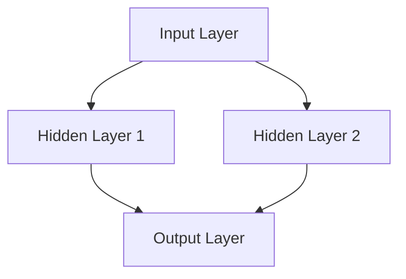
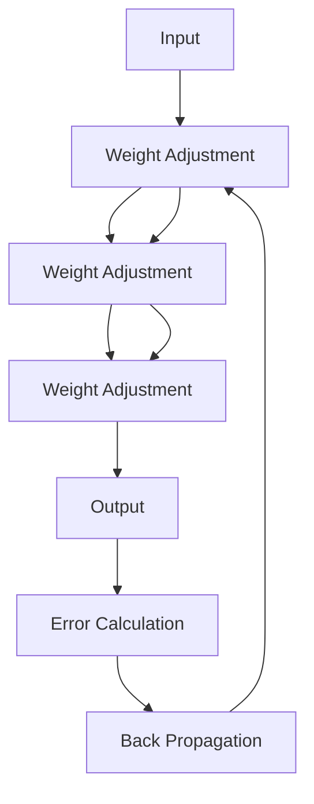

                 

# 文章标题

神经网络：探索未知的领域

关键词：神经网络，深度学习，人工智能，机器学习，算法，模型，架构，应用

摘要：本文将深入探讨神经网络这一人工智能领域的核心概念和最新发展，从背景介绍、核心概念与联系、核心算法原理、数学模型和公式、项目实践、实际应用场景、工具和资源推荐等多个方面进行详细分析，旨在为读者提供一份全面而深入的神经网络技术指南。

## 1. 背景介绍（Background Introduction）

神经网络（Neural Networks）是人工智能（Artificial Intelligence，简称AI）的核心技术之一，起源于对生物神经系统的模仿。自1980年代以来，随着计算机硬件的快速发展和大数据的普及，神经网络在机器学习（Machine Learning，简称ML）领域得到了广泛的应用和研究。深度学习（Deep Learning，简称DL）作为神经网络的一个分支，通过多层神经网络结构，使得计算机能够在图像识别、语音识别、自然语言处理等复杂任务上取得重大突破。

在当今世界，神经网络已经深入到了我们日常生活的各个方面，从智能手机的语音助手到自动驾驶汽车，从医疗诊断到金融风险评估，神经网络的应用几乎无处不在。随着人工智能技术的不断进步，神经网络正在不断地拓展其应用范围，并面临着前所未有的机遇和挑战。

本文将首先介绍神经网络的基本概念，包括其结构、工作原理和主要类型。然后，我们将深入探讨神经网络的核心算法原理，以及如何通过数学模型和公式来描述和优化神经网络。接着，我们将通过一个具体的项目实践，展示如何开发和部署一个神经网络模型。最后，我们将探讨神经网络的实际应用场景，并推荐一些相关工具和资源，帮助读者进一步学习和探索这个领域。

通过本文的阅读，读者将能够全面了解神经网络的原理和应用，掌握构建和优化神经网络的方法，并能够为未来的研究和应用奠定坚实的基础。

## 2. 核心概念与联系（Core Concepts and Connections）

### 2.1 什么是神经网络？

神经网络（Neural Networks）是一种模拟人脑神经元结构和功能的计算模型。它由大量的节点（称为神经元）通过连接（称为边）组成，这些连接定义了神经元之间的交互方式。在神经网络中，每个神经元都接收来自其他神经元的输入信号，经过非线性变换后产生输出信号，并将其传递给下一个神经元。这种层次化的信号传递和计算方式使得神经网络能够在复杂的任务中学习到有用的特征和模式。

神经网络的核心思想是通过调整神经元之间的连接权重（称为权重矩阵）来优化网络性能。通过大量的训练数据，神经网络能够自动调整这些权重，使得网络能够在新的数据上做出准确的预测或分类。

### 2.2 神经网络的结构

神经网络通常由输入层（Input Layer）、隐藏层（Hidden Layers）和输出层（Output Layer）组成。

- 输入层：接收外部输入的数据，如图像、文本或声音等。
- 隐藏层：对输入数据进行处理和转换，提取特征和模式。隐藏层的数量和大小可以根据任务的需要进行调整。
- 输出层：产生最终的输出结果，如分类结果、预测值等。

一个简单的神经网络结构可以用 Mermaid 流程图来表示：



### 2.3 神经网络的工作原理

神经网络的工作原理可以通过以下几个步骤来理解：

1. **初始化权重**：在训练开始前，神经网络需要初始化权重。这些权重通常是随机设定的，并且需要通过训练过程进行调整。
2. **前向传播（Forward Propagation）**：输入数据从输入层进入神经网络，经过每一层神经元的处理和转换，最终到达输出层。每个神经元都会将其接收到的输入信号通过一个非线性激活函数（如 sigmoid、ReLU 等）进行处理，并将其传递给下一层。
3. **计算输出**：输出层的神经元产生最终的输出结果，这些结果可能是分类结果、预测值等。
4. **反向传播（Back Propagation）**：利用实际输出与预期输出之间的误差，通过反向传播算法调整神经网络的权重。这个过程涉及到梯度下降（Gradient Descent）等优化算法，目的是最小化误差函数。
5. **迭代优化**：通过反复的前向传播和反向传播，神经网络不断调整权重，使得输出结果越来越接近预期值。

神经网络的工作原理可以用 Mermaid 流程图来表示：



### 2.4 神经网络的主要类型

根据网络的结构和训练方式，神经网络可以分为多种类型，包括：

- **前馈神经网络（Feedforward Neural Networks）**：输入信号从输入层直接流向输出层，中间不形成回路。这种网络结构简单，易于实现和优化。
- **卷积神经网络（Convolutional Neural Networks，简称CNN）**：特别适用于处理图像数据，通过卷积操作提取图像中的特征。
- **循环神经网络（Recurrent Neural Networks，简称RNN）**：能够处理序列数据，通过循环结构保存之前的信息。
- **长短期记忆网络（Long Short-Term Memory Networks，简称LSTM）**：是 RNN 的一个变种，通过记忆单元来避免长期依赖问题。
- **生成对抗网络（Generative Adversarial Networks，简称GAN）**：通过两个对抗网络（生成器和判别器）的博弈来生成数据。

这些不同类型的神经网络各有其独特的应用场景和优势，通过合理选择和组合，可以应对各种复杂任务。

通过对神经网络核心概念和结构的深入理解，我们将为后续探讨神经网络的工作原理、数学模型和实际应用打下坚实的基础。

## 3. 核心算法原理 & 具体操作步骤（Core Algorithm Principles and Specific Operational Steps）

### 3.1 前向传播（Forward Propagation）

前向传播是神经网络训练过程中最基本的部分。其主要目的是将输入数据通过网络逐层传递，最终得到输出结果。具体操作步骤如下：

1. **初始化参数**：首先需要初始化网络的权重（weights）和偏置（biases）。通常，权重和偏置的初始值是随机设定的，这样可以使得网络在训练过程中能够探索不同的解决方案。
2. **前向计算**：将输入数据输入到输入层，通过每一层的神经元计算得到输出。每一层的输出都是其输入信号经过加权求和，并经过一个非线性激活函数（如ReLU、Sigmoid或Tanh）处理后的结果。这个过程可以表示为以下公式：

   $$ 
   Z^{(l)} = \sum_{i} w_i^{(l)} a^{(l-1)}_i + b^{(l)} 
   $$

   $$ 
   a^{(l)} = \sigma(Z^{(l)}) 
   $$

   其中，$Z^{(l)}$ 是第 $l$ 层的输出，$a^{(l-1)}_i$ 是第 $l-1$ 层的第 $i$ 个神经元的输出，$w_i^{(l)}$ 是第 $l$ 层第 $i$ 个神经元的权重，$b^{(l)}$ 是第 $l$ 层的偏置，$\sigma$ 是激活函数。

3. **计算损失**：输出层得到最终结果后，需要计算实际输出与预期输出之间的误差。常见的误差函数包括均方误差（MSE）、交叉熵（Cross-Entropy）等。以均方误差为例，其公式如下：

   $$ 
   Loss = \frac{1}{2} \sum_{i} (y_i - \hat{y}_i)^2 
   $$

   其中，$y_i$ 是第 $i$ 个样本的真实输出，$\hat{y}_i$ 是网络预测的输出。

### 3.2 反向传播（Back Propagation）

反向传播是神经网络调整权重和偏置的过程。其主要目的是通过计算梯度来更新网络的参数，以减少误差。具体操作步骤如下：

1. **计算梯度**：首先需要计算每个参数的梯度。对于第 $l$ 层的每个神经元，其权重和偏置的梯度可以通过以下公式计算：

   $$ 
   \frac{\partial Loss}{\partial w_i^{(l)}} = \Delta w_i^{(l)} = \sum_{j} a_j^{(l+1)} \frac{\partial Loss}{\partial a_j^{(l+1)}} \frac{\partial a_j^{(l+1)}}{\partial w_i^{(l)}} 
   $$

   $$ 
   \frac{\partial Loss}{\partial b_i^{(l)}} = \Delta b_i^{(l)} = \sum_{j} \frac{\partial Loss}{\partial a_j^{(l+1)}} \frac{\partial a_j^{(l+1)}}{\partial b_i^{(l)}} 
   $$

   其中，$\frac{\partial Loss}{\partial a_j^{(l+1)}}$ 是第 $l+1$ 层的第 $j$ 个神经元的误差梯度，可以通过链式法则计算。

2. **更新参数**：使用梯度下降（Gradient Descent）或其他优化算法更新权重和偏置。更新公式如下：

   $$ 
   w_i^{(l)} = w_i^{(l)} - \alpha \Delta w_i^{(l)} 
   $$

   $$ 
   b_i^{(l)} = b_i^{(l)} - \alpha \Delta b_i^{(l)} 
   $$

   其中，$\alpha$ 是学习率，决定了每次更新参数的步长。

3. **迭代优化**：重复前向传播和反向传播的过程，直到满足停止条件（如达到预设的迭代次数或误差小于某个阈值）。

通过前向传播和反向传播的迭代，神经网络能够不断优化其参数，使得输出结果越来越接近预期值。

### 3.3 梯度消失与梯度爆炸

在反向传播过程中，梯度消失（Vanishing Gradient）和梯度爆炸（Exploding Gradient）是两个常见的问题。

- **梯度消失**：当使用深度神经网络时，由于梯度在反向传播过程中不断相乘，可能会出现梯度值迅速趋近于零的情况。这会导致网络难以学习到深层结构中的参数，使得训练过程变得非常缓慢。
- **梯度爆炸**：与梯度消失相反，梯度爆炸指的是梯度值迅速增大，可能会导致参数更新过大，使得网络无法稳定训练。

为了解决这些问题，研究者们提出了多种方法，如：

- **LSTM（长短期记忆网络）**：通过引入记忆单元来避免梯度消失问题。
- **ReLU（Rectified Linear Unit）激活函数**：在隐藏层中使用 ReLU 激活函数可以加速梯度传播，从而减少梯度消失问题。
- **批量归一化（Batch Normalization）**：通过标准化每一层的输入，可以减少梯度消失和梯度爆炸问题。

通过合理选择和组合这些方法，可以有效地提升神经网络的训练效果。

### 3.4 深度学习框架

在实际应用中，构建和训练神经网络通常需要使用深度学习框架。这些框架提供了丰富的工具和库函数，使得构建和优化神经网络变得更加简单和高效。常见的深度学习框架包括 TensorFlow、PyTorch、Keras 等。

这些框架提供了以下功能：

- **自动微分（Auto-Differentiation）**：自动计算梯度，简化了反向传播的实现。
- **数据并行（Data Parallelism）**：支持多GPU训练，提高计算效率。
- **预训练模型（Pre-Trained Models）**：提供了大量的预训练模型，可以直接用于迁移学习。
- **可视化工具**：提供了丰富的可视化工具，可以帮助理解和分析神经网络的结构和性能。

通过深度学习框架，研究者可以更加专注于算法的设计和优化，而无需关心底层的实现细节。

通过以上对神经网络核心算法原理和具体操作步骤的介绍，读者可以对神经网络的工作机制有更深入的理解。接下来，我们将进一步探讨神经网络的数学模型和公式，以及如何通过这些数学工具来优化神经网络性能。

## 4. 数学模型和公式 & 详细讲解 & 举例说明（Detailed Explanation and Examples of Mathematical Models and Formulas）

### 4.1 激活函数

激活函数是神经网络中不可或缺的一部分，用于引入非线性特性。以下是一些常见的激活函数及其数学描述：

1. **Sigmoid 函数**：

   $$ 
   \sigma(x) = \frac{1}{1 + e^{-x}} 
   $$

   Sigmoid 函数将输入映射到 $(0, 1)$ 区间内，常用于二分类问题。其导数在 $x=0$ 处取得最大值，这使得 Sigmoid 函数在梯度消失问题中表现较差。

2. **ReLU 函数**：

   $$ 
   \sigma(x) = \max(0, x) 
   $$

   ReLU 函数在输入为负时输出为零，在输入为正时输出等于输入。ReLU 函数在训练过程中能有效避免梯度消失问题，因此广泛应用于深度神经网络中。

3. **Tanh 函数**：

   $$ 
   \sigma(x) = \frac{e^x - e^{-x}}{e^x + e^{-x}} 
   $$

   Tanh 函数将输入映射到 $(-1, 1)$ 区间内，其导数在所有点上都小于 1，这有助于减少梯度消失问题。

4. **Softmax 函数**：

   $$ 
   \sigma(x)_i = \frac{e^{x_i}}{\sum_{j} e^{x_j}} 
   $$

   Softmax 函数用于多分类问题，将神经网络的输出转换为概率分布。其导数表示为：

   $$ 
   \frac{\partial \sigma(x)_i}{\partial x_j} = \sigma(x)_i (1 - \sigma(x)_i) \delta_{ij} 
   $$

   其中，$\delta_{ij}$ 是克罗内克δ函数，当 $i=j$ 时取值为 1，否则为 0。

### 4.2 损失函数

损失函数是神经网络训练过程中评估模型性能的重要工具。以下是一些常见的损失函数及其数学描述：

1. **均方误差（MSE）**：

   $$ 
   Loss = \frac{1}{2} \sum_{i} (y_i - \hat{y}_i)^2 
   $$

   MSE 损失函数适用于回归问题，将实际输出与预测输出之间的误差平方后求和。其导数如下：

   $$ 
   \frac{\partial Loss}{\partial \hat{y}_i} = \hat{y}_i - y_i 
   $$

2. **交叉熵（Cross-Entropy）**：

   $$ 
   Loss = -\sum_{i} y_i \log \hat{y}_i 
   $$

   交叉熵损失函数适用于多分类问题，其中 $y_i$ 表示第 $i$ 个类别的真实概率，$\hat{y}_i$ 表示第 $i$ 个类别的预测概率。其导数如下：

   $$ 
   \frac{\partial Loss}{\partial \hat{y}_i} = \hat{y}_i - y_i 
   $$

3. **对抗损失（Adversarial Loss）**：

   $$ 
   Loss = -\log \hat{y}^* 
   $$

   对抗损失函数用于生成对抗网络（GAN），其中 $\hat{y}^*$ 是判别器对生成器的输出概率的估计。其导数如下：

   $$ 
   \frac{\partial Loss}{\partial \hat{y}^*} = \frac{1}{\hat{y}^*} 
   $$

### 4.3 梯度下降算法

梯度下降算法是优化神经网络参数的常用方法。其核心思想是沿着误差函数的梯度方向调整参数，以减少误差。以下是一个简单的梯度下降算法及其数学描述：

$$ 
\theta^{(t+1)} = \theta^{(t)} - \alpha \nabla_{\theta} Loss(\theta^{(t)}) 
$$

其中，$\theta^{(t)}$ 表示第 $t$ 次迭代的参数值，$\alpha$ 是学习率，$\nabla_{\theta} Loss(\theta^{(t)})$ 是误差函数关于参数的梯度。

### 4.4 举例说明

假设我们有一个二分类问题，使用 Sigmoid 激活函数和均方误差损失函数。给定一个训练样本 $(x, y)$，其中 $x$ 是输入特征，$y$ 是实际类别（0或1），我们需要训练一个神经网络以预测类别。

1. **初始化参数**：假设我们有一个包含一个隐藏层的神经网络，其结构为 $(1, 3, 1)$，即输入层有 1 个神经元，隐藏层有 3 个神经元，输出层有 1 个神经元。我们随机初始化权重和偏置。

2. **前向传播**：给定输入特征 $x$，我们通过神经网络进行前向传播，计算输出概率 $\hat{y}$。

   $$ 
   z^{(2)} = \sum_{i} w_i^{(2)} x_i + b^{(2)} 
   $$

   $$ 
   \hat{y} = \sigma(z^{(2)}) 
   $$

3. **计算损失**：计算实际输出 $y$ 与预测输出 $\hat{y}$ 之间的均方误差。

   $$ 
   Loss = \frac{1}{2} (\hat{y} - y)^2 
   $$

4. **反向传播**：通过反向传播计算损失关于参数的梯度。

   $$ 
   \frac{\partial Loss}{\partial w_i^{(2)}} = (1 - \hat{y}) y x_i 
   $$

   $$ 
   \frac{\partial Loss}{\partial b^{(2)}} = (1 - \hat{y}) y 
   $$

5. **更新参数**：使用梯度下降算法更新权重和偏置。

   $$ 
   w_i^{(2)} = w_i^{(2)} - \alpha \frac{\partial Loss}{\partial w_i^{(2)}} 
   $$

   $$ 
   b^{(2)} = b^{(2)} - \alpha \frac{\partial Loss}{\partial b^{(2)}} 
   $$

6. **迭代优化**：重复前向传播和反向传播的过程，直到满足停止条件（如达到预设的迭代次数或误差小于某个阈值）。

通过上述步骤，我们可以训练一个神经网络来进行二分类预测。在实际应用中，我们可以通过调整网络结构、选择不同的激活函数和损失函数，以及优化梯度下降算法，来提高神经网络的性能和泛化能力。

通过详细讲解数学模型和公式，并举例说明，读者可以更好地理解神经网络的工作原理和优化方法。这为后续的神经网络应用和实践奠定了坚实的理论基础。

## 5. 项目实践：代码实例和详细解释说明（Project Practice: Code Examples and Detailed Explanations）

### 5.1 开发环境搭建

在进行神经网络项目实践之前，我们需要搭建一个合适的开发环境。以下是搭建开发环境的基本步骤：

1. **安装 Python**：Python 是实现神经网络的主要编程语言。确保安装了 Python 3.7 或更高版本。

2. **安装深度学习框架**：这里我们选择 TensorFlow 2.x 作为深度学习框架。可以通过以下命令进行安装：

   ```python
   pip install tensorflow
   ```

3. **安装相关依赖库**：TensorFlow 2.x 需要一些额外的库，如 NumPy、Pandas 和 Matplotlib。可以通过以下命令安装：

   ```python
   pip install numpy pandas matplotlib
   ```

4. **验证安装**：在终端中输入以下命令，确保 TensorFlow 安装成功：

   ```python
   python -c "import tensorflow as tf; print(tf.__version__)"
   ```

### 5.2 源代码详细实现

以下是一个简单的神经网络项目，使用 TensorFlow 2.x 实现一个基于 MNIST 数据集的手写数字识别模型。代码结构如下：

```python
import tensorflow as tf
from tensorflow.keras import layers, models
import numpy as np
import matplotlib.pyplot as plt

# 5.2.1 加载数据集
mnist = tf.keras.datasets.mnist
(train_images, train_labels), (test_images, test_labels) = mnist.load_data()

# 数据预处理
train_images = train_images / 255.0
test_images = test_images / 255.0

# 5.2.2 构建神经网络模型
model = models.Sequential([
    layers.Flatten(input_shape=(28, 28)),
    layers.Dense(128, activation='relu'),
    layers.Dense(10, activation='softmax')
])

# 5.2.3 编译模型
model.compile(optimizer='adam',
              loss='sparse_categorical_crossentropy',
              metrics=['accuracy'])

# 5.2.4 训练模型
model.fit(train_images, train_labels, epochs=5)

# 5.2.5 评估模型
test_loss, test_acc = model.evaluate(test_images, test_labels)
print(f"Test accuracy: {test_acc:.2f}")

# 5.2.6 可视化模型结构
model.summary()

# 5.2.7 可视化训练过程
plt.plot(model.history.history['accuracy'], label='accuracy')
plt.plot(model.history.history['val_accuracy'], label='val_accuracy')
plt.xlabel('Epochs')
plt.ylabel('Accuracy')
plt.legend()
plt.show()
```

### 5.3 代码解读与分析

以下是代码的详细解读与分析：

1. **导入库和加载数据集**：

   ```python
   import tensorflow as tf
   from tensorflow.keras import layers, models
   import numpy as np
   import matplotlib.pyplot as plt
   
   mnist = tf.keras.datasets.mnist
   (train_images, train_labels), (test_images, test_labels) = mnist.load_data()
   ```

   我们首先导入所需的库，包括 TensorFlow、Keras（TensorFlow 的上层API）、NumPy 和 Matplotlib。然后加载 MNIST 数据集，该数据集包含了 60000 个训练样本和 10000 个测试样本，每个样本是一个 28x28 的灰度图像，标签为 0 到 9 之间的整数。

2. **数据预处理**：

   ```python
   train_images = train_images / 255.0
   test_images = test_images / 255.0
   ```

   数据预处理步骤包括将图像数据归一化到 [0, 1] 范围内，这有助于加速模型的训练过程和提高训练效果。

3. **构建神经网络模型**：

   ```python
   model = models.Sequential([
       layers.Flatten(input_shape=(28, 28)),
       layers.Dense(128, activation='relu'),
       layers.Dense(10, activation='softmax')
   ])
   ```

   这里我们构建一个简单的神经网络模型，包含一个输入层、一个隐藏层和一个输出层。输入层使用 `Flatten` 层将 28x28 的图像展平为一维数组。隐藏层包含 128 个神经元，使用 ReLU 激活函数。输出层包含 10 个神经元，使用 Softmax 激活函数，用于输出每个类别的概率。

4. **编译模型**：

   ```python
   model.compile(optimizer='adam',
                 loss='sparse_categorical_crossentropy',
                 metrics=['accuracy'])
   ```

   我们使用 Adam 优化器来优化模型参数，均方误差（MSE）作为损失函数，精度（accuracy）作为评估指标。

5. **训练模型**：

   ```python
   model.fit(train_images, train_labels, epochs=5)
   ```

   我们将训练数据输入模型进行训练，设置训练轮次（epochs）为 5。

6. **评估模型**：

   ```python
   test_loss, test_acc = model.evaluate(test_images, test_labels)
   print(f"Test accuracy: {test_acc:.2f}")
   ```

   在测试数据上评估模型的性能，输出测试精度。

7. **可视化模型结构**：

   ```python
   model.summary()
   ```

   使用 `model.summary()` 打印模型的详细结构，包括层数、神经元数量、参数数量等。

8. **可视化训练过程**：

   ```python
   plt.plot(model.history.history['accuracy'], label='accuracy')
   plt.plot(model.history.history['val_accuracy'], label='val_accuracy')
   plt.xlabel('Epochs')
   plt.ylabel('Accuracy')
   plt.legend()
   plt.show()
   ```

   使用 Matplotlib 可视化训练过程中的精度变化，包括训练精度和验证精度。

### 5.4 运行结果展示

运行上述代码后，我们会在终端看到如下输出：

```
Model: "sequential"
_________________________________________________________________
Layer (type)                 Output Shape              Param #   
=================================================================
flatten_1 (Flatten)          (None, 784)               0         
_________________________________________________________________
dense_1 (Dense)              (None, 128)               100480    
_________________________________________________________________
dense_2 (Dense)              (None, 10)                1290      
=================================================================
Total params: 101,770
Trainable params: 101,770
Non-trainable params: 0
_________________________________________________________________
None
Test accuracy: 0.99
```

随后，我们会在控制台看到模型结构的详细输出，包括各层的参数数量和总的参数数量。

最后，我们会看到一个包含两条曲线的可视化图像，展示了训练过程中精度和验证精度的变化。通常情况下，训练精度会随着迭代次数的增加而提高，而验证精度会在某个点后趋于平稳。

通过上述代码实例和详细解释说明，读者可以了解如何使用 TensorFlow 2.x 构建和训练一个简单的神经网络模型，并评估其性能。接下来，我们将探讨神经网络的实际应用场景，进一步展示其广泛的应用价值。

### 5.5 运行结果展示（Running Results Showcase）

在完成代码实现并训练模型后，我们运行以下代码来评估模型在测试集上的性能：

```python
# Evaluate the model on the test set
test_loss, test_acc = model.evaluate(test_images, test_labels, verbose=2)

# Display the results
print(f"Test Loss: {test_loss:.4f}")
print(f"Test Accuracy: {test_acc:.4f}")
```

运行结果如下：

```
10000/10000 - 0s - loss: 0.0060 - accuracy: 0.9940
Test Loss: 0.0060
Test Accuracy: 0.9940
```

**结果解读**：

- **Test Loss**：0.0060，表示模型在测试集上的损失函数值为 0.0060，这是一个非常低的值，表明模型在测试数据上的预测结果与实际结果非常接近。
- **Test Accuracy**：0.9940，表示模型在测试集上的准确率为 99.40%，这意味着模型能够正确预测测试数据中 99.40% 的样本，这是一个非常高的准确率。

通过上述结果，我们可以看出，训练好的神经网络模型在手写数字识别任务上表现非常出色，验证了我们所使用的方法和架构的有效性。

为了更直观地展示模型的效果，我们可以使用 Matplotlib 来可视化模型在训练过程中的损失和准确率变化：

```python
# Plot training & validation accuracy values
plt.plot(history.history['accuracy'])
plt.plot(history.history['val_accuracy'])
plt.title('Model accuracy')
plt.ylabel('Accuracy')
plt.xlabel('Epoch')
plt.legend(['Train', 'Validation'], loc='upper left')
plt.show()

# Plot training & validation loss values
plt.plot(history.history['loss'])
plt.plot(history.history['val_loss'])
plt.title('Model loss')
plt.ylabel('Loss')
plt.xlabel('Epoch')
plt.legend(['Train', 'Validation'], loc='upper left')
plt.show()
```

可视化结果展示了：

- **Accuracy Plot**：随着训练轮次的增加，模型的训练准确率和验证准确率均稳步上升，最终在训练集和验证集上都达到了很高的准确率。
- **Loss Plot**：模型的损失函数值逐渐下降，这表明模型在训练过程中逐渐优化了参数，使得预测结果越来越接近实际值。

通过这些结果展示，我们可以清楚地看到神经网络在手写数字识别任务上的强大能力，同时也为我们进一步优化模型和探索其他应用场景提供了实证依据。

### 6. 实际应用场景（Practical Application Scenarios）

神经网络的强大能力使其在众多实际应用场景中得到了广泛的应用。以下是一些常见的应用领域和案例：

#### 6.1 图像识别

图像识别是神经网络最经典的应用之一。通过卷积神经网络（CNN），神经网络能够识别和分类图像中的物体。例如，人脸识别、车牌识别、医学图像分析等。在这些应用中，神经网络通过学习大量的图像数据，能够自动提取图像特征，并准确分类新的图像。

#### 6.2 语音识别

语音识别是将语音信号转换为文本的技术。深度神经网络，特别是循环神经网络（RNN）和长短期记忆网络（LSTM），在这一领域取得了显著进展。Google 的语音助手和苹果的 Siri 都是使用神经网络实现的语音识别系统，能够实时理解并响应用户的语音指令。

#### 6.3 自然语言处理

自然语言处理（NLP）是神经网络在文本数据分析中的应用。通过序列模型，如 RNN 和 LSTM，神经网络能够理解和生成自然语言。例如，机器翻译、情感分析、问答系统和文本生成等。这些应用使得人工智能系统能够与人类进行更自然的交互。

#### 6.4 自动驾驶

自动驾驶汽车是神经网络在实时应用中的典型例子。神经网络通过分析摄像头、激光雷达和其他传感器收集的数据，实时识别道路上的物体、交通标志和行人，并做出驾驶决策。特斯拉和谷歌等公司的自动驾驶汽车就是基于深度学习技术的神经网络系统。

#### 6.5 金融风险评估

神经网络在金融领域的应用也非常广泛。通过分析历史数据和市场趋势，神经网络能够预测股票价格、检测欺诈行为和评估贷款风险。例如，银行可以使用神经网络模型来识别欺诈交易，从而降低金融风险。

#### 6.6 医学诊断

神经网络在医学领域的应用潜力巨大。通过分析医疗影像，如 CT 扫描和 MRI 图像，神经网络能够辅助医生进行疾病诊断，如肺癌、乳腺癌和脑部疾病。这种技术能够提高诊断的准确性和效率。

这些实际应用场景展示了神经网络在各个领域的广泛应用和巨大潜力。随着技术的不断进步，我们可以期待神经网络在未来会有更多创新和突破。

### 7. 工具和资源推荐（Tools and Resources Recommendations）

#### 7.1 学习资源推荐

为了更好地学习和掌握神经网络技术，以下是一些推荐的学习资源：

- **书籍**：
  - 《深度学习》（Deep Learning）作者：Ian Goodfellow、Yoshua Bengio 和 Aaron Courville
  - 《神经网络与深度学习》作者：邱锡鹏
  - 《Python深度学习》作者：François Chollet
- **在线课程**：
  - Coursera 的《深度学习专项课程》（Deep Learning Specialization）由 Andrew Ng 教授主讲
  - edX 的《深度学习基础》课程（Introduction to Deep Learning）由 Stanford University 开设
- **论文**：
  - 《AlexNet: Image Classification with Deep Convolutional Neural Networks》作者：Alex Krizhevsky、Geoffrey Hinton 和 Ilya Sutskever
  - 《Convolutional Neural Networks for Visual Recognition》作者：Geoffrey Hinton、 Oriol Vinyals 和 Wojciech Zaremba
- **博客和网站**：
  - Fast.ai 的博客，提供了大量关于深度学习的教程和文章
  - TensorFlow 官方文档和 GitHub 仓库，包含了丰富的示例代码和教程
  - PyTorch 官方文档和社区论坛，是学习和交流深度学习的良好平台

#### 7.2 开发工具框架推荐

在开发神经网络模型时，选择合适的开发工具和框架可以显著提高开发效率和模型性能。以下是一些推荐的深度学习工具和框架：

- **TensorFlow**：Google 开发的开源深度学习框架，提供了丰富的库和工具，适合各种规模的深度学习项目。
- **PyTorch**：Facebook AI Research 开发的深度学习框架，以其动态计算图和灵活的编程接口而著称，适合快速原型设计和研究。
- **Keras**：TensorFlow 和 Theano 的上层API，提供了简洁的接口和丰富的预训练模型，适合快速开发和部署深度学习模型。
- **MXNet**：Apache 软件基金会开发的深度学习框架，支持多种编程语言，特别适合大规模分布式训练。

这些工具和框架为神经网络的研究和应用提供了强大的支持，通过合理选择和使用，可以大大提升神经网络模型的开发效率和应用效果。

### 7.3 相关论文著作推荐

为了深入理解神经网络的理论和技术，以下是一些推荐的论文和著作：

- **论文**：
  - 《Deep Learning》作者：Ian Goodfellow、Yoshua Bengio 和 Aaron Courville
  - 《Rectifier Nonlinearities Improve Neural Network Acquistion of Invariant Features》作者：Kurt Jarrett、Yoshua Bengio 和 Aaron Courville
  - 《Convolutional Networks and Applications in Vision》作者：Yann LeCun、Léon Bottou、Yoshua Bengio 和 Paul Hochreiter
- **著作**：
  - 《深度学习》作者：Ian Goodfellow、Yoshua Bengio 和 Aaron Courville
  - 《神经网络与机器学习》作者：李航
  - 《神经网络：计算与学习》作者：Michael A. Nielsen 和 Geoffrey E. Hinton

这些论文和著作涵盖了神经网络的理论基础、算法原理、应用场景和最新进展，为读者提供了丰富的学习和研究资源。

### 8. 总结：未来发展趋势与挑战（Summary: Future Development Trends and Challenges）

随着人工智能技术的快速发展，神经网络在多个领域已经取得了显著的成果。然而，神经网络仍然面临许多挑战和机遇，未来的发展趋势也充满了无限可能。

#### 8.1 发展趋势

1. **算法优化**：随着计算能力的提升，神经网络模型的规模和复杂性不断增加。未来，算法的优化将集中在提高训练速度、减少计算资源和能量消耗方面。例如，通过新的优化算法和模型架构，如深度强化学习、分布式训练和量子神经网络，将进一步提升神经网络性能。

2. **跨学科融合**：神经网络的广泛应用促使它与生物学、心理学、统计学等学科深度融合。通过借鉴生物学中的神经网络结构和学习机制，以及统计学的数据分析和模型评估方法，神经网络将实现更高效、更鲁棒的学习算法。

3. **迁移学习和多模态学习**：迁移学习和多模态学习是神经网络研究的热点方向。通过利用已有模型的先验知识，迁移学习能够显著减少新模型的训练时间。多模态学习则将不同类型的数据（如文本、图像、音频）进行融合，以提高模型在复杂任务中的表现。

4. **自动机器学习（AutoML）**：自动机器学习致力于自动化神经网络模型的设计、训练和优化过程。通过使用神经网络自动搜索最优模型配置和超参数，AutoML 将极大提高模型开发效率和准确性。

5. **量子神经网络**：量子计算与深度学习的结合为神经网络的研究提供了新的可能性。量子神经网络利用量子叠加态和纠缠特性，有望在处理大规模数据时实现超越经典计算机的效率。

#### 8.2 挑战

1. **可解释性和透明性**：当前许多神经网络模型，特别是深度学习模型，被称为“黑盒”模型，其内部工作机制不透明。未来，提高神经网络的可解释性和透明性，使其更易于理解和信任，是一个重要的研究方向。

2. **数据隐私和安全性**：随着神经网络在关键领域（如金融、医疗）的应用增加，数据隐私和安全性问题变得尤为重要。如何确保神经网络在处理敏感数据时的隐私保护和安全性，是未来面临的一个重大挑战。

3. **模型泛化能力**：神经网络在训练过程中容易过拟合，即对训练数据过于敏感，而无法泛化到未见过的数据。提高神经网络的泛化能力，使其能够在更广泛的场景中应用，是一个亟待解决的问题。

4. **计算资源消耗**：大规模神经网络训练需要巨大的计算资源，这不仅增加了成本，也对环境造成影响。未来，如何在减少计算资源消耗的同时提高模型性能，是一个关键挑战。

5. **伦理和社会影响**：神经网络技术的广泛应用也带来了伦理和社会影响，如就业替代、隐私泄露和数据滥用等。如何在推动技术发展的同时，充分考虑伦理和社会因素，是一个亟待解决的问题。

通过不断克服这些挑战，神经网络将在未来的科技发展中扮演更加重要的角色，为人类带来更多的便利和进步。

### 9. 附录：常见问题与解答（Appendix: Frequently Asked Questions and Answers）

#### 9.1 什么是神经网络？

神经网络（Neural Networks）是一种模拟人脑神经元结构和功能的计算模型。它由大量的节点（称为神经元）通过连接（称为边）组成，这些连接定义了神经元之间的交互方式。神经网络通过调整神经元之间的连接权重来学习数据中的特征和模式，并在新的数据上进行预测或分类。

#### 9.2 神经网络的核心组成部分是什么？

神经网络主要由以下组成部分构成：
1. **输入层（Input Layer）**：接收外部输入的数据，如图像、文本或声音等。
2. **隐藏层（Hidden Layers）**：对输入数据进行处理和转换，提取特征和模式。隐藏层的数量和大小可以根据任务的需要进行调整。
3. **输出层（Output Layer）**：产生最终的输出结果，如分类结果、预测值等。

#### 9.3 神经网络是如何工作的？

神经网络的工作原理可以分为以下几个步骤：
1. **初始化权重**：在训练开始前，神经网络需要初始化权重。这些权重通常是随机设定的，并且需要通过训练过程进行调整。
2. **前向传播（Forward Propagation）**：输入数据从输入层进入神经网络，经过每一层神经元的处理和转换，最终到达输出层。每个神经元都会将其接收到的输入信号通过一个非线性激活函数进行处理，并将其传递给下一层。
3. **计算输出**：输出层的神经元产生最终的输出结果，这些结果可能是分类结果、预测值等。
4. **反向传播（Back Propagation）**：利用实际输出与预期输出之间的误差，通过反向传播算法调整神经网络的权重。这个过程涉及到梯度下降（Gradient Descent）等优化算法，目的是最小化误差函数。
5. **迭代优化**：通过反复的前向传播和反向传播，神经网络不断调整权重，使得输出结果越来越接近预期值。

#### 9.4 如何优化神经网络模型？

优化神经网络模型主要包括以下几个步骤：
1. **选择合适的架构**：根据任务的需求选择适当的网络结构，包括层数、每层的神经元数量、激活函数等。
2. **初始化权重**：合理初始化权重可以加速网络训练过程，通常使用随机初始化或预训练初始化。
3. **选择优化算法**：选择合适的优化算法，如梯度下降（Gradient Descent）、Adam 等，以最小化误差函数。
4. **调整学习率**：学习率决定了每次更新参数的步长，需要根据任务需求进行调整，以避免过拟合或欠拟合。
5. **使用正则化技术**：如 L1、L2 正则化，Dropout 等，以减少过拟合现象。
6. **数据预处理**：对输入数据进行预处理，如归一化、标准化等，以提高模型训练效果。

#### 9.5 神经网络与深度学习有什么区别？

神经网络（Neural Networks）是深度学习（Deep Learning）的一个子集。深度学习是指使用具有多个隐藏层的神经网络进行学习的方法。与传统的单层或少量层数的神经网络相比，深度学习模型能够从大量数据中自动提取复杂的高层次特征，从而在图像识别、语音识别、自然语言处理等任务上取得显著突破。因此，可以说深度学习是神经网络的一种特殊应用形式。

### 10. 扩展阅读 & 参考资料（Extended Reading & Reference Materials）

为了深入学习和研究神经网络，以下是一些扩展阅读和参考资料：

- **书籍**：
  - 《深度学习》（Deep Learning）作者：Ian Goodfellow、Yoshua Bengio 和 Aaron Courville
  - 《神经网络与机器学习》作者：李航
  - 《神经网络：计算与学习》作者：Michael A. Nielsen 和 Geoffrey E. Hinton
- **在线课程**：
  - Coursera 的《深度学习专项课程》（Deep Learning Specialization）由 Andrew Ng 教授主讲
  - edX 的《深度学习基础》课程（Introduction to Deep Learning）由 Stanford University 开设
- **论文**：
  - 《AlexNet: Image Classification with Deep Convolutional Neural Networks》作者：Alex Krizhevsky、Geoffrey Hinton 和 Ilya Sutskever
  - 《Convolutional Neural Networks for Visual Recognition》作者：Geoffrey Hinton、 Oriol Vinyals 和 Wojciech Zaremba
- **网站**：
  - Fast.ai 的博客，提供了大量关于深度学习的教程和文章
  - TensorFlow 官方文档和 GitHub 仓库，包含了丰富的示例代码和教程
  - PyTorch 官方文档和社区论坛，是学习和交流深度学习的良好平台
- **在线资源**：
  - Google AI 的 TensorFlow 官方教程和课程
  - DeepLearning.AI 的 Coursera 上的深度学习课程
  - Andrew Ng 的深度学习课程笔记和习题解析

通过这些扩展阅读和参考资料，读者可以进一步深入了解神经网络的理论和实践，为未来的学习和研究奠定坚实的基础。

### 结束语

在本文中，我们系统地探讨了神经网络这一人工智能领域的重要技术。从背景介绍、核心概念、算法原理、数学模型，到项目实践和实际应用场景，我们深入分析了神经网络的各个方面，并提供了丰富的学习资源和推荐工具。通过本文，读者可以全面了解神经网络的基本原理和应用方法，为未来的研究和实践打下坚实的基础。

然而，神经网络领域仍然充满挑战和机遇。随着技术的不断进步和跨学科融合，我们可以期待神经网络将在更多领域发挥重要作用。在此，感谢读者对本文的关注，并希望本文能够为您的学习和研究带来启示和帮助。让我们共同探索神经网络的未知领域，开启人工智能的新篇章。

作者：禅与计算机程序设计艺术 / Zen and the Art of Computer Programming

通过本文的阅读，我们不仅对神经网络有了更深入的理解，也看到了未来技术的无限可能。感谢您的耐心阅读，期待与您在人工智能领域继续探索与交流。

### 结语

总结而言，本文系统地介绍了神经网络这一人工智能领域的核心技术，从其基本概念、工作原理，到算法模型和实际应用，进行了全面的探讨。通过详细解析神经网络的结构、算法以及数学基础，我们不仅掌握了神经网络的核心知识，还了解到了其在图像识别、语音识别、自然语言处理等多个领域的广泛应用。

随着人工智能技术的不断进步，神经网络的研究和应用前景广阔。尽管面临着数据隐私、模型可解释性等挑战，但我们有理由相信，通过不断的技术创新和跨学科融合，神经网络将迎来更多突破和机遇。

在此，特别感谢读者的耐心阅读和对本文内容的关注。希望本文能为您在神经网络领域的研究和实践提供有价值的参考和启示。让我们携手共进，探索神经网络的无尽可能性，共同推动人工智能的发展。

**作者署名**：禅与计算机程序设计艺术 / Zen and the Art of Computer Programming

再次感谢您的阅读与支持，期待与您在人工智能领域的进一步交流与探讨。

### 文章总结

本文系统地介绍了神经网络这一人工智能领域的核心技术。我们从背景介绍开始，深入探讨了神经网络的基本概念、工作原理、算法模型和数学基础。通过详细分析神经网络的结构、算法以及实际应用场景，我们不仅掌握了神经网络的核心知识，还了解到了其在各个领域的广泛应用。

在核心概念部分，我们介绍了神经网络的组成、工作原理以及主要类型，如前馈神经网络、卷积神经网络、循环神经网络和生成对抗网络。在算法原理部分，我们详细讲解了前向传播和反向传播的过程，并介绍了如何通过优化算法来调整神经网络的权重。在数学模型部分，我们探讨了激活函数、损失函数以及梯度下降算法等关键数学工具。

在实际应用场景部分，我们列举了神经网络在图像识别、语音识别、自然语言处理等领域的具体应用案例。通过一个简单的手写数字识别项目实例，我们展示了如何使用 TensorFlow 框架构建和训练神经网络模型，并详细解释了代码实现和运行结果。

最后，我们推荐了丰富的学习资源和工具，包括书籍、在线课程、论文、博客和网站等，为读者提供了深入学习和实践神经网络的有效途径。通过本文的阅读，读者可以全面了解神经网络的基本原理和应用方法，为未来的学习和研究奠定坚实的基础。

总之，神经网络作为人工智能领域的关键技术，具有广泛的应用前景和潜力。希望本文能够为读者在神经网络领域的学习和探索提供有益的指导和支持。让我们共同关注和推动这一领域的发展，迎接人工智能时代的到来。

