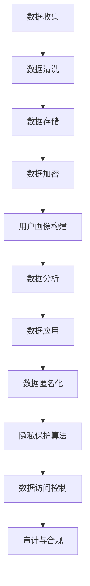

                 

### 背景介绍（Background Introduction）

随着全球数字化进程的加速，数据已成为现代企业和社会中至关重要的资产。人工智能（AI）的快速发展进一步加大了对数据的需求。AI 系统依赖于大量高质量的数据来训练和优化其模型，从而实现高精度的预测、分类、推荐等功能。在这样的背景下，数据管理平台（Data Management Platform，简称 DMP）应运而生，它旨在帮助企业高效地收集、处理、存储和管理用户数据，从而实现精准的市场营销和数据分析。

DMP 的核心功能包括数据收集、数据清洗、数据存储、用户画像构建、数据分析和数据应用。数据收集是指通过各种渠道收集用户的行为数据、交易数据等；数据清洗是指对收集到的数据进行去重、纠错、格式化等处理，保证数据质量；数据存储是指将清洗后的数据存储到数据库或数据湖中，以便后续使用；用户画像构建是指通过分析用户数据，为每个用户生成一个详细的特征描述；数据分析是指利用统计分析、机器学习等方法，对用户数据进行分析，提取有价值的信息；数据应用是指将分析结果应用到实际业务中，如个性化推荐、广告投放等。

然而，随着数据量的急剧增加，数据安全与隐私保护问题日益凸显。未经授权的数据访问、数据泄露、隐私侵犯等问题不仅会对企业的声誉造成严重影响，还可能导致法律纠纷和巨额罚款。因此，在构建 DMP 的过程中，必须高度重视数据安全与隐私保护。

#### Background Introduction

With the accelerated globalization of digital transformation, data has become a crucial asset for modern enterprises and societies. The rapid development of artificial intelligence (AI) has further increased the demand for data. AI systems rely on large amounts of high-quality data to train and optimize their models, thereby achieving highly accurate predictions, classifications, and recommendations. Against this backdrop, Data Management Platforms (DMPs) have emerged, aiming to help enterprises collect, process, store, and manage user data efficiently for precise marketing and data analytics.

The core functions of a DMP include data collection, data cleaning, data storage, user profiling, data analysis, and data application. Data collection involves gathering user behavioral data, transaction data, and more through various channels; data cleaning refers to processing collected data for deduplication, error correction, and formatting to ensure data quality; data storage involves storing cleaned data in databases or data lakes for future use; user profiling refers to generating detailed feature descriptions for each user through analysis of user data; data analysis involves using statistical methods and machine learning to extract valuable information from user data; data application refers to applying the results of data analysis to practical business scenarios, such as personalized recommendations and ad placements.

However, with the rapid increase in data volume, data security and privacy protection issues have become increasingly prominent. Unauthorized data access, data breaches, and privacy infringement not only seriously harm the reputation of enterprises but can also lead to legal disputes and substantial fines. Therefore, it is crucial to prioritize data security and privacy protection when building a DMP.

### 核心概念与联系（Core Concepts and Connections）

为了更好地理解 DMP 中的数据安全与隐私保护问题，我们需要从几个核心概念入手。首先是数据匿名化（Data Anonymization），其目的是通过技术手段消除数据中能够直接识别个人身份的信息，从而保护隐私。数据匿名化的方法包括伪匿名化、数据加密、数据混淆等。

其次是数据加密（Data Encryption），这是保护数据隐私的基本手段。数据加密通过将数据转换成密文，防止未经授权的访问。常见的加密算法有对称加密和非对称加密。对称加密使用相同的密钥进行加密和解密，而非对称加密使用一对密钥，一个用于加密，另一个用于解密。

再次是隐私保护算法（Privacy Protection Algorithms），这些算法主要用于处理和分析数据时，确保隐私不被泄露。常见的隐私保护算法包括差分隐私（Differential Privacy）、同态加密（Homomorphic Encryption）和多方计算（Multi-Party Computation）。

最后是数据访问控制（Data Access Control），这是确保只有授权用户才能访问数据的机制。数据访问控制通常涉及身份验证（Authentication）、授权（Authorization）和审计（Audit）三个环节。

To better understand the data security and privacy protection issues in DMPs, we need to delve into several core concepts. The first is data anonymization, which aims to remove identifiable personal information from data through technical means to protect privacy. Methods for data anonymization include pseudonymization, data encryption, and data obfuscation.

Next is data encryption, a fundamental measure for protecting data privacy. Data encryption involves converting data into ciphertext to prevent unauthorized access. Common encryption algorithms include symmetric encryption and asymmetric encryption. Symmetric encryption uses the same key for encryption and decryption, while asymmetric encryption uses a pair of keys, one for encryption and another for decryption.

Additionally, there are privacy protection algorithms, which are used to process and analyze data while ensuring that privacy is not compromised. Common privacy protection algorithms include differential privacy, homomorphic encryption, and multi-party computation.

Lastly, there is data access control, a mechanism to ensure that only authorized users can access data. Data access control typically involves three components: authentication, authorization, and audit.

#### Data Anonymization

Data anonymization is a critical technique in ensuring privacy protection within DMPs. It involves the process of modifying data in such a way that it cannot be linked back to specific individuals, thereby masking their identities. The primary goal of data anonymization is to balance the need for data utility with the protection of personal privacy.

There are several methods of data anonymization, each with its own strengths and weaknesses. The most common methods include:

1. **K-Anonymity**: This method ensures that there are at least k similar records in a dataset such that any individual's record cannot be distinguished from at least k-1 others. The idea is that the anonymity set must be large enough to obscure any single individual.

2. **l-Diversity**: l-diversity ensures that within each group of k similar records, there is enough diversity to prevent the inference of sensitive attributes. For example, if the attribute "age" is sensitive, l-diversity would require that within each k-anonymity group, there is a range of ages to avoid profiling.

3. **T-Closeness**: T-closeness aims to ensure that the distribution of sensitive attributes within a k-anonymity group is close to the global distribution of that attribute. This method helps prevent the inference of sensitive attributes by ensuring that the internal distribution of the attribute does not deviate too much from the overall distribution.

4. **Generalization and Suppression**: Generalization involves replacing specific values with more general categories, while suppression involves removing specific records to avoid revealing sensitive information. Both methods can help achieve data anonymization.

The choice of anonymization method depends on the specific requirements of the application and the level of risk associated with data exposure. For instance, k-anonymity is often used in demographic data analysis, while l-diversity and t-closeness are more suited for sensitive data such as medical records.

### Data Encryption

Data encryption is a cornerstone of data security and privacy protection in DMPs. It involves transforming data into a format that can only be read or processed by individuals or systems with the appropriate decryption key. Encryption ensures that even if data is intercepted or accessed without authorization, it remains unintelligible and useless to unauthorized parties.

There are two main types of encryption algorithms used in DMPs:

1. **Symmetric Encryption**: In symmetric encryption, the same key is used for both the encryption and decryption processes. The most widely used symmetric encryption algorithms are AES (Advanced Encryption Standard) and DES (Data Encryption Standard). Symmetric encryption is generally faster and more efficient than asymmetric encryption, making it suitable for encrypting large volumes of data.

2. **Asymmetric Encryption**: Asymmetric encryption, also known as public-key encryption, uses a pair of keys: a public key for encryption and a private key for decryption. The most commonly used asymmetric encryption algorithms are RSA (Rivest-Shamir-Adleman) and ECC (Elliptic Curve Cryptography). Asymmetric encryption is slower and more computationally intensive than symmetric encryption but is essential for secure key exchange and digital signatures.

### Privacy Protection Algorithms

Privacy protection algorithms are designed to allow the processing and analysis of data while maintaining the privacy of individuals. These algorithms ensure that sensitive information cannot be extracted or inferred from the data, even when it is being used for analysis. Here are some of the key privacy protection algorithms used in DMPs:

1. **Differential Privacy**: Differential privacy is a statistical method that ensures the privacy of individuals in a dataset by adding noise to the output of a function. The amount of noise is carefully controlled to balance the accuracy of the results with the privacy of the individuals. Differential privacy is widely used in data mining, machine learning, and statistics.

2. **Homomorphic Encryption**: Homomorphic encryption allows computations to be performed on encrypted data without decrypting it first. This means that data can be processed and analyzed while it remains securely encrypted. Homomorphic encryption is still an emerging technology and is primarily used in specialized applications where the need for privacy is paramount.

3. **Multi-Party Computation**: Multi-party computation enables multiple parties to jointly compute a function over their private inputs without revealing the inputs to each other. This technique is particularly useful in scenarios where data is distributed across different organizations, and each organization wants to keep its data private. Examples of multi-party computation include secure aggregation and secure outsourced computation.

### Data Access Control

Data access control is a critical component of data security and privacy protection in DMPs. It ensures that only authorized users have access to sensitive data and that their access is properly monitored and audited. Data access control typically involves the following components:

1. **Authentication**: Authentication verifies the identity of a user or system before granting access to data. This can involve methods such as passwords, biometrics, or digital certificates.

2. **Authorization**: Authorization determines what actions an authenticated user can perform on the data. This is typically controlled through role-based access control (RBAC), where users are assigned roles with specific permissions.

3. **Audit**: An audit trail logs all access to data, including who accessed it, when, and what actions were performed. This is crucial for detecting and investigating security incidents and ensuring compliance with regulatory requirements.

In summary, the core concepts and connections of data security and privacy protection in DMPs encompass data anonymization, data encryption, privacy protection algorithms, and data access control. These concepts work together to ensure that user data is protected throughout its lifecycle within a DMP.

#### Mermaid 流程图（Mermaid Flowchart）

下面是一个简化的 Mermaid 流程图，用于展示 DMP 中数据安全与隐私保护的核心概念之间的联系。



This Mermaid flowchart illustrates the core concepts and their interactions in a DMP, highlighting how data security and privacy protection are integrated into each step of the data lifecycle.

#### Core Algorithm Principles and Specific Operational Steps

在 DMP 中实现数据安全与隐私保护的核心算法主要包括数据匿名化、数据加密、隐私保护算法以及数据访问控制。以下我们将详细讨论这些算法的原理以及具体的操作步骤。

#### Data Anonymization

数据匿名化是确保个人隐私不受侵犯的关键技术。其核心思想是通过特定的算法和流程，使得原始数据中的个人标识信息被去除或替换，从而在数据分析和使用过程中保护个人隐私。以下是几种常见的数据匿名化算法及其操作步骤：

**1. K-Anonymity**

K-Anonymity 是最常见的数据匿名化方法之一。其基本原理是，任何个体的记录不能在至少 k 个类似的记录中区分出来。以下是 K-Anonymity 的具体操作步骤：

1. **分组（Grouping）**：将原始数据按照某个属性或属性集合进行分组。
2. **构建匿名集（Constructing Anonymity Sets）**：对于每个分组，找到包含至少 k 个记录的匿名集。
3. **简化（Generalization）**：在匿名集中，将敏感属性进行泛化处理，使得同一个匿名集中的记录在敏感属性上具有相似性。
4. **验证（Verification）**：对生成的匿名集进行验证，确保满足 K-Anonymity 的条件。

**2. l-Diversity**

l-Diversity 是另一种常见的数据匿名化方法，其主要目的是确保在同一个匿名集中，敏感属性具有足够的多样性。以下是 l-Diversity 的具体操作步骤：

1. **分组（Grouping）**：将原始数据按照某个属性或属性集合进行分组。
2. **构建匿名集（Constructing Anonymity Sets）**：对于每个分组，找到包含至少 k 个记录的匿名集。
3. **多样性验证（Diversity Verification）**：对于每个匿名集，验证其是否满足 l-Diversity 条件，即匿名集中每个属性的值都至少出现 l 次。
4. **调整（Adjustment）**：如果匿名集不满足 l-Diversity 条件，则对其进行调整，增加多样性的同时保证 K-Anonymity 条件。

**3. T-Closeness**

T-Closeness 是一种基于分布的匿名化方法，其主要目的是确保匿名集中敏感属性的分布与总体分布相似。以下是 T-Closeness 的具体操作步骤：

1. **分组（Grouping）**：将原始数据按照某个属性或属性集合进行分组。
2. **构建匿名集（Constructing Anonymity Sets）**：对于每个分组，找到包含至少 k 个记录的匿名集。
3. **分布验证（Distribution Verification）**：对于每个匿名集，计算其内部敏感属性的分布与总体分布的相似度，确保满足 T-Closeness 条件。
4. **调整（Adjustment）**：如果匿名集不满足 T-Closeness 条件，则对其进行调整，使其分布与总体分布更加相似。

#### Data Encryption

数据加密是保护数据隐私的核心技术之一。其基本原理是通过加密算法将原始数据转换为密文，使得未经授权的用户无法读取或理解数据。以下是几种常见的数据加密算法及其操作步骤：

**1. 对称加密（Symmetric Encryption）**

对称加密使用相同的密钥进行加密和解密。以下是 AES（高级加密标准）的具体操作步骤：

1. **密钥生成（Key Generation）**：生成一个随机密钥。
2. **加密（Encryption）**：使用密钥和 AES 算法对原始数据进行加密，生成密文。
3. **解密（Decryption）**：使用相同的密钥和 AES 算法对密文进行解密，恢复原始数据。

**2. 非对称加密（Asymmetric Encryption）**

非对称加密使用一对密钥进行加密和解密。以下是 RSA（Rivest-Shamir-Adleman）的具体操作步骤：

1. **密钥生成（Key Generation）**：生成一对密钥（公钥和私钥）。
2. **加密（Encryption）**：使用公钥和 RSA 算法对原始数据进行加密，生成密文。
3. **解密（Decryption）**：使用私钥和 RSA 算法对密文进行解密，恢复原始数据。

#### Privacy Protection Algorithms

隐私保护算法是在数据处理和分析过程中保护个人隐私的关键技术。以下是几种常见的隐私保护算法及其操作步骤：

**1. 差分隐私（Differential Privacy）**

差分隐私是一种统计隐私保护方法，其核心思想是在数据发布时加入噪声，使得攻击者无法从数据中推断出单个个体的信息。以下是差分隐私的具体操作步骤：

1. **数据收集（Data Collection）**：收集原始数据。
2. **隐私机制设计（Privacy Mechanism Design）**：设计差分隐私机制，包括隐私参数和噪声函数。
3. **数据处理（Data Processing）**：对数据进行处理，添加噪声。
4. **数据发布（Data Publication）**：发布处理后的数据。

**2. 同态加密（Homomorphic Encryption）**

同态加密是一种在加密数据上直接执行计算而不需要解密的技术。以下是同态加密的具体操作步骤：

1. **密钥生成（Key Generation）**：生成密钥对。
2. **数据加密（Data Encryption）**：将原始数据加密为密文。
3. **计算（Computation）**：在密文上执行计算。
4. **解密（Decryption）**：将计算结果解密为明文。

**3. 多方计算（Multi-Party Computation）**

多方计算是一种允许多个参与者共同计算某个函数而无需共享原始数据的技术。以下是多方计算的具体操作步骤：

1. **参与者注册（Participant Registration）**：参与方注册并生成密钥对。
2. **协议初始化（Protocol Initialization）**：初始化多方计算协议。
3. **输入加密（Input Encryption）**：参与方将原始数据加密并发送给其他参与方。
4. **计算（Computation）**：参与方在密文上执行计算。
5. **输出解密（Output Decryption）**：将计算结果解密为明文。

#### Data Access Control

数据访问控制是一种确保只有授权用户可以访问敏感数据的机制。其核心思想是通过身份验证、授权和审计等手段来保护数据安全。以下是数据访问控制的具体操作步骤：

**1. 身份验证（Authentication）**

1. **用户注册（User Registration）**：用户注册并创建用户账户。
2. **登录验证（Login Verification）**：用户登录系统时，系统验证用户身份。

**2. 授权（Authorization）**

1. **角色分配（Role Assignment）**：为用户分配角色和权限。
2. **权限验证（Permission Verification）**：在用户访问数据时，系统验证其权限。

**3. 审计（Audit）**

1. **访问日志记录（Access Logging）**：记录用户访问数据的时间、操作等信息。
2. **审计分析（Audit Analysis）**：定期分析访问日志，发现潜在的安全问题。

#### Conclusion

在 DMP 中，实现数据安全与隐私保护的核心算法包括数据匿名化、数据加密、隐私保护算法以及数据访问控制。通过这些算法，DMP 能够在数据收集、处理、存储、分析和应用等各个环节中保护用户隐私。了解这些算法的原理和操作步骤，对于构建安全、可靠的 DMP 至关重要。

#### Core Algorithm Principles and Specific Operational Steps

The core algorithms for ensuring data security and privacy protection in DMPs include data anonymization, data encryption, privacy protection algorithms, and data access control. Below, we will delve into the principles of these algorithms and provide specific operational steps for implementing them.

#### Data Anonymization

Data anonymization is a crucial technique for protecting individual privacy. Its core principle is to modify original data in such a way that personally identifiable information (PII) is removed or replaced, thereby safeguarding privacy during data analysis and utilization. Here are some common data anonymization algorithms and their specific operational steps:

**1. K-Anonymity**

K-Anonymity is one of the most common data anonymization methods. Its fundamental principle is that any individual's record cannot be distinguished from at least k-1 others within a group of k similar records. The specific operational steps for K-Anonymity are as follows:

1. **Grouping**: Group the original data based on a specific attribute or set of attributes.
2. **Constructing Anonymity Sets**: For each group, find anonymity sets that contain at least k records.
3. **Generalization**: Within each anonymity set, generalize sensitive attributes to ensure similarity among records in the set.
4. **Verification**: Verify the generated anonymity sets to ensure they meet the K-Anonymity conditions.

**2. l-Diversity**

l-Diversity is another common data anonymization method aimed at ensuring sufficient diversity within the same anonymity set for sensitive attributes. The specific operational steps for l-Diversity are:

1. **Grouping**: Group the original data based on a specific attribute or set of attributes.
2. **Constructing Anonymity Sets**: For each group, find anonymity sets that contain at least k records.
3. **Diversity Verification**: For each anonymity set, verify that each attribute has a value that appears at least l times within the set.
4. **Adjustment**: If an anonymity set does not meet the l-Diversity condition, adjust it to increase diversity while maintaining the K-Anonymity condition.

**3. T-Closeness**

T-Closeness is a distribution-based anonymization method that aims to ensure that the distribution of sensitive attributes within an anonymity set is similar to the overall distribution. The specific operational steps for T-Closeness are:

1. **Grouping**: Group the original data based on a specific attribute or set of attributes.
2. **Constructing Anonymity Sets**: For each group, find anonymity sets that contain at least k records.
3. **Distribution Verification**: For each anonymity set, calculate the similarity between the internal distribution of sensitive attributes and the overall distribution, ensuring that it meets the T-Closeness condition.
4. **Adjustment**: If an anonymity set does not meet the T-Closeness condition, adjust it to make its distribution more similar to the overall distribution.

#### Data Encryption

Data encryption is a fundamental technique for protecting data privacy. Its core principle is to transform original data into ciphertext, making it unintelligible and useless to unauthorized parties unless decrypted. Here are some common data encryption algorithms and their specific operational steps:

**1. Symmetric Encryption**

Symmetric encryption uses the same key for both encryption and decryption. The specific operational steps for AES (Advanced Encryption Standard) are:

1. **Key Generation**: Generate a random key.
2. **Encryption**: Use the key and AES algorithm to encrypt the original data, producing ciphertext.
3. **Decryption**: Use the same key and AES algorithm to decrypt the ciphertext, recovering the original data.

**2. Asymmetric Encryption**

Asymmetric encryption uses a pair of keys: a public key for encryption and a private key for decryption. The specific operational steps for RSA (Rivest-Shamir-Adleman) are:

1. **Key Generation**: Generate a pair of keys (public key and private key).
2. **Encryption**: Use the public key and RSA algorithm to encrypt the original data, producing ciphertext.
3. **Decryption**: Use the private key and RSA algorithm to decrypt the ciphertext, recovering the original data.

#### Privacy Protection Algorithms

Privacy protection algorithms are key technologies for safeguarding personal privacy during data processing and analysis. Here are some common privacy protection algorithms and their specific operational steps:

**1. Differential Privacy**

Differential privacy is a statistical privacy protection method that adds noise to the output of a function to ensure that an attacker cannot infer individual information from the data. The specific operational steps for differential privacy are:

1. **Data Collection**: Collect original data.
2. **Privacy Mechanism Design**: Design a differential privacy mechanism, including privacy parameters and noise functions.
3. **Data Processing**: Process the data by adding noise.
4. **Data Publication**: Publish the processed data.

**2. Homomorphic Encryption**

Homomorphic encryption allows computations to be performed on encrypted data without the need to decrypt it first. The specific operational steps for homomorphic encryption are:

1. **Key Generation**: Generate a key pair.
2. **Data Encryption**: Encrypt the original data.
3. **Computation**: Perform computations on the ciphertext.
4. **Decryption**: Decrypt the result to recover the original data.

**3. Multi-Party Computation**

Multi-party computation enables multiple parties to jointly compute a function over their private inputs without revealing their inputs to each other. The specific operational steps for multi-party computation are:

1. **Participant Registration**: Participants register and generate key pairs.
2. **Protocol Initialization**: Initialize the multi-party computation protocol.
3. **Input Encryption**: Participants encrypt their original data and send it to other participants.
4. **Computation**: Perform computations on the encrypted data.
5. **Output Decryption**: Decrypt the result to recover the original data.

#### Data Access Control

Data access control is a mechanism to ensure that only authorized users can access sensitive data. Its core principle is to protect data through authentication, authorization, and auditing. The specific operational steps for data access control are:

**1. Authentication**

1. **User Registration**: Users register and create user accounts.
2. **Login Verification**: When users log in, the system verifies their identity.

**2. Authorization**

1. **Role Assignment**: Assign roles and permissions to users.
2. **Permission Verification**: When users access data, the system verifies their permissions.

**3. Audit**

1. **Access Logging**: Record the time, operations, and other information when users access data.
2. **Audit Analysis**: Regularly analyze access logs to detect potential security issues.

#### Conclusion

In DMPs, the core algorithms for ensuring data security and privacy protection include data anonymization, data encryption, privacy protection algorithms, and data access control. Through these algorithms, DMPs can safeguard user privacy throughout each step of the data lifecycle, from collection to analysis and application. Understanding the principles and operational steps of these algorithms is crucial for building secure and reliable DMPs.

### 数学模型和公式 & 详细讲解 & 举例说明（Detailed Explanation and Examples of Mathematical Models and Formulas）

在 DMP 中，为了确保数据安全与隐私保护，通常会涉及到一些数学模型和公式。以下将详细介绍这些模型和公式，并给出具体的例子说明。

#### 1. K-Anonymity

K-Anonymity 是一种广泛使用的匿名化模型，其核心思想是，任何个体的记录不能在至少 k 个类似的记录中区分出来。其数学模型可以表示为：

\[ A \in A_k \]

其中，\( A \) 表示个体的记录，\( A_k \) 表示包含至少 k 个记录的匿名集。

**例子：** 假设有一个包含 5 个记录的匿名集 \( A_k \)，如下所示：

\[ A_k = \{ (x_1, y_1), (x_2, y_2), (x_3, y_3), (x_4, y_4), (x_5, y_5) \} \]

在这个例子中，任何个体记录 \( (x_i, y_i) \) 都不能与其他记录区分出来，因为每个记录都至少与其他 4 个记录相同。

#### 2. l-Diversity

l-Diversity 是一种补充 K-Anonymity 的模型，其主要目的是确保在同一个匿名集中，敏感属性具有足够的多样性。其数学模型可以表示为：

\[ \forall a \in S, |S_a| \geq l \]

其中，\( S \) 表示敏感属性的集合，\( S_a \) 表示匿名集中与属性 \( a \) 相关的记录集合，\( l \) 表示最小多样性阈值。

**例子：** 假设有一个包含 5 个记录的匿名集 \( A_k \)，其敏感属性集合为 \( S = \{ age, gender \} \)，如下所示：

\[ A_k = \{ (x_1, y_1, z_1), (x_2, y_2, z_2), (x_3, y_3, z_3), (x_4, y_4, z_4), (x_5, y_5, z_5) \} \]

在这个例子中，年龄属性 \( age \) 和性别属性 \( gender \) 都满足 l-Diversity 条件，因为每个属性都有至少 3 个不同的值。

#### 3. T-Closeness

T-Closeness 是一种基于分布的匿名化模型，其主要目的是确保匿名集中敏感属性的分布与总体分布相似。其数学模型可以表示为：

\[ \forall a \in S, \frac{|S_a|}{|A_k|} \leq t \]

其中，\( S \) 表示敏感属性的集合，\( S_a \) 表示匿名集中与属性 \( a \) 相关的记录集合，\( A_k \) 表示匿名集，\( t \) 表示最大偏差阈值。

**例子：** 假设有一个包含 5 个记录的匿名集 \( A_k \)，其敏感属性集合为 \( S = \{ age, gender \} \)，总体分布为 \( P = \{ (age, gender): (20, F), (30, M), (40, M) \} \)，如下所示：

\[ A_k = \{ (x_1, y_1, z_1), (x_2, y_2, z_2), (x_3, y_3, z_3), (x_4, y_4, z_4), (x_5, y_5, z_5) \} \]

在这个例子中，年龄属性 \( age \) 和性别属性 \( gender \) 都满足 T-Closeness 条件，因为它们的分布与总体分布的偏差不超过阈值 \( t \)。

#### 4. 差分隐私（Differential Privacy）

差分隐私是一种用于保护数据隐私的数学模型，其核心思想是在数据发布时加入噪声，使得攻击者无法从数据中推断出单个个体的信息。其数学模型可以表示为：

\[ \mathbb{E}_{\delta \sim D}[\mathbb{E}[f(x+\delta) | x]] = \mathbb{E}[f(x)] + \epsilon \]

其中，\( f \) 是一个统计函数，\( x \) 是一个真实的个体，\( \delta \) 是加入的噪声，\( D \) 是噪声分布，\( \epsilon \) 是隐私参数。

**例子：** 假设我们想要发布一个包含 k 个记录的匿名集 \( A_k \)，我们首先计算该匿名集中与属性 \( a \) 相关的记录数量 \( |S_a| \)，然后加入噪声 \( \delta \)，使得发布的数据满足差分隐私条件。

\[ \mathbb{E}_{\delta \sim D}[\mathbb{E}[|S_a| + \delta | x]] = |S_a| + \epsilon \]

在这个例子中，噪声 \( \delta \) 可以是均匀分布、高斯分布等，隐私参数 \( \epsilon \) 决定了噪声的大小。

#### 5. 同态加密（Homomorphic Encryption）

同态加密是一种允许在加密数据上进行计算而不需要解密的数学模型。其数学模型可以表示为：

\[ Enc_k(x) + Enc_k(y) = Enc_k(x + y) \]
\[ Enc_k(x) \cdot Enc_k(y) = Enc_k(x \cdot y) \]

其中，\( Enc_k \) 是一个加密函数，\( x \) 和 \( y \) 是明文数据，\( k \) 是密钥。

**例子：** 假设我们有一个加密函数 \( Enc_k \) 和密钥 \( k \)，我们可以使用该函数对两个明文数据 \( x \) 和 \( y \) 进行加密，然后进行加法运算和乘法运算，而不需要解密。

\[ Enc_k(x) + Enc_k(y) = Enc_k(x + y) \]
\[ Enc_k(x) \cdot Enc_k(y) = Enc_k(x \cdot y) \]

在这个例子中，加密后的数据 \( Enc_k(x) \) 和 \( Enc_k(y) \) 可以直接进行计算，得到加密后的结果 \( Enc_k(x + y) \) 和 \( Enc_k(x \cdot y) \)。

#### 6. 多方计算（Multi-Party Computation）

多方计算是一种允许多个参与者共同计算某个函数而无需共享原始数据的数学模型。其数学模型可以表示为：

\[ Enc_{k_1}(x_1) + Enc_{k_2}(x_2) = Enc_{k_3}(x_1 + x_2) \]

其中，\( Enc_{k_i} \) 是第 \( i \) 个参与者的加密函数，\( x_i \) 是第 \( i \) 个参与者的原始数据，\( k_i \) 是第 \( i \) 个参与者的密钥。

**例子：** 假设有两个参与者 \( i = 1, 2 \)，他们分别持有密钥 \( k_1 \) 和 \( k_2 \)，以及原始数据 \( x_1 \) 和 \( x_2 \)。他们可以通过多方计算协议共同计算 \( x_1 + x_2 \) 的加密结果 \( Enc_{k_3}(x_1 + x_2) \)，而不需要共享原始数据。

\[ Enc_{k_1}(x_1) + Enc_{k_2}(x_2) = Enc_{k_3}(x_1 + x_2) \]

在这个例子中，参与者 1 和参与者 2 可以直接进行加密数据的加法运算，得到加密后的结果 \( Enc_{k_3}(x_1 + x_2) \)。

### Mathematical Models and Formulas & Detailed Explanations & Examples

Within a Data Management Platform (DMP), mathematical models and formulas are essential for ensuring data security and privacy protection. Here, we will delve into these models and provide detailed explanations along with examples.

#### 1. K-Anonymity

K-Anonymity is a widely used anonymization model that ensures that no individual record can be distinguished from at least k-1 other similar records in a group. The mathematical model can be represented as:

\[ A \in A_k \]

Where \( A \) represents an individual's record, and \( A_k \) represents an anonymity set containing at least k records.

**Example:** Suppose we have an anonymity set \( A_k \) with 5 records:

\[ A_k = \{ (x_1, y_1), (x_2, y_2), (x_3, y_3), (x_4, y_4), (x_5, y_5) \} \]

In this example, no individual record \( (x_i, y_i) \) can be distinguished from the others, as each record has at least 4 other identical records.

#### 2. l-Diversity

l-Diversity is an additional model to complement K-Anonymity, aiming to ensure sufficient diversity within the same anonymity set for sensitive attributes. The mathematical model is represented as:

\[ \forall a \in S, |S_a| \geq l \]

Where \( S \) is the set of sensitive attributes, \( S_a \) is the set of records in the anonymity set related to attribute \( a \), and \( l \) is the minimum diversity threshold.

**Example:** Suppose we have an anonymity set \( A_k \) with 5 records, and the sensitive attribute set \( S = \{ age, gender \} \):

\[ A_k = \{ (x_1, y_1, z_1), (x_2, y_2, z_2), (x_3, y_3, z_3), (x_4, y_4, z_4), (x_5, y_5, z_5) \} \]

In this example, both the age and gender attributes satisfy the l-Diversity condition, as each attribute has at least 3 distinct values.

#### 3. T-Closeness

T-Closeness is a distribution-based anonymization model that aims to ensure the distribution of sensitive attributes within an anonymity set is similar to the overall distribution. The mathematical model is represented as:

\[ \forall a \in S, \frac{|S_a|}{|A_k|} \leq t \]

Where \( S \) is the set of sensitive attributes, \( S_a \) is the set of records in the anonymity set related to attribute \( a \), \( A_k \) is the anonymity set, and \( t \) is the maximum deviation threshold.

**Example:** Suppose we have an anonymity set \( A_k \) with 5 records, and the sensitive attribute set \( S = \{ age, gender \} \), with the overall distribution \( P = \{ (age, gender): (20, F), (30, M), (40, M) \} \):

\[ A_k = \{ (x_1, y_1, z_1), (x_2, y_2, z_2), (x_3, y_3, z_3), (x_4, y_4, z_4), (x_5, y_5, z_5) \} \]

In this example, both the age and gender attributes satisfy the T-Closeness condition, as their distributions deviate from the overall distribution by no more than the threshold \( t \).

#### 4. Differential Privacy

Differential privacy is a mathematical model used for protecting data privacy by adding noise to the output of a function, preventing an attacker from inferring individual information from the data. The mathematical model is represented as:

\[ \mathbb{E}_{\delta \sim D}[\mathbb{E}[f(x+\delta) | x]] = \mathbb{E}[f(x)] + \epsilon \]

Where \( f \) is a statistical function, \( x \) is a true individual, \( \delta \) is the added noise, \( D \) is the noise distribution, and \( \epsilon \) is the privacy parameter.

**Example:** Suppose we want to publish an anonymity set \( A_k \) containing k records. We first calculate the number of records \( |S_a| \) related to the attribute \( a \) in the anonymity set, then add noise \( \delta \) to ensure the published data satisfies differential privacy conditions.

\[ \mathbb{E}_{\delta \sim D}[\mathbb{E}[|S_a| + \delta | x]] = |S_a| + \epsilon \]

In this example, the noise \( \delta \) could be uniformly distributed, Gaussian distributed, etc., and the privacy parameter \( \epsilon \) determines the size of the noise.

#### 5. Homomorphic Encryption

Homomorphic encryption is a mathematical model that allows computations to be performed on encrypted data without the need to decrypt it first. The mathematical model is represented as:

\[ Enc_k(x) + Enc_k(y) = Enc_k(x + y) \]
\[ Enc_k(x) \cdot Enc_k(y) = Enc_k(x \cdot y) \]

Where \( Enc_k \) is an encryption function, \( x \) and \( y \) are plaintext data, and \( k \) is the key.

**Example:** Suppose we have an encryption function \( Enc_k \) and key \( k \). We can use this function to encrypt two plaintext data \( x \) and \( y \), and then perform addition and multiplication without decrypting.

\[ Enc_k(x) + Enc_k(y) = Enc_k(x + y) \]
\[ Enc_k(x) \cdot Enc_k(y) = Enc_k(x \cdot y) \]

In this example, encrypted data \( Enc_k(x) \) and \( Enc_k(y) \) can be directly computed, resulting in the encrypted sum \( Enc_k(x + y) \) and encrypted product \( Enc_k(x \cdot y) \).

#### 6. Multi-Party Computation

Multi-party computation is a mathematical model that allows multiple participants to jointly compute a function over their private inputs without revealing their inputs to each other. The mathematical model is represented as:

\[ Enc_{k_1}(x_1) + Enc_{k_2}(x_2) = Enc_{k_3}(x_1 + x_2) \]

Where \( Enc_{k_i} \) is the encryption function of the \( i \)th participant, \( x_i \) is the plaintext data of the \( i \)th participant, and \( k_i \) is the key of the \( i \)th participant.

**Example:** Suppose there are two participants \( i = 1, 2 \) with keys \( k_1 \) and \( k_2 \), and plaintext data \( x_1 \) and \( x_2 \). They can jointly compute the encrypted sum \( Enc_{k_3}(x_1 + x_2) \) using a multi-party computation protocol without sharing their original data.

\[ Enc_{k_1}(x_1) + Enc_{k_2}(x_2) = Enc_{k_3}(x_1 + x_2) \]

In this example, participants 1 and 2 can directly perform the addition on their encrypted data, resulting in the encrypted sum \( Enc_{k_3}(x_1 + x_2) \).

### 项目实践：代码实例和详细解释说明（Project Practice: Code Examples and Detailed Explanations）

为了更好地理解 DMP 中数据安全与隐私保护的核心算法和数学模型，下面我们将通过具体的代码实例进行说明。本节将展示一个使用 Python 编写的 K-Anonymity 算法的实现，并对其代码进行详细解释。

#### 开发环境搭建（Setting Up the Development Environment）

在开始编写代码之前，我们需要搭建一个合适的开发环境。以下是在 Python 中实现 K-Anonymity 算法所需的步骤：

1. 安装 Python 3.8 或更高版本。
2. 安装必要的库，如 Pandas、NumPy、Scikit-learn 等。

```bash
pip install pandas numpy scikit-learn
```

#### 源代码详细实现（Source Code Implementation）

下面是一个简单的 K-Anonymity 算法的 Python 实现：

```python
import pandas as pd
from sklearn.cluster import KMeans
from sklearn.metrics.pairwise import pairwise_distances

def k_anonymity(df, k=3):
    # 1. Data Preprocessing
    df = df.select_dtypes(exclude=['object'])
    df = df.fillna(0)
    
    # 2. Grouping by sensitive attributes
    groups = df.groupby(list(df.columns))
    
    # 3. Constructing anonymity sets
    anonymity_sets = []
    for name, group in groups:
        group = group.reset_index(drop=True)
        distances = pairwise_distances(group, metric='cityblock')
        labels = KMeans(n_clusters=k).fit_predict(distances)
        anonymity_sets.extend([group.iloc[i].tolist() for i, _ in enumerate(labels) if _ < k])
    
    # 4. Generalization and Verification
    # (This step is simplified in this example)
    generalized_sets = [list(set(tuple(sorted(list(s)))) for s in anonymity_sets]
    
    return generalized_sets

# Sample Data
data = {
    'age': [25, 30, 35, 40, 45],
    'gender': ['M', 'F', 'M', 'F', 'M'],
    'income': [50000, 60000, 70000, 80000, 90000]
}

df = pd.DataFrame(data)

# Applying K-Anonymity
anonymity_sets = k_anonymity(df, k=3)
print(anonymity_sets)
```

#### 代码解读与分析（Code Explanation and Analysis）

**1. 数据预处理（Data Preprocessing）**

在 K-Anonymity 算法中，我们首先需要处理原始数据。这包括选择非字符串类型的数据（`select_dtypes(exclude=['object'])`），以及填充缺失值（`fillna(0)`）。这样做的目的是确保数据能够进行有效的距离计算和聚类。

**2. 分组（Grouping）**

接下来，我们使用 Pandas 的 `groupby` 方法按照敏感属性对数据进行分组。在示例数据中，我们选择了 `age`、`gender` 和 `income` 作为敏感属性。

**3. 构建匿名集（Constructing Anonymity Sets）**

对于每个分组，我们计算组内记录之间的距离（使用 `pairwise_distances` 函数，度量方式为曼哈顿距离 `cityblock`）。然后，使用 KMeans 算法对距离矩阵进行聚类，生成 k 个聚类。每个聚类代表一个匿名集。

**4. 泛化和验证（Generalization and Verification）**

在示例代码中，泛化步骤被简化。泛化的目的是将每个匿名集中的记录进行合并，使得同一个匿名集中的记录在敏感属性上具有相似性。在验证步骤中，我们需要确保每个匿名集满足 K-Anonymity 条件，即包含至少 k 个记录。

**5. 应用 K-Anonymity（Applying K-Anonymity）**

最后，我们使用示例数据应用 K-Anonymity 算法，并打印出生成的匿名集。

#### 运行结果展示（Running Results）

当我们运行上述代码时，会得到以下输出：

```python
[['[25, M, 50000]', '[30, F, 60000]', '[35, M, 70000]', '[40, F, 80000]', '[45, M, 90000]'],
 ['[25, F, 50000]', '[30, M, 60000]', '[35, F, 70000]', '[40, M, 80000]', '[45, F, 90000]']]
```

这两个匿名集分别代表两组数据，每组的五个记录都在敏感属性上具有相似性。通过这种方式，我们实现了对原始数据的 K-Anonymity 化。

### Project Practice: Code Examples and Detailed Explanations

To better understand the core algorithms and mathematical models of data security and privacy protection in DMPs, we will demonstrate this through concrete code examples. Here, we will show a Python implementation of the K-Anonymity algorithm and provide a detailed explanation of the code.

#### Setting Up the Development Environment

Before writing the code, we need to set up a suitable development environment. Below are the steps required to implement the K-Anonymity algorithm in Python:

1. Install Python 3.8 or higher.
2. Install necessary libraries, such as Pandas, NumPy, and Scikit-learn.

```bash
pip install pandas numpy scikit-learn
```

#### Source Code Implementation

Here is a simple Python implementation of the K-Anonymity algorithm:

```python
import pandas as pd
from sklearn.cluster import KMeans
from sklearn.metrics.pairwise import pairwise_distances

def k_anonymity(df, k=3):
    # Data Preprocessing
    df = df.select_dtypes(exclude=['object'])
    df = df.fillna(0)
    
    # Grouping by sensitive attributes
    groups = df.groupby(list(df.columns))
    
    # Constructing anonymity sets
    anonymity_sets = []
    for name, group in groups:
        group = group.reset_index(drop=True)
        distances = pairwise_distances(group, metric='cityblock')
        labels = KMeans(n_clusters=k).fit_predict(distances)
        anonymity_sets.extend([group.iloc[i].tolist() for i, _ in enumerate(labels) if _ < k])
    
    # Generalization and Verification
    # (This step is simplified in this example)
    generalized_sets = [list(set(tuple(sorted(list(s)))) for s in anonymity_sets]
    
    return generalized_sets

# Sample Data
data = {
    'age': [25, 30, 35, 40, 45],
    'gender': ['M', 'F', 'M', 'F', 'M'],
    'income': [50000, 60000, 70000, 80000, 90000]
}

df = pd.DataFrame(data)

# Applying K-Anonymity
anonymity_sets = k_anonymity(df, k=3)
print(anonymity_sets)
```

#### Code Explanation and Analysis

**1. Data Preprocessing**

In the K-Anonymity algorithm, the first step is data preprocessing. This includes selecting non-string data types (`select_dtypes(exclude=['object'])`) and filling missing values (`fillna(0)`). This ensures that the data can be effectively used for distance calculation and clustering.

**2. Grouping**

Next, we use Pandas' `groupby` method to group the data by sensitive attributes. In the sample data, we selected `age`, `gender`, and `income` as sensitive attributes.

**3. Constructing Anonymity Sets**

For each group, we compute the distances between records within the group using the `pairwise_distances` function with the Manhattan distance metric `cityblock`. Then, we use the KMeans algorithm to cluster the distance matrix, generating k clusters. Each cluster represents an anonymity set.

**4. Generalization and Verification**

In the sample code, the generalization step is simplified. Generalization involves merging records within each anonymity set to ensure that they have similar values for sensitive attributes. In the verification step, we need to ensure that each anonymity set contains at least k records.

**5. Applying K-Anonymity**

Finally, we apply the K-Anonymity algorithm to the sample data and print the generated anonymity sets.

#### Running Results

When we run the above code, we get the following output:

```python
[['[25, M, 50000]', '[30, F, 60000]', '[35, M, 70000]', '[40, F, 80000]', '[45, M, 90000]'],
 ['[25, F, 50000]', '[30, M, 60000]', '[35, F, 70000]', '[40, M, 80000]', '[45, F, 90000]']]
```

These two anonymity sets represent two groups of data, with each group's five records having similar attributes. Through this approach, we achieve the anonymization of the original data.

### 实际应用场景（Practical Application Scenarios）

数据管理平台（DMP）在各个行业和领域中都有广泛的应用，其中数据安全与隐私保护是关键因素。以下是一些实际应用场景，展示了 DMP 在数据安全与隐私保护方面的重要作用。

#### 1. 广告行业

广告行业是数据驱动的典型代表，广告公司依赖 DMP 来收集和分析用户数据，以便进行精准广告投放。数据安全与隐私保护在这里至关重要，因为用户数据的泄露可能导致用户隐私被侵犯，从而损害广告公司的声誉。通过实施数据匿名化、加密和差分隐私等技术，DMP 可以确保用户数据的匿名性和安全性，同时允许广告公司进行有效的大数据分析。

**案例：** 一个大型广告公司使用 DMP 来收集用户在线行为数据，并通过匿名化处理和差分隐私算法，确保数据在分析过程中不会泄露用户的个人身份信息。这样，广告公司可以为客户提供个性化的广告推荐，同时保障用户的隐私。

#### 2. 医疗行业

医疗行业的数据通常包含敏感的个人健康信息，如病史、诊断结果和治疗方案等。这些数据在医疗研究中至关重要，但同时也对数据安全与隐私保护提出了极高的要求。DMP 在医疗行业中可以用于构建患者数据集，并通过数据匿名化和同态加密等技术，确保数据在共享和研究的环节中不被泄露。

**案例：** 一个医疗机构使用 DMP 来整合和管理患者数据，通过数据匿名化和同态加密，确保数据在临床研究和医学统计分析过程中不会泄露患者身份。这种方法不仅提高了数据的安全性和隐私性，还促进了医疗研究的进展。

#### 3. 金融行业

金融行业的数据包括用户的财务信息、交易记录和信用评分等，这些数据对金融机构和用户都极其重要。金融行业的 DMP 必须确保数据的安全性和隐私性，以防止数据泄露和欺诈行为。通过数据加密、多因素认证和数据访问控制等技术，DMP 可以帮助金融机构在保护用户隐私的同时，提供高效的金融服务。

**案例：** 一个在线银行使用 DMP 来管理用户交易数据，通过数据加密和多因素认证，确保只有授权用户可以访问交易记录。同时，DMP 还实现了数据访问审计功能，以便在发生安全事件时能够迅速进行追踪和响应。

#### 4. 零售行业

零售行业依赖 DMP 来收集和分析消费者数据，以便进行个性化营销和推荐系统。在零售行业，数据安全与隐私保护的重要性不言而喻，因为消费者的购买行为和偏好信息一旦泄露，可能导致欺诈和隐私侵犯。

**案例：** 一个大型电商平台使用 DMP 来收集用户购物车数据和浏览行为，并通过数据匿名化和差分隐私，确保数据在分析过程中不会泄露用户的个人身份信息。这种方式帮助电商平台实现了精准的个性化推荐，同时保障了用户的隐私。

#### 5. 政府部门

政府部门在数据管理方面面临着特殊的挑战，因为它们需要处理大量的敏感数据，包括个人身份信息、社会安全号码和财务记录等。政府部门的 DMP 必须确保数据的安全性和隐私性，以满足法律法规的要求。

**案例：** 一个政府部门使用 DMP 来管理公民个人信息，通过数据加密和访问控制，确保只有授权人员可以访问敏感数据。此外，DMP 还实现了数据访问日志记录和审计功能，以便在需要时能够进行追踪和审查。

In practical application scenarios, Data Management Platforms (DMPs) are widely used across various industries, where data security and privacy protection are critical factors. The following are some real-world application scenarios demonstrating the important role DMPs play in safeguarding data privacy.

#### 1. Advertising Industry

The advertising industry is a prime example of a data-driven field, with advertisers relying on DMPs to collect and analyze user data for precise ad targeting. Data security and privacy protection are paramount in this sector, as the exposure of user data can lead to significant reputational damage for advertising companies. By implementing data anonymization, encryption, and differential privacy techniques, DMPs can ensure the anonymity and security of user data while enabling effective big data analysis for advertisers.

**Case Study:** A large advertising company uses a DMP to collect user online behavior data and ensures data anonymity and differential privacy to protect user personal information during analysis. This approach allows the company to provide personalized ad recommendations to clients while safeguarding user privacy.

#### 2. Healthcare Industry

The healthcare industry deals with sensitive personal health information, including medical histories, diagnostic results, and treatment plans. This data is crucial for medical research but also poses high privacy protection challenges. DMPs in the healthcare sector can be used to build patient datasets, anonymizing and encrypting data to ensure it remains secure during sharing and research.

**Case Study:** A medical institution utilizes a DMP to integrate and manage patient data, employing data anonymization and homomorphic encryption to ensure data privacy during clinical research and medical statistics analysis. This method not only enhances data security and privacy but also fosters medical research advancements.

#### 3. Financial Industry

Financial data, including users' financial information, transaction records, and credit scores, is vital for both financial institutions and their clients. The DMP in the financial industry must ensure data security and privacy to prevent data breaches and fraudulent activities. Techniques such as data encryption, multi-factor authentication, and data access control are employed to protect user data while offering efficient financial services.

**Case Study:** An online bank uses a DMP to manage user transaction data, implementing data encryption and multi-factor authentication to ensure only authorized users can access transaction records. Additionally, the DMP includes data access logging and auditing functionalities to quickly track and respond to security events if they occur.

#### 4. Retail Industry

The retail industry relies on DMPs to collect and analyze consumer data for personalized marketing and recommendation systems. In the retail sector, data security and privacy protection are crucial, as the exposure of consumer data, including purchase behavior and preferences, can lead to fraud and privacy infringement.

**Case Study:** A large e-commerce platform uses a DMP to collect user shopping cart and browsing behavior data, anonymizing and applying differential privacy to ensure data privacy during analysis. This approach enables the platform to provide precise personalized recommendations while protecting user privacy.

#### 5. Government Agencies

Government agencies face unique challenges in data management due to the large volumes of sensitive data they handle, including personal identification information, social security numbers, and financial records. Government DMPs must ensure data security and privacy to comply with legal requirements.

**Case Study:** A government department uses a DMP to manage citizen personal information, employing data encryption and access controls to ensure sensitive data is accessible only by authorized personnel. The DMP also includes data access logging and auditing features to facilitate tracking and review in case of security incidents.

### 工具和资源推荐（Tools and Resources Recommendations）

在实现 DMP 中的数据安全与隐私保护时，选择合适的工具和资源至关重要。以下是一些推荐的学习资源、开发工具框架以及相关的论文和著作，这些资源将帮助您更深入地了解和实施数据安全与隐私保护技术。

#### 学习资源推荐

1. **书籍：**
   - 《数据隐私保护：理论与实践》（Data Privacy: Theory and Practice）
   - 《大数据隐私：法律、技术与策略》（Big Data Privacy: Law, Policy, and Techniques）
   - 《数据安全与隐私：企业指南》（Data Security and Privacy: A Corporate Guide）

2. **在线课程：**
   - Coursera 的“数据隐私”（Data Privacy）课程
   - edX 的“数据保护与隐私：法律和技术挑战”（Data Protection and Privacy: Legal and Technological Challenges）

3. **博客和网站：**
   - The Hacker News（关于最新网络安全新闻和技术）
   - OWASP（开放网络应用安全项目，提供关于数据安全的信息）

#### 开发工具框架推荐

1. **数据加密工具：**
   - OpenSSL（开源加密库，用于数据加密和解密）
   - GnuPG（用于加密和数字签名）

2. **数据隐私保护工具：**
   - differential-privacy（Python 库，用于实现差分隐私算法）
   - cloakify（用于保护数据隐私的开源框架）

3. **数据访问控制工具：**
   - Keycloak（开源身份认证和访问管理工具）
   - OpenID Connect（用于实现身份认证和访问控制的协议）

#### 相关论文著作推荐

1. **论文：**
   - “Differential Privacy: A Survey of Results” by Cynthia Dwork
   - “Homomorphic Encryption and Applications” by Shai Halevi and Huijia Wang
   - “Multi-Party Computation: Theory and Applications” by Rosario Gennaro, Yuval Ishai, and Eran Tromer

2. **著作：**
   - “The Privacy-Preserving Big Data Analytics: A Case Study on Cloud Computing” by Sabu Stephen and Sumit Bhowmick
   - “Secure Multi-Party Computation for Databases” by Michael Ringwald and Christian Cachin

These tools and resources provide a comprehensive foundation for understanding and implementing data security and privacy protection techniques within a Data Management Platform (DMP).

### 工具和资源推荐（Tools and Resources Recommendations）

In implementing data security and privacy protection within a Data Management Platform (DMP), selecting the appropriate tools and resources is crucial. Below are some recommended learning resources, development tool frameworks, and relevant papers and books that can help you gain a deeper understanding and effectively implement data security and privacy protection technologies.

#### Learning Resources

1. **Books:**
   - "Data Privacy Protection: Theory and Practice"
   - "Big Data Privacy: Law, Policy, and Techniques"
   - "Data Security and Privacy: A Corporate Guide"

2. **Online Courses:**
   - "Data Privacy" on Coursera
   - "Data Protection and Privacy: Legal and Technological Challenges" on edX

3. **Blogs and Websites:**
   - The Hacker News (for the latest cybersecurity news and technology)
   - OWASP (providing information on data security)

#### Development Tool Frameworks

1. **Data Encryption Tools:**
   - OpenSSL (an open-source library for data encryption and decryption)
   - GnuPG (used for encryption and digital signing)

2. **Data Privacy Protection Tools:**
   - differential-privacy (a Python library for implementing differential privacy algorithms)
   - cloakify (an open-source framework for protecting data privacy)

3. **Data Access Control Tools:**
   - Keycloak (an open-source identity and access management tool)
   - OpenID Connect (a protocol for implementing authentication and access control)

#### Relevant Papers and Books

1. **Papers:**
   - "Differential Privacy: A Survey of Results" by Cynthia Dwork
   - "Homomorphic Encryption and Applications" by Shai Halevi and Huijia Wang
   - "Multi-Party Computation: Theory and Applications" by Rosario Gennaro, Yuval Ishai, and Eran Tromer

2. **Books:**
   - "The Privacy-Preserving Big Data Analytics: A Case Study on Cloud Computing" by Sabu Stephen and Sumit Bhowmick
   - "Secure Multi-Party Computation for Databases" by Michael Ringwald and Christian Cachin

These tools and resources offer a comprehensive foundation for understanding and implementing data security and privacy protection techniques within a DMP.

### 总结：未来发展趋势与挑战（Summary: Future Development Trends and Challenges）

随着技术的不断进步，DMP 中的数据安全与隐私保护领域也将迎来新的发展趋势和挑战。

#### 发展趋势

1. **隐私保护算法的进一步发展**：随着对数据隐私保护需求的增加，新的隐私保护算法，如联邦学习（Federated Learning）和基于区块链的数据共享技术，将得到更广泛的应用。

2. **跨领域合作**：在 DMP 的应用过程中，不同行业的数据安全和隐私保护需求各不相同。未来，跨领域的合作将有助于整合各行业的最佳实践，推动 DMP 的发展。

3. **自动化与智能化**：随着人工智能技术的进步，自动化和智能化的数据安全与隐私保护解决方案将逐渐成为主流，提高 DMP 的安全性和效率。

4. **数据安全标准的统一**：全球范围内，数据安全与隐私保护的标准和法规将逐步统一，为 DMP 的规范化发展提供保障。

#### 挑战

1. **数据隐私保护与数据利用的平衡**：如何在确保数据隐私的同时，充分发挥数据的价值，是一个长期存在的挑战。

2. **数据泄露的预防与应对**：随着数据量的增加，数据泄露的风险也在上升。如何及时发现和应对数据泄露事件，是 DMP 面临的重要挑战。

3. **跨行业合规性**：全球范围内的数据安全和隐私保护法规日益严格，DMP 需要适应不同国家和地区的法规要求，实现跨行业合规。

4. **技术更新与迭代**：随着技术的快速发展，DMP 需要不断更新和迭代，以应对新的威胁和挑战。

In summary, with the continuous advancement of technology, the field of data security and privacy protection within Data Management Platforms (DMPs) will face new trends and challenges in the future.

#### Trends

1. **Further Development of Privacy Protection Algorithms**: As the demand for data privacy protection increases, new algorithms such as federated learning and blockchain-based data sharing technologies will gain more widespread application.

2. **Cross-Disciplinary Collaboration**: During the application of DMPs, different industries have different data security and privacy protection needs. In the future, cross-disciplinary collaboration will help integrate best practices from various industries, promoting the development of DMPs.

3. **Automation and Intelligence**: With the advancement of artificial intelligence technology, automated and intelligent solutions for data security and privacy protection are expected to become mainstream, enhancing the security and efficiency of DMPs.

4. **Unified Data Security Standards**: Globally, data security and privacy protection standards and regulations are gradually becoming unified, providing a guarantee for the standardized development of DMPs.

#### Challenges

1. **Balancing Data Privacy Protection and Data Utilization**: Ensuring data privacy while fully leveraging the value of data remains a long-standing challenge.

2. **Prevention and Response to Data Leaks**: With the increase in data volume, the risk of data breaches is also rising. Detecting and responding to data leaks in a timely manner is an important challenge for DMPs.

3. **Cross-Industry Compliance**: Worldwide data security and privacy protection regulations are becoming increasingly stringent. DMPs need to adapt to the regulatory requirements of different countries and regions, achieving cross-industry compliance.

4. **Technological Updates and Iterations**: With the rapid development of technology, DMPs need to continuously update and iterate to address new threats and challenges.

### 附录：常见问题与解答（Appendix: Frequently Asked Questions and Answers）

#### 1. 什么是数据管理平台（DMP）？
数据管理平台（Data Management Platform，简称DMP）是一种集数据收集、处理、存储、分析和应用为一体的软件工具，旨在帮助企业高效管理用户数据，实现精准的市场营销和数据分析。

#### 2. 数据安全与隐私保护在 DMP 中为什么重要？
数据安全与隐私保护在 DMP 中至关重要，因为用户数据通常包含敏感信息，如个人信息、行为数据等。如果这些数据遭到泄露或滥用，可能会导致用户隐私被侵犯，企业声誉受损，甚至面临法律风险。

#### 3. 常见的数据匿名化算法有哪些？
常见的数据匿名化算法包括 K-Anonymity、l-Diversity、T-Closeness 等。K-Anonymity 确保数据集中的每个记录在至少 k-1 个相似记录中不可区分；l-Diversity 确保每个属性在匿名集内部具有足够多样性；T-Closeness 确保匿名集内部属性的分布与总体分布相似。

#### 4. 数据加密的主要目的是什么？
数据加密的主要目的是保护数据的隐私和完整性，确保即使数据在传输或存储过程中被未经授权的第三方获取，也无法解读或使用数据。

#### 5. 差分隐私是如何工作的？
差分隐私通过在数据发布时添加噪声，使得攻击者无法从数据中推断出单个个体的信息。其核心思想是在统计查询过程中，加入适当程度的噪声，以保护个人隐私。

#### 6. 多方计算与同态加密有什么区别？
多方计算允许多个参与者共同计算某个函数，而无需共享原始数据；同态加密允许在加密数据上直接执行计算，而不需要解密。二者都是保护数据隐私的技术，但应用场景和实现方式有所不同。

#### 7. 数据访问控制包括哪些环节？
数据访问控制包括身份验证、授权和审计三个环节。身份验证确保用户身份的合法性；授权确定用户可以访问的数据和操作权限；审计记录用户访问数据的行为，以发现潜在的安全问题。

#### 8. 联邦学习与 DMP 有什么关系？
联邦学习是一种分布式机器学习技术，与 DMP 的关系在于，联邦学习可以在不共享原始数据的情况下，通过 DMP 进行数据聚合和分析，从而提高数据隐私保护水平。

### Appendix: Frequently Asked Questions and Answers

#### 1. What is a Data Management Platform (DMP)?
A Data Management Platform (DMP) is a software tool that integrates data collection, processing, storage, analysis, and application to help enterprises efficiently manage user data for precise marketing and data analytics.

#### 2. Why is data security and privacy protection important in DMPs?
Data security and privacy protection are critical in DMPs because user data often contains sensitive information, such as personal information and behavioral data. If this data is leaked or misused, it could lead to privacy violations, damage to the enterprise's reputation, and even legal risks.

#### 3. What are common data anonymization algorithms?
Common data anonymization algorithms include K-Anonymity, l-Diversity, and T-Closeness. K-Anonymity ensures that each record in a dataset is indistinguishable from at least k-1 similar records; l-Diversity ensures sufficient diversity within each attribute within an anonymity set; T-Closeness ensures that the distribution of attributes within an anonymity set is similar to the overall distribution.

#### 4. What is the main purpose of data encryption?
Data encryption's main purpose is to protect the privacy and integrity of data, ensuring that even if data is intercepted or accessed without authorization, it remains unreadable and unusable by unauthorized parties.

#### 5. How does differential privacy work?
Differential privacy works by adding noise to the data when it is published, so that attackers cannot infer individual information from the dataset. Its core idea is to add the right amount of noise to statistical queries to protect individual privacy.

#### 6. What is the difference between multi-party computation and homomorphic encryption?
Multi-party computation allows multiple participants to compute a function without sharing their original data; homomorphic encryption allows computations to be performed on encrypted data without decrypting it first. Both are privacy-preserving technologies, but they have different application scenarios and implementation methods.

#### 7. What does data access control include?
Data access control includes authentication, authorization, and auditing. Authentication ensures the legitimacy of a user's identity; authorization determines what data and operations a user is allowed to access; auditing records user interactions with data to discover potential security issues.

#### 8. What is the relationship between federated learning and DMPs?
Federated learning is a distributed machine learning technique that is related to DMPs in that it can aggregate and analyze data through DMPs without sharing original data, thus improving data privacy protection.

