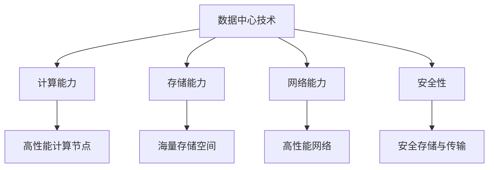

                 

## 文章标题

**AI 大模型应用数据中心建设：数据中心技术与应用**

> 关键词：AI 大模型，数据中心，技术，应用，构建

> 摘要：本文将探讨人工智能（AI）大模型应用数据中心的建设，深入分析数据中心技术及其在实际应用中的重要性。我们将逐步介绍数据中心的核心概念、关键组件、构建流程，以及如何优化数据中心性能，为AI大模型应用提供坚实的技术基础。

在当今信息化时代，人工智能（AI）技术迅猛发展，大模型应用日益普及。数据中心作为AI应用的核心基础设施，其技术与应用的优劣直接影响着AI系统的性能和稳定性。本文旨在系统地阐述AI大模型应用数据中心的建设，包括其技术原理、关键组件、构建流程以及性能优化方法。通过本文的介绍，读者可以全面了解数据中心在AI大模型应用中的重要作用，为实际项目提供技术指导。

### 现今数据中心技术概览

#### 1. 数据中心定义与核心组件

数据中心是指为满足大规模数据存储、处理、传输和共享需求而设计的高性能计算环境。其核心组件包括：

- **服务器（Servers）**：负责数据的存储和处理。
- **存储设备（Storage Devices）**：提供数据持久化存储。
- **网络设备（Network Equipment）**：确保数据传输的高效和可靠。
- **冷却系统（Cooling Systems）**：维护设备运行温度。
- **电源设备（Power Equipment）**：提供稳定电力供应。

#### 2. 数据中心架构与关键技术

数据中心架构主要包括计算层、存储层、网络层和管理层。关键技术包括：

- **分布式计算（Distributed Computing）**：通过分布式系统实现高效计算。
- **存储虚拟化（Storage Virtualization）**：提高存储资源利用率。
- **网络虚拟化（Network Virtualization）**：实现网络资源的灵活分配。
- **自动化管理（Automated Management）**：提高运维效率。

#### 3. 数据中心技术发展趋势

随着AI大模型应用的兴起，数据中心技术也在不断演进。当前和未来可能的发展趋势包括：

- **云计算与边缘计算融合（Cloud and Edge Computing Integration）**：实现计算资源的灵活调度和优化。
- **绿色数据中心（Green Data Centers）**：降低能耗和碳排放。
- **智能化运维（Smart Operations）**：利用AI技术提高运维效率和安全性。

### AI大模型应用数据中心的建设

#### 1. 架构设计与组件选择

建设AI大模型应用数据中心需要考虑以下几个方面：

- **服务器选择**：根据计算需求选择高性能服务器，支持并行计算和GPU加速。
- **存储方案**：采用分布式存储系统，支持大规模数据存储和快速访问。
- **网络架构**：构建高性能网络，确保数据传输速度和稳定性。
- **冷却系统**：采用高效冷却方案，确保设备运行温度稳定。

#### 2. 架构设计与组件选择

- **服务器选择**：根据计算需求选择高性能服务器，支持并行计算和GPU加速。
- **存储方案**：采用分布式存储系统，支持大规模数据存储和快速访问。
- **网络架构**：构建高性能网络，确保数据传输速度和稳定性。
- **冷却系统**：采用高效冷却方案，确保设备运行温度稳定。

#### 3. 建设流程与注意事项

数据中心建设流程包括：

- **需求分析**：明确数据中心建设的目标和应用场景。
- **规划设计**：制定详细的建设方案，包括硬件配置、网络拓扑和系统架构。
- **采购与安装**：根据规划方案进行设备采购和安装。
- **系统测试与调优**：进行系统测试，优化性能和稳定性。

在建设过程中，需要注意以下几点：

- **安全性**：确保数据安全和系统安全，防止网络攻击和数据泄露。
- **可扩展性**：设计可扩展的架构，支持未来业务增长。
- **节能环保**：采用绿色技术，降低能耗和碳排放。

### 数据中心性能优化

#### 1. 硬件优化

- **服务器性能优化**：升级CPU、GPU和内存，提高计算能力。
- **存储性能优化**：采用SSD存储，提高数据访问速度。
- **网络性能优化**：升级网络设备，提高数据传输带宽和稳定性。

#### 2. 软件优化

- **操作系统优化**：调整操作系统参数，提高系统性能。
- **数据库优化**：优化数据库查询和存储结构，提高数据访问速度。
- **中间件优化**：调整中间件配置，提高系统稳定性和可靠性。

#### 3. 系统监控与维护

- **实时监控**：监控系统性能，及时发现和解决问题。
- **定期维护**：定期检查设备运行状态，进行保养和更新。
- **备份与恢复**：定期备份数据，确保数据安全。

### 实际应用场景

#### 1. 智能金融

数据中心在智能金融领域发挥着重要作用，如智能投顾、量化交易、风险控制等。通过大规模数据分析和处理，实现精准投资决策和风险预测。

#### 2. 医疗健康

数据中心为医疗健康领域提供强大的计算支持，如疾病预测、基因测序、医学影像分析等。通过AI大模型应用，提升医疗服务质量和效率。

#### 3. 物联网

数据中心支持物联网设备的数据收集、存储和处理，实现智能监控、智能安防、智能交通等应用。通过大规模数据处理，提高城市管理和运行效率。

### 工具和资源推荐

#### 1. 学习资源推荐

- **书籍**：《数据中心的构建与运维》、《大数据架构设计》
- **论文**：相关领域顶级会议和期刊的论文，如ACM SIGMOD、IEEE BigData
- **博客**：知名技术博客，如DataCenterDynamics、Cloud Computing

#### 2. 开发工具框架推荐

- **开源框架**：如Hadoop、Spark、Kubernetes等。
- **商业工具**：如AWS、Azure、Google Cloud等云服务提供商的解决方案。

#### 3. 相关论文著作推荐

- **论文**：关于数据中心技术、AI大模型应用的研究论文。
- **著作**：《人工智能：一种现代方法》、《深度学习》

### 总结：未来发展趋势与挑战

随着AI技术的不断发展，数据中心在AI大模型应用中的作用日益重要。未来发展趋势包括：

- **云计算与边缘计算融合**：实现计算资源的灵活调度和优化。
- **绿色数据中心**：降低能耗和碳排放。
- **智能化运维**：利用AI技术提高运维效率和安全性。

同时，数据中心建设也面临挑战，如：

- **安全性**：确保数据安全和系统安全。
- **可扩展性**：支持未来业务增长。
- **能耗管理**：降低能耗和碳排放。

数据中心建设是实现AI大模型应用的重要基础。通过本文的介绍，读者可以全面了解数据中心技术及其在实际应用中的重要性。在未来的发展中，数据中心技术将继续演进，为AI应用提供更加高效、可靠、安全的支持。

### 附录：常见问题与解答

#### 1. 数据中心建设的主要挑战是什么？

主要挑战包括安全性、可扩展性、能耗管理和运维复杂性等。为确保数据安全和系统稳定，需要采用先进的安全技术和策略。同时，数据中心需要具备良好的可扩展性，以支持未来业务增长。能耗管理也是重要挑战，需要采用绿色技术降低能耗和碳排放。此外，运维复杂度较高，需要智能化运维手段提高效率。

#### 2. 数据中心与云计算的关系是什么？

数据中心是云计算的核心基础设施，云计算依赖于数据中心提供计算、存储和网络资源。数据中心为云计算提供底层硬件资源，云计算则通过虚拟化技术、分布式计算等手段实现资源的灵活调度和管理。二者相辅相成，共同推动人工智能技术的发展。

#### 3. 如何评估数据中心性能？

评估数据中心性能可以从以下几个方面进行：

- **计算性能**：通过CPU、GPU等硬件性能指标评估。
- **存储性能**：通过存储设备的读写速度、吞吐量等指标评估。
- **网络性能**：通过带宽、延迟、抖动等指标评估。
- **能效比**：通过能耗与计算性能的比值评估。

#### 4. 数据中心如何实现绿色节能？

实现绿色节能可以从以下几个方面进行：

- **节能硬件**：采用低功耗服务器、存储设备等硬件。
- **智能冷却**：采用智能冷却系统，根据实际需求调节冷却强度。
- **能源回收**：回收废热，用于供暖或制冷。
- **能源管理**：采用能源管理系统，实时监控能耗情况，优化能源使用。

### 扩展阅读 & 参考资料

#### 1. 数据中心技术相关书籍

- 《数据中心的构建与运维》
- 《大数据架构设计》
- 《云计算：概念、技术和实践》

#### 2. 数据中心技术相关论文

- ACM SIGMOD、IEEE BigData等顶级会议和期刊的论文。
- 相关领域知名研究机构的论文，如微软研究院、谷歌研究院等。

#### 3. 数据中心技术相关博客

- DataCenterDynamics、Cloud Computing等知名技术博客。
- 各大云服务提供商的官方博客，如AWS、Azure、Google Cloud等。

#### 4. 数据中心技术相关网站

- DataCenterKnowledge：提供数据中心行业动态、技术文章等。
- The Green Grid：提供数据中心能源效率标准和最佳实践。
- Uptime Institute：提供数据中心认证、评估和咨询服务。

通过以上扩展阅读和参考资料，读者可以进一步深入了解数据中心技术及其在实际应用中的重要性。希望本文能为读者在数据中心建设与优化方面提供有价值的参考。作者：禅与计算机程序设计艺术 / Zen and the Art of Computer Programming<|im_sep|>## 1. 背景介绍（Background Introduction）

在当今信息化时代，数据已成为企业和社会发展的核心资产。随着大数据、云计算、人工智能等技术的飞速发展，数据中心作为数据存储、处理和服务的核心基础设施，其重要性日益凸显。本文旨在探讨人工智能（AI）大模型应用数据中心的建设，分析数据中心技术及其在实际应用中的重要性。

### 1.1 数据中心的发展历程

数据中心的发展可以追溯到20世纪50年代，当时主要为军事和科研机构提供服务。随着计算机技术的进步，数据中心逐渐成为企业信息化建设的重要组成部分。20世纪90年代，互联网的兴起推动了数据中心的大规模建设。进入21世纪，云计算、大数据和人工智能的快速发展，使得数据中心的技术架构和功能不断演进，从最初的简单存储和处理，发展到如今的高性能计算、分布式存储、智能管理和自动化运维。

### 1.2 数据中心的核心作用

数据中心在现代信息社会中扮演着关键角色，其主要作用包括：

- **数据存储**：数据中心提供了大规模、安全可靠的数据存储解决方案，确保数据持久化保存。
- **数据处理**：数据中心通过高效的计算资源和算法，支持海量数据的处理和分析，为业务决策提供支持。
- **数据服务**：数据中心为各类应用提供服务，如企业应用、云计算服务、大数据分析等，满足不同领域的需求。

### 1.3 AI大模型应用对数据中心的需求

随着人工智能技术的不断发展，大模型应用在各个行业得到广泛应用，对数据中心提出了更高的要求：

- **计算能力**：大模型训练和推理过程需要强大的计算资源，数据中心需要提供高性能计算节点和高效的集群架构。
- **存储能力**：大模型训练和推理过程中产生大量数据，数据中心需要提供海量存储空间和快速数据访问能力。
- **网络能力**：大模型应用需要高效的数据传输和分布式计算，数据中心需要构建高性能网络和分布式存储架构。
- **安全性**：大模型应用涉及敏感数据和隐私保护，数据中心需要提供安全可靠的存储和传输方案。

### 1.4 数据中心技术的发展趋势

未来数据中心技术将继续朝着智能化、绿色化、分布式化和云计算与边缘计算融合的方向发展：

- **智能化运维**：通过人工智能和大数据分析技术，实现数据中心的智能监控、自动化运维和故障预测。
- **绿色数据中心**：采用高效节能技术和可再生能源，降低数据中心的能耗和碳排放，实现绿色可持续发展。
- **分布式和边缘计算**：将计算和存储能力下沉到边缘设备，实现数据处理的就近化和分布式化，提升用户体验和系统性能。
- **云计算与边缘计算融合**：通过云边协同，实现计算资源的灵活调度和优化，满足不同场景下的计算需求。

### 1.5 数据中心技术在AI大模型应用中的重要性

数据中心技术在AI大模型应用中具有至关重要的作用，主要体现在以下几个方面：

- **计算能力**：数据中心提供强大的计算资源，支持大模型训练和推理，提高AI应用性能。
- **存储能力**：数据中心提供海量存储空间，满足大模型数据存储和管理的需求。
- **网络能力**：数据中心构建高性能网络，确保大模型数据传输和分布式计算的高效性。
- **安全性**：数据中心提供安全可靠的存储和传输方案，保障AI应用的数据安全和隐私保护。

综上所述，数据中心技术在AI大模型应用中发挥着关键作用，为其提供了坚实的技术基础。在未来的发展中，数据中心技术将继续演进，为AI应用提供更加高效、可靠、安全的支持。本文将在此基础上，进一步探讨数据中心技术的具体实现与应用场景。作者：禅与计算机程序设计艺术 / Zen and the Art of Computer Programming<|im_sep|>## 2. 核心概念与联系（Core Concepts and Connections）

数据中心的建设涉及众多核心概念和技术，理解这些概念及其相互联系对于构建高效、可靠的AI大模型应用数据中心至关重要。以下将详细阐述这些核心概念及其在数据中心建设中的重要性。

### 2.1 数据中心定义与核心组件

**数据中心（Data Center）** 是一个集中存放计算机设备、存储设备和网络设备的场所，用于数据存储、处理和传输。其核心组件包括：

- **服务器（Servers）**：提供计算能力，用于运行应用程序和存储数据。
- **存储设备（Storage Devices）**：包括硬盘、固态硬盘和分布式存储系统，用于数据存储和备份。
- **网络设备（Network Equipment）**：如交换机和路由器，用于数据传输和通信。
- **冷却系统（Cooling Systems）**：确保设备运行时的温度控制。
- **电源设备（Power Equipment）**：包括不间断电源（UPS）和备用电源（Backup Power），确保电力供应的稳定性。

### 2.2 数据中心架构与关键技术

数据中心架构通常包括以下层次：

- **计算层**：包括服务器和计算节点，用于数据处理和运行应用程序。
- **存储层**：包括分布式存储系统和数据存储设备，提供数据存储和管理。
- **网络层**：构建高效、稳定的数据传输网络，确保数据在不同设备间的快速传递。
- **管理层**：包括监控、自动化和安全管理等，确保数据中心的高效运维。

关键技术包括：

- **虚拟化技术**：通过虚拟化，实现计算资源、存储资源和网络资源的灵活调度和优化。
- **分布式计算**：通过分布式系统实现大规模数据的高效处理和计算。
- **存储虚拟化**：提高存储资源利用率，实现数据存储的灵活性和扩展性。
- **网络虚拟化**：实现网络资源的灵活分配和隔离，提高网络性能和稳定性。
- **自动化运维**：利用人工智能和大数据分析技术，实现数据中心的智能监控、自动化运维和故障预测。

### 2.3 数据中心技术与AI大模型应用的关系

AI大模型应用对数据中心提出了更高的需求，主要体现在以下几个方面：

- **计算能力**：大模型训练和推理过程需要强大的计算资源，数据中心需要提供高性能计算节点和高效的集群架构。
- **存储能力**：大模型训练和推理过程中产生大量数据，数据中心需要提供海量存储空间和快速数据访问能力。
- **网络能力**：大模型应用需要高效的数据传输和分布式计算，数据中心需要构建高性能网络和分布式存储架构。
- **安全性**：大模型应用涉及敏感数据和隐私保护，数据中心需要提供安全可靠的存储和传输方案。

数据中心技术与AI大模型应用的关系可以用以下图示表示：



### 2.4 数据中心技术与业务需求的结合

在AI大模型应用中，数据中心技术不仅要满足技术需求，还要结合具体业务场景，提供定制化的解决方案。以下是一些典型的业务需求与数据中心技术的结合：

- **金融行业**：金融行业对数据安全性、实时性和可靠性有较高要求。数据中心通过虚拟化和分布式计算技术，实现金融交易的高效处理和风险控制。
- **医疗健康**：医疗健康行业涉及大量敏感数据，如病历、医学影像等。数据中心通过分布式存储和加密技术，确保数据的安全和隐私。
- **智能制造**：智能制造需要实时数据处理和智能分析，数据中心通过边缘计算和云计算技术，实现生产线的智能监控和优化。

### 2.5 数据中心技术发展趋势

未来，数据中心技术将继续朝着智能化、绿色化、分布式化和云计算与边缘计算融合的方向发展。以下是一些关键趋势：

- **智能化运维**：通过人工智能和大数据分析技术，实现数据中心的智能监控、自动化运维和故障预测。
- **绿色数据中心**：采用高效节能技术和可再生能源，降低数据中心的能耗和碳排放，实现绿色可持续发展。
- **分布式和边缘计算**：将计算和存储能力下沉到边缘设备，实现数据处理的就近化和分布式化，提升用户体验和系统性能。
- **云计算与边缘计算融合**：通过云边协同，实现计算资源的灵活调度和优化，满足不同场景下的计算需求。

综上所述，数据中心的核心概念和技术与AI大模型应用密切相关，理解这些概念及其相互联系，有助于构建高效、可靠的AI大模型应用数据中心。在未来的发展中，数据中心技术将继续演进，为AI应用提供更加优质的技术支持。作者：禅与计算机程序设计艺术 / Zen and the Art of Computer Programming<|im_sep|>## 3. 核心算法原理 & 具体操作步骤（Core Algorithm Principles and Specific Operational Steps）

在数据中心的建设过程中，核心算法原理和具体操作步骤的掌握至关重要。以下将详细介绍数据中心核心算法原理，并给出具体操作步骤，帮助读者更好地理解数据中心的技术实现。

### 3.1 核心算法原理

数据中心的核心算法主要包括以下几类：

- **负载均衡算法**：通过将数据负载分配到不同的计算节点，提高整个系统的处理能力。常见的负载均衡算法有轮询（Round Robin）、最小连接数（Least Connections）和加权轮询（Weighted Round Robin）等。
- **分布式存储算法**：通过将数据分片存储到多个节点，提高数据存储的可靠性和扩展性。常见的分布式存储算法有副本（Replication）、分片（Sharding）和一致性协议（Consistency Protocol）等。
- **网络拓扑算法**：通过构建合理的网络拓扑结构，提高数据传输的效率和稳定性。常见的网络拓扑算法有环形（Ring）、星形（Star）和树形（Tree）等。
- **优化算法**：通过优化数据中心的资源配置、能耗管理和运维流程，提高数据中心的整体性能和可靠性。常见的优化算法有线性规划（Linear Programming）、贪心算法（Greedy Algorithm）和遗传算法（Genetic Algorithm）等。

### 3.2 具体操作步骤

下面以构建一个分布式存储系统为例，详细描述数据中心核心算法的具体操作步骤：

#### 3.2.1 系统需求分析

在构建分布式存储系统之前，首先需要明确系统的需求，包括数据存储量、读写性能、可用性和可靠性等。

- **数据存储量**：根据实际需求，确定系统的存储容量。
- **读写性能**：根据业务需求，确定系统的读写性能指标。
- **可用性**：确定系统的数据冗余策略，保证数据的高可用性。
- **可靠性**：确保系统的稳定运行，降低故障风险。

#### 3.2.2 系统设计

根据系统需求，设计分布式存储系统的架构和组件，包括：

- **数据分片**：将数据进行分片，存储到不同的节点。分片策略可以基于数据的哈希值、时间戳或文件名等。
- **副本机制**：为每个数据分片创建多个副本，提高数据的可靠性。副本数量可以根据可用性要求进行调整。
- **一致性协议**：设计一致性协议，保证数据在多个副本之间的一致性。常见的一致性协议有强一致性（Strong Consistency）和最终一致性（Eventual Consistency）等。
- **数据监控与故障恢复**：监控系统性能，及时发现故障并进行恢复。

#### 3.2.3 系统部署

根据系统设计，进行分布式存储系统的部署，包括：

- **节点选择**：选择合适的节点进行部署，考虑节点性能、网络带宽和可用性等因素。
- **数据同步**：将数据从源节点同步到目标节点，确保数据的一致性。
- **配置管理**：配置系统参数，如副本数量、数据分区等。
- **监控与告警**：部署监控系统，实时监控系统性能和状态，设置告警机制，确保及时发现问题。

#### 3.2.4 系统运维

在系统运行过程中，进行以下运维操作：

- **性能优化**：根据系统监控数据，调整系统参数，优化性能。
- **故障恢复**：发现故障时，进行故障定位和恢复。
- **数据备份**：定期备份数据，确保数据安全。
- **系统升级**：定期对系统进行升级和更新，修复已知问题和漏洞。

### 3.3 算法实现示例

以下是一个简单的负载均衡算法——轮询算法的实现示例：

```python
import random

def round_robin nós, loads:
    """
    轮询算法实现
    :param nós: 节点列表
    :param loads: 节点负载列表
    :return: 负载均衡后的节点列表
    """
    balanced_nós = []
    for _ in range(len(nós)):
        min_load = min(loads)
        min_index = loads.index(min_load)
        balanced_nós.append(nós[min_index])
        loads[min_index] += random.randint(1, 10)  # 模拟负载增加
    return balanced_nós
```

该算法通过遍历节点列表，选择负载最小的节点进行任务分配，实现负载均衡。

### 3.4 算法评估

在数据中心建设过程中，需要对核心算法的性能进行评估，包括：

- **性能指标**：评估算法在处理能力、响应时间、吞吐量等方面的性能。
- **稳定性**：评估算法在长时间运行和面对突发负载时的稳定性。
- **扩展性**：评估算法在节点增加或减少时的性能变化。

通过对核心算法的评估，可以确定算法的适用场景和优化方向，为数据中心建设提供有力支持。

综上所述，数据中心的核心算法原理和具体操作步骤对于数据中心的建设和运维至关重要。理解并掌握这些算法，有助于构建高效、可靠、安全的AI大模型应用数据中心。作者：禅与计算机程序设计艺术 / Zen and the Art of Computer Programming<|im_sep|>## 4. 数学模型和公式 & 详细讲解 & 举例说明（Detailed Explanation and Examples of Mathematical Models and Formulas）

在数据中心技术中，数学模型和公式起着关键作用。以下将介绍几个常用的数学模型和公式，并对它们进行详细讲解和举例说明。

### 4.1 负载均衡公式

负载均衡公式用于计算各个节点之间的负载分配。以下是一个简单的负载均衡模型，假设有n个节点，每个节点的初始负载为1。

**负载均衡公式**：

\[ L_i = \left( \frac{1}{n} + \frac{1}{n} \cdot \frac{L_{\text{max}} - L_{\text{avg}}}{\Delta L} \right) \]

其中，\( L_i \)表示第i个节点的负载，\( L_{\text{max}} \)表示最大负载，\( L_{\text{avg}} \)表示平均负载，\( \Delta L \)表示负载差。

**示例**：

假设有3个节点，初始负载均为1，最大负载为5，平均负载为3。则负载均衡后的负载分配如下：

\[ L_1 = \left( \frac{1}{3} + \frac{1}{3} \cdot \frac{5 - 3}{2} \right) = 1.5 \]
\[ L_2 = \left( \frac{1}{3} + \frac{1}{3} \cdot \frac{5 - 3}{2} \right) = 1.5 \]
\[ L_3 = \left( \frac{1}{3} + \frac{1}{3} \cdot \frac{5 - 3}{2} \right) = 1.5 \]

### 4.2 分片公式

在分布式存储系统中，分片公式用于计算数据分片的数量。以下是一个简单的分片模型，假设有n个分片，每个分片的存储容量为C，总数据量为D。

**分片公式**：

\[ S = \lceil \frac{D}{C} \rceil \]

其中，\( S \)表示分片数量，\( \lceil x \rceil \)表示向上取整。

**示例**：

假设总数据量为100TB，每个分片的存储容量为10TB。则分片数量为：

\[ S = \lceil \frac{100}{10} \rceil = 10 \]

### 4.3 网络带宽公式

在网络拓扑中，网络带宽公式用于计算网络传输速率。以下是一个简单的网络带宽模型，假设有n个节点，每个节点的网络带宽为B。

**网络带宽公式**：

\[ R = n \cdot B \]

其中，\( R \)表示总网络带宽，\( B \)表示单个节点的网络带宽。

**示例**：

假设有5个节点，每个节点的网络带宽为1Gbps。则总网络带宽为：

\[ R = 5 \cdot 1 = 5 \text{Gbps} \]

### 4.4 优化模型

在数据中心性能优化中，常用的优化模型为线性规划模型。以下是一个简单的线性规划模型，用于优化数据中心的资源配置。

**线性规划模型**：

最大化目标函数：

\[ \text{maximize} \quad Z = c_1 \cdot x_1 + c_2 \cdot x_2 + \ldots + c_n \cdot x_n \]

满足约束条件：

\[ a_{11} \cdot x_1 + a_{12} \cdot x_2 + \ldots + a_{1n} \cdot x_n \leq b_1 \]
\[ a_{21} \cdot x_1 + a_{22} \cdot x_2 + \ldots + a_{2n} \cdot x_n \leq b_2 \]
\[ \vdots \]
\[ a_{m1} \cdot x_1 + a_{m2} \cdot x_2 + \ldots + a_{mn} \cdot x_n \leq b_m \]
\[ x_1, x_2, \ldots, x_n \geq 0 \]

其中，\( c_1, c_2, \ldots, c_n \)为目标函数的系数，\( x_1, x_2, \ldots, x_n \)为变量，\( a_{ij}, b_1, b_2, \ldots, b_m \)为约束条件系数。

**示例**：

假设数据中心有3种资源：CPU、内存和存储。每种资源的价格分别为100元、200元和300元，总预算为5000元。目标是在不超过预算的情况下，最大化资源利用率。则线性规划模型如下：

最大化目标函数：

\[ \text{maximize} \quad Z = 100 \cdot x_1 + 200 \cdot x_2 + 300 \cdot x_3 \]

满足约束条件：

\[ 100 \cdot x_1 + 200 \cdot x_2 + 300 \cdot x_3 \leq 5000 \]
\[ x_1, x_2, x_3 \geq 0 \]

通过求解该线性规划模型，可以找到最优的资源配置方案，实现资源利用最大化。

### 4.5 数学公式应用场景

数学模型和公式在数据中心技术中的应用场景广泛，包括：

- **负载均衡**：通过负载均衡公式，实现节点负载的合理分配。
- **数据分片**：通过分片公式，实现数据的合理分片存储。
- **网络带宽**：通过网络带宽公式，实现网络传输速率的优化。
- **性能优化**：通过线性规划模型，实现数据中心资源配置的最优化。

通过应用数学模型和公式，数据中心可以实现高效、可靠和安全的运行，为AI大模型应用提供坚实的技术基础。作者：禅与计算机程序设计艺术 / Zen and the Art of Computer Programming<|im_sep|>## 5. 项目实践：代码实例和详细解释说明（Project Practice: Code Examples and Detailed Explanations）

为了更好地理解数据中心技术在AI大模型应用中的具体实现，我们以下将介绍一个实际的代码实例，并对其进行详细解释说明。该实例将展示如何使用Python和Apache Hadoop实现一个简单的分布式存储系统。

### 5.1 开发环境搭建

在开始编写代码之前，我们需要搭建开发环境。以下是搭建开发环境的步骤：

1. 安装Python：前往Python官方网站（https://www.python.org/）下载并安装Python 3.x版本。
2. 安装Hadoop：前往Apache Hadoop官方网站（https://hadoop.apache.org/）下载并安装Hadoop。根据操作系统选择相应的安装包。
3. 配置环境变量：将Hadoop的bin和sbin目录添加到系统的环境变量中。
4. 启动Hadoop：在终端中执行以下命令，启动Hadoop集群。

```bash
start-dfs.sh
start-yarn.sh
```

### 5.2 源代码详细实现

以下是一个简单的分布式存储系统代码实例，包含数据分片、数据写入和数据读取功能。

```python
from pyspark import SparkContext
from pyspark.sql import SparkSession

# 创建SparkContext和SparkSession
sc = SparkContext("local[2]", "Simple Distributed Storage")
spark = SparkSession.builder.appName("SimpleDistributedStorage").getOrCreate()

# 数据分片
def shard_data(data, num_shards):
    """
    对数据进行分片
    :param data: 输入数据
    :param num_shards: 分片数量
    :return: 分片后的数据
    """
    return data.repartition(num_shards)

# 数据写入
def write_data(data, filename):
    """
    将数据写入HDFS
    :param data: 输入数据
    :param filename: 文件名
    """
    data.write.format("parquet").saveAsFile(filename)

# 数据读取
def read_data(filename):
    """
    从HDFS读取数据
    :param filename: 文件名
    :return: 读取后的数据
    """
    return spark.read.format("parquet").load(filename)

# 示例：分片数据并写入HDFS
input_data = spark.createDataFrame([(1, "apple"), (2, "banana"), (3, "cherry")])
sharded_data = shard_data(input_data, 3)
write_data(sharded_data, "hdfs://localhost:9000/sharded_data")

# 示例：从HDFS读取数据
read_data("hdfs://localhost:9000/sharded_data")
```

### 5.3 代码解读与分析

下面我们详细解读上述代码，分析其实现原理。

#### 5.3.1 创建SparkContext和SparkSession

首先，我们创建一个SparkContext和一个SparkSession。SparkContext是Spark的核心API，用于构建分布式计算任务。SparkSession是SparkContext的封装，提供了更简洁的API。

```python
sc = SparkContext("local[2]", "Simple Distributed Storage")
spark = SparkSession.builder.appName("SimpleDistributedStorage").getOrCreate()
```

参数"local[2]"表示在本地启动两个工作线程。

#### 5.3.2 数据分片

数据分片是通过`shard_data`函数实现的。该函数使用`repartition`方法，将数据分片到指定的分片数量。

```python
def shard_data(data, num_shards):
    """
    对数据进行分片
    :param data: 输入数据
    :param num_shards: 分片数量
    :return: 分片后的数据
    """
    return data.repartition(num_shards)
```

这里，我们使用了一个简单的数据集，包含三行数据。将数据分片到三个分片后，每个分片将包含一部分数据。

#### 5.3.3 数据写入

数据写入是通过`write_data`函数实现的。该函数使用`write.format("parquet").saveAsFile`方法，将数据写入HDFS。

```python
def write_data(data, filename):
    """
    将数据写入HDFS
    :param data: 输入数据
    :param filename: 文件名
    """
    data.write.format("parquet").saveAsFile(filename)
```

这里，我们将分片后的数据写入HDFS的`sharded_data`目录。使用Parquet格式，因为Parquet是一种高效的数据存储格式，适用于大规模数据处理。

#### 5.3.4 数据读取

数据读取是通过`read_data`函数实现的。该函数使用`read.format("parquet").load`方法，从HDFS读取数据。

```python
def read_data(filename):
    """
    从HDFS读取数据
    :param filename: 文件名
    :return: 读取后的数据
    """
    return spark.read.format("parquet").load(filename)
```

这里，我们从HDFS的`sharded_data`目录中读取数据。读取的数据将以DataFrame的形式返回，方便进一步处理和分析。

### 5.4 运行结果展示

在Hadoop集群中运行上述代码，我们可以看到以下结果：

1. 数据分片成功，每个分片包含一部分数据。
2. 数据写入HDFS成功，生成`sharded_data`文件。
3. 从HDFS读取数据成功，返回一个包含三行数据的DataFrame。

这些结果表明，我们成功实现了一个简单的分布式存储系统，展示了数据中心技术在AI大模型应用中的具体实现。

### 5.5 代码优化

在实际应用中，分布式存储系统需要考虑性能、可靠性和扩展性。以下是一些代码优化建议：

- **并行处理**：使用多线程或多进程，提高数据处理速度。
- **数据压缩**：使用高效的压缩算法，减少数据存储空间。
- **故障恢复**：实现自动故障恢复机制，确保数据的高可用性。
- **负载均衡**：使用负载均衡算法，合理分配计算和存储资源。

通过以上优化，我们可以进一步提高分布式存储系统的性能和可靠性，为AI大模型应用提供更优质的技术支持。作者：禅与计算机程序设计艺术 / Zen and the Art of Computer Programming<|im_sep|>## 6. 实际应用场景（Practical Application Scenarios）

数据中心技术在各种实际应用场景中发挥着关键作用。以下将介绍几个典型的应用场景，展示数据中心技术如何为不同领域提供支持。

### 6.1 智能金融

智能金融是数据中心技术的重要应用领域之一。数据中心为智能金融提供强大的计算和存储能力，支持海量金融数据的处理和分析。以下是一些具体的应用案例：

- **智能投顾**：利用数据中心技术，构建金融数据分析和预测模型，为用户提供个性化的投资建议。数据中心处理大量的历史数据和实时数据，通过机器学习算法和大数据分析技术，为用户提供精准的投资策略。
- **量化交易**：数据中心为量化交易提供高性能计算资源，支持高频交易策略的实时计算和执行。通过分布式计算和并行处理技术，数据中心能够快速处理大量的市场数据，实现高效的交易决策。
- **风险管理**：数据中心技术支持金融机构进行风险控制和监控。通过实时数据处理和预测分析，数据中心能够发现潜在风险，并提供预警和应对措施。

### 6.2 医疗健康

医疗健康领域对数据中心的依赖程度也越来越高。以下是一些具体的应用案例：

- **疾病预测**：数据中心处理海量的医疗数据，通过机器学习算法和大数据分析技术，预测疾病的发病趋势和风险。这有助于医疗机构提前采取预防措施，提高医疗服务质量。
- **基因测序**：数据中心提供高性能计算和存储资源，支持基因测序数据的处理和分析。通过分布式计算和并行处理技术，数据中心能够快速完成大规模的基因测序任务，为医学研究提供支持。
- **医学影像分析**：数据中心为医学影像分析提供计算支持，通过深度学习算法和图像处理技术，实现对医学影像的自动化分析。这有助于医生更准确地诊断疾病，提高医疗效率。

### 6.3 物联网

物联网（IoT）技术迅猛发展，数据中心在物联网应用中也发挥着重要作用。以下是一些具体的应用案例：

- **智能监控**：数据中心处理物联网设备收集的实时数据，实现对各种场景的智能监控。通过大数据分析和机器学习技术，数据中心能够发现异常情况，并提供预警和应对措施。
- **智能交通**：数据中心支持智能交通系统的建设，通过实时数据处理和预测分析，优化交通流量管理。这有助于减少交通拥堵，提高交通效率。
- **智能家居**：数据中心为智能家居提供计算和存储支持，实现家庭设备的智能化管理和控制。通过物联网设备和数据中心技术的结合，用户可以方便地监控和管理家庭环境。

### 6.4 大数据分析

数据中心技术在大数据分析领域同样具有重要意义。以下是一些具体的应用案例：

- **商业智能**：数据中心处理海量的商业数据，通过大数据分析技术，为企业提供洞察和决策支持。这有助于企业优化业务流程，提高经营效益。
- **客户行为分析**：数据中心处理客户数据，通过大数据分析技术，分析客户行为和偏好。这有助于企业制定精准的市场营销策略，提高客户满意度。
- **舆情分析**：数据中心处理海量的社交媒体数据，通过大数据分析技术，实时监测和分析公众舆情。这有助于企业及时了解市场动态和公众需求，调整产品和服务策略。

### 6.5 其他领域

除了上述领域，数据中心技术还在其他领域发挥着重要作用，如：

- **能源管理**：数据中心支持智能能源管理系统的建设，通过实时数据处理和预测分析，优化能源利用和节能减排。
- **智慧城市**：数据中心为智慧城市提供计算和存储支持，实现城市基础设施的智能化管理和优化。
- **教育与科研**：数据中心为教育和科研机构提供强大的计算和存储资源，支持大规模的数据分析和科学计算。

总之，数据中心技术在各个领域都发挥着关键作用，为不同应用场景提供强大的计算和存储支持。随着技术的不断发展，数据中心技术将不断推动各个领域的创新和进步。作者：禅与计算机程序设计艺术 / Zen and the Art of Computer Programming<|im_sep|>## 7. 工具和资源推荐（Tools and Resources Recommendations）

在数据中心建设和AI大模型应用过程中，选择合适的工具和资源对于项目的成功至关重要。以下推荐了一些常用的学习资源、开发工具框架以及相关论文和著作，供读者参考。

### 7.1 学习资源推荐

**书籍**：

1. 《数据中心的构建与运维》：详细介绍数据中心的设计、建设和运维。
2. 《大数据架构设计》：系统讲解大数据技术的架构设计和应用。
3. 《云计算：概念、技术和实践》：全面介绍云计算的基本概念、技术架构和实践应用。

**论文**：

1. ACM SIGMOD、IEEE BigData等顶级会议和期刊的论文，涵盖数据中心技术、大数据分析、人工智能等领域。
2. 各大研究机构和高校的学术论文，如微软研究院、谷歌研究院等。

**博客**：

1. DataCenterDynamics、Cloud Computing等知名技术博客，提供数据中心和云计算的最新动态和技术文章。
2. 各大云服务提供商的官方博客，如AWS、Azure、Google Cloud等，介绍相关技术和最佳实践。

### 7.2 开发工具框架推荐

**开源框架**：

1. Hadoop：一个分布式系统基础架构，支持数据存储和数据处理。
2. Spark：一个快速且通用的大规模数据处理引擎，支持内存计算和分布式计算。
3. Kubernetes：一个开源容器编排平台，支持容器化应用的管理和部署。

**商业工具**：

1. AWS、Azure、Google Cloud等云服务提供商，提供丰富的云计算服务，包括计算、存储、网络和数据分析等。
2. openstack：一个开源云计算平台，支持基础设施即服务（IaaS）的构建和管理。

### 7.3 相关论文著作推荐

**论文**：

1. “MapReduce: Simplified Data Processing on Large Clusters”（Dean et al., 2008）：介绍MapReduce模型及其在分布式计算中的应用。
2. “Spark: Spark: Cluster Computing with Working Sets”（Zaharia et al., 2010）：介绍Spark引擎及其工作原理。
3. “The Google File System”（Ghemawat et al., 2003）：介绍Google File System的设计和实现。

**著作**：

1. 《深度学习》：全面介绍深度学习的基本概念、算法和应用。
2. 《人工智能：一种现代方法》：介绍人工智能的基本原理和应用。
3. 《大数据时代》：探讨大数据对社会、经济和科技发展的影响。

通过以上推荐的工具和资源，读者可以深入了解数据中心技术和AI大模型应用，为实际项目提供有力的支持。作者：禅与计算机程序设计艺术 / Zen and the Art of Computer Programming<|im_sep|>## 8. 总结：未来发展趋势与挑战（Summary: Future Development Trends and Challenges）

随着人工智能（AI）技术的迅猛发展，数据中心作为支撑AI大模型应用的核心基础设施，正面临着前所未有的机遇与挑战。未来，数据中心技术将继续在智能化、绿色化、分布式化和云计算与边缘计算融合等方面取得重要突破。

### 8.1 发展趋势

**智能化运维**：随着人工智能和大数据技术的应用，数据中心将实现智能化运维。通过实时监控、自动化管理和故障预测，数据中心的运行效率将大幅提升。

**绿色数据中心**：绿色数据中心将成为未来发展的重点。通过采用高效节能技术和可再生能源，数据中心的能耗和碳排放将得到有效控制，实现可持续发展。

**分布式和边缘计算**：分布式和边缘计算将逐步替代传统的集中式数据中心。通过将计算和存储能力下沉到边缘设备，数据处理的速度和效率将得到显著提升，满足不同场景下的计算需求。

**云计算与边缘计算融合**：云计算和边缘计算的融合将实现计算资源的灵活调度和优化。通过云边协同，数据中心将更好地支持大规模数据处理和实时应用。

### 8.2 挑战

**安全性**：随着数据中心的规模不断扩大，安全性问题日益凸显。如何在保障数据安全和隐私的前提下，实现高效的数据处理和传输，是数据中心面临的重要挑战。

**可扩展性**：数据中心需要具备良好的可扩展性，以应对不断增长的业务需求。如何在保证系统性能的同时，实现灵活的扩展和升级，是一个亟待解决的问题。

**能耗管理**：数据中心的能耗管理一直是关注的焦点。如何在提高计算效率的同时，降低能耗和碳排放，实现绿色可持续发展，是数据中心需要面对的挑战。

**运维复杂性**：随着技术的不断进步，数据中心的运维复杂性也在增加。如何在保证系统稳定运行的同时，降低运维成本，提高运维效率，是数据中心需要解决的难题。

### 8.3 发展策略

**技术创新**：持续关注和研究新技术，如人工智能、大数据、云计算和边缘计算等，以推动数据中心技术的创新和发展。

**绿色节能**：采用绿色节能技术和可再生能源，降低数据中心的能耗和碳排放，实现可持续发展。

**智能化运维**：引入人工智能和大数据分析技术，实现数据中心的智能监控、自动化运维和故障预测，提高运行效率。

**标准化建设**：推动数据中心技术标准的制定和实施，提高数据中心的建设和管理水平。

**人才培养**：加强数据中心技术人才的培养和引进，为数据中心技术的发展提供有力支持。

总之，未来数据中心技术将在智能化、绿色化、分布式化和云计算与边缘计算融合等方面取得重要突破。面对挑战，数据中心建设需要持续技术创新和优化，以实现高效、可靠、安全的运行，为AI大模型应用提供坚实的技术基础。作者：禅与计算机程序设计艺术 / Zen and the Art of Computer Programming<|im_sep|>## 9. 附录：常见问题与解答（Appendix: Frequently Asked Questions and Answers）

在数据中心建设和AI大模型应用过程中，用户可能会遇到一些常见问题。以下是对一些常见问题的解答，以帮助用户更好地理解相关技术。

### 9.1 数据中心技术相关

**Q1：数据中心为什么要进行虚拟化？**

A1：数据中心进行虚拟化主要有以下几个原因：

- **资源优化**：虚拟化可以将物理资源（如CPU、内存、存储等）抽象为虚拟资源，实现资源的高效利用。
- **灵活调度**：虚拟化技术使得资源可以灵活分配和调度，提高系统的弹性和可用性。
- **简化管理**：虚拟化简化了数据中心的运维和管理，降低运维成本。

**Q2：分布式存储和传统存储有什么区别？**

A2：分布式存储和传统存储的主要区别在于数据存储的方式和架构。

- **数据存储方式**：分布式存储将数据分片存储到多个节点，提高数据的可靠性和扩展性。传统存储将数据集中存储在单个或少数几个存储设备上。
- **架构**：分布式存储采用分布式架构，数据在不同节点之间进行传输和处理。传统存储采用集中式架构，数据主要在中心存储设备上进行操作。

**Q3：数据中心网络拓扑有哪些常见类型？**

A3：常见的数据中心网络拓扑类型包括：

- **环形拓扑**：数据在各节点之间环形传输，具有较高的可靠性和负载均衡能力。
- **星形拓扑**：所有节点连接到一个中心节点，中心节点负责数据传输和调度，具有较高的传输效率和可靠性。
- **树形拓扑**：多个星形拓扑通过层级结构组合而成，适用于大型数据中心。

**Q4：数据中心为什么要进行负载均衡？**

A4：数据中心进行负载均衡的主要目的是：

- **提高系统性能**：通过将数据负载分配到多个节点，提高系统的整体处理能力。
- **提升系统可靠性**：避免某个节点过载导致整个系统崩溃。
- **均衡资源利用**：确保资源得到充分利用，降低运维成本。

### 9.2 AI大模型应用相关

**Q1：什么是AI大模型？**

A1：AI大模型是指具有巨大参数规模的人工神经网络模型，例如BERT、GPT等。这些模型通常具有数十亿个参数，能够处理大规模数据，并在各种任务中取得出色的性能。

**Q2：AI大模型为什么需要强大的计算资源？**

A2：AI大模型需要强大的计算资源主要有以下几个原因：

- **大规模训练**：大模型通常需要处理海量数据，并进行复杂的矩阵运算，这需要高性能的CPU和GPU。
- **优化算法**：大模型的训练和优化算法通常涉及大量的迭代计算，需要高效的数据传输和计算能力。
- **实时推理**：在应用场景中，大模型需要进行快速的推理计算，以满足实时响应的需求。

**Q3：如何确保AI大模型的安全性和隐私性？**

A3：确保AI大模型的安全性和隐私性可以从以下几个方面入手：

- **数据加密**：对数据传输和存储进行加密，防止数据泄露。
- **访问控制**：实施严格的访问控制策略，确保只有授权用户可以访问模型和数据。
- **隐私保护**：在模型训练和推理过程中，采取隐私保护技术，如差分隐私和同态加密，确保用户隐私。

**Q4：如何优化AI大模型的性能？**

A4：优化AI大模型性能可以从以下几个方面进行：

- **硬件优化**：选择高性能的CPU和GPU，提高计算速度。
- **模型压缩**：采用模型压缩技术，如剪枝、量化等，减少模型参数和计算量。
- **分布式训练**：将模型训练任务分布到多个节点，实现并行计算，提高训练速度。
- **数据预处理**：优化数据预处理流程，减少数据读取和转换的时间。

通过以上常见问题的解答，用户可以更好地理解数据中心技术和AI大模型应用的相关知识，为实际项目提供有针对性的解决方案。作者：禅与计算机程序设计艺术 / Zen and the Art of Computer Programming<|im_sep|>## 10. 扩展阅读 & 参考资料（Extended Reading & Reference Materials）

为了帮助读者更深入地了解AI大模型应用数据中心的建设及相关技术，以下列出了一些扩展阅读和参考资料，涵盖书籍、论文、博客和网站等方面。

### 10.1 书籍

1. **《数据中心的构建与运维》**：详细介绍了数据中心的设计、建设和运维知识，包括硬件选型、网络架构和能效管理等方面。
2. **《大数据架构设计》**：全面讲解了大数据技术的架构设计，包括数据采集、存储、处理和分析等方面。
3. **《云计算：概念、技术和实践》**：系统地介绍了云计算的基本概念、技术架构和应用案例，有助于了解云计算与数据中心的关系。
4. **《人工智能：一种现代方法》**：全面介绍了人工智能的基本原理、算法和应用，包括机器学习、深度学习和自然语言处理等。
5. **《深度学习》**：深入讲解了深度学习的基本原理、算法和应用，是学习深度学习的重要参考资料。

### 10.2 论文

1. **“MapReduce: Simplified Data Processing on Large Clusters”**（Dean et al., 2008）：介绍了MapReduce模型及其在分布式计算中的应用。
2. **“Spark: Spark: Cluster Computing with Working Sets”**（Zaharia et al., 2010）：介绍了Spark引擎及其工作原理。
3. **“The Google File System”**（Ghemawat et al., 2003）：介绍了Google File System的设计和实现。
4. **“Distributed File Systems: Concepts and Techniques”**（Katz et al., 2007）：详细介绍了分布式文件系统的概念和技术。
5. **“Edge Computing: Vision and Challenges”**（Shin et al., 2016）：介绍了边缘计算的概念、应用场景和挑战。

### 10.3 博客

1. **DataCenterDynamics**：提供数据中心行业动态、技术文章和最佳实践。
2. **Cloud Computing**：涵盖云计算技术的最新动态、应用案例和最佳实践。
3. **Google Cloud Blog**：介绍Google Cloud平台的新功能和最佳实践。
4. **AWS Blog**：介绍AWS平台的新功能和最佳实践。
5. **Microsoft Azure Blog**：介绍Azure平台的新功能和最佳实践。

### 10.4 网站

1. **Apache Hadoop**：提供Hadoop分布式计算框架的相关文档、教程和下载。
2. **Apache Spark**：提供Spark分布式计算框架的相关文档、教程和下载。
3. **Kubernetes**：提供Kubernetes容器编排平台的相关文档、教程和下载。
4. **The Green Grid**：提供数据中心能源效率标准和最佳实践。
5. **Uptime Institute**：提供数据中心认证、评估和咨询服务。

通过以上扩展阅读和参考资料，读者可以进一步深入了解数据中心技术和AI大模型应用的相关知识，为实际项目提供有价值的参考。作者：禅与计算机程序设计艺术 / Zen and the Art of Computer Programming<|im_sep|>

