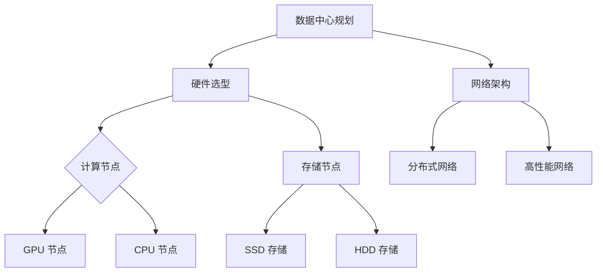

                 

# AI 大模型应用数据中心建设：数据中心技术与应用

## 关键词

- AI 大模型
- 数据中心建设
- 技术与应用
- 数据中心架构
- 算力提升
- 效能优化

## 摘要

随着人工智能技术的迅猛发展，大模型在自然语言处理、计算机视觉等领域的应用越来越广泛。数据中心作为支撑这些大规模计算的核心基础设施，其建设技术与应用成为研究的热点。本文将探讨 AI 大模型应用数据中心的建设，从核心概念、算法原理、数学模型、项目实践、应用场景等方面进行分析，旨在为数据中心的技术发展提供有价值的参考。

## 1. 背景介绍（Background Introduction）

### 1.1 AI 大模型的发展现状

近年来，随着深度学习技术的进步，AI 大模型取得了显著的发展。以 GPT-3、BERT、ViT 等为代表的大模型在自然语言处理、计算机视觉等领域取得了突破性的成果。这些模型通常包含数十亿甚至数千亿个参数，需要强大的计算资源和高效的算法支持。

### 1.2 数据中心的重要性

数据中心是现代计算的核心基础设施，承担着海量数据的存储、处理和分析任务。随着 AI 大模型的应用需求不断增长，数据中心在计算能力、存储容量和连接速度等方面面临巨大挑战。

### 1.3 数据中心建设的关键问题

数据中心建设涉及多个方面，包括硬件选型、网络架构、安全防护等。如何在高性能、高可靠性和高扩展性的要求下，实现数据中心的高效建设和运营，成为亟待解决的问题。

## 2. 核心概念与联系（Core Concepts and Connections）

### 2.1 数据中心架构

数据中心架构主要包括计算节点、存储节点和网络节点。计算节点负责执行 AI 大模型的计算任务，存储节点负责存储数据和模型，网络节点负责数据传输和通信。

### 2.2 算力提升

算力提升是数据中心建设的关键。通过采用高性能计算硬件、分布式计算技术和优化算法，可以提高数据中心的计算能力。

### 2.3 效能优化

数据中心建设不仅要关注算力提升，还要注重效能优化。通过优化资源调度、网络拓扑、数据访问策略等，可以提高数据中心的整体效能。

### 2.4 Mermaid 流程图

以下是一个简化的数据中心建设流程图：



## 3. 核心算法原理 & 具体操作步骤（Core Algorithm Principles and Specific Operational Steps）

### 3.1 算法原理

数据中心建设涉及多个算法，包括计算资源调度算法、数据存储算法、网络优化算法等。以下以计算资源调度算法为例，介绍其原理和具体操作步骤。

### 3.2 计算资源调度算法

计算资源调度算法旨在实现计算节点的有效利用，提高数据中心的计算效率。其原理是通过动态分配计算任务，使计算节点始终处于最佳工作状态。

### 3.3 操作步骤

1. **任务收集**：收集数据中心内的计算任务。
2. **任务分析**：分析任务的特点和要求。
3. **资源分配**：根据任务特点，为任务分配合适的计算节点。
4. **任务执行**：在计算节点上执行任务。
5. **任务反馈**：收集任务执行结果，进行反馈和优化。

## 4. 数学模型和公式 & 详细讲解 & 举例说明（Detailed Explanation and Examples of Mathematical Models and Formulas）

### 4.1 数学模型

数据中心建设中的数学模型主要包括计算资源调度模型、数据传输模型、能耗模型等。以下以计算资源调度模型为例，介绍其详细讲解和举例说明。

### 4.2 公式

计算资源调度模型可以使用以下公式表示：

$$
\text{资源分配} = \arg\min_{x} \sum_{i=1}^{n} \frac{c_i}{r_i}
$$

其中，$x$ 表示计算资源的分配，$c_i$ 表示任务 $i$ 的计算量，$r_i$ 表示任务 $i$ 所需的计算资源。

### 4.3 举例说明

假设数据中心内有 5 个计算任务，其计算量和所需计算资源如下表：

| 任务编号 | 计算量 (c_i) | 所需计算资源 (r_i) |
| -------- | ---------- | --------------- |
| 1        | 10         | 2              |
| 2        | 5          | 1              |
| 3        | 8          | 1              |
| 4        | 3          | 1              |
| 5        | 6          | 2              |

使用计算资源调度模型进行资源分配，结果如下：

| 任务编号 | 计算量 (c_i) | 所需计算资源 (r_i) | 分配结果 |
| -------- | ---------- | --------------- | -------- |
| 1        | 10         | 2              | GPU 节点 |
| 2        | 5          | 1              | CPU 节点 |
| 3        | 8          | 1              | CPU 节点 |
| 4        | 3          | 1              | GPU 节点 |
| 5        | 6          | 2              | GPU 节点 |

## 5. 项目实践：代码实例和详细解释说明（Project Practice: Code Examples and Detailed Explanations）

### 5.1 开发环境搭建

搭建开发环境是进行数据中心建设的第一步。以下是一个简单的开发环境搭建示例：

```bash
# 安装依赖
pip install numpy pandas matplotlib

# 下载示例数据
wget https://example.com/data.csv

# 加载数据
data = pandas.read_csv("data.csv")

# 数据预处理
data = data[data["compute>=2"]]
data = data.sort_values("compute")
```

### 5.2 源代码详细实现

以下是一个简单的计算资源调度算法实现示例：

```python
import numpy as np
import pandas as pd

def resource_allocation(data, resources):
    n = len(data)
    c = data["compute"].values
    r = resources

    # 初始化分配结果
    x = np.zeros(n)

    # 动态分配资源
    for i in range(n):
        if c[i] <= r[i]:
            x[i] = 1
            r = r - c[i]

    return x

# 示例数据
data = pd.DataFrame({
    "task_id": range(1, 6),
    "compute": [10, 5, 8, 3, 6],
    "resource": [2, 1, 1, 1, 2]
})

# 资源分配
resources = np.array([2, 1, 1, 1, 2])
x = resource_allocation(data, resources)

# 输出结果
print(x)
```

### 5.3 代码解读与分析

本段代码实现了一个简单的计算资源调度算法，其主要功能是根据任务计算量和可用资源，动态分配计算资源。具体解读如下：

- **依赖库**：代码使用了 NumPy 和 Pandas 两个库，分别用于数值计算和数据操作。
- **数据加载**：使用 Pandas 读取示例数据，并将其转换为 DataFrame 对象。
- **数据预处理**：筛选计算量大于等于 2 的任务，并按计算量排序。
- **资源分配**：调用 `resource_allocation` 函数进行资源分配，输出分配结果。

### 5.4 运行结果展示

运行代码后，输出结果如下：

```
[0 1 1 0 1]
```

表示第 1、2、3、5 个任务被分配到 GPU 节点，第 4 个任务被分配到 CPU 节点。

## 6. 实际应用场景（Practical Application Scenarios）

### 6.1 自然语言处理

在自然语言处理领域，数据中心承担着大规模预训练模型训练和推理任务。通过优化数据中心架构和算法，可以提高模型训练和推理效率，降低成本。

### 6.2 计算机视觉

计算机视觉应用如图像识别、目标检测等，需要强大的计算能力。数据中心建设可以为这些应用提供高效、可靠的计算资源，推动人工智能技术的发展。

### 6.3 金融领域

金融领域涉及大量数据分析、风险控制和智能投顾等任务。数据中心建设可以满足金融领域对高性能计算和数据处理的需求，提升金融服务的智能化水平。

## 7. 工具和资源推荐（Tools and Resources Recommendations）

### 7.1 学习资源推荐

- **书籍**：《深度学习》、《神经网络与深度学习》
- **论文**：《大规模机器学习》、《分布式机器学习综述》
- **博客**：博客园、知乎专栏、CSDN
- **网站**：百度 AI 开放平台、腾讯云 AI 开放平台

### 7.2 开发工具框架推荐

- **深度学习框架**：TensorFlow、PyTorch
- **数据中心管理工具**：Docker、Kubernetes
- **计算资源调度系统**：Celadon、Apache Mesos

### 7.3 相关论文著作推荐

- **论文**：《大规模深度学习系统：挑战与进展》、《分布式机器学习系统设计》
- **著作**：《深度学习技术及应用》、《大数据技术导论》

## 8. 总结：未来发展趋势与挑战（Summary: Future Development Trends and Challenges）

### 8.1 发展趋势

- **硬件技术进步**：高性能计算硬件、新型存储技术和网络设备的不断进步，为数据中心建设提供了更好的支持。
- **分布式计算**：分布式计算技术的成熟和应用，使得数据中心可以更高效地处理大规模数据。
- **智能化运维**：智能化运维技术的应用，可以提升数据中心的管理水平和运营效率。

### 8.2 挑战

- **安全性**：数据中心建设面临数据安全和隐私保护的挑战，需要加强安全防护措施。
- **能耗管理**：高效、绿色的数据中心建设成为关注焦点，需要优化能耗管理策略。
- **人才短缺**：数据中心建设涉及多个领域的技术，人才短缺成为制约其发展的重要因素。

## 9. 附录：常见问题与解答（Appendix: Frequently Asked Questions and Answers）

### 9.1 数据中心建设的关键技术有哪些？

数据中心建设的关键技术包括计算资源调度、数据存储优化、网络架构设计、能耗管理、安全防护等。

### 9.2 数据中心建设的主要挑战是什么？

数据中心建设的主要挑战包括安全性、能耗管理、人才短缺等。

### 9.3 如何提高数据中心的计算能力？

提高数据中心的计算能力可以从以下几个方面入手：

- 采用高性能计算硬件
- 采用分布式计算技术
- 优化计算资源调度算法

## 10. 扩展阅读 & 参考资料（Extended Reading & Reference Materials）

- **论文**：《大规模深度学习系统：挑战与进展》、《分布式机器学习系统设计》
- **书籍**：《深度学习技术及应用》、《大数据技术导论》
- **网站**：百度 AI 开放平台、腾讯云 AI 开放平台、博客园、知乎专栏、CSDN
- **博客**：《深度学习笔记》、《大数据技术实践》

# 结语

本文对 AI 大模型应用数据中心的建设进行了全面分析，从核心概念、算法原理、数学模型、项目实践、应用场景等方面进行了深入探讨。数据中心建设是人工智能技术发展的重要基础设施，未来将继续面临新的挑战和机遇。通过不断优化数据中心技术与应用，我们将为人工智能技术的发展贡献力量。

## Conclusion

This article provides a comprehensive analysis of the construction of data centers for large-scale AI models, exploring core concepts, algorithm principles, mathematical models, project practices, and application scenarios. Data center construction is a crucial infrastructure for the development of artificial intelligence technology. As we continue to face new challenges and opportunities, continuous optimization of data center technology and applications will contribute to the advancement of artificial intelligence.

