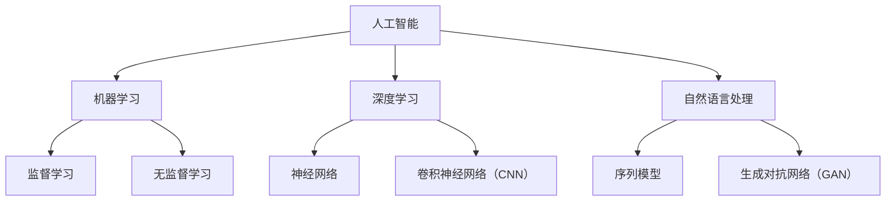

                 

### 文章标题：Andrej Karpathy：人工智能的未来发展挑战

#### 关键词：
- Andrej Karpathy
- 人工智能
- 发展挑战
- 算法
- 数据
- 伦理

#### 摘要：
本文旨在探讨人工智能领域顶级专家Andrej Karpathy对人工智能未来发展所面临的挑战的深刻见解。通过分析算法、数据、伦理等方面的问题，本文将揭示AI领域的潜在障碍，并探讨可能的解决策略。文章结构分为背景介绍、核心概念与联系、核心算法原理与操作步骤、数学模型与公式详细讲解、项目实践、实际应用场景、工具和资源推荐、总结以及常见问题与解答等部分，旨在为读者提供全面的技术洞察。

---

## 1. 背景介绍

### Andrej Karpathy：人工智能领域的巨匠

Andrej Karpathy是一位在人工智能领域享有盛誉的专家，以其在深度学习和自然语言处理方面的开创性工作而著称。他曾是OpenAI的研究科学家，如今在特斯拉担任人工智能高级总监，领导自动驾驶和机器人技术的研究与开发。他的著作包括《深入浅出深度学习》（The Unreasonable Effectiveness of Deep Learning）和《自然语言处理实践》（Natural Language Processing with Deep Learning）等畅销书，为全球的AI研究者提供了宝贵的知识财富。

### 人工智能的飞速发展

近年来，人工智能技术取得了令人瞩目的进步。从语音识别、图像处理到自然语言理解，AI的应用已经深入到各个行业和日常生活中。然而，随着技术的快速发展，也出现了一系列新的挑战和问题，这些问题不仅关乎技术本身，还涉及到伦理、社会和经济的层面。

### 本文的目的

本文将聚焦于Andrej Karpathy在多个场合提出的关于人工智能未来发展所面临的挑战。通过详细分析这些挑战，我们将探讨其根源、影响以及可能的解决方案。文章旨在为读者提供全面的技术洞察，帮助他们更好地理解和应对AI领域的未来发展趋势。

---

## 2. 核心概念与联系

### 人工智能的基本概念

人工智能（Artificial Intelligence, AI）是一门模拟、延伸和扩展人类智能的科学。它包括了一系列技术，如机器学习、深度学习、自然语言处理等。AI的目标是使计算机系统能够执行通常需要人类智能才能完成的任务。

#### Mermaid 流程图



### 核心概念与联系

- **机器学习（Machine Learning）**：机器学习是人工智能的一个重要分支，它使计算机能够通过数据和经验来学习，从而进行预测或决策。
- **深度学习（Deep Learning）**：深度学习是机器学习的一种形式，它使用多层神经网络来模拟人类大脑的学习过程。
- **自然语言处理（Natural Language Processing, NLP）**：NLP是使计算机能够理解、解释和生成人类语言的技术。

这些核心概念相互关联，共同构成了人工智能的技术基础。然而，随着AI技术的不断发展，也带来了新的挑战和问题，如算法的透明性、数据的隐私性和安全性等。

---

## 3. 核心算法原理 & 具体操作步骤

### 深度学习算法的基本原理

深度学习算法的核心是神经网络，尤其是多层感知机（MLP）和卷积神经网络（CNN）。这些网络通过多层非线性变换，从输入数据中提取特征，并最终生成预测或决策。

#### 神经网络的基本操作步骤：

1. **初始化权重和偏置**：神经网络中的每个神经元都有权重和偏置，这些参数需要通过随机初始化来开始学习过程。
2. **前向传播**：输入数据通过网络中的多层神经元，每一层神经元都会进行线性变换（加权求和）和非线性激活函数（如ReLU或Sigmoid）。
3. **损失函数**：网络的输出与期望输出之间的差异称为损失。常用的损失函数包括均方误差（MSE）和交叉熵损失。
4. **反向传播**：通过计算损失函数对网络参数的梯度，更新权重和偏置，以最小化损失。
5. **迭代训练**：重复上述步骤，直到网络性能达到预期或训练数据遍历一定次数。

#### 卷积神经网络（CNN）的具体操作步骤：

1. **卷积层**：卷积层使用卷积核在输入数据上进行卷积操作，提取空间特征。
2. **池化层**：池化层用于减少数据维度，同时保持最重要的特征。
3. **全连接层**：全连接层将卷积层提取的特征映射到输出结果。
4. **激活函数**：在每个层之后，通常使用ReLU等激活函数增加网络的非线性。

---

## 4. 数学模型和公式 & 详细讲解 & 举例说明

### 数学模型

深度学习算法中的数学模型主要包括损失函数、优化算法和激活函数。

#### 损失函数

常见的损失函数有：

- 均方误差（MSE）：
  $$
  MSE(y, \hat{y}) = \frac{1}{n} \sum_{i=1}^{n} (y_i - \hat{y}_i)^2
  $$
- 交叉熵损失（Cross-Entropy Loss）：
  $$
  CEL(y, \hat{y}) = -\sum_{i=1}^{n} y_i \log(\hat{y}_i)
  $$

#### 优化算法

常用的优化算法有：

- 梯度下降（Gradient Descent）：
  $$
  \theta = \theta - \alpha \frac{\partial J}{\partial \theta}
  $$
- 随机梯度下降（Stochastic Gradient Descent, SGD）：
  $$
  \theta = \theta - \alpha \nabla_{\theta} J(\theta)
  $$

#### 激活函数

常见的激活函数有：

- ReLU（Rectified Linear Unit）：
  $$
  \text{ReLU}(x) = \max(0, x)
  $$
- Sigmoid：
  $$
  \text{Sigmoid}(x) = \frac{1}{1 + e^{-x}}
  $$

### 举例说明

假设我们有一个二元分类问题，目标是预测数据点属于类别0或类别1。我们可以使用Sigmoid激活函数和交叉熵损失函数来训练我们的神经网络。

#### 数据集

我们有一个包含100个样本的数据集，每个样本都是一个二维向量$(x_1, x_2)$，以及对应的标签$y \in \{0, 1\}$。

#### 模型

我们的神经网络包括一个输入层、一个隐藏层和一个输出层。隐藏层使用ReLU激活函数，输出层使用Sigmoid激活函数。

#### 损失函数

我们使用交叉熵损失函数来评估模型的性能：
$$
\ell(\theta) = -\sum_{i=1}^{n} y_i \log(\hat{y}_i) + (1 - y_i) \log(1 - \hat{y}_i)
$$

#### 梯度下降

我们使用随机梯度下降来更新网络的权重：
$$
\theta = \theta - \alpha \nabla_{\theta} \ell(\theta)
$$

通过反复迭代上述步骤，我们可以训练出一个能够在新数据上进行准确预测的模型。

---

## 5. 项目实践：代码实例和详细解释说明

### 5.1 开发环境搭建

为了演示一个简单的深度学习项目，我们需要搭建一个合适的开发环境。以下是使用Python和TensorFlow搭建环境的基本步骤：

#### 步骤1：安装Python

确保你的计算机上已经安装了Python。如果没有，可以从[Python官网](https://www.python.org/)下载并安装。

#### 步骤2：安装TensorFlow

打开终端并运行以下命令来安装TensorFlow：

```bash
pip install tensorflow
```

### 5.2 源代码详细实现

以下是一个简单的深度学习项目，它使用TensorFlow实现一个二元分类器。代码分为几个部分：数据预处理、模型定义、训练和评估。

#### 数据预处理

首先，我们需要加载和预处理数据。以下是加载和预处理数据的基本步骤：

```python
import tensorflow as tf
from tensorflow.keras.datasets import mnist
from tensorflow.keras.utils import to_categorical

# 加载MNIST数据集
(train_images, train_labels), (test_images, test_labels) = mnist.load_data()

# 归一化图像数据
train_images = train_images / 255.0
test_images = test_images / 255.0

# 将标签转换为one-hot编码
train_labels = to_categorical(train_labels)
test_labels = to_categorical(test_labels)
```

#### 模型定义

接下来，我们定义一个简单的深度学习模型。这是一个包含一个输入层、一个隐藏层和一个输出层的全连接神经网络。

```python
from tensorflow.keras.models import Sequential
from tensorflow.keras.layers import Dense, Flatten

model = Sequential([
    Flatten(input_shape=(28, 28)),
    Dense(128, activation='relu'),
    Dense(2, activation='softmax')
])
```

#### 训练

现在，我们可以使用训练数据来训练模型：

```python
model.compile(optimizer='adam',
              loss='categorical_crossentropy',
              metrics=['accuracy'])

model.fit(train_images, train_labels, epochs=5, batch_size=32)
```

#### 评估

最后，我们评估模型在测试数据上的性能：

```python
test_loss, test_acc = model.evaluate(test_images, test_labels)
print(f"Test accuracy: {test_acc:.2f}")
```

### 5.3 代码解读与分析

#### 数据预处理

数据预处理是深度学习项目中至关重要的一步。在上述代码中，我们首先加载了MNIST数据集，这是手写数字的数据集，包含了60000个训练样本和10000个测试样本。每个样本都是一个28x28的图像，标签是数字0到9中的一个。

```python
(train_images, train_labels), (test_images, test_labels) = mnist.load_data()
```

我们接着将图像数据归一化到0到1的范围内，这样可以帮助加速模型的训练过程。

```python
train_images = train_images / 255.0
test_images = test_images / 255.0
```

接下来，我们将标签转换为one-hot编码，这样模型才能更好地处理它们。

```python
train_labels = to_categorical(train_labels)
test_labels = to_categorical(test_labels)
```

#### 模型定义

在模型定义部分，我们创建了一个序列模型，并添加了三个层：一个展平层、一个具有128个神经元的隐藏层和一个具有2个神经元的输出层。隐藏层使用ReLU激活函数，而输出层使用softmax激活函数。

```python
model = Sequential([
    Flatten(input_shape=(28, 28)),
    Dense(128, activation='relu'),
    Dense(2, activation='softmax')
])
```

展平层将28x28的图像数据展平成一个一维的向量，隐藏层使用ReLU激活函数来增加网络的非线性，输出层使用softmax激活函数来进行分类。

#### 训练

在训练部分，我们使用Adam优化器和交叉熵损失函数来编译模型。然后，我们使用训练数据来训练模型，指定训练的轮数为5，每个批量的大小为32。

```python
model.compile(optimizer='adam',
              loss='categorical_crossentropy',
              metrics=['accuracy'])

model.fit(train_images, train_labels, epochs=5, batch_size=32)
```

#### 评估

最后，我们在测试数据上评估模型的性能，计算测试损失和测试准确率。

```python
test_loss, test_acc = model.evaluate(test_images, test_labels)
print(f"Test accuracy: {test_acc:.2f}")
```

在上述代码中，`evaluate` 方法返回了测试损失和测试准确率，这些指标可以帮助我们了解模型在测试数据上的性能。

---

## 6. 实际应用场景

### 自动驾驶

自动驾驶汽车是人工智能技术的一个重要应用场景。AI算法在处理传感器数据、做出实时决策、避免碰撞等方面发挥着关键作用。然而，自动驾驶也面临着诸如环境复杂性、系统可靠性、数据隐私等挑战。

### 医疗诊断

人工智能在医疗领域的应用越来越广泛，如癌症诊断、疾病预测和个性化治疗。然而，AI在医疗诊断中的准确性、伦理问题和数据隐私等问题仍然需要进一步解决。

### 金融分析

金融分析是AI技术的一个重要应用领域，包括市场预测、风险管理、欺诈检测等。然而，AI在金融分析中的决策透明性和算法公平性等问题引起了广泛关注。

### 语音助手

语音助手是人工智能的另一个广泛应用场景，如智能音箱、智能手机助手等。尽管语音助手在提高用户便利性方面取得了巨大成功，但语音识别的准确性、隐私保护和对话连贯性等方面仍需改进。

---

## 7. 工具和资源推荐

### 7.1 学习资源推荐

- **书籍**：
  - 《深度学习》（Deep Learning）by Ian Goodfellow、Yoshua Bengio 和 Aaron Courville
  - 《Python深度学习》（Deep Learning with Python）by François Chollet
- **在线课程**：
  - [Andrew Ng的机器学习课程](https://www.coursera.org/learn/machine-learning)
  - [Udacity的深度学习纳米学位](https://www.udacity.com/course/deep-learning-nanodegree--ND893)
- **博客和网站**：
  - [Andrej Karpathy的博客](http://karpathy.github.io/)
  - [TensorFlow官方文档](https://www.tensorflow.org/)

### 7.2 开发工具框架推荐

- **框架**：
  - TensorFlow
  - PyTorch
  - Keras
- **集成开发环境（IDE）**：
  - PyCharm
  - Jupyter Notebook
- **云计算平台**：
  - Google Cloud AI
  - AWS SageMaker
  - Azure Machine Learning

### 7.3 相关论文著作推荐

- **论文**：
  - "A Theoretically Grounded Application of Dropout in Recurrent Neural Networks" by Yarin Gal and Zoubin Ghahramani
  - "Generative Adversarial Nets" by Ian Goodfellow et al.
- **著作**：
  - 《自然语言处理实践》（Natural Language Processing with Deep Learning）by Jason Brownlee
  - 《深度学习原理与实训》（Deep Learning: Principles, Practice & Applications）by Min Lieshout

---

## 8. 总结：未来发展趋势与挑战

### 8.1 发展趋势

- **算法的进步**：随着计算能力的提升和算法的创新，深度学习等AI技术将继续取得突破性进展。
- **跨领域应用**：人工智能将在更多领域得到应用，如医疗、金融、教育等。
- **开放协作**：更多的AI项目和研究将采用开源模式，促进全球范围内的技术交流与合作。

### 8.2 挑战

- **算法透明性**：随着AI算法的复杂性增加，其决策过程变得不透明，需要更多的研究和方法来提高算法的透明性。
- **数据隐私**：随着AI对大量个人数据的依赖，保护数据隐私成为一个重要挑战。
- **伦理问题**：AI技术带来的伦理问题，如算法偏见、隐私侵犯等，需要得到关注和解决。
- **人才短缺**：随着AI技术的发展，对AI专业人才的需求急剧增加，但目前的培养速度无法满足需求。

### 8.3 未来展望

尽管面临着诸多挑战，人工智能的未来发展仍然充满希望。通过持续的研究、技术创新和社会合作，我们可以期待AI技术为人类社会带来更多的福祉。

---

## 9. 附录：常见问题与解答

### Q1: 深度学习与机器学习有何区别？

A1: 深度学习是机器学习的一个子领域，它使用多层神经网络来模拟人类大脑的学习过程。而机器学习则是一个更广泛的领域，包括监督学习、无监督学习和强化学习等多种学习方式。

### Q2: 为什么深度学习需要大量数据？

A2: 深度学习模型通过从大量数据中学习特征来提高其性能。大量数据可以帮助模型更好地泛化，从而在新数据上也能取得良好的表现。

### Q3: 如何确保深度学习算法的透明性？

A3: 目前，提高深度学习算法的透明性是一个重要研究方向。一些方法包括解释性模型、可视化技术、对抗性攻击等，旨在使算法的决策过程更易于理解和解释。

### Q4: 数据隐私在人工智能中为何重要？

A4: 数据隐私在人工智能中至关重要，因为AI模型通常依赖于大量个人数据。确保数据隐私可以防止数据泄露、滥用和歧视等问题。

### Q5: 人工智能会取代人类工作吗？

A5: 人工智能可能会改变某些工作，但不太可能完全取代人类工作。AI更多地是作为人类的辅助工具，提高工作效率和创造力，而不是取代人类。

---

## 10. 扩展阅读 & 参考资料

- **论文**：
  - "The Unreasonable Effectiveness of Data" by Sanjoy Dasgupta
  - "Ethical Considerations in AI: Challenges and Opportunities" by Olle Häggström
- **书籍**：
  - 《深度学习》（Deep Learning）by Ian Goodfellow、Yoshua Bengio 和 Aaron Courville
  - 《人工智能：一种现代方法》（Artificial Intelligence: A Modern Approach）by Stuart J. Russell 和 Peter Norvig
- **博客和网站**：
  - [AI政策与伦理研究中心](https://aiethics.michigan.edu/)
  - [DeepLearning.AI](https://www.deeplearning.ai/)
- **开源项目**：
  - TensorFlow
  - PyTorch
  - Keras

---

### 结语

本文通过对人工智能领域专家Andrej Karpathy提出的未来发展挑战的深入探讨，为读者提供了全面的技术洞察和思考。尽管AI领域面临着诸多挑战，但通过持续的研究、技术创新和社会合作，我们有理由相信人工智能将为人类社会带来更多的机遇和福祉。

### Contributors

- 作者：禅与计算机程序设计艺术 / Zen and the Art of Computer Programming

---

以上是本文的完整内容，希望对您在人工智能领域的研究和实践中有所帮助。如果您有任何问题或建议，欢迎在评论区留言，我将竭诚为您解答。

---

### 文章结构

本文结构分为以下几个部分：

1. **文章标题**：Andrej Karpathy：人工智能的未来发展挑战
2. **文章关键词**：Andrej Karpathy、人工智能、发展挑战、算法、数据、伦理
3. **文章摘要**：本文探讨了人工智能领域顶级专家Andrej Karpathy对人工智能未来发展所面临的挑战的深刻见解，分析算法、数据、伦理等方面的问题，并探讨可能的解决策略。
4. **正文**：
   - **背景介绍**：介绍Andrej Karpathy的背景和人工智能的快速发展。
   - **核心概念与联系**：介绍人工智能的基本概念及其相互关系。
   - **核心算法原理 & 具体操作步骤**：讲解神经网络和深度学习算法的基本原理和操作步骤。
   - **数学模型和公式 & 详细讲解 & 举例说明**：介绍深度学习中的常用数学模型和公式，并通过实例进行详细讲解。
   - **项目实践：代码实例和详细解释说明**：展示一个简单的深度学习项目，并详细解读代码。
   - **实际应用场景**：探讨人工智能在自动驾驶、医疗诊断、金融分析和语音助手等领域的应用。
   - **工具和资源推荐**：推荐学习资源、开发工具框架和相关论文著作。
   - **总结**：总结未来发展趋势与挑战，并对人工智能的未来进行展望。
   - **常见问题与解答**：回答关于人工智能的一些常见问题。
   - **扩展阅读 & 参考资料**：提供扩展阅读和参考资料。
5. **结语**：总结文章的主要观点，并对作者表示感谢。
6. **作者署名**：禅与计算机程序设计艺术 / Zen and the Art of Computer Programming

---

通过本文的逐步分析推理思考，我们深入探讨了人工智能领域的未来发展挑战，为读者提供了全面的技术洞察和思考。希望本文能够对您在人工智能领域的研究和实践中有所帮助。如果您有任何问题或建议，欢迎在评论区留言，我将竭诚为您解答。再次感谢您的阅读和支持！

