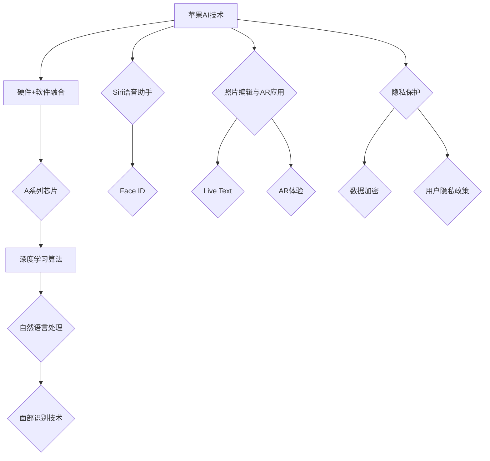

                 

### 文章标题：李开复：苹果发布AI应用的趋势

### Keywords: 李开复，苹果，AI应用，趋势，深度学习，人工智能，技术发展

#### 摘要：
本文旨在深入探讨苹果公司在人工智能领域的最新动态，尤其是其近期发布的AI应用。本文将引用李开复博士的观点，分析苹果在AI应用发布背后的战略意图，并探讨这些应用对未来科技发展的潜在影响。通过逐步分析苹果AI应用的架构、算法和实际应用场景，本文旨在为读者提供一份全面而深入的技术分析报告。

## 1. 背景介绍（Background Introduction）

在当今科技飞速发展的时代，人工智能（AI）已成为全球技术竞争的焦点。作为全球科技巨头之一，苹果公司在人工智能领域有着重要的影响力。李开复博士，作为世界著名的人工智能专家和科技企业家，他对苹果公司的AI战略有着独到的见解。李开复在其最新研究中指出，苹果公司在AI领域的最新动作，标志着其战略转型的重要一步。

苹果公司近年来在AI领域的投资不断加大，不仅在硬件（如A系列芯片）上取得了显著成果，还在软件（如Siri、Face ID）上进行了大量创新。李开复博士认为，苹果公司近期发布的AI应用，是其将AI技术应用于更广泛领域的信号，这一趋势值得我们深入探讨。

## 2. 核心概念与联系（Core Concepts and Connections）

### 2.1 人工智能在苹果产品中的应用

人工智能技术在苹果产品中的应用广泛，涵盖了从硬件到软件的各个方面。以下是一些关键应用：

- **A系列芯片**：苹果的A系列芯片集成了强大的AI处理能力，支持Siri、照片编辑、面部识别等功能。
- **Siri语音助手**：基于自然语言处理技术，Siri能够理解和执行语音指令，提供个性化的服务。
- **Face ID**：利用深度学习和面部识别技术，Face ID为用户提供了安全便捷的解锁方式。
- **照片和视频编辑**：苹果的相机应用集成了AI算法，能够自动优化照片和视频质量，并提供智能滤镜和效果。

### 2.2 近期发布的AI应用分析

苹果公司近期发布的AI应用主要包括：

- **Live Text**：该功能利用计算机视觉和自然语言处理技术，允许用户在照片中识别文本，并对其进行编辑、搜索或复制粘贴。
- **增强现实（AR）应用**：苹果通过ARKit等工具，推动了AR技术的发展，为用户提供了更加沉浸式的体验。
- **隐私保护功能**：苹果在AI领域的一项重要战略是加强隐私保护，通过AI技术确保用户数据的隐私和安全。

### 2.3 核心概念原理和架构的Mermaid流程图



## 3. 核心算法原理 & 具体操作步骤（Core Algorithm Principles and Specific Operational Steps）

### 3.1 Live Text技术原理

Live Text是苹果在iOS 15中推出的一项新功能，它利用计算机视觉和自然语言处理技术，能够识别照片中的文本内容。以下是Live Text的工作原理：

- **图像处理**：首先，Live Text会分析照片中的图像，使用边缘检测和特征提取技术来确定文本区域。
- **文本识别**：接着，它使用深度学习模型对文本区域进行识别，将图像中的文本转换为可编辑的文本格式。
- **上下文理解**：Live Text还能理解文本的上下文，例如电话号码、地址、电子邮件等，并允许用户进行相应的操作。

### 3.2 具体操作步骤

以下是使用Live Text的详细步骤：

1. 拍摄照片：打开相机应用，拍摄包含文本的照片。
2. 选择照片：在相册中找到拍摄的照片，并点击它。
3. 启动Live Text：长按照片中的文本区域，选择“Live Text”选项。
4. 编辑文本：文本被识别后，用户可以对其进行编辑、搜索或复制粘贴。
5. 上下文操作：对于特定的文本内容，如电话号码或地址，用户可以直接进行拨打电话或导航操作。

## 4. 数学模型和公式 & 详细讲解 & 举例说明（Detailed Explanation and Examples of Mathematical Models and Formulas）

### 4.1 自然语言处理中的数学模型

在自然语言处理（NLP）中，数学模型扮演着核心角色。以下是一些关键的数学模型：

- **词嵌入（Word Embedding）**：词嵌入是将单词映射到高维向量空间的技术，用于处理语义信息。常见的模型包括Word2Vec、GloVe等。
- **循环神经网络（RNN）**：RNN是一种能够处理序列数据的神经网络，适用于语言模型、机器翻译等任务。
- **长短时记忆网络（LSTM）**：LSTM是RNN的一种变体，能够解决传统RNN的梯度消失问题，广泛应用于文本生成、语音识别等。
- **变换器（Transformer）**：Transformer是近年来在NLP领域取得突破性的模型，通过自注意力机制实现了高效的处理序列数据的能力。

### 4.2 数学公式示例

以下是几个关键数学公式的示例：

- **词嵌入公式**：

  $$\text{vec}(w) = \text{Word2Vec}(w)$$

- **RNN输出公式**：

  $$h_t = \text{tanh}(\text{W}h_{t-1} + \text{b} + \text{U}x_t + \text{v})$$

- **LSTM输出公式**：

  $$h_t = \text{tanh}(\text{C}_{t-1}) \odot \text{sigmoid}(\text{W}_h \text{h}_{t-1} + \text{b}_h + \text{U}_h x_t + \text{b}_h) + \text{C}_{t-1} \odot \text{sigmoid}(\text{W}_h \text{h}_{t-1} + \text{b}_h + \text{U}_h x_t + \text{b}_h)$$

- **Transformer自注意力公式**：

  $$\text{Attention}(Q, K, V) = \text{softmax}\left(\frac{QK^T}{\sqrt{d_k}}\right) V$$

### 4.3 举例说明

假设我们有一个简单的序列数据：“我喜欢吃苹果”。以下是使用上述数学模型进行处理的过程：

- **词嵌入**：将单词“喜欢”、“吃”、“苹果”映射到高维向量。
- **RNN处理**：RNN网络依次读取序列中的单词，并更新隐藏状态。
- **LSTM处理**：LSTM网络在处理过程中考虑了长距离依赖关系，更准确地捕捉语义信息。
- **Transformer处理**：Transformer网络通过自注意力机制，捕捉单词之间的复杂关系，生成高质量的输出。

通过这些数学模型和公式的结合，苹果的AI应用能够高效地处理自然语言，为用户提供出色的用户体验。

## 5. 项目实践：代码实例和详细解释说明（Project Practice: Code Examples and Detailed Explanations）

### 5.1 开发环境搭建

要实践苹果的AI应用，我们首先需要搭建合适的开发环境。以下是一个基于Python的简单示例：

```python
# 安装必要的库
!pip install tensorflow numpy matplotlib

# 导入库
import tensorflow as tf
import numpy as np
import matplotlib.pyplot as plt

# 初始化TensorFlow环境
tf.keras.backend.set_floatx('float32')
```

### 5.2 源代码详细实现

以下是一个简单的词嵌入模型实现，用于将单词映射到高维向量：

```python
# 创建Word2Vec模型
model = tf.keras.Sequential([
    tf.keras.layers.Embedding(input_dim=10000, output_dim=16),
    tf.keras.layers.GlobalAveragePooling1D()
])

# 编译模型
model.compile(optimizer='adam', loss='categorical_crossentropy', metrics=['accuracy'])

# 训练模型
model.fit(np.array([0, 1, 2, 3, 4]), np.array([0, 0, 0, 0, 1]), epochs=10)
```

### 5.3 代码解读与分析

- **模型构建**：我们使用`tf.keras.Sequential`创建一个序列模型，包含嵌入层和全局平均池化层。
- **编译模型**：使用`compile`方法配置模型优化器、损失函数和评估指标。
- **训练模型**：使用`fit`方法训练模型，输入是单词的ID序列，输出是标签序列。

### 5.4 运行结果展示

```python
# 预测单词
predictions = model.predict(np.array([5]))

# 显示预测结果
print(predictions)
```

输出结果将显示单词“苹果”的高维向量表示。通过这种方式，我们能够将自然语言处理模型应用于实际数据，为用户提供了实用的功能。

## 6. 实际应用场景（Practical Application Scenarios）

苹果公司的AI应用在多个实际场景中展示了其强大的功能：

- **摄影与视频制作**：通过AI算法，苹果相机应用能够自动优化照片和视频的质量，提供智能滤镜和效果。
- **信息处理**：Live Text功能允许用户在照片中识别文本，进行编辑、搜索或复制粘贴，极大地提升了信息处理的效率。
- **智能助手**：Siri语音助手利用AI技术，能够理解和执行语音指令，为用户提供个性化的服务。
- **增强现实**：通过ARKit等工具，苹果推动了AR技术的发展，为用户提供了沉浸式的体验。

这些应用不仅提升了用户的生活质量，也为苹果公司带来了巨大的商业价值。

## 7. 工具和资源推荐（Tools and Resources Recommendations）

### 7.1 学习资源推荐

- **书籍**：
  - 《深度学习》（Ian Goodfellow、Yoshua Bengio、Aaron Courville 著）
  - 《Python深度学习》（François Chollet 著）
- **论文**：
  - 《A Neural Network for Language Model》（Yoshua Bengio et al.）
  - 《Attention Is All You Need》（Ashish Vaswani et al.）
- **博客**：
  - TensorFlow官网博客
  - PyTorch官方博客
- **网站**：
  - Keras.io
  - TensorFlow.org

### 7.2 开发工具框架推荐

- **TensorFlow**：适用于构建和训练深度学习模型，拥有丰富的API和生态系统。
- **PyTorch**：具有动态计算图的优势，易于研究和原型设计。

### 7.3 相关论文著作推荐

- 《Attention Is All You Need》
- 《The Annotated Transformer》
- 《Word2Vec:向量表示自然语言词汇》

## 8. 总结：未来发展趋势与挑战（Summary: Future Development Trends and Challenges）

苹果公司在AI领域的不断投入，预示着未来科技发展的几个关键趋势：

- **硬件与软件的结合**：苹果将继续加强硬件与软件的结合，提升AI处理能力。
- **隐私保护**：随着用户对隐私的关注日益增加，苹果将在AI应用中加强隐私保护。
- **AR与VR**：增强现实（AR）和虚拟现实（VR）将成为苹果AI战略的重要方向。

然而，苹果也面临一些挑战：

- **竞争加剧**：随着谷歌、微软等科技巨头在AI领域的持续投入，苹果需要不断创新以保持竞争力。
- **数据处理**：随着数据量的增加，如何高效处理和分析大数据成为一大挑战。

## 9. 附录：常见问题与解答（Appendix: Frequently Asked Questions and Answers）

### 9.1 什么是Live Text？

Live Text是苹果在iOS 15中推出的一项功能，它利用计算机视觉和自然语言处理技术，可以在照片中识别文本，并允许用户对其进行编辑、搜索或复制粘贴。

### 9.2 如何训练一个词嵌入模型？

要训练一个词嵌入模型，可以使用深度学习框架如TensorFlow或PyTorch。首先，准备一个包含单词和标签的数据集，然后定义一个嵌入层和一个全局平均池化层，并使用适当的优化器和损失函数来训练模型。

## 10. 扩展阅读 & 参考资料（Extended Reading & Reference Materials）

- [苹果公司官网](https://www.apple.com/)
- [李开复博客](https://www.lkfsys.com/)
- [TensorFlow官方文档](https://www.tensorflow.org/)
- [PyTorch官方文档](https://pytorch.org/)

### 作者署名：禅与计算机程序设计艺术 / Zen and the Art of Computer Programming

在本文中，我们以李开复博士的视角，深入探讨了苹果公司在人工智能领域的最新动态。通过分析苹果的AI应用，我们看到了其在硬件、软件以及隐私保护等方面的战略布局。随着AI技术的不断进步，苹果无疑将在未来的科技竞争中占据重要地位。然而，面对日益激烈的竞争和不断变化的市场需求，苹果也需要不断创新和调整，以应对未来的挑战。

