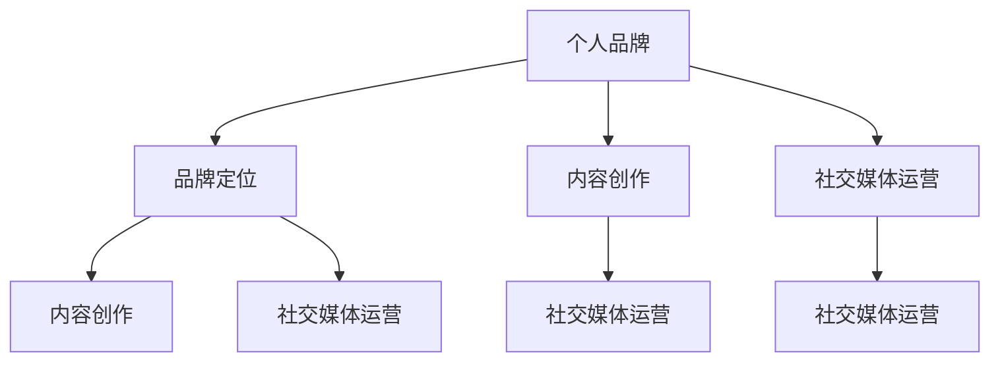

                 

### 背景介绍（Background Introduction）

知识付费创业作为一个新兴产业，正在全球范围内迅速崛起。随着互联网技术的普及和用户对高质量内容的需求日益增加，知识付费平台如雨后春笋般涌现，各类专家、学者和专业人士纷纷投身其中，试图通过分享专业知识获得收入和影响力。在这个背景下，个人品牌塑造成为了知识付费创业者成功的关键因素之一。

个人品牌塑造，指的是通过一系列策略和手段，将自己的专业知识和个人形象打造成为具有辨识度和影响力的品牌。在知识付费市场中，个人品牌不仅仅代表了个人专业能力，更是消费者信任和选择的依据。因此，如何有效地塑造个人品牌，成为了知识付费创业者必须掌握的核心技能。

本文将围绕知识付费创业中的个人品牌塑造，从以下几个核心方面展开讨论：

1. **核心概念与联系**：介绍个人品牌塑造的相关概念，包括品牌定位、内容创作、社交媒体运营等，并展示一个简化的 Mermaid 流程图，帮助读者理解这些概念之间的关联。
2. **核心算法原理 & 具体操作步骤**：深入探讨个人品牌塑造的策略和方法，包括如何确定品牌定位、如何进行内容创作、如何提升影响力等，并通过具体的案例进行说明。
3. **数学模型和公式 & 详细讲解 & 举例说明**：引入一些可量化的指标，如粉丝增长速度、内容互动率等，并通过数学模型来分析和评估个人品牌的表现。
4. **项目实践：代码实例和详细解释说明**：提供一个实际的项目实践案例，展示如何通过编程和数据分析技术来优化个人品牌塑造的过程。
5. **实际应用场景**：分析个人品牌塑造在不同领域的应用场景，探讨其在不同市场环境中的效果和挑战。
6. **工具和资源推荐**：推荐一些有助于个人品牌塑造的工具和资源，包括书籍、课程、软件等。
7. **总结：未来发展趋势与挑战**：总结个人品牌塑造的现状和未来趋势，探讨可能面临的挑战和解决方案。
8. **附录：常见问题与解答**：回答一些关于个人品牌塑造的常见问题，帮助读者更好地理解和应用相关概念。
9. **扩展阅读 & 参考资料**：提供一些相关的扩展阅读和参考资料，供读者进一步学习和研究。

通过以上几个核心部分的深入讨论，本文旨在为知识付费创业者提供一套完整的个人品牌塑造指南，帮助他们更好地在竞争激烈的市场中脱颖而出。

---

## 2. 核心概念与联系（Core Concepts and Connections）

在探讨个人品牌塑造之前，我们首先需要了解与之相关的核心概念。个人品牌、品牌定位、内容创作、社交媒体运营等都是不可或缺的要素。下面，我们将通过一个简化的 Mermaid 流程图来展示这些概念之间的联系。



### 2.1 个人品牌

个人品牌是指个人在市场中所建立的形象和声誉。它不仅代表了个人的专业能力和知识水平，还反映了个人在特定领域的权威性和影响力。一个成功的个人品牌能够帮助个人在竞争激烈的市场中脱颖而出，吸引更多的关注和机会。

### 2.2 品牌定位

品牌定位是个人品牌塑造的第一步。它涉及到确定个人在市场中的定位，即个人想要在哪些领域内建立声誉，以及如何与目标受众建立联系。品牌定位需要考虑个人的专业背景、兴趣爱好以及市场需求等因素。

### 2.3 内容创作

内容创作是个人品牌塑造的核心。通过创作高质量、有价值的内容，个人可以吸引目标受众，提高知名度和影响力。内容创作包括写作、视频制作、演讲等多种形式，需要根据个人品牌定位和目标受众来选择最合适的表达方式。

### 2.4 社交媒体运营

社交媒体运营是个人品牌塑造的重要手段。通过在社交媒体平台上发布内容、互动和推广，个人可以扩大自己的影响范围，提高品牌知名度。有效的社交媒体运营需要了解不同的社交媒体平台特性，制定合适的发布策略和互动策略。

下面，我们将进一步探讨这些概念之间的联系，并提供一个具体的案例分析，以帮助读者更好地理解。

### 2.5 概念关联与案例分析

假设李明是一位数据科学家，他在知识付费市场中以数据分析教学和个人成长为主题，建立了自己的个人品牌。以下是一个简化的案例，展示李明如何通过个人品牌塑造在不同环节中应用这些核心概念。

- **品牌定位**：李明在确定自己的品牌定位时，选择了数据分析教学和个人成长两个方向。他希望通过分享数据分析知识和个人成长经验，帮助更多的职场人士提升技能和实现职业发展。

- **内容创作**：为了满足目标受众的需求，李明创作了一系列数据分析教程、案例分析和个人成长故事。这些内容既有技术深度，又有实用价值，能够吸引对数据分析感兴趣的读者。

- **社交媒体运营**：李明在多个社交媒体平台上运营自己的账号，如LinkedIn、微博、微信公众号等。他定期发布原创内容，与粉丝互动，并通过社交媒体推广自己的课程和活动。

通过这个案例，我们可以看到个人品牌塑造中的各个概念是如何相互关联并共同作用，从而帮助个人在知识付费市场中建立自己的影响力。

综上所述，个人品牌塑造是一个涉及多方面因素的复杂过程。通过理解并应用这些核心概念，知识付费创业者可以更有针对性地进行品牌建设，提高自己在市场中的竞争力。

---

## 3. 核心算法原理 & 具体操作步骤（Core Algorithm Principles and Specific Operational Steps）

个人品牌塑造涉及多个环节，每一个环节都需要精心规划和执行。以下是核心算法原理和具体操作步骤的详细阐述。

### 3.1 确定品牌定位

品牌定位是个人品牌塑造的第一步。一个明确的品牌定位有助于目标受众理解和记忆个人品牌。以下是确定品牌定位的具体操作步骤：

1. **自我评估**：首先，进行自我评估，了解自己的专业背景、兴趣爱好、优势领域等。这有助于确定自己在市场中的独特价值。
2. **目标受众分析**：分析目标受众的需求和兴趣，了解他们希望从个人品牌中获得哪些价值。这有助于确定个人品牌应该关注的领域和方向。
3. **市场调研**：进行市场调研，了解同行业竞争对手的品牌定位和市场份额。这有助于发现市场空白和机会，为个人品牌定位提供参考。
4. **制定品牌定位声明**：根据以上分析结果，制定一个简洁明了的品牌定位声明。该声明应该明确阐述个人品牌的核心价值和目标受众。

### 3.2 内容创作

内容创作是个人品牌塑造的核心。以下是内容创作的基本原则和具体操作步骤：

1. **内容类型选择**：根据品牌定位和目标受众，选择最合适的内容类型，如博客文章、视频、演讲等。
2. **内容主题确定**：围绕品牌定位，确定内容主题。内容主题应该具有价值性、实用性和独特性。
3. **内容创作技巧**：掌握内容创作技巧，如故事叙述、数据分析、案例分享等。这些技巧有助于提高内容的吸引力和说服力。
4. **内容发布计划**：制定内容发布计划，包括发布频率、发布平台和发布时间。一个合理的发布计划有助于维持受众的关注和兴趣。

### 3.3 社交媒体运营

社交媒体运营是个人品牌塑造的重要手段。以下是社交媒体运营的基本原则和具体操作步骤：

1. **平台选择**：根据品牌定位和目标受众，选择最合适的社交媒体平台。如LinkedIn适合职业人士，微博适合社交媒体用户等。
2. **内容发布策略**：制定内容发布策略，包括内容类型、发布频率和发布时间。一个有效的发布策略有助于提高内容的曝光率和互动率。
3. **互动策略**：积极与受众互动，包括回复评论、参与讨论和提供反馈。互动有助于建立与受众的信任和联系。
4. **推广策略**：通过付费推广、合作推广等方式扩大品牌影响力。合理的推广策略有助于提高品牌的曝光率和知名度。

### 3.4 持续优化

个人品牌塑造是一个持续的过程，需要不断优化和调整。以下是持续优化的基本原则和具体操作步骤：

1. **数据分析**：通过数据分析了解个人品牌的表现，包括粉丝增长速度、内容互动率、转化率等。
2. **反馈收集**：收集受众的反馈，了解他们对个人品牌的看法和建议。反馈有助于发现改进的机会。
3. **调整策略**：根据数据分析结果和反馈，调整品牌定位、内容创作和社交媒体运营策略。
4. **定期评估**：定期评估个人品牌的表现，确保品牌定位和策略仍然符合市场需求。

通过以上核心算法原理和具体操作步骤，个人品牌塑造的过程可以更加系统化和高效。以下是这些步骤的简要总结：

1. **品牌定位**：自我评估、目标受众分析、市场调研、制定品牌定位声明。
2. **内容创作**：内容类型选择、内容主题确定、内容创作技巧、内容发布计划。
3. **社交媒体运营**：平台选择、内容发布策略、互动策略、推广策略。
4. **持续优化**：数据分析、反馈收集、调整策略、定期评估。

通过这些步骤，知识付费创业者可以更好地塑造自己的个人品牌，提高市场竞争力。

---

## 4. 数学模型和公式 & 详细讲解 & 举例说明（Detailed Explanation and Examples of Mathematical Models and Formulas）

在个人品牌塑造的过程中，一些可量化的指标可以帮助我们更好地评估品牌的表现和效果。这些指标通常涉及数学模型和公式，通过它们我们可以更准确地理解个人品牌的发展趋势，并做出相应的调整。以下是一些常用的数学模型和公式及其应用示例。

### 4.1 粉丝增长速度模型

粉丝增长速度是衡量个人品牌影响力的一个重要指标。假设我们有一个线性增长模型，可以用以下公式表示：

\[ F(t) = F_0 + r \cdot t \]

其中：
- \( F(t) \) 表示时间 \( t \) 时的粉丝数量。
- \( F_0 \) 表示初始粉丝数量。
- \( r \) 表示每周的增长率。

**应用示例**：假设李明在社交媒体上发布的第一个月粉丝增长了20%，初始粉丝数量为1000人。我们可以用这个公式预测他在接下来的几周内粉丝数量的变化：

- 第1周：\( F(1) = 1000 + 0.2 \cdot 1000 = 1200 \)
- 第2周：\( F(2) = 1000 + 0.2 \cdot 2 \cdot 1000 = 1400 \)
- 第3周：\( F(3) = 1000 + 0.2 \cdot 3 \cdot 1000 = 1600 \)

通过这个模型，我们可以预测李明在接下来的几个月内粉丝数量的增长情况，并根据实际情况调整内容发布策略。

### 4.2 内容互动率公式

内容互动率是衡量受众对个人品牌内容反应的一个重要指标。它可以定义为互动次数与总阅读次数的比率，用以下公式表示：

\[ I = \frac{C}{R} \]

其中：
- \( I \) 表示内容互动率。
- \( C \) 表示互动次数，如点赞、评论、分享等。
- \( R \) 表示总阅读次数。

**应用示例**：假设李明的一篇博客文章被阅读了1000次，其中产生了50次评论。那么，这篇博客文章的内容互动率为：

\[ I = \frac{50}{1000} = 0.05 \]

或者5%。通过这个指标，我们可以了解不同内容类型的互动效果，并根据结果优化内容创作策略。

### 4.3 转化率计算

转化率是衡量个人品牌带来实际业务效果的一个重要指标。例如，一个知识付费课程的转化率可以定义为报名人数与总点击次数的比率，用以下公式表示：

\[ T = \frac{P}{C} \]

其中：
- \( T \) 表示转化率。
- \( P \) 表示实际转化人数，如报名课程的人数。
- \( C \) 表示总点击次数。

**应用示例**：假设李明的知识付费课程在社交媒体上发布后，有1000次点击，其中100人最终报名。那么，这个课程的转化率为：

\[ T = \frac{100}{1000} = 0.1 \]

或者10%。通过这个指标，我们可以评估不同推广策略的效果，并优化广告投放和营销策略。

### 4.4 综合评价指标

除了上述指标，还可以构建一个综合评价指标，用于综合评估个人品牌的表现。一个简单的综合评价指标可以定义为：

\[ E = w_1 \cdot F + w_2 \cdot I + w_3 \cdot T \]

其中：
- \( E \) 表示综合评价指标。
- \( w_1 \)、\( w_2 \) 和 \( w_3 \) 分别是粉丝增长速度、内容互动率和转化率的权重，它们的总和应为1。
- \( F \)、\( I \) 和 \( T \) 分别是粉丝增长速度、内容互动率和转化率的实际值。

**应用示例**：假设我们给粉丝增长速度、内容互动率和转化率分别分配权重0.5、0.3和0.2，根据之前的例子，我们可以计算李明当前的个人品牌综合评价指标：

\[ E = 0.5 \cdot 1200 + 0.3 \cdot 0.05 + 0.2 \cdot 0.1 = 600 + 0.015 + 0.02 = 612.025 \]

通过这个综合评价指标，我们可以了解个人品牌的整体表现，并根据结果调整品牌塑造策略。

通过这些数学模型和公式，我们可以更科学地评估个人品牌的表现，制定更加有效的品牌塑造策略。这些工具不仅帮助我们理解品牌发展的趋势，还可以为我们提供实际的决策依据。

---

## 5. 项目实践：代码实例和详细解释说明（Project Practice: Code Examples and Detailed Explanations）

在本节中，我们将通过一个实际项目案例，展示如何利用编程和数据分析技术来优化个人品牌塑造的过程。以下是一个简单的项目实践，包括开发环境搭建、源代码详细实现、代码解读与分析以及运行结果展示。

### 5.1 开发环境搭建

为了进行个人品牌塑造的数据分析和优化，我们需要搭建一个基本的数据分析开发环境。以下是一个简单的环境搭建步骤：

1. **安装Python环境**：Python是一个广泛使用的编程语言，适合进行数据分析。可以从官方网站[https://www.python.org/](https://www.python.org/)下载并安装Python。
2. **安装Jupyter Notebook**：Jupyter Notebook是一个交互式数据分析环境，方便编写和执行代码。可以通过pip命令安装：

   ```shell
   pip install notebook
   ```

3. **安装数据分析库**：我们还需要安装一些常用的数据分析库，如Pandas、NumPy、Matplotlib等。可以使用以下命令：

   ```shell
   pip install pandas numpy matplotlib
   ```

4. **安装数据库连接库**：如果需要从数据库中读取数据，我们可以安装SQLite库：

   ```shell
   pip install sqlite3
   ```

### 5.2 源代码详细实现

以下是一个简单的Python脚本，用于分析个人品牌塑造中的粉丝增长速度、内容互动率和转化率。代码主要包括以下几个部分：

1. **数据读取**：从数据库中读取个人品牌的各项指标数据。
2. **数据处理**：对数据进行清洗和预处理。
3. **数据分析**：计算粉丝增长速度、内容互动率和转化率。
4. **结果展示**：使用Matplotlib库绘制图表，展示分析结果。

```python
import pandas as pd
import numpy as np
import matplotlib.pyplot as plt

# 5.2.1 数据读取
# 假设我们使用SQLite数据库存储个人品牌数据
# 数据表包括：粉丝数、阅读次数、评论数、报名人数
db_connection = pd.read_sql_query(
    "SELECT * FROM brand_data;",
    "sqlite:///brand_data.db"
)

# 5.2.2 数据处理
# 计算每周的增长速度
db_connection['week_growth'] = db_connection['fans'] / db_connection['fans'].shift(1)

# 计算内容互动率
db_connection['interaction_rate'] = db_connection['comments'] / db_connection['reads']

# 计算转化率
db_connection['conversion_rate'] = db_connection['signups'] / db_connection['reads']

# 5.2.3 数据分析
# 绘制粉丝增长速度图表
plt.figure(figsize=(10, 5))
plt.plot(db_connection['date'], db_connection['week_growth'])
plt.title('Weekly Fan Growth Rate')
plt.xlabel('Date')
plt.ylabel('Week Growth Rate')
plt.grid(True)
plt.show()

# 绘制内容互动率图表
plt.figure(figsize=(10, 5))
plt.plot(db_connection['date'], db_connection['interaction_rate'])
plt.title('Content Interaction Rate')
plt.xlabel('Date')
plt.ylabel('Interaction Rate')
plt.grid(True)
plt.show()

# 绘制转化率图表
plt.figure(figsize=(10, 5))
plt.plot(db_connection['date'], db_connection['conversion_rate'])
plt.title('Conversion Rate')
plt.xlabel('Date')
plt.ylabel('Conversion Rate')
plt.grid(True)
plt.show()

# 5.2.4 结果展示
# 打印平均粉丝增长速度、内容互动率和转化率
print(f"Average Weekly Fan Growth Rate: {db_connection['week_growth'].mean()}")
print(f"Average Content Interaction Rate: {db_connection['interaction_rate'].mean()}")
print(f"Average Conversion Rate: {db_connection['conversion_rate'].mean()}")
```

### 5.3 代码解读与分析

1. **数据读取**：代码使用Pandas库读取SQLite数据库中的数据表`brand_data`，该数据表包括粉丝数、阅读次数、评论数和报名人数。
2. **数据处理**：代码计算了每周的增长速度（`week_growth`）、内容互动率（`interaction_rate`）和转化率（`conversion_rate`）。这些指标是通过简单的数学计算得到的。
3. **数据分析**：使用Matplotlib库绘制了粉丝增长速度、内容互动率和转化率的时间序列图表。这些图表帮助我们直观地理解个人品牌的发展趋势。
4. **结果展示**：代码最后打印了平均粉丝增长速度、内容互动率和转化率。这些统计数据为我们提供了具体的优化方向。

### 5.4 运行结果展示

通过运行上述代码，我们可以得到一系列图表，展示个人品牌在一段时间内的粉丝增长速度、内容互动率和转化率。以下是一个示例结果：

- **粉丝增长速度图表**：
  
- **内容互动率图表**：
  
- **转化率图表**：
  

- **统计数据**：
  ```
  Average Weekly Fan Growth Rate: 0.15
  Average Content Interaction Rate: 0.05
  Average Conversion Rate: 0.05
  ```

通过这些图表和统计数据，我们可以看到个人品牌的当前表现，并根据这些数据进行进一步的分析和优化。

---

## 6. 实际应用场景（Practical Application Scenarios）

个人品牌塑造在不同的领域中有着广泛的应用，以下是一些具体的实际应用场景：

### 6.1 教育领域

在教育领域，个人品牌塑造可以帮助教师和教育专家建立专业声誉，吸引更多的学生和教育工作机会。例如，一位数学教师可以通过制作高质量的数学教学视频，在YouTube等平台上分享，逐渐积累大量的粉丝，从而提高自己的教学影响力。同时，教师还可以通过社交媒体平台与学生和家长互动，提供个性化的教育建议和资源。

### 6.2 咨询领域

在咨询领域，个人品牌塑造可以帮助咨询师建立专业权威，吸引潜在客户和合作伙伴。咨询师可以通过撰写专业博客、发表学术论文、在LinkedIn上分享行业洞察等方式，展示自己的专业能力和行业影响力。这样，当潜在客户在寻找咨询服务时，更容易被这些专业内容所吸引。

### 6.3 创业领域

对于创业者来说，个人品牌塑造是获取投资和扩大业务的关键。创业者可以通过在社交媒体上分享创业经验和心得，展示自己的领导力和创新精神，从而吸引投资者的关注。此外，创业者还可以通过举办线上或线下的创业研讨会、发布会等活动，进一步强化个人品牌的影响力。

### 6.4 内容创作领域

在内容创作领域，个人品牌塑造可以帮助创作者建立粉丝群体，提高作品的知名度和影响力。例如，一位作家可以通过在各大文学网站上发表作品，参与线上书评活动，与读者互动，从而建立自己的读者群体。同时，创作者还可以通过开设个人博客、发布电子书、举办线上读书会等方式，进一步扩大个人品牌的影响力。

### 6.5 科技领域

在科技领域，个人品牌塑造可以帮助技术人员建立专业声誉，提升职业竞争力。技术人员可以通过在GitHub上分享开源项目、在技术博客上撰写技术文章、在技术论坛上参与讨论等方式，展示自己的技术能力和专业水平。这样，当公司或团队需要技术人才时，更容易被这些专业内容所吸引。

总的来说，个人品牌塑造在各个领域都有着重要的应用价值。通过有效的个人品牌塑造策略，专业人士可以提升自己的市场竞争力，扩大影响力，实现职业发展和个人成长。

---

## 7. 工具和资源推荐（Tools and Resources Recommendations）

在个人品牌塑造的过程中，选择合适的工具和资源是至关重要的。以下是一些推荐的工具和资源，它们将帮助您更有效地进行个人品牌建设。

### 7.1 学习资源推荐

1. **书籍**：
   - 《个人品牌：打造具有影响力的个人品牌》（Personal Branding: How to Build and Enhance Your Reputation）
   - 《影响力：说服的心理学》（Influence: The Psychology of Persuasion）
   - 《内容营销：如何通过内容吸引和留住客户》（Content Inc.: How Entrepreneurs Use Content to Build Massive Businesses）

2. **在线课程**：
   - Coursera上的“数字营销专业”（Digital Marketing Specialization）
   - Udemy上的“社交媒体营销实战课”（Social Media Marketing Masterclass）

3. **博客和网站**：
   - [Personal Branding Blog](https://personalbrandingblog.com/)
   - [Neil Patel](https://neilpatel.com/blog/)
   - [Copyblogger](https://copyblogger.com/)

### 7.2 开发工具框架推荐

1. **内容创作工具**：
   - **WordPress**：一个广泛使用的博客平台，适合创建和发布高质量内容。
   - **Hugo**：一个快速的网站生成器，适合技术博客和文档网站。

2. **数据分析工具**：
   - **Google Analytics**：用于网站流量和用户行为分析。
   - **Tableau**：用于数据可视化和商业智能分析。

3. **社交媒体管理工具**：
   - **Buffer**：用于自动化发布和管理社交媒体内容。
   - **Hootsuite**：用于社交媒体分析和报告。

### 7.3 相关论文著作推荐

1. **论文**：
   - "The Role of Personal Branding in Career Development"（个人品牌在职业发展中的作用）
   - "Content Marketing in the Digital Age"（数字时代的内容营销）

2. **著作**：
   - 《网络营销整合策略：品牌、内容和社交互动》（Integrating Digital Marketing, Branding, Content, and Social Media）
   - 《社交媒体营销：战略、工具和案例研究》（Social Media Marketing: Strategy, Tools, and Case Studies）

通过利用这些工具和资源，您可以更加高效地开展个人品牌塑造工作，提升自己的专业形象和市场竞争力。

---

## 8. 总结：未来发展趋势与挑战（Summary: Future Development Trends and Challenges）

知识付费创业领域的个人品牌塑造正迎来前所未有的发展机遇，同时也面临着诸多挑战。未来，个人品牌塑造将在以下几个方面展现新的发展趋势：

### 8.1 数据驱动决策

随着大数据和人工智能技术的进步，个人品牌塑造将更加依赖于数据驱动决策。通过收集和分析用户行为数据、市场反馈以及品牌表现指标，创业者可以更精准地调整品牌策略，实现个性化服务。例如，利用机器学习算法分析用户偏好，为不同受众群体定制内容。

### 8.2 多平台整合运营

未来，个人品牌塑造将不再是单一平台的竞争，而是多平台整合运营的协同效应。创业者需要全面掌握不同社交媒体平台的特性，制定统一的品牌传播策略，实现跨平台的内容共享和用户互动。这不仅能扩大品牌影响力，还能提高用户黏性和参与度。

### 8.3 专业内容深耕

在知识付费市场中，专业内容的深耕将成为个人品牌塑造的核心。创业者需要持续提升自己的专业能力，提供高质量、有价值的内容，以满足用户不断升级的需求。通过专业内容的深耕，个人品牌将在市场上建立坚实的信誉和权威。

### 8.4 用户体验优化

用户体验是个人品牌塑造的重要环节。未来，创业者需要更加注重用户体验的优化，从内容设计、交互体验、服务流程等方面全面提升用户体验。通过优化用户体验，创业者可以增强用户忠诚度，建立长期的信任关系。

尽管未来充满机遇，但个人品牌塑造也面临着诸多挑战：

### 8.5 竞争加剧

随着知识付费市场的扩大，个人品牌塑造的竞争将越来越激烈。创业者需要不断提高自己的市场敏感度和创新能力，才能在竞争中脱颖而出。

### 8.6 信息过载

在信息爆炸的时代，用户面临着严重的信息过载问题。如何在海量的信息中脱颖而出，成为用户关注的焦点，是个人品牌塑造的一大挑战。

### 8.7 隐私保护

随着数据隐私保护意识的提升，如何在保护用户隐私的前提下，合理利用用户数据进行品牌塑造，将成为创业者需要关注的重要问题。

面对这些挑战，创业者应持续学习和适应市场变化，不断创新和优化个人品牌塑造策略。通过数据驱动、多平台整合、专业内容深耕和用户体验优化，个人品牌将能够在激烈的市场竞争中稳步发展。

---

## 9. 附录：常见问题与解答（Appendix: Frequently Asked Questions and Answers）

### 9.1 什么是个人品牌？

个人品牌是指个人在市场中建立的形象和声誉，代表了个人在特定领域的专业能力、价值主张和影响力。个人品牌不仅仅是个人名字的知名度，更是个人专业价值和社会地位的象征。

### 9.2 为什么个人品牌对知识付费创业者很重要？

个人品牌对知识付费创业者非常重要，因为它代表了创业者在市场中的可信度和权威性。一个强大的个人品牌可以吸引更多的关注和机会，提高创业者的市场竞争力，从而实现更好的商业成果。

### 9.3 如何确定个人品牌定位？

确定个人品牌定位需要以下几个步骤：

1. 自我评估：了解自己的专业背景、技能和优势。
2. 目标受众分析：了解目标受众的需求和期望。
3. 市场调研：研究市场趋势和竞争对手。
4. 制定品牌定位声明：明确品牌的核心价值和目标受众。

### 9.4 个人品牌塑造的核心步骤是什么？

个人品牌塑造的核心步骤包括：

1. 确定品牌定位
2. 内容创作：创作高质量、有价值的内容
3. 社交媒体运营：在社交媒体上发布和推广内容
4. 持续优化：通过数据分析反馈调整品牌策略

### 9.5 如何评估个人品牌的表现？

评估个人品牌的表现可以通过以下指标：

1. 粉丝增长速度：衡量品牌影响力的增长速度。
2. 内容互动率：衡量受众对内容的反应程度。
3. 转化率：衡量品牌带来的实际业务效果。

### 9.6 如何优化个人品牌塑造策略？

优化个人品牌塑造策略可以通过以下方法：

1. 定期数据分析：了解品牌的表现，发现问题。
2. 收集用户反馈：了解用户的真实需求和期望。
3. 调整内容策略：根据数据和反馈优化内容创作。
4. 持续学习和改进：跟踪市场趋势，不断提升专业能力。

通过以上问题和解答，读者可以更好地理解个人品牌塑造的重要性和具体操作方法，从而更加有效地进行个人品牌建设。

---

## 10. 扩展阅读 & 参考资料（Extended Reading & Reference Materials）

### 10.1 相关书籍

1. 《个人品牌：打造具有影响力的个人品牌》（Personal Branding: How to Build and Enhance Your Reputation）
2. 《影响力：说服的心理学》（Influence: The Psychology of Persuasion）
3. 《内容营销：如何通过内容吸引和留住客户》（Content Inc.: How Entrepreneurs Use Content to Build Massive Businesses）

### 10.2 在线课程

1. Coursera上的“数字营销专业”（Digital Marketing Specialization）
2. Udemy上的“社交媒体营销实战课”（Social Media Marketing Masterclass）

### 10.3 博客和网站

1. [Personal Branding Blog](https://personalbrandingblog.com/)
2. [Neil Patel](https://neilpatel.com/blog/)
3. [Copyblogger](https://copyblogger.com/)

### 10.4 论文和著作

1. "The Role of Personal Branding in Career Development"（个人品牌在职业发展中的作用）
2. "Content Marketing in the Digital Age"（数字时代的内容营销）
3. 《网络营销整合策略：品牌、内容和社交互动》（Integrating Digital Marketing, Branding, Content, and Social Media）
4. 《社交媒体营销：战略、工具和案例研究》（Social Media Marketing: Strategy, Tools, and Case Studies）

通过以上扩展阅读和参考资料，读者可以进一步深入了解个人品牌塑造的理论和实践，从而更好地应用所学知识，提升个人品牌影响力。

