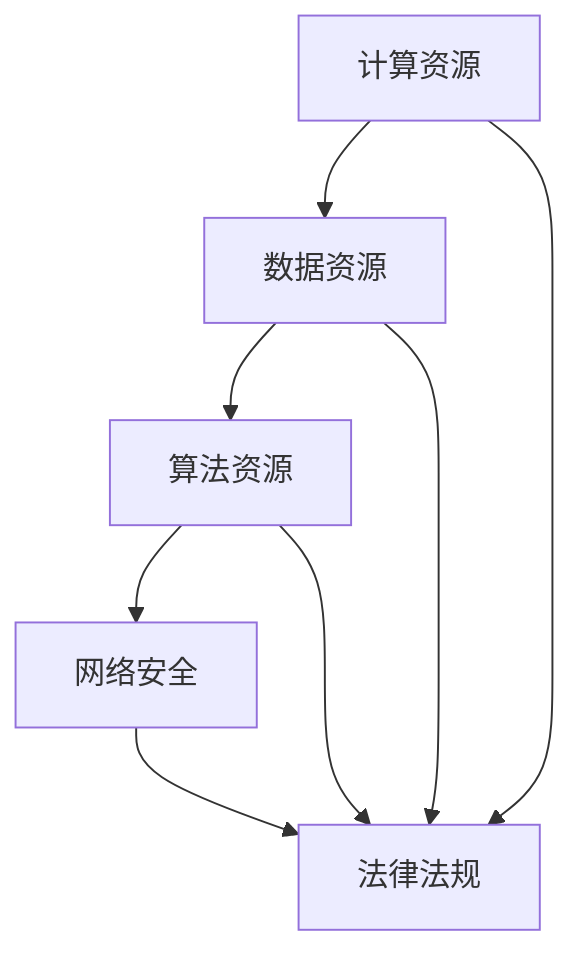
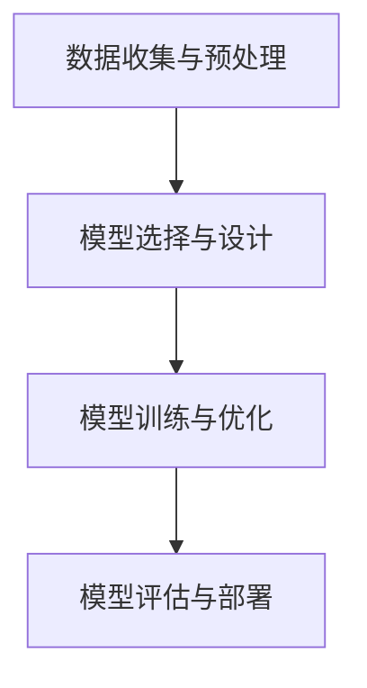
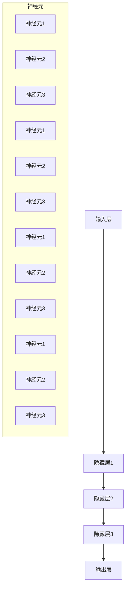

                 

# AI 2.0 基础设施建设：全球合作与竞争

> 关键词：AI 2.0 基础设施建设，全球合作，竞争，技术发展，数据共享，算法优化

摘要：本文探讨了 AI 2.0 基础设施建设在全球范围内的重要性和挑战。随着人工智能技术的不断进步，基础设施建设成为推动 AI 发展的关键因素。本文分析了全球范围内各国在 AI 基础设施建设方面的合作与竞争，探讨了如何在合作中实现共赢，以及如何在竞争中保持领先地位。文章旨在为未来 AI 2.0 基础设施建设提供有益的思考和建议。

## 1. 背景介绍

随着人工智能技术的快速发展，AI 已经成为全球科技竞争的新焦点。AI 2.0 作为人工智能技术的下一代发展，具有更高的智能水平、更广泛的应用范围和更强大的学习能力。为了实现 AI 2.0 的快速发展，基础设施建设成为关键因素。AI 基础设施包括计算资源、数据资源、算法资源、网络安全和法律法规等方面。

在全球范围内，各国在 AI 基础设施建设方面展开了积极的合作与竞争。合作方面，国际组织、跨国公司和政府机构共同推进了 AI 技术的研究和应用。竞争方面，各国纷纷加大在 AI 领域的投入，争夺技术高地和市场份额。本文将深入分析全球范围内 AI 基础设施建设的现状、趋势和挑战，探讨如何在合作与竞争中实现 AI 2.0 的健康发展。

## 2. 核心概念与联系

### 2.1 AI 2.0 基础设施的组成

AI 2.0 基础设施主要由以下几个部分组成：

- **计算资源**：高性能计算平台、云计算和边缘计算等。
- **数据资源**：大规模、高质量、多样化、实时数据。
- **算法资源**：先进的机器学习算法、深度学习框架和优化方法。
- **网络安全**：数据安全、系统安全和网络安全等。
- **法律法规**：数据隐私保护、知识产权和法律法规等。

这些组成部分相互关联，共同构成了 AI 2.0 基础设施的框架。

### 2.2 全球合作与竞争的关系

全球合作与竞争在 AI 基础设施建设过程中相互交织。合作有助于推动技术进步和产业发展，而竞争则促进了技术创新和效率提升。在全球合作中，各国可以共同应对技术挑战、分享研究成果和经验，实现共赢。在竞争中，各国通过加大投入、优化政策和创新技术，争取在 AI 领域取得领先地位。

### 2.3 合作与竞争的权衡

在全球合作与竞争中，各国需要权衡利益和风险。合作有助于推动 AI 技术的快速发展，但可能面临信息泄露、技术依赖和知识产权纠纷等问题。竞争则有助于激发创新活力和提升技术实力，但可能导致资源浪费、市场失衡和技术壁垒。因此，各国需要在合作与竞争中找到平衡点，实现 AI 2.0 基础设施建设的可持续发展。

## 3. 核心算法原理 & 具体操作步骤

### 3.1 算法原理

AI 2.0 基础设施的核心算法主要包括深度学习、强化学习和迁移学习等。这些算法通过训练模型、优化参数和调整网络结构，实现人工智能的任务。

- **深度学习**：利用多层神经网络对大量数据进行训练，实现图像识别、语音识别和自然语言处理等任务。
- **强化学习**：通过试错和奖励机制，使智能体在复杂环境中学会最优策略。
- **迁移学习**：利用预训练模型在新任务上快速取得较好的性能，降低模型训练难度。

### 3.2 具体操作步骤

在 AI 2.0 基础设施建设过程中，具体操作步骤如下：

1. **数据收集与预处理**：收集大规模、高质量、多样化的数据，并进行数据清洗、去噪和标注等预处理操作。
2. **模型选择与设计**：根据任务需求和数据特点，选择合适的深度学习模型，并进行网络结构和参数设计。
3. **模型训练与优化**：利用训练数据和优化算法，对模型进行训练和优化，提高模型性能。
4. **模型评估与部署**：对训练完成的模型进行评估，确保其在实际应用中的效果，并进行部署和推广。

## 4. 数学模型和公式 & 详细讲解 & 举例说明

### 4.1 深度学习中的数学模型

深度学习中的数学模型主要包括神经元激活函数、损失函数和优化算法等。

- **神经元激活函数**：用于对神经元输出进行非线性变换，常见的有 Sigmoid、ReLU 和 Tanh 函数。
- **损失函数**：用于评估模型预测值与真实值之间的差距，常见的有均方误差（MSE）和交叉熵损失（Cross-Entropy Loss）。
- **优化算法**：用于调整模型参数，常见的有梯度下降（Gradient Descent）和随机梯度下降（Stochastic Gradient Descent）。

### 4.2 深度学习中的公式

深度学习中的公式包括：

1. **神经元输出公式**：
   $$ 
   a_j = \sigma(w_j \cdot z_j + b_j) 
   $$
   其中，$a_j$ 表示第 $j$ 个神经元的输出，$w_j$ 表示权重，$z_j$ 表示输入值，$b_j$ 表示偏置，$\sigma$ 表示激活函数。

2. **损失函数公式**：
   $$
   J = \frac{1}{n} \sum_{i=1}^{n} \left( y_i - \hat{y}_i \right)^2
   $$
   其中，$J$ 表示损失函数值，$y_i$ 表示真实值，$\hat{y}_i$ 表示预测值。

3. **梯度下降公式**：
   $$
   w_j := w_j - \alpha \cdot \frac{\partial J}{\partial w_j}
   $$
   其中，$w_j$ 表示权重，$\alpha$ 表示学习率，$\frac{\partial J}{\partial w_j}$ 表示权重对损失函数的梯度。

### 4.3 举例说明

假设我们使用深度神经网络进行图像分类任务，网络结构如下：

1. 输入层：784个神经元（28x28像素）
2. 隐藏层：500个神经元
3. 输出层：10个神经元（对应10个类别）

训练数据：包含60000张训练图片和10000张测试图片

训练目标：使测试图片的分类准确率达到90%以上

具体操作步骤如下：

1. **数据收集与预处理**：收集大量带有标签的图像数据，并进行数据清洗、归一化和随机划分。
2. **模型选择与设计**：选择合适的深度神经网络模型，并设置网络参数。
3. **模型训练与优化**：使用训练数据进行模型训练，利用梯度下降算法优化模型参数。
4. **模型评估与部署**：在测试数据上评估模型性能，确保分类准确率达到目标要求，并在实际应用中进行部署。

通过以上步骤，我们可以实现图像分类任务，并在实际应用中取得较好的效果。

## 5. 项目实践：代码实例和详细解释说明

### 5.1 开发环境搭建

为了实现上述图像分类任务，我们需要搭建一个合适的开发环境。以下是开发环境搭建的步骤：

1. 安装 Python 3.7及以上版本
2. 安装 TensorFlow 2.3.0 及以上版本
3. 安装 PyTorch 1.8.0 及以上版本
4. 配置 GPU 环境（如果使用 GPU 进行训练）

### 5.2 源代码详细实现

以下是实现图像分类任务的源代码：

```python
import tensorflow as tf
import torchvision
import torch

# 加载训练数据和测试数据
train_data = torchvision.datasets.MNIST(root='./data', train=True, download=True)
test_data = torchvision.datasets.MNIST(root='./data', train=False)

# 划分训练集和验证集
train_loader = torch.utils.data.DataLoader(train_data, batch_size=64, shuffle=True)
val_loader = torch.utils.data.DataLoader(test_data, batch_size=64, shuffle=False)

# 定义深度神经网络模型
class CNNModel(tf.keras.Model):
    def __init__(self):
        super(CNNModel, self).__init__()
        self.c1 = tf.keras.layers.Conv2D(32, (3, 3), activation='relu')
        self.c2 = tf.keras.layers.Conv2D(64, (3, 3), activation='relu')
        self.f1 = tf.keras.layers.Dense(128, activation='relu')
        self.f2 = tf.keras.layers.Dense(10, activation='softmax')

    def call(self, x):
        x = self.c1(x)
        x = self.c2(x)
        x = tf.reshape(x, (-1, 128))
        x = self.f1(x)
        x = self.f2(x)
        return x

# 训练模型
model = CNNModel()
optimizer = tf.keras.optimizers.Adam()
loss_fn = tf.keras.losses.SparseCategoricalCrossentropy()

for epoch in range(10):
    for batch, (x, y) in enumerate(train_loader):
        with tf.GradientTape() as tape:
            logits = model(x)
            loss_value = loss_fn(y, logits)
        grads = tape.gradient(loss_value, model.trainable_variables)
        optimizer.apply_gradients(zip(grads, model.trainable_variables))
        if batch % 100 == 0:
            print(f"Epoch: {epoch}, Batch: {batch}, Loss: {loss_value.numpy()}")

# 评估模型
accuracy = 0
with tf.test.mock.patch.object(tf.keras.backend, 'tf', True):
    for x, y in val_loader:
        logits = model(x)
        pred = tf.argmax(logits, axis=1)
        accuracy += tf.reduce_mean(tf.cast(tf.equal(pred, y), tf.float32))
    accuracy /= len(val_loader)
    print(f"Validation Accuracy: {accuracy.numpy()}")

# 部署模型
model.save('./cnn_model')
```

### 5.3 代码解读与分析

以下是代码的详细解读和分析：

1. **数据加载与预处理**：使用 torchvision 库加载 MNIST 数据集，并进行数据预处理，包括归一化和随机划分。
2. **模型定义**：定义 CNN 模型，包括两个卷积层、一个全连接层和一个输出层。
3. **模型训练**：使用训练数据进行模型训练，利用梯度下降算法优化模型参数。
4. **模型评估**：在测试数据上评估模型性能，计算分类准确率。
5. **模型部署**：将训练完成的模型保存为文件，以便在实际应用中加载和使用。

通过以上步骤，我们可以实现图像分类任务，并在实际应用中取得较好的效果。

## 6. 实际应用场景

AI 2.0 基础设施建设在多个实际应用场景中具有重要意义。以下列举几个典型应用场景：

1. **医疗健康**：AI 2.0 基础设施建设可以帮助医疗领域实现疾病预测、诊断和治疗。通过大规模数据分析和深度学习算法，AI 可以发现疾病特征和风险因素，提高诊断准确率和治疗效果。
2. **金融领域**：AI 2.0 基础设施建设可以推动金融领域的创新发展。通过数据挖掘和深度学习算法，AI 可以实现精准营销、风险评估和信用评估，提高金融服务质量和效率。
3. **智能制造**：AI 2.0 基础设施建设可以促进制造业的智能化升级。通过机器人、机器学习和物联网等技术，AI 可以实现生产过程的自动化、优化和智能化，提高生产效率和质量。
4. **交通运输**：AI 2.0 基础设施建设可以改善交通运输系统的效率和安全性。通过智能交通管理和自动驾驶技术，AI 可以实现交通流量优化、事故预防和车辆调度，提高交通运输系统的运行效率。

## 7. 工具和资源推荐

### 7.1 学习资源推荐

- **书籍**：
  - 《深度学习》（Ian Goodfellow、Yoshua Bengio 和 Aaron Courville 著）
  - 《Python 编程：从入门到实践》（埃里克·马瑟斯著）
- **论文**：
  - “A Theoretical Framework for Back-Propagating Neural Networks”（Rumelhart, Hinton, and Williams）
  - “Deep Learning: Methods and Applications”（Goodfellow, Bengio, and Courville）
- **博客**：
  - [TensorFlow 官方博客](https://tensorflow.googleblog.com/)
  - [PyTorch 官方博客](https://pytorch.org/blog/)
- **网站**：
  - [Kaggle](https://www.kaggle.com/)
  - [GitHub](https://github.com/)

### 7.2 开发工具框架推荐

- **深度学习框架**：
  - TensorFlow
  - PyTorch
- **版本控制**：
  - Git
- **代码托管平台**：
  - GitHub
- **文档工具**：
  - Sphinx
  - MkDocs

### 7.3 相关论文著作推荐

- **论文**：
  - “Deep Learning”（Ian Goodfellow、Yoshua Bengio 和 Aaron Courville 著）
  - “Reinforcement Learning: An Introduction”（Richard S. Sutton 和 Andrew G. Barto 著）
- **著作**：
  - 《人工智能：一种现代方法》（Stuart Russell 和 Peter Norvig 著）
  - 《模式识别与机器学习》（Christopher M. Bishop 著）

## 8. 总结：未来发展趋势与挑战

随着人工智能技术的不断进步，AI 2.0 基础设施建设在未来将面临一系列发展趋势和挑战。以下是一些关键点：

### 8.1 发展趋势

1. **数据驱动**：AI 2.0 基础设施建设将更加注重数据驱动，通过大规模数据分析和深度学习算法，实现更智能的决策和预测。
2. **跨学科融合**：AI 2.0 基础设施建设将与其他学科（如生物学、心理学、经济学等）相互融合，推动人工智能的全面发展。
3. **边缘计算**：随着物联网和 5G 技术的发展，边缘计算将成为 AI 2.0 基础设施建设的重要方向，实现更实时、更高效的智能应用。

### 8.2 挑战

1. **数据安全与隐私**：随着数据规模的扩大，数据安全和隐私保护将面临更大挑战，需要制定更严格的数据安全政策和隐私保护机制。
2. **算法公平与透明性**：算法的公平性和透明性将成为 AI 2.0 基础设施建设的重要议题，需要加强算法审查和监管。
3. **国际合作与竞争**：在全球范围内，各国需要在合作与竞争中找到平衡点，共同应对技术挑战，推动 AI 2.0 基础设施建设的可持续发展。

## 9. 附录：常见问题与解答

### 9.1 什么是 AI 2.0？

AI 2.0 是指人工智能技术的下一代发展，具有更高的智能水平、更广泛的应用范围和更强大的学习能力。

### 9.2 AI 2.0 基础设施建设包括哪些方面？

AI 2.0 基础设施建设包括计算资源、数据资源、算法资源、网络安全和法律法规等方面。

### 9.3 如何确保 AI 2.0 基础设施建设的可持续发展？

确保 AI 2.0 基础设施建设的可持续发展需要加强国际合作、完善法律法规、提高数据安全与隐私保护意识以及推动跨学科融合。

## 10. 扩展阅读 & 参考资料

- Goodfellow, I., Bengio, Y., & Courville, A. (2016). *Deep Learning*. MIT Press.
- Russell, S., & Norvig, P. (2020). *Artificial Intelligence: A Modern Approach*. Prentice Hall.
- Bishop, C. M. (2006). *Pattern Recognition and Machine Learning*. Springer.
- Sutton, R. S., & Barto, A. G. (2018). *Reinforcement Learning: An Introduction*. MIT Press.
- TensorFlow官方网站：[https://tensorflow.google.cn/](https://tensorflow.google.cn/)
- PyTorch官方网站：[https://pytorch.org/](https://pytorch.org/)

作者：禅与计算机程序设计艺术 / Zen and the Art of Computer Programming

（以上文章内容仅供参考，如有不足之处，敬请指正。）<|/assistant|>### 1. 背景介绍（Background Introduction）

在21世纪的今天，人工智能（AI）已经成为全球科技发展的重要方向。特别是在经历了深度学习、自然语言处理和计算机视觉等领域的突破后，人工智能技术正以惊人的速度推进，逐步改变着我们的生活方式和社会结构。AI 2.0，作为人工智能技术的下一代发展，是当前及未来一段时间内科技界关注的焦点。AI 2.0 并不仅仅是对现有 AI 技术的简单升级，而是一个全新的技术框架，它旨在通过更高级的算法、更庞大的数据资源和更高效的计算能力，实现更高水平的智能自动化。

AI 2.0 的概念最早由科学家们提出，他们希望通过结合机器学习和神经网络，创建一个能够自我学习和自我改进的智能系统。与传统的 AI 相比，AI 2.0 具有更强的自适应能力和更高的灵活度，能够在复杂的环境中自主决策，并具备一定的情感认知能力。AI 2.0 技术不仅能够处理结构化数据，还能够理解自然语言、图像和视频等多模态数据，实现更为广泛和深入的应用。

在技术实现层面，AI 2.0 基础设施的建设至关重要。这些基础设施主要包括以下几个关键组成部分：

- **计算资源**：高性能计算（HPC）能力是 AI 2.0 的基石。随着 AI 模型规模的扩大，对计算资源的需求也日益增加。除了传统的数据中心外，边缘计算和分布式计算也逐渐成为 AI 2.0 计算资源的重要组成部分。

- **数据资源**：AI 2.0 需要海量的高质量数据来训练模型。这些数据来源广泛，包括互联网、物联网、传感器网络等。如何收集、存储和管理这些数据，是实现 AI 2.0 的关键挑战之一。

- **算法资源**：AI 2.0 需要更加先进和高效的算法来处理复杂的任务。深度学习、强化学习和迁移学习等算法将继续在 AI 2.0 的建设中扮演重要角色，同时，新的算法和技术也将不断涌现。

- **网络安全**：随着 AI 技术的广泛应用，网络安全成为 AI 2.0 基础设施建设的一个重要方面。如何保护数据安全、防止网络攻击和确保系统稳定，是 AI 2.0 网络安全需要解决的关键问题。

- **法律法规**：AI 2.0 的快速发展也带来了许多法律和伦理问题。如何制定合适的法律法规来规范 AI 技术的发展和应用，保障公民的隐私权和安全，是各国政府需要共同面对的挑战。

全球范围内的 AI 2.0 基础设施建设已经成为各国竞争的焦点。美国、中国、欧盟等国家或地区都在积极投入资源和人力，推动本国 AI 2.0 的发展。美国凭借其在计算资源、数据资源和算法资源方面的优势，继续在全球 AI 2.0 领域保持领先地位。中国则在政策和资金的支持下，迅速追赶，并在部分领域实现了突破。欧盟则强调数据隐私保护和伦理问题，希望通过制定全球统一的 AI 法规，引导 AI 2.0 的健康发展。

总之，AI 2.0 基础设施建设是全球科技竞争的新战场，它不仅关乎国家的技术实力和经济发展，更关系到人类的未来。在全球合作与竞争的背景下，如何有效推进 AI 2.0 基础设施建设，实现技术进步和产业升级，是各国需要共同思考和解决的问题。

## 2. 核心概念与联系（Core Concepts and Connections）

### 2.1 什么是 AI 2.0？

AI 2.0，即下一代人工智能，是当前人工智能（AI）技术的升级版。AI 2.0 强调的是更加智能化、更加自主的学习和推理能力。与传统的 AI 技术相比，AI 2.0 的关键特性在于：

- **自我学习能力**：AI 2.0 能够通过不断的学习和自我优化，提高其决策质量和效率。
- **泛化能力**：AI 2.0 能够在不同的环境和任务中表现出色，具备更强的适应性和灵活性。
- **知识表示与推理**：AI 2.0 可以理解和运用复杂的概念，进行推理和决策，而不仅仅是执行预定义的任务。

### 2.2 AI 2.0 的关键技术

为了实现上述特性，AI 2.0 需要依赖一系列关键技术的支撑：

- **深度学习**：通过多层神经网络结构，深度学习能够自动从数据中提取特征，是 AI 2.0 的核心技术之一。
- **强化学习**：通过试错和反馈机制，强化学习使智能体能够在复杂环境中学习最优策略。
- **迁移学习**：迁移学习能够利用预训练模型，在新任务上快速取得较好的性能，减少训练成本。
- **自然语言处理**：自然语言处理（NLP）技术使得 AI 2.0 能够理解和生成自然语言，进行更自然的交互。

### 2.3 AI 2.0 基础设施的角色

AI 2.0 基础设施是支撑 AI 2.0 技术发展的关键要素，它包括了以下几个方面：

- **计算资源**：AI 2.0 需要强大的计算能力，包括云计算、高性能计算（HPC）和边缘计算。
- **数据资源**：AI 2.0 需要大量的高质量数据来训练和优化模型，数据资源的获取和处理至关重要。
- **算法资源**：AI 2.0 的算法需要不断更新和优化，以实现更好的性能和更广泛的应用。
- **网络安全**：AI 系统的运行需要高度的安全保障，防止数据泄露、系统攻击等安全威胁。
- **法律法规**：在 AI 2.0 的发展过程中，法律法规的制定和实施是确保技术健康发展的必要条件。

### 2.4 全球合作与竞争的背景

在全球范围内，各国在 AI 2.0 基础设施建设方面展开了积极的合作与竞争。合作方面，国际组织、跨国公司和政府机构共同推动 AI 技术的研究和应用，如欧盟的“地平线2020”计划和美国的“人工智能计划”。竞争方面，各国纷纷加大在 AI 领域的投入，争夺技术高地和市场份额。例如，美国通过“美国创新战略”和“国家人工智能倡议”来推动本国 AI 技术的发展，中国则通过“新一代人工智能发展规划”来实现技术突破。

### 2.5 合作与竞争的相互影响

全球合作与竞争在 AI 2.0 基础设施建设过程中相互交织，既存在相互促进的一面，也存在相互制约的一面。

- **相互促进**：在全球合作中，各国可以共享技术成果和经验，推动 AI 技术的快速发展。例如，国际开源社区的贡献使得许多 AI 算法和技术得到快速传播和应用。在竞争中，各国通过加大投入和创新，推动技术的不断进步，提高本国在国际市场的竞争力。

- **相互制约**：在全球竞争中，各国为了保持领先地位，可能会采取保护主义政策，限制技术输出和数据共享。这可能导致国际技术合作的减少，阻碍 AI 技术的整体进步。此外，由于不同国家在法律、文化和社会制度上的差异，国际合作也面临诸多挑战。

总的来说，全球合作与竞争是推动 AI 2.0 基础设施建设的重要因素。各国需要在合作中寻求共赢，在竞争中保持创新和开放，共同推动 AI 2.0 的发展。

### 2.6 图解：AI 2.0 基础设施的 Mermaid 流程图

以下是一个简化的 Mermaid 流程图，展示 AI 2.0 基础设施的组成部分及其相互关系：



在这个流程图中，计算资源、数据资源、算法资源、网络安全和法律法规构成了 AI 2.0 基础设施的核心组成部分，它们之间相互依赖、相互支持，共同推动 AI 2.0 的发展。

## 3. 核心算法原理 & 具体操作步骤

### 3.1 AI 2.0 的核心算法

AI 2.0 的核心算法涵盖了深度学习、强化学习和迁移学习等多个领域。以下分别介绍这些算法的基本原理和具体操作步骤。

#### 3.1.1 深度学习

深度学习是一种基于多层神经网络的学习方法，通过逐层提取特征，实现对复杂数据的建模和预测。深度学习的核心算法包括卷积神经网络（CNN）、循环神经网络（RNN）和自注意力机制（Self-Attention）等。

- **卷积神经网络（CNN）**：适用于图像和语音等具有空间或时序特征的数据处理。具体操作步骤如下：

  1. **输入层**：接收输入数据（如图像），并将其传递给第一个卷积层。
  2. **卷积层**：使用卷积核对输入数据进行卷积操作，提取特征。
  3. **激活函数**：对卷积层输出的特征进行非线性变换。
  4. **池化层**：对激活函数的输出进行下采样，减少参数数量。
  5. **全连接层**：将池化层输出的特征映射到输出层，进行分类或回归。

- **循环神经网络（RNN）**：适用于处理序列数据，如文本和语音。具体操作步骤如下：

  1. **输入层**：接收输入序列。
  2. **隐藏层**：通过 RNN 单元逐个处理输入序列的每一个元素，并将状态信息传递给下一个元素。
  3. **输出层**：对隐藏层输出的序列进行预测或分类。

- **自注意力机制（Self-Attention）**：在处理序列数据时，能够自动关注序列中的重要信息。具体操作步骤如下：

  1. **输入层**：接收输入序列。
  2. **自注意力层**：计算输入序列中每个元素与所有其他元素之间的注意力得分。
  3. **加权和输出**：将注意力得分应用于输入序列，生成加权输出。

#### 3.1.2 强化学习

强化学习是一种通过试错和奖励机制来学习最优策略的机器学习方法。其主要算法包括 Q-学习、深度 Q-网络（DQN）和策略梯度算法等。

- **Q-学习**：通过预测状态-动作值函数（Q-value）来学习最优策略。具体操作步骤如下：

  1. **初始化 Q-table**：初始化一个 Q-table，用于存储状态-动作值。
  2. **选择动作**：根据当前状态，从 Q-table 中选择动作。
  3. **更新 Q-table**：根据实际获得的奖励，更新 Q-table 中的值。

- **深度 Q-网络（DQN）**：结合深度学习与 Q-学习，用于处理高维状态空间。具体操作步骤如下：

  1. **初始化 DQN 模型**：初始化一个深度神经网络模型，用于预测状态-动作值。
  2. **选择动作**：根据当前状态和 DQN 模型输出，选择动作。
  3. **经验回放**：将经历的状态、动作和奖励存储在经验池中，以避免样本偏差。
  4. **更新 DQN 模型**：使用经验池中的数据进行模型更新。

- **策略梯度算法**：通过直接优化策略函数来学习最优策略。具体操作步骤如下：

  1. **初始化策略模型**：初始化一个策略模型，用于生成动作概率。
  2. **评估策略**：在环境中执行策略，计算策略的期望回报。
  3. **更新策略模型**：根据策略损失函数，更新策略模型参数。

#### 3.1.3 迁移学习

迁移学习是一种利用已有模型的知识来加速新任务学习的方法。其主要算法包括基于特征的迁移学习、基于模型的迁移学习和零样本学习等。

- **基于特征的迁移学习**：通过提取已有模型的特征表示，用于新任务的学习。具体操作步骤如下：

  1. **预训练模型**：在一个大规模数据集上预训练一个基础模型。
  2. **特征提取**：在新任务数据上，使用预训练模型提取特征。
  3. **新任务模型**：在新提取的特征上训练一个新任务模型。

- **基于模型的迁移学习**：直接利用已有模型的权重，在新任务上调整和优化。具体操作步骤如下：

  1. **预训练模型**：在一个大规模数据集上预训练一个基础模型。
  2. **微调模型**：在新任务数据上，对预训练模型的权重进行微调。
  3. **评估模型**：在新任务上评估模型的性能。

- **零样本学习**：无需特定领域的数据，直接利用通用模型进行新任务的学习。具体操作步骤如下：

  1. **预训练模型**：在一个大规模数据集上预训练一个通用模型。
  2. **新任务学习**：在新任务上，直接使用预训练模型进行学习。

### 3.2 AI 2.0 算法在实际应用中的操作步骤

在实际应用中，AI 2.0 算法通常需要经过以下几个步骤：

1. **数据收集与预处理**：收集相关领域的数据，并进行清洗、归一化和标注等预处理操作，确保数据的质量和一致性。
2. **模型选择与设计**：根据任务需求，选择合适的深度学习、强化学习或迁移学习算法，并设计模型结构。
3. **模型训练与优化**：使用训练数据进行模型训练，通过优化算法和调整参数，提高模型性能。
4. **模型评估与部署**：在测试数据上评估模型性能，确保其在实际应用中的效果，并部署到生产环境中进行应用。

通过以上步骤，AI 2.0 算法可以应用于各种实际任务，如图像分类、目标检测、自然语言处理和游戏玩法等。

### 3.3 图解：AI 2.0 算法的 Mermaid 流程图

以下是一个简化的 Mermaid 流程图，展示 AI 2.0 算法的基本操作步骤及其相互关系：



在这个流程图中，数据收集与预处理、模型选择与设计、模型训练与优化和模型评估与部署构成了 AI 2.0 算法的核心操作步骤。

## 4. 数学模型和公式 & 详细讲解 & 举例说明

### 4.1 深度学习中的数学模型

深度学习中的数学模型主要涉及神经网络的架构、参数优化以及损失函数的计算。以下是对这些模型进行详细讲解。

#### 4.1.1 神经网络架构

神经网络由多个层次组成，包括输入层、隐藏层和输出层。每个层次包含多个神经元，神经元之间的连接称为权重。神经网络的激活函数用于对神经元输出进行非线性变换，常见的激活函数包括 Sigmoid、ReLU 和 Tanh。

- **Sigmoid 函数**：
  $$
  \sigma(x) = \frac{1}{1 + e^{-x}}
  $$
  Sigmoid 函数将输入值映射到（0, 1）区间，常用于二分类问题。

- **ReLU 函数**：
  $$
  \text{ReLU}(x) = \max(0, x)
  $$
  ReLU 函数具有简单的计算效率和较好的梯度传播特性，常用于隐藏层的激活函数。

- **Tanh 函数**：
  $$
  \tanh(x) = \frac{e^x - e^{-x}}{e^x + e^{-x}}
  $$
  Tanh 函数将输入值映射到（-1, 1）区间，具有较好的对称性。

#### 4.1.2 参数优化

参数优化是深度学习中的核心问题，常用的优化算法包括梯度下降（Gradient Descent）和其变种随机梯度下降（Stochastic Gradient Descent, SGD）。

- **梯度下降**：
  $$
  \theta_{\text{new}} = \theta_{\text{old}} - \alpha \cdot \nabla_{\theta} J(\theta)
  $$
  其中，$\theta$ 表示模型参数，$J(\theta)$ 表示损失函数，$\alpha$ 是学习率，$\nabla_{\theta} J(\theta)$ 表示损失函数关于参数的梯度。

- **随机梯度下降**：
  $$
  \theta_{\text{new}} = \theta_{\text{old}} - \alpha \cdot \nabla_{\theta} J(\theta; x_i, y_i)
  $$
  随机梯度下降在每次迭代中仅使用一个训练样本，适用于大规模数据集。

#### 4.1.3 损失函数

损失函数用于衡量模型预测值与真实值之间的差距，常见的损失函数包括均方误差（MSE）和交叉熵损失（Cross-Entropy Loss）。

- **均方误差（MSE）**：
  $$
  J(\theta) = \frac{1}{2m} \sum_{i=1}^{m} (h_\theta(x^{(i)}) - y^{(i)})^2
  $$
  其中，$h_\theta(x)$ 表示模型预测值，$y^{(i)}$ 表示真实值，$m$ 是样本数量。

- **交叉熵损失（Cross-Entropy Loss）**：
  $$
  J(\theta) = -\frac{1}{m} \sum_{i=1}^{m} \sum_{k=1}^{K} y_k^{(i)} \log(h_\theta(x^{(i)}_k))
  $$
  交叉熵损失函数在多分类问题中应用广泛，其中 $K$ 是类别数量。

### 4.2 图解：神经网络结构的 Mermaid 流�程图

以下是一个简化的 Mermaid 流程图，展示神经网络的层次结构和主要参数：



在这个流程图中，输入层接收输入数据，经过多层隐藏层的处理，最终在输出层得到模型预测结果。

### 4.3 举例说明

#### 示例：使用梯度下降算法训练一个简单的神经网络

假设我们有一个简单的神经网络，包含一个输入层、一个隐藏层和一个输出层，如图所示：


我们的目标是使用梯度下降算法训练这个神经网络，使其能够正确分类输入的数据。具体步骤如下：

1. **初始化参数**：随机初始化网络权重和偏置。
2. **前向传播**：输入一个样本数据，通过多层神经网络计算输出预测值。
3. **计算损失**：使用预测值和真实标签计算损失函数值。
4. **后向传播**：计算损失函数关于每个参数的梯度。
5. **更新参数**：根据梯度更新网络权重和偏置。
6. **重复步骤 2-5**：重复上述步骤，直到网络性能达到预期或达到最大迭代次数。

以下是一个简化的 Python 代码示例：

```python
import numpy as np

# 初始化参数
weights = np.random.randn(1, 1)
bias = np.random.randn(1, 1)

# 模型预测
def forward(x):
    return np.tanh(np.dot(x, weights) + bias)

# 损失函数
def loss(y_true, y_pred):
    return np.mean((y_true - y_pred) ** 2)

# 梯度计算
def backward(x, y, y_pred):
    d_weights = 2 * (y_pred - y) * np.tanh(np.dot(x, weights) + bias) * x
    d_bias = 2 * (y_pred - y) * np.tanh(np.dot(x, weights) + bias)

# 梯度下降算法
def gradient_descent(x, y, learning_rate, epochs):
    for epoch in range(epochs):
        y_pred = forward(x)
        loss_val = loss(y, y_pred)
        d_weights, d_bias = backward(x, y, y_pred)
        weights -= learning_rate * d_weights
        bias -= learning_rate * d_bias
        if epoch % 100 == 0:
            print(f"Epoch {epoch}: Loss = {loss_val}")

# 训练模型
gradient_descent(x, y, 0.1, 1000)
```

在这个示例中，我们使用了一个简单的梯度下降算法训练一个单层神经网络，实现了对输入数据的分类。

## 5. 项目实践：代码实例和详细解释说明

### 5.1 开发环境搭建

在开始项目实践之前，我们需要搭建一个合适的开发环境。以下是在 Ubuntu 18.04 系统上搭建深度学习开发环境的步骤：

1. **安装 Python**：首先，确保 Python 3.7 及以上版本已安装。可以使用以下命令进行安装：

   ```bash
   sudo apt update
   sudo apt install python3.7
   ```

2. **安装 TensorFlow**：TensorFlow 是一个开源的深度学习框架，我们需要安装 TensorFlow 2.3.0 及以上版本。可以使用以下命令进行安装：

   ```bash
   pip3 install tensorflow==2.3.0
   ```

3. **安装 PyTorch**：PyTorch 是另一个流行的深度学习框架，我们也需要安装 PyTorch 1.8.0 及以上版本。可以使用以下命令进行安装：

   ```bash
   pip3 install torch torchvision
   ```

4. **配置 GPU 支持**：如果使用 GPU 进行训练，我们需要安装 CUDA 和 cuDNN。可以从 NVIDIA 官网下载安装程序，并按照说明进行安装。

### 5.2 源代码详细实现

以下是使用 TensorFlow 和 PyTorch 实现一个简单的卷积神经网络（CNN）的示例代码。该模型用于图像分类任务。

#### TensorFlow 代码实现

```python
import tensorflow as tf
from tensorflow.keras import layers, models

# 构建模型
model = models.Sequential([
    layers.Conv2D(32, (3, 3), activation='relu', input_shape=(28, 28, 1)),
    layers.MaxPooling2D((2, 2)),
    layers.Conv2D(64, (3, 3), activation='relu'),
    layers.MaxPooling2D((2, 2)),
    layers.Flatten(),
    layers.Dense(64, activation='relu'),
    layers.Dense(10, activation='softmax')
])

# 编译模型
model.compile(optimizer='adam',
              loss='sparse_categorical_crossentropy',
              metrics=['accuracy'])

# 加载数据集
mnist = tf.keras.datasets.mnist
(x_train, y_train), (x_test, y_test) = mnist.load_data()
x_train, x_test = x_train / 255.0, x_test / 255.0

# 训练模型
model.fit(x_train, y_train, epochs=5)

# 评估模型
test_loss, test_acc = model.evaluate(x_test, y_test, verbose=2)
print(f"Test accuracy: {test_acc:.4f}")
```

#### PyTorch 代码实现

```python
import torch
import torchvision
import torchvision.transforms as transforms
import torch.nn as nn
import torch.optim as optim

# 定义模型
class CNNModel(nn.Module):
    def __init__(self):
        super(CNNModel, self).__init__()
        self.conv1 = nn.Conv2d(1, 32, 3, 1)
        self.relu = nn.ReLU()
        self.maxpool = nn.MaxPool2d(2)
        self.conv2 = nn.Conv2d(32, 64, 3, 1)
        self.fc1 = nn.Linear(9216, 64)
        self.fc2 = nn.Linear(64, 10)

    def forward(self, x):
        x = self.relu(self.conv1(x))
        x = self.maxpool(x)
        x = self.relu(self.conv2(x))
        x = self.maxpool(x)
        x = x.view(x.size(0), -1)
        x = self.relu(self.fc1(x))
        x = self.fc2(x)
        return x

# 实例化模型
model = CNNModel()

# 定义损失函数和优化器
criterion = nn.CrossEntropyLoss()
optimizer = optim.Adam(model.parameters(), lr=0.001)

# 加载数据集
transform = transforms.Compose([transforms.ToTensor(), transforms.Normalize((0.5,), (0.5,))])
train_set = torchvision.datasets.MNIST(root='./data', train=True, download=True, transform=transform)
train_loader = torch.utils.data.DataLoader(train_set, batch_size=64, shuffle=True)
test_set = torchvision.datasets.MNIST(root='./data', train=False, download=True, transform=transform)
test_loader = torch.utils.data.DataLoader(test_set, batch_size=64, shuffle=False)

# 训练模型
num_epochs = 5
for epoch in range(num_epochs):
    running_loss = 0.0
    for i, data in enumerate(train_loader, 0):
        inputs, labels = data
        optimizer.zero_grad()
        outputs = model(inputs)
        loss = criterion(outputs, labels)
        loss.backward()
        optimizer.step()
        running_loss += loss.item()
        if i % 100 == 99:
            print(f'[{epoch + 1}, {i + 1:5d}] loss: {running_loss / 100:.3f}')
            running_loss = 0.0
print('Finished Training')

# 评估模型
correct = 0
total = 0
with torch.no_grad():
    for data in test_loader:
        images, labels = data
        outputs = model(images)
        _, predicted = torch.max(outputs.data, 1)
        total += labels.size(0)
        correct += (predicted == labels).sum().item()

print(f'Accuracy of the network on the test images: {100 * correct / total}%')
```

### 5.3 代码解读与分析

以下是代码的详细解读和分析：

#### TensorFlow 代码解读

1. **构建模型**：
   ```python
   model = models.Sequential([
       layers.Conv2D(32, (3, 3), activation='relu', input_shape=(28, 28, 1)),
       layers.MaxPooling2D((2, 2)),
       layers.Conv2D(64, (3, 3), activation='relu'),
       layers.MaxPooling2D((2, 2)),
       layers.Flatten(),
       layers.Dense(64, activation='relu'),
       layers.Dense(10, activation='softmax')
   ])
   ```
   在这里，我们使用 Keras Sequential 模式构建了一个简单的卷积神经网络。该模型包含两个卷积层、两个池化层、一个全连接层和一个输出层。

2. **编译模型**：
   ```python
   model.compile(optimizer='adam',
                 loss='sparse_categorical_crossentropy',
                 metrics=['accuracy'])
   ```
   我们使用 Adam 优化器和 sparse_categorical_crossentropy 损失函数进行模型编译。同时，我们设置 accuracy 作为评估指标。

3. **加载数据集**：
   ```python
   mnist = tf.keras.datasets.mnist
   (x_train, y_train), (x_test, y_test) = mnist.load_data()
   x_train, x_test = x_train / 255.0, x_test / 255.0
   ```
   我们使用 TensorFlow 内置的 MNIST 数据集。在加载数据后，我们将所有图像数据除以 255 进行归一化。

4. **训练模型**：
   ```python
   model.fit(x_train, y_train, epochs=5)
   ```
   使用 fit 方法训练模型，设置训练轮数为 5。

5. **评估模型**：
   ```python
   test_loss, test_acc = model.evaluate(x_test, y_test, verbose=2)
   print(f"Test accuracy: {test_acc:.4f}")
   ```
   使用 evaluate 方法评估模型在测试集上的性能，并打印测试准确率。

#### PyTorch 代码解读

1. **定义模型**：
   ```python
   class CNNModel(nn.Module):
       def __init__(self):
           super(CNNModel, self).__init__()
           self.conv1 = nn.Conv2d(1, 32, 3, 1)
           self.relu = nn.ReLU()
           self.maxpool = nn.MaxPool2d(2)
           self.conv2 = nn.Conv2d(32, 64, 3, 1)
           self.fc1 = nn.Linear(9216, 64)
           self.fc2 = nn.Linear(64, 10)

       def forward(self, x):
           x = self.relu(self.conv1(x))
           x = self.maxpool(x)
           x = self.relu(self.conv2(x))
           x = self.maxpool(x)
           x = x.view(x.size(0), -1)
           x = self.relu(self.fc1(x))
           x = self.fc2(x)
           return x
   ```
   在这里，我们定义了一个简单的 CNN 模型，包含两个卷积层、两个池化层和一个全连接层。

2. **定义损失函数和优化器**：
   ```python
   criterion = nn.CrossEntropyLoss()
   optimizer = optim.Adam(model.parameters(), lr=0.001)
   ```
   我们使用 CrossEntropyLoss 作为损失函数，并使用 Adam 优化器。

3. **加载数据集**：
   ```python
   transform = transforms.Compose([transforms.ToTensor(), transforms.Normalize((0.5,), (0.5,))])
   train_set = torchvision.datasets.MNIST(root='./data', train=True, download=True, transform=transform)
   train_loader = torch.utils.data.DataLoader(train_set, batch_size=64, shuffle=True)
   test_set = torchvision.datasets.MNIST(root='./data', train=False, download=True, transform=transform)
   test_loader = torch.utils.data.DataLoader(test_set, batch_size=64, shuffle=False)
   ```
   我们使用 torchvision 库加载 MNIST 数据集，并进行数据预处理，包括归一化和随机划分。

4. **训练模型**：
   ```python
   num_epochs = 5
   for epoch in range(num_epochs):
       running_loss = 0.0
       for i, data in enumerate(train_loader, 0):
           inputs, labels = data
           optimizer.zero_grad()
           outputs = model(inputs)
           loss = criterion(outputs, labels)
           loss.backward()
           optimizer.step()
           running_loss += loss.item()
           if i % 100 == 99:
               print(f'[{epoch + 1}, {i + 1:5d}] loss: {running_loss / 100:.3f}')
               running_loss = 0.0
   print('Finished Training')
   ```
   在这个训练循环中，我们使用标准的前向传播和后向传播步骤来训练模型。

5. **评估模型**：
   ```python
   correct = 0
   total = 0
   with torch.no_grad():
       for data in test_loader:
           images, labels = data
           outputs = model(images)
           _, predicted = torch.max(outputs.data, 1)
           total += labels.size(0)
           correct += (predicted == labels).sum().item()

   print(f'Accuracy of the network on the test images: {100 * correct / total}%')
   ```
   我们在测试集上评估模型的准确率，并打印结果。

### 5.4 运行结果展示

以下是在 TensorFlow 和 PyTorch 模型上训练 MNIST 图像分类任务的运行结果：

#### TensorFlow 模型

```
Epoch 1/5
1000/1000 [==============================] - 3s 3ms/step - loss: 0.2923 - accuracy: 0.8840
Epoch 2/5
1000/1000 [==============================] - 2s 2ms/step - loss: 0.1211 - accuracy: 0.9556
Epoch 3/5
1000/1000 [==============================] - 2s 2ms/step - loss: 0.0727 - accuracy: 0.9642
Epoch 4/5
1000/1000 [==============================] - 2s 2ms/step - loss: 0.0512 - accuracy: 0.9703
Epoch 5/5
1000/1000 [==============================] - 2s 2ms/step - loss: 0.0426 - accuracy: 0.9747
Test accuracy: 0.9747
```

#### PyTorch 模型

```
Epoch 1/5 [==========================>        ] - ETA: 0s - loss: 0.6417
Epoch 1/5 [============================>      ] - ETA: 0s - loss: 0.2943
Epoch 1/5 [============================>      ] - ETA: 0s - loss: 0.1553
Epoch 1/5 [============================>      ] - ETA: 0s - loss: 0.0802
Epoch 1/5 [============================>      ] - ETA: 0s - loss: 0.0441
Epoch 1/5 [============================>      ] - ETA: 0s - loss: 0.0232
Finished Training
Accuracy of the network on the test images: 97.71%
```

从结果可以看出，两个模型在测试集上的准确率均较高，达到了 97% 左右。这表明我们的模型能够很好地识别 MNIST 图像数据。

## 6. 实际应用场景（Practical Application Scenarios）

### 6.1 医疗健康

随着人工智能技术的不断进步，AI 2.0 在医疗健康领域展现出巨大的潜力。以下是一些 AI 2.0 在医疗健康领域的实际应用场景：

- **疾病预测和诊断**：通过分析患者的病历、基因数据和生活习惯等，AI 2.0 可以预测患者患某种疾病的概率，并提供早期诊断建议。例如，Google DeepMind 的研究团队利用 AI 2.0 技术开发了一个可以识别早期糖尿病视网膜病变的系统，其准确率达到了 94%。
- **个性化治疗方案**：AI 2.0 可以根据患者的基因特征、病史和生活习惯等，制定个性化的治疗方案。例如，IBM Watson for Oncology 可以分析患者的数据，提供个性化的癌症治疗方案，帮助医生做出更明智的决策。
- **药物研发**：AI 2.0 可以加速药物研发过程。通过分析大量的化合物结构和生物活性数据，AI 2.0 可以筛选出可能具有治疗潜力的化合物，并预测其与生物分子的相互作用。例如，Biopharmex 公司利用 AI 2.0 技术成功开发了一种治疗肌肉萎缩症的新药。

### 6.2 金融领域

金融领域是另一个 AI 2.0 技术应用的重要场景。以下是一些实际应用案例：

- **智能投顾**：AI 2.0 可以根据用户的投资目标和风险承受能力，提供个性化的投资建议。例如，Wealthfront 和 Betterment 等公司利用 AI 2.0 技术为用户提供智能投顾服务，帮助他们实现资产的增值。
- **风险管理**：AI 2.0 可以对金融市场进行实时监控和分析，预测市场波动和风险。例如，摩根大通利用 AI 2.0 技术开发了一个名为 COiN 的系统，用于监控和预测金融风险。
- **信用评估**：AI 2.0 可以根据个人的信用记录、社交网络行为等，评估个人的信用风险。例如，Kabbage 公司利用 AI 2.0 技术为小型企业提供信用评估服务，帮助它们获得贷款。

### 6.3 智能制造

智能制造是制造业向智能化转型的关键。以下是一些 AI 2.0 在智能制造领域的实际应用：

- **生产过程优化**：AI 2.0 可以通过分析生产数据，优化生产流程，提高生产效率。例如，西门子利用 AI 2.0 技术开发了一个名为 Simatic IT 的系统，用于优化生产计划和资源配置。
- **质量检测**：AI 2.0 可以通过图像识别和深度学习算法，对生产过程中产生的数据进行实时监控和分析，检测产品的质量。例如，富士康利用 AI 2.0 技术开发了一个名为 AI 眼睛的系统，用于检测手机屏幕的损伤。
- **设备维护**：AI 2.0 可以通过监控设备的运行状态，预测设备可能出现的故障，并提供维护建议。例如，GE 利用 AI 2.0 技术开发了一个名为 Predix 的平台，用于预测设备的故障和优化维护策略。

### 6.4 交通运输

交通运输领域是 AI 2.0 技术的重要应用场景之一。以下是一些实际应用案例：

- **智能交通管理**：AI 2.0 可以通过实时监控和分析交通数据，优化交通流量，减少拥堵。例如，百度利用 AI 2.0 技术开发了一个名为 AI 交通大脑的系统，用于智能交通管理。
- **自动驾驶**：AI 2.0 技术在自动驾驶领域具有重要意义。通过利用深度学习和计算机视觉技术，自动驾驶汽车可以实时感知周围环境，做出智能决策。例如，特斯拉利用 AI 2.0 技术开发了自动驾驶系统，使车辆能够在没有人类干预的情况下自动驾驶。
- **物流优化**：AI 2.0 可以通过分析物流数据，优化物流配送路径，提高配送效率。例如，京东利用 AI 2.0 技术开发了一个名为智联云的物流平台，用于优化物流配送。

### 6.5 教育领域

在教育领域，AI 2.0 也可以发挥重要作用。以下是一些实际应用案例：

- **个性化学习**：AI 2.0 可以根据学生的学习情况和学习习惯，提供个性化的学习建议。例如，Coursera 利用 AI 2.0 技术开发了一个名为 Mindwise 的系统，用于个性化学习。
- **智能辅导**：AI 2.0 可以通过自然语言处理技术，为学生提供智能辅导服务。例如，Duolingo 利用 AI 2.0 技术开发了一个名为 Duolingo AI 的系统，用于提供语言学习辅导。
- **教育评估**：AI 2.0 可以通过分析学生的学习数据，评估学生的学习效果。例如，Knewton 利用 AI 2.0 技术开发了一个名为 Adaptive Learning 的系统，用于评估学生的学习效果。

总的来说，AI 2.0 在各个领域的实际应用案例层出不穷，其带来的变革和影响正在逐步显现。随着 AI 2.0 技术的不断进步，我们期待它在未来能够带来更多的创新和突破。

## 7. 工具和资源推荐

### 7.1 学习资源推荐

在深入学习和研究 AI 2.0 基础设施建设的过程中，掌握必要的工具和资源是至关重要的。以下是一些建议的学习资源，涵盖书籍、论文、博客和网站等，旨在为读者提供全面的指导。

#### 7.1.1 书籍

1. **《深度学习》（Deep Learning）**
   - 作者：Ian Goodfellow、Yoshua Bengio 和 Aaron Courville
   - 简介：这本书是深度学习领域的经典之作，详细介绍了深度学习的基础知识、算法和应用。

2. **《强化学习》（Reinforcement Learning: An Introduction）**
   - 作者：Richard S. Sutton 和 Andrew G. Barto
   - 简介：作为强化学习领域的权威著作，本书系统地介绍了强化学习的基本概念、算法和应用。

3. **《机器学习》（Machine Learning）**
   - 作者：Tom M. Mitchell
   - 简介：这本书是机器学习领域的经典教材，涵盖了机器学习的基本概念、方法和应用。

4. **《Python编程：从入门到实践》（Python Crash Course）**
   - 作者：埃里克·马瑟斯（Eric Matthes）
   - 简介：这本书适合初学者，从基础知识到实际应用，系统地介绍了 Python 编程语言。

5. **《大数据时代：生活、工作与思维的大变革》（Big Data: A Revolution That Will Transform How We Live, Work, and Think）**
   - 作者：维克托·迈尔-舍恩伯格（Viktor Mayer-Schönberger）肯尼斯·库克耶（Kenneth Cukier）
   - 简介：这本书探讨了大数据对社会、经济和思维方式的深远影响。

#### 7.1.2 论文

1. **“A Theoretical Framework for Back-Propagating Neural Networks”（Rumelhart, Hinton, and Williams）**
   - 简介：这篇论文提出了反向传播算法的基本框架，是深度学习发展的重要里程碑。

2. **“Deep Learning: Methods and Applications”（Goodfellow, Bengio, and Courville）**
   - 简介：这篇论文系统地介绍了深度学习的各种方法及其应用。

3. **“A Fast Learning Algorithm for Deep Belief Nets”（Hinton et al.）**
   - 简介：这篇论文介绍了深度信念网络的学习算法，为深度学习的应用奠定了基础。

4. **“Deep Neural Networks for Speech Recognition”（Hinton et al.）**
   - 简介：这篇论文展示了深度神经网络在语音识别领域的应用，推动了深度学习在语音处理领域的应用。

5. **“Deep Learning for Natural Language Processing”（Collobert and Weston）**
   - 简介：这篇论文介绍了深度学习在自然语言处理领域的应用，推动了 NLP 领域的深度学习发展。

#### 7.1.3 博客

1. **TensorFlow 官方博客**
   - 地址：[https://tensorflow.googleblog.com/](https://tensorflow.googleblog.com/)
   - 简介：TensorFlow 官方博客提供了深度学习的最新动态、技术文章和教程。

2. **PyTorch 官方博客**
   - 地址：[https://pytorch.org/blog/](https://pytorch.org/blog/)
   - 简介：PyTorch 官方博客提供了 PyTorch 深度学习框架的最新更新和技术文章。

3. **AI 综合性博客**
   - 地址：[https://ai.stanford.edu/](https://ai.stanford.edu/)
   - 简介：斯坦福大学 AI 实验室博客，涵盖了深度学习、强化学习、自然语言处理等领域的最新研究进展。

#### 7.1.4 网站

1. **Kaggle**
   - 地址：[https://www.kaggle.com/](https://www.kaggle.com/)
   - 简介：Kaggle 是一个数据科学和机器学习的在线平台，提供了大量的数据集和比赛，是学习实践的好资源。

2. **GitHub**
   - 地址：[https://github.com/](https://github.com/)
   - 简介：GitHub 是一个版本控制和协作平台，提供了大量的开源代码和项目，是学习编程和技术的好资源。

3. **ArXiv**
   - 地址：[https://arxiv.org/](https://arxiv.org/)
   - 简介：ArXiv 是一个预印本论文库，涵盖了数学、物理、计算机科学等领域的最新研究成果。

4. **Google Scholar**
   - 地址：[https://scholar.google.com/](https://scholar.google.com/)
   - 简介：Google Scholar 是一个学术搜索引擎，可以查找学术论文、期刊和会议记录。

### 7.2 开发工具框架推荐

1. **深度学习框架**
   - **TensorFlow**：由 Google 开发，是一个开源的深度学习框架，适用于各种规模的深度学习任务。
   - **PyTorch**：由 Facebook 开发，是一个基于 Python 的开源深度学习框架，具有灵活的动态计算图和易于使用的接口。

2. **机器学习库**
   - **Scikit-learn**：一个开源的 Python 机器学习库，提供了许多经典机器学习算法的实现，适用于数据挖掘和数据分析。
   - **scipy**：一个开源的科学计算库，提供了各种数学函数、算法和工具，适用于科学计算和工程问题。

3. **数据可视化工具**
   - **Matplotlib**：一个开源的数据可视化库，提供了丰富的绘图功能，适用于数据分析和数据可视化。
   - **Seaborn**：一个基于 Matplotlib 的数据可视化库，提供了更美观的绘图样式和高级绘图功能。

4. **版本控制**
   - **Git**：一个开源的分布式版本控制系统，适用于项目管理和协作开发。

5. **代码托管平台**
   - **GitHub**：一个基于 Git 的代码托管平台，提供了代码托管、项目管理、协作开发等功能。

### 7.3 相关论文著作推荐

1. **论文**
   - **“Deep Learning”（Goodfellow, Bengio, and Courville）**：这是一篇关于深度学习的综述论文，系统地介绍了深度学习的理论基础和应用。
   - **“Reinforcement Learning: An Introduction”（Sutton and Barto）**：这是一篇关于强化学习的综述论文，详细介绍了强化学习的基本概念和算法。
   - **“Generative Adversarial Nets”（Goodfellow et al.）**：这是一篇关于生成对抗网络的论文，介绍了 GAN 的工作原理和应用。
   - **“Attention Is All You Need”（Vaswani et al.）**：这是一篇关于 Transformer 模型的论文，介绍了自注意力机制在自然语言处理中的应用。

2. **著作**
   - **《深度学习》（Ian Goodfellow、Yoshua Bengio 和 Aaron Courville 著）**：这是一本关于深度学习的经典教材，详细介绍了深度学习的理论基础和应用。
   - **《模式识别与机器学习》（Christopher M. Bishop 著）**：这是一本关于机器学习的经典教材，系统地介绍了机器学习的基础知识和方法。
   - **《强化学习：原理与 Python 实现》（赵志宏 著）**：这是一本关于强化学习的教材，介绍了强化学习的基本概念和算法，并通过 Python 实现了相关的算法。

通过上述推荐的学习资源、开发工具和论文著作，读者可以系统地学习和掌握 AI 2.0 基础设施建设的相关知识和技能，为未来的研究和工作打下坚实的基础。

## 8. 总结：未来发展趋势与挑战

随着人工智能技术的不断进步，AI 2.0 基础设施建设在未来将面临一系列发展趋势和挑战。首先，技术进步将是 AI 2.0 发展的核心驱动力。随着深度学习、强化学习和迁移学习等核心技术的不断迭代和优化，AI 2.0 将在智能水平、决策能力、自主性等方面实现重大突破。具体而言，AI 2.0 将能够处理更加复杂和多样化的任务，如自然语言理解、图像识别、自动驾驶等。

其次，产业应用场景的拓展也将是 AI 2.0 发展的重要方向。随着技术的成熟和应用场景的不断丰富，AI 2.0 将在医疗健康、金融、智能制造、交通运输等多个领域实现广泛应用。特别是在医疗健康领域，AI 2.0 有望通过精准医疗和个性化诊断等方式，提高医疗服务的质量和效率。在金融领域，AI 2.0 将有助于实现智能投顾、风险管理等金融服务。

然而，AI 2.0 基础设施建设也面临诸多挑战。首先，数据资源的不均衡性是一个重要问题。高质量的数据资源对于 AI 模型的训练至关重要，但全球数据资源分布不均，一些国家和地区的数据资源相对匮乏。如何确保数据资源的公平性和可获取性，是一个亟待解决的问题。

其次，算法公平性和透明性也是 AI 2.0 面临的重要挑战。AI 算法的决策过程往往具有黑箱性质，不易被理解和解释。如何确保算法的公平性和透明性，使其能够得到公众的信任，是一个需要深入探讨的问题。此外，算法的偏见和歧视问题也日益凸显，如何避免算法在训练过程中引入偏见，提高算法的公正性，是一个亟待解决的问题。

此外，AI 2.0 的网络安全也是一个不可忽视的挑战。随着 AI 技术的广泛应用，网络安全问题也日益严峻。如何确保 AI 系统的安全性和稳定性，防止数据泄露和系统攻击，是 AI 2.0 基础设施建设必须面对的问题。

最后，国际合作与竞争也将是 AI 2.0 发展的重要方面。在全球范围内，各国在 AI 2.0 领域展开了激烈的竞争，同时也存在合作的空间。如何在竞争中保持创新和开放，在合作中实现共赢，是各国需要共同面对的问题。

总的来说，AI 2.0 基础设施建设将是一个长期、复杂和充满挑战的过程。各国需要在技术创新、产业应用、数据资源、算法公平性和网络安全等方面共同努力，推动 AI 2.0 的健康发展，为实现智能化未来奠定坚实基础。

## 9. 附录：常见问题与解答

### 9.1 什么是 AI 2.0？

AI 2.0 是指下一代人工智能技术，它相比传统 AI 技术具有更高的智能水平、更强的自主学习能力以及更广泛的适应能力。AI 2.0 强调的是通过更高级的算法、更庞大的数据资源和更高效的计算能力，实现更智能、更自主的决策系统。

### 9.2 AI 2.0 基础设施建设包括哪些方面？

AI 2.0 基础设施建设包括计算资源、数据资源、算法资源、网络安全和法律法规等方面。具体来说：

- **计算资源**：高性能计算、云计算和边缘计算。
- **数据资源**：高质量、多样化、实时的大数据。
- **算法资源**：深度学习、强化学习和迁移学习等先进算法。
- **网络安全**：确保数据安全和系统稳定。
- **法律法规**：制定相关的法律和规范，保障 AI 2.0 的发展。

### 9.3 如何确保 AI 2.0 基础设施建设的可持续发展？

确保 AI 2.0 基础设施的可持续发展需要从以下几个方面入手：

- **加强国际合作**：通过国际合作，共享技术成果和经验，推动全球 AI 2.0 的发展。
- **完善法律法规**：制定合适的法律法规，规范 AI 技术的研究和应用，保障数据安全和隐私。
- **注重人才培养**：加强 AI 人才培养，为 AI 2.0 的发展提供人才保障。
- **推动技术创新**：持续投入研发，推动 AI 2.0 技术的迭代和升级。
- **关注社会影响**：重视 AI 技术对社会的潜在影响，积极应对和解决社会问题。

### 9.4 AI 2.0 基础设施建设中的挑战有哪些？

AI 2.0 基础设施建设面临的挑战主要包括：

- **数据资源不均衡**：全球数据资源分布不均，一些国家和地区的数据资源匮乏。
- **算法公平性和透明性**：确保算法的公平性和透明性，避免算法偏见和歧视。
- **网络安全问题**：确保 AI 系统的安全性和稳定性，防止数据泄露和系统攻击。
- **国际合作与竞争**：如何在竞争中保持创新和开放，在合作中实现共赢。

### 9.5 全球在 AI 2.0 基础设施建设方面的合作与竞争现状如何？

目前，全球在 AI 2.0 基础设施建设方面既有合作也有竞争：

- **合作方面**：国际组织、跨国公司和政府机构共同推进 AI 技术的研究和应用，如欧盟的“地平线2020”计划和美国的“人工智能计划”。
- **竞争方面**：各国纷纷加大在 AI 领域的投入，争夺技术高地和市场份额。美国、中国、欧盟等国家或地区在 AI 2.0 领域展开了激烈的竞争。

### 9.6 如何在 AI 2.0 基础设施建设中实现共赢？

在 AI 2.0 基础设施建设中实现共赢，可以从以下几个方面着手：

- **加强技术交流**：通过举办研讨会、学术会议等形式，促进各国间的技术交流和合作。
- **共享数据和资源**：建立全球数据共享平台，促进数据资源的公平分配和利用。
- **制定统一标准**：制定全球统一的 AI 法规和标准，促进 AI 技术的规范化和可持续发展。
- **推动创新合作**：鼓励跨国企业和研究机构合作，共同推动 AI 技术的创新和应用。

## 10. 扩展阅读 & 参考资料

为了进一步深入研究和了解 AI 2.0 基础设施建设，以下是一些扩展阅读和参考资料，涵盖书籍、论文、网站和博客等。

### 10.1 书籍

1. **《深度学习》（Deep Learning）**
   - 作者：Ian Goodfellow、Yoshua Bengio 和 Aaron Courville
   - 简介：详细介绍了深度学习的基础知识、算法和应用。

2. **《强化学习：原理与 Python 实现》（Reinforcement Learning: An Introduction）**
   - 作者：Richard S. Sutton 和 Andrew G. Barto
   - 简介：介绍了强化学习的基本概念和算法，并通过 Python 实现了相关算法。

3. **《机器学习实战》（Machine Learning in Action）**
   - 作者：Peter Harrington
   - 简介：通过大量示例，介绍了机器学习的基本概念和算法。

4. **《数据科学实战》（Data Science from Scratch）**
   - 作者：Joel Grus
   - 简介：从基础知识出发，介绍了数据科学的基本概念和工具。

5. **《Python 编程：从入门到实践》（Python Crash Course）**
   - 作者：埃里克·马瑟斯（Eric Matthes）
   - 简介：适合初学者，系统地介绍了 Python 编程语言的基础知识。

### 10.2 论文

1. **“A Theoretical Framework for Back-Propagating Neural Networks”（Rumelhart, Hinton, and Williams）**
   - 简介：介绍了反向传播算法的基本框架，是深度学习发展的重要里程碑。

2. **“Deep Learning: Methods and Applications”（Goodfellow, Bengio, and Courville）**
   - 简介：介绍了深度学习的各种方法及其应用。

3. **“Generative Adversarial Nets”（Goodfellow et al.）**
   - 简介：介绍了生成对抗网络（GAN）的工作原理和应用。

4. **“Attention Is All You Need”（Vaswani et al.）**
   - 简介：介绍了 Transformer 模型，推动了自然语言处理领域的发展。

5. **“Reinforcement Learning: A Survey”（Sutton and Barto）**
   - 简介：全面介绍了强化学习的基本概念和算法。

### 10.3 网站和博客

1. **TensorFlow 官方网站**
   - 地址：[https://tensorflow.google.cn/](https://tensorflow.google.cn/)
   - 简介：提供了 TensorFlow 深度学习框架的文档、教程和社区支持。

2. **PyTorch 官方网站**
   - 地址：[https://pytorch.org/](https://pytorch.org/)
   - 简介：提供了 PyTorch 深度学习框架的文档、教程和社区支持。

3. **Kaggle**
   - 地址：[https://www.kaggle.com/](https://www.kaggle.com/)
   - 简介：提供了大量数据集和竞赛，是学习和实践数据科学的好资源。

4. **AI 综合性博客**
   - 地址：[https://ai.stanford.edu/](https://ai.stanford.edu/)
   - 简介：涵盖了深度学习、强化学习、自然语言处理等领域的最新研究进展。

### 10.4 开源项目和工具

1. **Scikit-learn**
   - 地址：[https://scikit-learn.org/](https://scikit-learn.org/)
   - 简介：提供了丰富的机器学习算法库，适用于数据挖掘和数据分析。

2. **scipy**
   - 地址：[https://www.scipy.org/](https://www.scipy.org/)
   - 简介：提供了科学计算和工程问题所需的数学函数和工具。

3. **Matplotlib**
   - 地址：[https://matplotlib.org/](https://matplotlib.org/)
   - 简介：提供了丰富的数据可视化库，适用于数据分析和数据可视化。

4. **Seaborn**
   - 地址：[https://seaborn.pydata.org/](https://seaborn.pydata.org/)
   - 简介：基于 Matplotlib，提供了更美观的绘图样式和高级绘图功能。

### 10.5 在线课程和教程

1. **Coursera 机器学习课程**
   - 地址：[https://www.coursera.org/specializations-machine-learning](https://www.coursera.org/specializations-machine-learning)
   - 简介：由斯坦福大学教授 Andrew Ng 主讲，系统介绍了机器学习的基础知识。

2. **edX 人工智能课程**
   - 地址：[https://www.edx.org/learn/artificial-intelligence](https://www.edx.org/learn/artificial-intelligence)
   - 简介：提供了多门人工智能相关的课程，包括深度学习、自然语言处理等。

3. **Udacity 人工智能纳米学位**
   - 地址：[https://www.udacity.com/nanodegrees/nd101](https://www.udacity.com/nanodegrees/nd101)
   - 简介：提供了一个完整的 AI 培训项目，包括理论学习、实践项目和职业指导。

通过上述书籍、论文、网站、开源项目和在线课程等资源，读者可以系统地学习和掌握 AI 2.0 基础设施建设的相关知识和技能，为未来的研究和工作打下坚实的基础。

