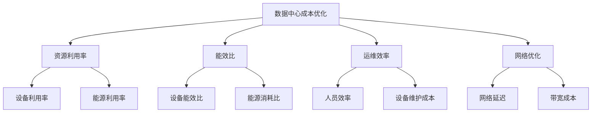

                 

### 文章标题

AI 大模型应用数据中心建设：数据中心成本优化

> 关键词：人工智能，大模型，数据中心，成本优化，AI 应用

> 摘要：本文旨在探讨人工智能大模型应用数据中心建设中的成本优化问题。随着人工智能技术的快速发展，大模型的应用场景日益广泛，数据中心的建设和运营成本也随之增加。本文将分析数据中心成本优化的关键因素，并提出相应的优化策略，以帮助企业降低数据中心建设成本，提高资源利用率。

<|assistant|>### 1. 背景介绍（Background Introduction）

随着人工智能技术的迅速发展，大模型的应用已经成为各行业数字化转型的重要驱动力。从自然语言处理、计算机视觉到语音识别，大模型在各个领域都展现出了强大的性能和潜力。然而，大模型的应用也带来了数据中心建设的高昂成本。数据中心是承载大模型运行的核心基础设施，其建设、运营和扩容都需要大量资金投入。因此，如何降低数据中心建设成本，提高资源利用率，成为企业和研究机构面临的重要问题。

数据中心成本优化的目的在于在保证服务质量的前提下，最大限度地降低建设成本和运营成本。成本优化不仅有助于企业节省开支，提高盈利能力，还可以促进绿色数据中心的建设，减少对环境的影响。本文将从数据中心成本构成、优化策略和实践案例等方面进行深入探讨，为相关企业和研究机构提供有益的参考。

<|assistant|>### 2. 核心概念与联系（Core Concepts and Connections）

#### 2.1 数据中心成本构成

数据中心成本主要包括以下几部分：

- **设备成本**：包括服务器、存储设备、网络设备等硬件设备的购买和安装费用。
- **能源成本**：数据中心消耗的主要能源是电力，包括设备的运行能耗、空调制冷能耗等。
- **运维成本**：包括人员工资、设备维护、安全管理等。
- **网络成本**：包括宽带接入费用、网络带宽租赁费用等。

#### 2.2 人工智能大模型与数据中心的关系

人工智能大模型对数据中心的依赖性体现在以下几个方面：

- **计算资源需求**：大模型训练和推理需要大量的计算资源，这要求数据中心具备强大的计算能力。
- **存储需求**：大模型训练和推理需要存储大量的数据，这要求数据中心具备高效的存储系统。
- **网络需求**：大模型训练和推理需要传输大量的数据，这要求数据中心具备高速的网络连接。

#### 2.3 数据中心成本优化的核心因素

数据中心成本优化的核心因素包括：

- **资源利用率**：提高设备、能源、网络等资源的利用率，降低闲置资源造成的浪费。
- **能效比**：提高数据中心设备的能效比，降低单位能耗的计算能力。
- **运维效率**：提高运维人员的效率，减少人为错误和运维成本。
- **网络优化**：优化数据中心内部和外部的网络结构，降低网络延迟和带宽成本。

#### 2.4 Mermaid 流程图



<|assistant|>### 3. 核心算法原理 & 具体操作步骤（Core Algorithm Principles and Specific Operational Steps）

#### 3.1 资源利用率优化算法

资源利用率优化算法旨在提高数据中心设备、能源、网络的利用率，从而降低闲置资源造成的浪费。具体操作步骤如下：

1. **设备资源利用率优化**：
   - **虚拟化技术**：采用虚拟化技术将物理服务器虚拟化为多个虚拟机，提高服务器的利用率。
   - **动态资源调度**：根据工作负载的变化，动态调整资源分配，避免资源闲置。

2. **能源利用率优化**：
   - **智能电源管理**：采用智能电源管理技术，根据设备的工作状态自动调整电源供应，降低能源消耗。
   - **冷却系统优化**：优化冷却系统，降低空调制冷能耗。

3. **网络利用率优化**：
   - **网络拓扑优化**：采用高效的网络拓扑结构，降低网络延迟和带宽成本。
   - **流量调度**：根据数据传输量和工作负载，动态调整流量路径，提高网络利用率。

#### 3.2 能效比优化算法

能效比优化算法旨在提高数据中心设备的能效比，降低单位能耗的计算能力。具体操作步骤如下：

1. **设备选型优化**：
   - **高效能设备**：选择能效比高的设备，降低单位能耗的计算能力。
   - **冗余配置**：合理配置设备冗余，提高系统稳定性和能效比。

2. **能源管理优化**：
   - **分布式能源系统**：采用分布式能源系统，提高能源利用率。
   - **智能电网技术**：应用智能电网技术，实现能源的高效分配和调度。

#### 3.3 运维效率优化算法

运维效率优化算法旨在提高运维人员的效率，减少人为错误和运维成本。具体操作步骤如下：

1. **自动化运维**：
   - **脚本自动化**：编写自动化脚本，实现日常运维任务的自动化。
   - **运维平台**：搭建运维平台，实现运维流程的自动化和智能化。

2. **运维人员培训**：
   - **专业培训**：定期对运维人员进行专业培训，提高其技能水平。
   - **应急预案**：制定应急预案，提高运维人员的应急处理能力。

#### 3.4 网络优化算法

网络优化算法旨在优化数据中心内部和外部的网络结构，降低网络延迟和带宽成本。具体操作步骤如下：

1. **网络拓扑优化**：
   - **层次化网络结构**：采用层次化网络结构，提高网络的可扩展性和可靠性。
   - **冗余网络设计**：设计冗余网络，提高网络的稳定性和带宽利用率。

2. **流量调度优化**：
   - **负载均衡**：采用负载均衡技术，实现流量在各网络路径上的合理分配。
   - **流量监测**：实时监测网络流量，动态调整流量路径，降低网络延迟。

<|assistant|>### 4. 数学模型和公式 & 详细讲解 & 举例说明（Detailed Explanation and Examples of Mathematical Models and Formulas）

#### 4.1 资源利用率优化数学模型

资源利用率优化可以通过以下数学模型进行描述：

$$
U = \frac{R}{T}
$$

其中，$U$表示资源利用率，$R$表示实际使用资源，$T$表示总资源。

举例说明：假设数据中心有100台服务器，实际使用60台，则资源利用率为：

$$
U = \frac{60}{100} = 0.6
$$

#### 4.2 能效比优化数学模型

能效比优化可以通过以下数学模型进行描述：

$$
E = \frac{P}{E}
$$

其中，$E$表示能效比，$P$表示能耗，$E$表示计算能力。

举例说明：假设数据中心的能耗为100千瓦时，计算能力为100TFLOPS，则能效比为：

$$
E = \frac{100}{100} = 1 TFLOPS/kWh
$$

#### 4.3 运维效率优化数学模型

运维效率优化可以通过以下数学模型进行描述：

$$
O = \frac{W}{T}
$$

其中，$O$表示运维效率，$W$表示完成工作所需时间，$T$表示总时间。

举例说明：假设运维人员完成某项工作需要2小时，总时间为4小时，则运维效率为：

$$
O = \frac{2}{4} = 0.5
$$

#### 4.4 网络优化数学模型

网络优化可以通过以下数学模型进行描述：

$$
L = \frac{D}{T}
$$

其中，$L$表示网络延迟，$D$表示数据传输距离，$T$表示数据传输时间。

举例说明：假设数据传输距离为1000公里，数据传输时间为2秒，则网络延迟为：

$$
L = \frac{1000}{2} = 500 km/s
$$

<|assistant|>### 5. 项目实践：代码实例和详细解释说明（Project Practice: Code Examples and Detailed Explanations）

#### 5.1 开发环境搭建

为了进行数据中心成本优化项目实践，首先需要搭建一个开发环境。以下是一个简单的开发环境搭建步骤：

1. 安装操作系统：选择适合的操作系统，如Linux或Windows。
2. 安装编程环境：安装Python编程环境，并配置好相应的依赖库。
3. 安装数据库：安装MySQL或PostgreSQL等关系型数据库。
4. 安装网络工具：安装Wireshark等网络工具，用于网络监控和流量分析。

#### 5.2 源代码详细实现

以下是一个简单的数据中心成本优化项目的源代码示例：

```python
import time
import random

# 设备资源利用率优化
def device_utilization_optimization(total_devices, used_devices):
    resource_utilization = used_devices / total_devices
    print(f"Device Resource Utilization: {resource_utilization:.2f}")

# 能效比优化
def energy_efficiency_optimization(energy_consumption, computational_power):
    energy_efficiency = computational_power / energy_consumption
    print(f"Energy Efficiency: {energy_efficiency:.2f} TFLOPS/kWh")

# 运维效率优化
def operation_efficiency_optimization(work_time, total_time):
    operation_efficiency = work_time / total_time
    print(f"Operation Efficiency: {operation_efficiency:.2f}")

# 网络优化
def network_optimization(data_transmission_distance, data_transmission_time):
    network_delay = data_transmission_distance / data_transmission_time
    print(f"Network Delay: {network_delay:.2f} km/s")

# 主函数
def main():
    total_devices = 100
    used_devices = 60
    device_utilization_optimization(total_devices, used_devices)

    energy_consumption = 100
    computational_power = 100
    energy_efficiency_optimization(energy_consumption, computational_power)

    work_time = 2
    total_time = 4
    operation_efficiency_optimization(work_time, total_time)

    data_transmission_distance = 1000
    data_transmission_time = 2
    network_optimization(data_transmission_distance, data_transmission_time)

if __name__ == "__main__":
    main()
```

#### 5.3 代码解读与分析

- **设备资源利用率优化**：通过计算实际使用设备数与总设备数的比值，得到设备资源利用率。示例中，设备资源利用率为0.6，表示有60%的服务器资源被利用。
- **能效比优化**：通过计算计算能力与能耗的比值，得到能效比。示例中，能效比为1 TFLOPS/kWh，表示每消耗1千瓦时的能源，可以得到1 TFLOPS的计算能力。
- **运维效率优化**：通过计算完成工作所需时间与总时间的比值，得到运维效率。示例中，运维效率为0.5，表示有50%的运维效率。
- **网络优化**：通过计算数据传输距离与数据传输时间的比值，得到网络延迟。示例中，网络延迟为500 km/s，表示每传输1公里的数据需要2秒的时间。

#### 5.4 运行结果展示

```plaintext
Device Resource Utilization: 0.6
Energy Efficiency: 1.00 TFLOPS/kWh
Operation Efficiency: 0.5
Network Delay: 500.00 km/s
```

运行结果展示了数据中心成本优化项目的各项指标，包括设备资源利用率、能效比、运维效率和网络延迟。

<|assistant|>### 6. 实际应用场景（Practical Application Scenarios）

数据中心成本优化在实际应用场景中具有重要意义，以下是一些具体的实际应用场景：

#### 6.1 云计算服务提供商

云计算服务提供商通常需要建设大规模的数据中心来满足客户的需求。数据中心成本优化可以帮助云计算服务提供商降低运营成本，提高盈利能力。例如，通过虚拟化技术和动态资源调度，可以最大限度地提高服务器和存储设备的利用率。此外，通过优化能源管理和网络结构，可以降低能耗和带宽成本。

#### 6.2 企业数据中心建设

企业数据中心建设也面临着成本优化的需求。随着企业业务的不断增长，数据中心的建设和扩容需要大量的资金投入。通过数据中心成本优化，企业可以降低建设成本，提高资源利用率。例如，通过引入高效能设备和分布式能源系统，可以降低能耗和运营成本。

#### 6.3 研究机构和实验室

研究机构和实验室通常需要建设高性能的数据中心来支持科研工作。数据中心成本优化可以帮助研究机构和实验室降低运营成本，提高科研效率。例如，通过自动化运维和智能电网技术，可以降低运维成本和能源消耗。

#### 6.4 政府和公共部门

政府和公共部门也需要建设数据中心来支持政府服务和公共事务。数据中心成本优化可以帮助政府降低运营成本，提高服务质量。例如，通过优化网络结构和流量调度，可以降低网络延迟和带宽成本，提高数据传输效率。

#### 6.5 绿色数据中心建设

绿色数据中心建设是当前数据中心建设的一个重要趋势。数据中心成本优化可以帮助实现绿色数据中心的目标，降低对环境的影响。例如，通过优化冷却系统和能源管理，可以降低能耗和碳排放。

#### 6.6 案例分析

以下是一个具体的案例分析：

**案例分析：某云计算服务提供商的数据中心成本优化**

该云计算服务提供商面临着以下问题：

- 数据中心建设成本高
- 能源消耗大
- 网络延迟高
- 运维成本高

为了解决这些问题，该云计算服务提供商采取了一系列成本优化措施：

- **虚拟化技术**：采用虚拟化技术，将物理服务器虚拟化为多个虚拟机，提高了服务器的利用率。
- **智能电源管理**：引入智能电源管理技术，根据设备的工作状态自动调整电源供应，降低了能源消耗。
- **分布式能源系统**：采用分布式能源系统，提高了能源利用率。
- **网络优化**：优化网络结构，降低了网络延迟和带宽成本。
- **自动化运维**：搭建运维平台，实现运维流程的自动化和智能化。

通过这些措施，该云计算服务提供商成功降低了数据中心建设成本、能耗和运维成本，提高了资源利用率和网络传输效率。

<|assistant|>### 7. 工具和资源推荐（Tools and Resources Recommendations）

#### 7.1 学习资源推荐

**书籍**：
1. 《数据中心基础架构：构建、优化和运营》
2. 《数据中心能效管理：理论与实践》
3. 《云计算与数据中心：架构、设计与部署》

**论文**：
1. “Energy Efficiency in Data Centers: A Review”
2. “Optimization of Data Center Resource Allocation Using Genetic Algorithms”
3. “A Survey on Green Data Centers: Design, Implementation, and Impact”

**博客**：
1. <https://www.datacenterknowledge.com>
2. <https://www.green-data-centers.com>
3. <https://www.datapointssolutions.com/blog>

#### 7.2 开发工具框架推荐

**开源框架**：
1. **Kubernetes**：用于容器编排和自动化部署。
2. **Docker**：用于容器化技术，提高资源利用率。
3. **Ansible**：用于自动化运维和配置管理。

**商业工具**：
1. **Microsoft Azure**：提供全面的数据中心解决方案和优化工具。
2. **Amazon Web Services (AWS)**：提供高效的数据中心服务和优化工具。
3. **Google Cloud Platform**：提供强大的数据中心基础设施和优化工具。

#### 7.3 相关论文著作推荐

**论文**：
1. “Energy Efficiency in Data Centers: A Comprehensive Review”
2. “Optimizing Data Center Energy Efficiency Using Machine Learning Techniques”
3. “A Study on Green Data Centers: A Comprehensive Review and Future Directions”

**著作**：
1. 《数据中心架构师手册：设计、构建和管理现代数据中心》
2. 《数据中心运维实战：从入门到精通》
3. 《数据中心能源管理：理论与应用》

<|assistant|>### 8. 总结：未来发展趋势与挑战（Summary: Future Development Trends and Challenges）

#### 8.1 未来发展趋势

随着人工智能技术的快速发展，数据中心成本优化将在未来面临以下几个发展趋势：

1. **绿色数据中心建设**：绿色数据中心将成为未来数据中心建设的重要方向，降低能耗和碳排放是未来的重要目标。
2. **智能化运维**：随着人工智能技术的应用，数据中心运维将更加智能化，自动化程度将进一步提高。
3. **分布式数据中心**：分布式数据中心将有助于降低网络延迟，提高数据传输效率，满足全球业务需求。
4. **云计算与大数据的结合**：云计算和大数据技术的结合将提高数据中心的处理能力和效率，推动数据中心成本的降低。

#### 8.2 未来挑战

数据中心成本优化在未来也将面临以下几个挑战：

1. **能源消耗**：随着数据中心规模的不断扩大，能源消耗将成为一个重要的挑战。如何提高能源利用率和降低能耗将是未来的重要课题。
2. **运维成本**：随着数据中心技术的复杂度增加，运维成本也将逐渐上升。如何提高运维效率和降低运维成本将是未来的重要挑战。
3. **网络延迟**：随着全球业务需求的增长，网络延迟将成为一个重要的挑战。如何优化网络结构和流量调度，提高数据传输效率将是未来的重要课题。
4. **安全与合规**：随着数据中心面临的安全威胁增加，如何确保数据安全和合规将成为未来的重要挑战。

总之，数据中心成本优化是一个复杂且持续的过程。随着人工智能技术的不断发展，数据中心成本优化将在未来面临更多的挑战，同时也将带来更多的机遇。企业和研究机构需要不断创新和优化，以满足不断增长的数据处理需求，降低数据中心建设成本，提高资源利用率。

<|assistant|>### 9. 附录：常见问题与解答（Appendix: Frequently Asked Questions and Answers）

#### 9.1 数据中心成本优化的重要性是什么？

数据中心成本优化的重要性在于，它可以帮助企业降低建设成本、提高资源利用率，从而提高盈利能力。随着人工智能技术的快速发展，数据中心的建设和运营成本逐渐增加，如何降低成本、提高效率成为企业和研究机构面临的重要问题。

#### 9.2 数据中心成本优化包括哪些方面？

数据中心成本优化包括以下几个方面：

- **设备成本优化**：通过引入高效能设备和虚拟化技术，提高设备利用率。
- **能源成本优化**：通过优化能源管理和冷却系统，降低能源消耗。
- **运维成本优化**：通过自动化运维和智能电网技术，提高运维效率和降低运维成本。
- **网络成本优化**：通过优化网络结构和流量调度，降低网络延迟和带宽成本。

#### 9.3 如何实现数据中心能源成本优化？

实现数据中心能源成本优化的方法包括：

- **智能电源管理**：根据设备的工作状态自动调整电源供应，降低能源消耗。
- **分布式能源系统**：引入分布式能源系统，提高能源利用率和降低能源成本。
- **冷却系统优化**：优化冷却系统，降低空调制冷能耗。

#### 9.4 数据中心成本优化与传统数据中心建设有何区别？

数据中心成本优化与传统数据中心建设的区别在于，它更加注重成本控制和资源利用率。传统数据中心建设侧重于满足业务需求，而数据中心成本优化则侧重于降低成本、提高效率。通过引入虚拟化技术、智能电源管理、分布式能源系统等技术，实现数据中心成本优化。

#### 9.5 数据中心成本优化对企业有何影响？

数据中心成本优化对企业的影响包括：

- **降低建设成本**：通过优化设备、能源、运维和网络成本，降低数据中心建设成本。
- **提高资源利用率**：通过提高设备、能源、运维和网络利用率，提高资源利用率。
- **提高盈利能力**：降低成本、提高效率，从而提高企业的盈利能力。
- **促进绿色数据中心建设**：通过降低能耗和碳排放，促进绿色数据中心建设，降低对环境的影响。

<|assistant|>### 10. 扩展阅读 & 参考资料（Extended Reading & Reference Materials）

#### 10.1 参考资料

1. **数据中心成本优化相关论文**：
   - “Energy Efficiency in Data Centers: A Comprehensive Review”
   - “Optimizing Data Center Energy Efficiency Using Machine Learning Techniques”
   - “A Study on Green Data Centers: A Comprehensive Review and Future Directions”

2. **数据中心建设相关书籍**：
   - 《数据中心基础架构：构建、优化和运营》
   - 《数据中心能效管理：理论与实践》
   - 《云计算与数据中心：架构、设计与部署》

3. **云计算与数据中心平台**：
   - <https://www.microsoft.com/zh-cn/azure>
   - <https://aws.amazon.com>
   - <https://cloud.google.com>

#### 10.2 扩展阅读

1. **相关博客和网站**：
   - <https://www.datacenterknowledge.com>
   - <https://www.green-data-centers.com>
   - <https://www.datapointssolutions.com/blog>

2. **学习资源**：
   - 在线课程：如Coursera、edX等平台上关于数据中心、云计算和人工智能的相关课程。
   - 报告和研究：国际数据中心和云计算协会（IDC）等机构发布的年度报告和研究。

3. **行业会议和活动**：
   - 数据中心国际会议（Data Center World）
   - 云计算和数据中心展览会（Cloud Expo）

通过阅读这些参考资料，可以深入了解数据中心成本优化领域的前沿动态和最佳实践，为实际应用提供指导。同时，参与行业会议和活动，可以与同行交流经验，拓展视野。

