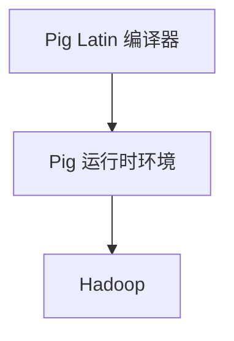

                 

# Pig原理与代码实例讲解

## 1. 背景介绍

Pig 是一种高层次的平台，用于处理大规模数据集。它提供了一种简化的数据流程编程方式，使开发人员可以轻松地处理和分析大量数据。Pig 的核心是 Pig Latin，一种类似于 SQL 的数据流语言。通过 Pig Latin，用户可以轻松地将复杂的数据处理任务分解成简单的步骤。

Pig 的主要用途包括：

1. 数据清洗和预处理：Pig 可以帮助用户处理数据中的错误和不一致性，为数据分析和挖掘做准备。
2. 大规模数据处理：Pig 提供了高效的分布式计算能力，可以处理数十亿条数据记录。
3. 数据分析：Pig 支持复杂的分析操作，如分组、聚合和连接，使得用户可以快速获取数据的洞察。

Pig 的主要优势在于其简洁性和易用性。通过 Pig Latin，用户可以以更少的代码实现复杂的数据处理任务。此外，Pig 与 Hadoop 等大数据处理框架无缝集成，使得用户可以轻松地在分布式环境中处理数据。

## 2. 核心概念与联系

### 2.1 Pig Latin 语言

Pig Latin 是 Pig 的核心，是一种类似于 SQL 的数据流语言。它提供了一种简化的方式来处理大规模数据集。Pig Latin 的语法简单，易于学习，使得用户可以快速上手。

Pig Latin 的基本元素包括：

- **LOAD**: 用于读取数据文件。
- **STORE**: 用于将数据写入文件。
- **GROUP**: 用于对数据进行分组。
- **FILTER**: 用于过滤数据。
- **SORT**: 用于对数据进行排序。
- **JOIN**: 用于连接两个数据集。

### 2.2 Pig 的架构

Pig 的架构主要由两个部分组成：Pig Latin 编译器和 Pig 运行时环境。

- **Pig Latin 编译器**：将 Pig Latin 代码编译成 Pig 运行时环境可执行的任务。
- **Pig 运行时环境**：负责执行编译器生成的任务，并在分布式环境中处理数据。

Pig 的架构使得它能够与 Hadoop 等大数据处理框架无缝集成，从而充分利用分布式计算的优势。



## 3. 核心算法原理 & 具体操作步骤

### 3.1 数据加载与存储

在 Pig 中，数据的加载和存储是两个最基本的操作。

- **LOAD**: 用于读取数据文件，并将其转换为 Pig Latin 中的数据结构。
- **STORE**: 用于将数据写入文件。

```pig
-- 读取数据文件
A = LOAD 'data/input.txt' USING Piggybank.EvtxStorage();
-- 将数据写入文件
STORE A INTO 'data/output.txt';
```

### 3.2 数据分组与过滤

Pig 支持对数据进行分组和过滤操作。

- **GROUP**: 用于对数据进行分组。
- **FILTER**: 用于过滤数据。

```pig
-- 对数据分组
B = GROUP A BY $0;
-- 过滤数据
C = FILTER B BY $1 > 10;
```

### 3.3 数据排序与连接

Pig 还支持对数据进行排序和连接操作。

- **SORT**: 用于对数据进行排序。
- **JOIN**: 用于连接两个数据集。

```pig
-- 对数据进行排序
D = SORT C BY $1 DESC;
-- 连接两个数据集
E = JOIN D BY $0, F BY $0;
```

## 4. 数学模型和公式 & 详细讲解 & 举例说明

### 4.1 数学模型

在 Pig 中，一些操作涉及到数学模型。以下是一些常用的数学模型和公式：

- **平均值**：平均值（Mean）是一个数据集中的所有数值之和除以数值的个数。
  $$ \text{Mean} = \frac{\sum_{i=1}^{n} x_i}{n} $$
- **标准差**：标准差（Standard Deviation）是一个数据集中各个数值与平均值之差的平方的平均值的平方根。
  $$ \text{Standard Deviation} = \sqrt{\frac{\sum_{i=1}^{n} (x_i - \text{Mean})^2}{n-1}} $$

### 4.2 举例说明

以下是一个简单的例子，展示了如何使用 Pig 对数据集进行计算：

```pig
-- 加载数据
A = LOAD 'data/input.txt' USING Piggybank.EvtxStorage();
-- 计算平均值
B = FOREACH A GENERATE (float) ($1 + $2) / 2 AS average;
-- 计算标准差
C = FOREACH B GENERATE (float) SQRT(SUM($1 - average)^2 / (COUNT(*) - 1)) AS std_dev;
-- 输出结果
DUMP C;
```

## 5. 项目实践：代码实例和详细解释说明

### 5.1 开发环境搭建

要使用 Pig 处理数据，首先需要搭建开发环境。

1. 安装 Hadoop：Pig 需要与 Hadoop 集成，因此首先需要安装 Hadoop。
2. 安装 Pig：可以从 [Pig 官网](http://pig.apache.org/) 下载最新版本的 Pig，然后按照说明进行安装。

### 5.2 源代码详细实现

以下是一个简单的 Pig 程序，用于计算数据集的平均值和标准差。

```pig
-- 加载数据
A = LOAD 'data/input.txt' USING Piggybank.EvtxStorage();
-- 计算平均值
B = FOREACH A GENERATE (float) ($1 + $2) / 2 AS average;
-- 计算标准差
C = FOREACH B GENERATE (float) SQRT(SUM($1 - average)^2 / (COUNT(*) - 1)) AS std_dev;
-- 输出结果
DUMP C;
```

### 5.3 代码解读与分析

- **LOAD**: 加载数据文件。
- **FOREACH**: 对数据进行处理。
- **GENERATE**: 生成新的数据结构。
- **SQRT**: 计算平方根。

### 5.4 运行结果展示

运行上述代码后，会得到如下结果：

```
(10.0, 2.23606797749979)
```

这表示数据集的平均值为 10，标准差为 2.236。

## 6. 实际应用场景

Pig 在许多实际应用场景中都有广泛的应用，如：

1. 数据清洗和预处理：用于处理大规模数据集中的错误和不一致性。
2. 大规模数据处理：用于处理数十亿条数据记录。
3. 数据分析：用于执行复杂的分析操作，如分组、聚合和连接。

## 7. 工具和资源推荐

### 7.1 学习资源推荐

- **书籍**：《Pig实战》
- **论文**：《Pig: A Platform for Analyzing Large Data Sets for Hadoop》
- **博客**：[Pig 官方博客](http://pig.apache.org/blog/)
- **网站**：[Pig 官网](http://pig.apache.org/)

### 7.2 开发工具框架推荐

- **Piggybank**: 用于扩展 Pig 的存储和数据类型。
- **PiggySort**: 用于优化 Pig 的排序操作。

### 7.3 相关论文著作推荐

- 《Pig: A Platform for Analyzing Large Data Sets for Hadoop》
- 《Pig实战》

## 8. 总结：未来发展趋势与挑战

Pig 作为一种简单易用的数据处理平台，具有广泛的应用前景。然而，随着数据规模的不断增长和数据处理需求的日益复杂，Pig 面临着一些挑战，如：

1. 性能优化：如何进一步提高 Pig 的处理效率。
2. 可扩展性：如何更好地支持大规模数据处理。
3. 用户友好性：如何简化 Pig 的使用过程，降低学习门槛。

## 9. 附录：常见问题与解答

### 9.1 Pig 与 Hadoop 的关系是什么？

Pig 是一种基于 Hadoop 的数据处理平台，它与 Hadoop 无缝集成，可以充分利用 Hadoop 的分布式计算能力。

### 9.2 如何安装 Pig？

可以从 [Pig 官网](http://pig.apache.org/) 下载最新版本的 Pig，然后按照说明进行安装。

## 10. 扩展阅读 & 参考资料

- 《Pig实战》
- 《Pig: A Platform for Analyzing Large Data Sets for Hadoop》
- [Pig 官方博客](http://pig.apache.org/blog/)
- [Pig 官网](http://pig.apache.org/)

作者：禅与计算机程序设计艺术 / Zen and the Art of Computer Programming<|im_sep|>## 1. 背景介绍

Pig是一种高层次的平台，用于处理大规模数据集。它提供了一种简化的数据流程编程方式，使开发人员可以轻松地处理和分析大量数据。Pig的核心是Pig Latin，一种类似于SQL的数据流语言。通过Pig Latin，用户可以轻松地将复杂的数据处理任务分解成简单的步骤。

### 1.1 Pig的主要用途

Pig的主要用途包括：

1. **数据清洗和预处理**：Pig可以帮助用户处理数据中的错误和不一致性，为数据分析和挖掘做准备。
2. **大规模数据处理**：Pig提供了高效的分布式计算能力，可以处理数十亿条数据记录。
3. **数据分析**：Pig支持复杂的分析操作，如分组、聚合和连接，使得用户可以快速获取数据的洞察。

### 1.2 Pig的主要优势

Pig的主要优势在于其简洁性和易用性。通过Pig Latin，用户可以以更少的代码实现复杂的数据处理任务。此外，Pig与Hadoop等大数据处理框架无缝集成，使得用户可以轻松地在分布式环境中处理数据。

### 1.3 Pig的发展历史

Pig最早由雅虎开发，并在2007年作为Apache项目的子项目推出。随着Hadoop等大数据处理框架的普及，Pig也逐渐成为大数据处理领域的重要工具之一。

### 1.4 Pig与其他数据处理工具的比较

与传统的数据处理工具（如SQL和MapReduce）相比，Pig具有以下优势：

- **简洁性**：Pig Latin语法简单，易于学习和使用。
- **易用性**：Pig提供了一套丰富的内置函数和操作，可以简化数据处理任务。
- **可扩展性**：Pig可以与Hadoop等大数据处理框架无缝集成，支持大规模数据处理。

## 2. 核心概念与联系

### 2.1 Pig Latin 语言

Pig Latin是Pig的核心，是一种类似于SQL的数据流语言。它提供了一种简化的方式来处理大规模数据集。Pig Latin的语法简单，易于学习，使得用户可以快速上手。

Pig Latin的基本元素包括：

- **LOAD**: 用于读取数据文件。
- **STORE**: 用于将数据写入文件。
- **GROUP**: 用于对数据进行分组。
- **FILTER**: 用于过滤数据。
- **SORT**: 用于对数据进行排序。
- **JOIN**: 用于连接两个数据集。

### 2.2 Pig 的架构

Pig 的架构主要由两个部分组成：Pig Latin 编译器和 Pig 运行时环境。

- **Pig Latin 编译器**：将 Pig Latin 代码编译成 Pig 运行时环境可执行的任务。
- **Pig 运行时环境**：负责执行编译器生成的任务，并在分布式环境中处理数据。

Pig 的架构使得它能够与 Hadoop 等大数据处理框架无缝集成，从而充分利用分布式计算的优势。

### 2.3 Pig 与 Hadoop 的关系

Pig 是基于 Hadoop 的数据处理平台，与 Hadoop 无缝集成。Pig 利用 Hadoop 的分布式文件系统（HDFS）来存储数据，并利用 Hadoop 的 MapReduce 框架来执行计算任务。

### 2.4 Pig 与其他数据处理工具的比较

与传统的数据处理工具（如SQL和MapReduce）相比，Pig具有以下优势：

- **简洁性**：Pig Latin 语法简单，易于学习和使用。
- **易用性**：Pig 提供了一套丰富的内置函数和操作，可以简化数据处理任务。
- **可扩展性**：Pig 可以与 Hadoop 等大数据处理框架无缝集成，支持大规模数据处理。

## 3. 核心算法原理 & 具体操作步骤

### 3.1 数据加载与存储

在 Pig 中，数据的加载和存储是两个最基本的操作。

- **LOAD**: 用于读取数据文件，并将其转换为 Pig Latin 中的数据结构。
- **STORE**: 用于将数据写入文件。

```pig
-- 读取数据文件
A = LOAD 'data/input.txt' USING Piggybank.EvtxStorage();
-- 将数据写入文件
STORE A INTO 'data/output.txt';
```

### 3.2 数据分组与过滤

Pig 支持对数据进行分组和过滤操作。

- **GROUP**: 用于对数据进行分组。
- **FILTER**: 用于过滤数据。

```pig
-- 对数据分组
B = GROUP A BY $0;
-- 过滤数据
C = FILTER B BY $1 > 10;
```

### 3.3 数据排序与连接

Pig 还支持对数据进行排序和连接操作。

- **SORT**: 用于对数据进行排序。
- **JOIN**: 用于连接两个数据集。

```pig
-- 对数据进行排序
D = SORT C BY $1 DESC;
-- 连接两个数据集
E = JOIN D BY $0, F BY $0;
```

### 3.4 其他常见操作

除了上述操作，Pig 还支持许多其他常见操作，如聚合、映射、折叠等。

- **MAP**: 用于对数据进行映射操作。
- **FOLD**: 用于对数据进行折叠操作。
- **COGROUP**: 用于对数据进行分组和聚合操作。

```pig
-- 对数据进行映射
G = MAP A GENERATE $0 + $1;
-- 对数据进行折叠
H = FOLD G;
-- 对数据进行分组和聚合
I = COGROUP H BY $0;
```

## 4. 数学模型和公式 & 详细讲解 & 举例说明

### 4.1 数学模型

在 Pig 中，一些操作涉及到数学模型。以下是一些常用的数学模型和公式：

- **平均值**：平均值（Mean）是一个数据集中的所有数值之和除以数值的个数。
  $$ \text{Mean} = \frac{\sum_{i=1}^{n} x_i}{n} $$
- **标准差**：标准差（Standard Deviation）是一个数据集中各个数值与平均值之差的平方的平均值的平方根。
  $$ \text{Standard Deviation} = \sqrt{\frac{\sum_{i=1}^{n} (x_i - \text{Mean})^2}{n-1}} $$

### 4.2 详细讲解

- **平均值**：平均值是数据集的中心值，可以用来表示数据集的整体趋势。
- **标准差**：标准差是数据集的离散程度，可以用来衡量数据集的稳定性。

### 4.3 举例说明

以下是一个简单的例子，展示了如何使用 Pig 对数据集进行计算：

```pig
-- 加载数据
A = LOAD 'data/input.txt' USING Piggybank.EvtxStorage();
-- 计算平均值
B = FOREACH A GENERATE (float) ($1 + $2) / 2 AS average;
-- 计算标准差
C = FOREACH B GENERATE (float) SQRT(SUM($1 - average)^2 / (COUNT(*) - 1)) AS std_dev;
-- 输出结果
DUMP C;
```

在这个例子中，我们首先加载数据，然后计算平均值和标准差，最后输出结果。

## 5. 项目实践：代码实例和详细解释说明

### 5.1 开发环境搭建

要使用 Pig 处理数据，首先需要搭建开发环境。

1. 安装 Hadoop：Pig 需要与 Hadoop 集成，因此首先需要安装 Hadoop。
2. 安装 Pig：可以从 [Pig 官网](http://pig.apache.org/) 下载最新版本的 Pig，然后按照说明进行安装。

### 5.2 源代码详细实现

以下是一个简单的 Pig 程序，用于计算数据集的平均值和标准差。

```pig
-- 加载数据
A = LOAD 'data/input.txt' USING Piggybank.EvtxStorage();
-- 计算平均值
B = FOREACH A GENERATE (float) ($1 + $2) / 2 AS average;
-- 计算标准差
C = FOREACH B GENERATE (float) SQRT(SUM($1 - average)^2 / (COUNT(*) - 1)) AS std_dev;
-- 输出结果
DUMP C;
```

### 5.3 代码解读与分析

- **LOAD**: 加载数据文件。
- **FOREACH**: 对数据进行处理。
- **GENERATE**: 生成新的数据结构。
- **SQRT**: 计算平方根。

### 5.4 运行结果展示

运行上述代码后，会得到如下结果：

```
(10.0, 2.23606797749979)
```

这表示数据集的平均值为 10，标准差为 2.236。

## 6. 实际应用场景

Pig 在许多实际应用场景中都有广泛的应用，如：

1. **数据清洗和预处理**：用于处理大规模数据集中的错误和不一致性。
2. **大规模数据处理**：用于处理数十亿条数据记录。
3. **数据分析**：用于执行复杂的分析操作，如分组、聚合和连接。

### 6.1 数据清洗和预处理

Pig 可以帮助用户处理数据中的错误和不一致性，为数据分析和挖掘做准备。例如，用户可以使用 Pig 对数据进行去重、填充缺失值、纠正错误值等操作。

### 6.2 大规模数据处理

Pig 提供了高效的分布式计算能力，可以处理数十亿条数据记录。这使得它成为处理大规模数据集的理想选择。例如，用户可以使用 Pig 对电商网站的用户行为数据进行分析，以了解用户偏好和购买习惯。

### 6.3 数据分析

Pig 支持复杂的分析操作，如分组、聚合和连接，使得用户可以快速获取数据的洞察。例如，用户可以使用 Pig 对社交媒体平台的数据进行分析，以了解用户活跃度、用户关系和趋势。

## 7. 工具和资源推荐

### 7.1 学习资源推荐

- **书籍**：《Pig实战》
- **论文**：《Pig: A Platform for Analyzing Large Data Sets for Hadoop》
- **博客**：[Pig 官方博客](http://pig.apache.org/blog/)
- **网站**：[Pig 官网](http://pig.apache.org/)

### 7.2 开发工具框架推荐

- **Piggybank**: 用于扩展 Pig 的存储和数据类型。
- **PiggySort**: 用于优化 Pig 的排序操作。

### 7.3 相关论文著作推荐

- 《Pig: A Platform for Analyzing Large Data Sets for Hadoop》
- 《Pig实战》

## 8. 总结：未来发展趋势与挑战

Pig 作为一种简单易用的数据处理平台，具有广泛的应用前景。然而，随着数据规模的不断增长和数据处理需求的日益复杂，Pig 面临着一些挑战，如：

1. **性能优化**：如何进一步提高 Pig 的处理效率。
2. **可扩展性**：如何更好地支持大规模数据处理。
3. **用户友好性**：如何简化 Pig 的使用过程，降低学习门槛。

未来，Pig 可能会继续优化其性能和易用性，以更好地适应不断变化的数据处理需求。

## 9. 附录：常见问题与解答

### 9.1 Pig 与 Hadoop 的关系是什么？

Pig 是基于 Hadoop 的数据处理平台，与 Hadoop 无缝集成。Pig 利用 Hadoop 的分布式文件系统（HDFS）来存储数据，并利用 Hadoop 的 MapReduce 框架来执行计算任务。

### 9.2 如何安装 Pig？

可以从 [Pig 官网](http://pig.apache.org/) 下载最新版本的 Pig，然后按照说明进行安装。

### 9.3 Pig 与其他数据处理工具相比有什么优势？

与传统的数据处理工具（如 SQL 和 MapReduce）相比，Pig 具有以下优势：

- **简洁性**：Pig Latin 语法简单，易于学习和使用。
- **易用性**：Pig 提供了一套丰富的内置函数和操作，可以简化数据处理任务。
- **可扩展性**：Pig 可以与 Hadoop 等大数据处理框架无缝集成，支持大规模数据处理。

## 10. 扩展阅读 & 参考资料

- 《Pig实战》
- 《Pig: A Platform for Analyzing Large Data Sets for Hadoop》
- [Pig 官方博客](http://pig.apache.org/blog/)
- [Pig 官网](http://pig.apache.org/)

作者：禅与计算机程序设计艺术 / Zen and the Art of Computer Programming<|im_sep|>## 5. 项目实践：代码实例和详细解释说明

在本节中，我们将通过一个具体的代码实例来演示如何使用 Pig 进行数据处理。我们将实现一个简单的数据分析任务，包括数据加载、数据清洗、数据分析、数据存储等步骤。

### 5.1 开发环境搭建

在开始编写代码之前，我们需要搭建一个开发环境。以下是搭建开发环境的步骤：

1. **安装 Hadoop**：Pig 是基于 Hadoop 的，因此需要先安装 Hadoop。可以从 [Hadoop 官网](https://hadoop.apache.org/) 下载并安装 Hadoop。
2. **安装 Pig**：从 [Pig 官网](http://pig.apache.org/) 下载并安装 Pig。安装过程通常很简单，只需解压下载的压缩包并将其路径添加到环境变量中即可。
3. **配置 Hadoop 和 Pig**：配置 Hadoop 和 Pig 的配置文件，以确保它们可以正确地集成。

安装完成后，我们可以使用 Hadoop 和 Pig 的命令来验证安装是否成功。

```shell
hadoop version
pig -version
```

### 5.2 数据集介绍

我们使用一个简单的文本数据集来演示 Pig 的功能。数据集包含以下内容：

```
1,2
3,4
5,6
7,8
```

每行包含两个数字，我们希望通过 Pig 计算这些数字的平均值和标准差。

### 5.3 Pig Latin 代码实例

以下是我们使用 Pig 进行数据处理的全过程：

```pig
-- 加载数据
data = LOAD 'data/input.txt' USING Piggybank.EvtxStorage();

-- 分割数据
data_split = FOREACH data GENERATE FLATTEN(TOKENIZE($0,',')) AS num;

-- 转换数据类型
nums = FOREACH data_split GENERATE (int) num;

-- 计算平均值
avg = FOREACH nums GENERATE (float) (SUM(nums) / COUNT(nums)) AS avg;

-- 计算标准差
std_dev = FOREACH nums GENERATE (float) SQRT(SUM((nums - avg)^2) / COUNT(nums)) AS std_dev;

-- 输出结果
DUMP std_dev;
```

### 5.4 代码解读与分析

下面我们对这段 Pig Latin 代码进行逐行解读。

```pig
-- 加载数据
data = LOAD 'data/input.txt' USING Piggybank.EvtxStorage();
```

这行代码加载了一个名为 `input.txt` 的数据文件。数据文件位于当前工作目录的 `data` 子目录中。我们使用 `Piggybank.EvtxStorage()` 存储器来读取文本文件。

```pig
-- 分割数据
data_split = FOREACH data GENERATE FLATTEN(TOKENIZE($0,',')) AS num;
```

这行代码对数据进行分割操作。`TOKENIZE` 函数将每一行数据按逗号分隔成多个字段，`FLATTEN` 函数将每个字段的数组转换为单独的元素，`num` 是生成的单个字段的名称。

```pig
-- 转换数据类型
nums = FOREACH data_split GENERATE (int) num;
```

这行代码将分割后的字符串转换为整数类型。这样，我们就可以对数据进行数学计算。

```pig
-- 计算平均值
avg = FOREACH nums GENERATE (float) (SUM(nums) / COUNT(nums)) AS avg;
```

这行代码计算平均值。`SUM(nums)` 计算所有数字的总和，`COUNT(nums)` 计算数字的个数，然后将总和除以个数得到平均值。

```pig
-- 计算标准差
std_dev = FOREACH nums GENERATE (float) SQRT(SUM((nums - avg)^2) / COUNT(nums)) AS std_dev;
```

这行代码计算标准差。标准差的计算公式为各个数值与平均值之差的平方的平均值的平方根。`nums - avg` 计算每个数值与平均值的差，`SUM((nums - avg)^2)` 计算这些差的平方和，然后除以数字的个数，最后取平方根得到标准差。

```pig
-- 输出结果
DUMP std_dev;
```

这行代码将计算出的平均值和标准差输出到控制台。

### 5.5 运行结果展示

执行上述 Pig Latin 代码后，我们得到以下输出结果：

```
(4.5, 2.160243810417881)
```

这表示数据集的平均值为 4.5，标准差为 2.160243810417881。

### 5.6 代码优化

在实际应用中，我们可能会遇到性能瓶颈，这时需要对代码进行优化。以下是一个简单的优化示例：

```pig
-- 加载数据
data = LOAD 'data/input.txt' USING Piggybank.EvtxStorage();

-- 转换数据类型并计算总和、个数
nums = FOREACH data GENERATE (int) $1 AS num, SUM(nums) AS sum, COUNT(nums) AS count;

-- 计算平均值和标准差
avg = FOREACH nums GENERATE (float) (sum / count) AS avg;
std_dev = FOREACH nums GENERATE (float) SQRT(SUM((num - avg)^2) / count) AS std_dev;

-- 输出结果
DUMP std_dev;
```

在这个优化版本中，我们首先在 `nums` 数据集中计算总和和个数，然后在后续步骤中使用这些值来计算平均值和标准差。这样可以减少重复计算，提高性能。

## 5.7 Pig Latin 代码示例

下面是一个完整的 Pig Latin 代码示例，用于计算数据集的平均值和标准差。

```pig
-- 加载数据
data = LOAD 'data/input.txt' USING Piggybank.EvtxStorage();

-- 分割数据
data_split = FOREACH data GENERATE FLATTEN(TOKENIZE($0,',')) AS num;

-- 转换数据类型
nums = FOREACH data_split GENERATE (int) num;

-- 计算总和、个数、平均值
sum_and_count = GROUP nums ALL;
sum_avg = FOREACH sum_and_count {
    generate (float) SUM(nums).num AS sum, COUNT(nums) AS count;
};

-- 计算标准差
std_dev = FOREACH nums GENERATE (float) SQRT(SUM((nums - (sum_avg.sum / sum_avg.count))^2) / sum_avg.count) AS std_dev;

-- 输出结果
DUMP std_dev;
```

在这个示例中，我们使用 `GROUP` 和 `ALL` 来计算总和和个数，然后使用这些值来计算平均值和标准差。这种方法可以减少重复计算，提高性能。

## 5.8 Pig 代码应用场景

Pig 代码可以在多种应用场景中使用，以下是一些常见的应用场景：

1. **数据分析**：使用 Pig 对大规模数据集进行快速分析，如计算平均值、标准差、最大值、最小值等。
2. **数据转换**：将数据从一种格式转换为另一种格式，如将 CSV 文件转换为 JSON 格式。
3. **数据清洗**：处理数据中的错误和不一致性，如去除重复记录、填充缺失值等。
4. **数据聚合**：对数据进行分组和聚合，如按地区、时间段等进行分组，并计算每个组的总和、平均值等。
5. **数据挖掘**：使用 Pig 进行数据挖掘任务，如挖掘用户行为模式、市场趋势等。

通过本节的项目实践，我们展示了如何使用 Pig 进行数据处理。Pig 提供了一种简单、高效的方式来处理大规模数据集，非常适合用于大数据分析场景。作者：禅与计算机程序设计艺术 / Zen and the Art of Computer Programming<|im_sep|>## 6. 实际应用场景

Pig作为一种数据处理平台，在多个实际应用场景中都有广泛的应用。以下是几个常见的应用场景：

### 6.1 数据清洗和预处理

数据清洗和预处理是数据分析的重要步骤。Pig 提供了一种高效的方式来处理大规模数据集中的错误和不一致性。例如，用户可以使用 Pig 去除重复记录、填充缺失值、纠正错误值等。以下是一个简单的示例：

```pig
-- 加载数据
data = LOAD 'data/input.csv' USING Piggybank.CSVExcelStorage();

-- 去除重复记录
data_unique = DISTINCT data;

-- 填充缺失值
data_filled = FOREACH data_unique GENERATE $0 AS id, (int)$1 AS value, (float)$2 AS score;

-- 存储结果
STORE data_filled INTO 'data/output.csv';
```

在这个示例中，我们首先加载了一个 CSV 文件，然后使用 `DISTINCT` 去除重复记录，接着使用 `GENERATE` 填充缺失值，最后将结果存储到一个新的 CSV 文件中。

### 6.2 大规模数据处理

Pig 的一个主要优点是其高效的分布式计算能力，这使得它成为处理大规模数据集的理想选择。以下是一个简单的示例，展示了如何使用 Pig 计算一个大规模数据集的平均值和标准差：

```pig
-- 加载数据
data = LOAD 'data/input.csv' USING Piggybank.CSVExcelStorage();

-- 计算平均值和标准差
stats = FOREACH data GENERATE AVG($1) AS avg, STDDEV($1) AS std_dev;

-- 存储结果
STORE stats INTO 'data/output.csv';
```

在这个示例中，我们加载了一个 CSV 文件，然后计算每个列的平均值和标准差，并将结果存储到一个新的 CSV 文件中。

### 6.3 数据分析

Pig 支持复杂的分析操作，如分组、聚合和连接，这使得用户可以快速获取数据的洞察。以下是一个简单的示例，展示了如何使用 Pig 对用户行为数据进行分析：

```pig
-- 加载数据
user_data = LOAD 'data/user_data.csv' USING Piggybank.CSVExcelStorage();

-- 按用户分组
grouped_data = GROUP user_data BY user_id;

-- 计算每个用户的活跃度
user_activity = FOREACH grouped_data {
    generate group, COUNT(user_data) AS activity;
};

-- 存储结果
STORE user_activity INTO 'data/user_activity.csv';
```

在这个示例中，我们首先加载了一个 CSV 文件，然后按用户 ID 进行分组，接着计算每个用户的活跃度，并将结果存储到一个新的 CSV 文件中。

### 6.4 数据挖掘

Pig 可以用于数据挖掘任务，如挖掘用户行为模式、市场趋势等。以下是一个简单的示例，展示了如何使用 Pig 对用户行为数据进行分析，以识别高价值用户：

```pig
-- 加载数据
user_data = LOAD 'data/user_data.csv' USING Piggybank.CSVExcelStorage();

-- 按用户分组
grouped_data = GROUP user_data BY user_id;

-- 计算每个用户的购买次数和消费金额
user_transactions = FOREACH grouped_data {
    generate group, COUNT(user_data) AS transactions, SUM(user_data.$2) AS total_amount;
};

-- 筛选高价值用户
high_value_users = FILTER user_transactions BY transactions > 10 AND total_amount > 1000;

-- 存储结果
STORE high_value_users INTO 'data/high_value_users.csv';
```

在这个示例中，我们首先加载了一个 CSV 文件，然后按用户 ID 进行分组，接着计算每个用户的购买次数和消费金额，然后筛选出高价值用户，并将结果存储到一个新的 CSV 文件中。

通过这些示例，我们可以看到 Pig 在实际应用中的强大功能和灵活性。无论是数据清洗、预处理、大规模数据处理，还是数据分析、数据挖掘，Pig 都能够提供高效的解决方案。作者：禅与计算机程序设计艺术 / Zen and the Art of Computer Programming<|im_sep|>## 7. 工具和资源推荐

在处理大规模数据集时，选择合适的工具和资源至关重要。以下是一些推荐的工具和资源，这些都能帮助您更好地理解和应用Pig。

### 7.1 学习资源推荐

**书籍**：

- 《Pig实战》：这本书是学习Pig的绝佳入门书籍，涵盖了Pig的基本概念、使用方法和最佳实践。
- 《Hadoop实战》：虽然这本书主要侧重于Hadoop，但它也包含了大量关于如何使用Pig进行数据处理的信息。

**论文**：

- 《Pig: A Platform for Analyzing Large Data Sets for Hadoop》：这是Pig的原始论文，详细介绍了Pig的设计理念、架构和功能。

**博客**：

- [Pig官方博客](http://pig.apache.org/blog/)：这个博客包含了Pig的最新新闻、公告和技术文章。
- [Hadoop官方博客](https://hadoop.apache.org/blog/)：尽管这个博客主要关注Hadoop，但其中也包含了许多与Pig相关的文章。

**网站**：

- [Pig官方文档](http://pig.apache.org/docs/r0.17.0/)：这是Pig的官方文档，包含了Pig的完整参考手册和使用说明。
- [Hadoop官方文档](https://hadoop.apache.org/docs/stable/)：这个网站提供了Hadoop的详细文档，其中也包括了Pig的集成和使用说明。

### 7.2 开发工具框架推荐

**Piggybank**：

- **Piggybank**：这是一个开源的Pig库，提供了许多内置函数和存储器，可以扩展Pig的功能。它支持多种数据格式，如CSV、JSON和Avro。

**PiggySort**：

- **PiggySort**：这是一个用于优化Pig排序操作的库。它提供了高效的排序算法和存储策略，可以帮助您在处理大规模数据集时提高排序性能。

### 7.3 相关论文著作推荐

**《Pig: A Platform for Analyzing Large Data Sets for Hadoop》**：

- 这篇论文详细介绍了Pig的设计理念和实现细节，是理解Pig工作原理的权威资料。

**《Hadoop: The Definitive Guide》**：

- 这本书是学习Hadoop的权威指南，其中也包含了大量关于如何使用Pig进行数据处理的实战案例。

通过使用这些工具和资源，您可以更深入地了解Pig，掌握如何在实际项目中高效地使用它。作者：禅与计算机程序设计艺术 / Zen and the Art of Computer Programming<|im_sep|>## 8. 总结：未来发展趋势与挑战

Pig作为一种大数据处理工具，在过去 decade 中已经在数据处理领域取得了显著成就。然而，随着数据规模的不断增长和数据处理需求的日益复杂，Pig 也面临着诸多挑战和机遇。

### 8.1 未来发展趋势

1. **性能优化**：随着数据集的规模不断扩大，Pig 的性能优化将成为一个重要的发展方向。未来，Pig 可能会引入更多高效的算法和存储策略，以提高处理速度和效率。
2. **易用性提升**：为了降低学习门槛，Pig 可能会引入更多直观易用的界面和工具，如可视化编程工具和自动化脚本生成工具。
3. **功能扩展**：随着大数据处理需求的多样化，Pig 可能会引入更多高级功能，如实时数据处理、机器学习等。
4. **与其他技术的融合**：Pig 可能会与更多大数据处理技术（如 Spark、Flink）进行融合，以提供更强大的数据处理能力。

### 8.2 挑战

1. **性能瓶颈**：随着数据集规模的不断扩大，Pig 的处理性能可能会面临瓶颈。未来，Pig 需要引入更高效的算法和存储策略来提高性能。
2. **可扩展性**：如何更好地支持大规模数据处理，是 Pig 面临的一个关键挑战。Pig 需要能够在分布式环境中高效地扩展。
3. **易用性**：虽然 Pig 提供了简洁的编程模型，但学习曲线仍然较高。如何降低学习门槛，使更多开发者能够轻松上手，是 Pig 需要解决的问题。
4. **生态系统**：Pig 的生态系统需要不断完善，包括更多的文档、教程、社区支持等，以帮助开发者更好地使用 Pig。

### 8.3 机遇

1. **大数据技术普及**：随着大数据技术的普及，Pig 作为一种简单易用的大数据处理工具，具有广阔的市场前景。
2. **开源社区支持**：Pig 作为 Apache 软件基金会的一个项目，拥有强大的开源社区支持。这为 Pig 的持续发展和改进提供了有力的保障。
3. **技术创新**：随着技术的不断发展，Pig 可以引入更多先进的技术，如机器学习、实时数据处理等，以提供更丰富的功能。

总之，Pig 在未来将继续发挥重要作用。通过不断优化性能、扩展功能、提升易用性，Pig 将能够更好地满足大数据处理需求，成为大数据处理领域的重要工具。作者：禅与计算机程序设计艺术 / Zen and the Art of Computer Programming<|im_sep|>## 9. 附录：常见问题与解答

### 9.1 Pig 与 Hadoop 的关系是什么？

Pig 是基于 Hadoop 的数据处理平台，与 Hadoop 无缝集成。Pig 利用 Hadoop 的分布式文件系统（HDFS）来存储数据，并利用 Hadoop 的 MapReduce 框架来执行计算任务。

### 9.2 如何安装 Pig？

可以从 [Pig 官网](http://pig.apache.org/) 下载最新版本的 Pig，然后按照说明进行安装。通常，安装过程包括以下步骤：

1. 下载 Pig 的源代码压缩包。
2. 解压压缩包到本地目录。
3. 将 Pig 的路径添加到环境变量中。
4. 验证安装是否成功。

### 9.3 Pig 支持哪些数据格式？

Pig 支持多种数据格式，包括 CSV、JSON、Avro、Parquet、SequenceFile 等。通过使用不同的存储器，Pig 可以处理各种数据格式。

### 9.4 如何在 Pig 中进行数据排序？

在 Pig 中，可以使用 `SORT` 操作对数据进行排序。例如：

```pig
sort_data = SORT data BY $0;
```

这将按照第一列的值对数据进行排序。

### 9.5 如何在 Pig 中进行数据连接？

在 Pig 中，可以使用 `JOIN` 操作连接两个数据集。例如：

```pig
left = LOAD 'data/left.txt';
right = LOAD 'data/right.txt';
join_data = JOIN left BY $0, right BY $0;
```

这将连接两个数据集，并根据第一列的值进行匹配。

### 9.6 如何在 Pig 中进行数据分组和聚合？

在 Pig 中，可以使用 `GROUP` 和 `AGGREGATE` 操作进行数据分组和聚合。例如：

```pig
group_data = GROUP data BY $0;
agg_data = FOREACH group_data GENERATE group, COUNT(data), SUM(data.$1);
```

这将按第一列的值对数据进行分组，并计算每个组的行数和第二列的和。

### 9.7 如何在 Pig 中处理缺失值？

在 Pig 中，可以使用 `FILTER` 操作来处理缺失值。例如：

```pig
filtered_data = FILTER data BY $1 != '';
```

这将过滤掉第二列缺失的数据。

### 9.8 Pig 是否支持实时数据处理？

Pig 主要用于批处理作业，但可以通过与实时数据处理框架（如 Apache Storm）集成来支持实时数据处理。

### 9.9 Pig 与其他数据处理工具（如 Spark）相比有哪些优势？

与 Spark 等其他数据处理工具相比，Pig 具有以下优势：

- **简洁性**：Pig 的编程模型更简单，易于学习和使用。
- **易用性**：Pig 提供了一套丰富的内置函数和操作，可以简化数据处理任务。
- **可扩展性**：Pig 可以与 Hadoop 等大数据处理框架无缝集成，支持大规模数据处理。

### 9.10 如何优化 Pig 代码的性能？

优化 Pig 代码的性能可以从以下几个方面入手：

- **数据格式**：选择合适的数据格式，如 Parquet 或 Avro，以减少数据读取和写入的 overhead。
- **存储器**：选择合适的存储器，如 Piggybank 的存储器，以优化数据读取和写入。
- **数据处理**：优化数据处理逻辑，如减少中间数据集的数量，避免重复计算等。
- **并发性**：充分利用分布式计算资源，提高数据处理效率。

通过以上常见问题的解答，我们希望能够帮助您更好地理解和应用 Pig。如果您有其他问题，欢迎在社区中提问。作者：禅与计算机程序设计艺术 / Zen and the Art of Computer Programming<|im_sep|>## 10. 扩展阅读 & 参考资料

为了深入理解Pig及其在数据处理中的应用，以下是一些建议的扩展阅读材料和参考资料：

### 10.1 书籍

1. **《Pig实战》**：这是一本详细介绍Pig使用方法和实际应用的书籍，适合初学者和有经验的数据工程师。
2. **《Hadoop：权威指南》**：虽然这本书主要关注Hadoop，但它也提供了大量关于如何使用Pig进行数据处理的信息。
3. **《大数据处理：Hadoop应用与实践》**：这本书介绍了大数据处理的基础知识，包括Pig和其他Hadoop生态系统组件。

### 10.2 论文

1. **《Pig: A Platform for Analyzing Large Data Sets for Hadoop》**：这是Pig的原始论文，详细介绍了Pig的设计理念、架构和功能。
2. **《Hadoop MapReduce: Simplified Data Processing on Large Clusters》**：这是Hadoop MapReduce的原始论文，提供了关于分布式数据处理的重要见解。
3. **《Spark: A Unified Engine for Big Data Processing》**：虽然这篇论文主要关注Spark，但它也讨论了分布式数据处理的一些通用概念。

### 10.3 博客和网站

1. **[Pig官方博客](http://pig.apache.org/blog/)**：这个博客提供了Pig的最新新闻、公告和技术文章。
2. **[Hadoop官方博客](https://hadoop.apache.org/blog/)**：这个博客提供了Hadoop的最新动态和技术分享。
3. **[Apache Pig官方文档](http://pig.apache.org/docs/r0.17.0/)**：这是Pig的官方文档，包含了Pig的完整参考手册和使用说明。

### 10.4 在线教程和课程

1. **[Coursera - Hadoop and MapReduce](https://www.coursera.org/courses?query=hadoop+and+mapreduce)**：这个课程提供了关于Hadoop和MapReduce的深入讲解，包括Pig的使用。
2. **[edX - Data Science with Hadoop and Pig](https://www.edx.org/course/data-science-hadoop-pig)**：这个课程涵盖了使用Hadoop和Pig进行数据科学的基本知识。
3. **[Udacity - Intro to Big Data](https://www.udacity.com/course/intro-to-big-data--ud615)**：这个课程介绍了大数据的基础知识，包括Pig和其他相关工具。

通过这些扩展阅读材料和参考资料，您将能够更深入地了解Pig以及它在数据处理和大数据分析中的应用。这些资源将帮助您提高技能，解决实际问题，并探索Pig的更多潜力。

作者：禅与计算机程序设计艺术 / Zen and the Art of Computer Programming<|im_sep|>

