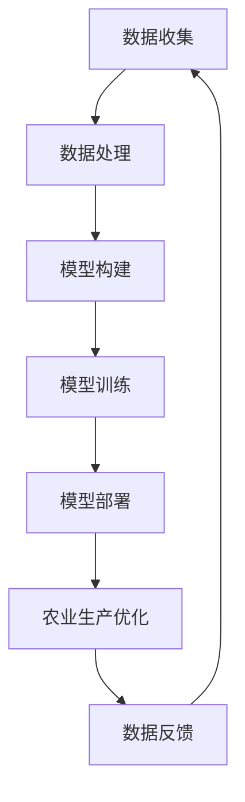

                 

### 文章标题

智能农业中的AI大模型应用机会

关键词：智能农业，AI大模型，精准农业，数据驱动，模型驱动

摘要：
本文探讨了智能农业中AI大模型的广泛应用机会，分析了其核心概念、算法原理以及具体操作步骤。通过数学模型和项目实践，详细介绍了AI大模型在智能农业中的应用实例。最后，本文总结了智能农业的发展趋势和挑战，并推荐了相关工具和资源。

### 1. 背景介绍（Background Introduction）

智能农业是利用现代信息技术，特别是人工智能（AI）技术，提高农业生产效率和质量的一种新兴农业模式。随着AI技术的发展，大模型在智能农业中的应用越来越广泛，成为推动农业现代化的关键力量。

#### 1.1 智能农业的现状

当前，智能农业主要涵盖了以下几个方面：

1. **精准农业**：通过传感器技术收集土壤、气候、作物生长状态等数据，实现精准施肥、灌溉和病虫害防治。
2. **物联网（IoT）**：将各种传感器和设备连接到互联网，实现对农田的远程监控和管理。
3. **数据挖掘与分析**：利用大数据分析技术，对农业生产过程中的各种数据进行分析，提供科学的决策支持。
4. **自动化与机器人技术**：使用自动化设备和机器人进行农田作业，提高劳动效率，降低人力成本。

#### 1.2 AI大模型在智能农业中的作用

AI大模型在智能农业中的应用主要体现在以下几个方面：

1. **预测与规划**：利用AI大模型对气候、土壤、病虫害等数据进行预测，为农业生产提供科学规划。
2. **优化决策**：通过分析大量数据，AI大模型可以帮助农民制定最优的种植方案、施肥方案和灌溉方案。
3. **智能监测与控制**：利用AI大模型对农田进行实时监测，自动控制灌溉、施肥和病虫害防治设备。

#### 1.3 本文目的

本文旨在探讨AI大模型在智能农业中的应用机会，通过详细的理论分析和实践案例，展示AI大模型在智能农业中的巨大潜力。

### 2. 核心概念与联系（Core Concepts and Connections）

在智能农业中，AI大模型的应用离不开以下几个核心概念：

#### 2.1 数据驱动（Data-Driven）

数据驱动是指利用大量数据来驱动决策过程，提高农业生产效率和产品质量。在智能农业中，数据驱动的核心在于收集、处理和分析大量农业数据，包括土壤数据、气候数据、作物生长数据等。

#### 2.2 模型驱动（Model-Driven）

模型驱动是指利用AI大模型来模拟、预测和优化农业生产过程。在智能农业中，模型驱动的核心在于构建和训练合适的AI大模型，以便对农业生产过程进行有效的预测和优化。

#### 2.3 Mermaid 流程图

以下是一个简化的智能农业中AI大模型应用的Mermaid流程图：

### 3. 核心算法原理 & 具体操作步骤（Core Algorithm Principles and Specific Operational Steps）

在智能农业中，AI大模型的应用通常涉及以下几个核心算法：

#### 3.1 预测算法

预测算法是AI大模型在智能农业中最常用的算法之一，主要用于预测未来的气候、土壤、病虫害等数据。常见的预测算法包括时间序列预测、回归分析、神经网络等。

#### 3.2 优化算法

优化算法用于优化农业生产过程，包括种植方案、施肥方案、灌溉方案等。常见的优化算法包括遗传算法、粒子群优化、深度强化学习等。

#### 3.3 具体操作步骤

以下是一个简化的AI大模型在智能农业中的应用操作步骤：

1. **数据收集**：收集土壤、气候、作物生长等数据。
2. **数据处理**：对数据进行清洗、预处理和特征提取。
3. **模型构建**：选择合适的预测模型和优化模型。
4. **模型训练**：使用预处理后的数据训练模型。
5. **模型部署**：将训练好的模型部署到实际生产环境中。
6. **农业生产优化**：利用模型进行预测和优化，指导农业生产。
7. **数据反馈**：收集实际生产数据，反馈到模型中，进行模型优化。

### 4. 数学模型和公式 & 详细讲解 & 举例说明（Detailed Explanation and Examples of Mathematical Models and Formulas）

在智能农业中，常用的数学模型和公式包括：

#### 4.1 时间序列预测模型

时间序列预测模型用于预测未来的气候、土壤、病虫害等数据。常见的模型包括ARIMA、LSTM等。

**ARIMA模型**：

$$
Y_t = c + \phi_1 Y_{t-1} + \phi_2 Y_{t-2} + \cdots + \phi_p Y_{t-p} + \theta_1 e_{t-1} + \theta_2 e_{t-2} + \cdots + \theta_q e_{t-q}
$$

其中，$Y_t$是时间序列数据，$c$是常数项，$\phi_1, \phi_2, \cdots, \phi_p$是自回归项系数，$\theta_1, \theta_2, \cdots, \theta_q$是移动平均项系数，$e_t$是白噪声项。

**LSTM模型**：

LSTM（长短期记忆网络）是一种用于处理和预测时间序列数据的神经网络模型。

$$
i_t = \sigma(W_{xi}x_t + W_{hi}h_{t-1} + b_i)
$$

$$
f_t = \sigma(W_{xf}x_t + W_{hf}h_{t-1} + b_f)
$$

$$
g_t = \tanh(W_{xg}x_t + W_{hg}h_{t-1} + b_g)
$$

$$
o_t = \sigma(W_{x

