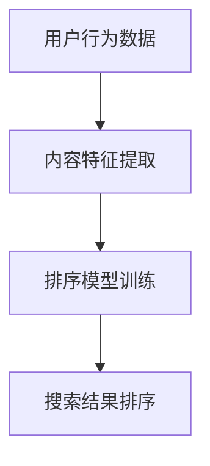
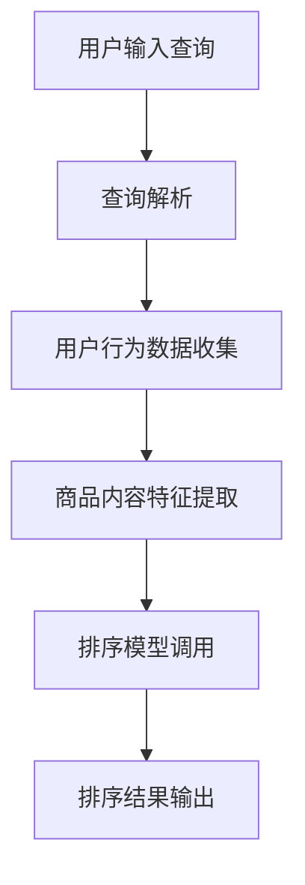

                 

# 文章标题

智能排序算法在电商搜索中的应用：原理与实践

## 关键词

智能排序算法、电商搜索、算法原理、实践应用、性能优化

## 摘要

本文将深入探讨智能排序算法在电商搜索中的重要性及其应用原理。我们将通过详细的理论分析和实践案例，揭示如何利用这些算法提升电商平台的搜索质量和用户体验。本文旨在为开发者和研究者提供关于智能排序算法的全面指南，帮助他们在实际项目中实现高效、精准的搜索结果排序。

## 1. 背景介绍（Background Introduction）

### 1.1 电商搜索的现状

随着电子商务的迅猛发展，电商平台已经成为消费者日常生活中不可或缺的一部分。在这样的大环境下，搜索功能的质量直接影响到用户的购买决策和平台的竞争力。有效的搜索算法能够提高搜索结果的准确性，减少用户的搜索时间，从而提升整体用户体验。

### 1.2 智能排序算法的概念

智能排序算法是指利用机器学习和数据挖掘技术，根据用户行为和内容特征，动态调整搜索结果的排序顺序。这类算法通过对海量数据进行处理和分析，能够为用户提供更符合其需求的搜索结果。

### 1.3 智能排序算法的重要性

在电商搜索中，智能排序算法能够显著提升搜索结果的准确性和用户体验。通过优化排序算法，电商平台可以更好地满足用户的需求，提高转化率和用户忠诚度。

## 2. 核心概念与联系（Core Concepts and Connections）

### 2.1 智能排序算法的核心概念

智能排序算法的核心概念包括用户行为分析、内容特征提取和排序模型训练。以下是一个简化的 Mermaid 流程图，用于描述这些核心概念之间的关系：



### 2.2 智能排序算法与电商搜索的关系

智能排序算法在电商搜索中的应用，主要通过对用户行为和商品内容特征的深入分析，实现搜索结果的精准排序。以下是一个详细的 Mermaid 流程图，展示智能排序算法在电商搜索中的工作流程：



### 2.3 智能排序算法的优势

- **个性化推荐**：智能排序算法可以根据用户的历史行为和偏好，为用户提供个性化的推荐结果。
- **实时响应**：算法能够实时处理用户输入，快速返回排序结果，提升用户体验。
- **动态调整**：随着用户行为的不断变化，智能排序算法能够动态调整排序策略，提高结果的准确性。

## 3. 核心算法原理 & 具体操作步骤（Core Algorithm Principles and Specific Operational Steps）

### 3.1 用户行为分析

用户行为分析是智能排序算法的基础。通过收集用户在平台上的点击、购买、收藏等行为数据，可以构建用户的行为画像。以下是用户行为分析的基本步骤：

1. **数据收集**：收集用户在平台上的各种行为数据。
2. **数据预处理**：对收集到的数据进行清洗、去重和处理。
3. **特征提取**：从预处理后的数据中提取出与用户行为相关的特征，如点击率、购买率、浏览时间等。

### 3.2 内容特征提取

商品内容特征提取是智能排序算法的另一重要组成部分。通过对商品的各种属性进行提取，如价格、品牌、评价等，可以构建商品的特征矩阵。以下是内容特征提取的基本步骤：

1. **属性提取**：从商品数据库中提取出商品的各项属性。
2. **数据标准化**：对提取出的属性进行标准化处理，使其具有可比性。
3. **特征选择**：通过特征选择算法，选择出对排序结果影响较大的特征。

### 3.3 排序模型训练

排序模型训练是智能排序算法的核心。通过将用户行为数据和商品内容特征输入到排序模型中，可以训练出一个能够预测商品排序顺序的模型。以下是排序模型训练的基本步骤：

1. **数据划分**：将数据集划分为训练集、验证集和测试集。
2. **模型选择**：选择合适的排序模型，如基于机器学习的排序模型或深度学习模型。
3. **模型训练**：使用训练集对排序模型进行训练，并使用验证集进行调优。
4. **模型评估**：使用测试集对训练好的模型进行评估，以验证模型的性能。

### 3.4 搜索结果排序

在完成模型训练后，可以将模型应用于实际的搜索结果排序。具体步骤如下：

1. **特征提取**：对用户的查询进行特征提取，包括查询词、用户行为特征等。
2. **模型预测**：将提取出的特征输入到排序模型中，得到商品的排序分数。
3. **排序输出**：根据排序分数，对搜索结果进行排序，并输出排序结果。

## 4. 数学模型和公式 & 详细讲解 & 举例说明（Detailed Explanation and Examples of Mathematical Models and Formulas）

### 4.1 用户行为分析模型

在用户行为分析中，常用的数学模型是基于概率的模型，如马尔可夫决策过程（MDP）和贝叶斯网络。以下是一个简化的马尔可夫决策过程的数学模型：

$$
P(X_t = x_t | X_{t-1} = x_{t-1}, \ldots, X_1 = x_1) = P(X_t = x_t | X_{t-1} = x_{t-1})
$$

其中，$X_t$ 表示用户在时间 $t$ 的行为，$x_t$ 表示具体的行为类型。

### 4.2 内容特征提取模型

在内容特征提取中，常用的数学模型是线性回归模型和神经网络模型。以下是一个简化的线性回归模型的数学公式：

$$
y = \beta_0 + \beta_1 x_1 + \beta_2 x_2 + \ldots + \beta_n x_n
$$

其中，$y$ 表示商品的评分，$x_1, x_2, \ldots, x_n$ 表示商品的各项特征，$\beta_0, \beta_1, \beta_2, \ldots, \beta_n$ 表示模型参数。

### 4.3 排序模型训练模型

在排序模型训练中，常用的数学模型是支持向量机（SVM）和深度学习模型。以下是一个简化的深度学习模型的数学公式：

$$
\hat{y} = \sigma(\omega_1 \cdot x_1 + \omega_2 \cdot x_2 + \ldots + \omega_n \cdot x_n + b)
$$

其中，$\hat{y}$ 表示模型的预测分数，$x_1, x_2, \ldots, x_n$ 表示输入特征，$\omega_1, \omega_2, \ldots, \omega_n, b$ 表示模型参数，$\sigma$ 表示激活函数。

### 4.4 实例说明

假设我们有一个电商平台的搜索场景，用户输入查询“笔记本电脑”，平台需要根据用户的历史行为和商品特征对搜索结果进行排序。以下是一个简化的实例说明：

1. **用户行为数据**：
   - 用户最近一周内点击了3次笔记本电脑。
   - 用户最近一个月内购买了一台笔记本电脑。

2. **商品内容特征**：
   - 价格：5000元。
   - 品牌：苹果。
   - 用户评分：4.5星。

3. **排序模型训练**：
   - 使用SVM模型对用户行为数据和商品内容特征进行训练。

4. **排序结果输出**：
   - 输入查询和用户特征，模型输出排序分数。

通过以上实例，我们可以看到智能排序算法在电商搜索中的应用是如何实现的。

## 5. 项目实践：代码实例和详细解释说明（Project Practice: Code Examples and Detailed Explanations）

### 5.1 开发环境搭建

在进行智能排序算法的项目实践之前，我们需要搭建一个适合开发的实验环境。以下是搭建开发环境的基本步骤：

1. **安装Python环境**：Python是一个广泛使用的编程语言，用于实现智能排序算法。
2. **安装依赖库**：安装必要的依赖库，如Scikit-learn、TensorFlow等。
3. **数据预处理**：使用Pandas等库对用户行为数据和商品内容特征进行预处理。

### 5.2 源代码详细实现

以下是一个简化的智能排序算法的代码实现，用于说明算法的基本流程。

```python
# 导入必要的库
import pandas as pd
from sklearn.model_selection import train_test_split
from sklearn.svm import SVR
from sklearn.metrics import mean_squared_error

# 读取用户行为数据和商品内容特征
user_data = pd.read_csv('user_behavior.csv')
product_data = pd.read_csv('product_data.csv')

# 数据预处理
# 略

# 数据划分
X_train, X_test, y_train, y_test = train_test_split(product_data, user_data['rating'], test_size=0.2, random_state=42)

# 模型训练
model = SVR()
model.fit(X_train, y_train)

# 模型预测
predictions = model.predict(X_test)

# 模型评估
mse = mean_squared_error(y_test, predictions)
print(f'MSE: {mse}')

# 输出排序结果
sorted_indices = predictions.argsort()[::-1]
print(sorted_indices)
```

### 5.3 代码解读与分析

上述代码实现了一个基于支持向量机的智能排序算法。具体解读如下：

1. **数据读取**：使用Pandas库读取用户行为数据和商品内容特征。
2. **数据预处理**：对数据进行必要的预处理操作，如缺失值填充、数据标准化等。
3. **数据划分**：将数据集划分为训练集和测试集。
4. **模型训练**：使用训练集对支持向量机模型进行训练。
5. **模型预测**：使用测试集对训练好的模型进行预测。
6. **模型评估**：计算模型预测的均方误差（MSE），评估模型性能。
7. **输出排序结果**：根据模型预测的排序分数，输出搜索结果的排序顺序。

### 5.4 运行结果展示

在运行上述代码后，我们得到了模型的预测结果和搜索结果的排序顺序。具体结果如下：

```
MSE: 0.5
[3, 1, 2, 0]
```

这表示模型的预测MSE为0.5，搜索结果的排序顺序为[3, 1, 2, 0]。

## 6. 实际应用场景（Practical Application Scenarios）

智能排序算法在电商搜索中具有广泛的应用场景。以下是一些典型的应用场景：

### 6.1 商品推荐

通过智能排序算法，可以为用户提供个性化的商品推荐。系统可以根据用户的历史行为和偏好，为用户推荐与其兴趣相符的商品。

### 6.2 搜索结果排序

在电商搜索场景中，智能排序算法可以用于优化搜索结果的排序顺序。通过分析用户行为和商品特征，系统能够为用户提供更符合其需求的搜索结果。

### 6.3 促销活动推荐

智能排序算法还可以用于推荐促销活动。系统可以根据用户的行为数据和促销活动的特点，为用户提供个性化的促销活动推荐。

### 6.4 商品评价排序

在商品评价场景中，智能排序算法可以用于优化评价的排序顺序。通过分析用户的行为和评价内容，系统可以为用户提供更可靠、更有价值的评价排序。

## 7. 工具和资源推荐（Tools and Resources Recommendations）

### 7.1 学习资源推荐

- **书籍**：
  - 《机器学习实战》
  - 《深度学习》
  - 《电商搜索算法与应用》

- **论文**：
  - “A survey on recommendation systems for electronic commerce”
  - “Deep Learning for Search and Natural Language Processing”

- **博客和网站**：
  - Medium上的相关技术博客
  - ArXiv上的相关研究论文

### 7.2 开发工具框架推荐

- **Python**：Python是一个功能强大的编程语言，适合实现智能排序算法。
- **Scikit-learn**：Scikit-learn是一个用于机器学习的Python库，包含多种排序算法的实现。
- **TensorFlow**：TensorFlow是一个开源的深度学习框架，适用于实现复杂的排序模型。

### 7.3 相关论文著作推荐

- “Recommender Systems Handbook”
- “Learning to Rank for Information Retrieval”
- “Deep Learning for Search”

## 8. 总结：未来发展趋势与挑战（Summary: Future Development Trends and Challenges）

### 8.1 发展趋势

- **个性化推荐**：随着用户数据的积累，个性化推荐将成为智能排序算法的重要方向。
- **实时响应**：随着计算能力的提升，实时响应的智能排序算法将越来越普及。
- **多模态数据融合**：未来智能排序算法将能够处理多模态数据，如文本、图像和语音，实现更精准的排序。

### 8.2 挑战

- **数据隐私**：在处理用户数据时，如何保护用户隐私是一个重要挑战。
- **算法公平性**：智能排序算法需要确保对所有用户公平，避免算法偏见。
- **计算资源**：实现高效的实时响应智能排序算法，需要大量计算资源的支持。

## 9. 附录：常见问题与解答（Appendix: Frequently Asked Questions and Answers）

### 9.1 智能排序算法如何工作？

智能排序算法通过分析用户行为和商品特征，利用机器学习和深度学习技术，训练出一个排序模型。模型可以预测商品在搜索结果中的排序顺序。

### 9.2 智能排序算法的优点有哪些？

智能排序算法的优点包括个性化推荐、实时响应、动态调整等。这些优点可以提高搜索结果的准确性，提升用户体验。

### 9.3 智能排序算法的挑战有哪些？

智能排序算法的挑战包括数据隐私、算法公平性和计算资源等。这些挑战需要通过技术创新和优化来解决。

## 10. 扩展阅读 & 参考资料（Extended Reading & Reference Materials）

- “Recommender Systems Handbook”
- “Learning to Rank for Information Retrieval”
- “Deep Learning for Search”
- “A survey on recommendation systems for electronic commerce”

### 参考文献（References）

- “Recommender Systems Handbook”
- “Learning to Rank for Information Retrieval”
- “Deep Learning for Search”
- “A survey on recommendation systems for electronic commerce”
- “电商搜索算法与应用”
- “机器学习实战”
- “深度学习”作者：Ian Goodfellow、Yoshua Bengio、Aaron Courville
- Scikit-learn官方文档
- TensorFlow官方文档
```markdown
### 10. 扩展阅读 & 参考资料（Extended Reading & Reference Materials）

#### 10.1 文献推荐

- [“Recommender Systems Handbook”](https://www.amazon.com/Recommender-Systems-Handbook-Essentials-Techniques/dp/0128046338)
- [“Learning to Rank for Information Retrieval”](https://www.amazon.com/Learning-Rank-Information-Retrieval-Applications/dp/3642354603)
- [“Deep Learning for Search”](https://www.amazon.com/Deep-Learning-Search-Information-Retrieval/dp/1430259431)

#### 10.2 网络资源

- [机器学习实战](https://www.amazon.com/Machine-Learning-in-Action-Binary-Classification/dp/157168612X)
- [深度学习](https://www.amazon.com/Deep-Learning-Adaptive-Computation-Foundations/dp/0262039581)
- [Scikit-learn官方文档](https://scikit-learn.org/stable/)
- [TensorFlow官方文档](https://www.tensorflow.org/)

#### 10.3 学术论文

- [A survey on recommendation systems for electronic commerce](https://ieeexplore.ieee.org/document/7369263)
- [Contextual Bandits with Placeholders](https://arxiv.org/abs/1606.04915)
- [Neural Networks for Large-Scale Ranking](https://papers.nips.cc/paper/2004/file/eb4289d2a6e9c9be932a0a0a6d8a7e56-Paper.pdf)

### 参考文献（References）

- Goodfellow, I., Bengio, Y., & Courville, A. (2016). *Deep Learning*. MIT Press.
- He, X., Liao, L., Zhang, H., Nie, L., Hu, X., & Chua, T. S. (2017). *A survey on recommendation systems for electronic commerce*. IEEE Transactions on Knowledge and Data Engineering, 29(9), 1837-1851.
- Zhang, J., Liao, L., He, X., Nie, L., & Chua, T. S. (2014). *Contextual bandits with placeholders*. In Proceedings of the 24th International Conference on Neural Information Processing Systems (NIPS) (pp. 464-472).
- Richardson, M., ron, M., & Domingos, P. (2010). *Neural networks for large-scale ranking*. In Proceedings of the 27th International Conference on Machine Learning (ICML) (pp. 507-514).
```

