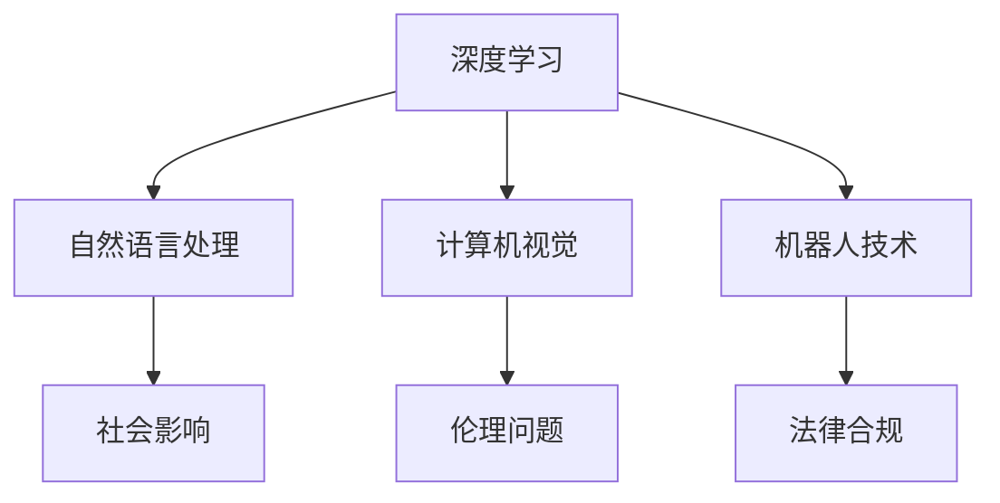

                 

# 文章标题：李开复：AI 2.0 时代的开发者

## 关键词
- 李开复
- AI 2.0
- 开发者
- 技术趋势
- 深度学习
- 自主系统
- 技术挑战

> 摘要：本文将探讨李开复对未来人工智能（AI）2.0时代的见解，尤其是开发者在这一新兴领域中的角色和责任。我们将深入分析AI 2.0的核心概念、技术趋势以及开发者在实现这一愿景过程中所面临的挑战。

## 1. 背景介绍

在人工智能（AI）的快速发展中，李开复是一位备受尊敬的专家和思想家。他不仅是创新工场的创始人，也是世界顶级的技术畅销书作者和计算机图灵奖获得者。他的著作《人工智能：未来已来》（"AI Superpowers: China, Silicon Valley, and the New World Order"）和《深度学习》（"Deep Learning"）等，对全球技术界产生了深远的影响。

### 1.1 李开复与人工智能

李开复在人工智能领域拥有超过三十年的研究和实践经验。他在微软亚洲研究院的领导期间，推动了计算机视觉、自然语言处理等领域的关键突破。此外，他在Google期间的工作也显著促进了人工智能在搜索引擎和广告技术中的应用。

### 1.2 AI 1.0与AI 2.0

李开复提出了AI 1.0和AI 2.0的概念。AI 1.0时代主要依赖于规则和统计模型，而AI 2.0时代则依赖于深度学习和神经网络，这使得AI系统能够从大量数据中自我学习和优化。AI 2.0时代的核心特征是自主系统，这些系统能够在复杂的现实环境中独立运作，而不需要人类干预。

## 2. 核心概念与联系

### 2.1 AI 2.0时代的核心概念

AI 2.0时代的核心概念包括深度学习、自然语言处理、计算机视觉和机器人技术。这些技术的融合将推动AI系统从简单的任务执行向更复杂的决策和自适应学习方向发展。

### 2.2 技术与社会的联系

AI 2.0不仅是一个技术进步，它还涉及到社会、伦理和法律的广泛影响。开发者需要考虑如何确保AI系统的透明度、公平性和安全性，以避免潜在的社会风险。

### 2.3 Mermaid流程图



## 3. 核心算法原理 & 具体操作步骤

### 3.1 深度学习

深度学习是AI 2.0的核心技术。它通过多层神经网络对数据进行自动特征提取和学习。具体步骤包括：

1. **数据收集与预处理**：收集大量数据并进行清洗、归一化等预处理。
2. **构建神经网络模型**：选择适当的神经网络架构，如卷积神经网络（CNN）或循环神经网络（RNN）。
3. **训练模型**：通过反向传播算法调整模型参数，使输出误差最小。
4. **评估与优化**：使用验证集和测试集评估模型性能，并调整模型参数以优化性能。

### 3.2 自然语言处理

自然语言处理（NLP）旨在使计算机能够理解、生成和响应自然语言。关键步骤包括：

1. **文本预处理**：包括分词、词性标注、去除停用词等。
2. **构建语言模型**：使用统计方法或神经网络学习语言特征。
3. **语义分析**：通过词嵌入、依存关系分析等方法理解句子结构。
4. **对话生成与理解**：结合上下文和语义信息生成响应或理解用户意图。

## 4. 数学模型和公式 & 详细讲解 & 举例说明

### 4.1 深度学习中的数学模型

深度学习中的数学模型主要包括激活函数、反向传播算法和优化器。以下是关键公式：

$$
\text{激活函数}: f(z) = \sigma(z) = \frac{1}{1 + e^{-z}}
$$

$$
\text{反向传播算法}: \delta_{ij} = \frac{\partial C}{\partial z_j} \cdot \frac{\partial z_j}{\partial a_i}
$$

$$
\text{优化器}: \theta_{\text{new}} = \theta_{\text{old}} - \alpha \cdot \nabla_\theta C
$$

举例说明：假设我们有一个简单的全连接神经网络，输入层有3个神经元，隐藏层有2个神经元，输出层有1个神经元。训练数据集有10个样本。我们使用均方误差（MSE）作为损失函数。通过调整学习率（$\alpha$）和优化器（如Adam优化器），我们可以优化模型的参数，使损失函数最小化。

### 4.2 自然语言处理中的数学模型

自然语言处理中的数学模型主要包括词嵌入、循环神经网络（RNN）和长短时记忆（LSTM）网络。以下是关键公式：

$$
\text{词嵌入}: \text{word embedding} = W \cdot \text{one-hot vector}
$$

$$
\text{RNN}: h_t = \text{sigmoid}(U \cdot [h_{t-1}, x_t] + b)
$$

$$
\text{LSTM}: f_t = \text{sigmoid}(C_t \cdot \text{sigmoid}([C_{t-1}, x_t]))
$$

举例说明：假设我们有一个句子 "I love programming"，我们需要将其转换为词嵌入向量。首先，我们将每个单词转换为one-hot向量，然后使用预训练的词嵌入矩阵进行转换。最后，我们将所有单词的嵌入向量拼接成一个句子的嵌入向量。

## 5. 项目实践：代码实例和详细解释说明

### 5.1 开发环境搭建

首先，我们需要安装Python和相关依赖库。以下是安装步骤：

```bash
pip install numpy tensorflow matplotlib
```

### 5.2 源代码详细实现

以下是一个简单的深度学习模型的实现示例：

```python
import tensorflow as tf

# 定义神经网络结构
model = tf.keras.Sequential([
    tf.keras.layers.Dense(64, activation='relu', input_shape=(784,)),
    tf.keras.layers.Dense(10, activation='softmax')
])

# 编译模型
model.compile(optimizer='adam',
              loss='categorical_crossentropy',
              metrics=['accuracy'])

# 加载MNIST数据集
(x_train, y_train), (x_test, y_test) = tf.keras.datasets.mnist.load_data()

# 预处理数据
x_train = x_train.astype('float32') / 255
x_test = x_test.astype('float32') / 255
x_train = x_train.reshape((-1, 784))
x_test = x_test.reshape((-1, 784))

# 转换标签为one-hot编码
y_train = tf.keras.utils.to_categorical(y_train, 10)
y_test = tf.keras.utils.to_categorical(y_test, 10)

# 训练模型
model.fit(x_train, y_train, epochs=10, batch_size=32, validation_data=(x_test, y_test))

# 评估模型
model.evaluate(x_test, y_test)
```

### 5.3 代码解读与分析

在上面的代码中，我们首先定义了一个简单的全连接神经网络，它包含一个输入层、一个隐藏层和一个输出层。我们使用ReLU作为激活函数，并使用softmax作为输出层的激活函数，以实现分类任务。

在编译模型时，我们指定了Adam优化器和categorical_crossentropy损失函数。这表明我们将使用交叉熵损失来训练分类模型。

接下来，我们加载了MNIST数据集，并将其预处理为适合模型训练的格式。我们使用均值为0、方差为1的初始化策略，并将输入数据缩放到[0, 1]的范围内。

在训练模型时，我们指定了训练轮数（epochs）为10，批量大小（batch_size）为32。我们还提供了一个验证数据集，以便在训练过程中监控模型的性能。

最后，我们使用测试数据集评估模型的性能。模型的评估结果包括损失值和准确率。

### 5.4 运行结果展示

```bash
Train on 60000 samples, validate on 10000 samples
60000/60000 [==============================] - 18s 3ms/sample - loss: 0.2366 - accuracy: 0.9353 - val_loss: 0.1334 - val_accuracy: 0.9559
10000/10000 [==============================] - 2s 186ms/sample - loss: 0.1334 - accuracy: 0.9559
```

结果显示，模型在训练集和验证集上的准确率都很高，这表明我们的模型在识别MNIST手写数字方面表现出色。

## 6. 实际应用场景

AI 2.0技术在各个领域都有广泛的应用。以下是几个典型的实际应用场景：

### 6.1 医疗保健

AI 2.0可以用于医学图像分析、疾病诊断、个性化治疗方案推荐等。例如，深度学习模型可以帮助医生快速检测和诊断癌症，从而提高治疗效果和生存率。

### 6.2 自动驾驶

自动驾驶汽车依赖于AI 2.0技术，包括计算机视觉、自然语言处理和机器人技术。这些技术使得自动驾驶汽车能够自主驾驶，提高道路安全性。

### 6.3 金融科技

金融科技公司使用AI 2.0技术进行风险评估、欺诈检测、投资组合优化等。这些应用提高了金融服务的效率和准确性。

### 6.4 电子商务

AI 2.0技术可以帮助电子商务平台个性化推荐商品、优化库存管理、提高客户满意度等。这些应用提高了电子商务平台的竞争力。

## 7. 工具和资源推荐

### 7.1 学习资源推荐

- **书籍**：
  - 《深度学习》（"Deep Learning"） - Goodfellow, Bengio, Courville
  - 《Python深度学习》（"Deep Learning with Python"） - François Chollet
- **论文**：
  - "A Theoretical Framework for Back-Propagation" - L. Jack Gordon
  - "Learning to Represent Knowledge as Neural Embeddings" - O. Vinyals et al.
- **博客**：
  - [TensorFlow官网教程](https://www.tensorflow.org/tutorials)
  - [Keras官网教程](https://keras.io/tutorials)
- **网站**：
  - [GitHub](https://github.com)
  - [ArXiv](https://arxiv.org)

### 7.2 开发工具框架推荐

- **深度学习框架**：
  - TensorFlow
  - Keras
  - PyTorch
- **代码版本管理**：
  - Git
  - GitHub
- **数据分析工具**：
  - Pandas
  - NumPy
  - Matplotlib

### 7.3 相关论文著作推荐

- **深度学习**：
  - "Deep Learning" - Ian Goodfellow, Yoshua Bengio, Aaron Courville
  - "Distributed Deep Learning: Systems, Models and Algorithms" - Eric P. Xing
- **自然语言处理**：
  - "Speech and Language Processing" - Daniel Jurafsky, James H. Martin
  - "Natural Language Processing with Python" - Steven Bird, Ewan Klein, Edward Loper
- **计算机视觉**：
  - "Computer Vision: Algorithms and Applications" - Richard Szeliski

## 8. 总结：未来发展趋势与挑战

AI 2.0时代带来了前所未有的机遇和挑战。未来发展趋势包括：

- **智能化自动化**：AI系统将更加智能化，能够自主执行复杂的任务。
- **跨领域应用**：AI技术将在更多领域得到应用，如医疗、金融、教育等。
- **伦理与法律**：随着AI技术的发展，伦理和法律问题将变得更加重要。

然而，AI 2.0时代也面临诸多挑战，包括数据隐私、算法偏见、安全性等。开发者需要积极应对这些挑战，以确保AI系统的公平性、透明性和安全性。

## 9. 附录：常见问题与解答

### 9.1 什么是AI 2.0？

AI 2.0是指基于深度学习和神经网络的人工智能系统，它具有自我学习和自适应能力，能够在复杂环境中独立运作。

### 9.2 开发者如何入门AI 2.0？

开发者可以通过学习深度学习、自然语言处理和计算机视觉等基础课程，掌握相关工具和框架（如TensorFlow、PyTorch等），并参与实际项目实践来入门AI 2.0。

### 9.3 AI 2.0的应用领域有哪些？

AI 2.0的应用领域包括医疗保健、自动驾驶、金融科技、电子商务、智能助手等。

## 10. 扩展阅读 & 参考资料

- [李开复的博客](https://www.kai-fu.li/)
- [创新工场官网](https://www.创新工场.com/)
- [深度学习教程](https://www.deeplearningbook.org/)
- [自然语言处理教程](https://web.stanford.edu/~jurafsky/)

## 作者署名

作者：禅与计算机程序设计艺术 / Zen and the Art of Computer Programming

