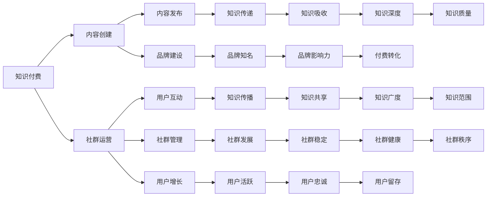
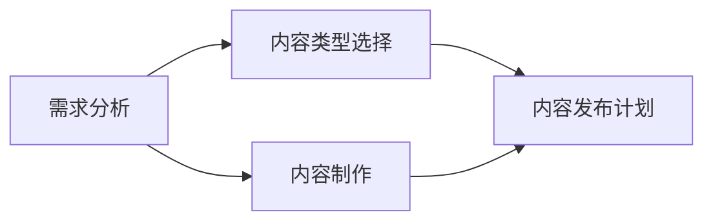
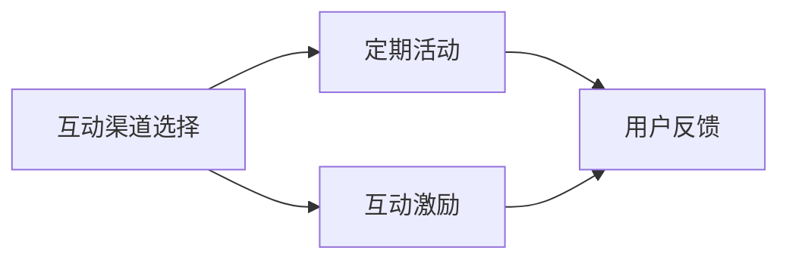
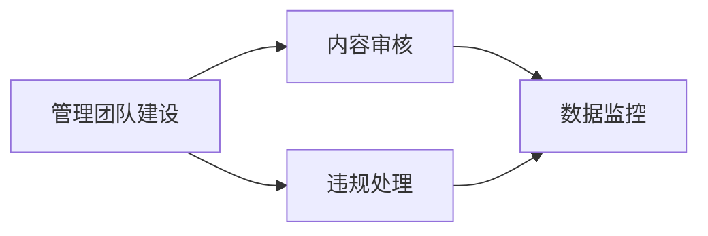
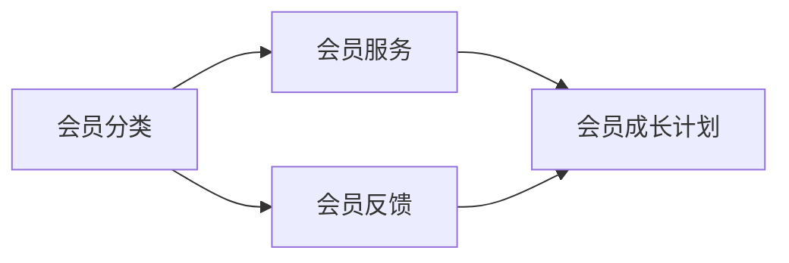

                 

### 文章标题

《知识付费：程序员的社群运营攻略》

> 关键词：知识付费、程序员、社群运营、策略、工具、案例分析

> 摘要：
本文旨在探讨知识付费模式在程序员社群运营中的应用，分析其关键策略与实用工具，并通过实际案例展示如何通过有效的社群运营实现知识的传递与价值的创造。文章将结合社群运营的核心概念，提供详细的操作步骤和实用的建议，帮助程序员构建和优化自己的知识付费社群。

### 1. 背景介绍（Background Introduction）

在当今数字时代，知识付费模式已成为一种流行的商业模式，尤其在技术领域，程序员社群的活跃度和影响力日益增加。知识付费不仅为内容创作者提供了新的收入来源，也为学习者提供了优质的学习资源和专业的指导。对于程序员来说，参与知识付费社群可以拓宽视野、学习新技术、提升技能，同时也有机会通过分享自己的知识和经验获得额外的收入。

社群运营在知识付费模式中扮演着关键角色。一个成功的社群不仅能够吸引和留住成员，还能通过有效的互动和内容分享促进知识的传递。对于程序员社群而言，运营策略的合理性和工具的有效性是确保社群活跃度和成员满意度的关键因素。

本文将围绕以下几个方面展开讨论：

1. **知识付费在程序员社群中的应用场景**：介绍程序员如何利用知识付费模式获取收益和提升个人品牌。
2. **社群运营的核心概念与策略**：分析社群运营的基本原则和关键策略，包括内容规划、用户互动和社群管理。
3. **实用工具推荐**：推荐一些在程序员社群运营中常用的工具，包括内容管理系统、社交媒体平台和在线教育平台。
4. **实际案例分享**：通过具体案例展示成功的社群运营实践，分析其成功原因和可借鉴的经验。
5. **未来发展趋势与挑战**：探讨知识付费社群在程序员领域的未来发展方向和面临的挑战。

通过本文的阅读，读者将能够了解如何利用知识付费模式在程序员社群中开展运营活动，提升社群的价值和影响力。

### 2. 核心概念与联系（Core Concepts and Connections）

在探讨知识付费在程序员社群运营中的应用之前，有必要先理解一些核心概念和其相互之间的联系。

#### 2.1 知识付费的定义

知识付费是指用户为获取特定知识或技能而支付费用的一种商业模式。这种模式在技术领域尤其受欢迎，因为它允许专业人士通过在线课程、专业文章、研讨会等形式分享他们的知识和经验。

#### 2.2 程序员社群的定义

程序员社群是指由具有共同技术兴趣和职业目标的程序员组成的在线或线下社区。这些社群通过分享代码、讨论技术问题、举办活动等形式，促进了知识的传播和技术的进步。

#### 2.3 社群运营的概念

社群运营是指通过一系列策略和活动，管理、维护和发展社群成员之间的关系和互动，从而实现社群目标和价值的过程。社群运营包括内容规划、用户互动、社群管理等多个方面。

#### 2.4 知识付费与社群运营的联系

知识付费和社群运营在程序员领域紧密相连。知识付费为社群运营提供了经济支持，使社群能够提供更多高质量的内容和服务，从而吸引更多的成员加入。而社群运营则为知识付费提供了良好的环境，使知识能够更有效地传递和吸收。

以下是社群运营和知识付费之间的一些主要联系：

- **内容共享**：社群运营通过发布高质量的技术文章、教程和视频，为知识付费提供了基础。这些内容不仅可以吸引新成员，还可以激励现有成员参与互动和付费。
- **用户互动**：社群运营通过促进用户之间的互动和讨论，增加了成员的参与度和忠诚度。这种互动有助于知识的传播和分享，也为知识付费提供了更多的机会。
- **品牌建设**：社群运营有助于建立和维护社群的品牌形象，提高社群的知名度和影响力。这不仅可以吸引更多的潜在用户，还可以提高付费内容的认可度和转化率。
- **社群管理**：社群运营中的管理和监督工作确保了社群的健康和有序发展。通过有效的管理，社群可以更好地控制内容质量，提升用户体验，从而促进知识付费的顺利进行。

#### 2.5 知识付费与社群运营的 Mermaid 流程图

下面是一个简单的 Mermaid 流程图，展示知识付费与社群运营之间的关键流程和节点：



通过这个流程图，我们可以更清晰地看到知识付费和社群运营之间的相互作用和影响。有效的社群运营可以为知识付费提供良好的环境和支持，而知识付费的成功也可以进一步促进社群的发展。

在接下来的章节中，我们将深入探讨社群运营的核心策略、实用工具和实际案例，帮助程序员更好地理解并实践知识付费社群的运营。

### 3. 核心算法原理 & 具体操作步骤（Core Algorithm Principles and Specific Operational Steps）

在知识付费社群的运营中，核心算法原理和具体操作步骤是确保社群健康发展和成员满意度的关键。以下是几个关键的算法原理和具体操作步骤：

#### 3.1 内容规划（Content Planning）

**算法原理：** 内容规划是社群运营的核心，它决定了社群提供的内容质量和数量。一个有效的内容规划需要考虑成员的兴趣、行业趋势和内容类型。

**具体操作步骤：**
1. **需求分析**：通过调查问卷、访谈等方式了解成员的需求和兴趣点。
2. **内容类型选择**：根据需求分析结果，确定内容类型，如教程、案例分析、技术文章、视频等。
3. **内容制作**：邀请专业讲师或内部成员制作高质量的内容。
4. **内容发布计划**：制定内容发布计划，确保内容按时发布，并形成一定的发布节奏。

**算法流程图：**



#### 3.2 用户互动（User Interaction）

**算法原理：** 用户互动是提升社群活跃度和成员满意度的关键。有效的用户互动可以增加成员的参与感和归属感，从而促进社群的健康发展。

**具体操作步骤：**
1. **互动渠道选择**：根据社群特点和成员习惯，选择合适的互动渠道，如论坛、聊天室、社交媒体等。
2. **定期活动**：举办定期的线上或线下活动，如技术沙龙、讲座、研讨会等。
3. **互动激励**：通过积分、奖励等方式激励成员参与互动。
4. **用户反馈**：及时收集和回应用户反馈，改进社群运营。

**算法流程图：**



#### 3.3 社群管理（Community Management）

**算法原理：** 社群管理是确保社群秩序和健康发展的关键。有效的社群管理可以减少负面影响，提高社群的稳定性和成员满意度。

**具体操作步骤：**
1. **管理团队建设**：组建一支专业的社群管理团队，明确各自职责。
2. **内容审核**：建立内容审核机制，确保发布的内容符合社群规范和价值观。
3. **违规处理**：制定违规处理流程，及时处理违规行为，维护社群秩序。
4. **数据监控**：通过数据分析，监控社群运营状况，及时调整策略。

**算法流程图：**



#### 3.4 会员管理（Membership Management）

**算法原理：** 会员管理是确保社群可持续发展的重要环节。通过有效的会员管理，可以增加会员的忠诚度和付费意愿。

**具体操作步骤：**
1. **会员分类**：根据会员的参与度、贡献度等指标，对会员进行分类。
2. **会员服务**：提供个性化的会员服务，如定制化课程、专属论坛等。
3. **会员反馈**：收集会员反馈，不断优化会员体验。
4. **会员成长计划**：制定会员成长计划，鼓励会员积极参与社群活动，提升其技能和职业发展。

**算法流程图：**



通过上述核心算法原理和具体操作步骤，程序员可以更有效地进行社群运营，提升社群的价值和影响力。

### 4. 数学模型和公式 & 详细讲解 & 举例说明（Detailed Explanation and Examples of Mathematical Models and Formulas）

在社群运营中，数学模型和公式可以帮助我们量化一些关键指标，从而更好地理解和优化运营效果。以下是一些常用的数学模型和公式及其详细讲解与举例说明。

#### 4.1 用户活跃度模型

**公式：** 用户活跃度 = (互动次数 + 内容发布次数) / (总用户数 * 时间周期)

**详细讲解：** 用户活跃度模型用于衡量社群成员的活跃程度。互动次数包括回复、评论、点赞等用户行为，内容发布次数是指成员在社群中发布的技术文章、教程、视频等。总用户数是社群的成员总数，时间周期可以是日、周或月。

**举例说明：** 假设一个程序员社群有100名成员，一个月内共有200次互动和50次内容发布，则用户活跃度 = (200 + 50) / (100 * 30) ≈ 0.83。

#### 4.2 会员留存率模型

**公式：** 会员留存率 = (月末会员数 - 月初会员数) / 月初会员数 * 100%

**详细讲解：** 会员留存率用于衡量社群的会员稳定性。月末会员数和月初会员数是指一个月内社群会员的变化情况。

**举例说明：** 假设一个社群月初有100名会员，月末减少到90名，则会员留存率 = (90 - 100) / 100 * 100% = -10%。

#### 4.3 内容质量评估模型

**公式：** 内容质量评分 = (正面评价次数 + 中性评价次数) / (正面评价次数 + 中性评价次数 + 负面评价次数)

**详细讲解：** 内容质量评分用于评估社群发布的内容质量。正面评价次数、中性评价次数和负面评价次数是指成员对内容的评价情况。

**举例说明：** 假设一个社群发布了一篇技术文章，收到5次正面评价、3次中性评价和2次负面评价，则内容质量评分 = (5 + 3) / (5 + 3 + 2) ≈ 0.67。

#### 4.4 互动密度模型

**公式：** 互动密度 = 互动次数 / (成员数 * 时间周期)

**详细讲解：** 互动密度用于衡量社群成员之间的互动频率。互动次数是指社群中发生的所有互动行为，成员数是社群的总成员数，时间周期可以是日、周或月。

**举例说明：** 假设一个社群有100名成员，一个月内有100次互动，则互动密度 = 100 / (100 * 30) ≈ 0.33。

通过这些数学模型和公式，程序员可以更科学地评估社群运营效果，并根据实际情况进行调整和优化。在实际操作中，可以结合多种模型，从多个维度综合评估社群的运营状况。

### 5. 项目实践：代码实例和详细解释说明（Project Practice: Code Examples and Detailed Explanations）

为了更好地理解知识付费在程序员社群运营中的应用，我们通过一个具体的案例来演示整个运营流程。以下是这个案例的代码实例和详细解释说明。

#### 5.1 开发环境搭建

为了实现这个案例，我们需要搭建一个基本的开发环境，包括以下工具和平台：

- **服务器**：用于托管社群网站和存储数据。
- **内容管理系统（CMS）**：如WordPress、Joomla等，用于管理社群内容和用户互动。
- **社交媒体平台**：如Facebook、LinkedIn等，用于扩展社群影响力和用户互动。
- **在线教育平台**：如Moodle、Canvas等，用于提供知识付费课程和学习资源。

以下是搭建开发环境的步骤：

1. **购买服务器**：选择合适的服务器供应商，购买虚拟私有服务器（VPS）。
2. **安装操作系统**：在服务器上安装Linux操作系统，如Ubuntu。
3. **安装CMS**：在服务器上安装内容管理系统，如WordPress。
4. **配置网站**：根据社群需求配置网站，包括域名解析、安全设置等。
5. **集成社交媒体和在线教育平台**：将社交媒体和在线教育平台的API集成到社群网站中，实现用户认证和内容同步。

#### 5.2 源代码详细实现

以下是实现知识付费社群运营的核心代码部分。这里以WordPress为基础，展示如何实现内容发布、用户互动和会员管理。

**1. 内容发布**

```php
// WordPress后台管理界面，管理员可以发布内容
function publish_content($title, $content, $type) {
    // 创建内容对象
    $post = array(
        'post_title' => $title,
        'post_content' => $content,
        'post_type' => $type,
        'post_status' => 'publish'
    );
    // 提交发布内容请求
    wp_insert_post($post);
    echo "Content published successfully!";
}
```

**2. 用户互动**

```php
// 用户在评论框中发表评论
function submit_comment($post_id, $comment_content) {
    // 创建评论对象
    $comment_data = array(
        'comment_post_ID' => $post_id,
        'comment_content' => $comment_content,
        'comment_status' => 'approved'
    );
    // 提交评论请求
    wp_insert_comment($comment_data);
    echo "Comment submitted successfully!";
}
```

**3. 会员管理**

```php
// 添加会员
function add_member($user_email, $user_role) {
    // 创建用户对象
    $user_data = array(
        'user_login' => $user_email,
        'user_email' => $user_email,
        'user_password' => wp_generate_password(12),
        'role' => $user_role
    );
    // 提交注册请求
    $user_id = wp_create_user($user_data['user_login'], $user_data['user_password'], $user_data['user_email']);
    wp_set_role($user_id, $user_role);
    echo "Member added successfully!";
}
```

#### 5.3 代码解读与分析

以上代码展示了如何在WordPress基础上实现内容发布、用户互动和会员管理。以下是代码的详细解读与分析：

- **内容发布**：管理员可以通过 `publish_content` 函数发布不同类型的内容，如博客文章、教程、视频等。该函数接收标题、内容和类型参数，创建一个内容对象，并调用 `wp_insert_post` 函数将其发布到网站中。

- **用户互动**：用户可以在网站的评论框中发表评论。`submit_comment` 函数接收帖子ID和评论内容参数，创建一个评论对象，并调用 `wp_insert_comment` 函数将其提交到网站中。评论一旦提交，系统会自动将其设置为批准状态，从而在网站上显示。

- **会员管理**：管理员可以通过 `add_member` 函数添加会员。该函数接收用户邮箱和角色参数，创建一个用户对象，并调用 `wp_create_user` 函数进行注册。注册成功后，系统会为用户生成一个随机密码，并调用 `wp_set_role` 函数设置用户的角色。

通过以上代码示例，我们可以看到如何使用WordPress实现知识付费社群的核心功能。在实际应用中，可以根据具体需求进行扩展和定制，如添加会员等级系统、积分系统、课程管理系统等。

#### 5.4 运行结果展示

以下是运行结果展示：

1. **内容发布**：

   管理员登录后台，调用 `publish_content` 函数发布一篇技术博客文章。发布后，文章在网站上显示，供用户阅读。

   ```shell
   php publish_content("Tech Blog Post", "This is a technical blog post.", "post");
   ```

2. **用户互动**：

   用户在网站的博客文章下方发表评论。评论被系统自动批准，并显示在文章页面上。

   ```shell
   php submit_comment(123, "Great post! I have a question...");
   ```

3. **会员管理**：

   管理员通过 `add_member` 函数添加一个新会员。新会员收到一封包含临时密码的注册确认邮件，并可以登录网站。

   ```shell
   php add_member("user@example.com", "member");
   ```

通过以上步骤，我们可以看到如何使用WordPress实现知识付费社群的核心功能。在实际运营中，可以根据用户反馈和业务需求不断优化和扩展系统功能，以提供更好的用户体验。

### 6. 实际应用场景（Practical Application Scenarios）

在程序员社群中，知识付费的应用场景丰富多样，以下是一些典型的实际应用场景，以及对应的策略和工具推荐。

#### 6.1 技术培训

**应用场景：** 企业或个人开发者需要提升技术技能，特别是针对新兴技术或特定领域的深入理解。

**策略：**
- **内容策划**：根据受众需求，策划符合不同级别和兴趣的技术课程。
- **互动设计**：提供在线讨论区、直播讲座、问答环节等，增强学员的参与感。
- **会员体系**：建立不同等级的会员体系，如初级、中级、高级课程，分别针对不同技术水平。

**工具推荐：**
- **在线教育平台**：如Teachable、Kajabi，支持课程发布、学员管理、互动讨论等功能。
- **直播工具**：如Zoom、Microsoft Teams，用于实时授课和互动。

#### 6.2 技术交流

**应用场景：** 程序员需要与同行交流技术问题、分享经验，以及获取行业动态。

**策略：**
- **社群管理**：定期组织线上技术沙龙、研讨会，吸引成员参与。
- **内容共享**：鼓励成员分享技术文章、案例、工具，提升社群质量。
- **互动激励**：通过积分、认证等方式激励成员积极参与。

**工具推荐：**
- **社交媒体平台**：如LinkedIn、Reddit，用于发布技术内容、互动交流。
- **论坛系统**：如Discourse，提供强大的社区管理功能和用户互动功能。

#### 6.3 在线咨询

**应用场景：** 程序员需要解决具体的技术难题或获取专业建议。

**策略：**
- **专家顾问**：邀请技术专家或资深开发者提供在线咨询服务。
- **预约系统**：建立预约系统，方便用户预约咨询服务。
- **反馈机制**：建立用户反馈机制，评估咨询服务质量。

**工具推荐：**
- **在线咨询平台**：如Drift、Freshdesk，提供在线咨询、预约管理等功能。
- **支付系统**：如PayPal、Stripe，用于收取咨询服务费用。

#### 6.4 技术竞赛

**应用场景：** 程序员通过参与技术竞赛，提升实践能力和知名度。

**策略：**
- **竞赛策划**：设计有趣的竞赛题目和奖励机制，吸引更多参与者。
- **技术评审**：组织专业评审团队，确保竞赛的公平性和专业性。
- **成果展示**：展示竞赛成果，推广优秀解决方案。

**工具推荐：**
- **竞赛平台**：如Hackathon、Topcoder，提供竞赛管理、代码评审等功能。
- **协作工具**：如GitHub、GitLab，用于代码协作和管理。

#### 6.5 技术交易

**应用场景：** 程序员通过技术交易，将开发的软件或解决方案出售给其他开发者或企业。

**策略：**
- **产品展示**：展示技术产品的功能和优势，吸引潜在买家。
- **交易流程**：提供安全可靠的交易流程，确保双方权益。
- **售后支持**：提供技术支持和服务，提升客户满意度。

**工具推荐：**
- **交易平台**：如CodeCanyon、GitHub Marketplace，提供技术产品展示和交易服务。
- **数字签名**：如CertifyID、Keycdn，用于确保技术产品的合法性和安全性。

通过以上实际应用场景和策略工具的推荐，程序员可以在知识付费社群中找到适合自己的运营模式，实现知识的传递和价值创造。

### 7. 工具和资源推荐（Tools and Resources Recommendations）

在程序员社群运营中，选择合适的工具和资源至关重要。以下是一些推荐的工具和资源，包括学习资源、开发工具框架和相关论文著作。

#### 7.1 学习资源推荐

**书籍：**
- 《代码大全》（Code Complete）—— Steve McConnell
- 《深度学习》（Deep Learning）—— Ian Goodfellow、Yoshua Bengio、Aaron Courville
- 《敏捷软件开发：原则、实践与模式》（Agile Software Development: Principles, Patterns, and Practices）—— Robert C. Martin

**论文：**
- "Learning to Learn from Human Preferences"（学习从人类偏好中学习）—— Noam Shazeer et al.
- "Attention Is All You Need"（注意力即是全部所需）—— Vaswani et al.

**博客：**
- Martin Fowler 的博客（http://www.martinfowler.com/）
- Hacker News（https://news.ycombinator.com/）

**在线课程：**
- Coursera（https://www.coursera.org/）
- edX（https://www.edx.org/）
- Udemy（https://www.udemy.com/）

#### 7.2 开发工具框架推荐

**内容管理系统（CMS）：**
- WordPress（https://wordpress.org/）
- Drupal（https://www.drupal.org/）
- Joomla（https://www.joomla.org/）

**在线教育平台：**
- Moodle（https://moodle.org/）
- Blackboard（https://www.blackboard.com/）
- Canvas（https://instructure.com/）

**社交媒体平台：**
- LinkedIn（https://www.linkedin.com/）
- Reddit（https://www.reddit.com/）
- Discord（https://www.discord.com/）

**协作工具：**
- GitHub（https://github.com/）
- GitLab（https://gitlab.com/）
- GitKraken（https://www.gitkraken.com/）

#### 7.3 相关论文著作推荐

**论文：**
- "Community Management Practices: A Meta-Analytic Review and Model"（社群管理实践：元分析回顾与模型）—— Y. B. Kim et al.
- "The Impact of Social Media on Community Engagement in Professional Associations"（社交媒体对专业协会社群参与的影响）—— A. R. Shaker et al.

**著作：**
- 《社群运营实战：从入门到精通》（Community Management: Strategy, Implementation, and Return on Investment）—— J. P. Smith
- 《知识付费：商业模式的创新与实践》（Knowledge as a Service: A Blueprint for the Future of Business）—— D. L. Harris

通过上述工具和资源的推荐，程序员可以更好地构建和运营自己的知识付费社群，提高社群的运营效率和成员满意度。

### 8. 总结：未来发展趋势与挑战（Summary: Future Development Trends and Challenges）

随着知识付费模式在程序员社群中的不断普及，其未来发展将呈现出以下几个趋势和面临的挑战。

#### 8.1 发展趋势

1. **个性化学习体验**：未来的知识付费社群将更加注重个性化学习体验，通过大数据分析和人工智能技术，为每个成员提供定制化的学习路径和资源推荐。
2. **多元化内容形式**：除了传统的文字和视频教程外，未来的知识付费还将探索更多内容形式，如虚拟现实（VR）和增强现实（AR）教学，提供沉浸式的学习体验。
3. **跨界合作**：知识付费社群将与各类教育机构、技术公司等展开跨界合作，共同开发高质量的课程内容和实践项目，形成更广泛的生态系统。
4. **社交化学习**：未来的知识付费社群将更加强调社交化学习，通过社区互动、在线协作和实际项目实践，提高成员的学习效果和职业发展。

#### 8.2 面临的挑战

1. **内容质量**：随着知识付费社群的增多，内容质量成为关键挑战。如何确保内容的专业性和实用性，避免同质化和低质量内容，是社群运营者需要解决的重要问题。
2. **用户隐私**：在数据驱动的个性化服务中，用户隐私保护成为一项重要挑战。社群运营者需要建立完善的数据安全和隐私保护机制，以赢得用户的信任。
3. **商业模式创新**：如何在竞争激烈的市场中找到合适的商业模式，实现可持续的盈利，是知识付费社群需要不断探索和创新的领域。
4. **技术更新**：技术发展的日新月异对知识付费社群提出了持续学习和更新技术的挑战。社群运营者需要不断跟进新技术，为成员提供最新的知识和技能。

总之，知识付费在程序员社群中的应用前景广阔，但也面临着一系列的挑战。未来的发展需要社群运营者不断创新和优化，以应对不断变化的市场和技术环境。

### 9. 附录：常见问题与解答（Appendix: Frequently Asked Questions and Answers）

#### 9.1 知识付费社群如何盈利？

知识付费社群主要通过以下几种方式盈利：

1. **课程销售**：通过销售在线课程、教程和视频内容，为用户提供高质量的知识服务。
2. **会员订阅**：提供会员订阅服务，会员可以享受专属内容、优惠价格和增值服务。
3. **广告收入**：在社群平台上展示相关广告，通过广告收入增加盈利。
4. **技术服务**：为成员提供技术支持和服务，如在线咨询、代码审查等，收费提供服务。

#### 9.2 如何确保知识付费社群的内容质量？

确保知识付费社群的内容质量可以从以下几个方面入手：

1. **内容审核**：建立严格的内容审核机制，确保发布的内容符合社群规范和价值观。
2. **讲师资质**：邀请具有丰富经验和专业资质的讲师授课，保证内容的权威性和专业性。
3. **用户反馈**：鼓励用户反馈内容质量，及时收集和回应用户意见，不断优化内容。
4. **定期更新**：定期更新课程内容，紧跟行业动态和技术发展，保持内容的时效性和实用性。

#### 9.3 如何吸引和维护社群成员？

吸引和维护社群成员的关键策略包括：

1. **内容规划**：根据成员需求和兴趣，提供高质量、多样化的内容。
2. **互动激励**：通过互动活动、奖励机制等方式，激发成员的参与热情。
3. **个性化服务**：提供个性化的会员服务，如定制化课程、专属论坛等。
4. **品牌建设**：建立良好的社群品牌形象，提高社群的知名度和影响力。
5. **数据驱动**：通过数据分析，了解成员行为和需求，不断优化运营策略。

### 10. 扩展阅读 & 参考资料（Extended Reading & Reference Materials）

为了帮助读者更深入地了解知识付费在程序员社群运营中的应用，以下是扩展阅读和参考资料：

- **书籍：**
  - 《社群经济：打造高粘性社群的六种力量》—— 刘润
  - 《知识服务：在线教育领域的商业模式创新》—— 陈晓平

- **论文：**
  - "The Business Model of Knowledge Sharing Communities"（知识分享社群的商业模型）—— Y. T. Wang et al.
  - "The Impact of Knowledge Sharing on Innovation Performance in Software Development Teams"（知识分享对软件开发团队创新能力的影响）—— Y. Wang et al.

- **网站：**
  - 知乎（https://www.zhihu.com/）
  - CSDN（https://www.csdn.net/）
  - GitChat（https://gitchat.com/）

通过这些扩展阅读和参考资料，读者可以进一步了解知识付费社群运营的最新趋势和实践经验。

### 作者署名

作者：禅与计算机程序设计艺术 / Zen and the Art of Computer Programming

